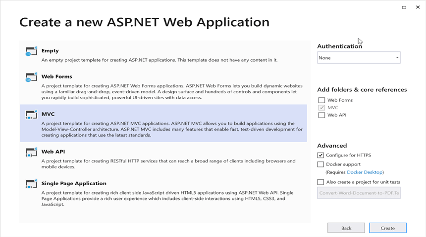
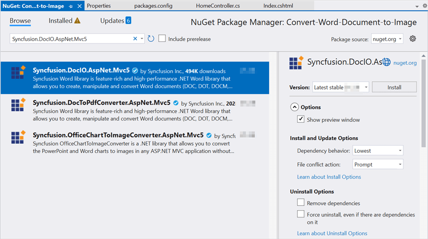

# Convert Word document to Image in ASP.NET MVC

Syncfusion Essential DocIO is a [.NET Word library](https://www.syncfusion.com/document-processing/word-framework/net/word-library) used to create, read, edit, and **convert Word documents** programmatically without **Microsoft Word** or interop dependencies. Using this library, you can **convert a Word document to Image in ASP.NET MVC**.

## Steps to convert Word document to Image in C#:

Step 1: Create a new ASP.NET Web Application  project.

Step 2: Select the MVC application

Step 3: Install the [Syncfusion.DocIO.AspNet.Mvc5](https://www.nuget.org/packages/Syncfusion.DocIO.AspNet.Mvc5) NuGet package as a reference to your project from [NuGet.org](https://www.nuget.org/).

N> Starting with v16.2.0.x, if you reference Syncfusion assemblies from trial setup or from the NuGet feed, you also have to add "Syncfusion.Licensing" assembly reference and include a license key in your projects. Please refer to this [link](https://help.syncfusion.com/common/essential-studio/licensing/overview) to know about registering Syncfusion license key in your application to use our components.

Step 4: Include the following namespace in that **HomeController.cs** file.





using Syncfusion.DocIO;
using Syncfusion.DocIO.DLS;





Step 5: A default action method named Index will be present in HomeController.cs. Right click on Index method and select **Go To View** where you will be directed to its associated view page **Index.cshtml**.

Step 6: Add a new button in the Index.cshtml as shown below.




@{
    Html.BeginForm("ConvertWordtoImage", "Home", FormMethod.Get);
    {
         
        

            <input type="submit" value="Convert Word to Image" style="width:200px;height:27px" />
        

    }
    Html.EndForm();
}





Step 7: Add the below code snippet in **HomeController.cs** to **convert the Word document to Image** and download it.





public void ConvertWordtoImage()
{
    //Open the file as Stream
    using (FileStream docStream = new FileStream(Server.MapPath("~/App_Data/Input.docx"), FileMode.Open, FileAccess.Read))
    {
        //Loads file stream into Word document
        using (WordDocument wordDocument = new WordDocument(docStream, FormatType.Docx))
        {                 
            //Convert the first page of the Word document into an image.
            Image image = wordDocument.RenderAsImages(0, ImageType.Bitmap);
            //Save the image as jpeg.           
            ExportAsImage(image, "wordtoimage.jpeg", ImageFormat.Jpeg, HttpContext.ApplicationInstance.Response);
        }
    }
}
//To download the image file
protected void ExportAsImage(Image image, string fileName, ImageFormat imageFormat, HttpResponse response)
{
    if (ControllerContext == null)
        throw new ArgumentNullException("Context");
    string disposition = "content-disposition";
    response.AddHeader(disposition, "attachment; filename=" + fileName);
    if (imageFormat != ImageFormat.Emf)
        image.Save(Response.OutputStream, imageFormat);
    Response.End();
}





You can download a complete working sample from [GitHub](https://github.com/SyncfusionExamples/DocIO-Examples/tree/main/Word-to-PDF-Conversion/Convert-Word-document-to-PDF/ASP.NET-MVC).

By executing the program, you will get the **Image** as follows.

