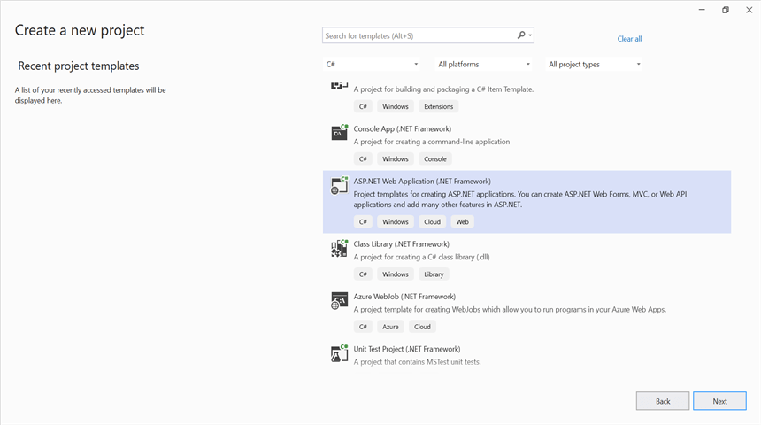
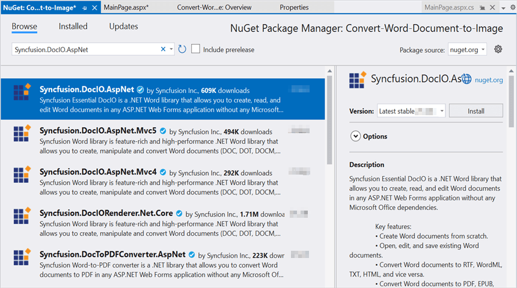
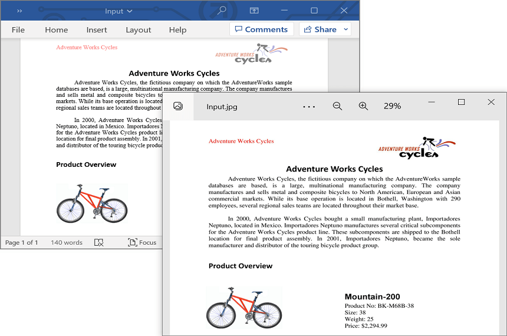

# Convert Word document to Image in ASP.NET

Syncfusion Essential DocIO is a [.NET Word library](https://www.syncfusion.com/document-processing/word-framework/net/word-library) used to used to create, read, edit, and **convert Word documents** programmatically without **Microsoft Word** or interop dependencies. Using this library, you can **convert a Word document to image in ASP.NET Web Forms**.

## Steps to convert Word document to Image in C#

Step 1: Create a new ASP.NET Web application project.

Step 2: Select the Empty project.

Step 3: Install the [Syncfusion.DocIO.AspNet](https://www.nuget.org/packages/Syncfusion.DocIO.AspNet) NuGet package as a reference to your project from [NuGet.org](https://www.nuget.org/).

N> Starting with v16.2.0.x, if you reference Syncfusion assemblies from trial setup or from the NuGet feed, you also have to add "Syncfusion.Licensing" assembly reference and include a license key in your projects. Please refer to this [link](https://help.syncfusion.com/common/essential-studio/licensing/overview) to know about registering Syncfusion license key in your application to use our components.

Step 4: Add a new Web Form in your project. Right click on the project and select **Add > New Item** and add a Web Form from the list. Name it as MainPage.

Step 5: Add a new button in the **MainPage.aspx** as shown below.





<%@ Page Language="C#" AutoEventWireup="true" CodeBehind="MainPage.aspx.cs" Inherits="Convert_Word_Document_to_Image.MainPage" %>

<!DOCTYPE html>
<html xmlns="http://www.w3.org/1999/xhtml">
<head runat="server">
<title></title>
</head>
<body>
    <form id="form1" runat="server">
        

             <asp:Button ID="Button1" runat="server" Text="Convert Word to Image" OnClick="OnButtonClicked" />
        

    </form>
</body>
</html>





Step 6: Include the following namespace in your **MainPage.aspx.cs** file.





using Syncfusion.DocIO;
using Syncfusion.DocIO.DLS;





Step 7: Include the below code snippet in the click event of the button in **MainPage.aspx.cs**, to **convert the Word document to image** and download it.





protected void OnButtonClicked(object sender, EventArgs e)
{
    //Open existing Word document.
    using (FileStream docStream = new FileStream(Server.MapPath("~/App_Data/Input.docx"), FileMode.Open, FileAccess.Read))
    {
        //Loads file stream into Word document
        using (WordDocument wordDocument = new WordDocument(docStream, FormatType.Docx))
        {
            //Convert the first page of the Word document into an image.
            System.Drawing.Image image = wordDocument.RenderAsImages(0, ImageType.Bitmap);
            //Save the image as jpeg.
            ExportAsImage(image, "WordToImage.Jpeg", ImageFormat.Jpeg, HttpContext.Current.Response);
        }
    }
}

//Download the image file
protected void ExportAsImage(System.Drawing.Image image, string fileName, ImageFormat imageFormat, HttpResponse response)
{
    string disposition = "content-disposition";
    response.AddHeader(disposition, "attachment; filename=" + fileName);
    if (imageFormat != ImageFormat.Emf)
        image.Save(Response.OutputStream, imageFormat);
    Response.End();
}





You can download a complete working sample from [GitHub](https://github.com/SyncfusionExamples/DocIO-Examples/tree/main/Word-to-Image-conversion/Convert-Word-to-image/ASP.NET).

By executing the program, you will get the **image** as follows.

Click [here](https://www.syncfusion.com/document-processing/word-framework/net) to explore the rich set of Syncfusion Word library (DocIO) features. 

An online sample link to [convert Word document to image](https://ej2.syncfusion.com/aspnetcore/Word/WordToImage#/material3) in ASP.NET Core. 