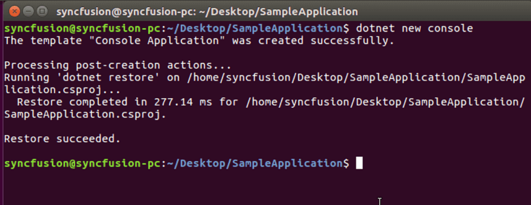

# Convert Word document to Image in Linux

Syncfusion DocIO is a [.NET Core Word library](https://www.syncfusion.com/document-processing/word-framework/net-core/word-library) used to create, read, edit, and **convert Word documents** programmatically without **Microsoft Word** or interop dependencies. Using this library, you can **convert a Word document to image in .NET Core application on Linux**.

## Steps to convert a Word document to Image in .NET Core application on Linux

Step 1: Execute the following command in **Linux terminal** to create a new .NET Core Console application.




dotnet new console




Step 2: Install the following **Nuget packages** in your application from [Nuget.org](https://www.nuget.org/) by execute the following command.

* [Syncfusion.DocIORenderer.Net.Core](https://www.nuget.org/packages/Syncfusion.DocIORenderer.Net.Core) 
* [SkiaSharp.NativeAssets.Linux v2.88.2](https://www.nuget.org/packages/SkiaSharp.NativeAssets.Linux/2.88.2)
* [HarfBuzzSharp.NativeAssets.Linux v2.8.2.2](https://www.nuget.org/packages/HarfBuzzSharp.NativeAssets.Linux/2.8.2.2)




dotnet add package Syncfusion.DocIORenderer.Net.Core -v 22.1.34 -s https://www.nuget.org/
dotnet add package SkiaSharp.NativeAssets.Linux -v 2.88.2 -s https://www.nuget.org/
dotnet add package HarfBuzzSharp.NativeAssets.Linux -v 2.8.2.2 -s https://www.nuget.org/




N> Starting with v16.2.0.x, if you reference Syncfusion assemblies from trial setup or from the NuGet feed, you also have to add "Syncfusion.Licensing" assembly reference and include a license key in your projects. Please refer to this [link](https://help.syncfusion.com/common/essential-studio/licensing/overview) to know about registering Syncfusion license key in your applications to use our components.

Step 3: Add the following Namespaces in **Program.cs** file.




using Syncfusion.DocIO;
using Syncfusion.DocIO.DLS;
using Syncfusion.DocIORenderer;




Step 4: Add the following code snippet in **Program.cs** file.




//Open the file as Stream
using (FileStream docStream = new FileStream("Data/Input.docx", FileMode.Open, FileAccess.Read))
{
    //Loads an existing Word document
    using (WordDocument wordDocument = new WordDocument(docStream, FormatType.Docx))
    {
        //Instantiation of DocIORenderer for Word to image conversion
        using (DocIORenderer render = new DocIORenderer())
        {
            //Convert the first page of the Word document into an image.
            Stream imageStream = wordDocument.RenderAsImages(0, ExportImageFormat.Jpeg);
            //Reset the stream position.
            imageStream.Position = 0;
            //Create FileStream to save the image file.
            using (FileStream fileStreamOutput = new FileStream("WordToImage.Jpeg", FileMode.Create, FileAccess.ReadWrite, FileShare.ReadWrite))
            {
                imageStream.CopyTo(fileStreamOutput);
            }
        }
    }
}




Step 5: Execute the following command to **restore** the NuGet packages.




dotnet restore




Step 6: Execute the following command in **terminal** to **run the application**.




dotnet run




You can download a complete working sample from [GitHub](https://github.com/SyncfusionExamples/DocIO-Examples/tree/main/Word-to-Image-conversion/Convert-Word-to-image/Linux/Convert-Word-Document-to-Image).

By executing the program, you will get the **image** as follows. The output will be saved in parallel to program.cs file.

Click [here](https://www.syncfusion.com/document-processing/word-framework/net-core) to explore the rich set of Syncfusion Word library (DocIO) features. 

An online sample link to [convert Word document to image](https://ej2.syncfusion.com/aspnetcore/Word/WordToImage#/material3) in ASP.NET Core.