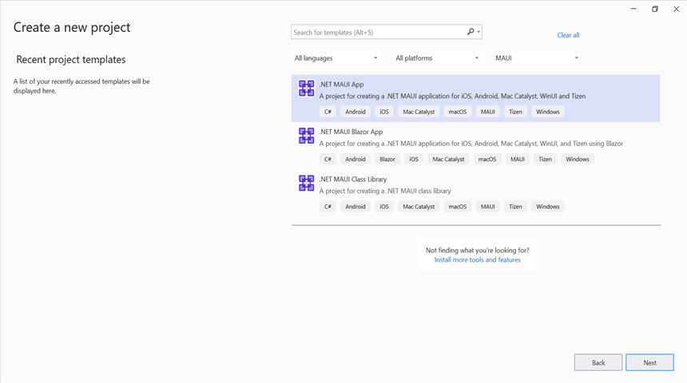
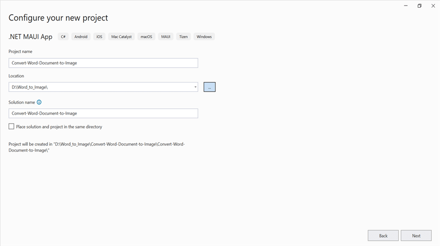
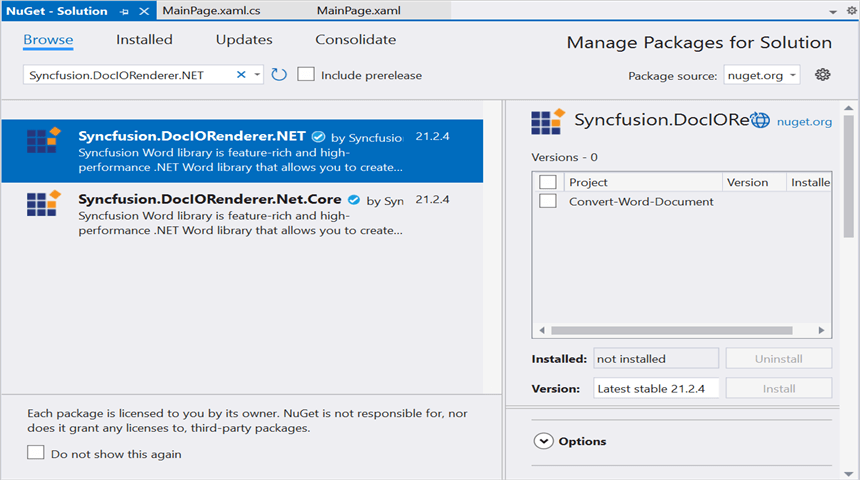

# Convert Word document to Image in .NET MAUI

Syncfusion DocIO is a [.NET MAUI Word library](https://www.syncfusion.com/document-processing/word-framework/maui/word-library) used to create, read, edit, and **convert Word documents** programmatically without **Microsoft Word** or interop dependencies. Using this library, you can **convert a Word document to image in .NET MAUI**.

## Prerequisites

To create .NET Multi-platform App UI (.NET MAUI) apps, you need the latest versions of Visual Studio 2022 and .NET 6. For more details, refer [here](https://learn.microsoft.com/en-us/dotnet/maui/get-started/installation?view=net-maui-7.0&tabs=vswin).

## Steps to convert Word document to Image in .NET MAUI

Step 1: Create a new C# .NET MAUI app. Select **.NET MAUI App** from the template and click the **Next** button.

Step 2: Enter the project name and click **Create**.

Step 3: Install the [Syncfusion.DocIORenderer.NET](https://www.nuget.org/packages/Syncfusion.DocIORenderer.NET) NuGet package as a reference to your project from [NuGet.org](https://www.nuget.org/).

N> Starting with v16.2.0.x, if you reference Syncfusion assemblies from trial setup or from the NuGet feed, you also have to add "Syncfusion.Licensing" assembly reference and include a license key in your projects. Please refer to this [link](https://help.syncfusion.com/common/essential-studio/licensing/overview) to know about registering a Syncfusion license key in your application to use our components.

Step 4: Add a new button to the **MainPage.xaml** as shown below.





<?xml version="1.0" encoding="utf-8" ?>
<ContentPage xmlns="http://schemas.microsoft.com/dotnet/2021/maui"
             xmlns:x="http://schemas.microsoft.com/winfx/2009/xaml"
             x:Class="Convert_Word_Document_to_Image.MainPage">
    <ScrollView>
        <Grid RowSpacing="25" RowDefinitions="Auto,Auto,Auto,Auto,*"
            Padding="{OnPlatform iOS='30,60,30,30', Default='30'}">
            <Button 
                Text="Convert Word Document to Image"
                FontAttributes="Bold"
                Grid.Row="0"
                SemanticProperties.Hint="Convert Word Document to Image"
                Clicked="ConvertWordtoImage"
                HorizontalOptions="Center" />
        </Grid>
    </ScrollView>
</ContentPage>





Step 5: Include the following namespaces in the **MainPage.xaml.cs** file.





using Syncfusion.DocIO;
using Syncfusion.DocIO.DLS;
using Syncfusion.DocIORenderer;





Step 6: Add a new action method **ConvertWordtoImage** in MainPage.xaml.cs and include the below code snippet to **convert a Word document to image**.





//Loading an existing Word document
Assembly assembly = typeof(App).GetTypeInfo().Assembly;
using (WordDocument document = new WordDocument(assembly.GetManifestResourceStream("Convert_Word_Document_to_Image.Template.Input.docx"), FormatType.Docx))
{
    //Instantiation of DocIORenderer for Word to image conversion
    using (DocIORenderer render = new DocIORenderer())
    {
        //Convert the first page of the Word document into an image.
        Stream imageStream = document.RenderAsImages(0, ExportImageFormat.Jpeg);
        //Reset the stream position.
        imageStream.Position = 0;
        //save and Launch the image 
        SaveService saveService = new();
        saveService.SaveAndView("WordToImage.Jpeg", "application/jpeg", imageStream as MemoryStream);
    }
}





You can download a complete working sample from [GitHub](https://github.com/SyncfusionExamples/DocIO-Examples/tree/main/Word-to-Image-conversion/Convert-Word-to-image/.NET-MAUI).

By executing the program, you will get the **image** as follows.

## Helper files for .NET MAUI

Refer the below helper files and add them into the mentioned project. These helper files allow you to save the stream as a physical file and open the file for viewing.

<table>
  <tr>
  <td>
    <b>Folder Name</b>
  </td>
  <td>
    <b>File Name</b>
  </td>
  <td>
    <b>Summary</b>
  </td>
  </tr>
  <tr>
  <td>
    {{'[.NET MAUI Project](https://github.com/SyncfusionExamples/DocIO-Examples/tree/main/Word-to-Image-conversion/Convert-Word-to-image/.NET-MAUI/Convert-Word-Document-to-Image)'| markdownify }}
  </td>
  <td>
    {{'[SaveService.cs](https://github.com/SyncfusionExamples/DocIO-Examples/blob/main/Word-to-Image-conversion/Convert-Word-to-image/.NET-MAUI/Convert-Word-Document-to-Image/SaveServices/SaveService.cs)'| markdownify }}
  </td>
  <td>Represent the base class for save operation.
  </td>
  </tr>
  <tr>
  <td>
    {{'[Windows](https://github.com/SyncfusionExamples/DocIO-Examples/tree/main/Word-to-Image-conversion/Convert-Word-to-image/.NET-MAUI/Convert-Word-Document-to-Image/Platforms/Windows)'| markdownify }}
  </td>
  <td>
    {{'[SaveWindows.cs](https://github.com/SyncfusionExamples/DocIO-Examples/blob/main/Word-to-Image-conversion/Convert-Word-to-image/.NET-MAUI/Convert-Word-Document-to-Image/Platforms/Windows/SaveWindows.cs)'| markdownify }}
  </td>
  <td>Save implementation for Windows.
  </td>
  </tr>
  <tr>
  <td>
    {{'[Android](https://github.com/SyncfusionExamples/DocIO-Examples/tree/main/Word-to-Image-conversion/Convert-Word-to-image/.NET-MAUI/Convert-Word-Document-to-Image/Platforms/Android)'| markdownify }}
  </td>
  <td>
    {{'[SaveAndroid.cs](https://github.com/SyncfusionExamples/DocIO-Examples/blob/main/Word-to-Image-conversion/Convert-Word-to-image/.NET-MAUI/Convert-Word-Document-to-Image/Platforms/Android/SaveAndroid.cs)'| markdownify }}
  </td>
  <td>Save implementation for Android device.
  </td>
  </tr>
  <tr>
  <td>
    {{'[Mac Catalyst](https://github.com/SyncfusionExamples/DocIO-Examples/tree/main/Word-to-Image-conversion/Convert-Word-to-image/.NET-MAUI/Convert-Word-Document-to-Image/Platforms/MacCatalyst)'| markdownify }}
  </td>
  <td>
    {{'[SaveMac.cs](https://github.com/SyncfusionExamples/DocIO-Examples/blob/main/Word-to-Image-conversion/Convert-Word-to-image/.NET-MAUI/Convert-Word-Document-to-Image/Platforms/MacCatalyst/SaveMac.cs)'| markdownify }}
  </td>
  <td>Save implementation for Mac Catalyst device.
  </td>
  </tr>
  <tr>
  <td rowspan="2">
    {{'[iOS](https://github.com/SyncfusionExamples/DocIO-Examples/tree/main/Word-to-Image-conversion/Convert-Word-to-image/.NET-MAUI/Convert-Word-Document-to-Image/Platforms/iOS)'| markdownify }}
  </td>
  <td>
    {{'[SaveIOS.cs](https://github.com/SyncfusionExamples/DocIO-Examples/blob/main/Word-to-Image-conversion/Convert-Word-to-image/.NET-MAUI/Convert-Word-Document-to-Image/Platforms/iOS/SaveIOS.cs)'| markdownify }}
  </td>
  <td>
    Save implementation for iOS device
  </td>
  </tr>
  <tr>
  <td>
    {{'[PreviewControllerDS.cs](https://github.com/SyncfusionExamples/DocIO-Examples/blob/main/Word-to-Image-conversion/Convert-Word-to-image/.NET-MAUI/Convert-Word-Document-to-Image/Platforms/iOS/PreviewControllerDS.cs)'| markdownify }} {{'[QLPreviewItemFileSystem.cs](https://github.com/SyncfusionExamples/DocIO-Examples/blob/main/Word-to-Image-conversion/Convert-Word-to-image/.NET-MAUI/Convert-Word-Document-to-Image/Platforms/iOS/QLPreviewItemFileSystem.cs)'| markdownify }}
  </td>
  <td>
    Helper classes for viewing the <b>Word document</b> in iOS device
  </td>
  </tr>
</table>
