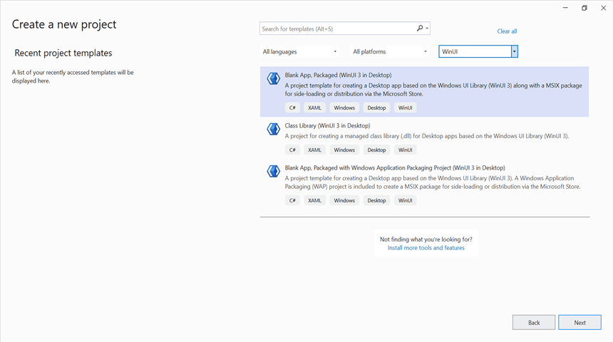
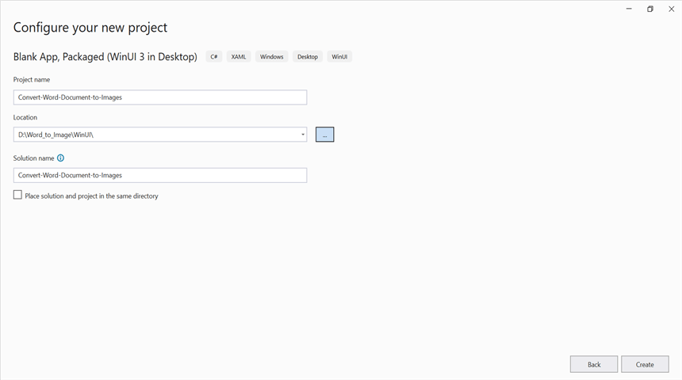
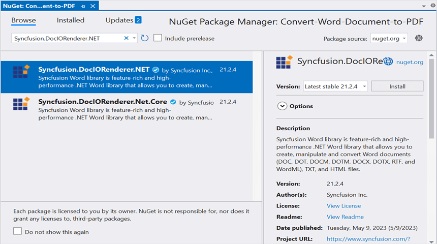

# Convert Word document to Image in WinUI

Syncfusion DocIO is a [WinUI Word library](https://www.syncfusion.com/document-processing/word-framework/winui/word-library) used to create, read, edit, and **convert Word documents** programmatically without **Microsoft Word** or interop dependencies. Using this library, you can **convert Word document to Image in WinUI**.

**Prerequisites:**
To use the WinUI 3 project templates, install the Windows App SDK extension for Visual Studio. For more details, refer [here](https://learn.microsoft.com/en-us/windows/apps/windows-app-sdk/set-up-your-development-environment?tabs=cs-vs-community%2Ccpp-vs-community%2Cvs-2022-17-1-a%2Cvs-2022-17-1-b).

## WinUI Desktop app

Step 1: Create a new C# WinUI Desktop app. Select Blank App, Packaged with WAP (WinUI 3 in Desktop) from the template and click the **Next** button.

Step 2: Enter the project name and click **Create**.

Step 4: Install [Syncfusion.DocIORenderer.NET](https://www.nuget.org/packages/Syncfusion.DocIORenderer.NET) NuGet package as a reference to your WinUI Desktop application from the [NuGet.org](https://www.nuget.org/).

N> Starting with v16.2.0.x, if you reference Syncfusion assemblies from trial setup or from the NuGet feed, you also have to add "Syncfusion.Licensing" assembly reference and include a license key in your projects. Please refer to this [link](https://help.syncfusion.com/common/essential-studio/licensing/overview) to know about registering a Syncfusion license key in your application to use our components.

Step 5: Add a new button to the **MainWindow.xaml** as shown below.





<Window
    x:Class="Convert_Word_Document_to_Image.MainWindow"
    xmlns="http://schemas.microsoft.com/winfx/2006/xaml/presentation"
    xmlns:x="http://schemas.microsoft.com/winfx/2006/xaml"
    xmlns:local="using:Convert_Word_Document_to_Image"
    xmlns:d="http://schemas.microsoft.com/expression/blend/2008"
    xmlns:mc="http://schemas.openxmlformats.org/markup-compatibility/2006"
    mc:Ignorable="d">

    <StackPanel Orientation="Horizontal" HorizontalAlignment="Center" VerticalAlignment="Center">
        <Button x:Name="button" Click="ConvertWordtoImage">Convert Word to Image</Button>
    </StackPanel>
</Window>





Step 6: Include the following namespaces in the **MainWindow.xaml.cs** file.





using Syncfusion.DocIO;
using Syncfusion.DocIO.DLS;
using Syncfusion.DocIORenderer;





Step 7: Add a new action method **ConvertWordtoImage** in MainWindow.xaml.cs and include the below code snippet to **convert the Word document to Image**.





//Loading an existing Word document
Assembly assembly = typeof(App).GetTypeInfo().Assembly;
using (WordDocument document = new WordDocument(assembly.GetManifestResourceStream("Convert_Word_Document_to_Image.Assets.Input.docx"), FormatType.Docx))
{
    //Instantiation of DocIORenderer for Word to Image conversion
    using (DocIORenderer render = new DocIORenderer())
    {
        //Convert the first page of the Word document into an image.
        Stream imageStream = document.RenderAsImages(0, ExportImageFormat.Jpeg);
        //Reset the stream position.
        imageStream.Position = 0;
        // Saves and launch the file.
        SaveHelper.SaveAndLaunch("WordToImage.Jpeg", imageStream as MemoryStream);
    }
}





## Save Image in WinUI





/// 

/// Saves and launch the file.
/// 

/// <param name="filename">File name.</param>
/// <param name="stream">Stream to save.</param>
public static async void SaveAndLaunch(string filename, MemoryStream stream)
{
    StorageFile storageFile;
    string extension = Path.GetExtension(filename);
    //Gets process windows handle to open the dialog in application process.
    IntPtr windowHandle = System.Diagnostics.Process.GetCurrentProcess().MainWindowHandle;
    if (!Windows.Foundation.Metadata.ApiInformation.IsTypePresent("Windows.Phone.UI.Input.HardwareButtons"))
    {
        FileSavePicker savePicker = new();
        if (extension == ".Jpeg")
        {
            savePicker.DefaultFileExtension = ".jpeg";
            savePicker.SuggestedFileName = filename;
            //Saves the file as image file.
            savePicker.FileTypeChoices.Add("JPEG", new List<string>() { ".jpeg" });
        }

        WinRT.Interop.InitializeWithWindow.Initialize(savePicker, windowHandle);
        storageFile = await savePicker.PickSaveFileAsync();
    }
    else
    {
        StorageFolder local = ApplicationData.Current.LocalFolder;
        storageFile = await local.CreateFileAsync(filename, CreationCollisionOption.ReplaceExisting);
    }
    if (storageFile != null)
    {
        try
        {
            using (IRandomAccessStream zipStream = await storageFile.OpenAsync(FileAccessMode.ReadWrite))
            {
                //Writes compressed data from memory to file.
                using Stream outstream = zipStream.AsStreamForWrite();
                outstream.SetLength(0);
                byte[] buffer = stream.ToArray();
                outstream.Write(buffer, 0, buffer.Length);
                outstream.Flush();
            }
            //Creates message dialog box. 
            MessageDialog msgDialog = new("Do you want to view the Image?", "File has been created successfully");
            UICommand yesCmd = new("Yes");
            msgDialog.Commands.Add(yesCmd);
            UICommand noCmd = new("No");
            msgDialog.Commands.Add(noCmd);

            WinRT.Interop.InitializeWithWindow.Initialize(msgDialog, windowHandle);

            //Showing a dialog box. 
            IUICommand cmd = await msgDialog.ShowAsync();
            if (cmd.Label == yesCmd.Label)
            {
                if (extension == ".md")
                {
                    Windows.System.LauncherOptions options = new Windows.System.LauncherOptions();
                    options.DisplayApplicationPicker = true;
                    // Launch the file with "Open with" option.
                    await Windows.System.Launcher.LaunchFileAsync(storageFile, options);
                }
                else
                    //Launch the saved file. 
                    await Windows.System.Launcher.LaunchFileAsync(storageFile);
            }
        }
        catch (Exception ex)
        {
            if (ex.Message.Contains("Access is denied."))
            {
                //Creates message dialog box.
                MessageDialog msgDialogBox = new("Access to the given path is denied. Please enable permission to save the file in that folder or save the file in another location.", "Access Denied");
                UICommand okCmd = new("Ok");
                msgDialogBox.Commands.Add(okCmd);
                WinRT.Interop.InitializeWithWindow.Initialize(msgDialogBox, windowHandle);
                //Showing a dialog box. 
                IUICommand msgCmd = await msgDialogBox.ShowAsync();
            }
        }
    }
}





You can download a complete working sample from [GitHub](https://github.com/SyncfusionExamples/DocIO-Examples/tree/main/Word-to-Image-conversion/Convert-Word-to-image/WinUI).

By executing the program, you will get the **Image** as follows.

