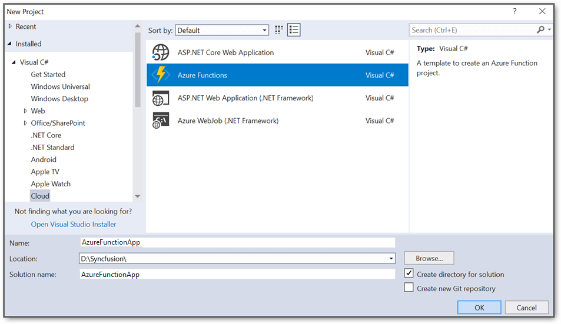
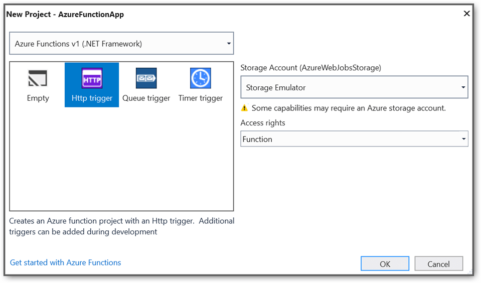
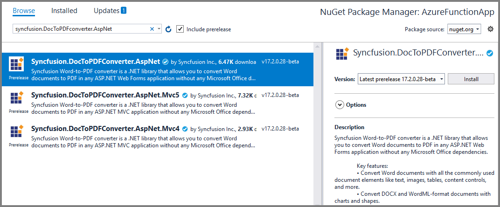
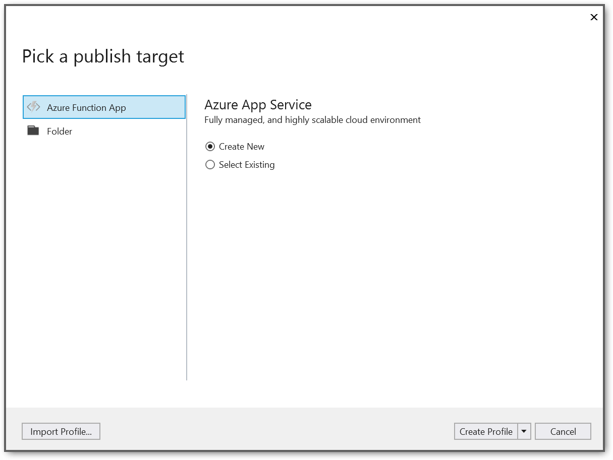
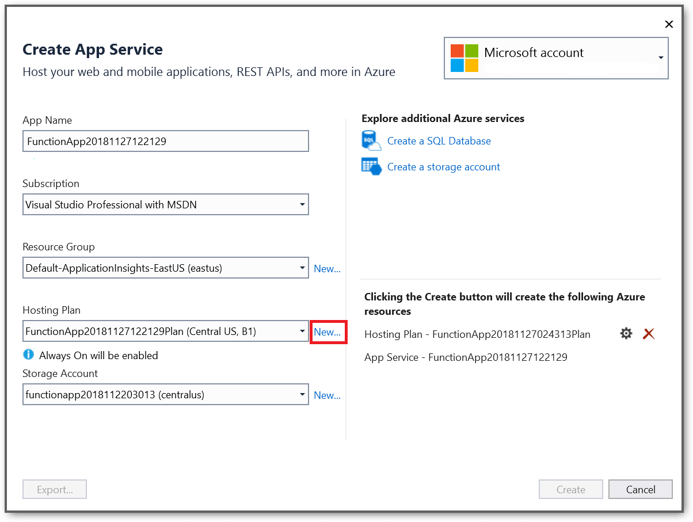
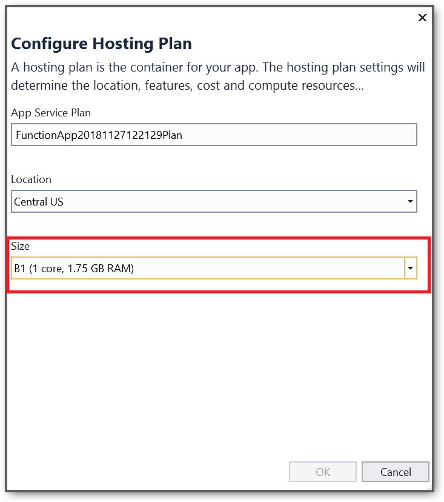
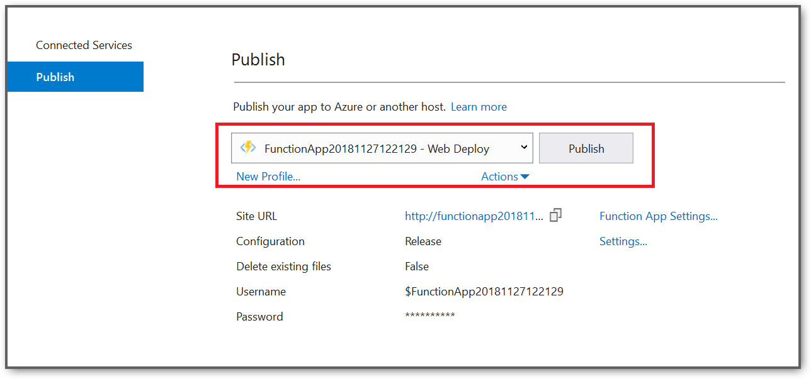
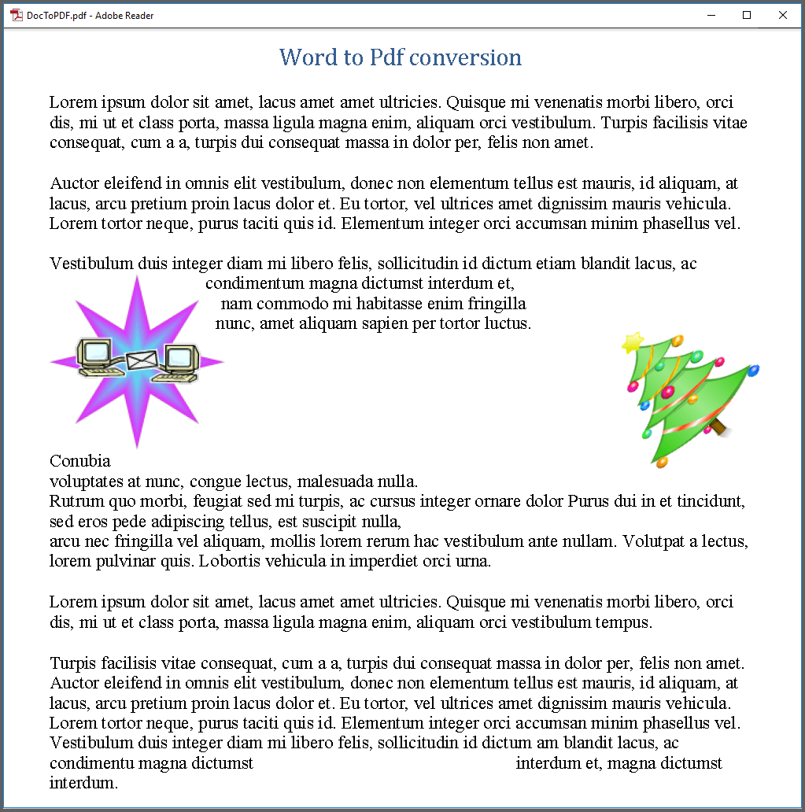

# Convert Word to PDF conversion in Azure Functions v1

Syncfusion  DocIO is a [.NET Word library](https://www.syncfusion.com/document-processing/word-framework/net/word-library) used to create, read, and edit **Word** documents programmatically without **Microsoft Word** or interop dependencies. Using this library, you can perform **Word to PDF conversion in Azure functions**

## Steps to perform Word to PDF conversion in Azure functions:

Step 1: Create a new Azure functions project.

Step 2: Select framework **Azure Functions v1 (.NET Framework)** and select HTTP trigger as follows.

Step 3: Install the [Syncfusion.DocToPDFConverter.AspNet](https://www.nuget.org/packages/Syncfusion.DocToPDFConverter.AspNet) NuGet package as a reference to your project from [NuGet.org](https://www.nuget.org/).

Step 4: Include the following namespaces in the **Function1.cs** file.



using Syncfusion.DocIO;
using Syncfusion.DocIO.DLS;
using Syncfusion.DocToPDFConverter;
using Syncfusion.Pdf;




Step 5: Add the following code snippet in **Run** method of **Function1** class to perform **Word to PDF conversion** in Azure functions and return the resultant **PDF document** to client end.




//Gets the input Word document as stream from request
Stream stream = req.Content.ReadAsStreamAsync().Result;
//Loads an existing Word document
WordDocument document = new WordDocument(stream);
//Creates an instance of the DocToPDFConverter
DocToPDFConverter converter = new DocToPDFConverter();
//Converts Word document into PDF document
PdfDocument pdfDocument = converter.ConvertToPDF(document);
//Releases the resources occupied by DocToPDFConverter instance
converter.Dispose();
//Closes the Word document
document.Close();
MemoryStream memoryStream = new MemoryStream();
//Saves the PDF file 
pdfDocument.Save(memoryStream);
//Closes the PDF document
pdfDocument.Close();
//Reset the memory stream position
memoryStream.Position = 0;
//Create the response to return
HttpResponseMessage response = new HttpResponseMessage(HttpStatusCode.OK);
//Set the Word document saved stream as content of response
response.Content = new ByteArrayContent(memoryStream.ToArray());
//Set the contentDisposition as attachment
response.Content.Headers.ContentDisposition = new ContentDispositionHeaderValue("attachment")
{
    FileName = "DocToPDF.Pdf"
};
//Set the content type as Word document mime type
response.Content.Headers.ContentType = new System.Net.Http.Headers.MediaTypeHeaderValue("application/pdf");
//Return the response with output Word document stream
return response;




Step 6: Right-click the project and select **Publish**. Then, create a new profile in the Publish Window.

Step 7: Create an App service using Azure subscription and select a hosting plan.

Step 8: The Syncfusion DocIO library works from basic hosting plan (B1). So, select the required hosting plan.

Step 9: After creating the profile, click the Publish button.

Step 10: Now, go to Azure portal and select the App Services. After running the service, click **Get function URL by copying it**. Then, paste it in the below client sample (which will request the Azure Function, to perform **Word to PDF conversion** using the template Word document). You will get the output PDF document as follows.

A complete sample to perform **Word to PDF conversion** in Azure Functions can be downloaded from [Word to PDF conversion in Azure Functions.zip](https://www.syncfusion.com/downloads/support/directtrac/general/ze/AzureFunctionApp-wordtopdf146526823?_gl=1*rei06r*_ga*NTA2MDIxMjkzLjE2NzI3MzYzODM.*_ga_WC4JKKPHH0*MTY4NDIzOTEyNi4xMTcuMS4xNjg0MjQyNTY3LjQ2LjAuMA..)

## Steps to post the request to Azure functions with template Word document:

Step 1: Create a console application to request the Azure functions API.

Step 2: Add the following code snippet into **Main** method to post the request to Azure functions with template Word document and get the resultant PDF document.




//Reads the template Word document.
FileStream fs = new FileStream(@"../../Data/DoctoPDF.docx", FileMode.Open, FileAccess.ReadWrite, FileShare.ReadWrite);
fs.Position = 0;
//Saves the Word document in memory stream.
MemoryStream inputStream = new MemoryStream();
fs.CopyTo(inputStream);
inputStream.Position = 0;
try
{
    Console.WriteLine("Please enter your Azure Functions URL :");
    string functionURL = Console.ReadLine();
    //Create HttpWebRequest with hosted azure functions URL.    
    HttpWebRequest req = (HttpWebRequest)WebRequest.Create(functionURL);
    //Set request method as POST
    req.Method = "POST";
    //Get the request stream to save the Word document stream
    Stream stream = req.GetRequestStream();
    //Write the Word document stream into request stream
    stream.Write(inputStream.ToArray(), 0, inputStream.ToArray().Length);
    //Gets the responce from the Azure Functions.
    HttpWebResponse res = (HttpWebResponse)req.GetResponse();
    //Saves the PDF document stream.
    FileStream fileStream = File.Create("DocToPDF.pdf");
    res.GetResponseStream().CopyTo(fileStream);
    //Dispose the streams
    inputStream.Dispose();
    fileStream.Dispose();
}
catch (Exception ex)
{
    throw;
}




A console application to post the request to Azure functions can be downloaded from [WordToPDF.zip](https://www.syncfusion.com/downloads/support/directtrac/general/ze/WordToPDF-1430681677?_gl=1*1c97w5z*_ga*NTA2MDIxMjkzLjE2NzI3MzYzODM.*_ga_WC4JKKPHH0*MTY4NDIzOTEyNi4xMTcuMS4xNjg0MjQyNTY3LjQ2LjAuMA..)

Take a moment to peruse the [documentation](https://help.syncfusion.com/file-formats/docio/getting-started), where you can find basic Word document processing options along with features like [mail merge](https://help.syncfusion.com/file-formats/docio/working-with-mail-merge), [merge](https://help.syncfusion.com/file-formats/docio/word-document/merging-word-documents) and [split](https://help.syncfusion.com/file-formats/docio/word-document/split-word-documents) documents, [find and replace](https://help.syncfusion.com/file-formats/docio/working-with-find-and-replace) text in the Word document, [protect](https://help.syncfusion.com/file-formats/docio/working-with-security) the Word documents, and most importantly [PDF](https://help.syncfusion.com/file-formats/docio/word-to-pdf) and [Image](https://help.syncfusion.com/file-formats/docio/word-to-image) conversions with code examples.

Explore more about the rich set of Syncfusion [Word Framework](https://www.syncfusion.com/word-framework) features.

N> Starting with v16.2.0.x, if you reference Syncfusion assemblies from trial setup or from the NuGet feed, include a license key in your projects. Refer to [link](https://help.syncfusion.com/common/essential-studio/licensing/overview) to learn about generating and registering Syncfusion license key in your application to use the components without trail message.