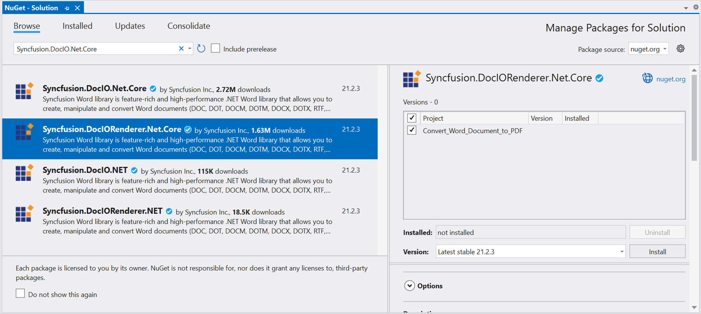

# Convert Word document to PDF in ASP.NET Core

Syncfusion Essential DocIO is a [.NET Core Word library](https://www.syncfusion.com/document-processing/word-framework/net-core/word-library) used to create, read, edit, and **convert Word documents** programmatically without **Microsoft Word** or interop dependencies. Using this library, you can **convert a Word document to PDF in ASP.NET Core**.

## Steps to convert word document to PDF in C#:

Step 1: Create a new ASP.NET Core Web application (Model-View-Controller) project.

Step 2: Install the [Syncfusion.DocIORenderer.Net.Core](https://www.nuget.org/packages/Syncfusion.DocIORenderer.Net.Core) NuGet package as a reference to your project from [NuGet.org](https://www.nuget.org/).

N> Starting with v16.2.0.x, if you reference Syncfusion assemblies from trial setup or from the NuGet feed, you also have to add "Syncfusion.Licensing" assembly reference and include a license key in your projects. Please refer to this [link](https://help.syncfusion.com/common/essential-studio/licensing/overview) to know about registering Syncfusion license key in your application to use our components.

Step 3: Include the following namespaces in the HomeController.cs file.





using Syncfusion.DocIO;
using Syncfusion.DocIO.DLS;
using Syncfusion.DocIORenderer;
using Syncfusion.Pdf;





Step 5: A default action method named Index will be present in HomeController.cs. Right click on Index method and select **Go To View** where you will be directed to its associated view page **Index.cshtml**.

Step 6: Add a new button in the Index.cshtml as shown below.





@{Html.BeginForm("ConvertWordtoPDF", "Home", FormMethod.Get);
{

    <input type="submit" value="Convert Word Document to PDF" style="width:220px;height:27px" />

}
Html.EndForm();
}





Step 7: Add a new action method **ConvertWordDocumentToPdf** in HomeController.cs and include the below code snippet to **convert the Word document to Pdf** and download it.





//Open the file as Stream
using (FileStream docStream = new FileStream(Path.GetFullPath("Data/Template.docx"), FileMode.Open, FileAccess.Read))
{
    //Loads file stream into Word document
    using (WordDocument wordDocument = new WordDocument(docStream, FormatType.Automatic))
    {
        //Instantiation of DocIORenderer for Word to PDF conversion
        using (DocIORenderer render = new DocIORenderer())
        {
            //Converts Word document into PDF document
            PdfDocument pdfDocument = render.ConvertToPDF(wordDocument);

            //Saves the PDF document to MemoryStream.
            MemoryStream stream = new MemoryStream();
            pdfDocument.Save(stream);
            stream.Position = 0;

            //Download PDF document in the browser.
            return File(stream, "application/pdf", "Sample.pdf");
        }
    }
}





You can download a complete working sample from [GitHub](https://github.com/SyncfusionExamples/DocIO-Examples/tree/main/Word-to-PDF-Conversion/Convert-Word-document-to-PDF/ASP.NET-Core).

By executing the program, you will get the **PDF document** as follows.

