# Convert Word to PDF in Azure App Service on Linux

Syncfusion DocIO is a [.NET Core Word library](https://www.syncfusion.com/document-processing/word-framework/net-core/word-library) used to create, read, edit and **convert Word documents** programmatically without **Microsoft Word** or interop dependencies. Using this library, you can **convert a Word document to PDF in Azure App service on Linux**.

## Steps to convert Word document to PDF in Azure App Service on Linux

Step 1: Create a new ASP.NET Core Web App (Model-View-Controller).

Step 2: Create a project name and select the location.
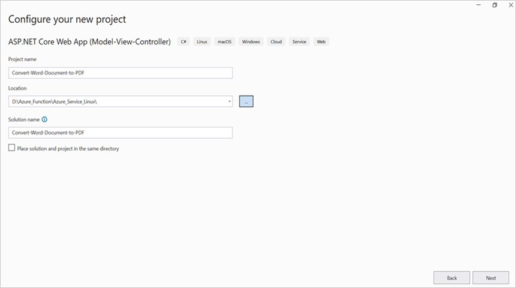

Step 3: Click **Create** button.
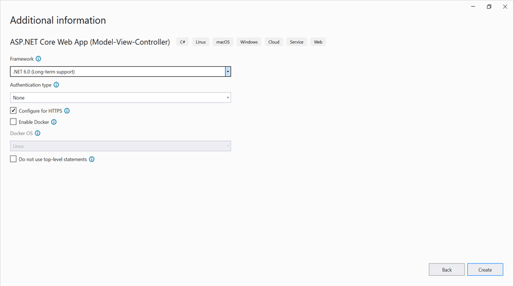

Step 4: Install the following **Nuget packages** in your application from [Nuget.org](https://www.nuget.org/).

* [Syncfusion.DocIORenderer.Net.Core](https://www.nuget.org/packages/Syncfusion.DocIORenderer.Net.Core) 
* [SkiaSharp.NativeAssets.Linux v2.88.2](https://www.nuget.org/packages/SkiaSharp.NativeAssets.Linux)

 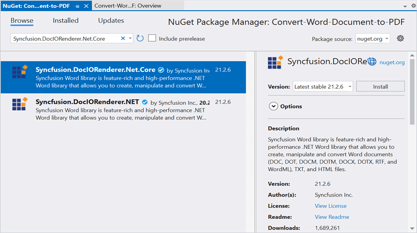
 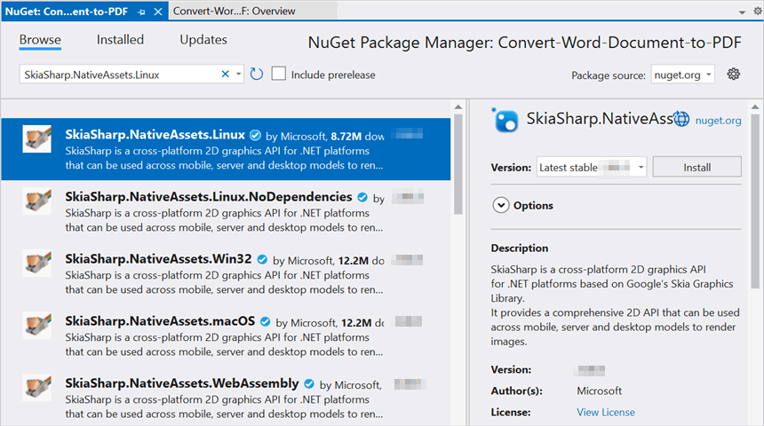

Step 5: Add a new button in the **Index.cshtml** as shown below.




@{Html.BeginForm("WordToPDF", "Home", FormMethod.Post, new { enctype = "multipart/form-data" });
 
{
    

        

            

                This sample illustrates how to convert Word document to PDF using .NET Word library (DocIO) and .NET PDF library (PDF).
            

            &nbsp;
            

            Click the button to view the resultant PDF document being converted from Word document using DocIO. Please note that PDF viewer is required to view the resultant PDF.
                    

                        

                            Select Document :
                            @Html.TextBox("file", "", new { type = "file", accept = ".docx" })  
                        

                    

                            <input class="buttonStyle" type="submit" value="Convert to PDF" name="button" style="width:150px;height:27px" />
                             
                            

                                @ViewBag.Message
                            

                    

                

            

             
        

    

    Html.EndForm();
    }
}




Step 6: Include the following namespaces in **HomeController.cs**.





using Syncfusion.DocIO;
using Syncfusion.DocIO.DLS;
using Syncfusion.DocIORenderer;
using Syncfusion.Pdf;





Step 7: Include the below code snippet in **HomeController.cs** for **convert the Word document to Pdf**.





private Microsoft.AspNetCore.Hosting.IHostingEnvironment _env;
public HomeController(Microsoft.AspNetCore.Hosting.IHostingEnvironment env)
{
    _env = env;
}
/// 

/// Convert Word document to PDF
/// 

/// <param name="button"></param>
/// <returns></returns>
public IActionResult WordToPDF(string button)
{
    if (button == null)
        return View("Index");

    if (Request.Form.Files != null)
    {
        if (Request.Form.Files.Count == 0)
        {
            ViewBag.Message = string.Format("Browse a Word document and then click the button to convert as a PDF document");
            return View("Index");
        }
        // Gets the extension from file.
        string extension = Path.GetExtension(Request.Form.Files[0].FileName).ToLower();
        // Compares extension with supported extensions.
        if (extension == ".docx")
        {
            MemoryStream stream = new MemoryStream();
            Request.Form.Files[0].CopyTo(stream);
            try
            {
                //Open using Syncfusion
                using (WordDocument document = new WordDocument(stream, FormatType.Docx))
                {
                    stream.Dispose();                         
                    // Creates a new instance of DocIORenderer class.
                    using (DocIORenderer render = new DocIORenderer())
                    {
                        // Converts Word document into PDF document
                        using (PdfDocument pdf = render.ConvertToPDF(document))
                        {                                                                     
                            MemoryStream memoryStream = new MemoryStream();
                            // Save the PDF document
                            pdf.Save(memoryStream);
                            memoryStream.Position = 0;                       
                            return File(memoryStream, "application/pdf", "WordToPDF.pdf");
                        }                                                           
                    } 
                }                                                
            }
            catch (Exception ex)
            {
                ViewBag.Message = ex.ToString();
            }
        }
        else
        {
            ViewBag.Message = string.Format("Please choose Word format document to convert to PDF");
        }
    }
    else
    {
        ViewBag.Message = string.Format("Browse a Word document and then click the button to convert as a PDF document");
    }
    return View("Index");
}      





## Steps to publish as Azure App Service on Linux

Step 1: Right-click the project and select **Publish** option.
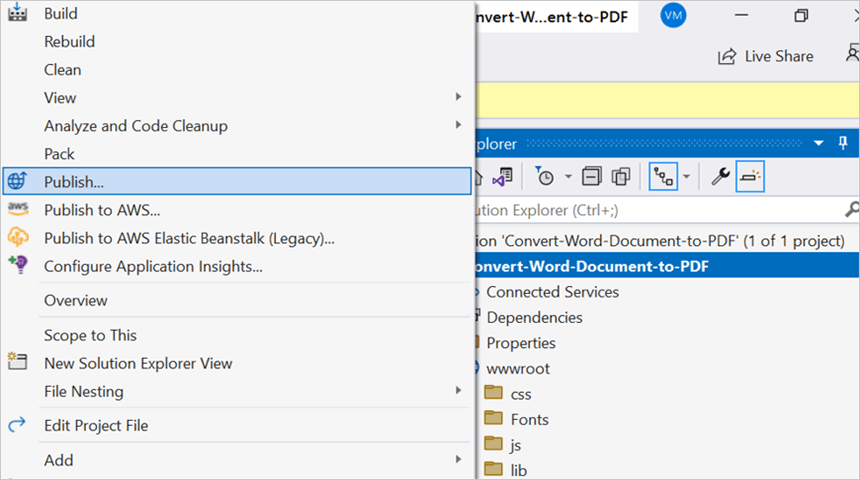

Step 2: Click the **Add a Publish Profile** button.
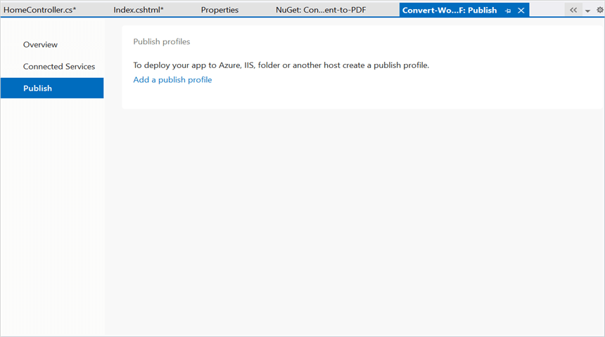

Step 3: Select the publish target as **Azure**.
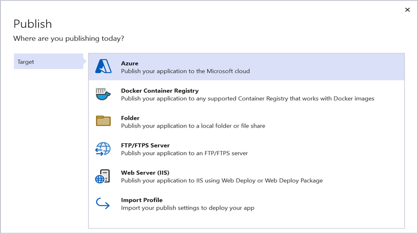

Step 4: Select the Specific target as **Azure App Service (Linux)**.
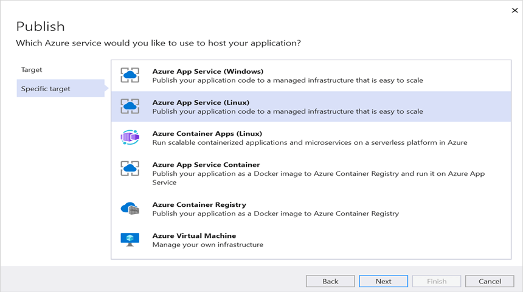

Step 5: To create a new app service, click **Create new** option.

Step 6: Click the **Create** button to proceed with **App Service** creation.
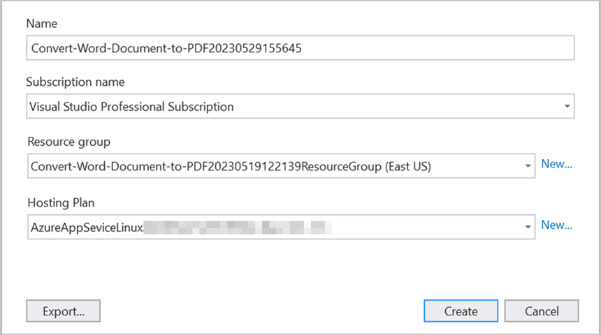

Step 7: Click the **Finish** button to finalize the **App Service** creation.
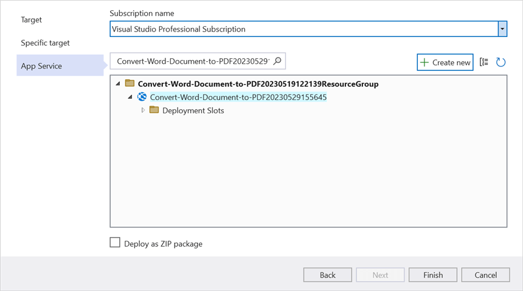

Step 8: Click **Close** button.
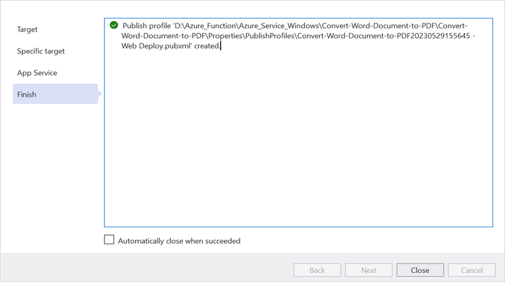

Step 9: Click the **Publish** button.
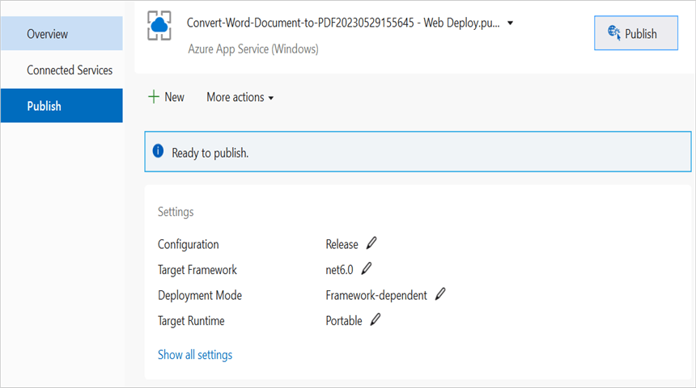

Step 10: Now, Publish has been succeeded.
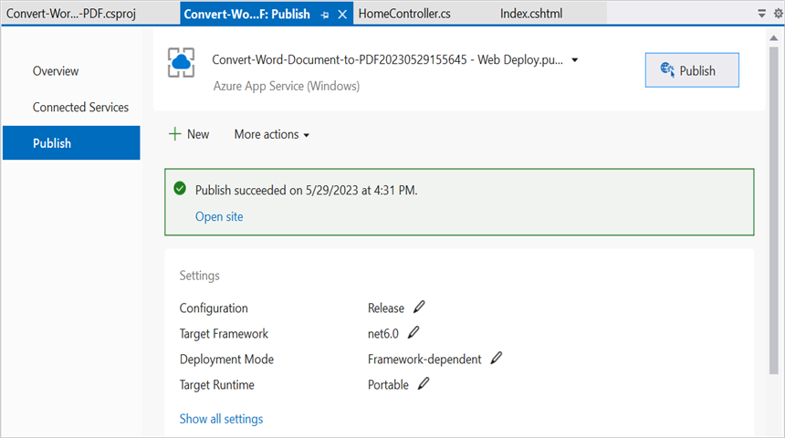

Step 11: Now, the published webpage will open in the **browser**.
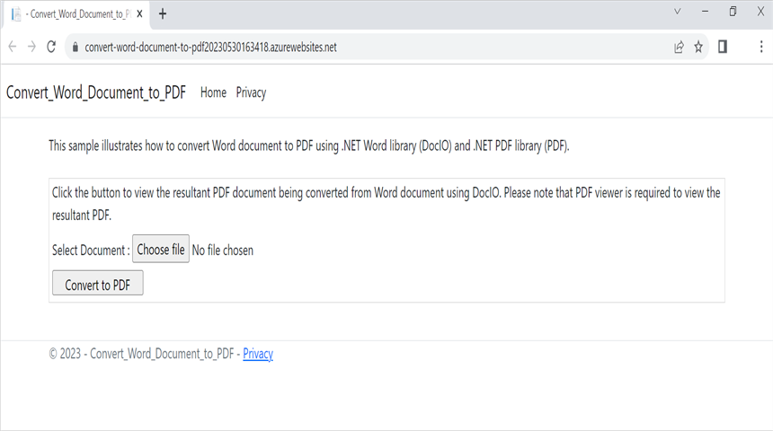

Step 12: Select the Word document and Click **Convert to PDF** to convert the given Word document to a PDF.You will get the output PDF document as follows.

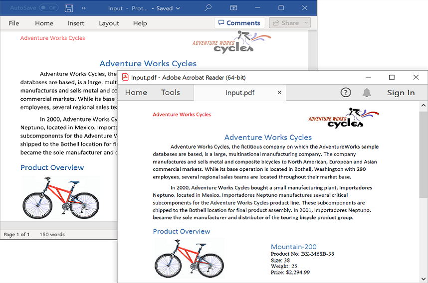

You can download a complete working sample from [GitHub](https://github.com/SyncfusionExamples/DocIO-Examples/tree/main/Word-to-PDF-Conversion/Convert-Word-document-to-PDF/Azure/Azure_App_Service).
