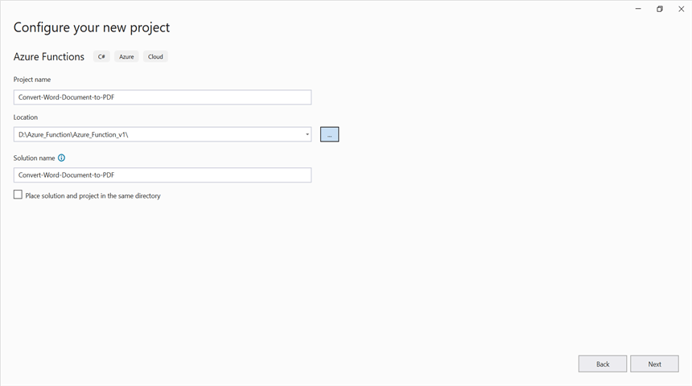
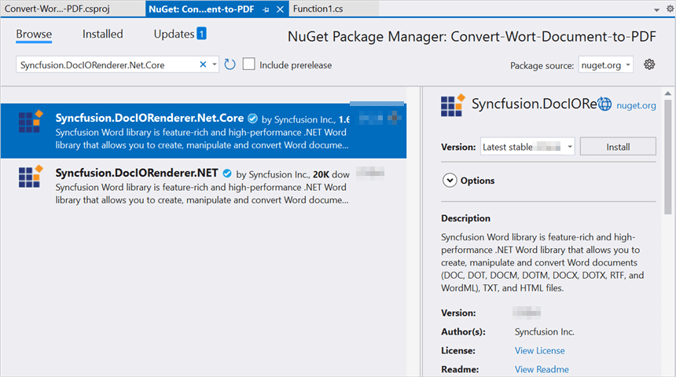
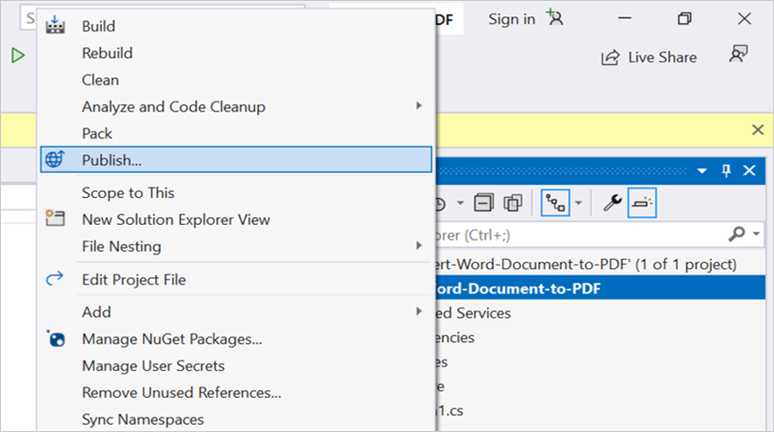
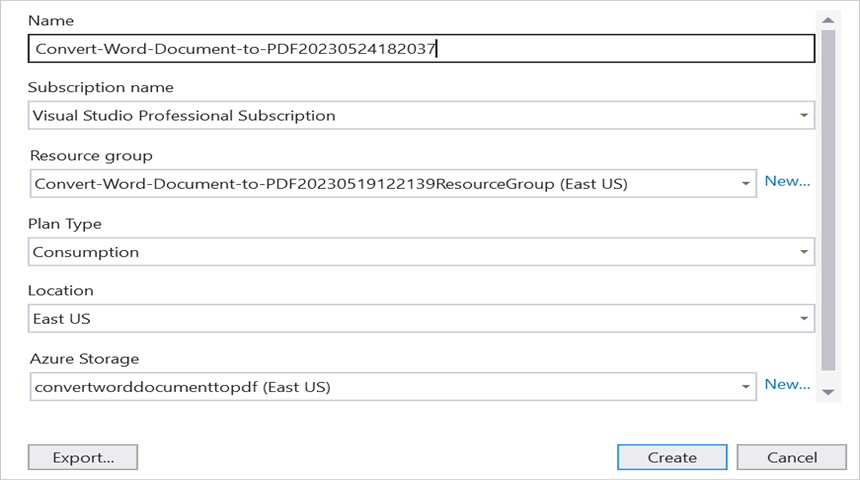
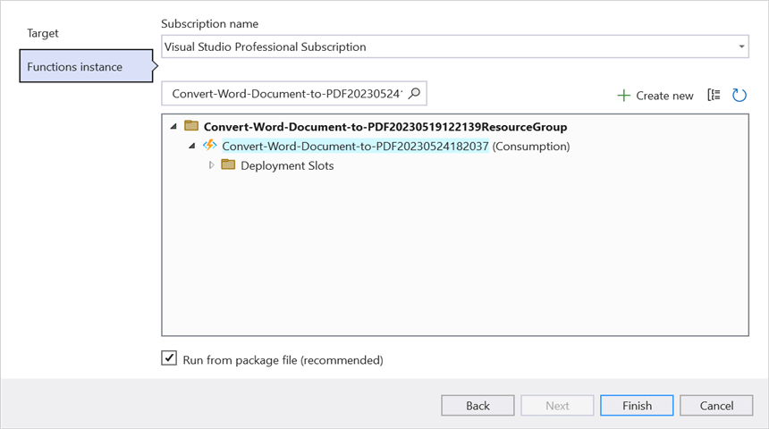
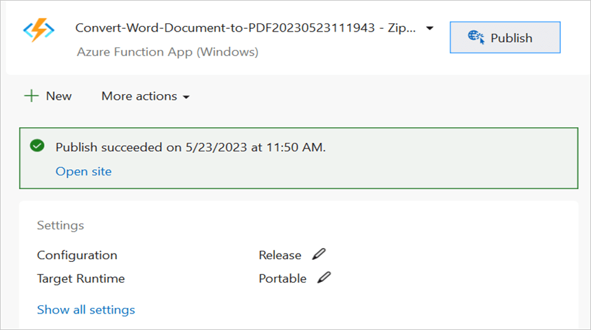

# Convert Word document to PDF in Azure Functions v4

Syncfusion DocIO is a [.NET Core Word library](https://www.syncfusion.com/document-processing/word-framework/net/word-library) used to create, read, edit, and **convert Word documents** programmatically without **Microsoft Word** or interop dependencies. Using this library, you can **convert a Word document to PDF in Azure Functions v4**.

## Steps to convert a Word document to PDF in Azure Functions v4

Step 1: Create a new Azure Functions project.

Step 2: Create a project name and select the location.

Step 3: Select function worker as **.NET 6.0(Long-term support)**.

Step 4: Install the [Syncfusion.DocIORenderer.Net.Core](https://www.nuget.org/packages/Syncfusion.DocToPDFConverter.AspNet) NuGet package as a reference to your project from [NuGet.org](https://www.nuget.org/).

N> Starting with v16.2.0.x, if you reference Syncfusion assemblies from trial setup or from the NuGet feed, you also have to add "Syncfusion.Licensing" assembly reference and include a license key in your projects. Please refer to this [link](https://help.syncfusion.com/common/essential-studio/licensing/overview) to know about registering Syncfusion license key in your application to use our components.

Step 5: Include the following namespaces in the **Function1.cs** file.



using Syncfusion.DocIO;
using Syncfusion.DocIO.DLS;
using Syncfusion.DocIORenderer;
using Syncfusion.Pdf;




Step 6: Add the following code snippet in **Run** method of **Function1** class to perform **convert Word to PDF** in Azure Functions and return the resultant **PDF document** to client end.





//Gets the input Word document as stream from request
Stream stream = req.Content.ReadAsStreamAsync().Result;
//Loads an existing Word document
using (WordDocument document = new WordDocument(stream, FormatType.Docx))
{
    //Creates an instance of the DocToPDFConverter
    using (DocIORenderer render = new DocIORenderer())
    {
        //Converts Word document into PDF document
        using (PdfDocument pdfDocument = render.ConvertToPDF(document))
        {
            MemoryStream memoryStream = new MemoryStream();
            //Saves the PDF file 
            pdfDocument.Save(memoryStream);
            //Reset the memory stream position
            memoryStream.Position = 0;
            //Create the response to return
            HttpResponseMessage response = new HttpResponseMessage(HttpStatusCode.OK);
            //Set the Word document saved stream as content of response
            response.Content = new ByteArrayContent(memoryStream.ToArray());
            //Set the contentDisposition as attachment
            response.Content.Headers.ContentDisposition = new ContentDispositionHeaderValue("attachment")
            {
                FileName = "Sample.Pdf"
            };
            //Set the content type as Word document mime type
            response.Content.Headers.ContentType = new System.Net.Http.Headers.MediaTypeHeaderValue("application/pdf");
            //Return the response with output Word document stream
            return response;
        }
    }
}





Step 7: Right click the project and select **Publish**. Then, create a new profile in the Publish Window.

Step 8: Select the target as **Azure** and click **Next** button.

Step 9: Select the **Create new** button.

Step 10: Click **Create** button. 

Step 11: After creating app service then click **Finish** button. 

Step 12: Click the **Publish** button.

Step 13: Publish has been succeed.

Step 14: After publishing your Azure Function, go to the [Azure portal](https://portal.azure.com) and locate the Function App that hosts your function. In the function app, you can see the list of all available functions in the app.

Step 15: Find the function for which you want to obtain the URL and click on its name. This will open the Function Overview page for that specific function.

Step 16: On the Function Overview page, you will find a Get function URL button. Clicking on it will reveal the URL specific to that function. Copy that **URL** and run the console application. Then, paste the URL into the console application, this will trigger your Function to **convert Word document to PDF**.

By executing the program, you will get the **PDF** as follows.

 

## Steps to post the request to Azure Functions

Step 1: Create a console application to request the Azure Functions API.

Step 2: Add the following code snippet into **Main** method to post the request to Azure Functions with template Word document and get the resultant PDF document.




//Reads the template Word document.
FileStream fs = new FileStream(@"../../Data/Input.docx", FileMode.Open, FileAccess.ReadWrite, FileShare.ReadWrite);
fs.Position = 0;
//Saves the Word document in memory stream.
MemoryStream inputStream = new MemoryStream();
fs.CopyTo(inputStream);
inputStream.Position = 0;
try
{
    Console.WriteLine("Please enter your Azure Functions URL :");
    string functionURL = Console.ReadLine();
    //Create HttpWebRequest with hosted azure functions URL.    
    HttpWebRequest req = (HttpWebRequest)WebRequest.Create(functionURL);
    //Set request method as POST
    req.Method = "POST";
    //Get the request stream to save the Word document stream
    Stream stream = req.GetRequestStream();
    //Write the Word document stream into request stream
    stream.Write(inputStream.ToArray(), 0, inputStream.ToArray().Length);
    //Gets the responce from the Azure Functions.
    HttpWebResponse res = (HttpWebResponse)req.GetResponse();
    //Saves the PDF document stream.
    FileStream fileStream = File.Create("DocToPDF.pdf");
    res.GetResponseStream().CopyTo(fileStream);
    //Dispose the streams
    inputStream.Dispose();
    fileStream.Dispose();
}
catch (Exception ex)
{
    throw;
}




From GitHub, you can download the [console application](https://github.com/SyncfusionExamples/DocIO-Examples/tree/main/Word-to-PDF-Conversion/Convert-Word-document-to-PDF/Azure/Azure_Functions/Console_Application) and [Azure Functions v4](https://github.com/SyncfusionExamples/DocIO-Examples/tree/main/Word-to-PDF-Conversion/Convert-Word-document-to-PDF/Azure/Azure_Functions/Azure_Functions_v4).

Click [here](https://www.syncfusion.com/document-processing/word-framework/net-core) to explore the rich set of Syncfusion Word library (DocIO) features. 

An online sample link to [convert Word document to PDF](https://ej2.syncfusion.com/aspnetcore/Word/WordToPDF#/material3) in ASP.NET Core.

