# How to convert Word document to PDF in Azure App service on Linux

Syncfusion  DocIO is a [.NET Core Word library](https://www.syncfusion.com/document-processing/word-framework/net-core/word-library) used to create, read, and edit Word documents programmatically without **Microsoft Word** or **interop** dependencies. Using this library, you can **convert a Word document to PDF in Azure App Service on Linux**.

## Steps to convert Word document to PDF in Azure App service on Linux:

Step 1: Create a new ASP.NET Core app (Model-View Controller).
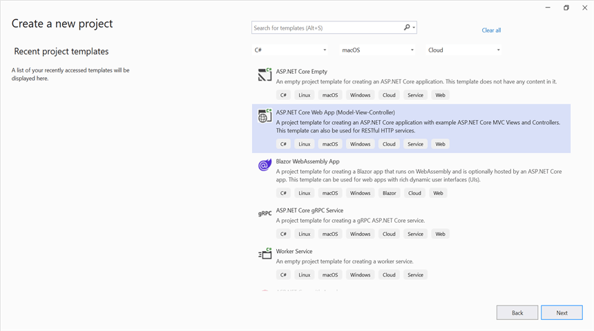

Step 2: Install the [Syncfusion.DocIORenderer.Net.Core](https://www.nuget.org/packages/Syncfusion.DocIORenderer.Net.Core/) NuGet package as a reference to your .NET Core application from NuGet.org.

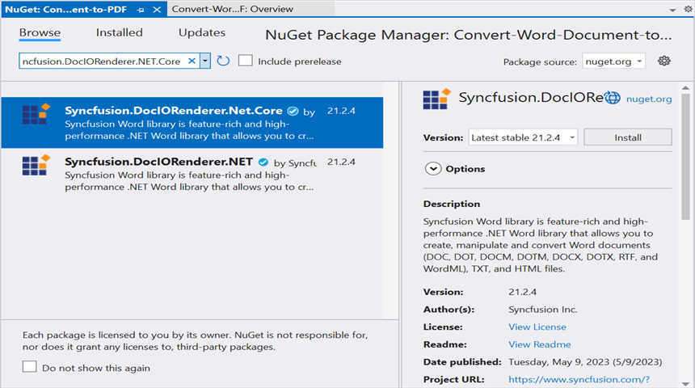

Step 3: Install the [SkiaSharp.NativeAssets.Linux](https://www.nuget.org/packages/SkiaSharp.NativeAssets.Linux) NuGet package as a reference to your .NET Core application from NuGet.org.

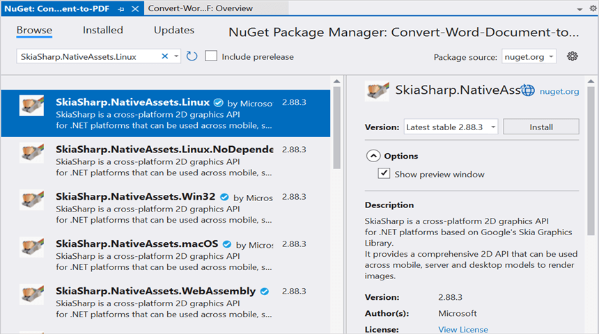

Step 4: Create a Font folder in the ``wwwroot`` folder of the project and copy the required fonts and include the files to the project.

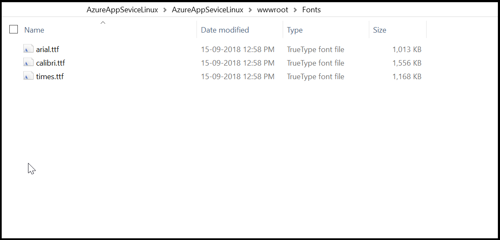

Step 5:Set the **copy to output directory** to **Copy if newer** to all the data files.

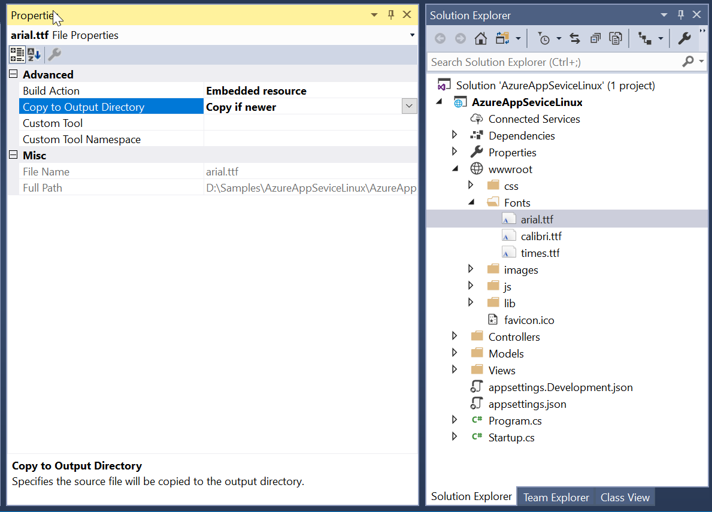

Step 6: Add an Export To PDF button in index.cshtml.





@{Html.BeginForm("WordToPDF", "Home", FormMethod.Post, new { enctype = "multipart/form-data" });

{
    

        

            

                This sample illustrates how to convert Word document to PDF using Essential DocIO and Essential PDF.
            

            &nbsp;
            

            Click the button to view the resultant PDF document being converted from Word document using Essential DocIO and Essential PDF. Please note that PDF viewer is required to view the resultant PDF.
            

                

                    Select Document :
                    @Html.TextBox("file", "", new { type = "file", accept = ".doc,.docx,.rtf,.dot,.dotm,.dotx,docm,.xml" })  
                

                

                    <input class="buttonStyle" type="submit" value="Convert to PDF" name="button" style="width:150px;height:27px" />
                     
                    

                                @ViewBag.Message
                    

                

            

        

         
        

        More information about Word to PDF conversion can be found in this
        <a href="https://help.syncfusion.com/file-formats/docio/conversion#converting-word-document-to-pdf">documentation</a>
        section.
            

        

    

        Html.EndForm();
    }
}

Step 8: Include the following namespace in that HomeController.cs file.





using Syncfusion.DocIO;
using Syncfusion.DocIO.DLS;
using Syncfusion.DocIORenderer;
using Syncfusion.Pdf;
using Microsoft.AspNetCore.Hosting;





Step 7: Add a new action method **WordToPDF** in HomeController.cs and include the below code snippet to **convert the Word document to PDF**.





private IHostingEnvironment _env;
public HomeController(IHostingEnvironment env)
{
    _env = env;
}

/// 

/// Convert Word document to PDF
/// 

/// <param name="button"></param>
/// <returns></returns>
public IActionResult WordToPDF(string button)
{
    string fileLoadTime = "";
    string domLoadTime = "";
    string conversionTime = "";
    string saveTime = "";
    if (button == null)
        return View("Index");

    if (Request.Form.Files != null)
    {
        if (Request.Form.Files.Count == 0)
        {
            ViewBag.Message = string.Format("Browse a Word document and then click the button to convert as a PDF document");
            return View("Index");
        }
        // Gets the extension from file.
        string extension = Path.GetExtension(Request.Form.Files[0].FileName).ToLower();
        // Compares extension with supported extensions.
        if (extension == ".doc" || extension == ".docx" || extension == ".dot" || extension == ".dotx" || extension == ".dotm" || extension == ".docm"|| extension == ".xml" || extension == ".rtf")
        {
            MemoryStream stream = new MemoryStream();
            Request.Form.Files[0].CopyTo(stream);
            try
            {
                //Open using Syncfusion
                WordDocument document = new WordDocument(stream, Syncfusion.DocIO.FormatType.Automatic);
                document.FontSettings.SubstituteFont += FontSettings_SubstituteFont;
                stream.Dispose();
                stream = null;
                // Creates a new instance of DocIORenderer class.
                DocIORenderer render = new DocIORenderer();
                // Converts Word document into PDF document.
                PdfDocument pdf = render.ConvertToPDF(document);
                document.FontSettings.SubstituteFont -= FontSettings_SubstituteFont;
                MemoryStream memoryStream = new MemoryStream();
                // Save the PDF document.                    
                //Save using Syncfusion
                pdf.Save(memoryStream);
                memoryStream.Position = 0;
                ViewBag.OS = string.Format(System.Environment.OSVersion.ToString());
                ViewBag.Load = string.Format("FileLoadTime\t" + fileLoadTime);
                ViewBag.DomLoad = "DomLoadTime\t" + domLoadTime;
                ViewBag.Conversion = "ConversionTime\t" + conversionTime;
                ViewBag.Save = "SaveTime\t" + saveTime;
                return File(memoryStream, "application/pdf", "WordToPDF.pdf");
            }
            catch (Exception ex)
            {
                ViewBag.Message = ex.ToString();
            }
        }
        else
        {
            ViewBag.Message = string.Format("Please choose Word format document to convert to PDF");
        }
    }
    else
    {
        ViewBag.Message = string.Format("Browse a Word document and then click the button to convert as a PDF document");
    }
    return View("Index");
}

/// 

/// Sets the alternate font when a specified font is not installed in the production environment
/// 

/// <param name="sender"></param>
/// <param name="args"></param>
private void FontSettings_SubstituteFont(object sender, SubstituteFontEventArgs args)
{
    string filePath = string.Empty;

    //Load the file from the disk
    FileStream fileStream = null;
    //Sets the alternate font when a specified font is not installed in the production environment
    //If "Arial Unicode MS" font is not installed, then it uses the "Arial" font
    //For other missing fonts, uses the "Times New Roman"
    if (args.OriginalFontName == "Calibri")
    {
        filePath = _env.WebRootPath + @"/Fonts/calibri.ttf";
        fileStream = new FileStream(filePath, FileMode.Open, FileAccess.Read);
        args.AlternateFontStream = fileStream;
    }
    else if (args.OriginalFontName == "Arial")
    {
        filePath = _env.WebRootPath + @"/Fonts/arial.ttf";
        fileStream = new FileStream(filePath, FileMode.Open, FileAccess.Read);
        args.AlternateFontStream = fileStream;
    }
    else
    {
        filePath = _env.WebRootPath + @"/Fonts/times.ttf";
        fileStream = new FileStream(filePath, FileMode.Open, FileAccess.Read);
        args.AlternateFontStream = fileStream;
    }
}




Step 9: Refer to the following steps to publish as **Azure App Linux**. Right-click the project and select Publish.:

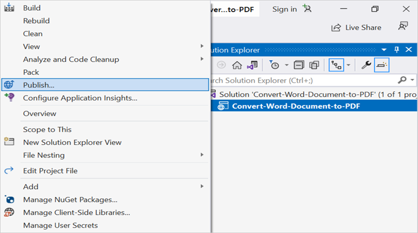

Step 10: Click  Add a publish profile
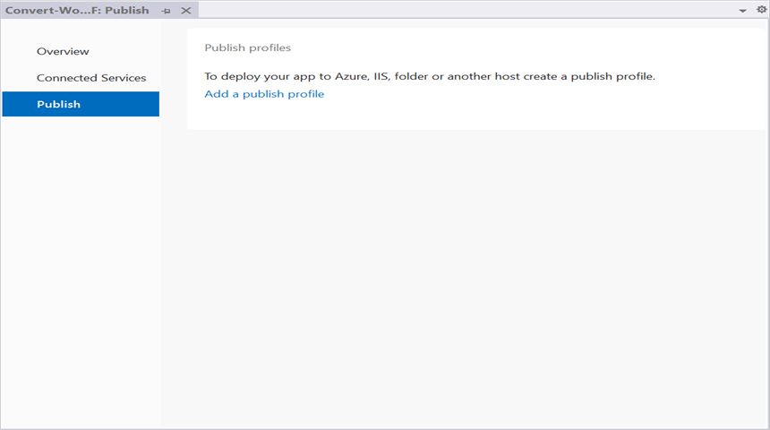

Step 11: Select target as **Azure** and click Next button
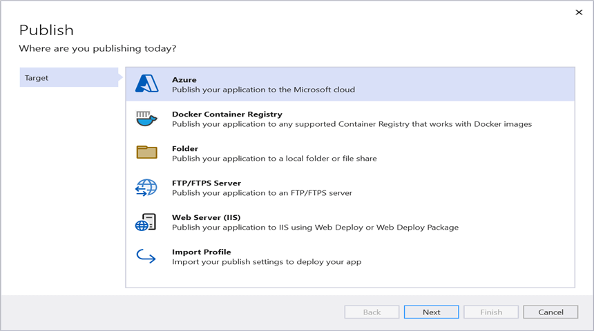

Step 12: Select specific target as **Azure App Service (Linux)** and click Next button.
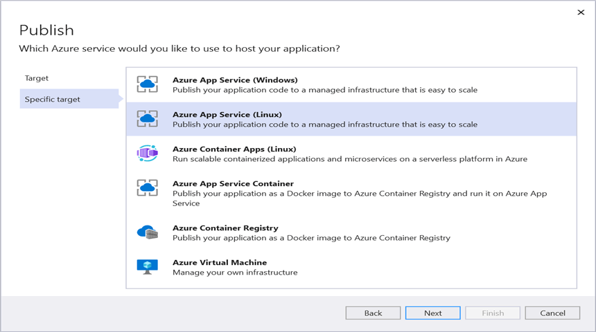

Step 13: Create App service using Azure subscription and select a hosting plan.
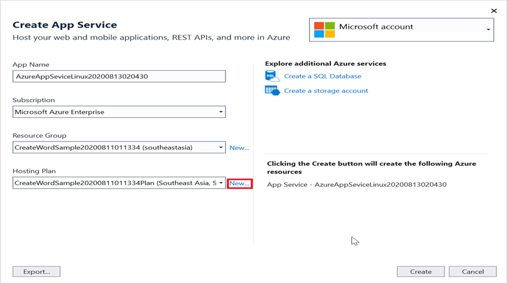

Step 14: The Syncfusion DocIO library works from basic hosting plan (B1). So, select the required hosting plan. It does not work if the hosting plan is Free/Shared.
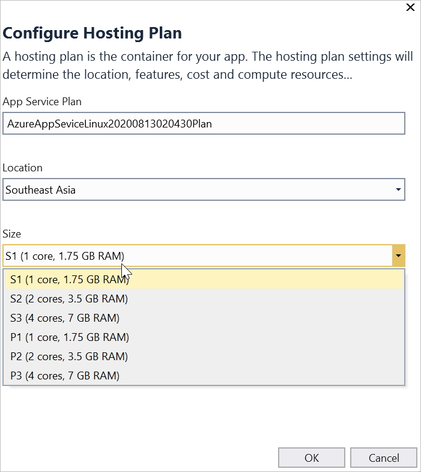

Step 15: After creating a profile, click the publish button.
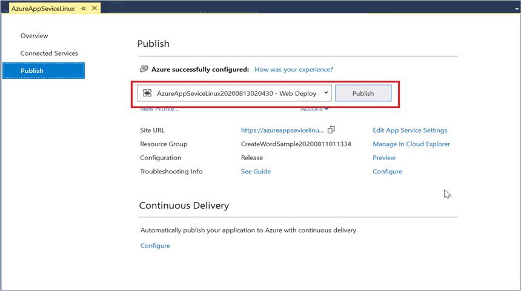

Step 16: Now, the published webpage will open in the browser. Select the Word document and Click **Convert to PDF** to convert the given Word document to a PDF.
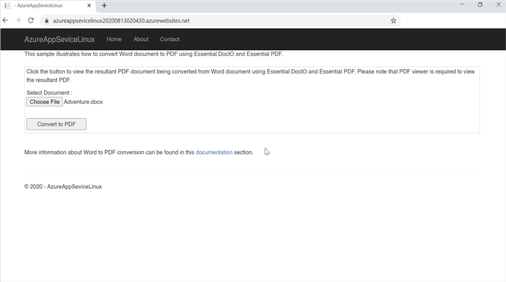

A complete work sample for converting an Word document to PDF in Azure App service on Linux can be downloaded from [AzureAppServiceOnLinux](https://www.syncfusion.com/downloads/support/directtrac/general/ze/AzureAppSeviceLinux198349282?_gl=1*18f3efu*_ga*NTA2MDIxMjkzLjE2NzI3MzYzODM.*_ga_WC4JKKPHH0*MTY4NDIyMjg4NS4xMTQuMS4xNjg0MjIyOTIzLjIyLjAuMA..)

By executing the program, you will get the **PDF document** as follows.

Take a moment to peruse the [documentation](https://help.syncfusion.com/file-formats/docio/getting-started), where you can find basic Word document processing options along with features like [mail merge](https://help.syncfusion.com/file-formats/docio/working-with-mail-merge), [merge](https://help.syncfusion.com/file-formats/docio/word-document/merging-word-documents) and [split](https://help.syncfusion.com/file-formats/docio/word-document/split-word-documents) documents, [find and replace](https://help.syncfusion.com/file-formats/docio/working-with-find-and-replace) text in the Word document, [protect](https://help.syncfusion.com/file-formats/docio/working-with-security) the Word documents, and most importantly [PDF](https://help.syncfusion.com/file-formats/docio/word-to-pdf) and [Image](https://help.syncfusion.com/file-formats/docio/word-to-image) conversions with code examples.

Explore more about the rich set of Syncfusion [Word Framework](https://www.syncfusion.com/word-framework) features.

N> Starting with v16.2.0.x, if you reference Syncfusion assemblies from trial setup or from the NuGet feed, include a license key in your projects. Refer to [link](https://help.syncfusion.com/common/essential-studio/licensing/overview) to learn about generating and registering Syncfusion license key in your application to use the components without trail message.