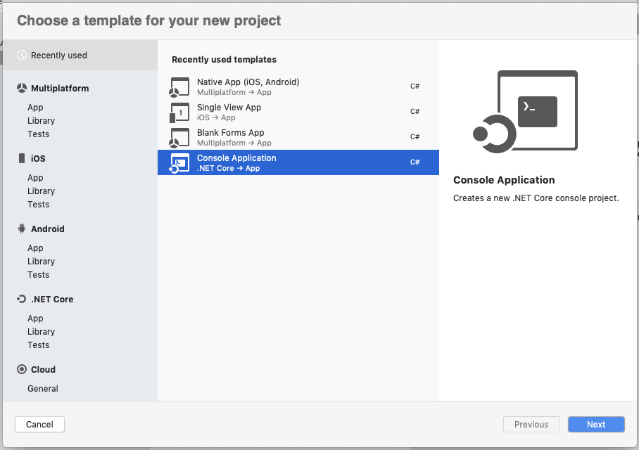
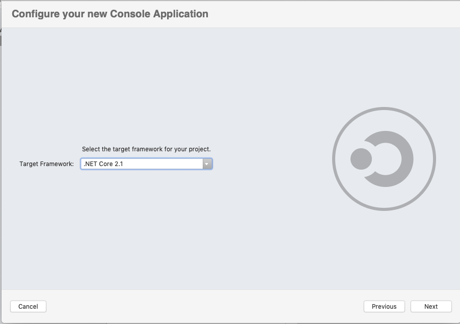

# Convert Word document to PDF on macOS

Syncfusion DocIO is a [.NET Core Word library](https://www.syncfusion.com/document-processing/word-framework/net-core/word-library) used to create, read, edit, and **convert Word documents** programmatically without **Microsoft Word** or interop dependencies. Using this library, you can **convert a Word document to PDF in .NET Core application on macOS**.

## Steps to convert Word document to PDF in .NET Core application on macOS

Step 1: Create a new .NET Core console application project.

Step 2: Select the project version.

Step 3: Install the [Syncfusion.DocIORenderer.Net.Core ](https://www.nuget.org/packages/Syncfusion.DocIORenderer.Net.Core/) NuGet package as a reference to your project from [NuGet.org](https://www.nuget.org/).Install the Nuget Package on Mac please refer this [Link](https://learn.microsoft.com/en-us/visualstudio/mac/nuget-walkthrough?view=vsmac-2022).

N> Starting with v16.2.0.x, if you reference Syncfusion assemblies from trial setup or from the NuGet feed, you also have to add "Syncfusion.Licensing" assembly reference and include a license key in your projects. Please refer to this [link](https://help.syncfusion.com/common/essential-studio/licensing/overview) to know about registering Syncfusion license key in your application to use our components.

Step 4: Include the following Namespaces in the Program.cs file.




using Syncfusion.DocIO;
using Syncfusion.DocIO.DLS;
using Syncfusion.DocIORenderer;
using Syncfusion.Pdf;




Step 5: Add the following code snippet in Program.cs file.




using (FileStream docStream = new FileStream(Path.GetFullPath(@"../../../Data/Template.docx"), FileMode.Open, FileAccess.Read))
{
    //Loads file stream into Word document
    using (WordDocument wordDocument = new WordDocument(docStream, FormatType.Docx))
    {
        //Instantiation of DocIORenderer for Word to PDF conversion
        using (DocIORenderer render = new DocIORenderer())
        {
            //Converts Word document into PDF document
            using (PdfDocument pdfDocument = render.ConvertToPDF(wordDocument))
            {
                //Saves the PDF document to MemoryStream.
                MemoryStream stream = new MemoryStream();
                pdfDocument.Save(stream);
                stream.Position = 0;

                //Save the PDF document in local machine
                Stream file = File.Create("Sample.pdf");
                stream.CopyTo(file);
                file.Close();
            }
        }
    }
}





You can download a complete working sample from [GitHub](https://github.com/SyncfusionExamples/DocIO-Examples/tree/main/Word-to-PDF-Conversion/Convert-Word-document-to-PDF/Mac).

By executing the program, you will get the **PDF document** as follows. The output will be saved in bin folder.

