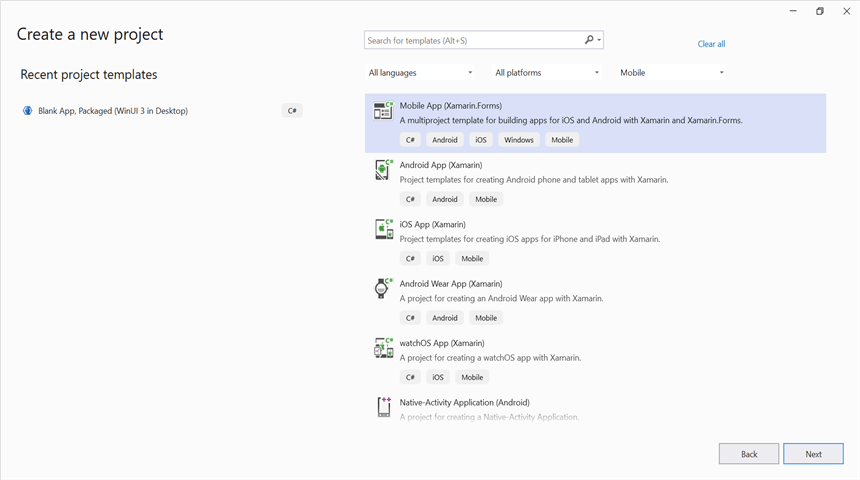
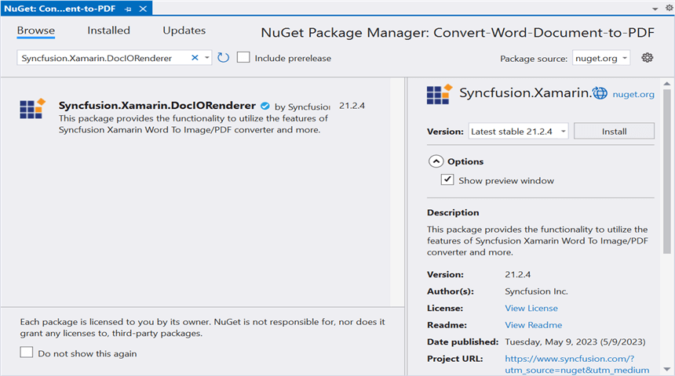
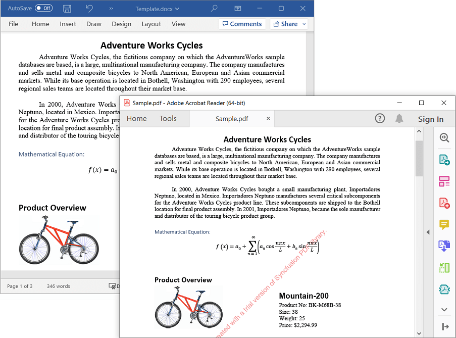

# Convert Word Document to PDF in Xamarin

Syncfusion DocIO is a [Xamarin Word library](https://www.syncfusion.com/document-processing/word-framework/xamarin/word-library) used to create, read, edit, and **convert Word documents** programmatically without **Microsoft Word** or **interop** dependencies. Using this library, you can **convert a Word document to PDF in Xamarin**.

## Steps to convert Word document to PDF in Xamarin:

Step 1: Create a new Xamarin.Forms application project.

Step 2: Select a project template and required platforms to deploy the application. In this application the portable assemblies to be shared across multiple platforms, the .NET Standard code sharing strategy has been selected. For more details about code sharing refer [here](https://learn.microsoft.com/en-us/xamarin/cross-platform/app-fundamentals/code-sharing).

N> If .NET Standard is not available in the code sharing strategy, the Portable Class Library (PCL) can be selected.

Step 3: Install [Syncfusion.Xamarin.DocIORenderer ](https://www.nuget.org/packages/Syncfusion.Xamarin.DocIORenderer) NuGet package as a reference to the .NET Standard project in your application from [NuGet.org](https://www.nuget.org/).

N> Starting with v16.2.0.x, if you reference Syncfusion assemblies from trial setup or from the NuGet feed, you also have to add "Syncfusion.Licensing" assembly reference and include a license key in your projects. Please refer to this [link](https://help.syncfusion.com/common/essential-studio/licensing/overview) to know about registering Syncfusion license key in your application to use our components.

Step 4: Add new Forms XAML page in **portable project**. If there is no XAML page is defined in the App class. Otherwise proceed to the next step.
<ul>
<li>
To add the new XAML page, right click on the project and select <b>Add > New Item</b> and add a Forms XAML Page from the list. Name it as MainXamlPage.
</li>
<li>
In App class of <b>portable project</b> (App.cs), replace the existing constructor of App class with the code snippet given below which invokes the <b>MainXamlPage</b>.
</li>
</ul>




public App()
{
    // The root page of your application
    MainPage = new MainXamlPage();
}




Step 5: In the MainXamlPage.xaml add new button as shown below.





<ContentPage xmlns="http://xamarin.com/schemas/2014/forms"
             xmlns:x="http://schemas.microsoft.com/winfx/2009/xaml"
             x:Class="Convert_Word_Document_to_PDF.MainPage">

    <StackLayout VerticalOptions="Center">
       <Button Text="Convert WordtoPDF" Clicked="OnButtonClicked" HorizontalOptions="Center"/>
    </StackLayout>
</ContentPage>





Step 6: Include the following namespace in the MainXamlPage.xaml.cs file.




using Syncfusion.DocIO;
using Syncfusion.DocIO.DLS;
using Syncfusion.DocIORenderer;
using Syncfusion.Pdf;




Step 7: Include the below code snippet in the click event of the button in MainXamlPage.xaml.cs, to convert Word document to PDF and save it in a stream.





//Loading an existing Word document
Assembly assembly = typeof(App).GetTypeInfo().Assembly;
Stream streams = assembly.GetManifestResourceStream("Convert-Word-Document-to-PDF.Assets.Input.docx");
using (WordDocument document = new WordDocument(assembly.GetManifestResourceStream("Convert-Word-Document-to-PDF.Template.Input.docx"), FormatType.Docx))
{
    //Instantiation of DocIORenderer for Word to PDF conversion
    using (DocIORenderer render = new DocIORenderer())
    {
        //Converts Word document into PDF document
        using (PdfDocument pdfDocument = render.ConvertToPDF(document))
        {
            //Saves the PDF document to MemoryStream.
            MemoryStream stream = new MemoryStream();
            pdfDocument.Save(stream);

            //Save the stream as a file in the device and invoke it for viewing.
            Xamarin.Forms.DependencyService.Get<ISave>().SaveAndView("Sample.pdf", "application/pdf", stream);
        }
    }               
}    




## Helper files for Xamarin

Refer the below helper files and add them into the mentioned project. These helper files allow you to save the stream as a physical file and open the file for viewing.

<table>
  <tr>
  <td>
    <b>Project</b>
  </td>
  <td>
    <b>File Name</b>
  </td>
  <td>
    <b>Summary</b>
  </td>
  </tr>
  <tr>
  <td>
    {{'[Portable project](https://github.com/SyncfusionExamples/DocIO-Examples/tree/main/Word-to-PDF-Conversion/Convert-Word-document-to-PDF/Xamarin/Convert-Word-Document-to-PDF/Convert-Word-Document-to-PDF)'| markdownify }}
  </td>
  <td>
    {{'[ISave.cs](https://github.com/SyncfusionExamples/DocIO-Examples/blob/main/Word-to-PDF-Conversion/Convert-Word-document-to-PDF/Xamarin/Convert-Word-Document-to-PDF/Convert-Word-Document-to-PDF/ISave.cs)'| markdownify }}
  </td>
  <td>Represent the base interface for save operation
  </td>
  </tr>
  <tr>
  <td rowspan="2">
    {{'[iOS Project](https://github.com/SyncfusionExamples/DocIO-Examples/tree/main/Word-to-PDF-Conversion/Convert-Word-document-to-PDF/Xamarin/Convert-Word-Document-to-PDF/Convert-Word-Document-to-PDF.iOS)'| markdownify }}
  </td>
  <td>
    {{'[SaveIOS.cs](https://github.com/SyncfusionExamples/DocIO-Examples/blob/main/Word-to-PDF-Conversion/Convert-Word-document-to-PDF/Xamarin/Convert-Word-Document-to-PDF/Convert-Word-Document-to-PDF.iOS/SaveIOS.cs)'| markdownify }}
  </td>
  <td>
    Save implementation for iOS device
  </td>
  </tr>
  <tr>
  <td>
    {{'[PreviewControllerDS.cs](https://github.com/SyncfusionExamples/DocIO-Examples/blob/main/Word-to-PDF-Conversion/Convert-Word-document-to-PDF/Xamarin/Convert-Word-Document-to-PDF/Convert-Word-Document-to-PDF.iOS/PreviewControllerDS.cs)'| markdownify }}
  </td>
  <td>
    Helper class for viewing the <b>Word document</b> in iOS device
  </td>
  </tr>
  <tr>
  <td>
    {{'[Android project](https://github.com/SyncfusionExamples/DocIO-Examples/tree/main/Word-to-PDF-Conversion/Convert-Word-document-to-PDF/Xamarin/Convert-Word-Document-to-PDF/Convert-Word-Document-to-PDF.Android)'| markdownify }}
  </td>
  <td>
   {{'[SaveAndroid.cs](https://github.com/SyncfusionExamples/DocIO-Examples/blob/main/Word-to-PDF-Conversion/Convert-Word-document-to-PDF/Xamarin/Convert-Word-Document-to-PDF/Convert-Word-Document-to-PDF.Android/SaveAndroid.cs)'| markdownify }}
  </td>
  <td>Save implementation for Android device
  </td>
  </tr>
  <tr>
  <td>
    {{'[UWP project](https://github.com/SyncfusionExamples/DocIO-Examples/tree/main/Word-to-PDF-Conversion/Convert-Word-document-to-PDF/Xamarin/Convert-Word-Document-to-PDF/Convert-Word-Document-to-PDF.UWP)'| markdownify }}
  </td>
  <td>
    {{'[SaveWindows.cs](https://github.com/SyncfusionExamples/DocIO-Examples/blob/main/Word-to-PDF-Conversion/Convert-Word-document-to-PDF/Xamarin/Convert-Word-Document-to-PDF/Convert-Word-Document-to-PDF.UWP/SaveWindows.cs)'| markdownify }}
  </td>
  <td>Save implementation for UWP device.
  </td>
  </tr>
</table>

Compile and execute the application. Now this application **convert a Word document to PDF**.

You can download a complete working sample from [GitHub](https://github.com/SyncfusionExamples/DocIO-Examples/tree/main/Word-to-PDF-Conversion/Convert-Word-document-to-PDF/Xamarin).

By executing the program, you will get the PDF document as follows.

                     