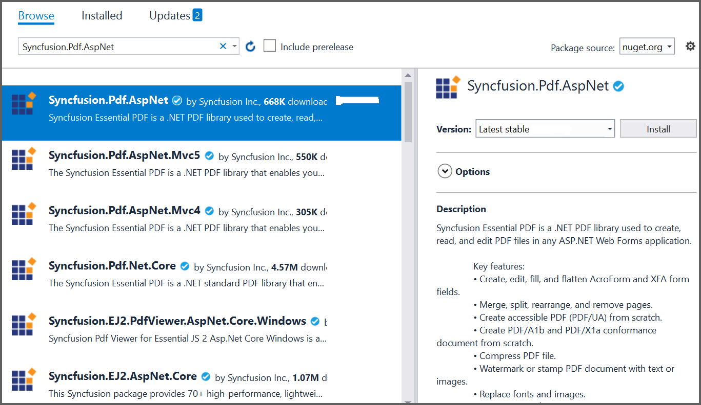

# Create Word document in ASP.NET

Syncfusion Essential DocIO is a [.NET Word library](https://www.syncfusion.com/document-processing/word-framework/net/word-library) used to used to create, read, edit, and **convert Word documents** programmatically without **Microsoft Word** or interop dependencies. Using this library, you can **convert a Word document to PDF in ASP.NET Web Forms**.

## Steps to convert Word document to PDF in C#:

Step 1: Create a new ASP.NET Web application project.

Step 2: Select the Empty project

Step 3: Install the [Syncfusion.DocToPDFConverter.AspNet](https://www.nuget.org/packages/Syncfusion.DocToPDFConverter.AspNet) NuGet package as a reference to your project from [NuGet.org](https://www.nuget.org/).

N> Starting with v16.2.0.x, if you reference Syncfusion assemblies from trial setup or from the NuGet feed, you also have to add "Syncfusion.Licensing" assembly reference and include a license key in your projects. Please refer to this [link](https://help.syncfusion.com/common/essential-studio/licensing/overview) to know about registering Syncfusion license key in your application to use our components.

Step 4: Add a new Web Form in your project. Right click on the project and select **Add > New Item** and add a Web Form from the list. Name it as MainPage.

Step 5: Add a new button in the **MainPage.aspx** as shown below.





<%@ Page Language="C#" AutoEventWireup="true" CodeBehind="MainPage.aspx.cs" Inherits="Convert_Word_Document_to_PDF.WebForm1" %>

<!DOCTYPE html>

<html xmlns="http://www.w3.org/1999/xhtml">
<head runat="server">
    <title></title>
</head>
<body>
    <form id="form1" runat="server">
        

             <asp:Button ID="Button1" runat="server" Text="Convert Word to PDF" OnClick="OnButtonClicked" />
        

    </form>
</body>
</html>





Step 6. Include the following namespace in your **MainPage.aspx.cs** file.





using Syncfusion.DocIO;
using Syncfusion.DocIO.DLS;
using Syncfusion.DocToPDFConverter;
using Syncfusion.Pdf;





Step 7: Include the below code snippet in the click event of the button in **MainPage.aspx.cs**, to **convert the Word document to Pdf** and download it.





//Open an existing Word document.        
string filePath = Server.MapPath("~/App_Data/Template.docx");

//Loads file into Word document
using (WordDocument document = new WordDocument(filePath))
{
    //Instantiation of DocToPDFConverter for Word to PDF conversion
    using (DocToPDFConverter converter = new DocToPDFConverter())
    {
        //Converts Word document into PDF document
        PdfDocument pdfDocument = converter.ConvertToPDF(document);

        //Saves the PDF document to MemoryStream.
        MemoryStream stream = new MemoryStream();
        pdfDocument.Save("sample.pdf", HttpContext.Current.Response, HttpReadType.Save);
        stream.Position = 0;
    }
}





You can download a complete working sample from [GitHub](https://github.com/SyncfusionExamples/DocIO-Examples/tree/main/Getting-Started/ASP.NET-Core).

By executing the program, you will get the **PDF document** as follows.

