# How to convert Word document to PDF in AWS Lambda

Using Syncfusion [.Net Core Word and PDF library](https://www.syncfusion.com/document-processing/word-framework/net-core/word-to-pdf-conversion), you can convert a Word document to PDF in AWS Lambda.

## Setting up the AWS Toolkit for Visual Studio:
 1. You can create an AWS account by referring to this [link](https://aws.amazon.com/).
 2. Download and install the AWS Toolkit for Visual Studio, you can download the AWS toolkit from this [link](https://aws.amazon.com/visualstudio/). The Toolkit can be installed from Tools/Extension and updates options in Visual Studio.

## Refer to the following steps to convert Word document to PDF in AWS:
 1. Create an AWS Lambda function to convert Word document to PDF and publish it to AWS.
 2. Invoke the AWS Lambda function in your main application using AWS SDKs.

## Steps to convert Word document to PDF in AWS Lambda function:

Step 1: Create a new AWS Lambda project as follows.
 
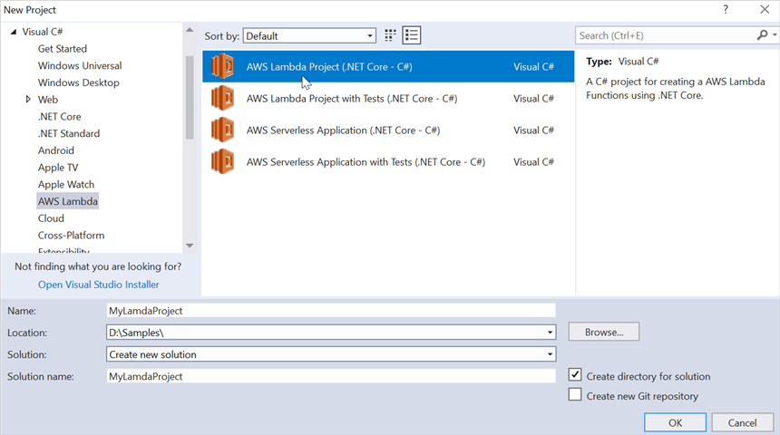

Step 2: Select Blueprint as Empty Function and click **Finish**.

Step 3: Install the [Syncfusion.DocIORenderer.Net.Core](https://www.nuget.org/packages/Syncfusion.DocIORenderer.Net.Core/) NuGet package as a reference to your AWS lambda project from [NuGet.org](https://www.nuget.org/).

Step 4: Install the [SkiaSharp.NativeAssets.Linux NuGet](https://www.nuget.org/packages/SkiaSharp.NativeAssets.Linux/2.80.2-preview.19) package as a reference to your AWS lambda project from [NuGet.org](https://www.nuget.org/).
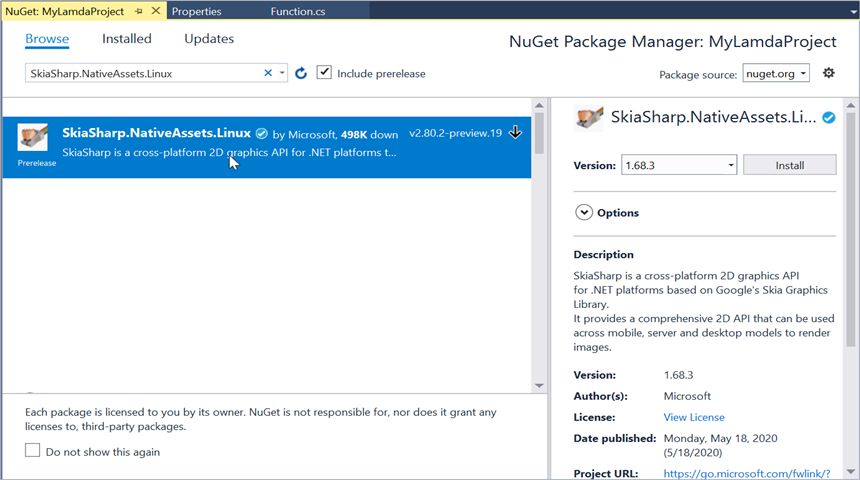

Step 5: Create a folder and copy the required data files and include the files to the project.
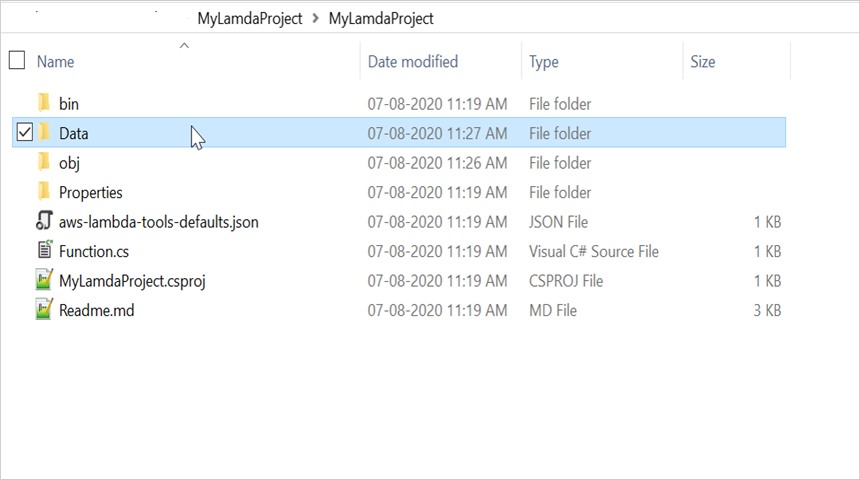

Step 6: Set the **copy to output directory** to **Copy if newer** to all the data files.
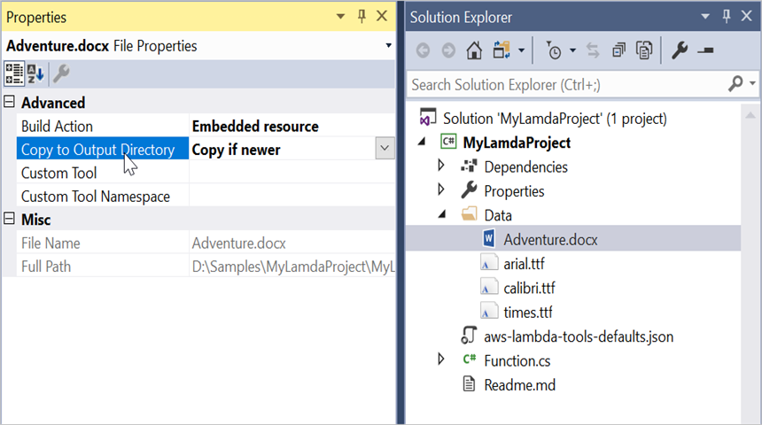

Step 7: Include the following namespaces in Function.cs file.




 using System.IO;
 using Syncfusion.DocIO;
 using Syncfusion.DocIO.DLS;
 using Syncfusion.DocIORenderer;
 using Syncfusion.Pdf;
 using Syncfusion.Drawing;




Step 8: Add the following code snippet in **Function.cs** to create a PDF document.




/// 

/// A simple function that takes a string and does a ToUpper
/// 

/// <param name="input"></param>
/// <param name="context"></param>
/// <returns></returns>
public string FunctionHandler(string input, ILambdaContext context)
{
    string filePath = Path.GetFullPath(@"Data/Adventure.docx");
    
    //Load the file from the disk
    FileStream fileStream = new FileStream(filePath, FileMode.Open, FileAccess.Read);
 
    WordDocument document = new WordDocument(fileStream, FormatType.Docx);
    //Hooks the font substitution event
    document.FontSettings.SubstituteFont += FontSettings_SubstituteFont;
    DocIORenderer render = new DocIORenderer();
    PdfDocument pdf = render.ConvertToPDF(document);
    //Unhooks the font substitution event after converting to PDF
    document.FontSettings.SubstituteFont -= FontSettings_SubstituteFont;
 
    //Save the document into stream
    MemoryStream stream = new MemoryStream();
    //Save the PDF document  
    pdf.Save(stream);
    document.Close();
    render.Dispose();
    return Convert.ToBase64String(stream.ToArray());
}
 
/// 

/// Sets the alternate font when a specified font is not installed in the production environment
/// 

/// <param name="sender"></param>
/// <param name="args"></param>
private void FontSettings_SubstituteFont(object sender, SubstituteFontEventArgs args)
{
    string filePath = string.Empty;
 
    //Load the file from the disk
    FileStream fileStream = null;
 
    if (args.OriginalFontName == "Calibri")
    {
        filePath = Path.GetFullPath(@"Data/calibri.ttf");
        fileStream = new FileStream(filePath, FileMode.Open, FileAccess.Read);
        args.AlternateFontStream = fileStream;
    }
    else if (args.OriginalFontName == "Arial")
    {
        filePath = Path.GetFullPath(@"Data/arial.ttf");
        fileStream = new FileStream(filePath, FileMode.Open, FileAccess.Read);
        args.AlternateFontStream = fileStream;
    }
    else
    {
        filePath = Path.GetFullPath(@"Data/times.ttf");
        fileStream = new FileStream(filePath, FileMode.Open, FileAccess.Read);
        args.AlternateFontStream = fileStream;
    }
}





Step 9: Right-click the project and select **Publish to AWS Lambda**.
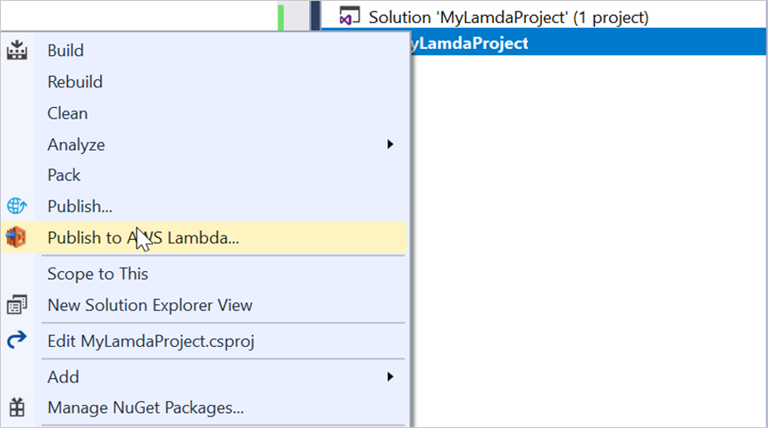

Step 10: Create a new AWS profile in the Upload Lambda Function Window. After creating the profile, add a name for the Lambda function to publish. Then, click **Next**.
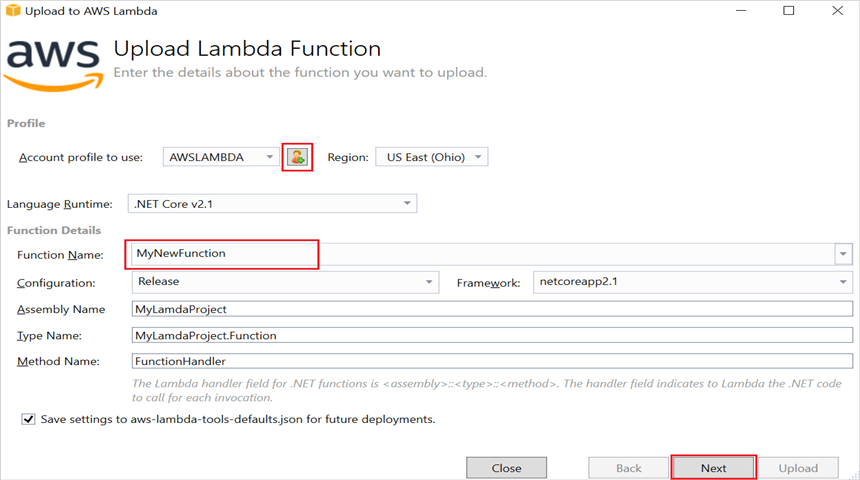

Step 11: In the Advanced Function Details window, specify the **Role Name** as based on AWS Managed policy. After selecting the role, click the **Upload** button to deploy your application.
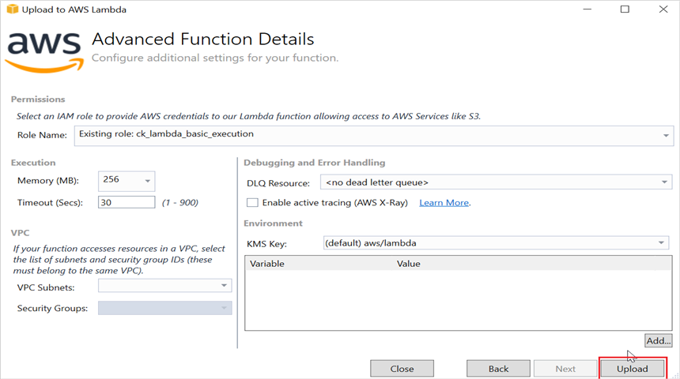

Step 12: After deploying the application, you can see the published Lambda function in [AWS console](https://console.aws.amazon.com/lambda/home?region=us-east-1#/functions).
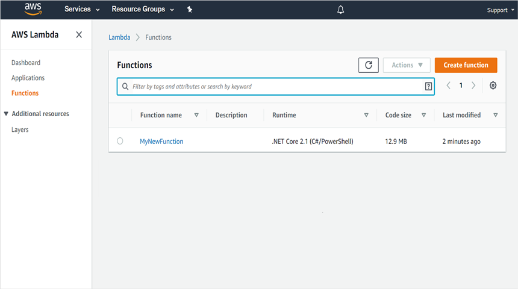

Step 13:Edit Memory size and Timeout as maximum in Basic settings of the AWS Lambda function.
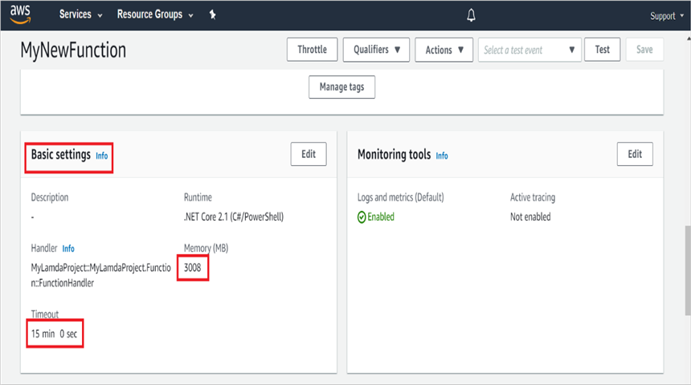

## Refer to the following steps to invoke the AWS Lambda function from console application:

Step 1: Create a new console project.
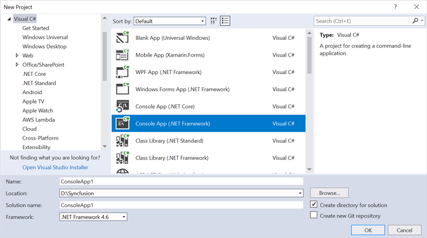

Step 2: Install the [AWSSDK.Core](https://www.nuget.org/packages/AWSSDK.Core/), [AWSSDK.Lambda](https://www.nuget.org/packages/AWSSDK.Lambda/) and [Newtonsoft.Json](https://www.nuget.org/packages/Newtonsoft.Json/) package as a reference to your main application from the [NuGet.org](https://www.nuget.org/).

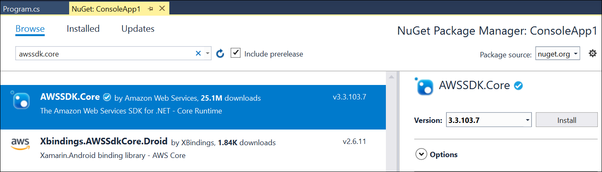

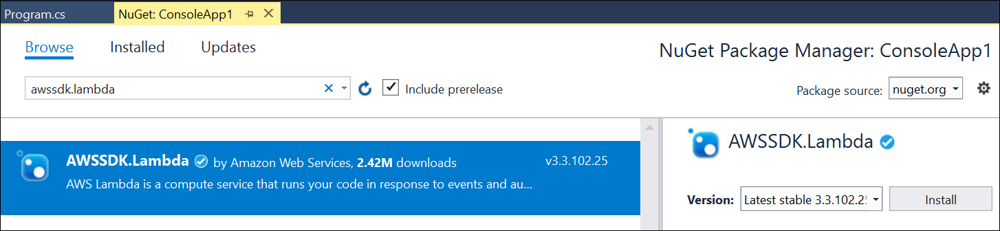

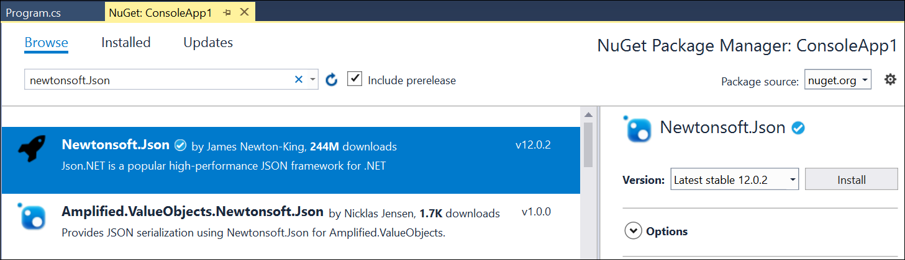

Step 3: Include the following namespaces in **Program.cs** file.



using Amazon;
using Amazon.Lambda;
using Amazon.Lambda.Model;
using Newtonsoft.Json;




Step 4: Add the following code snippet in **Program** class to invoke the published AWS Lambda function using the function name and access keys.





//Create a new AmazonLambdaClient
AmazonLambdaClient client = new AmazonLambdaClient("awsaccessKeyID", "awsSecreteAccessKey", RegionEndpoint.USEast2);
 
//Create new InvokeRequest with published function name.
InvokeRequest invoke = new InvokeRequest
{
    FunctionName = "MyNewFunction",
    InvocationType = InvocationType.RequestResponse,
    Payload = "\"Test\""
};
//Get the InvokeResponse from client InvokeRequest.
InvokeResponse response = client.Invoke(invoke);
 
//Read the response stream
var stream = new StreamReader(response.Payload);
JsonReader reader = new JsonTextReader(stream);
var serilizer = new JsonSerializer();
var responseText = serilizer.Deserialize(reader);
//Convert Base64String into PDF document
byte[] bytes = Convert.FromBase64String(responseText.ToString());
FileStream fileStream = new FileStream("Sample.pdf", FileMode.Create);
BinaryWriter writer = new BinaryWriter(fileStream);
writer.Write(bytes, 0, bytes.Length);
writer.Close();
System.Diagnostics.Process.Start("Sample.pdf");




By executing the program, you will get the PDF document as follows.

The samples of AWS Lambda and console applications are attached in this article for your reference. Find the samples from the following location.

**AWS Lambda**: [MyLambdaFunction](https://github.com/SyncfusionExamples/Word-To-PDF-Examples/tree/master/AWS-Lambda/MyLamdaProject)

**Console sample**: [Console-App-.NET-Core](https://github.com/SyncfusionExamples/Word-To-PDF-Examples/tree/master/AWS-Lambda/Console-App-.NET-Core)

Take a moment to peruse the [documentation](https://help.syncfusion.com/file-formats/docio/getting-started), where you can find basic Word document processing options along with features like [mail merge](https://help.syncfusion.com/file-formats/docio/working-with-mail-merge), [merge](https://help.syncfusion.com/file-formats/docio/word-document/merging-word-documents) and [split](https://help.syncfusion.com/file-formats/docio/word-document/split-word-documents) documents, [find and replace](https://help.syncfusion.com/file-formats/docio/working-with-find-and-replace) text in the Word document, [protect](https://help.syncfusion.com/file-formats/docio/working-with-security) the Word documents, and most importantly [PDF](https://help.syncfusion.com/file-formats/docio/word-to-pdf) and [Image](https://help.syncfusion.com/file-formats/docio/word-to-image) conversions with code examples.

Explore more about the rich set of Syncfusion [Word Framework](https://www.syncfusion.com/word-framework) features.

N> Starting with v16.2.0.x, if you reference Syncfusion assemblies from trial setup or from the NuGet feed, include a license key in your projects. Refer to [link](https://help.syncfusion.com/common/essential-studio/licensing/overview) to learn about generating and registering Syncfusion license key in your application to use the components without trail message.