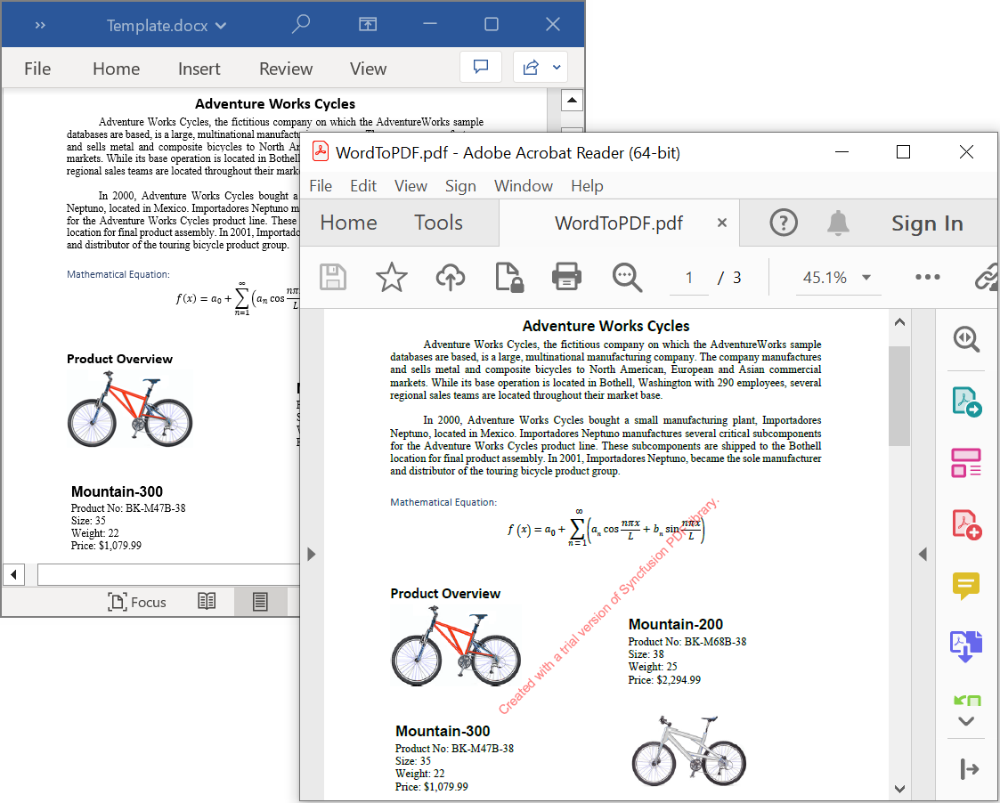

# Convert Word document to PDF in Windows Forms

Syncfusion DocIO is a [.NET Word library](https://www.syncfusion.com/document-processing/word-framework/net/word-library) used to **create, read, edit and convert Word documents** programmatically without **Microsoft Word** or interop dependencies. Using this library, you can **convert Word document to PDF in Windows Forms**.

## Steps to convert Word document to PDF programmatically:

Step 1: Create a new Windows Forms application project.

Step 2: Install [Syncfusion.DocToPdfConverter.WinForms](https://www.nuget.org/packages/Syncfusion.DocToPdfConverter.WinForms/) NuGet package as a reference to your Windows Forms application from the [NuGet.org](https://www.nuget.org/).

N> Starting with v16.2.0.x, if you reference Syncfusion assemblies from trial setup or from the NuGet feed, you also have to add "Syncfusion.Licensing" assembly reference and include a license key in your projects. Please refer to this [link](https://help.syncfusion.com/common/essential-studio/licensing/overview) to know about registering Syncfusion license key in your application to use our components.

Step 3: Include the following namespaces in the **Form1.Designer.cs** file.





using Syncfusion.DocIO;
using Syncfusion.DocIO.DLS;
using Syncfusion.DocToPDFConverter;
using Syncfusion.OfficeChartToImageConverter;
using Syncfusion.Pdf;




Step 4: Add a new button in **Form1.Designer.cs** to create Word file as follows.





private Button WordToPDF;
private Label label;

private void InitializeComponent()
{
    label = new Label();
    WordToPDF = new Button();

    //Label
    label.Location = new System.Drawing.Point(0, 40);
    label.Size = new System.Drawing.Size(426, 35);
    label.Text = "Click the button to view a Word document generated by Essential DocIO. Please note that Microsoft Word Viewer or Microsoft Word is required to view the resultant Word document";
    label.TextAlign = System.Drawing.ContentAlignment.MiddleCenter;

    //Button
    WordToPDF.Location = new System.Drawing.Point(180, 110);
    WordToPDF.Size = new System.Drawing.Size(85, 36);
    WordToPDF.Text = "Convert Word document to PDF";
    WordToPDF.Click += new EventHandler(WordToPDF_Click);

    //Word to PDF.
    ClientSize = new System.Drawing.Size(450, 150);
    Controls.Add(label);
    Controls.Add(WordToPDF);
    Text = "Convert Word document to PDF";
}




Step 5: Add the following code in **WordToPDF_Click** to **open an existing Word document in Windows-Forms**.




//Open an existing Word document.
WordDocument wordDocument = new WordDocument("Input.docx");





Step 6: Add below code example to convert the Word document to PDF.




//Initializes the ChartToImageConverter for converting charts during Word to PDF conversion.
wordDocument.ChartToImageConverter = new ChartToImageConverter();
//Creates an instance of the DocToPDFConverter.
DocToPDFConverter converter = new DocToPDFConverter();
//Converts the Word document to a PDF document.
PdfDocument pdfDocument = converter.ConvertToPDF(wordDocument);




Step 7: Add below code example to **save the Word document in Windows Forms**.




//Saves the resulting PDF document to the specified output path.
pdfDocument.Save("WordToPDF.pdf");




By executing the program, you will get the **Word document** as follows.

