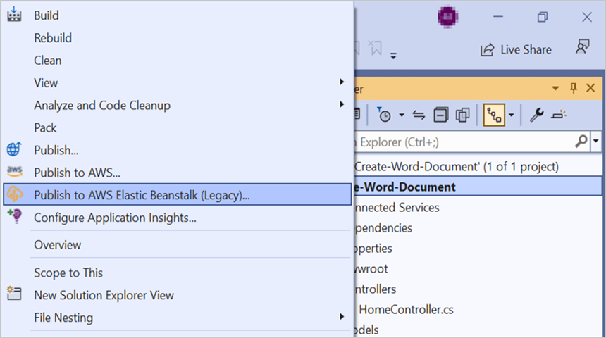
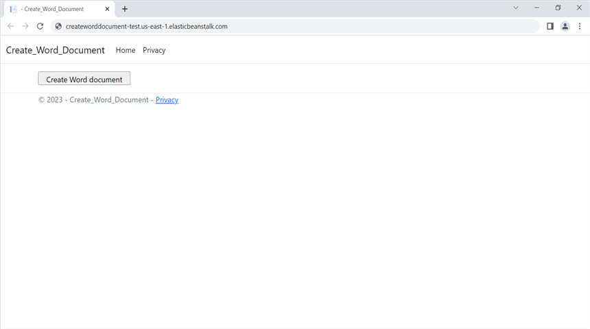

# Create Word document in AWS Elastic Beanstalk

Syncfusion Essential DocIO is a [.NET Core Word library](https://www.syncfusion.com/document-processing/word-framework/net-core/word-library) used to create, read, edit, and convert Word documents programmatically without **Microsoft Word** or interop dependencies. Using this library, you can **create a Word document in AWS Elastic Beanstalk**.

## Steps to create Word document in AWS Elastic Beanstalk

Step 1: Create a new ASP.NET Core Web application (Model-View-Controller) project.

Step 2: Install the [Syncfusion.DocIO.Net.Core](https://www.nuget.org/packages/Syncfusion.DocIO.Net.Core) NuGet package as a reference to your project from [NuGet.org](https://www.nuget.org/).

N> Starting with v16.2.0.x, if you reference Syncfusion assemblies from trial setup or from the NuGet feed, you also have to add "Syncfusion.Licensing" assembly reference and include a license key in your projects. Please refer to this [link](https://help.syncfusion.com/common/essential-studio/licensing/overview) to know about registering Syncfusion license key in your application to use our components.

Step 3: Include the following namespaces in the **HomeController.cs** file.




using Syncfusion.DocIO;
using Syncfusion.DocIO.DLS;




Step 4: A default action method named Index will be present in HomeController.cs. Right click on Index method and select **Go To View** where you will be directed to its associated view page **Index.cshtml**.

Step 5: Add a new button in the **Index.cshtml** as shown below.




@{
    Html.BeginForm("CreateWordDocument", "Home", FormMethod.Get);
    {
        

           <input type="submit" value="Create Word document" style="width:200px;height:27px" />
        

    }
    Html.EndForm();
}




Step 6: Add a new action method **CreateWordDocument** in HomeController.cs and include the below code snippet to **create a Word document** and download it.




//Creating a new document.
using (WordDocument document = new WordDocument())
{
    //Adding a new section to the document.
    WSection section = document.AddSection() as WSection;
    //Set Margin of the section.
    section.PageSetup.Margins.All = 72;
    //Set page size of the section.
    section.PageSetup.PageSize = new Syncfusion.Drawing.SizeF(612, 792);

    //Create Paragraph styles.
    WParagraphStyle style = document.AddParagraphStyle("Normal") as WParagraphStyle;
    style.CharacterFormat.FontName = "Calibri";
    style.CharacterFormat.FontSize = 11f;
    style.ParagraphFormat.BeforeSpacing = 0;
    style.ParagraphFormat.AfterSpacing = 8;
    style.ParagraphFormat.LineSpacing = 13.8f;

    style = document.AddParagraphStyle("Heading 1") as WParagraphStyle;
    style.ApplyBaseStyle("Normal");
    style.CharacterFormat.FontName = "Calibri Light";
    style.CharacterFormat.FontSize = 16f;
    style.CharacterFormat.TextColor = Syncfusion.Drawing.Color.FromArgb(46, 116, 181);
    style.ParagraphFormat.BeforeSpacing = 12;
    style.ParagraphFormat.AfterSpacing = 0;
    style.ParagraphFormat.Keep = true;
    style.ParagraphFormat.KeepFollow = true;
    style.ParagraphFormat.OutlineLevel = OutlineLevel.Level1;
    IWParagraph paragraph = section.HeadersFooters.Header.AddParagraph();

    // Gets the image stream.
    FileStream imageStream = new FileStream(Path.GetFullPath("wwwroot/Data/AdventureCycle.jpg"), FileMode.Open, FileAccess.Read);
    IWPicture picture = paragraph.AppendPicture(imageStream);
    picture.TextWrappingStyle = TextWrappingStyle.InFrontOfText;
    picture.VerticalOrigin = VerticalOrigin.Margin;
    picture.VerticalPosition = -45;
    picture.HorizontalOrigin = HorizontalOrigin.Column;
    picture.HorizontalPosition = 263.5f;
    picture.WidthScale = 20;
    picture.HeightScale = 15;

    paragraph.ApplyStyle("Normal");
    paragraph.ParagraphFormat.HorizontalAlignment = HorizontalAlignment.Left;
    WTextRange textRange = paragraph.AppendText("Adventure Works Cycles") as WTextRange;
    textRange.CharacterFormat.FontSize = 12f;
    textRange.CharacterFormat.FontName = "Calibri";
    textRange.CharacterFormat.TextColor = Syncfusion.Drawing.Color.Red;

    //Appends paragraph.
    paragraph = section.AddParagraph();
    paragraph.ApplyStyle("Heading 1");
    paragraph.ParagraphFormat.HorizontalAlignment = HorizontalAlignment.Center;
    textRange = paragraph.AppendText("Adventure Works Cycles") as WTextRange;
    textRange.CharacterFormat.FontSize = 18f;
    textRange.CharacterFormat.FontName = "Calibri";

    //Appends paragraph.
    paragraph = section.AddParagraph();
    paragraph.ParagraphFormat.FirstLineIndent = 36;
    paragraph.BreakCharacterFormat.FontSize = 12f;
    textRange = paragraph.AppendText("Adventure Works Cycles, the fictitious company on which the AdventureWorks sample databases are based, is a large, multinational manufacturing company. The company manufactures and sells metal and composite bicycles to North American, European and Asian commercial markets. While its base operation is in Bothell, Washington with 290 employees, several regional sales teams are located throughout their market base.") as WTextRange;
    textRange.CharacterFormat.FontSize = 12f;

    //Appends paragraph.
    paragraph = section.AddParagraph();
    paragraph.ParagraphFormat.FirstLineIndent = 36;
    paragraph.BreakCharacterFormat.FontSize = 12f;
    textRange = paragraph.AppendText("In 2000, AdventureWorks Cycles bought a small manufacturing plant, Importadores Neptuno, located in Mexico. Importadores Neptuno manufactures several critical subcomponents for the AdventureWorks Cycles product line. These subcomponents are shipped to the Bothell location for final product assembly. In 2001, Importadores Neptuno, became the sole manufacturer and distributor of the touring bicycle product group.") as WTextRange;
    textRange.CharacterFormat.FontSize = 12f;

    paragraph = section.AddParagraph();
    paragraph.ApplyStyle("Heading 1");
    paragraph.ParagraphFormat.HorizontalAlignment = HorizontalAlignment.Left;
    textRange = paragraph.AppendText("Product Overview") as WTextRange;
    textRange.CharacterFormat.FontSize = 16f;
    textRange.CharacterFormat.FontName = "Calibri";
    //Appends table.
    IWTable table = section.AddTable();
    table.ResetCells(3, 2);
    table.TableFormat.Borders.BorderType = BorderStyle.None;
    table.TableFormat.IsAutoResized = true;

    //Appends paragraph.
    paragraph = table[0, 0].AddParagraph();
    paragraph.ParagraphFormat.AfterSpacing = 0;
    paragraph.BreakCharacterFormat.FontSize = 12f;
    //Appends picture to the paragraph.
    FileStream image1 = new FileStream(Path.GetFullPath("wwwroot/Data/Mountain-200.jpg"), FileMode.Open, FileAccess.Read);
    picture = paragraph.AppendPicture(image1);
    picture.TextWrappingStyle = TextWrappingStyle.TopAndBottom;
    picture.VerticalOrigin = VerticalOrigin.Paragraph;
    picture.VerticalPosition = 4.5f;
    picture.HorizontalOrigin = HorizontalOrigin.Column;
    picture.HorizontalPosition = -2.15f;
    picture.WidthScale = 79;
    picture.HeightScale = 79;

    //Appends paragraph.
    paragraph = table[0, 1].AddParagraph();
    paragraph.ApplyStyle("Heading 1");
    paragraph.ParagraphFormat.AfterSpacing = 0;
    paragraph.ParagraphFormat.LineSpacing = 12f;
    paragraph.AppendText("Mountain-200");
    //Appends paragraph.
    paragraph = table[0, 1].AddParagraph();
    paragraph.ParagraphFormat.AfterSpacing = 0;
    paragraph.ParagraphFormat.LineSpacing = 12f;
    paragraph.BreakCharacterFormat.FontSize = 12f;
    paragraph.BreakCharacterFormat.FontName = "Times New Roman";

    textRange = paragraph.AppendText("Product No: BK-M68B-38\r") as WTextRange;
    textRange.CharacterFormat.FontSize = 12f;
    textRange.CharacterFormat.FontName = "Times New Roman";
    textRange = paragraph.AppendText("Size: 38\r") as WTextRange;
    textRange.CharacterFormat.FontSize = 12f;
    textRange.CharacterFormat.FontName = "Times New Roman";
    textRange = paragraph.AppendText("Weight: 25\r") as WTextRange;
    textRange.CharacterFormat.FontSize = 12f;
    textRange.CharacterFormat.FontName = "Times New Roman";
    textRange = paragraph.AppendText("Price: $2,294.99\r") as WTextRange;
    textRange.CharacterFormat.FontSize = 12f;
    textRange.CharacterFormat.FontName = "Times New Roman";
    //Appends paragraph.
    paragraph = table[0, 1].AddParagraph();
    paragraph.ParagraphFormat.AfterSpacing = 0;
    paragraph.ParagraphFormat.LineSpacing = 12f;
    paragraph.BreakCharacterFormat.FontSize = 12f;

    //Appends paragraph.
    paragraph = table[1, 0].AddParagraph();
    paragraph.ApplyStyle("Heading 1");
    paragraph.ParagraphFormat.AfterSpacing = 0;
    paragraph.ParagraphFormat.LineSpacing = 12f;
    paragraph.AppendText("Mountain-300 ");
    //Appends paragraph.
    paragraph = table[1, 0].AddParagraph();
    paragraph.ParagraphFormat.AfterSpacing = 0;
    paragraph.ParagraphFormat.LineSpacing = 12f;
    paragraph.BreakCharacterFormat.FontSize = 12f;
    paragraph.BreakCharacterFormat.FontName = "Times New Roman";
    textRange = paragraph.AppendText("Product No: BK-M47B-38\r") as WTextRange;
    textRange.CharacterFormat.FontSize = 12f;
    textRange.CharacterFormat.FontName = "Times New Roman";
    textRange = paragraph.AppendText("Size: 35\r") as WTextRange;
    textRange.CharacterFormat.FontSize = 12f;
    textRange.CharacterFormat.FontName = "Times New Roman";
    textRange = paragraph.AppendText("Weight: 22\r") as WTextRange;
    textRange.CharacterFormat.FontSize = 12f;
    textRange.CharacterFormat.FontName = "Times New Roman";
    textRange = paragraph.AppendText("Price: $1,079.99\r") as WTextRange;
    textRange.CharacterFormat.FontSize = 12f;
    textRange.CharacterFormat.FontName = "Times New Roman";
    //Appends paragraph.
    paragraph = table[1, 0].AddParagraph();
    paragraph.ParagraphFormat.AfterSpacing = 0;
    paragraph.ParagraphFormat.LineSpacing = 12f;
    paragraph.BreakCharacterFormat.FontSize = 12f;

    //Appends paragraph.
    paragraph = table[1, 1].AddParagraph();
    paragraph.ApplyStyle("Heading 1");
    paragraph.ParagraphFormat.LineSpacing = 12f;
    //Appends picture to the paragraph.
    FileStream image2 = new FileStream(Path.GetFullPath("wwwroot/Data/Mountain-300.jpg"), FileMode.Open, FileAccess.Read);
    picture = paragraph.AppendPicture(image2);
    picture.TextWrappingStyle = TextWrappingStyle.TopAndBottom;
    picture.VerticalOrigin = VerticalOrigin.Paragraph;
    picture.VerticalPosition = 8.2f;
    picture.HorizontalOrigin = HorizontalOrigin.Column;
    picture.HorizontalPosition = -14.95f;
    picture.WidthScale = 75;
    picture.HeightScale = 75;

    //Appends paragraph.
    paragraph = table[2, 0].AddParagraph();
    paragraph.ApplyStyle("Heading 1");
    paragraph.ParagraphFormat.LineSpacing = 12f;
    //Appends picture to the paragraph.
    FileStream image3 = new FileStream(Path.GetFullPath("wwwroot/Data/Road-550-W.jpg"), FileMode.Open, FileAccess.Read);
    picture = paragraph.AppendPicture(image3);
    picture.TextWrappingStyle = TextWrappingStyle.TopAndBottom;
    picture.VerticalOrigin = VerticalOrigin.Paragraph;
    picture.VerticalPosition = 3.75f;
    picture.HorizontalOrigin = HorizontalOrigin.Column;
    picture.HorizontalPosition = -5f;
    picture.WidthScale = 92;
    picture.HeightScale = 92;

    //Appends paragraph.
    paragraph = table[2, 1].AddParagraph();
    paragraph.ApplyStyle("Heading 1");
    paragraph.ParagraphFormat.AfterSpacing = 0;
    paragraph.ParagraphFormat.LineSpacing = 12f;
    paragraph.AppendText("Road-150 ");
    //Appends paragraph.
    paragraph = table[2, 1].AddParagraph();
    paragraph.ParagraphFormat.AfterSpacing = 0;
    paragraph.ParagraphFormat.LineSpacing = 12f;
    paragraph.BreakCharacterFormat.FontSize = 12f;
    paragraph.BreakCharacterFormat.FontName = "Times New Roman";
    textRange = paragraph.AppendText("Product No: BK-R93R-44\r") as WTextRange;
    textRange.CharacterFormat.FontSize = 12f;
    textRange.CharacterFormat.FontName = "Times New Roman";
    textRange = paragraph.AppendText("Size: 44\r") as WTextRange;
    textRange.CharacterFormat.FontSize = 12f;
    textRange.CharacterFormat.FontName = "Times New Roman";
    textRange = paragraph.AppendText("Weight: 14\r") as WTextRange;
    textRange.CharacterFormat.FontSize = 12f;
    textRange.CharacterFormat.FontName = "Times New Roman";
    textRange = paragraph.AppendText("Price: $3,578.27\r") as WTextRange;
    textRange.CharacterFormat.FontSize = 12f;
    textRange.CharacterFormat.FontName = "Times New Roman";
    //Appends paragraph.
    section.AddParagraph();

    //Saves the Word document to MemoryStream.
    MemoryStream stream = new MemoryStream();
    document.Save(stream, FormatType.Docx);

    //Download Word document in the browser.
    return File(stream, "application/msword", "Sample.docx");
}




## Steps to publish in AWS Elastic Beanstalk

Step 1: Right-click the project and select **Publish to AWS Elastic Beanstalk (Legacy)** option.

Step 2: Select the **Deployment Target** as **Create a new application environment** and click **Next** button.

Step 3: Choose the **Environment Name** in the dropdown list and the **URL** will be automatically assign and check the URL is available, if available click next otherwise change the **URL**. 

Step 4: Select the instance type in **t3a.micro** from the dropdown list and click next.

Step 5: Select the required permission from both the **Deployed Application Permission** and **Service Permissions** dropdown boxes, and then click the **Next** button to proceed further.

Step 6: Set the additional build and deployment options, and then click the **Next** button.

Step 7: Click the **Deploy** button to deploy the sample on AWS Elastic Beanstalk.

Step 8: After changing the status from **Updating** to **Environment is healthy**, click the **URL** to open webpage.

Step 9: After opening the provided **URL**, click **Create Document** button to download the Word document.

You can download a complete working sample from GitHub.

By executing the program, you will get the **Word document** as follows.

Click [here](https://www.syncfusion.com/document-processing/word-framework/net-core) to explore the rich set of Syncfusion Word library (DocIO) features. 

An online sample link to [create a Word document](https://ej2.syncfusion.com/aspnetcore/Word/HelloWorld#/material3) in ASP.NET Core.  