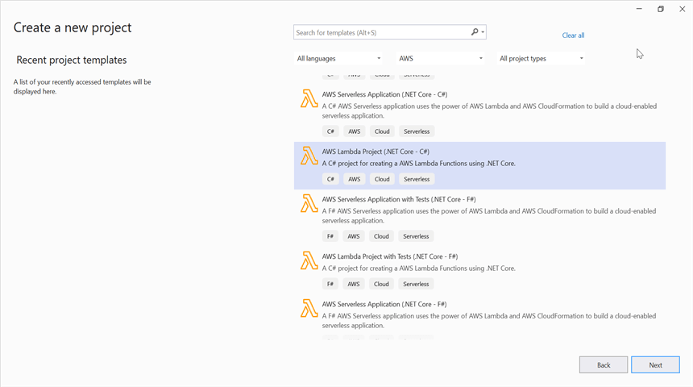
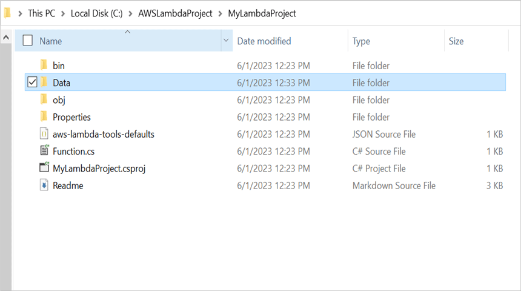
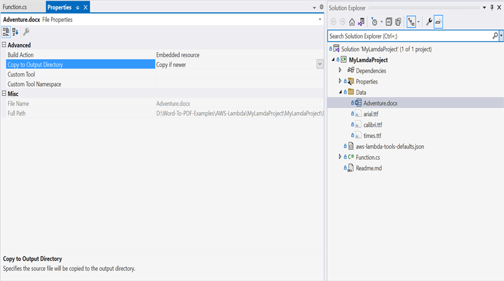
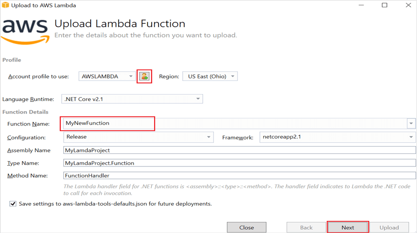
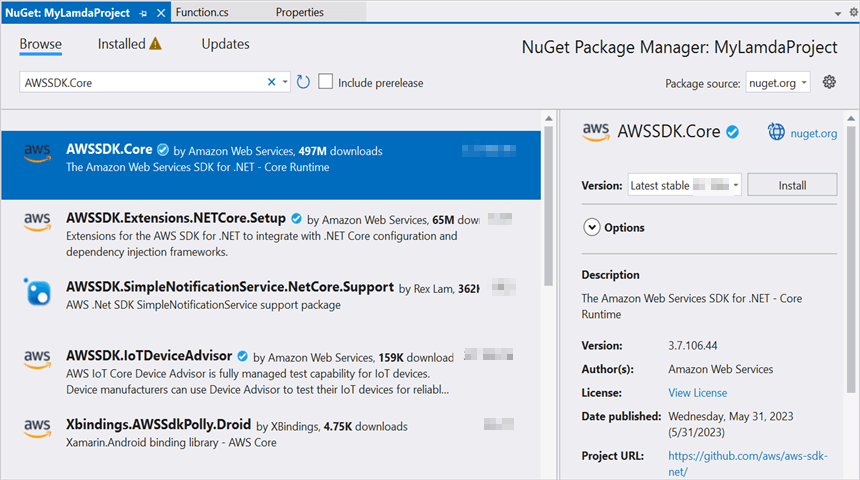
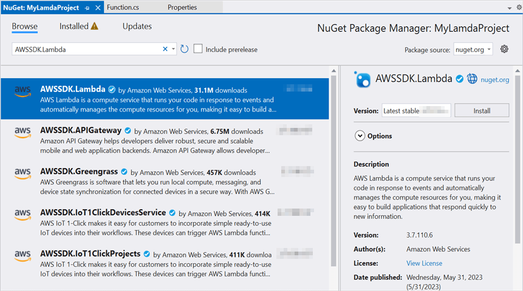
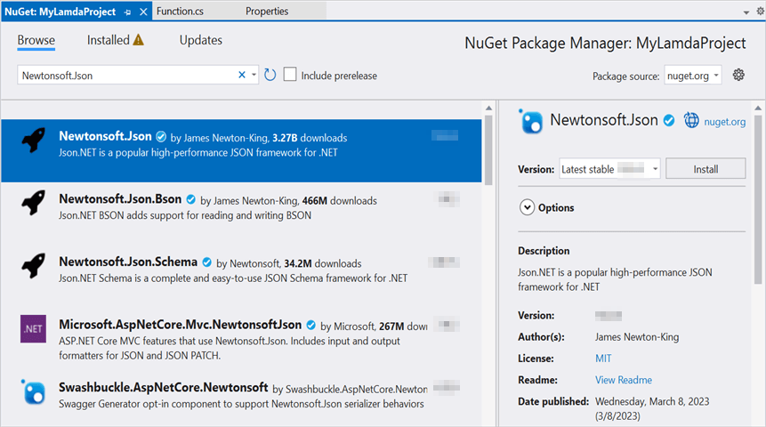

# Create Word document in AWS Lambda

Syncfusion DocIO is a [.NET Core Word library](https://www.syncfusion.com/document-processing/word-framework/net-core/word-library) used to create, read, edit and convert Word documents programmatically without **Microsoft Word** or interop dependencies. Using this library, you can **create a Word document in AWS Lambda**.

## Steps to create Word document in AWS Lambda

Step 1: Create a new **AWS Lambda project** as follows.

Step 2: Select Blueprint as Empty Function and click **Finish**.

Step 3: Install the [Syncfusion.DocIO.Net.Core](https://www.nuget.org/packages/Syncfusion.DocIO.Net.Core) NuGet package as a reference to your project from [NuGet.org](https://www.nuget.org/).

N> Starting with v16.2.0.x, if you reference Syncfusion assemblies from trial setup or from the NuGet feed, you also have to add "Syncfusion.Licensing" assembly reference and include a license key in your projects. Please refer to this [link](https://help.syncfusion.com/common/essential-studio/licensing/overview) to know about registering Syncfusion license key in your application to use our components.

Step 4: Create a folder and copy the required data files and include the files to the project.

Step 5: Set the **copy to output directory** to **Copy if newer** to all the data files.

Step 6: Include the following namespaces in **Function.cs** file.




using Syncfusion.DocIO;
using Syncfusion.DocIO.DLS;




step 7: Add the following code snippet in **Function.cs** to **create a Word document**.




// Creating a new document.
WordDocument document = new WordDocument();
//Adding a new section to the document.
WSection section = document.AddSection() as WSection;
//Set Margin of the section
section.PageSetup.Margins.All = 72;
//Set page size of the section
section.PageSetup.PageSize = new Syncfusion.Drawing.SizeF(612, 792);

//Create Paragraph styles
WParagraphStyle style = document.AddParagraphStyle("Normal") as WParagraphStyle;
style.CharacterFormat.FontName = "Calibri";
style.CharacterFormat.FontSize = 11f;
style.ParagraphFormat.BeforeSpacing = 0;
style.ParagraphFormat.AfterSpacing = 8;
style.ParagraphFormat.LineSpacing = 13.8f;

style = document.AddParagraphStyle("Heading 1") as WParagraphStyle;
style.ApplyBaseStyle("Normal");
style.CharacterFormat.FontName = "Calibri Light";
style.CharacterFormat.FontSize = 16f;
style.CharacterFormat.TextColor = Syncfusion.Drawing.Color.FromArgb(46, 116, 181);
style.ParagraphFormat.BeforeSpacing = 12;
style.ParagraphFormat.AfterSpacing = 0;
style.ParagraphFormat.Keep = true;
style.ParagraphFormat.KeepFollow = true;
style.ParagraphFormat.OutlineLevel = OutlineLevel.Level1;

IWParagraph paragraph = section.HeadersFooters.Header.AddParagraph();
// Gets the image stream.
string filePath = Path.GetFullPath(@"Data/AdventureCycle.jpg");
FileStream imageStream = new FileStream(filePath, FileMode.Open, FileAccess.Read);
IWPicture picture = paragraph.AppendPicture(imageStream);
picture.TextWrappingStyle = TextWrappingStyle.InFrontOfText;
picture.VerticalOrigin = VerticalOrigin.Margin;
picture.VerticalPosition = -45;
picture.HorizontalOrigin = HorizontalOrigin.Column;
picture.HorizontalPosition = 263.5f;
picture.WidthScale = 20;
picture.HeightScale = 15;

paragraph.ApplyStyle("Normal");
paragraph.ParagraphFormat.HorizontalAlignment = HorizontalAlignment.Left;
WTextRange textRange = paragraph.AppendText("Adventure Works Cycles") as WTextRange;
textRange.CharacterFormat.FontSize = 12f;
textRange.CharacterFormat.FontName = "Calibri";
textRange.CharacterFormat.TextColor = Syncfusion.Drawing.Color.Red;

//Appends paragraph.
paragraph = section.AddParagraph();
paragraph.ApplyStyle("Heading 1");
paragraph.ParagraphFormat.HorizontalAlignment = HorizontalAlignment.Center;
textRange = paragraph.AppendText("Adventure Works Cycles") as WTextRange;
textRange.CharacterFormat.FontSize = 18f;
textRange.CharacterFormat.FontName = "Calibri";

//Appends paragraph.
paragraph = section.AddParagraph();
paragraph.ParagraphFormat.FirstLineIndent = 36;
paragraph.BreakCharacterFormat.FontSize = 12f;
textRange = paragraph.AppendText("Adventure Works Cycles, the fictitious company on which the AdventureWorks sample databases are based, is a large, multinational manufacturing company. The company manufactures and sells metal and composite bicycles to North American, European and Asian commercial markets. While its base operation is in Bothell, Washington with 290 employees, several regional sales teams are located throughout their market base.") as WTextRange;
textRange.CharacterFormat.FontSize = 12f;

//Appends paragraph.
paragraph = section.AddParagraph();
paragraph.ParagraphFormat.FirstLineIndent = 36;
paragraph.BreakCharacterFormat.FontSize = 12f;
textRange = paragraph.AppendText("In 2000, AdventureWorks Cycles bought a small manufacturing plant, Importadores Neptuno, located in Mexico. Importadores Neptuno manufactures several critical subcomponents for the AdventureWorks Cycles product line. These subcomponents are shipped to the Bothell location for final product assembly. In 2001, Importadores Neptuno, became the sole manufacturer and distributor of the touring bicycle product group.") as WTextRange;
textRange.CharacterFormat.FontSize = 12f;

paragraph = section.AddParagraph();
paragraph.ApplyStyle("Heading 1");
paragraph.ParagraphFormat.HorizontalAlignment = HorizontalAlignment.Left;
textRange = paragraph.AppendText("Product Overview") as WTextRange;
textRange.CharacterFormat.FontSize = 16f;
textRange.CharacterFormat.FontName = "Calibri";

//Appends table.
IWTable table = section.AddTable();
table.ResetCells(3, 2);
table.TableFormat.Borders.BorderType = BorderStyle.None;
table.TableFormat.IsAutoResized = true;
//Appends paragraph.
paragraph = table[0, 0].AddParagraph();
paragraph.ParagraphFormat.AfterSpacing = 0;
paragraph.BreakCharacterFormat.FontSize = 12f;
//Appends picture to the paragraph.
string filePath1 = Path.GetFullPath(@"Data/Mountain-200.jpg");
FileStream image1 = new FileStream(filePath1, FileMode.Open, FileAccess.Read);
picture = paragraph.AppendPicture(image1);
picture.TextWrappingStyle = TextWrappingStyle.TopAndBottom;
picture.VerticalOrigin = VerticalOrigin.Paragraph;
picture.VerticalPosition = 4.5f;
picture.HorizontalOrigin = HorizontalOrigin.Column;
picture.HorizontalPosition = -2.15f;
picture.WidthScale = 79;
picture.HeightScale = 79;

//Appends paragraph.
paragraph = table[0, 1].AddParagraph();
paragraph.ApplyStyle("Heading 1");
paragraph.ParagraphFormat.AfterSpacing = 0;
paragraph.ParagraphFormat.LineSpacing = 12f;
paragraph.AppendText("Mountain-200");
//Appends paragraph.
paragraph = table[0, 1].AddParagraph();
paragraph.ParagraphFormat.AfterSpacing = 0;
paragraph.ParagraphFormat.LineSpacing = 12f;
paragraph.BreakCharacterFormat.FontSize = 12f;
paragraph.BreakCharacterFormat.FontName = "Times New Roman";
textRange = paragraph.AppendText("Product No: BK-M68B-38\r") as WTextRange;
textRange.CharacterFormat.FontSize = 12f;
textRange.CharacterFormat.FontName = "Times New Roman";
textRange = paragraph.AppendText("Size: 38\r") as WTextRange;
textRange.CharacterFormat.FontSize = 12f;
textRange.CharacterFormat.FontName = "Times New Roman";
textRange = paragraph.AppendText("Weight: 25\r") as WTextRange;
textRange.CharacterFormat.FontSize = 12f;
textRange.CharacterFormat.FontName = "Times New Roman";
textRange = paragraph.AppendText("Price: $2,294.99\r") as WTextRange;
textRange.CharacterFormat.FontSize = 12f;
textRange.CharacterFormat.FontName = "Times New Roman";
//Appends paragraph.
paragraph = table[0, 1].AddParagraph();
paragraph.ParagraphFormat.AfterSpacing = 0;
paragraph.ParagraphFormat.LineSpacing = 12f;
paragraph.BreakCharacterFormat.FontSize = 12f;

//Appends paragraph.
paragraph = table[1, 0].AddParagraph();
paragraph.ApplyStyle("Heading 1");
paragraph.ParagraphFormat.AfterSpacing = 0;
paragraph.ParagraphFormat.LineSpacing = 12f;
paragraph.AppendText("Mountain-300 ");
//Appends paragraph.
paragraph = table[1, 0].AddParagraph();
paragraph.ParagraphFormat.AfterSpacing = 0;
paragraph.ParagraphFormat.LineSpacing = 12f;
paragraph.BreakCharacterFormat.FontSize = 12f;
paragraph.BreakCharacterFormat.FontName = "Times New Roman";
textRange = paragraph.AppendText("Product No: BK-M47B-38\r") as WTextRange;
textRange.CharacterFormat.FontSize = 12f;
textRange.CharacterFormat.FontName = "Times New Roman";
textRange = paragraph.AppendText("Size: 35\r") as WTextRange;
textRange.CharacterFormat.FontSize = 12f;
textRange.CharacterFormat.FontName = "Times New Roman";
textRange = paragraph.AppendText("Weight: 22\r") as WTextRange;
textRange.CharacterFormat.FontSize = 12f;
textRange.CharacterFormat.FontName = "Times New Roman";
textRange = paragraph.AppendText("Price: $1,079.99\r") as WTextRange;
textRange.CharacterFormat.FontSize = 12f;
textRange.CharacterFormat.FontName = "Times New Roman";
//Appends paragraph.
paragraph = table[1, 0].AddParagraph();
paragraph.ParagraphFormat.AfterSpacing = 0;
paragraph.ParagraphFormat.LineSpacing = 12f;
paragraph.BreakCharacterFormat.FontSize = 12f;

//Appends paragraph.
paragraph = table[1, 1].AddParagraph();
paragraph.ApplyStyle("Heading 1");
paragraph.ParagraphFormat.LineSpacing = 12f;
//Appends picture to the paragraph.
string filePath2 = Path.GetFullPath(@"Data/Mountain-300.jpg");
FileStream image2 = new FileStream(filePath2, FileMode.Open, FileAccess.Read);
picture = paragraph.AppendPicture(image2);
picture.TextWrappingStyle = TextWrappingStyle.TopAndBottom;
picture.VerticalOrigin = VerticalOrigin.Paragraph;
picture.VerticalPosition = 8.2f;
picture.HorizontalOrigin = HorizontalOrigin.Column;
picture.HorizontalPosition = -14.95f;
picture.WidthScale = 75;
picture.HeightScale = 75;

//Appends paragraph.
paragraph = table[2, 0].AddParagraph();
paragraph.ApplyStyle("Heading 1");
paragraph.ParagraphFormat.LineSpacing = 12f;
//Appends picture to the paragraph.
string filePath3 = Path.GetFullPath(@"Data/Road-550-W.jpg");
FileStream image3 = new FileStream(filePath3, FileMode.Open, FileAccess.Read);
picture = paragraph.AppendPicture(image3);
picture.TextWrappingStyle = TextWrappingStyle.TopAndBottom;
picture.VerticalOrigin = VerticalOrigin.Paragraph;
picture.VerticalPosition = 3.75f;
picture.HorizontalOrigin = HorizontalOrigin.Column;
picture.HorizontalPosition = -5f;
picture.WidthScale = 92;
picture.HeightScale = 92;

//Appends paragraph.
paragraph = table[2, 1].AddParagraph();
paragraph.ApplyStyle("Heading 1");
paragraph.ParagraphFormat.AfterSpacing = 0;
paragraph.ParagraphFormat.LineSpacing = 12f;
paragraph.AppendText("Road-150 ");
//Appends paragraph.
paragraph = table[2, 1].AddParagraph();
paragraph.ParagraphFormat.AfterSpacing = 0;
paragraph.ParagraphFormat.LineSpacing = 12f;
paragraph.BreakCharacterFormat.FontSize = 12f;
paragraph.BreakCharacterFormat.FontName = "Times New Roman";
textRange = paragraph.AppendText("Product No: BK-R93R-44\r") as WTextRange;
textRange.CharacterFormat.FontSize = 12f;
textRange.CharacterFormat.FontName = "Times New Roman";
textRange = paragraph.AppendText("Size: 44\r") as WTextRange;
textRange.CharacterFormat.FontSize = 12f;
textRange.CharacterFormat.FontName = "Times New Roman";
textRange = paragraph.AppendText("Weight: 14\r") as WTextRange;
textRange.CharacterFormat.FontSize = 12f;
textRange.CharacterFormat.FontName = "Times New Roman";
textRange = paragraph.AppendText("Price: $3,578.27\r") as WTextRange;
textRange.CharacterFormat.FontSize = 12f;
textRange.CharacterFormat.FontName = "Times New Roman";
//Appends paragraph.
section.AddParagraph();

//Save the Word document into stream
MemoryStream stream = new MemoryStream();
document.Save(stream, FormatType.Docx);
return Convert.ToBase64String(stream.ToArray());




Step 8: Right-click the project and select **Publish to AWS Lambda**.

Step 9: Create a new AWS profile in the Upload Lambda Function Window. After creating the profile, add a name for the Lambda function to publish. Then, click **Next**.

Step 10: In the Advanced Function Details window, specify the **Role Name** as based on AWS Managed policy. After selecting the role, click the **Upload** button to deploy your application.

Step 11: After deploying the application, you can see the published Lambda function in **AWS console**.

Step 12: Edit Memory size and Timeout as maximum in Basic settings of the AWS Lambda function.

## Steps to post the request to AWS Lambda

Step 1: Create a new console project.

step 2: Install the following **Nuget packages** in your application from [Nuget.org](https://www.nuget.org/).

* [AWSSDK.Core](https://www.nuget.org/packages/AWSSDK.Core/)
* [AWSSDK.Lambda](https://www.nuget.org/packages/AWSSDK.Lambda/)
* [Newtonsoft.Json](https://www.nuget.org/packages/Newtonsoft.Json/)

Step 3: Include the following namespaces in **Program.cs** file.




using Amazon;
using Amazon.Lambda;
using Amazon.Lambda.Model;
using Newtonsoft.Json;




Step 4: Add the following code snippet in **Program.cs** to invoke the published AWS Lambda function using the function name and access keys.




//Create a new AmazonLambdaClient
AmazonLambdaClient client = new AmazonLambdaClient("awsaccessKeyID", "awsSecreteAccessKey", RegionEndpoint.USEast2);
//Create new InvokeRequest with published function name.
InvokeRequest invoke = new InvokeRequest
{
    FunctionName = "MyNewFunction",
    InvocationType = InvocationType.RequestResponse,
    Payload = "\"Test\""
};
//Get the InvokeResponse from client InvokeRequest.
InvokeResponse response = client.Invoke(invoke);
//Read the response stream
var stream = new StreamReader(response.Payload);
JsonReader reader = new JsonTextReader(stream);
var serilizer = new JsonSerializer();
var responseText = serilizer.Deserialize(reader);
//Convert Base64String into Word document
byte[] bytes = Convert.FromBase64String(responseText.ToString());
FileStream fileStream = new FileStream("Sample.docx", FileMode.Create);
BinaryWriter writer = new BinaryWriter(fileStream);
writer.Write(bytes, 0, bytes.Length);
writer.Close();
System.Diagnostics.Process.Start("Sample.docx");




By executing the program, you will get the **Word document** as follows.

From GitHub, you can download the [console application](https://github.com/SyncfusionExamples/DocIO-Examples/tree/main/Word-to-Image-conversion/Convert-Word-to-image/AWS/Console_Application) and [AWS Lambda](https://github.com/SyncfusionExamples/DocIO-Examples/tree/main/Word-to-Image-conversion/Convert-Word-to-image/AWS/AWS_Lambda) project.

Click [here](https://www.syncfusion.com/document-processing/word-framework/net-core) to explore the rich set of Syncfusion Word library (DocIO) features. 

An online sample link to [create a Word document](https://ej2.syncfusion.com/aspnetcore/Word/HelloWorld#/material3) in ASP.NET Core. 