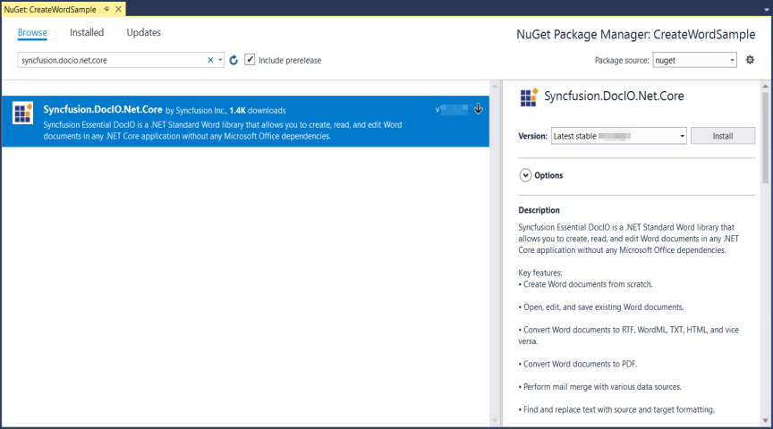
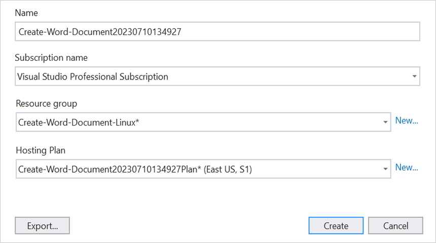
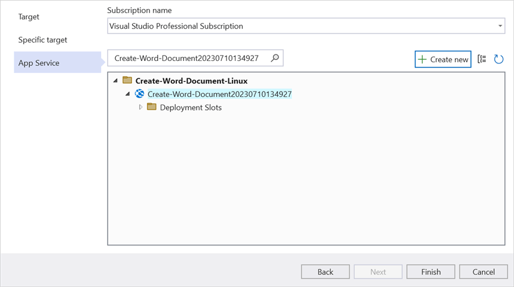
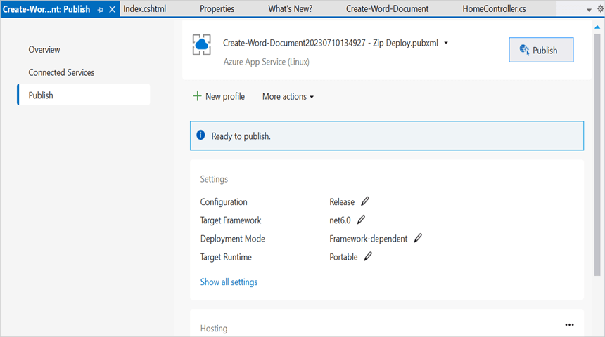
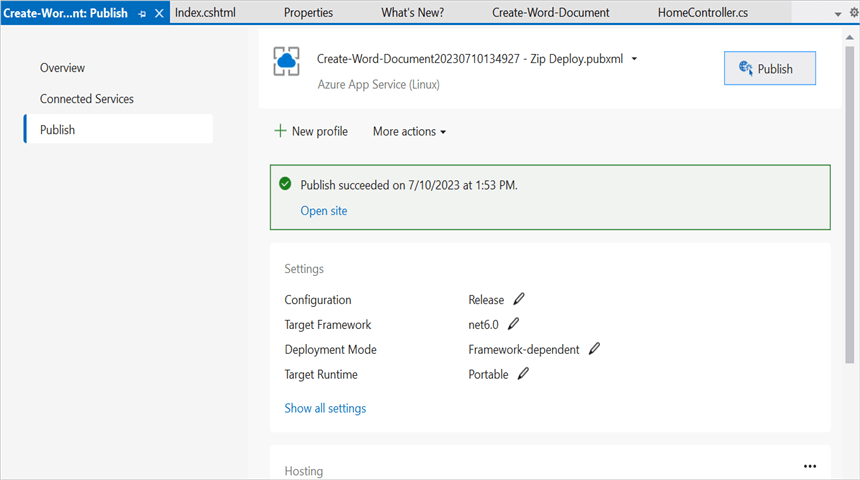
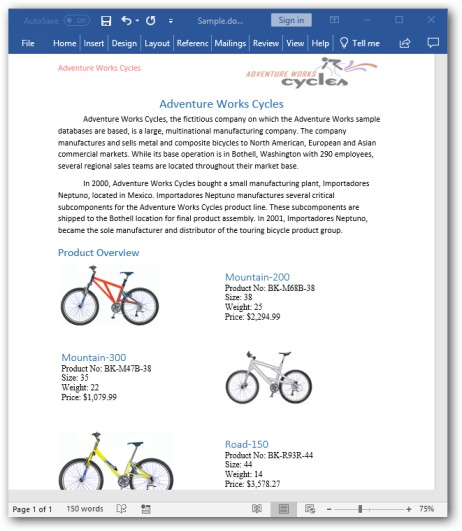

# Create Word document in Azure App Service on Linux

Syncfusion DocIO is a [.NET Core Word library](https://www.syncfusion.com/document-processing/word-framework/net-core/word-library) used to create, read, edit and convert Word documents programmatically without **Microsoft Word** or interop dependencies. Using this library, you can **create Word document in Azure App service on Linux**.

## Steps to create Word document in Azure App Service on Linux

Step 1: Create a new ASP.NET Core Web App (Model-View-Controller).

Step 2: Create a project name and select the location.

Step 3: Click **Create** button.

Step 4: Install the [Syncfusion.DocIO.Net.Core](https://www.nuget.org/packages/Syncfusion.DocIO.Net.Core) NuGet package as a reference to your project from [NuGet.org](https://www.nuget.org/).

N> Starting with v16.2.0.x, if you reference Syncfusion assemblies from trial setup or from the NuGet feed, you also have to add "Syncfusion.Licensing" assembly reference and include a license key in your projects. Please refer to this [link](https://help.syncfusion.com/common/essential-studio/licensing/overview) to know about registering Syncfusion license key in your application to use our components.

Step 5: Add a new button in the **Index.cshtml** as shown below.




@{
    Html.BeginForm("CreateWordDocument", "Home", FormMethod.Get);
    {
        

            <input type="submit" value="Create Word Document" style="width:200px;height:27px" />
        

    }
    Html.EndForm();
}




Step 6: Include the following namespaces in **HomeController.cs**.




using Syncfusion.DocIO;
using Syncfusion.DocIO.DLS;




Step 7: Include the below code snippet in **HomeController.cs** for **create a Word document**.




private readonly IWebHostEnvironment _hostingEnvironment;
public HomeController(IWebHostEnvironment hostingEnvironment)
{
  _hostingEnvironment = hostingEnvironment;
}

public ActionResult CreateWordDocument()
{
    //Creating a new document.
    using (WordDocument document = new WordDocument())
    {
        //Adding a new section to the document.
        WSection section = document.AddSection() as WSection;
        //Set Margin of the section.
        section.PageSetup.Margins.All = 72;
        //Set page size of the section.
        section.PageSetup.PageSize = new Syncfusion.Drawing.SizeF(612, 792);

        //Create Paragraph styles.
        WParagraphStyle style = document.AddParagraphStyle("Normal") as WParagraphStyle;
        style.CharacterFormat.FontName = "Calibri";
        style.CharacterFormat.FontSize = 11f;
        style.ParagraphFormat.BeforeSpacing = 0;
        style.ParagraphFormat.AfterSpacing = 8;
        style.ParagraphFormat.LineSpacing = 13.8f;

        style = document.AddParagraphStyle("Heading 1") as WParagraphStyle;
        style.ApplyBaseStyle("Normal");
        style.CharacterFormat.FontName = "Calibri Light";
        style.CharacterFormat.FontSize = 16f;
        style.CharacterFormat.TextColor = Syncfusion.Drawing.Color.FromArgb(46, 116, 181);
        style.ParagraphFormat.BeforeSpacing = 12;
        style.ParagraphFormat.AfterSpacing = 0;
        style.ParagraphFormat.Keep = true;
        style.ParagraphFormat.KeepFollow = true;
        style.ParagraphFormat.OutlineLevel = OutlineLevel.Level1;
        IWParagraph paragraph = section.HeadersFooters.Header.AddParagraph();

        //Appends picture to the paragraph.
        string imagePath = Path.Combine(_hostingEnvironment.WebRootPath, "Data/AdventureCycle.jpg");
        using FileStream imageStream = new FileStream(imagePath, FileMode.Open, FileAccess.Read);           
        IWPicture picture = paragraph.AppendPicture(imageStream);
        picture.TextWrappingStyle = TextWrappingStyle.InFrontOfText;
        picture.VerticalOrigin = VerticalOrigin.Margin;
        picture.VerticalPosition = -45;
        picture.HorizontalOrigin = HorizontalOrigin.Column;
        picture.HorizontalPosition = 263.5f;
        picture.WidthScale = 20;
        picture.HeightScale = 15;

        paragraph.ApplyStyle("Normal");
        paragraph.ParagraphFormat.HorizontalAlignment = HorizontalAlignment.Left;
        WTextRange textRange = paragraph.AppendText("Adventure Works Cycles") as WTextRange;
        textRange.CharacterFormat.FontSize = 12f;
        textRange.CharacterFormat.FontName = "Calibri";
        textRange.CharacterFormat.TextColor = Syncfusion.Drawing.Color.Red;

        //Appends paragraph.
        paragraph = section.AddParagraph();
        paragraph.ApplyStyle("Heading 1");
        paragraph.ParagraphFormat.HorizontalAlignment = HorizontalAlignment.Center;
        textRange = paragraph.AppendText("Adventure Works Cycles") as WTextRange;
        textRange.CharacterFormat.FontSize = 18f;
        textRange.CharacterFormat.FontName = "Calibri";

        //Appends paragraph.
        paragraph = section.AddParagraph();
        paragraph.ParagraphFormat.FirstLineIndent = 36;
        paragraph.BreakCharacterFormat.FontSize = 12f;
        textRange = paragraph.AppendText("Adventure Works Cycles, the fictitious company on which the AdventureWorks sample databases are based, is a large, multinational manufacturing company. The company manufactures and sells metal and composite bicycles to North American, European and Asian commercial markets. While its base operation is in Bothell, Washington with 290 employees, several regional sales teams are located throughout their market base.") as WTextRange;
        textRange.CharacterFormat.FontSize = 12f;

        //Appends paragraph.
        paragraph = section.AddParagraph();
        paragraph.ParagraphFormat.FirstLineIndent = 36;
        paragraph.BreakCharacterFormat.FontSize = 12f;
        textRange = paragraph.AppendText("In 2000, AdventureWorks Cycles bought a small manufacturing plant, Importadores Neptuno, located in Mexico. Importadores Neptuno manufactures several critical subcomponents for the AdventureWorks Cycles product line. These subcomponents are shipped to the Bothell location for final product assembly. In 2001, Importadores Neptuno, became the sole manufacturer and distributor of the touring bicycle product group.") as WTextRange;
        textRange.CharacterFormat.FontSize = 12f;

        paragraph = section.AddParagraph();
        paragraph.ApplyStyle("Heading 1");
        paragraph.ParagraphFormat.HorizontalAlignment = HorizontalAlignment.Left;
        textRange = paragraph.AppendText("Product Overview") as WTextRange;
        textRange.CharacterFormat.FontSize = 16f;
        textRange.CharacterFormat.FontName = "Calibri";
        //Appends table.
        IWTable table = section.AddTable();
        table.ResetCells(3, 2);
        table.TableFormat.Borders.BorderType = BorderStyle.None;
        table.TableFormat.IsAutoResized = true;

        //Appends paragraph.
        paragraph = table[0, 0].AddParagraph();
        paragraph.ParagraphFormat.AfterSpacing = 0;
        paragraph.BreakCharacterFormat.FontSize = 12f;
        //Appends picture to the paragraph.
        string imagePath1 = Path.Combine(_hostingEnvironment.WebRootPath, "Data/Mountain-200.jpg");
        using FileStream image1 = new FileStream(imagePath1, FileMode.Open, FileAccess.Read);
        picture = paragraph.AppendPicture(image1);
        picture.TextWrappingStyle = TextWrappingStyle.TopAndBottom;
        picture.VerticalOrigin = VerticalOrigin.Paragraph;
        picture.VerticalPosition = 4.5f;
        picture.HorizontalOrigin = HorizontalOrigin.Column;
        picture.HorizontalPosition = -2.15f;
        picture.WidthScale = 79;
        picture.HeightScale = 79;

        //Appends paragraph.
        paragraph = table[0, 1].AddParagraph();
        paragraph.ApplyStyle("Heading 1");
        paragraph.ParagraphFormat.AfterSpacing = 0;
        paragraph.ParagraphFormat.LineSpacing = 12f;
        paragraph.AppendText("Mountain-200");
        //Appends paragraph.
        paragraph = table[0, 1].AddParagraph();
        paragraph.ParagraphFormat.AfterSpacing = 0;
        paragraph.ParagraphFormat.LineSpacing = 12f;
        paragraph.BreakCharacterFormat.FontSize = 12f;
        paragraph.BreakCharacterFormat.FontName = "Times New Roman";

        textRange = paragraph.AppendText("Product No: BK-M68B-38\r") as WTextRange;
        textRange.CharacterFormat.FontSize = 12f;
        textRange.CharacterFormat.FontName = "Times New Roman";
        textRange = paragraph.AppendText("Size: 38\r") as WTextRange;
        textRange.CharacterFormat.FontSize = 12f;
        textRange.CharacterFormat.FontName = "Times New Roman";
        textRange = paragraph.AppendText("Weight: 25\r") as WTextRange;
        textRange.CharacterFormat.FontSize = 12f;
        textRange.CharacterFormat.FontName = "Times New Roman";
        textRange = paragraph.AppendText("Price: $2,294.99\r") as WTextRange;
        textRange.CharacterFormat.FontSize = 12f;
        textRange.CharacterFormat.FontName = "Times New Roman";
        //Appends paragraph.
        paragraph = table[0, 1].AddParagraph();
        paragraph.ParagraphFormat.AfterSpacing = 0;
        paragraph.ParagraphFormat.LineSpacing = 12f;
        paragraph.BreakCharacterFormat.FontSize = 12f;

        //Appends paragraph.
        paragraph = table[1, 0].AddParagraph();
        paragraph.ApplyStyle("Heading 1");
        paragraph.ParagraphFormat.AfterSpacing = 0;
        paragraph.ParagraphFormat.LineSpacing = 12f;
        paragraph.AppendText("Mountain-300 ");
        //Appends paragraph.
        paragraph = table[1, 0].AddParagraph();
        paragraph.ParagraphFormat.AfterSpacing = 0;
        paragraph.ParagraphFormat.LineSpacing = 12f;
        paragraph.BreakCharacterFormat.FontSize = 12f;
        paragraph.BreakCharacterFormat.FontName = "Times New Roman";
        textRange = paragraph.AppendText("Product No: BK-M47B-38\r") as WTextRange;
        textRange.CharacterFormat.FontSize = 12f;
        textRange.CharacterFormat.FontName = "Times New Roman";
        textRange = paragraph.AppendText("Size: 35\r") as WTextRange;
        textRange.CharacterFormat.FontSize = 12f;
        textRange.CharacterFormat.FontName = "Times New Roman";
        textRange = paragraph.AppendText("Weight: 22\r") as WTextRange;
        textRange.CharacterFormat.FontSize = 12f;
        textRange.CharacterFormat.FontName = "Times New Roman";
        textRange = paragraph.AppendText("Price: $1,079.99\r") as WTextRange;
        textRange.CharacterFormat.FontSize = 12f;
        textRange.CharacterFormat.FontName = "Times New Roman";
        //Appends paragraph.
        paragraph = table[1, 0].AddParagraph();
        paragraph.ParagraphFormat.AfterSpacing = 0;
        paragraph.ParagraphFormat.LineSpacing = 12f;
        paragraph.BreakCharacterFormat.FontSize = 12f;

        //Appends paragraph.
        paragraph = table[1, 1].AddParagraph();
        paragraph.ApplyStyle("Heading 1");
        paragraph.ParagraphFormat.LineSpacing = 12f;
        //Appends picture to the paragraph.
        string imagePath2 = Path.Combine(_hostingEnvironment.WebRootPath, "Data/Mountain-200.jpg");
        using FileStream image2 = new FileStream(imagePath2, FileMode.Open, FileAccess.Read);
        picture = paragraph.AppendPicture(image2);
        picture.TextWrappingStyle = TextWrappingStyle.TopAndBottom;
        picture.VerticalOrigin = VerticalOrigin.Paragraph;
        picture.VerticalPosition = 8.2f;
        picture.HorizontalOrigin = HorizontalOrigin.Column;
        picture.HorizontalPosition = -14.95f;
        picture.WidthScale = 75;
        picture.HeightScale = 75;

        //Appends paragraph.
        paragraph = table[2, 0].AddParagraph();
        paragraph.ApplyStyle("Heading 1");
        paragraph.ParagraphFormat.LineSpacing = 12f;
        //Appends picture to the paragraph.
        string imagePath3 = Path.Combine(_hostingEnvironment.WebRootPath, "Data/Mountain-200.jpg");
        using FileStream image3 = new FileStream(imagePath3, FileMode.Open, FileAccess.Read);     
        picture = paragraph.AppendPicture(image3);
        picture.TextWrappingStyle = TextWrappingStyle.TopAndBottom;
        picture.VerticalOrigin = VerticalOrigin.Paragraph;
        picture.VerticalPosition = 3.75f;
        picture.HorizontalOrigin = HorizontalOrigin.Column;
        picture.HorizontalPosition = -5f;
        picture.WidthScale = 92;
        picture.HeightScale = 92;

        //Appends paragraph.
        paragraph = table[2, 1].AddParagraph();
        paragraph.ApplyStyle("Heading 1");
        paragraph.ParagraphFormat.AfterSpacing = 0;
        paragraph.ParagraphFormat.LineSpacing = 12f;
        paragraph.AppendText("Road-150 ");
        //Appends paragraph.
        paragraph = table[2, 1].AddParagraph();
        paragraph.ParagraphFormat.AfterSpacing = 0;
        paragraph.ParagraphFormat.LineSpacing = 12f;
        paragraph.BreakCharacterFormat.FontSize = 12f;
        paragraph.BreakCharacterFormat.FontName = "Times New Roman";
        textRange = paragraph.AppendText("Product No: BK-R93R-44\r") as WTextRange;
        textRange.CharacterFormat.FontSize = 12f;
        textRange.CharacterFormat.FontName = "Times New Roman";
        textRange = paragraph.AppendText("Size: 44\r") as WTextRange;
        textRange.CharacterFormat.FontSize = 12f;
        textRange.CharacterFormat.FontName = "Times New Roman";
        textRange = paragraph.AppendText("Weight: 14\r") as WTextRange;
        textRange.CharacterFormat.FontSize = 12f;
        textRange.CharacterFormat.FontName = "Times New Roman";
        textRange = paragraph.AppendText("Price: $3,578.27\r") as WTextRange;
        textRange.CharacterFormat.FontSize = 12f;
        textRange.CharacterFormat.FontName = "Times New Roman";
        //Appends paragraph.
        section.AddParagraph();

        //Saves the Word document to MemoryStream.
        MemoryStream stream = new MemoryStream();
        document.Save(stream, FormatType.Docx);
        stream.Position = 0;

        //Download Word document in the browser.
        return File(stream, "application/msword", "Sample.docx");
    }
}




## Steps to publish as Azure App Service on Linux

Step 1: Right-click the project and select **Publish** option.

Step 2: Click the **Add a Publish Profile** button.

Step 3: Select the publish target as **Azure**.

Step 4: Select the Specific target as **Azure App Service (Linux)**.

Step 5: To create a new app service, click **Create new** option.

Step 6: Click the **Create** button to proceed with **App Service** creation.

Step 7: Click the **Finish** button to finalize the **App Service** creation.

Step 8: Click **Close** button.

Step 9: Click the **Publish** button.

Step 10: Now, Publish has been succeeded.

Step 11: Now, the published webpage will open in the **browser**.

Step 12: Select the Word document and Click **Create Word document** to create Word document.You will get the output **Word document** as follows.

You can download a complete working sample from [GitHub](https://github.com/SyncfusionExamples/DocIO-Examples/tree/main/Word-to-PDF-Conversion/Convert-Word-document-to-PDF/Azure/Azure_App_Service).

Click [here](https://www.syncfusion.com/document-processing/word-framework/net-core) to explore the rich set of Syncfusion Word library (DocIO) features. 

An online sample link to [create a Word document](https://ej2.syncfusion.com/aspnetcore/Word/HelloWorld#/material3) in ASP.NET Core. 
