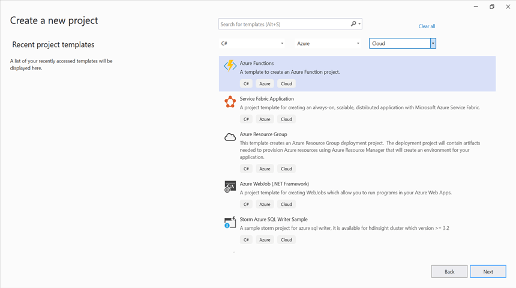
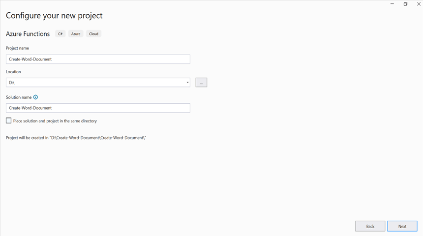
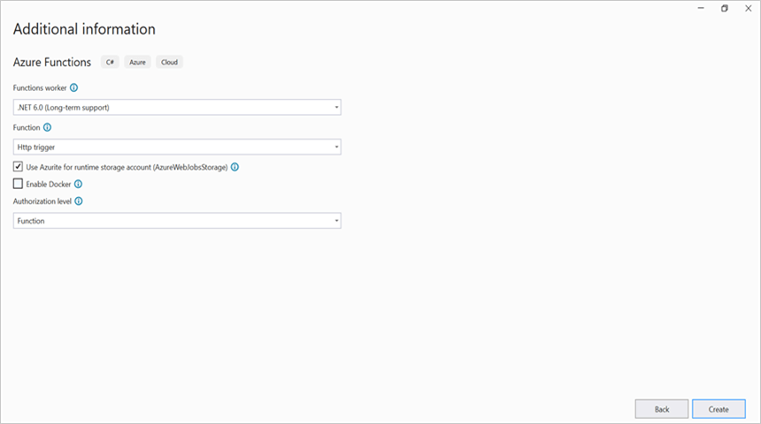
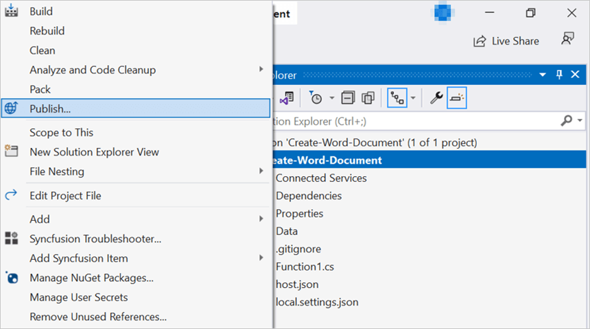
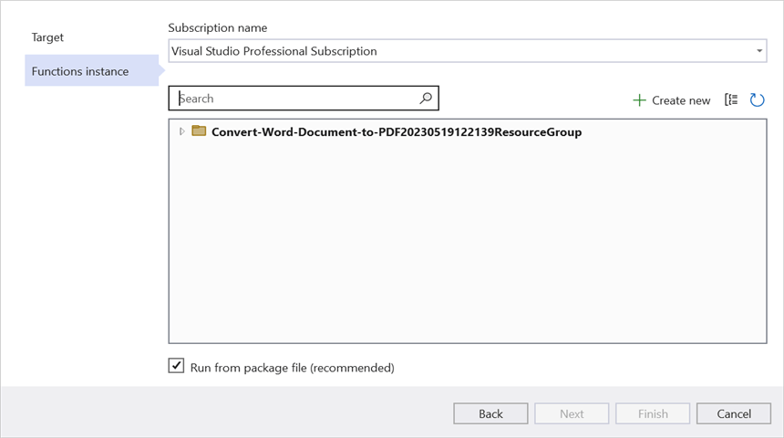
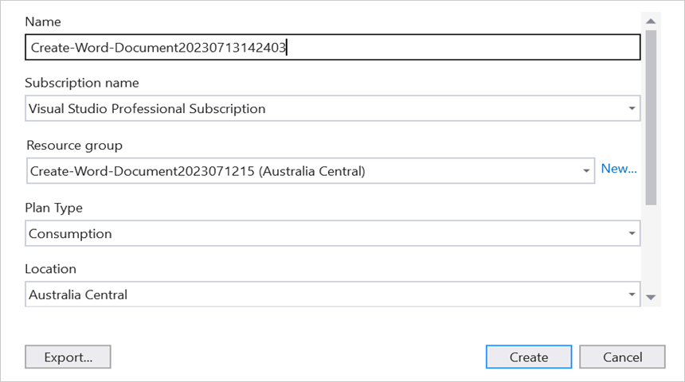
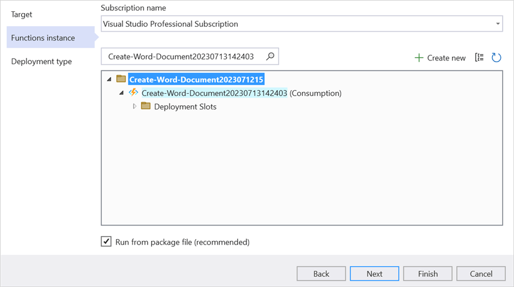
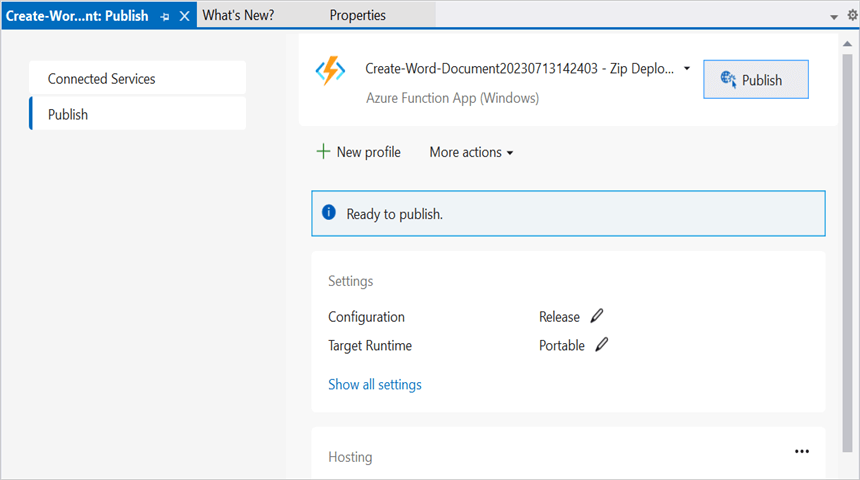
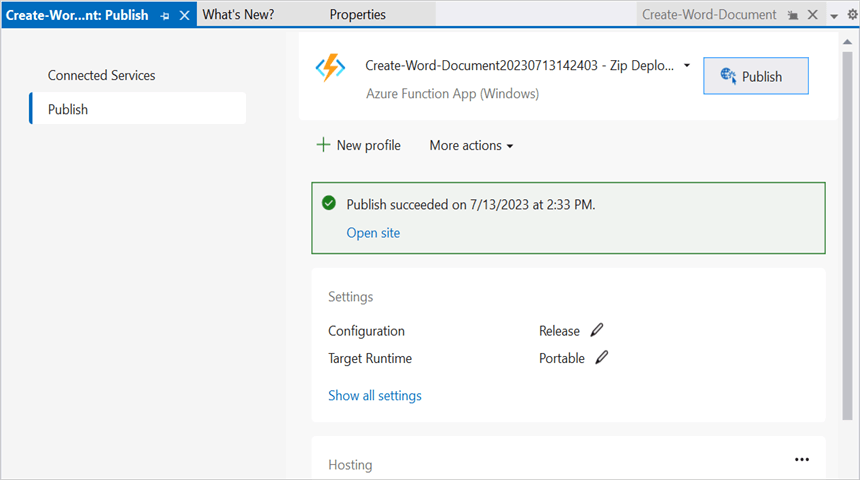
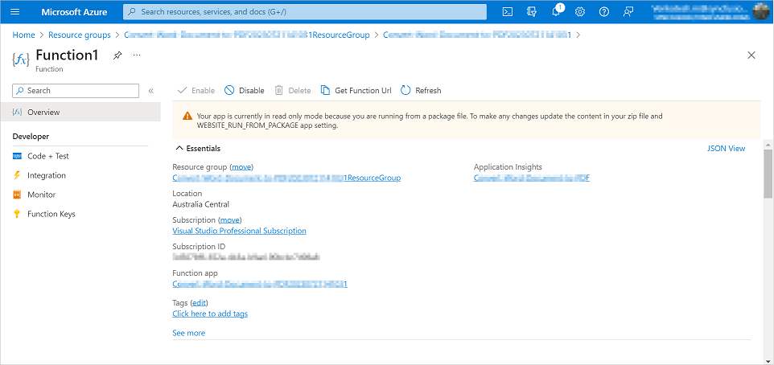

# Create Word document in Azure Functions v4

Syncfusion DocIO is a [.NET Core Word library](https://www.syncfusion.com/document-processing/word-framework/net/word-library) used to create, read, edit and convert Word documents programmatically without **Microsoft Word** or interop dependencies. Using this library, you can **create a Word document in Azure Functions v4**.

## Steps to create a Word document in Azure Functions v4

Step 1: Create a new Azure Functions project.

Step 2: Create a project name and select the location.

Step 3: Select function worker as **.NET 6.0(Long-term support)**.

Step 4: Install the [Syncfusion.DocIO.Net.Core](https://www.nuget.org/packages/Syncfusion.DocIO.Net.Core) NuGet package as a reference to your project from [NuGet.org](https://www.nuget.org/).

N> Starting with v16.2.0.x, if you reference Syncfusion assemblies from trial setup or from the NuGet feed, you also have to add "Syncfusion.Licensing" assembly reference and include a license key in your projects. Please refer to this [link](https://help.syncfusion.com/common/essential-studio/licensing/overview) to know about registering Syncfusion license key in your application to use our components.

Step 5: Include the following namespaces in the **Function1.cs** file.




using Syncfusion.DocIO;
using Syncfusion.DocIO.DLS;




Step 6: Add the following code snippet in **Run** method of **Function1** class to perform **create a Word document** in Azure Functions and return the resultant **Word document** to client end.




// Creating a new document.
WordDocument document = new WordDocument();
//Adding a new section to the document.
WSection section = document.AddSection() as WSection;
//Set Margin of the section
section.PageSetup.Margins.All = 72;
//Set page size of the section
section.PageSetup.PageSize = new Syncfusion.Drawing.SizeF(612, 792);

//Create Paragraph styles
WParagraphStyle style = document.AddParagraphStyle("Normal") as WParagraphStyle;
style.CharacterFormat.FontName = "Calibri";
style.CharacterFormat.FontSize = 11f;
style.ParagraphFormat.BeforeSpacing = 0;
style.ParagraphFormat.AfterSpacing = 8;
style.ParagraphFormat.LineSpacing = 13.8f;

style = document.AddParagraphStyle("Heading 1") as WParagraphStyle;
style.ApplyBaseStyle("Normal");
style.CharacterFormat.FontName = "Calibri Light";
style.CharacterFormat.FontSize = 16f;
style.CharacterFormat.TextColor = Syncfusion.Drawing.Color.FromArgb(46, 116, 181);
style.ParagraphFormat.BeforeSpacing = 12;
style.ParagraphFormat.AfterSpacing = 0;
style.ParagraphFormat.Keep = true;
style.ParagraphFormat.KeepFollow = true;
style.ParagraphFormat.OutlineLevel = OutlineLevel.Level1;

IWParagraph paragraph = section.HeadersFooters.Header.AddParagraph();
// Gets the image stream.
var assembly = Assembly.GetExecutingAssembly();
var stream = assembly.GetManifestResourceStream("Create_Word_Document.Data.AdventureCycle.jpg");         
IWPicture picture = paragraph.AppendPicture(stream);
picture.TextWrappingStyle = TextWrappingStyle.InFrontOfText;
picture.VerticalOrigin = VerticalOrigin.Margin;
picture.VerticalPosition = -45;
picture.HorizontalOrigin = HorizontalOrigin.Column;
picture.HorizontalPosition = 263.5f;
picture.WidthScale = 20;
picture.HeightScale = 15;

paragraph.ApplyStyle("Normal");
paragraph.ParagraphFormat.HorizontalAlignment = HorizontalAlignment.Left;
WTextRange textRange = paragraph.AppendText("Adventure Works Cycles") as WTextRange;
textRange.CharacterFormat.FontSize = 12f;
textRange.CharacterFormat.FontName = "Calibri";
textRange.CharacterFormat.TextColor = Syncfusion.Drawing.Color.Red;

//Appends paragraph.
paragraph = section.AddParagraph();
paragraph.ApplyStyle("Heading 1");
paragraph.ParagraphFormat.HorizontalAlignment = HorizontalAlignment.Center;
textRange = paragraph.AppendText("Adventure Works Cycles") as WTextRange;
textRange.CharacterFormat.FontSize = 18f;
textRange.CharacterFormat.FontName = "Calibri";

//Appends paragraph.
paragraph = section.AddParagraph();
paragraph.ParagraphFormat.FirstLineIndent = 36;
paragraph.BreakCharacterFormat.FontSize = 12f;
textRange = paragraph.AppendText("Adventure Works Cycles, the fictitious company on which the AdventureWorks sample databases are based, is a large, multinational manufacturing company. The company manufactures and sells metal and composite bicycles to North American, European and Asian commercial markets. While its base operation is in Bothell, Washington with 290 employees, several regional sales teams are located throughout their market base.") as WTextRange;
textRange.CharacterFormat.FontSize = 12f;

//Appends paragraph.
paragraph = section.AddParagraph();
paragraph.ParagraphFormat.FirstLineIndent = 36;
paragraph.BreakCharacterFormat.FontSize = 12f;
textRange = paragraph.AppendText("In 2000, AdventureWorks Cycles bought a small manufacturing plant, Importadores Neptuno, located in Mexico. Importadores Neptuno manufactures several critical subcomponents for the AdventureWorks Cycles product line. These subcomponents are shipped to the Bothell location for final product assembly. In 2001, Importadores Neptuno, became the sole manufacturer and distributor of the touring bicycle product group.") as WTextRange;
textRange.CharacterFormat.FontSize = 12f;

paragraph = section.AddParagraph();
paragraph.ApplyStyle("Heading 1");
paragraph.ParagraphFormat.HorizontalAlignment = HorizontalAlignment.Left;
textRange = paragraph.AppendText("Product Overview") as WTextRange;
textRange.CharacterFormat.FontSize = 16f;
textRange.CharacterFormat.FontName = "Calibri";

//Appends table.
IWTable table = section.AddTable();
table.ResetCells(3, 2);
table.TableFormat.Borders.BorderType = BorderStyle.None;
table.TableFormat.IsAutoResized = true;
//Appends paragraph.
paragraph = table[0, 0].AddParagraph();
paragraph.ParagraphFormat.AfterSpacing = 0;
paragraph.BreakCharacterFormat.FontSize = 12f;
//Appends picture to the paragraph.
var assembly1 = Assembly.GetExecutingAssembly();
using (var stream1 = assembly1.GetManifestResourceStream("Create_Word_Document.Data.Mountain-200.jpg"))
picture = paragraph.AppendPicture(stream1);
picture.TextWrappingStyle = TextWrappingStyle.TopAndBottom;
picture.VerticalOrigin = VerticalOrigin.Paragraph;
picture.VerticalPosition = 4.5f;
picture.HorizontalOrigin = HorizontalOrigin.Column;
picture.HorizontalPosition = -2.15f;
picture.WidthScale = 79;
picture.HeightScale = 79;

//Appends paragraph.
paragraph = table[0, 1].AddParagraph();
paragraph.ApplyStyle("Heading 1");
paragraph.ParagraphFormat.AfterSpacing = 0;
paragraph.ParagraphFormat.LineSpacing = 12f;
paragraph.AppendText("Mountain-200");
//Appends paragraph.
paragraph = table[0, 1].AddParagraph();
paragraph.ParagraphFormat.AfterSpacing = 0;
paragraph.ParagraphFormat.LineSpacing = 12f;
paragraph.BreakCharacterFormat.FontSize = 12f;
paragraph.BreakCharacterFormat.FontName = "Times New Roman";
textRange = paragraph.AppendText("Product No: BK-M68B-38\r") as WTextRange;
textRange.CharacterFormat.FontSize = 12f;
textRange.CharacterFormat.FontName = "Times New Roman";
textRange = paragraph.AppendText("Size: 38\r") as WTextRange;
textRange.CharacterFormat.FontSize = 12f;
textRange.CharacterFormat.FontName = "Times New Roman";
textRange = paragraph.AppendText("Weight: 25\r") as WTextRange;
textRange.CharacterFormat.FontSize = 12f;
textRange.CharacterFormat.FontName = "Times New Roman";
textRange = paragraph.AppendText("Price: $2,294.99\r") as WTextRange;
textRange.CharacterFormat.FontSize = 12f;
textRange.CharacterFormat.FontName = "Times New Roman";
//Appends paragraph.
paragraph = table[0, 1].AddParagraph();
paragraph.ParagraphFormat.AfterSpacing = 0;
paragraph.ParagraphFormat.LineSpacing = 12f;
paragraph.BreakCharacterFormat.FontSize = 12f;

//Appends paragraph.
paragraph = table[1, 0].AddParagraph();
paragraph.ApplyStyle("Heading 1");
paragraph.ParagraphFormat.AfterSpacing = 0;
paragraph.ParagraphFormat.LineSpacing = 12f;
paragraph.AppendText("Mountain-300 ");
//Appends paragraph.
paragraph = table[1, 0].AddParagraph();
paragraph.ParagraphFormat.AfterSpacing = 0;
paragraph.ParagraphFormat.LineSpacing = 12f;
paragraph.BreakCharacterFormat.FontSize = 12f;
paragraph.BreakCharacterFormat.FontName = "Times New Roman";
textRange = paragraph.AppendText("Product No: BK-M47B-38\r") as WTextRange;
textRange.CharacterFormat.FontSize = 12f;
textRange.CharacterFormat.FontName = "Times New Roman";
textRange = paragraph.AppendText("Size: 35\r") as WTextRange;
textRange.CharacterFormat.FontSize = 12f;
textRange.CharacterFormat.FontName = "Times New Roman";
textRange = paragraph.AppendText("Weight: 22\r") as WTextRange;
textRange.CharacterFormat.FontSize = 12f;
textRange.CharacterFormat.FontName = "Times New Roman";
textRange = paragraph.AppendText("Price: $1,079.99\r") as WTextRange;
textRange.CharacterFormat.FontSize = 12f;
textRange.CharacterFormat.FontName = "Times New Roman";
//Appends paragraph.
paragraph = table[1, 0].AddParagraph();
paragraph.ParagraphFormat.AfterSpacing = 0;
paragraph.ParagraphFormat.LineSpacing = 12f;
paragraph.BreakCharacterFormat.FontSize = 12f;

//Appends paragraph.
paragraph = table[1, 1].AddParagraph();
paragraph.ApplyStyle("Heading 1");
paragraph.ParagraphFormat.LineSpacing = 12f;
//Appends picture to the paragraph.
var assembly2 = Assembly.GetExecutingAssembly();
using (var stream2 = assembly2.GetManifestResourceStream("Create_Word_Document.Data.Mountain-300.jpg"))   
picture = paragraph.AppendPicture(stream2);
picture.TextWrappingStyle = TextWrappingStyle.TopAndBottom;
picture.VerticalOrigin = VerticalOrigin.Paragraph;
picture.VerticalPosition = 8.2f;
picture.HorizontalOrigin = HorizontalOrigin.Column;
picture.HorizontalPosition = -14.95f;
picture.WidthScale = 75;
picture.HeightScale = 75;

//Appends paragraph.
paragraph = table[2, 0].AddParagraph();
paragraph.ApplyStyle("Heading 1");
paragraph.ParagraphFormat.LineSpacing = 12f;
//Appends picture to the paragraph.
var assembly3 = Assembly.GetExecutingAssembly();
using (var stream3 = assembly3.GetManifestResourceStream("Create_Word_Document.Data.Road-550-W.jpg"))
picture = paragraph.AppendPicture(stream3);
picture.TextWrappingStyle = TextWrappingStyle.TopAndBottom;
picture.VerticalOrigin = VerticalOrigin.Paragraph;
picture.VerticalPosition = 3.75f;
picture.HorizontalOrigin = HorizontalOrigin.Column;
picture.HorizontalPosition = -5f;
picture.WidthScale = 92;
picture.HeightScale = 92;

//Appends paragraph.
paragraph = table[2, 1].AddParagraph();
paragraph.ApplyStyle("Heading 1");
paragraph.ParagraphFormat.AfterSpacing = 0;
paragraph.ParagraphFormat.LineSpacing = 12f;
paragraph.AppendText("Road-150 ");
//Appends paragraph.
paragraph = table[2, 1].AddParagraph();
paragraph.ParagraphFormat.AfterSpacing = 0;
paragraph.ParagraphFormat.LineSpacing = 12f;
paragraph.BreakCharacterFormat.FontSize = 12f;
paragraph.BreakCharacterFormat.FontName = "Times New Roman";
textRange = paragraph.AppendText("Product No: BK-R93R-44\r") as WTextRange;
textRange.CharacterFormat.FontSize = 12f;
textRange.CharacterFormat.FontName = "Times New Roman";
textRange = paragraph.AppendText("Size: 44\r") as WTextRange;
textRange.CharacterFormat.FontSize = 12f;
textRange.CharacterFormat.FontName = "Times New Roman";
textRange = paragraph.AppendText("Weight: 14\r") as WTextRange;
textRange.CharacterFormat.FontSize = 12f;
textRange.CharacterFormat.FontName = "Times New Roman";
textRange = paragraph.AppendText("Price: $3,578.27\r") as WTextRange;
textRange.CharacterFormat.FontSize = 12f;
textRange.CharacterFormat.FontName = "Times New Roman";
//Appends paragraph.
section.AddParagraph();

MemoryStream memoryStream = new MemoryStream();
//Saves the Word document file.
document.Save(memoryStream, FormatType.Docx);
//Create the response to return.
HttpResponseMessage response = new HttpResponseMessage(HttpStatusCode.OK);
//Set the Word document saved stream as content of response.
response.Content = new ByteArrayContent(memoryStream.ToArray());
//Set the contentDisposition as attachment.
response.Content.Headers.ContentDisposition = new ContentDispositionHeaderValue("attachment")
{
    FileName = "Sample.docx"
};
//Set the content type as Word document mime type.
response.Content.Headers.ContentType = new System.Net.Http.Headers.MediaTypeHeaderValue("application/docx");
//Return the response with output Word document stream.
return response;




Step 7: Right click the project and select **Publish**. Then, create a new profile in the Publish Window.

Step 8: Select the target as **Azure** and click **Next** button.

Step 9: Select the **Create new** button.

Step 10: Click **Create** button. 

Step 11: After creating app service then click **Finish** button. 

Step 12: Click the **Publish** button.

Step 13: Publish has been succeed.

Step 14: After publishing your Azure Function, go to the [Azure portal](https://portal.azure.com) and locate the Function App that hosts your function. In the function app, you can see the list of all available functions in the app.

Step 15: Find the function for which you want to obtain the URL and click on its name. This will open the Function Overview page for that specific function.

Step 16: On the Function Overview page, you will find a Get function URL button. Clicking on it will reveal the URL specific to that function. Copy that **URL** and run the console application. Then, paste the URL into the console application, this will trigger your Function to **create a Word document**.

By executing the program, you will get the **Word document** as follows.

## Steps to post the request to Azure Functions

Step 1: Create a console application to request the Azure Functions API.

Step 2: Add the following code snippet into **Main** method to post the request to Azure Functions with template Word document and get the resultant Word document.




//Reads the template Word document.
FileStream fs = new FileStream(@"../../Data/Input.docx", FileMode.Open, FileAccess.ReadWrite, FileShare.ReadWrite);
fs.Position = 0;
//Saves the Word document in memory stream.
MemoryStream inputStream = new MemoryStream();
fs.CopyTo(inputStream);
inputStream.Position = 0;
try
{
    Console.WriteLine("Please enter your Azure Functions URL :");
    string functionURL = Console.ReadLine();
    //Create HttpWebRequest with hosted azure functions URL.    
    HttpWebRequest req = (HttpWebRequest)WebRequest.Create(functionURL);
    //Set request method as POST
    req.Method = "POST";
    //Get the request stream to save the Word document stream
    Stream stream = req.GetRequestStream();
    //Write the Word document stream into request stream
    stream.Write(inputStream.ToArray(), 0, inputStream.ToArray().Length);
    //Gets the responce from the Azure Functions.
    HttpWebResponse res = (HttpWebResponse)req.GetResponse();
    //Saves the Word document stream.
    FileStream fileStream = File.Create("Sample.docx");
    res.GetResponseStream().CopyTo(fileStream);
    //Dispose the streams
    inputStream.Dispose();
    fileStream.Dispose();
}
catch (Exception ex)
{
    throw;
}




From GitHub, you can download the [console application](https://github.com/SyncfusionExamples/DocIO-Examples/tree/main/Getting-Started/Azure/Azure_Functions/Console_Application) and [Azure Functions v4](https://github.com/SyncfusionExamples/DocIO-Examples/tree/main/Getting-Started/Azure/Azure_Functions/Azure_Functions_v4).

Click [here](https://www.syncfusion.com/document-processing/word-framework/net-core) to explore the rich set of Syncfusion Word library (DocIO) features. 

An online sample link to [create a Word document](https://ej2.syncfusion.com/aspnetcore/Word/HelloWorld#/material3) in ASP.NET Core.   

