# Create Word document in Google App Engine

Syncfusion DocIO is a [.NET Core Word library](https://www.syncfusion.com/document-processing/word-framework/net-core/word-library) that allows you to create, read, edit, and convert Word documents programmatically, without the need for **Microsoft Word** or interop dependencies. Using this library, you can **create Word document in Google App Engine**.

## Set up App Engine

Step 1: Open the **Google Cloud Console** and click the **Activate Cloud Shell** button.

Step 2: Click the **Cloud Shell Editor** button to view the **Workspace**.

Step 3: Open **Cloud Shell Terminal**, run the following **command** to confirm authentication.




gcloud auth list




Step 4: Click the **Authorize** button.

## Create an application for App Engine

Step 1: Open Visual Studio and select the ASP.NET Core Web app (Model-View-Controller) template.

Step 2: Configure your new project according to your requirements.
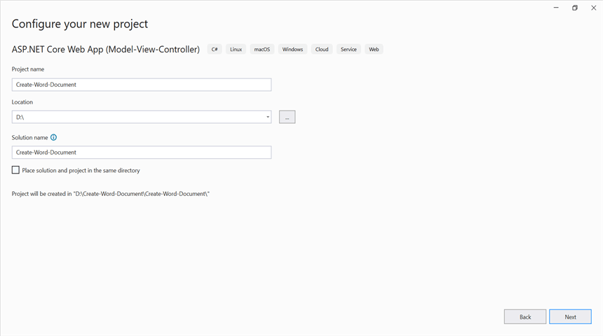

Step 3: Click the **Create** button.

Step 4: Install the [Syncfusion.DocIO.Net.Core](https://www.nuget.org/packages/Syncfusion.DocIO.Net.Core) NuGet package as a reference to your project from [NuGet.org](https://www.nuget.org/).

N> Starting with v16.2.0.x, if you reference Syncfusion assemblies from trial setup or from the NuGet feed, you also have to add "Syncfusion.Licensing" assembly reference and include a license key in your projects. Please refer to this [link](https://help.syncfusion.com/common/essential-studio/licensing/overview) to know about registering Syncfusion license key in your application to use our components.

Step 5: Include the following namespaces in the **HomeController.cs** file.




using Syncfusion.DocIO.DLS;
using Syncfusion.DocIO;




Step 6: A default action method named Index will be present in HomeController.cs. Right click on Index method and select **Go To View** where you will be directed to its associated view page **Index.cshtml**.

Step 7: Add a new button in the Index.cshtml as shown below.




@{
    Html.BeginForm("CreateDocument", "Home", FormMethod.Get);
    {
        

            <input type="submit" value="Create Document" style="width:150px;height:27px" />
        

    }
    Html.EndForm();
}




Step 8: Add a new action method **CreateDocument** in HomeController.cs and include the below code snippet to **create Word document** and download it.




//Create a new document.
using (WordDocument document = new WordDocument())
{
    //Adding a new section to the document.
    WSection section = document.AddSection() as WSection;
    //Set Margin of the section.
    section.PageSetup.Margins.All = 72;
    //Set page size of the section.
    section.PageSetup.PageSize = new Syncfusion.Drawing.SizeF(612, 792);

    //Create Paragraph styles.
    WParagraphStyle style = document.AddParagraphStyle("Normal") as WParagraphStyle;
    style.CharacterFormat.FontName = "Calibri";
    style.CharacterFormat.FontSize = 11f;
    style.ParagraphFormat.BeforeSpacing = 0;
    style.ParagraphFormat.AfterSpacing = 8;
    style.ParagraphFormat.LineSpacing = 13.8f;

    style = document.AddParagraphStyle("Heading 1") as WParagraphStyle;
    style.ApplyBaseStyle("Normal");
    style.CharacterFormat.FontName = "Calibri Light";
    style.CharacterFormat.FontSize = 16f;
    style.CharacterFormat.TextColor = Syncfusion.Drawing.Color.FromArgb(46, 116, 181);
    style.ParagraphFormat.BeforeSpacing = 12;
    style.ParagraphFormat.AfterSpacing = 0;
    style.ParagraphFormat.Keep = true;
    style.ParagraphFormat.KeepFollow = true;
    style.ParagraphFormat.OutlineLevel = OutlineLevel.Level1;
    IWParagraph paragraph = section.HeadersFooters.Header.AddParagraph();

    // Gets the image stream.
    FileStream imageStream = new FileStream(Path.GetFullPath("Data/AdventureCycle.jpg"), FileMode.Open, FileAccess.Read);
    IWPicture picture = paragraph.AppendPicture(imageStream);
    picture.TextWrappingStyle = TextWrappingStyle.InFrontOfText;
    picture.VerticalOrigin = VerticalOrigin.Margin;
    picture.VerticalPosition = -45;
    picture.HorizontalOrigin = HorizontalOrigin.Column;
    picture.HorizontalPosition = 263.5f;
    picture.WidthScale = 20;
    picture.HeightScale = 15;

    paragraph.ApplyStyle("Normal");
    paragraph.ParagraphFormat.HorizontalAlignment = HorizontalAlignment.Left;
    WTextRange textRange = paragraph.AppendText("Adventure Works Cycles") as WTextRange;
    textRange.CharacterFormat.FontSize = 12f;
    textRange.CharacterFormat.FontName = "Calibri";
    textRange.CharacterFormat.TextColor = Syncfusion.Drawing.Color.Red;

    //Appends paragraph.
    paragraph = section.AddParagraph();
    paragraph.ApplyStyle("Heading 1");
    paragraph.ParagraphFormat.HorizontalAlignment = HorizontalAlignment.Center;
    textRange = paragraph.AppendText("Adventure Works Cycles") as WTextRange;
    textRange.CharacterFormat.FontSize = 18f;
    textRange.CharacterFormat.FontName = "Calibri";

    //Appends paragraph.
    paragraph = section.AddParagraph();
    paragraph.ParagraphFormat.FirstLineIndent = 36;
    paragraph.BreakCharacterFormat.FontSize = 12f;
    textRange = paragraph.AppendText("Adventure Works Cycles, the fictitious company on which the AdventureWorks sample databases are based, is a large, multinational manufacturing company. The company manufactures and sells metal and composite bicycles to North American, European and Asian commercial markets. While its base operation is in Bothell, Washington with 290 employees, several regional sales teams are located throughout their market base.") as WTextRange;
    textRange.CharacterFormat.FontSize = 12f;

    //Appends paragraph.
    paragraph = section.AddParagraph();
    paragraph.ParagraphFormat.FirstLineIndent = 36;
    paragraph.BreakCharacterFormat.FontSize = 12f;
    textRange = paragraph.AppendText("In 2000, AdventureWorks Cycles bought a small manufacturing plant, Importadores Neptuno, located in Mexico. Importadores Neptuno manufactures several critical subcomponents for the AdventureWorks Cycles product line. These subcomponents are shipped to the Bothell location for final product assembly. In 2001, Importadores Neptuno, became the sole manufacturer and distributor of the touring bicycle product group.") as WTextRange;
    textRange.CharacterFormat.FontSize = 12f;

    paragraph = section.AddParagraph();
    paragraph.ApplyStyle("Heading 1");
    paragraph.ParagraphFormat.HorizontalAlignment = HorizontalAlignment.Left;
    textRange = paragraph.AppendText("Product Overview") as WTextRange;
    textRange.CharacterFormat.FontSize = 16f;
    textRange.CharacterFormat.FontName = "Calibri";
    //Appends table.
    IWTable table = section.AddTable();
    table.ResetCells(3, 2);
    table.TableFormat.Borders.BorderType = BorderStyle.None;
    table.TableFormat.IsAutoResized = true;

    //Appends paragraph.
    paragraph = table[0, 0].AddParagraph();
    paragraph.ParagraphFormat.AfterSpacing = 0;
    paragraph.BreakCharacterFormat.FontSize = 12f;
    //Appends picture to the paragraph.
    FileStream image1 = new FileStream(Path.GetFullPath("Data/Mountain-200.jpg"), FileMode.Open, FileAccess.Read);
    picture = paragraph.AppendPicture(image1);
    picture.TextWrappingStyle = TextWrappingStyle.TopAndBottom;
    picture.VerticalOrigin = VerticalOrigin.Paragraph;
    picture.VerticalPosition = 4.5f;
    picture.HorizontalOrigin = HorizontalOrigin.Column;
    picture.HorizontalPosition = -2.15f;
    picture.WidthScale = 79;
    picture.HeightScale = 79;

    //Appends paragraph.
    paragraph = table[0, 1].AddParagraph();
    paragraph.ApplyStyle("Heading 1");
    paragraph.ParagraphFormat.AfterSpacing = 0;
    paragraph.ParagraphFormat.LineSpacing = 12f;
    paragraph.AppendText("Mountain-200");
    //Appends paragraph.
    paragraph = table[0, 1].AddParagraph();
    paragraph.ParagraphFormat.AfterSpacing = 0;
    paragraph.ParagraphFormat.LineSpacing = 12f;
    paragraph.BreakCharacterFormat.FontSize = 12f;
    paragraph.BreakCharacterFormat.FontName = "Times New Roman";

    textRange = paragraph.AppendText("Product No: BK-M68B-38\r") as WTextRange;
    textRange.CharacterFormat.FontSize = 12f;
    textRange.CharacterFormat.FontName = "Times New Roman";
    textRange = paragraph.AppendText("Size: 38\r") as WTextRange;
    textRange.CharacterFormat.FontSize = 12f;
    textRange.CharacterFormat.FontName = "Times New Roman";
    textRange = paragraph.AppendText("Weight: 25\r") as WTextRange;
    textRange.CharacterFormat.FontSize = 12f;
    textRange.CharacterFormat.FontName = "Times New Roman";
    textRange = paragraph.AppendText("Price: $2,294.99\r") as WTextRange;
    textRange.CharacterFormat.FontSize = 12f;
    textRange.CharacterFormat.FontName = "Times New Roman";
    //Appends paragraph.
    paragraph = table[0, 1].AddParagraph();
    paragraph.ParagraphFormat.AfterSpacing = 0;
    paragraph.ParagraphFormat.LineSpacing = 12f;
    paragraph.BreakCharacterFormat.FontSize = 12f;

    //Appends paragraph.
    paragraph = table[1, 0].AddParagraph();
    paragraph.ApplyStyle("Heading 1");
    paragraph.ParagraphFormat.AfterSpacing = 0;
    paragraph.ParagraphFormat.LineSpacing = 12f;
    paragraph.AppendText("Mountain-300 ");
    //Appends paragraph.
    paragraph = table[1, 0].AddParagraph();
    paragraph.ParagraphFormat.AfterSpacing = 0;
    paragraph.ParagraphFormat.LineSpacing = 12f;
    paragraph.BreakCharacterFormat.FontSize = 12f;
    paragraph.BreakCharacterFormat.FontName = "Times New Roman";
    textRange = paragraph.AppendText("Product No: BK-M47B-38\r") as WTextRange;
    textRange.CharacterFormat.FontSize = 12f;
    textRange.CharacterFormat.FontName = "Times New Roman";
    textRange = paragraph.AppendText("Size: 35\r") as WTextRange;
    textRange.CharacterFormat.FontSize = 12f;
    textRange.CharacterFormat.FontName = "Times New Roman";
    textRange = paragraph.AppendText("Weight: 22\r") as WTextRange;
    textRange.CharacterFormat.FontSize = 12f;
    textRange.CharacterFormat.FontName = "Times New Roman";
    textRange = paragraph.AppendText("Price: $1,079.99\r") as WTextRange;
    textRange.CharacterFormat.FontSize = 12f;
    textRange.CharacterFormat.FontName = "Times New Roman";
    //Appends paragraph.
    paragraph = table[1, 0].AddParagraph();
    paragraph.ParagraphFormat.AfterSpacing = 0;
    paragraph.ParagraphFormat.LineSpacing = 12f;
    paragraph.BreakCharacterFormat.FontSize = 12f;

    //Appends paragraph.
    paragraph = table[1, 1].AddParagraph();
    paragraph.ApplyStyle("Heading 1");
    paragraph.ParagraphFormat.LineSpacing = 12f;
    //Appends picture to the paragraph.
    FileStream image2 = new FileStream(Path.GetFullPath("Data/Mountain-300.jpg"), FileMode.Open, FileAccess.Read);
    picture = paragraph.AppendPicture(image2);
    picture.TextWrappingStyle = TextWrappingStyle.TopAndBottom;
    picture.VerticalOrigin = VerticalOrigin.Paragraph;
    picture.VerticalPosition = 8.2f;
    picture.HorizontalOrigin = HorizontalOrigin.Column;
    picture.HorizontalPosition = -14.95f;
    picture.WidthScale = 75;
    picture.HeightScale = 75;

    //Appends paragraph.
    paragraph = table[2, 0].AddParagraph();
    paragraph.ApplyStyle("Heading 1");
    paragraph.ParagraphFormat.LineSpacing = 12f;
    //Appends picture to the paragraph.
    FileStream image3 = new FileStream(Path.GetFullPath("Data/Road-550-W.jpg"), FileMode.Open, FileAccess.Read);
    picture = paragraph.AppendPicture(image3);
    picture.TextWrappingStyle = TextWrappingStyle.TopAndBottom;
    picture.VerticalOrigin = VerticalOrigin.Paragraph;
    picture.VerticalPosition = 3.75f;
    picture.HorizontalOrigin = HorizontalOrigin.Column;
    picture.HorizontalPosition = -5f;
    picture.WidthScale = 92;
    picture.HeightScale = 92;

    //Appends paragraph.
    paragraph = table[2, 1].AddParagraph();
    paragraph.ApplyStyle("Heading 1");
    paragraph.ParagraphFormat.AfterSpacing = 0;
    paragraph.ParagraphFormat.LineSpacing = 12f;
    paragraph.AppendText("Road-150 ");
    //Appends paragraph.
    paragraph = table[2, 1].AddParagraph();
    paragraph.ParagraphFormat.AfterSpacing = 0;
    paragraph.ParagraphFormat.LineSpacing = 12f;
    paragraph.BreakCharacterFormat.FontSize = 12f;
    paragraph.BreakCharacterFormat.FontName = "Times New Roman";
    textRange = paragraph.AppendText("Product No: BK-R93R-44\r") as WTextRange;
    textRange.CharacterFormat.FontSize = 12f;
    textRange.CharacterFormat.FontName = "Times New Roman";
    textRange = paragraph.AppendText("Size: 44\r") as WTextRange;
    textRange.CharacterFormat.FontSize = 12f;
    textRange.CharacterFormat.FontName = "Times New Roman";
    textRange = paragraph.AppendText("Weight: 14\r") as WTextRange;
    textRange.CharacterFormat.FontSize = 12f;
    textRange.CharacterFormat.FontName = "Times New Roman";
    textRange = paragraph.AppendText("Price: $3,578.27\r") as WTextRange;
    textRange.CharacterFormat.FontSize = 12f;
    textRange.CharacterFormat.FontName = "Times New Roman";
    //Appends paragraph.
    section.AddParagraph();

    //Saves the Word document to MemoryStream.
    MemoryStream stream = new MemoryStream();
    document.Save(stream, FormatType.Docx);
    stream.Position = 0;

    //Download Word document in the browser.
    return File(stream, "application/msword", "Sample.docx");
}




## Move application to App Engine

Step 1: Open the **Cloud Shell editor**.

Step 2: Drag and drop the sample from your local machine to **Workspace**.

N> If you have your sample application in your local machine, drag and drop it into the Workspace. If you created the sample using the Cloud Shell terminal command, it will be available in the Workspace.

Step 3: Open the Cloud Shell Terminal and run the following **command** to view the files and directories within your **current Workspace**.




ls




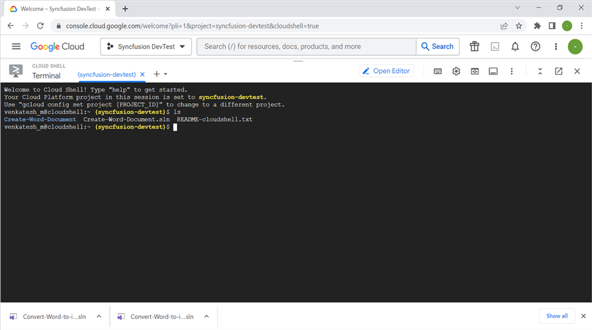

Step 4: Run the following **command** to navigate which sample you want run.




cd Create-Word-Document




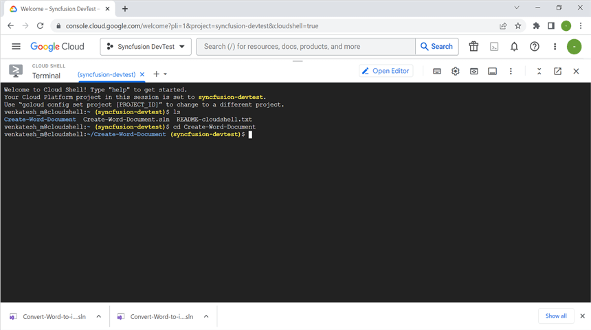

Step 5: To ensure that the sample is working correctly, please run the application using the following command.




dotnet run --urls=http://localhost:8080




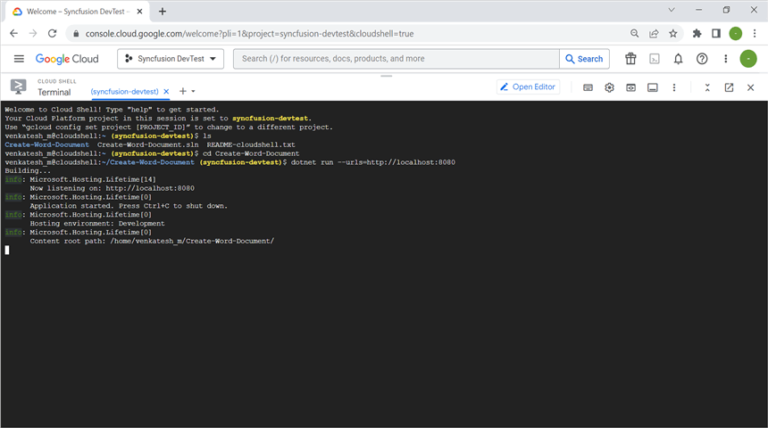

Step 6: Verify that the application is running properly by accessing the **Web View** -> **Preview on port 8080**.
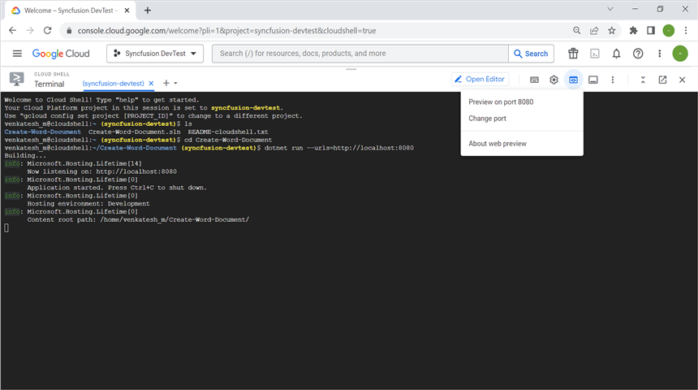

Step 7: Now you can see the sample output on the preview page.
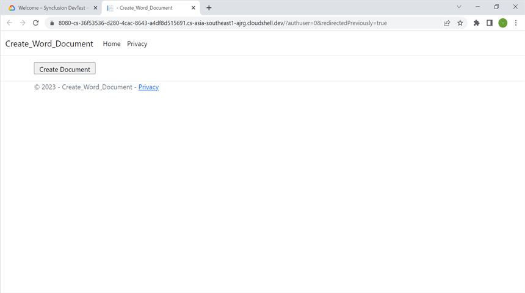

Step 8: Close the preview page and return to the terminal then press **Ctrl+C** for which will typically stop the process.
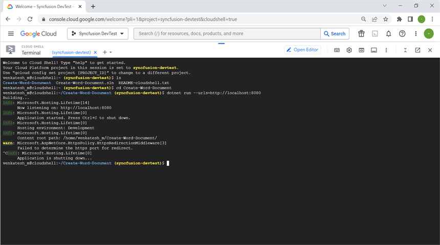

## Publish the application

Step 1: Run the following command in **Cloud Shell Terminal** to publish the application.




dotnet publish -c Release




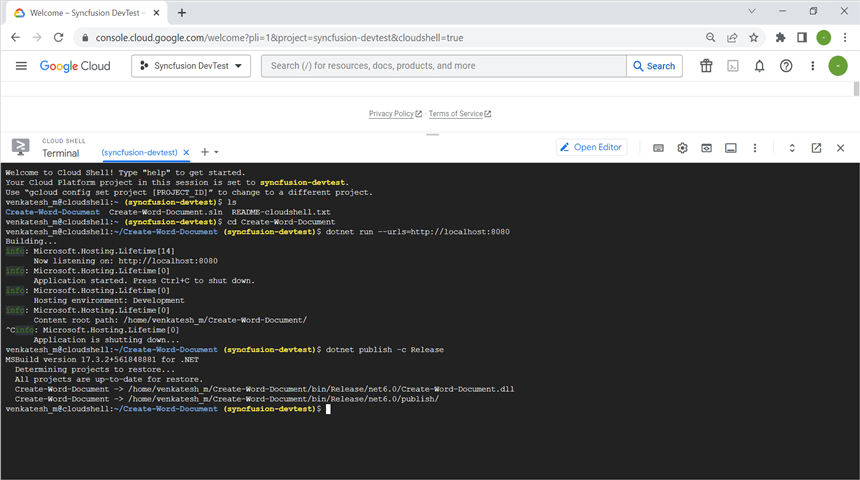

Step 2: Run the following command in **Cloud Shell Terminal** to navigate to the publish folder.



cd bin/Release/net6.0/publish/




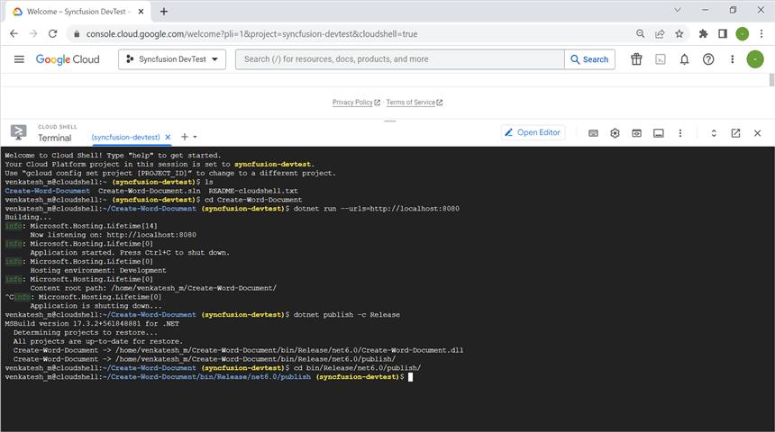

## Configure app.yaml and docker file

Step 1: Add the app.yaml file to the publish folder with the following contents.




cat <<EOT >> app.yaml
env: flex
runtime: custom   
EOT




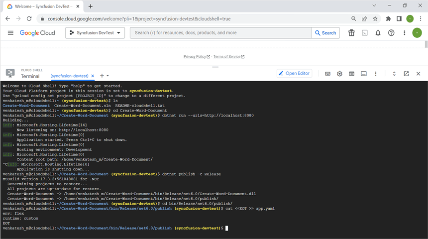

Step 2: Add the Docker file to the publish folder with the following contents.




cat <<EOT >> Dockerfile
FROM mcr.microsoft.com/dotnet/aspnet:6.0
RUN apt-get update -y && apt-get install libfontconfig -y
ADD / /app
EXPOSE 8080
ENV ASPNETCORE_URLS=http://*:8080
WORKDIR /app
ENTRYPOINT [ "dotnet", "Create-Word-Document.dll"]
EOT




Step 3: You can ensure **Docker** and **app.yaml** files are added in **Workspace**.
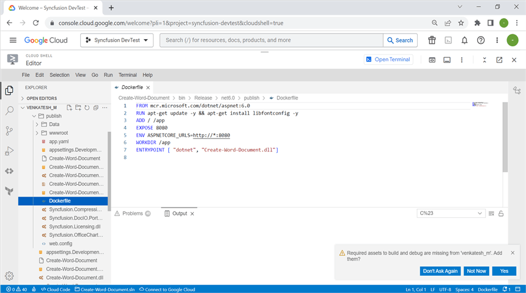

## Deploy to App Engine

Step 1: To deploy the application to the App Engine, run the following command in Cloud Shell Terminal. Afterwards, retrieve the **URL** from the Cloud Shell Terminal.




gcloud app deploy --version v0




Step 2: Open the **URL** to access the application, which has been successfully deployed.
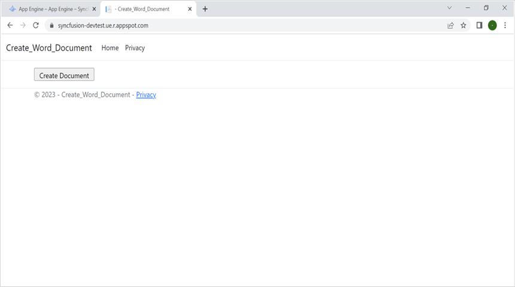

You can download a complete working sample from [GitHub](https://github.com/SyncfusionExamples/DocIO-Examples/tree/main/Word-to-PDF-Conversion/Convert-Word-document-to-PDF/GCP/Google-App-Engine).

By executing the program, you will get the **Word document** as follows. The output will be saved in **bin** folder.

