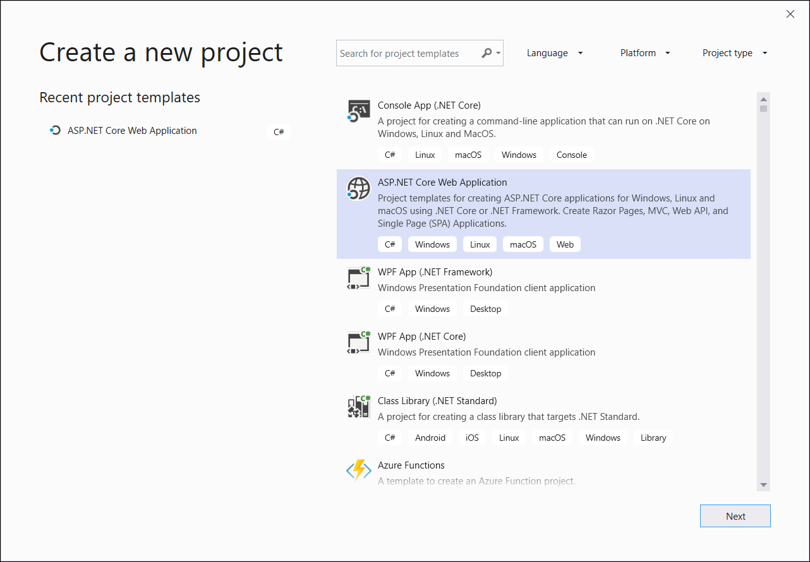
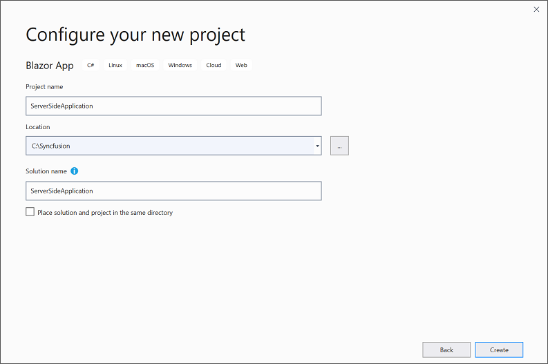
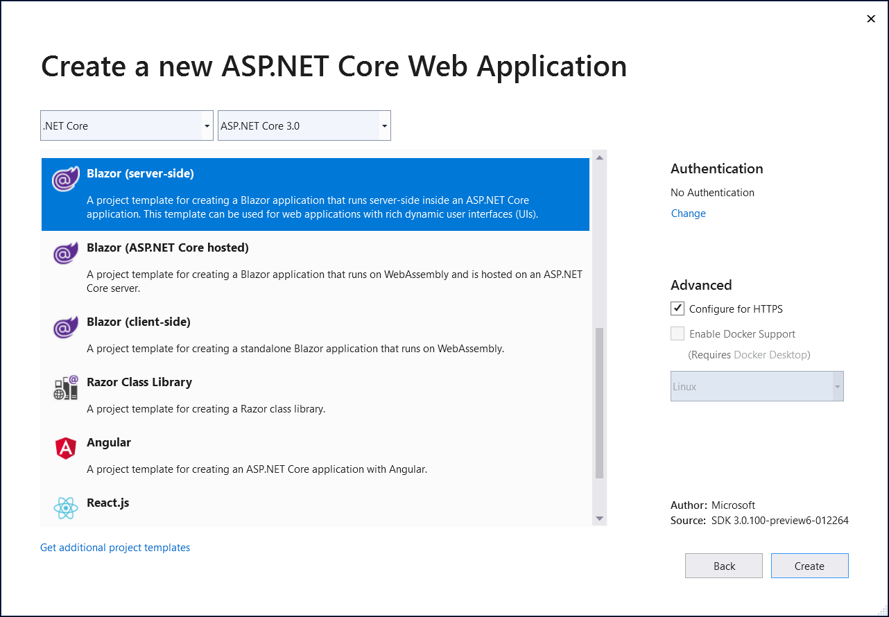
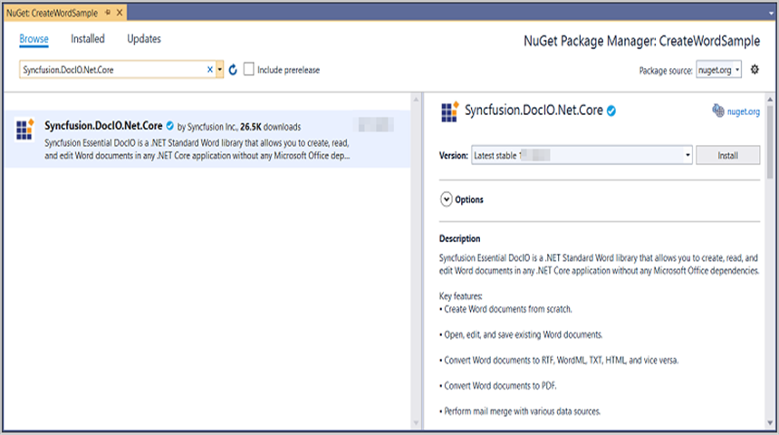
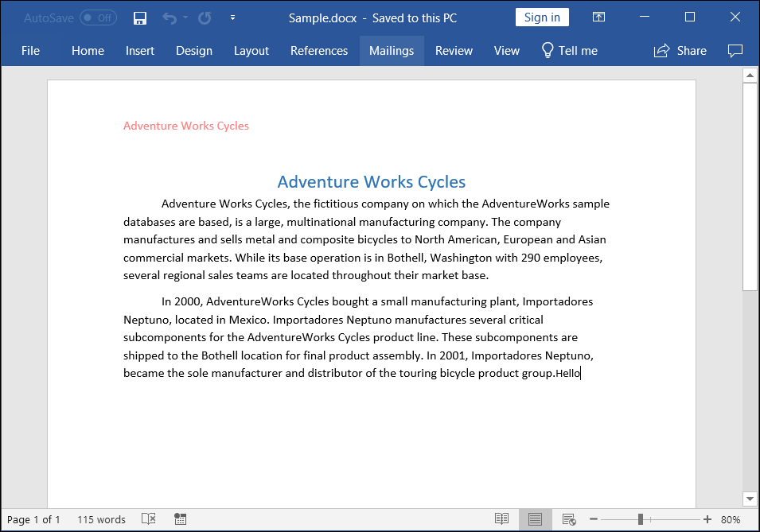
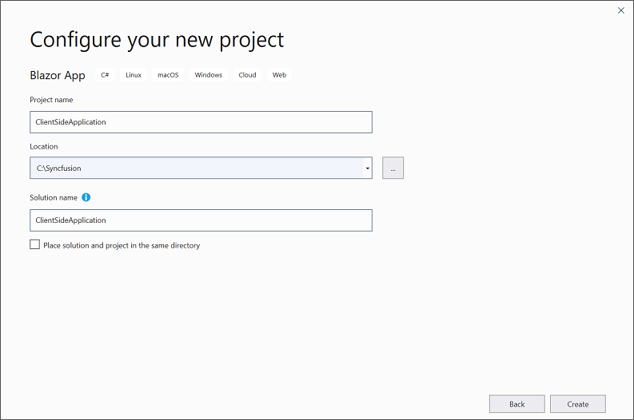

# Create Word document in Blazor

Syncfusion Essential DocIO is a [.NET Core Word library](https://www.syncfusion.com/word-framework/net-core/word-library) used to create, read, and edit **Word** documents programmatically without **Microsoft Word** or interop dependencies. Using this library, you can **create a Word document in Blazor**.

**Prerequisites:**

* Visual Studio 2019 Preview
* Install the [.NET Core SDK 3.0 Preview](https://dotnet.microsoft.com/download/dotnet-core/3.0)

**Creating a Blazor project**

* Enable Visual Studio to use preview SDKs
* Open Tools > Options in the menu bar.
* Open the Projects and Solutions node. Open the .NET Core tab.
* Check the box for Use previews of the .NET Core SDK and click OK.
* Restart the Visual Studio 2019.

## Server-side application

1.Create a new C# Blazor Server-Side application project. Select Blazor App from the template and click the Next button.

2.Now, the project configuration window will popup. Click Create button to create a new project with the required project name.

3.Choose **Blazor Server App** and click Create button to create a new Blazor Server-Side application for .NET Core 3.0.0-preview9.

4.To **create a Word document in server-side application**, install [Syncfusion.DocIO.Net.Core](https://www.nuget.org/packages/Syncfusion.DocIO.Net.Core) to the Blazor project.

N> Starting with v16.2.0.x, if you reference Syncfusion assemblies from trial setup or from the NuGet feed, you also have to add "Syncfusion.Licensing" assembly reference and include a license key in your projects. Please refer to this [link](https://help.syncfusion.com/common/essential-studio/licensing/license-key) to know about registering Syncfusion license key in your application to use our components.

5. Create a razor file with name as **DocIO** under **Pages** folder and include the following namespaces in the file.




@page "/DocIO"
@using System.IO;
@using ServerSideApplication;
@inject ServerSideApplication.Data.WordService service
@inject Microsoft.JSInterop.IJSRuntime JS



{{ codesnippet1 | OrderList_Indent_Level_1 }}

6. Add the following code in **DocIO.razor** file to create a new button.





<h2>Syncfusion DocIO library (Essential DocIO)</h2>

Syncfusion DocIO library (Essential DocIO) is a Blazor DocIO library used to create, read, edit, and convert Word files in your applications without Microsoft Office dependencies.

<button class="btn btn-primary" @onclick="@CreateWord">Create Word</button>



{{ codesnippet2 | OrderList_Indent_Level_1 }}

7. Add the following code in **DocIO.razor** file to create and download the **Word document**.





@code {
    MemoryStream documentStream;

    /// 

    /// Create and download the Word document
    /// 

    protected async void CreateWord()
    {
        documentStream = service.CreateWord();
        await JS.SaveAs("Sample.docx", documentStream.ToArray());
    }
}



{{ codesnippet3 | OrderList_Indent_Level_1 }}

8. Create a new cs file with name as **WordService** under Data folder and include the following namespaces in the file.







using Syncfusion.DocIO;
using Syncfusion.DocIO.DLS;
using System.IO;





{{ codesnippet4 | OrderList_Indent_Level_1 }}

9. Create a new MemoryStream method with name as **CreateWord** in **WordService** class and include the following code snippet to **create a simple Word document in Blazor** Server-Side application.







public MemoryStream CreateWord()
{
    //Creating a new document
    WordDocument document = new WordDocument();
    //Adding a new section to the document
    WSection section = document.AddSection() as WSection;
    //Set Margin of the section
    section.PageSetup.Margins.All = 72;
    //Set page size of the section
    section.PageSetup.PageSize = new Syncfusion.Drawing.SizeF(612, 792);

    //Create Paragraph styles
    WParagraphStyle style = document.AddParagraphStyle("Normal") as WParagraphStyle;
    style.CharacterFormat.FontName = "Calibri";
    style.CharacterFormat.FontSize = 11f;
    style.ParagraphFormat.BeforeSpacing = 0;
    style.ParagraphFormat.AfterSpacing = 8;
    style.ParagraphFormat.LineSpacing = 13.8f;

    style = document.AddParagraphStyle("Heading 1") as WParagraphStyle;
    style.ApplyBaseStyle("Normal");
    style.CharacterFormat.FontName = "Calibri Light";
    style.CharacterFormat.FontSize = 16f;
    style.CharacterFormat.TextColor = Syncfusion.Drawing.Color.FromArgb(46, 116, 181);
    style.ParagraphFormat.BeforeSpacing = 12;
    style.ParagraphFormat.AfterSpacing = 0;
    style.ParagraphFormat.Keep = true;
    style.ParagraphFormat.KeepFollow = true;
    style.ParagraphFormat.OutlineLevel = OutlineLevel.Level1;
    IWParagraph paragraph = section.HeadersFooters.Header.AddParagraph();

    paragraph.ApplyStyle("Normal");
    paragraph.ParagraphFormat.HorizontalAlignment = HorizontalAlignment.Left;
    WTextRange textRange = paragraph.AppendText("Adventure Works Cycles") as WTextRange;
    textRange.CharacterFormat.FontSize = 12f;
    textRange.CharacterFormat.FontName = "Calibri";
    textRange.CharacterFormat.TextColor = Syncfusion.Drawing.Color.Red;

    //Appends paragraph
    paragraph = section.AddParagraph();
    paragraph.ApplyStyle("Heading 1");
    paragraph.ParagraphFormat.HorizontalAlignment = HorizontalAlignment.Center;
    textRange = paragraph.AppendText("Adventure Works Cycles") as WTextRange;
    textRange.CharacterFormat.FontSize = 18f;
    textRange.CharacterFormat.FontName = "Calibri";

    //Appends paragraph
    paragraph = section.AddParagraph();
    paragraph.ParagraphFormat.FirstLineIndent = 36;
    paragraph.BreakCharacterFormat.FontSize = 12f;
    textRange = paragraph.AppendText("Adventure Works Cycles, the fictitious company on which the AdventureWorks sample databases are based, is a large, multinational manufacturing company. The company manufactures and sells metal and composite bicycles to North American, European and Asian commercial markets. While its base operation is in Bothell, Washington with 290 employees, several regional sales teams are located throughout their market base.") as WTextRange;
    textRange.CharacterFormat.FontSize = 12f;

    //Appends paragraph
    paragraph = section.AddParagraph();
    paragraph.ParagraphFormat.FirstLineIndent = 36;
    paragraph.BreakCharacterFormat.FontSize = 12f;
    textRange = paragraph.AppendText("In 2000, AdventureWorks Cycles bought a small manufacturing plant, Importadores Neptuno, located in Mexico. Importadores Neptuno manufactures several critical subcomponents for the AdventureWorks Cycles product line. These subcomponents are shipped to the Bothell location for final product assembly. In 2001, Importadores Neptuno, became the sole manufacturer and distributor of the touring bicycle product group.") as WTextRange;
    textRange.CharacterFormat.FontSize = 12f;

    //Saves the Word document to MemoryStream
    MemoryStream stream = new MemoryStream();
    document.Save(stream, FormatType.Docx);
    //Closes the Word document
    document.Close();
    stream.Position = 0;

    return stream;
}




{{ codesnippet5 | OrderList_Indent_Level_1 }}

10. Create a new class file in the project, with name as FileUtils and add the following code to invoke the JavaScript action to download the file in the browser.







public static class FileUtils
{
    public static ValueTask<object> SaveAs(this IJSRuntime js, string filename, byte[] data)
       => js.InvokeAsync<object>(
           "saveAsFile",
           filename,
           Convert.ToBase64String(data));
}





{{ codesnippet6 | OrderList_Indent_Level_1 }}

11. Add the following JavaScript function in the _Host.cshtml in the Pages folder.











{{ codesnippet7 | OrderList_Indent_Level_1 }}

12. Add the following code snippet in the razor file of Navigation menu in the Shared folder.







<li class="nav-item px-3">
     <NavLink class="nav-link" href="docio">
          Create Word
     </NavLink>
</li>





{{ codesnippet8 | OrderList_Indent_Level_1 }}

You can download a complete working sample from [GitHub](https://github.com/SyncfusionExamples/DocIO-Examples/tree/main/Getting-Started/Blazor/Server-side-application).

By executing the program, you will get the **Word document** as follows.

## Client-side application

1.Create a new C# Blazor Client-Side application project. Select Blazor App from the template and click the Next button.

2.Now, the project configuration window will popup. Click Create button to create a new project with the required project name.

3.Choose Blazor WebAssembly App and click Create button to create a new Blazor Client-Side application for .NET Core 3.0.0-preview9.

4.To **create a Word document in client-side application**, install [Syncfusion.DocIO.Net.Core](https://www.nuget.org/packages/Syncfusion.DocIO.Net.Core) to the Blazor project.

N> Starting with v16.2.0.x, if you reference Syncfusion assemblies from trial setup or from the NuGet feed, you also have to add "Syncfusion.Licensing" assembly reference and include a license key in your projects. Please refer to this [link](https://help.syncfusion.com/common/essential-studio/licensing/license-key) to know about registering Syncfusion license key in your application to use our components.

5. Create a razor file with name as ``DocIO`` under ``Pages`` folder and add the following namespaces in the file.






@page "/DocIO"
@inject Microsoft.JSInterop.IJSRuntime JS
@using Syncfusion.DocIO
@using Syncfusion.DocIO.DLS
@using System.IO




{{ codesnippet9 | OrderList_Indent_Level_1 }}

6. Add the following code to create a new button.







<h2>Syncfusion DocIO library (Essential DocIO)</h2>

Syncfusion Blazor DocIO library (Essential DocIO) used to create, read, edit, and convert DocIO files in your applications without Microsoft Office dependencies.

<button class="btn btn-primary" @onclick="@CreateWord">Create Word</button>





{{ codesnippet10 | OrderList_Indent_Level_1 }}

7. Create a new async method with name as ``CreateWord`` and include the following code snippet to **create a Word document in Blazor** Client-Side application.







@functions {

    async void CreateWord()
    {
        //Creating a new document
        WordDocument document = new WordDocument();
        //Adding a new section to the document
        WSection section = document.AddSection() as WSection;
        //Set Margin of the section
        section.PageSetup.Margins.All = 72;
        //Set page size of the section
        section.PageSetup.PageSize = new Syncfusion.Drawing.SizeF(612, 792);

        //Create Paragraph styles
        WParagraphStyle style = document.AddParagraphStyle("Normal") as WParagraphStyle;
        style.CharacterFormat.FontName = "Calibri";
        style.CharacterFormat.FontSize = 11f;
        style.ParagraphFormat.BeforeSpacing = 0;
        style.ParagraphFormat.AfterSpacing = 8;
        style.ParagraphFormat.LineSpacing = 13.8f;

        style = document.AddParagraphStyle("Heading 1") as WParagraphStyle;
        style.ApplyBaseStyle("Normal");
        style.CharacterFormat.FontName = "Calibri Light";
        style.CharacterFormat.FontSize = 16f;
        style.CharacterFormat.TextColor = Syncfusion.Drawing.Color.FromArgb(46, 116, 181);
        style.ParagraphFormat.BeforeSpacing = 12;
        style.ParagraphFormat.AfterSpacing = 0;
        style.ParagraphFormat.Keep = true;
        style.ParagraphFormat.KeepFollow = true;
        style.ParagraphFormat.OutlineLevel = OutlineLevel.Level1;
        IWParagraph paragraph = section.HeadersFooters.Header.AddParagraph();

        paragraph.ApplyStyle("Normal");
        paragraph.ParagraphFormat.HorizontalAlignment = HorizontalAlignment.Left;
        WTextRange textRange = paragraph.AppendText("Adventure Works Cycles") as WTextRange;
        textRange.CharacterFormat.FontSize = 12f;
        textRange.CharacterFormat.FontName = "Calibri";
        textRange.CharacterFormat.TextColor = Syncfusion.Drawing.Color.Red;

        //Appends paragraph
        paragraph = section.AddParagraph();
        paragraph.ApplyStyle("Heading 1");
        paragraph.ParagraphFormat.HorizontalAlignment = HorizontalAlignment.Center;
        textRange = paragraph.AppendText("Adventure Works Cycles") as WTextRange;
        textRange.CharacterFormat.FontSize = 18f;
        textRange.CharacterFormat.FontName = "Calibri";
	
        //Appends paragraph
        paragraph = section.AddParagraph();
        paragraph.ParagraphFormat.FirstLineIndent = 36;
        paragraph.BreakCharacterFormat.FontSize = 12f;
        textRange = paragraph.AppendText("Adventure Works Cycles, the fictitious company on which the AdventureWorks sample databases are based, is a large, multinational manufacturing company. The company manufactures and sells metal and composite bicycles to North American, European and Asian commercial markets. While its base operation is in Bothell, Washington with 290 employees, several regional sales teams are located throughout their market base.") as WTextRange;
        textRange.CharacterFormat.FontSize = 12f;

        //Appends paragraph
        paragraph = section.AddParagraph();
        paragraph.ParagraphFormat.FirstLineIndent = 36;
        paragraph.BreakCharacterFormat.FontSize = 12f;
        textRange = paragraph.AppendText("In 2000, AdventureWorks Cycles bought a small manufacturing plant, Importadores Neptuno, located in Mexico. Importadores Neptuno manufactures several critical subcomponents for the AdventureWorks Cycles product line. These subcomponents are shipped to the Bothell location for final product assembly. In 2001, Importadores Neptuno, became the sole manufacturer and distributor of the touring bicycle product group.") as WTextRange;
        textRange.CharacterFormat.FontSize = 12f;

        //Saves the Word document to MemoryStream
        MemoryStream stream = new MemoryStream();
        document.Save(stream, FormatType.Docx);
        //Closes the Word document
        document.Close();
        stream.Position = 0;

        //Download the Word document in the browser
        JS.SaveAs("Sample.docx", stream.ToArray());
    }
}





{{ codesnippet11 | OrderList_Indent_Level_1 }}

8. Create a class file with FileUtils name and add the following code to invoke the JavaScript action to download the file in the browser.







public static class FileUtils
{
    public static ValueTask<object> SaveAs(this IJSRuntime js, string filename, byte[] data)
       => js.InvokeAsync<object>(
           "saveAsFile",
           filename,
           Convert.ToBase64String(data));
}





{{ codesnippet12 | OrderList_Indent_Level_1 }}

9. Add the following JavaScript function in the Index.html file present under ``wwwroot``.











{{ codesnippet13 | OrderList_Indent_Level_1 }}

10. Add the following code snippet in the razor file of Navigation menu in the Shared folder.







<li class="nav-item px-3">
     <NavLink class="nav-link" href="docio">
          Create Word
     </NavLink>
</li>





{{ codesnippet14 | OrderList_Indent_Level_1 }}

You can download a complete working sample from [GitHub](https://github.com/SyncfusionExamples/DocIO-Examples/tree/main/Getting-Started/Blazor/Client-side-application).

By executing the program, you will get the **Word document** as follows.

N> Even though Word library works in client-side, it is recommended to use server-side deployment. Since the client-side deployment increases the application payload size.

Kindly explore the [supported and unsupported features of Word library in Blazor](https://help.syncfusion.com/file-formats/docio/supported-and-unsupported-features#blazor-supported-features)