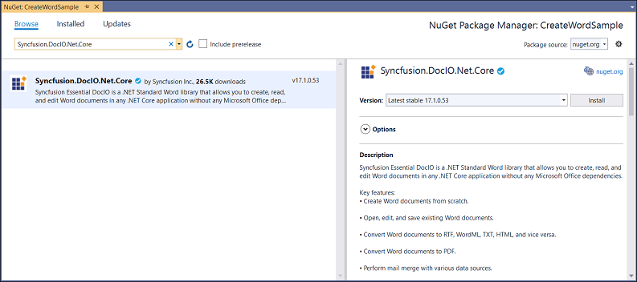

# Create Word document in Blazor

Syncfusion Essential DocIO is a [.NET Core Word library](https://www.syncfusion.com/word-framework/net-core/word-library) used to create, read, and edit **Word** documents programmatically without **Microsoft Word** or interop dependencies. Using this library, you can **create a Word document in Blazor**.

**Prerequisites:**

* Visual Studio 2019 Preview
* Install [.NET Core SDK 3.0 Preview](https://dotnet.microsoft.com/download/dotnet-core/3.0)

**Creating a Blazor project**

* Enable Visual Studio to use preview SDKs
* Open Tools > Options in the menu bar.
* Open the Projects and Solutions node. Open the .NET Core tab.
* Check the box for Use previews of the .NET Core SDK and click OK.
* Restart the Visual Studio 2019.

## Server-side application

1.Create a new project.

2.Select ASP.NET Core Web Application and click Next.

3.Select **.NET Core, ASP.NET Core 3.0** and **Blazor (server-side)**.

4.To **create a Word document in server-side application**, install [Syncfusion.DocIO.Net.Core](https://www.nuget.org/packages/Syncfusion.DocIO.Net.Core) to the Blazor project.

5.Add the following code in **Index.razor** to create a new button.





<h2>Syncfusion Word library (Essential DocIO)</h2>

Syncfusion Word library (Essential Word)  is a Blazor Word library used to create, read, edit, and convert Word document in your applications without Microsoft Office dependencies.

<button class="btn btn-primary" onclick="@CreateWord">Create Word</button>





6.Add the following code to **create and download a Word document in Blazor**.





@functions 
{
    MemoryStream wordStream;

    /// 

    /// Create and download the Word document
    /// 

    protected async void CreateWord()
    {
        wordStream = service.CreateWord();
        await JS.SaveAs("Sample.docx", wordStream.ToArray());
    }
}





7.Create a new cs file with name as **WordService.cs** under Data folder and include the following namespaces in the file.





using Syncfusion.DocIO;
using Syncfusion.DocIO.DLS;
using System.IO;





8.Create a new method with name as CreateWord and include the following code snippet to **create a Word document in Blazor Server-Side application**.





public MemoryStream CreateWord()
{
    // Creating a new document.
    WordDocument document = new WordDocument();
    //Adding a new section to the document.
    WSection section = document.AddSection() as WSection;
    //Set Margin of the section
    section.PageSetup.Margins.All = 72;
    //Set page size of the section
    section.PageSetup.PageSize = new Syncfusion.Drawing.SizeF(612, 792);

    //Create Paragraph styles
    WParagraphStyle style = document.AddParagraphStyle("Normal") as WParagraphStyle;
    style.CharacterFormat.FontName = "Calibri";
    style.CharacterFormat.FontSize = 11f;
    style.ParagraphFormat.BeforeSpacing = 0;
    style.ParagraphFormat.AfterSpacing = 8;
    style.ParagraphFormat.LineSpacing = 13.8f;

    style = document.AddParagraphStyle("Heading 1") as WParagraphStyle;
    style.ApplyBaseStyle("Normal");
    style.CharacterFormat.FontName = "Calibri Light";
    style.CharacterFormat.FontSize = 16f;
    style.CharacterFormat.TextColor = Syncfusion.Drawing.Color.FromArgb(46, 116, 181);
    style.ParagraphFormat.BeforeSpacing = 12;
    style.ParagraphFormat.AfterSpacing = 0;
    style.ParagraphFormat.Keep = true;
    style.ParagraphFormat.KeepFollow = true;
    style.ParagraphFormat.OutlineLevel = OutlineLevel.Level1;
    IWParagraph paragraph = section.HeadersFooters.Header.AddParagraph();

    paragraph.ApplyStyle("Normal");
    paragraph.ParagraphFormat.HorizontalAlignment = HorizontalAlignment.Left;
    WTextRange textRange = paragraph.AppendText("Adventure Works Cycles") as WTextRange;
    textRange.CharacterFormat.FontSize = 12f;
    textRange.CharacterFormat.FontName = "Calibri";
    textRange.CharacterFormat.TextColor = Syncfusion.Drawing.Color.Red;

    //Appends paragraph.
    paragraph = section.AddParagraph();
    paragraph.ApplyStyle("Heading 1");
    paragraph.ParagraphFormat.HorizontalAlignment = HorizontalAlignment.Center;
    textRange = paragraph.AppendText("Adventure Works Cycles") as WTextRange;
    textRange.CharacterFormat.FontSize = 18f;
    textRange.CharacterFormat.FontName = "Calibri";

    //Appends paragraph.
    paragraph = section.AddParagraph();
    paragraph.ParagraphFormat.FirstLineIndent = 36;
    paragraph.BreakCharacterFormat.FontSize = 12f;
    textRange = paragraph.AppendText("Adventure Works Cycles, the fictitious company on which the AdventureWorks sample databases are based, is a large, multinational manufacturing company. The company manufactures and sells metal and composite bicycles to North American, European and Asian commercial markets. While its base operation is in Bothell, Washington with 290 employees, several regional sales teams are located throughout their market base.") as WTextRange;
    textRange.CharacterFormat.FontSize = 12f;

    //Appends paragraph.
    paragraph = section.AddParagraph();
    paragraph.ParagraphFormat.FirstLineIndent = 36;
    paragraph.BreakCharacterFormat.FontSize = 12f;
    textRange = paragraph.AppendText("In 2000, AdventureWorks Cycles bought a small manufacturing plant, Importadores Neptuno, located in Mexico. Importadores Neptuno manufactures several critical subcomponents for the AdventureWorks Cycles product line. These subcomponents are shipped to the Bothell location for final product assembly. In 2001, Importadores Neptuno, became the sole manufacturer and distributor of the touring bicycle product group.") as WTextRange;
    textRange.CharacterFormat.FontSize = 12f;

    //Save the document as a stream and retrun the stream.
    using (MemoryStream stream = new MemoryStream())
    {
        //Save the created Word document to MemoryStream.
        document.Save(stream, FormatType.Docx);

        return stream;
    }            
}





9.Create a class file with FileUtil name and add the following code to invoke the JavaScript action to download the file in the browser.





public static class FileUtil
{
    public static Task SaveAs(this IJSRuntime js, string filename, byte[] data)
       => js.InvokeAsync<object>(
           "saveAsFile",
           filename,
           Convert.ToBase64String(data));
}





10.Add the following JavaScript function in the _Host.cshtml in the Pages folder.









By executing the program, you will get the **Word document** as follows.

