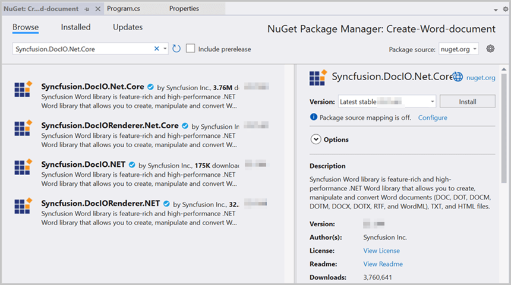
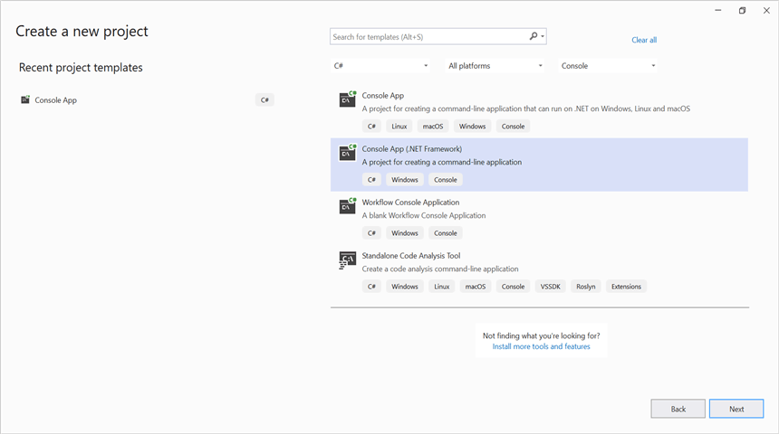
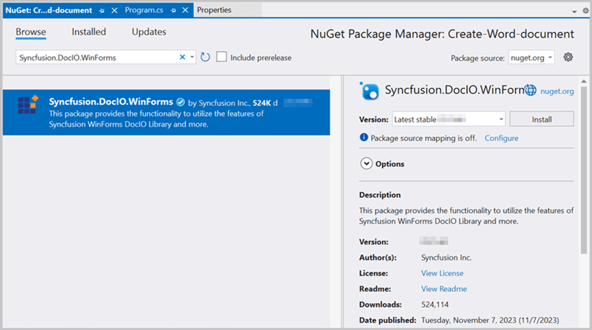

# Create a Word document in Console Application

Syncfusion DocIO is a [.NET Word library](https://www.syncfusion.com/document-processing/word-framework/net/word-library) used to create, read, edit, and **convert Word documents** programmatically without **Microsoft Word** or interop dependencies. Using this library, you can **create a Word document in Console Application**.

## Create a Word document using .NET Core and Latest

The below steps illustrates creating a simple **Word document** in console application using **.NET Core**.

Step 1: Create a new **.NET Core console application** project.

Step 2: Install the [Syncfusion.DocIO.Net.Core](https://www.nuget.org/packages/Syncfusion.DocIO.Net.Core) NuGet package as a reference to your project from [NuGet.org](https://www.nuget.org/).

N> Starting with v16.2.0.x, if you reference Syncfusion assemblies from trial setup or from the NuGet feed, you also have to add "Syncfusion.Licensing" assembly reference and include a license key in your projects. Please refer to this [link](https://help.syncfusion.com/common/essential-studio/licensing/overview) to know about registering Syncfusion license key in your application to use our components.

Step 3: Include the following namespaces in **Program.cs** file.




using Syncfusion.DocIO; 
using Syncfusion.DocIO.DLS; 
using System.IO;




Step 4: Include the below code snippet in **Program.cs** to **create a Word document**.




//Creating a new document.
using (WordDocument document = new WordDocument())
{
    //Adding a new section to the document.
    WSection section = document.AddSection() as WSection;
    //Set Margin of the section.
    section.PageSetup.Margins.All = 72;
    //Set page size of the section.
    section.PageSetup.PageSize = new Syncfusion.Drawing.SizeF(612, 792);

    //Create Paragraph styles.
    WParagraphStyle style = document.AddParagraphStyle("Normal") as WParagraphStyle;
    style.CharacterFormat.FontName = "Calibri";
    style.CharacterFormat.FontSize = 11f;
    style.ParagraphFormat.BeforeSpacing = 0;
    style.ParagraphFormat.AfterSpacing = 8;
    style.ParagraphFormat.LineSpacing = 13.8f;

    style = document.AddParagraphStyle("Heading 1") as WParagraphStyle;
    style.ApplyBaseStyle("Normal");
    style.CharacterFormat.FontName = "Calibri Light";
    style.CharacterFormat.FontSize = 16f;
    style.CharacterFormat.TextColor = Syncfusion.Drawing.Color.FromArgb(46, 116, 181);
    style.ParagraphFormat.BeforeSpacing = 12;
    style.ParagraphFormat.AfterSpacing = 0;
    style.ParagraphFormat.Keep = true;
    style.ParagraphFormat.KeepFollow = true;
    style.ParagraphFormat.OutlineLevel = OutlineLevel.Level1;
    IWParagraph paragraph = section.HeadersFooters.Header.AddParagraph();

    // Get the image stream.
    FileStream imageStream = new FileStream(Path.GetFullPath(@"../../../Data/AdventureCycle.jpg"), FileMode.Open, FileAccess.Read);
    IWPicture picture = paragraph.AppendPicture(imageStream);
    picture.TextWrappingStyle = TextWrappingStyle.InFrontOfText;
    picture.VerticalOrigin = VerticalOrigin.Margin;
    picture.VerticalPosition = -45;
    picture.HorizontalOrigin = HorizontalOrigin.Column;
    picture.HorizontalPosition = 263.5f;
    picture.WidthScale = 20;
    picture.HeightScale = 15;

    paragraph.ApplyStyle("Normal");
    paragraph.ParagraphFormat.HorizontalAlignment = HorizontalAlignment.Left;
    WTextRange textRange = paragraph.AppendText("Adventure Works Cycles") as WTextRange;
    textRange.CharacterFormat.FontSize = 12f;
    textRange.CharacterFormat.FontName = "Calibri";
    textRange.CharacterFormat.TextColor = Syncfusion.Drawing.Color.Red;

    //Append paragraph.
    paragraph = section.AddParagraph();
    paragraph.ApplyStyle("Heading 1");
    paragraph.ParagraphFormat.HorizontalAlignment = HorizontalAlignment.Center;
    textRange = paragraph.AppendText("Adventure Works Cycles") as WTextRange;
    textRange.CharacterFormat.FontSize = 18f;
    textRange.CharacterFormat.FontName = "Calibri";

    //Append paragraph.
    paragraph = section.AddParagraph();
    paragraph.ParagraphFormat.FirstLineIndent = 36;
    paragraph.BreakCharacterFormat.FontSize = 12f;
    textRange = paragraph.AppendText("Adventure Works Cycles, the fictitious company on which the AdventureWorks sample databases are based, is a large, multinational manufacturing company. The company manufactures and sells metal and composite bicycles to North American, European and Asian commercial markets. While its base operation is in Bothell, Washington with 290 employees, several regional sales teams are located throughout their market base.") as WTextRange;
    textRange.CharacterFormat.FontSize = 12f;

    //Append paragraph.
    paragraph = section.AddParagraph();
    paragraph.ParagraphFormat.FirstLineIndent = 36;
    paragraph.BreakCharacterFormat.FontSize = 12f;
    textRange = paragraph.AppendText("In 2000, AdventureWorks Cycles bought a small manufacturing plant, Importadores Neptuno, located in Mexico. Importadores Neptuno manufactures several critical subcomponents for the AdventureWorks Cycles product line. These subcomponents are shipped to the Bothell location for final product assembly. In 2001, Importadores Neptuno, became the sole manufacturer and distributor of the touring bicycle product group.") as WTextRange;
    textRange.CharacterFormat.FontSize = 12f;

    paragraph = section.AddParagraph();
    paragraph.ApplyStyle("Heading 1");
    paragraph.ParagraphFormat.HorizontalAlignment = HorizontalAlignment.Left;
    textRange = paragraph.AppendText("Product Overview") as WTextRange;
    textRange.CharacterFormat.FontSize = 16f;
    textRange.CharacterFormat.FontName = "Calibri";
    //Append table.
    IWTable table = section.AddTable();
    table.ResetCells(3, 2);
    table.TableFormat.Borders.BorderType = BorderStyle.None;
    table.TableFormat.IsAutoResized = true;

    //Append paragraph.
    paragraph = table[0, 0].AddParagraph();
    paragraph.ParagraphFormat.AfterSpacing = 0;
    paragraph.BreakCharacterFormat.FontSize = 12f;
    //Append picture to the paragraph.
    FileStream image1 = new FileStream(Path.GetFullPath(@"../../../Data/Mountain-200.jpg"), FileMode.Open, FileAccess.Read);
    picture = paragraph.AppendPicture(image1);
    picture.TextWrappingStyle = TextWrappingStyle.TopAndBottom;
    picture.VerticalOrigin = VerticalOrigin.Paragraph;
    picture.VerticalPosition = 4.5f;
    picture.HorizontalOrigin = HorizontalOrigin.Column;
    picture.HorizontalPosition = -2.15f;
    picture.WidthScale = 79;
    picture.HeightScale = 79;

    //Append paragraph.
    paragraph = table[0, 1].AddParagraph();
    paragraph.ApplyStyle("Heading 1");
    paragraph.ParagraphFormat.AfterSpacing = 0;
    paragraph.ParagraphFormat.LineSpacing = 12f;
    paragraph.AppendText("Mountain-200");
    //Append paragraph.
    paragraph = table[0, 1].AddParagraph();
    paragraph.ParagraphFormat.AfterSpacing = 0;
    paragraph.ParagraphFormat.LineSpacing = 12f;
    paragraph.BreakCharacterFormat.FontSize = 12f;
    paragraph.BreakCharacterFormat.FontName = "Times New Roman";

    textRange = paragraph.AppendText("Product No: BK-M68B-38\r") as WTextRange;
    textRange.CharacterFormat.FontSize = 12f;
    textRange.CharacterFormat.FontName = "Times New Roman";
    textRange = paragraph.AppendText("Size: 38\r") as WTextRange;
    textRange.CharacterFormat.FontSize = 12f;
    textRange.CharacterFormat.FontName = "Times New Roman";
    textRange = paragraph.AppendText("Weight: 25\r") as WTextRange;
    textRange.CharacterFormat.FontSize = 12f;
    textRange.CharacterFormat.FontName = "Times New Roman";
    textRange = paragraph.AppendText("Price: $2,294.99\r") as WTextRange;
    textRange.CharacterFormat.FontSize = 12f;
    textRange.CharacterFormat.FontName = "Times New Roman";
    //Append paragraph.
    paragraph = table[0, 1].AddParagraph();
    paragraph.ParagraphFormat.AfterSpacing = 0;
    paragraph.ParagraphFormat.LineSpacing = 12f;
    paragraph.BreakCharacterFormat.FontSize = 12f;

    //Append paragraph.
    paragraph = table[1, 0].AddParagraph();
    paragraph.ApplyStyle("Heading 1");
    paragraph.ParagraphFormat.AfterSpacing = 0;
    paragraph.ParagraphFormat.LineSpacing = 12f;
    paragraph.AppendText("Mountain-300 ");
    //Append paragraph.
    paragraph = table[1, 0].AddParagraph();
    paragraph.ParagraphFormat.AfterSpacing = 0;
    paragraph.ParagraphFormat.LineSpacing = 12f;
    paragraph.BreakCharacterFormat.FontSize = 12f;
    paragraph.BreakCharacterFormat.FontName = "Times New Roman";
    textRange = paragraph.AppendText("Product No: BK-M47B-38\r") as WTextRange;
    textRange.CharacterFormat.FontSize = 12f;
    textRange.CharacterFormat.FontName = "Times New Roman";
    textRange = paragraph.AppendText("Size: 35\r") as WTextRange;
    textRange.CharacterFormat.FontSize = 12f;
    textRange.CharacterFormat.FontName = "Times New Roman";
    textRange = paragraph.AppendText("Weight: 22\r") as WTextRange;
    textRange.CharacterFormat.FontSize = 12f;
    textRange.CharacterFormat.FontName = "Times New Roman";
    textRange = paragraph.AppendText("Price: $1,079.99\r") as WTextRange;
    textRange.CharacterFormat.FontSize = 12f;
    textRange.CharacterFormat.FontName = "Times New Roman";
    //Append paragraph.
    paragraph = table[1, 0].AddParagraph();
    paragraph.ParagraphFormat.AfterSpacing = 0;
    paragraph.ParagraphFormat.LineSpacing = 12f;
    paragraph.BreakCharacterFormat.FontSize = 12f;

    //Append paragraph.
    paragraph = table[1, 1].AddParagraph();
    paragraph.ApplyStyle("Heading 1");
    paragraph.ParagraphFormat.LineSpacing = 12f;
    //Append picture to the paragraph.
    FileStream image2 = new FileStream(Path.GetFullPath(@"../../../Data/Mountain-300.jpg"), FileMode.Open, FileAccess.Read);
    picture = paragraph.AppendPicture(image2);
    picture.TextWrappingStyle = TextWrappingStyle.TopAndBottom;
    picture.VerticalOrigin = VerticalOrigin.Paragraph;
    picture.VerticalPosition = 8.2f;
    picture.HorizontalOrigin = HorizontalOrigin.Column;
    picture.HorizontalPosition = -14.95f;
    picture.WidthScale = 75;
    picture.HeightScale = 75;

    //Append paragraph.
    paragraph = table[2, 0].AddParagraph();
    paragraph.ApplyStyle("Heading 1");
    paragraph.ParagraphFormat.LineSpacing = 12f;
    //Append picture to the paragraph.
    FileStream image3 = new FileStream(Path.GetFullPath(@"../../../Data/Road-550-W.jpg"), FileMode.Open, FileAccess.Read);
    picture = paragraph.AppendPicture(image3);
    picture.TextWrappingStyle = TextWrappingStyle.TopAndBottom;
    picture.VerticalOrigin = VerticalOrigin.Paragraph;
    picture.VerticalPosition = 3.75f;
    picture.HorizontalOrigin = HorizontalOrigin.Column;
    picture.HorizontalPosition = -5f;
    picture.WidthScale = 92;
    picture.HeightScale = 92;

    //Append paragraph.
    paragraph = table[2, 1].AddParagraph();
    paragraph.ApplyStyle("Heading 1");
    paragraph.ParagraphFormat.AfterSpacing = 0;
    paragraph.ParagraphFormat.LineSpacing = 12f;
    paragraph.AppendText("Road-150 ");
    //Append paragraph.
    paragraph = table[2, 1].AddParagraph();
    paragraph.ParagraphFormat.AfterSpacing = 0;
    paragraph.ParagraphFormat.LineSpacing = 12f;
    paragraph.BreakCharacterFormat.FontSize = 12f;
    paragraph.BreakCharacterFormat.FontName = "Times New Roman";
    textRange = paragraph.AppendText("Product No: BK-R93R-44\r") as WTextRange;
    textRange.CharacterFormat.FontSize = 12f;
    textRange.CharacterFormat.FontName = "Times New Roman";
    textRange = paragraph.AppendText("Size: 44\r") as WTextRange;
    textRange.CharacterFormat.FontSize = 12f;
    textRange.CharacterFormat.FontName = "Times New Roman";
    textRange = paragraph.AppendText("Weight: 14\r") as WTextRange;
    textRange.CharacterFormat.FontSize = 12f;
    textRange.CharacterFormat.FontName = "Times New Roman";
    textRange = paragraph.AppendText("Price: $3,578.27\r") as WTextRange;
    textRange.CharacterFormat.FontSize = 12f;
    textRange.CharacterFormat.FontName = "Times New Roman";
    //Append paragraph.
    section.AddParagraph();

    //Create FileStream to save the Word file.
    using (FileStream outputStream = new FileStream("Result.docx", FileMode.Create, FileAccess.ReadWrite, FileShare.ReadWrite))
    {
        //Save the Word file.
        document.Save(outputStream, FormatType.Docx);
    }
}




You can download a complete working sample from GitHub.

By executing the program, you will get the **Word document** as follows.

## Create Word document in .NET Framework

The below steps illustrates creating a simple **Word document** in console application using **.NET Framework**.

Step 1: Create a new **.NET FrameWork console application** project.

Step 2: Install [Syncfusion.DocIO.WinForms](https://www.nuget.org/packages/Syncfusion.DocIO.WinForms/) NuGet package as a reference to your Windows Forms application from the [NuGet.org](https://www.nuget.org/).

N> 1. The [Syncfusion.DocIO.WinForms](https://www.nuget.org/packages/Syncfusion.DocIO.WinForms/) is a dependency for Syncfusion Windows Forms GUI controls and is named with the suffix "WinForms". It contains platform-independent .NET Framework assemblies (compatible with versions 4.0, 4.5, 4.5.1, and 4.6) for the Word library and does not include any Windows Forms-related references or code. Therefore, we recommend using this package for .NET Framework Console applications.
N> 2. Starting with v16.2.0.x, if you reference Syncfusion assemblies from trial setup or from the NuGet feed, you also have to add "Syncfusion.Licensing" assembly reference and include a license key in your projects. Please refer to this [link](https://help.syncfusion.com/common/essential-studio/licensing/overview) to know about registering Syncfusion license key in your application to use our components.

Step 3: Include the following namespaces in **Program.cs** file.




using Syncfusion.DocIO;
using Syncfusion.DocIO.DLS;
using System.Windows.Forms;




Step 5: Include the below code snippet in **Program.cs** to **create a Word document**.




// Creating a new document.
WordDocument document = new WordDocument();
//Adding a new section to the document.
WSection section = document.AddSection() as WSection;
//Set Margin of the section
section.PageSetup.Margins.All = 72;
//Set page size of the section
section.PageSetup.PageSize = new SizeF(612, 792);

//Create Paragraph styles
WParagraphStyle style = document.AddParagraphStyle("Normal") as WParagraphStyle;
style.CharacterFormat.FontName = "Calibri";
style.CharacterFormat.FontSize = 11f;
style.ParagraphFormat.BeforeSpacing = 0;
style.ParagraphFormat.AfterSpacing = 8;
style.ParagraphFormat.LineSpacing = 13.8f;

style = document.AddParagraphStyle("Heading 1") as WParagraphStyle;
style.ApplyBaseStyle("Normal");
style.CharacterFormat.FontName = "Calibri Light";
style.CharacterFormat.FontSize = 16f;
style.CharacterFormat.TextColor = Color.FromArgb(46, 116, 181);
style.ParagraphFormat.BeforeSpacing = 12;
style.ParagraphFormat.AfterSpacing = 0;
style.ParagraphFormat.Keep = true;
style.ParagraphFormat.KeepFollow = true;
style.ParagraphFormat.OutlineLevel = OutlineLevel.Level1;

IWParagraph paragraph = section.HeadersFooters.Header.AddParagraph();
// Gets the image stream.
IWPicture picture = paragraph.AppendPicture(new Bitmap("AdventureCycle.jpg")) as WPicture;
picture.TextWrappingStyle = TextWrappingStyle.InFrontOfText;
picture.VerticalOrigin = VerticalOrigin.Margin;
picture.VerticalPosition = -45;
picture.HorizontalOrigin = HorizontalOrigin.Column;
picture.HorizontalPosition = 263.5f;
picture.WidthScale = 20;
picture.HeightScale = 15;

paragraph.ApplyStyle("Normal");
paragraph.ParagraphFormat.HorizontalAlignment = Syncfusion.DocIO.DLS.HorizontalAlignment.Left;
WTextRange textRange = paragraph.AppendText("Adventure Works Cycles") as WTextRange;
textRange.CharacterFormat.FontSize = 12f;
textRange.CharacterFormat.FontName = "Calibri";
textRange.CharacterFormat.TextColor = Color.Red;

//Append paragraph.
paragraph = section.AddParagraph();
paragraph.ApplyStyle("Heading 1");
paragraph.ParagraphFormat.HorizontalAlignment = Syncfusion.DocIO.DLS.HorizontalAlignment.Center;
textRange = paragraph.AppendText("Adventure Works Cycles") as WTextRange;
textRange.CharacterFormat.FontSize = 18f;
textRange.CharacterFormat.FontName = "Calibri";

//Append paragraph.
paragraph = section.AddParagraph();
paragraph.ParagraphFormat.FirstLineIndent = 36;
paragraph.BreakCharacterFormat.FontSize = 12f;
textRange = paragraph.AppendText("Adventure Works Cycles, the fictitious company on which the AdventureWorks sample databases are based, is a large, multinational manufacturing company. The company manufactures and sells metal and composite bicycles to North American, European and Asian commercial markets. While its base operation is in Bothell, Washington with 290 employees, several regional sales teams are located throughout their market base.") as WTextRange;
textRange.CharacterFormat.FontSize = 12f;

//Append paragraph.
paragraph = section.AddParagraph();
paragraph.ParagraphFormat.FirstLineIndent = 36;
paragraph.BreakCharacterFormat.FontSize = 12f;
textRange = paragraph.AppendText("In 2000, AdventureWorks Cycles bought a small manufacturing plant, Importadores Neptuno, located in Mexico. Importadores Neptuno manufactures several critical subcomponents for the AdventureWorks Cycles product line. These subcomponents are shipped to the Bothell location for final product assembly. In 2001, Importadores Neptuno, became the sole manufacturer and distributor of the touring bicycle product group.") as WTextRange;
textRange.CharacterFormat.FontSize = 12f;

paragraph = section.AddParagraph();
paragraph.ApplyStyle("Heading 1");
paragraph.ParagraphFormat.HorizontalAlignment = Syncfusion.DocIO.DLS.HorizontalAlignment.Left;
textRange = paragraph.AppendText("Product Overview") as WTextRange;
textRange.CharacterFormat.FontSize = 16f;
textRange.CharacterFormat.FontName = "Calibri";

//Append table.
IWTable table = section.AddTable();
table.ResetCells(3, 2);
table.TableFormat.Borders.BorderType = Syncfusion.DocIO.DLS.BorderStyle.None;
table.TableFormat.IsAutoResized = true;
//Append paragraph.
paragraph = table[0, 0].AddParagraph();
paragraph.ParagraphFormat.AfterSpacing = 0;
paragraph.BreakCharacterFormat.FontSize = 12f;
//Append picture to the paragraph.
picture = paragraph.AppendPicture(new Bitmap("Mountain-200.jpg")) as WPicture;
picture.TextWrappingStyle = TextWrappingStyle.TopAndBottom;
picture.VerticalOrigin = VerticalOrigin.Paragraph;
picture.VerticalPosition = 4.5f;
picture.HorizontalOrigin = HorizontalOrigin.Column;
picture.HorizontalPosition = -2.15f;
picture.WidthScale = 79;
picture.HeightScale = 79;

//Append paragraph.
paragraph = table[0, 1].AddParagraph();
paragraph.ApplyStyle("Heading 1");
paragraph.ParagraphFormat.AfterSpacing = 0;
paragraph.ParagraphFormat.LineSpacing = 12f;
paragraph.AppendText("Mountain-200");
//Append paragraph.
paragraph = table[0, 1].AddParagraph();
paragraph.ParagraphFormat.AfterSpacing = 0;
paragraph.ParagraphFormat.LineSpacing = 12f;
paragraph.BreakCharacterFormat.FontSize = 12f;
paragraph.BreakCharacterFormat.FontName = "Times New Roman";
textRange = paragraph.AppendText("Product No: BK-M68B-38\r") as WTextRange;
textRange.CharacterFormat.FontSize = 12f;
textRange.CharacterFormat.FontName = "Times New Roman";
textRange = paragraph.AppendText("Size: 38\r") as WTextRange;
textRange.CharacterFormat.FontSize = 12f;
textRange.CharacterFormat.FontName = "Times New Roman";
textRange = paragraph.AppendText("Weight: 25\r") as WTextRange;
textRange.CharacterFormat.FontSize = 12f;
textRange.CharacterFormat.FontName = "Times New Roman";
textRange = paragraph.AppendText("Price: $2,294.99\r") as WTextRange;
textRange.CharacterFormat.FontSize = 12f;
textRange.CharacterFormat.FontName = "Times New Roman";
//Append paragraph.
paragraph = table[0, 1].AddParagraph();
paragraph.ParagraphFormat.AfterSpacing = 0;
paragraph.ParagraphFormat.LineSpacing = 12f;
paragraph.BreakCharacterFormat.FontSize = 12f;

//Append paragraph.
paragraph = table[1, 0].AddParagraph();
paragraph.ApplyStyle("Heading 1");
paragraph.ParagraphFormat.AfterSpacing = 0;
paragraph.ParagraphFormat.LineSpacing = 12f;
paragraph.AppendText("Mountain-300 ");
//Append paragraph.
paragraph = table[1, 0].AddParagraph();
paragraph.ParagraphFormat.AfterSpacing = 0;
paragraph.ParagraphFormat.LineSpacing = 12f;
paragraph.BreakCharacterFormat.FontSize = 12f;
paragraph.BreakCharacterFormat.FontName = "Times New Roman";
textRange = paragraph.AppendText("Product No: BK-M47B-38\r") as WTextRange;
textRange.CharacterFormat.FontSize = 12f;
textRange.CharacterFormat.FontName = "Times New Roman";
textRange = paragraph.AppendText("Size: 35\r") as WTextRange;
textRange.CharacterFormat.FontSize = 12f;
textRange.CharacterFormat.FontName = "Times New Roman";
textRange = paragraph.AppendText("Weight: 22\r") as WTextRange;
textRange.CharacterFormat.FontSize = 12f;
textRange.CharacterFormat.FontName = "Times New Roman";
textRange = paragraph.AppendText("Price: $1,079.99\r") as WTextRange;
textRange.CharacterFormat.FontSize = 12f;
textRange.CharacterFormat.FontName = "Times New Roman";
//Append paragraph.
paragraph = table[1, 0].AddParagraph();
paragraph.ParagraphFormat.AfterSpacing = 0;
paragraph.ParagraphFormat.LineSpacing = 12f;
paragraph.BreakCharacterFormat.FontSize = 12f;

//Append paragraph.
paragraph = table[1, 1].AddParagraph();
paragraph.ApplyStyle("Heading 1");
paragraph.ParagraphFormat.LineSpacing = 12f;
//Append picture to the paragraph.
picture = paragraph.AppendPicture(new Bitmap("Mountain-300.jpg")) as WPicture;
picture.TextWrappingStyle = TextWrappingStyle.TopAndBottom;
picture.VerticalOrigin = VerticalOrigin.Paragraph;
picture.VerticalPosition = 8.2f;
picture.HorizontalOrigin = HorizontalOrigin.Column;
picture.HorizontalPosition = -14.95f;
picture.WidthScale = 75;
picture.HeightScale = 75;

//Append paragraph.
paragraph = table[2, 0].AddParagraph();
paragraph.ApplyStyle("Heading 1");
paragraph.ParagraphFormat.LineSpacing = 12f;
//Append picture to the paragraph.
picture = paragraph.AppendPicture(new Bitmap("Road-550-W.jpg")) as WPicture;
picture.TextWrappingStyle = TextWrappingStyle.TopAndBottom;
picture.VerticalOrigin = VerticalOrigin.Paragraph;
picture.VerticalPosition = 3.75f;
picture.HorizontalOrigin = HorizontalOrigin.Column;
picture.HorizontalPosition = -5f;
picture.WidthScale = 92;
picture.HeightScale = 92;

//Append paragraph.
paragraph = table[2, 1].AddParagraph();
paragraph.ApplyStyle("Heading 1");
paragraph.ParagraphFormat.AfterSpacing = 0;
paragraph.ParagraphFormat.LineSpacing = 12f;
paragraph.AppendText("Road-150 ");
//Append paragraph.
paragraph = table[2, 1].AddParagraph();
paragraph.ParagraphFormat.AfterSpacing = 0;
paragraph.ParagraphFormat.LineSpacing = 12f;
paragraph.BreakCharacterFormat.FontSize = 12f;
paragraph.BreakCharacterFormat.FontName = "Times New Roman";
textRange = paragraph.AppendText("Product No: BK-R93R-44\r") as WTextRange;
textRange.CharacterFormat.FontSize = 12f;
textRange.CharacterFormat.FontName = "Times New Roman";
textRange = paragraph.AppendText("Size: 44\r") as WTextRange;
textRange.CharacterFormat.FontSize = 12f;
textRange.CharacterFormat.FontName = "Times New Roman";
textRange = paragraph.AppendText("Weight: 14\r") as WTextRange;
textRange.CharacterFormat.FontSize = 12f;
textRange.CharacterFormat.FontName = "Times New Roman";
textRange = paragraph.AppendText("Price: $3,578.27\r") as WTextRange;
textRange.CharacterFormat.FontSize = 12f;
textRange.CharacterFormat.FontName = "Times New Roman";
//Append paragraph.
section.AddParagraph();

//Save the Word document
document.Save("Sample.docx");




You can download a complete working sample from GitHub.

By executing the program, you will get the **Word document** as follows.

