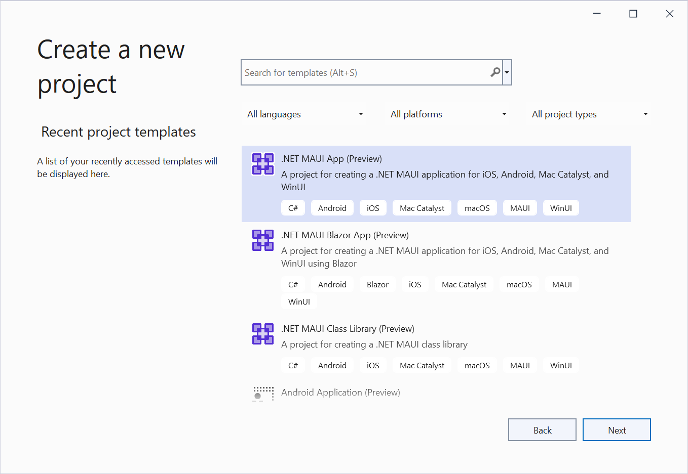
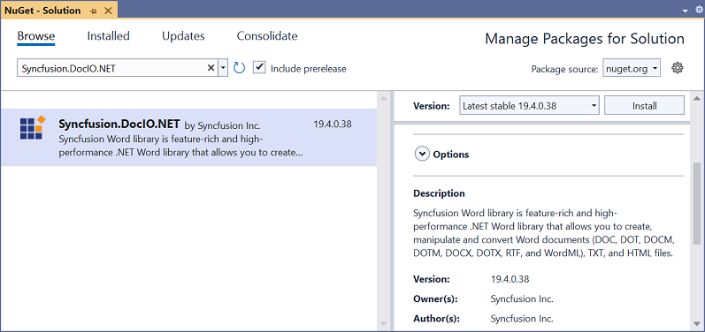

# Create Word document in .NET MAUI

Syncfusion Essential DocIO is a [.NET MAUI Word library](https://www.syncfusion.com/document-processing/word-framework/maui/word-library) used to create, read, and edit **Word** documents programmatically without **Microsoft Word** or interop dependencies. Using this library, you can **create a Word document in .NET MAUI**.

**Prerequisites:**
To create .NET Multi-platform App UI (.NET MAUI) apps, you need the latest versions of Visual Studio 2022 and .NET 6. For more details, refer [here](https://docs.microsoft.com/en-us/dotnet/maui/get-started/installation).

## Steps to create Word document programmatically in .NET MAUI

1.Create a new C# .NET MAUI app. Select **.NET MAUI App (Preview)** from the template and click the **Next** button.

2.Enter the project name and click **Create**.

3.Install the Syncfusion.DocIO.NET NuGet package as a reference to your project from [NuGet.org](https://www.nuget.org/).

N> Starting with v16.2.0.x, if you reference Syncfusion assemblies from trial setup or from the NuGet feed, you also have to add "Syncfusion.Licensing" assembly reference and include a license key in your projects. Please refer to this [link](https://help.syncfusion.com/common/essential-studio/licensing/license-key) to know about registering a Syncfusion license key in your application to use our components.

4.Add a new button to the **MainPage.xaml** as shown below.





<ContentPage xmlns="http://schemas.microsoft.com/dotnet/2021/maui"
             xmlns:x="http://schemas.microsoft.com/winfx/2009/xaml"
             x:Class="CreateWordSample.MainPage"
             BackgroundColor="{DynamicResource SecondaryColor}">
    <ScrollView>
        <Grid RowSpacing="25" RowDefinitions="Auto,Auto,Auto,Auto,*"
              Padding="{OnPlatform iOS='30,60,30,30', Default='30'}">
            <Button 
                Text="Create Document"
                FontAttributes="Bold"
                Grid.Row="0"
                SemanticProperties.Hint="Creates Word document you click"
                Clicked="CreateDocument"
                HorizontalOptions="Center" />
        </Grid>
    </ScrollView>
</ContentPage>





5.Include the following namespaces in the **MainPage.xaml.cs** file.





using Syncfusion.DocIO;
using Syncfusion.DocIO.DLS;
using System.IO;
using System.Reflection;





6.Add a new action method **CreateDocument** in MainPage.xaml.cs and include the below code snippet to **create a Word document**.




//Creates a new document.
using WordDocument document = new();
//Adds a new section to the document.
WSection section = document.AddSection() as WSection;
//Sets Margin of the section.
section.PageSetup.Margins.All = 72;
//Sets the page size of the section.
section.PageSetup.PageSize = new Syncfusion.Drawing.SizeF(612, 792);

//Creates Paragraph styles.
WParagraphStyle style = document.AddParagraphStyle("Normal") as WParagraphStyle;
style.CharacterFormat.FontName = "Calibri";
style.CharacterFormat.FontSize = 11f;
style.ParagraphFormat.BeforeSpacing = 0;
style.ParagraphFormat.AfterSpacing = 8;
style.ParagraphFormat.LineSpacing = 13.8f;

style = document.AddParagraphStyle("Heading 1") as WParagraphStyle;
style.ApplyBaseStyle("Normal");
style.CharacterFormat.FontName = "Calibri Light";
style.CharacterFormat.FontSize = 16f;
style.CharacterFormat.TextColor = Syncfusion.Drawing.Color.FromArgb(46, 116, 181);
style.ParagraphFormat.BeforeSpacing = 12;
style.ParagraphFormat.AfterSpacing = 0;
style.ParagraphFormat.Keep = true;
style.ParagraphFormat.KeepFollow = true;
style.ParagraphFormat.OutlineLevel = OutlineLevel.Level1;
IWParagraph paragraph = section.HeadersFooters.Header.AddParagraph();

Assembly assembly = typeof(MainPage).GetTypeInfo().Assembly;
string resourcePath = "CreateWordSample.Resources.DocIO.AdventureCycle.jpg";
//Gets the image stream.
Stream imageStream = assembly.GetManifestResourceStream(resourcePath);
IWPicture picture = paragraph.AppendPicture(imageStream);
picture.TextWrappingStyle = TextWrappingStyle.InFrontOfText;
picture.VerticalOrigin = VerticalOrigin.Margin;
picture.VerticalPosition = -45;
picture.HorizontalOrigin = HorizontalOrigin.Column;
picture.HorizontalPosition = 263.5f;
picture.WidthScale = 20;
picture.HeightScale = 15;
paragraph.ApplyStyle("Normal");
paragraph.ParagraphFormat.HorizontalAlignment = Syncfusion.DocIO.DLS.HorizontalAlignment.Left;
WTextRange textRange = paragraph.AppendText("Adventure Works Cycles") as WTextRange;
textRange.CharacterFormat.FontSize = 12f;
textRange.CharacterFormat.FontName = "Calibri";
textRange.CharacterFormat.TextColor = Syncfusion.Drawing.Color.Red;

//Appends the paragraph.
paragraph = section.AddParagraph();
paragraph.ApplyStyle("Heading 1");
paragraph.ParagraphFormat.HorizontalAlignment = Syncfusion.DocIO.DLS.HorizontalAlignment.Center;
textRange = paragraph.AppendText("Adventure Works Cycles") as WTextRange;
textRange.CharacterFormat.FontSize = 18f;
textRange.CharacterFormat.FontName = "Calibri";

//Append the paragraph.
paragraph = section.AddParagraph();
paragraph.ParagraphFormat.FirstLineIndent = 36;
paragraph.BreakCharacterFormat.FontSize = 12f;
textRange = paragraph.AppendText("Adventure Works Cycles, the fictitious company on which the AdventureWorks sample databases are based, is a large, multinational manufacturing company. The company manufactures and sells metal and composite bicycles to North American, European and Asian commercial markets. While its base operation is in Bothell, Washington with 290 employees, several regional sales teams are located throughout their market base.") as WTextRange;
textRange.CharacterFormat.FontSize = 12f;

//Appends the paragraph.
paragraph = section.AddParagraph();
paragraph.ParagraphFormat.FirstLineIndent = 36;
paragraph.BreakCharacterFormat.FontSize = 12f;
textRange = paragraph.AppendText("In 2000, AdventureWorks Cycles bought a small manufacturing plant, Importadores Neptuno, located in Mexico. Importadores Neptuno manufactures several critical subcomponents for the AdventureWorks Cycles product line. These subcomponents are shipped to the Bothell location for final product assembly. In 2001, Importadores Neptuno, became the sole manufacturer and distributor of the touring bicycle product group.") as WTextRange;
textRange.CharacterFormat.FontSize = 12f;

paragraph = section.AddParagraph();
paragraph.ApplyStyle("Heading 1");
paragraph.ParagraphFormat.HorizontalAlignment = Syncfusion.DocIO.DLS.HorizontalAlignment.Left;
textRange = paragraph.AppendText("Product Overview") as WTextRange;
textRange.CharacterFormat.FontSize = 16f;
textRange.CharacterFormat.FontName = "Calibri";

//Appends the table.
IWTable table = section.AddTable();
table.ResetCells(3, 2);
table.TableFormat.Borders.BorderType = BorderStyle.None;
table.TableFormat.IsAutoResized = true;

//Appends the paragraph.
paragraph = table[0, 0].AddParagraph();
paragraph.ParagraphFormat.AfterSpacing = 0;
paragraph.BreakCharacterFormat.FontSize = 12f;
//Appends the picture to the paragraph.
resourcePath = "CreateWordSample.Resources.DocIO.Mountain-200.jpg";
imageStream = assembly.GetManifestResourceStream(resourcePath);
picture = paragraph.AppendPicture(imageStream);
picture.TextWrappingStyle = TextWrappingStyle.TopAndBottom;
picture.VerticalOrigin = VerticalOrigin.Paragraph;
picture.VerticalPosition = 4.5f;
picture.HorizontalOrigin = HorizontalOrigin.Column;
picture.HorizontalPosition = -2.15f;
picture.WidthScale = 79;
picture.HeightScale = 79;

//Appends the paragraph.
paragraph = table[0, 1].AddParagraph();
paragraph.ApplyStyle("Heading 1");
paragraph.ParagraphFormat.AfterSpacing = 0;
paragraph.ParagraphFormat.LineSpacing = 12f;
paragraph.AppendText("Mountain-200");
//Appends the paragraph.
paragraph = table[0, 1].AddParagraph();
paragraph.ParagraphFormat.AfterSpacing = 0;
paragraph.ParagraphFormat.LineSpacing = 12f;
paragraph.BreakCharacterFormat.FontSize = 12f;
paragraph.BreakCharacterFormat.FontName = "Times New Roman";

textRange = paragraph.AppendText("Product No: BK-M68B-38\r") as WTextRange;
textRange.CharacterFormat.FontSize = 12f;
textRange.CharacterFormat.FontName = "Times New Roman";
textRange = paragraph.AppendText("Size: 38\r") as WTextRange;
textRange.CharacterFormat.FontSize = 12f;
textRange.CharacterFormat.FontName = "Times New Roman";
textRange = paragraph.AppendText("Weight: 25\r") as WTextRange;
textRange.CharacterFormat.FontSize = 12f;
textRange.CharacterFormat.FontName = "Times New Roman";
textRange = paragraph.AppendText("Price: $2,294.99\r") as WTextRange;
textRange.CharacterFormat.FontSize = 12f;
textRange.CharacterFormat.FontName = "Times New Roman";
//Appends the paragraph.
paragraph = table[0, 1].AddParagraph();
paragraph.ParagraphFormat.AfterSpacing = 0;
paragraph.ParagraphFormat.LineSpacing = 12f;
paragraph.BreakCharacterFormat.FontSize = 12f;

//Appends the paragraph.
paragraph = table[1, 0].AddParagraph();
paragraph.ApplyStyle("Heading 1");
paragraph.ParagraphFormat.AfterSpacing = 0;
paragraph.ParagraphFormat.LineSpacing = 12f;
paragraph.AppendText("Mountain-300 ");
//Appends the paragraph.
paragraph = table[1, 0].AddParagraph();
paragraph.ParagraphFormat.AfterSpacing = 0;
paragraph.ParagraphFormat.LineSpacing = 12f;
paragraph.BreakCharacterFormat.FontSize = 12f;
paragraph.BreakCharacterFormat.FontName = "Times New Roman";
textRange = paragraph.AppendText("Product No: BK-M47B-38\r") as WTextRange;
textRange.CharacterFormat.FontSize = 12f;
textRange.CharacterFormat.FontName = "Times New Roman";
textRange = paragraph.AppendText("Size: 35\r") as WTextRange;
textRange.CharacterFormat.FontSize = 12f;
textRange.CharacterFormat.FontName = "Times New Roman";
textRange = paragraph.AppendText("Weight: 22\r") as WTextRange;
textRange.CharacterFormat.FontSize = 12f;
textRange.CharacterFormat.FontName = "Times New Roman";
textRange = paragraph.AppendText("Price: $1,079.99\r") as WTextRange;
textRange.CharacterFormat.FontSize = 12f;
textRange.CharacterFormat.FontName = "Times New Roman";
//Appends the paragraph.
paragraph = table[1, 0].AddParagraph();
paragraph.ParagraphFormat.AfterSpacing = 0;
paragraph.ParagraphFormat.LineSpacing = 12f;
paragraph.BreakCharacterFormat.FontSize = 12f;

//Appends the paragraph.
paragraph = table[1, 1].AddParagraph();
paragraph.ApplyStyle("Heading 1");
paragraph.ParagraphFormat.LineSpacing = 12f;
//Appends the picture to the paragraph.
resourcePath = "CreateWordSample.Resources.DocIO.Mountain-300.jpg";
imageStream = assembly.GetManifestResourceStream(resourcePath);

picture = paragraph.AppendPicture(imageStream);
picture.TextWrappingStyle = TextWrappingStyle.TopAndBottom;
picture.VerticalOrigin = VerticalOrigin.Paragraph;
picture.VerticalPosition = 8.2f;
picture.HorizontalOrigin = HorizontalOrigin.Column;
picture.HorizontalPosition = -14.95f;
picture.WidthScale = 75;
picture.HeightScale = 75;

//Append the paragraph.
paragraph = table[2, 0].AddParagraph();
paragraph.ApplyStyle("Heading 1");
paragraph.ParagraphFormat.LineSpacing = 12f;
//Appends the picture to the paragraph.
resourcePath = "CreateWordSample.Resources.DocIO.Road-550-W.jpg";
imageStream = assembly.GetManifestResourceStream(resourcePath);
picture = paragraph.AppendPicture(imageStream);
picture.TextWrappingStyle = TextWrappingStyle.TopAndBottom;
picture.VerticalOrigin = VerticalOrigin.Paragraph;
picture.VerticalPosition = 3.75f;
picture.HorizontalOrigin = HorizontalOrigin.Column;
picture.HorizontalPosition = -5f;
picture.WidthScale = 92;
picture.HeightScale = 92;

//Appends the paragraph.
paragraph = table[2, 1].AddParagraph();
paragraph.ApplyStyle("Heading 1");
paragraph.ParagraphFormat.AfterSpacing = 0;
paragraph.ParagraphFormat.LineSpacing = 12f;
paragraph.AppendText("Road-150 ");
//Appends the paragraph.
paragraph = table[2, 1].AddParagraph();
paragraph.ParagraphFormat.AfterSpacing = 0;
paragraph.ParagraphFormat.LineSpacing = 12f;
paragraph.BreakCharacterFormat.FontSize = 12f;
paragraph.BreakCharacterFormat.FontName = "Times New Roman";
textRange = paragraph.AppendText("Product No: BK-R93R-44\r") as WTextRange;
textRange.CharacterFormat.FontSize = 12f;
textRange.CharacterFormat.FontName = "Times New Roman";
textRange = paragraph.AppendText("Size: 44\r") as WTextRange;
textRange.CharacterFormat.FontSize = 12f;
textRange.CharacterFormat.FontName = "Times New Roman";
textRange = paragraph.AppendText("Weight: 14\r") as WTextRange;
textRange.CharacterFormat.FontSize = 12f;
textRange.CharacterFormat.FontName = "Times New Roman";
textRange = paragraph.AppendText("Price: $3,578.27\r") as WTextRange;
textRange.CharacterFormat.FontSize = 12f;
textRange.CharacterFormat.FontName = "Times New Roman";
//Appends the paragraph.
section.AddParagraph();

using MemoryStream ms = new();
//Saves the Word document to the memory stream.
document.Save(ms, FormatType.Docx);
ms.Position = 0;
//Saves the memory stream as file.
SaveService saveService = new();
saveService.SaveAndView("Sample.docx", "application/msword", ms);





You can download a complete working sample from [GitHub](https://github.com/SyncfusionExamples/DocIO-Examples/tree/main/Getting-Started/.NET-MAUI).

By executing the program, you will get the **Word document** as follows.

## Helper files for .NET MAUI

Download the helper files from this [link](https://www.syncfusion.com/downloads/support/directtrac/general/ze/HelperFiles_DocIO-2028573617.zip) and add them into the mentioned project. These helper files allow you to save the stream as a physical file and open the file for viewing.

<table>
  <tr>
  <td>
    <b>Folder Name</b>
  </td>
  <td>
    <b>File Name</b>
  </td>
  <td>
    <b>Summary</b>
  </td>
  </tr>
  <tr>
  <td>
    .NET MAUI Project
  </td>
  <td>
    SaveService.cs
  </td>
  <td>Represent the base class for save operation.
  </td>
  </tr>
  <tr>
  <td>
    Windows
  </td>
  <td>
    SaveWindows.cs
  </td>
  <td>Save implementation for Windows.
  </td>
  </tr>
  <tr>
  <td>
    Android
  </td>
  <td>
    SaveAndroid.cs
  </td>
  <td>Save implementation for Android device.
  </td>
  </tr>
  <tr>
  <td>
    Mac Catalyst
  </td>
  <td>
    SaveMac.cs
  </td>
  <td>Save implementation for Mac Catalyst device.
  </td>
  </tr>
  <tr>
  <td rowspan="2">
    iOS
  </td>
  <td>
    SaveIOS.cs
  </td>
  <td>
    Save implementation for iOS device
  </td>
  </tr>
  <tr>
  <td>
    PreviewControllerDS.cs QLPreviewItemFileSystem.cs
  </td>
  <td>
    Helper classes for viewing the <b>Word document</b> in iOS device
  </td>
  </tr>
</table>

N> You can also explore our [.NET MAUI Word library demo](https://github.com/syncfusion/maui-demos/tree/master/SampleBrowser.Maui/Samples/DocIO) that shows how to create and modify .NET MAUI Word files with just few lines of code.
