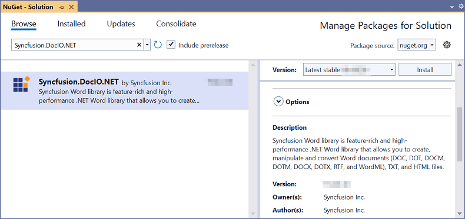

# Create Word document in WinUI

Syncfusion Essential DocIO is a [WinUI Word library](https://www.syncfusion.com/word-framework/winui/word-library) used to create, read, and edit **Word** documents programmatically without **Microsoft Word** or interop dependencies. Using this library, you can **create a Word document in WinUI**.

**Prerequisites:**
To use the WinUI 3 project templates, install the Windows App SDK extension for Visual Studio. For more details, refer [here](https://docs.microsoft.com/en-us/windows/apps/windows-app-sdk/set-up-your-development-environment).

## WinUI Desktop app

Step 1: Create a new C# WinUI Desktop app. Select Blank App, Packaged with WAP (WinUI 3 in Desktop) from the template and click the **Next** button.

Step 2: Enter the project name and click **Create**.

Step 3: Set the Target version to Windows 10, version 2004 (build 19041) and the Minimum version to Windows 10, version 1809 (build 17763) and then click **OK**.

Step 4: Install the Syncfusion.DocIO.NET NuGet package as a reference to your project from the [NuGet.org](https://www.nuget.org/).

N> Starting with v16.2.0.x, if you reference Syncfusion assemblies from trial setup or from the NuGet feed, you also have to add "Syncfusion.Licensing" assembly reference and include a license key in your projects. Please refer to this [link](https://help.syncfusion.com/common/essential-studio/licensing/license-key) to know about registering a Syncfusion license key in your application to use our components.

Step 5: Add a new button to the **MainWindow.xaml** as shown below.







<Window
    x:Class="CreateWordSample.MainWindow"
    xmlns="http://schemas.microsoft.com/winfx/2006/xaml/presentation"
    xmlns:x="http://schemas.microsoft.com/winfx/2006/xaml"
    xmlns:local="using:CreateWordSample"
    xmlns:d="http://schemas.microsoft.com/expression/blend/2008"
    xmlns:mc="http://schemas.openxmlformats.org/markup-compatibility/2006"
    mc:Ignorable="d">

    <StackPanel Orientation="Horizontal" HorizontalAlignment="Center" VerticalAlignment="Center">
        <Button x:Name="button" Click="CreateDocument">Create Document</Button>
    </StackPanel>
</Window>





{{ codesnippet1 | OrderList_Indent_Level_1 }}

Step 6: Include the following namespaces in the **MainWindow.xaml.cs** file.







using Syncfusion.DocIO;
using Syncfusion.DocIO.DLS;
using System.IO;





{{ codesnippet2 | OrderList_Indent_Level_1 }}

Step 7: Add a new action method **CreateDocument** in MainWindow.xaml.cs and include the below code snippet to **create a Word document**.






//Create a new document.
using WordDocument document = new();
//Add a new section to the document.
WSection section = document.AddSection() as WSection;
//Set Margin of the section.
section.PageSetup.Margins.All = 72;
//Set the page size of the section.
section.PageSetup.PageSize = new Syncfusion.Drawing.SizeF(612, 792);

//Create Paragraph styles.
WParagraphStyle style = document.AddParagraphStyle("Normal") as WParagraphStyle;
style.CharacterFormat.FontName = "Calibri";
style.CharacterFormat.FontSize = 11f;
style.ParagraphFormat.BeforeSpacing = 0;
style.ParagraphFormat.AfterSpacing = 8;
style.ParagraphFormat.LineSpacing = 13.8f;

style = document.AddParagraphStyle("Heading 1") as WParagraphStyle;
style.ApplyBaseStyle("Normal");
style.CharacterFormat.FontName = "Calibri Light";
style.CharacterFormat.FontSize = 16f;
style.CharacterFormat.TextColor = Syncfusion.Drawing.Color.FromArgb(46, 116, 181);
style.ParagraphFormat.BeforeSpacing = 12;
style.ParagraphFormat.AfterSpacing = 0;
style.ParagraphFormat.Keep = true;
style.ParagraphFormat.KeepFollow = true;
style.ParagraphFormat.OutlineLevel = OutlineLevel.Level1;
IWParagraph paragraph = section.HeadersFooters.Header.AddParagraph();

//"App" is the class of Portable project.
Assembly assembly = typeof(App).GetTypeInfo().Assembly;
//Get the image stream.
Stream imageStream = assembly.GetManifestResourceStream("CreateWordSample.Assets.AdventureCycle.jpg");
IWPicture picture = paragraph.AppendPicture(imageStream);
picture.TextWrappingStyle = TextWrappingStyle.InFrontOfText;
picture.VerticalOrigin = VerticalOrigin.Margin;
picture.VerticalPosition = -45;
picture.HorizontalOrigin = HorizontalOrigin.Column;
picture.HorizontalPosition = 263.5f;
picture.WidthScale = 20;
picture.HeightScale = 15;
paragraph.ApplyStyle("Normal");
paragraph.ParagraphFormat.HorizontalAlignment = Syncfusion.DocIO.DLS.HorizontalAlignment.Left;
WTextRange textRange = paragraph.AppendText("Adventure Works Cycles") as WTextRange;
textRange.CharacterFormat.FontSize = 12f;
textRange.CharacterFormat.FontName = "Calibri";
textRange.CharacterFormat.TextColor = Syncfusion.Drawing.Color.Red;

//Append the paragraph.
paragraph = section.AddParagraph();
paragraph.ApplyStyle("Heading 1");
paragraph.ParagraphFormat.HorizontalAlignment = Syncfusion.DocIO.DLS.HorizontalAlignment.Center;
textRange = paragraph.AppendText("Adventure Works Cycles") as WTextRange;
textRange.CharacterFormat.FontSize = 18f;
textRange.CharacterFormat.FontName = "Calibri";

//Append the paragraph.
paragraph = section.AddParagraph();
paragraph.ParagraphFormat.FirstLineIndent = 36;
paragraph.BreakCharacterFormat.FontSize = 12f;
textRange = paragraph.AppendText("Adventure Works Cycles, the fictitious company on which the AdventureWorks sample databases are based, is a large, multinational manufacturing company. The company manufactures and sells metal and composite bicycles to North American, European and Asian commercial markets. While its base operation is in Bothell, Washington with 290 employees, several regional sales teams are located throughout their market base.") as WTextRange;
textRange.CharacterFormat.FontSize = 12f;

//Append the paragraph.
paragraph = section.AddParagraph();
paragraph.ParagraphFormat.FirstLineIndent = 36;
paragraph.BreakCharacterFormat.FontSize = 12f;
textRange = paragraph.AppendText("In 2000, AdventureWorks Cycles bought a small manufacturing plant, Importadores Neptuno, located in Mexico. Importadores Neptuno manufactures several critical subcomponents for the AdventureWorks Cycles product line. These subcomponents are shipped to the Bothell location for final product assembly. In 2001, Importadores Neptuno, became the sole manufacturer and distributor of the touring bicycle product group.") as WTextRange;
textRange.CharacterFormat.FontSize = 12f;

paragraph = section.AddParagraph();
paragraph.ApplyStyle("Heading 1");
paragraph.ParagraphFormat.HorizontalAlignment = Syncfusion.DocIO.DLS.HorizontalAlignment.Left;
textRange = paragraph.AppendText("Product Overview") as WTextRange;
textRange.CharacterFormat.FontSize = 16f;
textRange.CharacterFormat.FontName = "Calibri";

//Append the table.
IWTable table = section.AddTable();
table.ResetCells(3, 2);
table.TableFormat.Borders.BorderType = BorderStyle.None;
table.TableFormat.IsAutoResized = true;

//Append the paragraph.
paragraph = table[0, 0].AddParagraph();
paragraph.ParagraphFormat.AfterSpacing = 0;
paragraph.BreakCharacterFormat.FontSize = 12f;
//Append the picture to the paragraph.
Stream image1 = assembly.GetManifestResourceStream("CreateWordSample.Assets.Mountain-200.jpg");
picture = paragraph.AppendPicture(image1);
picture.TextWrappingStyle = TextWrappingStyle.TopAndBottom;
picture.VerticalOrigin = VerticalOrigin.Paragraph;
picture.VerticalPosition = 4.5f;
picture.HorizontalOrigin = HorizontalOrigin.Column;
picture.HorizontalPosition = -2.15f;
picture.WidthScale = 79;
picture.HeightScale = 79;

//Append the paragraph.
paragraph = table[0, 1].AddParagraph();
paragraph.ApplyStyle("Heading 1");
paragraph.ParagraphFormat.AfterSpacing = 0;
paragraph.ParagraphFormat.LineSpacing = 12f;
paragraph.AppendText("Mountain-200");
//Append the paragraph.
paragraph = table[0, 1].AddParagraph();
paragraph.ParagraphFormat.AfterSpacing = 0;
paragraph.ParagraphFormat.LineSpacing = 12f;
paragraph.BreakCharacterFormat.FontSize = 12f;
paragraph.BreakCharacterFormat.FontName = "Times New Roman";

textRange = paragraph.AppendText("Product No: BK-M68B-38\r") as WTextRange;
textRange.CharacterFormat.FontSize = 12f;
textRange.CharacterFormat.FontName = "Times New Roman";
textRange = paragraph.AppendText("Size: 38\r") as WTextRange;
textRange.CharacterFormat.FontSize = 12f;
textRange.CharacterFormat.FontName = "Times New Roman";
textRange = paragraph.AppendText("Weight: 25\r") as WTextRange;
textRange.CharacterFormat.FontSize = 12f;
textRange.CharacterFormat.FontName = "Times New Roman";
textRange = paragraph.AppendText("Price: $2,294.99\r") as WTextRange;
textRange.CharacterFormat.FontSize = 12f;
textRange.CharacterFormat.FontName = "Times New Roman";
//Append the paragraph.
paragraph = table[0, 1].AddParagraph();
paragraph.ParagraphFormat.AfterSpacing = 0;
paragraph.ParagraphFormat.LineSpacing = 12f;
paragraph.BreakCharacterFormat.FontSize = 12f;

//Append the paragraph.
paragraph = table[1, 0].AddParagraph();
paragraph.ApplyStyle("Heading 1");
paragraph.ParagraphFormat.AfterSpacing = 0;
paragraph.ParagraphFormat.LineSpacing = 12f;
paragraph.AppendText("Mountain-300 ");
//Append the paragraph.
paragraph = table[1, 0].AddParagraph();
paragraph.ParagraphFormat.AfterSpacing = 0;
paragraph.ParagraphFormat.LineSpacing = 12f;
paragraph.BreakCharacterFormat.FontSize = 12f;
paragraph.BreakCharacterFormat.FontName = "Times New Roman";
textRange = paragraph.AppendText("Product No: BK-M47B-38\r") as WTextRange;
textRange.CharacterFormat.FontSize = 12f;
textRange.CharacterFormat.FontName = "Times New Roman";
textRange = paragraph.AppendText("Size: 35\r") as WTextRange;
textRange.CharacterFormat.FontSize = 12f;
textRange.CharacterFormat.FontName = "Times New Roman";
textRange = paragraph.AppendText("Weight: 22\r") as WTextRange;
textRange.CharacterFormat.FontSize = 12f;
textRange.CharacterFormat.FontName = "Times New Roman";
textRange = paragraph.AppendText("Price: $1,079.99\r") as WTextRange;
textRange.CharacterFormat.FontSize = 12f;
textRange.CharacterFormat.FontName = "Times New Roman";
//Append the paragraph.
paragraph = table[1, 0].AddParagraph();
paragraph.ParagraphFormat.AfterSpacing = 0;
paragraph.ParagraphFormat.LineSpacing = 12f;
paragraph.BreakCharacterFormat.FontSize = 12f;

//Append the paragraph.
paragraph = table[1, 1].AddParagraph();
paragraph.ApplyStyle("Heading 1");
paragraph.ParagraphFormat.LineSpacing = 12f;
//Append the picture to the paragraph.
Stream image2 = assembly.GetManifestResourceStream("CreateWordSample.Assets.Mountain-300.jpg");

picture = paragraph.AppendPicture(image2);
picture.TextWrappingStyle = TextWrappingStyle.TopAndBottom;
picture.VerticalOrigin = VerticalOrigin.Paragraph;
picture.VerticalPosition = 8.2f;
picture.HorizontalOrigin = HorizontalOrigin.Column;
picture.HorizontalPosition = -14.95f;
picture.WidthScale = 75;
picture.HeightScale = 75;

//Append the paragraph.
paragraph = table[2, 0].AddParagraph();
paragraph.ApplyStyle("Heading 1");
paragraph.ParagraphFormat.LineSpacing = 12f;
//Append the picture to the paragraph.
Stream image3 = assembly.GetManifestResourceStream("CreateWordSample.Assets.Road-550-W.jpg");
picture = paragraph.AppendPicture(image3);
picture.TextWrappingStyle = TextWrappingStyle.TopAndBottom;
picture.VerticalOrigin = VerticalOrigin.Paragraph;
picture.VerticalPosition = 3.75f;
picture.HorizontalOrigin = HorizontalOrigin.Column;
picture.HorizontalPosition = -5f;
picture.WidthScale = 92;
picture.HeightScale = 92;

//Append the paragraph.
paragraph = table[2, 1].AddParagraph();
paragraph.ApplyStyle("Heading 1");
paragraph.ParagraphFormat.AfterSpacing = 0;
paragraph.ParagraphFormat.LineSpacing = 12f;
paragraph.AppendText("Road-150 ");
//Append the paragraph.
paragraph = table[2, 1].AddParagraph();
paragraph.ParagraphFormat.AfterSpacing = 0;
paragraph.ParagraphFormat.LineSpacing = 12f;
paragraph.BreakCharacterFormat.FontSize = 12f;
paragraph.BreakCharacterFormat.FontName = "Times New Roman";
textRange = paragraph.AppendText("Product No: BK-R93R-44\r") as WTextRange;
textRange.CharacterFormat.FontSize = 12f;
textRange.CharacterFormat.FontName = "Times New Roman";
textRange = paragraph.AppendText("Size: 44\r") as WTextRange;
textRange.CharacterFormat.FontSize = 12f;
textRange.CharacterFormat.FontName = "Times New Roman";
textRange = paragraph.AppendText("Weight: 14\r") as WTextRange;
textRange.CharacterFormat.FontSize = 12f;
textRange.CharacterFormat.FontName = "Times New Roman";
textRange = paragraph.AppendText("Price: $3,578.27\r") as WTextRange;
textRange.CharacterFormat.FontSize = 12f;
textRange.CharacterFormat.FontName = "Times New Roman";
//Append the paragraph.
section.AddParagraph();

//Save the Word document to stream.
using MemoryStream outputStream = new();
document.Save(outputStream, FormatType.Docx);
//Save the stream as a Word document file in the local machine.
Save(outputStream, "Sample.docx");





{{ codesnippet3 | OrderList_Indent_Level_1 }}

You can download a complete working sample from [GitHub](https://github.com/SyncfusionExamples/DocIO-Examples/tree/main/Getting-Started/WinUI/WinUI-Desktop-app).

By executing the program, you will get the **Word document** as follows.

## WinUI UWP app

Step 1: Create a new C# WinUI UWP app. Select Blank App (WinUI 3 in UWP)from the template and **click** the Next button.

N> To get the UWP Experimental project templates and build UWP apps with WinUI 3, you should download the [Windows App SDK Experimental Extension](https://aka.ms/projectreunion/previewdownload) for Visual Studio.

Step 2: Enter the project name and click **Create**.

Step 3: Set the Target version to Windows 10, version 2004 (build 19041) and the Minimum version to Windows 10, version 1809 (build 17763) and then click **OK**.

Step 4: Install the Syncfusion.DocIO.NET NuGet package as a reference to your project from the [NuGet.org](https://www.nuget.org/).

N> Starting with v16.2.0.x, if you reference Syncfusion assemblies from trial setup or from the NuGet feed, you also have to add "Syncfusion.Licensing" assembly reference and include a license key in your projects. Please refer to this [link](https://help.syncfusion.com/common/essential-studio/licensing/license-key) to know about registering a Syncfusion license key in your application to use our components.

Step 5: Add a new button in the **MainPage.xaml** as shown below.







<Page
    x:Class="CreateWordSample.MainPage"
    xmlns="http://schemas.microsoft.com/winfx/2006/xaml/presentation"
    xmlns:x="http://schemas.microsoft.com/winfx/2006/xaml"
    xmlns:local="using:CreateWordSample1"
    xmlns:d="http://schemas.microsoft.com/expression/blend/2008"
    xmlns:mc="http://schemas.openxmlformats.org/markup-compatibility/2006"
    mc:Ignorable="d"
    Background="{ThemeResource ApplicationPageBackgroundThemeBrush}">

    <StackPanel Orientation="Horizontal" HorizontalAlignment="Center" VerticalAlignment="Center">
        <Button x:Name="button" Click="CreateDocument">Create Document</Button>
    </StackPanel>
</Page>





{{ codesnippet4 | OrderList_Indent_Level_1 }}

Step 6: Include the following namespaces in the **MainPage.xaml.cs** file.







using System.Reflection;
using Syncfusion.DocIO.DLS;
using Syncfusion.DocIO;
using Windows.Storage;
using Windows.Storage.Streams;
using Windows.Storage.Pickers;





{{ codesnippet5 | OrderList_Indent_Level_1 }}

Step 7: Add a new action method **CreateDocument** in MainPage.xaml.cs and include the below code snippet to **create a Word document**.






//"App" is the class of Portable project.
Assembly assembly = typeof(App).GetTypeInfo().Assembly;
//Create a new document.
using (WordDocument document = new WordDocument())
{
    //Add a new section to the document.
    WSection section = document.AddSection() as WSection;
    //Set Margin of the section.
    section.PageSetup.Margins.All = 72;
    //Set the page size of the section.
    section.PageSetup.PageSize = new Syncfusion.Drawing.SizeF(612, 792);

    //Create Paragraph styles.
    WParagraphStyle style = document.AddParagraphStyle("Normal") as WParagraphStyle;
    style.CharacterFormat.FontName = "Calibri";
    style.CharacterFormat.FontSize = 11f;
    style.ParagraphFormat.BeforeSpacing = 0;
    style.ParagraphFormat.AfterSpacing = 8;
    style.ParagraphFormat.LineSpacing = 13.8f;

    style = document.AddParagraphStyle("Heading 1") as WParagraphStyle;
    style.ApplyBaseStyle("Normal");
    style.CharacterFormat.FontName = "Calibri Light";
    style.CharacterFormat.FontSize = 16f;
    style.CharacterFormat.TextColor = Syncfusion.Drawing.Color.FromArgb(46, 116, 181);
    style.ParagraphFormat.BeforeSpacing = 12;
    style.ParagraphFormat.AfterSpacing = 0;
    style.ParagraphFormat.Keep = true;
    style.ParagraphFormat.KeepFollow = true;
    style.ParagraphFormat.OutlineLevel = OutlineLevel.Level1;
    IWParagraph paragraph = section.HeadersFooters.Header.AddParagraph();

    //Append the picture.
    IWPicture picture = paragraph.AppendPicture(assembly.GetManifestResourceStream("CreateWordSample.Assets.AdventureCycle.jpg"));
    picture.TextWrappingStyle = TextWrappingStyle.InFrontOfText;
    picture.VerticalOrigin = VerticalOrigin.Margin;
    picture.VerticalPosition = -45;
    picture.HorizontalOrigin = HorizontalOrigin.Column;
    picture.HorizontalPosition = 263.5f;
    picture.WidthScale = 20;
    picture.HeightScale = 15;

    paragraph.ApplyStyle("Normal");
    paragraph.ParagraphFormat.HorizontalAlignment = Syncfusion.DocIO.DLS.HorizontalAlignment.Left;
    WTextRange textRange = paragraph.AppendText("Adventure Works Cycles") as WTextRange;
    textRange.CharacterFormat.FontSize = 12f;
    textRange.CharacterFormat.FontName = "Calibri";
    textRange.CharacterFormat.TextColor = Syncfusion.Drawing.Color.Red;

    //Append the paragraph.
    paragraph = section.AddParagraph();
    paragraph.ApplyStyle("Heading 1");
    paragraph.ParagraphFormat.HorizontalAlignment = Syncfusion.DocIO.DLS.HorizontalAlignment.Center;
    textRange = paragraph.AppendText("Adventure Works Cycles") as WTextRange;
    textRange.CharacterFormat.FontSize = 18f;
    textRange.CharacterFormat.FontName = "Calibri";

    //Append the paragraph.
    paragraph = section.AddParagraph();
    paragraph.ParagraphFormat.FirstLineIndent = 36;
    paragraph.BreakCharacterFormat.FontSize = 12f;
    textRange = paragraph.AppendText("Adventure Works Cycles, the fictitious company on which the AdventureWorks sample databases are based, is a large, multinational manufacturing company. The company manufactures and sells metal and composite bicycles to North American, European and Asian commercial markets. While its base operation is in Bothell, Washington with 290 employees, several regional sales teams are located throughout their market base.") as WTextRange;
    textRange.CharacterFormat.FontSize = 12f;

    //Append the paragraph.
    paragraph = section.AddParagraph();
    paragraph.ParagraphFormat.FirstLineIndent = 36;
    paragraph.BreakCharacterFormat.FontSize = 12f;
    textRange = paragraph.AppendText("In 2000, AdventureWorks Cycles bought a small manufacturing plant, Importadores Neptuno, located in Mexico. Importadores Neptuno manufactures several critical subcomponents for the AdventureWorks Cycles product line. These subcomponents are shipped to the Bothell location for final product assembly. In 2001, Importadores Neptuno, became the sole manufacturer and distributor of the touring bicycle product group.") as WTextRange;
    textRange.CharacterFormat.FontSize = 12f;

    paragraph = section.AddParagraph();
    paragraph.ApplyStyle("Heading 1");
    paragraph.ParagraphFormat.HorizontalAlignment = Syncfusion.DocIO.DLS.HorizontalAlignment.Left;
    textRange = paragraph.AppendText("Product Overview") as WTextRange;
    textRange.CharacterFormat.FontSize = 16f;
    textRange.CharacterFormat.FontName = "Calibri";

    //Append the table.
    IWTable table = section.AddTable();
    table.ResetCells(3, 2);
    table.TableFormat.Borders.BorderType = BorderStyle.None;
    table.TableFormat.IsAutoResized = true;

    //Append the paragraph.
    paragraph = table[0, 0].AddParagraph();
    paragraph.ParagraphFormat.AfterSpacing = 0;
    paragraph.BreakCharacterFormat.FontSize = 12f;
    //Append the picture to the paragraph.
    picture = paragraph.AppendPicture(assembly.GetManifestResourceStream("CreateWordSample.Assets.Mountain-200.jpg"));
    picture.TextWrappingStyle = TextWrappingStyle.TopAndBottom;
    picture.VerticalOrigin = VerticalOrigin.Paragraph;
    picture.VerticalPosition = 4.5f;
    picture.HorizontalOrigin = HorizontalOrigin.Column;
    picture.HorizontalPosition = -2.15f;
    picture.WidthScale = 79;
    picture.HeightScale = 79;

    //Append the paragraph.
    paragraph = table[0, 1].AddParagraph();
    paragraph.ApplyStyle("Heading 1");
    paragraph.ParagraphFormat.AfterSpacing = 0;
    paragraph.ParagraphFormat.LineSpacing = 12f;
    paragraph.AppendText("Mountain-200");
    //Append the paragraph.
    paragraph = table[0, 1].AddParagraph();
    paragraph.ParagraphFormat.AfterSpacing = 0;
    paragraph.ParagraphFormat.LineSpacing = 12f;
    paragraph.BreakCharacterFormat.FontSize = 12f;
    paragraph.BreakCharacterFormat.FontName = "Times New Roman";

    textRange = paragraph.AppendText("Product No: BK-M68B-38\r") as WTextRange;
    textRange.CharacterFormat.FontSize = 12f;
    textRange.CharacterFormat.FontName = "Times New Roman";
    textRange = paragraph.AppendText("Size: 38\r") as WTextRange;
    textRange.CharacterFormat.FontSize = 12f;
    textRange.CharacterFormat.FontName = "Times New Roman";
    textRange = paragraph.AppendText("Weight: 25\r") as WTextRange;
    textRange.CharacterFormat.FontSize = 12f;
    textRange.CharacterFormat.FontName = "Times New Roman";
    textRange = paragraph.AppendText("Price: $2,294.99\r") as WTextRange;
    textRange.CharacterFormat.FontSize = 12f;
    textRange.CharacterFormat.FontName = "Times New Roman";
    //Append the paragraph.
    paragraph = table[0, 1].AddParagraph();
    paragraph.ParagraphFormat.AfterSpacing = 0;
    paragraph.ParagraphFormat.LineSpacing = 12f;
    paragraph.BreakCharacterFormat.FontSize = 12f;

    //Append the paragraph.
    paragraph = table[1, 0].AddParagraph();
    paragraph.ApplyStyle("Heading 1");
    paragraph.ParagraphFormat.AfterSpacing = 0;
    paragraph.ParagraphFormat.LineSpacing = 12f;
    paragraph.AppendText("Mountain-300 ");
    //Append the paragraph.
    paragraph = table[1, 0].AddParagraph();
    paragraph.ParagraphFormat.AfterSpacing = 0;
    paragraph.ParagraphFormat.LineSpacing = 12f;
    paragraph.BreakCharacterFormat.FontSize = 12f;
    paragraph.BreakCharacterFormat.FontName = "Times New Roman";
    textRange = paragraph.AppendText("Product No: BK-M47B-38\r") as WTextRange;
    textRange.CharacterFormat.FontSize = 12f;
    textRange.CharacterFormat.FontName = "Times New Roman";
    textRange = paragraph.AppendText("Size: 35\r") as WTextRange;
    textRange.CharacterFormat.FontSize = 12f;
    textRange.CharacterFormat.FontName = "Times New Roman";
    textRange = paragraph.AppendText("Weight: 22\r") as WTextRange;
    textRange.CharacterFormat.FontSize = 12f;
    textRange.CharacterFormat.FontName = "Times New Roman";
    textRange = paragraph.AppendText("Price: $1,079.99\r") as WTextRange;
    textRange.CharacterFormat.FontSize = 12f;
    textRange.CharacterFormat.FontName = "Times New Roman";
    //Append the paragraph.
    paragraph = table[1, 0].AddParagraph();
    paragraph.ParagraphFormat.AfterSpacing = 0;
    paragraph.ParagraphFormat.LineSpacing = 12f;
    paragraph.BreakCharacterFormat.FontSize = 12f;

    //Append the paragraph.
    paragraph = table[1, 1].AddParagraph();
    paragraph.ApplyStyle("Heading 1");
    paragraph.ParagraphFormat.LineSpacing = 12f;
    //Append the picture to the paragraph.
    picture = paragraph.AppendPicture(assembly.GetManifestResourceStream("CreateWordSample.Assets.Mountain-300.jpg"));
    picture.TextWrappingStyle = TextWrappingStyle.TopAndBottom;
    picture.VerticalOrigin = VerticalOrigin.Paragraph;
    picture.VerticalPosition = 8.2f;
    picture.HorizontalOrigin = HorizontalOrigin.Column;
    picture.HorizontalPosition = -14.95f;
    picture.WidthScale = 75;
    picture.HeightScale = 75;

    //Append the paragraph.
    paragraph = table[2, 0].AddParagraph();
    paragraph.ApplyStyle("Heading 1");
    paragraph.ParagraphFormat.LineSpacing = 12f;
    //Append the picture to the paragraph.
    picture = paragraph.AppendPicture(assembly.GetManifestResourceStream("CreateWordSample.Assets.Road-550-W.jpg"));
    picture.TextWrappingStyle = TextWrappingStyle.TopAndBottom;
    picture.VerticalOrigin = VerticalOrigin.Paragraph;
    picture.VerticalPosition = 3.75f;
    picture.HorizontalOrigin = HorizontalOrigin.Column;
    picture.HorizontalPosition = -5f;
    picture.WidthScale = 92;
    picture.HeightScale = 92;

    //Append the paragraph.
    paragraph = table[2, 1].AddParagraph();
    paragraph.ApplyStyle("Heading 1");
    paragraph.ParagraphFormat.AfterSpacing = 0;
    paragraph.ParagraphFormat.LineSpacing = 12f;
    paragraph.AppendText("Road-150 ");
    //Append the paragraph.
    paragraph = table[2, 1].AddParagraph();
    paragraph.ParagraphFormat.AfterSpacing = 0;
    paragraph.ParagraphFormat.LineSpacing = 12f;
    paragraph.BreakCharacterFormat.FontSize = 12f;
    paragraph.BreakCharacterFormat.FontName = "Times New Roman";
    textRange = paragraph.AppendText("Product No: BK-R93R-44\r") as WTextRange;
    textRange.CharacterFormat.FontSize = 12f;
    textRange.CharacterFormat.FontName = "Times New Roman";
    textRange = paragraph.AppendText("Size: 44\r") as WTextRange;
    textRange.CharacterFormat.FontSize = 12f;
    textRange.CharacterFormat.FontName = "Times New Roman";
    textRange = paragraph.AppendText("Weight: 14\r") as WTextRange;
    textRange.CharacterFormat.FontSize = 12f;
    textRange.CharacterFormat.FontName = "Times New Roman";
    textRange = paragraph.AppendText("Price: $3,578.27\r") as WTextRange;
    textRange.CharacterFormat.FontSize = 12f;
    textRange.CharacterFormat.FontName = "Times New Roman";
    //Append the paragraph.
    section.AddParagraph();
    //Save the Word document to  MemoryStream.
    using (MemoryStream stream = new MemoryStream())
    {
        document.Save(stream, FormatType.Docx);
        //Save the stream as a Word document file in the local machine.
        Save(stream, "Sample.docx");
    }
}





{{ codesnippet6 | OrderList_Indent_Level_1 }}

You can download a complete working sample from [GitHub](https://github.com/SyncfusionExamples/DocIO-Examples/tree/main/Getting-Started/WinUI/WinUI-UWP-app).

By executing the program, you will get the **Word document** as follows.

### Save Word document in UWP





async void Save(MemoryStream streams, string filename)
{
    streams.Position = 0;
    StorageFile stFile;
    if (!(Windows.Foundation.Metadata.ApiInformation.IsTypePresent("Windows.Phone.UI.Input.HardwareButtons")))
    {
        FileSavePicker savePicker = new FileSavePicker();
        savePicker.DefaultFileExtension = ".docx";
        savePicker.SuggestedFileName = filename;
        savePicker.FileTypeChoices.Add("Word Documents", new List<string>() { ".docx" });
        stFile = await savePicker.PickSaveFileAsync();
    }
    else
    {
        StorageFolder local = Windows.Storage.ApplicationData.Current.LocalFolder;
        stFile = await local.CreateFileAsync(filename, CreationCollisionOption.ReplaceExisting);
    }
    if (stFile != null)
    {
        using (IRandomAccessStream zipStream = await stFile.OpenAsync(FileAccessMode.ReadWrite))
        {
            //Write compressed data from memory to file.
            using (Stream outstream = zipStream.AsStreamForWrite())
            {
                byte[] buffer = streams.ToArray();
                outstream.Write(buffer, 0, buffer.Length);
                outstream.Flush();
            }
        }
    }
    //Launch the saved Word file.
    await Windows.System.Launcher.LaunchFileAsync(stFile);
}




