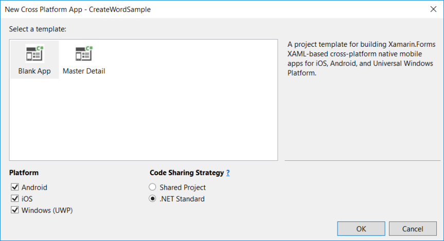
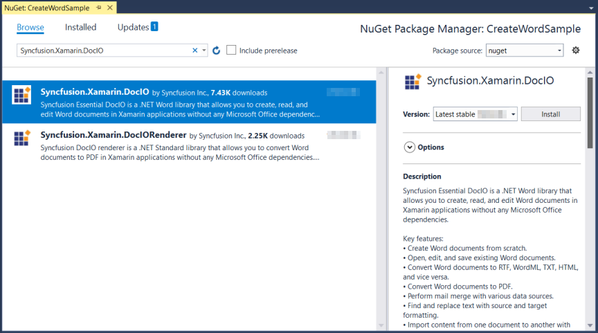

# Create Word document in Xamarin

Syncfusion Essential DocIO is a [Xamarin Word library](https://www.syncfusion.com/word-framework/xamarin/word-library) used to create, read, and edit **Word** documents programmatically without **Microsoft Word** or **interop** dependencies. Using this library, you can **create a Word document in Xamarin**.

## Steps to create Word document programmatically:

Step 1: Create a new Xamarin.Forms application project.

Step 2: Select a project template and required platforms to deploy the application. In this application the portable assemblies to be shared across multiple platforms, the .NET Standard code sharing strategy has been selected. For more details about code sharing refer [here](https://docs.microsoft.com/en-us/xamarin/cross-platform/app-fundamentals/code-sharing).

N> If .NET Standard is not available in the code sharing strategy, the Portable Class Library (PCL) can be selected.

Step 3: Install [Syncfusion.Xamarin.DocIO](https://www.nuget.org/packages/Syncfusion.Xamarin.DocIO) NuGet package as a reference to the .NET Standard project in your application from [NuGet.org](https://www.nuget.org/).

N> Starting with v16.2.0.x, if you reference Syncfusion assemblies from trial setup or from the NuGet feed, you also have to add "Syncfusion.Licensing" assembly reference and include a license key in your projects. Please refer to this [link](https://help.syncfusion.com/common/essential-studio/licensing/license-key) to know about registering Syncfusion license key in your application to use our components.

Step 4: Add new Forms XAML page in **portable project**. If there is no XAML page is defined in the App class. Otherwise proceed to the next step.
<ul>
<li>
To add the new XAML page, right click on the project and select <b>Add > New Item</b> and add a Forms XAML Page from the list. Name it as MainXamlPage.
</li>
<li>
In App class of <b>portable project</b> (App.cs), replace the existing constructor of App class with the code snippet given below which invokes the <b>MainXamlPage</b>.
</li>
</ul>






public App()
{
    // The root page of your application
    MainPage = new MainXamlPage();
}





{{ codesnippet1 | OrderList_Indent_Level_1 }}

Step 5: In the MainXamlPage.xaml add new button as shown below.






<ContentPage xmlns="http://xamarin.com/schemas/2014/forms"
             xmlns:x="http://schemas.microsoft.com/winfx/2009/xaml"
             x:Class="GettingStarted. MainXamlPage">
<StackLayout VerticalOptions="Center">
  
<Button Text="Generate Document" Clicked="OnButtonClicked" HorizontalOptions="Center"/>
  
</StackLayout> </ContentPage>





{{ codesnippet2 | OrderList_Indent_Level_1 }}

Step 6: Include the following namespace in the MainXamlPage.xaml.cs file.






using Syncfusion.DocIO;
using Syncfusion.DocIO.DLS;
using System.Reflection;
using System.IO;





{{ codesnippet3 | OrderList_Indent_Level_1 }}

Step 7: Include the below code snippet in the click event of the button in MainXamlPage.xaml.cs, to create Word document and save it in a stream.






void OnButtonClicked(object sender, EventArgs args)
{
    //"App" is the class of Portable project
    Assembly assembly = typeof(App).GetTypeInfo().Assembly;

    //Creating a new document
    WordDocument document = new WordDocument();
    //Adding a new section to the document
    WSection section = document.AddSection() as WSection;
    //Set Margin of the section
    section.PageSetup.Margins.All = 72;
    //Set page size of the section
    section.PageSetup.PageSize = new Syncfusion.Drawing.SizeF(612, 792);

    //Create Paragraph styles
    WParagraphStyle style = document.AddParagraphStyle("Normal") as WParagraphStyle;
    style.CharacterFormat.FontName = "Calibri";
    style.CharacterFormat.FontSize = 11f;
    style.ParagraphFormat.BeforeSpacing = 0;
    style.ParagraphFormat.AfterSpacing = 8;
    style.ParagraphFormat.LineSpacing = 13.8f;

    style = document.AddParagraphStyle("Heading 1") as WParagraphStyle;
    style.ApplyBaseStyle("Normal");
    style.CharacterFormat.FontName = "Calibri Light";
    style.CharacterFormat.FontSize = 16f;
    style.CharacterFormat.TextColor = Syncfusion.Drawing.Color.FromArgb(46, 116, 181);
    style.ParagraphFormat.BeforeSpacing = 12;
    style.ParagraphFormat.AfterSpacing = 0;
    style.ParagraphFormat.Keep = true;
    style.ParagraphFormat.KeepFollow = true;
    style.ParagraphFormat.OutlineLevel = OutlineLevel.Level1;
    IWParagraph paragraph = section.HeadersFooters.Header.AddParagraph();

    //Gets the image stream
    Stream imageStream1 = assembly.GetManifestResourceStream("GettingStarted.Templates.AdventureCycle.jpg");
    IWPicture picture = paragraph.AppendPicture(imageStream1);
    picture.TextWrappingStyle = TextWrappingStyle.InFrontOfText;
    picture.VerticalOrigin = VerticalOrigin.Margin;
    picture.VerticalPosition = -45;
    picture.HorizontalOrigin = HorizontalOrigin.Column;
    picture.HorizontalPosition = 263.5f;
    picture.WidthScale = 20;
    picture.HeightScale = 15;

    paragraph.ApplyStyle("Normal");
    paragraph.ParagraphFormat.HorizontalAlignment = HorizontalAlignment.Left;
    WTextRange textRange = paragraph.AppendText("Adventure Works Cycles") as WTextRange;
    textRange.CharacterFormat.FontSize = 12f;
    textRange.CharacterFormat.FontName = "Calibri";
    textRange.CharacterFormat.TextColor = Syncfusion.Drawing.Color.Red;

    //Appends paragraph
    paragraph = section.AddParagraph();
    paragraph.ApplyStyle("Heading 1");
    paragraph.ParagraphFormat.HorizontalAlignment = HorizontalAlignment.Center;
    textRange = paragraph.AppendText("Adventure Works Cycles") as WTextRange;
    textRange.CharacterFormat.FontSize = 18f;
    textRange.CharacterFormat.FontName = "Calibri";

    //Appends paragraph
    paragraph = section.AddParagraph();
    paragraph.ParagraphFormat.FirstLineIndent = 36;
    paragraph.BreakCharacterFormat.FontSize = 12f;
    textRange = paragraph.AppendText("Adventure Works Cycles, the fictitious company on which the AdventureWorks sample databases are based, is a large, multinational manufacturing company. The company manufactures and sells metal and composite bicycles to North American, European and Asian commercial markets. While its base operation is in Bothell, Washington with 290 employees, several regional sales teams are located throughout their market base.") as WTextRange;
    textRange.CharacterFormat.FontSize = 12f;

    //Appends paragraph
    paragraph = section.AddParagraph();
    paragraph.ParagraphFormat.FirstLineIndent = 36;
    paragraph.BreakCharacterFormat.FontSize = 12f;
    textRange = paragraph.AppendText("In 2000, AdventureWorks Cycles bought a small manufacturing plant, Importadores Neptuno, located in Mexico. Importadores Neptuno manufactures several critical subcomponents for the AdventureWorks Cycles product line. These subcomponents are shipped to the Bothell location for final product assembly. In 2001, Importadores Neptuno, became the sole manufacturer and distributor of the touring bicycle product group.") as WTextRange;
    textRange.CharacterFormat.FontSize = 12f;

    paragraph = section.AddParagraph();
    paragraph.ApplyStyle("Heading 1");
    paragraph.ParagraphFormat.HorizontalAlignment = HorizontalAlignment.Left;
    textRange = paragraph.AppendText("Product Overview") as WTextRange;
    textRange.CharacterFormat.FontSize = 16f;
    textRange.CharacterFormat.FontName = "Calibri";
    //Appends table
    IWTable table = section.AddTable();
    table.ResetCells(3, 2);
    table.TableFormat.Borders.BorderType = BorderStyle.None;
    table.TableFormat.IsAutoResized = true;

    //Appends paragraph
    paragraph = table[0, 0].AddParagraph();
    paragraph.ParagraphFormat.AfterSpacing = 0;
    paragraph.BreakCharacterFormat.FontSize = 12f;
    //Appends picture to the paragraph
    Stream imageStream2 = assembly.GetManifestResourceStream("GettingStarted.Templates.Mountain-200.jpg");
    picture = paragraph.AppendPicture(imageStream2);
    picture.TextWrappingStyle = TextWrappingStyle.TopAndBottom;
    picture.VerticalOrigin = VerticalOrigin.Paragraph;
    picture.VerticalPosition = 4.5f;
    picture.HorizontalOrigin = HorizontalOrigin.Column;
    picture.HorizontalPosition = -2.15f;
    picture.WidthScale = 79;
    picture.HeightScale = 79;

    //Appends paragraph
    paragraph = table[0, 1].AddParagraph();
    paragraph.ApplyStyle("Heading 1");
    paragraph.ParagraphFormat.AfterSpacing = 0;
    paragraph.ParagraphFormat.LineSpacing = 12f;
    paragraph.AppendText("Mountain-200");
    //Appends paragraph
    paragraph = table[0, 1].AddParagraph();
    paragraph.ParagraphFormat.AfterSpacing = 0;
    paragraph.ParagraphFormat.LineSpacing = 12f;
    paragraph.BreakCharacterFormat.FontSize = 12f;
    paragraph.BreakCharacterFormat.FontName = "Times New Roman";

    textRange = paragraph.AppendText("Product No: BK-M68B-38\r") as WTextRange;
    textRange.CharacterFormat.FontSize = 12f;
    textRange.CharacterFormat.FontName = "Times New Roman";
    textRange = paragraph.AppendText("Size: 38\r") as WTextRange;
    textRange.CharacterFormat.FontSize = 12f;
    textRange.CharacterFormat.FontName = "Times New Roman";
    textRange = paragraph.AppendText("Weight: 25\r") as WTextRange;
    textRange.CharacterFormat.FontSize = 12f;
    textRange.CharacterFormat.FontName = "Times New Roman";
    textRange = paragraph.AppendText("Price: $2,294.99\r") as WTextRange;
    textRange.CharacterFormat.FontSize = 12f;
    textRange.CharacterFormat.FontName = "Times New Roman";
    //Appends paragraph
    paragraph = table[0, 1].AddParagraph();
    paragraph.ParagraphFormat.AfterSpacing = 0;
    paragraph.ParagraphFormat.LineSpacing = 12f;
    paragraph.BreakCharacterFormat.FontSize = 12f;

    //Appends paragraph
    paragraph = table[1, 0].AddParagraph();
    paragraph.ApplyStyle("Heading 1");
    paragraph.ParagraphFormat.AfterSpacing = 0;
    paragraph.ParagraphFormat.LineSpacing = 12f;
    paragraph.AppendText("Mountain-300 ");
    //Appends paragraph
    paragraph = table[1, 0].AddParagraph();
    paragraph.ParagraphFormat.AfterSpacing = 0;
    paragraph.ParagraphFormat.LineSpacing = 12f;
    paragraph.BreakCharacterFormat.FontSize = 12f;
    paragraph.BreakCharacterFormat.FontName = "Times New Roman";
    textRange = paragraph.AppendText("Product No: BK-M47B-38\r") as WTextRange;
    textRange.CharacterFormat.FontSize = 12f;
    textRange.CharacterFormat.FontName = "Times New Roman";
    textRange = paragraph.AppendText("Size: 35\r") as WTextRange;
    textRange.CharacterFormat.FontSize = 12f;
    textRange.CharacterFormat.FontName = "Times New Roman";
    textRange = paragraph.AppendText("Weight: 22\r") as WTextRange;
    textRange.CharacterFormat.FontSize = 12f;
    textRange.CharacterFormat.FontName = "Times New Roman";
    textRange = paragraph.AppendText("Price: $1,079.99\r") as WTextRange;
    textRange.CharacterFormat.FontSize = 12f;
    textRange.CharacterFormat.FontName = "Times New Roman";
    //Appends paragraph
    paragraph = table[1, 0].AddParagraph();
    paragraph.ParagraphFormat.AfterSpacing = 0;
    paragraph.ParagraphFormat.LineSpacing = 12f;
    paragraph.BreakCharacterFormat.FontSize = 12f;

    //Appends paragraph
    paragraph = table[1, 1].AddParagraph();
    paragraph.ApplyStyle("Heading 1");
    paragraph.ParagraphFormat.LineSpacing = 12f;
    //Appends picture to the paragraph
    Stream imageStream3 = assembly.GetManifestResourceStream("GettingStarted.Templates.Mountain-300.jpg");
    picture = paragraph.AppendPicture(imageStream3);
    picture.TextWrappingStyle = TextWrappingStyle.TopAndBottom;
    picture.VerticalOrigin = VerticalOrigin.Paragraph;
    picture.VerticalPosition = 8.2f;
    picture.HorizontalOrigin = HorizontalOrigin.Column;
    picture.HorizontalPosition = -14.95f;
    picture.WidthScale = 75;
    picture.HeightScale = 75;

    //Appends paragraph
    paragraph = table[2, 0].AddParagraph();
    paragraph.ApplyStyle("Heading 1");
    paragraph.ParagraphFormat.LineSpacing = 12f;
    //Appends picture to the paragraph
    Stream imageStream4 = assembly.GetManifestResourceStream("GettingStarted.Templates.Road-550-W.jpg");
    picture = paragraph.AppendPicture(imageStream4);
    picture.TextWrappingStyle = TextWrappingStyle.TopAndBottom;
    picture.VerticalOrigin = VerticalOrigin.Paragraph;
    picture.VerticalPosition = 3.75f;
    picture.HorizontalOrigin = HorizontalOrigin.Column;
    picture.HorizontalPosition = -5f;
    picture.WidthScale = 92;
    picture.HeightScale = 92;

    //Appends paragraph
    paragraph = table[2, 1].AddParagraph();
    paragraph.ApplyStyle("Heading 1");
    paragraph.ParagraphFormat.AfterSpacing = 0;
    paragraph.ParagraphFormat.LineSpacing = 12f;
    paragraph.AppendText("Road-150 ");
    //Appends paragraph
    paragraph = table[2, 1].AddParagraph();
    paragraph.ParagraphFormat.AfterSpacing = 0;
    paragraph.ParagraphFormat.LineSpacing = 12f;
    paragraph.BreakCharacterFormat.FontSize = 12f;
    paragraph.BreakCharacterFormat.FontName = "Times New Roman";
    textRange = paragraph.AppendText("Product No: BK-R93R-44\r") as WTextRange;
    textRange.CharacterFormat.FontSize = 12f;
    textRange.CharacterFormat.FontName = "Times New Roman";
    textRange = paragraph.AppendText("Size: 44\r") as WTextRange;
    textRange.CharacterFormat.FontSize = 12f;
    textRange.CharacterFormat.FontName = "Times New Roman";
    textRange = paragraph.AppendText("Weight: 14\r") as WTextRange;
    textRange.CharacterFormat.FontSize = 12f;
    textRange.CharacterFormat.FontName = "Times New Roman";
    textRange = paragraph.AppendText("Price: $3,578.27\r") as WTextRange;
    textRange.CharacterFormat.FontSize = 12f;
    textRange.CharacterFormat.FontName = "Times New Roman";
    //Appends paragraph
    section.AddParagraph();

    //Saves the Word document to MemoryStream
	MemoryStream stream = new MemoryStream();
    document.Save(stream, FormatType.Docx);

    //Save the stream as a file in the device and invoke it for viewing
    Xamarin.Forms.DependencyService.Get<ISave>().SaveAndView("Sample.docx", "application/msword", stream);          
}





{{ codesnippet4 | OrderList_Indent_Level_1 }}

## Helper files for Xamarin

Download the helper files from this [link](https://www.syncfusion.com/downloads/support/directtrac/general/HELPER~1-696201504.ZIP) and add them into the mentioned project. These helper files allow you to save the stream as a physical file and open the file for viewing.

<table>
  <tr>
  <td>
    <b>Project</b>
  </td>
  <td>
    <b>File Name</b>
  </td>
  <td>
    <b>Summary</b>
  </td>
  </tr>
  <tr>
  <td>
    Portable project
  </td>
  <td>
    ISave.cs
  </td>
  <td>Represent the base interface for save operation
  </td>
  </tr>
  <tr>
  <td rowspan="2">
    iOS Project
  </td>
  <td>
    SaveIOS.cs
  </td>
  <td>
    Save implementation for iOS device
  </td>
  </tr>
  <tr>
  <td>
    PreviewControllerDS.cs
  </td>
  <td>
    Helper class for viewing the <b>Word document</b> in iOS device
  </td>
  </tr>
  <tr>
  <td>
    Android project
  </td>
  <td>
    SaveAndroid.cs
  </td>
  <td>Save implementation for Android device
  </td>
  </tr>
  <tr>
  <td>
    WinPhone project
  </td>
  <td>
    SaveWinPhone.cs
  </td>
  <td>Save implementation for Windows Phone device
  </td>
  </tr>
  <tr>
  <td>
    UWP project
  </td>
  <td>
    SaveWindows.cs
  </td>
  <td>Save implementation for UWP device.
  </td>
  </tr>
  <tr>
  <td>
    Windows (8.1) project
  </td>
  <td>
    SaveWindows81.cs
  </td>
  <td>Save implementation for WinRT device.
  </td>
  </tr>
</table>

Compile and execute the application. Now this application **creates a Word document**.

You can download a complete working sample from [GitHub](https://github.com/SyncfusionExamples/DocIO-Examples/tree/main/Getting-Started/Xamarin).

By executing the program, you will get the Word document as follows.

