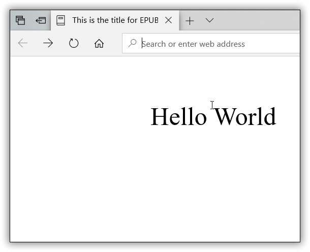

# Frequently Asked Questions

The frequently asked questions in Essential DocIO are listed below.

## How to modify an existing style?

The following code illustrates how to modify the built-in style while creating new Word document.

   



//Creates a new Word document 

WordDocument document = new WordDocument();

//Adds new section to the document

IWSection section = document.AddSection();

//Creates built-in style and modifies its properties

Style style = Style.CreateBuiltinStyle(BuiltinStyle.Heading1, document) as Style;

style.CharacterFormat.Italic = true;

style.CharacterFormat.TextColor = Color.DarkGreen;

//Adds it to the styles collection

document.Styles.Add(style);

//Adds new paragraph to the section

IWParagraph paragraph = section.AddParagraph();

IWTextRange text = paragraph.AppendText("A built-in style is modified and is applied to this paragraph.");

//Applies the new style to paragraph

paragraph.ApplyStyle(style.Name);

//Saves the Word document

document.Save("Sample.docx", FormatType.Docx);

//Closes the document

document.Close();





'Creates a new Word document 

Dim document As New WordDocument()

'Adds new section to the document

Dim section As IWSection = document.AddSection()

'Creates built-in style and modifies its properties

Dim style__1 As Style = TryCast(Style.CreateBuiltinStyle(BuiltinStyle.Heading1, document), Style)

style__1.CharacterFormat.Italic = True

style__1.CharacterFormat.TextColor = Color.DarkGreen

'Adds it to the styles collection

document.Styles.Add(style__1)

'Adds new paragraph to the section

Dim paragraph As IWParagraph = section.AddParagraph()

Dim text As IWTextRange = paragraph.AppendText("A built-in style is modified and is applied to this paragraph.")

'Applies the new style to paragraph

paragraph.ApplyStyle(style__1.Name)

'Saves the Word document

document.Save("Sample.docx", FormatType.Docx)

'Closes the document

document.Close()

  

 

You can download a complete working sample from [GitHub](https://github.com/SyncfusionExamples/DocIO-Examples/tree/main/Word-document/Modify-built-in-style).

## How to open a document from stream using DocIO?

A document can be opened as stream by using HttpWebResponse. This stream does not support seek operation and so the contents should be read manually to get the position and length of the stream. The following code illustrates how to load the document from stream.

  



//Gets the document as stream

HttpWebRequest request = (HttpWebRequest)WebRequest.Create("https://www.swiftview.com/tech/letterlegal5.doc");

HttpWebResponse response = (HttpWebResponse)request.GetResponse();

Stream stream = response.GetResponseStream();

//Converts it to byte array

byte[] buffer = ReadFully(stream, 32768);            

//Stores bytes into the memory stream.

MemoryStream ms = new MemoryStream();

ms.Write(buffer, 0, buffer.Length);

ms.Seek(0, SeekOrigin.Begin);

stream.Close();

//Creates a new document.

WordDocument document = new WordDocument();

//Opens the template document from the MemoryStream.

document.Open(ms, FormatType.Doc);

//Saves and closes the document

document.Save("Sample.docx", FormatType.Docx);

document.Close();





'Gets the document as stream

Dim request As HttpWebRequest = DirectCast(WebRequest.Create("https://www.swiftview.com/tech/letterlegal5.doc"), HttpWebRequest)

Dim response As HttpWebResponse = DirectCast(request.GetResponse(), HttpWebResponse)

Dim stream As Stream = response.GetResponseStream()

'Converts it to byte array

Dim buffer As Byte() = ReadFully(stream, 32768)

'Stores bytes into the memory stream.

Dim ms As New MemoryStream()

ms.Write(buffer, 0, buffer.Length)

ms.Seek(0, SeekOrigin.Begin)

stream.Close()

'Creates a new document.

Dim document As New WordDocument ()

'Opens the template document from the MemoryStream.

document.Open(ms, FormatType.Doc)

'Saves and closes the document

document.Save("Sample.docx", FormatType.Docx)

document.Close()



    

The following code illustrates the method used to read the stream and convert the stream to bytes.

  



public static byte[] ReadFully(Stream stream, int initialLength)

{

//When an unhelpful initial length has been passed, just use 32K.

if (initialLength < 1)

{

initialLength = 32768;

}

byte[] buffer = new byte[initialLength];

int read = 0;

int chunk;

while ((chunk = stream.Read(buffer, read, buffer.Length - read)) > 0)

{

read += chunk;

//After reaching the end of the buffer, check and see whether you can find any information.

if (read == buffer.Length)

{

int nextByte = stream.ReadByte();

//End of stream? Then, you are done.

if (nextByte == -1)

{

return buffer;

}

//Resize the buffer, put in the byte you have just read, and continue.

byte[] newBuffer = new byte[buffer.Length * 2];

Array.Copy(buffer, newBuffer, buffer.Length);

newBuffer[read] = (byte)nextByte;

buffer = newBuffer;

read++;

}

}

//Buffer is now too big. Shrink it.

byte[] ret = new byte[read];

Array.Copy(buffer, ret, read);

return ret;

}





Public Shared Function ReadFully(stream As Stream, initialLength As Integer) As Byte()

'When an unhelpful initial length has been passed, just use 32K.

If initialLength < 1 Then

initialLength = 32768

End If

Dim buffer As Byte() = New Byte(initialLength - 1) {}

Dim read As Integer = 0

Dim chunk As Integer

chunk = stream.Read(buffer, read, buffer.Length - read)

While (chunk > 0)

read += chunk

'After reaching the end of the buffer, check and see whether you can find any information.

If read = buffer.Length Then

Dim nextByte As Integer = stream.ReadByte()

'End of stream? Then, you are done.

If nextByte = -1 Then

Return buffer

End If

'Resize the buffer, put in the byte you have just read, and continue.

Dim newBuffer As Byte() = New Byte(buffer.Length * 2 - 1) {}

Array.Copy(buffer, newBuffer, buffer.Length)

newBuffer(read) = CByte(nextByte)

buffer = newBuffer

read += 1

End If

End While

'Buffer is now too big. Shrink it.

Dim ret As Byte() = New Byte(read - 1) {}

Array.Copy(buffer, ret, read)

Return ret

End Function

 

   

You can download a complete working sample from [GitHub](https://github.com/SyncfusionExamples/DocIO-Examples/tree/main/Read-and-Save-document/Open-Word-document-from-url).
 
## How to set OpenType Font Features?

The Open type features provide special effects for the text. This feature is specific to Word 2010 and later version documents. The OpenType features includes the following:

* Ligatures – combination of characters, written as glyph
* Use Contextual Alternates – combination of letters based on surrounding characters
* Number spacing – specifies number width 
* Number forms – specifies number height
* Stylistic sets – specifies the look of the text, based on the font used

The following code illustrates how to set ligature types for text.

  



//Creates a new Word document 

WordDocument document = new WordDocument();

//Adds new section to the document

IWSection section = document.AddSection();

//Adds new paragraph to the section

IWParagraph paragraph = section.AddParagraph();

//Adds new text

IWTextRange text = paragraph.AppendText("Text to describe discretional ligatures");

//Sets ligature type

text.CharacterFormat.Ligatures = LigatureType.Discretional;

text.CharacterFormat.FontName = "Arial";

paragraph = section.AddParagraph();

text = paragraph.AppendText("Text to describe contextual ligatures");

text.CharacterFormat.Ligatures = LigatureType.Contextual;

text.CharacterFormat.FontName = "Arial";

paragraph = section.AddParagraph();

text = paragraph.AppendText("Text to describe historical ligatures");

text.CharacterFormat.Ligatures = LigatureType.Historical;

text.CharacterFormat.FontName = "Arial";

//Saves and closes the document

document.Save("Sample.docx", FormatType.Docx);

document.Close();





'Creates a new Word document 

Dim document As New WordDocument()

'Adds new section to the document

Dim section As IWSection = document.AddSection()

'Adds new paragraph to the section

Dim paragraph As IWParagraph = section.AddParagraph()

'Adds new text

Dim text As IWTextRange = paragraph.AppendText("Text to describe discretional ligatures")

'Sets ligature type as Discretional

text.CharacterFormat.Ligatures = LigatureType.Discretional

text.CharacterFormat.FontName = "Arial"

paragraph = section.AddParagraph()

text = paragraph.AppendText("Text to describe contextual ligatures")

'Sets ligature type as Contextual

text.CharacterFormat.Ligatures = LigatureType.Contextual

text.CharacterFormat.FontName = "Arial"

paragraph = section.AddParagraph()

text = paragraph.AppendText("Text to describe historical ligatures")

'Sets ligature type as Historical

text.CharacterFormat.Ligatures = LigatureType.Historical

text.CharacterFormat.FontName = "Arial"

'Saves and closes the document

document.Save("Sample.docx", FormatType.Docx)

document.Close()

 

   

You can download a complete working sample from [GitHub](https://github.com/SyncfusionExamples/DocIO-Examples/tree/main/Paragraphs/Set-ligature-types-tor-text).

The following code example illustrates how to set contextual alternates.

 



//Creates a new Word document 

WordDocument document = new WordDocument();

//Adds new section to the document

IWSection section = document.AddSection();

//Adds new paragraph to the section

IWParagraph paragraph = section.AddParagraph();

//Adds new text

IWTextRange text = paragraph.AppendText("Text to describe contextual alternates");

text.CharacterFormat.FontName = "Segoe Script";

//Sets contextual alternates

text.CharacterFormat.UseContextualAlternates = true;

paragraph = section.AddParagraph();

//Saves and closes the document

document.Save("Sample.docx", FormatType.Docx);

document.Close();





'Creates a new Word document 

Dim document As New WordDocument()

'Adds new section to the document

Dim section As IWSection = document.AddSection()

'Adds new paragraph to the section

Dim paragraph As IWParagraph = section.AddParagraph()

'Adds new text

Dim text As IWTextRange = paragraph.AppendText("Text to describe contextual alternates")

text.CharacterFormat.FontName = "Segoe Script"

'Sets contextual alternates

text.CharacterFormat.UseContextualAlternates = True

paragraph = section.AddParagraph()

'Saves and closes the document

document.Save("Sample.docx", FormatType.Docx)

document.Close()

 

    

You can download a complete working sample from [GitHub](https://github.com/SyncfusionExamples/DocIO-Examples/tree/main/Paragraphs/Set-contextual-alternates-for-text).

The following code example illustrates how to set number spacing.

  



//Creates a new Word document 

WordDocument document = new WordDocument();

//Adds new section to the document

IWSection section = document.AddSection();

//Adds new paragraph to the section

IWParagraph paragraph = section.AddParagraph();

//Adds new text

IWTextRange text = paragraph.AppendText("Numbers to describe tabular number spacing 0123456789");

text.CharacterFormat.FontName = "Calibri";

//Sets number spacing

text.CharacterFormat.NumberSpacing = NumberSpacingType.Tabular;

paragraph = section.AddParagraph();

text = paragraph.AppendText("Numbers to describe proportional number spacing 0123456789");

text.CharacterFormat.FontName = "Calibri";

//Sets number spacing

text.CharacterFormat.NumberSpacing = NumberSpacingType.Proportional;

//Saves and closes the document

document.Save("Sample.docx", FormatType.Docx);

document.Close();





'Creates a new Word document 

Dim document As New WordDocument()

'Adds new section to the document

Dim section As IWSection = document.AddSection()

'Adds new paragraph to the section

Dim paragraph As IWParagraph = section.AddParagraph()

'Adds new text

Dim text As IWTextRange = paragraph.AppendText("Numbers to describe tabular number spacing 0123456789")

text.CharacterFormat.FontName = "Calibri"

'Sets number spacing

text.CharacterFormat.NumberSpacing = NumberSpacingType.Tabular

paragraph = section.AddParagraph()

text = paragraph.AppendText("Numbers to describe proportional number spacing 0123456789")

text.CharacterFormat.FontName = "Calibri"

'Sets number spacing

text.CharacterFormat.NumberSpacing = NumberSpacingType.Proportional

'Saves and closes the document

document.Save("Sample.docx", FormatType.Docx)

document.Close()

 

   

You can download a complete working sample from [GitHub](https://github.com/SyncfusionExamples/DocIO-Examples/tree/main/Paragraphs/Set-number-spacing).

The following code example illustrates how to set number style.

 



//Creates a new Word document 

WordDocument document = new WordDocument();

//Adds new section to the document

IWSection section = document.AddSection();

//Adds new paragraph to the section

IWParagraph paragraph = section.AddParagraph();

//Adds new text

IWTextRange text = paragraph.AppendText("Numbers to describe oldstyle number form 0123456789");

text.CharacterFormat.FontName = "Calibri";

//Sets number style

text.CharacterFormat.NumberForm = NumberFormType.OldStyle;

paragraph = section.AddParagraph();

text = paragraph.AppendText("Numbers to describe lining number form 0123456789");

text.CharacterFormat.FontName = "Calibri";

//Sets number style

text.CharacterFormat.NumberForm = NumberFormType.Lining;

//Saves and closes the document

document.Save("Sample.docx", FormatType.Docx);

document.Close();





'Creates a new Word document 

Dim document As New WordDocument()

'Adds new section to the document

Dim section As IWSection = document.AddSection()

'Adds new paragraph to the section

Dim paragraph As IWParagraph = section.AddParagraph()

'Adds new text

Dim text As IWTextRange = paragraph.AppendText("Numbers to describe oldstyle number form 0123456789")

text.CharacterFormat.FontName = "Calibri"

'Sets number style

text.CharacterFormat.NumberForm = NumberFormType.OldStyle

paragraph = section.AddParagraph()

text = paragraph.AppendText("Numbers to describe lining number form 0123456789")

text.CharacterFormat.FontName = "Calibri"

'Sets number style

text.CharacterFormat.NumberForm = NumberFormType.Lining

'Saves and closes the document

document.Save("Sample.docx", FormatType.Docx)

document.Close()



   

You can download a complete working sample from [GitHub](https://github.com/SyncfusionExamples/DocIO-Examples/tree/main/Paragraphs/Set-number-forms).

The following code example illustrates how to set different styles for the text.

  



//Creates a new Word document 

WordDocument document = new WordDocument();

//Adds new section to the document

IWSection section = document.AddSection();

//Adds new paragraph to the section

IWParagraph paragraph = section.AddParagraph();

//Adds new text

IWTextRange text = paragraph.AppendText("Text to describe stylistic sets");

text.CharacterFormat.FontName = "Gabriola";

//Sets stylistic set

text.CharacterFormat.StylisticSet = StylisticSetType.StylisticSet06;

paragraph = section.AddParagraph();

//Adds new text

text = paragraph.AppendText("Text to describe stylistic sets");

text.CharacterFormat.FontName = "Gabriola";

//Sets stylistic set

text.CharacterFormat.StylisticSet = StylisticSetType.StylisticSet15;

//Saves and closes the document

document.Save("Sample.docx", FormatType.Docx);

document.Close();





'Creates a new Word document 

Dim document As New WordDocument()

'Adds new section to the document

Dim section As IWSection = document.AddSection()

'Adds new paragraph to the section

Dim paragraph As IWParagraph = section.AddParagraph()

'Adds new text

Dim text As IWTextRange = paragraph.AppendText("Text to describe stylistic sets")

text.CharacterFormat.FontName = "Gabriola"

'Sets stylistic set

text.CharacterFormat.StylisticSet = StylisticSetType.StylisticSet06

paragraph = section.AddParagraph()

'Adds new text

text = paragraph.AppendText("Text to describe stylistic sets")

text.CharacterFormat.FontName = "Gabriola"

'Sets stylistic set

text.CharacterFormat.StylisticSet = StylisticSetType.StylisticSet15

'Saves and closes the document

document.Save("Sample.docx", FormatType.Docx)

document.Close()



  

You can download a complete working sample from [GitHub](https://github.com/SyncfusionExamples/DocIO-Examples/tree/main/Paragraphs/Stylistic-set-for-text).

## How to attach a Template to a Word document?

The following code illustrates how to set the template for the document.

  



//Loads a source document

WordDocument document = new WordDocument("Template.docx"); 

//Attaches the template document to the source document

document.AttachedTemplate.Path = @"D:\Data\Template.docx";

//Updates the styles of the document from the attached template each time the document is opened

document.UpdateStylesOnOpen = true;

//Saves and closes the document

document.Save("Sample.docx", FormatType.Docx);

document.Close();





'Loads a source document

Dim document As New WordDocument("Template.docx")

'Attaches the template document to the source document

document.AttachedTemplate.Path = "D:\Data\Template.docx"

'Updates the styles of the document from the attached template each time the document is opened

document.UpdateStylesOnOpen = True

'Saves and closes the document

document.Save("Sample.docx", FormatType.Docx)

document.Close()



  

You can download a complete working sample from [GitHub](https://github.com/SyncfusionExamples/DocIO-Examples/tree/main/FAQs/Attach-template-to-Word-document).

## How to insert a DataTable in a Word document?

You can create new table in a Word document and copy the contents from data table. The following code illustrates how to insert a data table as table in a Word document.

  



//Creates new Word document

WordDocument document = new WordDocument();

//Creates new data set and data table

DataSet dataset = new DataSet();

GetDataTable(dataset);

DataTable datatable = new DataTable();

datatable = dataset.Tables[0];

//Adds new section

IWSection section = document.AddSection();

//Adds new table

IWTable table = section.AddTable();

//Adds new row to the table

WTableRow row = table.AddRow();

foreach (DataColumn datacolumn in datatable.Columns)

{

//Sets the column names for the table from the data table column names and cell width

WTableCell cell = row.AddCell();

cell.AddParagraph().AppendText(datacolumn.ColumnName);

cell.Width = 150;

}

//Iterates through data table rows

foreach (DataRow datarow in datatable.Rows)

{

//Adds new row to the table

row = table.AddRow(true, false);

foreach (object datacolumn in datarow.ItemArray)

{

//Adds new cell

WTableCell cell = row.AddCell();

//Adds contents from the data table to the table cell

cell.AddParagraph().AppendText(datacolumn.ToString());

}

}

//Saves and closes the document

document.Save("Sample.docx", FormatType.Docx);

document.Close();





'Creates new Word document

Dim document As New WordDocument()

'Creates new data set and data table

Dim dataset As New DataSet()

GetDataTable(dataset)

Dim datatable As New DataTable()

datatable = dataset.Tables(0)

'Adds new section

Dim section As IWSection = document.AddSection()

'Adds new table

Dim table As IWTable = section.AddTable()

'Adds new row to the table

Dim row As WTableRow = table.AddRow()

For Each datacolumn As DataColumn In datatable.Columns

'Sets the column names for the table from the data table column names and cell width

Dim cell As WTableCell = row.AddCell()

cell.AddParagraph().AppendText(datacolumn.ColumnName)

cell.Width = 150

Next

'Iterates through data table rows

For Each datarow As DataRow In datatable.Rows

'Adds new row to the table

row = table.AddRow(True, False)

For Each datacolumn As Object In datarow.ItemArray

'Adds new cell

Dim cell As WTableCell = row.AddCell()

'Adds contents from the data table to the table cell

cell.AddParagraph().AppendText(datacolumn.ToString())

Next

Next

'Saves and closes the document

document.Save("Sample.docx", FormatType.Docx)

document.Close()

 

   

The following code illustrates the method to get data table.

   



private void GetDataTable(DataSet dataset)

{

// List of syncfusion products.

string[] products = { "DocIO", "PDF", "XlsIO" };

// Adds new Tables to the data set.

DataRow row;

dataset.Tables.Add();

// Adds fields to the Products table.

dataset.Tables[0].TableName = "Products";

dataset.Tables[0].Columns.Add("ProductName");

dataset.Tables[0].Columns.Add("Binary");

dataset.Tables[0].Columns.Add("Source");

// Inserts values to the tables.

foreach (string product in products)

{

row = dataset.Tables["Products"].NewRow();

row["ProductName"] = string.Concat("Essential ", product);

row["Binary"] = "$895.00";

row["Source"] = "$1,295.00";

dataset.Tables["Products"].Rows.Add(row);

}

}





Private Sub GetDataTable(dataset As DataSet)

'List of syncfusion products.

Dim products As String() = {"DocIO", "PDF", "XlsIO"}

'Adds new Tables to the data set.

Dim row As DataRow

dataset.Tables.Add()

'Adds fields to the Products table.

dataset.Tables(0).TableName = "Products"

dataset.Tables(0).Columns.Add("ProductName")

dataset.Tables(0).Columns.Add("Binary")

dataset.Tables(0).Columns.Add("Source")

'Inserts values to the tables.

For Each product As String In products

row = dataset.Tables("Products").NewRow()

row("ProductName") = String.Concat("Essential ", product)

row("Binary") = "$895.00"

row("Source") = "$1,295.00"

dataset.Tables("Products").Rows.Add(row)

Next

End Sub



   

You can download a complete working sample from [GitHub](https://github.com/SyncfusionExamples/DocIO-Examples/tree/main/FAQs/Insert-data-table-in-Word-document).

## How to insert a table from HTML string in Word document?

An HTML string can be inserted to the Word document at text body or paragraph. The following code illustrates how to insert a table to the document from the HTML string.

  



//Loads the template document

WordDocument document = new WordDocument("Template.docx");

//Gets the text body

WTextBody textbody = document.Sections[0].Body;

//Html string that represents table with two rows and two columns

string htmlString = " <table border='1'><tr><td>
First Row First Cell
</td><td>
First Row Second Cell
</td></tr><tr><td>
Second Row First Cell
</td><td>
Second Row Second Cell
</td></tr></table> ";

//Inserts the string to the text body

textbody.InsertXHTML(htmlString);

//Saves and closes the document

document.Save("Sample.docx");

document.Close();





'Loads the template document

Dim document As New WordDocument("Template.docx")

'Gets the text body

Dim textbody As WTextBody = document.Sections(0).Body

'Html string that represents table with two rows and two columns

Dim htmlString As String = " <table border='1'><tr><td>
First Row First Cell
</td><td>
First Row Second Cell
</td></tr><tr><td>
Second Row First Cell
</td><td>
Second Row Second Cell
</td></tr></table> "

'Inserts the string to the text body

textbody.InsertXHTML(htmlString)

'Saves and closes the document

document.Save("Sample.docx")

document.Close()

 

   

You can download a complete working sample from [GitHub](https://github.com/SyncfusionExamples/DocIO-Examples/tree/main/FAQs/Insert-table-from-html-string).
 
## How to set table cell width?

Each cell in the table can have its own width. The following code illustrates how to set the width of the cell.

  



//Creates new word document

WordDocument document = new WordDocument("Template.docx");

//Gets the text body of first section

WTextBody textbody = document.Sections[0].Body;

//Gets the table

IWTable table = textbody.Tables[0];

//Iterates through table rows

foreach (WTableRow row in table.Rows)

{

//Sets width for cells

for (int i = 0; i < row.Cells.Count; i++)

{

WTableCell cell = row.Cells[i];

if (i % 2 == 0)

//Sets width as 100 for cells in even column

cell.Width = 100;

else

//Sets width as 150 for cell in odd column

cell.Width = 150;

}

}

//Saves and closes the document

document.Save("Sample.docx", FormatType.Docx);

document.Close();





'Creates new word document

Dim document As New WordDocument("Template.docx")

'Gets the text body of first section

Dim textbody As WTextBody = document.Sections(0).Body

'Gets the table

Dim table As IWTable = textbody.Tables(0)

'Iterates through table rows

For Each row As WTableRow In table.Rows

'Sets width for cells

For i As Integer = 0 To row.Cells.Count - 1

Dim cell As WTableCell = row.Cells(i)

If i Mod 2 = 0 Then

'Sets width as 100 for cells in even column

cell.Width = 100

Else

'Sets width as 150 for cell in odd column

cell.Width = 150

End If

Next

Next

'Saves and closes the document

document.Save("Sample.docx", FormatType.Docx)

document.Close()



  

You can download a complete working sample from [GitHub](https://github.com/SyncfusionExamples/DocIO-Examples/tree/main/Tables/Set-table-cell-width).

## How to position a table in a Word document?

You can position a table in a Word document by setting position properties. The following code illustrates how to set position properties for a table.

  



//Loads the template document

WordDocument document = new WordDocument("Template.docx");

//Gets the text body of first section

WTextBody textbody = document.Sections[0].Body;

//Gets the table

IWTable table = textbody.Tables[0];

//Sets the horizontal and vertical position for table

table.TableFormat.Positioning.HorizPosition = 40;

table.TableFormat.Positioning.VertPosition = 100;

//Saves and closes the document

document.Save("Sample.docx", FormatType.Docx);

document.Close();





'Loads the template document

Dim document As New WordDocument("Template.docx")

'Gets the text body of first section

Dim textbody As WTextBody = document.Sections(0).Body

'Gets the table

Dim table As IWTable = textbody.Tables(0)

'Sets the horizontal and vertical position for table

table.TableFormat.Positioning.HorizPosition = 40

table.TableFormat.Positioning.VertPosition = 100

'Saves and closes the document

document.Save("Sample.docx", FormatType.Docx)

document.Close()



    

You can download a complete working sample from [GitHub](https://github.com/SyncfusionExamples/DocIO-Examples/tree/main/Tables/Set-position-for-table).
  
## How to set the text direction to a table in Word document?

The contents of the table cell can be in vertical or horizontal direction. Each cell content can have different text direction. The following code illustrates how to set the text direction for the text in the table.

   



//Loads the template document

WordDocument document = new WordDocument("Template.docx");

//Gets the text body of first section

WTextBody textbody = document.Sections[0].Body;

//Gets the table

IWTable table = textbody.Tables[0];

//Iterates through table rows

foreach (WTableRow row in table.Rows)

{

foreach (WTableCell cell in row.Cells)

{

//Sets the text direction for the contents

cell.CellFormat.TextDirection = Syncfusion.DocIO.DLS.TextDirection.Vertical;

}

}

//Saves and closes the document

document.Save("Sample.docx", FormatType.Docx);

document.Close();





'Loads the template document

Dim document As New WordDocument("Template.docx")

'Gets the text body of first section

Dim textbody As WTextBody = document.Sections(0).Body

'Gets the table

Dim table As IWTable = textbody.Tables(0)

'Iterates through table rows

For Each row As WTableRow In table.Rows

For Each cell As WTableCell In row.Cells

'Sets the text direction for the contents

cell.CellFormat.TextDirection = Syncfusion.DocIO.DLS.TextDirection.Vertical

Next

Next

'Saves and closes the document

document.Save("Sample.docx", FormatType.Docx)

document.Close()

 

  

You can download a complete working sample from [GitHub](https://github.com/SyncfusionExamples/DocIO-Examples/tree/main/Tables/Set-text-direction-to-table). 
 
## How to extract the images in the document?

The following code illustrates how to extract the images in the document.

 



//Loads the template document

WordDocument document = new WordDocument("Template.docx");

WTextBody textbody = document.Sections[0].Body;

Image image;

int i = 1;

//Iterates through the paragraphs

foreach (WParagraph paragraph in textbody.Paragraphs)

{

//Iterates through the paragraph items 

foreach (ParagraphItem item in paragraph.ChildEntities)

{

//Gets the picture and saves it into specified location

switch (item.EntityType)

{

case EntityType.Picture:

WPicture picture = item as WPicture;

image = picture.Image;

image.Save(@"D:\Data\Image" + i + ".jpeg", ImageFormat.Jpeg);

i++;

break;

default:

break;

}

}

}

//Closes the document

document.Close();





'Loads the template document

Dim document As New WordDocument("Template.docx")

Dim textbody As WTextBody = document.Sections(0).Body

Dim image As Image

Dim i As Integer = 1

'Iterates through the paragraphs

For Each paragraph As WParagraph In textbody.Paragraphs

'Iterates through the paragraph items 

For Each item As ParagraphItem In paragraph.ChildEntities

'Gets the picture and saves it into specified location

Select Case item.EntityType

Case EntityType.Picture

Dim picture As WPicture = TryCast(item, WPicture)

image = picture.Image

image.Save("D:\Data\Image" & i & ".jpeg", ImageFormat.Jpeg)

i += 1

Exit Select

Case Else

Exit Select

End Select

Next

Next

'Close the document

document.Close()

 

    

The images in the document can be extracted into a specific location when exporting it to HTML file. The following code illustrates how to extract images.

  



//Loads the template document

WordDocument document = new WordDocument("Template.docx");

//Sets the location to extract images

document.SaveOptions.HtmlExportImagesFolder = @"D:\Data\";

//Saves the document as html file

HTMLExport export = new HTMLExport();

export.SaveAsXhtml(document, "Template.html");

//Closes the document

document.Close();





'Loads the template document

Dim document As New WordDocument("Template.docx")

'Sets the location to extract images

document.SaveOptions.HtmlExportImagesFolder = "D:\Data\"

'Saves the document as html file

Dim export As New HTMLExport()

export.SaveAsXhtml(document, "Template.html")

'Closes the document

document.Close()



  

You can download a complete working sample from [GitHub](https://github.com/SyncfusionExamples/DocIO-Examples/tree/main/FAQs/Extract-images-from-Word-document).

## How to remove headers and footers from the document?

The following code illustrates how to remove the header contents from the document.

  



//Loads the template document

WordDocument document = new WordDocument("Template.docx", FormatType.Docx);

//Iterates through the sections

foreach (WSection section in document.Sections)

{

HeaderFooter header;

//Gets even footer of current section

header = section.HeadersFooters[HeaderFooterType.EvenHeader];

//Removes even footer

header.ChildEntities.Clear();

//Gets odd footer of current section

header = section.HeadersFooters[HeaderFooterType.OddHeader];

//Removes odd footer

header.ChildEntities.Clear();

//Gets first page footer

header = section.HeadersFooters[HeaderFooterType.FirstPageHeader];

//Removes first page footer

header.ChildEntities.Clear();

}

//Saves and closes the document

document.Save("Sample.docx", FormatType.Docx);

document.Close();





'Loads the template document

Dim document As New WordDocument("Template.docx", FormatType.Docx)

'Iterates through the sections

For Each section As WSection In document.Sections

Dim header As HeaderFooter

'Gets even footer of current section

header = section.HeadersFooters(HeaderFooterType.EvenHeader)

'Removes even footer

header.ChildEntities.Clear()

'Gets odd footer of current section

header = section.HeadersFooters(HeaderFooterType.OddHeader)

'Removes odd footer

header.ChildEntities.Clear()

'Gets first page footer

header = section.HeadersFooters(HeaderFooterType.FirstPageHeader)

'Removes first page footer

header.ChildEntities.Clear()

Next

'Saves and closes the document

document.Save("Sample.docx", FormatType.Docx)

document.Close()

 

   

You can download a complete working sample from [GitHub](https://github.com/SyncfusionExamples/DocIO-Examples/tree/main/Sections/Remove-headers-in-Word-document).

The following code illustrates how to remove the footer contents from the document.

  



//Loads the template document

WordDocument document = new WordDocument("Template.docx");            

//Iterates through the sections

foreach (WSection section in document.Sections)

{

HeaderFooter footer;

//Gets even footer of current section

footer = section.HeadersFooters[HeaderFooterType.EvenFooter];

//Removes even footer

footer.ChildEntities.Clear();

//Gets odd footer of current section

footer = section.HeadersFooters[HeaderFooterType.OddFooter];

//Removes odd footer

footer.ChildEntities.Clear();

//Gets first page footer

footer = section.HeadersFooters[HeaderFooterType.FirstPageFooter];

//Removes first page footer

footer.ChildEntities.Clear();

}

//Saves and closes the document

document.Save("Sample.docx", FormatType.Docx);

document.Close();





'Loads the template document

Dim document As New WordDocument("Template.docx")

'Iterates through the sections

For Each section As WSection In document.Sections

Dim footer As HeaderFooter

'Gets even footer of current section

footer = section.HeadersFooters(HeaderFooterType.EvenFooter)

'Removes even footer

footer.ChildEntities.Clear()

'Gets odd footer of current section

footer = section.HeadersFooters(HeaderFooterType.OddFooter)

'Removes odd footer

footer.ChildEntities.Clear()

'Gets first page footer

footer = section.HeadersFooters(HeaderFooterType.FirstPageFooter)

'Removes first page footer

footer.ChildEntities.Clear()

Next

'Saves and closes the document

document.Save("Sample.docx", FormatType.Docx)

document.Close()



    

You can download a complete working sample from [GitHub](https://github.com/SyncfusionExamples/DocIO-Examples/tree/main/Sections/Remove-footers-in-Word-document).
  
## Which units does Essential DocIO uses for measurement properties such as size, margins, etc, in a Word document?

Essential DocIO library uses Points for measurement properties in a Word document.

##  Could not find Syncfusion.OfficeChartToImageConverter assembly in .NET 3.5 Framework, does it mean there is no support for chart conversion in this Framework? 

Yes, OfficeChartToImageConverter assembly is not supported in .NET 3.5 Framework and it is available in .NET 4.0 Framework.

## Can the chart data be refreshed?

Yes, Essential DocIO supports refreshing the chart data. For more details, refer [Working with charts](/File-Formats/DocIO/Working-with-Charts)

## Is it possible to convert 3D charts to PDF or image?

Current version of the DocIO library does not provide support for converting 3D charts to PDF or image format.

## Is it possible to specify PDF conformance level in Word to PDF conversion?

Yes, you can specify the PDF conformance level in Word to PDF conversion. For more details, refer [PDF Conformance](/file-formats/pdf/working-with-pdf-conformance)

## Migration from Microsoft Office Automation to Essential DocIO

### Mail merge

The Mail merge feature can be used to generate reports and letters in Microsoft Word. The following code examples show how to generate an employee report from an MDB data source by using Office Automation and DocIO.

Using Microsoft Office Automation

Office Automation performs the Mail merge by executing a SQL query on the Word document. The output of the Mail merge can be sent to a new Word document. Alternatively, it can be sent to a printer, a fax machine, or forwarded to an e-mail address.

  



using word = Microsoft.Office.Interop.Word;

------------

//Initializes objects.

object nullobject = Missing.Value;

object filepath = "Sample.docx";

object sqlStmt = "SELECT * FROM [Employees]";

string sDBPath = "Northwind.mdb";

//Starts the Word application.

word.Application wordApp = new word.Application();

//Opens the Word document.

word.Document document = wordApp.Documents.Open(ref filepath, ref nullobject, ref nullobject, ref nullobject, ref nullobject,

ref nullobject, ref nullobject, ref nullobject, ref nullobject, ref nullobject, ref nullobject, ref nullobject, ref nullobject,

ref nullobject, ref nullobject, ref nullobject);

wordApp.Visible = false;

//Performs Mail Merge.     

document.MailMerge.OpenDataSource(sDBPath, ref nullobject, ref nullobject, ref nullobject, ref nullobject, ref nullobject,

ref nullobject, ref nullobject, ref nullobject, ref nullobject, ref nullobject, ref nullobject, ref sqlStmt, ref nullobject,

ref nullobject, ref nullobject);

document.MailMerge.Execute(ref nullobject);

//Sends output of Mail Merge to a new document.

document.MailMerge.Destination = word.WdMailMergeDestination.wdSendToNewDocument;

//Closes the document.

document.Close(ref nullobject, ref nullobject, ref nullobject);

//Quits the application.

wordApp.Quit(ref nullobject, ref nullobject, ref nullobject);





Imports word = Microsoft.Office.Interop.Word

-------------

'Initializes objects.

Dim nullobject As Object = Missing.Value

Dim filepath As Object = "Sample.docx"

Dim sqlStmt As Object = "SELECT * FROM [Employees]"

Dim sDBPath As String = "Northwind.mdb"

'Starts the Word application.

Dim wordApp As New word.Application()

'Opens the Word document.

Dim document As word.Document = wordApp.Documents.Open(filepath, nullobject, nullobject, nullobject, nullobject, nullobject, _

nullobject, nullobject, nullobject, nullobject, nullobject, nullobject, _

nullobject, nullobject, nullobject, nullobject)

wordApp.Visible = False

'Performs Mail Merge.     

document.MailMerge.OpenDataSource(sDBPath, nullobject, nullobject, nullobject, nullobject, nullobject, _

nullobject, nullobject, nullobject, nullobject, nullobject, nullobject, _

sqlStmt, nullobject, nullobject, nullobject)

document.MailMerge.Execute(nullobject)

'Sends output of Mail Merge to a new document.

document.MailMerge.Destination = word.WdMailMergeDestination.wdSendToNewDocument

'Closes the document.

document.Close(nullobject, nullobject, nullobject)

'Quits the application.

wordApp.Quit(nullobject, nullobject, nullobject)



   
 
 

### Using DocIO

DocIO performs Mail merge by using the following methods:

* Execute
* ExecuteGroup
* ExecuteNestedGroup

The following code example performs Mail merge by using the `Execute` method.

    



string dataBase = "Northwind.mdb";

//Opens existing template.

WordDocument doc = new WordDocument("Template.docx", FormatType.Docx);

//Gets Data from the Database.

OleDbConnection conn = new OleDbConnection("Provider=Microsoft.Jet.OLEDB.4.0;Data Source=" + dataBase);

conn.Open();

//Populates the data table.

DataTable table = new DataTable();

OleDbDataAdapter adapter = new OleDbDataAdapter("select * from employees", conn);

adapter.Fill(table);

adapter.Dispose();

//Performs Mail Merge.

doc.MailMerge.Execute(table);

//Saves the document.

doc.Save("Sample.docx", FormatType.Docx);

//Closes the document.

doc.Close();





Dim dataBase As String = "Northwind.mdb" 

‘Opens the Word document.

Dim doc As WordDocument = New WordDocument("Template.docx")

‘Creates database connection.

Dim conn As OleDbConnection = New OleDbConnection("Provider=Microsoft.Jet.OLEDB.4.0;Data Source=" + dataBase)

conn.Open()

‘Populates data table.

Dim table As DataTable = New DataTable()

Dim adapter As OleDbDataAdapter = New OleDbDataAdapter("select * from employees", conn)

adapter.Fill(table)

adapter.Dispose()

‘Performs Mail Merge.

doc.MailMerge.Execute(table)

‘Saves the document.

doc.Save("Sample.docx", FormatType.Docx)

‘Closes the document.

doc.Close()



  

You can download a complete working sample from [GitHub](https://github.com/SyncfusionExamples/DocIO-Examples/tree/main/Mail-Merge/Mail-merge-using-OleDbConnection).

N> 
For more information on Mail merge using DocIO, you can refer to online documentation link:
[MailMerge](/File-Formats/DocIO/Working-with-MailMerge)

### Find and Replace

This section illustrates how to perform a simple find and replace operation in a Word document by using Microsoft Office Automation and DocIO.

Using Microsoft Office Automation

The following code example illustrates how to search for a word in a Word document, replace it with another word and save the document under a new name.

  



using word = Microsoft.Office.Interop.Word;

---------

//Initializes objects.

object nullobject = Missing.Value;

object filepath = "Template.docx";

object newFilePath = "Sample.docx";

object item = word.WdGoToItem.wdGoToPage;

object whichItem = word.WdGoToDirection.wdGoToFirst;

object replaceAll = word.WdReplace.wdReplaceAll;

object forward = true;

object matchAllWord = true;

object matchCase = false;

object originalText = "Hello";

object replaceText = "World";

object save = true;

//Starts the Word application.

word.Application wordApp = new word.Application();

//Opens the Word document.

word.Document document = wordApp.Documents.Open(ref filepath, ref nullobject, ref nullobject, 

ref nullobject, ref nullobject,ref nullobject, ref nullobject, ref nullobject, ref nullobject, 

ref nullobject, ref nullobject, ref nullobject, ref nullobject, ref nullobject, ref nullobject, 

ref nullobject);

wordApp.Visible = false;

//Searches and replaces text.

document.GoTo(ref item, ref whichItem, ref nullobject, ref nullobject);

foreach (word.Range rng in document.StoryRanges)

{

rng.Find.Execute(ref originalText, ref matchCase, ref matchAllWord, ref nullobject, ref nullobject,

ref nullobject, ref forward,ref nullobject, ref nullobject, ref replaceText, ref replaceAll,

ref nullobject, ref nullobject, ref nullobject, ref nullobject);

}

//Saves the document.

document.SaveAs(ref newFilePath, ref nullobject, ref nullobject, ref nullobject, ref nullobject, 

ref nullobject, ref nullobject, ref nullobject, ref nullobject, ref nullobject, ref nullobject, 

ref nullobject, ref nullobject, refnullobject, ref nullobject,

ref nullobject);

//Closes the document.

document.Close(ref nullobject, ref nullobject, ref nullobject);

//Quits the application.

wordApp.Quit(ref nullobject, ref nullobject, ref nullobject);





Imports word = Microsoft.Office.Interop.Word

----------------

‘Initializes objects.

Dim nullobject As Object = Missing.Value

Dim filePath As Object = "Template.docx"

Dim newFilePath As Object = "Sample.docx"

Dim item As Object = word.WdGoToItem.wdGoToPage

Dim whichItem As Object = word.WdGoToDirection.wdGoToFirst

Dim replaceAll As Object = word.WdReplace.wdReplaceAll

Dim forward As Object = True

Dim matchAllWord As Object = True

Dim matchCase As Object = False

Dim originalText As Object = "Hello"

Dim replaceText As Object = "World"

Dim save As Object = True

Dim falseObj As Object = False

‘Starts the Word application.

Dim wordApp As word.Application = New word.Application()

‘Opens the Word document.

Dim doc As word.Document = wordApp.Documents.Open(filePath, nullobject, nullobject, nullobject, nullobject, nullobject, nullobject, nullobject, nullobject, nullobject, nullobject, falseobj, nullobject, nullobject, nullobject, nullobject)

wordApp.Visible = False

‘Searches and replaces text.

doc.GoTo(item, whichItem, nullobject, nullobject)

For Each rng As word.Range In doc.StoryRanges

rng.Find.Execute(originalText, matchCase, matchAllWord, nullobject, nullobject, nullobject, forward, nullobject, nullobject, replaceText, replaceAll, nullobject, nullobject, nullobject, nullobject)

Next

‘Saves the document.

doc.SaveAs(newFilePath, nullobject, nullobject, nullobject, nullobject, nullobject, nullobject, nullobject, nullobject, nullobject, nullobject, nullobject, nullobject, nullobject, nullobject, nullobject)

‘Closes the document.

doc.Close(nullobject, nullobject, nullobject)

‘Quits the application.

wordApp.Quit(nullobject, nullobject, nullobject)

 

   

 
 
### Using DocIO

The following code example illustrates how to perform a simple find and replace operation by using DocIO.

  



//Opens the Word document.

WordDocument document = new WordDocument("Template.docx",FormatType.Docx);

//Defines replacement text.

string replaceText = "World";

//Performs replace.

document.Replace(new Regex("Hello"), replaceText);

//Saves the document.

document.Save("Sample.docx", FormatType.Docx);

//Closes the document.

document.Close();





‘Opens the Word document.

Dim document As WordDocument = New WordDocument("Template.docx")

‘Defines text to be replaced.

Dim replaceText As String = "World"

‘Performs replace.

document.Replace(New Regex("Hello"), replaceText)

‘Saves the document.

document.Save("Sample.docx", FormatType.Docx)

‘Closes the document.

document.Close()

 

   

You can download a complete working sample from [GitHub](https://github.com/SyncfusionExamples/DocIO-Examples/tree/main/FAQs/Find-and-replace-text-using-regex).

N>  For more information on performing the find and replace operation using DocIO, you can refer to online documentation link:
[Find and Replace](/File-Formats/DocIO/Working-with-Find-and-Replace)

### Bookmarks

Bookmarks identify the location of text in a Word document that you can name and identify for future reference.

Using Microsoft Office Automation

The following code example illustrates how to insert a bookmark for a range of text by using Office Automation.

  



using word = Microsoft.Office.Interop.Word;

---------

//Initializes objects.

object nullobject = Missing.Value;

object newFilePath = "Sample.docx";

//Starts a Word application.

Microsoft.Office.Interop.Word.Application wordApp = new Microsoft.Office.Interop.Word.Application();

//Creates a new Word document.

wordApp.Documents.Add(ref nullobject, ref nullobject, ref nullobject, ref nullobject);

Microsoft.Office.Interop.Word.Document document = wordApp.ActiveDocument;

//Adds a paragraph to the document.

Microsoft.Office.Interop.Word.Paragraph oPara1;

oPara1 = document.Content.Paragraphs.Add(ref nullobject);

oPara1.Range.Text = "Bookmark with one word selected";

//Defines start and end positions of bookmark range.

object start = oPara1.Range.Text.IndexOf("word");

object end = oPara1.Range.Text.LastIndexOf(" ");

object rng = document.Range(ref start, ref end);

//Adds bookmark.

document.Bookmarks.Add("one_word", ref rng);

//Saves document and quits application.

document.SaveAs(ref newFilePath, ref nullobject, ref nullobject, ref nullobject, ref nullobject, ref nullobject, ref nullobject,

ref nullobject, ref nullobject, ref nullobject, ref nullobject, ref nullobject, ref nullobject, ref nullobject, ref nullobject,

ref nullobject);

//Closes document.

document.Close(ref nullobject, ref nullobject, ref nullobject);

//Quits application.

wordApp.Quit(ref nullobject, ref nullobject, ref nullobject);





Imports word = Microsoft.Office.Interop.Word

----------------

‘Initializes objects.

Dim nullobject As Object = Missing.Value

Dim newFilePath As Object = "Sample.docx"

‘Starts a Word application.

Dim wordApp As word.Application = New word.Application()

‘Creates a new Word document.

wordApp.Documents.Add(nullobject, nullobject, nullobject, nullobject)

Dim doc As word.Document = wordApp.ActiveDocument

‘Adds a paragraph to the document.

Dim oPara As word.Paragraph

oPara = doc.Content.Paragraphs.Add(nullobject)

oPara.Range.Text = "Bookmark with one word selected"

‘Defines the start and end positions of bookmark range.

Dim startobj As Object = oPara.Range.Text.IndexOf("word")

Dim endobj As Object = oPara.Range.Text.LastIndexOf(" ")

Dim rng As Object = doc.Range(startobj, endobj)

‘Adds bookmark.

doc.Bookmarks.Add("one_word", rng)

‘Saves document.

doc.SaveAs(newFilePath)

‘Closes document.

doc.Close(nullobject, nullobject, nullobject)

‘Quits application.

wordApp.Quit()

 

   

 
 
### Using DocIO

The following code example illustrates how to insert the bookmark by using DocIO. Here, the `AppendBookmarkStart()` and `AppendBookmarkEnd()` methods are used to add the bookmark.

  



//Creates a new Word document.

WordDocument doc = new WordDocument();

//Adds new section

IWSection section = doc.AddSection();

//Adds new paragraph

IWParagraph paragraph = section.AddParagraph();

paragraph.AppendText("Simple Bookmark");

paragraph = section.AddParagraph();

paragraph.AppendText("Bookmark with one ");

//Inserts bookmark.

paragraph.AppendBookmarkStart("one_word");

paragraph.AppendText("word");

paragraph.AppendBookmarkEnd("one_word");

paragraph.AppendText(" selected");

//Saves the document.

doc.Save("Sample.docx", FormatType.Docx);

//Closes the document.

doc.Close();





‘Creates a new Word document.

Dim doc As WordDocument = New WordDocument()

‘Adds new section

Dim section As IWSection = doc.AddSection()

‘Adds new paragraph

Dim paragraph As IWParagraph = section.AddParagraph()

paragraph.AppendText("Simple Bookmark")

paragraph = section.AddParagraph()

paragraph.AppendText("Bookmark with one ")

‘Inserts bookmark.

paragraph.AppendBookmarkStart("one_word")

paragraph.AppendText("word")

paragraph.AppendBookmarkEnd("one_word")

paragraph.AppendText(" selected")

‘Saves the document.

doc.Save("Sample.docx", FormatType.Docx)

‘Closes the document.

doc.Close()



    

You can download a complete working sample from [GitHub](https://github.com/SyncfusionExamples/DocIO-Examples/tree/main/Bookmarks/Add-bookmark-in-Word-document).

### Page Numbers

Page numbers can be added to the Word document in headers or footers.

Using Microsoft Office Automation

The following code example illustrates how page numbers can be inserted to the footer of the Word document by adding a page number field.

   



using word = Microsoft.Office.Interop.Word;

---------

//Initializes objects.

object filepath = "Sample.docx";

object nullobject = Missing.Value;

//Starts the Word application.

word.Application wordApp = new word.Application();

//Opens the Word document.

word.Document document = wordApp.Documents.Open(ref filepath, ref nullobject, ref nullobject, ref nullobject, ref nullobject,

ref nullobject, ref nullobject, ref nullobject, ref nullobject, ref nullobject, ref nullobject, ref nullobject, ref nullobject,

ref nullobject, ref nullobject, ref nullobject);

wordApp.Visible = false;

document.Activate();

//Seeks the page footer.

wordApp.ActiveWindow.ActivePane.View.SeekView = Microsoft.Office.Interop.Word.WdSeekView.wdSeekCurrentPageFooter;

//Formats the footer.

wordApp.Selection.Paragraphs.Alignment = word.WdParagraphAlignment.wdAlignParagraphCenter;

wordApp.ActiveWindow.Selection.Font.Name = "Arial";

wordApp.ActiveWindow.Selection.Font.Size = 8;

//Adds page numbers in the footer.

Object CurrentPage = word.WdFieldType.wdFieldPage;

wordApp.ActiveWindow.Selection.Fields.Add(wordApp.Selection.Range, ref CurrentPage, ref nullobject, ref nullobject);

//Saves the document.

document.Save();

//Closes the document.

document.Close(ref nullobject, ref nullobject, ref nullobject);

//Quits the application.

wordApp.Quit(ref nullobject, ref nullobject, ref nullobject);





Imports word = Microsoft.Office.Interop.Word

----------------

‘Initializes objects.

Dim nullobject As Object = Missing.Value

Dim filePath As Object =  "Sample.docx"

Dim falseobj As Object = False

‘Starts the application.

Dim wordApp As word.Application = New word.Application()

‘Adds a new Word document.

Dim document As word.Document = wordApp.Documents.Open(filePath, nullobject, nullobject, nullobject, nullobject, nullobject, nullobject, nullobject, nullobject, nullobject, nullobject, falseobj, nullobject, nullobject, nullobject, nullobject)

wordApp.Visible = False

document.Activate()

‘Seeks the page footer.

wordApp.ActiveWindow.ActivePane.View.SeekView = word.WdSeekView.wdSeekCurrentPageFooter

‘Formats the footer.

wordApp.Selection.Paragraphs.Alignment = word.WdParagraphAlignment.wdAlignParagraphCenter

wordApp.ActiveWindow.Selection.Font.Name = "Arial"

wordApp.ActiveWindow.Selection.Font.Size = 8

‘Adds page numbers in the footer.

Dim CurrentPage As Object = word.WdFieldType.wdFieldPage

wordApp.ActiveWindow.Selection.Fields.Add(wordApp.Selection.Range, CurrentPage, nullobject, nullobject)

‘Saves the document.

document.Save()

‘Closes the document.

document.Close(nullobject, nullobject, nullobject)

‘Quits application.

wordApp.Quit()



   

  
  
### Using DocIO

The following code example illustrates how page numbers are inserted to the footer of the Word document by using DocIO.

   



//Opens the Word document.

WordDocument doc = new WordDocument("Template.docx", FormatType.Docx);

//Iterates through sections

foreach (WSection sec in doc.Sections)

{

IWParagraph para = sec.AddParagraph();

//Appends page field to the paragraph

para.AppendField("footer", FieldType.FieldPage);

para.ParagraphFormat.HorizontalAlignment = HorizontalAlignment.Center;

sec.PageSetup.PageNumberStyle = PageNumberStyle.Arabic;

//Adds paragraph to footer

sec.HeadersFooters.Footer.Paragraphs.Add(para);

}

//Saves the document.

doc.Save("Sample.docx",FormatType.Docx);

//Closes the document.

doc.Close();





‘Opens the Word document.

Dim doc As WordDocument = New WordDocument("Template.docx", FormatType.Docx)

‘Iterates through sections

For Each sec As WSection In doc.Sections

Dim para As IWParagraph = sec.AddParagraph()

‘Appends page field to the paragraph

para.AppendField("footer", FieldType.FieldPage)

para.ParagraphFormat.HorizontalAlignment = HorizontalAlignment.Center

sec.PageSetup.PageNumberStyle = PageNumberStyle.Arabic

‘Adds paragraph to footer

sec.HeadersFooters.Footer.Paragraphs.Add(para)

Next

‘Saves the document.

doc.Save("Sample.docx", FormatType.Docx)

‘Closes the document.

doc.Close()



   

You can download a complete working sample from [GitHub](https://github.com/SyncfusionExamples/DocIO-Examples/tree/main/FAQs/Insert-page-numbers-in-footer). 
  
### Document Watermarks

Watermarks are text or pictures that appear behind document text.

Using Microsoft Office Automation

The following code example illustrates how to insert a text watermark as a shape by using Office Automation.

   



using word = Microsoft.Office.Interop.Word;

---------

//Initializes objects.

object nullobject = Missing.Value;

object newFilePath = "Sample.docx";

//Starts the Word application.

word.Application wordApp = new word.Application();

//Creates a new Word document.

wordApp.Documents.Add(ref nullobject, ref nullobject, ref nullobject, ref nullobject);

word.Document document = wordApp.ActiveDocument;

//Seeks the current page header.

wordApp.ActiveWindow.ActivePane.View.SeekView = word.WdSeekView.wdSeekCurrentPageHeader;

//Inserts watermark.

word.Shape watermark = wordApp.Selection.HeaderFooter.Shapes.AddTextEffect(Microsoft.Office.Core.MsoPresetTextEffect.msoTextEffect1,

"Watermark", "Arial", (float)48, Microsoft.Office.Core.MsoTriState.msoTrue,

Microsoft.Office.Core.MsoTriState.msoFalse, 0, 0, ref nullobject);

//Sets watermark properties.

watermark.Fill.Visible = Microsoft.Office.Core.MsoTriState.msoTrue;

watermark.Line.Visible = Microsoft.Office.Core.MsoTriState.msoFalse;

watermark.Fill.Solid();

watermark.Fill.ForeColor.RGB = (Int32)word.WdColor.wdColorGray30;

//Sets focus back to the document.

wordApp.ActiveWindow.ActivePane.View.SeekView = word.WdSeekView.wdSeekMainDocument;

//Saves the document.

document.SaveAs(ref newFilePath, ref nullobject, ref nullobject, ref nullobject, ref nullobject, ref nullobject, ref nullobject,

ref nullobject, ref nullobject, ref nullobject, ref nullobject, ref nullobject, ref nullobject, ref nullobject, ref nullobject,

ref nullobject);

//Closes the document.

document.Close(ref nullobject, ref nullobject, ref nullobject);

//Quits the application.

wordApp.Quit(ref nullobject, ref nullobject, ref nullobject);





Imports word = Microsoft.Office.Interop.Word

----------------

Initializes objects.

Dim nullobject As Object = Missing.Value

Dim newFilePath As Object = "Sample.docx"

‘Starts the application.

Dim wordApp As word.Application = New word.Application()

‘Creates a new Word document.

wordApp.Documents.Add(nullobject, nullobject, nullobject, nullobject)

Dim doc As word.Document = wordApp.ActiveDocument

‘Seeks the current page header.

wordApp.ActiveWindow.ActivePane.View.SeekView = word.WdSeekView.wdSeekCurrentPageHeader

‘Adds text watermark to the document.

Dim watermark As word.Shape = wordApp.Selection.HeaderFooter.Shapes.AddTextEffect(Microsoft.Office.Core.MsoPresetTextEffect.msoTextEffect1,"Watermark", "Arial", 48, Microsoft.Office.Core.MsoTriState.msoTrue, Microsoft.Office.Core.MsoTriState.msoFalse, 0, 0, nullobject)

‘Sets watermark properties.

watermark.Fill.Visible = Microsoft.Office.Core.MsoTriState.msoTrue

watermark.Line.Visible = Microsoft.Office.Core.MsoTriState.msoFalse

watermark.Fill.Solid()

watermark.Fill.ForeColor.RGB = CType(word.WdColor.wdColorGray30, Integer)

‘Saves the document.

doc.SaveAs(newFilePath, nullobject, nullobject, nullobject, nullobject, nullobject, nullobject, nullobject, nullobject, nullobject, nullobject, nullobject, nullobject, nullobject, nullobject, nullobject)

‘Closes the document.

doc.Close(nullobject, nullobject, nullobject)

‘Quits application.

wordApp.Quit()

 

   

### Using DocIO

DocIO enables you to add a text watermark and a picture watermark to a Word document. The following code example shows how to insert the picture watermark to the Word document.

  



//Creates a new Word document.

WordDocument doc = new WordDocument();

doc.EnsureMinimal();

//Adds picture watermark to the document.

PictureWatermark picWatermark = new PictureWatermark();

picWatermark.Scaling = 120f;

picWatermark.Washout = true;

doc.Watermark = picWatermark;

picWatermark.Picture = Image.FromFile(ImagesPath + "Water lilies.jpg");

//Saves the document.

doc.Save("Sample.docx", FormatType.Docx);

//Closes the document.

doc.Close();





‘Creates a new Word document.

Dim doc As WordDocument = New WordDocument()

doc.EnsureMinimal()

‘Adds picture watermark to the document.

Dim picWatermark As PictureWatermark = New PictureWatermark()

picWatermark.Scaling = 120f

picWatermark.Washout = True

doc.Watermark = picWatermark

picWatermark.Picture = Image.FromFile(ImagesPath and "Water lilies.jpg")

‘Saves the document.

doc.Save("Sample.docx", FormatType.Docx)

‘Closes the document.

doc.Close()

 

   

You can download a complete working sample from [GitHub](https://github.com/SyncfusionExamples/DocIO-Examples/tree/main/Watermark/Add-picture-watermark).

N>  For more information on adding watermarks to a Word document using DocIO, refer to the online documentation link:
[Applying Watermark](/file-formats/docio/applying-watermark)

### Headers and Footers

The headers and footers can be inserted with text, graphics, and any other information that is contained in the document. 

Using Microsoft Office Automation 

The following code example illustrates how to add headers and footers to a Word document. In this example, page numbers are inserted to the header and a text is inserted to the footer.

  



using word = Microsoft.Office.Interop.Word;

---------

//Initializes objects.

object nullobject = Missing.Value;

object filePath = "Template.docx";

object newFilePath = "Sample.docx";

//Starts the Word application.

word.Application wordApp = new word.Application();

//Opens the Word document.

word.Document document = wordApp.Documents.Open(ref filePath, ref nullobject, ref nullobject, ref nullobject, ref nullobject, 

ref nullobject, ref nullobject, ref nullobject, ref nullobject, ref nullobject, ref nullobject, ref nullobject, ref nullobject, 

ref nullobject, ref nullobject, ref nullobject);

wordApp.Visible = false;

//Adds header and footer to each section in the document.

foreach (word.Section section in document.Sections)

{

object fieldEmpty = word.WdFieldType.wdFieldPage;

object autoText = "AUTOTEXT  \"Page X of Y\" ";

object preserveFormatting = true;

//Footer.

section.Footers[word.WdHeaderFooterIndex.wdHeaderFooterPrimary].Range.Text = "Internal";

section.Footers[word.WdHeaderFooterIndex.wdHeaderFooterPrimary].Range.ParagraphFormat.Alignment = 

word.WdParagraphAlignment.wdAlignParagraphLeft;

//Header.       

section.Headers[word.WdHeaderFooterIndex.wdHeaderFooterPrimary].Range.Fields.Add(section.Headers[

word.WdHeaderFooterIndex.wdHeaderFooterPrimary].Range,reffieldEmpty, ref autoText, ref preserveFormatting);

section.Headers[word.WdHeaderFooterIndex.wdHeaderFooterPrimary].Range.ParagraphFormat.Alignment = 

word.WdParagraphAlignment.wdAlignParagraphRight;

}

//Saves the document.

document.SaveAs(ref newFilePath, ref nullobject, ref nullobject, ref nullobject, ref nullobject, ref nullobject, ref nullobject, 

ref nullobject, ref nullobject, ref nullobject, ref nullobject, ref nullobject, ref nullobject, ref nullobject, ref nullobject, 

ref nullobject);

//Closes the document.

document.Close(ref nullobject, ref nullobject, ref nullobject);

//Quits the application.

wordApp.Quit(ref nullobject, ref nullobject, ref nullobject);





Imports word = Microsoft.Office.Interop.Word

----------------

'Initializes objects.

Dim nullobject As Object = System.Reflection.Missing.Value

Dim filePath As Object = "Template.docx"

Dim newFilePath As Object = "Sample.docx"

'Starts the application.

Dim wordApp As word.Application = New word.Application()

'Opens the document.

Dim document As word.Document = wordApp.Documents.Open(filePath, nullobject, nullobject, nullobject, nullobject, nullobject,

nullobject, nullobject, nullobject, nullobject, nullobject, nullobject, nullobject, nullobject, nullobject, nullobject)

wordApp.Visible = False

'Adds header and footer to each section in the document.

For Each section As word.Section In document.Sections

Dim fieldEmpty As Object = word.WdFieldType.wdFieldPage

'Footer.    

section.Footers(word.WdHeaderFooterIndex.wdHeaderFooterPrimary).Range.Text = "Internal"

section.Footers(word.WdHeaderFooterIndex.wdHeaderFooterPrimary).Range.ParagraphFormat.Alignment = word.WdParagraphAlignment.wdAlignParagraphLeft

'Header.       

section.Headers(word.WdHeaderFooterIndex.wdHeaderFooterPrimary).Range.Fields.Add(section.Headers(word.WdHeaderFooterIndex.wdHeaderFooterPrimary).Range, fieldEmpty, nullobject, nullobject)

section.Headers(word.WdHeaderFooterIndex.wdHeaderFooterPrimary).Range.ParagraphFormat.Alignment = word.WdParagraphAlignment.wdAlignParagraphRight

Next

'Saves the document.

document.SaveAs(newFilePath, nullobject, nullobject, nullobject, nullobject, nullobject, nullobject, nullobject, nullobject, nullobject, nullobject, nullobject, nullobject, nullobject, nullobject, nullobject)

'Closes the document.

document.Close(nullobject, nullobject, nullobject)

'Quits the application.

wordApp.Quit()



    

### Using DocIO

You can set the header and footer by using the HeadersFooters property in the Word document section. To access a particular header/footer, you can use the following properties of `WHeadersFooters` class:

* FirstPageHeader
* FirstPageFooter
* OddHeader
* OddFooter
* EvenHeader
* EvenFooter

   



//Opens a Word document.

WordDocument doc = new WordDocument("Template.docx");

//Adds header and footer to each section in the document.

foreach (WSection sec in doc.Sections)

{

//Header.

WParagraph para = new WParagraph(doc);

para.AppendField("page", FieldType.FieldPage);

para.ParagraphFormat.HorizontalAlignment = HorizontalAlignment.Right;

sec.HeadersFooters.Header.Paragraphs.Add(para);

//Footer.

WParagraph para1 = new WParagraph(doc);

para1.AppendText("Internal");

para1.ParagraphFormat.HorizontalAlignment = HorizontalAlignment.Left;

sec.HeadersFooters.Footer.Paragraphs.Add(para1);

}

//Saves the document.

doc.Save("Sample.docx", FormatType.Docx);

//Closes the document.

doc.Close();





‘Opens the Word document.

Dim doc As WordDocument = New WordDocument("Template.docx")

‘Adds header and footer to each section in the document.

For Each sec As WSection In doc.Sections

‘Header.

Dim para As WParagraph = New WParagraph(doc)

para.AppendField("page", FieldType.FieldPage)

para.ParagraphFormat.HorizontalAlignment = HorizontalAlignment.Right

sec.HeadersFooters.Header.Paragraphs.Add(para)

‘Footer.

Dim para1 As WParagraph = New WParagraph(doc)

para1.AppendText("Internal")

para1.ParagraphFormat.HorizontalAlignment = HorizontalAlignment.Left

sec.HeadersFooters.Footer.Paragraphs.Add(para1)

Next

‘Saves the document.

doc.Save("Sample.docx", FormatType.Docx)

‘Closes the document.

doc.Close()

 

  

You can download a complete working sample from [GitHub](https://github.com/SyncfusionExamples/DocIO-Examples/tree/main/Sections/Access-header-and-footer).

### Character Formatting

Character formatting defines the appearance of the text in a Word document. This section illustrates how to apply character level formatting to the Word document. 

Using Microsoft Office Automation

The following code example illustrates how to apply the character formatting to the Word document by using the Range properties.

 



using word = Microsoft.Office.Interop.Word

----------------

//Initializes objects.

object nullobject = System.Reflection.Missing.Value;

object newFilePath = "Sample.docx";

object falseObj = false;

//Starts the Word application.

word.Application wordApp = new word.Application();

//Creates a new Word document.

wordApp.Documents.Add(ref nullobject, ref nullobject, ref nullobject, ref nullobject);

word.Document doc = wordApp.ActiveDocument;

//Defines the range for formatting.

object start = 0;

object end = 0;

word.Range rng = doc.Range(ref start, ref end);

rng.Text = "New Text";

rng.Font.Name = "Arial";

rng.Font.Size = 14;

//Saves the document.

doc.SaveAs(ref newFilePath, ref nullobject, ref nullobject, ref nullobject, ref nullobject, ref nullobject, ref nullobject,

ref nullobject, ref nullobject, ref nullobject, ref nullobject, ref nullobject, ref nullobject, ref nullobject, ref nullobject,

ref nullobject);

//Closes the document.

doc.Close(ref nullobject, ref nullobject, ref nullobject);

//Quits the application.

wordApp.Quit(ref nullobject, ref nullobject, ref nullobject);





Imports word = Microsoft.Office.Interop.Word

----------------

‘Initializes objects.

Dim nullobject As Object = System.Reflection.Missing.Value

Dim newFilePath As Object = "Sample.docx"

Dim falseObj As Object = False

‘Starts the Word application.

Dim wordApp As word.Application = New word.Application()

‘Creates a new Word document.

wordApp.Documents.Add(nullobject, nullobject, nullobject, nullobject)

Dim doc As word.Document = wordApp.ActiveDocument

‘Defines the range for formatting.

Dim start As Object = 0

Dim endobj As Object = 0

Dim rng As word.Range = doc.Range(start, endobj)

rng.Text = "New Text"

rng.Font.Name = "Arial"

rng.Font.Size = 14

‘Saves the document.

doc.SaveAs(newFilePath, nullobject, nullobject, nullobject, nullobject, nullobject, nullobject, nullobject, nullobject, nullobject, nullobject, nullobject, nullobject, nullobject, nullobject, nullobject)

‘Closes the document.

doc.Close(nullobject, nullobject, nullobject)

‘Quits the application.

wordApp.Quit()

 

    

  
  
### Tables

Tables are used to organize information and to display the information in rows and columns. You can also add images or even other tables to the table.

Using Microsoft Office Automation

The following code example illustrates how to insert a table to a Word document, where the table contains three rows and two columns.

  



using word = Microsoft.Office.Interop.Word;

---------

//Initializes the objects.

object nullobject = System.Reflection.Missing.Value;

object newFilePath = "Sample.docx";

//Starts the Word application.

word.Application wordApp = new word.Application();

//Creates a new document.

wordApp.Documents.Add(ref nullobject, ref nullobject, ref nullobject, ref nullobject);

word.Document document = wordApp.ActiveDocument;

//Inserts the table.

object start = 0;

object end = 0;

word.Range tableLocation = document.Range(ref start, ref end);

document.Tables.Add(tableLocation, 3, 2, ref nullobject, ref nullobject);

//Saves the document.

document.SaveAs(ref newFilePath, ref nullobject, ref nullobject, ref nullobject, ref nullobject, ref nullobject, ref nullobject,

ref nullobject, ref nullobject, ref nullobject, ref nullobject, ref nullobject, ref nullobject, ref nullobject, ref nullobject,

ref nullobject);

//Closes the document.

document.Close(ref nullobject, ref nullobject, ref nullobject);

//Quits the application.

wordApp.Quit(ref nullobject, ref nullobject, ref nullobject);





Imports word = Microsoft.Office.Interop.Word

---------

'Initializes the objects.

Dim nullobject As Object = System.Reflection.Missing.Value

Dim newFilePath As Object = "Sample.docx"

'Starts the Word application.

Dim wordApp As New word.Application()

'Creates a new document.

wordApp.Documents.Add(nullobject, nullobject, nullobject, nullobject)

Dim document As word.Document = wordApp.ActiveDocument

'Inserts the table.

Dim start As Object = 0

Dim [end] As Object = 0

Dim tableLocation As word.Range = document.Range(start, [end])

document.Tables.Add(tableLocation, 3, 2, nullobject, nullobject)

'Saves the document.

document.SaveAs(newFilePath, nullobject, nullobject, nullobject, nullobject, nullobject, _

nullobject, nullobject, nullobject, nullobject, nullobject, nullobject, _

nullobject, nullobject, nullobject, nullobject)

'Closes the document.

document.Close(nullobject, nullobject, nullobject)

'Quits the application.

wordApp.Quit(nullobject, nullobject, nullobject)

 

   

### Using DocIO

The following code example shows how to insert an empty table to a Word document. The `ResetCells()` method is used to specify the number of rows and columns in a table.

 



//Creates a new Word document.

WordDocument document = new WordDocument();

IWSection section = document.AddSection();

//Adds a table to the document.

IWTable table = section.AddTable();

table.ResetCells(3, 2);

//Saves the document.

document.Save("Sample.docx",FormatType.Docx);

//Closes the document.

document.Close();   





'Creates a new Word document.

Dim document As New WordDocument()

Dim section As IWSection = document.AddSection()

'Adds a table to the document.

Dim table As IWTable = section.AddTable()

table.ResetCells(3, 2)

'Saves the document.

document.Save("Sample.docx",FormatType.Docx);

'Closes the document.

document.Close()

 

     

You can download a complete working sample from [GitHub](https://github.com/SyncfusionExamples/DocIO-Examples/tree/main/Tables/Insert-empty-table).
   
N>  For more information on creating tables using DocIO, refer to online documentation link:
[Working with Tables](/file-formats/docio/working-with-tables)

### Comments 

Comments are used to include additional information to a paragraph or text in a Word document. Comments can be added or modified whenever needed and deleted when the comment has served its purpose. 

Adding Comments using Microsoft Office Automation

The following code example illustrates how to add comments to a Word document. You need to define the range of text where the comment is to be added.

  



using word = Microsoft.Office.Interop.Word;

---------

//Initializes objects.

object nullobject = System.Reflection.Missing.Value;

object newFilePath = "Sample.docx";

//Starts the Word application.

word.Application wordApp = new word.Application();

//Creates a new document.

wordApp.Documents.Add(ref nullobject, ref nullobject, ref nullobject, ref nullobject);

word.Document doc = wordApp.ActiveDocument;

//Inserts text to the Word document.

object start = 0;

object end = 0;

word.Range rng = doc.Range(ref start, ref end);

rng.Text = "New Text";

//Adds comment to the inserted text.

object text = "Comment goes here";

doc.Comments.Add(rng, ref text);

//Saves the document.

doc.SaveAs(ref newFilePath, ref nullobject, ref nullobject, ref nullobject, ref nullobject, ref nullobject, ref nullobject,

ref nullobject, ref nullobject, ref nullobject, ref nullobject, ref nullobject, ref nullobject, ref nullobject, ref nullobject,

ref nullobject);

//Closes the document.

doc.Close(ref nullobject, ref nullobject, ref nullobject);

//Quits the application.

wordApp.Quit(ref nullobject, ref nullobject, ref nullobject);





Imports word = Microsoft.Office.Interop.Word

---------

‘Initializes objects.

Dim nullobject As Object = System.Reflection.Missing.Value

Dim newFilePath As Object = "Sample.docx"

‘Starts the Word application.

Dim wordApp As word.Application = New word.Application()

‘Creates a new document.

wordApp.Documents.Add(nullobject, nullobject, nullobject, nullobject)

Dim doc As word.Document = wordApp.ActiveDocument

‘Inserts text to the Word document.

Dim startobj As Object = 0

Dim endobj As Object = 0

Dim rng As word.Range = doc.Range(startobj, endobj)

rng.Text = "New Text"

‘Adds comment to the inserted text.

Dim text As Object = "Comment goes here"

doc.Comments.Add(rng, text)

‘Saves the document and quits application.

doc.SaveAs(newFilePath, nullobject, nullobject, nullobject, nullobject, nullobject, nullobject, nullobject, nullobject, nullobject, nullobject, nullobject, nullobject, nullobject, nullobject, nullobject)

‘Closes the document.

doc.Close(nullobject, nullobject, nullobject)

‘Quits the application.

wordApp.Quit()

 

   

#### Adding Comments Using DocIO

You can insert comments to a paragraph or text in a Word document by using DocIO. The following code example shows how to insert comments to a Word document.

  



//Creates a new Word document.

WordDocument doc = new WordDocument();

IWSection section = doc.AddSection();

//Adds a paragraph to the document.

IWParagraph para = section.AddParagraph();

para.AppendText("New Text");

//Adds comment to the paragraph.

para.AppendComment("Comment goes here");

//Saves the document.

doc.Save("Sample.doc", FormatType.Doc);





‘Creates a new Word document.

Dim doc As WordDocument = New WordDocument()

Dim section As IWSection = doc.AddSection()

‘Adds a paragraph to the document.

Dim para As IWParagraph = section.AddParagraph()

para.AppendText("New Text")

para.AppendComment("Comment goes here")

‘Saves the document.

doc.Save("Sample.doc", FormatType.Doc)

 

   

You can download a complete working sample from [GitHub](https://github.com/SyncfusionExamples/DocIO-Examples/tree/main/Comments/Add-comment-to-Word-document).

N>  For more information on working with the comments using DocIO, you can refer to the online documentation link:
[Working with Comments](/file-formats/docio/working-with-comments) 

### Document Protection

You can protect your Word documents with or without a password from anyone accidentally or deliberately modifying the Word documents. You can specify the protection type for preserving the Word documents.

Using Microsoft Office Automation

[WdProtectionType](https://docs.microsoft.com/en-gb/office/vba/api/Word.WdProtectionType) is used to specify the protection type of the Word document.

 



//Initializes objects.

object nullobject = System.Reflection.Missing.Value;

object filepath = "Template.docx";

object newFilePath = "Sample.docx";

object noReset = false;

object password = System.String.Empty;

object useIRM = false;

object enforceStyleLock = false;

//Starts the Word application.

word.Application wordApp = new word.Application();

//Opens the Word document to be protected.

word.Document document = wordApp.Documents.Open(ref filepath, ref nullobject, ref nullobject, ref nullobject, ref nullobject,

ref nullobject, ref nullobject, ref nullobject, ref nullobject, ref nullobject, ref nullobject, ref nullobject, ref nullobject,

ref nullobject, ref nullobject, ref nullobject);

wordApp.Visible = false;

//Sets "Allow only Comments" protection to Word document.

document.Protect(word.WdProtectionType.wdAllowOnlyComments, ref noReset, ref password, ref useIRM, ref enforceStyleLock);

//Saves the document.

document.SaveAs(ref newFilePath, ref nullobject, ref nullobject, ref nullobject, ref nullobject, ref nullobject, ref nullobject,

ref nullobject, ref nullobject, ref nullobject, ref nullobject, ref nullobject, ref nullobject, ref nullobject, ref nullobject,

ref nullobject);

//Closes the document.

document.Close(ref nullobject, ref nullobject, ref nullobject);

//Quits the application.

wordApp.Quit(ref nullobject, ref nullobject, ref nullobject);





'Initializes objects.

Dim nullobject As Object = System.Reflection.Missing.Value

Dim filepath As Object = "Template.docx"

Dim newFilePath As Object = "Sample.docx"

Dim noReset As Object = False

Dim password As Object = System.[String].Empty

Dim useIRM As Object = False

Dim enforceStyleLock As Object = False

'Starts the Word application.

Dim wordApp As New Word.Application()

'Opens the Word document that is to be protected.

Dim document As Word.Document = wordApp.Documents.Open(filepath, nullobject, nullobject, nullobject, nullobject, nullobject, _

nullobject, nullobject, nullobject, nullobject, nullobject, nullobject, _

nullobject, nullobject, nullobject, nullobject)

wordApp.Visible = False

'Sets "Allow only Comments" protection to Word document.

document.Protect(Word.WdProtectionType.wdAllowOnlyComments, noReset, password, useIRM, enforceStyleLock)

'Saves the document.

document.SaveAs(newFilePath, nullobject, nullobject, nullobject, nullobject, nullobject, _

nullobject, nullobject, nullobject, nullobject, nullobject, nullobject, _

nullobject, nullobject, nullobject, nullobject)

'Closes the document.

document.Close(nullobject, nullobject, nullobject)

'Quits the application.

wordApp.Quit(nullobject, nullobject, nullobject)

  

   

### Using DocIO

DocIO uses ProtectionType property to specify the protection type of the Word document. This property uses the following values:

* AllowOnlyComments: Allows only comments to be added to the document.
* AllowOnlyFormFields: Allows content to be added to the document through form fields only.
* AllowOnlyRevisions: Allows only revisions to be made to the existing content.
* AllowOnlyReading: All kinds of editing are restricted here and it makes the Word document as read-only document.
* NoProtection: Does not protect the document.

  



//Loads the existing Word document by using DocIO instance

WordDocument document = new WordDocument("Template.docx", FormatType.Docx);

//Sets "Allow only Comments" protection to Word document.

document.ProtectionType = Syncfusion.DocIO.ProtectionType.AllowOnlyComments;

//Saves and closes the document.

document.Save("Sample.docx", FormatType.Docx);

document.Close();





'Loads the existing Word document by using DocIO instance

Dim document As New WordDocument("Template.docx", FormatType.Docx)

'Sets "Allow only Comments" protection to Word document.

document.ProtectionType = Syncfusion.DocIO.ProtectionType.AllowOnlyComments

'Saves and closes the document.

document.Save("Sample.docx", FormatType.Docx)

document.Close()



  

You can download a complete working sample from [GitHub](https://github.com/SyncfusionExamples/DocIO-Examples/tree/main/Security/Allow-editing-comments-only).

Refer to the online documentation link for more details about the ways to protect the Word documents by using DocIO:

[Protecting word document from editing](/File-Formats/DocIO/Working-with-Security)

### Table of Contents

Table of contents can be generated by applying the heading styles to text in a Word document. To create the table of contents in Microsoft Word, click Table of Contents from the Table of Contents group on the References tab. 

Using Microsoft Office Automation

The following code example shows how to insert and update table of contents in a Word document.

  



//Initializes objects.

object nullobject = System.Reflection.Missing.Value;

object filepath = "Template.docx";

object newFilePath = "Sample.docx";

object trueobj = true;

//Starts the Word application.

word.Application wordApp = new word.Application();

//Opens the Word document.

word.Document document = wordApp.Documents.Open(ref filepath, ref nullobject, ref nullobject, ref nullobject, ref nullobject, ref nullobject, ref nullobject, ref nullobject, ref nullobject, ref nullobject, ref nullobject, ref nullobject, ref nullobject, ref nullobject,

ref nullobject, ref nullobject);

wordApp.Visible = false;

//Defines the range for TOC in the document.

object tocstart = 0;

object tocend = 0;

word.Range rngToc = document.Range(ref tocstart, ref tocend);

//Adds TOC.

word.TableOfContents tableOfContents = document.TablesOfContents.Add(rngToc, ref trueobj, ref nullobject, ref nullobject, ref nullobject,

ref nullobject, ref trueobj, ref trueobj, ref trueobj, ref trueobj, ref trueobj, ref trueobj);

//Updates TOC.

tableOfContents.Update();

//Saves the document.

document.SaveAs(ref newFilePath, ref nullobject, ref nullobject, ref nullobject, ref nullobject, ref nullobject, ref nullobject,

ref nullobject, ref nullobject, ref nullobject, ref nullobject, ref nullobject, ref nullobject, ref nullobject,

ref nullobject, ref nullobject);

//Closes the document.

document.Close(ref nullobject, ref nullobject, ref nullobject);

//Quits the application.

wordApp.Quit(ref nullobject, ref nullobject, ref nullobject);





'Initializes objects.

Dim nullobject As Object = System.Reflection.Missing.Value

Dim filepath As Object = "Template.docx"

Dim newFilePath As Object = "Sample.docx"

Dim trueobj As Object = True

'Starts the Word application.

Dim wordApp As New Word.Application()

'Opens the Word document.

Dim document As Word.Document = wordApp.Documents.Open(filepath, nullobject, nullobject, nullobject, nullobject, nullobject, _

nullobject, nullobject, nullobject, nullobject, nullobject, nullobject, _

nullobject, nullobject, nullobject, nullobject)

wordApp.Visible = False

'Defines the range for TOC in the document.

Dim tocstart As Object = 0

Dim tocend As Object = 0

Dim rngToc As Word.Range = document.Range(tocstart, tocend)

'Adds TOC.

Dim tableOfContents As Word.TableOfContents = document.TablesOfContents.Add(rngToc, trueobj, nullobject, nullobject, nullobject, nullobject, _

trueobj, trueobj, trueobj, trueobj, trueobj, trueobj)

'Updates TOC.

tableOfContents.Update()

'Saves the document.

document.SaveAs(newFilePath, nullobject, nullobject, nullobject, nullobject, nullobject, _

nullobject, nullobject, nullobject, nullobject, nullobject, nullobject, _

nullobject, nullobject, nullobject, nullobject)

'Closes the document.

document.Close(nullobject, nullobject, nullobject)

'Quits the application.

wordApp.Quit(nullobject, nullobject, nullobject)



  

### Using DocIO

The following code example illustrates how to insert and update the table of contents in a Word document by using DocIO.

 



//Loads the existing Word document by using DocIO instance

WordDocument document = new WordDocument("Template.docx", FormatType.Docx);

IWSection section = document.Sections[0];

//Appends TOC to the first paragraph of the document.

WParagraph paragraph = new WParagraph(document);

TableOfContent tableOfContents = paragraph.AppendTOC(1, 3);

section.Paragraphs.Insert(0, paragraph);

//Updates table of contents.

document.UpdateTableOfContents();

//Saves and closes the document.

document.Save("Sample.docx", FormatType.Docx);

document.Close();





'Loads the existing Word document by using DocIO instance

Dim document As New WordDocument("Template.docx", FormatType.Docx)

Dim section As IWSection = document.Sections(0)

'Appends TOC to the first paragraph of the document.

Dim paragraph As New WParagraph(document)

Dim tableOfContents As TableOfContent = paragraph.AppendTOC(1, 3)

section.Paragraphs.Insert(0, paragraph)

'Updates table of contents.

document.UpdateTableOfContents()

'Saves and closes the document.

document.Save("Sample.docx", FormatType.Docx)

document.Close()



   

You can download a complete working sample from [GitHub](https://github.com/SyncfusionExamples/DocIO-Examples/tree/main/Table-Of-Contents/Add-table-of-contents).

Refer to the online documentation link for more information about adding the table of contents to the Word document by using DocIO:

[Working with table of contents](/file-formats/docio/working-with-table-of-contents)

## How to copy necessary fonts to Linux containers

The fonts present in the location(in Docker container) "/usr/local/share/fonts/" is used for conversion. By default, there will be limited number of fonts available in the container.

You should copy necessary fonts to this location "/usr/local/share/fonts/" before conversion.

Use the following code example to copy fonts to containers.

 


COPY ["ProjectName/FontsFolder/*.*", "/usr/local/share/fonts/"]


   

You can download a complete working sample from [GitHub](https://github.com/SyncfusionExamples/DocIO-Examples/tree/main/FAQs/Copy-fonts-to-linux-containers).

## How to copy necessary Microsoft compatible fonts to Linux

The fonts present in the location(in Linux) "/usr/share/fonts/" is used for conversion. By default, there will be limited number of fonts available in the Linux.

Use the following code example to install the Microsoft compatible fonts to Linux.

 


sudo apt-get install ttf-mscorefonts-installer


 

After the installation, the necessary Microsoft compatible fonts will be available in this location "/usr/share/fonts/truetype/msttcorefonts", which will be considered for conversion.
 
## How to install necessary fonts in Linux containers

In Word to PDF conversion, Essential DocIO uses the fonts which are installed in the corresponding production machine to measure and draw the text. If the font is not available in the production environment, then the alternate font will be used to measure and draw text based on the environment. And so, it is mandatory to install all the fonts used in the Word document in machine to achieve proper preservation.

Use the following code example to install fonts in containers.

 


RUN apt-get update -y && apt-get install libfontconfig -y
RUN echo "deb http://httpredir.debian.org/debian buster main contrib non-free" > /etc/apt/sources.list \ 
    && echo "deb http://httpredir.debian.org/debian buster-updates main contrib non- free" >> /etc/apt/sources.list \
    && echo "deb http://security.debian.org/ buster/updates main contrib non-free" >> /etc/apt/sources.list \
    && echo "ttf-mscorefonts-installer msttcorefonts/accepted-mscorefonts-eula select true" | debconf-set-selections \
    && apt-get update \
    && apt-get install -y \
        fonts-arphic-ukai \
        fonts-arphic-uming \
        fonts-ipafont-mincho \
        fonts-ipafont-gothic \
        fonts-unfonts-core \
        ttf-wqy-zenhei \
        ttf-mscorefonts-installer \
    && apt-get clean \
    && apt-get autoremove -y \
    && rm -rf /var/lib/apt/lists/*




## How to set culture/locale in Docker containers (Windows and Linux containers)
 
By default, Culture/Locale that is specified in the container image will be used in Docker containers.

If you want to change or set Culture/Locale in the Docker container, set the required Culture/Locale in Docker file.

T> We recommend you check whether the required Culture/Locale is set to the Docker containers since some Docker container may not have Culture/Locale.

The following code example will set en_US locale to the container by setting Language to en_US.

 


ENV LANG="en_US.UTF-8"


  

## How to resolve LibSkiaSharp not found exception

* In Docker container, ensure whether the libfontconfig package properly installed by adding the following line in your Docker file.
 


RUN apt-get update -y && apt-get install libfontconfig -y


  

* In production environment (hosted server machine), ensure whether the Visual C++ Redistributable is properly installed.

	[Download](https://www.microsoft.com/en-us/download/details.aspx?id=53587) and install Visual C++, if not installed.

## How to set title when converting Word document to EPUB

You can set title for EPUB file by setting the required title (string) to the built-in property "Title". If the built-in property "Title" doesn't have value, then no title will be applied for EPUB file.

The following code example illustrates how to set title for EPUB when converting a Word document to EPUB using DocIO.

 



//Loads the existing Word document by using DocIO instance
WordDocument document = new WordDocument("Template.docx", FormatType.Docx);
//Sets title for Word document, which will be applied as title for the output EPUB file.
document.BuiltinDocumentProperties.Title = "This is a title in EPub document";
//Saves and closes the document
document.Save("Sample.epub", FormatType.EPub);
document.Close();





'Loads the existing Word document by using DocIO instance
Dim document As New WordDocument("Template.docx", FormatType.Docx)
'Sets title for Word document, which will be applied as title for the output EPUB file.
document.BuiltinDocumentProperties.Title = "This is a title in EPub document"
'Saves and closes the document.
document.Save("Sample.epub", FormatType.EPub)
document.Close()'Loads the existing Word document by using DocIO instance
Dim document As New WordDocument("Template.docx", FormatType.Docx)
'Sets title for Word document
document.BuiltinDocumentProperties.Title = "This is a title in EPub document"
'Saves and closes the document.
document.Save("Sample.epub", FormatType.EPub)
document.Close()




//Loads an existing Word document into DocIO instance
Assembly assembly = typeof(App).GetTypeInfo().Assembly;
using (WordDocument document = new WordDocument(assembly.GetManifestResourceStream("CreateWordSample.Assets.Template.docx"), FormatType.Docx))
{
    //Sets title for Word document, which will be applied as title for the output EPUB file.
    document.BuiltinDocumentProperties.Title = "This is a title in EPub document";
    //Saves the Word file to MemoryStream
    MemoryStream stream = new MemoryStream();
    await document.SaveAsync(stream, FormatType.EPub);
    //Saves the stream as Word file in local machine
    Save(stream, "Sample.epub");
    //Closes the document
    document.Close();
    //Please refer the below link to save Word document in UWP platform
    //https://help.syncfusion.com/file-formats/docio/create-word-document-in-uwp#save-word-document-in-uwp
}




//DocIO supports Word to EPUB in Windows Forms, UWP, WPF, ASP.NET Web, and MVC platforms alone





//DocIO supports Word to EPUB in Windows Forms, UWP, WPF, ASP.NET Web, and MVC platforms alone


 

You can download a complete working sample from [GitHub](https://github.com/SyncfusionExamples/DocIO-Examples/tree/main/Word-to-EPUB-conversion/Set-title-for-EPUB).

## How to check whether a Word document contains tracked changes or not? 

You can check whether a Word document contains tracked changes by using `HasChanges` property in Essential DocIO.

The following code example shows how to check whether a Word document contains tracked changes.

   


//Opens an existing Word document
WordDocument document = new WordDocument("Template.docx", FormatType.Docx);
//Gets a flag which denotes whether the Word document has track changes
bool hasChanges = document.HasChanges;
//When the document has track changes, accepts all changes
if (hasChanges)
	document.Revisions.AcceptAll();
//Saves and closes the document
document.Save("Sample.docx", FormatType.Docx);
document.Close();
 


'Opens an existing Word document
Dim document As WordDocument = New WordDocument("Template.docx", FormatType.Docx)
Dim hasChanges As Boolean = document.HasChanges
'When the document has track changes, accepts all changes
If hasChanges Then
	document.Revisions.AcceptAll()
End If
'Saves and closes the document
document.Save("Sample.docx", FormatType.Docx)
document.Close()
 


//"App" is the class of Portable project
Assembly assembly = typeof(App).GetTypeInfo().Assembly;
//Opens an existing word document 
WordDocument document = new WordDocument(assembly.GetManifestResourceStream("Sample.Assets.Template.docx"), FormatType.Docx);
//Gets a flag which denotes whether the Word document has track changes
bool hasChanges = document.HasChanges;
//When the document has track changes, accepts all changes
if (hasChanges)
	document.Revisions.AcceptAll();
//Saves the Word file to MemoryStream
MemoryStream stream = new MemoryStream();
await document.SaveAsync(stream, FormatType.Docx);
//Saves the stream as Word document file in local machine
Save(stream, "Sample.docx");
//Closes the document instance
document.Close();

//Please refer the below link to save Word document in UWP platform
//https://help.syncfusion.com/file-formats/docio/create-word-document-in-uwp#save-word-document-in-uwp
 


//Opens an existing word document 
FileStream fileStreamPath = new FileStream("Template.docx", FileMode.Open, FileAccess.Read, FileShare.ReadWrite);           
WordDocument document = new WordDocument(fileStreamPath, FormatType.Docx);
//Gets a flag which denotes whether the Word document has track changes
bool hasChanges = document.HasChanges;
//When the document has track changes, accepts all changes
if (hasChanges)
	document.Revisions.AcceptAll();
//Saves the Word document to MemoryStream
MemoryStream stream = new MemoryStream();
document.Save(stream, FormatType.Docx);
//Closes the document
document.Close();
stream.Position = 0;
//Download Word document in the browser
return File(stream, "application/msword", "Sample.docx");
 


//"App" is the class of Portable project
Assembly assembly = typeof(App).GetTypeInfo().Assembly;
//Opens an existing  word document
WordDocument document = new WordDocument(assembly.GetManifestResourceStream("Sample.Assets.Template.docx"), FormatType.Automatic);
//Gets a flag which denotes whether the Word document has track changes
bool hasChanges = document.HasChanges;
//When the document has track changes, accepts all changes
if (hasChanges)
	document.Revisions.AcceptAll();
//Saves the Word document to MemoryStream
MemoryStream stream = new MemoryStream();
document.Save(stream, FormatType.Docx);
//Save the stream as a file in the device and invoke it for viewing
Xamarin.Forms.DependencyService.Get<ISave>().SaveAndView("Sample.docx", "application/msword", stream);
//Closes the document instance
document.Close();
            
//Please download the helper files from the below link to save the stream as file and open the file for viewing in Xamarin platform
//https://help.syncfusion.com/file-formats/docio/create-word-document-in-xamarin#helper-files-for-xamarin
 



You can download a complete working sample from [GitHub](https://github.com/SyncfusionExamples/DocIO-Examples/tree/main/Track-Changes/Accept-all-changes).

## How to accept or reject track changes of specific type in the Word document?

You can **accept or reject track changes by revision type** in the tracked changes Word document. 

For example, if you like to accept or reject changes of specific revision type (insertions, deletions, formatting, move to, or move from), you can iterate into the revisions in Word document and then accept or reject the particular revision type using Essential DocIO.

The following code example shows how to accept or reject track changes of specific type in the Word document .

   


//Opens an existing Word document
WordDocument document = new WordDocument("Template.docx", FormatType.Docx);
//Iterates into all the revisions in Word document
for (int i = document.Revisions.Count - 1; i >= 0; i--)
{
	// Gets the type of the track changes revision
	RevisionType revisionType = document.Revisions[i].RevisionType;
	//Accepts only insertion and Move from revisions changes
	if (revisionType == RevisionType.Insertions || revisionType == RevisionType.MoveFrom)
		document.Revisions[i].Accept();
	//Resets to last item when accept the moving related revisions.
	if (i > document.Revisions.Count - 1)
		i = document.Revisions.Count;
}
//Saves and closes the document
document.Save("Sample.docx", FormatType.Docx);
document.Close();
 


'Opens an existing Word document
Dim document As WordDocument = New WordDocument("Template.docx", FormatType.Docx)
'Iterates into all the revisions in Word document
For i As Integer = document.Revisions.Count - 1 To 0 Step -1
	Dim revisionType As RevisionType = document.Revisions(i).RevisionType
	'Accepts only insertion and Move from revisions changes
	If ((revisionType = RevisionType.Insertions) OrElse (revisionType = RevisionType.MoveFrom)) Then
		document.Revisions(i).Accept()
	End If
	'Resets to last item when accept the moving related revisions.
	If i > document.Revisions.Count - 1 Then
		i = document.Revisions.Count
	End If
Next
'Saves and closes the document
document.Save("Sample.docx", FormatType.Docx)
document.Close()
 


//"App" is the class of Portable project
Assembly assembly = typeof(App).GetTypeInfo().Assembly;
//Opens an existing word document 
WordDocument document = new WordDocument(assembly.GetManifestResourceStream("Sample.Assets.Template.docx"), FormatType.Docx);
//Iterates into all the revisions in Word document
for (int i = document.Revisions.Count - 1; i >= 0; i--)
{
	// Gets the type of the track changes revision
	RevisionType revisionType = document.Revisions[i].RevisionType;
	//Accepts only insertion and Move from revisions changes
	if (revisionType == RevisionType.Insertions || revisionType == RevisionType.MoveFrom)
		document.Revisions[i].Accept();
	//Resets to last item when accept the moving related revisions.
	if (i > document.Revisions.Count - 1)
		i = document.Revisions.Count;
}
//Saves the Word file to MemoryStream
MemoryStream stream = new MemoryStream();
await document.SaveAsync(stream, FormatType.Docx);
//Saves the stream as Word document file in local machine
Save(stream, "Sample.docx");
//Closes the document instance
document.Close();

//Please refer the below link to save Word document in UWP platform
//https://help.syncfusion.com/file-formats/docio/create-word-document-in-uwp#save-word-document-in-uwp
 


//Opens an existing word document 
FileStream fileStreamPath = new FileStream("Template.docx", FileMode.Open, FileAccess.Read, FileShare.ReadWrite);           
WordDocument document = new WordDocument(fileStreamPath, FormatType.Docx);
//Iterates into all the revisions in Word document
for (int i = document.Revisions.Count - 1; i >= 0; i--)
{
	// Gets the type of the track changes revision
	RevisionType revisionType = document.Revisions[i].RevisionType;
	//Accepts only insertion and Move from revisions changes
	if (revisionType == RevisionType.Insertions || revisionType == RevisionType.MoveFrom)
		document.Revisions[i].Accept();
	//Resets to last item when accept the moving related revisions.
	if (i > document.Revisions.Count - 1)
		i = document.Revisions.Count;
}
//Saves the Word document to MemoryStream
MemoryStream stream = new MemoryStream();
document.Save(stream, FormatType.Docx);
//Closes the document
document.Close();
stream.Position = 0;
//Download Word document in the browser
return File(stream, "application/msword", "Sample.docx");
 


//"App" is the class of Portable project
Assembly assembly = typeof(App).GetTypeInfo().Assembly;
//Opens an existing  word document
WordDocument document = new WordDocument(assembly.GetManifestResourceStream("Sample.Assets.Template.docx"), FormatType.Automatic);
//Iterates into all the revisions in Word document
for (int i = document.Revisions.Count - 1; i >= 0; i--)
{
	// Gets the type of the track changes revision
	RevisionType revisionType = document.Revisions[i].RevisionType;
	//Accepts only insertion and Move from revisions changes
	if (revisionType == RevisionType.Insertions || revisionType == RevisionType.MoveFrom)
		document.Revisions[i].Accept();
	//Resets to last item when accept the moving related revisions.
	if (i > document.Revisions.Count - 1)
		i = document.Revisions.Count;
}
//Saves the Word document to MemoryStream
MemoryStream stream = new MemoryStream();
document.Save(stream, FormatType.Docx);
//Save the stream as a file in the device and invoke it for viewing
Xamarin.Forms.DependencyService.Get<ISave>().SaveAndView("Sample.docx", "application/msword", stream);
//Closes the document instance
document.Close();
            
//Please download the helper files from the below link to save the stream as file and open the file for viewing in Xamarin platform
//https://help.syncfusion.com/file-formats/docio/create-word-document-in-xamarin#helper-files-for-xamarin
 



You can download a complete working sample from [GitHub](https://github.com/SyncfusionExamples/DocIO-Examples/tree/main/Track-Changes/Accept-or-reject-specific-type).

## How to enable track changes for Word document?

TrackChanges is used to keep track of the changes made to a Word document. This can be enabled by using the TrackChanges property of the Word document.

The following code example shows how to enable track changes of the document.

   


//Creates a new Word document 
WordDocument document = new WordDocument();
//Adds new section to the document
IWSection section = document.AddSection();
//Adds new paragraph to the section
IWParagraph paragraph = section.AddParagraph();
//Appends text to the paragraph
IWTextRange text = paragraph.AppendText("This sample illustrates how to track the changes made to the word document. ");
//Sets font name and size for text
text.CharacterFormat.FontName = "Times New Roman";
text.CharacterFormat.FontSize = 14;
text = paragraph.AppendText("This track changes is useful in shared environment.");
text.CharacterFormat.FontSize = 12;
//Turns on the track changes option
document.TrackChanges = true;
//Saves and closes the document
document.Save("Sample.docx", FormatType.Docx);
document.Close();
 


'Creates a new Word document 
Dim document As New WordDocument()
'Adds new section to the document
Dim section As IWSection = document.AddSection()
'Adds new paragraph to the section
Dim paragraph As IWParagraph = section.AddParagraph()
'Appends text to the paragraph
Dim text As IWTextRange = paragraph.AppendText("This sample illustrates how to track the changes made to the word document. ")
'Sets font name and size for text
text.CharacterFormat.FontName = "Times New Roman"
text.CharacterFormat.FontSize = 14
text = paragraph.AppendText("This track changes is useful in shared environment.")
text.CharacterFormat.FontSize = 12
'Turns on the track changes option
document.TrackChanges = True
'Saves and closes the document
document.Save("Sample.docx", FormatType.Docx)
document.Close()
 


//Creates a new Word document 
WordDocument document = new WordDocument();
//Adds new section to the document
IWSection section = document.AddSection();
//Adds new paragraph to the section
IWParagraph paragraph = section.AddParagraph();
//Appends text to the paragraph
IWTextRange text = paragraph.AppendText("This sample illustrates how to track the changes made to the word document. ");
//Sets font name and size for text
text.CharacterFormat.FontName = "Times New Roman";
text.CharacterFormat.FontSize = 14;
text = paragraph.AppendText("This track changes is useful in shared environment.");
text.CharacterFormat.FontSize = 12;
//Turns on the track changes option
document.TrackChanges = true;
//Saves the Word file to MemoryStream
MemoryStream stream = new MemoryStream();
await document.SaveAsync(stream, FormatType.Docx);
//Saves the stream as Word file in local machine
Save(stream, "Sample.docx");
document.Close();

//Please refer the below link to save Word document in UWP platform
//https://help.syncfusion.com/file-formats/docio/create-word-document-in-uwp#save-word-document-in-uwp
 


//Creates a new Word document 
WordDocument document = new WordDocument();
//Adds new section to the document
IWSection section = document.AddSection();
//Adds new paragraph to the section
IWParagraph paragraph = section.AddParagraph();
//Appends text to the paragraph
IWTextRange text = paragraph.AppendText("This sample illustrates how to track the changes made to the word document. ");
//Sets font name and size for text
text.CharacterFormat.FontName = "Times New Roman";
text.CharacterFormat.FontSize = 14;
text = paragraph.AppendText("This track changes is useful in shared environment.");
text.CharacterFormat.FontSize = 12;
//Turns on the track changes option
document.TrackChanges = true;
//Saves the Word document to  MemoryStream
MemoryStream stream = new MemoryStream();
document.Save(stream, FormatType.Docx);
//Closes the document
document.Close();
stream.Position = 0;
//Download Word document in the browser
return File(stream, "application/msword", "Sample.docx");
 


//Creates a new Word document 
WordDocument document = new WordDocument();
//Adds new section to the document
IWSection section = document.AddSection();
//Adds new paragraph to the section
IWParagraph paragraph = section.AddParagraph();
//Appends text to the paragraph
IWTextRange text = paragraph.AppendText("This sample illustrates how to track the changes made to the word document. ");
//Sets font name and size for text
text.CharacterFormat.FontName = "Times New Roman";
text.CharacterFormat.FontSize = 14;
text = paragraph.AppendText("This track changes is useful in shared environment.");
text.CharacterFormat.FontSize = 12;
//Turns on the track changes option
document.TrackChanges = true;
MemoryStream stream = new MemoryStream();
//Saves the Word document to MemoryStream
document.Save(stream, FormatType.Docx);
//Closes the document
document.Close();
//Save the stream as a file in the device and invoke it for viewing
Xamarin.Forms.DependencyService.Get<ISave>().SaveAndView("Sample.docx", "application/msword", stream);

//Please download the helper files from the below link to save the stream as file and open the file for viewing in Xamarin platform
//https://help.syncfusion.com/file-formats/docio/create-word-document-in-xamarin#helper-files-for-xamarin
 



You can download a complete working sample from [GitHub](https://github.com/SyncfusionExamples/DocIO-Examples/tree/main/Track-Changes/Enable-track-changes-of-Word).

## How to perform Word to PDF in Linux prior to v18.4 release?

In Linux OS, you can perform the Word to PDF conversion using .NET Core (Targeting .netcoreapp) application. You can refer [Word to PDF conversion NuGet packages](https://help.syncfusion.com/file-formats/docio/nuget-packages-required#converting-word-document-to-pdf) to know about the packages required to deploy .NET Core (Targeting .netcoreapp) application with Word to PDF conversion capabilities.

In addition to the previous NuGet packages, SkiaSharp.Linux helper NuGet package is required that can be generated by the following steps: 

1. Download libSkiaSharp.so [here](https://github.com/mono/SkiaSharp/releases/download/v1.59.3/libSkiaSharp.so).
2. Create a folder and name it as SkiaSharp.Linux and place the downloaded file in the folder structure "SkiaSharp.Linux\runtimes\linux-x64\native"
3. Create a nuspec file with name SkiaSharp.Linux.nuspec using the following metadata information and place it inside SkiaSharp.Linux folder. The nuspec file can be customized.

	
	
	<?xml version="1.0" encoding="utf-8"?>
	<package xmlns="http://schemas.microsoft.com/packaging/2012/06/nuspec.xsd">
		<metadata>
			<id>SkiaSharp.Linux</id>
			<version>1.59.3</version>
			<title>SkiaSharp for Linux</title>
			<authors>Syncfusion Inc.</authors>
			<owners>Syncfusion Inc.</owners>
			<requireLicenseAcceptance>false</requireLicenseAcceptance>
			<description>SkiaSharp for Linux is a supporting package for Linux platforms.</description>
			<tags>linux,cross-platform,skiasharp,net-standard,net-core,word-to-pdf</tags>
			<dependencies>
				<group targetFramework=".NETStandard1.4">
					<dependency id="SkiaSharp" version="1.59.3" />
				</group>
			</dependencies>
		</metadata>
	</package>
	
	

4. Make sure that the nuget.exe file is present along with SkiaSharp.Linux folder (in the parent folder of SkiaSharp.Linux folder). If not, download it from [here](https://www.nuget.org/downloads#).
5. Open a command prompt and navigate to SkiaSharp.Linux folder.
6. Execute the following command.

~~~
nuget pack SkiaSharp.Linux\SkiaSharp.Linux.nuspec -outputdirectory "C:\NuGet" 
~~~

The output directory can be customized as per your need.

Now, SkiaSharp.Linux NuGet will be generated in the mentioned output directory and add the generated NuGet as additional reference. You can also find the SkiaSharp.Linux NuGet package created by us from [here](https://www.syncfusion.com/downloads/support/directtrac/general/ze/SkiaSharp.Linux.1.59.3-2103435070#).

## Which one is better Azure App Service or Cloud Service for Word to PDF/Image using DocIO?
When the Word document contains metafile images (*.emf or *.wmf), we recommend using Azure Cloud Service.

We have found metafile images (*.emf, *.wmf) that are not supported in Azure App Service while converting a Word document with metafile images into PDF or Image. And also, this is one of the known limitations in Azure App Service. In this scenario, internally, Essential DocIO preserves RedX images in the same size during the Word to PDF or Image conversions to avoid pagination problems.

## Why images are preserved as RedX images in Word to PDF conversion?
**In .NET Core targeting applications**, metafile images (*.wmf and *.emf) have some limitations. If the Word document contains metafile images (*.wmf" or *.emf") internally, Essential DocIO preserves those images as RedX images with the same size of original metafile images during the Word to PDF or Image conversions to avoid pagination problems.

To preserve the expected images in the PDF, we suggest you convert the metafile image formats to bitmap image format (JPEG or PNG) and then perform Word to PDF conversion.

Otherwise, you can use the[WPF](https://www.nuget.org/packages/Syncfusion.DocToPDFConverter.Wpf/) or [Windows Forms](https://www.nuget.org/packages/Syncfusion.DocToPDFConverter.WinForms/) platform NuGet packages for .NET Core 3.0 or later versions targeting applications from v17.3.0.x and use the same [C# tab](https://help.syncfusion.com/file-formats/docio/word-to-pdf) code examples for it. But in Mac and Linux environment, using the [WPF](https://www.nuget.org/packages/Syncfusion.DocToPDFConverter.Wpf) or [Windows Forms](https://www.nuget.org/packages/Syncfusion.DocToPDFConverter.WinForms/) platform NuGet packages have limitations.

## What are the NuGet packages to be installed to perform Word to PDF conversion in Linux OS?
In Linux OS, you can perform Word to PDF conversion using .NET Core (Targeting .netcoreapp) application. You can refer [Word to PDF conversion NuGet packages](https://help.syncfusion.com/file-formats/docio/nuget-packages-required#converting-word-document-to-pdf) to know about the packages required to deploy .NET Core (Targeting .netcoreapp) applications with Word to PDF conversion capabilities.

In addition to the previous NuGet packages, the following NuGet packages need to be installed in your application.

<table>
<thead>
<tr>
<th width="20%">
Version
</th>
<th width="40%">
NuGet packages to install
</th>
</tr>
</thead>
<tr>
<td>
From v20.1.0.x 
</td>
<td>
{{'[SkiaSharp.NativeAssets.Linux v2.88.0-preview.209](https://www.nuget.org/packages/SkiaSharp.NativeAssets.Linux/2.88.0-preview.209)'| markdownify }} 
{{'[HarfBuzzSharp.NativeAssets.Linux v2.8.2-preview.209](https://www.nuget.org/packages/HarfBuzzSharp.NativeAssets.Linux/2.8.2-preview.209)'| markdownify }}
</td>
</tr>
<tr>
<td>
From v19.4.0.x
</td>
<td>
{{'[SkiaSharp.NativeAssets.Linux v2.80.2 NuGet](https://www.nuget.org/packages/SkiaSharp.NativeAssets.Linux/2.80.2)'| markdownify }} 
{{'[HarfBuzzSharp.NativeAssets.Linux v2.6.1.7 NuGet](https://www.nuget.org/packages/HarfBuzzSharp.NativeAssets.Linux/2.6.1.7)'| markdownify }}
</td>
</tr>
<tr>
<td>
From v18.4.0.x to 19.4.0.x
</td>
<td>
{{'[SkiaSharp.NativeAssets.Linux v2.80.2 NuGet](https://www.nuget.org/packages/SkiaSharp.NativeAssets.Linux/2.80.2)'| markdownify }} 
</td>
</tr>
<tr>
<td>
Before v18.4.0.x
</td>
<td>
Install SkiaSharp.Linux NuGet package for .Net Core application in Linux OS. you can find the SkiaSharp.Linux NuGet package created by us from {{'[here](https://www.syncfusion.com/downloads/support/directtrac/general/ze/SkiaSharp.Linux.1.59.3-2103435070)'| markdownify }}. 
For more information, Please refer {{'[here](https://help.syncfusion.com/file-formats/docio/faq#how-to-perform-word-to-pdf-in-linux-prior-to-v184-release)'| markdownify }}.
</td>
</tr>
</table>
