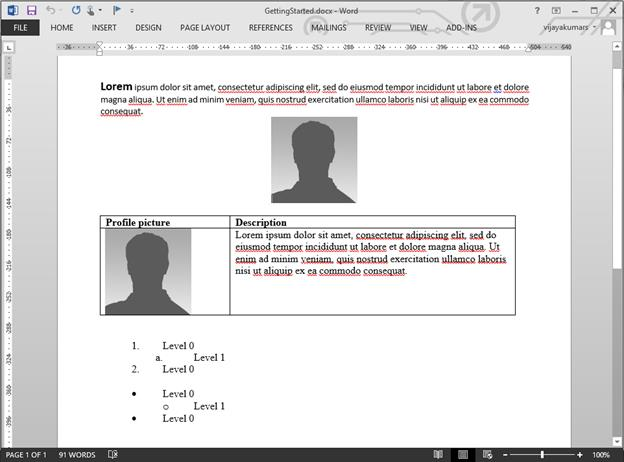
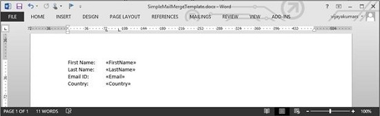
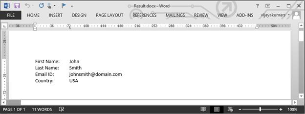
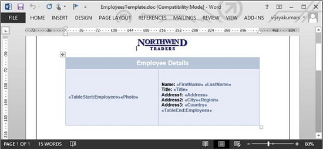
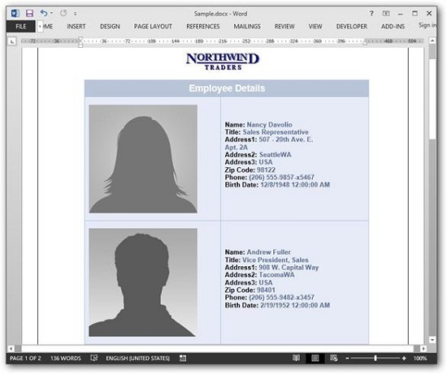

# Getting started with simple word document

In this page, you can see how to create a simple Word document by using Essential DocIO’s API. For creating and manipulating a Word document, the following assemblies are required to be referenced in your application.

<table>
<thead>  
<tr>
<th>Assembly  </th>
<th>Short description  </th>
</tr>
</thead>
<tbody>  
<tr>
<td>
Syncfusion.DocIO.Base  </td><td>
This assembly contains the core features needed for creating, reading, manipulating a Word document.  </td></tr>
<tr>
<td>
Syncfusion.Compression.Base  </td><td>
This assembly is used to package the Word document contents.  </td></tr>
<tr>
<td>
Syncfusion.OfficeChart.Base  </td><td>
This assembly contains the Office Chart Object model and core features needed for chart creation.  </td></tr>
</tbody>
</table>

N> 1. Starting with v16.2.0.x, if you reference Syncfusion assemblies from trial setup or from the NuGet feed, you also have to add "Syncfusion.Licensing" assembly reference and include a license key in your projects. Please refer to this [link](https://help.syncfusion.com/common/essential-studio/licensing/license-key) to know about registering Syncfusion license key in your application to use our components.
N> 2. Syncfusion components are available in [nuget.org](https://www.nuget.org/)

N> You can also explore our [.NET Word Library](https://www.syncfusion.com/demos/fileformats/word-library) demo that shows how to create and modify word files from C# with just five lines of code on different platforms.

Include the following namespaces in your .cs or .vb file

  



using Syncfusion.DocIO;

using Syncfusion.DocIO.DLS;





Imports Syncfusion.DocIO

Imports Syncfusion.DocIO.DLS

 



using Syncfusion.DocIO;

using Syncfusion.DocIO.DLS;

 



using Syncfusion.DocIO;

using Syncfusion.DocIO.DLS;

 



using Syncfusion.DocIO;

using Syncfusion.DocIO.DLS;

 



## Creating a new Word document with few lines of code

The following code example explains how to create a new Word document with few lines of code

  


//Creates an instance of WordDocument Instance (Empty Word Document)
WordDocument document = new WordDocument();
//Add a section & a paragraph in the empty document
document.EnsureMinimal();
//Append text to the last paragraph of the document
document.LastParagraph.AppendText("Hello World");
//Save and close the Word document
document.Save("Result.docx");
document.Close();



'Creates an instance of WordDocument Instance (Empty Word Document)
Dim document As New WordDocument()
'Add a section & a paragraph in the empty document
document.EnsureMinimal()
'Append text to the last paragraph of the document
document.LastParagraph.AppendText("Hello World")
'Save and close the Word document
document.Save("Result.docx")
document.Close()
 


//Creates an instance of WordDocument Instance (Empty Word Document)
WordDocument document = new WordDocument();
//Add a section & a paragraph in the empty document
document.EnsureMinimal();
//Append text to the last paragraph of the document
document.LastParagraph.AppendText("Hello World");      
//Saves the Word file to MemoryStream
MemoryStream stream = new MemoryStream();    
await document.SaveAsync(stream, FormatType.Docx);
document.Close();
//Saves the stream as Word file in local machine
Save(stream, "Result.docx");
//Please refer the below link to save Word document in UWP platform
//https://help.syncfusion.com/file-formats/docio/create-word-document-in-uwp#save-word-document-in-uwp
 


//Creates a new instance of WordDocument (Empty Word Document)
WordDocument document = new WordDocument();
//Adds a section and a paragraph to the document
document.EnsureMinimal();
//Appends text to the last paragraph of the document
document.LastParagraph.AppendText("Hello World");
MemoryStream stream = new MemoryStream();
//Saves the Word document to  MemoryStream
document.Save(stream, FormatType.Docx);
stream.Position = 0;
document.Close();
//Download Word document in the browser
return File(stream, "application/msword", "Result.docx");
 


//Creates an instance of WordDocument Instance (Empty Word Document)
WordDocument document = new WordDocument();
//Add a section & a paragraph in the empty document
document.EnsureMinimal();
//Append text to the last paragraph of the document
document.LastParagraph.AppendText("Hello World");
//Saves the Word document to MemoryStream
MemoryStream stream = new MemoryStream();
document.Save(stream, FormatType.Docx);
//Closes the document
document.Close();
//Save the stream as a file in the device and invoke it for viewing
Xamarin.Forms.DependencyService.Get<ISave>().SaveAndView("Result.docx", "application/msword", stream);
//Please download the helper files from the below link to save the stream as file and open the file for viewing in Xamarin platform
//https://help.syncfusion.com/file-formats/docio/create-word-document-in-xamarin#helper-files-for-xamarin
 



You can download a complete working sample from [GitHub](https://github.com/SyncfusionExamples/DocIO-Examples/tree/main/Getting-Started/Create-Word-document).

## Creating a new Word document from scratch with basic elements

An entire Word document is represented by an instance of WordDocument and it is root element of DocIO’s DOM. Word document contains a collection of sections. A Word document must contain at least one section.

A section represents group of paragraphs, tables etc., that have a specific set of properties used to define the pages, number of columns, headers and footers and so on that decides how the text appears. A section should contain at least one paragraph in this body.

The following code example explains how to add a section into a `WordDocument` instance.

  


//Creates an instance of WordDocument Instance (Empty Word Document)
WordDocument document = new WordDocument();
//Adds a new section into the Word document
IWSection section = document.AddSection();
//Specifies the page margins 
section.PageSetup.Margins.All = 50f;



'Creates an instance of WordDocument Instance (Empty Word Document)
Dim document As New WordDocument()
'Adds a new section into the Word document
Dim section As IWSection = document.AddSection()
'Specifies the page margins
section.PageSetup.Margins.All = 50.0F
 


//Creates an instance of WordDocument Instance (Empty Word Document)
WordDocument document = new WordDocument();
//Adds a new section into the Word document
IWSection section = document.AddSection();
//Specifies the page margins 
section.PageSetup.Margins.All = 50f;
 


//Creates an instance of WordDocument Instance (Empty Word Document)
WordDocument document = new WordDocument();
//Adds a new section into the Word document
IWSection section = document.AddSection();
//Specifies the page margins 
section.PageSetup.Margins.All = 50f;
 


//Creates an instance of WordDocument Instance (Empty Word Document)
WordDocument document = new WordDocument();
//Adds a new section into the Word document
IWSection section = document.AddSection();
//Specifies the page margins 
section.PageSetup.Margins.All = 50f;
 

  

All the textual contents in a Word document is represented by Paragraphs. Within the paragraph, textual contents are grouped into one or more child elements such as TextRange, field etc. Each TextRange represents a region of text with a common set of rich text formatting.

The following code example explains how to add a Paragraph into a Word document

 


//Adds a new simple paragraph into the section
IWParagraph firstParagraph = section.AddParagraph();
//Sets the paragraph's horizontal alignment as justify
firstParagraph.ParagraphFormat.HorizontalAlignment = HorizontalAlignment.Justify;
//Adds a text range into the paragraph
IWTextRange firstTextRange = firstParagraph.AppendText("AdventureWorks Cycles,");
//sets the font formatting of the text range
firstTextRange.CharacterFormat.Bold = true;
firstTextRange.CharacterFormat.FontName = "Calibri";
firstTextRange.CharacterFormat.FontSize = 14;
//Adds another text range into the paragraph
IWTextRange secondTextRange = firstParagraph.AppendText(" the fictitious company on which the AdventureWorks sample databases are based, is a large, multinational manufacturing company.");
//sets the font formatting of the text range
secondTextRange.CharacterFormat.FontName = "Calibri";
secondTextRange.CharacterFormat.FontSize = 11;



'Adds a new simple paragraph into the section
Dim firstParagraph As IWParagraph = section.AddParagraph()
'Sets the paragraph's horizontal alignment as justify
firstParagraph.ParagraphFormat.HorizontalAlignment = HorizontalAlignment.Justify
'Adds a text range into the paragraph
Dim firstTextRange As IWTextRange = firstParagraph.AppendText("AdventureWorks Cycles, ")
'sets the font formatting of the text range
firstTextRange.CharacterFormat.Bold = True
firstTextRange.CharacterFormat.FontName = "Calibri"
firstTextRange.CharacterFormat.FontSize = 14
'Adds another text range into the paragraph
Dim secondTextRange As IWTextRange = firstParagraph.AppendText("the fictitious company on which the AdventureWorks sample databases are based, is a large, multinational manufacturing company.")
'sets the font formatting of the text range
secondTextRange.CharacterFormat.FontName = "Calibri"
secondTextRange.CharacterFormat.FontSize = 11
  


//Adds a new simple paragraph into the section
IWParagraph firstParagraph = section.AddParagraph();
//Sets the paragraph's horizontal alignment as justify
firstParagraph.ParagraphFormat.HorizontalAlignment = Syncfusion.DocIO.DLS.HorizontalAlignment.Justify;
//Adds a text range into the paragraph
IWTextRange firstTextRange = firstParagraph.AppendText("AdventureWorks Cycles,");
//sets the font formatting of the text range
firstTextRange.CharacterFormat.Bold = true;
firstTextRange.CharacterFormat.FontName = "Calibri";
firstTextRange.CharacterFormat.FontSize = 14;
//Adds another text range into the paragraph
IWTextRange secondTextRange = firstParagraph.AppendText(" the fictitious company on which the AdventureWorks sample databases are based, is a large, multinational manufacturing company.");
//sets the font formatting of the text range
secondTextRange.CharacterFormat.FontName = "Calibri";
secondTextRange.CharacterFormat.FontSize = 11;
 


//Adds a new simple paragraph into the section
IWParagraph firstParagraph = section.AddParagraph();
//Sets the paragraph's horizontal alignment as justify
firstParagraph.ParagraphFormat.HorizontalAlignment = Syncfusion.DocIO.DLS.HorizontalAlignment.Justify;
//Adds a text range into the paragraph
IWTextRange firstTextRange = firstParagraph.AppendText("AdventureWorks Cycles,");
//sets the font formatting of the text range
firstTextRange.CharacterFormat.Bold = true;
firstTextRange.CharacterFormat.FontName = "Calibri";
firstTextRange.CharacterFormat.FontSize = 14;
//Adds another text range into the paragraph
IWTextRange secondTextRange = firstParagraph.AppendText(" the fictitious company on which the AdventureWorks sample databases are based, is a large, multinational manufacturing company.");
//sets the font formatting of the text range
secondTextRange.CharacterFormat.FontName = "Calibri";
secondTextRange.CharacterFormat.FontSize = 11;
 


//Adds a new simple paragraph into the section
IWParagraph firstParagraph = section.AddParagraph();
//Sets the paragraph's horizontal alignment as justify
firstParagraph.ParagraphFormat.HorizontalAlignment = Syncfusion.DocIO.DLS.HorizontalAlignment.Justify;
//Adds a text range into the paragraph
IWTextRange firstTextRange = firstParagraph.AppendText("AdventureWorks Cycles,");
//sets the font formatting of the text range
firstTextRange.CharacterFormat.Bold = true;
firstTextRange.CharacterFormat.FontName = "Calibri";
firstTextRange.CharacterFormat.FontSize = 14;
//Adds another text range into the paragraph
IWTextRange secondTextRange = firstParagraph.AppendText(" the fictitious company on which the AdventureWorks sample databases are based, is a large, multinational manufacturing company.");
//sets the font formatting of the text range
secondTextRange.CharacterFormat.FontName = "Calibri";
secondTextRange.CharacterFormat.FontSize = 11;
 

  

The following code example shows how to add an image into the Word document. 

  


//Adds another paragraph and aligns it as center
IWParagraph paragraph = section.AddParagraph();
paragraph.ParagraphFormat.HorizontalAlignment = HorizontalAlignment.Center;
//Sets after spacing for paragraph.
paragraph.ParagraphFormat.AfterSpacing = 8;
//Adds a picture into the paragraph
IWPicture picture = paragraph.AppendPicture(Image.FromFile("DummyProfilePicture.jpg"));
//Specify the size of the picture
picture.Height = 100;
picture.Width = 100;



'Adds another paragraph and aligns it as center
Dim paragraph As IWParagraph = section.AddParagraph()
paragraph.ParagraphFormat.HorizontalAlignment = HorizontalAlignment.Center
'Sets after spacing for paragraph.
paragraph.ParagraphFormat.AfterSpacing = 8
'Adds a picture into the paragraph
Dim picture As IWPicture = paragraph.AppendPicture(Image.FromFile("DummyProfilePicture.jpg"))
'Specifies the size of the picture
picture.Height = 100
picture.Width = 100



//Adds another paragraph and aligns it as center
IWParagraph paragraph = section.AddParagraph();
paragraph.ParagraphFormat.HorizontalAlignment = Syncfusion.DocIO.DLS.HorizontalAlignment.Center;
//Sets after spacing for paragraph.
paragraph.ParagraphFormat.AfterSpacing = 8;
//Adds a picture into the paragraph
//"App" is the class of Portable project.
Assembly assembly = typeof(App).GetTypeInfo().Assembly;
Stream imageStream1 = assembly.GetManifestResourceStream("CreateWordSample.Assets.DummyProfilePicture.jpg");
IWPicture picture = paragraph.AppendPicture(imageStream1);
//Specify the size of the picture
picture.Height = 100;
picture.Width = 100;
 


//Adds another paragraph and aligns it as center
IWParagraph paragraph = section.AddParagraph();
paragraph.ParagraphFormat.HorizontalAlignment = Syncfusion.DocIO.DLS.HorizontalAlignment.Center;
//Sets after spacing for paragraph.
paragraph.ParagraphFormat.AfterSpacing = 8;
//Adds a picture into the paragraph
FileStream image1 = new FileStream("DummyProfilePicture.jpg", FileMode.Open, FileAccess.Read);
IWPicture picture = paragraph.AppendPicture(image1);
//Specify the size of the picture
picture.Height = 100;
picture.Width = 100;
 


//Adds another paragraph and aligns it as center
IWParagraph paragraph = section.AddParagraph();
paragraph.ParagraphFormat.HorizontalAlignment = Syncfusion.DocIO.DLS.HorizontalAlignment.Center;
//Sets after spacing for paragraph.
paragraph.ParagraphFormat.AfterSpacing = 8;
//Adds a picture into the paragraph
//"App" is the class of Portable project.
Assembly assembly = typeof(App).GetTypeInfo().Assembly;
Stream imageStream1 = assembly.GetManifestResourceStream("CreateWordSample.Assets.DummyProfilePicture.jpg");
IWPicture picture = paragraph.AppendPicture(imageStream1);
//Specify the size of the picture
picture.Height = 100;
picture.Width = 100;
 

  

Table is another important element in Word that contains a set of paragraphs arranged in rows and columns. You can create simple as well as complex table by using Essential DocIO’s API. The following code example creates a simple table and adds contents into it. Each table cell must contain at least one paragraph.

 


//Adds a table into the Word document
IWTable table = section.AddTable();
//Creates the specified number of rows and columns
table.ResetCells(2,2);
//Accesses the instance of the cell (first row, first cell)
WTableCell firstCell = table.Rows[0].Cells[0];
//Specifies the width of the cell
firstCell.Width = 150;
//Adds a paragraph into the cell; a cell must have atleast 1 paragraph
paragraph = firstCell.AddParagraph();
IWTextRange textRange = paragraph.AppendText("Profile picture");
textRange.CharacterFormat.Bold = true;
//Accesses the instance of cell (first row, second cell)
WTableCell secondCell = table.Rows[0].Cells[1];
secondCell.Width = 330;
paragraph = secondCell.AddParagraph();
textRange = paragraph.AppendText("Description");
textRange.CharacterFormat.Bold = true;
firstCell = table.Rows[1].Cells[0];
firstCell.Width = 150;
paragraph = firstCell.AddParagraph();
//Sets after spacing for paragraph.
paragraph.ParagraphFormat.AfterSpacing = 6;
IWPicture profilePicture = paragraph.AppendPicture(Image.FromFile(DummyProfile-Picture.jpg"));
profilePicture.Height = 100;
profilePicture.Width = 100;
secondCell = table.Rows[1].Cells[1];
secondCell.Width = 330;
paragraph = secondCell.AddParagraph();
textRange = paragraph.AppendText("AdventureWorks Cycles, the fictitious company on which the AdventureWorks sample databases are based, is a large, multinational manufacturing company.");



'Adds a table into the Word document
Dim table As IWTable = section.AddTable()
'Creates the specified number of rows and columns
table.ResetCells(2, 2)
'Accesses the instance of the cell (first row, first cell)
Dim firstCell As WTableCell = table.Rows(0).Cells(0)
'Specifies the width of the cell
firstCell.Width = 150
'Adds a paragraph into the cell; a cell must have atleast 1 paragraph
paragraph = firstCell.AddParagraph()
Dim textRange As IWTextRange = paragraph.AppendText("Profile picture")
textRange.CharacterFormat.Bold = True
'Accesses the instance of cell (first row, second cell)
Dim secondCell As WTableCell = table.Rows(0).Cells(1)
secondCell.Width = 330
paragraph = secondCell.AddParagraph()
textRange = paragraph.AppendText("Description")
textRange.CharacterFormat.Bold = True
firstCell = table.Rows(1).Cells(0)
firstCell.Width = 150
paragraph = firstCell.AddParagraph()
'Sets after spacing for paragraph.
paragraph.ParagraphFormat.AfterSpacing = 6
Dim profilePicture As IWPicture = paragraph.AppendPicture(Image.FromFile("DummyProfile-Picture.jpg"))
profilePicture.Height = 100
profilePicture.Width = 100
secondCell = table.Rows(1).Cells(1)
secondCell.Width = 330
paragraph = secondCell.AddParagraph()
textRange = paragraph.AppendText("AdventureWorks Cycles, the fictitious company on which the AdventureWorks sample databases are based, is a large, multinational manufacturing company.")
 


//Adds a table into the Word document
IWTable table = section.AddTable();
//Creates the specified number of rows and columns
table.ResetCells(2, 2);
//Accesses the instance of the cell (first row, first cell)
WTableCell firstCell = table.Rows[0].Cells[0];
//Specifies the width of the cell
firstCell.Width = 150;
//Adds a paragraph into the cell; a cell must have atleast 1 paragraph
paragraph = firstCell.AddParagraph();
IWTextRange textRange = paragraph.AppendText("Profile picture");
textRange.CharacterFormat.Bold = true;
//Accesses the instance of cell (first row, second cell)
WTableCell secondCell = table.Rows[0].Cells[1];
secondCell.Width = 330;
paragraph = secondCell.AddParagraph();
textRange = paragraph.AppendText("Description");
textRange.CharacterFormat.Bold = true;
firstCell = table.Rows[1].Cells[0];
firstCell.Width = 150;
paragraph = firstCell.AddParagraph();
//Sets after spacing for paragraph.
paragraph.ParagraphFormat.AfterSpacing = 6;
Stream imageStream2 = assembly.GetManifestResourceStream("CreateWordSample.Assets.DummyProfile-Picture.jpg");
IWPicture profilePicture = paragraph.AppendPicture(imageStream2); 
profilePicture.Height = 100;
profilePicture.Width = 100;
secondCell = table.Rows[1].Cells[1];
secondCell.Width = 330;
paragraph = secondCell.AddParagraph();
textRange = paragraph.AppendText("AdventureWorks Cycles, the fictitious company on which the AdventureWorks sample databases are based, is a large, multinational manufacturing company.");
 


//Adds a table into the Word document
IWTable table = section.AddTable();
//Creates the specified number of rows and columns
table.ResetCells(2, 2);
//Accesses the instance of the cell (first row, first cell)
WTableCell firstCell = table.Rows[0].Cells[0];
//Specifies the width of the cell
firstCell.Width = 150;
//Adds a paragraph into the cell; a cell must have atleast 1 paragraph
paragraph = firstCell.AddParagraph();
IWTextRange textRange = paragraph.AppendText("Profile picture");
textRange.CharacterFormat.Bold = true;
//Accesses the instance of cell (first row, second cell)
WTableCell secondCell = table.Rows[0].Cells[1];
secondCell.Width = 330;
paragraph = secondCell.AddParagraph();
textRange = paragraph.AppendText("Description");
textRange.CharacterFormat.Bold = true;
firstCell = table.Rows[1].Cells[0];
firstCell.Width = 150;
paragraph = firstCell.AddParagraph();
//Sets after spacing for paragraph.
paragraph.ParagraphFormat.AfterSpacing = 6;
FileStream image2 = new FileStream("DummyProfile-Picture.jpg", FileMode.Open, FileAccess.Read);
IWPicture profilePicture = paragraph.AppendPicture(image2);
profilePicture.Height = 100;
profilePicture.Width = 100;
secondCell = table.Rows[1].Cells[1];
secondCell.Width = 330;
paragraph = secondCell.AddParagraph();
textRange = paragraph.AppendText("AdventureWorks Cycles, the fictitious company on which the AdventureWorks sample databases are based, is a large, multinational manufacturing company.");
 


//Adds a table into the Word document
IWTable table = section.AddTable();
//Creates the specified number of rows and columns
table.ResetCells(2, 2);
//Accesses the instance of the cell (first row, first cell)
WTableCell firstCell = table.Rows[0].Cells[0];
//Specifies the width of the cell
firstCell.Width = 150;
//Adds a paragraph into the cell; a cell must have atleast 1 paragraph
paragraph = firstCell.AddParagraph();
IWTextRange textRange = paragraph.AppendText("Profile picture");
textRange.CharacterFormat.Bold = true;
//Accesses the instance of cell (first row, second cell)
WTableCell secondCell = table.Rows[0].Cells[1];
secondCell.Width = 330;
paragraph = secondCell.AddParagraph();
textRange = paragraph.AppendText("Description");
textRange.CharacterFormat.Bold = true;
firstCell = table.Rows[1].Cells[0];
firstCell.Width = 150;
paragraph = firstCell.AddParagraph();
//Sets after spacing for paragraph.
paragraph.ParagraphFormat.AfterSpacing = 6;
Stream imageStream2 = assembly.GetManifestResourceStream("CreateWordSample.Assets.DummyProfile-Picture.jpg");
IWPicture profilePicture = paragraph.AppendPicture(imageStream2); 
profilePicture.Height = 100;
profilePicture.Width = 100;
secondCell = table.Rows[1].Cells[1];
secondCell.Width = 330;
paragraph = secondCell.AddParagraph();
textRange = paragraph.AppendText("AdventureWorks Cycles, the fictitious company on which the AdventureWorks sample databases are based, is a large, multinational manufacturing company.");
 

  

Essential DocIO allow you to create simple and multi-level lists. The following code snippet explains about how to create a numbered and bulleted list.

 


//Writes default numbered list. 
paragraph = section.AddParagraph();
//Sets before spacing for paragraph.
paragraph.ParagraphFormat.BeforeSpacing = 6;
paragraph.AppendText("Level 0");
//Applies the default numbered list formats 
paragraph.ListFormat.ApplyDefNumberedStyle();
//Applies list formatting.
paragraph.ListFormat.CurrentListLevel.ParagraphFormat.LeftIndent = 36;
paragraph.ListFormat.CurrentListLevel.ParagraphFormat.FirstLineIndent = -18;
paragraph.ListFormat.CurrentListLevel.NumberAlignment = ListNumberAlignment.Left;
paragraph = section.AddParagraph();
paragraph.AppendText("Level 1");
//Specifies the list format to continue from last list
paragraph.ListFormat.ContinueListNumbering();
//Increments the list level
paragraph.ListFormat.IncreaseIndentLevel();
//Applies list formatting.
paragraph.ListFormat.CurrentListLevel.ParagraphFormat.LeftIndent = 72;
paragraph.ListFormat.CurrentListLevel.ParagraphFormat.FirstLineIndent = -18;
paragraph.ListFormat.CurrentListLevel.NumberAlignment = ListNumberAlignment.Left;
paragraph = section.AddParagraph();
paragraph.AppendText("Level 0");
paragraph.ListFormat.ContinueListNumbering();
//Decrements the list level
paragraph.ListFormat.DecreaseIndentLevel();
//Applies list formatting.
paragraph.ListFormat.CurrentListLevel.ParagraphFormat.LeftIndent = 36;
paragraph.ListFormat.CurrentListLevel.ParagraphFormat.FirstLineIndent = -18;
paragraph.ListFormat.CurrentListLevel.NumberAlignment = ListNumberAlignment.Left;
section.AddParagraph();
//Writes default bulleted list. 
paragraph = section.AddParagraph();
paragraph.AppendText("Level 0");
//Applies the default bulleted list formats
paragraph.ListFormat.ApplyDefBulletStyle();
//Applies list formatting.
paragraph.ListFormat.CurrentListLevel.ParagraphFormat.LeftIndent = 36;
paragraph.ListFormat.CurrentListLevel.ParagraphFormat.FirstLineIndent = -18;
paragraph.ListFormat.CurrentListLevel.NumberAlignment = ListNumberAlignment.Left;
paragraph = section.AddParagraph();
paragraph.AppendText("Level 1");
//Specifies the list format to continue from last list
paragraph.ListFormat.ContinueListNumbering();
//Increments the list level
paragraph.ListFormat.IncreaseIndentLevel();
//Applies list formatting.
paragraph.ListFormat.CurrentListLevel.ParagraphFormat.LeftIndent = 72;
paragraph.ListFormat.CurrentListLevel.ParagraphFormat.FirstLineIndent = -18;
paragraph.ListFormat.CurrentListLevel.NumberAlignment = ListNumberAlignment.Left;
paragraph = section.AddParagraph();
paragraph.AppendText("Level 0");
//Specifies the list format to continue from last list
paragraph.ListFormat.ContinueListNumbering();
//Decrements the list level
paragraph.ListFormat.DecreaseIndentLevel();
//Applies list formatting.
paragraph.ListFormat.CurrentListLevel.ParagraphFormat.LeftIndent = 36;
paragraph.ListFormat.CurrentListLevel.ParagraphFormat.FirstLineIndent = -18;
paragraph.ListFormat.CurrentListLevel.NumberAlignment = ListNumberAlignment.Left;
section.AddParagraph();



'Writes default numbered list. 
paragraph = section.AddParagraph()
'Sets before spacing for paragraph.
paragraph.ParagraphFormat.BeforeSpacing = 6
paragraph.AppendText("Level 0")
'Applies the default numbered list formats 
paragraph.ListFormat.ApplyDefNumberedStyle()
'Applies list formatting.
paragraph.ListFormat.CurrentListLevel.ParagraphFormat.LeftIndent = 36
paragraph.ListFormat.CurrentListLevel.ParagraphFormat.FirstLineIndent = -18
paragraph.ListFormat.CurrentListLevel.NumberAlignment = ListNumberAlignment.Left
paragraph = section.AddParagraph()
paragraph.AppendText("Level 1")
'Specifies the list format to continue from last list
paragraph.ListFormat.ContinueListNumbering()
'Increments the list level
paragraph.ListFormat.IncreaseIndentLevel()
'Applies list formatting.
paragraph.ListFormat.CurrentListLevel.ParagraphFormat.LeftIndent = 72
paragraph.ListFormat.CurrentListLevel.ParagraphFormat.FirstLineIndent = -18
paragraph.ListFormat.CurrentListLevel.NumberAlignment = ListNumberAlignment.Left
paragraph = section.AddParagraph()
paragraph.AppendText("Level 0")
paragraph.ListFormat.ContinueListNumbering()
'Decrements the list level
paragraph.ListFormat.DecreaseIndentLevel()
'Applies list formatting.
paragraph.ListFormat.CurrentListLevel.ParagraphFormat.LeftIndent = 36
paragraph.ListFormat.CurrentListLevel.ParagraphFormat.FirstLineIndent = -18
paragraph.ListFormat.CurrentListLevel.NumberAlignment = ListNumberAlignment.Left
section.AddParagraph()
'Writes default bulleted list. 
paragraph = section.AddParagraph()
paragraph.AppendText("Level 0")
'Applies the default bulleted list formats
paragraph.ListFormat.ApplyDefBulletStyle()
'Applies list formatting.
paragraph.ListFormat.CurrentListLevel.ParagraphFormat.LeftIndent = 36
paragraph.ListFormat.CurrentListLevel.ParagraphFormat.FirstLineIndent = -18
paragraph.ListFormat.CurrentListLevel.NumberAlignment = ListNumberAlignment.Left
paragraph = section.AddParagraph()
paragraph.AppendText("Level 1")
'Specifies the list format to continue from last list
paragraph.ListFormat.ContinueListNumbering()
'Increments the list level
paragraph.ListFormat.IncreaseIndentLevel()
'Applies list formatting.
paragraph.ListFormat.CurrentListLevel.ParagraphFormat.LeftIndent = 72
paragraph.ListFormat.CurrentListLevel.ParagraphFormat.FirstLineIndent = -18
paragraph.ListFormat.CurrentListLevel.NumberAlignment = ListNumberAlignment.Left
paragraph = section.AddParagraph()
paragraph.AppendText("Level 0")
'Specifies the list format to continue from last list
paragraph.ListFormat.ContinueListNumbering()
'Decrements the list level
paragraph.ListFormat.DecreaseIndentLevel()
'Applies list formatting.
paragraph.ListFormat.CurrentListLevel.ParagraphFormat.LeftIndent = 36
paragraph.ListFormat.CurrentListLevel.ParagraphFormat.FirstLineIndent = -18
paragraph.ListFormat.CurrentListLevel.NumberAlignment = ListNumberAlignment.Left
section.AddParagraph()



//Writes default numbered list. 
paragraph = section.AddParagraph();
//Sets before spacing for paragraph.
paragraph.ParagraphFormat.BeforeSpacing = 6;
paragraph.AppendText("Level 0");
//Applies the default numbered list formats 
paragraph.ListFormat.ApplyDefNumberedStyle();
//Applies list formatting.
paragraph.ListFormat.CurrentListLevel.ParagraphFormat.LeftIndent = 36;
paragraph.ListFormat.CurrentListLevel.ParagraphFormat.FirstLineIndent = -18;
paragraph.ListFormat.CurrentListLevel.NumberAlignment = ListNumberAlignment.Left;
paragraph = section.AddParagraph();
paragraph.AppendText("Level 1");
//Specifies the list format to continue from last list
paragraph.ListFormat.ContinueListNumbering();
//Increments the list level
paragraph.ListFormat.IncreaseIndentLevel();
//Applies list formatting.
paragraph.ListFormat.CurrentListLevel.ParagraphFormat.LeftIndent = 72;
paragraph.ListFormat.CurrentListLevel.ParagraphFormat.FirstLineIndent = -18;
paragraph.ListFormat.CurrentListLevel.NumberAlignment = ListNumberAlignment.Left;
paragraph = section.AddParagraph();
paragraph.AppendText("Level 0");
paragraph.ListFormat.ContinueListNumbering();
//Decrements the list level
paragraph.ListFormat.DecreaseIndentLevel();
//Applies list formatting.
paragraph.ListFormat.CurrentListLevel.ParagraphFormat.LeftIndent = 36;
paragraph.ListFormat.CurrentListLevel.ParagraphFormat.FirstLineIndent = -18;
paragraph.ListFormat.CurrentListLevel.NumberAlignment = ListNumberAlignment.Left;
section.AddParagraph();
//Writes default bulleted list. 
paragraph = section.AddParagraph();
paragraph.AppendText("Level 0");
//Applies the default bulleted list formats
paragraph.ListFormat.ApplyDefBulletStyle();
//Applies list formatting.
paragraph.ListFormat.CurrentListLevel.ParagraphFormat.LeftIndent = 36;
paragraph.ListFormat.CurrentListLevel.ParagraphFormat.FirstLineIndent = -18;
paragraph.ListFormat.CurrentListLevel.NumberAlignment = ListNumberAlignment.Left;
paragraph = section.AddParagraph();
paragraph.AppendText("Level 1");
//Specifies the list format to continue from last list
paragraph.ListFormat.ContinueListNumbering();
//Increments the list level
paragraph.ListFormat.IncreaseIndentLevel();
//Applies list formatting.
paragraph.ListFormat.CurrentListLevel.ParagraphFormat.LeftIndent = 72;
paragraph.ListFormat.CurrentListLevel.ParagraphFormat.FirstLineIndent = -18;
paragraph.ListFormat.CurrentListLevel.NumberAlignment = ListNumberAlignment.Left;
paragraph = section.AddParagraph();
paragraph.AppendText("Level 0");
//Specifies the list format to continue from last list
paragraph.ListFormat.ContinueListNumbering();
//Decrements the list level
paragraph.ListFormat.DecreaseIndentLevel();
//Applies list formatting.
paragraph.ListFormat.CurrentListLevel.ParagraphFormat.LeftIndent = 36;
paragraph.ListFormat.CurrentListLevel.ParagraphFormat.FirstLineIndent = -18;
paragraph.ListFormat.CurrentListLevel.NumberAlignment = ListNumberAlignment.Left;
section.AddParagraph();
 


//Writes default numbered list. 
paragraph = section.AddParagraph();
//Sets before spacing for paragraph.
paragraph.ParagraphFormat.BeforeSpacing = 6;
paragraph.AppendText("Level 0");
//Applies the default numbered list formats 
paragraph.ListFormat.ApplyDefNumberedStyle();
//Applies list formatting.
paragraph.ListFormat.CurrentListLevel.ParagraphFormat.LeftIndent = 36;
paragraph.ListFormat.CurrentListLevel.ParagraphFormat.FirstLineIndent = -18;
paragraph.ListFormat.CurrentListLevel.NumberAlignment = ListNumberAlignment.Left;
paragraph = section.AddParagraph();
paragraph.AppendText("Level 1");
//Specifies the list format to continue from last list
paragraph.ListFormat.ContinueListNumbering();
//Increments the list level
paragraph.ListFormat.IncreaseIndentLevel();
//Applies list formatting.
paragraph.ListFormat.CurrentListLevel.ParagraphFormat.LeftIndent = 72;
paragraph.ListFormat.CurrentListLevel.ParagraphFormat.FirstLineIndent = -18;
paragraph.ListFormat.CurrentListLevel.NumberAlignment = ListNumberAlignment.Left;
paragraph = section.AddParagraph();
paragraph.AppendText("Level 0");
paragraph.ListFormat.ContinueListNumbering();
//Decrements the list level
paragraph.ListFormat.DecreaseIndentLevel();
//Applies list formatting.
paragraph.ListFormat.CurrentListLevel.ParagraphFormat.LeftIndent = 36;
paragraph.ListFormat.CurrentListLevel.ParagraphFormat.FirstLineIndent = -18;
paragraph.ListFormat.CurrentListLevel.NumberAlignment = ListNumberAlignment.Left;
section.AddParagraph();
//Writes default bulleted list. 
paragraph = section.AddParagraph();
paragraph.AppendText("Level 0");
//Applies the default bulleted list formats
paragraph.ListFormat.ApplyDefBulletStyle();
//Applies list formatting.
paragraph.ListFormat.CurrentListLevel.ParagraphFormat.LeftIndent = 36;
paragraph.ListFormat.CurrentListLevel.ParagraphFormat.FirstLineIndent = -18;
paragraph.ListFormat.CurrentListLevel.NumberAlignment = ListNumberAlignment.Left;
paragraph = section.AddParagraph();
paragraph.AppendText("Level 1");
//Specifies the list format to continue from last list
paragraph.ListFormat.ContinueListNumbering();
//Increments the list level
paragraph.ListFormat.IncreaseIndentLevel();
//Applies list formatting.
paragraph.ListFormat.CurrentListLevel.ParagraphFormat.LeftIndent = 72;
paragraph.ListFormat.CurrentListLevel.ParagraphFormat.FirstLineIndent = -18;
paragraph.ListFormat.CurrentListLevel.NumberAlignment = ListNumberAlignment.Left;
paragraph = section.AddParagraph();
paragraph.AppendText("Level 0");
//Specifies the list format to continue from last list
paragraph.ListFormat.ContinueListNumbering();
//Decrements the list level
paragraph.ListFormat.DecreaseIndentLevel();
//Applies list formatting.
paragraph.ListFormat.CurrentListLevel.ParagraphFormat.LeftIndent = 36;
paragraph.ListFormat.CurrentListLevel.ParagraphFormat.FirstLineIndent = -18;
paragraph.ListFormat.CurrentListLevel.NumberAlignment = ListNumberAlignment.Left;
section.AddParagraph();
 


//Writes default numbered list. 
paragraph = section.AddParagraph();
//Sets before spacing for paragraph.
paragraph.ParagraphFormat.BeforeSpacing = 6;
paragraph.AppendText("Level 0");
//Applies the default numbered list formats 
paragraph.ListFormat.ApplyDefNumberedStyle();
//Applies list formatting.
paragraph.ListFormat.CurrentListLevel.ParagraphFormat.LeftIndent = 36;
paragraph.ListFormat.CurrentListLevel.ParagraphFormat.FirstLineIndent = -18;
paragraph.ListFormat.CurrentListLevel.NumberAlignment = ListNumberAlignment.Left;
paragraph = section.AddParagraph();
paragraph.AppendText("Level 1");
//Specifies the list format to continue from last list
paragraph.ListFormat.ContinueListNumbering();
//Increments the list level
paragraph.ListFormat.IncreaseIndentLevel();
//Applies list formatting.
paragraph.ListFormat.CurrentListLevel.ParagraphFormat.LeftIndent = 72;
paragraph.ListFormat.CurrentListLevel.ParagraphFormat.FirstLineIndent = -18;
paragraph.ListFormat.CurrentListLevel.NumberAlignment = ListNumberAlignment.Left;
paragraph = section.AddParagraph();
paragraph.AppendText("Level 0");
paragraph.ListFormat.ContinueListNumbering();
//Decrements the list level
paragraph.ListFormat.DecreaseIndentLevel();
//Applies list formatting.
paragraph.ListFormat.CurrentListLevel.ParagraphFormat.LeftIndent = 36;
paragraph.ListFormat.CurrentListLevel.ParagraphFormat.FirstLineIndent = -18;
paragraph.ListFormat.CurrentListLevel.NumberAlignment = ListNumberAlignment.Left;
section.AddParagraph();
//Writes default bulleted list. 
paragraph = section.AddParagraph();
paragraph.AppendText("Level 0");
//Applies the default bulleted list formats
paragraph.ListFormat.ApplyDefBulletStyle();
//Applies list formatting.
paragraph.ListFormat.CurrentListLevel.ParagraphFormat.LeftIndent = 36;
paragraph.ListFormat.CurrentListLevel.ParagraphFormat.FirstLineIndent = -18;
paragraph.ListFormat.CurrentListLevel.NumberAlignment = ListNumberAlignment.Left;
paragraph = section.AddParagraph();
paragraph.AppendText("Level 1");
//Specifies the list format to continue from last list
paragraph.ListFormat.ContinueListNumbering();
//Increments the list level
paragraph.ListFormat.IncreaseIndentLevel();
//Applies list formatting.
paragraph.ListFormat.CurrentListLevel.ParagraphFormat.LeftIndent = 72;
paragraph.ListFormat.CurrentListLevel.ParagraphFormat.FirstLineIndent = -18;
paragraph.ListFormat.CurrentListLevel.NumberAlignment = ListNumberAlignment.Left;
paragraph = section.AddParagraph();
paragraph.AppendText("Level 0");
//Specifies the list format to continue from last list
paragraph.ListFormat.ContinueListNumbering();
//Decrements the list level
paragraph.ListFormat.DecreaseIndentLevel();
//Applies list formatting.
paragraph.ListFormat.CurrentListLevel.ParagraphFormat.LeftIndent = 36;
paragraph.ListFormat.CurrentListLevel.ParagraphFormat.FirstLineIndent = -18;
paragraph.ListFormat.CurrentListLevel.NumberAlignment = ListNumberAlignment.Left;
section.AddParagraph();
 

  

Finally, save the document in file system and close its instance.

 


//Saves the document in the given name and format
document.Save(outputFileName, FormatType.Docx);
//Releases the resources occupied by WordDocument instance
document.Close();



'Saves the document in the given name and format
document.Save(outputFileName, FormatType.Docx)
'Releases the resources occupied by WordDocument instance
document.Close()



MemoryStream stream = new MemoryStream();
//Saves the Word document to MemoryStream
await document.SaveAsync(stream, FormatType.Docx);
document.Close();
//Saves the stream as Word document file in local machine
Save(stream, outputFileName);
//Please refer the below link to save Word document in UWP platform
//https://help.syncfusion.com/file-formats/docio/create-word-document-in-uwp#save-word-document-in-uwp
 


MemoryStream stream = new MemoryStream();
//Saves the Word document to  MemoryStream
document.Save(stream, FormatType.Docx);
document.Close();
stream.Position = 0;
//Download Word document in the browser
return File(stream, "application/msword", outputFileName);
 


MemoryStream stream = new MemoryStream();
//Saves the Word document to MemoryStream
document.Save(stream, FormatType.Docx);
document.Close();
//Save the stream as a file in the device and invoke it for viewing
Xamarin.Forms.DependencyService.Get<ISave>().SaveAndView(outputFileName, "application/msword", stream);
//Please download the helper files from the below link to save the stream as file and open the file for viewing in Xamarin platform
//https://help.syncfusion.com/file-formats/docio/create-word-document-in-xamarin#helper-files-for-xamarin
 

  

You can download a complete working sample from [GitHub](https://github.com/SyncfusionExamples/DocIO-Examples/tree/main/Getting-Started/Create-Word-with-basic-elements).

The resultant Word document looks as follows.

## Modifying an existing Word document

Essential DocIO allows you to manipulate an existing Word document, RTF, WordML, HTML and Plain text files. You can modify the documents either by manipulating DocIO’s DOM or by using DocIO’s built-in functionalities such as Find and Replace, replacing bookmark contents etc.

Here, you can see how an existing Word document is loaded into DocIO’s DOM, replaces an existing content with another and finally saves the Word document.

You can open an existing Word document either by using constructor of `WordDocument` class or by using `Open` method of `WordDocument` class that reads the document and populates DocIO’s DOM. The following code example shows how to load an existing document.

  


//Loads an existing Word document into DocIO instance
WordDocument document = new WordDocument("Giant Panda.docx");
//Replaces the word "bear" as "panda"
document.Replace("bear", "panda", false, true);
//Saves the Word document
document.Save("Result.docx");
//Closes the document
document.Close();



'Loads an existing Word document into DocIO instance
Dim document As New WordDocument("Giant Panda.docx")
'Replaces the word "bear" as "panda"
document.Replace("bear", "panda", False, True)
'Saves the Word document
document.Save("Result.docx")
'Closes the document 
document.Close()



Assembly assembly = typeof(App).GetTypeInfo().Assembly;
Stream FileStream = assembly.GetManifestResourceStream("CreateWordSample.Assets.Giant Panda.docx");
//Loads an existing Word document into DocIO instance
WordDocument document = new WordDocument(FileStream);
//Replaces the word "bear" as "panda"
document.Replace("bear", "panda", false, true);
MemoryStream stream = new MemoryStream();
//Saves the Word document to MemoryStream
await document.SaveAsync(stream, FormatType.Docx);
document.Close();
//Saves the stream as Word document file in local machine
Save(stream, "Result.docx");
//Please refer the below link to save Word document in UWP platform
//https://help.syncfusion.com/file-formats/docio/create-word-document-in-uwp#save-word-document-in-uwp
 


FileStream fileStream = new FileStream(@"Giant Panda.docx",FileMode.Open,FileAccess.ReadWrite);
//Loads an existing Word document into DocIO instance
WordDocument document = new WordDocument(fileStream, FormatType.Automatic);
//Replaces the word "bear" as "panda"
document.Replace("bear", "panda", false, true);
MemoryStream stream = new MemoryStream();
//Saves the Word document to  MemoryStream
document.Save(stream, FormatType.Docx);
stream.Position = 0;
document.Close();
//Download Word document in the browser
return File(stream, "application/msword", "Result.docx");
 


Assembly assembly = typeof(App).GetTypeInfo().Assembly;
Stream FileStream = assembly.GetManifestResourceStream("XamarinFormsApp1.Assets.Giant Panda.docx");
//Loads an existing Word document into DocIO instance
WordDocument document = new WordDocument(FileStream,FormatType.Automatic);
//Replaces the word "bear" as "panda"
document.Replace("bear", "panda", false, true);
//Saves the Word document to MemoryStream
MemoryStream stream = new MemoryStream();
document.Save(stream, FormatType.Docx);
document.Close();
//Save the stream as a file in the device and invoke it for viewing
Xamarin.Forms.DependencyService.Get<ISave>().SaveAndView("Result.docx", "application/msword", stream);
//Please download the helper files from the below link to save the stream as file and open the file for viewing in Xamarin platform
//https://help.syncfusion.com/file-formats/docio/create-word-document-in-xamarin#helper-files-for-xamarin
 

  

You can download a complete working sample from [GitHub](https://github.com/SyncfusionExamples/DocIO-Examples/tree/main/Find-and-Replace/Find-and-replace-all).

The following code example explains how to search a particular text and highlight it.

  


//Loads an existing Word document into DocIO instance
WordDocument document = new WordDocument(@"..\..\Data\Giant Panda.docx");
//Finds the occurrence of the Word "panda" in the document
TextSelection[] textSelection = document.FindAll("panda", false, true);
//Iterates through each occurrence and highlights it
foreach (TextSelection selection in textSelection)
{
	IWTextRange textRange = selection.GetAsOneRange();
	textRange.CharacterFormat.HighlightColor = Color.Yellow;
}
//Saves and closes the document
document.Save("Result.docx");
document.Close();



'Loads an existing Word document into DocIO instance
Dim document As New WordDocument("..\..\Data\Giant Panda.docx")
'Finds the occurrence of the word "panda" in the document
Dim textSelection As TextSelection() = document.FindAll("panda", False, True)
'Iterates through each occurrence and highlights it.
For Each selection As TextSelection In textSelection
	Dim textRange As IWTextRange = selection.GetAsOneRange()
	textRange.CharacterFormat.HighlightColor = Color.Yellow
Next
document.Save("Result.docx")
document.Close()
 


Assembly assembly = typeof(App).GetTypeInfo().Assembly;
Stream FileStream = assembly.GetManifestResourceStream("CreateWordSample.Assets.Test.docx");
//Loads an existing Word document into DocIO instance
WordDocument document = new WordDocument(FileStream);
//Finds the occurrence of the Word "panda" in the document
TextSelection[] textSelection = document.FindAll("panda", false, true);
//Iterates through each occurrence and highlights it
foreach (TextSelection selection in textSelection)
{
	IWTextRange textRange = selection.GetAsOneRange();
	textRange.CharacterFormat.HighlightColor = Color.Yellow;
}
MemoryStream stream = new MemoryStream();
//Saves the Word document to MemoryStream
await document.SaveAsync(stream, FormatType.Docx);
document.Close();
//Saves the stream as Word document file in local machine       
Save(stream, "Sample.docx");
//Please refer the below link to save Word document in UWP platform
//https://help.syncfusion.com/file-formats/docio/create-word-document-in-uwp#save-word-document-in-uwp
 


FileStream fileStream = new FileStream(@"Test.docx",FileMode.Open,FileAccess.ReadWrite);
//Loads an existing Word document into DocIO instance
WordDocument document = new WordDocument(fileStream, FormatType.Automatic);
//Finds the occurrence of the Word "panda" in the document
TextSelection[] textSelection = document.FindAll("panda", false, true);
//Iterates through each occurrence and highlights it
foreach (TextSelection selection in textSelection)
{
	IWTextRange textRange = selection.GetAsOneRange();
	textRange.CharacterFormat.HighlightColor = Syncfusion.Drawing.Color.Yellow;
}
MemoryStream stream = new MemoryStream();
//Saves the Word document to  MemoryStream
document.Save(stream, FormatType.Docx);
stream.Position = 0;
document.Close();
//Download Word document in the browser
return File(stream, "application/msword", "Result.docx");
 


Assembly assembly = typeof(App).GetTypeInfo().Assembly;
Stream FileStream = assembly.GetManifestResourceStream("XamarinFormsApp1.Assets.Test.docx");
//Loads an existing Word document into DocIO instance
WordDocument document = new WordDocument(FileStream,FormatType.Automatic);
//Finds the occurrence of the Word "panda" in the document
TextSelection[] textSelection = document.FindAll("panda", false, true);
//Iterates through each occurrence and highlights it
foreach (TextSelection selection in textSelection)
{
	IWTextRange textRange = selection.GetAsOneRange();
	textRange.CharacterFormat.HighlightColor = Syncfusion.Drawing.Color.Yellow;
}
//Saves the Word document to MemoryStream
MemoryStream stream = new MemoryStream();
document.Save(stream, FormatType.Docx);
//Closes the document
document.Close();
//Save the stream as a file in the device and invoke it for viewing
Xamarin.Forms.DependencyService.Get<ISave>().SaveAndView("GettingStartedSample.docx", "application/msword", stream);
//Please download the helper files from the below link to save the stream as file and open the file for viewing in Xamarin platform
//https://help.syncfusion.com/file-formats/docio/create-word-document-in-xamarin#helper-files-for-xamarin
 

  

You can download a complete working sample from [GitHub](https://github.com/SyncfusionExamples/DocIO-Examples/tree/main/Find-and-Replace/Find-and-highlight-all).

## Performing Mail merge

Essential DocIO allows to generate documents by filling data in template document from data source. Mail merge operation automatically maps the column name in the data source and names of the merge fields in the template Word document and fills the data.  

The following data sources are supported by Essential DocIO for performing Mail merge.

* String Arrays
* ADO.NET objects
* Business Objects
* Dynamic objects

Also, you can perform more than one Mail merge operations over the same template to generate document as per your requirement.

Follow the given steps to perform simple Mail merge in a Word document.

Let’s consider that you have a template Word document with merge fields as shown.

The `MailMerge` class provides various overloads for `Execute` method to perform Mail merge from various data source. The Mail merge operation replaces the matching merge fields with the respective data.

The following code example shows how to perform simple Mail merge by using string array.

   


//Loads the template document with required merge fields
WordDocument document = new WordDocument(@"..\..\data\SimpleMailMergeTemplate.docx");
//Initializes the string array with field names
string[] fieldNames = new string[] {"FirstName", "LastName", "Email", "Country"};
//Initializes the string array with field values
string[] fieldValues = new string[] {"John", "Smith", "john_smith@domain.com", "USA"};
//Executes the mail merge operation that replaces the matching field names with field values respectively.
document.MailMerge.Execute(fieldNames, fieldValues);
//Saves and closes the WordDocument instance
document.Save("result.docx");
document.Close();



'Loads the template document with required merge fields
Dim document As New WordDocument("..\..\data\SimpleMailMergeTemplate.docx")
'Initializes the string array with field names
Dim fieldNames As String() = New String() {"FirstName", "LastName", "Email", "Country"}
'Initializes the string array with field values
Dim fieldValues As String() = New String() {"John", "Smith", "john_smith@domain.com", "USA"}
'Executes the mail merge operation that replaces the matching field names with field values respectively.
document.MailMerge.Execute(fieldNames, fieldValues)
'Saves and closes the WordDocument instance
document.Save("result.docx")
document.Close()



Assembly assembly = typeof(App).GetTypeInfo().Assembly;
Stream FileStream = assembly.GetManifestResourceStream("CreateWordSample.Assets.SimpleMailMergeTemplate.docx");
//Loads an existing Word document into DocIO instance
WordDocument document = new WordDocument(FileStream);
//Initializes the string array with field names
string[] fieldNames = new string[] { "FirstName", "LastName", "Email", "Country" };
//Initializes the string array with field values
string[] fieldValues = new string[] { "John", "Smith", "john_smith@domain.com", "USA" };
//Executes the mail merge operation that replaces the matching field names with field values respectively.
document.MailMerge.Execute(fieldNames, fieldValues);
MemoryStream stream = new MemoryStream();
//Saves the Word document to MemoryStream
await document.SaveAsync(stream, FormatType.Docx);
document.Close();
//Saves the stream as Word document file in local machine
Save(stream, "Result.docx");
//Please refer the below link to save Word document in UWP platform
//https://help.syncfusion.com/file-formats/docio/create-word-document-in-uwp#save-word-document-in-uwp
 


FileStream fileStream = new FileStream(@"SimpleMailMergeTemplate.docx", FileMode.Open,FileAccess.ReadWrite);
//Loads an existing Word document into DocIO instance
WordDocument document = new WordDocument(fileStream, FormatType.Automatic);
//Initializes the string array with field names
string[] fieldNames = new string[] { "FirstName", "LastName", "Email", "Country" };
//Initializes the string array with field values
string[] fieldValues = new string[] { "John", "Smith", "john_smith@domain.com", "USA" };
//Executes the mail merge operation that replaces the matching field names with field values respectively.
document.MailMerge.Execute(fieldNames, fieldValues);
MemoryStream stream = new MemoryStream();
//Saves the Word document to  MemoryStream
document.Save(stream, FormatType.Docx);
stream.Position = 0;
document.Close();
//Download Word document in the browser
return File(stream, "application/msword", "Result.docx");
 


Assembly assembly = typeof(App).GetTypeInfo().Assembly;
Stream FileStream = assembly.GetManifestResourceStream("CreateWordSample.Assets.SimpleMailMergeTemplate.docx");
//Loads an existing Word document into DocIO instance
WordDocument document = new WordDocument(FileStream,FormatType.Automatic);
//Initializes the string array with field names
string[] fieldNames = new string[] { "FirstName", "LastName", "Email", "Country" };
//Initializes the string array with field values
string[] fieldValues = new string[] { "John", "Smith", "john_smith@domain.com", "USA" };
//Executes the mail merge operation that replaces the matching field names with field values respectively.
document.MailMerge.Execute(fieldNames, fieldValues);
//Saves the Word document to MemoryStream
MemoryStream stream = new MemoryStream();
document.Save(stream, FormatType.Docx);
document.Close();
//Save the stream as a file in the device and invoke it for viewing
Xamarin.Forms.DependencyService.Get<ISave>().SaveAndView("GettingStartedSample.docx", "application/msword", stream);
//Please download the helper files from the below link to save the stream as file and open the file for viewing in Xamarin platform
//https://help.syncfusion.com/file-formats/docio/create-word-document-in-xamarin#helper-files-for-xamarin
 

 

The resultant Word document look as follows.

### Simple Mail merge with Group

You can perform Mail merge with group to append multiple records from data source into a single document. Group is a part of the document enclosed by two special merge fields named «TableStart:TableName» and «TableEnd:TableName» 

* «TableStart:TableName» - denotes the start of the group
* «TableEnd:TableName» - denotes the end of the group

The region between these two merge fields get repeated for every record from the data source.

For example – let’s consider that you have a template document as shown.

Here, in this template, Employees is the group name and exact same name should be used while performing Mail merge through code. There are two special merge fields “TableStart:Employees” and “TableEnd:Employees”, to denote the start and end of the Mail merge group. 

To merge an image in the replace of a merge field, you need to add a prefix (“Image:”)the merge field name. 

For example: the merge field name should be like “<<Image:Photo>>”(<<Image:MergeFieldName>>)

The following code example shows how to perform Mail merge with objects.

  


//Loads the template document
WordDocument document = new WordDocument(@"..\..\Data\EmployeesTemplate.doc");
//Gets the employee details as IEnumerable collection
List<Employee> employeeList = GetEmployees();
//Creates an instance of MailMergeDataTable by specifying MailMerge group name and IEnumerable collection
MailMergeDataTable dataSource = new MailMergeDataTable("Employees", employeeList);
//Performs Mail merge
document.MailMerge.ExecuteGroup(dataSource);
//Saves and closes the document
document.Save("Result.docx");
document.Close();



//Loads the template document
Dim document As New WordDocument("..\..\Data\EmployeesTemplate.doc")
'Gets the employee details as IEnumerable collection
Dim employeeList As List(Of Employee) = GetEmployees()
'Creates an instance of MailMergeDataTable by specifying MailMerge group name and IEnumerable collection
Dim dataSource As New MailMergeDataTable("Employees", employeeList)
'Performs Mail merge
document.MailMerge.ExecuteGroup(dataSource)
'Saves and closes the document
document.Save("Result.docx")
document.Close()
 


Assembly assembly = typeof(App).GetTypeInfo().Assembly;
Stream FileStream = assembly.GetManifestResourceStream("CreateWordSample.Assets.EmployeesTemplate.docx");
//Loads an existing Word document into DocIO instance
WordDocument document = new WordDocument(FileStream);
//Gets the employee details as IEnumerable collection
List<Employee> employeeList = GetEmployees();
//Creates an instance of MailMergeDataTable by specifying MailMerge group name and IEnumerable collection
MailMergeDataTable dataSource = new MailMergeDataTable("Employees", employeeList);
//Performs Mail merge
document.MailMerge.ExecuteGroup(dataSource);
MemoryStream stream = new MemoryStream();
//Saves the Word document to MemoryStream
await document.SaveAsync(stream, FormatType.Docx);
document.Close();
//Saves the stream as Word document file in local machine
Save(stream, "Result.docx");
//Please refer the below link to save Word document in UWP platform
//https://help.syncfusion.com/file-formats/docio/create-word-document-in-uwp#save-word-document-in-uwp
 


FileStream fileStream = new FileStream(@"EmployeesTemplate.docx", FileMode.Open,FileAccess.ReadWrite);
//Loads an existing Word document into DocIO instance
WordDocument document = new WordDocument(fileStream, FormatType.Automatic);
//Gets the employee details as IEnumerable collection
List<Employee> employeeList = GetEmployees();
//Creates an instance of MailMergeDataTable by specifying MailMerge group name and IEnumerable collection
MailMergeDataTable dataSource = new MailMergeDataTable("Employees", employeeList);
//Performs Mail merge
document.MailMerge.ExecuteGroup(dataSource);
MemoryStream stream = new MemoryStream();
//Saves the Word document to  MemoryStream
document.Save(stream, FormatType.Docx);
//Closes the document
document.Close();
stream.Position = 0;
//Download Word document in the browser
return File(stream, "application/msword", "Result.docx");
 


Assembly assembly = typeof(App).GetTypeInfo().Assembly;
Stream FileStream = assembly.GetManifestResourceStream("CreateWordSample.Assets.EmployeesTemplate.docx");
//Loads an existing Word document into DocIO instance
WordDocument document = new WordDocument(FileStream,FormatType.Automatic);
//Gets the employee details as IEnumerable collection
List<Employee> employeeList = GetEmployees();
//Creates an instance of MailMergeDataTable by specifying MailMerge group name and IEnumerable collection
MailMergeDataTable dataSource = new MailMergeDataTable("Employees", employeeList);
//Performs Mail merge
document.MailMerge.ExecuteGroup(dataSource);
//Saves the Word document to MemoryStream
MemoryStream stream = new MemoryStream();
document.Save(stream, FormatType.Docx);
//Closes the document
document.Close();
//Save the stream as a file in the device and invoke it for viewing
Xamarin.Forms.DependencyService.Get<ISave>().SaveAndView("Result.docx", "application/msword", stream);
//Please download the helper files from the below link to save the stream as file and open the file for viewing in Xamarin platform
//https://help.syncfusion.com/file-formats/docio/create-word-document-in-xamarin#helper-files-for-xamarin
 

  

The following code example provides supporting methods and class for the above code

  


public List<Employee> GetEmployees()
{
	List<Employee> employees = new List<Employee>();
	employees.Add(new Employee("Nancy", "Smith", "Sales Representative", "505 - 20th Ave. E. Apt. 2A,", "Seattle", "WA","USA", "Nancy.png"));
	employees.Add(new Employee("Andrew", "Fuller", "Vice President, Sales", "908 W. Capital Way", "Tacoma", "WA", "USA", "Andrew.png"));
	employees.Add(new Employee("Roland", "Mendel", "Sales Representative", "722 Moss Bay Blvd.", "Kirkland", "WA", "USA", "Janet.png"));
	employees.Add(new Employee("Margaret", "Peacock", "Sales Representative", "4110 Old Redmond Rd.", "Redmond", "WA", "USA", "Margaret.png"));
	employees.Add(new Employee("Steven", "Buchanan", "Sales Manager", "14 Garrett Hill", "London", string.Empty, "UK", "Steven.png"));
	return employees;
}

public class Employee
{
	public string FirstName { get; set; }
	public string LastName { get; set; }
	public string Address { get; set; }
	public string City { get; set; }
	public string Region { get; set; }
	public string Country { get; set; }
	public string Title { get; set; }
	public Image Photo { get; set; }
	public Employee(string firstName, string lastName, string title, string address, string city, string region, string country, string photoFilePath)
	{
		FirstName = firstName;
		LastName = lastName;
		Title = title;
		Address = address;
		City = city;
		Region = region;
		Country = country;
		Photo = Image.FromFile(photoFilePath);
	}
}



Public Function GetEmployees() As List(Of Employee)
	Dim employees As New List(Of Employee)()
	employees.Add(New Employee("Nancy", "Smith", "Sales Representative", "505 - 20th Ave. E. Apt. 2A,", "Seattle", "WA", "USA", "Nancy.png"))
	employees.Add(New Employee("Andrew", "Fuller", "Vice President, Sales", "908 W. Capital Way", "Tacoma", "WA", "USA", "Andrew.png"))
	employees.Add(New Employee("Janet", "Leverling", "Sales Representative", "722 Moss Bay Blvd.", "Kirkland", "WA", "USA", "Janet.png"))
	employees.Add(New Employee("Margaret", "Peacock", "Sales Representative", "4110 Old Redmond Rd.", "Redmond", "WA", "USA", "Margaret.png"))
	employees.Add(New Employee("Steven", "Buchanan", "Sales Manager", "14 Garrett Hill", "London", String.Empty, "UK", "Steven.png"))
	Return employees
End Function

Public Class Employee
    Public Property FirstName() As String
        Get
            Return m_FirstName
        End Get
        Set(value As String)
            m_FirstName = value
        End Set
    End Property
    Private m_FirstName As String
    Public Property LastName() As String
        Get
            Return m_LastName
        End Get
        Set(value As String)
            m_LastName = value
        End Set
    End Property
    Private m_LastName As String
    Public Property Address() As String
        Get
            Return m_Address
        End Get
        Set(value As String)
            m_Address = value
        End Set
    End Property
    Private m_Address As String
    Public Property City() As String
        Get
            Return m_City
        End Get
        Set(value As String)
            m_City = value
        End Set
    End Property
    Private m_City As String
    Public Property Region() As String
        Get
            Return m_Region
        End Get
        Set(value As String)
            m_Region = value
        End Set
    End Property
    Private m_Region As String
    Public Property Country() As String
        Get
            Return m_Country
        End Get
        Set(value As String)
            m_Country = value
        End Set
    End Property
    Private m_Country As String
    Public Property Title() As String
        Get
            Return m_Title
        End Get
        Set(value As String)
            m_Title = value
        End Set
    End Property
    Private m_Title As String
    Public Property Photo() As Image
        Get
            Return m_Photo
        End Get
        Set(value As Image)
            m_Photo = value
        End Set
    End Property
    Private m_Photo As Image

    Public Sub New(firstName As String, lastName As String, title As String, address As String, city As String, region As String, country As String, photoFilePath As String)
        firstName = firstName
        lastName = lastName
        title = title
        address = address
        city = city
        region = region
        country = country
        Photo = Image.FromFile(photoFilePath)
    End Sub
End Class
 


public List<Employee> GetEmployees()
{
	List<Employee> employees = new List<Employee>();
	employees.Add(new Employee("Nancy", "Smith", "Sales Representative", "505 - 20th Ave. E. Apt. 2A,", "Seattle", "WA","USA", "Nancy.png"));
	employees.Add(new Employee("Andrew", "Fuller", "Vice President, Sales", "908 W. Capital Way", "Tacoma", "WA", "USA", "Andrew.png"));
	employees.Add(new Employee("Roland", "Mendel", "Sales Representative", "722 Moss Bay Blvd.", "Kirkland", "WA", "USA", "Janet.png"));
	employees.Add(new Employee("Margaret", "Peacock", "Sales Representative", "4110 Old Redmond Rd.", "Redmond", "WA", "USA", "Margaret.png"));
	employees.Add(new Employee("Steven", "Buchanan", "Sales Manager", "14 Garrett Hill", "London", string.Empty, "UK", "Steven.png"));
	return employees;
}

public class Employee
{
	public string FirstName { get; set; }
	public string LastName { get; set; }
	public string Address { get; set; }
	public string City { get; set; }
	public string Region { get; set; }
	public string Country { get; set; }
	public string Title { get; set; }
	public Syncfusion.Drawing.Image Photo { get; set; }
	public Employee(string firstName, string lastName, string title, string address, string city, string region, string country, string photoFilePath)
	{
		FirstName = firstName;
		LastName = lastName;
		Title = title;
		Address = address;
		City = city;
		Region = region;
		Country = country;
		Stream stream = typeof(App).GetTypeInfo().Assembly.GetManifestResourceStream("CreateWordSample.Assets." + photoFilePath);
		Photo = Syncfusion.Drawing.Image.FromStream(stream);
	}    
}
 


public List<Employee> GetEmployees()
{
	List<Employee> employees = new List<Employee>();
	employees.Add(new Employee("Nancy", "Smith", "Sales Representative", "505 - 20th Ave. E. Apt. 2A,", "Seattle", "WA","USA", "Nancy.png"));
	employees.Add(new Employee("Andrew", "Fuller", "Vice President, Sales", "908 W. Capital Way", "Tacoma", "WA", "USA", "Andrew.png"));
	employees.Add(new Employee("Roland", "Mendel", "Sales Representative", "722 Moss Bay Blvd.", "Kirkland", "WA", "USA", "Janet.png"));
	employees.Add(new Employee("Margaret", "Peacock", "Sales Representative", "4110 Old Redmond Rd.", "Redmond", "WA", "USA", "Margaret.png"));
	employees.Add(new Employee("Steven", "Buchanan", "Sales Manager", "14 Garrett Hill", "London", string.Empty, "UK", "Steven.png"));
	return employees;
}

public class Employee
{
	public string FirstName { get; set; }
	public string LastName { get; set; }
	public string Address { get; set; }
	public string City { get; set; }
	public string Region { get; set; }
	public string Country { get; set; }
	public string Title { get; set; }
	public Syncfusion.Drawing.Image Photo { get; set; }
	public Employee(string firstName, string lastName, string title, string address, string city, string region, string country, string photoFilePath)
	{
		FirstName = firstName;
		LastName = lastName;
		Title = title;
		Address = address;
		City = city;
		Region = region;
		Country = country;
		FileStream imageStream = new FileStream(photoFilePath, FileMode.Open, FileAccess.ReadWrite);
		Photo = Syncfusion.Drawing.Image.FromStream(imageStream);
		imageStream.Dispose();
		imageStream.Close();
	}
}
 


public List<Employee> GetEmployees()
{
	List<Employee> employees = new List<Employee>();
	employees.Add(new Employee("Nancy", "Smith", "Sales Representative", "505 - 20th Ave. E. Apt. 2A,", "Seattle", "WA","USA", "Nancy.png"));
	employees.Add(new Employee("Andrew", "Fuller", "Vice President, Sales", "908 W. Capital Way", "Tacoma", "WA", "USA", "Andrew.png"));
	employees.Add(new Employee("Roland", "Mendel", "Sales Representative", "722 Moss Bay Blvd.", "Kirkland", "WA", "USA", "Janet.png"));
	employees.Add(new Employee("Margaret", "Peacock", "Sales Representative", "4110 Old Redmond Rd.", "Redmond", "WA", "USA", "Margaret.png"));
	employees.Add(new Employee("Steven", "Buchanan", "Sales Manager", "14 Garrett Hill", "London", string.Empty, "UK", "Steven.png"));
	return employees;
}

public class Employee
{
	public string FirstName { get; set; }
	public string LastName { get; set; }
	public string Address { get; set; }
	public string City { get; set; }
	public string Region { get; set; }
	public string Country { get; set; }
	public string Title { get; set; }
	public Syncfusion.Drawing.Image Photo { get; set; }
	public Employee(string firstName, string lastName, string title, string address, string city, string region, string country, string photoFilePath)
	{
		FirstName = firstName;
		LastName = lastName;
		Title = title;
		Address = address;
		City = city;
		Region = region;
		Country = country;
		Stream stream = typeof(App).GetTypeInfo().Assembly.GetManifestResourceStream("CreateWordSample.Assets." + photoFilePath);
		Photo = Syncfusion.Drawing.Image.FromStream(stream);
	}     
}
 

  

The resultant document looks as follows.

## Converting Word document to PDF

Essential DocIO allows you to convert a Word document into PDF document in a few lines of code. 

For converting a Word document to PDF, the following assemblies are required to be referenced in your application

* Syncfusion.DocIO.Base
* Syncfusion.OfficeChart.Base
* Syncfusion.Compression.Base
* Syncfusion.Pdf.Base
* Syncfusion.DocToPdfConverter.Base
* Syncfusion.OfficeChartToImageConverter.WPF
* Syncfusion.SfChart.WPF

For converting a word document to PDF in Xamarin, UWP and ASP.NET Core platform, the following assemblies are required.

* Syncfusion.DocIO.Portable
* Syncfusion.OfficeChart.Portable
* Syncfusion.Compression.Portable
* Syncfusion.Pdf.Portable
* Syncfusion.DocIORenderer.Portable

`DocToPDFConverter` class is responsible for converting a Word document into PDF. 

In portable projects, `DocIORenderer` is responsible for converting a Word document into PDF.

The following code example illustrates how to convert a Word document into PDF document.

 


//Loads the template document
WordDocument wordDocument = new WordDocument(inputWordDocument, FormatType.Automatic );
//Initializes chart to image converter for converting charts during Word to pdf conversion
wordDocument.ChartToImageConverter = new ChartToImageConverter();
wordDocument.ChartToImageConverter.ScalingMode = ScalingMode.Normal;
//Creates an instance of DocToPDFConverter - responsible for Word to PDF conversion
DocToPDFConverter converter = new DocToPDFConverter();
//Converts Word document into PDF document
PdfDocument pdfDocument = converter.ConvertToPDF(wordDocument);
//Saves the PDF file to file system
pdfDocument.Save("Sample.pdf");
//closes the instance of document objects
pdfDocument.Close();
wordDocument.Close();



'Loads the template document 
Dim wordDocument As New WordDocument(inputWordDocument, FormatType.Automatic)
'Initializes chart to image converter for converting charts during Word to pdf conversion
wordDocument.ChartToImageConverter = New ChartToImageConverter()
wordDocument.ChartToImageConverter.ScalingMode = ScalingMode.Normal
'Creates an instance of DocToPDFConverter - responsible for Word to PDF conversion
Dim converter As New DocToPDFConverter()
'Converts Word document into PDF document
Dim pdfDocument As PdfDocument = converter.ConvertToPDF(wordDocument)
'Saves the PDF file to file system
pdfDocument.Save("Sample.pdf")
'closes the instance of document objects
pdfDocument.Close()
wordDocument.Close()
  


Assembly assembly = typeof(App).GetTypeInfo().Assembly;
Stream inputWordDocument = assembly.GetManifestResourceStream("CreateWordSample.Assets.WordToPDF.docx");
//Loads the template document
WordDocument wordDocument = new WordDocument(inputWordDocument, FormatType.Automatic);
//Creates an instance of DocToPDFConverter - responsible for Word to PDF conversion
DocIORenderer converter = new DocIORenderer();
//Converts Word document into PDF document
PdfDocument pdfDocument = converter.ConvertToPDF(wordDocument);
//Save the document into stream.
MemoryStream outputStream = new MemoryStream();
pdfDocument.Save(outputStream);
//Closes the instance of PDF document object
pdfDocument.Close();
//Save the stream as PDF document file in local machine. Refer to PDF/UWP section for respected code samples.
Save(outputStream, "Output.pdf");

//Saves the Word document
async void Save(MemoryStream streams, string filename)
{
	streams.Position = 0;
	StorageFile stFile;
	if (!(Windows.Foundation.Metadata.ApiInformation.IsTypePresent("Windows.Phone.UI.Input.HardwareButtons")))
	{
		FileSavePicker savePicker = new FileSavePicker();
		savePicker.DefaultFileExtension = ".pdf";
		savePicker.SuggestedFileName = filename;
		savePicker.FileTypeChoices.Add("PDF Documents", new List<string>() { ".pdf" });
		stFile = await savePicker.PickSaveFileAsync();
	}
	else
	{
		StorageFolder local = Windows.Storage.ApplicationData.Current.LocalFolder;
		stFile = await local.CreateFileAsync(filename, CreationCollisionOption.ReplaceExisting);
	}
	if (stFile != null)
	{
		using (IRandomAccessStream zipStream = await stFile.OpenAsync(FileAccessMode.ReadWrite))
		{
			//Write compressed data from memory to file
			using (Stream outstream = zipStream.AsStreamForWrite())
			{
				byte[] buffer = streams.ToArray();
				outstream.Write(buffer, 0, buffer.Length);
				outstream.Flush();
			}
		}
	}
	//Launch the saved Word file
	await Windows.System.Launcher.LaunchFileAsync(stFile);
}
 


FileStream fileStream = new FileStream(@"EmployeesTemplate.docx", FileMode.Open,FileAccess.ReadWrite);
//Loads an existing Word document into DocIO instance
WordDocument wordDocument = new WordDocument(fileStream, FormatType.Automatic);
//Creates an instance of DocToPDFConverter - responsible for Word to PDF conversion
DocIORenderer converter = new DocIORenderer();
//Converts Word document into PDF document
PdfDocument pdfDocument = converter.ConvertToPDF(wordDocument);
//Save the document into stream.
MemoryStream outputStream = new MemoryStream();
pdfDocument.Save(outputStream);
//Closes the instance of PDF document object
pdfDocument.Close();
wordDocument.Close();
outputStream.Position = 0;
//Download Word document in the browser
return File(outputStream, "application/pdf", "Result.pdf");
 


Assembly assembly = typeof(App).GetTypeInfo().Assembly;
Stream inputWordDocument = assembly.GetManifestResourceStream("XamarinFormsApp1.Assets.EmployeesTemplate.docx");
//Loads an existing Word document into DocIO instance
WordDocument wordDocument = new WordDocument(inputWordDocument, FormatType.Automatic);
//document.Save(stream, FormatType.Docx);
DocIORenderer docIORenderer = new DocIORenderer();
PdfDocument pdfDocument = docIORenderer.ConvertToPDF(wordDocument);
MemoryStream stream = new MemoryStream();
pdfDocument.Save(stream);
pdfDocument.Close();
wordDocument.Close();
//Save the stream as a file in the device and invoke it for viewing
Xamarin.Forms.DependencyService.Get<ISave>().SaveAndView("Result.pdf", "application/pdf", stream);
//Please download the helper files from the below link to save the stream as file and open the file for viewing in Xamarin platform
//https://help.syncfusion.com/file-formats/docio/create-word-document-in-xamarin#helper-files-for-xamarin
 

  

N> 
When the ChartToImageConverter object is not initialized, then the charts in Word document gets skipped during Word to PDF conversion.
ChartToImageConverter is supported from .NET Framework 4.0 onwards