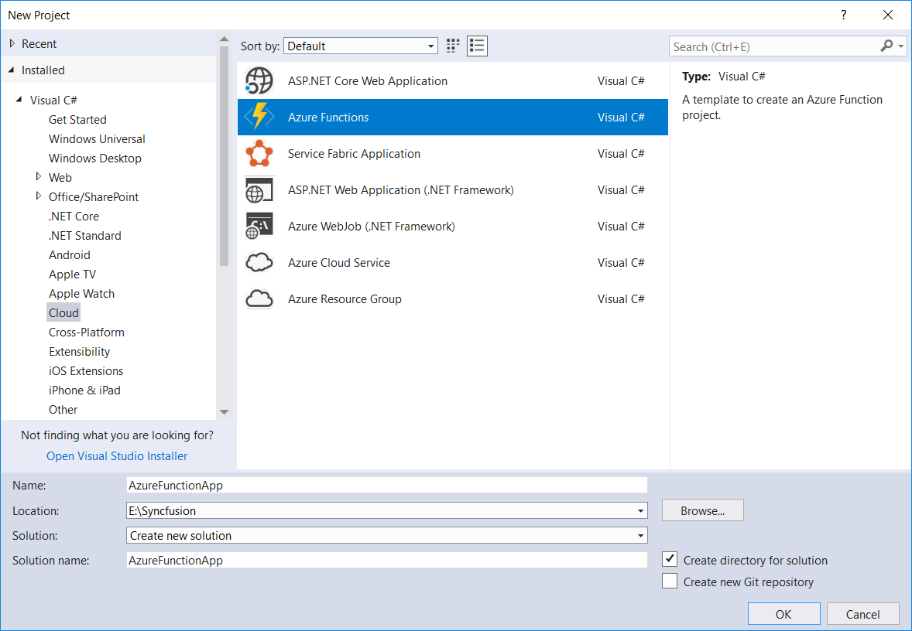
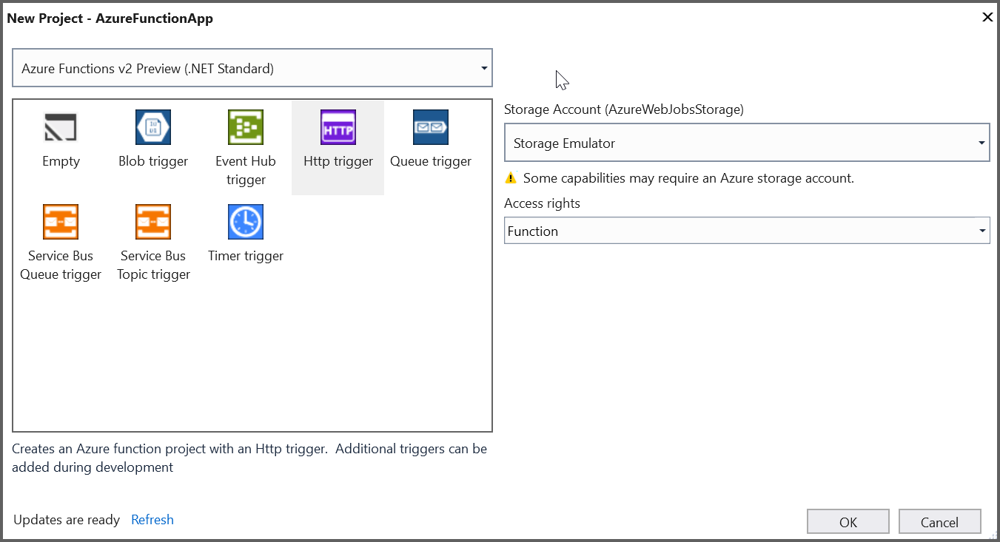
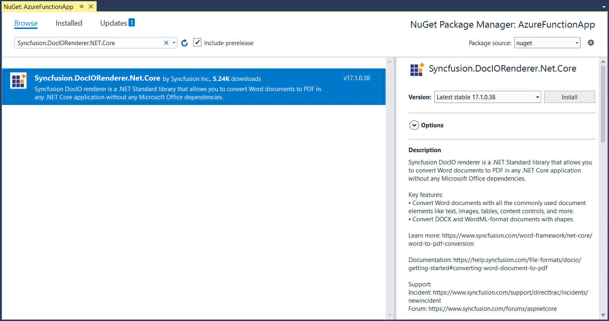
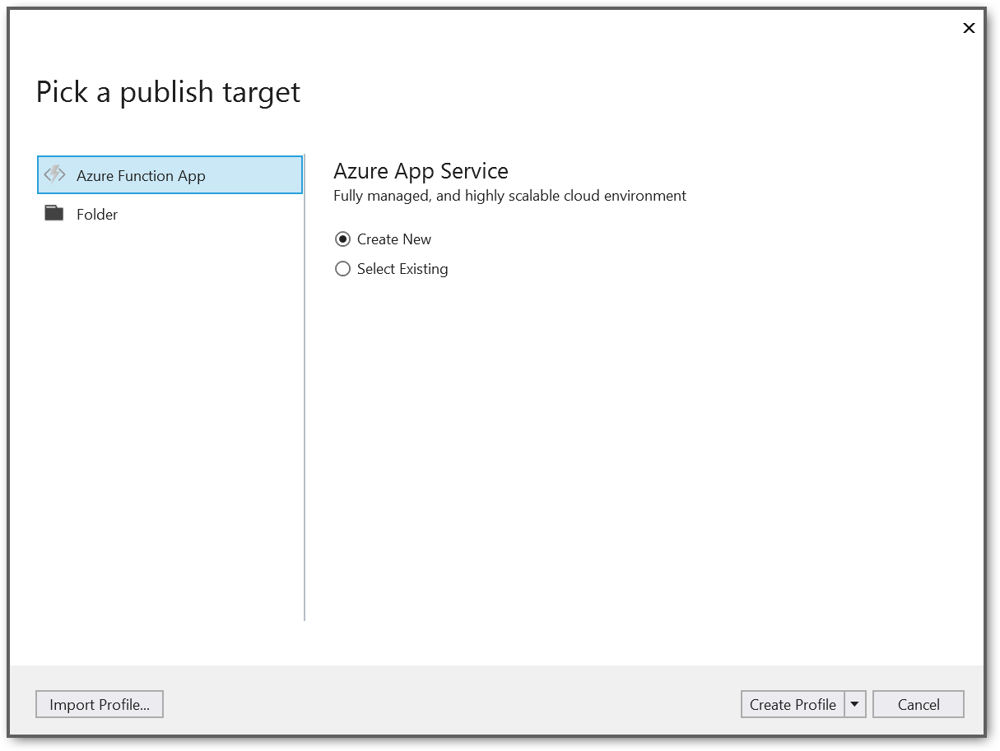
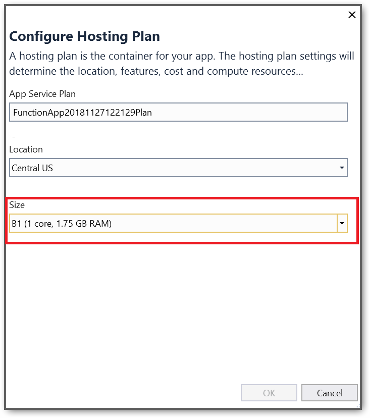
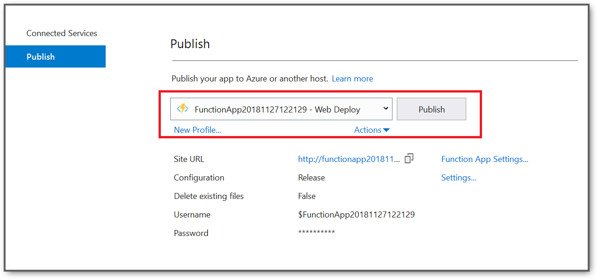

# How to mail merge Word documents and convert to PDF in Azure Functions v2

Syncfusion [.NET Word Library](https://www.syncfusion.com/document-processing/word-framework/net-core/word-library/mail-merge) generates personalized reports by mail merge on Word documents and convert it to PDF document in Azure functions using [Word to PDF converter](https://www.syncfusion.com/document-processing/word-framework/net-core/word-to-pdf-conversion).

## Steps to mail merge Word documents and convert to PDF in Azure functions v2 (.NET Standard):

Step 1: Create a new Azure functions project.

Step 2: Select framework **Azure Functions v2 (.NET Standard)** and select HTTP trigger as follows.

Step 3: Install the [Syncfusion.DocIORenderer.Net.Core](https://www.nuget.org/packages/Syncfusion.DocIORenderer.Net.Core) NuGet package as a reference to your project from the [NuGet.org](https://www.nuget.org/).

Step 4:Include the following namespaces in the **Function1.cs** file.



using Syncfusion.Pdf;
using Syncfusion.DocIO.DLS;
using Syncfusion.DocIORenderer;
using Syncfusion.DocIO;




Step 5: Add the following code snippet in **Run** method of **Function1** class to **mail merge Word documents** and **convert to PDF** in Azure functions and return the resultant **PDF document** to client end.





//JSON string
string jsonDataString = "{\"Reports\":[{\"SiteName\":\"Test Site Name\",\"SiteAddress\":\"Test Site Address\",\"ClientName\":\"Compliance 365\",\"Locations\":[{\"id\":\"1\",\"Name\":\"Location 1\",\"Description\":\"Test Description\"}]}]}";
//Gets JSON object from JSON string
JObject jsonObject = JObject.Parse(jsonDataString);
//Converts to IDictionary data from JSON object
IDictionary<string, object> data = GetData(jsonObject);
 
Stream stream = req.Content.ReadAsStreamAsync().Result;
//Opens the template document
WordDocument wordDocument = new WordDocument(stream, FormatType.Docx);
//Creates the mail merge data table in order to perform mail merge
MailMergeDataTable dataTable = new MailMergeDataTable("Reports", (List<object>)data["Reports"]);
//Performs the mail merge operation with the dynamic collection
wordDocument.MailMerge.ExecuteNestedGroup(dataTable);
//Create instance for DocIORenderer for Word to PDF conversion
DocIORenderer render = new DocIORenderer();
//Converts Word document to PDF.
PdfDocument pdfDocument = render.ConvertToPDF(wordDocument);
//Release the resources used by the Word document and DocIO Renderer objects
render.Dispose();
wordDocument.Dispose();
 
MemoryStream memoryStream = new MemoryStream();
//Saves the PDF file
pdfDocument.Save(memoryStream);
memoryStream.Position = 0;
//Create the response to return
HttpResponseMessage response = new HttpResponseMessage(HttpStatusCode.OK);
//Set the PDF document content response
response.Content = new ByteArrayContent(memoryStream.ToArray());
//Set the contentDisposition as attachment
response.Content.Headers.ContentDisposition = new ContentDispositionHeaderValue("attachment")
{    FileName = "Result.pdf"
};
//Set the content type as PDF format mime type
response.Content.Headers.ContentType = new System.Net.Http.Headers.MediaTypeHeaderValue("application/pdf");
 
//Return the response with output PDF stream
return response;




Step 6: Right-click the project and select **Publish**. Then, create a new profile in the Publish Window.

Step 7:Create an App service using Azure subscription and select a hosting plan.

Step 8:The Syncfusion DocIO library works from basic hosting plan (B1). So, select the required hosting plan.

Step 9:After creating the profile, click the Publish button.

Step 10: Now, go to Azure portal and select the Function Apps. After running the service, click the **Get function URL** and then click Copy.

Step 11: Paste the function URL in the client sample (which will request the Azure Function to **mail merge Word documents** and **convert to PDF** using the template Word document). You will get the output PDF document as follows.

Step 9:After creating the profile, click the Publish button.

A complete sample to **mail merge Word documents** and **convert to PDF in Azure Functions v2** can be downloaded from [Mail merge and Word to PDF conversion in Azure Functions v2](https://www.syncfusion.com/downloads/support/directtrac/general/ze/AzureFunctionApp1384767588.zip?_gl=1*199lhht*_ga*NTA2MDIxMjkzLjE2NzI3MzYzODM.*_ga_WC4JKKPHH0*MTY4NDIzOTEyNi4xMTcuMS4xNjg0MjQwNzUxLjYwLjAuMA..).

## Steps to post the request to Azure functions with a template Word document:

Step 1: Create a console application to request the Azure functions API.

Step 2: Add the following code snippet into the **Main** method to post the request to Azure functions with a template Word document to mail merge and get the resultant PDF document.




//Reads the template Word document
FileStream fs = new FileStream(@"../../Data/Adventure.docx", FileMode.Open, FileAccess.ReadWrite, FileShare.ReadWrite);
fs.Position = 0;
//Saves the Word document in memory stream
MemoryStream inputStream = new MemoryStream();
fs.CopyTo(inputStream);
inputStream.Position = 0;
 
try
{
    Console.WriteLine("Please enter your Azure Functions URL :");
    string functionURL = Console.ReadLine();
 
    //Create HttpWebRequest with hosted azure function URL               
    HttpWebRequest req = (HttpWebRequest)WebRequest.Create(functionURL);
    //Set request method as POST
    req.Method = "POST";
    //Get the request stream to save the Word document stream
    Stream stream = req.GetRequestStream();
    //Write the Word document stream into request stream
    stream.Write(inputStream.ToArray(), 0, inputStream.ToArray().Length);
 
    //Gets the responce from the Azure Function
    HttpWebResponse res = (HttpWebResponse)req.GetResponse();
 
    //Saves the Word document stream
    FileStream fileStream = File.Create("Result.pdf");
    res.GetResponseStream().CopyTo(fileStream);
    //Dispose the streams
    inputStream.Dispose();
    fileStream.Dispose();
}
catch (Exception ex)
{
    throw;
}





A console application to post the request to Azure functions can be downloaded from [WordToPDF.zip](https://www.syncfusion.com/downloads/support/directtrac/general/ze/WordToPDF849746481.zip?_gl=1*mw8204*_ga*NTA2MDIxMjkzLjE2NzI3MzYzODM.*_ga_WC4JKKPHH0*MTY4NDIzOTEyNi4xMTcuMS4xNjg0MjQwNzkyLjE5LjAuMA..)

Take a moment to peruse the [documentation](https://help.syncfusion.com/file-formats/docio/getting-started), where you can find basic Word document processing options along with features like [mail merge](https://help.syncfusion.com/file-formats/docio/working-with-mail-merge), [merge](https://help.syncfusion.com/file-formats/docio/word-document/merging-word-documents) and [split](https://help.syncfusion.com/file-formats/docio/word-document/split-word-documents) documents, [find and replace](https://help.syncfusion.com/file-formats/docio/working-with-find-and-replace) text in the Word document, [protect](https://help.syncfusion.com/file-formats/docio/working-with-security) the Word documents, and most importantly [PDF](https://help.syncfusion.com/file-formats/docio/word-to-pdf) and [Image](https://help.syncfusion.com/file-formats/docio/word-to-image) conversions with code examples.

Explore more about the rich set of Syncfusion [Word Framework](https://www.syncfusion.com/word-framework) features.

N> Starting with v16.2.0.x, if you reference Syncfusion assemblies from trial setup or from the NuGet feed, include a license key in your projects. Refer to [link](https://help.syncfusion.com/common/essential-studio/licensing/overview) to learn about generating and registering Syncfusion license key in your application to use the components without trail message.