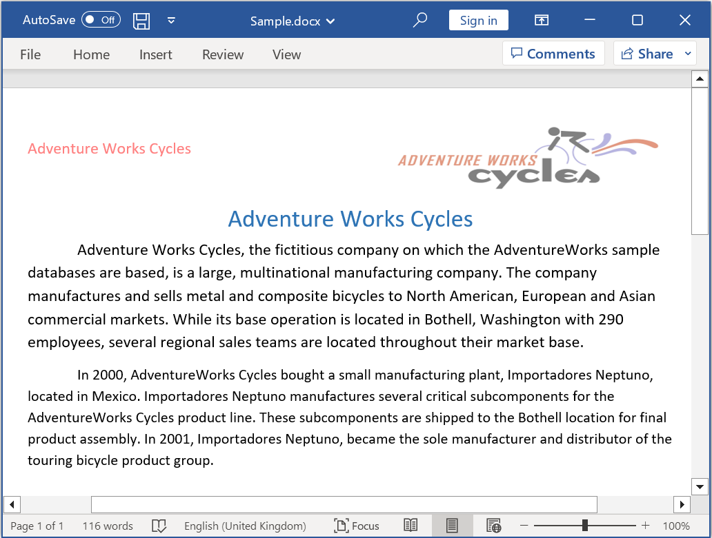

# Open and save Word document in ASP.NET Core

Syncfusion DocIO is a [.NET Core Word library](https://www.syncfusion.com/document-processing/word-framework/net-core/word-library) used to create, read, and edit **Word** documents programmatically without **Microsoft Word** or interop dependencies. Using this library, you can **open and save a Word document in ASP.NET Core**.

## Steps to open and save Word document programmatically:

Step 1: Create a new ASP.NET Core Web application project.

Step 2: Select Web Application pattern (Model-View-Controller) for the project.

Step 3: Install the [Syncfusion.DocIO.Net.Core](https://www.nuget.org/packages/Syncfusion.DocIO.Net.Core) NuGet package as a reference to your project from [NuGet.org](https://www.nuget.org/).

N> Starting with v16.2.0.x, if you reference Syncfusion assemblies from trial setup or from the NuGet feed, you also have to add "Syncfusion.Licensing" assembly reference and include a license key in your projects. Please refer to this [link](https://help.syncfusion.com/common/essential-studio/licensing/overview) to know about registering Syncfusion license key in your application to use our components.

Step 4: Include the following namespaces in the HomeController.cs file.





using Syncfusion.DocIO;
using Syncfusion.DocIO.DLS;





Step 5: A default action method named Index will be present in HomeController.cs. Right click on Index method and select **Go To View** where you will be directed to its associated view page **Index.cshtml**.

Step 6: Add a new button in the Index.cshtml as shown below.





@{Html.BeginForm("OpenAndSaveDocument", "Home", FormMethod.Get);
{

    <input type="submit" value="Open and Save Document" style="width:180px;height:27px" />

}
Html.EndForm();
}





Step 7: Add a new action method **OpenAndSaveDocument** in HomeController.cs and include the below code snippet to **open an existing Word document in ASP.NET Core**.




//Open the file as Stream.
using (FileStream docStream = new FileStream("Input.docx", FileMode.Open, FileAccess.Read))
{
    //Load the file stream into a Word document.
    using (WordDocument document = new WordDocument(docStream, FormatType.Docx))
    {

    }
}




Step 8: Add below code example to add a paragraph in the Word document.




//Access the section in a Word document
IWSection section = document.Sections[0];
//Add new paragraph to the section
IWParagraph paragraph = section.AddParagraph();
paragraph.ParagraphFormat.FirstLineIndent = 36;
paragraph.BreakCharacterFormat.FontSize = 12f;
//Add new text to the paragraph
IWTextRange textRange = paragraph.AppendText("In 2000, AdventureWorks Cycles bought a small manufacturing plant, Importadores Neptuno, located in Mexico. Importadores Neptuno manufactures several critical subcomponents for the AdventureWorks Cycles product line. These subcomponents are shipped to the Bothell location for final product assembly. In 2001, Importadores Neptuno, became the sole manufacturer and distributor of the touring bicycle product group.") as IWTextRange;
textRange.CharacterFormat.FontSize = 12f;




Step 9: Add below code example to save the Word document in ASP.NET Core.




//Save the Word document to MemoryStream.
MemoryStream stream = new MemoryStream();
document.Save(stream, FormatType.Docx);
stream.Position = 0;

//Download Word document in the browser.
return File(stream, "application/msword", "Sample.docx");




You can download a complete working sample from [GitHub](https://github.com/SyncfusionExamples/DocIO-Examples/tree/main/Read-and-Save-document/Open-and-save-Word-document/ASP.NET-Core)

By executing the program, you will get the **Word document** as follows.

