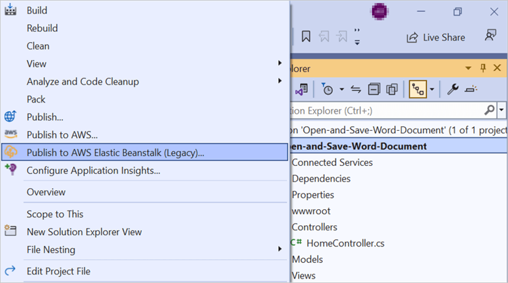
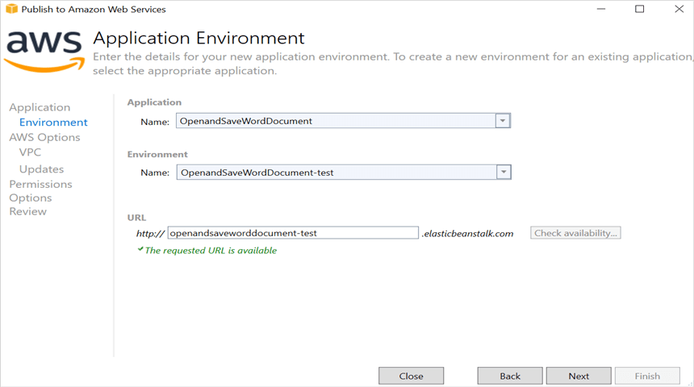
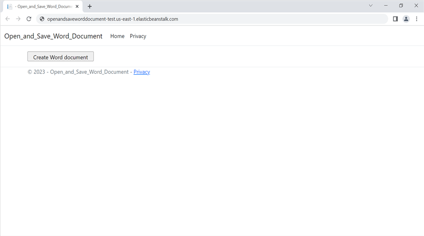

# Open and save Word document in AWS Elastic Beanstalk

Syncfusion Essential DocIO is a [.NET Core Word library](https://www.syncfusion.com/document-processing/word-framework/net-core/word-library) used to create, read, edit, and convert Word documents programmatically without **Microsoft Word** or interop dependencies. Using this library, you can **open and save a Word document in AWS Elastic Beanstalk**.

## Steps to open and save Word document in AWS Elastic Beanstalk

Step 1: Create a new ASP.NET Core Web application (Model-View-Controller) project.

Step 2: Install the [Syncfusion.DocIO.Net.Core](https://www.nuget.org/packages/Syncfusion.DocIO.Net.Core) NuGet package as a reference to your project from [NuGet.org](https://www.nuget.org/).

N> Starting with v16.2.0.x, if you reference Syncfusion assemblies from trial setup or from the NuGet feed, you also have to add "Syncfusion.Licensing" assembly reference and include a license key in your projects. Please refer to this [link](https://help.syncfusion.com/common/essential-studio/licensing/overview) to know about registering Syncfusion license key in your application to use our components.

Step 3: Include the following namespaces in the **HomeController.cs** file.




using Syncfusion.DocIO;
using Syncfusion.DocIO.DLS;




Step 4: A default action method named Index will be present in HomeController.cs. Right click on Index method and select **Go To View** where you will be directed to its associated view page **Index.cshtml**.

Step 5: Add a new button in the **Index.cshtml** as shown below.




@{
    Html.BeginForm("CreateWordDocument", "Home", FormMethod.Get);
    {
        

            <input type="submit" value="Create Word document" style="width:200px;height:27px" />
        

    }
    Html.EndForm();
}




Step 6: Add a new action method **OpenAndSaveDocument** in HomeController.cs and include the below code snippet to **open an existing Word document**.




//Open the file as Stream.
using FileStream docStream = new FileStream(Path.GetFullPath("wwwroot/Data/Input.docx"), FileMode.Open, FileAccess.Read);
//Load the file stream into a Word document.
using WordDocument document = new WordDocument(docStream, FormatType.Docx);




Step 7: Add below code example to add a paragraph in the Word document.




//Access the section in a Word document.
IWSection section = document.Sections[0];
//Add new paragraph to the section.
IWParagraph paragraph = section.AddParagraph();
paragraph.ParagraphFormat.FirstLineIndent = 36;
paragraph.BreakCharacterFormat.FontSize = 12f;
//Add new text to the paragraph.
IWTextRange textRange = paragraph.AppendText("In 2000, AdventureWorks Cycles bought a small manufacturing plant, Importadores Neptuno, located in Mexico. Importadores Neptuno manufactures several critical subcomponents for the AdventureWorks Cycles product line. These subcomponents are shipped to the Bothell location for final product assembly. In 2001, Importadores Neptuno, became the sole manufacturer and distributor of the touring bicycle product group.") as IWTextRange;
textRange.CharacterFormat.FontSize = 12f;




Step 8: Add below code example to **save the Word document**.




//Save the Word document to MemoryStream.
MemoryStream stream = new MemoryStream();
document.Save(stream, FormatType.Docx);
//Download Word document in the browser.
return File(stream, "application/msword", "Sample.docx");




## Steps to publish in AWS Elastic Beanstalk

Step 1: Right-click the project and select **Publish to AWS Elastic Beanstalk (Legacy)** option.

Step 2: Select the **Deployment Target** as **Create a new application environment** and click **Next** button.

Step 3: Choose the **Environment Name** in the dropdown list and the **URL** will be automatically assign and check the URL is available, if available click next otherwise change the **URL**. 

Step 4: Select the instance type in **t3a.micro** from the dropdown list and click next.

Step 5: Select the required permission from both the **Deployed Application Permission** and **Service Permissions** dropdown boxes, and then click the **Next** button to proceed further.

Step 6: Set the additional build and deployment options, and then click the **Next** button.

Step 7: After changing the status from **Updating** to **Environment is healthy**, click the **URL** to open webpage.

Step 8: After changing the status from **Updating** to **Environment is healthy**, click the **URL**.

Step 9: After opening the provided **URL**, click **Create Word Document** button to download the Word document.
 

You can download a complete working sample from GitHub.

By executing the program, you will get the **Word document** as follows.

Click [here](https://www.syncfusion.com/document-processing/word-framework/net-core) to explore the rich set of Syncfusion Word library (DocIO) features.