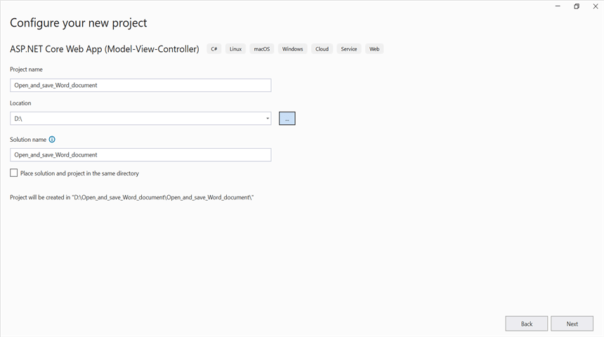
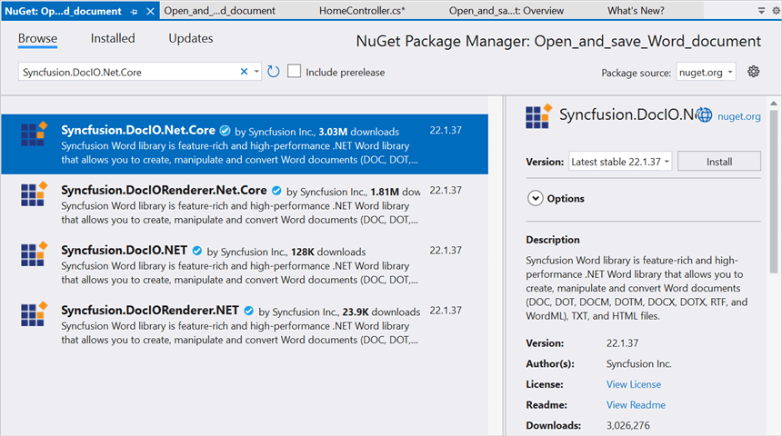
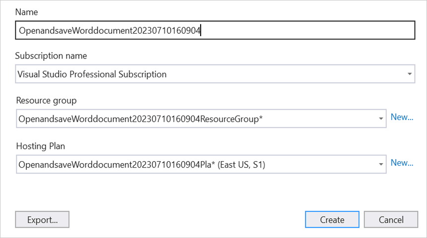
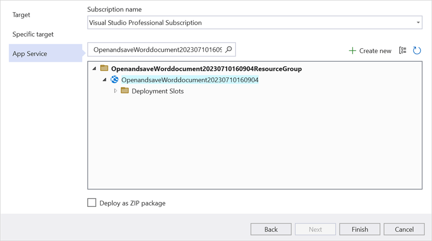
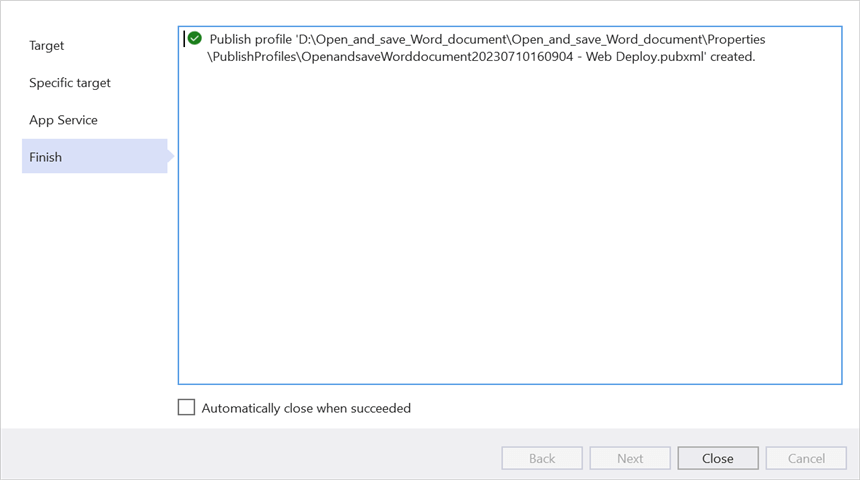
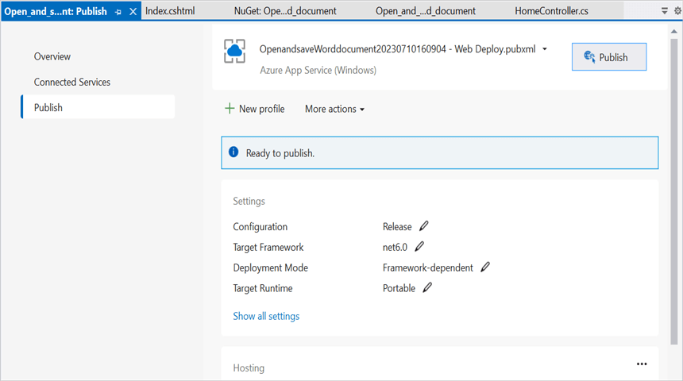
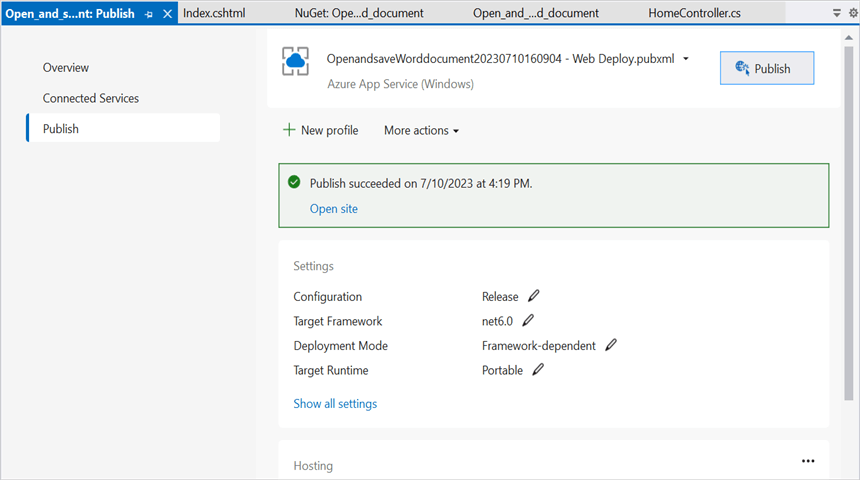
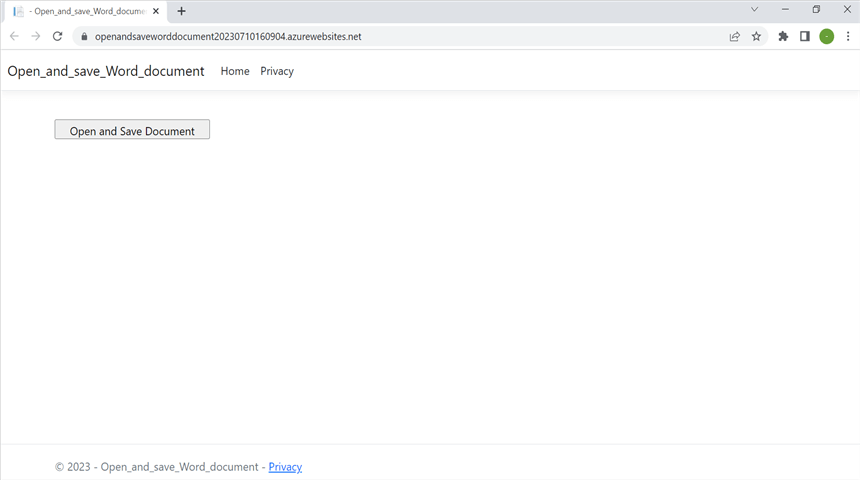

# Open and save Word document in Azure App Service on Windows

Syncfusion DocIO is a [.NET Core Word library](https://www.syncfusion.com/document-processing/word-framework/net/word-library) used to create, read, edit and convert Word documents programmatically without **Microsoft Word** or interop dependencies. Using this library, you can **open and save Word document in Azure App Service on Windows**.

## Steps to open and save Word document in Azure App Service on Windows

Step 1: Create a new ASP.NET Core Web App (Model-View-Controller).

Step 2: Create a project name and select the location.

Step 3: Click **Create** button.

Step 4: Install the [Syncfusion.DocIO.Net.Core](https://www.nuget.org/packages/Syncfusion.DocIO.Net.Core) NuGet package as a reference to your project from [NuGet.org](https://www.nuget.org/).

N> Starting with v16.2.0.x, if you reference Syncfusion assemblies from trial setup or from the NuGet feed, you also have to add "Syncfusion.Licensing" assembly reference and include a license key in your projects. Please refer to this [link](https://help.syncfusion.com/common/essential-studio/licensing/overview) to know about registering Syncfusion license key in your application to use our components.

Step 5: Add a new button in the **Index.cshtml** as shown below.




@{
    Html.BeginForm("OpenAndSaveDocument", "Home", FormMethod.Get);
    {
        

             
            <input type="submit" value="Open and Save Document" style="width:230px;height:27px" />
        

    }
    Html.EndForm();
}




Step 6: Include the following namespaces in **HomeController.cs**.




using Syncfusion.DocIO;
using Syncfusion.DocIO.DLS;




Step 7: Add a new action method **OpenAndSaveDocument** in HomeController.cs and include the below code snippet to **open an existing Word document**.




string filePath = Path.Combine(_hostingEnvironment.WebRootPath, "Data/Input.docx");
using (FileStream docStream1 = new FileStream(filePath, FileMode.Open, FileAccess.Read));
using (WordDocument document = new WordDocument(docStream, FormatType.Docx));




Step 8: Add below code example to add a paragraph in the Word document.




//Access the section in a Word document.
IWSection section = document.Sections[0];
//Add new paragraph to the section.
IWParagraph paragraph = section.AddParagraph();
paragraph.ParagraphFormat.FirstLineIndent = 36;
paragraph.BreakCharacterFormat.FontSize = 12f;
//Add new text to the paragraph.
IWTextRange textRange = paragraph.AppendText("In 2000, AdventureWorks Cycles bought a small manufacturing plant, Importadores Neptuno, located in Mexico. Importadores Neptuno manufactures several critical subcomponents for the AdventureWorks Cycles product line. These subcomponents are shipped to the Bothell location for final product assembly. In 2001, Importadores Neptuno, became the sole manufacturer and distributor of the touring bicycle product group.") as IWTextRange;
textRange.CharacterFormat.FontSize = 12f;




Step 9: Add below code example to **save the Word document**.




//Save the Word document to MemoryStream.
MemoryStream stream = new MemoryStream();
document.Save(stream, FormatType.Docx);
stream.Position = 0;
//Download Word document in the browser.
return File(stream, "application/msword", "Sample.docx");




## Steps to publish as Azure App Service on Windows

Step 1: Right-click the project and select **Publish** option.

Step 2: Click the **Add a Publish Profile** button.

Step 3: Select the publish target as **Azure**.

Step 4: Select the Specific target as **Azure App Service (Windows)**.

Step 5: To create a new app service, click **Create new** option.

Step 6: Click the **Create** button to proceed with **App Service** creation.

Step 7: Click the **Finish** button to finalize the **App Service** creation.

Step 8: Click **Close** button.

Step 9: Click the **Publish** button.

Step 10: Now, Publish has been succeeded.

Step 11: Now, the published webpage will open in the browser. 

Step 12: Click **Open and Save Document** button.You will get the output **Word document** as follows.

You can download a complete working sample from [GitHub](https://github.com/SyncfusionExamples/DocIO-Examples/tree/main/Read-and-Save-document/Open-and-save-Word-document/Azure/Azure_App_Service).

Click [here](https://www.syncfusion.com/document-processing/word-framework/net-core) to explore the rich set of Syncfusion Word library (DocIO) features.