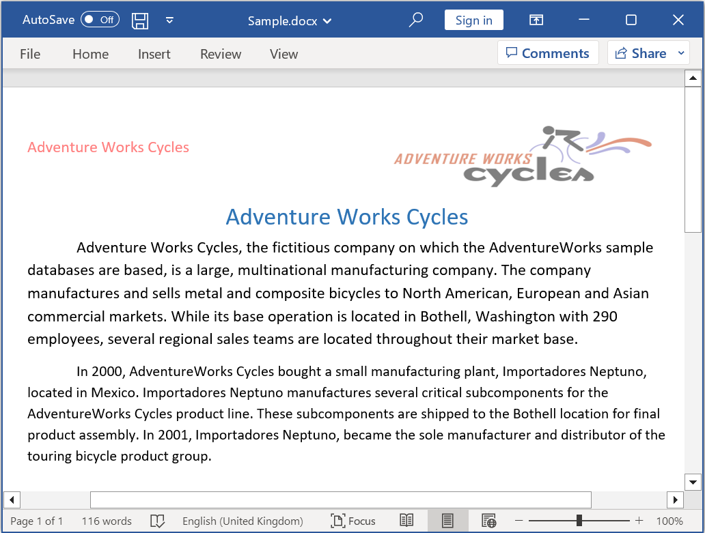

# Open and save Word document in Azure Functions v4

Syncfusion DocIO is a [.NET Core Word library](https://www.syncfusion.com/document-processing/word-framework/net/word-library) used to create, read, edit and convert Word documents programmatically without **Microsoft Word** or interop dependencies. Using this library, you can **open and save Word document in Azure Functions v4**.

## Steps to open and save Word document in Azure Functions v4

Step 1: Create a new Azure Functions project.

Step 2: Create a project name and select the location.

Step 3: Select function worker as **.NET 6.0(Long-term support)**.

Step 4: Install the [Syncfusion.DocIO.Net.Core](https://www.nuget.org/packages/Syncfusion.DocIO.Net.Core) NuGet package as a reference to your project from [NuGet.org](https://www.nuget.org/).

N> Starting with v16.2.0.x, if you reference Syncfusion assemblies from trial setup or from the NuGet feed, you also have to add "Syncfusion.Licensing" assembly reference and include a license key in your projects. Please refer to this [link](https://help.syncfusion.com/common/essential-studio/licensing/overview) to know about registering Syncfusion license key in your application to use our components.

Step 5: Include the following namespaces in the **Function1.cs** file.




using Syncfusion.DocIO;
using Syncfusion.DocIO.DLS;




Step 6: Add the following code snippet in **Run** method of **Function1** class to perform ***open an existing Word document**.




//Gets the input Word document as stream from request
Stream stream = req.Content.ReadAsStreamAsync().Result;
//Loads an existing Word document
using WordDocument document = new WordDocument(stream,FormatType.Docx);
       



Step 7: Add below code example to add a paragraph in the Word document.




//Access the section in a Word document.
IWSection section = document.Sections[0];
//Add a new paragraph to the section.
IWParagraph paragraph = section.AddParagraph();
paragraph.ParagraphFormat.FirstLineIndent = 36;
paragraph.BreakCharacterFormat.FontSize = 12f;
IWTextRange text = paragraph.AppendText("In 2000, Adventure Works Cycles bought a small manufacturing plant, Importadores Neptuno, located in Mexico. Importadores Neptuno manufactures several critical subcomponents for the Adventure Works Cycles product line. These subcomponents are shipped to the Bothell location for final product assembly. In 2001, Importadores Neptuno, became the sole manufacturer and distributor of the touring bicycle product group.");
text.CharacterFormat.FontSize = 12f;




Step 8: Add below code example to **save the Word document**.




 MemoryStream memoryStream = new MemoryStream();
//Saves the Word document file.
document.Save(memoryStream, FormatType.Docx);
//Reset the memory stream position.
memoryStream.Position = 0;
//Create the response to return.
HttpResponseMessage response = new HttpResponseMessage(HttpStatusCode.OK);
//Set the Word document saved stream as content of response.
response.Content = new ByteArrayContent(memoryStream.ToArray());
//Set the contentDisposition as attachment.
response.Content.Headers.ContentDisposition = new ContentDispositionHeaderValue("attachment")
{
    FileName = "Sample.docx"
};
//Set the content type as Word document mime type.
response.Content.Headers.ContentType = new System.Net.Http.Headers.MediaTypeHeaderValue("application/docx");
//Return the response with output Word document stream.
return response;




Step 9: Right click the project and select **Publish**. Then, create a new profile in the Publish Window.

Step 10: Select the target as **Azure** and click **Next** button.

Step 11: Select the **Create new** button.

Step 12: Click **Create** button. 

Step 13: After creating app service then click **Finish** button. 

Step 14: Click the **Publish** button.

Step 15: Publish has been succeed.

Step 16: After publishing your Azure Function, go to the [Azure portal](https://portal.azure.com) and locate the Function App that hosts your function. In the function app, you can see the list of all available functions in the app.

Step 17: Find the function for which you want to obtain the URL and click on its name. This will open the Function Overview page for that specific function.

Step 18: On the Function Overview page, you will find a Get function URL button. Clicking on it will reveal the URL specific to that function. Copy that **URL** and run the console application. Then, paste the URL into the console application, this will trigger your Function to **open and save a Word document**.

By executing the program, you will get the **Word document** as follows.

## Steps to post the request to Azure Functions

Step 1: Create a console application to request the Azure Functions API.

Step 2: Add the following code snippet into **Main** method to post the request to Azure Functions with template Word document and get the resultant Word document.




//Reads the template Word document.
FileStream fs = new FileStream(@"../../Data/Input.docx", FileMode.Open, FileAccess.ReadWrite, FileShare.ReadWrite);
fs.Position = 0;
//Saves the Word document in memory stream.
MemoryStream inputStream = new MemoryStream();
fs.CopyTo(inputStream);
inputStream.Position = 0;
try
{
    Console.WriteLine("Please enter your Azure Functions URL :");
    string functionURL = Console.ReadLine();

    //Create HttpWebRequest with hosted azure functions URL.    
    HttpWebRequest req = (HttpWebRequest)WebRequest.Create(functionURL);
    //Set request method as POST.
    req.Method = "POST";
    //Get the request stream to save the Word document stream.
    Stream stream = req.GetRequestStream();
    //Write the Word document stream into request stream.
    stream.Write(inputStream.ToArray(), 0, inputStream.ToArray().Length);

    //Gets the responce from the Azure Functions.
    HttpWebResponse res = (HttpWebResponse)req.GetResponse();

    //Saves the Word document stream.
    FileStream fileStream = File.Create("Sample.docx");
    res.GetResponseStream().CopyTo(fileStream);
    //Dispose the streams.
    inputStream.Dispose();
    fileStream.Dispose();
}
catch (Exception ex)
{
    throw;
}




From GitHub, you can download the [console application](https://github.com/SyncfusionExamples/DocIO-Examples/tree/main/Read-and-Save-document/Open-and-save-Word-document/Azure/Azure_Functions/Console_Application) and [Azure Functions v4](https://github.com/SyncfusionExamples/DocIO-Examples/tree/main/Read-and-Save-document/Open-and-save-Word-document/Azure/Azure_Functions/Azure_Functions_v4).

Click [here](https://www.syncfusion.com/document-processing/word-framework/net-core) to explore the rich set of Syncfusion Word library (DocIO) features.
