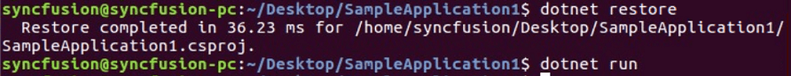

# Open and Save Word document on Linux

Syncfusion DocIO is a [.NET Core Word library](https://www.syncfusion.com/document-processing/word-framework/net-core/word-library) used to **create, read, and edit Word documents** programmatically without **Microsoft Word** or interop dependencies. Using this library, you can **open and save a Word document in .NET Core application on Linux**.

## Steps to open and save Word document programmatically in .NET Core application on Linux

Step 1: Execute the following command in Linux terminal to create a new .NET Core Console application.





dotnet new console





Step 2: Install the [Syncfusion.DocIO.Net.Core](https://www.nuget.org/packages/Syncfusion.DocIO.Net.Core) NuGet package as a reference to your project from [NuGet.org](https://www.nuget.org/) by execute the following command.





dotnet add package Syncfusion.DocIO.Net.Core -v 17.4.0.39 -s https://www.nuget.org/





N> Starting with v16.2.0.x, if you reference Syncfusion assemblies from trial setup or from the NuGet feed, you also have to add "Syncfusion.Licensing" assembly reference and include a license key in your projects. Please refer to this [link](https://help.syncfusion.com/common/essential-studio/licensing/overview) to know about registering Syncfusion license key in your applications to use our components.

Step 3: Add the following Namespaces in Program.cs file.




using Syncfusion.DocIO;
using Syncfusion.DocIO.DLS;




Step 4: Add the following code snippet in Program.cs file to **open an existing Word document**.




//Open an existing Word document.
WordDocument document = new WordDocument(new FileStream("Input.docx", FileMode.Open, FileAccess.Read));




Step 5: Add below code example to add a paragraph in the Word document.




//Access the section in a Word document.
IWSection section = document.Sections[0];
//Add a new paragraph to the section.
IWParagraph paragraph = section.AddParagraph();
paragraph.ParagraphFormat.FirstLineIndent = 36;
paragraph.BreakCharacterFormat.FontSize = 12f;
IWTextRange text = paragraph.AppendText("In 2000, Adventure Works Cycles bought a small manufacturing plant, Importadores Neptuno, located in Mexico. Importadores Neptuno manufactures several critical subcomponents for the Adventure Works Cycles product line. These subcomponents are shipped to the Bothell location for final product assembly. In 2001, Importadores Neptuno, became the sole manufacturer and distributor of the touring bicycle product group.");
text.CharacterFormat.FontSize = 12f;




Step 6: Add below code example to **save the Word document in .NET Core application on Linux**.




//Create a FileStream to save the Word file.
FileStream outputStream = new FileStream("Result.docx", FileMode.Create, FileAccess.ReadWrite, FileShare.ReadWrite);
//Save the Word file.
document.Save(outputStream, FormatType.Docx);
//Close the Word file.
document.Close();
outputStream.Flush();
outputStream.Dispose();




Step 7: Execute the following command to restore the NuGet packages.





dotnet restore





Step 8: Execute the following command in terminal to run the application.





dotnet run





You can download a complete working sample from [GitHub](https://github.com/SyncfusionExamples/DocIO-Examples/tree/main/Read-and-Save-document/Open-and-save-Word-document/Linux).

By executing the program, you will get the **Word document** as follows. The output will be saved in parallel to program.cs file.

