# Supported symbols using LaTeX in Word Library
The .NET Word (DocIO) library allows to insert below supported symbols in equation using **LaTeX**.

## Arrows

The following image demonstrates the LaTeX supported in .NET Word Library to create arrow symbols.

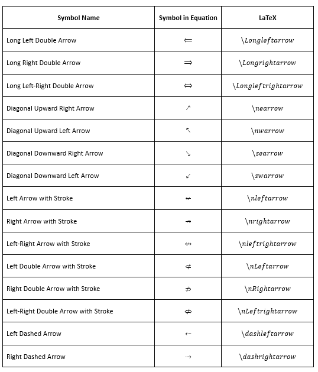
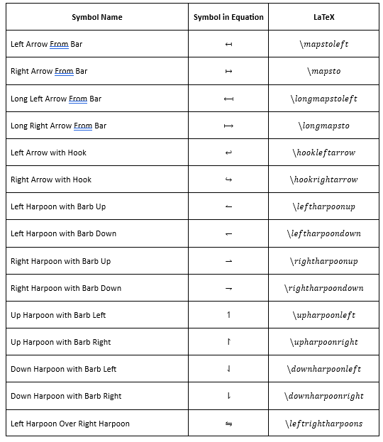

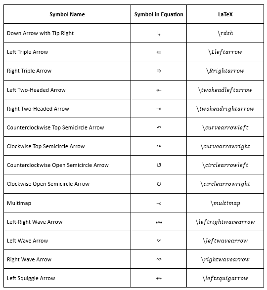

## Basic Math

The following image demonstrates the LaTeX supported in .NET Word Library to create basic math symbols.

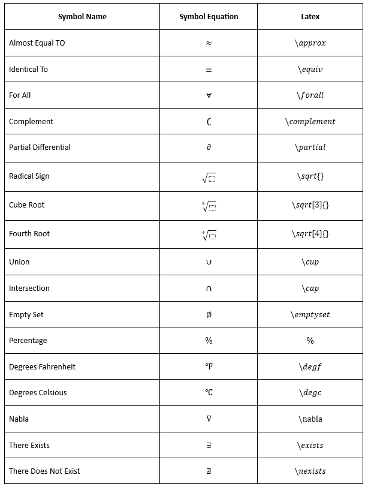
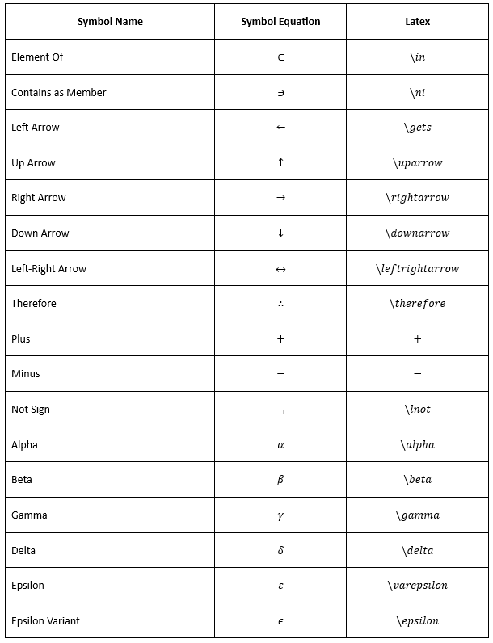

## Geometry

The following image demonstrates the LaTeX equivalent to geometry.

## Greek Letter

### Lower Case

The following image demonstrates the LaTeX supported in .NET Word Library to create lower case Greek letters.

### Upper Case

The following image demonstrates the LaTeX supported in .NET Word Library to create upper case Greek letters.

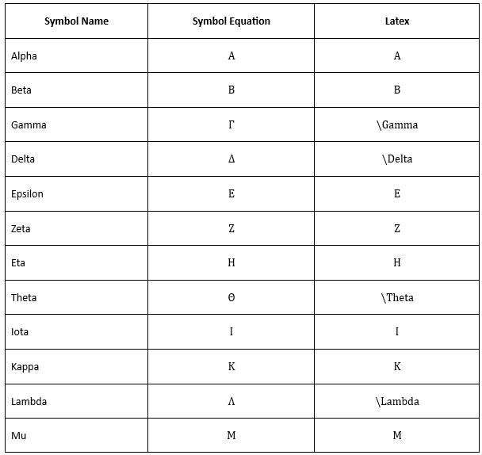

## Letter-Like Symbols

The following image demonstrates the LaTeX supported in .NET Word Library to create letter-like symbols.

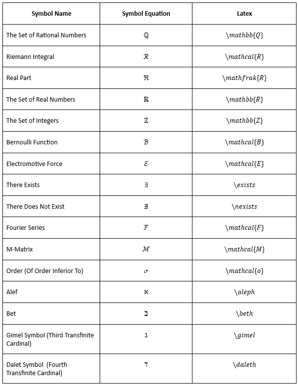

## Negated Relations

The following image demonstrates the LaTeX supported in .NET Word Library to create negated relations.

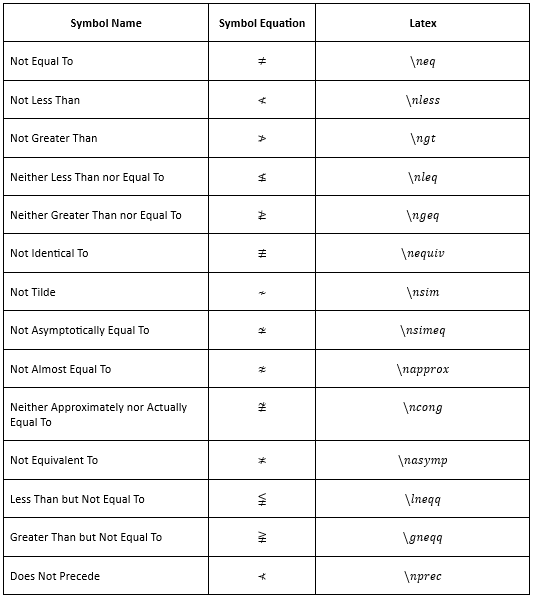
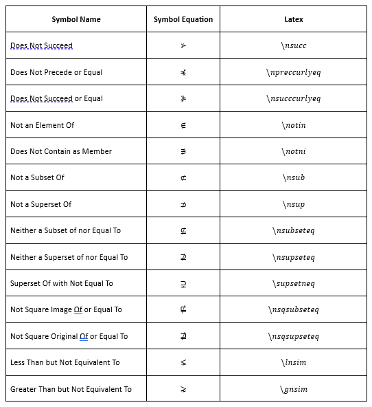

## Operators

### Common Binary Operators

The following image demonstrates the LaTeX supported in .NET Word Library to create common binary operators.

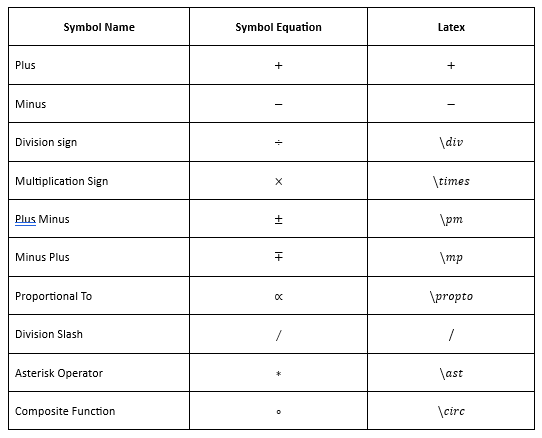

### Common Relational Operators

The following image demonstrates the LaTeX supported in .NET Word Library to common relational operators.

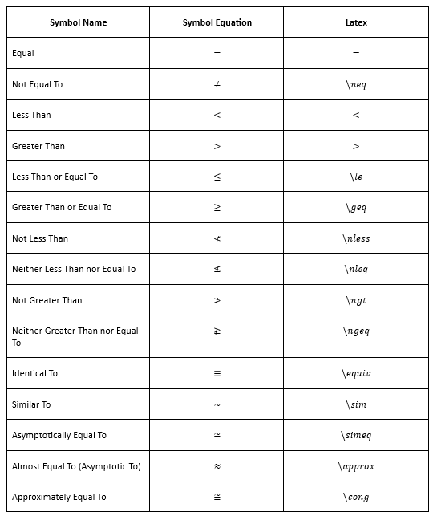
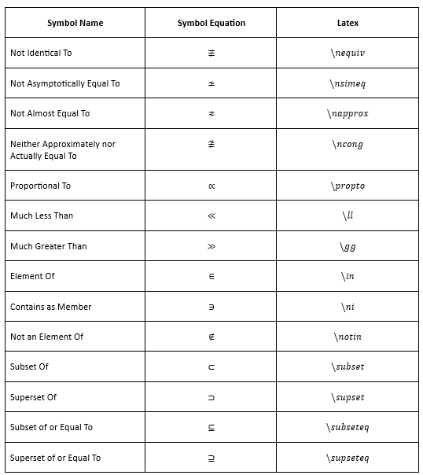

### Basic N-ary Operators

The following image demonstrates the LaTeX supported in .NET Word Library to basic N-ary operators.

### Advanced Binary Operators

The following image demonstrates the LaTeX supported in .NET Word Library to advanced binary operators.

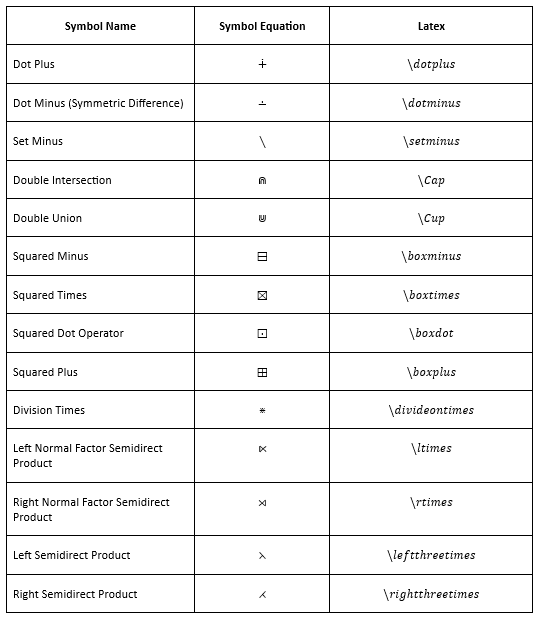

### Advanced Relational Operators

The following image demonstrates the LaTeX supported in .NET Word Library to advanced relational operators.

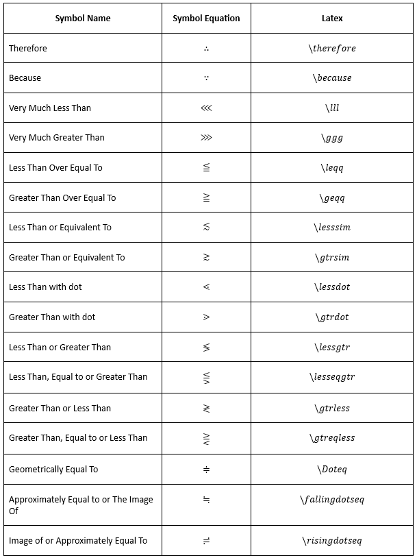

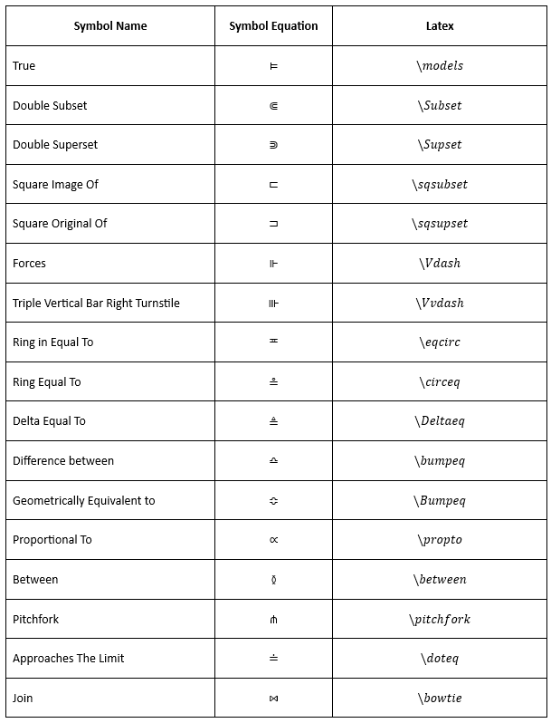

