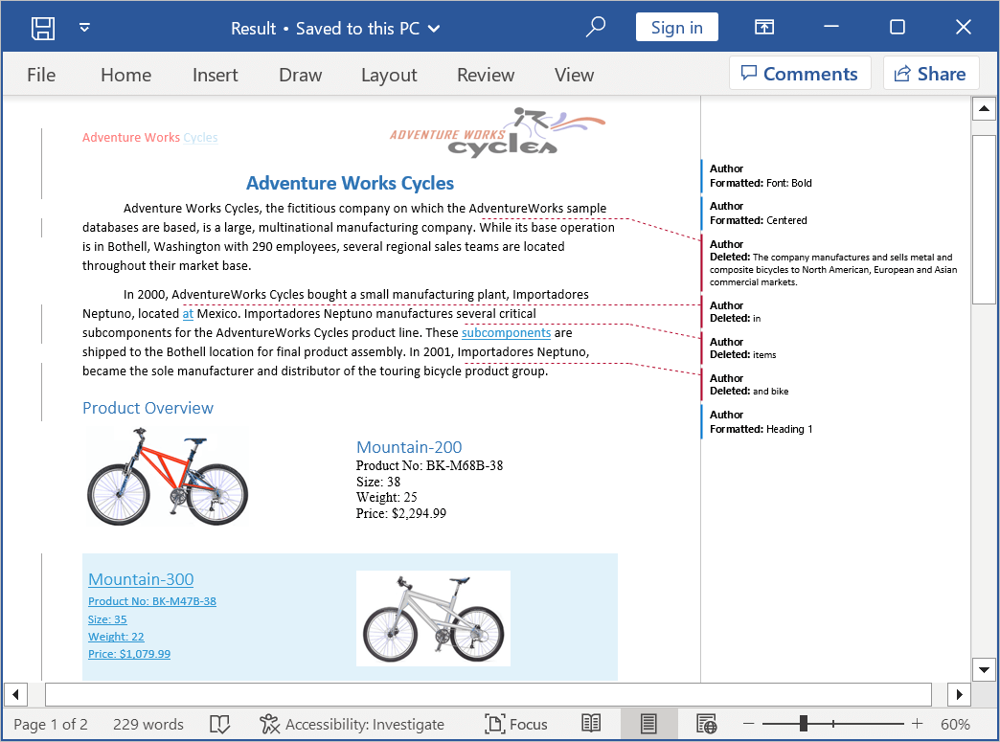
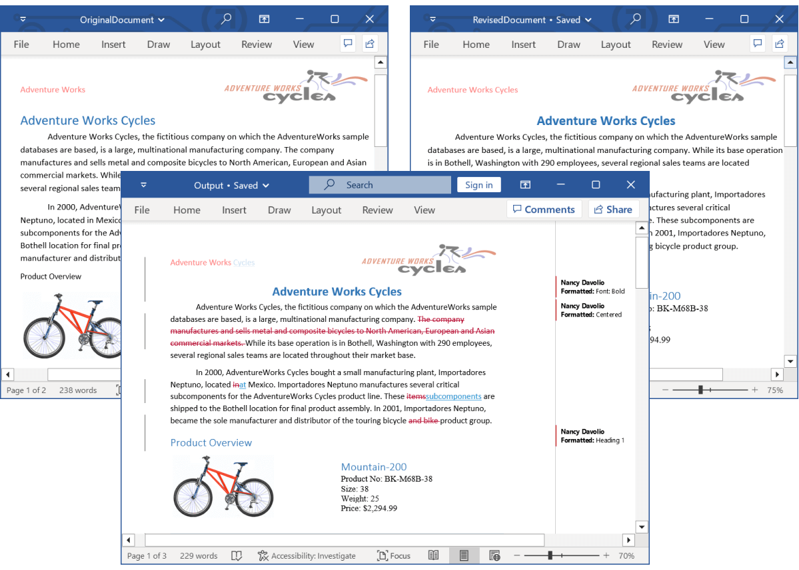
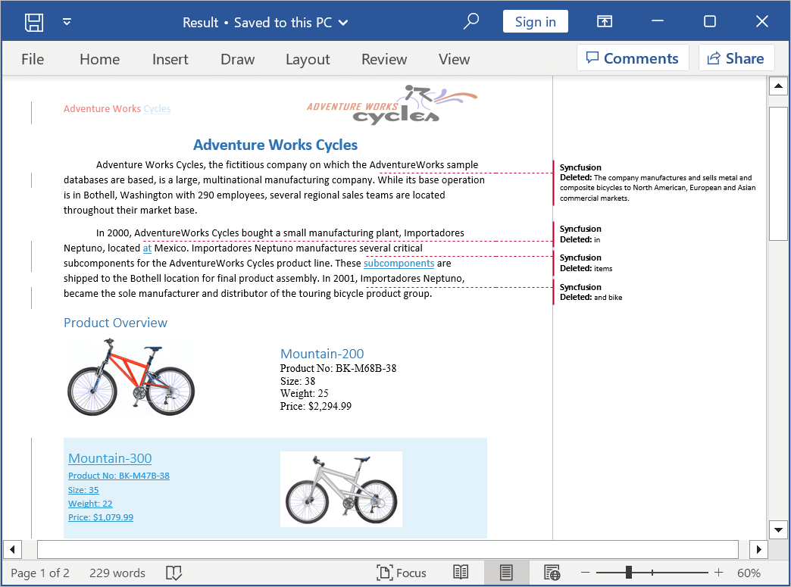

# Compare Word documents in C#

Comparing two Word documents allows you to identify the changes between two versions of a document. The .NET Word library (DocIO) enables you to compare two Word documents and highlight the following changes as tracked changes.
*	Insertions
*	Deletions
*	Formatting

N> 1. DocIO performs word level comparison while comparing two Word documents.In this scenario, if a single character in a word is changed, the entire word will be highlighted as changed.
N> 2. Comparing two Word documents supported in DOCX format only.
N> 3. Converting PowerPoint slides to images based on animation effects is not supported on the UWP platform.

## Compare two Word documents 

Compare the existing Word documents or documents created from scratch using the Compare method in the .NET Word library (DocIO).

The following code example illustrates how to compare two Word documents.




//Load the original document.
using (FileStream originalDocumentStreamPath = new FileStream("Data/OriginalDocument.docx", FileMode.Open, FileAccess.Read))
{
    using (WordDocument originalDocument = new WordDocument(originalDocumentStreamPath, FormatType.Docx))
    {
        //Load the revised document.
        using (FileStream revisedDocumentStreamPath = new FileStream("Data/RevisedDocument.docx", FileMode.Open, FileAccess.Read))
        {
            using (WordDocument revisedDocument = new WordDocument(revisedDocumentStreamPath, FormatType.Docx))
            {
                // Compare the original and revised Word documents.
                originalDocument.Compare(revisedDocument);

                //Save the Word document to MemoryStream
                MemoryStream stream = new MemoryStream();
                originalDocument.Save(stream, FormatType.Docx);
            }
        }                 
    }                           
}




//Load the original document.
using (WordDocument originalDocument = new WordDocument("Data/OriginalDocument.docx", FormatType.Docx))
{
    //Load the revised document.
    using (WordDocument revisedDocument = new WordDocument("Data/RevisedDocument.docx", FormatType.Docx))
   {
        // Compare the original and revised Word documents.
        originalDocument.Compare(revisedDocument);
        //Save the Word document.
        originalDocument.Save("Result.docx");          
    }
}




' Load the original document.
Using originalDocument As New WordDocument("Data/OriginalDocument.docx", FormatType.Docx)
    ' Load the revised document.
    Using revisedDocument As New WordDocument("Data/RevisedDocument.docx", FormatType.Docx)
        ' Compare the original document and revised documents.
        originalDocument.Compare(revisedDocument)
        ' Save the Word document.
        originalDocument.Save("Result.docx")
    End Using
End Using




## Set Author and Date 

Compare the two Word documents by setting the author and date for revisions to identify the changes. In DocIO, the default setting for the "author" field is "Author", and the default setting for the "dateTime" field is the current time.

The following code example shows how to set the author and date for revision while comparing two Word documents.




//Load the original document.
using (FileStream originalDocumentStreamPath = new FileStream("Data/OriginalDocument.docx", FileMode.Open, FileAccess.Read))
{
    using (WordDocument originalDocument = new WordDocument(originalDocumentStreamPath, FormatType.Docx))
    {
        //Load the revised document.
        using (FileStream revisedDocumentStreamPath = new FileStream("Data/RevisedDocument.docx", FileMode.Open, FileAccess.Read))
        {
            using (WordDocument revisedDocument = new WordDocument(revisedDocumentStreamPath, FormatType.Docx))
            {
                // Compare the original and revised Word documents.
                originalDocument.Compare(revisedDocument,"Nancy Davolio", DateTime.Now.AddDays(-1));

                //Save the Word document to MemoryStream
                MemoryStream stream = new MemoryStream();
                originalDocument.Save(stream, FormatType.Docx);
            }
        }                 
    }                           
}




//Load the original document.
using (WordDocument originalDocument = new WordDocument("Data/OriginalDocument.docx", FormatType.Docx))
{
    //Load the revised document.
    using (WordDocument revisedDocument = new WordDocument("Data/RevisedDocument.docx", FormatType.Docx))
   {
        // Compare the original document and revised documents.
        originalDocument.Compare(revisedDocument,"Nancy Davolio", DateTime.Now.AddDays(-1));
        //Save the Word document.
        originalDocument.Save("Result.docx");          
    }
}




' Open the original Word document.
Using originalDocument As New WordDocument(originalFilePath, FormatType.Docx)
    ' Open the revised Word document.
    Using revisedDocument As New WordDocument(revisedFilePath, FormatType.Docx)
        ' Compare the original document with the revised document.
        originalDocument.Compare(revisedDocument, "Nancy Davolio", DateTime.Now.AddDays(-1))
        ' Save the Word document.
        originalDocument.Save(resultFilePath)
    End Using
End Using




## Comparison options

You can customize the Word comparison using our ComparisonOptions in the DocIO.

### Ignore format changes

In the .NET Word library (DocIO), document comparison includes formatting changes by default. However, you can configure DocIO to ignore formatting differences using the DetectFormatChanges API to concentrate solely on content modifications.

The following code example illustrates how to compare two Word documents by ignoring the format changes.




//Load the original document
using (FileStream originalDocumentStreamPath = new FileStream("OriginalDocument.docx", FileMode.Open, FileAccess.Read))
{
    using (WordDocument originalDocument = new WordDocument(originalDocumentStreamPath, FormatType.Docx))
    {
        //Load the revised document
        using (FileStream revisedDocumentStreamPath = new FileStream("RevisedDocument.docx", FileMode.Open, FileAccess.Read, FileShare.ReadWrite))
        {
            using (WordDocument revisedDocument = new WordDocument(revisedDocumentStreamPath, FormatType.Automatic))
            {
                //Set the Comparison option to detect format changes, whether to detect format changes while comparing two Word documents.
                ComparisonOptions compareOptions = new ComparisonOptions();
                compareOptions.DetectFormatChanges = false;
                //Compare the original document with the revised document
                originalDocument.Compare(revisedDocument, "Syncfusion", DateTime.Now, compareOptions);
                //Save the Word document to MemoryStream
                using (MemoryStream stream = new MemoryStream())
                {
                    originalDocument.Save(stream, FormatType.Docx);
                }
            }
        }
    }
}




//Load the original document 
using (WordDocument originalDocument = new WordDocument("OriginalDocument.docx"))
{
    //Load the revised document
    using (WordDocument revisedDocument = new WordDocument("RevisedDocument.docx"))
    {
        //Set the Comparison option detect format changes, whether to detect format changes while comparing two Word documents.
        ComparisonOptions compareOptions = new ComparisonOptions();
        compareOptions.DetectFormatChanges = false;
        //Compare the original document with the revised document
        originalDocument.Compare(revisedDocument, "Syncfusion", DateTime.Now, compareOptions);
        //Save the Word document.
        originalDocument.Save(output);
    }                 
} 




'Load the original document
Using originalDocument As New WordDocument("OriginalDocument.docx")
    'Load the revised document
    Using revisedDocument As New WordDocument("RevisedDocument.docx")
        'Set the Comparison option to detect format changes
        Dim compareOptions As New ComparisonOptions()
        compareOptions.DetectFormatChanges = False
        'Compare the original document with the revised document
        originalDocument.Compare(revisedDocument, "Syncfusion", DateTime.Now, compareOptions)
        'Save the Word document
        originalDocument.Save(output)
    End Using
End Using




## See Also

* [What happens when Word documents with track changes are used for comparing?](https://help.syncfusion.com/file-formats/docio/faq#what-happens-when-word-documents-with-track-changes-are-used-for-comparing)