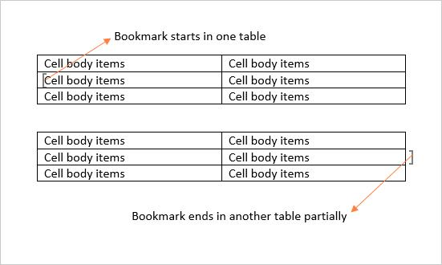

# Working with Bookmarks

A bookmark identifies a location or a selection of text within a document that you can name and identify for future reference.

In Essential DocIO, bookmark is represented by Bookmark instance that is a pair of BookmarkStart and BookmarkEnd. BookmarkStart represents start point of a bookmark and BookmarkEnd represents end point of a bookmark. Every Word document contains a collection of bookmarks that are accessible through the Bookmarks property of WordDocument class.

## Adding a bookmark

The following code example shows how to add a bookmark in Word document.

 


//Creates an instance of WordDocument class (Empty Word Document)
WordDocument document = new WordDocument();
//Adds a new section into the Word Document
IWSection section = document.AddSection();
//Adds a new paragraph into Word document and appends text into paragraph
IWParagraph paragraph = section.AddParagraph();
paragraph.AppendText("Northwind Database");
paragraph.ParagraphFormat.HorizontalAlignment = Syncfusion.DocIO.DLS.HorizontalAlignment.Center; 
//Adds a paragraph into section
paragraph = section.AddParagraph();
//Adds a new bookmark start into paragraph with name "Northwind"
paragraph.AppendBookmarkStart("Northwind");
//Adds a text between the bookmark start and end into paragraph
paragraph.AppendText("The Northwind sample database (Northwind.mdb) is included with all versions of Access. It provides data you can experiment with and database objects that demonstrate features you might want to implement in your own databases.");
//Adds a new bookmark end into paragraph with name " Northwind "
paragraph.AppendBookmarkEnd("Northwind");
//Adds a text after the bookmark end
paragraph.AppendText(" Using Northwind, you can become familiar with how a relational database is structured and how the database objects work together to help you enter, store, manipulate, and print your data.");
//Saves the document in the given name and format
document.Save("Bookmarks.docx", FormatType.Docx);
//Releases the resources occupied by WordDocument instance
document.Close(); 



'Creates an instance of WordDocument class (Empty Word Document)
Dim document As New WordDocument()
'Adds a new section into the Word Document
Dim section As IWSection = document.AddSection()
'Adds a new paragraph into Word document and appends text into paragraph
Dim paragraph As IWParagraph = section.AddParagraph()
paragraph.AppendText("Northwind Database")
paragraph.ParagraphFormat.HorizontalAlignment = Syncfusion.DocIO.DLS.HorizontalAlignment.Center
'Adds a paragraph into section
paragraph = section.AddParagraph()
'Adds a new bookmark start into paragraph with name "Northwind"
paragraph.AppendBookmarkStart("Northwind")
'Adds a text between the bookmark start and end into paragraph
paragraph.AppendText("The Northwind sample database (Northwind.mdb) is included with all versions of Access. It provides data you can experiment with and database objects that demonstrate features you might want to implement in your own databases.")
'Adds a new bookmark end into paragraph with name " Northwind "
paragraph.AppendBookmarkEnd("Northwind")
'Adds a text after the bookmark end
paragraph.AppendText(" Using Northwind, you can become familiar with how a relational database is structured and how the database objects work together to help you enter, store, manipulate, and print your data.")
'Saves the document in the given name and format
document.Save("Bookmarks.docx", FormatType.Docx)
'Releases the resources occupied by WordDocument instance
document.Close() 



//Creates an instance of WordDocument class (Empty Word Document)
WordDocument document = new WordDocument();
//Adds a new section into the Word Document
IWSection section = document.AddSection();
//Adds a new paragraph into Word document and appends text into paragraph
IWParagraph paragraph = section.AddParagraph();
paragraph.AppendText("Northwind Database");
paragraph.ParagraphFormat.HorizontalAlignment = Syncfusion.DocIO.DLS.HorizontalAlignment.Center; 
//Adds a paragraph into section
paragraph = section.AddParagraph();
//Adds a new bookmark start into paragraph with name "Northwind"
paragraph.AppendBookmarkStart("Northwind");
//Adds a text between the bookmark start and end into paragraph
paragraph.AppendText("The Northwind sample database (Northwind.mdb) is included with all versions of Access. It provides data you can experiment with and database objects that demonstrate features you might want to implement in your own databases.");
//Adds a new bookmark end into paragraph with name " Northwind "
paragraph.AppendBookmarkEnd("Northwind");
//Adds a text after the bookmark end
paragraph.AppendText(" Using Northwind, you can become familiar with how a relational database is structured and how the database objects work together to help you enter, store, manipulate, and print your data.");
//Saves the Word file to MemoryStream
MemoryStream stream = new MemoryStream();
await document.SaveAsync(stream, FormatType.Docx);
//Saves the stream as Word file in local machine
Save(stream, "Bookmarks.docx");
//Closes the document
document.Close();
//Please refer the below link to save Word document in UWP platform
//https://help.syncfusion.com/file-formats/docio/create-word-document-in-uwp#save-word-document-in-uwp 



//Creates an instance of WordDocument class (Empty Word Document)
WordDocument document = new WordDocument();
//Adds a new section into the Word Document
IWSection section = document.AddSection();
//Adds a new paragraph into Word document and appends text into paragraph
IWParagraph paragraph = section.AddParagraph();
paragraph.AppendText("Northwind Database");
paragraph.ParagraphFormat.HorizontalAlignment = Syncfusion.DocIO.DLS.HorizontalAlignment.Center; 
//Adds a paragraph into section
paragraph = section.AddParagraph();
//Adds a new bookmark start into paragraph with name "Northwind"
paragraph.AppendBookmarkStart("Northwind");
//Adds a text between the bookmark start and end into paragraph
paragraph.AppendText("The Northwind sample database (Northwind.mdb) is included with all versions of Access. It provides data you can experiment with and database objects that demonstrate features you might want to implement in your own databases.");
//Adds a new bookmark end into paragraph with name " Northwind "
paragraph.AppendBookmarkEnd("Northwind");
//Adds a text after the bookmark end
paragraph.AppendText(" Using Northwind, you can become familiar with how a relational database is structured and how the database objects work together to help you enter, store, manipulate, and print your data.");
//Saves the Word document to MemoryStream
MemoryStream stream = new MemoryStream();
document.Save(stream, FormatType.Docx);
//Closes the document
document.Close();
stream.Position = 0;
//Download Word document in the browser
return File(stream, "application/msword", "Bookmarks.docx"); 



//Creates an instance of WordDocument class (Empty Word Document)
WordDocument document = new WordDocument();
//Adds a new section into the Word Document
IWSection section = document.AddSection();
//Adds a new paragraph into Word document and appends text into paragraph
IWParagraph paragraph = section.AddParagraph();
paragraph.AppendText("Northwind Database");
paragraph.ParagraphFormat.HorizontalAlignment = Syncfusion.DocIO.DLS.HorizontalAlignment.Center; 
//Adds a paragraph into section
paragraph = section.AddParagraph();
//Adds a new bookmark start into paragraph with name "Northwind"
paragraph.AppendBookmarkStart("Northwind");
//Adds a text between the bookmark start and end into paragraph
paragraph.AppendText("The Northwind sample database (Northwind.mdb) is included with all versions of Access. It provides data you can experiment with and database objects that demonstrate features you might want to implement in your own databases.");
//Adds a new bookmark end into paragraph with name " Northwind "
paragraph.AppendBookmarkEnd("Northwind");
//Adds a text after the bookmark end
paragraph.AppendText(" Using Northwind, you can become familiar with how a relational database is structured and how the database objects work together to help you enter, store, manipulate, and print your data.");
//Saves the Word document to  MemoryStream
MemoryStream stream = new MemoryStream();
document.Save(stream, FormatType.Docx);
//Closes the document
document.Close();
//Save the stream as a file in the device and invoke it for viewing
Xamarin.Forms.DependencyService.Get<ISave>().SaveAndView("Bookmarks.docx", "application/msword", stream);
//Please download the helper files from the below link to save the stream as file and open the file for viewing in Xamarin platform
//https://help.syncfusion.com/file-formats/docio/create-word-document-in-xamarin#helper-files-for-xamarin 


  

## Obtaining a bookmark instance

The following code example shows how to retrieve an instance of bookmark from a Word document.

  


//Loads an existing Word document into DocIO instance
WordDocument document = new WordDocument("Bookmarks.docx", FormatType.Docx);
//Gets the bookmark instance by using FindByName method of BookmarkCollection with bookmark name
Syncfusion.DocIO.DLS.Bookmark bookmark = document.Bookmarks.FindByName("Northwind");
//Accesses the bookmark start’s owner paragraph by using bookmark and changes its back color
bookmark.BookmarkStart.OwnerParagraph.ParagraphFormat.BackColor = Color.AliceBlue;
document.Save("Result.docx", FormatType.Docx);
document.Close();



'Loads an existing Word document into DocIO instance
Dim document As New WordDocument("Bookmarks.docx", FormatType.Docx)
'Gets the bookmark instance by using FindByName method of BookmarkCollection with bookmark name
Dim bookmark As Syncfusion.DocIO.DLS.Bookmark = document.Bookmarks.FindByName("Northwind")
'Accesses the bookmark start’s owner paragraph by using bookmark and changes its back color
bookmark.BookmarkStart.OwnerParagraph.ParagraphFormat.BackColor = Color.AliceBlue
document.Save("Result.docx", FormatType.Docx)
document.Close()



//Loads an existing Word document into DocIO instance
Assembly assembly = typeof(App).GetTypeInfo().Assembly;
WordDocument document = new WordDocument("Sample.Assets.Bookmarks.docx", FormatType.Docx);
//Gets the bookmark instance by using FindByName method of BookmarkCollection with bookmark name
Syncfusion.DocIO.DLS.Bookmark bookmark = document.Bookmarks.FindByName("Northwind");
//Accesses the bookmark start’s owner paragraph by using bookmark and changes its back color
bookmark.BookmarkStart.OwnerParagraph.ParagraphFormat.BackColor = Color.AliceBlue;
//Saves the Word file to MemoryStream
MemoryStream stream = new MemoryStream();
await document.SaveAsync(stream, FormatType.Docx);
//Saves the stream as Word file in local machine
Save(stream, "Result.docx");
//Closes the document
document.Close();
//Please refer the below link to save Word document in UWP platform
//https://help.syncfusion.com/file-formats/docio/create-word-document-in-uwp#save-word-document-in-uwp



//Loads an existing Word document into DocIO instance
FileStream fileStreamPath = new FileStream(@"Bookmarks.docx", FileMode.Open, FileAccess.Read, FileShare.ReadWrite);
WordDocument document = new WordDocument(fileStreamPath, FormatType.Docx);
//Gets the bookmark instance by using FindByName method of BookmarkCollection with bookmark name
Syncfusion.DocIO.DLS.Bookmark bookmark = document.Bookmarks.FindByName("Northwind");
//Accesses the bookmark start’s owner paragraph by using bookmark and changes its back color
bookmark.BookmarkStart.OwnerParagraph.ParagraphFormat.BackColor = Color.AliceBlue;
//Saves the Word document to MemoryStream
MemoryStream stream = new MemoryStream();
document.Save(stream, FormatType.Docx);
//Closes the document
document.Close();
stream.Position = 0;
//Download Word document in the browser
return File(stream, "application/msword", "Result.docx");



//Loads an existing Word document into DocIO instance
Assembly assembly = typeof(App).GetTypeInfo().Assembly;
WordDocument document = new WordDocument(assembly.GetManifestResourceStream("GettingStarted.Data.Bookmarks.docx"), FormatType.Docx);
//Gets the bookmark instance by using FindByName method of BookmarkCollection with bookmark name
Syncfusion.DocIO.DLS.Bookmark bookmark = document.Bookmarks.FindByName("Northwind");
//Accesses the bookmark start’s owner paragraph by using bookmark and changes its back color
bookmark.BookmarkStart.OwnerParagraph.ParagraphFormat.BackColor = Color.AliceBlue;
//Saves the Word document to  MemoryStream
MemoryStream stream = new MemoryStream();
document.Save(stream, FormatType.Docx);
//Closes the document
document.Close();
//Save the stream as a file in the device and invoke it for viewing
Xamarin.Forms.DependencyService.Get<ISave>().SaveAndView("Result.docx", "application/msword", stream);
//Please download the helper files from the below link to save the stream as file and open the file for viewing in Xamarin platform
//https://help.syncfusion.com/file-formats/docio/create-word-document-in-xamarin#helper-files-for-xamarin


  

## Removing a Bookmark from Word document

The following code example shows how to remove a bookmark from Word document.

  


//Loads an existing Word document into DocIO instance
WordDocument document = new WordDocument("Bookmarks.docx", FormatType.Docx);
//Gets the bookmark instance by using FindByName method of BookmarkCollection with bookmark name
Bookmark bookmark = document.Bookmarks.FindByName("Northwind");
//Removes the bookmark named "Northwind" from Word document.
document.Bookmarks.Remove(bookmark);
document.Save("Result.docx", FormatType.Docx);
document.Close();



'Loads an existing Word document into DocIO instance
Dim document As New WordDocument("Bookmarks.docx", FormatType.Docx)
'Gets the bookmark instance by using FindByName method of BookmarkCollection with bookmark name
Dim bookmark As Bookmark = document.Bookmarks.FindByName("Northwind")
'Removes the bookmark named "Northwind" from Word document.
document.Bookmarks.Remove(bookmark)
document.Save("Result.docx", FormatType.Docx)
document.Close()



//Loads an existing Word document into DocIO instance
Assembly assembly = typeof(App).GetTypeInfo().Assembly;
WordDocument document = new WordDocument(assembly.GetManifestResourceStream("Sample.Assets.Bookmarks.docx"), FormatType.Docx);
//Gets the bookmark instance by using FindByName method of BookmarkCollection with bookmark name
Bookmark bookmark = document.Bookmarks.FindByName("Northwind");
//Removes the bookmark named "Northwind" from Word document.
document.Bookmarks.Remove(bookmark);
//Saves the Word file to MemoryStream
MemoryStream stream = new MemoryStream();
await document.SaveAsync(stream, FormatType.Docx);
//Saves the stream as Word file in local machine
Save(stream, "Result.docx");
//Closes the document
document.Close();
//Please refer the below link to save Word document in UWP platform
//https://help.syncfusion.com/file-formats/docio/create-word-document-in-uwp#save-word-document-in-uwp



//Loads an existing Word document into DocIO instance
FileStream fileStreamPath = new FileStream(@"Bookmarks.docx", FileMode.Open, FileAccess.Read, FileShare.ReadWrite);
WordDocument document = new WordDocument(fileStreamPath, FormatType.Docx);
//Gets the bookmark instance by using FindByName method of BookmarkCollection with bookmark name
Bookmark bookmark = document.Bookmarks.FindByName("Northwind");
//Removes the bookmark named "Northwind" from Word document.
document.Bookmarks.Remove(bookmark);
//Saves the Word document to MemoryStream
MemoryStream stream = new MemoryStream();
document.Save(stream, FormatType.Docx);
//Closes the document
document.Close();
stream.Position = 0;
//Download Word document in the browser
return File(stream, "application/msword", "Result.docx");



//Loads an existing Word document into DocIO instance
Assembly assembly = typeof(App).GetTypeInfo().Assembly;
WordDocument document = new WordDocument(assembly.GetManifestResourceStream("GettingStarted.Data.Bookmarks.docx"), FormatType.Docx);
//Gets the bookmark instance by using FindByName method of BookmarkCollection with bookmark name
Bookmark bookmark = document.Bookmarks.FindByName("Northwind");
//Removes the bookmark named "Northwind" from Word document.
document.Bookmarks.Remove(bookmark);
//Saves the Word document to  MemoryStream
MemoryStream stream = new MemoryStream();
document.Save(stream, FormatType.Docx);
//Closes the document
document.Close();
//Save the stream as a file in the device and invoke it for viewing
Xamarin.Forms.DependencyService.Get<ISave>().SaveAndView("Result.docx", "application/msword", stream);
//Please download the helper files from the below link to save the stream as file and open the file for viewing in Xamarin platform
//https://help.syncfusion.com/file-formats/docio/create-word-document-in-xamarin#helper-files-for-xamarin


  

## Retrieving contents within a bookmark 

BookmarkNavigator is used for navigating to a bookmark in a Word document. You can retrieve, replace and delete the content of a specified bookmark by using BookmarkNavigator.

You can get the content between bookmark start and bookmark end of the specified bookmark in two ways: 

1. You can use `GetBookmarkContent` method for retrieving content as collection of body items when the bookmark start and bookmark end are preserved in a single section.
2. You can use `GetContent` method for retrieving content as collection of sections when the bookmark start and bookmark end are preserved in different sections. 

The following code example shows how to retrieve the specified bookmark content by using `GetBookmarkContent` method in a Word document.

   


WordDocument document = new WordDocument("Bookmarks.docx", FormatType.Docx);
//Creates the bookmark navigator instance to access the bookmark
BookmarksNavigator bookmarkNavigator = new BookmarksNavigator(document);
//Moves the virtual cursor to the location before the end of the bookmark "Northwind"
bookmarkNavigator.MoveToBookmark("Northwind");
//Gets the bookmark content
TextBodyPart part = bookmarkNavigator.GetBookmarkContent();
//Adds the retrieved content into another new section
document.AddSection();
for (int i = 0; i < part.BodyItems.Count; i++)
    document.LastSection.Body.ChildEntities.Add(part.BodyItems[i]);
document.Save("Result.docx", FormatType.Docx);
document.Close();



Dim document As New WordDocument("Bookmarks.docx", FormatType.Docx)
'Creates the bookmark navigator instance to access the bookmark
Dim bookmarkNavigator As New BookmarksNavigator(document)
'Moves the virtual cursor to the location before the end of the bookmark "Northwind"
bookmarkNavigator.MoveToBookmark("Northwind")
'Gets the bookmark content
Dim part As TextBodyPart = bookmarkNavigator.GetBookmarkContent()
'Adds the retrieved content into another new section
document.AddSection()
For i As Integer = 0 To part.BodyItems.Count - 1
	document.LastSection.Body.ChildEntities.Add(part.BodyItems(i))
Next
document.Save("Result.docx", FormatType.Docx)
document.Close()



//Loads an existing Word document into DocIO instance
Assembly assembly = typeof(App).GetTypeInfo().Assembly;
WordDocument document = new WordDocument(assembly.GetManifestResourceStream("Sample.Assets.Bookmarks.docx"), FormatType.Docx);
//Creates the bookmark navigator instance to access the bookmark
BookmarksNavigator bookmarkNavigator = new BookmarksNavigator(document);
//Moves the virtual cursor to the location before the end of the bookmark "Northwind"
bookmarkNavigator.MoveToBookmark("Northwind");
//Gets the bookmark content
TextBodyPart part = bookmarkNavigator.GetBookmarkContent();
//Adds the retrieved content into another new section
document.AddSection();
for (int i = 0; i < part.BodyItems.Count; i++)
	document.LastSection.Body.ChildEntities.Add(part.BodyItems[i]);
//Saves the Word file to MemoryStream
MemoryStream stream = new MemoryStream();
await document.SaveAsync(stream, FormatType.Docx);
//Saves the stream as Word file in local machine
Save(stream, "Result.docx");
//Closes the document
document.Close();
//Please refer the below link to save Word document in UWP platform
//https://help.syncfusion.com/file-formats/docio/create-word-document-in-uwp#save-word-document-in-uwp



//Loads an existing Word document into DocIO instance
FileStream fileStreamPath = new FileStream("Bookmarks.docx", FileMode.Open, FileAccess.Read, FileShare.ReadWrite);
WordDocument document = new WordDocument(fileStreamPath, FormatType.Docx);
//Creates the bookmark navigator instance to access the bookmark
BookmarksNavigator bookmarkNavigator = new BookmarksNavigator(document);
//Moves the virtual cursor to the location before the end of the bookmark "Northwind"
bookmarkNavigator.MoveToBookmark("Northwind");
//Gets the bookmark content
TextBodyPart part = bookmarkNavigator.GetBookmarkContent();
//Adds the retrieved content into another new section
document.AddSection();
for (int i = 0; i < part.BodyItems.Count; i++)
	document.LastSection.Body.ChildEntities.Add(part.BodyItems[i]);
//Saves the Word document to MemoryStream
MemoryStream stream = new MemoryStream();
document.Save(stream, FormatType.Docx);
//Closes the document
document.Close();
stream.Position = 0;
//Download Word document in the browser
return File(stream, "application/msword", "Result.docx");



//Loads an existing Word document into DocIO instance
Assembly assembly = typeof(App).GetTypeInfo().Assembly;
WordDocument document = new WordDocument(assembly.GetManifestResourceStream("GettingStarted.Data.Bookmarks.docx"), FormatType.Docx);
//Creates the bookmark navigator instance to access the bookmark
BookmarksNavigator bookmarkNavigator = new BookmarksNavigator(document);
//Moves the virtual cursor to the location before the end of the bookmark "Northwind"
bookmarkNavigator.MoveToBookmark("Northwind");
//Gets the bookmark content
TextBodyPart part = bookmarkNavigator.GetBookmarkContent();
//Adds the retrieved content into another new section
document.AddSection();
for (int i = 0; i < part.BodyItems.Count; i++)
	document.LastSection.Body.ChildEntities.Add(part.BodyItems[i]);
//Saves the Word document to  MemoryStream
MemoryStream stream = new MemoryStream();
document.Save(stream, FormatType.Docx);
//Closes the document
document.Close();
//Save the stream as a file in the device and invoke it for viewing
Xamarin.Forms.DependencyService.Get<ISave>().SaveAndView("Result.docx", "application/msword", stream);
//Please download the helper files from the below link to save the stream as file and open the file for viewing in Xamarin platform
//https://help.syncfusion.com/file-formats/docio/create-word-document-in-xamarin#helper-files-for-xamarin


 

The following code example shows how to retrieve the specified bookmark content by using `GetContent` method in a Word document.

  


//Loads the template document with bookmark "Northwind" whose start and end are preserved in different section.
WordDocument document = new WordDocument("Template.docx", FormatType.Docx);
//Creates the bookmark navigator instance to access the bookmark
BookmarksNavigator bookmarkNavigator = new BookmarksNavigator(document);
//Moves the virtual cursor to the location before the end of the bookmark "Northwind"
bookmarkNavigator.MoveToBookmark("Northwind");
//Gets the bookmark content as WordDocumentPart
WordDocumentPart wordDocumentPart = bookmarkNavigator.GetContent();
//Saves the WordDocumentPart as separate Word document
WordDocument newDocument = wordDocumentPart.GetAsWordDocument();
//Close the WordDocumentPart instance
wordDocumentPart.Close();
//Close the template Word document
document.Close();
newDocument.Save("Result.docx", FormatType.Docx);
//Releases the resources hold by WordDocument instance
newDocument.Close();



'Loads the template document with bookmark "Northwind" whose start and end are preserved in different section
Dim document As New WordDocument("Template.docx", FormatType.Docx)
'Creates the bookmark navigator instance to access the bookmark
Dim bookmarkNavigator As New BookmarksNavigator(document)
'Moves the virtual cursor to the location before the end of the bookmark "Northwind"
bookmarkNavigator.MoveToBookmark("Northwind")
'Gets the bookmark content as WordDocumentPart
Dim wordDocumentPart As WordDocumentPart = bookmarkNavigator.GetContent()
'Saves the WordDocumentPart as separate Word document
Dim newDocument As WordDocument = wordDocumentPart.GetAsWordDocument()
'Close the WordDocumentPart instance
wordDocumentPart.Close()
'Close the template Word document
document.Close()
newDocument.Save("Result.docx", FormatType.Docx)
'Releases the resources hold by WordDocument instance
newDocument.Close()



//Loads the template document with bookmark "Northwind" whose start and end are preserved in different section.
Assembly assembly = typeof(App).GetTypeInfo().Assembly;
WordDocument document = new WordDocument(assembly.GetManifestResourceStream("Sample.Assets.Template.docx"), FormatType.Docx);
//Creates the bookmark navigator instance to access the bookmark
BookmarksNavigator bookmarkNavigator = new BookmarksNavigator(document);
//Moves the virtual cursor to the location before the end of the bookmark "Northwind"
bookmarkNavigator.MoveToBookmark("Northwind");
//Gets the bookmark content as WordDocumentPart
WordDocumentPart wordDocumentPart = bookmarkNavigator.GetContent();
//Saves the WordDocumentPart as separate Word document
WordDocument newDocument = wordDocumentPart.GetAsWordDocument();
//Close the WordDocumentPart instance
wordDocumentPart.Close();
//Close the template Word document
document.Close();
//Saves the Word file to MemoryStream
MemoryStream stream = new MemoryStream();
await newDocument.SaveAsync(stream, FormatType.Docx);
//Saves the stream as Word file in local machine
Save(stream, "Result.docx");
//Releases the resources hold by WordDocument instance
newDocument.Close();
//Please refer the below link to save Word document in UWP platform
//https://help.syncfusion.com/file-formats/docio/create-word-document-in-uwp#save-word-document-in-uwp



//Loads the template document with bookmark "Northwind" whose start and end are preserved in different section.
FileStream fileStreamPath = new FileStream("Template.docx", FileMode.Open, FileAccess.Read, FileShare.ReadWrite);
WordDocument document = new WordDocument(fileStreamPath, FormatType.Docx);
//Creates the bookmark navigator instance to access the bookmark
BookmarksNavigator bookmarkNavigator = new BookmarksNavigator(document);
//Moves the virtual cursor to the location before the end of the bookmark "Northwind"
bookmarkNavigator.MoveToBookmark("Northwind");
//Gets the bookmark content as WordDocumentPart
WordDocumentPart wordDocumentPart = bookmarkNavigator.GetContent();
//Saves the WordDocumentPart as separate Word document
WordDocument newDocument = wordDocumentPart.GetAsWordDocument();
//Close the WordDocumentPart instance
wordDocumentPart.Close();
//Closes the template document
document.Close();
MemoryStream stream = new MemoryStream();
newDocument.Save(stream, FormatType.Docx);
newDocument.Close();
stream.Position = 0;
//Download Word document in the browser
return File(stream, "application/msword", "Result.docx");



//Loads the template document with bookmark "Northwind" whose start and end are preserved in different section.
Assembly assembly = typeof(App).GetTypeInfo().Assembly;
WordDocument document = new WordDocument(assembly.GetManifestResourceStream("GettingStarted.Data.Template.docx"), FormatType.Docx);
//Creates the bookmark navigator instance to access the bookmark
BookmarksNavigator bookmarkNavigator = new BookmarksNavigator(document);
//Moves the virtual cursor to the location before the end of the bookmark "Northwind"
bookmarkNavigator.MoveToBookmark("Northwind");
//Gets the bookmark content as WordDocumentPart
WordDocumentPart wordDocumentPart = bookmarkNavigator.GetContent();
//Saves the WordDocumentPart as separate Word document
WordDocument newDocument = wordDocumentPart.GetAsWordDocument();
//Close the WordDocumentPart instance
wordDocumentPart.Close();
//Close the template document
document.Close();
//Saves the Word document to  MemoryStream
MemoryStream stream = new MemoryStream();
newDocument.Save(stream, FormatType.Docx);
//Save the stream as a file in the device and invoke it for viewing
Xamarin.Forms.DependencyService.Get<ISave>().SaveAndView("Result.docx", "application/msword", stream);
//Please download the helper files from the below link to save the stream as file and open the file for viewing in Xamarin platform
//https://help.syncfusion.com/file-formats/docio/create-word-document-in-xamarin#helper-files-for-xamarin
//Releases the resources hold by WordDocument instance
newDocument.Close();


  

## Retrieving bookmark contents within a table 

You can select the column range for bookmarks inside the tables in Word documents by using `FirstColumn` and `LastColumn` properties.

N> 1. `FirstColumn` and `LastColumn` properties are valid to select table cells, only when the respective bookmark end and start is present within the same row or next rows of the same table.
N> 2. `FirstColumn` property denotes the top left corner cell and `LastColumn` property denotes the bottom right corner cell of rectangular selection region since you can only select the content as a rectangular selection by using bookmarks within the table.
N> 3. `FirstColumn` property selects from the first cell of the respective row when this property value is negative (or) greater than the cells of a row (or) greater than the `LastColumn` value.
N> 4. `LastColumn` property selects till last cell of the respective row when this property value is negative (or) greater than the cells of a row (or) less than the `FirstColumn` value.

The following code example shows how to retrieve the bookmark content of a specified column range from a table in a Word document.




















## Inserting content into a bookmark

You can insert table, paragraph, simple text and paragraph item at the start or end location of the current bookmark by using bookmark navigator.

The following code example shows how to insert a simple text by using BookmarkNavigator.

 


WordDocument document = new WordDocument("Bookmarks.docx", FormatType.Docx);
//Creates the bookmark navigator instance to access the bookmark
BookmarksNavigator bookmarkNavigator = new BookmarksNavigator(document);
//Moves the virtual cursor to the location before the end of the bookmark "Northwind"
bookmarkNavigator.MoveToBookmark("Northwind");
//Inserts a new text before the bookmark end of the bookmark
bookmarkNavigator.InsertText(" Northwind Database is a set of tables containing data fitted into predefined categories.");
document.Save("Result.docx", FormatType.Docx);
document.Close();



Dim document As New WordDocument("Bookmarks.docx", FormatType.Docx)
'Creates the bookmark navigator instance to access the bookmark
Dim bookmarkNavigator As New BookmarksNavigator(document)
'Moves the virtual cursor to the location before the end of the bookmark "Northwind"
bookmarkNavigator.MoveToBookmark("Northwind")
'Inserts a new text before the bookmark end of the bookmark
bookmarkNavigator.InsertText(" Northwind Database is a set of tables containing data fitted into predefined categories.")
document.Save("Result.docx", FormatType.Docx)
document.Close()



//Loads the template document
Assembly assembly = typeof(App).GetTypeInfo().Assembly;
WordDocument document = new WordDocument(assembly.GetManifestResourceStream("Sample.Assets.Bookmarks.docx"), FormatType.Docx);
//Creates the bookmark navigator instance to access the bookmark
BookmarksNavigator bookmarkNavigator = new BookmarksNavigator(document);
//Moves the virtual cursor to the location before the end of the bookmark "Northwind"
bookmarkNavigator.MoveToBookmark("Northwind");
//Inserts a new text before the bookmark end of the bookmark
bookmarkNavigator.InsertText(" Northwind Database is a set of tables containing data fitted into predefined categories.");
//Saves the Word file to MemoryStream
MemoryStream stream = new MemoryStream();
await document.SaveAsync(stream, FormatType.Docx);
//Saves the stream as Word file in local machine
Save(stream, "Result.docx");
document.Close();
//Please refer the below link to save Word document in UWP platform
//https://help.syncfusion.com/file-formats/docio/create-word-document-in-uwp#save-word-document-in-uwp



//Loads the template document
FileStream fileStreamPath = new FileStream(@"Bookmarks.docx", FileMode.Open, FileAccess.Read, FileShare.ReadWrite);
WordDocument document = new WordDocument(fileStreamPath, FormatType.Docx);
//Creates the bookmark navigator instance to access the bookmark
BookmarksNavigator bookmarkNavigator = new BookmarksNavigator(document);
//Moves the virtual cursor to the location before the end of the bookmark "Northwind"
bookmarkNavigator.MoveToBookmark("Northwind");
//Inserts a new text before the bookmark end of the bookmark
bookmarkNavigator.InsertText(" Northwind Database is a set of tables containing data fitted into predefined categories.");
//Saves the Word document to MemoryStream
MemoryStream stream = new MemoryStream();
document.Save(stream, FormatType.Docx);
//Closes the document
document.Close();
stream.Position = 0;
//Download Word document in the browser
return File(stream, "application/msword", "Result.docx");



//Loads the template document
Assembly assembly = typeof(App).GetTypeInfo().Assembly;
WordDocument document = new WordDocument(assembly.GetManifestResourceStream("GettingStarted.Data.Bookmarks.docx"), FormatType.Docx);
//Creates the bookmark navigator instance to access the bookmark
BookmarksNavigator bookmarkNavigator = new BookmarksNavigator(document);
//Moves the virtual cursor to the location before the end of the bookmark "Northwind"
bookmarkNavigator.MoveToBookmark("Northwind");
//Inserts a new text before the bookmark end of the bookmark
bookmarkNavigator.InsertText(" Northwind Database is a set of tables containing data fitted into predefined categories.");
//Saves the Word document to  MemoryStream
MemoryStream stream = new MemoryStream();
document.Save(stream, FormatType.Docx);
//Save the stream as a file in the device and invoke it for viewing
Xamarin.Forms.DependencyService.Get<ISave>().SaveAndView("Result.docx", "application/msword", stream);
//Please download the helper files from the below link to save the stream as file and open the file for viewing in Xamarin platform
//https://help.syncfusion.com/file-formats/docio/create-word-document-in-xamarin#helper-files-for-xamarin
document.Close();
 

  

The following code example shows how to insert a paragraph item by using BookmarkNavigator.

    


WordDocument document = new WordDocument("Bookmarks.docx", FormatType.Docx);
//Creates the bookmark navigator instance to access the bookmark
BookmarksNavigator bookmarkNavigator = new BookmarksNavigator(document);
//Moves the virtual cursor to the location before the end of the bookmark "Northwind"
bookmarkNavigator.MoveToBookmark("Northwind", false, true);
//Inserts a new picture after the bookmark end
WPicture picture = bookmarkNavigator.InsertParagraphItem(ParagraphItemType.Picture) as WPicture;
picture.LoadImage(Image.FromFile("Northwind.png"));
picture.WidthScale = 50;
picture.HeightScale = 50;
document.Save("Result.docx", FormatType.Docx);
document.Close();



Dim document As New WordDocument("Bookmarks.docx", FormatType.Docx)
'Creates the bookmark navigator instance to access the bookmark
Dim bookmarkNavigator As New BookmarksNavigator(document)
'Moves the virtual cursor to the location before the end of the bookmark "Northwind"
bookmarkNavigator.MoveToBookmark("Northwind", False, True)
'Inserts a new picture after the bookmark end
Dim picture As WPicture = TryCast(bookmarkNavigator.InsertParagraphItem(ParagraphItemType.Picture), WPicture)
picture.LoadImage(Image.FromFile("Northwind.png"))
picture.WidthScale = 50
picture.HeightScale = 50
document.Save("Result.docx", FormatType.Docx)
document.Close()



//Loads an existing Word document into DocIO instance
Assembly assembly = typeof(App).GetTypeInfo().Assembly;
WordDocument document = new WordDocument(assembly.GetManifestResourceStream("Sample.Assets.Bookmarks.docx"), FormatType.Docx);
//Creates the bookmark navigator instance to access the bookmark
BookmarksNavigator bookmarkNavigator = new BookmarksNavigator(document);
//Moves the virtual cursor to the location before the end of the bookmark "Northwind"
bookmarkNavigator.MoveToBookmark("Northwind", false, true);
//Inserts a new picture after the bookmark end
WPicture picture = bookmarkNavigator.InsertParagraphItem(ParagraphItemType.Picture) as WPicture;
Stream imageStream = typeof(MainPage).GetTypeInfo().Assembly.GetManifestResourceStream("Sample.Assets.Northwind.png");
picture.LoadImage(imageStream);
picture.WidthScale = 50;
picture.HeightScale = 50;
//Saves the Word file to MemoryStream
MemoryStream stream = new MemoryStream();
await document.SaveAsync(stream, FormatType.Docx);
//Saves the stream as Word file in local machine
Save(stream, "Result.docx");
document.Close();
//Please refer the below link to save Word document in UWP platform
//https://help.syncfusion.com/file-formats/docio/create-word-document-in-uwp#save-word-document-in-uwp



//Loads an existing Word document into DocIO instance
FileStream fileStreamPath = new FileStream("Bookmarks.docx", FileMode.Open, FileAccess.Read, FileShare.ReadWrite);
WordDocument document = new WordDocument(fileStreamPath, FormatType.Docx);
//Creates the bookmark navigator instance to access the bookmark
BookmarksNavigator bookmarkNavigator = new BookmarksNavigator(document);
//Moves the virtual cursor to the location before the end of the bookmark "Northwind"
bookmarkNavigator.MoveToBookmark("Northwind", false, true);
//Inserts a new picture after the bookmark end
WPicture picture = bookmarkNavigator.InsertParagraphItem(ParagraphItemType.Picture) as WPicture;
FileStream imageStream = new FileStream("Northwind.png", FileMode.Open, FileAccess.Read);
picture.LoadImage(imageStream);
picture.WidthScale = 50;
picture.HeightScale = 50;
//Saves the Word document to MemoryStream
MemoryStream stream = new MemoryStream();
document.Save(stream, FormatType.Docx);
//Closes the document
document.Close();
stream.Position = 0;
//Download Word document in the browser
return File(stream, "application/msword", "Result.docx");



//Loads an existing Word document into DocIO instance
Assembly assembly = typeof(App).GetTypeInfo().Assembly;
WordDocument document = new WordDocument(assembly.GetManifestResourceStream("GettingStarted.Data.Bookmarks.docx"), FormatType.Docx);
//Creates the bookmark navigator instance to access the bookmark
BookmarksNavigator bookmarkNavigator = new BookmarksNavigator(document);
//Moves the virtual cursor to the location before the end of the bookmark "Northwind"
bookmarkNavigator.MoveToBookmark("Northwind", false, true);
//Inserts a new picture after the bookmark end
WPicture picture = bookmarkNavigator.InsertParagraphItem(ParagraphItemType.Picture) as WPicture;
Stream imageStream = typeof(MainPage).GetTypeInfo().Assembly.GetManifestResourceStream("GettingStarted.Data.Northwind.png");
picture.LoadImage(imageStream);
picture.WidthScale = 50;
picture.HeightScale = 50;
//Saves the Word document to  MemoryStream
MemoryStream stream = new MemoryStream();
document.Save(stream, FormatType.Docx);
//Save the stream as a file in the device and invoke it for viewing
Xamarin.Forms.DependencyService.Get<ISave>().SaveAndView("Result.docx", "application/msword", stream);
//Please download the helper files from the below link to save the stream as file and open the file for viewing in Xamarin platform
//https://help.syncfusion.com/file-formats/docio/create-word-document-in-xamarin#helper-files-for-xamarin
document.Close();




The following code example shows how to insert a paragraph by using BookmarkNavigator.

  


WordDocument document = new WordDocument("Bookmarks.docx", FormatType.Docx);
//Creates the bookmark navigator instance to access the bookmark
BookmarksNavigator bookmarkNavigator = new BookmarksNavigator(document);
//Moves the virtual cursor to the location before the end of the bookmark "Northwind"
bookmarkNavigator.MoveToBookmark("Northwind", false, true);
//Inserts a new paragraph before the bookmark start
IWParagraph paragraph = new WParagraph(document);
paragraph.AppendText("Northwind Database is a set of tables containing data fitted into predefined categories.");
bookmarkNavigator.InsertParagraph(paragraph);
document.Save("Result.docx", FormatType.Docx);
document.Close();



Dim document As New WordDocument("Bookmarks.docx", FormatType.Docx)
'Creates the bookmark navigator instance to access the bookmark
Dim bookmarkNavigator As New BookmarksNavigator(document)
'Moves the virtual cursor to the location before the end of the bookmark "Northwind"
bookmarkNavigator.MoveToBookmark("Northwind", False, True)
'Inserts a new paragraph before the bookmark start
Dim paragraph As IWParagraph = New WParagraph(document)
paragraph.AppendText("Northwind Database is a set of tables containing data fitted into predefined categories.")
bookmarkNavigator.InsertParagraph(paragraph)
document.Save("Result.docx", FormatType.Docx)
document.Close()



//Loads an existing Word document into DocIO instance
Assembly assembly = typeof(App).GetTypeInfo().Assembly;
WordDocument document = new WordDocument(assembly.GetManifestResourceStream("Sample.Assets.Bookmarks.docx"), FormatType.Docx);
//Creates the bookmark navigator instance to access the bookmark
BookmarksNavigator bookmarkNavigator = new BookmarksNavigator(document);
//Moves the virtual cursor to the location before the end of the bookmark "Northwind"
bookmarkNavigator.MoveToBookmark("Northwind", false, true);
//Inserts a new paragraph before the bookmark start
IWParagraph paragraph = new WParagraph(document);
paragraph.AppendText("Northwind Database is a set of tables containing data fitted into predefined categories.");
bookmarkNavigator.InsertParagraph(paragraph);
//Saves the Word file to MemoryStream
MemoryStream stream = new MemoryStream();
await document.SaveAsync(stream, FormatType.Docx);
//Saves the stream as Word file in local machine
Save(stream, "Result.docx");
document.Close();
//Please refer the below link to save Word document in UWP platform
//https://help.syncfusion.com/file-formats/docio/create-word-document-in-uwp#save-word-document-in-uwp



//Loads an existing Word document into DocIO instance
FileStream fileStreamPath = new FileStream("Bookmarks.docx", FileMode.Open, FileAccess.Read, FileShare.ReadWrite);
WordDocument document = new WordDocument(fileStreamPath, FormatType.Docx);
//Creates the bookmark navigator instance to access the bookmark
BookmarksNavigator bookmarkNavigator = new BookmarksNavigator(document);
//Moves the virtual cursor to the location before the end of the bookmark "Northwind"
bookmarkNavigator.MoveToBookmark("Northwind", false, true);
//Inserts a new paragraph before the bookmark start
IWParagraph paragraph = new WParagraph(document);
paragraph.AppendText("Northwind Database is a set of tables containing data fitted into predefined categories.");
bookmarkNavigator.InsertParagraph(paragraph);
//Saves the Word document to MemoryStream
MemoryStream stream = new MemoryStream();
document.Save(stream, FormatType.Docx);
//Closes the document
document.Close();
stream.Position = 0;
//Download Word document in the browser
return File(stream, "application/msword", "Result.docx");



//Loads an existing Word document into DocIO instance
Assembly assembly = typeof(App).GetTypeInfo().Assembly;
WordDocument document = new WordDocument(assembly.GetManifestResourceStream("GettingStarted.Data.Bookmarks.docx"), FormatType.Docx);
//Creates the bookmark navigator instance to access the bookmark
BookmarksNavigator bookmarkNavigator = new BookmarksNavigator(document);
//Moves the virtual cursor to the location before the end of the bookmark "Northwind"
bookmarkNavigator.MoveToBookmark("Northwind", false, true);
//Inserts a new paragraph before the bookmark start
IWParagraph paragraph = new WParagraph(document);
paragraph.AppendText("Northwind Database is a set of tables containing data fitted into predefined categories.");
bookmarkNavigator.InsertParagraph(paragraph);
//Saves the Word document to  MemoryStream
MemoryStream stream = new MemoryStream();
document.Save(stream, FormatType.Docx);
//Save the stream as a file in the device and invoke it for viewing
Xamarin.Forms.DependencyService.Get<ISave>().SaveAndView("Result.docx", "application/msword", stream);
//Please download the helper files from the below link to save the stream as file and open the file for viewing in Xamarin platform
//https://help.syncfusion.com/file-formats/docio/create-word-document-in-xamarin#helper-files-for-xamarin
document.Close();


  

The following code example shows how to insert a table by using BookmarkNavigator.

  


WordDocument document = new WordDocument("Bookmarks.docx", FormatType.Docx);
//Creates the bookmark navigator instance to access the bookmark
BookmarksNavigator bookmarkNavigator = new BookmarksNavigator(document);
//Moves the virtual cursor to the location before the end of the bookmark "Northwind"
bookmarkNavigator.MoveToBookmark("Northwind", false, false);
//Inserts a new paragraph before the bookmark end
IWParagraph paragraph = new WParagraph(document);
paragraph.AppendText("Northwind Database Contains the following tables:");
bookmarkNavigator.InsertParagraph(paragraph);
//Inserts a new table before the bookmark end
WTable table = new WTable(document);
table.ResetCells(3, 2);
table[0, 0].AddParagraph().AppendText("Suppliers");
table[0, 1].AddParagraph().AppendText("2");
table[1, 0].AddParagraph().AppendText("Customers");
table[1, 1].AddParagraph().AppendText("1");
table[2, 0].AddParagraph().AppendText("Employees");
table[2, 1].AddParagraph().AppendText("3");
bookmarkNavigator.InsertTable(table);
document.Save("Result.docx", FormatType.Docx);
document.Close();



Dim document As New WordDocument("Bookmarks.docx", FormatType.Docx)
'Creates the bookmark navigator instance to access the bookmark
Dim bookmarkNavigator As New BookmarksNavigator(document)
'Moves the virtual cursor to the location before the end of the bookmark "Northwind"
bookmarkNavigator.MoveToBookmark("Northwind", False, False)
'Inserts a new paragraph before the bookmark end
Dim paragraph As IWParagraph = New WParagraph(document)
paragraph.AppendText("Northwind Database Contains the following tables:")
bookmarkNavigator.InsertParagraph(paragraph)
'Inserts a new table before the bookmark end
Dim table As New WTable(document)
table.ResetCells(3, 2)
table(0, 0).AddParagraph().AppendText("Suppliers")
table(0, 1).AddParagraph().AppendText("2")
table(1, 0).AddParagraph().AppendText("Customers")
table(1, 1).AddParagraph().AppendText("1")
table(2, 0).AddParagraph().AppendText("Employees")
table(2, 1).AddParagraph().AppendText("3")
bookmarkNavigator.InsertTable(table)
document.Save("Result.docx", FormatType.Docx)
document.Close()



//Loads an existing Word document into DocIO instance
Assembly assembly = typeof(App).GetTypeInfo().Assembly;
WordDocument document = new WordDocument(assembly.GetManifestResourceStream("Sample.Assets.Bookmarks.docx"), FormatType.Docx);
//Creates the bookmark navigator instance to access the bookmark
BookmarksNavigator bookmarkNavigator = new BookmarksNavigator(document);
//Moves the virtual cursor to the location before the end of the bookmark "Northwind"
bookmarkNavigator.MoveToBookmark("Northwind", false, false);
//Inserts a new paragraph before the bookmark end
IWParagraph paragraph = new WParagraph(document);
paragraph.AppendText("Northwind Database Contains the following tables:");
bookmarkNavigator.InsertParagraph(paragraph);
//Inserts a new table before the bookmark end
WTable table = new WTable(document);
table.ResetCells(3, 2);
table[0, 0].AddParagraph().AppendText("Suppliers");
table[0, 1].AddParagraph().AppendText("2");
table[1, 0].AddParagraph().AppendText("Customers");
table[1, 1].AddParagraph().AppendText("1");
table[2, 0].AddParagraph().AppendText("Employees");
table[2, 1].AddParagraph().AppendText("3");
bookmarkNavigator.InsertTable(table);
//Saves the Word file to MemoryStream
MemoryStream stream = new MemoryStream();
await document.SaveAsync(stream, FormatType.Docx);
//Saves the stream as Word file in local machine	
Save(stream, "Result.docx");
document.Close();
//Please refer the below link to save Word document in UWP platform
//https://help.syncfusion.com/file-formats/docio/create-word-document-in-uwp#save-word-document-in-uwp



//Loads an existing Word document into DocIO instance
FileStream fileStreamPath = new FileStream("Bookmarks.docx", FileMode.Open, FileAccess.Read, FileShare.ReadWrite);
WordDocument document = new WordDocument(fileStreamPath, FormatType.Docx);
//Creates the bookmark navigator instance to access the bookmark
BookmarksNavigator bookmarkNavigator = new BookmarksNavigator(document);
//Moves the virtual cursor to the location before the end of the bookmark "Northwind"
bookmarkNavigator.MoveToBookmark("Northwind", false, false);
//Inserts a new paragraph before the bookmark end
IWParagraph paragraph = new WParagraph(document);
paragraph.AppendText("Northwind Database Contains the following tables:");
bookmarkNavigator.InsertParagraph(paragraph);
//Inserts a new table before the bookmark end
WTable table = new WTable(document);
table.ResetCells(3, 2);
table[0, 0].AddParagraph().AppendText("Suppliers");
table[0, 1].AddParagraph().AppendText("2");
table[1, 0].AddParagraph().AppendText("Customers");
table[1, 1].AddParagraph().AppendText("1");
table[2, 0].AddParagraph().AppendText("Employees");
table[2, 1].AddParagraph().AppendText("3");
bookmarkNavigator.InsertTable(table);
//Saves the Word document to MemoryStream
MemoryStream stream = new MemoryStream();
document.Save(stream, FormatType.Docx);
//Closes the document
document.Close();
stream.Position = 0;
//Download Word document in the browser
return File(stream, "application/msword", "Result.docx");



//Loads an existing Word document into DocIO instance
Assembly assembly = typeof(App).GetTypeInfo().Assembly;
WordDocument document = new WordDocument(assembly.GetManifestResourceStream("GettingStarted.Data.Bookmarks.docx"), FormatType.Docx);
//Creates the bookmark navigator instance to access the bookmark
BookmarksNavigator bookmarkNavigator = new BookmarksNavigator(document);
//Moves the virtual cursor to the location before the end of the bookmark "Northwind"
bookmarkNavigator.MoveToBookmark("Northwind", false, false);
//Inserts a new paragraph before the bookmark end
IWParagraph paragraph = new WParagraph(document);
paragraph.AppendText("Northwind Database Contains the following tables:");
bookmarkNavigator.InsertParagraph(paragraph);
//Inserts a new table before the bookmark end
WTable table = new WTable(document);
table.ResetCells(3, 2);
table[0, 0].AddParagraph().AppendText("Suppliers");
table[0, 1].AddParagraph().AppendText("2");
table[1, 0].AddParagraph().AppendText("Customers");
table[1, 1].AddParagraph().AppendText("1");
table[2, 0].AddParagraph().AppendText("Employees");
table[2, 1].AddParagraph().AppendText("3");
bookmarkNavigator.InsertTable(table);
//Saves the Word document to MemoryStream
MemoryStream stream = new MemoryStream();
document.Save(stream, FormatType.Docx);
//Save the stream as a file in the device and invoke it for viewing
Xamarin.Forms.DependencyService.Get<ISave>().SaveAndView("Result.docx", "application/msword", stream);
//Please download the helper files from the below link to save the stream as file and open the file for viewing in Xamarin platform
//https://help.syncfusion.com/file-formats/docio/create-word-document-in-xamarin#helper-files-for-xamarin
document.Close();


  

The following code example shows how to insert a TextBodyPart by using BookmarkNavigator.

  


WordDocument document = new WordDocument("Bookmarks.docx", FormatType.Docx);
//Creates the bookmark navigator instance to access the bookmark
BookmarksNavigator bookmarkNavigator = new BookmarksNavigator(document);
//Moves the virtual cursor to the location before the end of the bookmark "Northwind"
bookmarkNavigator.MoveToBookmark("Northwind");
//Gets the bookmark content
TextBodyPart textBodyPart = bookmarkNavigator.GetBookmarkContent();
document.AddSection();
IWParagraph paragraph = document.LastSection.AddParagraph();
paragraph.AppendText("Northwind Database is a set of tables containing data fitted into predefined categories.");
//Adds the new bookmark into Word document
paragraph.AppendBookmarkStart("bookmark_empty");
paragraph.AppendBookmarkEnd("bookmark_empty");
//Moves the virtual cursor to the location after the start of the bookmark "bookmark_empty"
bookmarkNavigator.MoveToBookmark("bookmark_empty", true, true);
//Inserts the text body part after the bookmark start
bookmarkNavigator.InsertTextBodyPart(textBodyPart);
document.Save("Result.docx", FormatType.Docx);
document.Close();



Dim document As New WordDocument("Bookmarks.docx", FormatType.Docx)
'Creates the bookmark navigator instance to access the bookmark
Dim bookmarkNavigator As New BookmarksNavigator(document)
'Moves the virtual cursor to the location before the end of the bookmark "Northwind"
bookmarkNavigator.MoveToBookmark("Northwind")
'Gets the bookmark content
Dim textBodyPart As TextBodyPart = bookmarkNavigator.GetBookmarkContent()
document.AddSection()
Dim paragraph As IWParagraph = document.LastSection.AddParagraph()
paragraph.AppendText("Northwind Database is a set of tables containing data fitted into predefined categories.")
'Adds the new bookmark into Word document
paragraph.AppendBookmarkStart("bookmark_empty")
paragraph.AppendBookmarkEnd("bookmark_empty")
'Moves the virtual cursor to the location after the start of the bookmark "bookmark_empty"
bookmarkNavigator.MoveToBookmark("bookmark_empty", True, True)
'Inserts the text body part after the bookmark start
bookmarkNavigator.InsertTextBodyPart(textBodyPart)
document.Save("Result.docx", FormatType.Docx)
document.Close()
 


//Loads an existing Word document into DocIO instance
Assembly assembly = typeof(App).GetTypeInfo().Assembly;
WordDocument document = new WordDocument(assembly.GetManifestResourceStream("Sample.Assets.Bookmarks.docx"), FormatType.Docx);
//Creates the bookmark navigator instance to access the bookmark
BookmarksNavigator bookmarkNavigator = new BookmarksNavigator(document);
//Moves the virtual cursor to the location before the end of the bookmark "Northwind"
bookmarkNavigator.MoveToBookmark("Northwind");
//Gets the bookmark content
TextBodyPart textBodyPart = bookmarkNavigator.GetBookmarkContent();
document.AddSection();
IWParagraph paragraph = document.LastSection.AddParagraph();
paragraph.AppendText("Northwind Database is a set of tables containing data fitted into predefined categories.");
//Adds the new bookmark into Word document
paragraph.AppendBookmarkStart("bookmark_empty");
paragraph.AppendBookmarkEnd("bookmark_empty");
//Moves the virtual cursor to the location after the start of the bookmark "bookmark_empty"
bookmarkNavigator.MoveToBookmark("bookmark_empty", true, true);
//Inserts the text body part after the bookmark start
bookmarkNavigator.InsertTextBodyPart(textBodyPart);
//Saves the Word file to MemoryStream
MemoryStream stream = new MemoryStream();
await document.SaveAsync(stream, FormatType.Docx);
//Saves the stream as Word file in local machine
Save(stream, "Result.docx");
document.Close();
//Please refer the below link to save Word document in UWP platform
//https://help.syncfusion.com/file-formats/docio/create-word-document-in-uwp#save-word-document-in-uwp



//Loads an existing Word document into DocIO instance
FileStream fileStreamPath = new FileStream("Bookmarks.docx", FileMode.Open, FileAccess.Read, FileShare.ReadWrite);
WordDocument document = new WordDocument(fileStreamPath, FormatType.Docx);
//Creates the bookmark navigator instance to access the bookmark
BookmarksNavigator bookmarkNavigator = new BookmarksNavigator(document);
//Moves the virtual cursor to the location before the end of the bookmark "Northwind"
bookmarkNavigator.MoveToBookmark("Northwind");
//Gets the bookmark content
TextBodyPart textBodyPart = bookmarkNavigator.GetBookmarkContent();
document.AddSection();
IWParagraph paragraph = document.LastSection.AddParagraph();
paragraph.AppendText("Northwind Database is a set of tables containing data fitted into predefined categories.");
//Adds the new bookmark into Word document
paragraph.AppendBookmarkStart("bookmark_empty");
paragraph.AppendBookmarkEnd("bookmark_empty");
//Moves the virtual cursor to the location after the start of the bookmark "bookmark_empty"
bookmarkNavigator.MoveToBookmark("bookmark_empty", true, true);
//Inserts the text body part after the bookmark start
bookmarkNavigator.InsertTextBodyPart(textBodyPart);
//Saves the Word document to MemoryStream
MemoryStream stream = new MemoryStream();
document.Save(stream, FormatType.Docx);
//Closes the document
document.Close();
stream.Position = 0;
//Download Word document in the browser
return File(stream, "application/msword", "Result.docx");



//Loads an existing Word document into DocIO instance
Assembly assembly = typeof(App).GetTypeInfo().Assembly;
WordDocument document = new WordDocument(assembly.GetManifestResourceStream("GettingStarted.Data.Bookmarks.docx"), FormatType.Docx);
//Creates the bookmark navigator instance to access the bookmark
BookmarksNavigator bookmarkNavigator = new BookmarksNavigator(document);
//Moves the virtual cursor to the location before the end of the bookmark "Northwind"
bookmarkNavigator.MoveToBookmark("Northwind");
//Gets the bookmark content
TextBodyPart textBodyPart = bookmarkNavigator.GetBookmarkContent();
document.AddSection();
IWParagraph paragraph = document.LastSection.AddParagraph();
paragraph.AppendText("Northwind Database is a set of tables containing data fitted into predefined categories.");
//Adds the new bookmark into Word document
paragraph.AppendBookmarkStart("bookmark_empty");
paragraph.AppendBookmarkEnd("bookmark_empty");
//Moves the virtual cursor to the location after the start of the bookmark "bookmark_empty"
bookmarkNavigator.MoveToBookmark("bookmark_empty", true, true);
//Inserts the text body part after the bookmark start
bookmarkNavigator.InsertTextBodyPart(textBodyPart);
//Saves the Word document to MemoryStream
MemoryStream stream = new MemoryStream();
document.Save(stream, FormatType.Docx);
//Save the stream as a file in the device and invoke it for viewing
Xamarin.Forms.DependencyService.Get<ISave>().SaveAndView("Result.docx", "application/msword", stream);
document.Close();
//Please download the helper files from the below link to save the stream as file and open the file for viewing in Xamarin platform
//https://help.syncfusion.com/file-formats/docio/create-word-document-in-xamarin#helper-files-for-xamarin


  

## Deleting content from a bookmark

You can delete the contents between bookmark start and end of the specified bookmark in a Word document.

The following code example shows how to remove the contents of a specified bookmark from Word document.

  


//Loads an existing Word document into DocIO instance
WordDocument document = new WordDocument("Bookmarks.docx", FormatType.Docx);
//Creates the bookmark navigator instance to access the bookmark
BookmarksNavigator bookmarkNavigator = new BookmarksNavigator(document);
//Moves the virtual cursor to the location before the end of the bookmark "Northwind "
bookmarkNavigator.MoveToBookmark("Northwind");
//Deletes bookmark content without deleting the format in the target document.
bookmarkNavigator.DeleteBookmarkContent(false);
document.Save("Result.docx", FormatType.Docx);
document.Close();



'Loads an existing Word document into DocIO instance
Dim document As New WordDocument("Bookmarks.docx", FormatType.Docx)
'Creates the bookmark navigator instance to access the bookmark
Dim bookmarkNavigator As New BookmarksNavigator(document)
'Moves the virtual cursor to the location before the end of the bookmark "Northwind"
bookmarkNavigator.MoveToBookmark("Northwind")
'Deletes bookmark content without deleting the format in the target document.
bookmarkNavigator.DeleteBookmarkContent(False)
document.Save("Result.docx", FormatType.Docx)
document.Close()
 


//Loads an existing Word document into DocIO instance
Assembly assembly = typeof(App).GetTypeInfo().Assembly;
WordDocument document = new WordDocument(assembly.GetManifestResourceStream("Sample.Assets.Bookmarks.docx"), FormatType.Docx);
//Creates the bookmark navigator instance to access the bookmark
BookmarksNavigator bookmarkNavigator = new BookmarksNavigator(document);
//Moves the virtual cursor to the location before the end of the bookmark "Northwind "
bookmarkNavigator.MoveToBookmark("Northwind");
//Deletes bookmark content without deleting the format in the target document.
bookmarkNavigator.DeleteBookmarkContent(false);
//Saves the Word file to MemoryStream
MemoryStream stream = new MemoryStream();
await document.SaveAsync(stream, FormatType.Docx);
//Saves the stream as Word file in local machine
Save(stream, "Result.docx");
document.Close();
//Please refer the below link to save Word document in UWP platform
//https://help.syncfusion.com/file-formats/docio/create-word-document-in-uwp#save-word-document-in-uwp



//Loads an existing Word document into DocIO instance
FileStream fileStreamPath = new FileStream("Bookmarks.docx", FileMode.Open, FileAccess.Read, FileShare.ReadWrite);
WordDocument document = new WordDocument(fileStreamPath, FormatType.Docx);
//Creates the bookmark navigator instance to access the bookmark
BookmarksNavigator bookmarkNavigator = new BookmarksNavigator(document);
//Moves the virtual cursor to the location before the end of the bookmark "Northwind "
bookmarkNavigator.MoveToBookmark("Northwind");
//Deletes bookmark content without deleting the format in the target document.
bookmarkNavigator.DeleteBookmarkContent(false);
//Saves the Word document to MemoryStream
MemoryStream stream = new MemoryStream();
document.Save(stream, FormatType.Docx);
//Closes the document
document.Close();
stream.Position = 0;
//Download Word document in the browser
return File(stream, "application/msword", "Result.docx");



//Loads an existing Word document into DocIO instance
Assembly assembly = typeof(App).GetTypeInfo().Assembly;
WordDocument document = new WordDocument(assembly.GetManifestResourceStream("GettingStarted.Data.Bookmarks.docx"), FormatType.Docx);
//Creates the bookmark navigator instance to access the bookmark
BookmarksNavigator bookmarkNavigator = new BookmarksNavigator(document);
//Moves the virtual cursor to the location before the end of the bookmark "Northwind "
bookmarkNavigator.MoveToBookmark("Northwind");
//Deletes bookmark content without deleting the format in the target document.
bookmarkNavigator.DeleteBookmarkContent(false);
//Saves the Word document to  MemoryStream
MemoryStream stream = new MemoryStream();
document.Save(stream, FormatType.Docx);
//Save the stream as a file in the device and invoke it for viewing
Xamarin.Forms.DependencyService.Get<ISave>().SaveAndView("Result.docx", "application/msword", stream);
document.Close();
//Please download the helper files from the below link to save the stream as file and open the file for viewing in Xamarin platform
//https://help.syncfusion.com/file-formats/docio/create-word-document-in-xamarin#helper-files-for-xamarin


  

## Replacing content in a bookmark

You can replace the contents of an existing bookmark with simple text, TextBodyPart, WordDocumentPart.

N> 
You cannot replace the multi section contents into a bookmark within table in Word documents. Use "for loop" instead of "foreach loop" to iterate through document elements when replacing the bookmark contents to avoid “collection modified exception”, as there is a chance for modification in the document elements on replacing the bookmark contents.

As per Microsoft Word behavior, you cannot replace the bookmark contents when the bookmark start and end is not in a same table as following cases:

Case 1

Case 2

The following code example shows how to replace a specified bookmark content by using `ReplaceBookmarkContent` method in Word document.

  


WordDocument document = new WordDocument("Bookmarks.docx", FormatType.Docx);
//Creates the bookmark navigator instance to access the bookmark
BookmarksNavigator bookmarkNavigator = new BookmarksNavigator(document);
//Moves the virtual cursor to the location before the end of the bookmark "Northwind"
bookmarkNavigator.MoveToBookmark("Northwind");
//Gets the bookmark content
TextBodyPart textBodyPart = bookmarkNavigator.GetBookmarkContent();
document.AddSection();
IWParagraph paragraph = document.LastSection.AddParagraph();
paragraph.AppendText("Northwind Database is a set of tables containing data fitted into predefined categories.");
//Adds the new bookmark into Word document
paragraph.AppendBookmarkStart("bookmark_empty");
paragraph.AppendBookmarkEnd("bookmark_empty");
//Moves the virtual cursor to the location before the end of the bookmark "bookmark_empty"
bookmarkNavigator.MoveToBookmark("bookmark_empty");
//Replaces the bookmark content with text body part
bookmarkNavigator.ReplaceBookmarkContent(textBodyPart);
document.Save("Result.docx", FormatType.Docx);
document.Close();



Dim document As New WordDocument("Bookmarks.docx", FormatType.Docx)
'Creates the bookmark navigator instance to access the bookmark
Dim bookmarkNavigator As New BookmarksNavigator(document)
'Moves the virtual cursor to the location before the end of the bookmark "Northwind"
bookmarkNavigator.MoveToBookmark("Northwind")
'Gets the bookmark content
Dim textBodyPart As TextBodyPart = bookmarkNavigator.GetBookmarkContent()
document.AddSection()
Dim paragraph As IWParagraph = document.LastSection.AddParagraph()
paragraph.AppendText("Northwind Database is a set of tables containing data fitted into predefined categories.")
'Adds the new bookmark into Word document
paragraph.AppendBookmarkStart("bookmark_empty")
paragraph.AppendBookmarkEnd("bookmark_empty")
'Moves the virtual cursor to the location before the end of the bookmark "bookmark_empty"
bookmarkNavigator.MoveToBookmark("bookmark_empty")
'Replaces the bookmark content with text body part
bookmarkNavigator.ReplaceBookmarkContent(textBodyPart)
document.Save("Result.docx", FormatType.Docx)
document.Close()



//Loads an existing Word document into DocIO instance
Assembly assembly = typeof(App).GetTypeInfo().Assembly;
WordDocument document = new WordDocument(assembly.GetManifestResourceStream("Sample.Assets.Bookmarks.docx"), FormatType.Docx);
//Creates the bookmark navigator instance to access the bookmark
BookmarksNavigator bookmarkNavigator = new BookmarksNavigator(document);
//Moves the virtual cursor to the location before the end of the bookmark "Northwind"
bookmarkNavigator.MoveToBookmark("Northwind");
//Gets the bookmark content
TextBodyPart textBodyPart = bookmarkNavigator.GetBookmarkContent();
document.AddSection();
IWParagraph paragraph = document.LastSection.AddParagraph();
paragraph.AppendText("Northwind Database is a set of tables containing data fitted into predefined categories.");
//Adds the new bookmark into Word document
paragraph.AppendBookmarkStart("bookmark_empty");
paragraph.AppendBookmarkEnd("bookmark_empty");
//Moves the virtual cursor to the location before the end of the bookmark "bookmark_empty"
bookmarkNavigator.MoveToBookmark("bookmark_empty");
//Replaces the bookmark content with text body part
bookmarkNavigator.ReplaceBookmarkContent(textBodyPart);
//Saves the Word file to MemoryStream
MemoryStream stream = new MemoryStream();
await document.SaveAsync(stream, FormatType.Docx);
//Saves the stream as Word file in local machine
Save(stream, "Result.docx");
document.Close();
//Please refer the below link to save Word document in UWP platform
//https://help.syncfusion.com/file-formats/docio/create-word-document-in-uwp#save-word-document-in-uwp



//Loads an existing Word document into DocIO instance
FileStream fileStreamPath = new FileStream("Bookmarks.docx", FileMode.Open, FileAccess.Read, FileShare.ReadWrite);
WordDocument document = new WordDocument(fileStreamPath, FormatType.Docx);
//Creates the bookmark navigator instance to access the bookmark
BookmarksNavigator bookmarkNavigator = new BookmarksNavigator(document);
//Moves the virtual cursor to the location before the end of the bookmark "Northwind"
bookmarkNavigator.MoveToBookmark("Northwind");
//Gets the bookmark content
TextBodyPart textBodyPart = bookmarkNavigator.GetBookmarkContent();
document.AddSection();
IWParagraph paragraph = document.LastSection.AddParagraph();
paragraph.AppendText("Northwind Database is a set of tables containing data fitted into predefined categories.");
//Adds the new bookmark into Word document
paragraph.AppendBookmarkStart("bookmark_empty");
paragraph.AppendBookmarkEnd("bookmark_empty");
//Moves the virtual cursor to the location before the end of the bookmark "bookmark_empty"
bookmarkNavigator.MoveToBookmark("bookmark_empty");
//Replaces the bookmark content with text body part
bookmarkNavigator.ReplaceBookmarkContent(textBodyPart);
//Saves the Word document to MemoryStream
MemoryStream stream = new MemoryStream();
document.Save(stream, FormatType.Docx);
//Closes the document
document.Close();
stream.Position = 0;
//Download Word document in the browser
return File(stream, "application/msword", "Result.docx");



//Loads an existing Word document into DocIO instance
Assembly assembly = typeof(App).GetTypeInfo().Assembly;
WordDocument document = new WordDocument(assembly.GetManifestResourceStream("GettingStarted.Data.Bookmarks.docx"), FormatType.Docx);
//Creates the bookmark navigator instance to access the bookmark
BookmarksNavigator bookmarkNavigator = new BookmarksNavigator(document);
//Moves the virtual cursor to the location before the end of the bookmark "Northwind"
bookmarkNavigator.MoveToBookmark("Northwind");
//Gets the bookmark content
TextBodyPart textBodyPart = bookmarkNavigator.GetBookmarkContent();
document.AddSection();
IWParagraph paragraph = document.LastSection.AddParagraph();
paragraph.AppendText("Northwind Database is a set of tables containing data fitted into predefined categories.");
//Adds the new bookmark into Word document
paragraph.AppendBookmarkStart("bookmark_empty");
paragraph.AppendBookmarkEnd("bookmark_empty");
//Moves the virtual cursor to the location before the end of the bookmark "bookmark_empty"
bookmarkNavigator.MoveToBookmark("bookmark_empty");
//Replaces the bookmark content with text body part
bookmarkNavigator.ReplaceBookmarkContent(textBodyPart);
//Saves the Word document to  MemoryStream
MemoryStream stream = new MemoryStream();
document.Save(stream, FormatType.Docx);
//Save the stream as a file in the device and invoke it for viewing
Xamarin.Forms.DependencyService.Get<ISave>().SaveAndView("Result.docx", "application/msword", stream);
document.Close();
//Please download the helper files from the below link to save the stream as file and open the file for viewing in Xamarin platform
//https://help.syncfusion.com/file-formats/docio/create-word-document-in-xamarin#helper-files-for-xamarin
 

  

The following code example shows how to replace a specified bookmark content by using `ReplaceContent` method in Word document.

 


//Loads the template document with bookmark "Northwind" whose start and end are preserved in different section
WordDocument templateDocument = new WordDocument("Template.docx", FormatType.Docx);
//Creates the bookmark navigator instance to access the bookmark
BookmarksNavigator bookmarkNavigator = new BookmarksNavigator(templateDocument);
//Moves the virtual cursor to the location before the end of the bookmark "Northwind"
bookmarkNavigator.MoveToBookmark("Northwind");
//Gets the bookmark content as WordDocumentPart
WordDocumentPart wordDocumentPart = bookmarkNavigator.GetContent();
//Loads the Word document with bookmark NorthwindDB
WordDocument document = new WordDocument("Bookmarks.docx", FormatType.Docx);
//Creates the bookmark navigator instance to access the bookmark
bookmarkNavigator = new BookmarksNavigator(document);
//Moves the virtual cursor to the location before the end of the bookmark "NorthwindDB"
bookmarkNavigator.MoveToBookmark("NorthwindDB");
//Replaces the bookmark content with word body part
bookmarkNavigator.ReplaceContent(wordDocumentPart);
//Close the WordDocumentPart instance
wordDocumentPart.Close();
//Closes the template document
templateDocument.Close();
document.Save("Result.docx", FormatType.Docx);
document.Close();



'Loads the template document with bookmark "Northwind" whose start and end are preserved in different section
Dim templateDocument As New WordDocument("Template.docx", FormatType.Docx)
'Creates the bookmark navigator instance to access the bookmark
Dim bookmarkNavigator As New BookmarksNavigator(templateDocument)
'Moves the virtual cursor to the location before the end of the bookmark "Northwind"
bookmarkNavigator.MoveToBookmark("Northwind")
'Gets the bookmark content as WordDocumentPart
Dim wordDocumentPart As WordDocumentPart = bookmarkNavigator.GetContent()
'Loads the Word document with bookmark NorthwindDB
Dim document As New WordDocument("Bookmarks.docx", FormatType.Docx)
'Creates the bookmark navigator instance to access the bookmark
bookmarkNavigator = New BookmarksNavigator(document)
'Moves the virtual cursor to the location before the end of the bookmark "NorthwindDB"
bookmarkNavigator.MoveToBookmark("NorthwindDB")
'Replaces the bookmark content with word body part
bookmarkNavigator.ReplaceContent(wordDocumentPart)
'Close the WordDocumentPart instance
wordDocumentPart.Close()
'Closes the template document
templateDocument.Close()
document.Save("Result.docx", FormatType.Docx)
document.Close()



//Loads the template document with bookmark "Northwind" whose start and end are preserved in different section
Assembly assembly = typeof(App).GetTypeInfo().Assembly;
WordDocument templateDocument = new WordDocument(assembly.GetManifestResourceStream("Sample.Assets.Template.docx"), FormatType.Docx);
//Creates the bookmark navigator instance to access the bookmark
BookmarksNavigator bookmarkNavigator = new BookmarksNavigator(templateDocument);
//Moves the virtual cursor to the location before the end of the bookmark "Northwind"
bookmarkNavigator.MoveToBookmark("Northwind");
//Gets the bookmark content as WordDocumentPart
WordDocumentPart wordDocumentPart = bookmarkNavigator.GetContent();
//Loads the Word document with bookmark NorthwindDB
WordDocument document = new WordDocument(assembly.GetManifestResourceStream("Sample.Assets.Bookmarks.docx"), FormatType.Docx);
//Creates the bookmark navigator instance to access the bookmark
bookmarkNavigator = new BookmarksNavigator(document);
//Moves the virtual cursor to the location before the end of the bookmark "NorthwindDB"
bookmarkNavigator.MoveToBookmark("NorthwindDB");
//Replaces the bookmark content with word body part
bookmarkNavigator.ReplaceContent(wordDocumentPart);
//Close the WordDocumentPart instance
wordDocumentPart.Close();
//Closes the template document
templateDocument.Close();
//Saves the Word file to MemoryStream
MemoryStream stream = new MemoryStream();
await document.SaveAsync(stream, FormatType.Docx);
//Saves the stream as Word file in local machine
Save(stream, "Result.docx");
document.Close();
//Please refer the below link to save Word document in UWP platform
//https://help.syncfusion.com/file-formats/docio/create-word-document-in-uwp#save-word-document-in-uwp



//Loads the template document with bookmark "Northwind" whose start and end are preserved in different section
FileStream fileStreamPath = new FileStream("Template.docx", FileMode.Open, FileAccess.Read, FileShare.ReadWrite);
WordDocument templateDocument = new WordDocument(fileStreamPath, FormatType.Docx);
//Creates the bookmark navigator instance to access the bookmark
BookmarksNavigator bookmarkNavigator = new BookmarksNavigator(templateDocument);
//Moves the virtual cursor to the location before the end of the bookmark "Northwind"
bookmarkNavigator.MoveToBookmark("Northwind");
//Gets the bookmark content as WordDocumentPart
WordDocumentPart wordDocumentPart = bookmarkNavigator.GetContent();
//Loads the Word document with bookmark NorthwindDB
FileStream fileStreamPath = new FileStream("Bookmarks.docx", FileMode.Open, FileAccess.Read, FileShare.ReadWrite);
WordDocument document = new WordDocument(fileStreamPath, FormatType.Docx);
//Creates the bookmark navigator instance to access the bookmark
bookmarkNavigator = new BookmarksNavigator(document);
//Moves the virtual cursor to the location before the end of the bookmark "NorthwindDB"
bookmarkNavigator.MoveToBookmark("NorthwindDB");
//Replaces the bookmark content with word body part
bookmarkNavigator.ReplaceContent(wordDocumentPart);
//Close the WordDocumentPart instance
wordDocumentPart.Close();
//Closes the template document
templateDocument.Close();
//Saves the Word document to MemoryStream
MemoryStream stream = new MemoryStream();
document.Save(stream, FormatType.Docx);
//Closes the document
document.Close();
stream.Position = 0;
//Download Word document in the browser
return File(stream, "application/msword", "Result.docx");



//Loads the template document with bookmark "Northwind" whose start and end are preserved in different section
Assembly assembly = typeof(App).GetTypeInfo().Assembly;
WordDocument templateDocument = new WordDocument(assembly.GetManifestResourceStream("GettingStarted.Data.Template.docx"), FormatType.Docx);
//Creates the bookmark navigator instance to access the bookmark
BookmarksNavigator bookmarkNavigator = new BookmarksNavigator(templateDocument);
//Moves the virtual cursor to the location before the end of the bookmark "Northwind"
bookmarkNavigator.MoveToBookmark("Northwind");
//Gets the bookmark content as WordDocumentPart
WordDocumentPart wordDocumentPart = bookmarkNavigator.GetContent();
//Loads the Word document with bookmark NorthwindDB
WordDocument document = new WordDocument(assembly.GetManifestResourceStream("GettingStarted.Data.Bookmarks.docx"), FormatType.Docx);
//Creates the bookmark navigator instance to access the bookmark
bookmarkNavigator = new BookmarksNavigator(document);
//Moves the virtual cursor to the location before the end of the bookmark "NorthwindDB"
bookmarkNavigator.MoveToBookmark("NorthwindDB");
//Replaces the bookmark content with word body part
bookmarkNavigator.ReplaceContent(wordDocumentPart);
//Close the WordDocumentPart instance
wordDocumentPart.Close();
//Closes the template document
templateDocument.Close();
//Saves the Word document to  MemoryStream
MemoryStream stream = new MemoryStream();
document.Save(stream, FormatType.Docx);
//Save the stream as a file in the device and invoke it for viewing
Xamarin.Forms.DependencyService.Get<ISave>().SaveAndView("Result.docx", "application/msword", stream);
document.Close();
//Please download the helper files from the below link to save the stream as file and open the file for viewing in Xamarin platform
//https://help.syncfusion.com/file-formats/docio/create-word-document-in-xamarin#helper-files-for-xamarin


