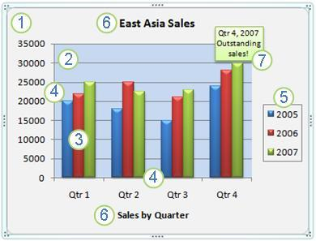
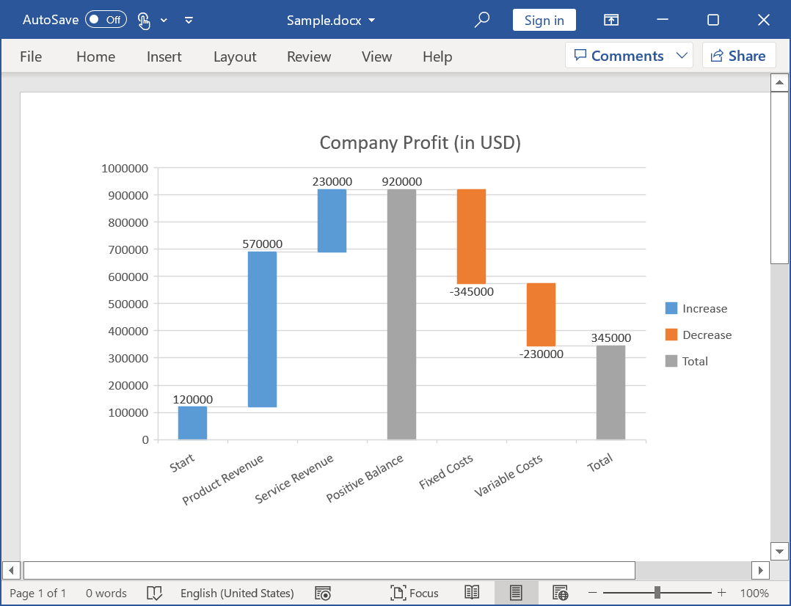

# Working with Charts in Word document

A Chart is a graphical representation of data where the data is represented as symbols such as bars, lines etc. Charts can represent numerical data, functions or some kinds of qualitative structures. DocIO supports the following chart types:

* Bar chart
* Line chart
* Pie chart
* Area chart
* Column chart
* Scatter chart
* Surface chart
* Stock chart
* Radar chart

N> DocIO provides chart support in following platforms – Windows, ASP.NET, WPF, ASP.NET MVC
N> DocIO supports chart only in DOCX and WordML format documents.

## Creating a simple Chart from scratch

A new chart can be created or an existing chart can be modified by using the WChart instance. The following code example illustrates how to create a new chart.




//Creates a new Word document
WordDocument document = new WordDocument();
//Adds section to the document
IWSection sec = document.AddSection();
//Adds paragraph to the section
IWParagraph paragraph = sec.AddParagraph();
//Creates and Appends chart to the paragraph
WChart chart = paragraph.AppendChart(446, 270);
//Sets chart type
chart.ChartType = OfficeChartType.Pie;
//Sets chart title
chart.ChartTitle = "Best Selling Products";
chart.ChartTitleArea.FontName = "Calibri";
chart.ChartTitleArea.Size = 14;
//Sets data for chart
chart.ChartData.SetValue(1, 1, "");
chart.ChartData.SetValue(1, 2, "Sales");
chart.ChartData.SetValue(2, 1, "Phyllis Lapin");
chart.ChartData.SetValue(2, 2, 141.396);
chart.ChartData.SetValue(3, 1, "Stanley Hudson");
chart.ChartData.SetValue(3, 2, 80.368);
chart.ChartData.SetValue(4, 1, "Bernard Shah");
chart.ChartData.SetValue(4, 2, 71.155);
chart.ChartData.SetValue(5, 1, "Patricia Lincoln");
chart.ChartData.SetValue(5, 2, 47.234);
chart.ChartData.SetValue(6, 1, "Camembert Pierrot");
chart.ChartData.SetValue(6, 2, 46.825);
chart.ChartData.SetValue(7, 1, "Thomas Hardy");
chart.ChartData.SetValue(7, 2, 42.593);
chart.ChartData.SetValue(8, 1, "Hanna Moos");
chart.ChartData.SetValue(8, 2, 41.819);
chart.ChartData.SetValue(9, 1, "Alice Mutton");
chart.ChartData.SetValue(9, 2, 32.698);
chart.ChartData.SetValue(10, 1, "Christina Berglund");
chart.ChartData.SetValue(10, 2, 29.171);
chart.ChartData.SetValue(11, 1, "Elizabeth Lincoln");
chart.ChartData.SetValue(11, 2, 25.696);
//Creates a new chart series with the name “Sales”
IOfficeChartSerie pieSeries = chart.Series.Add("Sales");
pieSeries.Values = chart.ChartData[2, 2, 11, 2];
//Sets data label
pieSeries.DataPoints.DefaultDataPoint.DataLabels.IsValue = true;
pieSeries.DataPoints.DefaultDataPoint.DataLabels.Position = OfficeDataLabelPosition.Outside;
//Sets background color
chart.ChartArea.Fill.ForeColor = Color.FromArgb(242, 242, 242);
chart.PlotArea.Fill.ForeColor = Color.FromArgb(242, 242, 242);
chart.ChartArea.Border.LinePattern = OfficeChartLinePattern.None;
//Sets category labels
chart.PrimaryCategoryAxis.CategoryLabels = chart.ChartData[2, 1, 11, 1];            
//Saves the document
document.Save("Sample.docx", FormatType.Docx);
//Closes the document
document.Close();



'Creates a new Word document
Dim document As New WordDocument()
'Adds section to the document
Dim sec As IWSection = document.AddSection()
'Adds paragraph to the section
Dim paragraph As IWParagraph = sec.AddParagraph()
'Creates and Appends chart to the paragraph
Dim chart As WChart = paragraph.AppendChart(446, 270)
'Sets chart type
chart.ChartType = OfficeChartType.Pie
'Sets chart title
chart.ChartTitle = "Best Selling Products"
chart.ChartTitleArea.FontName = "Calibri"
chart.ChartTitleArea.Size = 14
'Sets data for chart
chart.ChartData.SetValue(1, 1, "")
chart.ChartData.SetValue(1, 2, "Sales")
chart.ChartData.SetValue(2, 1, "Phyllis Lapin")
chart.ChartData.SetValue(2, 2, 141.396)
chart.ChartData.SetValue(3, 1, "Stanley Hudson")
chart.ChartData.SetValue(3, 2, 80.368)
chart.ChartData.SetValue(4, 1, "Bernard Shah")
chart.ChartData.SetValue(4, 2, 71.155)
chart.ChartData.SetValue(5, 1, "Patricia Lincoln")
chart.ChartData.SetValue(5, 2, 47.234)
chart.ChartData.SetValue(6, 1, "Camembert Pierrot")
chart.ChartData.SetValue(6, 2, 46.825)
chart.ChartData.SetValue(7, 1, "Thomas Hardy")
chart.ChartData.SetValue(7, 2, 42.593)
chart.ChartData.SetValue(8, 1, "Hanna Moos")
chart.ChartData.SetValue(8, 2, 41.819)
chart.ChartData.SetValue(9, 1, "Alice Mutton")
chart.ChartData.SetValue(9, 2, 32.698)
chart.ChartData.SetValue(10, 1, "Christina Berglund")
chart.ChartData.SetValue(10, 2, 29.171)
chart.ChartData.SetValue(11, 1, "Elizabeth Lincoln")
chart.ChartData.SetValue(11, 2, 25.696)
'Creates a new chart series with the name “Sales”
Dim pieSeries As IOfficeChartSerie = chart.Series.Add("Sales")
pieSeries.Values = chart.ChartData(2, 2, 11, 2)
'Sets data label
pieSeries.DataPoints.DefaultDataPoint.DataLabels.IsValue = True
pieSeries.DataPoints.DefaultDataPoint.DataLabels.Position = OfficeDataLabelPosition.Outside
'Sets background color
chart.ChartArea.Fill.ForeColor = Color.FromArgb(242, 242, 242)
chart.PlotArea.Fill.ForeColor = Color.FromArgb(242, 242, 242)
chart.ChartArea.Border.LinePattern = OfficeChartLinePattern.None
'Sets category labels
chart.PrimaryCategoryAxis.CategoryLabels = chart.ChartData(2, 1, 11, 1)
'Saves the document
document.Save("Sample.docx", FormatType.Docx)
'Closes the document
document.Close()



using (WordDocument document = new WordDocument())
{
    //Adds section to the document
    IWSection sec = document.AddSection();
    //Adds paragraph to the section
    IWParagraph paragraph = sec.AddParagraph();
    //Creates and Appends chart to the paragraph
    WChart chart = paragraph.AppendChart(446, 270);
    //Sets chart type
    chart.ChartType = OfficeChartType.Pie;
    //Sets chart title
    chart.ChartTitle = "Best Selling Products";
    chart.ChartTitleArea.FontName = "Calibri";
    chart.ChartTitleArea.Size = 14;
    //Sets data for chart
    chart.ChartData.SetValue(1, 1, "");
    chart.ChartData.SetValue(1, 2, "Sales");
    chart.ChartData.SetValue(2, 1, "Phyllis Lapin");
    chart.ChartData.SetValue(2, 2, 141.396);
    chart.ChartData.SetValue(3, 1, "Stanley Hudson");
    chart.ChartData.SetValue(3, 2, 80.368);
    chart.ChartData.SetValue(4, 1, "Bernard Shah");
    chart.ChartData.SetValue(4, 2, 71.155);
    chart.ChartData.SetValue(5, 1, "Patricia Lincoln");
    chart.ChartData.SetValue(5, 2, 47.234);
    chart.ChartData.SetValue(6, 1, "Camembert Pierrot");
    chart.ChartData.SetValue(6, 2, 46.825);
    chart.ChartData.SetValue(7, 1, "Thomas Hardy");
    chart.ChartData.SetValue(7, 2, 42.593);
    chart.ChartData.SetValue(8, 1, "Hanna Moos");
    chart.ChartData.SetValue(8, 2, 41.819);
    chart.ChartData.SetValue(9, 1, "Alice Mutton");
    chart.ChartData.SetValue(9, 2, 32.698);
    chart.ChartData.SetValue(10, 1, "Christina Berglund");
    chart.ChartData.SetValue(10, 2, 29.171);
    chart.ChartData.SetValue(11, 1, "Elizabeth Lincoln");
    chart.ChartData.SetValue(11, 2, 25.696);
    //Creates a new chart series with the name “Sales”
    IOfficeChartSerie pieSeries = chart.Series.Add("Sales");
    pieSeries.Values = chart.ChartData[2, 2, 11, 2];
    //Sets data label
    pieSeries.DataPoints.DefaultDataPoint.DataLabels.IsValue = true;
    pieSeries.DataPoints.DefaultDataPoint.DataLabels.Position = OfficeDataLabelPosition.Outside;
    //Sets background color
    chart.ChartArea.Fill.ForeColor = Syncfusion.Drawing.Color.FromArgb(242, 242, 242);
    chart.PlotArea.Fill.ForeColor = Syncfusion.Drawing.Color.FromArgb(242, 242, 242);
    chart.ChartArea.Border.LinePattern = OfficeChartLinePattern.None;
    //Sets category labels
    chart.PrimaryCategoryAxis.CategoryLabels = chart.ChartData[2, 1, 11, 1];
    MemoryStream stream = new MemoryStream();
    //Saves the Word file to MemoryStream
    await document.SaveAsync(stream, FormatType.Docx);
    //Saves the stream as Word file in local machine
    Save(stream, "Result.docx");
    document.Close();
    //Please refer the below link to save Word document in UWP platform
    //https://help.syncfusion.com/file-formats/docio/create-word-document-in-uwp#save-word-document-in-uwp
}



//Creates a new instance of WordDocument (Empty Word Document)
using (WordDocument document = new WordDocument())
{
    //Adds section to the document
    IWSection sec = document.AddSection();
    //Adds paragraph to the section
    IWParagraph paragraph = sec.AddParagraph();
    //Creates and Appends chart to the paragraph
    WChart chart = paragraph.AppendChart(446, 270);
    //Sets chart type
    chart.ChartType = OfficeChartType.Pie;
    //Sets chart title
    chart.ChartTitle = "Best Selling Products";
    chart.ChartTitleArea.FontName = "Calibri";
    chart.ChartTitleArea.Size = 14;
    //Sets data for chart
    chart.ChartData.SetValue(1, 1, "");
    chart.ChartData.SetValue(1, 2, "Sales");
    chart.ChartData.SetValue(2, 1, "Phyllis Lapin");
    chart.ChartData.SetValue(2, 2, 141.396);
    chart.ChartData.SetValue(3, 1, "Stanley Hudson");
    chart.ChartData.SetValue(3, 2, 80.368);
    chart.ChartData.SetValue(4, 1, "Bernard Shah");
    chart.ChartData.SetValue(4, 2, 71.155);
    chart.ChartData.SetValue(5, 1, "Patricia Lincoln");
    chart.ChartData.SetValue(5, 2, 47.234);
    chart.ChartData.SetValue(6, 1, "Camembert Pierrot");
    chart.ChartData.SetValue(6, 2, 46.825);
    chart.ChartData.SetValue(7, 1, "Thomas Hardy");
    chart.ChartData.SetValue(7, 2, 42.593);
    chart.ChartData.SetValue(8, 1, "Hanna Moos");
    chart.ChartData.SetValue(8, 2, 41.819);
    chart.ChartData.SetValue(9, 1, "Alice Mutton");
    chart.ChartData.SetValue(9, 2, 32.698);
    chart.ChartData.SetValue(10, 1, "Christina Berglund");
    chart.ChartData.SetValue(10, 2, 29.171);
    chart.ChartData.SetValue(11, 1, "Elizabeth Lincoln");
    chart.ChartData.SetValue(11, 2, 25.696);
    //Creates a new chart series with the name “Sales”
    IOfficeChartSerie pieSeries = chart.Series.Add("Sales");
    pieSeries.Values = chart.ChartData[2, 2, 11, 2];
    //Sets data label
    pieSeries.DataPoints.DefaultDataPoint.DataLabels.IsValue = true;
    pieSeries.DataPoints.DefaultDataPoint.DataLabels.Position = OfficeDataLabelPosition.Outside;
    //Sets background color
    chart.ChartArea.Fill.ForeColor = Syncfusion.Drawing.Color.FromArgb(242, 242, 242);
    chart.PlotArea.Fill.ForeColor = Syncfusion.Drawing.Color.FromArgb(242, 242, 242);
    chart.ChartArea.Border.LinePattern = OfficeChartLinePattern.None;
    //Sets category labels
    chart.PrimaryCategoryAxis.CategoryLabels = chart.ChartData[2, 1, 11, 1];
    MemoryStream stream = new MemoryStream();
    //Saves the Word document to  MemoryStream
    document.Save(stream, FormatType.Docx);
    document.Close();
    stream.Position = 0;
    //Download Word document in the browser
    return File(stream, "application/msword", "Result.docx");
}



using (WordDocument document = new WordDocument())
{
    //Adds section to the document
    IWSection sec = document.AddSection();
    //Adds paragraph to the section
    IWParagraph paragraph = sec.AddParagraph();
    //Creates and Appends chart to the paragraph
    WChart chart = paragraph.AppendChart(446, 270);
    //Sets chart type
    chart.ChartType = OfficeChartType.Pie;
    //Sets chart title
    chart.ChartTitle = "Best Selling Products";
    chart.ChartTitleArea.FontName = "Calibri";
    chart.ChartTitleArea.Size = 14;
    //Sets data for chart
    chart.ChartData.SetValue(1, 1, "");
    chart.ChartData.SetValue(1, 2, "Sales");
    chart.ChartData.SetValue(2, 1, "Phyllis Lapin");
    chart.ChartData.SetValue(2, 2, 141.396);
    chart.ChartData.SetValue(3, 1, "Stanley Hudson");
    chart.ChartData.SetValue(3, 2, 80.368);
    chart.ChartData.SetValue(4, 1, "Bernard Shah");
    chart.ChartData.SetValue(4, 2, 71.155);
    chart.ChartData.SetValue(5, 1, "Patricia Lincoln");
    chart.ChartData.SetValue(5, 2, 47.234);
    chart.ChartData.SetValue(6, 1, "Camembert Pierrot");
    chart.ChartData.SetValue(6, 2, 46.825);
    chart.ChartData.SetValue(7, 1, "Thomas Hardy");
    chart.ChartData.SetValue(7, 2, 42.593);
    chart.ChartData.SetValue(8, 1, "Hanna Moos");
    chart.ChartData.SetValue(8, 2, 41.819);
    chart.ChartData.SetValue(9, 1, "Alice Mutton");
    chart.ChartData.SetValue(9, 2, 32.698);
    chart.ChartData.SetValue(10, 1, "Christina Berglund");
    chart.ChartData.SetValue(10, 2, 29.171);
    chart.ChartData.SetValue(11, 1, "Elizabeth Lincoln");
    chart.ChartData.SetValue(11, 2, 25.696);
    //Creates a new chart series with the name “Sales”
    IOfficeChartSerie pieSeries = chart.Series.Add("Sales");
    pieSeries.Values = chart.ChartData[2, 2, 11, 2];
    //Sets data label
    pieSeries.DataPoints.DefaultDataPoint.DataLabels.IsValue = true;
    pieSeries.DataPoints.DefaultDataPoint.DataLabels.Position = OfficeDataLabelPosition.Outside;
    //Sets background color
    chart.ChartArea.Fill.ForeColor = Syncfusion.Drawing.Color.FromArgb(242, 242, 242);
    chart.PlotArea.Fill.ForeColor = Syncfusion.Drawing.Color.FromArgb(242, 242, 242);
    chart.ChartArea.Border.LinePattern = OfficeChartLinePattern.None;
    //Sets category labels
    chart.PrimaryCategoryAxis.CategoryLabels = chart.ChartData[2, 1, 11, 1];
    MemoryStream stream = new MemoryStream();
    document.Save(stream, FormatType.Docx);
    //Save the stream as a file in the device and invoke it for viewing
    Xamarin.Forms.DependencyService.Get<ISave>().SaveAndView("WorkingWorddoc.docx", "application/msword", stream);
    //Please download the helper files from the below link to save the stream as file and open the file for viewing in Xamarin platform
    //https://help.syncfusion.com/file-formats/docio/create-word-document-in-xamarin#helper-files-for-xamarin
    //Closes the documents
    document.Close();
}




You can download a complete working sample from [GitHub](https://github.com/SyncfusionExamples/DocIO-Examples/tree/main/Charts/Create-chart-from-scratch).

## Creating a Chart from Excel file

The chart data can be set through the object array or can be loaded from the excel stream. The specific range of the data from the excel file can be used to set chart data. 

The following code example illustrates the chart data loaded from the excel file.




//Creates a new Word document
WordDocument document = new WordDocument();
//Adds section to the document
IWSection sec = document.AddSection();
//Adds paragraph to the section
IWParagraph paragraph = sec.AddParagraph();
//Loads the excel file as stream
Stream excelStream = File.OpenRead("Excel_Template.xlsx");
//Creates and Appends chart to the paragraph with excel stream as parameter
WChart chart = paragraph.AppendChart(excelStream, 1, "B2:C6", 470, 300);
//Sets chart type and title
chart.ChartType = OfficeChartType.Column_Clustered;
chart.ChartTitle = "Purchase Details";
chart.ChartTitleArea.FontName = "Calibri";
chart.ChartTitleArea.Size = 14;
chart.ChartArea.Border.LinePattern = OfficeChartLinePattern.None;       
//Sets name to chart series
chart.Series[0].Name = "Sum of Purchases";
chart.Series[1].Name = "Sum of Future Expenses";
chart.PrimaryCategoryAxis.Title = "Products";
chart.PrimaryValueAxis.Title = "In Dollars";
//Sets position of legend
chart.Legend.Position = OfficeLegendPosition.Bottom;
//Saves the document
document.Save("Sample.docx", FormatType.Docx);
//Closes the document
document.Close();



'Creates a new Word document
Dim document As New WordDocument()
'Adds section to the document
Dim sec As IWSection = document.AddSection()
'Adds paragraph to the section
Dim paragraph As IWParagraph = sec.AddParagraph()
'Loads the excel file as stream
Dim excelStream As Stream = File.OpenRead("Excel_Template.xlsx")
'Creates and Appends chart to the paragraph with excel stream as parameter
Dim chart As WChart = paragraph.AppendChart(excelStream, 1, "B2:C6", 470, 300)
'Sets chart type and title
chart.ChartType = OfficeChartType.Column_Clustered
chart.ChartTitle = "Purchase Details"
chart.ChartTitleArea.FontName = "Calibri"
chart.ChartTitleArea.Size = 14
chart.ChartArea.Border.LinePattern = OfficeChartLinePattern.None
'Sets name to chart series
chart.Series(0).Name = "Sum of Purchases"
chart.Series(1).Name = "Sum of Future Expenses"
chart.PrimaryCategoryAxis.Title = "Products"
chart.PrimaryValueAxis.Title = "In Dollars"
'Sets position of legend
chart.Legend.Position = OfficeLegendPosition.Bottom
'Saves the document
document.Save("Sample.docx", FormatType.Docx)
'Closes the document
document.Close()



using (WordDocument document = new WordDocument())
{
    //Adds section to the document
    IWSection sec = document.AddSection();
    //Adds paragraph to the section
    IWParagraph paragraph = sec.AddParagraph();
    //Loads the excel file as stream
    Stream excelStream = File.OpenRead("Excel_Template.xlsx");
    //Creates and Appends chart to the paragraph with excel stream as parameter
    WChart chart = paragraph.AppendChart(excelStream, 1, "B2:C6", 470, 300);
    //Sets chart type and title
    chart.ChartType = OfficeChartType.Column_Clustered;
    chart.ChartTitle = "Purchase Details";
    chart.ChartTitleArea.FontName = "Calibri";
    chart.ChartTitleArea.Size = 14;
    chart.ChartArea.Border.LinePattern = OfficeChartLinePattern.None;
    //Sets name to chart series
    chart.Series[0].Name = "Sum of Purchases";
    chart.Series[1].Name = "Sum of Future Expenses";
    chart.PrimaryCategoryAxis.Title = "Products";
    chart.PrimaryValueAxis.Title = "In Dollars";
    //Sets position of legend
    chart.Legend.Position = OfficeLegendPosition.Bottom;
    MemoryStream stream = new MemoryStream();
    //Saves the Word file to MemoryStream
    await document.SaveAsync(stream, FormatType.Docx);
    //Saves the stream as Word file in local machine
    Save(stream, "Result.docx");
    document.Close();
    //Please refer the below link to save Word document in UWP platform
    //https://help.syncfusion.com/file-formats/docio/create-word-document-in-uwp#save-word-document-in-uwp
}



//Creates a new instance of WordDocument (Empty Word Document)
using (WordDocument document = new WordDocument())
{
    //Adds section to the document
    IWSection sec = document.AddSection();
    //Adds paragraph to the section
    IWParagraph paragraph = sec.AddParagraph();
    //Loads the excel file as stream
    Stream excelStream = File.OpenRead("Excel_Template.xlsx");
    //Creates and Appends chart to the paragraph with excel stream as parameter
    WChart chart = paragraph.AppendChart(excelStream, 1, "B2:C6", 470, 300);
    //Sets chart type and title
    chart.ChartType = OfficeChartType.Column_Clustered;
    chart.ChartTitle = "Purchase Details";
    chart.ChartTitleArea.FontName = "Calibri";
    chart.ChartTitleArea.Size = 14;
    chart.ChartArea.Border.LinePattern = OfficeChartLinePattern.None;
    //Sets name to chart series
    chart.Series[0].Name = "Sum of Purchases";
    chart.Series[1].Name = "Sum of Future Expenses";
    chart.PrimaryCategoryAxis.Title = "Products";
    chart.PrimaryValueAxis.Title = "In Dollars";
    //Sets position of legend
    chart.Legend.Position = OfficeLegendPosition.Bottom;
    MemoryStream stream = new MemoryStream();
    //Saves the Word document to  MemoryStream
    document.Save(stream, FormatType.Docx);
    document.Close();
    stream.Position = 0;
    //Download Word document in the browser
    return File(stream, "application/msword", "Result.docx");
}



using (WordDocument document = new WordDocument())
{
    //Adds section to the document
    IWSection sec = document.AddSection();
    //Adds paragraph to the section
    IWParagraph paragraph = sec.AddParagraph();
    //Loads the excel file as stream
    Stream excelStream = File.OpenRead("Excel_Template.xlsx");
    //Creates and Appends chart to the paragraph with excel stream as parameter
    WChart chart = paragraph.AppendChart(excelStream, 1, "B2:C6", 470, 300);
    //Sets chart type and title
    chart.ChartType = OfficeChartType.Column_Clustered;
    chart.ChartTitle = "Purchase Details";
    chart.ChartTitleArea.FontName = "Calibri";
    chart.ChartTitleArea.Size = 14;
    chart.ChartArea.Border.LinePattern = OfficeChartLinePattern.None;
    //Sets name to chart series
    chart.Series[0].Name = "Sum of Purchases";
    chart.Series[1].Name = "Sum of Future Expenses";
    chart.PrimaryCategoryAxis.Title = "Products";
    chart.PrimaryValueAxis.Title = "In Dollars";
    //Sets position of legend
    chart.Legend.Position = OfficeLegendPosition.Bottom;
    MemoryStream stream = new MemoryStream();
    document.Save(stream, FormatType.Docx);
    //Save the stream as a file in the device and invoke it for viewing
    Xamarin.Forms.DependencyService.Get<ISave>().SaveAndView("WorkingWorddoc.docx", "application/msword", stream);
    //Please download the helper files from the below link to save the stream as file and open the file for viewing in Xamarin platform
    //https://help.syncfusion.com/file-formats/docio/create-word-document-in-xamarin#helper-files-for-xamarin
    //Closes the documents
    document.Close();
}



You can download a complete working sample from [GitHub](https://github.com/SyncfusionExamples/DocIO-Examples/tree/main/Charts/Create-chart-from-Excel-file).

## Creating Custom Charts

A chart is composed of data series. Each data series is represented by a series object. When creating a custom chart, you can specify different series types for each data series. 

The following code example illustrates how to create custom charts.

  


//Creates a new Word document
WordDocument document = new WordDocument();
//Adds section to the document
IWSection sec = document.AddSection();
//Adds paragraph to the section
IWParagraph paragraph = sec.AddParagraph();
//Inputs data for chart
object[][] data = new object[6][];
for (int i = 0; i < 6; i++)
    data[i] = new object[3];
data[0][0] = "";
data[1][0] = "Camembert Pierrot";
data[2][0] = "Alice Mutton";
data[3][0] = "Roasted Tigers";
data[4][0] = "Orange Shake";
data[5][0] = "Dried Apples";
data[0][1] = "Sum of Purchases";
data[1][1] = 286;
data[2][1] = 680;
data[3][1] = 288;
data[4][1] = 200;
data[5][1] = 731;
data[0][2] = "Sum of Future Expenses";
data[1][2] = 1300;
data[2][2] = 700;
data[3][2] = 1280;
data[4][2] = 1200;
data[5][2] = 2660;
//Creates and Appends chart to the paragraph
WChart chart = paragraph.AppendChart(data, 470, 300);
//Sets chart type and title
chart.ChartTitle = "Purchase Details";
chart.ChartTitleArea.FontName = "Calibri";
chart.ChartTitleArea.Size = 14;
chart.ChartArea.Border.LinePattern = OfficeChartLinePattern.None;
//Sets series type 
chart.Series[0].SerieType = OfficeChartType.Line_Markers;
chart.Series[1].SerieType = OfficeChartType.Bar_Clustered;
chart.PrimaryCategoryAxis.Title = "Products";
chart.PrimaryValueAxis.Title = "In Dollars";
//Sets position of legend
chart.Legend.Position = OfficeLegendPosition.Bottom;
//Saves the document
document.Save("Sample.docx", FormatType.Docx);
//Closes the document
document.Close();



'Creates a new Word document
Dim document As New WordDocument()
'Adds section to the document
Dim sec As IWSection = document.AddSection()
'Adds paragraph to the section
Dim paragraph As IWParagraph = sec.AddParagraph()
'Inputs data for chart
Dim data As Object()() = New Object(5)() {}
For i As Integer = 0 To 5
    data(i) = New Object(2) {}
Next
data(0)(0) = ""
data(1)(0) = "Camembert Pierrot"
data(2)(0) = "Alice Mutton"
data(3)(0) = "Roasted Tigers"
data(4)(0) = "Orange Shake"
data(5)(0) = "Dried Apples"
data(0)(1) = "Sum of Purchases"
data(1)(1) = 286
data(2)(1) = 680
data(3)(1) = 288
data(4)(1) = 200
data(5)(1) = 731
data(0)(2) = "Sum of Future Expenses"
data(1)(2) = 1300
data(2)(2) = 700
data(3)(2) = 1280
data(4)(2) = 1200
data(5)(2) = 2660
'Creates and Appends chart to the paragraph
Dim chart As WChart = paragraph.AppendChart(data, 470, 300)
'Sets chart type and title
chart.ChartTitle = "Purchase Details"
chart.ChartTitleArea.FontName = "Calibri"
chart.ChartTitleArea.Size = 14
chart.ChartArea.Border.LinePattern = OfficeChartLinePattern.None
'Sets series type 
chart.Series(0).SerieType = OfficeChartType.Line_Markers
chart.Series(1).SerieType = OfficeChartType.Bar_Clustered
chart.PrimaryCategoryAxis.Title = "Products"
chart.PrimaryValueAxis.Title = "In Dollars"
'Sets position of legend
chart.Legend.Position = OfficeLegendPosition.Bottom
'Saves the document
document.Save("Sample.docx", FormatType.Docx)
'Closes the document
document.Close()



using (WordDocument document = new WordDocument())
{
    //Adds section to the document
    IWSection sec = document.AddSection();
    //Adds paragraph to the section
    IWParagraph paragraph = sec.AddParagraph();
    //Inputs data for chart
    object[][] data = new object[6][];
    for (int i = 0; i < 6; i++)
        data[i] = new object[3];
    data[0][0] = "";
    data[1][0] = "Camembert Pierrot";
    data[2][0] = "Alice Mutton";
    data[3][0] = "Roasted Tigers";
    data[4][0] = "Orange Shake";
    data[5][0] = "Dried Apples";
    data[0][1] = "Sum of Purchases";
    data[1][1] = 286;
    data[2][1] = 680;
    data[3][1] = 288;
    data[4][1] = 200;
    data[5][1] = 731;
    data[0][2] = "Sum of Future Expenses";
    data[1][2] = 1300;
    data[2][2] = 700;
    data[3][2] = 1280;
    data[4][2] = 1200;
    data[5][2] = 2660;
    //Creates and Appends chart to the paragraph
    WChart chart = paragraph.AppendChart(data, 470, 300);
    //Sets chart type and title
    chart.ChartTitle = "Purchase Details";
    chart.ChartTitleArea.FontName = "Calibri";
    chart.ChartTitleArea.Size = 14;
    chart.ChartArea.Border.LinePattern = OfficeChartLinePattern.None;
    //Sets series type 
    chart.Series[0].SerieType = OfficeChartType.Line_Markers;
    chart.Series[1].SerieType = OfficeChartType.Bar_Clustered;
    chart.PrimaryCategoryAxis.Title = "Products";
    chart.PrimaryValueAxis.Title = "In Dollars";
    //Sets position of legend
    chart.Legend.Position = OfficeLegendPosition.Bottom;
    MemoryStream stream = new MemoryStream();
    //Saves the Word file to MemoryStream
    await document.SaveAsync(stream, FormatType.Docx);
    //Saves the stream as Word file in local machine
    Save(stream, "Result.docx");
    document.Close();
    //Please refer the below link to save Word document in UWP platform
    //https://help.syncfusion.com/file-formats/docio/create-word-document-in-uwp#save-word-document-in-uwp
}



//Creates a new instance of WordDocument (Empty Word Document)
using (WordDocument document = new WordDocument())
{
    //Adds section to the document
    IWSection sec = document.AddSection();
    //Adds paragraph to the section
    IWParagraph paragraph = sec.AddParagraph();
    //Inputs data for chart
    object[][] data = new object[6][];
    for (int i = 0; i < 6; i++)
        data[i] = new object[3];
    data[0][0] = "";
    data[1][0] = "Camembert Pierrot";
    data[2][0] = "Alice Mutton";
    data[3][0] = "Roasted Tigers";
    data[4][0] = "Orange Shake";
    data[5][0] = "Dried Apples";
    data[0][1] = "Sum of Purchases";
    data[1][1] = 286;
    data[2][1] = 680;
    data[3][1] = 288;
    data[4][1] = 200;
    data[5][1] = 731;
    data[0][2] = "Sum of Future Expenses";
    data[1][2] = 1300;
    data[2][2] = 700;
    data[3][2] = 1280;
    data[4][2] = 1200;
    data[5][2] = 2660;
    //Creates and Appends chart to the paragraph
    WChart chart = paragraph.AppendChart(data, 470, 300);
    //Sets chart type and title
    chart.ChartTitle = "Purchase Details";
    chart.ChartTitleArea.FontName = "Calibri";
    chart.ChartTitleArea.Size = 14;
    chart.ChartArea.Border.LinePattern = OfficeChartLinePattern.None;
    //Sets series type 
    chart.Series[0].SerieType = OfficeChartType.Line_Markers;
    chart.Series[1].SerieType = OfficeChartType.Bar_Clustered;
    chart.PrimaryCategoryAxis.Title = "Products";
    chart.PrimaryValueAxis.Title = "In Dollars";
    //Sets position of legend
    chart.Legend.Position = OfficeLegendPosition.Bottom;
    MemoryStream stream = new MemoryStream();
    //Saves the Word document to  MemoryStream
    document.Save(stream, FormatType.Docx);
    document.Close();
    stream.Position = 0;
    //Download Word document in the browser
    return File(stream, "application/msword", "Result.docx");
}



using (WordDocument document = new WordDocument())
{
    //Adds section to the document
    IWSection sec = document.AddSection();
    //Adds paragraph to the section
    IWParagraph paragraph = sec.AddParagraph();
    //Inputs data for chart
    object[][] data = new object[6][];
    for (int i = 0; i < 6; i++)
        data[i] = new object[3];
    data[0][0] = "";
    data[1][0] = "Camembert Pierrot";
    data[2][0] = "Alice Mutton";
    data[3][0] = "Roasted Tigers";
    data[4][0] = "Orange Shake";
    data[5][0] = "Dried Apples";
    data[0][1] = "Sum of Purchases";
    data[1][1] = 286;
    data[2][1] = 680;
    data[3][1] = 288;
    data[4][1] = 200;
    data[5][1] = 731;
    data[0][2] = "Sum of Future Expenses";
    data[1][2] = 1300;
    data[2][2] = 700;
    data[3][2] = 1280;
    data[4][2] = 1200;
    data[5][2] = 2660;
    //Creates and Appends chart to the paragraph
    WChart chart = paragraph.AppendChart(data, 470, 300);
    //Sets chart type and title
    chart.ChartTitle = "Purchase Details";
    chart.ChartTitleArea.FontName = "Calibri";
    chart.ChartTitleArea.Size = 14;
    chart.ChartArea.Border.LinePattern = OfficeChartLinePattern.None;
    //Sets series type 
    chart.Series[0].SerieType = OfficeChartType.Line_Markers;
    chart.Series[1].SerieType = OfficeChartType.Bar_Clustered;
    chart.PrimaryCategoryAxis.Title = "Products";
    chart.PrimaryValueAxis.Title = "In Dollars";
    //Sets position of legend
    chart.Legend.Position = OfficeLegendPosition.Bottom;
    MemoryStream stream = new MemoryStream();
    document.Save(stream, FormatType.Docx);
    //Save the stream as a file in the device and invoke it for viewing
    Xamarin.Forms.DependencyService.Get<ISave>().SaveAndView("WorkingWorddoc.docx", "application/msword", stream);
    //Please download the helper files from the below link to save the stream as file and open the file for viewing in Xamarin platform
    //https://help.syncfusion.com/file-formats/docio/create-word-document-in-xamarin#helper-files-for-xamarin
    //Closes the documents               
    document.Close();
}




You can download a complete working sample from [GitHub](https://github.com/SyncfusionExamples/DocIO-Examples/tree/main/Charts/Create-custom-chart).

## Refreshing the Chart

The chart may not have the data in the referred excel file instead it may represent some other data. For those charts to have the excel data, it should be refreshed. 

The following code example illustrates how to refresh the chart.




//Loads the template document
WordDocument document = new WordDocument("Template.docx");
//Gets the last paragraph
WParagraph paragraph = document.LastParagraph;
//Gets the chart entity from the paragraph items
WChart chart = paragraph.ChildEntities[1] as WChart;
//Refreshes chart data
chart.Refresh();
//Saves and closes the document
document.Save("Sample.docx", FormatType.Docx);
document.Close();



'Loads the template document
Dim document As New WordDocument("Template.docx")
'Gets the last paragraph
Dim paragraph As WParagraph = document.LastParagraph
'Gets the chart entity from the paragraph items
Dim chart As WChart = TryCast(paragraph.ChildEntities(1), WChart)
'Refreshes chart data
chart.Refresh()
'Saves and closes the document
document.Save("Sample.docx", FormatType.Docx)
document.Close()



//"App" is the class of Portable project.
Assembly assembly = typeof(App).GetTypeInfo().Assembly;
//Opens an existing document from file system through constructor of WordDocument class
using (WordDocument document = new WordDocument((assembly.GetManifestResourceStream("CreateWordSample.Assets.Test.docx")), FormatType.Docx))
{
    //Gets the last paragraph
    WParagraph paragraph = document.LastParagraph;
    //Gets the chart entity from the paragraph items
    WChart chart = paragraph.ChildEntities[1] as WChart;
    //Refreshes chart data
    chart.Refresh();
    MemoryStream stream = new MemoryStream();
    await document.SaveAsync(stream, FormatType.Docx);
    //Saves the stream as Word file in local machine
    Save(stream, "Protection.docx");
    //Closes the Word document
    document.Close();
    //Please refer the below link to save Word document in UWP platform
    //https://help.syncfusion.com/file-formats/docio/create-word-document-in-uwp#save-word-document-in-uwp
}



FileStream fileStreamPath = new FileStream(@"Data/Template.docx", FileMode.Open, FileAccess.Read, FileShare.ReadWrite);
//Opens an existing document from file system through constructor of WordDocument class
using (WordDocument document = new WordDocument(fileStreamPath, FormatType.Docx))
{
    //Gets the last paragraph
    WParagraph paragraph = document.LastParagraph;
    //Gets the chart entity from the paragraph items
    WChart chart = paragraph.ChildEntities[1] as WChart;
    //Refreshes chart data
    chart.Refresh();
    MemoryStream stream = new MemoryStream();
    document.Save(stream, FormatType.docx);
    //Closes the Word document
    document.Close();
    stream.Position = 0;
    //Download Word document in the browser
    return File(stream, "application/msword", "Protection.docx");
}



Assembly assembly = typeof(App).GetTypeInfo().Assembly;
//Opens an existing document from file system through constructor of WordDocument class
using (WordDocument document = new WordDocument((assembly.GetManifestResourceStream("XamarinFormsApp1.Assets.Hello World.docx")), FormatType.Docx))
{
    //Gets the last paragraph
    WParagraph paragraph = document.LastParagraph;
    //Gets the chart entity from the paragraph items
    WChart chart = paragraph.ChildEntities[1] as WChart;
    //Refreshes chart data
    chart.Refresh();
    MemoryStream stream = new MemoryStream();
    document.Save(stream, FormatType.Docx);
    //Save the stream as a file in the device and invoke it for viewing
    Xamarin.Forms.DependencyService.Get<ISave>().SaveAndView("Protection.docx", "application/msword", stream);
    //Please download the helper files from the below link to save the stream as file and open the file for viewing in Xamarin platform
    //https://help.syncfusion.com/file-formats/docio/create-word-document-in-xamarin#helper-files-for-xamarin
    //Closes the Word document
    document.Close();
}


  

You can download a complete working sample from [GitHub](https://github.com/SyncfusionExamples/DocIO-Examples/tree/main/Charts/Refresh-chart-data).

## Modifying the Chart data

The following code example illustrates how to modify an existing chart data.




//Loads the template document
WordDocument document = new WordDocument("Template.docx");
//Gets the last paragraph
WParagraph paragraph = document.LastParagraph;
//Gets the chart entity from the paragraph items
WChart chart = paragraph.ChildEntities[0] as WChart;
//Modifies the data values of chart
chart.ChartData.SetValue(2, 2, 120);
chart.ChartData.SetValue(3, 2, 60);
chart.ChartData.SetValue(4, 2, 70);
//Refreshes chart data to set the modified values
chart.Refresh();
//Saves and closes the document
document.Save("Sample.docx", FormatType.Docx);
document.Close();



'Loads the template document
Dim document As New WordDocument("Template.docx")
'Gets the last paragraph
Dim paragraph As WParagraph = document.LastParagraph
'Gets the chart entity from the paragraph items
Dim chart As WChart = TryCast(paragraph.ChildEntities(0), WChart)
'Modifies the data values of chart
chart.ChartData.SetValue(2, 2, 120)
chart.ChartData.SetValue(3, 2, 60)
chart.ChartData.SetValue(4, 2, 70)
'Refreshes chart data to set the modified values
chart.Refresh()
'Saves and closes the document
document.Save("Sample.docx", FormatType.Docx)
document.Close()



//"App" is the class of Portable project.
Assembly assembly = typeof(App).GetTypeInfo().Assembly;
//Opens an existing document from file system through constructor of WordDocument class
using (WordDocument document = new WordDocument((assembly.GetManifestResourceStream("CreateWordSample.Assets.Test.docx")), FormatType.Docx))
{
    //Gets the last paragraph
    WParagraph paragraph = document.LastParagraph;
    //Gets the chart entity from the paragraph items
    WChart chart = paragraph.ChildEntities[0] as WChart;
    //Modifies the data values of chart
    chart.ChartData.SetValue(2, 2, 120);
    chart.ChartData.SetValue(3, 2, 60);
    chart.ChartData.SetValue(4, 2, 70);
    //Refreshes chart data to set the modified values
    chart.Refresh();
    MemoryStream stream = new MemoryStream();
    await document.SaveAsync(stream, FormatType.Docx);
    //Saves the stream as Word file in local machine
    Save(stream, "Result.docx");
    //Closes the Word document
    document.Close();
    //Please refer the below link to save Word document in UWP platform
    //https://help.syncfusion.com/file-formats/docio/create-word-document-in-uwp#save-word-document-in-uwp
}



FileStream fileStreamPath = new FileStream(@"Data/Template.docx", FileMode.Open, FileAccess.Read, FileShare.ReadWrite);
//Opens an existing document from file system through constructor of WordDocument class
using (WordDocument document = new WordDocument(fileStreamPath, FormatType.Docx))
{
    //Gets the last paragraph
    WParagraph paragraph = document.LastParagraph;
    //Gets the chart entity from the paragraph items
    WChart chart = paragraph.ChildEntities[0] as WChart;
    //Modifies the data values of chart
    chart.ChartData.SetValue(2, 2, 120);
    chart.ChartData.SetValue(3, 2, 60);
    chart.ChartData.SetValue(4, 2, 70);
    //Refreshes chart data to set the modified values
    chart.Refresh();
    MemoryStream stream = new MemoryStream();
    document.Save(stream, FormatType.docx);
    //Closes the Word document
    document.Close();
    stream.Position = 0;
    //Download Word document in the browser
    return File(stream, "application/msword", "Result.docx");
}



Assembly assembly = typeof(App).GetTypeInfo().Assembly;
//Opens an existing document from file system through constructor of WordDocument class
using (WordDocument document = new WordDocument((assembly.GetManifestResourceStream("XamarinFormsApp1.Assets.Hello World.docx")), FormatType.Docx))
{
    //Gets the last paragraph
    WParagraph paragraph = document.LastParagraph;
    //Gets the chart entity from the paragraph items
    WChart chart = paragraph.ChildEntities[0] as WChart;
    //Modifies the data values of chart
    chart.ChartData.SetValue(2, 2, 120);
    chart.ChartData.SetValue(3, 2, 60);
    chart.ChartData.SetValue(4, 2, 70);
    //Refreshes chart data to set the modified values
    chart.Refresh();
    MemoryStream stream = new MemoryStream();
    document.Save(stream, FormatType.Docx);
    //Save the stream as a file in the device and invoke it for viewing
    Xamarin.Forms.DependencyService.Get<ISave>().SaveAndView("Result.docx", "application/msword", stream);
    //Please download the helper files from the below link to save the stream as file and open the file for viewing in Xamarin platform
    //https://help.syncfusion.com/file-formats/docio/create-word-document-in-xamarin#helper-files-for-xamarin
    //Closes the Word document
    document.Close();
}




You can download a complete working sample from [GitHub](https://github.com/SyncfusionExamples/DocIO-Examples/tree/main/Charts/Modify-an-existing-chart-data).

## Customizing the Chart & its elements

A Chart is composed of various elements such as plot area, chart area, title area, legend, data labels, axis etc. The following screenshot illustrates the various elements of chart.

1. The chart area of the chart.
2. The plot area of the chart.
3. The data points of the data series that are plotted in the chart.
4. The horizontal (category) and vertical (value) axis along where the data is plotted in the chart.
5. The legend of the chart.
6. The chart title and axis.
7. A data label that you can use to identify the details of a data point in a data series.

### Modifying Chart Appearance

The following code example illustrates how to modify the appearance of an existing chart in the document.




//Loads the template document
WordDocument document = new WordDocument("Template.docx", FormatType.Docx);
//Gets the paragraph
WParagraph paragraph = document.LastParagraph;
//Gets the chart entity
WChart chart = paragraph.ChildEntities[0] as WChart;
//Modifies the chart height and width
chart.Height = 300;
chart.Width = 500;
//Changes the title
chart.ChartTitle = "New title";
//Changes the series name of first chart series
chart.Series[0].Name = "Modified series name";
//Hides the category labels
chart.CategoryLabelLevel = OfficeCategoriesLabelLevel.CategoriesLabelLevelNone;
//Shows data Table.
chart.HasDataTable = true;
//Formats the chart area.
IOfficeChartFrameFormat chartArea = chart.ChartArea;
//Sets border line pattern, color, line weight
chartArea.Border.LinePattern = OfficeChartLinePattern.Solid;
chartArea.Border.LineColor = Color.Blue;
chartArea.Border.LineWeight = OfficeChartLineWeight.Hairline;
//Sets fill type and fill colors
chartArea.Fill.FillType = OfficeFillType.Gradient;
chartArea.Fill.GradientColorType = OfficeGradientColor.TwoColor;
chartArea.Fill.BackColor = Color.FromArgb(205, 217, 234);
chartArea.Fill.ForeColor = Color.White;
//Plots Area
IOfficeChartFrameFormat chartPlotArea = chart.PlotArea;
//Plots area border settings - line pattern, color, weight
chartPlotArea.Border.LinePattern = OfficeChartLinePattern.Solid;
chartPlotArea.Border.LineColor = Color.Blue;
chartPlotArea.Border.LineWeight = OfficeChartLineWeight.Hairline;
//Sets fill type and color
chartPlotArea.Fill.FillType = OfficeFillType.Gradient;
chartPlotArea.Fill.GradientColorType = OfficeGradientColor.TwoColor;
chartPlotArea.Fill.BackColor = Color.FromArgb(205, 217, 234);
chartPlotArea.Fill.ForeColor = Color.White;
//Saves and closes the document
document.Save("Sample.docx", FormatType.Docx);
document.Close();



'Loads the template document
Dim document As New WordDocument("Template.docx", FormatType.Docx)
'Gets the paragraph
Dim paragraph As WParagraph = document.LastParagraph
'Gets the chart entity
Dim chart As WChart = TryCast(paragraph.ChildEntities(0), WChart)
'Modifies the chart height and width
chart.Height = 300
chart.Width = 500
'Changes the title
chart.ChartTitle = "New title"
'Changes the series name of first chart series
chart.Series(0).Name = "Modified series name"
'Hides the category labels
chart.CategoryLabelLevel = OfficeCategoriesLabelLevel.CategoriesLabelLevelNone
'Shows data Table.
chart.HasDataTable = True
'Formats chart area.
Dim chartArea As IOfficeChartFrameFormat = chart.ChartArea
'Sets border line pattern, color, line weight
chartArea.Border.LinePattern = OfficeChartLinePattern.Solid
chartArea.Border.LineColor = Color.Blue
chartArea.Border.LineWeight = OfficeChartLineWeight.Hairline
'Sets fill type and fill colors
chartArea.Fill.FillType = OfficeFillType.Gradient
chartArea.Fill.GradientColorType = OfficeGradientColor.TwoColor
chartArea.Fill.BackColor = Color.FromArgb(205, 217, 234)
chartArea.Fill.ForeColor = Color.White
'Plots the Area
Dim chartPlotArea As IOfficeChartFrameFormat = chart.PlotArea
'Plots area border settings - line pattern, color, weight
chartPlotArea.Border.LinePattern = OfficeChartLinePattern.Solid
chartPlotArea.Border.LineColor = Color.Blue
chartPlotArea.Border.LineWeight = OfficeChartLineWeight.Hairline
'Sets fill type and color
chartPlotArea.Fill.FillType = OfficeFillType.Gradient
chartPlotArea.Fill.GradientColorType = OfficeGradientColor.TwoColor
chartPlotArea.Fill.BackColor = Color.FromArgb(205, 217, 234)
chartPlotArea.Fill.ForeColor = Color.White
'Saves and closes the document
document.Save("Sample.docx", FormatType.Docx)
document.Close()



//"App" is the class of Portable project.
Assembly assembly = typeof(App).GetTypeInfo().Assembly;
//Opens an existing document from file system through constructor of WordDocument class
using (WordDocument document = new WordDocument((assembly.GetManifestResourceStream("CreateWordSample.Assets.Test.docx")), FormatType.Docx))
{
    //Gets the paragraph
    WParagraph paragraph = document.LastParagraph;
    //Gets the chart entity
    WChart chart = paragraph.ChildEntities[0] as WChart;
    //Modifies the chart height and width
    chart.Height = 300;
    chart.Width = 500;
    //Changes the title
    chart.ChartTitle = "New title";
    //Changes the series name of first chart series
    chart.Series[0].Name = "Modified series name";
    //Hides the category labels
    chart.CategoryLabelLevel = OfficeCategoriesLabelLevel.CategoriesLabelLevelNone;
    //Shows data Table.
    chart.HasDataTable = true;
    //Formats the chart area.
    IOfficeChartFrameFormat chartArea = chart.ChartArea;
    //Sets border line pattern, color, line weight
    chartArea.Border.LinePattern = OfficeChartLinePattern.Solid;
    chartArea.Border.LineColor = Syncfusion.Drawing.Color.Blue;
    chartArea.Border.LineWeight = OfficeChartLineWeight.Hairline;
    //Sets fill type and fill colors
    chartArea.Fill.FillType = OfficeFillType.Gradient;
    chartArea.Fill.GradientColorType = OfficeGradientColor.TwoColor;
    chartArea.Fill.BackColor = Syncfusion.Drawing.Color.FromArgb(205, 217, 234);
    chartArea.Fill.ForeColor = Syncfusion.Drawing.Color.White;
    //Plots Area
    IOfficeChartFrameFormat chartPlotArea = chart.PlotArea;
    //Plots area border settings - line pattern, color, weight
    chartPlotArea.Border.LinePattern = OfficeChartLinePattern.Solid;
    chartPlotArea.Border.LineColor = Syncfusion.Drawing.Color.Blue;
    chartPlotArea.Border.LineWeight = OfficeChartLineWeight.Hairline;
    //Sets fill type and color
    chartPlotArea.Fill.FillType = OfficeFillType.Gradient;
    chartPlotArea.Fill.GradientColorType = OfficeGradientColor.TwoColor;
    chartPlotArea.Fill.BackColor = Syncfusion.Drawing.Color.FromArgb(205, 217, 234);
    chartPlotArea.Fill.ForeColor = Syncfusion.Drawing.Color.White;
    MemoryStream stream = new MemoryStream();
    await document.SaveAsync(stream, FormatType.Docx);
    //Saves the stream as Word file in local machine
    Save(stream, "Result.docx");
    //Closes the Word document
    document.Close();
    //Please refer the below link to save Word document in UWP platform
    //https://help.syncfusion.com/file-formats/docio/create-word-document-in-uwp#save-word-document-in-uwp
}



FileStream fileStreamPath = new FileStream(@"Data/Template.docx", FileMode.Open, FileAccess.Read, FileShare.ReadWrite);
//Opens an existing document from file system through constructor of WordDocument class
using (WordDocument document = new WordDocument(fileStreamPath, FormatType.Docx))
{
    //Gets the paragraph
    WParagraph paragraph = document.LastParagraph;
    //Gets the chart entity
    WChart chart = paragraph.ChildEntities[0] as WChart;
    //Modifies the chart height and width
    chart.Height = 300;
    chart.Width = 500;
    //Changes the title
    chart.ChartTitle = "New title";
    //Changes the series name of first chart series
    chart.Series[0].Name = "Modified series name";
    //Hides the category labels
    chart.CategoryLabelLevel = OfficeCategoriesLabelLevel.CategoriesLabelLevelNone;
    //Shows data Table.
    chart.HasDataTable = true;
    //Formats the chart area.
    IOfficeChartFrameFormat chartArea = chart.ChartArea;
    //Sets border line pattern, color, line weight
    chartArea.Border.LinePattern = OfficeChartLinePattern.Solid;
    chartArea.Border.LineColor = Syncfusion.Drawing.Color.Blue;
    chartArea.Border.LineWeight = OfficeChartLineWeight.Hairline;
    //Sets fill type and fill colors
    chartArea.Fill.FillType = OfficeFillType.Gradient;
    chartArea.Fill.GradientColorType = OfficeGradientColor.TwoColor;
    chartArea.Fill.BackColor = Syncfusion.Drawing.Color.FromArgb(205, 217, 234);
    chartArea.Fill.ForeColor = Syncfusion.Drawing.Color.White;
    //Plots Area
    IOfficeChartFrameFormat chartPlotArea = chart.PlotArea;
    //Plots area border settings - line pattern, color, weight
    chartPlotArea.Border.LinePattern = OfficeChartLinePattern.Solid;
    chartPlotArea.Border.LineColor = Syncfusion.Drawing.Color.Blue;
    chartPlotArea.Border.LineWeight = OfficeChartLineWeight.Hairline;
    //Sets fill type and color
    chartPlotArea.Fill.FillType = OfficeFillType.Gradient;
    chartPlotArea.Fill.GradientColorType = OfficeGradientColor.TwoColor;
    chartPlotArea.Fill.BackColor = Syncfusion.Drawing.Color.FromArgb(205, 217, 234);
    chartPlotArea.Fill.ForeColor = Syncfusion.Drawing.Color.White;
    MemoryStream stream = new MemoryStream();
    document.Save(stream, FormatType.docx);
    //Closes the Word document
    document.Close();
    stream.Position = 0;
    //Download Word document in the browser
    return File(stream, "application/msword", "Result.docx");
}



Assembly assembly = typeof(App).GetTypeInfo().Assembly;
//Opens an existing document from file system through constructor of WordDocument class
using (WordDocument document = new WordDocument((assembly.GetManifestResourceStream("XamarinFormsApp1.Assets.Hello World.docx")), FormatType.Docx))
{
    //Gets the paragraph
    WParagraph paragraph = document.LastParagraph;
    //Gets the chart entity
    WChart chart = paragraph.ChildEntities[0] as WChart;
    //Modifies the chart height and width
    chart.Height = 300;
    chart.Width = 500;
    //Changes the title
    chart.ChartTitle = "New title";
    //Changes the series name of first chart series
    chart.Series[0].Name = "Modified series name";
    //Hides the category labels
    chart.CategoryLabelLevel = OfficeCategoriesLabelLevel.CategoriesLabelLevelNone;
    //Shows data Table.
    chart.HasDataTable = true;
    //Formats the chart area.
    IOfficeChartFrameFormat chartArea = chart.ChartArea;
    //Sets border line pattern, color, line weight
    chartArea.Border.LinePattern = OfficeChartLinePattern.Solid;
    chartArea.Border.LineColor = Syncfusion.Drawing.Color.Blue;
    chartArea.Border.LineWeight = OfficeChartLineWeight.Hairline;
    //Sets fill type and fill colors
    chartArea.Fill.FillType = OfficeFillType.Gradient;
    chartArea.Fill.GradientColorType = OfficeGradientColor.TwoColor;
    chartArea.Fill.BackColor = Syncfusion.Drawing.Color.FromArgb(205, 217, 234);
    chartArea.Fill.ForeColor = Syncfusion.Drawing.Color.White;
    //Plots Area
    IOfficeChartFrameFormat chartPlotArea = chart.PlotArea;
    //Plots area border settings - line pattern, color, weight
    chartPlotArea.Border.LinePattern = OfficeChartLinePattern.Solid;
    chartPlotArea.Border.LineColor = Syncfusion.Drawing.Color.Blue;
    chartPlotArea.Border.LineWeight = OfficeChartLineWeight.Hairline;
    //Sets fill type and color
    chartPlotArea.Fill.FillType = OfficeFillType.Gradient;
    chartPlotArea.Fill.GradientColorType = OfficeGradientColor.TwoColor;
    chartPlotArea.Fill.BackColor = Syncfusion.Drawing.Color.FromArgb(205, 217, 234);
    chartPlotArea.Fill.ForeColor = Syncfusion.Drawing.Color.White;
    MemoryStream stream = new MemoryStream();
    document.Save(stream, FormatType.Docx);
    //Save the stream as a file in the device and invoke it for viewing
    Xamarin.Forms.DependencyService.Get<ISave>().SaveAndView("Result.docx", "application/msword", stream);
    //Please download the helper files from the below link to save the stream as file and open the file for viewing in Xamarin platform
    //https://help.syncfusion.com/file-formats/docio/create-word-document-in-xamarin#helper-files-for-xamarin
    //Closes the Word document
    document.Close();
}




You can download a complete working sample from [GitHub](https://github.com/SyncfusionExamples/DocIO-Examples/tree/main/Charts/Modify-appearance-of-existing-chart).

### Modifying Plot Area and Legend

The following code example illustrates how to modify the plot area and legend of the chart.




//Loads the template document
WordDocument document = new WordDocument("Template.docx", FormatType.Docx);
WParagraph paragraph = document.LastParagraph;
//Gets the chart entity
WChart chart = paragraph.ChildEntities[0] as WChart;
//Sets border settings - line color, pattern, weight, transparency
chart.PlotArea.Border.AutoFormat = false;
chart.PlotArea.Border.IsAutoLineColor = false;
chart.PlotArea.Border.LineColor = Color.Blue;
chart.PlotArea.Border.LinePattern = OfficeChartLinePattern.DashDot;
chart.PlotArea.Border.LineWeight = OfficeChartLineWeight.Wide;
chart.PlotArea.Border.Transparency = 0.6;
//Sets the plot area’s fill type, color
chart.PlotArea.Fill.FillType = OfficeFillType.SolidColor;
chart.PlotArea.Fill.ForeColor = Color.LightPink;
//Sets the plot area shadow presence
chart.PlotArea.Shadow.ShadowInnerPresets = Office2007ChartPresetsInner.InsideDiagonalTopLeft;
//Sets the legend position
chart.Legend.Position = OfficeLegendPosition.Left;
//Sets the layout inclusion
chart.Legend.IncludeInLayout = true;
//Sets the legend border format - color, pattern, weight
chart.Legend.FrameFormat.Border.AutoFormat = false;
chart.Legend.FrameFormat.Border.IsAutoLineColor = false;
chart.Legend.FrameFormat.Border.LineColor = Color.Blue;
chart.Legend.FrameFormat.Border.LinePattern = OfficeChartLinePattern.DashDot;
chart.Legend.FrameFormat.Border.LineWeight = OfficeChartLineWeight.Wide;
//Sets the legend's text area formatting - font name, weight, color, size
chart.Legend.TextArea.Bold = true;
chart.Legend.TextArea.Color = OfficeKnownColors.Bright_green;
chart.Legend.TextArea.FontName = "Times New Roman";
chart.Legend.TextArea.Size = 20;
chart.Legend.TextArea.Strikethrough = true;
//Modifies the legend entry
chart.Legend.LegendEntries[0].IsDeleted = true;
//Modifies the legend layout - height, left, top, width
chart.Legend.Layout.Height = 50;
chart.Legend.Layout.HeightMode = LayoutModes.factor;
chart.Legend.Layout.Left = 10;
chart.Legend.Layout.LeftMode = LayoutModes.factor;
chart.Legend.Layout.Top = 30;
chart.Legend.Layout.TopMode = LayoutModes.factor;
chart.Legend.Layout.Width = 100;
chart.Legend.Layout.WidthMode = LayoutModes.factor;
//Saves and closes the document
document.Save("Sample.docx", FormatType.Docx);
document.Close();



'Loads the template document
Dim document As New WordDocument("Template.docx", FormatType.Docx)
Dim paragraph As WParagraph = document.LastParagraph
'Gets the chart entity
Dim chart As WChart = TryCast(paragraph.ChildEntities(0), WChart)
'Set border settings - line color, pattern, weight, transparency
chart.PlotArea.Border.AutoFormat = False
chart.PlotArea.Border.IsAutoLineColor = False
chart.PlotArea.Border.LineColor = Color.Blue
chart.PlotArea.Border.LinePattern = OfficeChartLinePattern.DashDot
chart.PlotArea.Border.LineWeight = OfficeChartLineWeight.Wide
chart.PlotArea.Border.Transparency = 0.6
'Sets the plot area’s fill type, color
chart.PlotArea.Fill.FillType = OfficeFillType.SolidColor
chart.PlotArea.Fill.ForeColor = Color.LightPink
'Sets the plot area shadow presence
chart.PlotArea.Shadow.ShadowInnerPresets = Office2007ChartPresetsInner.InsideDiagonalTopLeft
'Sets the legend position
chart.Legend.Position = OfficeLegendPosition.Left
'Sets the layout inclusion
chart.Legend.IncludeInLayout = True
'Sets the legend border format - color, pattern, weight
chart.Legend.FrameFormat.Border.AutoFormat = False
chart.Legend.FrameFormat.Border.IsAutoLineColor = False
chart.Legend.FrameFormat.Border.LineColor = Color.Blue
chart.Legend.FrameFormat.Border.LinePattern = OfficeChartLinePattern.DashDot
chart.Legend.FrameFormat.Border.LineWeight = OfficeChartLineWeight.Wide
'Sets the legend's text area formatting - font name, weight, color, size
chart.Legend.TextArea.Bold = True
chart.Legend.TextArea.Color = OfficeKnownColors.Bright_green
chart.Legend.TextArea.FontName = "Times New Roman"
chart.Legend.TextArea.Size = 20
chart.Legend.TextArea.Strikethrough = True
'Modifies the legend entry
chart.Legend.LegendEntries(0).IsDeleted = True
'Modifies the legend layout - height, left, top, width
chart.Legend.Layout.Height = 50
chart.Legend.Layout.HeightMode = LayoutModes.factor
chart.Legend.Layout.Left = 10
chart.Legend.Layout.LeftMode = LayoutModes.factor
chart.Legend.Layout.Top = 30
chart.Legend.Layout.TopMode = LayoutModes.factor
chart.Legend.Layout.Width = 100
chart.Legend.Layout.WidthMode = LayoutModes.factor
'Saves and closes the document
document.Save("Sample.docx", FormatType.Docx)
document.Close()



//"App" is the class of Portable project.
Assembly assembly = typeof(App).GetTypeInfo().Assembly;
//Opens an existing document from file system through constructor of WordDocument class
using (WordDocument document = new WordDocument((assembly.GetManifestResourceStream("CreateWordSample.Assets.Test.docx")), FormatType.Docx))
{
    //Gets the paragraph
    WParagraph paragraph = document.LastParagraph;
    //Gets the chart entity
    WChart chart = paragraph.ChildEntities[0] as WChart;
    //Sets border settings - line color, pattern, weight, transparency
    chart.PlotArea.Border.AutoFormat = false;
    chart.PlotArea.Border.IsAutoLineColor = false;
    chart.PlotArea.Border.LineColor = Syncfusion.Drawing.Color.Blue;
    chart.PlotArea.Border.LinePattern = OfficeChartLinePattern.DashDot;
    chart.PlotArea.Border.LineWeight = OfficeChartLineWeight.Wide;
    chart.PlotArea.Border.Transparency = 0.6;
    //Sets the plot area’s fill type, color
    chart.PlotArea.Fill.FillType = OfficeFillType.SolidColor;
    chart.PlotArea.Fill.ForeColor = Syncfusion.Drawing.Color.LightPink;
    //Sets the plot area shadow presence
    chart.PlotArea.Shadow.ShadowInnerPresets = Office2007ChartPresetsInner.InsideDiagonalTopLeft;
    //Sets the legend position
    chart.Legend.Position = OfficeLegendPosition.Left;
    //Sets the layout inclusion
    chart.Legend.IncludeInLayout = true;
    //Sets the legend border format - color, pattern, weight
    chart.Legend.FrameFormat.Border.AutoFormat = false;
    chart.Legend.FrameFormat.Border.IsAutoLineColor = false;
    chart.Legend.FrameFormat.Border.LineColor = Syncfusion.Drawing.Color.Blue;
    chart.Legend.FrameFormat.Border.LinePattern = OfficeChartLinePattern.DashDot;
    chart.Legend.FrameFormat.Border.LineWeight = OfficeChartLineWeight.Wide;
    //Sets the legend's text area formatting - font name, weight, color, size
    chart.Legend.TextArea.Bold = true;
    chart.Legend.TextArea.Color = OfficeKnownColors.Bright_green;
    chart.Legend.TextArea.FontName = "Times New Roman";
    chart.Legend.TextArea.Size = 20;
    chart.Legend.TextArea.Strikethrough = true;
    //Modifies the legend entry
    chart.Legend.LegendEntries[0].IsDeleted = true;
    //Modifies the legend layout - height, left, top, width
    chart.Legend.Layout.Height = 50;
    chart.Legend.Layout.HeightMode = LayoutModes.factor;
    chart.Legend.Layout.Left = 10;
    chart.Legend.Layout.LeftMode = LayoutModes.factor;
    chart.Legend.Layout.Top = 30;
    chart.Legend.Layout.TopMode = LayoutModes.factor;
    chart.Legend.Layout.Width = 100;
    chart.Legend.Layout.WidthMode = LayoutModes.factor;
    MemoryStream stream = new MemoryStream();
    await document.SaveAsync(stream, FormatType.Docx);
    //Saves the stream as Word file in local machine
    Save(stream, "Result.docx");
    //Closes the Word document
    document.Close();
    //Please refer the below link to save Word document in UWP platform
    //https://help.syncfusion.com/file-formats/docio/create-word-document-in-uwp#save-word-document-in-uwp
}



FileStream fileStreamPath = new FileStream(@"Data/Template.docx", FileMode.Open, FileAccess.Read, FileShare.ReadWrite);
//Opens an existing document from file system through constructor of WordDocument class
using (WordDocument document = new WordDocument(fileStreamPath, FormatType.Docx))
{
    //Gets the paragraph
    WParagraph paragraph = document.LastParagraph;
    //Gets the chart entity
    WChart chart = paragraph.ChildEntities[0] as WChart;
    //Sets border settings - line color, pattern, weight, transparency
    chart.PlotArea.Border.AutoFormat = false;
    chart.PlotArea.Border.IsAutoLineColor = false;
    chart.PlotArea.Border.LineColor = Syncfusion.Drawing.Color.Blue;
    chart.PlotArea.Border.LinePattern = OfficeChartLinePattern.DashDot;
    chart.PlotArea.Border.LineWeight = OfficeChartLineWeight.Wide;
    chart.PlotArea.Border.Transparency = 0.6;
    //Sets the plot area’s fill type, color
    chart.PlotArea.Fill.FillType = OfficeFillType.SolidColor;
    chart.PlotArea.Fill.ForeColor = Syncfusion.Drawing.Color.LightPink;
    //Sets the plot area shadow presence
    chart.PlotArea.Shadow.ShadowInnerPresets = Office2007ChartPresetsInner.InsideDiagonalTopLeft;
    //Sets the legend position
    chart.Legend.Position = OfficeLegendPosition.Left;
    //Sets the layout inclusion
    chart.Legend.IncludeInLayout = true;
    //Sets the legend border format - color, pattern, weight
    chart.Legend.FrameFormat.Border.AutoFormat = false;
    chart.Legend.FrameFormat.Border.IsAutoLineColor = false;
    chart.Legend.FrameFormat.Border.LineColor = Syncfusion.Drawing.Color.Blue;
    chart.Legend.FrameFormat.Border.LinePattern = OfficeChartLinePattern.DashDot;
    chart.Legend.FrameFormat.Border.LineWeight = OfficeChartLineWeight.Wide;
    //Sets the legend's text area formatting - font name, weight, color, size
    chart.Legend.TextArea.Bold = true;
    chart.Legend.TextArea.Color = OfficeKnownColors.Bright_green;
    chart.Legend.TextArea.FontName = "Times New Roman";
    chart.Legend.TextArea.Size = 20;
    chart.Legend.TextArea.Strikethrough = true;
    //Modifies the legend entry
    chart.Legend.LegendEntries[0].IsDeleted = true;
    //Modifies the legend layout - height, left, top, width
    chart.Legend.Layout.Height = 50;
    chart.Legend.Layout.HeightMode = LayoutModes.factor;
    chart.Legend.Layout.Left = 10;
    chart.Legend.Layout.LeftMode = LayoutModes.factor;
    chart.Legend.Layout.Top = 30;
    chart.Legend.Layout.TopMode = LayoutModes.factor;
    chart.Legend.Layout.Width = 100;
    chart.Legend.Layout.WidthMode = LayoutModes.factor;
    MemoryStream stream = new MemoryStream();
    document.Save(stream, FormatType.docx);
    //Closes the Word document
    document.Close();
    stream.Position = 0;
    //Download Word document in the browser
    return File(stream, "application/msword", "Result.docx");
}



Assembly assembly = typeof(App).GetTypeInfo().Assembly;
//Opens an existing document from file system through constructor of WordDocument class
using (WordDocument document = new WordDocument((assembly.GetManifestResourceStream("XamarinFormsApp1.Assets.Hello World.docx")), FormatType.Docx))
{
    //Gets the paragraph
    WParagraph paragraph = document.LastParagraph;
    //Gets the chart entity
    WChart chart = paragraph.ChildEntities[0] as WChart;
    //Sets border settings - line color, pattern, weight, transparency
    chart.PlotArea.Border.AutoFormat = false;
    chart.PlotArea.Border.IsAutoLineColor = false;
    chart.PlotArea.Border.LineColor = Syncfusion.Drawing.Color.Blue;
    chart.PlotArea.Border.LinePattern = OfficeChartLinePattern.DashDot;
    chart.PlotArea.Border.LineWeight = OfficeChartLineWeight.Wide;
    chart.PlotArea.Border.Transparency = 0.6;
    //Sets the plot area’s fill type, color
    chart.PlotArea.Fill.FillType = OfficeFillType.SolidColor;
    chart.PlotArea.Fill.ForeColor = Syncfusion.Drawing.Color.LightPink;
    //Sets the plot area shadow presence
    chart.PlotArea.Shadow.ShadowInnerPresets = Office2007ChartPresetsInner.InsideDiagonalTopLeft;
    //Sets the legend position
    chart.Legend.Position = OfficeLegendPosition.Left;
    //Sets the layout inclusion
    chart.Legend.IncludeInLayout = true;
    //Sets the legend border format - color, pattern, weight
    chart.Legend.FrameFormat.Border.AutoFormat = false;
    chart.Legend.FrameFormat.Border.IsAutoLineColor = false;
    chart.Legend.FrameFormat.Border.LineColor = Syncfusion.Drawing.Color.Blue;
    chart.Legend.FrameFormat.Border.LinePattern = OfficeChartLinePattern.DashDot;
    chart.Legend.FrameFormat.Border.LineWeight = OfficeChartLineWeight.Wide;
    //Sets the legend's text area formatting - font name, weight, color, size
    chart.Legend.TextArea.Bold = true;
    chart.Legend.TextArea.Color = OfficeKnownColors.Bright_green;
    chart.Legend.TextArea.FontName = "Times New Roman";
    chart.Legend.TextArea.Size = 20;
    chart.Legend.TextArea.Strikethrough = true;
    //Modifies the legend entry
    chart.Legend.LegendEntries[0].IsDeleted = true;
    //Modifies the legend layout - height, left, top, width
    chart.Legend.Layout.Height = 50;
    chart.Legend.Layout.HeightMode = LayoutModes.factor;
    chart.Legend.Layout.Left = 10;
    chart.Legend.Layout.LeftMode = LayoutModes.factor;
    chart.Legend.Layout.Top = 30;
    chart.Legend.Layout.TopMode = LayoutModes.factor;
    chart.Legend.Layout.Width = 100;
    chart.Legend.Layout.WidthMode = LayoutModes.factor;
    MemoryStream stream = new MemoryStream();
    document.Save(stream, FormatType.Docx);
    //Save the stream as a file in the device and invoke it for viewing
    Xamarin.Forms.DependencyService.Get<ISave>().SaveAndView("Result.docx", "application/msword", stream);
    //Please download the helper files from the below link to save the stream as file and open the file for viewing in Xamarin platform
    //https://help.syncfusion.com/file-formats/docio/create-word-document-in-xamarin#helper-files-for-xamarin
    //Closes the Word document
    document.Close();
}




You can download a complete working sample from [GitHub](https://github.com/SyncfusionExamples/DocIO-Examples/tree/main/Charts/Modify-plot-area-and-legend-of-chart).

### Positioning Chart Elements

The following code example illustrates how to specify the position of the chart elements.




//Creates a new word document
WordDocument document = new WordDocument();
//Adds section to the document
IWSection sec = document.AddSection();
//Adds paragraph to the section
IWParagraph paragraph = sec.AddParagraph();
//Creates and Appends chart to the paragraph
WChart chart = paragraph.AppendChart(470, 300);
//Inputs data for chart
List<BarChartData> dataList = new List<BarChartData>();
BarChartData column1 = new BarChartData("P1", 286, 1300);
BarChartData column2 = new BarChartData("P2", 680, 700);
BarChartData column3 = new BarChartData("P3", 288, 1280);
BarChartData column4 = new BarChartData("P4", 200, 1200);
BarChartData column5 = new BarChartData("P5", 731, 2660);
dataList.Add(column1);
dataList.Add(column2);
dataList.Add(column3);
dataList.Add(column4);
dataList.Add(column5);
//Sets chart data by using IEnumerable overload
chart.SetDataRange(dataList, 1, 1);
//Sets chart type and title
chart.ChartTitle = "Purchase Details";
chart.ChartArea.Border.LinePattern = OfficeChartLinePattern.None;
//Axis titles
chart.PrimaryCategoryAxis.Title = "Products";
chart.PrimaryValueAxis.Title = "In Dollars";
//Sets position for plot area
chart.PlotArea.Layout.LeftMode = LayoutModes.auto;
chart.PlotArea.Layout.TopMode = LayoutModes.factor;
chart.PlotArea.Layout.LayoutTarget = LayoutTargets.outer;
//Sets position for title area
chart.ChartTitleArea.Layout.Left = 10;
chart.ChartTitleArea.Layout.Top = 8;
//Sets position for chart legend 
chart.Legend.Layout.LeftMode = LayoutModes.factor;
chart.Legend.Layout.TopMode = LayoutModes.edge;
//Saves and closes the document
document.Save("Sample.docx", FormatType.Docx);
document.Close();



'Creates a new word document
Dim document As New WordDocument()
'Adds section to the document
Dim sec As IWSection = document.AddSection()
'Adds paragraph to the section
Dim paragraph As IWParagraph = sec.AddParagraph()
'Creates and Appends chart to the paragraph
Dim chart As WChart = paragraph.AppendChart(470, 300)
'Inputs data for chart
Dim dataList As New List(Of BarChartData)()
Dim column1 As New BarChartData("P1", 286, 1300)
Dim column2 As New BarChartData("P2", 680, 700)
Dim column3 As New BarChartData("P3", 288, 1280)
Dim column4 As New BarChartData("P4", 200, 1200)
Dim column5 As New BarChartData("P5", 731, 2660)
dataList.Add(column1)
dataList.Add(column2)
dataList.Add(column3)
dataList.Add(column4)
dataList.Add(column5)
'Sets chart data by using IEnumerable overload
chart.SetDataRange(dataList, 1, 1)
'Sets chart type and title
chart.ChartTitle = "Purchase Details"
chart.ChartArea.Border.LinePattern = OfficeChartLinePattern.None
'Axis titles
chart.PrimaryCategoryAxis.Title = "Products"
chart.PrimaryValueAxis.Title = "In Dollars"
'Sets position for plot area
chart.PlotArea.Layout.LeftMode = LayoutModes.auto
chart.PlotArea.Layout.TopMode = LayoutModes.factor
chart.PlotArea.Layout.LayoutTarget = LayoutTargets.outer
'Sets position for title area
chart.ChartTitleArea.Layout.Left = 10
chart.ChartTitleArea.Layout.Top = 8
'Sets position for chart legend 
chart.Legend.Layout.LeftMode = LayoutModes.factor
chart.Legend.Layout.TopMode = LayoutModes.edge
'Saves and closes the document
document.Save("Sample.docx", FormatType.Docx)
document.Close()



//Creates a new word document
WordDocument document = new WordDocument();
//Adds section to the document
IWSection sec = document.AddSection();
//Adds paragraph to the section
IWParagraph paragraph = sec.AddParagraph();
//Creates and Appends chart to the paragraph
WChart chart = paragraph.AppendChart(470, 300);
//Inputs data for chart
List<BarChartData> dataList = new List<BarChartData>();
BarChartData column1 = new BarChartData("P1", 286, 1300);
BarChartData column2 = new BarChartData("P2", 680, 700);
BarChartData column3 = new BarChartData("P3", 288, 1280);
BarChartData column4 = new BarChartData("P4", 200, 1200);
BarChartData column5 = new BarChartData("P5", 731, 2660);
dataList.Add(column1);
dataList.Add(column2);
dataList.Add(column3);
dataList.Add(column4);
dataList.Add(column5);
//Sets chart data by using IEnumerable overload
chart.SetDataRange(dataList, 1, 1);
//Sets chart type and title
chart.ChartTitle = "Purchase Details";
chart.ChartArea.Border.LinePattern = OfficeChartLinePattern.None;
//Axis titles
chart.PrimaryCategoryAxis.Title = "Products";
chart.PrimaryValueAxis.Title = "In Dollars";
//Sets position for plot area
chart.PlotArea.Layout.LeftMode = LayoutModes.auto;
chart.PlotArea.Layout.TopMode = LayoutModes.factor;
chart.PlotArea.Layout.LayoutTarget = LayoutTargets.outer;
//Sets position for title area
chart.ChartTitleArea.Layout.Left = 10;
chart.ChartTitleArea.Layout.Top = 8;
//Sets position for chart legend 
chart.Legend.Layout.LeftMode = LayoutModes.factor;
chart.Legend.Layout.TopMode = LayoutModes.edge;
//Saves the Word file to MemoryStream
MemoryStream stream = new MemoryStream();
await document.SaveAsync(stream, FormatType.Docx);
//Saves the stream as Word file in local machine
Save(stream, "Sample.docx");
document.Close();
//Please refer the below link to save Word document in UWP platform
//https://help.syncfusion.com/file-formats/docio/create-word-document-in-uwp#save-word-document-in-uwp



//Creates a new word document
WordDocument document = new WordDocument();
//Adds section to the document
IWSection sec = document.AddSection();
//Adds paragraph to the section
IWParagraph paragraph = sec.AddParagraph();
//Creates and Appends chart to the paragraph
WChart chart = paragraph.AppendChart(470, 300);
//Inputs data for chart
List<BarChartData> dataList = new List<BarChartData>();
BarChartData column1 = new BarChartData("P1", 286, 1300);
BarChartData column2 = new BarChartData("P2", 680, 700);
BarChartData column3 = new BarChartData("P3", 288, 1280);
BarChartData column4 = new BarChartData("P4", 200, 1200);
BarChartData column5 = new BarChartData("P5", 731, 2660);
dataList.Add(column1);
dataList.Add(column2);
dataList.Add(column3);
dataList.Add(column4);
dataList.Add(column5);
//Sets chart data by using IEnumerable overload
chart.SetDataRange(dataList, 1, 1);
//Sets chart type and title
chart.ChartTitle = "Purchase Details";
chart.ChartArea.Border.LinePattern = OfficeChartLinePattern.None;
//Axis titles
chart.PrimaryCategoryAxis.Title = "Products";
chart.PrimaryValueAxis.Title = "In Dollars";
//Sets position for plot area
chart.PlotArea.Layout.LeftMode = LayoutModes.auto;
chart.PlotArea.Layout.TopMode = LayoutModes.factor;
chart.PlotArea.Layout.LayoutTarget = LayoutTargets.outer;
//Sets position for title area
chart.ChartTitleArea.Layout.Left = 10;
chart.ChartTitleArea.Layout.Top = 8;
//Sets position for chart legend 
chart.Legend.Layout.LeftMode = LayoutModes.factor;
chart.Legend.Layout.TopMode = LayoutModes.edge;
//Saves the Word document to MemoryStream
MemoryStream stream = new MemoryStream();
document.Save(stream, FormatType.Docx);
stream.Position = 0;
//Closes the document
document.Close();
//Download Word document in the browser
return File(stream, "application/msword", "Sample.docx");



//Creates a new word document
WordDocument document = new WordDocument();
//Adds section to the document
IWSection sec = document.AddSection();
//Adds paragraph to the section
IWParagraph paragraph = sec.AddParagraph();
//Creates and Appends chart to the paragraph
WChart chart = paragraph.AppendChart(470, 300);
//Inputs data for chart
List<BarChartData> dataList = new List<BarChartData>();
BarChartData column1 = new BarChartData("P1", 286, 1300);
BarChartData column2 = new BarChartData("P2", 680, 700);
BarChartData column3 = new BarChartData("P3", 288, 1280);
BarChartData column4 = new BarChartData("P4", 200, 1200);
BarChartData column5 = new BarChartData("P5", 731, 2660);
dataList.Add(column1);
dataList.Add(column2);
dataList.Add(column3);
dataList.Add(column4);
dataList.Add(column5);
//Sets chart data by using IEnumerable overload
chart.SetDataRange(dataList, 1, 1);
//Sets chart type and title
chart.ChartTitle = "Purchase Details";
chart.ChartArea.Border.LinePattern = OfficeChartLinePattern.None;
//Axis titles
chart.PrimaryCategoryAxis.Title = "Products";
chart.PrimaryValueAxis.Title = "In Dollars";
//Sets position for plot area
chart.PlotArea.Layout.LeftMode = LayoutModes.auto;
chart.PlotArea.Layout.TopMode = LayoutModes.factor;
chart.PlotArea.Layout.LayoutTarget = LayoutTargets.outer;
//Sets position for title area
chart.ChartTitleArea.Layout.Left = 10;
chart.ChartTitleArea.Layout.Top = 8;
//Sets position for chart legend 
chart.Legend.Layout.LeftMode = LayoutModes.factor;
chart.Legend.Layout.TopMode = LayoutModes.edge;
//Saves the Word file to MemoryStream
MemoryStream stream = new MemoryStream();
document.Save(stream, FormatType.Docx);
//Save the stream as a file in the device and invoke it for viewing
Xamarin.Forms.DependencyService.Get<ISave>().SaveAndView("Sample.docx", "application/msword", stream);
//Please download the helper files from the below link to save the stream as file and open the file for viewing in Xamarin platform
//https://help.syncfusion.com/file-formats/docio/create-word-document-in-xamarin#helper-files-for-xamarin
//Closes the document 
document.Close();




The following code example describes the BarChartData class.




public class BarChartData
{
    string name;
    int purchase;
    int expense;
    public string Name
    {
        get
        {
            return name;
        }
        set
        {
            name = value;
        }
    }
    public int Purchase
    {
        get
        {
            return purchase;
        }
        set
        {
            purchase = value;
        }
    }
    public int Expense
    {
        get
        {
            return expense;
        }
        set
        {
            expense = value;
        }
    }
    public BarChartData(string name, int purchase, int expense)
    {
        Name = name;
        Purchase = purchase;
        Expense = expense;
    }
}



Public Class BarChartData
    Private m_name As String
    Private m_purchase As Integer
    Private m_expense As Integer
    Public Property Name() As String
        Get
            Return m_name
        End Get
        Set(value As String)
            m_name = value
        End Set
    End Property
    Public Property Purchase() As Integer
        Get
            Return m_purchase
        End Get
        Set(value As Integer)
            m_purchase = value
        End Set
    End Property
    Public Property Expense() As Integer
        Get
            Return m_expense
        End Get
        Set(value As Integer)
            m_expense = value
        End Set
    End Property
    Public Sub New(name__1 As String, purchase__2 As Integer, expense__3 As Integer)
            Name = name__1
        Purchase = purchase__2
        Expense = expense__3
    End Sub
End Class



public class BarChartData
{
    string name;
    int purchase;
    int expense;
    public string Name
    {
        get
        {
            return name;
        }
        set
        {
            name = value;
        }
    }
    public int Purchase
    {
        get
        {
            return purchase;
        }
        set
        {
            purchase = value;
        }
    }
    public int Expense
    {
        get
        {
            return expense;
        }
        set
        {
            expense = value;
        }
    }
    public BarChartData(string name, int purchase, int expense)
    {
        Name = name;
        Purchase = purchase;
        Expense = expense;
    }
}



public class BarChartData
{
    string name;
    int purchase;
    int expense;
    public string Name
    {
        get
        {
            return name;
        }
        set
        {
            name = value;
        }
    }
    public int Purchase
    {
        get
        {
            return purchase;
        }
        set
        {
            purchase = value;
        }
    }
    public int Expense
    {
        get
        {
            return expense;
        }
        set
        {
            expense = value;
        }
    }
    public BarChartData(string name, int purchase, int expense)
    {
        Name = name;
        Purchase = purchase;
        Expense = expense;
    }
}



public class BarChartData
{
    string name;
    int purchase;
    int expense;
    public string Name
    {
        get
        {
            return name;
        }
        set
        {
            name = value;
        }
    }
    public int Purchase
    {
        get
        {
            return purchase;
        }
        set
        {
            purchase = value;
        }
    }
    public int Expense
    {
        get
        {
            return expense;
        }
        set
        {
            expense = value;
        }
    }
    public BarChartData(string name, int purchase, int expense)
    {
        Name = name;
        Purchase = purchase;
        Expense = expense;
    }
}




You can download a complete working sample from [GitHub](https://github.com/SyncfusionExamples/DocIO-Examples/tree/main/Charts/Positioning-chart-elements).

## Applying 3D Formats

Essential DocIO allows to modify the side wall, back wall, floor of the 3D chart. The following code snippet illustrates how to apply properties for side wall, floor and back wall of a 3D chart.




//Creates a new Word document
WordDocument document = new WordDocument();
//Adds section to the document
IWSection sec = document.AddSection();
//Adds paragraph to the section
IWParagraph paragraph = sec.AddParagraph();
//Loads the excel file as stream
Stream excelStream = File.OpenRead("Excel_Template.xlsx");
//Creates and Appends chart to the paragraph with excel stream as parameter
WChart chart = paragraph.AppendChart(excelStream, 1, "B2:C6", 470, 300);
//Sets chart type and title
chart.ChartType = OfficeChartType.Column_Clustered_3D;
chart.ChartTitle = "Purchase Details";
chart.ChartTitleArea.FontName = "Calibri";
chart.ChartTitleArea.Size = 14;
chart.ChartArea.Border.LinePattern = OfficeChartLinePattern.None;          
//Sets name to chart series            
chart.Series[0].Name = "Sum of Purchases";
chart.Series[1].Name = "Sum of Future Expenses";
chart.PrimaryCategoryAxis.Title = "Products";
chart.PrimaryValueAxis.Title = "In Dollars";
//Sets position of legend
chart.Legend.Position = OfficeLegendPosition.Bottom;
//Sets rotation and elevation values
chart.Rotation = 20;
chart.Elevation = 15;
//Sets side wall properties
chart.SideWall.Fill.FillType = OfficeFillType.SolidColor;
chart.SideWall.Fill.ForeColor = Color.White;
chart.SideWall.Fill.BackColor = Color.White;
chart.SideWall.Border.LineColor = System.Drawing.Color.Beige;
//Sets floor fill option.
chart.Floor.Fill.FillType = OfficeFillType.Pattern;
//Sets the floor pattern Type.
chart.Floor.Fill.Pattern = OfficeGradientPattern.Pat_Divot;
//Sets the floor fore and Back ground color.
chart.Floor.Fill.ForeColor = System.Drawing.Color.Blue;
chart.Floor.Fill.BackColor = System.Drawing.Color.White;
//Sets the floor thickness.
chart.Floor.Thickness = 3;
//Sets the back wall fill option.
chart.BackWall.Fill.FillType = OfficeFillType.Gradient;
//Sets the Texture Type.
chart.BackWall.Fill.GradientColorType = OfficeGradientColor.TwoColor;
chart.BackWall.Fill.GradientStyle = OfficeGradientStyle.Diagonl_Down;
chart.BackWall.Fill.ForeColor = Color.WhiteSmoke;
chart.BackWall.Fill.BackColor = Color.LightBlue;
//Sets the Border Line color.
chart.BackWall.Border.LineColor = System.Drawing.Color.Wheat;
//Sets the Picture Type.
chart.BackWall.PictureUnit = OfficeChartPictureType.stretch;
//Sets the back wall thickness.
chart.BackWall.Thickness = 10;
//Saves and closes the document
document.Save("Sample.docx", FormatType.Docx);
document.Close();



'Creates a new Word document
Dim document As New WordDocument()
'Adds section to the document
Dim sec As IWSection = document.AddSection()
'Adds paragraph to the section
Dim paragraph As IWParagraph = sec.AddParagraph()
'Loads the excel file as stream
Dim excelStream As Stream = File.OpenRead("Excel_Template.xlsx")
'Creates and Appends chart to the paragraph with excel stream as parameter
Dim chart As WChart = paragraph.AppendChart(excelStream, 1, "B2:C6", 470, 300)
'Sets chart type and title
chart.ChartType = OfficeChartType.Column_Clustered_3D
chart.ChartTitle = "Purchase Details"
chart.ChartTitleArea.FontName = "Calibri"
chart.ChartTitleArea.Size = 14
chart.ChartArea.Border.LinePattern = OfficeChartLinePattern.None
'Sets name to chart series            
chart.Series(0).Name = "Sum of Purchases"
chart.Series(1).Name = "Sum of Future Expenses"
chart.PrimaryCategoryAxis.Title = "Products"
chart.PrimaryValueAxis.Title = "In Dollars"
'Sets position of legend
chart.Legend.Position = OfficeLegendPosition.Bottom
'Sets rotation and elevation values
chart.Rotation = 20
chart.Elevation = 15
'Sets side wall properties
chart.SideWall.Fill.FillType = OfficeFillType.SolidColor
chart.SideWall.Fill.ForeColor = Color.White
chart.SideWall.Fill.BackColor = Color.White
chart.SideWall.Border.LineColor = System.Drawing.Color.Beige
'Sets floor fill option.
chart.Floor.Fill.FillType = OfficeFillType.Pattern
'Sets the floor pattern Type.
chart.Floor.Fill.Pattern = OfficeGradientPattern.Pat_Divot
'Sets the floor fore and Back ground color.
chart.Floor.Fill.ForeColor = System.Drawing.Color.Blue
chart.Floor.Fill.BackColor = System.Drawing.Color.White
'Sets the floor thickness.
chart.Floor.Thickness = 3
'Sets the back wall fill option.
chart.BackWall.Fill.FillType = OfficeFillType.Gradient
'Sets the Texture Type.
chart.BackWall.Fill.GradientColorType = OfficeGradientColor.TwoColor
chart.BackWall.Fill.GradientStyle = OfficeGradientStyle.Diagonl_Down
chart.BackWall.Fill.ForeColor = Color.WhiteSmoke
chart.BackWall.Fill.BackColor = Color.LightBlue
'Sets the Border Line color.
chart.BackWall.Border.LineColor = System.Drawing.Color.Wheat
'Sets the Picture Type.
chart.BackWall.PictureUnit = OfficeChartPictureType.stretch
'Sets the back wall thickness.
chart.BackWall.Thickness = 10
'Saves and closes the document
document.Save("Sample.docx", FormatType.Docx)
document.Close()




You can download a complete working sample from [GitHub](https://github.com/SyncfusionExamples/DocIO-Examples/tree/main/Charts/Applying-3D-formats).

## Removing Chart

The following code example illustrates how to remove the chart from the document.




//Loads the template document
WordDocument document = new WordDocument("Template.docx");
//Gets the last paragraph
WParagraph paragraph = document.LastParagraph;
//Gets the chart entity and remove it from paragraph
foreach (ParagraphItem item in paragraph.ChildEntities)
{
    if (item is WChart)
    {
        paragraph.ChildEntities.Remove(item);
        break;
    }
}
//Saves and closes the document
document.Save("Sample.docx", FormatType.Docx);
document.Close();



'Loads the template document
Dim document As New WordDocument("Template.docx")
'Gets the last paragraph
Dim paragraph As WParagraph = document.LastParagraph
'Gets the chart entity and removes it from paragraph
For Each item As ParagraphItem In paragraph.ChildEntities
If TypeOf item Is WChart Then
paragraph.ChildEntities.Remove(item)
Exit For
End If
Next
'Saves and closes the document
document.Save("Sample.docx", FormatType.Docx)
document.Close()



//Loads the template document 
Assembly assembly = typeof(App).GetTypeInfo().Assembly;
WordDocument document = new WordDocument(assembly.GetManifestResourceStream("Sample.Assets.Template.docx"), FormatType.Docx);
//Gets the last paragraph
WParagraph paragraph = document.LastParagraph;
//Gets the chart entity and remove it from paragraph
foreach (ParagraphItem item in paragraph.ChildEntities)
{
    if (item is WChart)
    {
        paragraph.ChildEntities.Remove(item);
        break;
    }
}
//Saves the Word file to MemoryStream
MemoryStream stream = new MemoryStream();
await document.SaveAsync(stream, FormatType.Docx);
//Saves the stream as Word file in local machine
Save(stream, "Sample.docx");
//Closes the document
document.Close();
//Please refer the below link to save Word document in UWP platform
//https://help.syncfusion.com/file-formats/docio/create-word-document-in-uwp#save-word-document-in-uwp



//Loads the template document 
FileStream fileStreamPath = new FileStream("Template.docx", FileMode.Open, FileAccess.Read, FileShare.ReadWrite);
WordDocument document = new WordDocument(fileStreamPath, FormatType.Docx);
//Gets the last paragraph
WParagraph paragraph = document.LastParagraph;
//Gets the chart entity and remove it from paragraph
foreach (ParagraphItem item in paragraph.ChildEntities)
{
    if (item is WChart)
    {
        paragraph.ChildEntities.Remove(item);
        break;
    }
}
//Saves the Word document to  MemoryStream
MemoryStream stream = new MemoryStream();
document.Save(stream, FormatType.Docx);
stream.Position = 0;
//Closes the document
document.Close();
//Download Word document in the browser
return File(stream, "application/msword", "Sample.docx");



//Loads the template document 
Assembly assembly = typeof(App).GetTypeInfo().Assembly;
WordDocument document = new WordDocument(assembly.GetManifestResourceStream("GettingStarted.Data.Template.docx"), FormatType.Docx);
//Gets the last paragraph
WParagraph paragraph = document.LastParagraph;
//Gets the chart entity and remove it from paragraph
foreach (ParagraphItem item in paragraph.ChildEntities)
{
    if (item is WChart)
    {
        paragraph.ChildEntities.Remove(item);
        break;
    }
}
//Saves the Word document to  MemoryStream
MemoryStream stream = new MemoryStream();
document.Save(stream, FormatType.Docx);
//Closes the document
document.Close();
//Save the stream as a file in the device and invoke it for viewing
Xamarin.Forms.DependencyService.Get<ISave>().SaveAndView("Sample.docx", "application/msword", stream);
//Please download the helper files from the below link to save the stream as file and open the file for viewing in Xamarin platform
//https://help.syncfusion.com/file-formats/docio/create-word-document-in-xamarin#helper-files-for-xamarin




You can download a complete working sample from [GitHub](https://github.com/SyncfusionExamples/DocIO-Examples/tree/main/Charts/Remove-chart-from-Word-document).

## Convert chart to image

You can convert the chart in Word document as image using the [SaveAsImage](https://help.syncfusion.com/cr/file-formats/Syncfusion.OfficeChartToImageConverter.ChartToImageConverter.html#Syncfusion_OfficeChartToImageConverter_ChartToImageConverter_SaveAsImage_Syncfusion_OfficeChart_IOfficeChart_System_IO_Stream_) method in ChartToImageConverter.

The following code example shows how to chart in the Word document as image.



//Loads an existing Word document.
WordDocument wordDocument = new WordDocument(@"TemplateWithChart.docx", FormatType.Docx);
//Initializes the ChartToImageConverter for converting charts during Word to image conversion.
wordDocument.ChartToImageConverter = new ChartToImageConverter();
//Sets the scaling mode for charts. (Normal mode reduces the file size)
wordDocument.ChartToImageConverter.ScalingMode = ScalingMode.Normal;
//Gets the first paragraph from section.
WParagraph paragraph = wordDocument.LastSection.Paragraphs[0];
//Gets the chart element in the paragarph item.
WChart chart = paragraph.ChildEntities[0] as WChart;
//Creating the memory stream for chart image.
MemoryStream stream = new MemoryStream();
//Converts chart to image.
wordDocument.ChartToImageConverter.SaveAsImage(chart.OfficeChart, stream);
Image image = Image.FromStream(stream);
//Dispose the stream.
stream.Close();
//Saving image stream to file.
image.Save("ChartToImage.jpeg", ImageFormat.Jpeg);
//Closes the document.
wordDocument.Close();



'Loads an existing Word document.
Dim wordDocument As New WordDocument("TemplateWithChart.docx", FormatType.Docx)
'Initializes the ChartToImageConverter for converting charts during Word to image conversion.
wordDocument.ChartToImageConverter = New ChartToImageConverter()
'Sets the scaling mode for charts. (Normal mode reduces the file size)
wordDocument.ChartToImageConverter.ScalingMode = ScalingMode.Normal
'Gets the first paragraph from section.
Dim paragraph As WParagraph = wordDocument.LastSection.Paragraphs(0)
'Gets the chart element in the paragarph item.
Dim chart As WChart = TryCast(paragraph.ChildEntities(0),WChart)
'Creating the memory stream for chart image.
Dim stream As New MemoryStream()
'Converts chart to image.
wordDocument.ChartToImageConverter.SaveAsImage(chart.OfficeChart, stream)
Dim image As Image = Image.FromStream(stream)
'Dispose the stream.
stream.Close()
'Saving image stream to file.
image.Save("ChartToImage.jpeg", ImageFormat.Jpeg)
'Closes the document.
wordDocument.Close()



//DocIO supports chart to image conversion in Windows Forms, WPF, ASP.NET and ASP.NET MVC platform alone.



//DocIO supports chart to image conversion in Windows Forms, WPF, ASP.NET and ASP.NET MVC platform alone.



//DocIO supports chart to image conversion in Windows Forms, WPF, ASP.NET and ASP.NET MVC platform alone.



You can download a complete working sample from [GitHub](https://github.com/SyncfusionExamples/DocIO-Examples/tree/main/Charts/Convert-chart-to-image).

N> 1. To convert chart in Word document as image, it is need to refer chart conversion related [assemblies](https://help.syncfusion.com/file-formats/docio/assemblies-required#converting-charts) or [NuGet packages](https://help.syncfusion.com/file-formats/docio/nuget-packages-required#converting-charts).
N> 2. The ChartToImageConverter is supported from .NET Framework 4.0 onwards.

## Word 2016 Charts

Essential DocIO supports creating and manipulating new and modern chart types such as waterfall, which is introduced in Microsoft Word 2016.

### Waterfall

[Waterfall](https://support.office.com/en-us/article/Create-a-waterfall-chart-in-Office-2016-8de1ece4-ff21-4d37-acd7-546f5527f185#) chart helps understand the finances of business owners by viewing profit and loss statements. You can quickly illustrate the line items in your financial data and get a clear picture of how each item is impacting your bottom line using a Waterfall chart.

The following code example illustrates how to create a Waterfall chart.




//Creates a new Word document.
using (WordDocument document = new WordDocument())
{
    //Adds section to the document.
    IWSection sec = document.AddSection();
    //Adds paragraph to the section.
    IWParagraph paragraph = sec.AddParagraph();
    //Creates and Appends chart to the paragraph.
    WChart chart = paragraph.AppendChart(446, 270);
    //Sets chart type.
    chart.ChartType = OfficeChartType.WaterFall;
    //Sets data range.
    chart.DataRange = chart.ChartData[1, 1, 8, 2];
    chart.IsSeriesInRows = false;
    chart.ChartData.SetValue(2, 1, "Start");
    chart.ChartData.SetValue(2, 2, 120000);
    chart.ChartData.SetValue(3, 1, "Product Revenue");
    chart.ChartData.SetValue(3, 2, 570000);
    chart.ChartData.SetValue(4, 1, "Service Revenue");
    chart.ChartData.SetValue(4, 2, 230000);
    chart.ChartData.SetValue(5, 1, "Positive Balance");
    chart.ChartData.SetValue(5, 2, 920000);
    chart.ChartData.SetValue(6, 1, "Fixed Costs");
    chart.ChartData.SetValue(6, 2, -345000);
    chart.ChartData.SetValue(7, 1, "Variable Costs");
    chart.ChartData.SetValue(7, 2, -230000);
    chart.ChartData.SetValue(8, 1, "Total");
    chart.ChartData.SetValue(8, 2, 345000);
    //Data point settings as total in chart.
    IOfficeChartSerie series = chart.Series[0];
    chart.Series[0].DataPoints[3].SetAsTotal = true;
    chart.Series[0].DataPoints[6].SetAsTotal = true;
    //Showing the connector lines between data points.
    chart.Series[0].SerieFormat.ShowConnectorLines = true;
    //Set the chart title.
    chart.ChartTitle = "Company Profit (in USD)";
    //Formatting data label and legend option.
    chart.Series[0].DataPoints.DefaultDataPoint.DataLabels.IsValue = true;
    chart.Series[0].DataPoints.DefaultDataPoint.DataLabels.Size = 8;
    chart.Legend.Position = OfficeLegendPosition.Right;
    chart.ChartArea.Border.LinePattern = OfficeChartLinePattern.None;
    //Saves the WordDocument instance.
    document.Save("Sample.docx", FormatType.Docx);
}



'Creates a new Word document.
Using document As WordDocument = New WordDocument()
    'Adds section to the document.
    Dim sec As IWSection = document.AddSection()
    'Adds paragraph to the section.
    Dim paragraph As IWParagraph = sec.AddParagraph()
    'Creates and Appends chart to the paragraph.
    Dim chart As WChart = paragraph.AppendChart(446, 270)
    'Sets chart type.
    chart.ChartType = OfficeChartType.WaterFall
    'Sets data range.
    chart.DataRange = chart.ChartData(1, 1, 8, 2)
    chart.IsSeriesInRows = False
    chart.ChartData.SetValue(2, 1, "Start")
    chart.ChartData.SetValue(2, 2, 120000)
    chart.ChartData.SetValue(3, 1, "Product Revenue")
    chart.ChartData.SetValue(3, 2, 570000)
    chart.ChartData.SetValue(4, 1, "Service Revenue")
    chart.ChartData.SetValue(4, 2, 230000)
    chart.ChartData.SetValue(5, 1, "Positive Balance")
    chart.ChartData.SetValue(5, 2, 920000)
    chart.ChartData.SetValue(6, 1, "Fixed Costs")
    chart.ChartData.SetValue(6, 2, -345000)
    chart.ChartData.SetValue(7, 1, "Variable Costs")
    chart.ChartData.SetValue(7, 2, -230000)
    chart.ChartData.SetValue(8, 1, "Total")
    chart.ChartData.SetValue(8, 2, 345000)
    'Data point settings as total in chart.
    Dim series As IOfficeChartSerie = chart.Series(0)
    chart.Series(0).DataPoints(3).SetAsTotal = True
    chart.Series(0).DataPoints(6).SetAsTotal = True
    'Showing the connector lines between data points.
    chart.Series(0).SerieFormat.ShowConnectorLines = True
    'Set the chart title.
    chart.ChartTitle = "Company Profit (in USD)"
    'Formatting data label and legend option.
    chart.Series(0).DataPoints.DefaultDataPoint.DataLabels.IsValue = True
    chart.Series(0).DataPoints.DefaultDataPoint.DataLabels.Size = 8
    chart.Legend.Position = OfficeLegendPosition.Right
    chart.ChartArea.Border.LinePattern = OfficeChartLinePattern.None
    'Saves the WordDocument instance.
    document.Save("Sample.docx", FormatType.Docx)
End Using



//Creates a new Word document.
using (WordDocument document = new WordDocument())
{
    //Adds section to the document.
    IWSection sec = document.AddSection();
    //Adds paragraph to the section.
    IWParagraph paragraph = sec.AddParagraph();
    //Creates and Appends chart to the paragraph.
    WChart chart = paragraph.AppendChart(446, 270);
    //Sets chart type.
    chart.ChartType = OfficeChartType.WaterFall;
    //Sets data range.
    chart.DataRange = chart.ChartData[1, 1, 8, 2];
    chart.IsSeriesInRows = false;
    chart.ChartData.SetValue(2, 1, "Start");
    chart.ChartData.SetValue(2, 2, 120000);
    chart.ChartData.SetValue(3, 1, "Product Revenue");
    chart.ChartData.SetValue(3, 2, 570000);
    chart.ChartData.SetValue(4, 1, "Service Revenue");
    chart.ChartData.SetValue(4, 2, 230000);
    chart.ChartData.SetValue(5, 1, "Positive Balance");
    chart.ChartData.SetValue(5, 2, 920000);
    chart.ChartData.SetValue(6, 1, "Fixed Costs");
    chart.ChartData.SetValue(6, 2, -345000);
    chart.ChartData.SetValue(7, 1, "Variable Costs");
    chart.ChartData.SetValue(7, 2, -230000);
    chart.ChartData.SetValue(8, 1, "Total");
    chart.ChartData.SetValue(8, 2, 345000);
    //Data point settings as total in chart.
    IOfficeChartSerie series = chart.Series[0];
    chart.Series[0].DataPoints[3].SetAsTotal = true;
    chart.Series[0].DataPoints[6].SetAsTotal = true;
    //Showing the connector lines between data points.
    chart.Series[0].SerieFormat.ShowConnectorLines = true;
    //Set the chart title.
    chart.ChartTitle = "Company Profit (in USD)";
    //Formatting data label and legend option.
    chart.Series[0].DataPoints.DefaultDataPoint.DataLabels.IsValue = true;
    chart.Series[0].DataPoints.DefaultDataPoint.DataLabels.Size = 8;
    chart.Legend.Position = OfficeLegendPosition.Right;
    chart.ChartArea.Border.LinePattern = OfficeChartLinePattern.None;  
    //Saves the Word document to MemoryStream.
    MemoryStream stream = new MemoryStream();
    await document.SaveAsync(stream, FormatType.Docx);
    //Saves the stream as Word document file in local machine.
    Save(stream, "Sample.docx");
    //Please refer the below link to save Word document in UWP platform
    //https://help.syncfusion.com/file-formats/docio/create-word-document-in-uwp#save-word-document-in-uwp
}



//Creates a new Word document.
using (WordDocument document = new WordDocument())
{
    //Adds section to the document.
    IWSection sec = document.AddSection();
    //Adds paragraph to the section.
    IWParagraph paragraph = sec.AddParagraph();
    //Creates and Appends chart to the paragraph.
    WChart chart = paragraph.AppendChart(446, 270);
    //Sets chart type.
    chart.ChartType = OfficeChartType.WaterFall;
    //Sets data range.
    chart.DataRange = chart.ChartData[1, 1, 8, 2];
    chart.IsSeriesInRows = false;
    chart.ChartData.SetValue(2, 1, "Start");
    chart.ChartData.SetValue(2, 2, 120000);
    chart.ChartData.SetValue(3, 1, "Product Revenue");
    chart.ChartData.SetValue(3, 2, 570000);
    chart.ChartData.SetValue(4, 1, "Service Revenue");
    chart.ChartData.SetValue(4, 2, 230000);
    chart.ChartData.SetValue(5, 1, "Positive Balance");
    chart.ChartData.SetValue(5, 2, 920000);
    chart.ChartData.SetValue(6, 1, "Fixed Costs");
    chart.ChartData.SetValue(6, 2, -345000);
    chart.ChartData.SetValue(7, 1, "Variable Costs");
    chart.ChartData.SetValue(7, 2, -230000);
    chart.ChartData.SetValue(8, 1, "Total");
    chart.ChartData.SetValue(8, 2, 345000);
    //Data point settings as total in chart.
    IOfficeChartSerie series = chart.Series[0];
    chart.Series[0].DataPoints[3].SetAsTotal = true;
    chart.Series[0].DataPoints[6].SetAsTotal = true;
    //Showing the connector lines between data points.
    chart.Series[0].SerieFormat.ShowConnectorLines = true;
    //Set the chart title.
    chart.ChartTitle = "Company Profit (in USD)";
    //Formatting data label and legend option.
    chart.Series[0].DataPoints.DefaultDataPoint.DataLabels.IsValue = true;
    chart.Series[0].DataPoints.DefaultDataPoint.DataLabels.Size = 8;
    chart.Legend.Position = OfficeLegendPosition.Right;
    chart.ChartArea.Border.LinePattern = OfficeChartLinePattern.None;    
    //Saves the Word document to MemoryStream.
    MemoryStream outputStream = new MemoryStream();
    document.Save(outputStream, FormatType.Docx);
    outputStream.Position = 0;
    //Downloads Word document in the browser.
    return File(outputStream, "application/msword", "Sample.docx");
}



//Creates a new Word document.
using (WordDocument document = new WordDocument())
{
    //Adds section to the document.
    IWSection sec = document.AddSection();
    //Adds paragraph to the section.
    IWParagraph paragraph = sec.AddParagraph();
    //Creates and Appends chart to the paragraph.
    WChart chart = paragraph.AppendChart(446, 270);
    //Sets chart type.
    chart.ChartType = OfficeChartType.WaterFall;
    //Sets data range.
    chart.DataRange = chart.ChartData[1, 1, 8, 2];
    chart.IsSeriesInRows = false;
    chart.ChartData.SetValue(2, 1, "Start");
    chart.ChartData.SetValue(2, 2, 120000);
    chart.ChartData.SetValue(3, 1, "Product Revenue");
    chart.ChartData.SetValue(3, 2, 570000);
    chart.ChartData.SetValue(4, 1, "Service Revenue");
    chart.ChartData.SetValue(4, 2, 230000);
    chart.ChartData.SetValue(5, 1, "Positive Balance");
    chart.ChartData.SetValue(5, 2, 920000);
    chart.ChartData.SetValue(6, 1, "Fixed Costs");
    chart.ChartData.SetValue(6, 2, -345000);
    chart.ChartData.SetValue(7, 1, "Variable Costs");
    chart.ChartData.SetValue(7, 2, -230000);
    chart.ChartData.SetValue(8, 1, "Total");
    chart.ChartData.SetValue(8, 2, 345000);
    //Data point settings as total in chart.
    IOfficeChartSerie series = chart.Series[0];
    chart.Series[0].DataPoints[3].SetAsTotal = true;
    chart.Series[0].DataPoints[6].SetAsTotal = true;
    //Showing the connector lines between data points.
    chart.Series[0].SerieFormat.ShowConnectorLines = true;
    //Set the chart title.
    chart.ChartTitle = "Company Profit (in USD)";
    //Formatting data label and legend option.
    chart.Series[0].DataPoints.DefaultDataPoint.DataLabels.IsValue = true;
    chart.Series[0].DataPoints.DefaultDataPoint.DataLabels.Size = 8;
    chart.Legend.Position = OfficeLegendPosition.Right;
    chart.ChartArea.Border.LinePattern = OfficeChartLinePattern.None;   
    //Saves the Word document to MemoryStream.
    MemoryStream outputStream = new MemoryStream();
    document.Save(outputStream, FormatType.Docx);
    //Save the stream as a file in the device and invoke it for viewing.
    Xamarin.Forms.DependencyService.Get<ISave>().SaveAndView("Sample.docx", "application/msword", outputStream);
    //Please download the helper files from the below link to save the stream as file and open the file for viewing in Xamarin platform
    //https://help.syncfusion.com/file-formats/docio/create-word-document-in-xamarin#helper-files-for-xamarin
}



You can download a complete working sample from [GitHub](https://github.com/SyncfusionExamples/DocIO-Examples/tree/main/Charts/Create-waterfall-chart).

By executing the code example above, it generates the resultant Word document as follows.

N>These charts are supported only in Word 2016 and are not supported in the previous versions.

## Supported Chart Types 

The following chart types are supported in DocIO.

* Area
* Area_3D 
* Area_Stacked
* Area_Stacked_100
* Area_Stacked_100_3D 
* Area_Stacked_3D 
* Bar_Clustered
* Bar_Clustered_3D 
* Bar_Stacked
* Bar_Stacked_100
* Bar_Stacked_100_3D 
* Bar_Stacked_3D 
* Bubble
* Bubble_3D
* Column_3D
* Column_Clustered
* Column_Clustered_3D  
* Column_Stacked
* Column_Stacked_100
* Column_Stacked_100_3D 
* Column_Stacked_3D
* Combination_Chart       
* Cone_Bar_Clustered
* Cone_Bar_Stacked
* Cone_Bar_Stacked_100
* Cone_Clustered
* Cone_Clustered_3D
* Cone_Stacked
* Cone_Stacked_100
* Cylinder_Bar_Clustered
* Cylinder_Bar_Stacked
* Cylinder_Bar_Stacked_100
* Cylinder_Clustered
* Cylinder_Clustered_3D
* Cylinder_Stacked
* Cylinder_Stacked_100
* Doughnut
* Doughnut_Exploded
* Line
* Line_3D
* Line_Markers 
* Line_Markers_Stacked
* Line_Markers_Stacked_100
* Line_Stacked
* Line_Stacked_100
* Pie
* Pie_3D 
* Pie_Bar
* Pie_Exploded
* Pie_Exploded_3D
* PieOfPie
* Pyramid_Bar_Clustered
* Pyramid_Bar_Stacked
* Pyramid_Bar_Stacked_100
* Pyramid_Clustered
* Pyramid_Clustered_3D
* Pyramid_Stacked
* Pyramid_Stacked_100
* Radar
* Radar_Filled
* Radar_Markers
* Scatter_Line
* Scatter_Line_Markers
* Scatter_Markers
* Scatter_SmoothedLine
* Scatter_SmoothedLine_Markers
* Stock_HighLowClose 
* Stock_OpenHighLowClose  
* Stock_VolumeHighLowClose  
* Stock_VolumeOpenHighLowClose  
* Surface_3D
* Surface_Contour
* Surface_NoColor_3D
* Surface_NoColor_Contour
* WaterFall

## See Also

* [How to set Date format in X axis of chart in Word document](https://www.syncfusion.com/kb/12949/how-to-set-date-format-in-x-axis-of-chart-in-word-document)
* [How to change scatter chart marker color for each data points in Word document](https://www.syncfusion.com/kb/12958/how-to-change-scatter-chart-marker-color-for-each-data-points-in-word-document)
* [How to create line chart in Word document using C# and VB.NET](https://www.syncfusion.com/kb/12768/how-to-create-line-chart-in-word-document-using-c-and-vb-net)
* [How to create clustered column chart in Word document using C# and VB.NET](https://www.syncfusion.com/kb/12726/how-to-create-clustered-column-chart-in-word-document-using-c-and-vb-net)
* [How to create bubble chart in Word document using C# and VB.NET](https://www.syncfusion.com/kb/12333/how-to-create-bubble-chart-in-word-document-using-c-and-vb-net)