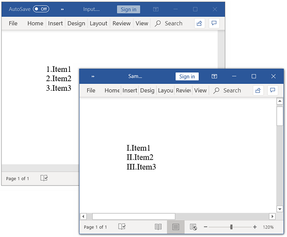
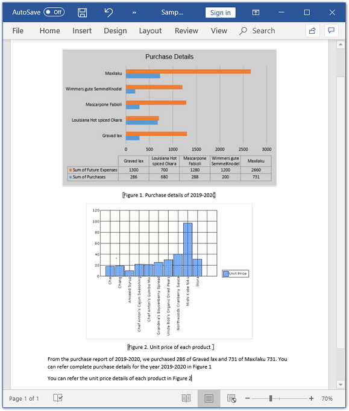
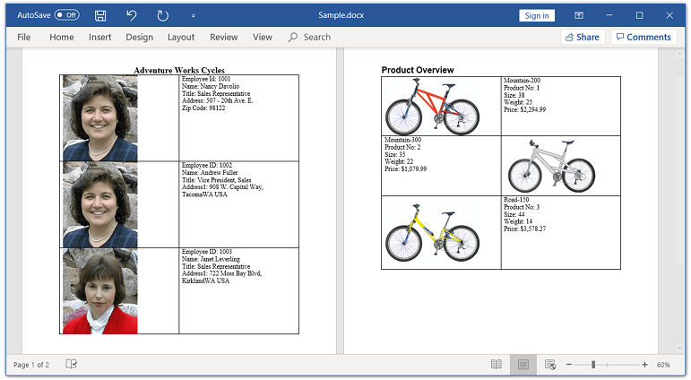
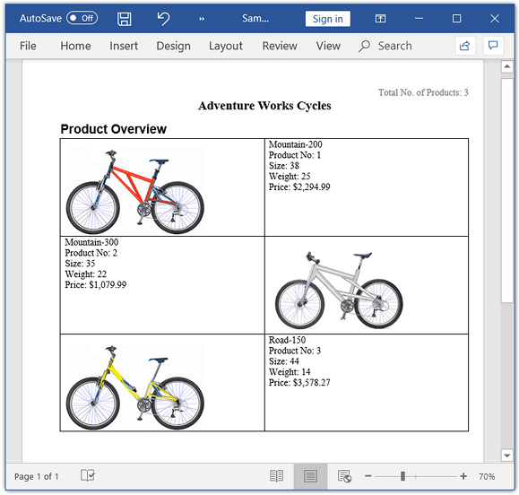

# Working with document Fields

Fields in a Word document are placeholders for data that might change on field update. Fields are represented by the `WField` and `WFieldMark` instances in DocIO. A field in a Word document contains field codes, field separator, field result, and field end.

To learn various types of Microsoft Word supported fields and their syntax,refer to the [MSDN article](https://support.office.com/en-US/article/Field-codes-in-Word-1ad6d91a-55a7-4a8d-b535-cf7888659a51#)

From v16.1.0.24, the entire field code is included in Document Object Model(DOM). Hence, adding a field will automatically include the following elements in DOM:

1. `WField`: Represents the starting of a Field.

2. `ParagraphItem`: Represents the Field code.

3. `WFieldMark`: Represents the Field separator.

4. `ParagraphItem`: Represents the Field result.

5. `WFieldMark`: Represents the end of a Field.

Find more information about migration changes [here](https://help.syncfusion.com/file-formats/release-notes/migratingtov16.1.0.24#). 

## Adding fields

You can add a field to a Word document by using the `AppendField` method of `WParagraph` class.

The following code example explains how to add a field to the Word document.

 


//Creates an instance of WordDocument class (Empty Word Document)
WordDocument document = new WordDocument();
//Adds a new section to the Word Document
IWSection section = document.AddSection();
//Adds a new paragraph to Word document and appends text into paragraph
IWParagraph paragraph = section.AddParagraph();
paragraph.AppendText("Today's Date: ");
//Adds the new Date field to Word document with field name and its type
WField field = paragraph.AppendField("Date", FieldType.FieldDate) as WField;
//Field code used to describe how to display the date
field.FieldCode = @"DATE  \@" + "\"MMMM d, yyyy\""; 
//Saves the document in the given name and format
document.Save("Sample.docx", FormatType.Docx);
//Releases the resources occupied by WordDocument instance
document.Close();



'Creates an instance of WordDocument class (Empty Word Document)
Dim document As New WordDocument()
'Adds a new section to the Word Document
Dim section As IWSection = document.AddSection()
'Adds a new paragraph to Word document and appends text into paragraph
Dim paragraph As IWParagraph = section.AddParagraph()
paragraph.AppendText("Today's Date: ")
'Adds the new Date field to Word document with field name and its type
Dim field As WField = TryCast(paragraph.AppendField("Date", FieldType.FieldDate), WField)
'Field code used to describe how to display the date
field.FieldCode = "DATE  \@" + """MMMM d, yyyy"""
'Saves the document in the given name and format
document.Save("Sample.docx", FormatType.Docx)
'Releases the resources occupied by WordDocument instance
document.Close()



//Creates an instance of WordDocument class (Empty Word Document)
WordDocument document = new WordDocument();
//Adds a new section to the Word Document
IWSection section = document.AddSection();
//Adds a new paragraph to Word document and appends text into paragraph
IWParagraph paragraph = section.AddParagraph();
paragraph.AppendText("Today's Date: ");
//Adds the new Date field to Word document with field name and its type
WField field = paragraph.AppendField("Date", FieldType.FieldDate) as WField;
//Field code used to describe how to display the date
field.FieldCode = @"DATE  \@" + "\"MMMM d, yyyy\""; 
//Saves the Word file to MemoryStream
MemoryStream stream = new MemoryStream();
await document.SaveAsync(stream, FormatType.Docx);
//Saves the stream as Word file in local machine
Save(stream, "Sample.docx");
//Closes the document
document.Close();
//Refer to the following link to save Word document in UWP platform
//https://help.syncfusion.com/file-formats/docio/create-word-document-in-uwp#save-word-document-in-uwp



//Creates an instance of WordDocument class (Empty Word Document)
WordDocument document = new WordDocument();
//Adds a new section to the Word Document
IWSection section = document.AddSection();
//Adds a new paragraph to Word document and appends text into paragraph
IWParagraph paragraph = section.AddParagraph();
paragraph.AppendText("Today's Date: ");
//Adds the new Date field to Word document with field name and its type
WField field = paragraph.AppendField("Date", FieldType.FieldDate) as WField;
//Field code used to describe how to display the date
field.FieldCode = @"DATE  \@" + "\"MMMM d, yyyy\""; 
//Saves the Word document to MemoryStream
MemoryStream stream = new MemoryStream();
document.Save(stream, FormatType.Docx);
//Closes the document
document.Close();
stream.Position = 0;
//Download Word document in the browser
return File(stream, "application/msword", "Sample.docx");



//Creates an instance of WordDocument class (Empty Word Document)
WordDocument document = new WordDocument();
//Adds a new section to the Word Document
IWSection section = document.AddSection();
//Adds a new paragraph to Word document and appends text into paragraph
IWParagraph paragraph = section.AddParagraph();
paragraph.AppendText("Today's Date: ");
//Adds the new Date field to Word document with field name and its type
WField field = paragraph.AppendField("Date", FieldType.FieldDate) as WField;
//Field code used to describe how to display the date
field.FieldCode = @"DATE  \@" + "\"MMMM d, yyyy\""; 
//Saves the Word document to  MemoryStream
MemoryStream stream = new MemoryStream();
document.Save(stream, FormatType.Docx);
//Closes the document
document.Close();
//Save the stream as a file in the device and invoke it for viewing
Xamarin.Forms.DependencyService.Get<ISave>().SaveAndView("Sample.docx", "application/msword", stream);
//Download the helper files from the following link to save the stream as file and open the file for viewing in Xamarin platform
//https://help.syncfusion.com/file-formats/docio/create-word-document-in-xamarin#helper-files-for-xamarin


  

## Formatting fields

You can format the field instances added to the Word document by iterating the items from field start to end.

The following code example explains how to format the field in Word document.




//Creates an instance of a WordDocument 
WordDocument document = new WordDocument();
//Adds one section and one paragraph to the document
document.EnsureMinimal();
//Adds the new Page field to Word document with field name and its type
IWField field = document.LastParagraph.AppendField("Page", FieldType.FieldPage);
IEntity entity = field;
//Iterates to sibling items until Field End 
while (entity.NextSibling != null)
{
	if (entity is WTextRange)
		//Sets character format for text ranges
		(entity as WTextRange).CharacterFormat.FontSize = 6;
	else if ((entity is WFieldMark) && (entity as WFieldMark).Type == FieldMarkType.FieldEnd)
		break;
	//Gets next sibling item
	entity = entity.NextSibling;
}
//Saves and closes the WordDocument instance
document.Save("Template.docx", FormatType.Docx);
document.Close();



'Creates an instance of a WordDocument
Dim document As WordDocument = New WordDocument
'Adds one section and one paragraph to the document
document.EnsureMinimal()
'Adds the new Page field in Word document with field name and its type
Dim field As IWField = document.LastParagraph.AppendField("Page", FieldType.FieldPage)
Dim entity As IEntity = field
'Iterates to sibling items until Field End 
While (Not (entity.NextSibling) Is Nothing)
	'Sets character format for text ranges
	If (TypeOf entity Is WTextRange) Then
		CType(entity, WTextRange).CharacterFormat.FontSize = 6
	ElseIf ((TypeOf entity Is WFieldMark) AndAlso (CType(entity, WFieldMark).Type = FieldMarkType.FieldEnd)) Then
		Exit While
	End If
	'Gets next sibling item
	entity = entity.NextSibling
End While
'Saves and closes the WordDocument instance
document.Save("Template.docx", FormatType.Docx)
document.Close



//Creates an instance of a WordDocument 
WordDocument document = new WordDocument();
//Adds one section and one paragraph to the document
document.EnsureMinimal();
//Adds the new Page field to Word document with field name and its type
IWField field = document.LastParagraph.AppendField("Page", FieldType.FieldPage);
IEntity entity = field;
//Iterates to sibling items until Field End 
while (entity.NextSibling != null)
{
	if (entity is WTextRange)
		//Sets character format for text ranges
		(entity as WTextRange).CharacterFormat.FontSize = 6;
	else if ((entity is WFieldMark) && (entity as WFieldMark).Type == FieldMarkType.FieldEnd)
		break;
	//Gets next sibling item.
	entity = entity.NextSibling;
}
//Saves the Word file to MemoryStream
MemoryStream stream = new MemoryStream();
await document.SaveAsync(stream, FormatType.Docx);
//Saves the stream as Word file in local machine
Save(stream, "Template.docx");
//Closes the document
document.Close();
//Please refer the below link to save Word document in UWP platform
//https://help.syncfusion.com/file-formats/docio/create-word-document-in-uwp#save-word-document-in-uwp



//Creates an instance of a WordDocument 
WordDocument document = new WordDocument();
//Adds one section and one paragraph to the document
document.EnsureMinimal();
//Adds the new Page field in Word document with field name and its type
IWField field = document.LastParagraph.AppendField("Page", FieldType.FieldPage);
IEntity entity = field;
//Iterates to sibling items until Field End 
while (entity.NextSibling != null)
{
	if (entity is WTextRange)
		//Sets character format for text ranges 
		(entity as WTextRange).CharacterFormat.FontSize = 6;
	else if ((entity is WFieldMark) && (entity as WFieldMark).Type == FieldMarkType.FieldEnd)
		break;
	//Gets next sibling item.
	entity = entity.NextSibling;
}
//Saves the Word document to MemoryStream
MemoryStream stream = new MemoryStream();
document.Save(stream, FormatType.Docx);
//Closes the document
document.Close();
stream.Position = 0;
//Download Word document in the browser
return File(stream, "application/msword", "Template.docx");



//Creates an instance of a WordDocument 
WordDocument document = new WordDocument();
//Adds one section and one paragraph to the document
document.EnsureMinimal();
//Adds the new Page field to Word document with field name and its type
IWField field = document.LastParagraph.AppendField("Page", FieldType.FieldPage);
IEntity entity = field;
//Iterates to sibling items until Field End 
while (entity.NextSibling != null)
{
	if (entity is WTextRange)
		//Sets character format for text ranges
		(entity as WTextRange).CharacterFormat.FontSize = 6;
	else if ((entity is WFieldMark) && (entity as WFieldMark).Type == FieldMarkType.FieldEnd)
		break;
	//Gets next sibling item
	entity = entity.NextSibling;
}
//Saves the Word document to MemoryStream
MemoryStream stream = new MemoryStream();
document.Save(stream, FormatType.Docx);
//Closes the document
document.Close();
//Save the stream as a file in the device and invoke it for viewing
Xamarin.Forms.DependencyService.Get<ISave>().SaveAndView("Template.docx", "application/msword", stream);
//Download the helper files from the following link to save the stream as file and open the file for viewing in Xamarin platform
//https://help.syncfusion.com/file-formats/docio/create-word-document-in-xamarin#helper-files-for-xamarin



   
## Updating fields

Field updating engine calculates the resultant value based on the field code information and updates the field result with a new value. You can update the following fields by using DocIO:

* = (formula field)
* DATE
* TIME
* DOCVARIABLE 
* DOCPROPERTY
* COMPARE
* IF
* NEXTIF
* MERGEREC
* MERGESEQ
* SECTION
* NUMPAGES
* TITLE
* Cross-Reference

The following are the known limitations:

* Updating of NUMPAGES field and Cross Reference field with Page number and Paragraph number options are not supported in Silverlight, WinRT, Universal, Windows Phone, and Xamarin applications.
* Currently group shapes, drawing canvas, and table auto resizing are not supported in Word to PDF layouting, and this may lead to update incorrect page number and total number of pages.

The following code example explains how to update the fields present in Word document.

 


//Loads an existing Word document into DocIO instance 
WordDocument document = new WordDocument("Input.docx", FormatType.Docx);
//Updates the fields present in a document
document.UpdateDocumentFields();
document.Save("Result.docx", FormatType.Docx);
document.Close();



'Loads an existing Word document into DocIO instance 
Dim document As New WordDocument("Input.docx", FormatType.Docx)
'Updates the fields present in a document
document.UpdateDocumentFields()
document.Save("Result.docx", FormatType.Docx)
document.Close()



//Loads an existing Word document into DocIO instance 
Assembly assembly = typeof(App).GetTypeInfo().Assembly;
WordDocument document = new WordDocument(assembly.GetManifestResourceStream("Sample.Assets.Input.docx"), FormatType.Docx);
//Updates the fields present in a document
document.UpdateDocumentFields();
//Saves the Word file to MemoryStream
MemoryStream stream = new MemoryStream();
await document.SaveAsync(stream, FormatType.Docx);
//Saves the stream as Word file in local machine
Save(stream, "Result.docx");
//Closes the document
document.Close();
//Please refer the below link to save Word document in UWP platform
//https://help.syncfusion.com/file-formats/docio/create-word-document-in-uwp#save-word-document-in-uwp



//Loads an existing Word document into DocIO instance 
FileStream fileStreamPath = new FileStream("Input.docx", FileMode.Open, FileAccess.Read, FileShare.ReadWrite);
WordDocument document = new WordDocument(fileStreamPath, FormatType.Docx);
//Updates the fields present in a document
document.UpdateDocumentFields();
//Saves the Word document to MemoryStream
MemoryStream stream = new MemoryStream();
document.Save(stream, FormatType.Docx);
//Closes the document
document.Close();
stream.Position = 0;
//Download Word document in the browser
return File(stream, "application/msword", "Result.docx");



//Loads an existing Word document into DocIO instance 
Assembly assembly = typeof(App).GetTypeInfo().Assembly;
WordDocument document = new WordDocument(assembly.GetManifestResourceStream("GettingStarted.Data.Input.docx"), FormatType.Docx);
//Updates the fields present in a document
document.UpdateDocumentFields();
//Saves the Word document to  MemoryStream
MemoryStream stream = new MemoryStream();
document.Save(stream, FormatType.Docx);
//Closes the document
document.Close();
//Save the stream as a file in the device and invoke it for viewing
Xamarin.Forms.DependencyService.Get<ISave>().SaveAndView("Result.docx", "application/msword", stream);
//Please download the helper files from the below link to save the stream as file and open the file for viewing in Xamarin platform
//https://help.syncfusion.com/file-formats/docio/create-word-document-in-xamarin#helper-files-for-xamarin


  

## IF field

IF field compares two values and updates the field result with true text, when comparison succeeds otherwise false text.

To learn more about IF field and its syntax in Microsoft Word, refer to the [MSDN article](https://support.office.com/en-au/article/Field-codes-IF-field-9f79e82f-e53b-4ff5-9d2c-ae3b22b7eb5e#)

The following code example explains how to add an If field to a Word document.

  


//Creates an instance of a WordDocument 
WordDocument document = new WordDocument();
IWSection section = document.AddSection();
IWParagraph paragraph = section.AddParagraph();
paragraph.AppendText("If field which uses string of characters in expression");
paragraph = section.AddParagraph();
//Creates the new instance of IF field
WIfField field = paragraph.AppendField("If", FieldType.FieldIf) as WIfField;
//Specifies the expression, true and false statement in field code
field.FieldCode = "IF \"True\" = \"True\" \"The given statement is Correct\" \"The given statement is Wrong\"";
paragraph = section.AddParagraph();
paragraph.AppendText("If field which uses numbers in expression");
paragraph = section.AddParagraph();
//Creates the new instance of IF field
field = paragraph.AppendField("If", FieldType.FieldIf) as WIfField;
//Specifies the expression, true and false statement in field code
field.FieldCode = "IF 100 >= 1000 \"The given statement is Correct\" \"The given statement is Wrong\"";
//Updates the document fields
document.UpdateDocumentFields();
document.Save("Sample.docx", FormatType.Docx);
document.Close();



'Creates an instance of a WordDocument 
Dim document As New WordDocument()
Dim section As IWSection = document.AddSection()
Dim paragraph As IWParagraph = section.AddParagraph()
paragraph.AppendText("If field which uses string of characters in expression")
paragraph = section.AddParagraph()
'Creates the new instance of IF field
Dim field As WIfField = TryCast(paragraph.AppendField("If", FieldType.FieldIf), WIfField)
'Specifies the expression, true and false statement in field code
field.FieldCode = "IF ""True"" = ""True"" ""The given statement is Correct"" ""The given statement is Wrong"""
paragraph = section.AddParagraph()
paragraph.AppendText("If field which uses numbers in expression")
paragraph = section.AddParagraph()
'Creates the new instance of IF field
field = TryCast(paragraph.AppendField("If", FieldType.FieldIf), WIfField)
'Specify the expression, true and false statement in field code
field.FieldCode = "IF 100 >= 1000 ""The given statement is Correct"" ""The given statement is Wrong"""
'Updates the document fields
document.UpdateDocumentFields()
document.Save("Sample.docx", FormatType.Docx)
document.Close()



//Creates an instance of a WordDocument
WordDocument document = new WordDocument();
//Adds a new section into the Word Document
IWSection section = document.AddSection();
//Adds a new paragraph into Word document and appends text into paragraph
IWParagraph paragraph = section.AddParagraph();
paragraph.AppendText("If field which uses string of characters in expression");
paragraph = section.AddParagraph();
//Creates the new instance of IF field
WIfField field = paragraph.AppendField("If", FieldType.FieldIf) as WIfField;
//Specifies the expression, true and false statement in field code
field.FieldCode = "IF \"True\" = \"True\" \"The given statement is Correct\" \"The given statement is Wrong\"";
paragraph = section.AddParagraph();
paragraph.AppendText("If field which uses numbers in expression");
paragraph = section.AddParagraph();
//Creates the new instance of IF field
field = paragraph.AppendField("If", FieldType.FieldIf) as WIfField;
//Specifies the expression, true and false statement in field code
field.FieldCode = "IF 100 >= 1000 \"The given statement is Correct\" \"The given statement is Wrong\"";
//Updates the document fields
document.UpdateDocumentFields();
//Saves the Word file to MemoryStream
MemoryStream stream = new MemoryStream();
await document.SaveAsync(stream, FormatType.Docx);
//Saves the stream as Word file in local machine
Save(stream, "Sample.docx");
//Closes the document
document.Close();
//Please refer the below link to save Word document in UWP platform
//https://help.syncfusion.com/file-formats/docio/create-word-document-in-uwp#save-word-document-in-uwp



//Creates an instance of a WordDocument
WordDocument document = new WordDocument();
//Adds a new section into the Word Document
IWSection section = document.AddSection();
//Adds a new paragraph into Word document and appends text into paragraph
IWParagraph paragraph = section.AddParagraph();
paragraph.AppendText("If field which uses string of characters in expression");
paragraph = section.AddParagraph();
//Creates the new instance of IF field
WIfField field = paragraph.AppendField("If", FieldType.FieldIf) as WIfField;
//Specifies the expression, true and false statement in field code
field.FieldCode = "IF \"True\" = \"True\" \"The given statement is Correct\" \"The given statement is Wrong\"";
paragraph = section.AddParagraph();
paragraph.AppendText("If field which uses numbers in expression");
paragraph = section.AddParagraph();
//Creates the new instance of IF field
field = paragraph.AppendField("If", FieldType.FieldIf) as WIfField;
//Specifies the expression, true and false statement in field code
field.FieldCode = "IF 100 >= 1000 \"The given statement is Correct\" \"The given statement is Wrong\"";
//Updates the document fields
document.UpdateDocumentFields();
//Saves the Word document to MemoryStream
MemoryStream stream = new MemoryStream();
document.Save(stream, FormatType.Docx);
//Closes the document
document.Close();
stream.Position = 0;
//Download Word document in the browser
return File(stream, "application/msword", "Sample.docx");



//Creates an instance of a WordDocument
WordDocument document = new WordDocument();
//Adds a new section into the Word Document
IWSection section = document.AddSection();
//Adds a new paragraph into Word document and appends text into paragraph
IWParagraph paragraph = section.AddParagraph();
paragraph.AppendText("If field which uses string of characters in expression");
paragraph = section.AddParagraph();
//Creates the new instance of IF field
WIfField field = paragraph.AppendField("If", FieldType.FieldIf) as WIfField;
//Specifies the expression, true and false statement in field code
field.FieldCode = "IF \"True\" = \"True\" \"The given statement is Correct\" \"The given statement is Wrong\"";
paragraph = section.AddParagraph();
paragraph.AppendText("If field which uses numbers in expression");
paragraph = section.AddParagraph();
//Creates the new instance of IF field
field = paragraph.AppendField("If", FieldType.FieldIf) as WIfField;
//Specifies the expression, true and false statement in field code
field.FieldCode = "IF 100 >= 1000 \"The given statement is Correct\" \"The given statement is Wrong\"";
//Updates the document fields
document.UpdateDocumentFields();
//Saves the Word document to  MemoryStream
MemoryStream stream = new MemoryStream();
document.Save(stream, FormatType.Docx);
//Closes the document
document.Close();
//Save the stream as a file in the device and invoke it for viewing
Xamarin.Forms.DependencyService.Get<ISave>().SaveAndView("Sample.docx", "application/msword", stream);
//Please download the helper files from the below link to save the stream as file and open the file for viewing in Xamarin platform
//https://help.syncfusion.com/file-formats/docio/create-word-document-in-xamarin#helper-files-for-xamarin


 
  
## Document variables

The DocVariable field displays the value of a specified document variable in the Word document. The document variables can be added or modified using the `Variables` property of `WordDocument` class.

The following code example explains how to add a DocVariable field to a Word document.

  


//Creates an instance of a WordDocument 
WordDocument document = new WordDocument();
IWSection section = document.AddSection();
IWParagraph paragraph = section.AddParagraph();
paragraph.AppendText("First Name of the customer: ");
//Adds the DocVariable field with Variable name and its type
paragraph.AppendField("FirstName", FieldType.FieldDocVariable);
paragraph = section.AddParagraph();
paragraph.AppendText("Last Name of the customer: ");
//Adds the DocVariable field with Variable name and its type
paragraph.AppendField("LastName", FieldType.FieldDocVariable);
//Adds the value for variable in WordDocument.Variable collection
document.Variables.Add("FirstName", "Jeff");
document.Variables.Add("LastName", "Smith");
//Updates the document fields
document.UpdateDocumentFields();
document.Save("Sample.docx", FormatType.Docx);
document.Close();



'Creates an instance of a WordDocument 
Dim document As New WordDocument()
Dim section As IWSection = document.AddSection()
Dim paragraph As IWParagraph = section.AddParagraph()
paragraph.AppendText("First Name of the customer: ")
'Adds the DocVariable field with Variable name and its type
paragraph.AppendField("FirstName", FieldType.FieldDocVariable)
paragraph = section.AddParagraph()
paragraph.AppendText("Last Name of the customer: ")
'Adds the DocVariable field with Variable name and its type
paragraph.AppendField("LastName", FieldType.FieldDocVariable)
'Adds the value for variable in WordDocument.Variable collection
document.Variables.Add("FirstName", "Jeff")
document.Variables.Add("LastName", "Smith")
'Updates the document fields
document.UpdateDocumentFields()
document.Save("Sample.docx", FormatType.Docx)
document.Close()



//Creates an instance of a WordDocument
WordDocument document = new WordDocument();
//Adds a new section into the Word Document
IWSection section = document.AddSection();
//Adds a new paragraph into Word document and appends text into paragraph
IWParagraph paragraph = section.AddParagraph();
paragraph.AppendText("First Name of the customer: ");
//Adds the DocVariable field with Variable name and its type
paragraph.AppendField("FirstName", FieldType.FieldDocVariable);
paragraph = section.AddParagraph();
paragraph.AppendText("Last Name of the customer: ");
//Adds the DocVariable field with Variable name and its type
paragraph.AppendField("LastName", FieldType.FieldDocVariable);
//Adds the value for variable in WordDocument.Variable collection
document.Variables.Add("FirstName", "Jeff");
document.Variables.Add("LastName", "Smith");
//Updates the document fields
document.UpdateDocumentFields();
//Saves the Word file to MemoryStream
MemoryStream stream = new MemoryStream();
await document.SaveAsync(stream, FormatType.Docx);
//Saves the stream as Word file in local machine
Save(stream, "Sample.docx");
//Closes the document
document.Close();
//Please refer the below link to save Word document in UWP platform
//https://help.syncfusion.com/file-formats/docio/create-word-document-in-uwp#save-word-document-in-uwp



//Creates an instance of a WordDocument
WordDocument document = new WordDocument();
//Adds a new section into the Word Document
IWSection section = document.AddSection();
//Adds a new paragraph into Word document and appends text into paragraph
IWParagraph paragraph = section.AddParagraph();
paragraph.AppendText("First Name of the customer: ");
//Adds the DocVariable field with Variable name and its type
paragraph.AppendField("FirstName", FieldType.FieldDocVariable);
paragraph = section.AddParagraph();
paragraph.AppendText("Last Name of the customer: ");
//Adds the DocVariable field with Variable name and its type
paragraph.AppendField("LastName", FieldType.FieldDocVariable);
//Adds the value for variable in WordDocument.Variable collection
document.Variables.Add("FirstName", "Jeff");
document.Variables.Add("LastName", "Smith");
//Updates the document fields
document.UpdateDocumentFields();
//Saves the Word document to MemoryStream
MemoryStream stream = new MemoryStream();
document.Save(stream, FormatType.Docx);
//Closes the document
document.Close();
stream.Position = 0;
//Download Word document in the browser
return File(stream, "application/msword", "Sample.docx");



//Creates an instance of a WordDocument
WordDocument document = new WordDocument();
//Adds a new section into the Word Document
IWSection section = document.AddSection();
//Adds a new paragraph into Word document and appends text into paragraph
IWParagraph paragraph = section.AddParagraph();
paragraph.AppendText("First Name of the customer: ");
//Adds the DocVariable field with Variable name and its type
paragraph.AppendField("FirstName", FieldType.FieldDocVariable);
paragraph = section.AddParagraph();
paragraph.AppendText("Last Name of the customer: ");
//Adds the DocVariable field with Variable name and its type
paragraph.AppendField("LastName", FieldType.FieldDocVariable);
//Adds the value for variable in WordDocument.Variable collection
document.Variables.Add("FirstName", "Jeff");
document.Variables.Add("LastName", "Smith");
//Updates the document fields
document.UpdateDocumentFields();
//Saves the Word document to  MemoryStream
MemoryStream stream = new MemoryStream();
document.Save(stream, FormatType.Docx);
//Closes the document
document.Close();
//Save the stream as a file in the device and invoke it for viewing
Xamarin.Forms.DependencyService.Get<ISave>().SaveAndView("Sample.docx", "application/msword", stream);
//Please download the helper files from the below link to save the stream as file and open the file for viewing in Xamarin platform
//https://help.syncfusion.com/file-formats/docio/create-word-document-in-xamarin#helper-files-for-xamarin



  
## Cross reference

A cross-reference refers to an item that appears in another location in a document. You can create cross-reference to bookmarks in a document by using the `AppendCrossReference` method of `WParagraph` class.

N>  The Essential DocIO supports creating and updating the cross-reference fields only for bookmarks in a document.

The following code example explains how to append cross reference for bookmark in a Word document.

  


//Creates an instance of a WordDocument 
WordDocument document = new WordDocument();
IWSection section = document.AddSection();
IWParagraph paragraph = section.AddParagraph();
//Adds text, bookmark start and end in the paragraph
paragraph.AppendBookmarkStart("Title");
paragraph.AppendText("Northwind Database");
paragraph.AppendBookmarkEnd("Title");
paragraph = section.AddParagraph();
paragraph.AppendText("The Northwind sample database (Northwind.mdb) is included with all versions of Access. It provides data you can experiment with and database objects that demonstrate features you might want to implement in your own databases.");
section = document.AddSection();
section.AddParagraph();
paragraph = section.AddParagraph() as WParagraph;
//Gets the collection of bookmark start in the word document
List<Entity> items = document.GetCrossReferenceItems(ReferenceType.Bookmark);
paragraph.AppendText("Bookmark Cross Reference starts here ");
//Appends the cross reference for bookmark “Title” with ContentText as reference kind
paragraph.AppendCrossReference(ReferenceType.Bookmark, ReferenceKind.ContentText, items[0], true, false, false, string.Empty);
//Updates the document Fields
document.UpdateDocumentFields();
document.Save("Sample.docx", FormatType.Docx);
document.Close();



'Creates an instance of a WordDocument 
Dim document As New WordDocument()
Dim section As IWSection = document.AddSection()
Dim paragraph As IWParagraph = section.AddParagraph()
'Adds text, bookmark start and end in the paragraph
paragraph.AppendBookmarkStart("Title")
paragraph.AppendText("Northwind Database")
paragraph.AppendBookmarkEnd("Title")
paragraph = section.AddParagraph()
paragraph.AppendText("The Northwind sample database (Northwind.mdb) is included with all versions of Access. It provides data you can experiment with and database objects that demonstrate features you might want to implement in your own databases.")
section = document.AddSection()
section.AddParagraph()
paragraph = TryCast(section.AddParagraph(), WParagraph)
'Gets the collection of bookmark start in the word document
Dim items As List(Of Entity) = document.GetCrossReferenceItems(ReferenceType.Bookmark)
paragraph.AppendText("Bookmark Cross Reference starts here ")
'Appends the cross reference for bookmark “Title” with ContentText as reference kind
paragraph.AppendCrossReference(ReferenceType.Bookmark, ReferenceKind.ContentText, items(0), True, False, False, String.Empty)
'Updates the document Fields
document.UpdateDocumentFields()
document.Save("Sample.docx", FormatType.Docx)
document.Close()



//Creates an instance of a WordDocument
WordDocument document = new WordDocument();
//Adds a new section into the Word Document
IWSection section = document.AddSection();
//Adds a new paragraph into Word document
IWParagraph paragraph = section.AddParagraph();
//Adds text, bookmark start and end in the paragraph
paragraph.AppendBookmarkStart("Title");
paragraph.AppendText("Northwind Database");
paragraph.AppendBookmarkEnd("Title");
paragraph = section.AddParagraph();
paragraph.AppendText("The Northwind sample database (Northwind.mdb) is included with all versions of Access. It provides data you can experiment with and database objects that demonstrate features you might want to implement in your own databases.");
section = document.AddSection();
section.AddParagraph();
paragraph = section.AddParagraph() as WParagraph;
//Gets the collection of bookmark start in the word document
List<Entity> items = document.GetCrossReferenceItems(ReferenceType.Bookmark);
paragraph.AppendText("Bookmark Cross Reference starts here ");
//Appends the cross reference for bookmark “Title” with ContentText as reference kind
paragraph.AppendCrossReference(ReferenceType.Bookmark, ReferenceKind.ContentText, items[0], true, false, false, string.Empty);
//Updates the document Fields
document.UpdateDocumentFields();
//Saves the Word file to MemoryStream
MemoryStream stream = new MemoryStream();
await document.SaveAsync(stream, FormatType.Docx);
//Saves the stream as Word file in local machine
Save(stream, "Sample.docx");
//Closes the document
document.Close();
//Please refer the below link to save Word document in UWP platform
//https://help.syncfusion.com/file-formats/docio/create-word-document-in-uwp#save-word-document-in-uwp



//Creates an instance of a WordDocument
WordDocument document = new WordDocument();
//Adds a new section into the Word Document
IWSection section = document.AddSection();
//Adds a new paragraph into Word document
IWParagraph paragraph = section.AddParagraph();
//Adds text, bookmark start and end in the paragraph
paragraph.AppendBookmarkStart("Title");
paragraph.AppendText("Northwind Database");
paragraph.AppendBookmarkEnd("Title");
paragraph = section.AddParagraph();
paragraph.AppendText("The Northwind sample database (Northwind.mdb) is included with all versions of Access. It provides data you can experiment with and database objects that demonstrate features you might want to implement in your own databases.");
section = document.AddSection();
section.AddParagraph();
paragraph = section.AddParagraph() as WParagraph;
//Gets the collection of bookmark start in the word document
List<Entity> items = document.GetCrossReferenceItems(ReferenceType.Bookmark);
paragraph.AppendText("Bookmark Cross Reference starts here ");
//Appends the cross reference for bookmark “Title” with ContentText as reference kind
paragraph.AppendCrossReference(ReferenceType.Bookmark, ReferenceKind.ContentText, items[0], true, false, false, string.Empty);
//Updates the document Fields
document.UpdateDocumentFields();
//Saves the Word document to MemoryStream
MemoryStream stream = new MemoryStream();
document.Save(stream, FormatType.Docx);
//Closes the document
document.Close();
stream.Position = 0;
//Download Word document in the browser
return File(stream, "application/msword", "Sample.docx");



//Creates an instance of a WordDocument
WordDocument document = new WordDocument();
//Adds a new section into the Word Document
IWSection section = document.AddSection();
//Adds a new paragraph into Word document
IWParagraph paragraph = section.AddParagraph();
//Adds text, bookmark start and end in the paragraph
paragraph.AppendBookmarkStart("Title");
paragraph.AppendText("Northwind Database");
paragraph.AppendBookmarkEnd("Title");
paragraph = section.AddParagraph();
paragraph.AppendText("The Northwind sample database (Northwind.mdb) is included with all versions of Access. It provides data you can experiment with and database objects that demonstrate features you might want to implement in your own databases.");
section = document.AddSection();
section.AddParagraph();
paragraph = section.AddParagraph() as WParagraph;
//Gets the collection of bookmark start in the word document
List<Entity> items = document.GetCrossReferenceItems(ReferenceType.Bookmark);
paragraph.AppendText("Bookmark Cross Reference starts here ");
//Appends the cross reference for bookmark “Title” with ContentText as reference kind
paragraph.AppendCrossReference(ReferenceType.Bookmark, ReferenceKind.ContentText, items[0], true, false, false, string.Empty);
//Updates the document Fields
document.UpdateDocumentFields();
//Saves the Word document to  MemoryStream
MemoryStream stream = new MemoryStream();
document.Save(stream, FormatType.Docx);
//Closes the document
document.Close();
//Save the stream as a file in the device and invoke it for viewing
Xamarin.Forms.DependencyService.Get<ISave>().SaveAndView("Sample.docx", "application/msword", stream);
//Please download the helper files from the below link to save the stream as file and open the file for viewing in Xamarin platform
//https://help.syncfusion.com/file-formats/docio/create-word-document-in-xamarin#helper-files-for-xamarin


  

## Unlink fields

You can replace the field with its most recent result in the Word document by unlinking the field using the `Unlink` API. When you unlink a field, its current result is converted to text or a graphic and can no longer be updated automatically.

The following code example shows how to unlink the fields in Word document.

  


//Creates an instance of WordDocument class
WordDocument document = new WordDocument();
//Adds a new section into the Word Document
IWSection section = document.AddSection();
//Adds a new paragraph into Word document and appends text into paragraph
IWParagraph paragraph = section.AddParagraph();
paragraph.AppendText("Today's Date: ");
//Adds the new Date field in Word document with field name and its type
WField field = paragraph.AppendField("Date", FieldType.FieldDate) as WField;
//Updates the field
field.Update();
//Unlink the field
field.Unlink();
//Saves the document in the given name and format
document.Save("Sample.docx", FormatType.Docx);
//Releases the resources occupied by WordDocument instance
document.Close();



'Creates an instance of WordDocument class
Dim document As WordDocument = New WordDocument()
'Adds a new section into the Word Document
Dim section As IWSection = document.AddSection()
'Adds a new paragraph into Word document and appends text into paragraph
Dim paragraph As IWParagraph = section.AddParagraph()
paragraph.AppendText("Today's Date: ")
'Adds the new Date field in Word document with field name and its type
Dim field As WField = CType(paragraph.AppendField("Date", FieldType.FieldDate), WField)
'Updates the field
field.Update()
'Unlink the field
field.Unlink()
'Saves the document in the given name and format
document.Save("Sample.docx", FormatType.Docx)
'Releases the resources occupied by WordDocument instance
document.Close()



//Creates an instance of WordDocument class
WordDocument document = new WordDocument();
//Adds a new section into the Word Document
IWSection section = document.AddSection();
//Adds a new paragraph into Word document and appends text into paragraph
IWParagraph paragraph = section.AddParagraph();
paragraph.AppendText("Today's Date: ");
//Adds the new Date field in Word document with field name and its type
WField field = paragraph.AppendField("Date", FieldType.FieldDate) as WField;
//Updates the field
field.Update();
//Unlink the field
field.Unlink();
//Saves and closes the Word document instance
MemoryStream stream = new MemoryStream();
//Saves the Word file to MemoryStream
await document.SaveAsync(stream, FormatType.Docx);
document.Close();
//Saves the stream as Word file in local machine
Save(stream, "Sample.docx");

//Please refer the below link to save Word document in UWP platform
//https://help.syncfusion.com/file-formats/docio/create-word-document-in-uwp#save-word-document-in-uwp



//Creates an instance of WordDocument class
WordDocument document = new WordDocument();
//Adds a new section into the Word Document
IWSection section = document.AddSection();
//Adds a new paragraph into Word document and appends text into paragraph
IWParagraph paragraph = section.AddParagraph();
paragraph.AppendText("Today's Date: ");
//Adds the new Date field in Word document with field name and its type
WField field = paragraph.AppendField("Date", FieldType.FieldDate) as WField;
//Updates the field
field.Update();
//Unlink the field
field.Unlink();
MemoryStream stream = new MemoryStream();
//Saves the Word document to  MemoryStream
document.Save(stream, FormatType.Docx);
//Closes the Word document instance
document.Close();
stream.Position = 0;
//Download Word document in the browser
return File(stream, "application/msword", "Sample.docx");



//Creates an instance of WordDocument class
WordDocument document = new WordDocument();
//Adds a new section into the Word Document
IWSection section = document.AddSection();
//Adds a new paragraph into Word document and appends text into paragraph
IWParagraph paragraph = section.AddParagraph();
paragraph.AppendText("Today's Date: ");
//Adds the new Date field in Word document with field name and its type
WField field = paragraph.AppendField("Date", FieldType.FieldDate) as WField;
//Updates the field
field.Update();
//Unlink the field
field.Unlink();
//Saves and closes the Word document instance
MemoryStream stream = new MemoryStream();
//Saves the Word file to MemoryStream
document.Save(stream, FormatType.Docx);
document.Close();
//Save the stream as a file in the device and invoke it for viewing
Xamarin.Forms.DependencyService.Get<ISave>().SaveAndView("Sample.docx", "application/msword", stream);

//Please download the helper files from the below link to save the stream as file and open the file for viewing in Xamarin platform
//https://help.syncfusion.com/file-formats/docio/create-word-document-in-xamarin#helper-files-for-xamarin




N>  XE (Index Entry) fields cannot be unlinked.

## Sequence Field
You can use the Sequence (SEQ) field to automatically numbers the chapters, tables, figures, and other items in a Word document. When you add, delete, or move an item in Word document (along with SEQ fields), you can update the remaining SEQ fields with a new sequence.

You can format the SEQ field using below switches.

\c --  Repeats the closest preceding sequence number.
\h --  Hides the field result unless a general-formatting-switch is also present.
\n --  Inserts the next sequence number for the specified items. This is the default switch.
\r  -- Resets the sequence number to the number following “r”.
\s -- Resets the sequence number at the heading level following the "s".

### Apply Number format
You can apply the number format for the sequence field using `NumberFormat` property. 

The following code example shows how to apply the number format for sequence field.

  


//Creates a new document
WordDocument document = CreateDocument();
//Accesses sequence field in the document
WSeqField field = (document.LastSection.Body.ChildEntities[0] as WParagraph).ChildEntities[0] as WSeqField;
//Applies the number format for sequence field
field.NumberFormat = CaptionNumberingFormat.Roman;
//Accesses sequence field in the document
field = (document.LastSection.Body.ChildEntities[1] as WParagraph).ChildEntities[0] as WSeqField;
//Applies the number format for sequence field
field.NumberFormat = CaptionNumberingFormat.Roman;
//Accesses sequence field in the document
field = (document.LastSection.Body.ChildEntities[2] as WParagraph).ChildEntities[0] as WSeqField;
//Applies the number format for sequence field
field.NumberFormat = CaptionNumberingFormat.Roman;
//Updates the document fields
document.UpdateDocumentFields();
//Saves and closes the Word document 
document.Save("Sample.docx");
document.Close();



'Creates a new document
Dim document As WordDocument = CreateDocument()
'Accesses sequence field in the document
Dim field As WSeqField = CType(CType(document.LastSection.Body.ChildEntities(0), WParagraph).ChildEntities(0), WSeqField)
'Applies the number format for sequence field
field.NumberFormat = CaptionNumberingFormat.Roman
'Accesses sequence field in the document
field = CType(CType(document.LastSection.Body.ChildEntities(1), WParagraph).ChildEntities(0), WSeqField)
'Applies the number format for sequence field
field.NumberFormat = CaptionNumberingFormat.Roman
'Accesses sequence field in the document
field = CType(CType(document.LastSection.Body.ChildEntities(2), WParagraph).ChildEntities(0), WSeqField)
'Applies the number format for sequence field
field.NumberFormat = CaptionNumberingFormat.Roman
'Updates the document fields
document.UpdateDocumentFields()
'Saves and closes the Word document
document.Save("Sample.docx")
document.Close()



//Creates a new document
WordDocument document = CreateDocument();
//Accesses sequence field in the document
WSeqField field = (document.LastSection.Body.ChildEntities[0] as WParagraph).ChildEntities[0] as WSeqField;
//Applies the number format for sequence field
field.NumberFormat = CaptionNumberingFormat.Roman;
//Accesses sequence field in the document
field = (document.LastSection.Body.ChildEntities[1] as WParagraph).ChildEntities[0] as WSeqField;
//Applies the number format for sequence field
field.NumberFormat = CaptionNumberingFormat.Roman;
//Accesses sequence field in the document
field = (document.LastSection.Body.ChildEntities[2] as WParagraph).ChildEntities[0] as WSeqField;
//Applies the number format for sequence field
field.NumberFormat = CaptionNumberingFormat.Roman;
//Updates the document fields
document.UpdateDocumentFields();
//Saves the Word file to MemoryStream
MemoryStream stream = new MemoryStream();
await document.SaveAsync(stream, FormatType.Docx);
//Saves the stream as Word document file in local machine
Save(stream, "Sample.docx");
//Closes the document instance
document.Close();
            
//Please refer the below link to save Word document in UWP platform
//https://help.syncfusion.com/file-formats/docio/create-word-document-in-uwp#save-word-document-in-uwp



//Creates a new document
WordDocument document = CreateDocument();
//Accesses sequence field in the document
WSeqField field = (document.LastSection.Body.ChildEntities[0] as WParagraph).ChildEntities[0] as WSeqField;
//Applies the number format for sequence field
field.NumberFormat = CaptionNumberingFormat.Roman;
//Accesses sequence field in the document
field = (document.LastSection.Body.ChildEntities[1] as WParagraph).ChildEntities[0] as WSeqField;
//Applies the number format for sequence field
field.NumberFormat = CaptionNumberingFormat.Roman;
//Accesses sequence field in the document
field = (document.LastSection.Body.ChildEntities[2] as WParagraph).ChildEntities[0] as WSeqField;
//Applies the number format for sequence field
field.NumberFormat = CaptionNumberingFormat.Roman;
//Updates the document fields
document.UpdateDocumentFields();
//Saves the Word document to MemoryStream
MemoryStream stream = new MemoryStream();
document.Save(stream, FormatType.Docx);
//Closes the document
document.Close();
stream.Position = 0;
//Download Word document in the browser
return File(stream, "application/msword", "Sample.docx");



//Creates a new document
WordDocument document = CreateDocument();
//Accesses sequence field in the document
WSeqField field = (document.LastSection.Body.ChildEntities[0] as WParagraph).ChildEntities[0] as WSeqField;
//Applies the number format for sequence field
field.NumberFormat = CaptionNumberingFormat.Roman;
//Accesses sequence field in the document
field = (document.LastSection.Body.ChildEntities[1] as WParagraph).ChildEntities[0] as WSeqField;
//Applies the number format for sequence field
field.NumberFormat = CaptionNumberingFormat.Roman;
//Accesses sequence field in the document
field = (document.LastSection.Body.ChildEntities[2] as WParagraph).ChildEntities[0] as WSeqField;
//Applies the number format for sequence field
field.NumberFormat = CaptionNumberingFormat.Roman;
//Updates the document fields
document.UpdateDocumentFields();
//Saves the Word document to MemoryStream
MemoryStream stream = new MemoryStream();
document.Save(stream, FormatType.Docx);
//Save the stream as a file in the device and invoke it for viewing
Xamarin.Forms.DependencyService.Get<ISave>().SaveAndView("Sample.docx", "application/msword", stream);
//Closes the document instance
document.Close();
            
//Please download the helper files from the below link to save the stream as file and open the file for viewing in Xamarin platform
//https://help.syncfusion.com/file-formats/docio/create-word-document-in-xamarin#helper-files-for-xamarin




The following code example provides supporting methods for the above code.

  


private WordDocument CreateDocument()
{
	//Creates a new document
	WordDocument document = new WordDocument();
	//Adds a new section to the document
	IWSection section = document.AddSection();
	//Sets margin of the section
	section.PageSetup.Margins.All = 72;
	//Adds a paragraph to the section
	IWParagraph paragraph = section.AddParagraph();
	paragraph.AppendField("List", FieldType.FieldSequence);
	paragraph.AppendText(".Item1");
	//Adds a paragraph to the section
	paragraph = section.AddParagraph();
	paragraph.AppendField("List", FieldType.FieldSequence);
	paragraph.AppendText(".Item2");
	//Adds a paragraph to the section
	paragraph = section.AddParagraph();
	paragraph.AppendField("List", FieldType.FieldSequence);
	paragraph.AppendText(".Item3");
	return document;
}



Private Function CreateDocument() As WordDocument
	'Creates a new word document
	Dim document As WordDocument = New WordDocument
	'Adds a new section to the document
	Dim section As IWSection = document.AddSection
	'Sets margin of the section
	section.PageSetup.Margins.All = 72
	'Adds a paragraph to the section
	Dim paragraph As IWParagraph = section.AddParagraph
	paragraph.AppendField("List", FieldType.FieldSequence)
	paragraph.AppendText(".Item1")
	'Adds a paragraph to the section
	paragraph = section.AddParagraph
	paragraph.AppendField("List", FieldType.FieldSequence)
	paragraph.AppendText(".Item2")
	'Adds a paragraph to the section
	paragraph = section.AddParagraph
	paragraph.AppendField("List", FieldType.FieldSequence)
	paragraph.AppendText(".Item3")
	Return document
End Function



private WordDocument CreateDocument()
{
	//Creates a new document
	WordDocument document = new WordDocument();
	//Adds a new section to the document
	IWSection section = document.AddSection();
	//Sets margin of the section
	section.PageSetup.Margins.All = 72;
	//Adds a paragraph to the section
	IWParagraph paragraph = section.AddParagraph();
	paragraph.AppendField("List", FieldType.FieldSequence);
	paragraph.AppendText(".Item1");
	//Adds a paragraph to the section
	paragraph = section.AddParagraph();
	paragraph.AppendField("List", FieldType.FieldSequence);
	paragraph.AppendText(".Item2");
	//Adds a paragraph to the section
	paragraph = section.AddParagraph();
	paragraph.AppendField("List", FieldType.FieldSequence);
	paragraph.AppendText(".Item3");
	return document;
}



private WordDocument CreateDocument()
{
	//Creates a new document
	WordDocument document = new WordDocument();
	//Adds a new section to the document
	IWSection section = document.AddSection();
	//Sets margin of the section
	section.PageSetup.Margins.All = 72;
	//Adds a paragraph to the section
	IWParagraph paragraph = section.AddParagraph();
	paragraph.AppendField("List", FieldType.FieldSequence);
	paragraph.AppendText(".Item1");
	//Adds a paragraph to the section
	paragraph = section.AddParagraph();
	paragraph.AppendField("List", FieldType.FieldSequence);
	paragraph.AppendText(".Item2");
	//Adds a paragraph to the section
	paragraph = section.AddParagraph();
	paragraph.AppendField("List", FieldType.FieldSequence);
	paragraph.AppendText(".Item3");
	return document;
}



private WordDocument CreateDocument()
{
	//Creates a new document
	WordDocument document = new WordDocument();
	//Adds a new section to the document
	IWSection section = document.AddSection();
	//Sets margin of the section
	section.PageSetup.Margins.All = 72;
	//Adds a paragraph to the section
	IWParagraph paragraph = section.AddParagraph();
	paragraph.AppendField("List", FieldType.FieldSequence);
	paragraph.AppendText(".Item1");
	//Adds a paragraph to the section
	paragraph = section.AddParagraph();
	paragraph.AppendField("List", FieldType.FieldSequence);
	paragraph.AppendText(".Item2");
	//Adds a paragraph to the section
	paragraph = section.AddParagraph();
	paragraph.AppendField("List", FieldType.FieldSequence);
	paragraph.AppendText(".Item3");
	return document;
}




By executing the above code example, it generates output Word document as follows.

### Refer Bookmark
You can refer the sequence field elsewhere in the document by including bookmark name through `BookmarkName` property. The referred sequence field may be present anywhere in the Word document, but not beyond the respective bookmark end.

For example, you can refer the image caption numbers in sentence by including the bookmark name in sequence field.

The following code example shows how to refer the bookmark in sequence field.

  


//Opens an exixting word document
WordDocument document = new WordDocument("Template.docx");
//Accesses sequence field in the document
WParagraph paragraph = document.LastSection.Body.ChildEntities[4] as WParagraph;
WSeqField seqField = paragraph.ChildEntities[12] as WSeqField;
//Adds bookmark reference to the sequence field
seqField.BookmarkName = "BkmkPurchase";
//Accesses sequence field in the document
paragraph = document.LastSection.Paragraphs[5] as WParagraph;
seqField = paragraph.ChildEntities[1] as WSeqField;
//Adds bookmark reference to the sequence field
seqField.BookmarkName = "BkkmUnitPrice";
//Updates the document fields
document.UpdateDocumentFields();
//Saves and closes the Word document
document.Save("Sample.docx", FormatType.Docx);
document.Close();



'Opens an exixting word document
Dim document As WordDocument = New WordDocument("Template.docx")
'Accesses sequence field in the document
Dim paragraph As WParagraph = CType(document.LastSection.Body.ChildEntities(4), WParagraph)
Dim seqField As WSeqField = CType(paragraph.ChildEntities(12), WSeqField)
'Adds bookmark reference to the sequence field
seqField.BookmarkName = "BkmkPurchase"
'Accesses sequence field in the document
paragraph = CType(document.LastSection.Paragraphs(5), WParagraph)
seqField = CType(paragraph.ChildEntities(1), WSeqField)
'Adds bookmark reference to the sequence field
seqField.BookmarkName = "BkkmUnitPrice"
'Updates the document fields
document.UpdateDocumentFields()
'Saves and closes the Word document
document.Save("Sample.docx", FormatType.Docx)
document.Close()



//"App" is the class of Portable project
Assembly assembly = typeof(App).GetTypeInfo().Assembly;
//Opens an existing document 
WordDocument document = new WordDocument(assembly.GetManifestResourceStream("Sample.Assets.Template.docx"), FormatType.Docx);
//Accesses sequence field in the document
WParagraph paragraph = document.LastSection.Body.ChildEntities[4] as WParagraph;
WSeqField seqField = paragraph.ChildEntities[12] as WSeqField;
//Adds bookmark reference to the sequence field
seqField.BookmarkName = "BkmkPurchase";
//Accesses sequence field in the document
paragraph = document.LastSection.Paragraphs[5] as WParagraph;
seqField = paragraph.ChildEntities[1] as WSeqField;
//Adds bookmark reference to the sequence field
seqField.BookmarkName = "BkkmUnitPrice";
//Updates the document fields
document.UpdateDocumentFields();
//Saves the Word file to MemoryStream
MemoryStream stream = new MemoryStream();
await document.SaveAsync(stream, FormatType.Docx);
//Saves the stream as Word document file in local machine
Save(stream, "Sample.docx");
//Closes the document instance
document.Close();
            
//Please refer the below link to save Word document in UWP platform
//https://help.syncfusion.com/file-formats/docio/create-word-document-in-uwp#save-word-document-in-uwp



//Opens an existing document 
FileStream fileStreamPath = new FileStream("Template.docx", FileMode.Open, FileAccess.Read, FileShare.ReadWrite);
WordDocument document = new WordDocument(fileStreamPath, FormatType.Automatic);
//Accesses sequence field in the document
WParagraph paragraph = document.LastSection.Body.ChildEntities[4] as WParagraph;
WSeqField seqField = paragraph.ChildEntities[12] as WSeqField;
//Adds bookmark reference to the sequence field
seqField.BookmarkName = "BkmkPurchase";
//Accesses sequence field in the document
paragraph = document.LastSection.Paragraphs[5] as WParagraph;
seqField = paragraph.ChildEntities[1] as WSeqField;
//Adds bookmark reference to the sequence field
seqField.BookmarkName = "BkkmUnitPrice";
//Updates the document fields
document.UpdateDocumentFields();
//Saves the Word document to MemoryStream
MemoryStream stream = new MemoryStream();
document.Save(stream, FormatType.Docx);
//Closes the document
document.Close();
stream.Position = 0;
//Download Word document in the browser
return File(stream, "application/msword", "Sample.docx");



//"App" is the class of Portable project
Assembly assembly = typeof(App).GetTypeInfo().Assembly;
//Opens an existing document 
WordDocument document = new WordDocument(assembly.GetManifestResourceStream("Sample.Assets.Template.docx"), FormatType.Automatic);
//Accesses sequence field in the document
WParagraph paragraph = document.LastSection.Body.ChildEntities[4] as WParagraph;
WSeqField seqField = paragraph.ChildEntities[12] as WSeqField;
//Adds bookmark reference to the sequence field
seqField.BookmarkName = "BkmkPurchase";
//Accesses sequence field in the document
paragraph = document.LastSection.Paragraphs[5] as WParagraph;
seqField = paragraph.ChildEntities[1] as WSeqField;
//Adds bookmark reference to the sequence field
seqField.BookmarkName = "BkkmUnitPrice";
//Updates the document fields
document.UpdateDocumentFields();
//Saves the Word document to MemoryStream
MemoryStream stream = new MemoryStream();
document.Save(stream, FormatType.Docx);
//Save the stream as a file in the device and invoke it for viewing
Xamarin.Forms.DependencyService.Get<ISave>().SaveAndView("Sample.docx", "application/msword", stream);
//Closes the document instance
document.Close();
            
//Please download the helper files from the below link to save the stream as file and open the file for viewing in Xamarin platform
//https://help.syncfusion.com/file-formats/docio/create-word-document-in-xamarin#helper-files-for-xamarin




By executing the above code example, it generates output Word document as follows.

### Reset numbering 
You can reset the numbering for sequence field (\r) using `ResetNumber` property and reset the numbering based on heading level (\s) in the Word document using `ResetHeadingLevel` property. 

The following code example shows how to reset the numbering for sequence field.

  


//Creates a Word document
WordDocument document = CreateDocument();
//Accesses sequence field in the document
IWTable table = document.LastSection.Body.ChildEntities[1] as WTable;
WSeqField field = ((table[0, 1].ChildEntities[0] as WParagraph).ChildEntities[1] as WSeqField);
//Resets the number for sequence field
field.ResetNumber = 1001;
//Accesses sequence field in the document
field = ((table[1, 1].ChildEntities[0] as WParagraph).ChildEntities[1] as WSeqField);
//Resets the number for sequence field
field.ResetNumber = 1002;
//Accesses sequence field in the document
field = ((table[2, 1].ChildEntities[0] as WParagraph).ChildEntities[1] as WSeqField);
//Resets the number for sequence field
field.ResetNumber = 1003;
//Accesses sequence field in the document
table = document.LastSection.Body.ChildEntities[3] as WTable;
field = ((table[0, 1].ChildEntities[1] as WParagraph).ChildEntities[1] as WSeqField);
//Resets the heading level for sequence field
field.ResetHeadingLevel = 1;
//Updates the document fields
document.UpdateDocumentFields();
//Saves and closes the Word document.  
document.Save("Sample.docx");
document.Close();



'Creates a new document
Dim document As WordDocument = CreateDocument()
'Accesses sequence field in the document
Dim table As IWTable = CType(document.LastSection.Body.ChildEntities(1), WTable)
Dim field As WSeqField = CType(CType(table(0, 1).ChildEntities(0), WParagraph).ChildEntities(1), WSeqField)
'Resets the number for sequence field
field.ResetNumber = 1001
'Accesses sequence field in the document
field = CType(CType(table(1, 1).ChildEntities(0), WParagraph).ChildEntities(1), WSeqField)
'Resets the number for sequence field
field.ResetNumber = 1002
'Accesses sequence field in the document
field = CType(CType(table(2, 1).ChildEntities(0), WParagraph).ChildEntities(1), WSeqField)
'Resets the number for sequence field
field.ResetNumber = 1003
'Accesses sequence field in the document
table = CType(document.LastSection.Body.ChildEntities(3), WTable)
field = CType(CType(table(0, 1).ChildEntities(1), WParagraph).ChildEntities(1), WSeqField)
'Resets the heading level for sequence field
field.ResetHeadingLevel = 1
'Updates the document fields
document.UpdateDocumentFields()
'Saves and closes the Word document.  
document.Save("Sample.docx")
document.Close()



//Creates a Word document
WordDocument document = CreateDocument();
//Accesses sequence field in the document
IWTable table = document.LastSection.Body.ChildEntities[1] as WTable;
WSeqField field = ((table[0, 1].ChildEntities[0] as WParagraph).ChildEntities[1] as WSeqField);
//Resets the number for sequence field
field.ResetNumber = 1001;
//Accesses sequence field in the document
field = ((table[1, 1].ChildEntities[0] as WParagraph).ChildEntities[1] as WSeqField);
//Resets the number for sequence field
field.ResetNumber = 1002;
//Accesses sequence field in the document
field = ((table[2, 1].ChildEntities[0] as WParagraph).ChildEntities[1] as WSeqField);
//Resets the number for sequence field
field.ResetNumber = 1003;
//Accesses sequence field in the document
table = document.LastSection.Body.ChildEntities[3] as WTable;
field = ((table[0, 1].ChildEntities[1] as WParagraph).ChildEntities[1] as WSeqField);
//Resets the heading level for sequence field
field.ResetHeadingLevel = 1;
//Updates the document fields
document.UpdateDocumentFields();
//Saves the Word file to MemoryStream
MemoryStream stream = new MemoryStream();
await document.SaveAsync(stream, FormatType.Docx);
//Saves the stream as Word document file in local machine
Save(stream, "Sample.docx");
//Closes the document instance
document.Close();
            
//Please refer the below link to save Word document in UWP platform
//https://help.syncfusion.com/file-formats/docio/create-word-document-in-uwp#save-word-document-in-uwp



//Creates a Word document
WordDocument document = CreateDocument();
//Accesses sequence field in the document
IWTable table = document.LastSection.Body.ChildEntities[1] as WTable;
WSeqField field = ((table[0, 1].ChildEntities[0] as WParagraph).ChildEntities[1] as WSeqField);
//Resets the number for sequence field
field.ResetNumber = 1001;
//Accesses sequence field in the document
field = ((table[1, 1].ChildEntities[0] as WParagraph).ChildEntities[1] as WSeqField);
//Resets the number for sequence field
field.ResetNumber = 1002;
//Accesses sequence field in the document
field = ((table[2, 1].ChildEntities[0] as WParagraph).ChildEntities[1] as WSeqField);
//Resets the number for sequence field
field.ResetNumber = 1003;
//Accesses sequence field in the document
table = document.LastSection.Body.ChildEntities[3] as WTable;
field = ((table[0, 1].ChildEntities[1] as WParagraph).ChildEntities[1] as WSeqField);
//Resets the heading level for sequence field
field.ResetHeadingLevel = 1;
//Updates the document fields
document.UpdateDocumentFields();
//Saves the Word document to MemoryStream
MemoryStream stream = new MemoryStream();
document.Save(stream, FormatType.Docx);
//Closes the document
document.Close();
stream.Position = 0;
//Download Word document in the browser
return File(stream, "application/msword", "Sample.docx");



//Creates a Word document
WordDocument document = CreateDocument();
//Accesses sequence field in the document
IWTable table = document.LastSection.Body.ChildEntities[1] as WTable;
WSeqField field = ((table[0, 1].ChildEntities[0] as WParagraph).ChildEntities[1] as WSeqField);
//Resets the number for sequence field
field.ResetNumber = 1001;
//Accesses sequence field in the document
field = ((table[1, 1].ChildEntities[0] as WParagraph).ChildEntities[1] as WSeqField);
//Resets the number for sequence field
field.ResetNumber = 1002;
//Accesses sequence field in the document
field = ((table[2, 1].ChildEntities[0] as WParagraph).ChildEntities[1] as WSeqField);
//Resets the number for sequence field
field.ResetNumber = 1003;
//Accesses sequence field in the document
table = document.LastSection.Body.ChildEntities[3] as WTable;
field = ((table[0, 1].ChildEntities[1] as WParagraph).ChildEntities[1] as WSeqField);
//Resets the heading level for sequence field
field.ResetHeadingLevel = 1;
//Updates the document fields
document.UpdateDocumentFields();
//Saves the Word document to MemoryStream
MemoryStream stream = new MemoryStream();
document.Save(stream, FormatType.Docx);
//Save the stream as a file in the device and invoke it for viewing
Xamarin.Forms.DependencyService.Get<ISave>().SaveAndView("Sample.docx", "application/msword", stream);
//Closes the document instance
document.Close();
            
//Please download the helper files from the below link to save the stream as file and open the file for viewing in Xamarin platform
//https://help.syncfusion.com/file-formats/docio/create-word-document-in-xamarin#helper-files-for-xamarin




The following code example provides supporting methods for the above code.

  


private WordDocument CreateDocument()
{
	//Creates a new word document
	WordDocument document = new WordDocument();
	//Adds new section to the document
	IWSection section = document.AddSection();
	//Sets margin of the section
	section.PageSetup.Margins.All = 72;
	//Adds new paragraph to the section
	IWParagraph paragraph = section.AddParagraph() as WParagraph;
	//Adds text range
	IWTextRange textRange = paragraph.AppendText("Adventure Works Cycles");
	textRange.CharacterFormat.FontSize = 16;
	textRange.CharacterFormat.Bold = true;
	paragraph.ParagraphFormat.HorizontalAlignment = HorizontalAlignment.Center;
	//Adds a new table into Word document
	IWTable table = section.AddTable();
	//Specifies the total number of rows & columns
	table.ResetCells(3, 2);
	//First row
	table[0, 0].AddParagraph().AppendPicture(Image.FromFile("Nancy.png"));
	paragraph = table[0, 1].AddParagraph();
	paragraph.AppendText("Employee Id: ");
	paragraph.AppendField("Id", FieldType.FieldSequence);
	table[0, 1].AddParagraph().AppendText("Name: Nancy Davolio");
	table[0, 1].AddParagraph().AppendText("Title: Sales Representative");
	table[0, 1].AddParagraph().AppendText("Address: 507 - 20th Ave. E.");
	table[0, 1].AddParagraph().AppendText("Zip Code: 98122");
	//Second row
	table[1, 0].AddParagraph().AppendPicture(Image.FromFile("Andrews.png"));
	paragraph = table[1, 1].AddParagraph();
	paragraph.AppendText("Employee ID: ");
	paragraph.AppendField("Id", FieldType.FieldSequence);
	table[1, 1].AddParagraph().AppendText("Name: Andrew Fuller");
	table[1, 1].AddParagraph().AppendText("Title: Vice President, Sales");
	table[1, 1].AddParagraph().AppendText("Address1: 908 W. Capital Way, ");
	table[1, 1].AddParagraph().AppendText("TacomaWA USA");
	//Third row
	table[2, 0].AddParagraph().AppendPicture(Image.FromFile("Janet.png"));
	paragraph = table[2, 1].AddParagraph();
	paragraph.AppendText("Employee ID: ");
	paragraph.AppendField("Id", FieldType.FieldSequence);
	table[2, 1].AddParagraph().AppendText("Name: Janet Leverling");
	table[2, 1].AddParagraph().AppendText("Title: Sales Representative");
	table[2, 1].AddParagraph().AppendText("Address1: 722 Moss Bay Blvd,  ");
	table[2, 1].AddParagraph().AppendText("KirklandWA USA");
	//Adds new Paragraph to the section
	paragraph = section.AddParagraph();
	paragraph.AppendBreak(BreakType.PageBreak);
	//Adds text range
	paragraph.AppendText("Product Overview");
	paragraph.ApplyStyle(BuiltinStyle.Heading1);
	paragraph.ParagraphFormat.HorizontalAlignment = HorizontalAlignment.Justify;
	//Adds a new table into Word document
	table = section.AddTable();
	//Specifies the total number of rows & columns
	table.ResetCells(3, 2);
	//Accesses the instance of the cell  and adds the content into cell
	//First row
	table[0, 0].AddParagraph().AppendPicture(Image.FromFile("Mountain-200.png"));
	table[0, 1].AddParagraph().AppendText("Mountain-200");
	paragraph = table[0, 1].AddParagraph();
	paragraph.AppendText("Product No: ");
	paragraph.AppendField("Id", FieldType.FieldSequence);
	table[0, 1].AddParagraph().AppendText("Size: 38");
	table[0, 1].AddParagraph().AppendText("Weight: 25");
	table[0, 1].AddParagraph().AppendText("Price: $2,294.99");
	//Second row
	table[1, 0].AddParagraph().AppendText("Mountain-300");
	paragraph = table[1, 0].AddParagraph();
	paragraph.AppendText("Product No: ");
	paragraph.AppendField("Id", FieldType.FieldSequence);
	table[1, 0].AddParagraph().AppendText("Size: 35");
	table[1, 0].AddParagraph().AppendText("Weight: 22");
	table[1, 0].AddParagraph().AppendText("Price: $1,079.99");
	table[1, 1].AddParagraph().AppendPicture(Image.FromFile("Mountain-300.png"));
	//Third row
	table[2, 0].AddParagraph().AppendPicture(Image.FromFile("Road-550.png"));
	table[2, 1].AddParagraph().AppendText("Road-150");
	paragraph = table[2, 1].AddParagraph();
	paragraph.AppendText("Product No: ");
	paragraph.AppendField("Id", FieldType.FieldSequence);
	table[2, 1].AddParagraph().AppendText("Size: 44");
	table[2, 1].AddParagraph().AppendText("Weight: 14");
	table[2, 1].AddParagraph().AppendText("Price: $3,578.27");
	return document;
}



Private Function CreateDocument() As WordDocument
	'Creates a new word document
	Dim document As WordDocument = New WordDocument
	'Adds new section to the document
	Dim section As IWSection = document.AddSection
	section.PageSetup.Margins.All = 72
	'Adds new paragraph to the section
	Dim paragraph As IWParagraph = CType(section.AddParagraph, WParagraph)
	'Adds text range
	Dim textRange As IWTextRange = paragraph.AppendText("Adventure Works Cycles")
	textRange.CharacterFormat.FontSize = 16
	textRange.CharacterFormat.Bold = True
	paragraph.ParagraphFormat.HorizontalAlignment = HorizontalAlignment.Center
	'Adds a new table into Word document
	Dim table As IWTable = section.AddTable
	'Specifies the total number of rows & columns
	table.ResetCells(3, 2)
	'First row
	table(0, 0).AddParagraph.AppendPicture(Image.FromFile("Nancy.png"))
	paragraph = table(0, 1).AddParagraph
	paragraph.AppendText("Employee Id: ")
	paragraph.AppendField("Id", FieldType.FieldSequence)
	table(0, 1).AddParagraph.AppendText("Name: Nancy Davolio")
	table(0, 1).AddParagraph.AppendText("Title: Sales Representative")
	table(0, 1).AddParagraph.AppendText("Address: 507 - 20th Ave. E.")
	table(0, 1).AddParagraph.AppendText("Zip Code: 98122")
	'Second row
	table(1, 0).AddParagraph.AppendPicture(Image.FromFile("Andrews.png"))
	paragraph = table(1, 1).AddParagraph
	paragraph.AppendText("Employee ID: ")
	paragraph.AppendField("Id", FieldType.FieldSequence)
	table(1, 1).AddParagraph.AppendText("Name: Andrew Fuller")
	table(1, 1).AddParagraph.AppendText("Title: Vice President, Sales")
	table(1, 1).AddParagraph.AppendText("Address1: 908 W. Capital Way, ")
	table(1, 1).AddParagraph.AppendText("TacomaWA USA")
	'Third row
	table(2, 0).AddParagraph.AppendPicture(Image.FromFile("Janet.png"))
	paragraph = table(2, 1).AddParagraph
	paragraph.AppendText("Employee ID: ")
	paragraph.AppendField("Id", FieldType.FieldSequence)
	table(2, 1).AddParagraph.AppendText("Name: Janet Leverling")
	table(2, 1).AddParagraph.AppendText("Title: Sales Representative")
	table(2, 1).AddParagraph.AppendText("Address1: 722 Moss Bay Blvd,  ")
	table(2, 1).AddParagraph.AppendText("KirklandWA USA")
	'Adds new Paragraph to the section
	paragraph = section.AddParagraph
	paragraph.AppendBreak(BreakType.PageBreak)
	'Adds text range
	paragraph.AppendText("Product Overview")
	paragraph.ApplyStyle(BuiltinStyle.Heading1)
	paragraph.ParagraphFormat.HorizontalAlignment = HorizontalAlignment.Justify
	'Adds a new table into Word document
	table = section.AddTable
	'Specifies the total number of rows & columns
	table.ResetCells(3, 2)
	'Accesses the instance of the cell  and adds the content into cell
	'First row
	table(0, 0).AddParagraph.AppendPicture(Image.FromFile("Mountain-200.png"))
	table(0, 1).AddParagraph.AppendText("Mountain-200")
	paragraph = table(0, 1).AddParagraph
	paragraph.AppendText("Product No: ")
	paragraph.AppendField("Id", FieldType.FieldSequence)
	table(0, 1).AddParagraph.AppendText("Size: 38")
	table(0, 1).AddParagraph.AppendText("Weight: 25")
	table(0, 1).AddParagraph.AppendText("Price: $2,294.99")
	'Second row
	table(1, 0).AddParagraph.AppendText("Mountain-300")
	paragraph = table(1, 0).AddParagraph
	paragraph.AppendText("Product No: ")
	paragraph.AppendField("Id", FieldType.FieldSequence)
	table(1, 0).AddParagraph.AppendText("Size: 35")
	table(1, 0).AddParagraph.AppendText("Weight: 22")
	table(1, 0).AddParagraph.AppendText("Price: $1,079.99")
	table(1, 1).AddParagraph.AppendPicture(Image.FromFile("Mountain-300.png"))
	'Third row
	table(2, 0).AddParagraph.AppendPicture(Image.FromFile("Road-550.png"))
	table(2, 1).AddParagraph.AppendText("Road-150")
	paragraph = table(2, 1).AddParagraph
	paragraph.AppendText("Product No: ")
	paragraph.AppendField("Id", FieldType.FieldSequence)
	table(2, 1).AddParagraph.AppendText("Size: 44")
	table(2, 1).AddParagraph.AppendText("Weight: 14")
	table(2, 1).AddParagraph.AppendText("Price: $3,578.27")
	Return document
End Function



private WordDocument CreateDocument()
{
	//Creates a new word document
	WordDocument document = new WordDocument();
	//Adds new section to the document
	IWSection section = document.AddSection();
	//Sets margin of the section
	section.PageSetup.Margins.All = 72;
	//Adds new paragraph to the section
	IWParagraph paragraph = section.AddParagraph() as WParagraph;
	//Adds text range
	IWTextRange textRange = paragraph.AppendText("Adventure Works Cycles");
	textRange.CharacterFormat.FontSize = 16;
	textRange.CharacterFormat.Bold = true;
	paragraph.ParagraphFormat.HorizontalAlignment = Syncfusion.DocIO.DLS.HorizontalAlignment.Center;
	//Adds a new table into Word document
	IWTable table = section.AddTable();
	//Specifies the total number of rows & columns
	table.ResetCells(3, 2);
	//First row
	Assembly assembly = typeof(App).GetTypeInfo().Assembly;
    Stream imageStream = assembly.GetManifestResourceStream("Sample.Assets.Nancy.png");
    table[0, 0].AddParagraph().AppendPicture(imageStream);
	paragraph = table[0, 1].AddParagraph();
	paragraph.AppendText("Employee Id: ");
	paragraph.AppendField("Id", FieldType.FieldSequence);
	table[0, 1].AddParagraph().AppendText("Name: Nancy Davolio");
	table[0, 1].AddParagraph().AppendText("Title: Sales Representative");
	table[0, 1].AddParagraph().AppendText("Address: 507 - 20th Ave. E.");
	table[0, 1].AddParagraph().AppendText("Zip Code: 98122");
	//Second row
	imageStream = assembly.GetManifestResourceStream("Sample.Assets.Andrews.png");
    table[1, 0].AddParagraph().AppendPicture(imageStream);
	paragraph = table[1, 1].AddParagraph();
	paragraph.AppendText("Employee ID: ");
	paragraph.AppendField("Id", FieldType.FieldSequence);
	table[1, 1].AddParagraph().AppendText("Name: Andrew Fuller");
	table[1, 1].AddParagraph().AppendText("Title: Vice President, Sales");
	table[1, 1].AddParagraph().AppendText("Address1: 908 W. Capital Way, ");
	table[1, 1].AddParagraph().AppendText("TacomaWA USA");
	//Third row
	imageStream = assembly.GetManifestResourceStream("Sample.Assets.Janet.png");
    table[2, 0].AddParagraph().AppendPicture(imageStream);
	paragraph = table[2, 1].AddParagraph();
	paragraph.AppendText("Employee ID: ");
	paragraph.AppendField("Id", FieldType.FieldSequence);
	table[2, 1].AddParagraph().AppendText("Name: Janet Leverling");
	table[2, 1].AddParagraph().AppendText("Title: Sales Representative");
	table[2, 1].AddParagraph().AppendText("Address1: 722 Moss Bay Blvd,  ");
	table[2, 1].AddParagraph().AppendText("KirklandWA USA");
	//Adds new Paragraph to the section
	paragraph = section.AddParagraph();
	paragraph.AppendBreak(BreakType.PageBreak);
	//Adds text range
	paragraph.AppendText("Product Overview");
	paragraph.ApplyStyle(BuiltinStyle.Heading1);
	paragraph.ParagraphFormat.HorizontalAlignment = Syncfusion.DocIO.DLS.HorizontalAlignment.Justify;
	//Adds a new table into Word document
	table = section.AddTable();
	//Specifies the total number of rows & columns
	table.ResetCells(3, 2);
	//Accesses the instance of the cell  and adds the content into cell
	//First row
	imageStream = assembly.GetManifestResourceStream("Sample.Assets.Mountain-200.png");
	table[0, 0].AddParagraph().AppendPicture(imageStream);
	table[0, 1].AddParagraph().AppendText("Mountain-200");
	paragraph = table[0, 1].AddParagraph();
	paragraph.AppendText("Product No: ");
	paragraph.AppendField("Id", FieldType.FieldSequence);
	table[0, 1].AddParagraph().AppendText("Size: 38");
	table[0, 1].AddParagraph().AppendText("Weight: 25");
	table[0, 1].AddParagraph().AppendText("Price: $2,294.99");
	//Second row
	table[1, 0].AddParagraph().AppendText("Mountain-300");
	paragraph = table[1, 0].AddParagraph();
	paragraph.AppendText("Product No: ");
	paragraph.AppendField("Id", FieldType.FieldSequence);
	table[1, 0].AddParagraph().AppendText("Size: 35");
	table[1, 0].AddParagraph().AppendText("Weight: 22");
	table[1, 0].AddParagraph().AppendText("Price: $1,079.99");
	imageStream = assembly.GetManifestResourceStream("Sample.Assets.Mountain-300.png");
	table[1, 1].AddParagraph().AppendPicture(imageStream);
	//Third row
	imageStream = assembly.GetManifestResourceStream("Sample.Assets.Road-550.png");
	table[2, 0].AddParagraph().AppendPicture(imageStream);
	table[2, 1].AddParagraph().AppendText("Road-150");
	paragraph = table[2, 1].AddParagraph();
	paragraph.AppendText("Product No: ");
	paragraph.AppendField("Id", FieldType.FieldSequence);
	table[2, 1].AddParagraph().AppendText("Size: 44");
	table[2, 1].AddParagraph().AppendText("Weight: 14");
	table[2, 1].AddParagraph().AppendText("Price: $3,578.27");
	return document;
}



private WordDocument CreateDocument()
{
	//Creates a new word document
	WordDocument document = new WordDocument();
	//Adds new section to the document
	IWSection section = document.AddSection();
	//Sets margin of the section
	section.PageSetup.Margins.All = 72;
	//Adds new paragraph to the section
	IWParagraph paragraph = section.AddParagraph() as WParagraph;
	//Adds text range
	IWTextRange textRange = paragraph.AppendText("Adventure Works Cycles");
	textRange.CharacterFormat.FontSize = 16;
	textRange.CharacterFormat.Bold = true;
	paragraph.ParagraphFormat.HorizontalAlignment = HorizontalAlignment.Center;
	//Adds a new table into Word document
	IWTable table = section.AddTable();
	//Specifies the total number of rows & columns
	table.ResetCells(3, 2);
	//First row
	FileStream imageStream = new FileStream("Nancy.png", FileMode.Open, FileAccess.ReadWrite);
    table[0, 0].AddParagraph().AppendPicture(imageStream);
	paragraph = table[0, 1].AddParagraph();
	paragraph.AppendText("Employee Id: ");
	paragraph.AppendField("Id", FieldType.FieldSequence);
	table[0, 1].AddParagraph().AppendText("Name: Nancy Davolio");
	table[0, 1].AddParagraph().AppendText("Title: Sales Representative");
	table[0, 1].AddParagraph().AppendText("Address: 507 - 20th Ave. E.");
	table[0, 1].AddParagraph().AppendText("Zip Code: 98122");
	//Second row
	imageStream = new FileStream("Andrews.png", FileMode.Open, FileAccess.ReadWrite);
    table[1, 0].AddParagraph().AppendPicture(imageStream);
	paragraph = table[1, 1].AddParagraph();
	paragraph.AppendText("Employee ID: ");
	paragraph.AppendField("Id", FieldType.FieldSequence);
	table[1, 1].AddParagraph().AppendText("Name: Andrew Fuller");
	table[1, 1].AddParagraph().AppendText("Title: Vice President, Sales");
	table[1, 1].AddParagraph().AppendText("Address1: 908 W. Capital Way, ");
	table[1, 1].AddParagraph().AppendText("TacomaWA USA");
	//Third row
	imageStream = new FileStream("Janet.png", FileMode.Open, FileAccess.ReadWrite);
    table[2, 0].AddParagraph().AppendPicture(imageStream);
	paragraph = table[2, 1].AddParagraph();
	paragraph.AppendText("Employee ID: ");
	paragraph.AppendField("Id", FieldType.FieldSequence);
	table[2, 1].AddParagraph().AppendText("Name: Janet Leverling");
	table[2, 1].AddParagraph().AppendText("Title: Sales Representative");
	table[2, 1].AddParagraph().AppendText("Address1: 722 Moss Bay Blvd,  ");
	table[2, 1].AddParagraph().AppendText("KirklandWA USA");
	//Adds new Paragraph to the section
	paragraph = section.AddParagraph();
	paragraph.AppendBreak(BreakType.PageBreak);
	//Adds text range
	paragraph.AppendText("Product Overview");
	paragraph.ApplyStyle(BuiltinStyle.Heading1);
	paragraph.ParagraphFormat.HorizontalAlignment = HorizontalAlignment.Justify;
	//Adds a new table into Word document
	table = section.AddTable();
	//Specifies the total number of rows & columns
	table.ResetCells(3, 2);
	//Accesses the instance of the cell  and adds the content into cell
	//First row
	imageStream = new FileStream("Mountain-200.png", FileMode.Open, FileAccess.ReadWrite);
    table[0, 0].AddParagraph().AppendPicture(imageStream);
	table[0, 1].AddParagraph().AppendText("Mountain-200");
	paragraph = table[0, 1].AddParagraph();
	paragraph.AppendText("Product No: ");
	paragraph.AppendField("Id", FieldType.FieldSequence);
	table[0, 1].AddParagraph().AppendText("Size: 38");
	table[0, 1].AddParagraph().AppendText("Weight: 25");
	table[0, 1].AddParagraph().AppendText("Price: $2,294.99");
	//Second row
	table[1, 0].AddParagraph().AppendText("Mountain-300");
	paragraph = table[1, 0].AddParagraph();
	paragraph.AppendText("Product No: ");
	paragraph.AppendField("Id", FieldType.FieldSequence);
	table[1, 0].AddParagraph().AppendText("Size: 35");
	table[1, 0].AddParagraph().AppendText("Weight: 22");
	table[1, 0].AddParagraph().AppendText("Price: $1,079.99");
	imageStream = new FileStream("Mountain-300.png", FileMode.Open, FileAccess.ReadWrite);
    table[1, 1].AddParagraph().AppendPicture(imageStream);
    //Third row
    imageStream = new FileStream("Road-550.png", FileMode.Open, FileAccess.ReadWrite);
    table[2, 0].AddParagraph().AppendPicture(imageStream);
	table[2, 1].AddParagraph().AppendText("Road-150");
	paragraph = table[2, 1].AddParagraph();
	paragraph.AppendText("Product No: ");
	paragraph.AppendField("Id", FieldType.FieldSequence);
	table[2, 1].AddParagraph().AppendText("Size: 44");
	table[2, 1].AddParagraph().AppendText("Weight: 14");
	table[2, 1].AddParagraph().AppendText("Price: $3,578.27");
	return document;
}



private WordDocument CreateDocument()
{
	//Creates a new word document
	WordDocument document = new WordDocument();
	//Adds new section to the document
	IWSection section = document.AddSection();
	//Sets margin of the section
	section.PageSetup.Margins.All = 72;
	//Adds new paragraph to the section
	IWParagraph paragraph = section.AddParagraph() as WParagraph;
	//Adds text range
	IWTextRange textRange = paragraph.AppendText("Adventure Works Cycles");
	textRange.CharacterFormat.FontSize = 16;
	textRange.CharacterFormat.Bold = true;
	paragraph.ParagraphFormat.HorizontalAlignment = HorizontalAlignment.Center;
	//Adds a new table into Word document
	IWTable table = section.AddTable();
	//Specifies the total number of rows & columns
	table.ResetCells(3, 2);
	//First row
	Assembly assembly = typeof(App).GetTypeInfo().Assembly;
    Stream imageStream = assembly.GetManifestResourceStream("Sample.Assets.Nancy.png");
    table[0, 0].AddParagraph().AppendPicture(imageStream);
	paragraph = table[0, 1].AddParagraph();
	paragraph.AppendText("Employee Id: ");
	paragraph.AppendField("Id", FieldType.FieldSequence);
	table[0, 1].AddParagraph().AppendText("Name: Nancy Davolio");
	table[0, 1].AddParagraph().AppendText("Title: Sales Representative");
	table[0, 1].AddParagraph().AppendText("Address: 507 - 20th Ave. E.");
	table[0, 1].AddParagraph().AppendText("Zip Code: 98122");
	//Second row
	imageStream = assembly.GetManifestResourceStream("Sample.Assets.Andrews.png");
    table[1, 0].AddParagraph().AppendPicture(imageStream);
	paragraph = table[1, 1].AddParagraph();
	paragraph.AppendText("Employee ID: ");
	paragraph.AppendField("Id", FieldType.FieldSequence);
	table[1, 1].AddParagraph().AppendText("Name: Andrew Fuller");
	table[1, 1].AddParagraph().AppendText("Title: Vice President, Sales");
	table[1, 1].AddParagraph().AppendText("Address1: 908 W. Capital Way, ");
	table[1, 1].AddParagraph().AppendText("TacomaWA USA");
	//Third row
	imageStream = assembly.GetManifestResourceStream("Sample.Assets.Janet.png");
    table[2, 0].AddParagraph().AppendPicture(imageStream);
	paragraph = table[2, 1].AddParagraph();
	paragraph.AppendText("Employee ID: ");
	paragraph.AppendField("Id", FieldType.FieldSequence);
	table[2, 1].AddParagraph().AppendText("Name: Janet Leverling");
	table[2, 1].AddParagraph().AppendText("Title: Sales Representative");
	table[2, 1].AddParagraph().AppendText("Address1: 722 Moss Bay Blvd,  ");
	table[2, 1].AddParagraph().AppendText("KirklandWA USA");
	//Adds new Paragraph to the section
	paragraph = section.AddParagraph();
	paragraph.AppendBreak(BreakType.PageBreak);
	//Adds text range
	paragraph.AppendText("Product Overview");
	paragraph.ApplyStyle(BuiltinStyle.Heading1);
	paragraph.ParagraphFormat.HorizontalAlignment = HorizontalAlignment.Justify;
	//Adds a new table into Word document
	table = section.AddTable();
	//Specifies the total number of rows & columns
	table.ResetCells(3, 2);
	//Accesses the instance of the cell  and adds the content into cell
	//First row
	imageStream = assembly.GetManifestResourceStream("Sample.Assets.Mountain-200.png");
    table[0, 0].AddParagraph().AppendPicture(imageStream);
	table[0, 1].AddParagraph().AppendText("Mountain-200");
	paragraph = table[0, 1].AddParagraph();
	paragraph.AppendText("Product No: ");
	paragraph.AppendField("Id", FieldType.FieldSequence);
	table[0, 1].AddParagraph().AppendText("Size: 38");
	table[0, 1].AddParagraph().AppendText("Weight: 25");
	table[0, 1].AddParagraph().AppendText("Price: $2,294.99");
	//Second row
	table[1, 0].AddParagraph().AppendText("Mountain-300");
	paragraph = table[1, 0].AddParagraph();
	paragraph.AppendText("Product No: ");
	paragraph.AppendField("Id", FieldType.FieldSequence);
	table[1, 0].AddParagraph().AppendText("Size: 35");
	table[1, 0].AddParagraph().AppendText("Weight: 22");
	table[1, 0].AddParagraph().AppendText("Price: $1,079.99");
	imageStream = assembly.GetManifestResourceStream("Sample.Assets.Mountain-300.png");
    table[1, 1].AddParagraph().AppendPicture(imageStream);
    //Third row
    imageStream = assembly.GetManifestResourceStream("Sample.Assets.Road-550.png");
    table[2, 0].AddParagraph().AppendPicture(imageStream);
	table[2, 1].AddParagraph().AppendText("Road-150");
	paragraph = table[2, 1].AddParagraph();
	paragraph.AppendText("Product No: ");
	paragraph.AppendField("Id", FieldType.FieldSequence);
	table[2, 1].AddParagraph().AppendText("Size: 44");
	table[2, 1].AddParagraph().AppendText("Weight: 14");
	table[2, 1].AddParagraph().AppendText("Price: $3,578.27");
	return document;
}




By executing the above code example, it generates output Word document as follows.

### Repeat nearest number 
You can insert the closest preceding sequence number (\c) using `RepeatNearestNumber` property.

For example, if you need to display total number of products in a page, you can repeat the closest preceding sequence number which referred for products.

The following code example shows how to repeat the closest preceding sequence number in the Word document.

  


//Creates a Word document
WordDocument document = CreateDocument();
//Accesses sequence field in the document
WSeqField field = (document.LastSection.HeadersFooters.Header.ChildEntities[0] as WParagraph).ChildEntities[1] as WSeqField;
//Enables a flag to repeat the nearest number for sequence field
field.RepeatNearestNumber = true;
//Updates the document fields
document.UpdateDocumentFields();
//Saves and closes the Word document
document.Save("Sample.docx", FormatType.Docx);
document.Close();



'Creates a Word document
Dim document As WordDocument = CreateDocument()
'Accesses sequence field in the document
Dim field As WSeqField = CType(CType(document.LastSection.HeadersFooters.Header.ChildEntities(0), WParagraph).ChildEntities(1), WSeqField)
'Enables a flag to repeat the nearest number for sequence field
field.RepeatNearestNumber = True
'Updates the document fields
document.UpdateDocumentFields()
'Saves and closes the Word document
document.Save("Sample.docx", FormatType.Docx)
document.Close()



//Creates a Word document
WordDocument document = CreateDocument();
//Accesses sequence field in the document
WSeqField field = (document.LastSection.HeadersFooters.Header.ChildEntities[0] as WParagraph).ChildEntities[1] as WSeqField;
//Enables a flag to repeat the nearest number for sequence field
field.RepeatNearestNumber = true;
//Updates the document fields
document.UpdateDocumentFields();
//Saves the Word file to MemoryStream
MemoryStream stream = new MemoryStream();
await document.SaveAsync(stream, FormatType.Docx);
//Saves the stream as Word document file in local machine
Save(stream, "Sample.docx");
//Closes the document instance
document.Close();
            
//Please refer the below link to save Word document in UWP platform
//https://help.syncfusion.com/file-formats/docio/create-word-document-in-uwp#save-word-document-in-uwp



//Creates a Word document
WordDocument document = CreateDocument();
//Accesses sequence field in the document
WSeqField field = (document.LastSection.HeadersFooters.Header.ChildEntities[0] as WParagraph).ChildEntities[1] as WSeqField;
//Enables a flag to repeat the nearest number for sequence field
field.RepeatNearestNumber = true;
//Updates the document fields
document.UpdateDocumentFields();
//Saves the Word document to MemoryStream
MemoryStream stream = new MemoryStream();
document.Save(stream, FormatType.Docx);
//Closes the document
document.Close();
stream.Position = 0;
//Download Word document in the browser
return File(stream, "application/msword", "Sample.docx");



//Creates a Word document
WordDocument document = CreateDocument();
//Accesses sequence field in the document
WSeqField field = (document.LastSection.HeadersFooters.Header.ChildEntities[0] as WParagraph).ChildEntities[1] as WSeqField;
//Enables a flag to repeat the nearest number for sequence field
field.RepeatNearestNumber = true;
//Updates the document fields
document.UpdateDocumentFields();
//Saves the Word document to MemoryStream
MemoryStream stream = new MemoryStream();
document.Save(stream, FormatType.Docx);
//Save the stream as a file in the device and invoke it for viewing
Xamarin.Forms.DependencyService.Get<ISave>().SaveAndView("Sample.docx", "application/msword", stream);
//Closes the document instance
document.Close();
            
//Please download the helper files from the below link to save the stream as file and open the file for viewing in Xamarin platform
//https://help.syncfusion.com/file-formats/docio/create-word-document-in-xamarin#helper-files-for-xamarin




The following code example provides supporting methods for the above code.

  


private WordDocument CreateDocument()
{
	//Creates a new document
	WordDocument document = new WordDocument();
	//Adds a new section to the document
	IWSection section = document.AddSection();
	//Inserts the default page header
	IWParagraph paragraph = section.HeadersFooters.OddHeader.AddParagraph();
	paragraph.ParagraphFormat.HorizontalAlignment = HorizontalAlignment.Right;
	paragraph.AppendText("Total No. of Products: ");
	paragraph.AppendField("Product count", FieldType.FieldSequence);
	//Adds a paragraph to the section
	paragraph = section.AddParagraph();
	IWTextRange textRange = paragraph.AppendText("Adventure Works Cycles");
	paragraph.ParagraphFormat.HorizontalAlignment = HorizontalAlignment.Center;
	textRange.CharacterFormat.FontSize = 16;
	textRange.CharacterFormat.Bold = true;
	//Adds a paragraph to the section
	section.AddParagraph().AppendText("Product Overview");
	document.LastParagraph.ApplyStyle(BuiltinStyle.Heading1);
	//Adds a new table into Word document
	IWTable table = section.AddTable();
	//Specifies the total number of rows & columns
	table.ResetCells(3, 2);
	//Accesses the instance of the cell  and adds the content into cell
	//First row
	table[0, 0].AddParagraph().AppendPicture(Image.FromFile("Mountain-200.png"));
	table[0, 1].AddParagraph().AppendText("Mountain-200");
	paragraph = table[0, 1].AddParagraph();
	paragraph.AppendText("Product No: ");
	paragraph.AppendField("Product count", FieldType.FieldSequence);
	table[0, 1].AddParagraph().AppendText("Size: 38");
	table[0, 1].AddParagraph().AppendText("Weight: 25");
	table[0, 1].AddParagraph().AppendText("Price: $2,294.99");
	//Second row
	table[1, 0].AddParagraph().AppendText("Mountain-300");
	paragraph = table[1, 0].AddParagraph();
	paragraph.AppendText("Product No: ");
	paragraph.AppendField("Product count", FieldType.FieldSequence);
	table[1, 0].AddParagraph().AppendText("Size: 35");
	table[1, 0].AddParagraph().AppendText("Weight: 22");
	table[1, 0].AddParagraph().AppendText("Price: $1,079.99");
	table[1, 1].AddParagraph().AppendPicture(Image.FromFile("Mountain-300.png"));
	//Third row
	table[2, 0].AddParagraph().AppendPicture(Image.FromFile("Road-550.png"));
	table[2, 1].AddParagraph().AppendText("Road-150");
	paragraph = table[2, 1].AddParagraph();
	paragraph.AppendText("Product No: ");
	paragraph.AppendField("Product count", FieldType.FieldSequence);
	table[2, 1].AddParagraph().AppendText("Size: 44");
	table[2, 1].AddParagraph().AppendText("Weight: 14");
	table[2, 1].AddParagraph().AppendText("Price: $3,578.27");
	return document;
}



Private Function CreateDocument() As WordDocument
	'Creates a new word document
	Dim document As WordDocument = New WordDocument
	'Adds a new section to the document
	Dim section As IWSection = document.AddSection
	'Inserts the default page header
	Dim paragraph As IWParagraph = section.HeadersFooters.OddHeader.AddParagraph
	paragraph.ParagraphFormat.HorizontalAlignment = HorizontalAlignment.Right
	paragraph.AppendText("Total No. of Products: ")
	paragraph.AppendField("Product count", FieldType.FieldSequence)
	'Adds a paragraph to the section
	paragraph = section.AddParagraph
	Dim textRange As IWTextRange = paragraph.AppendText("Adventure Works Cycles")
	paragraph.ParagraphFormat.HorizontalAlignment = HorizontalAlignment.Center
	textRange.CharacterFormat.FontSize = 16
	textRange.CharacterFormat.Bold = True
	'Adds a paragraph to the section
	section.AddParagraph.AppendText("Product Overview")
	document.LastParagraph.ApplyStyle(BuiltinStyle.Heading1)
	'Adds a new table into Word document
	Dim table As IWTable = section.AddTable
	'Specifies the total number of rows & columns
	table.ResetCells(3, 2)
	'Accesses the instance of the cell  and adds the content into cell
	'First row
	table(0, 0).AddParagraph.AppendPicture(Image.FromFile("Mountain-200.png"))
	table(0, 1).AddParagraph.AppendText("Mountain-200")
	paragraph = table(0, 1).AddParagraph
	paragraph.AppendText("Product No: ")
	paragraph.AppendField("Product count", FieldType.FieldSequence)
	table(0, 1).AddParagraph.AppendText("Size: 38")
	table(0, 1).AddParagraph.AppendText("Weight: 25")
	table(0, 1).AddParagraph.AppendText("Price: $2,294.99")
	'Second row
	table(1, 0).AddParagraph.AppendText("Mountain-300")
	paragraph = table(1, 0).AddParagraph
	paragraph.AppendText("Product No: ")
	paragraph.AppendField("Product count", FieldType.FieldSequence)
	table(1, 0).AddParagraph.AppendText("Size: 35")
	table(1, 0).AddParagraph.AppendText("Weight: 22")
	table(1, 0).AddParagraph.AppendText("Price: $1,079.99")
	table(1, 1).AddParagraph.AppendPicture(Image.FromFile("Mountain-300.png"))
	'Third row
	table(2, 0).AddParagraph.AppendPicture(Image.FromFile("Road-550.png"))
	table(2, 1).AddParagraph.AppendText("Road-150")
	paragraph = table(2, 1).AddParagraph
	paragraph.AppendText("Product No: ")
	paragraph.AppendField("Product count", FieldType.FieldSequence)
	table(2, 1).AddParagraph.AppendText("Size: 44")
	table(2, 1).AddParagraph.AppendText("Weight: 14")
	table(2, 1).AddParagraph.AppendText("Price: $3,578.27")
	Return document
End Function



private WordDocument CreateDocument()
{
	//Creates a new document
	WordDocument document = new WordDocument();
	//Adds a new section to the document
	IWSection section = document.AddSection();
	//Inserts the default page header
	IWParagraph paragraph = section.HeadersFooters.OddHeader.AddParagraph();
	paragraph.ParagraphFormat.HorizontalAlignment = Syncfusion.DocIO.DLS.HorizontalAlignment.Right;
	paragraph.AppendText("Total No. of Products: ");
	paragraph.AppendField("Product count", FieldType.FieldSequence);
	//Adds a paragraph to the section
	paragraph = section.AddParagraph();
	IWTextRange textRange = paragraph.AppendText("Adventure Works Cycles");
	paragraph.ParagraphFormat.HorizontalAlignment = Syncfusion.DocIO.DLS.HorizontalAlignment.Center;
	textRange.CharacterFormat.FontSize = 16;
	textRange.CharacterFormat.Bold = true;
	//Adds a paragraph to the section
	section.AddParagraph().AppendText("Product Overview");
	document.LastParagraph.ApplyStyle(BuiltinStyle.Heading1);
	//Adds a new table into Word document
	IWTable table = section.AddTable();
	//Specifies the total number of rows & columns
	table.ResetCells(3, 2);
	//Accesses the instance of the cell  and adds the content into cell
	//First row
	Assembly assembly = typeof(App).GetTypeInfo().Assembly;
	Stream imageStream = assembly.GetManifestResourceStream("Sample.Assets.Mountain-200.png");
	table[0, 0].AddParagraph().AppendPicture(imageStream);
	table[0, 1].AddParagraph().AppendText("Mountain-200");
	paragraph = table[0, 1].AddParagraph();
	paragraph.AppendText("Product No: ");
	paragraph.AppendField("Product count", FieldType.FieldSequence);
	table[0, 1].AddParagraph().AppendText("Size: 38");
	table[0, 1].AddParagraph().AppendText("Weight: 25");
	table[0, 1].AddParagraph().AppendText("Price: $2,294.99");
	//Second row
	table[1, 0].AddParagraph().AppendText("Mountain-300");
	paragraph = table[1, 0].AddParagraph();
	paragraph.AppendText("Product No: ");
	paragraph.AppendField("Product count", FieldType.FieldSequence);
	table[1, 0].AddParagraph().AppendText("Size: 35");
	table[1, 0].AddParagraph().AppendText("Weight: 22");
	table[1, 0].AddParagraph().AppendText("Price: $1,079.99");
	imageStream = assembly.GetManifestResourceStream("Sample.Assets.Mountain-300.png");
    table[1, 1].AddParagraph().AppendPicture(imageStream);
    //Third row
    imageStream = assembly.GetManifestResourceStream("Sample.Assets.Road-550.png");
    table[2, 0].AddParagraph().AppendPicture(imageStream);
	table[2, 1].AddParagraph().AppendText("Road-150");
	paragraph = table[2, 1].AddParagraph();
	paragraph.AppendText("Product No: ");
	paragraph.AppendField("Product count", FieldType.FieldSequence);
	table[2, 1].AddParagraph().AppendText("Size: 44");
	table[2, 1].AddParagraph().AppendText("Weight: 14");
	table[2, 1].AddParagraph().AppendText("Price: $3,578.27");
	return document;
}



private WordDocument CreateDocument()
{
	//Creates a new document
	WordDocument document = new WordDocument();
	//Adds a new section to the document
	IWSection section = document.AddSection();
	//Inserts the default page header
	IWParagraph paragraph = section.HeadersFooters.OddHeader.AddParagraph();
	paragraph.ParagraphFormat.HorizontalAlignment = HorizontalAlignment.Right;
	paragraph.AppendText("Total No. of Products: ");
	paragraph.AppendField("Product count", FieldType.FieldSequence);
	//Adds a paragraph to the section
	paragraph = section.AddParagraph();
	IWTextRange textRange = paragraph.AppendText("Adventure Works Cycles");
	paragraph.ParagraphFormat.HorizontalAlignment = HorizontalAlignment.Center;
	textRange.CharacterFormat.FontSize = 16;
	textRange.CharacterFormat.Bold = true;
	//Adds a paragraph to the section
	section.AddParagraph().AppendText("Product Overview");
	document.LastParagraph.ApplyStyle(BuiltinStyle.Heading1);
	//Adds a new table into Word document
	IWTable table = section.AddTable();
	//Specifies the total number of rows & columns
	table.ResetCells(3, 2);
	//Accesses the instance of the cell  and adds the content into cell
	//First row
	FileStream imageStream = new FileStream("Mountain-200.png", FileMode.Open, FileAccess.ReadWrite);
	table[0, 0].AddParagraph().AppendPicture(imageStream);
	table[0, 1].AddParagraph().AppendText("Mountain-200");
	paragraph = table[0, 1].AddParagraph();
	paragraph.AppendText("Product No: ");
	paragraph.AppendField("Product count", FieldType.FieldSequence);
	table[0, 1].AddParagraph().AppendText("Size: 38");
	table[0, 1].AddParagraph().AppendText("Weight: 25");
	table[0, 1].AddParagraph().AppendText("Price: $2,294.99");
	//Second row
	table[1, 0].AddParagraph().AppendText("Mountain-300");
	paragraph = table[1, 0].AddParagraph();
	paragraph.AppendText("Product No: ");
	paragraph.AppendField("Product count", FieldType.FieldSequence);
	table[1, 0].AddParagraph().AppendText("Size: 35");
	table[1, 0].AddParagraph().AppendText("Weight: 22");
	table[1, 0].AddParagraph().AppendText("Price: $1,079.99");
	imageStream = new FileStream("Mountain-300.png", FileMode.Open, FileAccess.ReadWrite);
	table[1, 1].AddParagraph().AppendPicture(imageStream);
	//Third row
	imageStream = new FileStream("Road-550.png", FileMode.Open, FileAccess.ReadWrite);
	table[2, 0].AddParagraph().AppendPicture(imageStream);
	table[2, 1].AddParagraph().AppendText("Road-150");
	paragraph = table[2, 1].AddParagraph();
	paragraph.AppendText("Product No: ");
	paragraph.AppendField("Product count", FieldType.FieldSequence);
	table[2, 1].AddParagraph().AppendText("Size: 44");
	table[2, 1].AddParagraph().AppendText("Weight: 14");
	table[2, 1].AddParagraph().AppendText("Price: $3,578.27");
	return document;
}



private WordDocument CreateDocument()
{
	//Creates a new document
	WordDocument document = new WordDocument();
	//Adds a new section to the document
	IWSection section = document.AddSection();
	//Inserts the default page header
	IWParagraph paragraph = section.HeadersFooters.OddHeader.AddParagraph();
	paragraph.ParagraphFormat.HorizontalAlignment = HorizontalAlignment.Right;
	paragraph.AppendText("Total No. of Products: ");
	paragraph.AppendField("Product count", FieldType.FieldSequence);
	//Adds a paragraph to the section
	paragraph = section.AddParagraph();
	IWTextRange textRange = paragraph.AppendText("Adventure Works Cycles");
	paragraph.ParagraphFormat.HorizontalAlignment = HorizontalAlignment.Center;
	textRange.CharacterFormat.FontSize = 16;
	textRange.CharacterFormat.Bold = true;
	//Adds a paragraph to the section
	section.AddParagraph().AppendText("Product Overview");
	document.LastParagraph.ApplyStyle(BuiltinStyle.Heading1);
	//Adds a new table into Word document
	IWTable table = section.AddTable();
	//Specifies the total number of rows & columns
	table.ResetCells(3, 2);
	//Accesses the instance of the cell  and adds the content into cell
	//First row
	Assembly assembly = typeof(App).GetTypeInfo().Assembly;
	Stream imageStream = assembly.GetManifestResourceStream("Sample.Assets.Mountain-200.png");
	table[0, 0].AddParagraph().AppendPicture(imageStream);
	table[0, 1].AddParagraph().AppendText("Mountain-200");
	paragraph = table[0, 1].AddParagraph();
	paragraph.AppendText("Product No: ");
	paragraph.AppendField("Product count", FieldType.FieldSequence);
	table[0, 1].AddParagraph().AppendText("Size: 38");
	table[0, 1].AddParagraph().AppendText("Weight: 25");
	table[0, 1].AddParagraph().AppendText("Price: $2,294.99");
	//Second row
	table[1, 0].AddParagraph().AppendText("Mountain-300");
	paragraph = table[1, 0].AddParagraph();
	paragraph.AppendText("Product No: ");
	paragraph.AppendField("Product count", FieldType.FieldSequence);
	table[1, 0].AddParagraph().AppendText("Size: 35");
	table[1, 0].AddParagraph().AppendText("Weight: 22");
	table[1, 0].AddParagraph().AppendText("Price: $1,079.99");
	imageStream = assembly.GetManifestResourceStream("Samle.Assets.Mountain-300.png");
    table[1, 1].AddParagraph().AppendPicture(imageStream);
    //Third row
    imageStream = assembly.GetManifestResourceStream("Samle.Assets.Road-550.png");
    table[2, 0].AddParagraph().AppendPicture(imageStream);
	paragraph = table[2, 1].AddParagraph();
	paragraph.AppendText("Product No: ");
	paragraph.AppendField("Product count", FieldType.FieldSequence);
	table[2, 1].AddParagraph().AppendText("Size: 44");
	table[2, 1].AddParagraph().AppendText("Weight: 14");
	table[2, 1].AddParagraph().AppendText("Price: $3,578.27");
	return document;
}




By executing the above code example, it generates output Word document as follows.

### Hide
You can hide the field result of the sequence field using `HideResult` property.

For example, if you need to consider the sequence numbering for list of products, but not need to print the numbering for retired products, then you can hide those sequence fields alone.

The following code example shows how to hide the field result of sequence field.

  


//Creates a Word document
WordDocument document = CreateDocument();
//Accesses sequence field in the document
WTable table = document.LastSection.Body.ChildEntities[1] as WTable;
WSeqField field = ((table[2, 1].ChildEntities[0] as WParagraph).ChildEntities[0] as WSeqField);
//Enables a flag to to hide the sequence field result 
field.HideResult = true;
//Accesses sequence field in the document
field = ((table[4, 1].ChildEntities[0] as WParagraph).ChildEntities[0] as WSeqField);
//Enables a flag to hide the sequence field result 
field.HideResult = true;
//Updates the document fields
document.UpdateDocumentFields();
//Saves and closes the Word document
document.Save("Sample.docx", FormatType.Docx);
document.Close();



'Creates a Word document
Dim document As WordDocument = CreateDocument()
'Accesses sequence field in the document
Dim table As WTable = CType(document.LastSection.Body.ChildEntities(1), WTable)
Dim field As WSeqField = CType(CType(table(2, 1).ChildEntities(0), WParagraph).ChildEntities(0), WSeqField)
'Enables a flag to to hide the sequence field result 
field.HideResult = True
'Accesses sequence field in the document
field = CType(CType(table(4, 1).ChildEntities(0), WParagraph).ChildEntities(0), WSeqField)
'Enables a flag to hide the sequence field result 
field.HideResult = True
'Updates the document fields
document.UpdateDocumentFields()
'Saves and closes the Word document
document.Save("Sample.docx", FormatType.Docx)
document.Close()



//Creates a Word document
WordDocument document = CreateDocument();
//Accesses sequence field in the document
WTable table = document.LastSection.Body.ChildEntities[1] as WTable;
WSeqField field = ((table[2, 1].ChildEntities[0] as WParagraph).ChildEntities[0] as WSeqField);
//Enables a flag to to hide the sequence field result 
field.HideResult = true;
//Accesses sequence field in the document
field = ((table[4, 1].ChildEntities[0] as WParagraph).ChildEntities[0] as WSeqField);
//Enables a flag to hide the sequence field result 
field.HideResult = true;
//Updates the document fields
document.UpdateDocumentFields();
//Saves the Word file to MemoryStream
MemoryStream stream = new MemoryStream();
await document.SaveAsync(stream, FormatType.Docx);
//Saves the stream as Word document file in local machine
Save(stream, "Sample.docx");
//Closes the document instance
document.Close();
            
//Please refer the below link to save Word document in UWP platform
//https://help.syncfusion.com/file-formats/docio/create-word-document-in-uwp#save-word-document-in-uwp



//Creates a Word document
WordDocument document = CreateDocument();
//Accesses sequence field in the document
WTable table = document.LastSection.Body.ChildEntities[1] as WTable;
WSeqField field = ((table[2, 1].ChildEntities[0] as WParagraph).ChildEntities[0] as WSeqField);
//Enables a flag to to hide the sequence field result 
field.HideResult = true;
//Accesses sequence field in the document
field = ((table[4, 1].ChildEntities[0] as WParagraph).ChildEntities[0] as WSeqField);
//Enables a flag to hide the sequence field result 
field.HideResult = true;
//Updates the document fields
document.UpdateDocumentFields();
//Saves the Word document to MemoryStream
MemoryStream stream = new MemoryStream();
document.Save(stream, FormatType.Docx);
//Closes the document
document.Close();
stream.Position = 0;
//Download Word document in the browser
return File(stream, "application/msword", "Sample.docx");



//Creates a Word document
WordDocument document = CreateDocument();
//Accesses sequence field in the document
WTable table = document.LastSection.Body.ChildEntities[1] as WTable;
WSeqField field = ((table[2, 1].ChildEntities[0] as WParagraph).ChildEntities[0] as WSeqField);
//Enables a flag to to hide the sequence field result 
field.HideResult = true;
//Accesses sequence field in the document
field = ((table[4, 1].ChildEntities[0] as WParagraph).ChildEntities[0] as WSeqField);
//Enables a flag to hide the sequence field result 
field.HideResult = true;
//Updates the document fields
document.UpdateDocumentFields();
//Saves the Word document to MemoryStream
MemoryStream stream = new MemoryStream();
document.Save(stream, FormatType.Docx);
//Save the stream as a file in the device and invoke it for viewing
Xamarin.Forms.DependencyService.Get<ISave>().SaveAndView("Sample.docx", "application/msword", stream);
//Closes the document instance
document.Close();
            
//Please download the helper files from the below link to save the stream as file and open the file for viewing in Xamarin platform
//https://help.syncfusion.com/file-formats/docio/create-word-document-in-xamarin#helper-files-for-xamarin




The following code example provides supporting methods for the above code.

  


private WordDocument CreateDocument()
{
	//Creates a new Word document
	WordDocument document = new WordDocument();
	//Adds a new section to the document
	IWSection section = document.AddSection();
	//Adds a paragraph to the section
	IWParagraph paragraph = section.AddParagraph();
	paragraph.AppendText("Syncfusion Product Details");
	paragraph.ApplyStyle(BuiltinStyle.Heading1);
	//Adds a new table 
	IWTable table = section.AddTable();
	//Specifies the total number of rows & columns
	table.ResetCells(6, 4);
	//Accesses the instance of the cell and add the content into cell
	//First row
	table[0, 0].AddParagraph().AppendText("S.No");
	table[0, 1].AddParagraph().AppendText("Platform Id");
	table[0, 2].AddParagraph().AppendText("Platform");
	table[0, 3].AddParagraph().AppendText("Status ");
	table[1, 0].AddParagraph().AppendText("1.");
	//Second row
	table[1, 1].AddParagraph().AppendField("PlatformCount", FieldType.FieldSequence);
	table[1, 2].AddParagraph().AppendText("ASP.NET Core");
	table[1, 3].AddParagraph().AppendText("Live");
	//Third row
	table[2, 0].AddParagraph().AppendText("2.");
	table[2, 1].AddParagraph().AppendField("PlatformCount", FieldType.FieldSequence);
	table[2, 2].AddParagraph().AppendText("LightSwitch");
	table[2, 3].AddParagraph().AppendText("Retired");
	//Fourth row
	table[3, 0].AddParagraph().AppendText("3.");
	table[3, 1].AddParagraph().AppendField("PlatformCount", FieldType.FieldSequence);
	table[3, 2].AddParagraph().AppendText("ASP.NET MVC");
	table[3, 3].AddParagraph().AppendText("Live");
	//Fifth row
	table[4, 0].AddParagraph().AppendText("4.");
	table[4, 1].AddParagraph().AppendField("PlatformCount", FieldType.FieldSequence);
	table[4, 2].AddParagraph().AppendText("Silverlight ");
	table[4, 3].AddParagraph().AppendText("Retired");
	//Sixth row
	table[5, 0].AddParagraph().AppendText("5.");
	table[5, 1].AddParagraph().AppendField("PlatformCount", FieldType.FieldSequence);
	table[5, 2].AddParagraph().AppendText("Blazor");
	table[5, 3].AddParagraph().AppendText("Live");
	section.AddParagraph().AppendText("Total No. of Platforms : 5");
	return document;
}



Private Function CreateDocument() As WordDocument
	'Creates a new Word document
	Dim document As WordDocument = New WordDocument
	'Adds a new section to the document
	Dim section As IWSection = document.AddSection
	'Adds a paragraph to the section
	Dim paragraph As IWParagraph = section.AddParagraph
	paragraph.AppendText("Syncfusion Product Details")
	paragraph.ApplyStyle(BuiltinStyle.Heading1)
	'Adds a new table 
	Dim table As IWTable = section.AddTable
	'Specifies the total number of rows & columns
	table.ResetCells(6, 4)
	'Accesses the instance of the cell and add the content into cell
	'First row
	table(0, 0).AddParagraph.AppendText("S.No")
	table(0, 1).AddParagraph.AppendText("Platform Id")
	table(0, 2).AddParagraph.AppendText("Platform")
	table(0, 3).AddParagraph.AppendText("Status ")
	table(1, 0).AddParagraph.AppendText("1.")
	'Second row
	table(1, 1).AddParagraph.AppendField("PlatformCount", FieldType.FieldSequence)
	table(1, 2).AddParagraph.AppendText("ASP.NET Core")
	table(1, 3).AddParagraph.AppendText("Live")
	'Third row
	table(2, 0).AddParagraph.AppendText("2.")
	table(2, 1).AddParagraph.AppendField("PlatformCount", FieldType.FieldSequence)
	table(2, 2).AddParagraph.AppendText("LightSwitch")
	table(2, 3).AddParagraph.AppendText("Retired")
	'Fourth row
	table(3, 0).AddParagraph.AppendText("3.")
	table(3, 1).AddParagraph.AppendField("PlatformCount", FieldType.FieldSequence)
	table(3, 2).AddParagraph.AppendText("ASP.NET MVC")
	table(3, 3).AddParagraph.AppendText("Live")
	'Fifth row
	table(4, 0).AddParagraph.AppendText("4.")
	table(4, 1).AddParagraph.AppendField("PlatformCount", FieldType.FieldSequence)
	table(4, 2).AddParagraph.AppendText("Silverlight ")
	table(4, 3).AddParagraph.AppendText("Retired")
	'Sixth row
	table(5, 0).AddParagraph.AppendText("5.")
	table(5, 1).AddParagraph.AppendField("PlatformCount", FieldType.FieldSequence)
	table(5, 2).AddParagraph.AppendText("Blazor")
	table(5, 3).AddParagraph.AppendText("Live")
	section.AddParagraph.AppendText("Total No. of Platforms : 5")
	Return document
End Function



private WordDocument CreateDocument()
{
	//Creates a new Word document
	WordDocument document = new WordDocument();
	//Adds a new section to the document
	IWSection section = document.AddSection();
	//Adds a paragraph to the section
	IWParagraph paragraph = section.AddParagraph();
	paragraph.AppendText("Syncfusion Product Details");
	paragraph.ApplyStyle(BuiltinStyle.Heading1);
	//Adds a new table 
	IWTable table = section.AddTable();
	//Specifies the total number of rows & columns
	table.ResetCells(6, 4);
	//Accesses the instance of the cell and add the content into cell
	//First row
	table[0, 0].AddParagraph().AppendText("S.No");
	table[0, 1].AddParagraph().AppendText("Platform Id");
	table[0, 2].AddParagraph().AppendText("Platform");
	table[0, 3].AddParagraph().AppendText("Status ");
	table[1, 0].AddParagraph().AppendText("1.");
	//Second row
	table[1, 1].AddParagraph().AppendField("PlatformCount", FieldType.FieldSequence);
	table[1, 2].AddParagraph().AppendText("ASP.NET Core");
	table[1, 3].AddParagraph().AppendText("Live");
	//Third row
	table[2, 0].AddParagraph().AppendText("2.");
	table[2, 1].AddParagraph().AppendField("PlatformCount", FieldType.FieldSequence);
	table[2, 2].AddParagraph().AppendText("LightSwitch");
	table[2, 3].AddParagraph().AppendText("Retired");
	//Fourth row
	table[3, 0].AddParagraph().AppendText("3.");
	table[3, 1].AddParagraph().AppendField("PlatformCount", FieldType.FieldSequence);
	table[3, 2].AddParagraph().AppendText("ASP.NET MVC");
	table[3, 3].AddParagraph().AppendText("Live");
	//Fifth row
	table[4, 0].AddParagraph().AppendText("4.");
	table[4, 1].AddParagraph().AppendField("PlatformCount", FieldType.FieldSequence);
	table[4, 2].AddParagraph().AppendText("Silverlight ");
	table[4, 3].AddParagraph().AppendText("Retired");
	//Sixth row
	table[5, 0].AddParagraph().AppendText("5.");
	table[5, 1].AddParagraph().AppendField("PlatformCount", FieldType.FieldSequence);
	table[5, 2].AddParagraph().AppendText("Blazor");
	table[5, 3].AddParagraph().AppendText("Live");
	section.AddParagraph().AppendText("Total No. of Platforms : 5");
	return document;
}



private WordDocument CreateDocument()
{
	//Creates a new Word document
	WordDocument document = new WordDocument();
	//Adds a new section to the document
	IWSection section = document.AddSection();
	//Adds a paragraph to the section
	IWParagraph paragraph = section.AddParagraph();
	paragraph.AppendText("Syncfusion Product Details");
	paragraph.ApplyStyle(BuiltinStyle.Heading1);
	//Adds a new table 
	IWTable table = section.AddTable();
	//Specifies the total number of rows & columns
	table.ResetCells(6, 4);
	//Accesses the instance of the cell and add the content into cell
	//First row
	table[0, 0].AddParagraph().AppendText("S.No");
	table[0, 1].AddParagraph().AppendText("Platform Id");
	table[0, 2].AddParagraph().AppendText("Platform");
	table[0, 3].AddParagraph().AppendText("Status ");
	table[1, 0].AddParagraph().AppendText("1.");
	//Second row
	table[1, 1].AddParagraph().AppendField("PlatformCount", FieldType.FieldSequence);
	table[1, 2].AddParagraph().AppendText("ASP.NET Core");
	table[1, 3].AddParagraph().AppendText("Live");
	//Third row
	table[2, 0].AddParagraph().AppendText("2.");
	table[2, 1].AddParagraph().AppendField("PlatformCount", FieldType.FieldSequence);
	table[2, 2].AddParagraph().AppendText("LightSwitch");
	table[2, 3].AddParagraph().AppendText("Retired");
	//Fourth row
	table[3, 0].AddParagraph().AppendText("3.");
	table[3, 1].AddParagraph().AppendField("PlatformCount", FieldType.FieldSequence);
	table[3, 2].AddParagraph().AppendText("ASP.NET MVC");
	table[3, 3].AddParagraph().AppendText("Live");
	//Fifth row
	table[4, 0].AddParagraph().AppendText("4.");
	table[4, 1].AddParagraph().AppendField("PlatformCount", FieldType.FieldSequence);
	table[4, 2].AddParagraph().AppendText("Silverlight ");
	table[4, 3].AddParagraph().AppendText("Retired");
	//Sixth row
	table[5, 0].AddParagraph().AppendText("5.");
	table[5, 1].AddParagraph().AppendField("PlatformCount", FieldType.FieldSequence);
	table[5, 2].AddParagraph().AppendText("Blazor");
	table[5, 3].AddParagraph().AppendText("Live");
	section.AddParagraph().AppendText("Total No. of Platforms : 5");
	return document;
}



private WordDocument CreateDocument()
{
	//Creates a new Word document
	WordDocument document = new WordDocument();
	//Adds a new section to the document
	IWSection section = document.AddSection();
	//Adds a paragraph to the section
	IWParagraph paragraph = section.AddParagraph();
	paragraph.AppendText("Syncfusion Product Details");
	paragraph.ApplyStyle(BuiltinStyle.Heading1);
	//Adds a new table 
	IWTable table = section.AddTable();
	//Specifies the total number of rows & columns
	table.ResetCells(6, 4);
	//Accesses the instance of the cell and add the content into cell
	//First row
	table[0, 0].AddParagraph().AppendText("S.No");
	table[0, 1].AddParagraph().AppendText("Platform Id");
	table[0, 2].AddParagraph().AppendText("Platform");
	table[0, 3].AddParagraph().AppendText("Status ");
	table[1, 0].AddParagraph().AppendText("1.");
	//Second row
	table[1, 1].AddParagraph().AppendField("PlatformCount", FieldType.FieldSequence);
	table[1, 2].AddParagraph().AppendText("ASP.NET Core");
	table[1, 3].AddParagraph().AppendText("Live");
	//Third row
	table[2, 0].AddParagraph().AppendText("2.");
	table[2, 1].AddParagraph().AppendField("PlatformCount", FieldType.FieldSequence);
	table[2, 2].AddParagraph().AppendText("LightSwitch");
	table[2, 3].AddParagraph().AppendText("Retired");
	//Fourth row
	table[3, 0].AddParagraph().AppendText("3.");
	table[3, 1].AddParagraph().AppendField("PlatformCount", FieldType.FieldSequence);
	table[3, 2].AddParagraph().AppendText("ASP.NET MVC");
	table[3, 3].AddParagraph().AppendText("Live");
	//Fifth row
	table[4, 0].AddParagraph().AppendText("4.");
	table[4, 1].AddParagraph().AppendField("PlatformCount", FieldType.FieldSequence);
	table[4, 2].AddParagraph().AppendText("Silverlight ");
	table[4, 3].AddParagraph().AppendText("Retired");
	//Sixth row
	table[5, 0].AddParagraph().AppendText("5.");
	table[5, 1].AddParagraph().AppendField("PlatformCount", FieldType.FieldSequence);
	table[5, 2].AddParagraph().AppendText("Blazor");
	table[5, 3].AddParagraph().AppendText("Live");
	section.AddParagraph().AppendText("Total No. of Platforms : 5");
	return document;
}




By executing the above code example, it generates output Word document as follows.

### Next Sequence number
You can insert the next sequence number for the specified items using `InsertNextNumber` property. This is the default.

The following code example shows how to insert the next sequence number for the specified item.

  


//Opens an exixting word document
WordDocument document = new WordDocument("Template.docx");
//Accesses sequence field in the document
WParagraph paragraph = document.LastSection.Body.ChildEntities[4] as WParagraph;
WSeqField field = paragraph.ChildEntities[12] as WSeqField;
//Enables a flag to insert next number for sequence field
field.InsertNextNumber = true;
//Updates the document fields
document.UpdateDocumentFields();
//Saves and closes the Word document.
document.Save("Sample.docx", FormatType.Docx);
document.Close();






//"App" is the class of Portable project
Assembly assembly = typeof(App).GetTypeInfo().Assembly;
//Opens an existing document 
WordDocument document = new WordDocument(assembly.GetManifestResourceStream("Sample.Assets.Template.docx"), FormatType.Docx);
//Accesses sequence field in the document
WParagraph paragraph = document.LastSection.Body.ChildEntities[4] as WParagraph;
WSeqField field = paragraph.ChildEntities[12] as WSeqField;
//Enables a flag to insert next number for sequence field
field.InsertNextNumber = true;
//Updates the document fields
document.UpdateDocumentFields();
//Saves the Word file to MemoryStream
MemoryStream stream = new MemoryStream();
await document.SaveAsync(stream, FormatType.Docx);
//Saves the stream as Word document file in local machine
Save(stream, "Sample.docx");
//Closes the document instance
document.Close();

//Please refer the below link to save Word document in UWP platform
//https://help.syncfusion.com/file-formats/docio/create-word-document-in-uwp#save-word-document-in-uwp



//Opens an existing document 
FileStream fileStreamPath = new FileStream("Template.docx", FileMode.Open, FileAccess.Read, FileShare.ReadWrite);
WordDocument document = new WordDocument(fileStreamPath, FormatType.Automatic);
//Accesses sequence field in the document
WParagraph paragraph = document.LastSection.Body.ChildEntities[4] as WParagraph;
WSeqField field = paragraph.ChildEntities[12] as WSeqField;
//Enables a flag to insert next number for sequence field
field.InsertNextNumber = true;
//Updates the document fields
document.UpdateDocumentFields();
//Saves the Word document to MemoryStream
MemoryStream stream = new MemoryStream();
document.Save(stream, FormatType.Docx);
//Closes the document
document.Close();
stream.Position = 0;
//Download Word document in the browser
return File(stream, "application/msword", "Sample.docx");



//"App" is the class of Portable project
Assembly assembly = typeof(App).GetTypeInfo().Assembly;
//Opens an existing document 
WordDocument document = new WordDocument(assembly.GetManifestResourceStream("Sample.Assets.Template.docx"), FormatType.Automatic);
//Accesses sequence field in the document
WParagraph paragraph = document.LastSection.Body.ChildEntities[4] as WParagraph;
WSeqField field = paragraph.ChildEntities[12] as WSeqField;
//Enables a flag to insert next number for sequence field
field.InsertNextNumber = true;
//Updates the document fields
document.UpdateDocumentFields();
//Saves the Word document to MemoryStream
MemoryStream stream = new MemoryStream();
document.Save(stream, FormatType.Docx);
//Save the stream as a file in the device and invoke it for viewing
Xamarin.Forms.DependencyService.Get<ISave>().SaveAndView("Sample.docx", "application/msword", stream);
//Closes the document instance
document.Close();
            
//Please download the helper files from the below link to save the stream as file and open the file for viewing in Xamarin platform
//https://help.syncfusion.com/file-formats/docio/create-word-document-in-xamarin#helper-files-for-xamarin


