# Create Equation using LaTeX
The .NET Word (DocIO) library allows to create mathematical equation in Word document using **LaTeX**.

## Accent

Add **accent** equation to a Word document using the LaTeX through [AppendMath](https://help.syncfusion.com/cr/file-formats/Syncfusion.DocIO.DLS.WParagraph.html#Syncfusion_DocIO_DLS_WParagraph_AppendMath_System_String_) API.

The following code example illustrates how to create accent equation using LaTeX in Word document.




// Create a new Word document.
using WordDocument document = new WordDocument();

//Add one section and one paragraph to the document.
document.EnsureMinimal();

//Append an accent equation using LaTeX.
document.LastParagraph.AppendMath(@"\dot{a}");

//Save the Word document to MemoryStream
using MemoryStream stream = new MemoryStream();
document.Save(stream, FormatType.Docx);




// Create a new Word document.
using WordDocument document = new WordDocument();

//Add one section and one paragraph to the document.
document.EnsureMinimal();

//Append an accent equation using LaTeX.
document.LastParagraph.AppendMath(@"\dot{a}");

//Save the Word document.
document.Save("Result.docx", FormatType.Docx);




' Create a new Word document.
Dim document As WordDocument = New WordDocument()

'Add one section and one paragraph to the document.
document.EnsureMinimal()

'Append an accent equation using LaTeX.
document.LastParagraph.AppendMath(@"\dot{a}")

'Save the Word document.
document.Save("Result.docx", FormatType.Docx)




You can download a complete working sample from [GitHub](https://github.com/SyncfusionExamples/DocIO-Examples/tree/main/Mathematical-Equation/LaTeX-equations/Accent/.NET).

The following table demonstrates the LaTeX equivalent to professional format accent equations.

<table>
<thead>
<tr>
<th width="20%">S.No</th>
<th width="40%">Professional</th>
<th width="40%">LaTeX</th>
</tr>
</thead>
<tr>
<td>1.</td>
<td>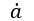</td>
<td>\dot{a}</td>
</tr>
<tr>
<td>2.</td>
<td>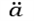</td>
<td>\ddot{a}</td>
</tr>
<tr>
<td>3.</td>
<td>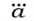</td>
<td>\dddot{a}</td>
</tr>
<tr>
<td>4.</td>
<td>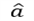</td>
<td>\hat{a}</td>
</tr>
<tr>
<td>5.</td>
<td></td>
<td>\check{a}</td>
</tr>
<tr>
<td>6.</td>
<td>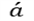</td>
<td>\acute{a}</td>
</tr>
<tr>
<td>7.</td>
<td>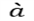</td>
<td>\grave{a}</td>
</tr>
<tr>
<td>8.</td>
<td>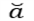</td>
<td>\breve{a}</td>
</tr>
<tr>
<td>9.</td>
<td>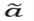</td>
<td>\widetilde{a}</td>
</tr>
<tr>
<td>10.</td>
<td>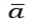</td>
<td>\bar{a}</td>
</tr>
<tr>
<td>11.</td>
<td>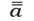</td>
<td>\bar{\bar{a}}</td>
</tr>
<tr>
<td>12.</td>
<td>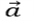</td>
<td>\vec{a}</td>
</tr>
<tr>
<td>13.</td>
<td>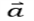</td>
<td>\hvec{a}</td>
</tr>
<tr>
<td>14.</td>
<td></td>
<td>\widehat{AAA}</td>
</tr>
</table>

## Bar

Add **bar** equation to a Word document using the LaTeX through [AppendMath](https://help.syncfusion.com/cr/file-formats/Syncfusion.DocIO.DLS.WParagraph.html#Syncfusion_DocIO_DLS_WParagraph_AppendMath_System_String_) API.

The following code example illustrates how to create bar equation using LaTeX in Word document.




// Create a new Word document.
using WordDocument document = new WordDocument();

//Add one section and one paragraph to the document.
document.EnsureMinimal();

//Append an bar equation using LaTeX.
document.LastParagraph.AppendMath(@"\overline{a}");

//Save the Word document to MemoryStream
using MemoryStream stream = new MemoryStream();
document.Save(stream, FormatType.Docx);




// Create a new Word document.
using WordDocument document = new WordDocument();

//Add one section and one paragraph to the document.
document.EnsureMinimal();

//Append an bar equation using LaTeX.
document.LastParagraph.AppendMath(@"\overline{a}");

//Save the Word document.
document.Save("Result.docx", FormatType.Docx);




' Create a new Word document.
Dim document As WordDocument = New WordDocument()

'Add one section and one paragraph to the document.
document.EnsureMinimal()

'Append an bar equation using LaTeX.
document.LastParagraph.AppendMath(@"\overline{a}")

'Save the Word document.
document.Save("Result.docx", FormatType.Docx)




You can download a complete working sample from [GitHub](https://github.com/SyncfusionExamples/DocIO-Examples/tree/main/Mathematical-Equation/LaTeX-equations/Bar/.NET).

The following table demonstrates the LaTeX equivalent to professional format bar equations.

<table>
<thead>
<tr>
<th width="20%">S.No</th>
<th width="40%">Professional</th>
<th width="40%">LaTeX</th>
</tr>
</thead>
<tr>
<td>1.</td>
<td></td>
<td>\overline{a}</td>
</tr>
<tr>
<td>2.</td>
<td>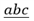</td>
<td>\underline{abc}</td>
</tr>
</table>

## Box

Add **box** equation to a Word document using the LaTeX through [AppendMath](https://help.syncfusion.com/cr/file-formats/Syncfusion.DocIO.DLS.WParagraph.html#Syncfusion_DocIO_DLS_WParagraph_AppendMath_System_String_) API.

The following code example illustrates how to create box equation using LaTeX in Word document.




// Create a new Word document.
using WordDocument document = new WordDocument();

//Add one section and one paragraph to the document.
document.EnsureMinimal();

//Append an box equation using LaTeX.
document.LastParagraph.AppendMath(@"\box{a}");

//Save the Word document to MemoryStream
using MemoryStream stream = new MemoryStream();
document.Save(stream, FormatType.Docx);




// Create a new Word document.
using WordDocument document = new WordDocument();

//Add one section and one paragraph to the document.
document.EnsureMinimal();

//Append an box equation using LaTeX.
document.LastParagraph.AppendMath(@"\box{a}");

//Save the Word document.
document.Save("Result.docx", FormatType.Docx);




' Create a new Word document.
Dim document As WordDocument = New WordDocument()

'Add one section and one paragraph to the document.
document.EnsureMinimal()

'Append an box equation using LaTeX.
document.LastParagraph.AppendMath(@"\box{a}")

'Save the Word document.
document.Save("Result.docx", FormatType.Docx)




You can download a complete working sample from [GitHub](https://github.com/SyncfusionExamples/DocIO-Examples/tree/main/Mathematical-Equation/LaTeX-equations/Box/.NET).

The following table demonstrates the LaTeX equivalent to professional format box equations.

<table>
<thead>
<tr>
<th width="20%">S.No</th>
<th width="40%">Professional</th>
<th width="40%">LaTeX</th>
</tr>
</thead>
<tr>
<td>1.</td>
<td></td>
<td>\box{a}</td>
</tr>
</table>

## Border Box

Add **border box** equation to a Word document using the LaTeX through [AppendMath](https://help.syncfusion.com/cr/file-formats/Syncfusion.DocIO.DLS.WParagraph.html#Syncfusion_DocIO_DLS_WParagraph_AppendMath_System_String_) API.

The following code example illustrates how to create border box equation using LaTeX in Word document.




// Create a new Word document.
using WordDocument document = new WordDocument();

//Add one section and one paragraph to the document.
document.EnsureMinimal();

//Append an border box equation using LaTeX.
document.LastParagraph.AppendMath(@"\boxed{{x}^{2}+{y}^{2}={z}^{2}}");

//Save the Word document to MemoryStream
using MemoryStream stream = new MemoryStream();
document.Save(stream, FormatType.Docx);




// Create a new Word document.
using WordDocument document = new WordDocument();

//Add one section and one paragraph to the document.
document.EnsureMinimal();

//Append an border box equation using LaTeX.
document.LastParagraph.AppendMath(@"\boxed{{x}^{2}+{y}^{2}={z}^{2}}");

//Save the Word document.
document.Save("Result.docx", FormatType.Docx);




' Create a new Word document.
Dim document As WordDocument = New WordDocument()

'Add one section and one paragraph to the document.
document.EnsureMinimal()

'Append an border box equation using LaTeX.
document.LastParagraph.AppendMath(@"\boxed{{x}^{2}+{y}^{2}={z}^{2}}")

'Save the Word document.
document.Save("Result.docx", FormatType.Docx)




You can download a complete working sample from [GitHub](https://github.com/SyncfusionExamples/DocIO-Examples/tree/main/Mathematical-Equation/LaTeX-equations/Border-Box/.NET).

The following table demonstrates the LaTeX equivalent to professional format border box equations.

<table>
<thead>
<tr>
<th width="20%">S.No</th>
<th width="40%">Professional</th>
<th width="40%">LaTeX</th>
</tr>
</thead>
<tr>
<td>1.</td>
<td></td>
<td>\boxed{{x}^{2}+{y}^{2}={z}^{2}}</td>
</tr>
</table>

## Delimiter

Add **delimiter** equation to a Word document using the LaTeX through [AppendMath](https://help.syncfusion.com/cr/file-formats/Syncfusion.DocIO.DLS.WParagraph.html#Syncfusion_DocIO_DLS_WParagraph_AppendMath_System_String_) API.

The following code example illustrates how to create delimiter equation using LaTeX in Word document.




// Create a new Word document.
using WordDocument document = new WordDocument();

//Add one section and one paragraph to the document.
document.EnsureMinimal();

//Append an delimiter equation using LaTeX.
document.LastParagraph.AppendMath(@"\left(a\right)");

//Save the Word document to MemoryStream
using MemoryStream stream = new MemoryStream();
document.Save(stream, FormatType.Docx);




// Create a new Word document.
using WordDocument document = new WordDocument();

//Add one section and one paragraph to the document.
document.EnsureMinimal();

//Append an delimiter equation using LaTeX.
document.LastParagraph.AppendMath(@"\left(a\right)");

//Save the Word document.
document.Save("Result.docx", FormatType.Docx);




' Create a new Word document.
Dim document As WordDocument = New WordDocument()

'Add one section and one paragraph to the document.
document.EnsureMinimal()

'Append an delimiter equation using LaTeX.
document.LastParagraph.AppendMath(@"\left(a\right)")

'Save the Word document.
document.Save("Result.docx", FormatType.Docx)




You can download a complete working sample from [GitHub](https://github.com/SyncfusionExamples/DocIO-Examples/tree/main/Mathematical-Equation/LaTeX-equations/Delimiter/.NET).

The following table demonstrates the LaTeX equivalent to professional format delimiter equations.

<table>
<thead>
<tr>
<th width="20%">S.No</th>
<th width="40%">Professional</th>
<th width="40%">LaTeX</th>
</tr>
</thead>
<tr>
<td>1.</td>
<td>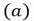</td>
<td>\left(a\right)</td>
</tr>
<tr>
<td>2.</td>
<td>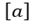</td>
<td>\left[a\right]</td>
</tr>
<tr>
<td>3.</td>
<td>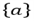</td>
<td>\left\{a\right\}</td>
</tr>
<tr>
<td>4.</td>
<td>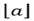</td>
<td>\left\lfloora\right\rfloor</td>
</tr>
<tr>
<td>5.</td>
<td>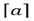</td>
<td>\left\lceila\right\rceil</td>
</tr>
<tr>
<td>6.</td>
<td></td>
<td>\left|a\right|</td>
</tr>
<tr>
<td>7.</td>
<td>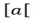</td>
<td>\left[a\right[</td>
</tr>
<tr>
<td>8.</td>
<td>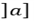</td>
<td>\left]a\right]</td>
</tr>
<tr>
<td>9.</td>
<td>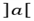</td>
<td>\left]a\right[</td>
</tr>
<tr>
<td>10.</td>
<td>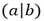</td>
<td>\left(a\middle|b\right)</td>
</tr>
<tr>
<td>11.</td>
<td>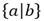</td>
<td>\left\{a\middle|b\right\}</td>
</tr>
<tr>
<td>12.</td>
<td>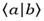</td>
<td>\left\langlea\middle|b\right\rangle</td>
</tr>
<tr>
<td>13.</td>
<td>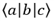</td>
<td>\left\langlea\middle|b\middle|c\right\rangle</td>
</tr>
<tr>
<td>14.</td>
<td>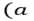</td>
<td>\left(a\right.</td>
</tr>
<tr>
<td>15.</td>
<td>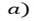</td>
<td>\left. a\right)</td>
</tr>
<tr>
<td>16.</td>
<td>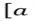</td>
<td>\left[a\right.</td>
</tr>
<tr>
<td>17.</td>
<td>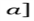</td>
<td>\left. a\right]</td>
</tr>
<tr>
<td>18.</td>
<td>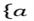</td>
<td>\left\{a\right.</td>
</tr>
<tr>
<td>19.</td>
<td>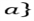</td>
<td>\left. a\right\}</td>
</tr>
<tr>
<td>20.</td>
<td>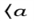</td>
<td>\left\langlea\right.</td>
</tr>
<tr>
<td>21.</td>
<td>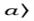</td>
<td>\left. a\right\rangle</td>
</tr>
<tr>
<td>22.</td>
<td></td>
<td>\left\lfloora\right.</td>
</tr>
<tr>
<td>23.</td>
<td>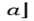</td>
<td>\left. a\right\rfloor</td>
</tr>
<tr>
<td>24.</td>
<td>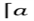</td>
<td>\left\lceila\right.</td>
</tr>
<tr>
<td>25.</td>
<td>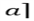</td>
<td>\left. a\right\rceil</td>
</tr>
<tr>
<td>26.</td>
<td></td>
<td>\left|a\right.</td>
</tr>
<tr>
<td>27.</td>
<td>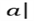</td>
<td>\left. a\right|</td>
</tr>
<tr>
<td>28.</td>
<td>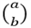</td>
<td>\binom{a}{b}</td>
</tr>
</table>

## Fraction

Add **fraction** equation to a Word document using the LaTeX through [AppendMath](https://help.syncfusion.com/cr/file-formats/Syncfusion.DocIO.DLS.WParagraph.html#Syncfusion_DocIO_DLS_WParagraph_AppendMath_System_String_) API.

The following code example illustrates how to create fraction equation using LaTeX in Word document.




// Create a new Word document.
using WordDocument document = new WordDocument();

//Add one section and one paragraph to the document.
document.EnsureMinimal();

//Append an fraction equation using LaTeX.
document.LastParagraph.AppendMath(@"{\frac{dy}{dx}}");

//Save the Word document to MemoryStream
using MemoryStream stream = new MemoryStream();
document.Save(stream, FormatType.Docx);




// Create a new Word document.
using WordDocument document = new WordDocument();

//Add one section and one paragraph to the document.
document.EnsureMinimal();

//Append an fraction equation using LaTeX.
document.LastParagraph.AppendMath(@"{\frac{dy}{dx}}");

//Save the Word document.
document.Save("Result.docx", FormatType.Docx);




' Create a new Word document.
Dim document As WordDocument = New WordDocument()

'Add one section and one paragraph to the document.
document.EnsureMinimal()

'Append an fraction equation using LaTeX.
document.LastParagraph.AppendMath(@"{\frac{dy}{dx}}")

'Save the Word document.
document.Save("Result.docx", FormatType.Docx)




You can download a complete working sample from [GitHub](https://github.com/SyncfusionExamples/DocIO-Examples/tree/main/Mathematical-Equation/LaTeX-equations/Fraction/.NET).

The following table demonstrates the LaTeX equivalent to professional format fraction equations.

<table>
<thead>
<tr>
<th width="20%">S.No</th>
<th width="40%">Professional</th>
<th width="40%">LaTeX</th>
</tr>
</thead>
<tr>
<td>1.</td>
<td>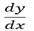</td>
<td>frac{\mathbit{dy}}{\mathbit{dx}}</td>
</tr>
<tr>
<td>2.</td>
<td>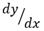</td>
<td>\sfrac{dy}{dx}</td>
</tr>
<tr>
<td>3.</td>
<td>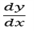</td>
<td>{\frac{dy}{dx}}</td>
</tr>
</table>

## Function

Add **function** equation to a Word document using the LaTeX through [AppendMath](https://help.syncfusion.com/cr/file-formats/Syncfusion.DocIO.DLS.WParagraph.html#Syncfusion_DocIO_DLS_WParagraph_AppendMath_System_String_) API.

The following code example illustrates how to create function equation using LaTeX in Word document.




// Create a new Word document.
using WordDocument document = new WordDocument();

//Add one section and one paragraph to the document.
document.EnsureMinimal();

//Append an function equation using LaTeX.
document.LastParagraph.AppendMath(@"\sin{\theta}");

//Save the Word document to MemoryStream
using MemoryStream stream = new MemoryStream();
document.Save(stream, FormatType.Docx);




// Create a new Word document.
using WordDocument document = new WordDocument();

//Add one section and one paragraph to the document.
document.EnsureMinimal();

//Append an function equation using LaTeX.
document.LastParagraph.AppendMath(@"\sin{\theta}");

//Save the Word document.
document.Save("Result.docx", FormatType.Docx);




' Create a new Word document.
Dim document As WordDocument = New WordDocument()

'Add one section and one paragraph to the document.
document.EnsureMinimal()

'Append an function equation using LaTeX.
document.LastParagraph.AppendMath(@"\sin{\theta}")

'Save the Word document.
document.Save("Result.docx", FormatType.Docx)




You can download a complete working sample from [GitHub](https://github.com/SyncfusionExamples/DocIO-Examples/tree/main/Mathematical-Equation/LaTeX-equations/Function/.NET).

The following table demonstrates the LaTeX equivalent to professional format function equations.

<table>
<thead>
<tr>
<th width="20%">S.No</th>
<th width="40%">Professional</th>
<th width="40%">LaTeX</th>
</tr>
</thead>
<tr>
<td>1.</td>
<td></td>
<td>\sin{\theta}</td>
</tr>
<tr>
<td>2.</td>
<td></td>
<td>\cos{\theta}</td>
</tr>
<tr>
<td>3.</td>
<td>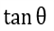</td>
<td>\tan{\theta}</td>
</tr>
<tr>
<td>4.</td>
<td></td>
<td>\csc{\theta}</td>
</tr>
<tr>
<td>5.</td>
<td></td>
<td>\sec{\theta}</td>
</tr>
<tr>
<td>6.</td>
<td></td>
<td>\cot{\theta}</td>
</tr>
<tr>
<td>7.</td>
<td>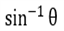</td>
<td>\sin^{-1}{\theta}</td>
</tr>
<tr>
<td>8.</td>
<td>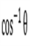</td>
<td>\cos^{-1}{\theta}</td>
</tr>
<tr>
<td>9.</td>
<td></td>
<td>\tan^{-1}{\theta}</td>
</tr>
<tr>
<td>10.</td>
<td>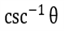</td>
<td>\csc^{-1}{\theta}</td>
</tr>
<tr>
<td>11.</td>
<td>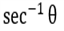</td>
<td>\sec^{-1}{\theta}</td>
</tr>
<tr>
<td>12.</td>
<td></td>
<td>\cot^{-1}{\theta}</td>
</tr>
<tr>
<td>13.</td>
<td>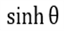</td>
<td>\sinh{\theta}</td>
</tr>
<tr>
<td>14.</td>
<td></td>
<td>\cosh{\theta}</td>
</tr>
<tr>
<td>15.</td>
<td>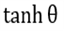</td>
<td>\tanh{\theta}</td>
</tr>
<tr>
<td>16.</td>
<td>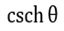</td>
<td>\csch{\theta}</td>
</tr>
<tr>
<td>17.</td>
<td>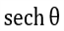</td>
<td>\sech{\theta}</td>
</tr>
<tr>
<td>18.</td>
<td></td>
<td>\coth{\theta}</td>
</tr>
<tr>
<td>19.</td>
<td></td>
<td>\sinh^{-1}{\theta}</td>
</tr>
<tr>
<td>20.</td>
<td></td>
<td>\cosh^{-1}{\theta}</td>
</tr>
<tr>
<td>21.</td>
<td></td>
<td>\tanh^{-1}{\theta}</td>
</tr>
<tr>
<td>22.</td>
<td></td>
<td>\csch^{-1}{\theta}</td>
</tr>
<tr>
<td>23.</td>
<td></td>
<td>\sech^{-1}{\theta}</td>
</tr>
<tr>
<td>24.</td>
<td></td>
<td>\coth^{-1}{\theta}</td>
</tr>
<tr>
<td>25.</td>
<td></td>
<td>\arcsin{\theta}</td>
</tr>
<tr>
<td>26.</td>
<td></td>
<td>\arccos{\theta}</td>
</tr>
<tr>
<td>27.</td>
<td></td>
<td>\arctan{\theta}</td>
</tr>
<tr>
<td>28.</td>
<td></td>
<td>\arccsc{\theta}</td>
</tr>
<tr>
<td>29.</td>
<td></td>
<td>\arcsec{\theta}</td>
</tr>
<tr>
<td>30.</td>
<td></td>
<td>\arccot{\theta}</td>
</tr>
</table>

## Group character

Add **group character** equation to a Word document using the LaTeX through [AppendMath](https://help.syncfusion.com/cr/file-formats/Syncfusion.DocIO.DLS.WParagraph.html#Syncfusion_DocIO_DLS_WParagraph_AppendMath_System_String_) API.

The following code example illustrates how to create group character equation using LaTeX in Word document.




// Create a new Word document.
using WordDocument document = new WordDocument();

//Add one section and one paragraph to the document.
document.EnsureMinimal();

//Append an group character equation using LaTeX.
document.LastParagraph.AppendMath(@"\overbrace{a-b}");

//Save the Word document to MemoryStream
using MemoryStream stream = new MemoryStream();
document.Save(stream, FormatType.Docx);




// Create a new Word document.
using WordDocument document = new WordDocument();

//Add one section and one paragraph to the document.
document.EnsureMinimal();

//Append an group character equation using LaTeX.
document.LastParagraph.AppendMath(@"\overbrace{a-b}");

//Save the Word document.
document.Save("Result.docx", FormatType.Docx);




' Create a new Word document.
Dim document As WordDocument = New WordDocument()

'Add one section and one paragraph to the document.
document.EnsureMinimal()

'Append an group character equation using LaTeX.
document.LastParagraph.AppendMath(@"\overbrace{a-b}")

'Save the Word document.
document.Save("Result.docx", FormatType.Docx)




You can download a complete working sample from [GitHub](https://github.com/SyncfusionExamples/DocIO-Examples/tree/main/Mathematical-Equation/LaTeX-equations/Group-character/.NET).

The following table demonstrates the LaTeX equivalent to professional format group character equations.

<table>
<thead>
<tr>
<th width="20%">S.No</th>
<th width="40%">Professional</th>
<th width="40%">LaTeX</th>
</tr>
</thead>
<tr>
<td>1.</td>
<td></td>
<td>\overbrace{a-b}</td>
</tr>
<tr>
<td>2.</td>
<td></td>
<td>\underbrace{a}</td>
</tr>
</table>

## Limit

Add **limit** equation to a Word document using the LaTeX through [AppendMath](https://help.syncfusion.com/cr/file-formats/Syncfusion.DocIO.DLS.WParagraph.html#Syncfusion_DocIO_DLS_WParagraph_AppendMath_System_String_) API.

The following code example illustrates how to create limit equation using LaTeX in Word document.




// Create a new Word document.
using WordDocument document = new WordDocument();

//Add one section and one paragraph to the document.
document.EnsureMinimal();

//Append an limit equation using LaTeX.
document.LastParagraph.AppendMath(@"\lim\below{b}{a}");

//Save the Word document to MemoryStream
using MemoryStream stream = new MemoryStream();
document.Save(stream, FormatType.Docx);




// Create a new Word document.
using WordDocument document = new WordDocument();

//Add one section and one paragraph to the document.
document.EnsureMinimal();

//Append an limit equation using LaTeX.
document.LastParagraph.AppendMath(@"\lim\below{b}{a}");

//Save the Word document.
document.Save("Result.docx", FormatType.Docx);




' Create a new Word document.
Dim document As WordDocument = New WordDocument()

'Add one section and one paragraph to the document.
document.EnsureMinimal()

'Append an limit equation using LaTeX.
document.LastParagraph.AppendMath(@"\lim\below{b}{a}")

'Save the Word document.
document.Save("Result.docx", FormatType.Docx)




You can download a complete working sample from [GitHub](https://github.com/SyncfusionExamples/DocIO-Examples/tree/main/Mathematical-Equation/LaTeX-equations/Limit/.NET).

The following table demonstrates the LaTeX equivalent to professional format limit equations.

<table>
<thead>
<tr>
<th width="20%">S.No</th>
<th width="40%">Professional</th>
<th width="40%">LaTeX</th>
</tr>
</thead>
<tr>
<td>1.</td>
<td></td>
<td>\lim\below{b}{a}</td>
</tr>
<tr>
<td>2.</td>
<td></td>
<td>\min\below{b}{a}</td>
</tr>
<tr>
<td>3.</td>
<td></td>
<td>\max\below{b}{a}</td>
</tr>
</table>

## Matrix

Add **matrix** equation to a Word document using the LaTeX through [AppendMath](https://help.syncfusion.com/cr/file-formats/Syncfusion.DocIO.DLS.WParagraph.html#Syncfusion_DocIO_DLS_WParagraph_AppendMath_System_String_) API.

The following code example illustrates how to create matrix equation using LaTeX in Word document.




// Create a new Word document.
using WordDocument document = new WordDocument();

//Add one section and one paragraph to the document.
document.EnsureMinimal();

//Append an matrix equation using LaTeX.
document.LastParagraph.AppendMath(@"\begin{matrix}a&b\\\end{matrix}");

//Save the Word document to MemoryStream
using MemoryStream stream = new MemoryStream();
document.Save(stream, FormatType.Docx);




// Create a new Word document.
using WordDocument document = new WordDocument();

//Add one section and one paragraph to the document.
document.EnsureMinimal();

//Append an matrix equation using LaTeX.
document.LastParagraph.AppendMath(@"\begin{matrix}a&b\\\end{matrix}");

//Save the Word document.
document.Save("Result.docx", FormatType.Docx);




' Create a new Word document.
Dim document As WordDocument = New WordDocument()

'Add one section and one paragraph to the document.
document.EnsureMinimal()

'Append an matrix equation using LaTeX.
document.LastParagraph.AppendMath(@"\begin{matrix}a&b\\\end{matrix}")

'Save the Word document.
document.Save("Result.docx", FormatType.Docx)




You can download a complete working sample from [GitHub](https://github.com/SyncfusionExamples/DocIO-Examples/tree/main/Mathematical-Equation/LaTeX-equations/Matrix/.NET).

The following table demonstrates the LaTeX equivalent to professional format matrix equations.

<table>
<thead>
<tr>
<th width="20%">S.No</th>
<th width="40%">Professional</th>
<th width="40%">LaTeX</th>
</tr>
</thead>
<tr>
<td>1.</td>
<td></td>
<td>\begin{matrix}\mathbit{a}&\mathbit{b}\\\end{matrix}</td>
</tr>
</table>

## N-array

Add **N-array** equation to a Word document using the LaTeX through [AppendMath](https://help.syncfusion.com/cr/file-formats/Syncfusion.DocIO.DLS.WParagraph.html#Syncfusion_DocIO_DLS_WParagraph_AppendMath_System_String_) API.

The following code example illustrates how to create N-array equation using LaTeX in Word document.




// Create a new Word document.
using WordDocument document = new WordDocument();

//Add one section and one paragraph to the document.
document.EnsureMinimal();

//Append an N-array equation using LaTeX.
document.LastParagraph.AppendMath(@"\sum{a}");

//Save the Word document to MemoryStream
using MemoryStream stream = new MemoryStream();
document.Save(stream, FormatType.Docx);




// Create a new Word document.
using WordDocument document = new WordDocument();

//Add one section and one paragraph to the document.
document.EnsureMinimal();

//Append an N-array equation using LaTeX.
document.LastParagraph.AppendMath(@"\sum{a}");

//Save the Word document.
document.Save("Result.docx", FormatType.Docx);




' Create a new Word document.
Dim document As WordDocument = New WordDocument()

'Add one section and one paragraph to the document.
document.EnsureMinimal()

'Append an N-array equation using LaTeX.
document.LastParagraph.AppendMath(@"\sum{a}")

'Save the Word document.
document.Save("Result.docx", FormatType.Docx)




You can download a complete working sample from [GitHub](https://github.com/SyncfusionExamples/DocIO-Examples/tree/main/Mathematical-Equation/LaTeX-equations/N-array/.NET).

The following table demonstrates the LaTeX equivalent to professional format N-array equations.

<table>
<thead>
<tr>
<th width="20%">S.No</th>
<th width="40%">Professional</th>
<th width="40%">LaTeX</th>
</tr>
</thead>
<tr>
<td>1.</td>
<td></td>
<td>\sum{a}</td>
</tr>
<tr>
<td>2.</td>
<td></td>
<td>\sum_{l}^{u}a</td>
</tr>
<tr>
<td>3.</td>
<td></td>
<td>\sum_{l}^{u}a</td>
</tr>
<tr>
<td>4.</td>
<td></td>
<td>\sum_{l}a</td>
</tr>
<tr>
<td>5.</td>
<td></td>
<td>\sum_{b}a</td>
</tr>
<tr>
<td>6.</td>
<td></td>
<td>\prod{a}</td>
</tr>
<tr>
<td>7.</td>
<td></td>
<td>\amalg{a}</td>
</tr>
<tr>
<td>8.</td>
<td></td>
<td>\bigcup{a}</td>
</tr>
<tr>
<td>9.</td>
<td></td>
<td>\bigcap{a}</td>
</tr>
<tr>
<td>10.</td>
<td></td>
<td>\bigvee{a}</td>
</tr>
<tr>
<td>11.</td>
<td></td>
<td>\bigwedge{a}</td>
</tr>
</table>

## Radical

Add **radical** equation to a Word document using the LaTeX through [AppendMath](https://help.syncfusion.com/cr/file-formats/Syncfusion.DocIO.DLS.WParagraph.html#Syncfusion_DocIO_DLS_WParagraph_AppendMath_System_String_) API.

The following code example illustrates how to create radical equation using LaTeX in Word document.




// Create a new Word document.
using WordDocument document = new WordDocument();

//Add one section and one paragraph to the document.
document.EnsureMinimal();

//Append an radical equation using LaTeX.
document.LastParagraph.AppendMath(@"\sqrt{a}");

//Save the Word document to MemoryStream
using MemoryStream stream = new MemoryStream();
document.Save(stream, FormatType.Docx);




// Create a new Word document.
using WordDocument document = new WordDocument();

//Add one section and one paragraph to the document.
document.EnsureMinimal();

//Append an radical equation using LaTeX.
document.LastParagraph.AppendMath(@"\sqrt{a}");

//Save the Word document.
document.Save("Result.docx", FormatType.Docx);




' Create a new Word document.
Dim document As WordDocument = New WordDocument()

'Add one section and one paragraph to the document.
document.EnsureMinimal()

'Append an radical equation using LaTeX.
document.LastParagraph.AppendMath(@"\sqrt{a}")

'Save the Word document.
document.Save("Result.docx", FormatType.Docx)




You can download a complete working sample from [GitHub](https://github.com/SyncfusionExamples/DocIO-Examples/tree/main/Mathematical-Equation/LaTeX-equations/Radical/.NET).

The following table demonstrates the LaTeX equivalent to professional format radical equations.

<table>
<thead>
<tr>
<th width="20%">S.No</th>
<th width="40%">Professional</th>
<th width="40%">LaTeX</th>
</tr>
</thead>
<tr>
<td>1.</td>
<td></td>
<td>\sqrt{a}</td>
</tr>
<tr>
<td>2.</td>
<td></td>
<td>\sqrt[b]{a}</td>
</tr>
</table>

## SubSuperScript

Add **SubSuperScript** equation to a Word document using the LaTeX through [AppendMath](https://help.syncfusion.com/cr/file-formats/Syncfusion.DocIO.DLS.WParagraph.html#Syncfusion_DocIO_DLS_WParagraph_AppendMath_System_String_) API.

The following code example illustrates how to create SubSuperScript equation using LaTeX in Word document.




// Create a new Word document.
using WordDocument document = new WordDocument();

//Add one section and one paragraph to the document.
document.EnsureMinimal();

//Append an SubSuperScript equation using LaTeX.
document.LastParagraph.AppendMath((@"{a}^{b}");

//Save the Word document to MemoryStream
using MemoryStream stream = new MemoryStream();
document.Save(stream, FormatType.Docx);




// Create a new Word document.
using WordDocument document = new WordDocument();

//Add one section and one paragraph to the document.
document.EnsureMinimal();

//Append an SubSuperScript equation using LaTeX.
document.LastParagraph.AppendMath((@"{a}^{b}");

//Save the Word document.
document.Save("Result.docx", FormatType.Docx);




' Create a new Word document.
Dim document As WordDocument = New WordDocument()

'Add one section and one paragraph to the document.
document.EnsureMinimal()

'Append an SubSuperScript equation using LaTeX.
document.LastParagraph.AppendMath((@"{a}^{b}")

'Save the Word document.
document.Save("Result.docx", FormatType.Docx)




You can download a complete working sample from [GitHub](https://github.com/SyncfusionExamples/DocIO-Examples/tree/main/Mathematical-Equation/LaTeX-equations/SubSuperScript/.NET).

The following table demonstrates the LaTeX equivalent to professional format SubSuperScript equations.

<table>
<thead>
<tr>
<th width="20%">S.No</th>
<th width="40%">Professional</th>
<th width="40%">LaTeX</th>
</tr>
</thead>
<tr>
<td>1.</td>
<td></td>
<td>{\mathbit{a}}^{\mathbit{b}}</td>
</tr>
<tr>
<td>2.</td>
<td></td>
<td>{\mathbit{a}}_{\mathbit{b}}</td>
</tr>
</table>

## Left SubSuperScript

Add **Left SubSuperScript** equation to a Word document using the LaTeX through [AppendMath](https://help.syncfusion.com/cr/file-formats/Syncfusion.DocIO.DLS.WParagraph.html#Syncfusion_DocIO_DLS_WParagraph_AppendMath_System_String_) API.

The following code example illustrates how to create Left SubSuperScript equation using LaTeX in Word document.




// Create a new Word document.
using WordDocument document = new WordDocument();

//Add one section and one paragraph to the document.
document.EnsureMinimal();

//Append an Left SubSuperScript equation using LaTeX.
document.LastParagraph.AppendMath(@"{_{40}^{20}}{100}");

//Save the Word document to MemoryStream
using MemoryStream stream = new MemoryStream();
document.Save(stream, FormatType.Docx);




// Create a new Word document.
using WordDocument document = new WordDocument();

//Add one section and one paragraph to the document.
document.EnsureMinimal();

//Append an Left SubSuperScript equation using LaTeX.
document.LastParagraph.AppendMath(@"{_{40}^{20}}{100}");

//Save the Word document.
document.Save("Result.docx", FormatType.Docx);




' Create a new Word document.
Dim document As WordDocument = New WordDocument()

'Add one section and one paragraph to the document.
document.EnsureMinimal()

'Append an Left SubSuperScript equation using LaTeX.
document.LastParagraph.AppendMath(@"{_{40}^{20}}{100}");

'Save the Word document.
document.Save("Result.docx", FormatType.Docx)




You can download a complete working sample from [GitHub](https://github.com/SyncfusionExamples/DocIO-Examples/tree/main/Mathematical-Equation/LaTeX-equations/Left-SubSuperScript/.NET)

The following table demonstrates the LaTeX equivalent to professional format Left SubSuperScript equations.

<table>
<thead>
<tr>
<th width="20%">S.No</th>
<th width="40%">Professional</th>
<th width="40%">LaTeX</th>
</tr>
</thead>
<tr>
<td>1.</td>
<td></td>
<td>{_{\mathbf{40}}^{\mathbf{20}}}{\mathbf{100}}</td>
</tr>
</table>

## Right SubSuperScript

Add **Right SubSuperScript** equation to a Word document using the LaTeX through [AppendMath](https://help.syncfusion.com/cr/file-formats/Syncfusion.DocIO.DLS.WParagraph.html#Syncfusion_DocIO_DLS_WParagraph_AppendMath_System_String_) API.

The following code example illustrates how to create Right SubSuperScript equation using LaTeX in Word document.




// Create a new Word document.
using WordDocument document = new WordDocument();

//Add one section and one paragraph to the document.
document.EnsureMinimal();

//Append an Right SubSuperScript equation using LaTeX.
document.LastParagraph.AppendMath(@"{100}_{40}^{20}");

//Save the Word document to MemoryStream
using MemoryStream stream = new MemoryStream();
document.Save(stream, FormatType.Docx);




// Create a new Word document.
using WordDocument document = new WordDocument();

//Add one section and one paragraph to the document.
document.EnsureMinimal();

//Append an Right SubSuperScript equation using LaTeX.
document.LastParagraph.AppendMath(@"{100}_{40}^{20}");

//Save the Word document.
document.Save("Result.docx", FormatType.Docx);




' Create a new Word document.
Dim document As WordDocument = New WordDocument()

'Add one section and one paragraph to the document.
document.EnsureMinimal()

'Append an Right SubSuperScript equation using LaTeX.
document.LastParagraph.AppendMath(@"{100}_{40}^{20}")

'Save the Word document.
document.Save("Result.docx", FormatType.Docx)




You can download a complete working sample from [GitHub](https://github.com/SyncfusionExamples/DocIO-Examples/tree/main/Mathematical-Equation/LaTeX-equations/Right-SubSuperScript/.NET).

The following table demonstrates the LaTeX equivalent to professional format Right SubSuperScript equations.

<table>
<thead>
<tr>
<th width="20%">S.No</th>
<th width="40%">Professional</th>
<th width="40%">LaTeX</th>
</tr>
</thead>
<tr>
<td>1.</td>
<td></td>
<td>{\mathbf{100}}_{\mathbf{40}}^{\mathbf{20}}</td>
</tr>
</table>
