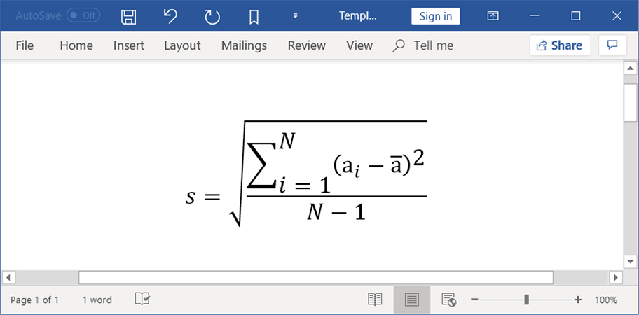
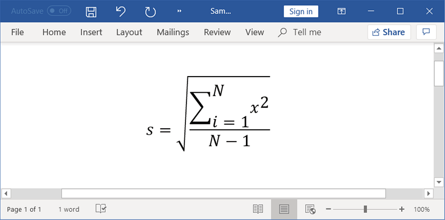

# Working with Mathematical Equation

Equations in Word document are combination of mathematical symbols or text. For example, you can create a Fourier series equation in Word document.

N> You can use mathematical equation only in documents that are saved in the Open XML Format and cannot be used in the Word 97-2003 document (.doc) format.

## Types of equation

The following different structures of equation can be created by using the Essential DocIO.

* Accent
* Bar
* Box
* Border box
* Delimiter
* Equation array
* Fraction
* Function
* Group character
* Limit
* Matrix
* N-Array
* Radical
* Phantom
* SubSuperscript
* Left SubSuperscript
* Right SubSuperscript

### Accent

You can add an accent mark to the equation. The following code example shows how to add an accent mark to the equation.



//Creates a new Word document
WordDocument document = new WordDocument();
//Adds one section and one paragraph to the document
document.EnsureMinimal();
//Appends a new mathematical equation  to the paragraph
WMath math = document.LastParagraph.AppendMath();
//Adds a new math
IOfficeMath officeMath = math.MathParagraph.Maths.Add();
//Adds an accent equation
IOfficeMathAccent mathAccent = officeMath.Functions.Add(MathFunctionType.Accent) as IOfficeMathAccent;
//Sets the accent character
mathAccent.AccentCharacter = "̆";
//Adds the run element for accent
IOfficeMathRunElement officeMathRunElement = mathAccent.Equation.Functions.Add(MathFunctionType.RunElement) as IOfficeMathRunElement;
officeMathRunElement.Item = new WTextRange(document);
WTextRange textRange = officeMathRunElement.Item as WTextRange;
//Sets text for accent equation
textRange.Text = "a";
//Applies character formatting for text range
textRange.CharacterFormat.Bold = true;
textRange.CharacterFormat.Italic = true;
//Saves the Word document
document.Save("Sample.docx", FormatType.Docx);
//Closes the document
document.Close();



'Creates a new Word document
Dim document As WordDocument = New WordDocument
'Adds one section and one paragraph to the document
document.EnsureMinimal()
'Appends a new mathematical equation  to the paragraph
Dim math As WMath = document.LastParagraph.AppendMath
'Adds a new math
Dim officeMath As IOfficeMath = math.MathParagraph.Maths.Add
'Adds an accent equation
Dim mathAccent As IOfficeMathAccent = CType(officeMath.Functions.Add(MathFunctionType.Accent), IOfficeMathAccent)
'Sets the accent character
mathAccent.AccentCharacter = ""
Dim officeMathRunElement As IOfficeMathRunElement = CType(mathAccent.Equation.Functions.Add(MathFunctionType.RunElement), IOfficeMathRunElement)
officeMathRunElement.Item = New WTextRange(document)
Dim textRange As WTextRange = CType(officeMathRunElement.Item, WTextRange)
'Sets text for accent equation
textRange.Text = "a"
'Applies character formatting for text range
textRange.CharacterFormat.Bold = True
textRange.CharacterFormat.Italic = True
'Saves the Word document
document.Save("Sample.docx", FormatType.Docx)
'Closes the document
document.Close()



//Creates a new Word document
WordDocument document = new WordDocument();
//Adds one section and one paragraph to the document
document.EnsureMinimal();
//Appends a new mathematical equation  to the paragraph
WMath math = document.LastParagraph.AppendMath();
//Adds a new math
IOfficeMath officeMath = math.MathParagraph.Maths.Add();
//Adds an accent equation
IOfficeMathAccent mathAccent = officeMath.Functions.Add(MathFunctionType.Accent) as IOfficeMathAccent;
//Sets the accent character
mathAccent.AccentCharacter = "̆";
//Adds the run element for accent
IOfficeMathRunElement officeMathRunElement = mathAccent.Equation.Functions.Add(MathFunctionType.RunElement) as IOfficeMathRunElement;
officeMathRunElement.Item = new WTextRange(document);
WTextRange textRange = officeMathRunElement.Item as WTextRange;
//Sets text for accent equation
textRange.Text = "a";
//Applies character formatting for text range
textRange.CharacterFormat.Bold = true;
textRange.CharacterFormat.Italic = true;
//Saves and closes the Word document instance
MemoryStream stream = new MemoryStream();
//Saves the Word document to MemoryStream
await document.SaveAsync(stream, FormatType.Docx);
//Saves the stream as Word document file in local machine
Save(stream, "Sample.docx ");
//Please refer the below link to save Word document in UWP platform
//https://help.syncfusion.com/file-formats/docio/create-word-document-in-uwp#save-word-document-in-uwp



//Creates a new Word document
WordDocument document = new WordDocument();
//Adds one section and one paragraph to the document
document.EnsureMinimal();
//Appends a new mathematical equation  to the paragraph
WMath math = document.LastParagraph.AppendMath();
//Adds a new math
IOfficeMath officeMath = math.MathParagraph.Maths.Add();
//Adds an accent equation
IOfficeMathAccent mathAccent = officeMath.Functions.Add(MathFunctionType.Accent) as IOfficeMathAccent;
//Sets the accent character
mathAccent.AccentCharacter = "̆";
//Adds the run element for accent
IOfficeMathRunElement officeMathRunElement = mathAccent.Equation.Functions.Add(MathFunctionType.RunElement) as IOfficeMathRunElement;
officeMathRunElement.Item = new WTextRange(document);
WTextRange textRange = officeMathRunElement.Item as WTextRange;
//Sets text for accent equation
textRange.Text = "a";
//Applies character formatting for text range
textRange.CharacterFormat.Bold = true;
textRange.CharacterFormat.Italic = true;
//Saves and closes the Word document instance
MemoryStream stream = new MemoryStream();
//Saves the Word document to  MemoryStream
document.Save(stream, FormatType.Docx);
document.Close();
stream.Position = 0;
//Download Word document in the browser
return File(stream, "application/msword", "Sample.docx");



//Creates a new Word document
WordDocument document = new WordDocument();
//Adds one section and one paragraph to the document
document.EnsureMinimal();
//Appends a new mathematical equation  to the paragraph
WMath math = document.LastParagraph.AppendMath();
//Adds a new math
IOfficeMath officeMath = math.MathParagraph.Maths.Add();
//Adds an accent equation
IOfficeMathAccent mathAccent = officeMath.Functions.Add(MathFunctionType.Accent) as IOfficeMathAccent;
//Sets the accent character
mathAccent.AccentCharacter = "̆";
//Adds the run element for accent
IOfficeMathRunElement officeMathRunElement = mathAccent.Equation.Functions.Add(MathFunctionType.RunElement) as IOfficeMathRunElement;
officeMathRunElement.Item = new WTextRange(document);
WTextRange textRange = officeMathRunElement.Item as WTextRange;
//Sets text for accent equation
textRange.Text = "a";
//Applies character formatting for text range
textRange.CharacterFormat.Bold = true;
textRange.CharacterFormat.Italic = true;
//Saves and closes the Word document instance
MemoryStream stream = new MemoryStream();
//Saves the Word file to MemoryStream
document.Save(stream, FormatType.Docx);
document.Close();
//Save the stream as a file in the device and invoke it for viewing
Xamarin.Forms.DependencyService.Get<ISave>().SaveAndView("Sample.docx", "application/msword", stream);
//Please download the helper files from the below link to save the stream as file and open the file for viewing in Xamarin platform
//https://help.syncfusion.com/file-formats/docio/create-word-document-in-XAMARIN#helper-files-for-XAMARIN



You can download a complete working sample from [GitHub](https://github.com/SyncfusionExamples/DocIO-Examples/tree/main/Mathematical-Equation/Add-an-accent-mark-to-the-equation).

### Bar

You can add a bar (which adds horizontal line on top or bottom) to the equation. The following code example shows how to add a bar to the equation.



//Creates a new Word document
WordDocument document = new WordDocument();
//Add a section and a paragraph in the empty document
document.EnsureMinimal();
//Appends a new mathematical equation to the paragraph
WMath math = document.LastParagraph.AppendMath();
//Adds a new math
IOfficeMath officeMath = math.MathParagraph.Maths.Add();
//Adds a bar equation
IOfficeMathBar mathBar = officeMath.Functions.Add(0, MathFunctionType.Bar) as IOfficeMathBar;
//Sets the position of bar
mathBar.BarTop = true;
//Adds the run element for bar
IOfficeMathRunElement officeMathRunElement = mathBar.Equation.Functions.Add(0, MathFunctionType.RunElement) as IOfficeMathRunElement;
officeMathRunElement.Item = new WTextRange(document);
//Sets text for bar equation
(officeMathRunElement.Item as WTextRange).Text = "a";
//Saves the Word document
document.Save("Sample.docx", FormatType.Docx);
//Closes the document
document.Close();



'Creates a new Word document
Dim document As WordDocument = New WordDocument
'Adds one section and one paragraph to the document
document.EnsureMinimal()
'Appends a new mathematical equation  to the paragraph
Dim math As WMath = document.LastParagraph.AppendMath
'Adds a new math
Dim officeMath As IOfficeMath = math.MathParagraph.Maths.Add
Dim mathBar As IOfficeMathBar = CType(officeMath.Functions.Add(0, MathFunctionType.Bar), IOfficeMathBar)
'Sets the position of bar
mathBar.BarTop = True
Dim officeMathRunElement As IOfficeMathRunElement = CType(mathBar.Equation.Functions.Add(0, MathFunctionType.RunElement), IOfficeMathRunElement)
officeMathRunElement.Item = New WTextRange(document)
'Sets text for bar equation
CType(officeMathRunElement.Item, WTextRange).Text = "a"
'Saves the Word document
document.Save("Sample.docx", FormatType.Docx)
'Closes the document
document.Close()



//Creates a new Word document
WordDocument document = new WordDocument();
//Adds one section and one paragraph to the document
document.EnsureMinimal();
//Appends a new mathematical equation to the paragraph
WMath math = document.LastParagraph.AppendMath();
//Adds a new math
IOfficeMath officeMath = math.MathParagraph.Maths.Add();
//Adds an bar equation
IOfficeMathBar mathBar = officeMath.Functions.Add(0, MathFunctionType.Bar) as IOfficeMathBar;
//Sets the position of bar
mathBar.BarTop = true;
//Adds the run element for bar
IOfficeMathRunElement officeMathRunElement = mathBar.Equation.Functions.Add(0, MathFunctionType.RunElement) as IOfficeMathRunElement;
officeMathRunElement.Item = new WTextRange(document);
//Sets text for bar equation
(officeMathRunElement.Item as WTextRange).Text = "a";
//Saves and closes the Word document instance
MemoryStream stream = new MemoryStream();
//Saves the Word document to MemoryStream
await document.SaveAsync(stream, FormatType.Docx);
//Saves the stream as Word document file in local machine
Save(stream, "Sample.docx");
//Please refer the below link to save Word document in UWP platform
//https://help.syncfusion.com/file-formats/docio/create-word-document-in-uwp#save-word-document-in-uwp



//Creates a new Word document
WordDocument document = new WordDocument();
//Adds one section and one paragraph to the document
document.EnsureMinimal();
//Appends a new mathematical equation to the paragraph
WMath math = document.LastParagraph.AppendMath();
//Adds a new math
IOfficeMath officeMath = math.MathParagraph.Maths.Add();
//Adds an bar function
IOfficeMathBar mathBar = officeMath.Functions.Add(0, MathFunctionType.Bar) as IOfficeMathBar;
//Sets the bar top
mathBar.BarTop = true;
//Adds the run element for bar
IOfficeMathRunElement officeMathRunElement = mathBar.Equation.Functions.Add(0, MathFunctionType.RunElement) as IOfficeMathRunElement;
officeMathRunElement.Item = new WTextRange(document);
//Sets text for bar equation
(officeMathRunElement.Item as WTextRange).Text = "a";
//Saves the Word document to MemoryStream
MemoryStream stream = new MemoryStream();
document.Save(stream, FormatType.Docx);
stream.Position = 0;
//Download Word document in the browser
return File(stream, "application/msword", "Sample.docx");



//Creates a new Word document
WordDocument document = new WordDocument();
//Adds one section and one paragraph to the document
document.EnsureMinimal();
//Appends a new mathematical equation to the paragraph
WMath math = document.LastParagraph.AppendMath();
//Adds a new math
IOfficeMath officeMath = math.MathParagraph.Maths.Add();
//Adds an bar function
IOfficeMathBar mathBar = officeMath.Functions.Add(0, MathFunctionType.Bar) as IOfficeMathBar;
//Sets the bar top
mathBar.BarTop = true;
//Adds the run element for bar
IOfficeMathRunElement officeMathRunElement = mathBar.Equation.Functions.Add(0, MathFunctionType.RunElement) as IOfficeMathRunElement;
officeMathRunElement.Item = new WTextRange(document);
//Sets text for bar equation
(officeMathRunElement.Item as WTextRange).Text = "a";
//Saves the Word document to  MemoryStream
MemoryStream stream = new MemoryStream();
document.Save(stream, FormatType.Docx);
//Save the stream as a file in the device and invoke it for viewing
Xamarin.Forms.DependencyService.Get<ISave>().SaveAndView("Sample.docx", "application/msword", stream);
//Please download the helper files from the below link to save the stream as file and open the file for viewing in Xamarin platform
//https://help.syncfusion.com/file-formats/docio/create-word-document-in-XAMARIN#helper-files-for-XAMARIN
document.Close();



You can download a complete working sample from [GitHub](https://github.com/SyncfusionExamples/DocIO-Examples/tree/main/Mathematical-Equation/Add-bar-to-the-equation).

### Box

You can add a box to the equation. The following code example shows how to add a box to the equation.



//Creates a new Word document
WordDocument document = new WordDocument();
//Adds one section and one paragraph to the document
document.EnsureMinimal();
//Appends a new mathematical equation to the paragraph
WMath math = document.LastParagraph.AppendMath();
//Adds a new math
IOfficeMath officeMath = math.MathParagraph.Maths.Add();
//Adds a box equation
IOfficeMathBox mathBox = officeMath.Functions.Add(0, MathFunctionType.Box) as IOfficeMathBox;
//Adds the run element for box
IOfficeMathRunElement officeMathRunElement =
officeMath.Functions.Add(0, MathFunctionType.RunElement) as IOfficeMathRunElement;
officeMathRunElement.Item = new WTextRange(document);
//Sets text for math
(officeMathRunElement.Item as WTextRange).Text = "a+b";
//Enables the flag, to behave the box and its contents as a single operator
mathBox.OperatorEmulator = true;
//Enables the flag, to act box as the mathematical differential
mathBox.EnableDifferential = true;
//Adds a break in box equation
mathBox.Break = officeMath.Breaks.Add(0);
//Adds the run element for box
officeMathRunElement =
mathBox.Equation.Functions.Add(0, MathFunctionType.RunElement) as IOfficeMathRunElement;
officeMathRunElement.Item = new WTextRange(document);
//Sets text for box equation
(officeMathRunElement.Item as WTextRange).Text = "==";
//Adds the run element for box
officeMathRunElement =
mathBox.Equation.Functions.Add(1, MathFunctionType.RunElement) as IOfficeMathRunElement;
officeMathRunElement.Item = new WTextRange(document);
//Sets text for box equation
(officeMathRunElement.Item as WTextRange).Text = "adx";
//Saves the Word document
document.Save("Sample.docx", FormatType.Docx);
//Closes the document
document.Close();



'Creates a new Word document
Dim document As WordDocument = New WordDocument
'Adds one section and one paragraph to the document
document.EnsureMinimal()
'Appends a new mathematical equation  to the paragraph
Dim math As WMath = document.LastParagraph.AppendMath
'Adds a new math
Dim officeMath As IOfficeMath = math.MathParagraph.Maths.Add
Dim mathBox As IOfficeMathBox = CType(officeMath.Functions.Add(0, MathFunctionType.Box), IOfficeMathBox)
'Adds the run element for box
Dim officeMathRunElement As IOfficeMathRunElement = CType(officeMath.Functions.Add(0, MathFunctionType.RunElement), IOfficeMathRunElement)
officeMathRunElement.Item = New WTextRange(document)
'Sets text for math
CType(officeMathRunElement.Item, WTextRange).Text = "a+b"
'Enables the flag, to behave the box and its contents as a single operator
mathBox.OperatorEmulator = True
'Enables the flag, to act box as the mathematical differential
mathBox.EnableDifferential = True
'Adds a break in box equation
mathBox.Break = officeMath.Breaks.Add(0)
'Adds the run element for box
officeMathRunElement = CType(mathBox.Equation.Functions.Add(0, MathFunctionType.RunElement), IOfficeMathRunElement)
officeMathRunElement.Item = New WTextRange(document)
'Sets text for box equation
CType(officeMathRunElement.Item, WTextRange).Text = "=="
'Adds the run element for box
officeMathRunElement = CType(mathBox.Equation.Functions.Add(1, MathFunctionType.RunElement), IOfficeMathRunElement)
officeMathRunElement.Item = New WTextRange(document)
'Sets text for box equation
CType(officeMathRunElement.Item, WTextRange).Text = "adx"
'Saves the Word document
document.Save("Sample.docx", FormatType.Docx)
'Closes the document
document.Close()



//Creates a new Word document
WordDocument document = new WordDocument();
//Adds one section and one paragraph to the document
document.EnsureMinimal();
//Appends a new mathematical equation to the paragraph
WMath math = document.LastParagraph.AppendMath();
//Adds a new math
IOfficeMath officeMath = math.MathParagraph.Maths.Add();
//Adds a box equation
IOfficeMathBox mathBox = officeMath.Functions.Add(0, MathFunctionType.Box) as IOfficeMathBox;
//Adds the run element for box
IOfficeMathRunElement officeMathRunElement =
officeMath.Functions.Add(0, MathFunctionType.RunElement) as IOfficeMathRunElement;
officeMathRunElement.Item = new WTextRange(document);
//Sets text for math
(officeMathRunElement.Item as WTextRange).Text = "a+b";
//Enables the flag, to behave the box and its contents as a single operator
mathBox.OperatorEmulator = true;
//Enables the flag, to act box as the mathematical differential
mathBox.EnableDifferential = true;
//Adds a break in box equation
mathBox.Break = officeMath.Breaks.Add(0);
//Adds the run element for box
officeMathRunElement =
mathBox.Equation.Functions.Add(0, MathFunctionType.RunElement) as IOfficeMathRunElement;
officeMathRunElement.Item = new WTextRange(document);
//Sets text for box equation
(officeMathRunElement.Item as WTextRange).Text = "==";
//Adds the run element for box
officeMathRunElement =
mathBox.Equation.Functions.Add(1, MathFunctionType.RunElement) as IOfficeMathRunElement;
officeMathRunElement.Item = new WTextRange(document);
//Sets text for box equation
(officeMathRunElement.Item as WTextRange).Text = "adx";
//Saves and closes the Word document instance
MemoryStream stream = new MemoryStream();
//Saves the Word document to MemoryStream
await document.SaveAsync(stream, FormatType.Docx);
//Saves the stream as Word document file in local machine
Save(stream, "Sample.docx");
//Please refer the below link to save Word document in UWP platform 
//https://help.syncfusion.com/file-formats/docio/create-word-document-in-uwp#save-word-document-in-uwp



//Creates a new Word document
WordDocument document = new WordDocument();
//Adds one section and one paragraph to the document
document.EnsureMinimal();
//Appends a new mathematical equation to the paragraph
WMath math = document.LastParagraph.AppendMath();
//Adds a new math
IOfficeMath officeMath = math.MathParagraph.Maths.Add();
//Adds a box equation
IOfficeMathBox mathBox = officeMath.Functions.Add(0, MathFunctionType.Box) as IOfficeMathBox;
//Adds the run element for box
IOfficeMathRunElement officeMathRunElement =
officeMath.Functions.Add(0, MathFunctionType.RunElement) as IOfficeMathRunElement;
officeMathRunElement.Item = new WTextRange(document);
//Sets text for math
(officeMathRunElement.Item as WTextRange).Text = "a+b";
//Enables the flag, to behave the box and its contents as a single operator
mathBox.OperatorEmulator = true;
//Enables the flag, to act box as the mathematical differential
mathBox.EnableDifferential = true;
//Adds a break in box equation
mathBox.Break = officeMath.Breaks.Add(0);
//Adds the run element for box
officeMathRunElement =
mathBox.Equation.Functions.Add(0, MathFunctionType.RunElement) as IOfficeMathRunElement;
officeMathRunElement.Item = new WTextRange(document);
//Sets text for box equation
(officeMathRunElement.Item as WTextRange).Text = "==";
//Adds the run element for box
officeMathRunElement =
mathBox.Equation.Functions.Add(1, MathFunctionType.RunElement) as IOfficeMathRunElement;
officeMathRunElement.Item = new WTextRange(document);
//Sets text for box equation
(officeMathRunElement.Item as WTextRange).Text = "adx";
//Saves and closes the Word document instance
MemoryStream stream = new MemoryStream();
//Saves the Word document to  MemoryStream
document.Save(stream, FormatType.Docx);
document.Close();
stream.Position = 0;
//Download Word document in the browser
return File(stream, "application/msword", "Sample.docx");



//Creates a new Word document
WordDocument document = new WordDocument();
//Adds one section and one paragraph to the document
document.EnsureMinimal();
//Appends a new mathematical equation to the paragraph
WMath math = document.LastParagraph.AppendMath();
//Adds a new math
IOfficeMath officeMath = math.MathParagraph.Maths.Add();
//Adds a box equation
IOfficeMathBox mathBox = officeMath.Functions.Add(0, MathFunctionType.Box) as IOfficeMathBox;
//Adds the run element for box
IOfficeMathRunElement officeMathRunElement =
officeMath.Functions.Add(0, MathFunctionType.RunElement) as IOfficeMathRunElement;
officeMathRunElement.Item = new WTextRange(document);
//Sets text for math
(officeMathRunElement.Item as WTextRange).Text = "a+b";
//Enables the flag, to behave the box and its contents as a single operator
mathBox.OperatorEmulator = true;
//Enables the flag, to act box as the mathematical differential
mathBox.EnableDifferential = true;
//Adds a break in box equation
mathBox.Break = officeMath.Breaks.Add(0);
//Adds the run element for box
officeMathRunElement =
mathBox.Equation.Functions.Add(0, MathFunctionType.RunElement) as IOfficeMathRunElement;
officeMathRunElement.Item = new WTextRange(document);
//Sets text for box equation
(officeMathRunElement.Item as WTextRange).Text = "==";
//Adds the run element for box
officeMathRunElement =
mathBox.Equation.Functions.Add(1, MathFunctionType.RunElement) as IOfficeMathRunElement;
officeMathRunElement.Item = new WTextRange(document);
//Sets text for box equation
(officeMathRunElement.Item as WTextRange).Text = "adx";
//Saves and closes the Word document instance
MemoryStream stream = new MemoryStream();
//Saves the Word file to MemoryStream
document.Save(stream, FormatType.Docx);
document.Close();
//Save the stream as a file in the device and invoke it for viewing
Xamarin.Forms.DependencyService.Get<ISave>().SaveAndView("Sample.docx", "application/msword", stream);
//Please download the helper files from the below link to save the stream as file and open the file for viewing in Xamarin platform
//https://help.syncfusion.com/file-formats/docio/create-word-document-in-XAMARIN#helper-files-for-XAMARIN



You can download a complete working sample from [GitHub](https://github.com/SyncfusionExamples/DocIO-Examples/tree/main/Mathematical-Equation/Add-box-to-the-equation).

### Border box

You can add a box with the borders on four sides and strikethrough on horizontal, vertical, and diagonal directions to the equation. The following code example shows how to add a border box to the equation.


//Creates a new Word document
WordDocument document = new WordDocument();
//Adds one section and one paragraph to the document
document.EnsureMinimal();
//Appends a new mathematical equation to the paragraph
WMath math = document.LastParagraph.AppendMath();
//Adds a new math
IOfficeMath officeMath = math.MathParagraph.Maths.Add();
//Adds a border box equation
IOfficeMathBorderBox mathBorderBox =
officeMath.Functions.Add(0, MathFunctionType.BorderBox) as IOfficeMathBorderBox;
//Sets the diagonal strikethrough from lower left to upper right
mathBorderBox.StrikeDiagonalUp = true;
//Sets the diagonal strikethrough from upper left to lower right
mathBorderBox.StrikeDiagonalDown = true;
//Sets the horizontal strikethrough
mathBorderBox.StrikeHorizontal = true;
//Sets the vertical strikethrough
mathBorderBox.StrikeVertical = true;
//Enables the flag, to hide the bottom border of an equation
mathBorderBox.HideBottom = true;
//Enables the flag, to hide the left border of an equation
mathBorderBox.HideLeft = true;
//Sets false to show the right border of an equation
mathBorderBox.HideRight = false;
//Sets false to show the top border of an equation
mathBorderBox.HideTop = false;
//Adds the run element for border box
IOfficeMathRunElement officeMathRunElement = mathBorderBox.Equation.Functions.Add(MathFunctionType.RunElement) as IOfficeMathRunElement;
officeMathRunElement.Item = new WTextRange(document);
//Sets text for border box equation
(officeMathRunElement.Item as WTextRange).Text = "a+b-c";
//Saves the Word document
document.Save("Sample.docx", FormatType.Docx);
//Closes the document
document.Close();



'Creates a new Word document
Dim document As WordDocument = New WordDocument
'Adds one section and one paragraph to the document
document.EnsureMinimal()
'Appends a new mathematical equation  to the paragraph
Dim math As WMath = document.LastParagraph.AppendMath
'Adds a new math
Dim officeMath As IOfficeMath = math.MathParagraph.Maths.Add
Dim mathBorderBox As IOfficeMathBorderBox = CType(officeMath.Functions.Add(0, MathFunctionType.BorderBox), IOfficeMathBorderBox)
'Sets the diagonal strikethrough from lower left to upper right
mathBorderBox.StrikeDiagonalUp = True
'Sets the diagonal strikethrough from upper left to lower right
mathBorderBox.StrikeDiagonalDown = True
'Sets the horizontal strikethrough
mathBorderBox.StrikeHorizontal = True
'Sets the vertical strikethrough
mathBorderBox.StrikeVertical = True
'Enable the flag, to hide the bottom border of an equation
mathBorderBox.HideBottom = True
'Enable the flag, to hide the left border of an equation
mathBorderBox.HideLeft = True
'Enable the flag, to hide the right border of an equation
mathBorderBox.HideRight = False
'Enable the flag, to hide the top border of an equation
mathBorderBox.HideTop = False
Dim officeMathRunElement As IOfficeMathRunElement = CType(mathBorderBox.Equation.Functions.Add(MathFunctionType.RunElement), IOfficeMathRunElement)
officeMathRunElement.Item = New WTextRange(document)
'Sets text for border box equation
CType(officeMathRunElement.Item, WTextRange).Text = "a+b-c"
'Saves the Word document
document.Save("Sample.docx", FormatType.Docx)
'Closes the document
document.Close()



//Creates a new Word document
WordDocument document = new WordDocument();
//Adds one section and one paragraph to the document
document.EnsureMinimal();
//Appends a new mathematical equation to the paragraph
WMath math = document.LastParagraph.AppendMath();
//Adds a new math
IOfficeMath officeMath = math.MathParagraph.Maths.Add();
//Adds a border box equation
IOfficeMathBorderBox mathBorderBox =
officeMath.Functions.Add(0, MathFunctionType.BorderBox) as IOfficeMathBorderBox;
//Sets the diagonal strikethrough from lower left to upper right
mathBorderBox.StrikeDiagonalUp = true;
//Sets the diagonal strikethrough from upper left to lower right
mathBorderBox.StrikeDiagonalDown = true;
//Sets the horizontal strikethrough
mathBorderBox.StrikeHorizontal = true;
//Sets the vertical strikethrough
mathBorderBox.StrikeVertical = true;
//Enable the flag, to hide the bottom border of an equation
mathBorderBox.HideBottom = true;
//Enable the flag, to hide the left border of an equation
mathBorderBox.HideLeft = true;
//Enable the flag, to hide the right border of an equation
mathBorderBox.HideRight = false;
//Enable the flag, to hide the top border of an equation
mathBorderBox.HideTop = false;
//Adds the run element for border box
IOfficeMathRunElement officeMathRunElement = mathBorderBox.Equation.Functions.Add(MathFunctionType.RunElement) as IOfficeMathRunElement;
officeMathRunElement.Item = new WTextRange(document);
//Sets text for border box equation
(officeMathRunElement.Item as WTextRange).Text = "a+b-c";
//Saves and closes the Word document instance
MemoryStream stream = new MemoryStream();
//Saves the Word document to MemoryStream
await document.SaveAsync(stream, FormatType.Docx);
//Saves the stream as Word document file in local machine
Save(stream, "Sample.docx");
//Please refer the below link to save Word document in UWP platform
//https://help.syncfusion.com/file-formats/docio/create-word-document-in-uwp#save-word-document-in-uwp



//Creates a new Word document
WordDocument document = new WordDocument();
//Adds one section and one paragraph to the document
document.EnsureMinimal();
//Appends a new mathematical equation to the paragraph
WMath math = document.LastParagraph.AppendMath();
//Adds a new math
IOfficeMath officeMath = math.MathParagraph.Maths.Add();
//Adds a border box equation
IOfficeMathBorderBox mathBorderBox =
officeMath.Functions.Add(0, MathFunctionType.BorderBox) as IOfficeMathBorderBox;
//Sets the diagonal strikethrough from lower left to upper right
mathBorderBox.StrikeDiagonalUp = true;
//Sets the diagonal strikethrough from upper left to lower right
mathBorderBox.StrikeDiagonalDown = true;
//Sets the horizontal strikethrough
mathBorderBox.StrikeHorizontal = true;
//Sets the vertical strikethrough
mathBorderBox.StrikeVertical = true;
//Enable the flag, to hide the bottom border of an equation
mathBorderBox.HideBottom = true;
//Enable the flag, to hide the left border of an equation
mathBorderBox.HideLeft = true;
//Enable the flag, to hide the right border of an equation
mathBorderBox.HideRight = false;
//Enable the flag, to hide the top border of an equation
mathBorderBox.HideTop = false;
//Adds the run element for border box
IOfficeMathRunElement officeMathRunElement = mathBorderBox.Equation.Functions.Add(MathFunctionType.RunElement) as IOfficeMathRunElement;
officeMathRunElement.Item = new WTextRange(document);
//Sets text for border box equation
(officeMathRunElement.Item as WTextRange).Text = "a+b-c";
//Saves and closes the Word document instance
MemoryStream stream = new MemoryStream();
//Saves the Word document to  MemoryStream
document.Save(stream, FormatType.Docx);
document.Close();
stream.Position = 0;
//Download Word document in the browser
return File(stream, "application/msword", "Sample.docx");



//Creates a new Word document
WordDocument document = new WordDocument();
//Adds one section and one paragraph to the document
document.EnsureMinimal();
//Appends a new mathematical equation to the paragraph
WMath math = document.LastParagraph.AppendMath();
//Adds a new math
IOfficeMath officeMath = math.MathParagraph.Maths.Add();
//Adds a border box equation
IOfficeMathBorderBox mathBorderBox =
officeMath.Functions.Add(0, MathFunctionType.BorderBox) as IOfficeMathBorderBox;
//Sets the diagonal strikethrough from lower left to upper right
mathBorderBox.StrikeDiagonalUp = true;
//Sets the diagonal strikethrough from upper left to lower right
mathBorderBox.StrikeDiagonalDown = true;
//Sets the horizontal strikethrough
mathBorderBox.StrikeHorizontal = true;
//Sets the vertical strikethrough
mathBorderBox.StrikeVertical = true;
//Enable the flag, to hide the bottom border of an equation
mathBorderBox.HideBottom = true;
//Enable the flag, to hide the left border of an equation
mathBorderBox.HideLeft = true;
//Enable the flag, to hide the right border of an equation
mathBorderBox.HideRight = false;
//Enable the flag, to hide the top border of an equation
mathBorderBox.HideTop = false;
//Adds the run element for border box
IOfficeMathRunElement officeMathRunElement = mathBorderBox.Equation.Functions.Add(MathFunctionType.RunElement) as IOfficeMathRunElement;
officeMathRunElement.Item = new WTextRange(document);
//Sets text for border box equation
(officeMathRunElement.Item as WTextRange).Text = "a+b-c";
//Saves and closes the Word document instance
MemoryStream stream = new MemoryStream();
//Saves the Word file to MemoryStream
document.Save(stream, FormatType.Docx);
document.Close();
//Save the stream as a file in the device and invoke it for viewing
Xamarin.Forms.DependencyService.Get<ISave>().SaveAndView("Sample.docx", "application/msword", stream);
//Please download the helper files from the below link to save the stream as file and open the file for viewing in Xamarin platform
//https://help.syncfusion.com/file-formats/docio/create-word-document-in-XAMARIN#helper-files-for-XAMARIN



You can download a complete working sample from [GitHub](https://github.com/SyncfusionExamples/DocIO-Examples/tree/main/Mathematical-Equation/Add-border-box-to-the-equation).

### Delimiter

You can add a delimiter (parenthesis, square brackets and other characters) to the equation. The following code example shows how to a add delimiter to the equation. 


//Creates a new Word document
WordDocument document = new WordDocument();
//Adds one section and one paragraph to the document
document.EnsureMinimal();
//Appends a new mathematical equation to the paragraph
WMath math = document.LastParagraph.AppendMath();
//Adds a new math
IOfficeMath officeMath = math.MathParagraph.Maths.Add();
//Adds a delimiter equation
IOfficeMathDelimiter mathDelimiter =
officeMath.Functions.Add(0, MathFunctionType.Delimiter) as IOfficeMathDelimiter;
//Sets the begin character
mathDelimiter.BeginCharacter = "[";
//Sets the end character
mathDelimiter.EndCharacter = "]";
//Enables the flag, to grow delimiter characters to full height of the arguments
mathDelimiter.IsGrow = true;
//Sets the appearance of delimiters
mathDelimiter.DelimiterShape = MathDelimiterShapeType.Match;
//Adds the run element for delimiter
IOfficeMathRunElement officeMathRunElement =
mathDelimiter.Equation.Add(0).Functions.Add(0, MathFunctionType.RunElement) as IOfficeMathRunElement;
officeMathRunElement.Item = new WTextRange(document);
//Sets text for delimiter equation
(officeMathRunElement.Item as WTextRange).Text = "a+b";
//Saves the Word document
document.Save("Sample.docx", FormatType.Docx);
//Closes the document
document.Close();



'Creates a new Word document
Dim document As WordDocument = New WordDocument
'Adds one section and one paragraph to the document
document.EnsureMinimal()
'Appends a new mathematical equation  to the paragraph
Dim math As WMath = document.LastParagraph.AppendMath
'Adds a new math
Dim officeMath As IOfficeMath = math.MathParagraph.Maths.Add
Dim mathDelimiter As IOfficeMathDelimiter = CType(officeMath.Functions.Add(0, MathFunctionType.Delimiter), IOfficeMathDelimiter)
'Sets the begin character
mathDelimiter.BeginCharacter = "["
'Sets the end character
mathDelimiter.EndCharacter = "]"
'Enables the flag, to grow delimiter characters to full height of the arguments
mathDelimiter.IsGrow = True
'Sets the appearance of delimiters
mathDelimiter.DelimiterShape = MathDelimiterShapeType.Match
Dim officeMathRunElement As IOfficeMathRunElement = CType(mathDelimiter.Equation.Add(0).Functions.Add(0, MathFunctionType.RunElement), IOfficeMathRunElement)
officeMathRunElement.Item = New WTextRange(document)
'Sets text for delimiter equation
CType(officeMathRunElement.Item, WTextRange).Text = "a+b"
'Saves the Word document
document.Save("Sample.docx", FormatType.Docx)
'Closes the document
document.Close()



//Creates a new Word document
WordDocument document = new WordDocument();
//Adds one section and one paragraph to the document
document.EnsureMinimal();
//Appends a new mathematical equation to the paragraph
WMath math = document.LastParagraph.AppendMath();
//Adds a new math
IOfficeMath officeMath = math.MathParagraph.Maths.Add();
//Adds a delimiter equation
IOfficeMathDelimiter mathDelimiter =
officeMath.Functions.Add(0, MathFunctionType.Delimiter) as IOfficeMathDelimiter;
//Sets the begin character
mathDelimiter.BeginCharacter = "[";
//Sets the end character
mathDelimiter.EndCharacter = "]";
//Enables the flag, to grow delimiter characters to full height of the arguments
mathDelimiter.IsGrow = true;
//Sets the appearance of delimiters
mathDelimiter.DelimiterShape = MathDelimiterShapeType.Match;
//Adds the run element for delimiter
IOfficeMathRunElement officeMathRunElement =
mathDelimiter.Equation.Add(0).Functions.Add(0, MathFunctionType.RunElement) as IOfficeMathRunElement;
officeMathRunElement.Item = new WTextRange(document);
//Sets text for delimiter equation
(officeMathRunElement.Item as WTextRange).Text = "a+b";
//Saves and closes the Word document instance
MemoryStream stream = new MemoryStream();
//Saves the Word document to MemoryStream
await document.SaveAsync(stream, FormatType.Docx);
//Saves the stream as Word document file in local machine
Save(stream, "Sample.docx");
//Please refer the below link to save Word document in UWP platform
//https://help.syncfusion.com/file-formats/docio/create-word-document-in-uwp#save-word-document-in-uwp



//Creates a new Word document
WordDocument document = new WordDocument();
//Adds one section and one paragraph to the document
document.EnsureMinimal();
//Appends a new mathematical equation to the paragraph
WMath math = document.LastParagraph.AppendMath();
//Adds a new math
IOfficeMath officeMath = math.MathParagraph.Maths.Add();
//Adds a delimiter equation
IOfficeMathDelimiter mathDelimiter =
officeMath.Functions.Add(0, MathFunctionType.Delimiter) as IOfficeMathDelimiter;
//Sets the begin character
mathDelimiter.BeginCharacter = "[";
//Sets the end character
mathDelimiter.EndCharacter = "]";
//Enables the flag, to grow delimiter characters to full height of the arguments
mathDelimiter.IsGrow = true;
//Sets the appearance of delimiters
mathDelimiter.DelimiterShape = MathDelimiterShapeType.Match;
//Adds the run element for delimiter
IOfficeMathRunElement officeMathRunElement =
mathDelimiter.Equation.Add(0).Functions.Add(0, MathFunctionType.RunElement) as IOfficeMathRunElement;
officeMathRunElement.Item = new WTextRange(document);
//Sets text for delimiter equation
(officeMathRunElement.Item as WTextRange).Text = "a+b";
//Saves and closes the Word document instance
MemoryStream stream = new MemoryStream();
//Saves the Word document to  MemoryStream
document.Save(stream, FormatType.Docx);
document.Close();
stream.Position = 0;
//Download Word document in the browser
return File(stream, "application/msword", "Sample.docx");



//Creates a new Word document
WordDocument document = new WordDocument();
//Adds one section and one paragraph to the document
document.EnsureMinimal();
//Appends a new mathematical equation to the paragraph
WMath math = document.LastParagraph.AppendMath();
//Adds a new math
IOfficeMath officeMath = math.MathParagraph.Maths.Add();
//Adds a delimiter equation
IOfficeMathDelimiter mathDelimiter =
officeMath.Functions.Add(0, MathFunctionType.Delimiter) as IOfficeMathDelimiter;
//Sets the begin character
mathDelimiter.BeginCharacter = "[";
//Sets the end character
mathDelimiter.EndCharacter = "]";
//Enables the flag, to grow delimiter characters to full height of the arguments
mathDelimiter.IsGrow = true;
//Sets the appearance of delimiters
mathDelimiter.DelimiterShape = MathDelimiterShapeType.Match;
//Adds the run element for delimiter
IOfficeMathRunElement officeMathRunElement =
mathDelimiter.Equation.Add(0).Functions.Add(0, MathFunctionType.RunElement) as IOfficeMathRunElement;
officeMathRunElement.Item = new WTextRange(document);
//Sets text for delimiter equation
(officeMathRunElement.Item as WTextRange).Text = "a+b";
//Saves and closes the Word document instance
MemoryStream stream = new MemoryStream();
//Saves the Word file to MemoryStream
document.Save(stream, FormatType.Docx);
document.Close();
//Save the stream as a file in the device and invoke it for viewing
Xamarin.Forms.DependencyService.Get<ISave>().SaveAndView("Sample.docx", "application/msword", stream);
//Please download the helper files from the below link to save the stream as file and open the file for viewing in Xamarin platform
//https://help.syncfusion.com/file-formats/docio/create-word-document-in-XAMARIN#helper-files-for-XAMARIN



You can download a complete working sample from [GitHub](https://github.com/SyncfusionExamples/DocIO-Examples/tree/main/Mathematical-Equation/Add-delimiter-to-the-equation).

### Equation array

You can create a one dimensional array of equations in Word document. The following code example shows how to create an array of equations.


//Creates a new Word document
WordDocument document = new WordDocument();
//Adds one section and one paragraph to the document
document.EnsureMinimal();
//Appends a new mathematical equation to the paragraph
WMath math = document.LastParagraph.AppendMath();
//Adds a new math
IOfficeMath officeMath = math.MathParagraph.Maths.Add();
//Adds an equation array
IOfficeMathEquationArray mathEquationArray =
officeMath.Functions.Add(0, MathFunctionType.EquationArray) as IOfficeMathEquationArray;
//Sets the vertical alignment for equation array
mathEquationArray.VerticalAlignment = MathVerticalAlignment.Center;
//Enables the flag, to distribute the equation array equally within the container
mathEquationArray.ExpandEquationContainer = true;
//Enables the flag, to expand the equations in an equation array to the maximum width
mathEquationArray.ExpandEquationContent = true;
//Sets the row spacing rule
mathEquationArray.RowSpacingRule = SpacingRule.Multiple;
//Adds the run element for equation array
IOfficeMathRunElement officeMathRunElement =
mathEquationArray.Equation.Add(0).Functions.Add(0, MathFunctionType.RunElement) as IOfficeMathRunElement;
officeMathRunElement.Item = new WTextRange(document);
//Sets text for equation array
(officeMathRunElement.Item as WTextRange).Text = "x+y+z=0";
//Adds the run element for equation array
officeMathRunElement =
mathEquationArray.Equation.Add(1).Functions.Add(0, MathFunctionType.RunElement) as IOfficeMathRunElement;
officeMathRunElement.Item = new WTextRange(document);
//Sets text for equation array
(officeMathRunElement.Item as WTextRange).Text = "x+y-z=1";
//Saves the Word document
document.Save("Sample.docx", FormatType.Docx);
//Closes the document
document.Close();



'Creates a new Word document
Dim document As WordDocument = New WordDocument
'Adds one section and one paragraph to the document
document.EnsureMinimal()
'Appends a new mathematical equation  to the paragraph
Dim math As WMath = document.LastParagraph.AppendMath
'Adds a new math
Dim officeMath As IOfficeMath = math.MathParagraph.Maths.Add
Dim mathEquationArray As IOfficeMathEquationArray = CType(officeMath.Functions.Add(0, MathFunctionType.EquationArray), IOfficeMathEquationArray)
'Sets the vertical alignment for equation array
mathEquationArray.VerticalAlignment = MathVerticalAlignment.Center
'Enables the flag, to distribute the equation array equally within the container
mathEquationArray.ExpandEquationContainer = True
'Enables the flag, to expand the equations in an equation array to the maximum width
mathEquationArray.ExpandEquationContent = True
'Sets the row spacing rule
mathEquationArray.RowSpacingRule = SpacingRule.Multiple
'Adds the run element for equation array
Dim officeMathRunElement As IOfficeMathRunElement = CType(mathEquationArray.Equation.Add(0).Functions.Add(0, MathFunctionType.RunElement), IOfficeMathRunElement)
officeMathRunElement.Item = New WTextRange(document)
'Sets text for equation array
CType(officeMathRunElement.Item, WTextRange).Text = "x+y+z=0"
'Adds the run element for equation array
officeMathRunElement = CType(mathEquationArray.Equation.Add(1).Functions.Add(0, MathFunctionType.RunElement), IOfficeMathRunElement)
officeMathRunElement.Item = New WTextRange(document)
'Sets text for equation array
CType(officeMathRunElement.Item, WTextRange).Text = "x+y-z=1"
'Saves the Word document
document.Save("Sample.docx", FormatType.Docx)
'Closes the document
document.Close()



//Creates a new Word document
WordDocument document = new WordDocument();
//Adds one section and one paragraph to the document
document.EnsureMinimal();
//Appends a new mathematical equation to the paragraph
WMath math = document.LastParagraph.AppendMath();
//Adds a new math
IOfficeMath officeMath = math.MathParagraph.Maths.Add();
//Adds an equation array
IOfficeMathEquationArray mathEquationArray =
officeMath.Functions.Add(0, MathFunctionType.EquationArray) as IOfficeMathEquationArray;
//Sets the vertical alignment for equation array
mathEquationArray.VerticalAlignment = MathVerticalAlignment.Center;
//Enables the flag, to distribute the equation array equally within the container
mathEquationArray.ExpandEquationContainer = true;
//Enables the flag, to expand the equations in an equation array to the maximum width
mathEquationArray.ExpandEquationContent = true;
//Sets the row spacing rule
mathEquationArray.RowSpacingRule = SpacingRule.Multiple;
//Adds the run element for equation array
IOfficeMathRunElement officeMathRunElement =
mathEquationArray.Equation.Add(0).Functions.Add(0, MathFunctionType.RunElement) as IOfficeMathRunElement;
officeMathRunElement.Item = new WTextRange(document);
//Sets text for equation array
(officeMathRunElement.Item as WTextRange).Text = "x+y+z=0";
//Adds the run element for equation array
officeMathRunElement =
mathEquationArray.Equation.Add(1).Functions.Add(0, MathFunctionType.RunElement) as IOfficeMathRunElement;
officeMathRunElement.Item = new WTextRange(document);
//Sets text for equation array
(officeMathRunElement.Item as WTextRange).Text = "x+y-z=1";
//Saves and closes the Word document instance
MemoryStream stream = new MemoryStream();
//Saves the Word document to MemoryStream
await document.SaveAsync(stream, FormatType.Docx);
//Saves the stream as Word document file in local machine
Save(stream, "Sample.docx");
//Please refer the below link to save Word document in UWP platform
//https://help.syncfusion.com/file-formats/docio/create-word-document-in-uwp#save-word-document-in-uwp



//Creates a new Word document
WordDocument document = new WordDocument();
//Adds one section and one paragraph to the document
document.EnsureMinimal();
//Appends a new mathematical equation to the paragraph
WMath math = document.LastParagraph.AppendMath();
//Adds a new math
IOfficeMath officeMath = math.MathParagraph.Maths.Add();
//Adds an equation array
IOfficeMathEquationArray mathEquationArray =
officeMath.Functions.Add(0, MathFunctionType.EquationArray) as IOfficeMathEquationArray;
//Sets the vertical alignment for equation array
mathEquationArray.VerticalAlignment = MathVerticalAlignment.Center;
//Enables the flag, to distribute the equation array equally within the container
mathEquationArray.ExpandEquationContainer = true;
//Enables the flag, to expand the equations in an equation array to the maximum width
mathEquationArray.ExpandEquationContent = true;
//Sets the row spacing rule
mathEquationArray.RowSpacingRule = SpacingRule.Multiple;
//Adds the run element for equation array
IOfficeMathRunElement officeMathRunElement =
mathEquationArray.Equation.Add(0).Functions.Add(0, MathFunctionType.RunElement) as IOfficeMathRunElement;
officeMathRunElement.Item = new WTextRange(document);
//Sets text for equation array
(officeMathRunElement.Item as WTextRange).Text = "x+y+z=0";
//Adds the run element for equation array
officeMathRunElement =
mathEquationArray.Equation.Add(1).Functions.Add(0, MathFunctionType.RunElement) as IOfficeMathRunElement;
officeMathRunElement.Item = new WTextRange(document);
//Sets text for equation array
(officeMathRunElement.Item as WTextRange).Text = "x+y-z=1";
//Saves and closes the Word document instance
MemoryStream stream = new MemoryStream();
//Saves the Word document to  MemoryStream
document.Save(stream, FormatType.Docx);
document.Close();
stream.Position = 0;
//Download Word document in the browser
return File(stream, "application/msword", "Sample.docx");



//Creates a new Word document
WordDocument document = new WordDocument();
//Adds one section and one paragraph to the document
document.EnsureMinimal();
//Appends a new mathematical equation to the paragraph
WMath math = document.LastParagraph.AppendMath();
//Adds a new math
IOfficeMath officeMath = math.MathParagraph.Maths.Add();
//Adds an equation array
IOfficeMathEquationArray mathEquationArray =
officeMath.Functions.Add(0, MathFunctionType.EquationArray) as IOfficeMathEquationArray;
//Sets the vertical alignment for equation array
mathEquationArray.VerticalAlignment = MathVerticalAlignment.Center;
//Enables the flag, to distribute the equation array equally within the container
mathEquationArray.ExpandEquationContainer = true;
//Enables the flag, to expand the equations in an equation array to the maximum width
mathEquationArray.ExpandEquationContent = true;
//Sets the row spacing rule
mathEquationArray.RowSpacingRule = SpacingRule.Multiple;
//Adds the run element for equation array
IOfficeMathRunElement officeMathRunElement =
mathEquationArray.Equation.Add(0).Functions.Add(0, MathFunctionType.RunElement) as IOfficeMathRunElement;
officeMathRunElement.Item = new WTextRange(document);
//Sets text for equation array
(officeMathRunElement.Item as WTextRange).Text = "x+y+z=0";
//Adds the run element for equation array
officeMathRunElement =
mathEquationArray.Equation.Add(1).Functions.Add(0, MathFunctionType.RunElement) as IOfficeMathRunElement;
officeMathRunElement.Item = new WTextRange(document);
//Sets text for equation array
(officeMathRunElement.Item as WTextRange).Text = "x+y-z=1";
//Saves and closes the Word document instance
MemoryStream stream = new MemoryStream();
//Saves the Word file to MemoryStream
document.Save(stream, FormatType.Docx);
document.Close();
//Save the stream as a file in the device and invoke it for viewing
Xamarin.Forms.DependencyService.Get<ISave>().SaveAndView("Sample.docx", "application/msword", stream);
//Please download the helper files from the below link to save the stream as file and open the file for viewing in Xamarin platform
//https://help.syncfusion.com/file-formats/docio/create-word-document-in-XAMARIN#helper-files-for-XAMARIN



You can download a complete working sample from [GitHub](https://github.com/SyncfusionExamples/DocIO-Examples/tree/main/Mathematical-Equation/Create-an-array-of-equations).

### Fraction

You can create a fraction equation with a numerator and denominator in Word document. The following code example shows how to create a fraction equation.


//Creates a new Word document
WordDocument document = new WordDocument();
//Adds one section and one paragraph to the document
document.EnsureMinimal();
//Appends a new mathematical equation to the paragraph
WMath math = document.LastParagraph.AppendMath();
//Adds a new math
IOfficeMath officeMath = math.MathParagraph.Maths.Add();
//Adds a fraction equation
IOfficeMathFraction mathFraction =
officeMath.Functions.Add(0, MathFunctionType.Fraction) as IOfficeMathFraction;
//Sets the denominator for fraction
IOfficeMathRunElement officeMathRunElement =
mathFraction.Numerator.Functions.Add(0, MathFunctionType.RunElement) as IOfficeMathRunElement;
officeMathRunElement.Item = new WTextRange(document);
(officeMathRunElement.Item as WTextRange).Text = "a";
//Sets the numerator for fraction
officeMathRunElement =
mathFraction.Denominator.Functions.Add(0, MathFunctionType.RunElement) as IOfficeMathRunElement;
officeMathRunElement.Item = new WTextRange(document);
(officeMathRunElement.Item as WTextRange).Text = "b";
//Sets the fraction type
mathFraction.FractionType = MathFractionType.NormalFractionBar;
//Saves the Word document
document.Save("Sample.docx", FormatType.Docx);
//Closes the document
document.Close();



'Creates a new Word document
Dim document As WordDocument = New WordDocument
'Adds one section and one paragraph to the document
document.EnsureMinimal()
'Appends a new mathematical equation  to the paragraph
Dim math As WMath = document.LastParagraph.AppendMath
'Adds a new math
Dim officeMath As IOfficeMath = math.MathParagraph.Maths.Add
Dim mathFraction As IOfficeMathFraction = CType(officeMath.Functions.Add(0, MathFunctionType.Fraction), IOfficeMathFraction)
'Sets the denominator for fraction
Dim officeMathRunElement As IOfficeMathRunElement = CType(mathFraction.Numerator.Functions.Add(0, MathFunctionType.RunElement), IOfficeMathRunElement)
officeMathRunElement.Item = New WTextRange(document)
CType(officeMathRunElement.Item, WTextRange).Text = "a"
'Sets the numerator for fraction
officeMathRunElement = CType(mathFraction.Denominator.Functions.Add(0, MathFunctionType.RunElement), IOfficeMathRunElement)
officeMathRunElement.Item = New WTextRange(document)
CType(officeMathRunElement.Item, WTextRange).Text = "b"
'Sets the fraction type
mathFraction.FractionType = MathFractionType.NormalFractionBar
'Saves the Word document
document.Save("Sample.docx", FormatType.Docx)
'Closes the document
document.Close()



//Creates a new Word document
WordDocument document = new WordDocument();
//Adds one section and one paragraph to the document
document.EnsureMinimal();
//Appends a new mathematical equation to the paragraph
WMath math = document.LastParagraph.AppendMath();
//Adds a new math
IOfficeMath officeMath = math.MathParagraph.Maths.Add();
//Adds a fraction equation
IOfficeMathFraction mathFraction =
officeMath.Functions.Add(0, MathFunctionType.Fraction) as IOfficeMathFraction;
//Sets the denominator for fraction
IOfficeMathRunElement officeMathRunElement =
mathFraction.Numerator.Functions.Add(0, MathFunctionType.RunElement) as IOfficeMathRunElement;
officeMathRunElement.Item = new WTextRange(document);
(officeMathRunElement.Item as WTextRange).Text = "a";
//Sets the numerator for fraction
officeMathRunElement =
mathFraction.Denominator.Functions.Add(0, MathFunctionType.RunElement) as IOfficeMathRunElement;
officeMathRunElement.Item = new WTextRange(document);
(officeMathRunElement.Item as WTextRange).Text = "b";
//Sets the fraction type
mathFraction.FractionType = MathFractionType.NormalFractionBar;
//Saves and closes the Word document instance
MemoryStream stream = new MemoryStream();
//Saves the Word document to MemoryStream
await document.SaveAsync(stream, FormatType.Docx);
//Saves the stream as Word document file in local machine
Save(stream, "Sample.docx");
//Please refer the below link to save Word document in UWP platform
//https://help.syncfusion.com/file-formats/docio/create-word-document-in-uwp#save-word-document-in-uwp



//Creates a new Word document
WordDocument document = new WordDocument();
//Adds one section and one paragraph to the document
document.EnsureMinimal();
//Appends a new mathematical equation to the paragraph
WMath math = document.LastParagraph.AppendMath();
//Adds a new math
IOfficeMath officeMath = math.MathParagraph.Maths.Add();
//Adds a fraction equation
IOfficeMathFraction mathFraction =
officeMath.Functions.Add(0, MathFunctionType.Fraction) as IOfficeMathFraction;
//Sets the denominator for fraction
IOfficeMathRunElement officeMathRunElement =
mathFraction.Numerator.Functions.Add(0, MathFunctionType.RunElement) as IOfficeMathRunElement;
officeMathRunElement.Item = new WTextRange(document);
(officeMathRunElement.Item as WTextRange).Text = "a";
//Sets the numerator for fraction
officeMathRunElement =
mathFraction.Denominator.Functions.Add(0, MathFunctionType.RunElement) as IOfficeMathRunElement;
officeMathRunElement.Item = new WTextRange(document);
(officeMathRunElement.Item as WTextRange).Text = "b";
//Sets the fraction type
mathFraction.FractionType = MathFractionType.NormalFractionBar;
//Saves and closes the Word document instance
MemoryStream stream = new MemoryStream();
//Saves the Word document to  MemoryStream
document.Save(stream, FormatType.Docx);
document.Close();
stream.Position = 0;
//Download Word document in the browser
return File(stream, "application/msword", "Sample.docx");



//Creates a new Word document
WordDocument document = new WordDocument();
//Adds one section and one paragraph to the document
document.EnsureMinimal();
//Appends a new mathematical equation to the paragraph
WMath math = document.LastParagraph.AppendMath();
//Adds a new math
IOfficeMath officeMath = math.MathParagraph.Maths.Add();
//Adds a fraction equation
IOfficeMathFraction mathFraction =
officeMath.Functions.Add(0, MathFunctionType.Fraction) as IOfficeMathFraction;
//Sets the denominator for fraction
IOfficeMathRunElement officeMathRunElement =
mathFraction.Numerator.Functions.Add(0, MathFunctionType.RunElement) as IOfficeMathRunElement;
officeMathRunElement.Item = new WTextRange(document);
(officeMathRunElement.Item as WTextRange).Text = "a";
//Sets the numerator for fraction
officeMathRunElement =
mathFraction.Denominator.Functions.Add(0, MathFunctionType.RunElement) as IOfficeMathRunElement;
officeMathRunElement.Item = new WTextRange(document);
(officeMathRunElement.Item as WTextRange).Text = "b";
//Sets the fraction type
mathFraction.FractionType = MathFractionType.NormalFractionBar;
//Saves and closes the Word document instance
MemoryStream stream = new MemoryStream();
//Saves the Word file to MemoryStream
document.Save(stream, FormatType.Docx);
document.Close();
//Save the stream as a file in the device and invoke it for viewing
Xamarin.Forms.DependencyService.Get<ISave>().SaveAndView("Sample.docx", "application/msword", stream);
//Please download the helper files from the below link to save the stream as file and open the file for viewing in Xamarin platform
//https://help.syncfusion.com/file-formats/docio/create-word-document-in-XAMARIN#helper-files-for-XAMARIN



You can download a complete working sample from [GitHub](https://github.com/SyncfusionExamples/DocIO-Examples/tree/main/Mathematical-Equation/Create-fraction-equation).

### Function

You can create trigonometric functions in a Word document. The following code example shows how to create a function.  


//Creates a new Word document
WordDocument document = new WordDocument();
//Adds one section and one paragraph to the document
document.EnsureMinimal();
//Appends a new mathematical equation to the paragraph
WMath math = document.LastParagraph.AppendMath();
//Adds a new math
IOfficeMath officeMath = math.MathParagraph.Maths.Add();
//Adds a function
IOfficeMathFunction mathFunction =
officeMath.Functions.Add(0, MathFunctionType.Function) as IOfficeMathFunction;
//Sets the function name
IOfficeMathRunElement officeMathRunElement =
mathFunction.FunctionName.Functions.Add(0, MathFunctionType.RunElement) as IOfficeMathRunElement;
officeMathRunElement.Item = new WTextRange(document);
(officeMathRunElement.Item as WTextRange).Text = "sin";
//Adds the run element for function
officeMathRunElement =
mathFunction.Equation.Functions.Add(0, MathFunctionType.RunElement) as IOfficeMathRunElement;
officeMathRunElement.Item = new WTextRange(document);
//Sets text for function
(officeMathRunElement.Item as WTextRange).Text = "90";
//Saves the Word document
document.Save("Sample.docx", FormatType.Docx);
//Closes the document
document.Close();



'Creates a new Word document
Dim document As WordDocument = New WordDocument
'Adds one section and one paragraph to the document
document.EnsureMinimal()
'Appends a new mathematical equation  to the paragraph
Dim math As WMath = document.LastParagraph.AppendMath
'Adds a new math
Dim officeMath As IOfficeMath = math.MathParagraph.Maths.Add
Dim mathFunction As IOfficeMathFunction = CType(officeMath.Functions.Add(0, MathFunctionType.Function), IOfficeMathFunction)
'Sets the function name
Dim officeMathRunElement As IOfficeMathRunElement = CType(mathFunction.FunctionName.Functions.Add(0, MathFunctionType.RunElement), IOfficeMathRunElement)
officeMathRunElement.Item = New WTextRange(document)
CType(officeMathRunElement.Item, WTextRange).Text = "sin"
'Adds the run element for function
officeMathRunElement = CType(mathFunction.Equation.Functions.Add(0, MathFunctionType.RunElement), IOfficeMathRunElement)
officeMathRunElement.Item = New WTextRange(document)
'Sets text for function
CType(officeMathRunElement.Item, WTextRange).Text = "90"
'Saves the Word document
document.Save("Sample.docx", FormatType.Docx)
'Closes the document
document.Close()



//Creates a new Word document
WordDocument document = new WordDocument();
//Adds one section and one paragraph to the document
document.EnsureMinimal();
//Appends a new mathematical equation to the paragraph
WMath math = document.LastParagraph.AppendMath();
//Adds a new math
IOfficeMath officeMath = math.MathParagraph.Maths.Add();
//Adds a function
IOfficeMathFunction mathFunction =
officeMath.Functions.Add(0, MathFunctionType.Function) as IOfficeMathFunction;
//Sets the function name
IOfficeMathRunElement officeMathRunElement =
mathFunction.FunctionName.Functions.Add(0, MathFunctionType.RunElement) as IOfficeMathRunElement;
officeMathRunElement.Item = new WTextRange(document);
(officeMathRunElement.Item as WTextRange).Text = "sin";
//Adds the run element for function
officeMathRunElement =
mathFunction.Equation.Functions.Add(0, MathFunctionType.RunElement) as IOfficeMathRunElement;
officeMathRunElement.Item = new WTextRange(document);
//Sets text for function
(officeMathRunElement.Item as WTextRange).Text = "90";
//Saves and closes the Word document instance
MemoryStream stream = new MemoryStream();
//Saves the Word document to MemoryStream
await document.SaveAsync(stream, FormatType.Docx);
//Saves the stream as Word document file in local machine
Save(stream, "Sample.docx");
//Please refer the below link to save Word document in UWP platform
//https://help.syncfusion.com/file-formats/docio/create-word-document-in-uwp#save-word-document-in-uwp



//Creates a new Word document
WordDocument document = new WordDocument();
//Adds one section and one paragraph to the document
document.EnsureMinimal();
//Appends a new mathematical equation to the paragraph
WMath math = document.LastParagraph.AppendMath();
//Adds a new math
IOfficeMath officeMath = math.MathParagraph.Maths.Add();
//Adds a function
IOfficeMathFunction mathFunction =
officeMath.Functions.Add(0, MathFunctionType.Function) as IOfficeMathFunction;
//Sets the function name
IOfficeMathRunElement officeMathRunElement =
mathFunction.FunctionName.Functions.Add(0, MathFunctionType.RunElement) as IOfficeMathRunElement;
officeMathRunElement.Item = new WTextRange(document);
(officeMathRunElement.Item as WTextRange).Text = "sin";
//Adds the run element for function
officeMathRunElement =
mathFunction.Equation.Functions.Add(0, MathFunctionType.RunElement) as IOfficeMathRunElement;
officeMathRunElement.Item = new WTextRange(document);
//Sets text for function
(officeMathRunElement.Item as WTextRange).Text = "90";
//Saves and closes the Word document instance
MemoryStream stream = new MemoryStream();
//Saves the Word document to  MemoryStream
document.Save(stream, FormatType.Docx);
document.Close();
stream.Position = 0;
//Download Word document in the browser
return File(stream, "application/msword", "Sample.docx");



//Creates a new Word document
WordDocument document = new WordDocument();
//Adds one section and one paragraph to the document
document.EnsureMinimal();
//Appends a new mathematical equation to the paragraph
WMath math = document.LastParagraph.AppendMath();
//Adds a new math
IOfficeMath officeMath = math.MathParagraph.Maths.Add();
//Adds a function
IOfficeMathFunction mathFunction =
officeMath.Functions.Add(0, MathFunctionType.Function) as IOfficeMathFunction;
//Sets the function name
IOfficeMathRunElement officeMathRunElement =
mathFunction.FunctionName.Functions.Add(0, MathFunctionType.RunElement) as IOfficeMathRunElement;
officeMathRunElement.Item = new WTextRange(document);
(officeMathRunElement.Item as WTextRange).Text = "sin";
//Adds the run element for function
officeMathRunElement =
mathFunction.Equation.Functions.Add(0, MathFunctionType.RunElement) as IOfficeMathRunElement;
officeMathRunElement.Item = new WTextRange(document);
//Sets text for function
(officeMathRunElement.Item as WTextRange).Text = "90";
//Saves and closes the Word document instance
MemoryStream stream = new MemoryStream();
//Saves the Word file to MemoryStream
document.Save(stream, FormatType.Docx);
document.Close();
//Save the stream as a file in the device and invoke it for viewing
Xamarin.Forms.DependencyService.Get<ISave>().SaveAndView("Sample.docx", "application/msword", stream);
//Please download the helper files from the below link to save the stream as file and open the file for viewing in Xamarin platform
//https://help.syncfusion.com/file-formats/docio/create-word-document-in-XAMARIN#helper-files-for-XAMARIN



You can download a complete working sample from [GitHub](https://github.com/SyncfusionExamples/DocIO-Examples/tree/main/Mathematical-Equation/Create-trigonometric-function).

### Group character

You can group mathematical equations by adding a grouping character at above or below to the corresponding equations. The following code example shows how to create an equation with grouping character.


//Creates a new Word document
WordDocument document = new WordDocument();
//Adds one section and one paragraph to the document
document.EnsureMinimal();
//Appends a new mathematical equation to the paragraph
WMath math = document.LastParagraph.AppendMath();
//Adds a new math
IOfficeMath officeMath = math.MathParagraph.Maths.Add();
//Adds a group character equation
IOfficeMathGroupCharacter officeMathGroupCharacter =
officeMath.Functions.Add(0, MathFunctionType.GroupCharacter) as IOfficeMathGroupCharacter;
//Sets the group character
officeMathGroupCharacter.GroupCharacter = "⏞";
//Enables the flag to align group character at top
officeMathGroupCharacter.HasAlignTop = true;
//Enables the flag to align the text and group character
officeMathGroupCharacter.HasCharacterTop = true;
//Adds the run element for group character
IOfficeMathRunElement officeMathRunElement =
officeMathGroupCharacter.Equation.Functions.Add(0, MathFunctionType.RunElement) as IOfficeMathRunElement;
officeMathRunElement.Item = new WTextRange(document);
//Sets text for group character equation
(officeMathRunElement.Item as WTextRange).Text = "a-b";
//Saves the Word document
document.Save("Sample.docx", FormatType.Docx);
//Closes the document
document.Close();



'Creates a new Word document
Dim document As WordDocument = New WordDocument
'Adds one section and one paragraph to the document
document.EnsureMinimal()
'Appends a new mathematical equation  to the paragraph
Dim math As WMath = document.LastParagraph.AppendMath
'Adds a new math
Dim officeMath As IOfficeMath = math.MathParagraph.Maths.Add
Dim officeMathGroupCharacter As IOfficeMathGroupCharacter = CType(officeMath.Functions.Add(0, MathFunctionType.GroupCharacter), IOfficeMathGroupCharacter)
'Sets the group character
officeMathGroupCharacter.GroupCharacter = "�"
'Enables the flag to align group character at top
officeMathGroupCharacter.HasAlignTop = True
'Enables the flag to align the text and group character
officeMathGroupCharacter.HasCharacterTop = True
Dim officeMathRunElement As IOfficeMathRunElement = CType(officeMathGroupCharacter.Equation.Functions.Add(0, MathFunctionType.RunElement), IOfficeMathRunElement)
officeMathRunElement.Item = New WTextRange(document)
'Sets text for group character equation
CType(officeMathRunElement.Item, WTextRange).Text = "a-b"
'Saves the Word document
document.Save("Sample.docx", FormatType.Docx)
'Closes the document
document.Close()



//Creates a new Word document
WordDocument document = new WordDocument();
//Adds one section and one paragraph to the document
document.EnsureMinimal();
//Appends a new mathematical equation to the paragraph
WMath math = document.LastParagraph.AppendMath();
//Adds a new math
IOfficeMath officeMath = math.MathParagraph.Maths.Add();
//Adds a group character equation
IOfficeMathGroupCharacter officeMathGroupCharacter =
officeMath.Functions.Add(0, MathFunctionType.GroupCharacter) as IOfficeMathGroupCharacter;
//Sets the group character
officeMathGroupCharacter.GroupCharacter = "⏞";
//Enables the flag to align group character at top
officeMathGroupCharacter.HasAlignTop = true;
//Enables the flag to align the text and group character
officeMathGroupCharacter.HasCharacterTop = true;
//Adds the run element for group character
IOfficeMathRunElement officeMathRunElement =
officeMathGroupCharacter.Equation.Functions.Add(0, MathFunctionType.RunElement) as IOfficeMathRunElement;
officeMathRunElement.Item = new WTextRange(document);
//Sets text for group character equation
(officeMathRunElement.Item as WTextRange).Text = "a-b";
//Saves and closes the Word document instance
MemoryStream stream = new MemoryStream();
//Saves the Word document to MemoryStream
await document.SaveAsync(stream, FormatType.Docx);
//Saves the stream as Word document file in local machine
Save(stream, "Sample.docx");
//Please refer the below link to save Word document in UWP platform
//https://help.syncfusion.com/file-formats/docio/create-word-document-in-uwp#save-word-document-in-uwp



//Creates a new Word document
WordDocument document = new WordDocument();
//Adds one section and one paragraph to the document
document.EnsureMinimal();
//Appends a new mathematical equation to the paragraph
WMath math = document.LastParagraph.AppendMath();
//Adds a new math
IOfficeMath officeMath = math.MathParagraph.Maths.Add();
//Adds a group character equation
IOfficeMathGroupCharacter officeMathGroupCharacter =
officeMath.Functions.Add(0, MathFunctionType.GroupCharacter) as IOfficeMathGroupCharacter;
//Sets the group character
officeMathGroupCharacter.GroupCharacter = "⏞";
//Enables the flag to align group character at top
officeMathGroupCharacter.HasAlignTop = true;
//Enables the flag to align the text and group character
officeMathGroupCharacter.HasCharacterTop = true;
//Adds the run element for group character
IOfficeMathRunElement officeMathRunElement =
officeMathGroupCharacter.Equation.Functions.Add(0, MathFunctionType.RunElement) as IOfficeMathRunElement;
officeMathRunElement.Item = new WTextRange(document);
//Sets text for group character equation
(officeMathRunElement.Item as WTextRange).Text = "a-b";
//Saves and closes the Word document instance
MemoryStream stream = new MemoryStream();
//Saves the Word document to  MemoryStream
document.Save(stream, FormatType.Docx);
document.Close();
stream.Position = 0;
//Download Word document in the browser
return File(stream, "application/msword", "Sample.docx");



//Creates a new Word document
WordDocument document = new WordDocument();
//Adds one section and one paragraph to the document
document.EnsureMinimal();
//Appends a new mathematical equation to the paragraph
WMath math = document.LastParagraph.AppendMath();
//Adds a new math
IOfficeMath officeMath = math.MathParagraph.Maths.Add();
//Adds a group character equation
IOfficeMathGroupCharacter officeMathGroupCharacter =
officeMath.Functions.Add(0, MathFunctionType.GroupCharacter) as IOfficeMathGroupCharacter;
//Sets the group character
officeMathGroupCharacter.GroupCharacter = "⏞";
//Enables the flag to align group character at top
officeMathGroupCharacter.HasAlignTop = true;
//Enables the flag to align the text and group character
officeMathGroupCharacter.HasCharacterTop = true;
//Adds the run element for group character
IOfficeMathRunElement officeMathRunElement =
officeMathGroupCharacter.Equation.Functions.Add(0, MathFunctionType.RunElement) as IOfficeMathRunElement;
officeMathRunElement.Item = new WTextRange(document);
//Sets text for group character equation
(officeMathRunElement.Item as WTextRange).Text = "a-b";
//Saves and closes the Word document instance
MemoryStream stream = new MemoryStream();
//Saves the Word file to MemoryStream
document.Save(stream, FormatType.Docx);
document.Close();
//Save the stream as a file in the device and invoke it for viewing
Xamarin.Forms.DependencyService.Get<ISave>().SaveAndView("Sample.docx", "application/msword", stream);
//Please download the helper files from the below link to save the stream as file and open the file for viewing in Xamarin platform
//https://help.syncfusion.com/file-formats/docio/create-word-document-in-XAMARIN#helper-files-for-XAMARIN



You can download a complete working sample from [GitHub](https://github.com/SyncfusionExamples/DocIO-Examples/tree/main/Mathematical-Equation/Equation-with-grouping-character).

### Limit

You can add upper limit or lower limit to the mathematical equation. The following code example shows how to create limit equation.


//Creates a new Word document
WordDocument document = new WordDocument();
//Adds one section and one paragraph to the document
document.EnsureMinimal();
//Appends a new mathematical equation to the paragraph
WMath wMath = document.LastParagraph.AppendMath();
IOfficeMath officeMath = wMath.MathParagraph.Maths.Add();
//Adds function to the math
IOfficeMathFunction officeMathFunction =
officeMath.Functions.Add(0, MathFunctionType.Function) as IOfficeMathFunction;
//Adds a mathematical limit equation
IOfficeMathLimit officeMathLimit =
officeMathFunction.FunctionName.Functions.Add(0, MathFunctionType.Limit) as IOfficeMathLimit;
IOfficeMathRunElement officeMathRunElement =
officeMathLimit.Equation.Functions.Add(MathFunctionType.RunElement) as IOfficeMathRunElement;
officeMathRunElement.Item = new WTextRange(document);
//Sets text for limit equation.
(officeMathRunElement.Item as WTextRange).Text = "lim";
//Sets the type of the limit.
officeMathLimit.LimitType = MathLimitType.LowerLimit;
IOfficeMathRunElement officeMathRunElement_limit =
officeMathLimit.Limit.Functions.Add(MathFunctionType.RunElement) as IOfficeMathRunElement;
officeMathRunElement_limit.Item = new WTextRange(document);
//Sets the limit value.
(officeMathRunElement_limit.Item as WTextRange).Text = "n=0";
officeMathLimit.LimitType = MathLimitType.LowerLimit;
officeMathRunElement =
officeMathFunction.Equation.Functions.Add(MathFunctionType.RunElement) as IOfficeMathRunElement;
officeMathRunElement.Item = new WTextRange(document);
//Sets text for base of the specified equation
(officeMathRunElement.Item as WTextRange).Text = "x";
//Saves the Word document
document.Save("Sample.docx");
//Closes the document
document.Close();



'Creates a new Word document
Dim document As WordDocument = New WordDocument
'Adds one section and one paragraph to the document
document.EnsureMinimal()
'Appends a new mathematical equation  to the paragraph
Dim math As WMath = document.LastParagraph.AppendMath
'Adds a new math
Dim officeMath As IOfficeMath = math.MathParagraph.Maths.Add
Dim officeMathFunction As IOfficeMathFunction = CType(officeMath.Functions.Add(0, MathFunctionType.Function), IOfficeMathFunction)
Dim officeMathLimit As IOfficeMathLimit = CType(officeMathFunction.FunctionName.Functions.Add(0, MathFunctionType.Limit), IOfficeMathLimit)
Dim officeMathRunElement As IOfficeMathRunElement = CType(officeMathLimit.Equation.Functions.Add(MathFunctionType.RunElement), IOfficeMathRunElement)
officeMathRunElement.Item = New WTextRange(document)
'Sets text for limit equation.
CType(officeMathRunElement.Item, WTextRange).Text = "lim"
'Sets the type of the limit.
officeMathLimit.LimitType = MathLimitType.LowerLimit
Dim officeMathRunElement_limit As IOfficeMathRunElement = CType(officeMathLimit.Limit.Functions.Add(MathFunctionType.RunElement), IOfficeMathRunElement)
officeMathRunElement_limit.Item = New WTextRange(document)
'Sets the limit value.
CType(officeMathRunElement_limit.Item, WTextRange).Text = "n=0"
officeMathLimit.LimitType = MathLimitType.LowerLimit
officeMathRunElement = CType(officeMathFunction.Equation.Functions.Add(MathFunctionType.RunElement), IOfficeMathRunElement)
officeMathRunElement.Item = New WTextRange(document)
'Sets text for base of the specified equation
CType(officeMathRunElement.Item, WTextRange).Text = "x"
'Saves the Word document
document.Save("Sample.docx")
'Closes the document
document.Close()



//Creates a new Word document
WordDocument document = new WordDocument();
//Adds one section and one paragraph to the document
document.EnsureMinimal();
//Appends a new mathematical equation to the paragraph
WMath wMath = document.LastParagraph.AppendMath();
IOfficeMath officeMath = wMath.MathParagraph.Maths.Add();
//Adds function to the math.
IOfficeMathFunction officeMathFunction =
officeMath.Functions.Add(0, MathFunctionType.Function) as IOfficeMathFunction;
//Adds a mathematical limit equation.
IOfficeMathLimit officeMathLimit =
officeMathFunction.FunctionName.Functions.Add(0, MathFunctionType.Limit) as IOfficeMathLimit;
IOfficeMathRunElement officeMathRunElement =
officeMathLimit.Equation.Functions.Add(MathFunctionType.RunElement) as IOfficeMathRunElement;
officeMathRunElement.Item = new WTextRange(document);
//Sets text for limit equation.
(officeMathRunElement.Item as WTextRange).Text = "lim";
//Sets the type of the limit.
officeMathLimit.LimitType = MathLimitType.LowerLimit;
IOfficeMathRunElement officeMathRunElement_limit =
officeMathLimit.Limit.Functions.Add(MathFunctionType.RunElement) as IOfficeMathRunElement;
officeMathRunElement_limit.Item = new WTextRange(document);
//Sets the limit value.
(officeMathRunElement_limit.Item as WTextRange).Text = "n=0";
officeMathLimit.LimitType = MathLimitType.LowerLimit;
officeMathRunElement =
officeMathFunction.Equation.Functions.Add(MathFunctionType.RunElement) as IOfficeMathRunElement;
officeMathRunElement.Item = new WTextRange(document);
//Sets text for base of the specified equation
(officeMathRunElement.Item as WTextRange).Text = "x";
//Saves and closes the Word document instance
MemoryStream stream = new MemoryStream();
//Saves the Word document to MemoryStream
await document.SaveAsync(stream, FormatType.Docx);
//Saves the stream as Word document file in local machine
Save(stream, "Sample.docx");
//Please refer the below link to save Word document in UWP platform
//https://help.syncfusion.com/file-formats/docio/create-word-document-in-uwp#save-word-document-in-uwp



//Creates a new Word document
WordDocument document = new WordDocument();
//Adds one section and one paragraph to the document
document.EnsureMinimal();
//Appends a new mathematical equation to the paragraph
WMath wMath = document.LastParagraph.AppendMath();
IOfficeMath officeMath = wMath.MathParagraph.Maths.Add();
//Adds function to the math.
IOfficeMathFunction officeMathFunction =
officeMath.Functions.Add(0, MathFunctionType.Function) as IOfficeMathFunction;
//Adds a mathematical limit equation.
IOfficeMathLimit officeMathLimit =
officeMathFunction.FunctionName.Functions.Add(0, MathFunctionType.Limit) as IOfficeMathLimit;
IOfficeMathRunElement officeMathRunElement =
officeMathLimit.Equation.Functions.Add(MathFunctionType.RunElement) as IOfficeMathRunElement;
officeMathRunElement.Item = new WTextRange(document);
//Sets text for limit equation.
(officeMathRunElement.Item as WTextRange).Text = "lim";
//Sets the type of the limit.
officeMathLimit.LimitType = MathLimitType.LowerLimit;
IOfficeMathRunElement officeMathRunElement_limit =
officeMathLimit.Limit.Functions.Add(MathFunctionType.RunElement) as IOfficeMathRunElement;
officeMathRunElement_limit.Item = new WTextRange(document);
//Sets the limit value.
(officeMathRunElement_limit.Item as WTextRange).Text = "n=0";
officeMathLimit.LimitType = MathLimitType.LowerLimit;
officeMathRunElement =
officeMathFunction.Equation.Functions.Add(MathFunctionType.RunElement) as IOfficeMathRunElement;
officeMathRunElement.Item = new WTextRange(document);
//Sets text for base of the specified equation
(officeMathRunElement.Item as WTextRange).Text = "x";
//Saves and closes the Word document instance
MemoryStream stream = new MemoryStream();
//Saves the Word document to  MemoryStream
document.Save(stream, FormatType.Docx);
document.Close();
stream.Position = 0;
//Download Word document in the browser
return File(stream, "application/msword", "Sample.docx");



//Creates a new Word document
WordDocument document = new WordDocument();
//Adds one section and one paragraph to the document
document.EnsureMinimal();
//Appends a new mathematical equation to the paragraph
WMath wMath = document.LastParagraph.AppendMath();
IOfficeMath officeMath = wMath.MathParagraph.Maths.Add();
//Adds function to the math.
IOfficeMathFunction officeMathFunction =
officeMath.Functions.Add(0, MathFunctionType.Function) as IOfficeMathFunction;
//Adds a mathematical limit equation.
IOfficeMathLimit officeMathLimit =
officeMathFunction.FunctionName.Functions.Add(0, MathFunctionType.Limit) as IOfficeMathLimit;
IOfficeMathRunElement officeMathRunElement =
officeMathLimit.Equation.Functions.Add(MathFunctionType.RunElement) as IOfficeMathRunElement;
officeMathRunElement.Item = new WTextRange(document);
//Sets text for limit equation.
(officeMathRunElement.Item as WTextRange).Text = "lim";
//Sets the type of the limit.
officeMathLimit.LimitType = MathLimitType.LowerLimit;
IOfficeMathRunElement officeMathRunElement_limit =
officeMathLimit.Limit.Functions.Add(MathFunctionType.RunElement) as IOfficeMathRunElement;
officeMathRunElement_limit.Item = new WTextRange(document);
//Sets the limit value.
(officeMathRunElement_limit.Item as WTextRange).Text = "n=0";
officeMathLimit.LimitType = MathLimitType.LowerLimit;
officeMathRunElement =
officeMathFunction.Equation.Functions.Add(MathFunctionType.RunElement) as IOfficeMathRunElement;
officeMathRunElement.Item = new WTextRange(document);
//Sets text for base of the specified equation
(officeMathRunElement.Item as WTextRange).Text = "x";
//Saves and closes the Word document instance
MemoryStream stream = new MemoryStream();
//Saves the Word file to MemoryStream
document.Save(stream, FormatType.Docx);
document.Close();
//Save the stream as a file in the device and invoke it for viewing
Xamarin.Forms.DependencyService.Get<ISave>().SaveAndView("Sample.docx", "application/msword", stream);
//Please download the helper files from the below link to save the stream as file and open the file for viewing in Xamarin platform
//https://help.syncfusion.com/file-formats/docio/create-word-document-in-XAMARIN#helper-files-for-XAMARIN



You can download a complete working sample from [GitHub](https://github.com/SyncfusionExamples/DocIO-Examples/tree/main/Mathematical-Equation/Create-limit-equation).

### Matrix

You can create a matrix equation in a Word document. The following code example shows how to create a matrix equation. 


//Creates a new Word document
WordDocument document = new WordDocument();
///Adds one section and one paragraph to the document
document.EnsureMinimal();
//Appends a new mathematical equation to the paragraph
WMath wmath = document.LastParagraph.AppendMath();
IOfficeMath officeMath = wmath.MathParagraph.Maths.Add();
//Adds matrix equation
IOfficeMathMatrix mathMatrix = officeMath.Functions.Add(MathFunctionType.Matrix) as IOfficeMathMatrix;
//Sets vertical alignment for matrix
mathMatrix.VerticalAlignment = MathVerticalAlignment.Center;
//Sets width for matrix columns
mathMatrix.ColumnWidth = 1;
//Sets column spacing rule
mathMatrix.ColumnSpacingRule = SpacingRule.OneAndHalf;
//Sets column spacing value
mathMatrix.ColumnSpacing = 3;
//Enables the flag to hide place holders
mathMatrix.HidePlaceHolders = true;
//Sets row spacing rule.
mathMatrix.RowSpacingRule = SpacingRule.Double;
//Sets row spacing value.
mathMatrix.RowSpacing = 2;

//Adds a new column
mathMatrix.Columns.Add();
//Adds a new row
mathMatrix.Rows.Add();
//Sets horizontal alignment for column
mathMatrix.Columns[0].HorizontalAlignment = MathHorizontalAlignment.Left;

//Gets an argument in first cell in first row
officeMath = mathMatrix.Rows[0].Arguments[0];
//Sets text for argument in first cell in first row
IOfficeMathRunElement officeMathRunElement = officeMath.Functions.Add(MathFunctionType.RunElement) as IOfficeMathRunElement;
officeMathRunElement.Item = new WTextRange(document);
(officeMathRunElement.Item as WTextRange).Text = "1";

//Adds a new column
mathMatrix.Columns.Add();
//Adds a new row
mathMatrix.Rows.Add();
//Gets an argument in second cell in first row
officeMath = mathMatrix.Rows[0].Arguments[1];
//Sets text for argument in second cell in first row
officeMathRunElement = officeMath.Functions.Add(MathFunctionType.RunElement) as IOfficeMathRunElement;
officeMathRunElement.Item = new WTextRange(document);
(officeMathRunElement.Item as WTextRange).Text = "2";

//Gets an argument in first cell in second row
officeMath = mathMatrix.Rows[1].Arguments[0];
//Sets text for argument in first cell in second row
officeMathRunElement = officeMath.Functions.Add(MathFunctionType.RunElement) as IOfficeMathRunElement;
officeMathRunElement.Item = new WTextRange(document);
(officeMathRunElement.Item as WTextRange).Text = "3";

//Gets an argument in second cell in second row
officeMath = mathMatrix.Rows[1].Arguments[1];
//Sets text for argument in second cell in second row
officeMathRunElement = officeMath.Functions.Add(MathFunctionType.RunElement) as IOfficeMathRunElement;
officeMathRunElement.Item = new WTextRange(document);
(officeMathRunElement.Item as WTextRange).Text = "4";
//Saves the Word document.
document.Save("Sample.docx");
//Closes the document
document.Close();



'Creates a new Word document
Dim document As WordDocument = New WordDocument
'Adds one section and one paragraph to the document
document.EnsureMinimal()
'Appends a new mathematical equation  to the paragraph
Dim math As WMath = document.LastParagraph.AppendMath
'Adds a new math
Dim officeMath As IOfficeMath = math.MathParagraph.Maths.Add
Dim mathMatrix As IOfficeMathMatrix = CType(officeMath.Functions.Add(MathFunctionType.Matrix), IOfficeMathMatrix)
'Sets vertical alignment for matrix
mathMatrix.VerticalAlignment = MathVerticalAlignment.Center
'Sets width for matrix columns
mathMatrix.ColumnWidth = 1
'Sets column spacing rule
mathMatrix.ColumnSpacingRule = SpacingRule.OneAndHalf
'Sets column spacing value
mathMatrix.ColumnSpacing = 3
'Enables the flag to hide place holders
mathMatrix.HidePlaceHolders = True
'Sets row spacing rule.
mathMatrix.RowSpacingRule = SpacingRule.Double
'Sets row spacing value.
mathMatrix.RowSpacing = 2

'Adds a new column
mathMatrix.Columns.Add()
'Adds a new row
mathMatrix.Rows.Add()
'Sets horizontal alignment for column
mathMatrix.Columns(0).HorizontalAlignment = MathHorizontalAlignment.Left

'Gets an argument in first cell in first row
officeMath = mathMatrix.Rows(0).Arguments(0)
'Sets text for argument in first cell in first row
Dim officeMathRunElement As IOfficeMathRunElement = CType(officeMath.Functions.Add(MathFunctionType.RunElement), IOfficeMathRunElement)
officeMathRunElement.Item = New WTextRange(document)
CType(officeMathRunElement.Item, WTextRange).Text = "1"

'Adds a new column
mathMatrix.Columns.Add()
'Adds a new row
mathMatrix.Rows.Add()
'Gets an argument in second cell in first row
officeMath = mathMatrix.Rows(0).Arguments(1)
'Sets text for argument in second cell in first row
officeMathRunElement = CType(officeMath.Functions.Add(MathFunctionType.RunElement), IOfficeMathRunElement)
officeMathRunElement.Item = New WTextRange(document)
CType(officeMathRunElement.Item, WTextRange).Text = "2"

'Gets an argument in first cell in second row
officeMath = mathMatrix.Rows(1).Arguments(0)
'Sets text for argument in first cell in second row
officeMathRunElement = CType(officeMath.Functions.Add(MathFunctionType.RunElement), IOfficeMathRunElement)
officeMathRunElement.Item = New WTextRange(document)
CType(officeMathRunElement.Item, WTextRange).Text = "3"

'Gets an argument in second cell in second row
officeMath = mathMatrix.Rows(1).Arguments(1)
'Sets text for argument in second cell in second row
officeMathRunElement = CType(officeMath.Functions.Add(MathFunctionType.RunElement), IOfficeMathRunElement)
officeMathRunElement.Item = New WTextRange(document)
CType(officeMathRunElement.Item, WTextRange).Text = "4"
'Saves the Word document.
document.Save("Sample.docx")
'Closes the document
document.Close()



//Creates a new Word document
WordDocument document = new WordDocument();
///Adds one section and one paragraph to the document
document.EnsureMinimal();
//Appends a new mathematical equation to the paragraph
WMath wmath = document.LastParagraph.AppendMath();
IOfficeMath officeMath = wmath.MathParagraph.Maths.Add();
//Adds matrix equation
IOfficeMathMatrix mathMatrix = officeMath.Functions.Add(MathFunctionType.Matrix) as IOfficeMathMatrix;
//Sets vertical alignment for matrix
mathMatrix.VerticalAlignment = MathVerticalAlignment.Center;
//Sets width for matrix columns
mathMatrix.ColumnWidth = 1;
//Sets column spacing rule
mathMatrix.ColumnSpacingRule = SpacingRule.OneAndHalf;
//Sets column spacing value
mathMatrix.ColumnSpacing = 3;
//Enables the flag to hide place holders
mathMatrix.HidePlaceHolders = true;
//Sets row spacing rule.
mathMatrix.RowSpacingRule = SpacingRule.Double;
//Sets row spacing value.
mathMatrix.RowSpacing = 2;

//Adds a new column
mathMatrix.Columns.Add();
//Adds a new row
mathMatrix.Rows.Add();
//Sets horizontal alignment for column
mathMatrix.Columns[0].HorizontalAlignment = MathHorizontalAlignment.Left;

//Gets an argument in first cell in first row
officeMath = mathMatrix.Rows[0].Arguments[0];
//Sets text for argument in first cell in first row
IOfficeMathRunElement officeMathRunElement = officeMath.Functions.Add(MathFunctionType.RunElement) as IOfficeMathRunElement;
officeMathRunElement.Item = new WTextRange(document);
(officeMathRunElement.Item as WTextRange).Text = "1";

//Adds a new column
mathMatrix.Columns.Add();
//Adds a new row
mathMatrix.Rows.Add();
//Gets an argument in second cell in first row
officeMath = mathMatrix.Rows[0].Arguments[1];
//Sets text for argument in second cell in first row
officeMathRunElement = officeMath.Functions.Add(MathFunctionType.RunElement) as IOfficeMathRunElement;
officeMathRunElement.Item = new WTextRange(document);
(officeMathRunElement.Item as WTextRange).Text = "2";

//Gets an argument in first cell in second row
officeMath = mathMatrix.Rows[1].Arguments[0];
//Sets text for argument in first cell in second row
officeMathRunElement = officeMath.Functions.Add(MathFunctionType.RunElement) as IOfficeMathRunElement;
officeMathRunElement.Item = new WTextRange(document);
(officeMathRunElement.Item as WTextRange).Text = "3";

//Gets an argument in second cell in second row
officeMath = mathMatrix.Rows[1].Arguments[1];
//Sets text for argument in second cell in second row
officeMathRunElement = officeMath.Functions.Add(MathFunctionType.RunElement) as IOfficeMathRunElement;
officeMathRunElement.Item = new WTextRange(document);
(officeMathRunElement.Item as WTextRange).Text = "4";
//Saves and closes the Word document instance
MemoryStream stream = new MemoryStream();
//Saves the Word document to MemoryStream
await document.SaveAsync(stream, FormatType.Docx);
//Saves the stream as Word document file in local machine
Save(stream, "Sample.docx");
//Please refer the below link to save Word document in UWP platform
//https://help.syncfusion.com/file-formats/docio/create-word-document-in-uwp#save-word-document-in-uwp



//Creates a new Word document
WordDocument document = new WordDocument();
///Adds one section and one paragraph to the document
document.EnsureMinimal();
//Appends a new mathematical equation to the paragraph
WMath wmath = document.LastParagraph.AppendMath();
IOfficeMath officeMath = wmath.MathParagraph.Maths.Add();
//Adds matrix equation
IOfficeMathMatrix mathMatrix = officeMath.Functions.Add(MathFunctionType.Matrix) as IOfficeMathMatrix;
//Sets vertical alignment for matrix
mathMatrix.VerticalAlignment = MathVerticalAlignment.Center;
//Sets width for matrix columns
mathMatrix.ColumnWidth = 1;
//Sets column spacing rule
mathMatrix.ColumnSpacingRule = SpacingRule.OneAndHalf;
//Sets column spacing value
mathMatrix.ColumnSpacing = 3;
//Enables the flag to hide place holders
mathMatrix.HidePlaceHolders = true;
//Sets row spacing rule.
mathMatrix.RowSpacingRule = SpacingRule.Double;
//Sets row spacing value.
mathMatrix.RowSpacing = 2;

//Adds a new column
mathMatrix.Columns.Add();
//Adds a new row
mathMatrix.Rows.Add();
//Sets horizontal alignment for column
mathMatrix.Columns[0].HorizontalAlignment = MathHorizontalAlignment.Left;

//Gets an argument in first cell in first row
officeMath = mathMatrix.Rows[0].Arguments[0];
//Sets text for argument in first cell in first row
IOfficeMathRunElement officeMathRunElement = officeMath.Functions.Add(MathFunctionType.RunElement) as IOfficeMathRunElement;
officeMathRunElement.Item = new WTextRange(document);
(officeMathRunElement.Item as WTextRange).Text = "1";

//Adds a new column
mathMatrix.Columns.Add();
//Adds a new row
mathMatrix.Rows.Add();
//Gets an argument in second cell in first row
officeMath = mathMatrix.Rows[0].Arguments[1];
//Sets text for argument in second cell in first row
officeMathRunElement = officeMath.Functions.Add(MathFunctionType.RunElement) as IOfficeMathRunElement;
officeMathRunElement.Item = new WTextRange(document);
(officeMathRunElement.Item as WTextRange).Text = "2";

//Gets an argument in first cell in second row
officeMath = mathMatrix.Rows[1].Arguments[0];
//Sets text for argument in first cell in seond row
officeMathRunElement = officeMath.Functions.Add(MathFunctionType.RunElement) as IOfficeMathRunElement;
officeMathRunElement.Item = new WTextRange(document);
(officeMathRunElement.Item as WTextRange).Text = "3";

//Gets an argument in second cell in second row
officeMath = mathMatrix.Rows[1].Arguments[1];
//Sets text for argument in second cell in second row
officeMathRunElement = officeMath.Functions.Add(MathFunctionType.RunElement) as IOfficeMathRunElement;
officeMathRunElement.Item = new WTextRange(document);
(officeMathRunElement.Item as WTextRange).Text = "4";
//Saves and closes the Word document instance
MemoryStream stream = new MemoryStream();
//Saves the Word document to  MemoryStream
document.Save(stream, FormatType.Docx);
document.Close();
stream.Position = 0;
//Download Word document in the browser
return File(stream, "application/msword", "Sample.docx");



//Creates a new Word document
WordDocument document = new WordDocument();
//Adds one section and one paragraph to the document
document.EnsureMinimal();
//Appends a new mathematical equation to the paragraph
WMath wmath = document.LastParagraph.AppendMath();
IOfficeMath officeMath = wmath.MathParagraph.Maths.Add();
//Adds matrix equation
IOfficeMathMatrix mathMatrix = officeMath.Functions.Add(MathFunctionType.Matrix) as IOfficeMathMatrix;
//Sets vertical alignment for matrix
mathMatrix.VerticalAlignment = MathVerticalAlignment.Center;
//Sets width for matrix columns
mathMatrix.ColumnWidth = 1;
//Sets column spacing rule
mathMatrix.ColumnSpacingRule = SpacingRule.OneAndHalf;
//Sets column spacing value
mathMatrix.ColumnSpacing = 3;
//Enables the flag to hide place holders
mathMatrix.HidePlaceHolders = true;
//Sets row spacing rule.
mathMatrix.RowSpacingRule = SpacingRule.Double;
//Sets row spacing value.
mathMatrix.RowSpacing = 2;

//Adds a new column
mathMatrix.Columns.Add();
//Adds a new row
mathMatrix.Rows.Add();
//Sets horizontal alignment for column
mathMatrix.Columns[0].HorizontalAlignment = MathHorizontalAlignment.Left;

//Gets an argument in first cell in first row
officeMath = mathMatrix.Rows[0].Arguments[0];
//Sets text for argument in first cell in first row
IOfficeMathRunElement officeMathRunElement = officeMath.Functions.Add(MathFunctionType.RunElement) as IOfficeMathRunElement;
officeMathRunElement.Item = new WTextRange(document);
(officeMathRunElement.Item as WTextRange).Text = "1";

//Adds a new column
mathMatrix.Columns.Add();
//Adds a new row
mathMatrix.Rows.Add();
//Gets an argument in second cell in first row
officeMath = mathMatrix.Rows[0].Arguments[1];
//Sets text for argument in second cell in first row
officeMathRunElement = officeMath.Functions.Add(MathFunctionType.RunElement) as IOfficeMathRunElement;
officeMathRunElement.Item = new WTextRange(document);
(officeMathRunElement.Item as WTextRange).Text = "2";

//Gets an argument in first cell in second row
officeMath = mathMatrix.Rows[1].Arguments[0];
//Sets text for argument in first cell in second row
officeMathRunElement = officeMath.Functions.Add(MathFunctionType.RunElement) as IOfficeMathRunElement;
officeMathRunElement.Item = new WTextRange(document);
(officeMathRunElement.Item as WTextRange).Text = "3";

//Gets an argument in second cell in second row
officeMath = mathMatrix.Rows[1].Arguments[1];
//Sets text for argument in second cell in second row
officeMathRunElement = officeMath.Functions.Add(MathFunctionType.RunElement) as IOfficeMathRunElement;
officeMathRunElement.Item = new WTextRange(document);
(officeMathRunElement.Item as WTextRange).Text = "4";
//Saves and closes the Word document instance
MemoryStream stream = new MemoryStream();
//Saves the Word file to MemoryStream
document.Save(stream, FormatType.Docx);
document.Close();
//Save the stream as a file in the device and invoke it for viewing
Xamarin.Forms.DependencyService.Get<ISave>().SaveAndView("Sample.docx", "application/msword", stream);
//Please download the helper files from the below link to save the stream as file and open the file for viewing in Xamarin platform
//https://help.syncfusion.com/file-formats/docio/create-word-document-in-XAMARIN#helper-files-for-XAMARIN



You can download a complete working sample from [GitHub](https://github.com/SyncfusionExamples/DocIO-Examples/tree/main/Mathematical-Equation/Create-matrix-equation).

### N-Array

You can create an equation with common large operators such as summation, integrals, union, intersection, logical OR, logical AND, products and co-products. The following code example shows how to create a summation with limits.


//Creates a new Word document
WordDocument document = new WordDocument();
//Adds one section and one paragraph to the document
document.EnsureMinimal();
//Appends a new mathematical equation to the paragraph
WMath wMath = document.LastParagraph.AppendMath();
IOfficeMath officeMath = wMath.MathParagraph.Maths.Add();
//Adds a N-Array equation.
IOfficeMathNArray officeMathNArray = officeMath.Functions.Add(0, MathFunctionType.NArray) as IOfficeMathNArray;
//Sets N-Array character.
officeMathNArray.NArrayCharacter = "∑";
//Enables the flag, to grow N-array character to full height of the arguments
officeMathNArray.HasGrow = false;
//Enables the flag to hide lower limit
officeMathNArray.HideLowerLimit = false;
//Enables the flag to hide upper limit
officeMathNArray.HideUpperLimit = false;
//Sets false to set limit position on above the summation
officeMathNArray.SubSuperscriptLimit = false;
IOfficeMathRunElement officeMathRunElement =
officeMathNArray.Subscript.Functions.Add(MathFunctionType.RunElement) as IOfficeMathRunElement;
officeMathRunElement.Item = new WTextRange(document);
//Sets text for superscript property of NArray equation.
(officeMathRunElement.Item as WTextRange).Text = "n=1";
officeMathRunElement =
officeMathNArray.Superscript.Functions.Add(MathFunctionType.RunElement) as IOfficeMathRunElement;
officeMathRunElement.Item = new WTextRange(document);
(officeMathRunElement.Item as WTextRange).Text = "10";
officeMathRunElement =
officeMathNArray.Equation.Functions.Add(MathFunctionType.RunElement) as IOfficeMathRunElement;
officeMathRunElement.Item = new WTextRange(document);
//Sets text for NArray equation.
(officeMathRunElement.Item as WTextRange).Text = "x";
//Saves the Word document.
document.Save("Sample.docx");
//Closes the document
document.Close();



'Creates a new Word document
Dim document As WordDocument = New WordDocument
'Adds one section and one paragraph to the document
document.EnsureMinimal()
'Appends a new mathematical equation  to the paragraph
Dim math As WMath = document.LastParagraph.AppendMath
'Adds a new math
Dim officeMath As IOfficeMath = math.MathParagraph.Maths.Add
Dim officeMathNArray As IOfficeMathNArray = CType(officeMath.Functions.Add(0, MathFunctionType.NArray), IOfficeMathNArray)
'Sets N-Array character.
officeMathNArray.NArrayCharacter = "_"
'Enables the flag, to grow N-array character to full height of the arguments
officeMathNArray.HasGrow = False
'Enables the flag to hide lower limit
officeMathNArray.HideLowerLimit = False
'Enables the flag to hide upper limit
officeMathNArray.HideUpperLimit = False
'Enables the flag to set limit position as SubSuperscript
officeMathNArray.SubSuperscriptLimit = True
Dim officeMathRunElement As IOfficeMathRunElement = CType(officeMathNArray.Subscript.Functions.Add(MathFunctionType.RunElement), IOfficeMathRunElement)
officeMathRunElement.Item = New WTextRange(document)
'Sets text for superscript property of NArray equation.
CType(officeMathRunElement.Item, WTextRange).Text = "n=1"
officeMathRunElement = CType(officeMathNArray.Superscript.Functions.Add(MathFunctionType.RunElement), IOfficeMathRunElement)
officeMathRunElement.Item = New WTextRange(document)
CType(officeMathRunElement.Item, WTextRange).Text = "10"
officeMathRunElement = CType(officeMathNArray.Equation.Functions.Add(MathFunctionType.RunElement), IOfficeMathRunElement)
officeMathRunElement.Item = New WTextRange(document)
'Sets text for NArray equation.
CType(officeMathRunElement.Item, WTextRange).Text = "x"
'Saves the Word document.
document.Save("Sample.docx")
'Closes the document
document.Close()



//Creates a new Word document
WordDocument document = new WordDocument();
//Adds one section and one paragraph to the document
document.EnsureMinimal();
//Appends a new mathematical equation to the paragraph
WMath wMath = document.LastParagraph.AppendMath();
IOfficeMath officeMath = wMath.MathParagraph.Maths.Add();
//Adds a N-Array equation.
IOfficeMathNArray officeMathNArray = officeMath.Functions.Add(0, MathFunctionType.NArray) as IOfficeMathNArray;
//Sets N-Array character.
officeMathNArray.NArrayCharacter = "∑";
//Enables the flag, to grow N-array character to full height of the arguments
officeMathNArray.HasGrow = false;
//Enables the flag to hide lower limit
officeMathNArray.HideLowerLimit = false;
//Enables the flag to hide upper limit
officeMathNArray.HideUpperLimit = false;
//Enables the flag to set limit position as SubSuperscript
officeMathNArray.SubSuperscriptLimit = true;
IOfficeMathRunElement officeMathRunElement =
officeMathNArray.Subscript.Functions.Add(MathFunctionType.RunElement) as IOfficeMathRunElement;
officeMathRunElement.Item = new WTextRange(document);
//Sets text for superscript property of NArray equation.
(officeMathRunElement.Item as WTextRange).Text = "n=1";
officeMathRunElement =
officeMathNArray.Superscript.Functions.Add(MathFunctionType.RunElement) as IOfficeMathRunElement;
officeMathRunElement.Item = new WTextRange(document);
(officeMathRunElement.Item as WTextRange).Text = "10";
officeMathRunElement =
officeMathNArray.Equation.Functions.Add(MathFunctionType.RunElement) as IOfficeMathRunElement;
officeMathRunElement.Item = new WTextRange(document);
//Sets text for NArray equation.
(officeMathRunElement.Item as WTextRange).Text = "x";
//Saves and closes the Word document instance
MemoryStream stream = new MemoryStream();
//Saves the Word document to MemoryStream
await document.SaveAsync(stream, FormatType.Docx);
//Saves the stream as Word document file in local machine
Save(stream, "Sample.docx");
//Please refer the below link to save Word document in UWP platform
//https://help.syncfusion.com/file-formats/docio/create-word-document-in-uwp#save-word-document-in-uwp



//Creates a new Word document
WordDocument document = new WordDocument();
//Adds one section and one paragraph to the document
document.EnsureMinimal();
//Appends a new mathematical equation to the paragraph
WMath wMath = document.LastParagraph.AppendMath();
IOfficeMath officeMath = wMath.MathParagraph.Maths.Add();
//Adds a N-Array equation.
IOfficeMathNArray officeMathNArray = officeMath.Functions.Add(0, MathFunctionType.NArray) as IOfficeMathNArray;
//Sets N-Array character.
officeMathNArray.NArrayCharacter = "∑";
//Enables the flag, to grow N-array character to full height of the arguments
officeMathNArray.HasGrow = false;
//Enables the flag to hide lower limit
officeMathNArray.HideLowerLimit = false;
//Enables the flag to hide upper limit
officeMathNArray.HideUpperLimit = false;
//Enables the flag to set limit position as SubSuperscript
officeMathNArray.SubSuperscriptLimit = true;
IOfficeMathRunElement officeMathRunElement =
officeMathNArray.Subscript.Functions.Add(MathFunctionType.RunElement) as IOfficeMathRunElement;
officeMathRunElement.Item = new WTextRange(document);
//Sets text for superscript property of NArray equation.
(officeMathRunElement.Item as WTextRange).Text = "n=1";
officeMathRunElement =
officeMathNArray.Superscript.Functions.Add(MathFunctionType.RunElement) as IOfficeMathRunElement;
officeMathRunElement.Item = new WTextRange(document);
(officeMathRunElement.Item as WTextRange).Text = "10";
officeMathRunElement =
officeMathNArray.Equation.Functions.Add(MathFunctionType.RunElement) as IOfficeMathRunElement;
officeMathRunElement.Item = new WTextRange(document);
//Sets text for NArray equation.
(officeMathRunElement.Item as WTextRange).Text = "x";
//Saves and closes the Word document instance
MemoryStream stream = new MemoryStream();
//Saves the Word document to  MemoryStream
document.Save(stream, FormatType.Docx);
document.Close();
stream.Position = 0;
//Download Word document in the browser
return File(stream, "application/msword", "Sample.docx");



//Creates a new Word document
WordDocument document = new WordDocument();
//Adds one section and one paragraph to the document
document.EnsureMinimal();
//Appends a new mathematical equation to the paragraph
WMath wMath = document.LastParagraph.AppendMath();
IOfficeMath officeMath = wMath.MathParagraph.Maths.Add();
//Adds a N-Array equation.
IOfficeMathNArray officeMathNArray = officeMath.Functions.Add(0, MathFunctionType.NArray) as IOfficeMathNArray;
//Sets N-Array character.
officeMathNArray.NArrayCharacter = "∑";
//Enables the flag, to grow N-array character to full height of the arguments
officeMathNArray.HasGrow = false;
//Enables the flag to hide lower limit
officeMathNArray.HideLowerLimit = false;
//Enables the flag to hide upper limit
officeMathNArray.HideUpperLimit = false;
//Enables the flag to set limit position as SubSuperscript
officeMathNArray.SubSuperscriptLimit = true;
IOfficeMathRunElement officeMathRunElement =
officeMathNArray.Subscript.Functions.Add(MathFunctionType.RunElement) as IOfficeMathRunElement;
officeMathRunElement.Item = new WTextRange(document);
//Sets text for superscript property of NArray equation.
(officeMathRunElement.Item as WTextRange).Text = "n=1";
officeMathRunElement =
officeMathNArray.Superscript.Functions.Add(MathFunctionType.RunElement) as IOfficeMathRunElement;
officeMathRunElement.Item = new WTextRange(document);
(officeMathRunElement.Item as WTextRange).Text = "10";
officeMathRunElement =
officeMathNArray.Equation.Functions.Add(MathFunctionType.RunElement) as IOfficeMathRunElement;
officeMathRunElement.Item = new WTextRange(document);
//Sets text for NArray equation.
(officeMathRunElement.Item as WTextRange).Text = "x";
//Saves and closes the Word document instance
MemoryStream stream = new MemoryStream();
//Saves the Word file to MemoryStream
document.Save(stream, FormatType.Docx);
document.Close();
//Save the stream as a file in the device and invoke it for viewing
Xamarin.Forms.DependencyService.Get<ISave>().SaveAndView("Sample.docx", "application/msword", stream);
//Please download the helper files from the below link to save the stream as file and open the file for viewing in Xamarin platform
//https://help.syncfusion.com/file-formats/docio/create-word-document-in-XAMARIN#helper-files-for-XAMARIN



You can download a complete working sample from [GitHub](https://github.com/SyncfusionExamples/DocIO-Examples/tree/main/Mathematical-Equation/Create-n-array-equation).

### Radical

You can create a radical equation in Word document. The following example shows how to create a radical equation.


//Creates a new Word document
WordDocument document = new WordDocument();
//Adds one section and one paragraph to the document
document.EnsureMinimal();
//Appends a new mathematical equation to the paragraph
WMath wmath = document.LastParagraph.AppendMath();
IOfficeMath officeMath = wmath.MathParagraph.Maths.Add();
//Adds a radical equation
IOfficeMathRadical officeMathRadical = officeMath.Functions.Add(0, MathFunctionType.Radical) as IOfficeMathRadical;
//Sets false to show degree in radical
officeMathRadical.HideDegree = false;
//Adds a degree for radical equation
IOfficeMathRunElement officeMathRunElement =
officeMathRadical.Degree.Functions.Add(MathFunctionType.RunElement) as IOfficeMathRunElement;
officeMathRunElement.Item = new WTextRange(document);
(officeMathRunElement.Item as WTextRange).Text = "2";
//Adds an run element for radical
officeMathRunElement =
officeMathRadical.Equation.Functions.Add(MathFunctionType.RunElement) as IOfficeMathRunElement;
officeMathRunElement.Item = new WTextRange(document);
//Sets the radicand text for radical equation.
(officeMathRunElement.Item as WTextRange).Text = "x";
//Saves the Word document
document.Save("Sample.docx", FormatType.Docx);
//Closes the document
document.Close();



'Creates a new Word document
Dim document As WordDocument = New WordDocument
'Adds one section and one paragraph to the document
document.EnsureMinimal()
'Appends a new mathematical equation  to the paragraph
Dim math As WMath = document.LastParagraph.AppendMath
'Adds a new math
Dim officeMath As IOfficeMath = math.MathParagraph.Maths.Add
Dim officeMathRadical As IOfficeMathRadical = CType(officeMath.Functions.Add(0, MathFunctionType.Radical), IOfficeMathRadical)
'Sets false to show degree in radical
officeMathRadical.HideDegree = False
'Adds a degree for radical equation
Dim officeMathRunElement As IOfficeMathRunElement = CType(officeMathRadical.Degree.Functions.Add(MathFunctionType.RunElement), IOfficeMathRunElement)
officeMathRunElement.Item = New WTextRange(document)
CType(officeMathRunElement.Item, WTextRange).Text = "2"
'Adds an equation for radical
officeMathRunElement = CType(officeMathRadical.Equation.Functions.Add(MathFunctionType.RunElement), IOfficeMathRunElement)
officeMathRunElement.Item = New WTextRange(document)
'Sets the text for radical equation.
CType(officeMathRunElement.Item, WTextRange).Text = "x"
'Saves the Word document
document.Save("Sample.docx", FormatType.Docx)
'Closes the document
document.Close()



//Creates a new Word document
WordDocument document = new WordDocument();
//Adds one section and one paragraph to the document
document.EnsureMinimal();
//Appends a new mathematical equation to the paragraph
WMath wmath = document.LastParagraph.AppendMath();
IOfficeMath officeMath = wmath.MathParagraph.Maths.Add();
//Adds a radical equation
IOfficeMathRadical officeMathRadical = officeMath.Functions.Add(0, MathFunctionType.Radical) as IOfficeMathRadical;
//Sets false to show degree in radical
officeMathRadical.HideDegree = false;
//Adds a degree for radical equation
IOfficeMathRunElement officeMathRunElement =
officeMathRadical.Degree.Functions.Add(MathFunctionType.RunElement) as IOfficeMathRunElement;
officeMathRunElement.Item = new WTextRange(document);
(officeMathRunElement.Item as WTextRange).Text = "2";
//Adds an equation for radical
officeMathRunElement =
officeMathRadical.Equation.Functions.Add(MathFunctionType.RunElement) as IOfficeMathRunElement;
officeMathRunElement.Item = new WTextRange(document);
//Sets the text for radical equation.
(officeMathRunElement.Item as WTextRange).Text = "x";
//Saves and closes the Word document instance
MemoryStream stream = new MemoryStream();
//Saves the Word document to MemoryStream
await document.SaveAsync(stream, FormatType.Docx);
//Saves the stream as Word document file in local machine
Save(stream, "Sample.docx");
//Please refer the below link to save Word document in UWP platform
//https://help.syncfusion.com/file-formats/docio/create-word-document-in-uwp#save-word-document-in-uwp



//Creates a new Word document
WordDocument document = new WordDocument();
//Adds one section and one paragraph to the document
document.EnsureMinimal();
//Appends a new mathematical equation to the paragraph
WMath wmath = document.LastParagraph.AppendMath();
IOfficeMath officeMath = wmath.MathParagraph.Maths.Add();
//Adds a radical equation
IOfficeMathRadical officeMathRadical = officeMath.Functions.Add(0, MathFunctionType.Radical) as IOfficeMathRadical;
//Sets false to show degree in radical
officeMathRadical.HideDegree = false;
//Adds a degree for radical equation
IOfficeMathRunElement officeMathRunElement =
officeMathRadical.Degree.Functions.Add(MathFunctionType.RunElement) as IOfficeMathRunElement;
officeMathRunElement.Item = new WTextRange(document);
(officeMathRunElement.Item as WTextRange).Text = "2";
//Adds an equation for radical
officeMathRunElement =
officeMathRadical.Equation.Functions.Add(MathFunctionType.RunElement) as IOfficeMathRunElement;
officeMathRunElement.Item = new WTextRange(document);
//Sets the text for radical equation.
(officeMathRunElement.Item as WTextRange).Text = "x";
//Saves and closes the Word document instance
MemoryStream stream = new MemoryStream();
//Saves the Word document to  MemoryStream
document.Save(stream, FormatType.Docx);
document.Close();
stream.Position = 0;
//Download Word document in the browser
return File(stream, "application/msword", "Sample.docx");



//Creates a new Word document
WordDocument document = new WordDocument();
//Adds one section and one paragraph to the document
document.EnsureMinimal();
//Appends a new mathematical equation to the paragraph
WMath wmath = document.LastParagraph.AppendMath();
IOfficeMath officeMath = wmath.MathParagraph.Maths.Add();
//Adds a radical equation
IOfficeMathRadical officeMathRadical = officeMath.Functions.Add(0, MathFunctionType.Radical) as IOfficeMathRadical;
//Sets false to show degree in radical
officeMathRadical.HideDegree = false;
//Adds a degree for radical equation
IOfficeMathRunElement officeMathRunElement =
officeMathRadical.Degree.Functions.Add(MathFunctionType.RunElement) as IOfficeMathRunElement;
officeMathRunElement.Item = new WTextRange(document);
(officeMathRunElement.Item as WTextRange).Text = "2";
//Adds an equation for radical
officeMathRunElement =
officeMathRadical.Equation.Functions.Add(MathFunctionType.RunElement) as IOfficeMathRunElement;
officeMathRunElement.Item = new WTextRange(document);
//Sets the text for radical equation.
(officeMathRunElement.Item as WTextRange).Text = "x";
//Saves and closes the Word document instance
MemoryStream stream = new MemoryStream();
//Saves the Word file to MemoryStream
document.Save(stream, FormatType.Docx);
document.Close();
//Save the stream as a file in the device and invoke it for viewing
Xamarin.Forms.DependencyService.Get<ISave>().SaveAndView("Sample.docx", "application/msword", stream);
//Please download the helper files from the below link to save the stream as file and open the file for viewing in Xamarin platform
//https://help.syncfusion.com/file-formats/docio/create-word-document-in-XAMARIN#helper-files-for-XAMARIN



You can download a complete working sample from [GitHub](https://github.com/SyncfusionExamples/DocIO-Examples/tree/main/Mathematical-Equation/Create-radical-equation).

### Phantom

You can create a phantom equation to add the spacing of the phantom
without displaying that base and suppressing part of the glyph from spacing considerations. The following code example shows how to create a phantom equation.


//Creates a new Word document
WordDocument document = new WordDocument();
//Adds one section and one paragraph to the document
document.EnsureMinimal();
//Appends a new mathematical equation to the paragraph
WMath wmath = document.LastParagraph.AppendMath();
IOfficeMath officeMath = wmath.MathParagraph.Maths.Add();
//Adds a radical equation
IOfficeMathRadical officeMathRadical = officeMath.Functions.Add(0, MathFunctionType.Radical) as IOfficeMathRadical;
//Adds a degree for radical
IOfficeMathRunElement officeMathRunElement =
officeMathRadical.Degree.Functions.Add(MathFunctionType.RunElement) as IOfficeMathRunElement;
officeMathRunElement.Item = new WTextRange(document);
(officeMathRunElement.Item as WTextRange).Text = "2";
//Adds a phantom equation in radical.
IOfficeMathPhantom officeMathPhantom =
officeMathRadical.Equation.Functions.Add(0, MathFunctionType.Phantom) as IOfficeMathPhantom;
//Enables the flag, to show the contents of phantom
officeMathPhantom.Show = true;
//Enables the flag, to transparent the phantom
officeMathPhantom.Transparent = true;
//Enables the flag, to ignore the ascent of the phantom contents in spacing
officeMathPhantom.ZeroAscent = true;
//Enables the flag, to ignore the descent of the phantom contents in spacing
officeMathPhantom.ZeroDescent = true;
//Enables the flag, to ignore the width of a phantom contents in spacing
officeMathPhantom.ZeroWidth = true;
//Adds a run element for phantom
officeMathRunElement =
officeMathPhantom.Equation.Functions.Add(MathFunctionType.RunElement) as IOfficeMathRunElement;
officeMathRunElement.Item = new WTextRange(document);
//Sets text for phantom equation
(officeMathRunElement.Item as WTextRange).Text = "a-b";
//Saves the Word document
document.Save("Sample.docx", FormatType.Docx);
//Closes the document
document.Close();



'Creates a new Word document
Dim document As WordDocument = New WordDocument
'Adds one section and one paragraph to the document
document.EnsureMinimal()
'Appends a new mathematical equation  to the paragraph
Dim math As WMath = document.LastParagraph.AppendMath
'Adds a new math
Dim officeMath As IOfficeMath = math.MathParagraph.Maths.Add
Dim officeMathRadical As IOfficeMathRadical = CType(officeMath.Functions.Add(0, MathFunctionType.Radical), IOfficeMathRadical)
Dim officeMathRunElement As IOfficeMathRunElement = CType(officeMathRadical.Degree.Functions.Add(MathFunctionType.RunElement), IOfficeMathRunElement)
officeMathRunElement.Item = New WTextRange(document)
CType(officeMathRunElement.Item, WTextRange).Text = "2"
Dim officeMathPhantom As IOfficeMathPhantom = CType(officeMathRadical.Equation.Functions.Add(0, MathFunctionType.Phantom), IOfficeMathPhantom)
'Enables the flag, to show the contents of phantom
officeMathPhantom.Show = True
'Enables the flag, to transparent the phantom
officeMathPhantom.Transparent = True
'Enables the flag, to ignore the ascent of the phantom contents in spacing
officeMathPhantom.ZeroAscent = True
'Enables the flag, to ignore the descent of the phantom contents in spacing
officeMathPhantom.ZeroDescent = True
'Enables the flag, to ignore the width of a phantom contents in spacing
officeMathPhantom.ZeroWidth = True
'Adds a run element for math phantom
officeMathRunElement = CType(officeMathPhantom.Equation.Functions.Add(MathFunctionType.RunElement), IOfficeMathRunElement)
officeMathRunElement.Item = New WTextRange(document)
'Sets text for phantom equation
CType(officeMathRunElement.Item, WTextRange).Text = "a-b"
'Saves the Word document
document.Save("Sample.docx", FormatType.Docx)
'Closes the document
document.Close()



//Creates a new Word document
WordDocument document = new WordDocument();
//Adds one section and one paragraph to the document
document.EnsureMinimal();
//Appends a new mathematical equation to the paragraph
WMath wmath = document.LastParagraph.AppendMath();
IOfficeMath officeMath = wmath.MathParagraph.Maths.Add();
//Adds a radical equation
IOfficeMathRadical officeMathRadical = officeMath.Functions.Add(0, MathFunctionType.Radical) as IOfficeMathRadical;
IOfficeMathRunElement officeMathRunElement =
officeMathRadical.Degree.Functions.Add(MathFunctionType.RunElement) as IOfficeMathRunElement;
officeMathRunElement.Item = new WTextRange(document);
(officeMathRunElement.Item as WTextRange).Text = "2";
//Adds a phantom equation in radical.
IOfficeMathPhantom officeMathPhantom =
officeMathRadical.Equation.Functions.Add(0, MathFunctionType.Phantom) as IOfficeMathPhantom;
//Enables the flag, to show the contents of phantom
officeMathPhantom.Show = true;
//Enables the flag, to transparent the phantom
officeMathPhantom.Transparent = true;
//Enables the flag, to ignore the ascent of the phantom contents in spacing
officeMathPhantom.ZeroAscent = true;
//Enables the flag, to ignore the descent of the phantom contents in spacing
officeMathPhantom.ZeroDescent = true;
//Enables the flag, to ignore the width of a phantom contents in spacing
officeMathPhantom.ZeroWidth = true;
//Adds a run element for math phantom
officeMathRunElement =
officeMathPhantom.Equation.Functions.Add(MathFunctionType.RunElement) as IOfficeMathRunElement;
officeMathRunElement.Item = new WTextRange(document);
//Sets text for phantom equation
(officeMathRunElement.Item as WTextRange).Text = "a-b";
//Saves and closes the Word document instance
MemoryStream stream = new MemoryStream();
//Saves the Word document to MemoryStream
await document.SaveAsync(stream, FormatType.Docx);
//Saves the stream as Word document file in local machine
Save(stream, "Sample.docx");
//Please refer the below link to save Word document in UWP platform
//https://help.syncfusion.com/file-formats/docio/create-word-document-in-uwp#save-word-document-in-uwp



//Creates a new Word document
WordDocument document = new WordDocument();
//Adds one section and one paragraph to the document
document.EnsureMinimal();
//Appends a new mathematical equation to the paragraph
WMath wmath = document.LastParagraph.AppendMath();
IOfficeMath officeMath = wmath.MathParagraph.Maths.Add();
//Adds a radical equation
IOfficeMathRadical officeMathRadical = officeMath.Functions.Add(0, MathFunctionType.Radical) as IOfficeMathRadical;
IOfficeMathRunElement officeMathRunElement =
officeMathRadical.Degree.Functions.Add(MathFunctionType.RunElement) as IOfficeMathRunElement;
officeMathRunElement.Item = new WTextRange(document);
(officeMathRunElement.Item as WTextRange).Text = "2";
//Adds a phantom equation in radical.
IOfficeMathPhantom officeMathPhantom =
officeMathRadical.Equation.Functions.Add(0, MathFunctionType.Phantom) as IOfficeMathPhantom;
//Enables the flag, to show the contents of phantom
officeMathPhantom.Show = true;
//Enables the flag, to transparent the phantom
officeMathPhantom.Transparent = true;
//Enables the flag, to ignore the ascent of the phantom contents in spacing
officeMathPhantom.ZeroAscent = true;
//Enables the flag, to ignore the descent of the phantom contents in spacing
officeMathPhantom.ZeroDescent = true;
//Enables the flag, to ignore the width of a phantom contents in spacing
officeMathPhantom.ZeroWidth = true;
//Adds a run element for math phantom
officeMathRunElement =
officeMathPhantom.Equation.Functions.Add(MathFunctionType.RunElement) as IOfficeMathRunElement;
officeMathRunElement.Item = new WTextRange(document);
//Sets text for phantom equation
(officeMathRunElement.Item as WTextRange).Text = "a-b";
//Saves and closes the Word document instance
MemoryStream stream = new MemoryStream();
//Saves the Word document to  MemoryStream
document.Save(stream, FormatType.Docx);
document.Close();
stream.Position = 0;
//Download Word document in the browser
return File(stream, "application/msword", "Sample.docx");



//Creates a new Word document
WordDocument document = new WordDocument();
//Adds one section and one paragraph to the document
document.EnsureMinimal();
//Appends a new mathematical equation to the paragraph
WMath wmath = document.LastParagraph.AppendMath();
IOfficeMath officeMath = wmath.MathParagraph.Maths.Add();
//Adds a radical equation
IOfficeMathRadical officeMathRadical = officeMath.Functions.Add(0, MathFunctionType.Radical) as IOfficeMathRadical;
IOfficeMathRunElement officeMathRunElement =
officeMathRadical.Degree.Functions.Add(MathFunctionType.RunElement) as IOfficeMathRunElement;
officeMathRunElement.Item = new WTextRange(document);
(officeMathRunElement.Item as WTextRange).Text = "2";
//Adds a phantom equation in radical.
IOfficeMathPhantom officeMathPhantom =
officeMathRadical.Equation.Functions.Add(0, MathFunctionType.Phantom) as IOfficeMathPhantom;
//Enables the flag, to show the contents of phantom
officeMathPhantom.Show = true;
//Enables the flag, to transparent the phantom
officeMathPhantom.Transparent = true;
//Enables the flag, to ignore the ascent of the phantom contents in spacing
officeMathPhantom.ZeroAscent = true;
//Enables the flag, to ignore the descent of the phantom contents in spacing
officeMathPhantom.ZeroDescent = true;
//Enables the flag, to ignore the width of a phantom contents in spacing
officeMathPhantom.ZeroWidth = true;
//Adds a run element for math phantom
officeMathRunElement =
officeMathPhantom.Equation.Functions.Add(MathFunctionType.RunElement) as IOfficeMathRunElement;
officeMathRunElement.Item = new WTextRange(document);
//Sets text for phantom equation
(officeMathRunElement.Item as WTextRange).Text = "a-b";
//Saves and closes the Word document instance
MemoryStream stream = new MemoryStream();
//Saves the Word file to MemoryStream
document.Save(stream, FormatType.Docx);
document.Close();
//Save the stream as a file in the device and invoke it for viewing
Xamarin.Forms.DependencyService.Get<ISave>().SaveAndView("Sample.docx", "application/msword", stream);
//Please download the helper files from the below link to save the stream as file and open the file for viewing in Xamarin platform
//https://help.syncfusion.com/file-formats/docio/create-word-document-in-XAMARIN#helper-files-for-XAMARIN



You can download a complete working sample from [GitHub](https://github.com/SyncfusionExamples/DocIO-Examples/tree/main/Mathematical-Equation/Create-phantom-equation).

### SubSuperscript

You can add a superscript or subscript equation in a Word document. The following code shows how to create a superscript equation.


//Creates a new Word document
WordDocument document = new WordDocument();
//Adds one section and one paragraph to the document
document.EnsureMinimal();
//Appends a new mathematical equation to the paragraph
WMath wmath = document.LastParagraph.AppendMath();
IOfficeMath officeMath = wmath.MathParagraph.Maths.Add();
//Adds a superscript equation
IOfficeMathScript officeMathScript = officeMath.Functions.Add(0, MathFunctionType.SubSuperscript) as IOfficeMathScript;
//Sets the type of the script as superscript.
officeMathScript.ScriptType = MathScriptType.Superscript;
//Adds a run element for superscript.
IOfficeMathRunElement officeMathRunElement =
officeMathScript.Script.Functions.Add(MathFunctionType.RunElement) as IOfficeMathRunElement;
officeMathRunElement.Item = new WTextRange(document);
WTextRange textRange = officeMathRunElement.Item as WTextRange;
//Sets text for superscript.
textRange.Text = "2";
//Adds run element for equation
officeMathRunElement =
officeMathScript.Equation.Functions.Add(MathFunctionType.RunElement) as IOfficeMathRunElement;
officeMathRunElement.Item = new WTextRange(document);
//Sets text for equation
(officeMathRunElement.Item as WTextRange).Text = "x";
//Saves the Word document
document.Save("Sample.docx", FormatType.Docx);
//Closes the document
document.Close();



'Creates a new Word document
Dim document As WordDocument = New WordDocument
'Adds one section and one paragraph to the document
document.EnsureMinimal()
'Appends a new mathematical equation  to the paragraph
Dim math As WMath = document.LastParagraph.AppendMath
'Adds a new math
Dim officeMath As IOfficeMath = math.MathParagraph.Maths.Add
Dim officeMathScript As IOfficeMathScript = CType(officeMath.Functions.Add(0, MathFunctionType.SubSuperscript), IOfficeMathScript)
'Sets the type of the script.
officeMathScript.ScriptType = MathScriptType.Superscript
'Adds a run element for script.
Dim officeMathRunElement As IOfficeMathRunElement = CType(officeMathScript.Script.Functions.Add(MathFunctionType.RunElement), IOfficeMathRunElement)
officeMathRunElement.Item = New WTextRange(document)
Dim textRange As WTextRange = CType(officeMathRunElement.Item, WTextRange)
'Sets text for script.
textRange.Text = "2"
'Adds run element for equation
officeMathRunElement = CType(officeMathScript.Equation.Functions.Add(MathFunctionType.RunElement), IOfficeMathRunElement)
officeMathRunElement.Item = New WTextRange(document)
'Sets text
CType(officeMathRunElement.Item, WTextRange).Text = "x"
'Saves the Word document
document.Save("Sample.docx", FormatType.Docx)
'Closes the document
document.Close()



//Creates a new Word document
WordDocument document = new WordDocument();
//Adds one section and one paragraph to the document
document.EnsureMinimal();
//Appends a new mathematical equation to the paragraph
WMath wmath = document.LastParagraph.AppendMath();
IOfficeMath officeMath = wmath.MathParagraph.Maths.Add();
//Adds a subsuperscript equation
IOfficeMathScript officeMathScript = officeMath.Functions.Add(0, MathFunctionType.SubSuperscript) as IOfficeMathScript;
//Sets the type of the script.
officeMathScript.ScriptType = MathScriptType.Superscript;
//Adds a run element for script.
IOfficeMathRunElement officeMathRunElement =
officeMathScript.Script.Functions.Add(MathFunctionType.RunElement) as IOfficeMathRunElement;
officeMathRunElement.Item = new WTextRange(document);
WTextRange textRange = officeMathRunElement.Item as WTextRange;
//Sets text for script.
textRange.Text = "2";
//Adds run element for equation
officeMathRunElement =
officeMathScript.Equation.Functions.Add(MathFunctionType.RunElement) as IOfficeMathRunElement;
officeMathRunElement.Item = new WTextRange(document);
//Sets text
(officeMathRunElement.Item as WTextRange).Text = "x";
//Saves and closes the Word document instance
MemoryStream stream = new MemoryStream();
//Saves the Word document to MemoryStream
await document.SaveAsync(stream, FormatType.Docx);
//Saves the stream as Word document file in local machine
Save(stream, "Sample.docx");
//Please refer the below link to save Word document in UWP platform
//https://help.syncfusion.com/file-formats/docio/create-word-document-in-uwp#save-word-document-in-uwp



//Creates a new Word document
WordDocument document = new WordDocument();
//Adds one section and one paragraph to the document
document.EnsureMinimal();
//Appends a new mathematical equation to the paragraph
WMath wmath = document.LastParagraph.AppendMath();
IOfficeMath officeMath = wmath.MathParagraph.Maths.Add();
//Adds a subsuperscript equation
IOfficeMathScript officeMathScript = officeMath.Functions.Add(0, MathFunctionType.SubSuperscript) as IOfficeMathScript;
//Sets the type of the script.
officeMathScript.ScriptType = MathScriptType.Superscript;
//Adds a run element for script.
IOfficeMathRunElement officeMathRunElement =
officeMathScript.Script.Functions.Add(MathFunctionType.RunElement) as IOfficeMathRunElement;
officeMathRunElement.Item = new WTextRange(document);
WTextRange textRange = officeMathRunElement.Item as WTextRange;
//Sets text for script.
textRange.Text = "2";
//Adds run element for equation
officeMathRunElement =
officeMathScript.Equation.Functions.Add(MathFunctionType.RunElement) as IOfficeMathRunElement;
officeMathRunElement.Item = new WTextRange(document);
//Sets text
(officeMathRunElement.Item as WTextRange).Text = "x";
//Saves and closes the Word document instance
MemoryStream stream = new MemoryStream();
//Saves the Word document to  MemoryStream
document.Save(stream, FormatType.Docx);
document.Close();
stream.Position = 0;
//Download Word document in the browser
return File(stream, "application/msword", "Sample.docx");



//Creates a new Word document
WordDocument document = new WordDocument();
//Adds one section and one paragraph to the document
document.EnsureMinimal();
//Appends a new mathematical equation to the paragraph
WMath wmath = document.LastParagraph.AppendMath();
IOfficeMath officeMath = wmath.MathParagraph.Maths.Add();
//Adds a subsuperscript equation
IOfficeMathScript officeMathScript = officeMath.Functions.Add(0, MathFunctionType.SubSuperscript) as IOfficeMathScript;
//Sets the type of the script.
officeMathScript.ScriptType = MathScriptType.Superscript;
//Adds a run element for script.
IOfficeMathRunElement officeMathRunElement =
officeMathScript.Script.Functions.Add(MathFunctionType.RunElement) as IOfficeMathRunElement;
officeMathRunElement.Item = new WTextRange(document);
WTextRange textRange = officeMathRunElement.Item as WTextRange;
//Sets text for script.
textRange.Text = "2";
//Adds run element for equation
officeMathRunElement =
officeMathScript.Equation.Functions.Add(MathFunctionType.RunElement) as IOfficeMathRunElement;
officeMathRunElement.Item = new WTextRange(document);
//Sets text
(officeMathRunElement.Item as WTextRange).Text = "x";
//Saves and closes the Word document instance
MemoryStream stream = new MemoryStream();
//Saves the Word file to MemoryStream
document.Save(stream, FormatType.Docx);
document.Close();
//Save the stream as a file in the device and invoke it for viewing
Xamarin.Forms.DependencyService.Get<ISave>().SaveAndView("Sample.docx", "application/msword", stream);
//Please download the helper files from the below link to save the stream as file and open the file for viewing in Xamarin platform
//https://help.syncfusion.com/file-formats/docio/create-word-document-in-XAMARIN#helper-files-for-XAMARIN



You can download a complete working sample from [GitHub](https://github.com/SyncfusionExamples/DocIO-Examples/tree/main/Mathematical-Equation/Create-superscript-equation).

### Left SubSuperscript

You can add superscript and subscript on the left side of mathematical equation. The following code example shows how to add superscript and subscript on the left side of the equation.


//Creates a new Word document
WordDocument document = new WordDocument();
//Adds one section and one paragraph to the document
document.EnsureMinimal();
//Appends a new mathematical equation to the paragraph
WMath wmath = document.LastParagraph.AppendMath();
IOfficeMath officeMath = wmath.MathParagraph.Maths.Add();
//Adds a left subsuperscript equation.
IOfficeMathLeftScript officeMathLeftSubScript = officeMath.Functions.Add(0, MathFunctionType.LeftSubSuperscript) as IOfficeMathLeftScript;
//Adds run element for left subscript
IOfficeMathRunElement officeMathRunElement =
officeMathLeftSubScript.Subscript.Functions.Add(0, MathFunctionType.RunElement) as IOfficeMathRunElement;
officeMathRunElement.Item = new WTextRange(document);
//Sets text for subscript
(officeMathRunElement.Item as WTextRange).Text = "1";
//Adds a run element for left superscript
officeMathRunElement =
officeMathLeftSubScript.Superscript.Functions.Add(0, MathFunctionType.RunElement) as IOfficeMathRunElement;
officeMathRunElement.Item = new WTextRange(document);
//Sets text for left superscript.
(officeMathRunElement.Item as WTextRange).Text = "n";
officeMathRunElement =
officeMathLeftSubScript.Equation.Functions.Add(0, MathFunctionType.RunElement) as IOfficeMathRunElement;
officeMathRunElement.Item = new WTextRange(document);
//Sets text for equation.
(officeMathRunElement.Item as WTextRange).Text = "Y";
//Saves the Word document
document.Save("Sample.docx", FormatType.Docx);
//Closes the document
document.Close();



'Creates a new Word document
Dim document As WordDocument = New WordDocument
'Adds one section and one paragraph to the document
document.EnsureMinimal()
'Appends a new mathematical equation  to the paragraph
Dim math As WMath = document.LastParagraph.AppendMath
Dim officeMath As IOfficeMath = math.MathParagraph.Maths.Add
'Adds a left subsuperscript equation.
Dim officeMathLeftSubScript As IOfficeMathLeftScript = CType(officeMath.Functions.Add(0, MathFunctionType.LeftSubSuperscript), IOfficeMathLeftScript)
'Adds run element for left subsuperscript
Dim officeMathRunElement As IOfficeMathRunElement = CType(officeMathLeftSubScript.Subscript.Functions.Add(0, MathFunctionType.RunElement), IOfficeMathRunElement)
officeMathRunElement.Item = New WTextRange(document)
CType(officeMathRunElement.Item, WTextRange).Text = "1"
officeMathRunElement = CType(officeMathLeftSubScript.Superscript.Functions.Add(0, MathFunctionType.RunElement), IOfficeMathRunElement)
officeMathRunElement.Item = New WTextRange(document)
'//Sets text for left superscript.
CType(officeMathRunElement.Item, WTextRange).Text = "n"
officeMathRunElement = CType(officeMathLeftSubScript.Equation.Functions.Add(0, MathFunctionType.RunElement), IOfficeMathRunElement)
officeMathRunElement.Item = New WTextRange(document)
'Sets text for left  equation.
CType(officeMathRunElement.Item, WTextRange).Text = "Y"
'Saves the Word document
document.Save("Sample.docx", FormatType.Docx)
'Closes the document
document.Close()



//Creates a new Word document
WordDocument document = new WordDocument();
//Adds one section and one paragraph to the document
document.EnsureMinimal();
//Appends a new mathematical equation to the paragraph
WMath wmath = document.LastParagraph.AppendMath();
IOfficeMath officeMath = wmath.MathParagraph.Maths.Add();
//Adds a left subsuperscript equation.
IOfficeMathLeftScript officeMathLeftSubScript = officeMath.Functions.Add(0, MathFunctionType.LeftSubSuperscript) as IOfficeMathLeftScript;
//Adds run element for left subscript
IOfficeMathRunElement officeMathRunElement =
officeMathLeftSubScript.Subscript.Functions.Add(0, MathFunctionType.RunElement) as IOfficeMathRunElement;
officeMathRunElement.Item = new WTextRange(document);
//Sets text for subscript
(officeMathRunElement.Item as WTextRange).Text = "1";
//Adds a run element for left superscript
officeMathRunElement =
officeMathLeftSubScript.Superscript.Functions.Add(0, MathFunctionType.RunElement) as IOfficeMathRunElement;
officeMathRunElement.Item = new WTextRange(document);
//Sets text for left superscript.
(officeMathRunElement.Item as WTextRange).Text = "n";
officeMathRunElement =
officeMathLeftSubScript.Equation.Functions.Add(0, MathFunctionType.RunElement) as IOfficeMathRunElement;
officeMathRunElement.Item = new WTextRange(document);
//Sets text for equation.
(officeMathRunElement.Item as WTextRange).Text = "Y";
//Saves and closes the Word document instance
MemoryStream stream = new MemoryStream();
//Saves the Word document to MemoryStream
await document.SaveAsync(stream, FormatType.Docx);
//Saves the stream as Word document file in local machine
Save(stream, "Sample.docx");
//Please refer the below link to save Word document in UWP platform
//https://help.syncfusion.com/file-formats/docio/create-word-document-in-uwp#save-word-document-in-uwp



//Creates a new Word document
WordDocument document = new WordDocument();
//Adds one section and one paragraph to the document
document.EnsureMinimal();
//Appends a new mathematical equation to the paragraph
WMath wmath = document.LastParagraph.AppendMath();
IOfficeMath officeMath = wmath.MathParagraph.Maths.Add();
//Adds a left subsuperscript equation.
IOfficeMathLeftScript officeMathLeftSubScript = officeMath.Functions.Add(0, MathFunctionType.LeftSubSuperscript) as IOfficeMathLeftScript;
//Adds run element for left subscript
IOfficeMathRunElement officeMathRunElement =
officeMathLeftSubScript.Subscript.Functions.Add(0, MathFunctionType.RunElement) as IOfficeMathRunElement;
officeMathRunElement.Item = new WTextRange(document);
//Sets text for subscript
(officeMathRunElement.Item as WTextRange).Text = "1";
//Adds a run element for left superscript
officeMathRunElement =
officeMathLeftSubScript.Superscript.Functions.Add(0, MathFunctionType.RunElement) as IOfficeMathRunElement;
officeMathRunElement.Item = new WTextRange(document);
//Sets text for left superscript.
(officeMathRunElement.Item as WTextRange).Text = "n";
officeMathRunElement =
officeMathLeftSubScript.Equation.Functions.Add(0, MathFunctionType.RunElement) as IOfficeMathRunElement;
officeMathRunElement.Item = new WTextRange(document);
//Sets text for equation.
(officeMathRunElement.Item as WTextRange).Text = "Y";
//Saves and closes the Word document instance
MemoryStream stream = new MemoryStream();
//Saves the Word document to  MemoryStream
document.Save(stream, FormatType.Docx);
document.Close();
stream.Position = 0;
//Download Word document in the browser
return File(stream, "application/msword", "Sample.docx");


//Creates a new Word document
WordDocument document = new WordDocument();
//Adds one section and one paragraph to the document
document.EnsureMinimal();
//Appends a new mathematical equation to the paragraph
WMath wmath = document.LastParagraph.AppendMath();
IOfficeMath officeMath = wmath.MathParagraph.Maths.Add();
//Adds a left subsuperscript equation.
IOfficeMathLeftScript officeMathLeftSubScript = officeMath.Functions.Add(0, MathFunctionType.LeftSubSuperscript) as IOfficeMathLeftScript;
//Adds run element for left subscript
IOfficeMathRunElement officeMathRunElement =
officeMathLeftSubScript.Subscript.Functions.Add(0, MathFunctionType.RunElement) as IOfficeMathRunElement;
officeMathRunElement.Item = new WTextRange(document);
//Sets text for subscript
(officeMathRunElement.Item as WTextRange).Text = "1";
//Adds a run element for left superscript
officeMathRunElement =
officeMathLeftSubScript.Superscript.Functions.Add(0, MathFunctionType.RunElement) as IOfficeMathRunElement;
officeMathRunElement.Item = new WTextRange(document);
//Sets text for left superscript.
(officeMathRunElement.Item as WTextRange).Text = "n";
officeMathRunElement =
officeMathLeftSubScript.Equation.Functions.Add(0, MathFunctionType.RunElement) as IOfficeMathRunElement;
officeMathRunElement.Item = new WTextRange(document);
//Sets text for equation.
(officeMathRunElement.Item as WTextRange).Text = "Y";
//Saves and closes the Word document instance
MemoryStream stream = new MemoryStream();
//Saves the Word file to MemoryStream
document.Save(stream, FormatType.Docx);
document.Close();
//Save the stream as a file in the device and invoke it for viewing
Xamarin.Forms.DependencyService.Get<ISave>().SaveAndView("Sample.docx", "application/msword", stream);
//Please download the helper files from the below link to save the stream as file and open the file for viewing in Xamarin platform
//https://help.syncfusion.com/file-formats/docio/create-word-document-in-XAMARIN#helper-files-for-XAMARIN



You can download a complete working sample from [GitHub](https://github.com/SyncfusionExamples/DocIO-Examples/tree/main/Mathematical-Equation/Superscript-and-subscript-on-left).

### Right SubSuperscript

You can add superscript and subscript on the right side of mathematical equation. The following code example shows how to add superscript and subscript on the right side of the equation.


//Creates a new Word document
WordDocument document = new WordDocument();
//Adds one section and one paragraph to the document
document.EnsureMinimal();
//Appends a new mathematical equation to the paragraph
WMath wmath = document.LastParagraph.AppendMath();
IOfficeMath officeMath = wmath.MathParagraph.Maths.Add();
//Adds a right subsuperscript equation
IOfficeMathRightScript officeMathRightScript = officeMath.Functions.Add(0, MathFunctionType.RightSubSuperscript) as IOfficeMathRightScript;
//Sets false to align subscript and superscript horizontally
officeMathRightScript.IsSkipAlign = true;
//Adds run element for right subscript.
IOfficeMathRunElement officeMathRunElement =
officeMathRightScript.Subscript.Functions.Add(0, MathFunctionType.RunElement) as IOfficeMathRunElement;
officeMathRunElement.Item = new WTextRange(document);
//Sets text for right subscript
(officeMathRunElement.Item as WTextRange).Text = "1";
//Adds run element for right superscript
officeMathRunElement =
officeMathRightScript.Superscript.Functions.Add(0, MathFunctionType.RunElement) as IOfficeMathRunElement;
officeMathRunElement.Item = new WTextRange(document);
//Sets text for right superscript.
(officeMathRunElement.Item as WTextRange).Text = "n";
officeMathRunElement =
officeMathRightScript.Equation.Functions.Add(0, MathFunctionType.RunElement) as IOfficeMathRunElement;
officeMathRunElement.Item = new WTextRange(document);
//Sets text for equation.
(officeMathRunElement.Item as WTextRange).Text = "Y";
//Saves the Word document
document.Save("Sample.docx", FormatType.Docx);
//Closes the document
document.Close();


'Creates a new Word document
Dim document As WordDocument = New WordDocument
'Adds one section and one paragraph to the document
document.EnsureMinimal()
'Appends a new mathematical equation  to the paragraph
Dim math As WMath = document.LastParagraph.AppendMath
'Adds a new math
Dim officeMath As IOfficeMath = math.MathParagraph.Maths.Add
Dim officeMathRightScript As IOfficeMathRightScript = CType(officeMath.Functions.Add(0, MathFunctionType.RightSubSuperscript), IOfficeMathRightScript)
'Sets false to align subscripts and superscripts horizontally
officeMathRightScript.IsSkipAlign = True
'Adds run element for right subscript equation.
Dim officeMathRunElement As IOfficeMathRunElement = CType(officeMathRightScript.Subscript.Functions.Add(0, MathFunctionType.RunElement), IOfficeMathRunElement)
officeMathRunElement.Item = New WTextRange(document)
'Sets text for subscript.
CType(officeMathRunElement.Item, WTextRange).Text = "1"
'Adds run element for right superscript equation.
officeMathRunElement = CType(officeMathRightScript.Superscript.Functions.Add(0, MathFunctionType.RunElement), IOfficeMathRunElement)
officeMathRunElement.Item = New WTextRange(document)
'Sets text for superscript.
CType(officeMathRunElement.Item, WTextRange).Text = "n"
officeMathRunElement = CType(officeMathRightScript.Equation.Functions.Add(0, MathFunctionType.RunElement), IOfficeMathRunElement)
officeMathRunElement.Item = New WTextRange(document)
'Sets text for superscript.
CType(officeMathRunElement.Item, WTextRange).Text = "Y"
'Saves the Word document
document.Save("Sample.docx", FormatType.Docx)
'Closes the document
document.Close()


//Creates a new Word document
WordDocument document = new WordDocument();
//Adds one section and one paragraph to the document
document.EnsureMinimal();
//Appends a new mathematical equation to the paragraph
WMath wmath = document.LastParagraph.AppendMath();
IOfficeMath officeMath = wmath.MathParagraph.Maths.Add();
//Adds a right subsuperscript equation
IOfficeMathRightScript officeMathRightScript = officeMath.Functions.Add(0, MathFunctionType.RightSubSuperscript) as IOfficeMathRightScript;
//Sets false to align subscript and superscript horizontally
officeMathRightScript.IsSkipAlign = true;
//Adds run element for right subscript.
IOfficeMathRunElement officeMathRunElement =
officeMathRightScript.Subscript.Functions.Add(0, MathFunctionType.RunElement) as IOfficeMathRunElement;
officeMathRunElement.Item = new WTextRange(document);
//Sets text for right subscript
(officeMathRunElement.Item as WTextRange).Text = "1";
//Adds run element for right superscript
officeMathRunElement =
officeMathRightScript.Superscript.Functions.Add(0, MathFunctionType.RunElement) as IOfficeMathRunElement;
officeMathRunElement.Item = new WTextRange(document);
//Sets text for right superscript.
(officeMathRunElement.Item as WTextRange).Text = "n";
officeMathRunElement =
officeMathRightScript.Equation.Functions.Add(0, MathFunctionType.RunElement) as IOfficeMathRunElement;
officeMathRunElement.Item = new WTextRange(document);
//Sets text for equation.
(officeMathRunElement.Item as WTextRange).Text = "Y";
//Saves and closes the Word document instance
MemoryStream stream = new MemoryStream();
//Saves the Word document to MemoryStream
await document.SaveAsync(stream, FormatType.Docx);
//Saves the stream as Word document file in local machine
Save(stream, "Sample.docx");
//Please refer the below link to save Word document in UWP platform
//https://help.syncfusion.com/file-formats/docio/create-word-document-in-uwp#save-word-document-in-uwp


//Creates a new Word document
WordDocument document = new WordDocument();
//Adds one section and one paragraph to the document
document.EnsureMinimal();
//Appends a new mathematical equation to the paragraph
WMath wmath = document.LastParagraph.AppendMath();
IOfficeMath officeMath = wmath.MathParagraph.Maths.Add();
//Adds a right subsuperscript equation
IOfficeMathRightScript officeMathRightScript = officeMath.Functions.Add(0, MathFunctionType.RightSubSuperscript) as IOfficeMathRightScript;
//Sets false to align subscript and superscript horizontally
officeMathRightScript.IsSkipAlign = true;
//Adds run element for right subscript.
IOfficeMathRunElement officeMathRunElement =
officeMathRightScript.Subscript.Functions.Add(0, MathFunctionType.RunElement) as IOfficeMathRunElement;
officeMathRunElement.Item = new WTextRange(document);
//Sets text for right subscript
(officeMathRunElement.Item as WTextRange).Text = "1";
//Adds run element for right superscript
officeMathRunElement =
officeMathRightScript.Superscript.Functions.Add(0, MathFunctionType.RunElement) as IOfficeMathRunElement;
officeMathRunElement.Item = new WTextRange(document);
//Sets text for right superscript.
(officeMathRunElement.Item as WTextRange).Text = "n";
officeMathRunElement =
officeMathRightScript.Equation.Functions.Add(0, MathFunctionType.RunElement) as IOfficeMathRunElement;
officeMathRunElement.Item = new WTextRange(document);
//Sets text for equation.
(officeMathRunElement.Item as WTextRange).Text = "Y";
//Saves and closes the Word document instance
MemoryStream stream = new MemoryStream();
//Saves the Word document to  MemoryStream
document.Save(stream, FormatType.Docx);
document.Close();
stream.Position = 0;
//Download Word document in the browser
return File(stream, "application/msword", "Sample.docx");


//Creates a new Word document
WordDocument document = new WordDocument();
//Adds one section and one paragraph to the document
document.EnsureMinimal();
//Appends a new mathematical equation to the paragraph
WMath wmath = document.LastParagraph.AppendMath();
IOfficeMath officeMath = wmath.MathParagraph.Maths.Add();
//Adds a right subsuperscript equation
IOfficeMathRightScript officeMathRightScript = officeMath.Functions.Add(0, MathFunctionType.RightSubSuperscript) as IOfficeMathRightScript;
//Sets false to align subscript and superscript horizontally
officeMathRightScript.IsSkipAlign = true;
//Adds run element for right subscript.
IOfficeMathRunElement officeMathRunElement =
officeMathRightScript.Subscript.Functions.Add(0, MathFunctionType.RunElement) as IOfficeMathRunElement;
officeMathRunElement.Item = new WTextRange(document);
//Sets text for right subscript
(officeMathRunElement.Item as WTextRange).Text = "1";
//Adds run element for right superscript
officeMathRunElement =
officeMathRightScript.Superscript.Functions.Add(0, MathFunctionType.RunElement) as IOfficeMathRunElement;
officeMathRunElement.Item = new WTextRange(document);
//Sets text for right superscript.
(officeMathRunElement.Item as WTextRange).Text = "n";
officeMathRunElement =
officeMathRightScript.Equation.Functions.Add(0, MathFunctionType.RunElement) as IOfficeMathRunElement;
officeMathRunElement.Item = new WTextRange(document);
//Sets text for equation.
(officeMathRunElement.Item as WTextRange).Text = "Y";
//Saves and closes the Word document instance
MemoryStream stream = new MemoryStream();
//Saves the Word file to MemoryStream
document.Save(stream, FormatType.Docx);
document.Close();
//Save the stream as a file in the device and invoke it for viewing
Xamarin.Forms.DependencyService.Get<ISave>().SaveAndView("Sample.docx", "application/msword", stream);
//Please download the helper files from the below link to save the stream as file and open the file for viewing in Xamarin platform
//https://help.syncfusion.com/file-formats/docio/create-word-document-in-XAMARIN#helper-files-for-XAMARIN



You can download a complete working sample from [GitHub](https://github.com/SyncfusionExamples/DocIO-Examples/tree/main/Mathematical-Equation/Superscript-and-subscript-on-right).

## Modify existing equation

You can add or modify the text and formatting of existing mathematical equation in Word document. The following screenshots shows an existing mathematical equation in the input Word document. 

The following code example shows how to modify an existing mathematical equation in the Word document.


//Opens an existing Word document
WordDocument document = new WordDocument("Template.docx");
//Access the paragraph from Word document
WParagraph paragraph = document.LastSection.Body.ChildEntities[0] as WParagraph;
//Access the mathematical equation from the paragraph
WMath math = paragraph.ChildEntities[2] as WMath;
//Access the radical equation
IOfficeMathRadical mathRadical = math.MathParagraph.Maths[0].Functions[1] as IOfficeMathRadical;
//Access the fraction equation in radical
IOfficeMathFraction mathFraction = mathRadical.Equation.Functions[0] as IOfficeMathFraction;
//Access the n-array equation in fraction
IOfficeMathNArray mathNAry = mathFraction.Numerator.Functions[0] as IOfficeMathNArray;
//Access the math script in n-array
IOfficeMathScript mathScript = mathNAry.Equation.Functions[0] as IOfficeMathScript;
//Access the delimiter in math script
IOfficeMathDelimiter mathDelimiter = mathScript.Equation.Functions[0] as IOfficeMathDelimiter;
//Removes the delimiter
mathScript.Equation.Functions.Remove(mathDelimiter);
//Modifies the run element in math script
IOfficeMathRunElement MathParagraphItem = mathScript.Equation.Functions.Add(MathFunctionType.RunElement) as IOfficeMathRunElement;
MathParagraphItem.Item = new WTextRange(document);
//Sets the text value
(MathParagraphItem.Item as WTextRange).Text = "x";
//Applies character format to the text
(MathParagraphItem.Item as WTextRange).CharacterFormat.Italic = true;
(MathParagraphItem.Item as WTextRange).CharacterFormat.FontSize = 20;
//Applies math format to the text
MathParagraphItem.MathFormat.Style = MathStyleType.Italic;
//Saves the word document
document.Save("Sample.docx");
//Close the word document
document.Close();



'Opens an existing Word document
Dim document As WordDocument = New WordDocument("Template.docx")
'Access the paragraph from Word document
Dim paragraph As WParagraph = CType(document.LastSection.Body.ChildEntities(0), WParagraph)
'Access the mathematical equation from the paragraph
Dim math As WMath = CType(paragraph.ChildEntities(2), WMath)
'Access the radical equation
Dim mathRadical As IOfficeMathRadical = CType(math.MathParagraph.Maths(0).Functions(1), IOfficeMathRadical)
'Access the fraction equation in radical
Dim mathFraction As IOfficeMathFraction = CType(mathRadical.Equation.Functions(0), IOfficeMathFraction)
'Access the n-array equation in fraction
Dim mathNAry As IOfficeMathNArray = CType(mathFraction.Numerator.Functions(0), IOfficeMathNArray)
'Access the math script in n-array
Dim mathScript As IOfficeMathScript = CType(mathNAry.Equation.Functions(0), IOfficeMathScript)
'Access the delimiter in math script
Dim mathDelimiter As IOfficeMathDelimiter = CType(mathScript.Equation.Functions(0), IOfficeMathDelimiter)
mathScript.Equation.Functions.Remove(mathDelimiter)
Dim MathParagraphItem As IOfficeMathRunElement = CType(mathScript.Equation.Functions.Add(MathFunctionType.RunElement), IOfficeMathRunElement)
MathParagraphItem.Item = New WTextRange(document)
'Modifies the math text value
CType(MathParagraphItem.Item, WTextRange).Text = "x"
'Applies character format to the text
CType(MathParagraphItem.Item, WTextRange).CharacterFormat.Italic = True
CType(MathParagraphItem.Item, WTextRange).CharacterFormat.FontSize = 20
'Applies math format to the text
MathParagraphItem.MathFormat.Style = MathStyleType.Italic
'Saves the word document
document.Save("Sample.docx")
'Close the word document
document.Close()



Assembly assembly = typeof(App).GetTypeInfo().Assembly;
//Opens an existing Word document
Stream fileStream = assembly.GetManifestResourceStream("Sample.Assets.Template.docx");
//Access the paragraph from Word document
WParagraph paragraph = document.LastSection.Body.ChildEntities[0] as WParagraph;
//Access the mathematical equation from the paragraph
WMath math = paragraph.ChildEntities[2] as WMath;
//Access the radical equation
IOfficeMathRadical mathRadical = math.MathParagraph.Maths[0].Functions[1] as IOfficeMathRadical;
//Access the fraction equation in radical
IOfficeMathFraction mathFraction = mathRadical.Equation.Functions[0] as IOfficeMathFraction;
//Access the n-array equation in fraction
IOfficeMathNArray mathNAry = mathFraction.Numerator.Functions[0] as IOfficeMathNArray;
//Access the math script in n-array
IOfficeMathScript mathScript = mathNAry.Equation.Functions[0] as IOfficeMathScript;
//Access the delimiter in math script
IOfficeMathDelimiter mathDelimiter = mathScript.Equation.Functions[0] as IOfficeMathDelimiter;
//Removes the delimiter
mathScript.Equation.Functions.Remove(mathDelimiter);
//Modifies the run element in math script
IOfficeMathRunElement MathParagraphItem = mathScript.Equation.Functions.Add(MathFunctionType.RunElement) as IOfficeMathRunElement;
MathParagraphItem.Item = new WTextRange(document);
//Sets the text value
(MathParagraphItem.Item as WTextRange).Text = "x";
//Applies character format to the text
(MathParagraphItem.Item as WTextRange).CharacterFormat.Italic = true;
(MathParagraphItem.Item as WTextRange).CharacterFormat.FontSize = 20;
//Applies math format to the text
MathParagraphItem.MathFormat.Style = MathStyleType.Italic;
//Saves and closes the Word document instance
MemoryStream stream = new MemoryStream();
//Saves the Word document to MemoryStream
await document.SaveAsync(stream, FormatType.Docx);
//Saves the stream as Word document file in local machine
Save(stream, "Sample.docx");
//Please refer the below link to save Word document in UWP platform 
//https://help.syncfusion.com/file-formats/docio/create-word-document-in-uwp#save-word-document-in-uwp



//Opens an existing Word document
FileStream fileStream = new FileStream("Template.docx", FileMode.Open, FileAccess.ReadWrite);
//Loads the template document
WordDocument document = new WordDocument(fileStream, FormatType.Automatic);
//Access the paragraph from Word document
WParagraph paragraph = document.LastSection.Body.ChildEntities[0] as WParagraph;
//Access the mathematical equation from the paragraph
WMath math = paragraph.ChildEntities[2] as WMath;
//Access the radical equation
IOfficeMathRadical mathRadical = math.MathParagraph.Maths[0].Functions[1] as IOfficeMathRadical;
//Access the fraction equation in radical
IOfficeMathFraction mathFraction = mathRadical.Equation.Functions[0] as IOfficeMathFraction;
//Access the n-array equation in fraction
IOfficeMathNArray mathNAry = mathFraction.Numerator.Functions[0] as IOfficeMathNArray;
//Access the math script in n-array
IOfficeMathScript mathScript = mathNAry.Equation.Functions[0] as IOfficeMathScript;
//Access the delimiter in math script
IOfficeMathDelimiter mathDelimiter = mathScript.Equation.Functions[0] as IOfficeMathDelimiter;
//Removes the delimiter
mathScript.Equation.Functions.Remove(mathDelimiter);
//Modifies the run element in math script
IOfficeMathRunElement MathParagraphItem = mathScript.Equation.Functions.Add(MathFunctionType.RunElement) as IOfficeMathRunElement;
MathParagraphItem.Item = new WTextRange(document);
//Sets the text value
(MathParagraphItem.Item as WTextRange).Text = "x";
//Applies character format to the text
(MathParagraphItem.Item as WTextRange).CharacterFormat.Italic = true;
(MathParagraphItem.Item as WTextRange).CharacterFormat.FontSize = 20;
//Applies math format to the text
MathParagraphItem.MathFormat.Style = MathStyleType.Italic;
//Saves and closes the Word document instance
MemoryStream stream = new MemoryStream();
//Saves the Word document to  MemoryStream
document.Save(stream, FormatType.Docx);
document.Close();
stream.Position = 0;
//Download Word document in the browser
return File(stream, "application/msword", "Sample.docx");



Assembly assembly = typeof(App).GetTypeInfo().Assembly;
//Opens an existing Word document
Stream fileStream = assembly.GetManifestResourceStream("Sample.Assets.Template.docx");
//Access the paragraph from Word document
WParagraph paragraph = document.LastSection.Body.ChildEntities[0] as WParagraph;
//Access the mathematical equation from the paragraph
WMath math = paragraph.ChildEntities[2] as WMath;
//Access the radical equation
IOfficeMathRadical mathRadical = math.MathParagraph.Maths[0].Functions[1] as IOfficeMathRadical;
//Access the fraction equation in radical
IOfficeMathFraction mathFraction = mathRadical.Equation.Functions[0] as IOfficeMathFraction;
//Access the n-array equation in fraction
IOfficeMathNArray mathNAry = mathFraction.Numerator.Functions[0] as IOfficeMathNArray;
//Access the math script in n-array
IOfficeMathScript mathScript = mathNAry.Equation.Functions[0] as IOfficeMathScript;
//Access the delimiter in math script
IOfficeMathDelimiter mathDelimiter = mathScript.Equation.Functions[0] as IOfficeMathDelimiter;
//Removes the delimiter
mathScript.Equation.Functions.Remove(mathDelimiter);
//Modifies the run element in math script
IOfficeMathRunElement MathParagraphItem = mathScript.Equation.Functions.Add(MathFunctionType.RunElement) as IOfficeMathRunElement;
MathParagraphItem.Item = new WTextRange(document);
//Sets the text value
(MathParagraphItem.Item as WTextRange).Text = "x";
//Applies character format to the text
(MathParagraphItem.Item as WTextRange).CharacterFormat.Italic = true;
(MathParagraphItem.Item as WTextRange).CharacterFormat.FontSize = 20;
//Applies math format to the text
MathParagraphItem.MathFormat.Style = MathStyleType.Italic;
//Saves and closes the Word document instance
MemoryStream stream = new MemoryStream();
//Saves the Word file to MemoryStream
document.Save(stream, FormatType.Docx);
document.Close();
//Save the stream as a file in the device and invoke it for viewing
Xamarin.Forms.DependencyService.Get&lt;ISave&gt;().SaveAndView("Sample.docx", "application/msword", stream);
//Please download the helper files from the below link to save the stream as file and open the file for viewing in Xamarin platform
//https://help.syncfusion.com/file-formats/docio/create-word-document-in-XAMARIN#helper-files-for-XAMARIN



You can download a complete working sample from [GitHub](https://github.com/SyncfusionExamples/DocIO-Examples/tree/main/Mathematical-Equation/Modify-an-existing-equation).

By executing the above code example, it generates output Word document as follows.

