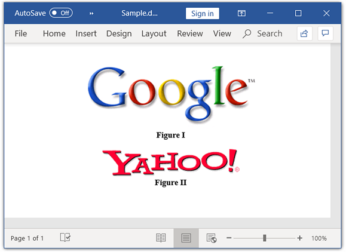
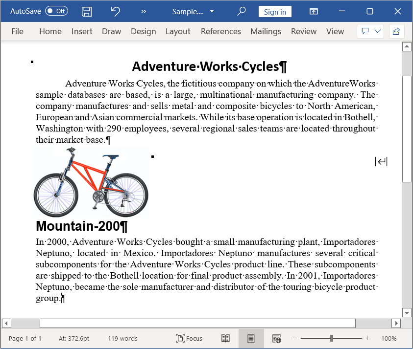

# Working with Paragraph

Paragraph is the basic element in a Word document that contains a textual and graphical contents. Each paragraph has its own formatting such as line spacing, alignment, indentation, and more. Within a paragraph, the contents are represented by one or more child elements such as [WTextRange](https://help.syncfusion.com/cr/file-formats/Syncfusion.DocIO.DLS.WTextRange.html), [WPicture](https://help.syncfusion.com/cr/file-formats/Syncfusion.DocIO.DLS.WPicture.html), and [Hyperlink](https://help.syncfusion.com/cr/file-formats/Syncfusion.DocIO.DLS.Hyperlink.html) and more. The [ParagraphItem](https://help.syncfusion.com/cr/file-formats/Syncfusion.DocIO.DLS.ParagraphItem.html) is the base class for the child elements of paragraph. The following elements can be the child elements of a paragraph:

* Text: Represented by an instance of [WTextRange](https://help.syncfusion.com/cr/file-formats/Syncfusion.DocIO.DLS.WTextRange.html).
* Image: Represented by an instance of [WPicture](https://help.syncfusion.com/cr/file-formats/Syncfusion.DocIO.DLS.WPicture.html). 
* Comments: Represented by an instance of [WComment](https://help.syncfusion.com/cr/file-formats/Syncfusion.DocIO.DLS.WComment.html).
* Hyperlink: Represented by an instance of [Hyperlink](https://help.syncfusion.com/cr/file-formats/Syncfusion.DocIO.DLS.Hyperlink.html). 
* Symbols: Represented by an instance of [WSymbol](https://help.syncfusion.com/cr/file-formats/Syncfusion.DocIO.DLS.WSymbol.html). 
* Breaks: Represented by an instance of [Break](https://help.syncfusion.com/cr/file-formats/Syncfusion.DocIO.DLS.Break.html). 
* OLE Object: Represented by an instance of [WOleObject](https://help.syncfusion.com/cr/file-formats/Syncfusion.DocIO.DLS.WOleObject.html). 
* Shapes:  Represented by an instance of [Shape](https://help.syncfusion.com/cr/file-formats/Syncfusion.DocIO.DLS.Shape.html). 
* TextBox: Represented by an instance of [WTextBox](https://help.syncfusion.com/cr/file-formats/Syncfusion.DocIO.DLS.WTextBox.html). 
* Chart: Represented by an instance of [WChart](https://help.syncfusion.com/cr/file-formats/Syncfusion.DocIO.DLS.WChart.html).
* Fields: Represented by an instance of [WField](https://help.syncfusion.com/cr/file-formats/Syncfusion.DocIO.DLS.WField.html).
* Form Fields: Represented by an instance of [WFormField](https://help.syncfusion.com/cr/file-formats/Syncfusion.DocIO.DLS.WFormField.html).
* Bookmarks: Represented by instances of [BookmarkStart](https://help.syncfusion.com/cr/file-formats/Syncfusion.DocIO.DLS.BookmarkStart.html) and [BookmarkEnd](https://help.syncfusion.com/cr/file-formats/Syncfusion.DocIO.DLS.BookmarkEnd.html). 
* Footnotes and Endnotes: Represented by an instance of [WFootnote](https://help.syncfusion.com/cr/file-formats/Syncfusion.DocIO.DLS.WFootnote.html).

The following code example explains how to add a new paragraph.

  


//Creates a new Word document 
WordDocument document = new WordDocument();
//Adds new section to the document
IWSection section = document.AddSection();
//Adds new paragraph to the section
IWParagraph paragraph = section.AddParagraph();
//Adds new text to the paragraph
paragraph.AppendText("Adding new paragraph to the document");
//Saves the Word document
document.Save("Sample.docx", FormatType.Docx);
//Closes the document
document.Close();



'Creates a new Word document 
Dim document As New WordDocument()
'Adds new section to the document
Dim section As IWSection = document.AddSection()
'Adds new paragraph to the section
Dim paragraph As IWParagraph = section.AddParagraph()
'Adds new text to the paragraph
paragraph.AppendText("Adding new paragraph to the document")
'Saves the Word document
document.Save("Sample.docx", FormatType.Docx)
'Closes the document
document.Close()



//Creates a new Word document 
WordDocument document = new WordDocument();
//Adds new section to the document
IWSection section = document.AddSection();
//Adds new paragraph to the section
IWParagraph paragraph = section.AddParagraph();
//Adds new text to the paragraph
paragraph.AppendText("Adding new paragraph to the document");
//Saves and closes the Word document instance
MemoryStream stream = new MemoryStream();
//Saves the Word file to MemoryStream
await document.SaveAsync(stream, FormatType.Docx);
document.Close();
//Saves the stream as Word file in local machine
Save(stream, "Result.docx");
//Refer to the following link to save Word document in UWP platform
//https://help.syncfusion.com/file-formats/docio/create-word-document-in-uwp#save-word-document-in-uwp
 


//Creates a new Word document 
WordDocument document = new WordDocument();
//Adds new section to the document
IWSection section = document.AddSection();
//Adds new paragraph to the section
IWParagraph paragraph = section.AddParagraph();
//Adds new text to the paragraph
paragraph.AppendText("Adding new paragraph to the document");
//Saves and closes the Word document instance
MemoryStream stream = new MemoryStream();
//Saves the Word document to  MemoryStream
document.Save(stream, FormatType.Docx);
document.Close();
stream.Position = 0;
//Download Word document in the browser
return File(stream, "application/msword", "Result.docx");
 


//Creates a new Word document 
WordDocument document = new WordDocument();
//Adds new section to the document
IWSection section = document.AddSection();
//Adds new paragraph to the section
IWParagraph paragraph = section.AddParagraph();
//Adds new text to the paragraph
paragraph.AppendText("Adding new paragraph to the document");
//Saves and closes the Word document instance
MemoryStream stream = new MemoryStream();
//Saves the Word file to MemoryStream
document.Save(stream, FormatType.Docx);
document.Close();
//Save the stream as a file in the device and invoke it for viewing
Xamarin.Forms.DependencyService.Get<ISave>().SaveAndView("Result.docx", "application/msword", stream);
//Download the helper files from the following link to save the stream as file and open the file for viewing in Xamarin platform
//https://help.syncfusion.com/file-formats/docio/create-word-document-in-xamarin#helper-files-for-xamarin
 



You can download a complete working sample from [GitHub](https://github.com/SyncfusionExamples/DocIO-Examples/tree/main/Paragraphs/Add-paragraph).

The following code example illustrates how to modify an existing paragraph.




//Loads the template document
WordDocument document = new WordDocument("Template.docx");
//Gets the text body of first section
WTextBody textBody = document.Sections[0].Body;
//Gets the paragraph at index 1
WParagraph paragraph = textBody.Paragraphs[1];
//Iterates through the child elements of paragraph
foreach (ParagraphItem item in paragraph.ChildEntities)
{
    if (item is WTextRange)
    {
        WTextRange text = item as WTextRange;
        //Modifies the character format of the text
        text.CharacterFormat.Bold = true;
        break;
    }
}
//Saves the Word document
document.Save("Sample.docx", FormatType.Docx);
//Closes the document
document.Close();



'Loads the template document
Dim document As New WordDocument("Template.docx")
'Gets the text body of first section
Dim textBody As WTextBody = document.Sections(0).Body
'Gets the paragraph at index 1
Dim paragraph As WParagraph = textBody.Paragraphs(1)
'Iterates through the child elements of paragraph
For Each item As ParagraphItem In paragraph.ChildEntities
    If TypeOf item Is WTextRange Then
        Dim text As WTextRange = TryCast(item, WTextRange)
        'Modifies the character format of the text
        text.CharacterFormat.Bold = True
        Exit For
    End If
Next
'Saves the Word document
document.Save("Sample.docx", FormatType.Docx)
'Closes the document
document.Close()



Assembly assembly = typeof(App).GetTypeInfo().Assembly;
Stream fileStream = assembly.GetManifestResourceStream("CreateWordSample.Assets.Template.docx");
//Loads the template document
WordDocument document = new WordDocument(fileStream);
//Gets the text body of first section
WTextBody textBody = document.Sections[0].Body;
//Gets the paragraph at index 1
WParagraph paragraph = textBody.Paragraphs[1];
//Iterates through the child elements of paragraph
foreach (ParagraphItem item in paragraph.ChildEntities)
{
    if (item is WTextRange)
    {
        WTextRange text = item as WTextRange;
        //Modifies the character format of the text
        text.CharacterFormat.Bold = true;
        break;
    }
}
//Saves and closes the Word document instance
MemoryStream stream = new MemoryStream();
//Saves the Word file to MemoryStream
await document.SaveAsync(stream, FormatType.Docx);
document.Close();
//Saves the stream as Word file in local machine
Save(stream, "Result.docx");
//Please refer the below link to save Word document in UWP platform
//https://help.syncfusion.com/file-formats/docio/create-word-document-in-uwp#save-word-document-in-uwp
 


FileStream fileStream = new FileStream(@"Test.docx", FileMode.Open, FileAccess.ReadWrite);
//Loads the template document
WordDocument document = new WordDocument(fileStream, FormatType.Automatic);
//Gets the text body of first section
WTextBody textBody = document.Sections[0].Body;
//Gets the paragraph at index 1
WParagraph paragraph = textBody.Paragraphs[1];
//Iterates through the child elements of paragraph
foreach (ParagraphItem item in paragraph.ChildEntities)
{
    if (item is WTextRange)
    {
        WTextRange text = item as WTextRange;
        //Modifies the character format of the text
        text.CharacterFormat.Bold = true;
        break;
    }
}
//Saves and closes the Word document instance
MemoryStream stream = new MemoryStream();
//Saves the Word document to  MemoryStream
document.Save(stream, FormatType.Docx);
document.Close();
stream.Position = 0;
//Download Word document in the browser
return File(stream, "application/msword", "Result.docx");
 


Assembly assembly = typeof(App).GetTypeInfo().Assembly;
Stream fileStream = assembly.GetManifestResourceStream("CreateWordSample.Assets.Template.docx");
//Loads the template document
WordDocument document = new WordDocument(fileStream, FormatType.Automatic);
//Gets the text body of first section
WTextBody textBody = document.Sections[0].Body;
//Gets the paragraph at index 1
WParagraph paragraph = textBody.Paragraphs[1];
//Iterates through the child elements of paragraph
foreach (ParagraphItem item in paragraph.ChildEntities)
{
    if (item is WTextRange)
    {
        WTextRange text = item as WTextRange;
        //Modifies the character format of the text
        text.CharacterFormat.Bold = true;
        break;
    }
}
//Saves and closes the Word document instance
MemoryStream stream = new MemoryStream();
//Saves the Word file to MemoryStream
document.Save(stream, FormatType.Docx);
document.Close();
//Save the stream as a file in the device and invoke it for viewing
Xamarin.Forms.DependencyService.Get<ISave>().SaveAndView("Result.docx", "application/msword", stream);
//Download the helper files from the following link to save the stream as file and open the file for viewing in Xamarin platform
//https://help.syncfusion.com/file-formats/docio/create-word-document-in-xamarin#helper-files-for-xamarin




You can download a complete working sample from [GitHub](https://github.com/SyncfusionExamples/DocIO-Examples/tree/main/Paragraphs/Modify-an-existing-paragraph).

## Applying paragraph formatting

As in the Microsoft Word, DocIO provides support for all the paragraph formatting options such as line spacing, indentation, spacing before and after, keep follow, and more. The following code example explains how to apply formatting to a paragraph.

N> The [FirstLineIndent](https://help.syncfusion.com/cr/file-formats/Syncfusion.DocIO.DLS.WParagraphFormat.html#Syncfusion_DocIO_DLS_WParagraphFormat_FirstLineIndent) can be used to update or retrieve both hanging and first line indents. Negative value for this property denotes the hanging indent and positive value denotes the first line indent of the paragraph.




//Load an existing Word document.
using (WordDocument document = new WordDocument("Input.docx", FormatType.Docx))
{
    //Access the section in a Word document.
    IWSection section = document.Sections[0];
    //Access the paragraph in a Word document.
    IWParagraph paragraph = section.Paragraphs[4];
    //Apply paragraph formatting.
    paragraph.ParagraphFormat.AfterSpacing = 18f;
    paragraph.ParagraphFormat.BeforeSpacing = 18f;
    paragraph.ParagraphFormat.BackColor = Color.LightGray;
    paragraph.ParagraphFormat.FirstLineIndent = 10f;
    paragraph.ParagraphFormat.LineSpacing = 10f;
    paragraph.ParagraphFormat.HorizontalAlignment = HorizontalAlignment.Right;
    //Access the paragraph in a Word document.
    paragraph = section.Paragraphs[7];
    //Apply keep lines together property to the paragraph.
    paragraph.ParagraphFormat.Keep = true;
    //Access the paragraph in a Word document.
    paragraph = section.Paragraphs[6];
    //Apply keep with next property to the paragraph.
    paragraph.ParagraphFormat.KeepFollow = true;
    //Save a Word document.
    document.Save("Sample.docx", FormatType.Docx);
}



'Load an existing Word document.
Using document As WordDocument = New WordDocument("Input.docx", FormatType.Docx)
    'Access the section in a Word document.
    Dim section As IWSection = document.Sections(0)
    'Access the paragraph in a Word document.
    Dim paragraph As IWParagraph = section.Paragraphs(4)
    'Apply paragraph formatting.
    paragraph.ParagraphFormat.AfterSpacing = 18F
    paragraph.ParagraphFormat.BeforeSpacing = 18F
    paragraph.ParagraphFormat.BackColor = Color.LightGray
    paragraph.ParagraphFormat.FirstLineIndent = 10F
    paragraph.ParagraphFormat.LineSpacing = 10F
    paragraph.ParagraphFormat.HorizontalAlignment = HorizontalAlignment.Right
    'Access the paragraph in a Word document.
    paragraph = section.Paragraphs(7)
    'Apply keep lines together property to the paragraph.
    paragraph.ParagraphFormat.Keep = True
    'Access the paragraph in a Word document.
    paragraph = section.Paragraphs(6)
    'Apply keep with next property to the paragraph.
    paragraph.ParagraphFormat.KeepFollow = True
    'Save a Word document.
    document.Save("Sample.docx", FormatType.Docx)
End Using



//Open the file as Stream.
using (Stream docStream = typeof(App).GetTypeInfo().Assembly.GetManifestResourceStream("Sample.Assets.Input.docx"))
{
    //Load the file stream into a Word document.
    using (WordDocument document = new WordDocument(docStream, FormatType.Docx))
    {
        //Access the section in a Word document.
        IWSection section = document.Sections[0];
        //Access the paragraph in a Word document.
        IWParagraph paragraph = section.Paragraphs[4];
        //Apply paragraph formatting.
        paragraph.ParagraphFormat.AfterSpacing = 18f;
        paragraph.ParagraphFormat.BeforeSpacing = 18f;
        paragraph.ParagraphFormat.BackColor = Color.LightGray;
        paragraph.ParagraphFormat.FirstLineIndent = 10f;
        paragraph.ParagraphFormat.LineSpacing = 10f;
        paragraph.ParagraphFormat.HorizontalAlignment = HorizontalAlignment.Right;
        //Access the paragraph in a Word document.
        paragraph = section.Paragraphs[7];
        //Apply keep lines together property to the paragraph.
        paragraph.ParagraphFormat.Keep = true;
        //Access the paragraph in a Word document.
        paragraph = section.Paragraphs[6];
        //Apply keep with next property to the paragraph.
        paragraph.ParagraphFormat.KeepFollow = true;
        //Save a Word document to the MemoryStream.
        MemoryStream stream = new MemoryStream();
        await document.SaveAsync(stream, FormatType.Docx);
        //Save the stream as a Word document file on the local machine.
        Save(stream, "Sample.docx"); 
    }
}
//Refer to the following link to save Word document in UWP platform
//https://help.syncfusion.com/file-formats/docio/create-word-document-in-uwp#save-word-document-in-uwp
 


//Open the file as Stream.
using (FileStream docStream = new FileStream("Input.docx", FileMode.Open, FileAccess.Read))
{
    //Load the file stream into a Word document.
    using (WordDocument document = new WordDocument(docStream, FormatType.Docx))
    {
        //Access the section in a Word document.
        IWSection section = document.Sections[0];
        //Access the paragraph in a Word document.
        IWParagraph paragraph = section.Paragraphs[4];
        //Apply paragraph formatting.
        paragraph.ParagraphFormat.AfterSpacing = 18f;
        paragraph.ParagraphFormat.BeforeSpacing = 18f;
        paragraph.ParagraphFormat.BackColor = Color.LightGray;
        paragraph.ParagraphFormat.FirstLineIndent = 10f;
        paragraph.ParagraphFormat.LineSpacing = 10f;
        paragraph.ParagraphFormat.HorizontalAlignment = HorizontalAlignment.Right;
        //Access the paragraph in a Word document.
        paragraph = section.Paragraphs[7];
        //Apply keep lines together property to the paragraph.
        paragraph.ParagraphFormat.Keep = true;
        //Access the paragraph in a Word document.
        paragraph = section.Paragraphs[6];
        //Apply keep with next property to the paragraph.
        paragraph.ParagraphFormat.KeepFollow = true;
        //Save a  Word document to the MemoryStream.
        MemoryStream outputStream = new MemoryStream();
        document.Save(outputStream, FormatType.Docx);
        outputStream.Position = 0;
        //Download as a Word document in the browser.
        return File(outputStream, "application/msword", "Sample.docx");
    }
}
 


//Open the file as Stream.
using (Stream docStream = typeof(App).GetTypeInfo().Assembly.GetManifestResourceStream("Sample.Assets.Input.docx"))
{
    //Load the file stream into a Word document.
    using (WordDocument document = new WordDocument(docStream, FormatType.Docx))
    {
        //Access the section in a Word document.
        IWSection section = document.Sections[0];
        //Access the paragraph in a Word document.
        IWParagraph paragraph = section.Paragraphs[4];
        //Apply paragraph formatting.
        paragraph.ParagraphFormat.AfterSpacing = 18f;
        paragraph.ParagraphFormat.BeforeSpacing = 18f;
        paragraph.ParagraphFormat.BackColor = Color.LightGray;
        paragraph.ParagraphFormat.FirstLineIndent = 10f;
        paragraph.ParagraphFormat.LineSpacing = 10f;
        paragraph.ParagraphFormat.HorizontalAlignment = HorizontalAlignment.Right;
        //Access the paragraph in a Word document.
        paragraph = section.Paragraphs[7];
        //Apply keep lines together property to the paragraph.
        paragraph.ParagraphFormat.Keep = true;
        //Access the paragraph in a Word document.
        paragraph = section.Paragraphs[6];
        //Apply keep with next property to the paragraph.
        paragraph.ParagraphFormat.KeepFollow = true;
        //Save a Word document to the MemoryStream.
        MemoryStream outputStream = new MemoryStream();
        document.Save(outputStream, FormatType.Docx);
        //Save the stream as a file in the device and invoke it for viewing. 
        Xamarin.Forms.DependencyService.Get<ISave>().SaveAndView("Sample.docx", "application/msword", outputStream);
    }
}
//Download the helper files from the following link to save the stream as file and open the file for viewing in Xamarin platform
//https://help.syncfusion.com/file-formats/docio/create-word-document-in-xamarin#helper-files-for-xamarin
 



You can download a complete working sample from [GitHub](https://github.com/SyncfusionExamples/DocIO-Examples/tree/main/Paragraphs/Apply-paragraph-formatting).

### Paragraph style  

Paragraph style contains definition for both font (text) and paragraph formatting that can be applied to the contents of an entire paragraph. DocIO supports various pre-defined styles and also provides ability to create custom paragraph styles.

T> You can define a custom style or modify any built-in style to the required formatting, and apply this style to the part of Word document to be formatted. You can reduce the file size and code length by using styles instead of formatting each element explicitly.

The following code example explains how to use the predefined styles.




//Creates a new Word document
WordDocument document = new WordDocument();
//Adds new section to the document
IWSection section = document.AddSection();
//Adds new paragraph to the section
IWParagraph firstParagraph = section.AddParagraph();
//Adds new text to the paragraph
IWTextRange firstText = firstParagraph.AppendText("Built-in styles can be applied to the paragraph. Heading1 style is applied to this paragraph.");
//Applies built-in style for the paragraph
firstParagraph.ApplyStyle(BuiltinStyle.Heading1);
//Saves the Word document
document.Save("Sample.docx", FormatType.Docx);
//Closes the document
document.Close();



'Creates a new Word document 
Dim document As New WordDocument()
'Adds new section to the document
Dim section As IWSection = document.AddSection()
'Adds new paragraph to the section
Dim firstParagraph As IWParagraph = section.AddParagraph()
'Adds new text to the paragraph
Dim firstText As IWTextRange = firstParagraph.AppendText("Built-in styles can be applied to the paragraph. Heading1 style is applied to this paragraph.")
'Applies built-in style for the paragraph
firstParagraph.ApplyStyle(BuiltinStyle.Heading1)
'Saves the Word document
document.Save("Sample.docx", FormatType.Docx)
'Closes the document
document.Close()



//Creates a new Word document
WordDocument document = new WordDocument();
//Adds new section to the document
IWSection section = document.AddSection();
//Adds new paragraph to the section
IWParagraph firstParagraph = section.AddParagraph();
//Adds new text to the paragraph
IWTextRange firstText = firstParagraph.AppendText("Built-in styles can be applied to the paragraph. Heading1 style is applied to this paragraph.");
//Applies built-in style for the paragraph
firstParagraph.ApplyStyle(BuiltinStyle.Heading1);
//Saves and closes the Word document instance
MemoryStream stream = new MemoryStream();
//Saves the Word file to MemoryStream
await document.SaveAsync(stream, FormatType.Docx);
document.Close();
//Saves the stream as Word file in local machine
Save(stream, "Result.docx");
//Refer to the following link to save Word document in UWP platform
//https://help.syncfusion.com/file-formats/docio/create-word-document-in-uwp#save-word-document-in-uwp
 


//Creates a new Word document 
WordDocument document = new WordDocument();
//Adds new section to the document
IWSection section = document.AddSection();
//Adds new paragraph to the section
IWParagraph firstParagraph = section.AddParagraph();
//Adds new text to the paragraph
IWTextRange firstText = firstParagraph.AppendText("Built-in styles can be applied to the paragraph. Heading1 style is applied to this paragraph.");
//Applies built-in style for the paragraph
firstParagraph.ApplyStyle(BuiltinStyle.Heading1);
//Saves and closes the Word document instance
MemoryStream stream = new MemoryStream();
//Saves the Word document to  MemoryStream
document.Save(stream, FormatType.Docx);
document.Close();
stream.Position = 0;
//Download Word document in the browser
return File(stream, "application/msword", "Result.docx");
 


//Creates a new Word document 
WordDocument document = new WordDocument();
//Adds new section to the document
IWSection section = document.AddSection();
//Adds new paragraph to the section
IWParagraph firstParagraph = section.AddParagraph();
//Adds new text to the paragraph
IWTextRange firstText = firstParagraph.AppendText("Built-in styles can be applied to the paragraph. Heading1 style is applied to this paragraph.");
//Applies built-in style for the paragraph
firstParagraph.ApplyStyle(BuiltinStyle.Heading1);
//Saves and closes the Word document instance
MemoryStream stream = new MemoryStream();
//Saves the Word file to MemoryStream
document.Save(stream, FormatType.Docx);
document.Close();
//Save the stream as a file in the device and invoke it for viewing
Xamarin.Forms.DependencyService.Get<ISave>().SaveAndView("Result.docx", "application/msword", stream);
//Download the helper files from the following link to save the stream as file and open the file for viewing in Xamarin platform
//https://help.syncfusion.com/file-formats/docio/create-word-document-in-xamarin#helper-files-for-xamarin
 



You can download a complete working sample from [GitHub](https://github.com/SyncfusionExamples/DocIO-Examples/tree/main/Paragraphs/Apply-paragraph-style).

### Custom paragraph style  

The following code example explains how to create a custom paragraph style and apply it to a paragraph.




//Creates a new Word document 
WordDocument document = new WordDocument();
//Adds new section to the document
IWSection section = document.AddSection();
//Creates user defined style
IWParagraphStyle style = document.AddParagraphStyle("User_defined_style");
style.ParagraphFormat.BackColor = Color.LightGray;
style.ParagraphFormat.AfterSpacing = 18f;
style.ParagraphFormat.BeforeSpacing = 18f;
style.ParagraphFormat.Borders.BorderType = Syncfusion.DocIO.DLS.BorderStyle.DotDash;
style.ParagraphFormat.Borders.LineWidth = 0.5f;
style.ParagraphFormat.LineSpacing = 15f;
style.CharacterFormat.FontName = "Calibri";
style.CharacterFormat.Italic = true;
//Adds new paragraph to the section
IWParagraph paragraph = section.AddParagraph();
IWTextRange text = paragraph.AppendText("A new paragraph style is created and is applied to this paragraph.");
//Applies the new style to paragraph
paragraph.ApplyStyle("User_defined_style");
//Saves the Word document
document.Save("Sample.docx", FormatType.Docx);
//Closes the document
document.Close();



'Creates a new Word document 
Dim document As New WordDocument()
'Adds new section to the document
Dim section As IWSection = document.AddSection()
'Creates user defined style
Dim style As IWParagraphStyle = document.AddParagraphStyle("User_defined_style")
style.ParagraphFormat.BackColor = Color.LightGray
style.ParagraphFormat.AfterSpacing = 18.0F
style.ParagraphFormat.BeforeSpacing = 18.0F
style.ParagraphFormat.Borders.BorderType = Syncfusion.DocIO.DLS.BorderStyle.DotDash
style.ParagraphFormat.Borders.LineWidth = 0.5F
style.ParagraphFormat.LineSpacing = 15.0F
style.CharacterFormat.FontName = "Calibri"
style.CharacterFormat.Italic = True
'Adds new paragraph to the section
Dim paragraph As IWParagraph = section.AddParagraph()
Dim text As IWTextRange = paragraph.AppendText("A new paragraph style is created and is applied to this paragraph.")
'Applies the new style to paragraph
paragraph.ApplyStyle("User_defined_style")
'Saves the Word document
document.Save("Sample.docx", FormatType.Docx)
'Closes the document
document.Close()
 


//Creates a new Word document 
WordDocument document = new WordDocument();
//Adds new section to the document
IWSection section = document.AddSection();
//Creates user defined style
IWParagraphStyle style = document.AddParagraphStyle("User_defined_style");
style.ParagraphFormat.BackColor = Color.LightGray;
style.ParagraphFormat.AfterSpacing = 18f;
style.ParagraphFormat.BeforeSpacing = 18f;
style.ParagraphFormat.Borders.BorderType = Syncfusion.DocIO.DLS.BorderStyle.DotDash;
style.ParagraphFormat.Borders.LineWidth = 0.5f;
style.ParagraphFormat.LineSpacing = 15f;
style.CharacterFormat.FontName = "Calibri";
style.CharacterFormat.Italic = true;
//Adds new paragraph to the section
IWParagraph paragraph = section.AddParagraph();
IWTextRange text = paragraph.AppendText("A new paragraph style is created and is applied to this paragraph.");
//Applies the new style to paragraph
paragraph.ApplyStyle("User_defined_style");
//Saves and closes the Word document instance
MemoryStream stream = new MemoryStream();
//Saves the Word file to MemoryStream
await document.SaveAsync(stream, FormatType.Docx);
document.Close();
//Saves the stream as Word file in local machine
Save(stream, "Result.docx");
//Refer to the following link to save Word document in UWP platform
//https://help.syncfusion.com/file-formats/docio/create-word-document-in-uwp#save-word-document-in-uwp
 


//Creates a new Word document 
WordDocument document = new WordDocument();
//Adds new section to the document
IWSection section = document.AddSection();
//Creates user defined style
IWParagraphStyle style = document.AddParagraphStyle("User_defined_style");
style.ParagraphFormat.BackColor = Color.LightGray;
style.ParagraphFormat.AfterSpacing = 18f;
style.ParagraphFormat.BeforeSpacing = 18f;
style.ParagraphFormat.Borders.BorderType = Syncfusion.DocIO.DLS.BorderStyle.DotDash;
style.ParagraphFormat.Borders.LineWidth = 0.5f;
style.ParagraphFormat.LineSpacing = 15f;
style.CharacterFormat.FontName = "Calibri";
style.CharacterFormat.Italic = true;
//Adds new paragraph to the section
IWParagraph paragraph = section.AddParagraph();
IWTextRange text = paragraph.AppendText("A new paragraph style is created and is applied to this paragraph.");
//Applies the new style to paragraph
paragraph.ApplyStyle("User_defined_style");
//Saves and closes the Word document instance
MemoryStream stream = new MemoryStream();
//Saves the Word document to  MemoryStream
document.Save(stream, FormatType.Docx);
document.Close();
stream.Position = 0;
//Download Word document in the browser
return File(stream, "application/msword", "Result.docx");
 


//Creates a new Word document 
WordDocument document = new WordDocument();
//Adds new section to the document
IWSection section = document.AddSection();
//Creates user defined style
IWParagraphStyle style = document.AddParagraphStyle("User_defined_style");
style.ParagraphFormat.BackColor = Syncfusion.Drawing.Color.LightGray;
style.ParagraphFormat.AfterSpacing = 18f;
style.ParagraphFormat.BeforeSpacing = 18f;
style.ParagraphFormat.Borders.BorderType = Syncfusion.DocIO.DLS.BorderStyle.DotDash;
style.ParagraphFormat.Borders.LineWidth = 0.5f;
style.ParagraphFormat.LineSpacing = 15f;
style.CharacterFormat.FontName = "Calibri";
style.CharacterFormat.Italic = true;
//Adds new paragraph to the section
IWParagraph paragraph = section.AddParagraph();
IWTextRange text = paragraph.AppendText("A new paragraph style is created and is applied to this paragraph.");
//Applies the new style to paragraph
paragraph.ApplyStyle("User_defined_style");
//Saves and closes the Word document instance
MemoryStream stream = new MemoryStream();
//Saves the Word file to MemoryStream
document.Save(stream, FormatType.Docx);
document.Close();
//Save the stream as a file in the device and invoke it for viewing
Xamarin.Forms.DependencyService.Get<ISave>().SaveAndView("Result.docx", "application/msword", stream);
//Download the helper files from the following link to save the stream as file and open the file for viewing in Xamarin platform
//https://help.syncfusion.com/file-formats/docio/create-word-document-in-xamarin#helper-files-for-xamarin
 



You can download a complete working sample from [GitHub](https://github.com/SyncfusionExamples/DocIO-Examples/tree/main/Paragraphs/Create-custom-paragraph-style).

### Tab stop

A tab stop is a horizontal position that is set for aligning text of the paragraph.  A tab character causes the carriage to go to the next tab stop.

Each paragraph has its own tab stop collection where the new tab stop can be added and existing tab stop can be removed.

The following code example explains how to add tab stops to the paragraph.




//Creates a new Word document 
WordDocument document = new WordDocument();
//Adds new section to the document
IWSection section = document.AddSection();
//Adds new paragraph to the section
IWParagraph paragraph = section.AddParagraph();
//Adds tab stop at position 11
Tab firstTab = paragraph.ParagraphFormat.Tabs.AddTab(11, TabJustification.Left, TabLeader.Dotted);            
//Adds tab stop at position 62
paragraph.ParagraphFormat.Tabs.AddTab(62, TabJustification.Left, TabLeader.Single);
paragraph.AppendText("This sample\t illustrates the use of tabs in the paragraph. Tabs\t can be inserted or removed from the paragraph.");
//Removes tab stop from the collection
paragraph.ParagraphFormat.Tabs.RemoveByTabPosition(11);
//Saves the Word document
document.Save("Sample.docx", FormatType.Docx);
//Closes the document
document.Close();



'Creates a new Word document 
Dim document As New WordDocument()
'Adds new section to the document
Dim section As IWSection = document.AddSection()
'Adds new paragraph to the section
Dim paragraph As IWParagraph = section.AddParagraph()
'Adds tab stop at position 11
Dim firstTab As Tab = paragraph.ParagraphFormat.Tabs.AddTab(11, TabJustification.Left, TabLeader.Dotted)
'Adds tab stop at position 62
paragraph.ParagraphFormat.Tabs.AddTab(62, TabJustification.Left, TabLeader.[Single])
paragraph.AppendText("This sample" & vbTab & " illustrates the use of tabs in the paragraph. Tabs" & vbTab & " can be inserted or removed from the paragraph.")
'Removes tab stop from the collection
paragraph.ParagraphFormat.Tabs.RemoveByTabPosition(11)
'Saves the Word document
document.Save("Sample.docx", FormatType.Docx)
'Closes the document
document.Close()
  


//Creates a new Word document 
WordDocument document = new WordDocument();
//Adds new section to the document
IWSection section = document.AddSection();
//Adds new paragraph to the section
IWParagraph paragraph = section.AddParagraph();
//Adds tab stop at position 11
Tab firstTab = paragraph.ParagraphFormat.Tabs.AddTab(11, TabJustification.Left, TabLeader.Dotted);
//Adds tab stop at position 62
paragraph.ParagraphFormat.Tabs.AddTab(62, TabJustification.Left, TabLeader.Single);
paragraph.AppendText("This sample\t illustrates the use of tabs in the paragraph. Tabs\t can be inserted or removed from the paragraph.");
//Removes tab stop from the collection
paragraph.ParagraphFormat.Tabs.RemoveByTabPosition(11);
//Saves and closes the Word document instance
MemoryStream stream = new MemoryStream();
//Saves the Word file to MemoryStream
await document.SaveAsync(stream, FormatType.Docx);
document.Close();
//Saves the stream as Word file in local machine
Save(stream, "Result.docx");
//Refer to the following link to save Word document in UWP platform
//https://help.syncfusion.com/file-formats/docio/create-word-document-in-uwp#save-word-document-in-uwp
 


//Creates a new Word document 
WordDocument document = new WordDocument();
//Adds new section to the document
IWSection section = document.AddSection();
//Adds new paragraph to the section
IWParagraph paragraph = section.AddParagraph();
//Adds tab stop at position 11
Tab firstTab = paragraph.ParagraphFormat.Tabs.AddTab(11, TabJustification.Left, TabLeader.Dotted);
//Adds tab stop at position 62
paragraph.ParagraphFormat.Tabs.AddTab(62, TabJustification.Left, TabLeader.Single);
paragraph.AppendText("This sample\t illustrates the use of tabs in the paragraph. Tabs\t can be inserted or removed from the paragraph.");
//Removes tab stop from the collection
paragraph.ParagraphFormat.Tabs.RemoveByTabPosition(11);
//Saves and closes the Word document instance
MemoryStream stream = new MemoryStream();
//Saves the Word document to  MemoryStream
document.Save(stream, FormatType.Docx);
document.Close();
stream.Position = 0;
//Download Word document in the browser
return File(stream, "application/msword", "Result.docx");
 


//Creates a new Word document 
WordDocument document = new WordDocument();
//Adds new section to the document
IWSection section = document.AddSection();
//Adds new paragraph to the section
IWParagraph paragraph = section.AddParagraph();
//Adds tab stop at position 11
Tab firstTab = paragraph.ParagraphFormat.Tabs.AddTab(11, TabJustification.Left, TabLeader.Dotted);
//Adds tab stop at position 62
paragraph.ParagraphFormat.Tabs.AddTab(62, TabJustification.Left, TabLeader.Single);
paragraph.AppendText("This sample\t illustrates the use of tabs in the paragraph. Tabs\t can be inserted or removed from the paragraph.");
//Removes tab stop from the collection
paragraph.ParagraphFormat.Tabs.RemoveByTabPosition(11);
//Saves and closes the Word document instance
MemoryStream stream = new MemoryStream();
//Saves the Word file to MemoryStream
document.Save(stream, FormatType.Docx);
document.Close();
//Save the stream as a file in the device and invoke it for viewing
Xamarin.Forms.DependencyService.Get<ISave>().SaveAndView("Result.docx", "application/msword", stream);
//Download the helper files from the following link to save the stream as file and open the file for viewing in Xamarin platform
//https://help.syncfusion.com/file-formats/docio/create-word-document-in-xamarin#helper-files-for-xamarin
 



You can download a complete working sample from [GitHub](https://github.com/SyncfusionExamples/DocIO-Examples/tree/main/Paragraphs/Add-tab-stop).

### RTL paragraph

You can set RTL (Right-to-left) direction to the paragraph in a Word document. The following code example shows how to set RTL (Right-to-left) for a paragraph in Word document.




//Loads the template document
WordDocument document = new WordDocument("Template.docx");
//Gets the text body of first section
WTextBody textBody = document.Sections[0].Body;
//Gets the paragraph at index 1
WParagraph paragraph = textBody.Paragraphs[1];
//Gets a value indicating whether the paragraph is right-to-left. True indicates the paragraph direction is RTL
bool isRTL = paragraph.ParagraphFormat.Bidi;
//Sets RTL direction for a paragraph
if(!isRTL)
    paragraph.ParagraphFormat.Bidi = true;
//Saves the Word document
document.Save("Sample.docx", FormatType.Docx);
//Closes the document
document.Close();



'Loads the template document
Dim document As WordDocument = New WordDocument("Template.docx")
'Gets the text body of first section
Dim textBody As WTextBody = document.Sections(0).Body
'Gets the paragraph at index 1
Dim paragraph As WParagraph = textBody.Paragraphs(1)
'Gets a value indicating whether the paragraph is right-to-left. True indicates the paragraph direction is RTL
Dim isRTL As Boolean = paragraph.ParagraphFormat.Bidi
'Sets RTL direction for a paragraph
If Not isRTL Then
    paragraph.ParagraphFormat.Bidi = True
End If
'Saves the Word document
document.Save("Sample.docx", FormatType.Docx)
'Closes the document
document.Close()



//"App" is the class of Portable project
Assembly assembly = typeof(App).GetTypeInfo().Assembly;
//Loads the template document
WordDocument document = new WordDocument(assembly.GetManifestResourceStream("Sample.Assets.Template.docx"), FormatType.Docx);
//Gets the text body of first section
WTextBody textBody = document.Sections[0].Body;
//Gets the paragraph at index 1
WParagraph paragraph = textBody.Paragraphs[1];
//Gets a value indicating whether the paragraph is right-to-left. True indicates the paragraph direction is RTL
bool isRTL = paragraph.ParagraphFormat.Bidi;
//Sets RTL direction for a paragraph
if(!isRTL)
    paragraph.ParagraphFormat.Bidi = true;
//Saves and closes the Word document instance
MemoryStream stream = new MemoryStream();
//Saves the Word file to MemoryStream
document.Save(stream, FormatType.Docx);
document.Close();
//Saves the stream as Word file in local machine
Save(stream, "Sample.docx");
//Refer to the following link to save Word document in UWP platform
//https://help.syncfusion.com/file-formats/docio/create-word-document-in-uwp#save-word-document-in-uwp
 


FileStream fileStreamPath = new FileStream("Template.docx", FileMode.Open, FileAccess.Read, FileShare.ReadWrite);
//Loads or opens an existing Word document through Open method of WordDocument class
WordDocument document = new WordDocument(fileStreamPath, FormatType.Docx);
//Gets the text body of first section
WTextBody textBody = document.Sections[0].Body;
//Gets the paragraph at index 1
WParagraph paragraph = textBody.Paragraphs[1];
//Gets a value indicating whether the paragraph is right-to-left. True indicates the paragraph direction is RTL
bool isRTL = paragraph.ParagraphFormat.Bidi;
//Sets RTL direction for a paragraph
if(!isRTL)
    paragraph.ParagraphFormat.Bidi = true;
//Saves and closes the Word document instance
MemoryStream stream = new MemoryStream();
//Saves the Word document to MemoryStream
document.Save(stream, FormatType.Docx);
document.Close();
stream.Position = 0;
//Download Word document in the browser
return File(stream, "application/msword", "Sample.docx");
 


//"App" is the class of Portable project
Assembly assembly = typeof(App).GetTypeInfo().Assembly;
//Loads or opens an existing Word document through Open method of WordDocument class
WordDocument document = new WordDocument(assembly.GetManifestResourceStream("Sample.Assets.Template.docx"), FormatType.Docx);
//Gets the text body of first section
WTextBody textBody = document.Sections[0].Body;
//Gets the paragraph at index 1
WParagraph paragraph = textBody.Paragraphs[1];
//Gets a value indicating whether the paragraph is right-to-left. True indicates the paragraph direction is RTL
bool isRTL = paragraph.ParagraphFormat.Bidi;
//Sets RTL direction for a paragraph
if(!isRTL)
    paragraph.ParagraphFormat.Bidi = true;
//Saves and closes the Word document instance
MemoryStream stream = new MemoryStream();
//Saves the Word file to MemoryStream
document.Save(stream, FormatType.Docx);
document.Close();
//Save the stream as a file in the device and invoke it for viewing
Xamarin.Forms.DependencyService.Get<ISave>().SaveAndView("Sample.docx", "application/msword", stream);
//Download the helper files from the following link to save the stream as file and open the file for viewing in Xamarin platform
//https://help.syncfusion.com/file-formats/docio/create-word-document-in-xamarin#helper-files-for-xamarin




You can download a complete working sample from [GitHub](https://github.com/SyncfusionExamples/DocIO-Examples/tree/main/Paragraphs/RTL-paragraph).

## Working with Styles

A style is a predefined set of table, numbering, paragraph, and character properties that can be applied to regions within a document. DocIO provides the following functionalities related with styles.

* Access and modify the existing styles in the word document
* Create new paragraph style. 
* Apply built-in styles.

### Access Styles

Paragraph and character styles present in the existing document are accessible through the [Styles](https://help.syncfusion.com/cr/file-formats/Syncfusion.DocIO.DLS.WordDocument.html#Syncfusion_DocIO_DLS_WordDocument_Styles) property of [WordDocument](https://help.syncfusion.com/cr/file-formats/Syncfusion.DocIO.DLS.WordDocument.html) class. 

This following code example demonstrates how a style can be accessed and style properties like text color and first line indent can be updated.




//Opens an input Word template
WordDocument document = new WordDocument(inputFileName);
//Accesses the styles collection that contains paragraph and character styles in Word document
IStyleCollection styleCollection = document.Styles;
//Finds the style with the name "Heading 1"
WParagraphStyle heading1ParagraphStyle = styleCollection.FindByName("Heading 1") as WParagraphStyle;
//Changes the text color of style "Heading 1" as DarkBlue
heading1ParagraphStyle.CharacterFormat.TextColor = Color.DarkBlue;
//Changes the first line indent of Paragraph as 36 points
heading1ParagraphStyle.ParagraphFormat.FirstLineIndent = 36;
//Saves and closes the document instance
document.Save(outputFileName, FormatType.Docx);
document.Close();



'Opens an input Word template
Dim document As New WordDocument(inputFileName)
'Accesses the styles collection that contains paragraph and character styles in Word document
Dim styleCollection As IStyleCollection = document.Styles
'Finds the style with the name "Heading 1"
Dim heading1ParagraphStyle As WParagraphStyle = TryCast(styleCollection.FindByName("Heading 1"), WParagraphStyle)
'Changes the text color of style "Heading 1" as DarkBlue
heading1ParagraphStyle.CharacterFormat.TextColor = Color.DarkBlue
'Changes the first line indent of paragraph as 36 points
heading1ParagraphStyle.ParagraphFormat.FirstLineIndent = 36
'Saves and closes the document instance
document.Save(outputFileName, FormatType.Docx)
document.Close()



//"App" is the class of Portable project.
Assembly assembly = typeof(App).GetTypeInfo().Assembly;
using (WordDocument document = new WordDocument(assembly.GetManifestResourceStream("CreateWordSample.Assets.Test.docx"), FormatType.Docx))
{
    //Accesses the styles collection that contains paragraph and character styles in Word document
    IStyleCollection styleCollection = document.Styles;
    //Finds the style with the name "Heading 1"
    WParagraphStyle heading1ParagraphStyle = styleCollection.FindByName("Heading 1") as WParagraphStyle;
    //Changes the text color of style "Heading 1" as DarkBlue
    heading1ParagraphStyle.CharacterFormat.TextColor = Syncfusion.DocIO.DLS.Color.DarkBlue;
    //Changes the first line indent of Paragraph as 36 points
    heading1ParagraphStyle.ParagraphFormat.FirstLineIndent = 36;
    MemoryStream stream = new MemoryStream();
    //Saves the Word file to MemoryStream
    await document.SaveAsync(stream, FormatType.Docx);
    //Saves the stream as Word file in local machine
    Save(stream, "Result.docx");
    //Please refer the below link to save Word document in UWP platform
    //https://help.syncfusion.com/file-formats/docio/create-word-document-in-uwp#save-word-document-in-uwp
    document.Close();
}



FileStream sourceStreamPath = new FileStream(sourceFileName, FileMode.Open, FileAccess.Read, FileShare.ReadWrite);
//Opens an source document from file system through constructor of WordDocument class
using (WordDocument document = new WordDocument(sourceStreamPath, FormatType.Automatic))
{
    //Accesses the styles collection that contains paragraph and character styles in Word document
    IStyleCollection styleCollection = document.Styles;
    //Finds the style with the name "Heading 1"
    WParagraphStyle heading1ParagraphStyle = styleCollection.FindByName("Heading 1") as WParagraphStyle;
    //Changes the text color of style "Heading 1" as DarkBlue
    heading1ParagraphStyle.CharacterFormat.TextColor = Syncfusion.Drawing.Color.DarkBlue;
    //Changes the first line indent of Paragraph as 36 points
    heading1ParagraphStyle.ParagraphFormat.FirstLineIndent = 36;
    MemoryStream stream = new MemoryStream();
    //Saves and closes the destination document to  MemoryStream
    document.Save(stream, FormatType.Docx);
    document.Close();
    stream.Position = 0;
    //Download Word document in the browser
    return File(stream, "application/msword", "Result.docx");
}



//"App" is the class of Portable project
Assembly assembly = typeof(App).GetTypeInfo().Assembly;
using (WordDocument document = new WordDocument(assembly.GetManifestResourceStream("XamarinFormsApp1.Assets.Hello World.docx"), FormatType.Docx))
{
    //Accesses the styles collection that contains paragraph and character styles in Word document
    IStyleCollection styleCollection = document.Styles;
    //Finds the style with the name "Heading 1"
    WParagraphStyle heading1ParagraphStyle = styleCollection.FindByName("Heading 1") as WParagraphStyle;
    //Changes the text color of style "Heading 1" as DarkBlue
    heading1ParagraphStyle.CharacterFormat.TextColor = Syncfusion.Drawing.Color.DarkBlue;
    //Changes the first line indent of Paragraph as 36 points
    heading1ParagraphStyle.ParagraphFormat.FirstLineIndent = 36;
    MemoryStream stream = new MemoryStream();
    document.Save(stream, FormatType.Docx);   
    //Save the stream as a file in the device and invoke it for viewing
    Xamarin.Forms.DependencyService.Get<ISave>().SaveAndView("WorkingWordDoc.docx", "application/msword", stream);
    //Closes the document              
    document.Close();
    //Please download the helper files from the below link to save the stream as file and open the file for viewing in Xamarin platform
    //https://help.syncfusion.com/file-formats/docio/create-word-document-in-xamarin#helper-files-for-xamarin
}




You can download a complete working sample from [GitHub](https://github.com/SyncfusionExamples/DocIO-Examples/tree/main/Word-document/Access-styles-in-document).

### Creating a new Paragraph Style

You can create a new paragraph style by using [WordDocument.AddParagraphStyle](https://help.syncfusion.com/cr/file-formats/Syncfusion.DocIO.DLS.WordDocument.html#Syncfusion_DocIO_DLS_WordDocument_AddParagraphStyle_System_String_) method and apply it by using [ApplyStyle](https://help.syncfusion.com/cr/file-formats/Syncfusion.DocIO.DLS.WParagraph.html#Syncfusion_DocIO_DLS_WParagraph_ApplyStyle_System_String_) method of [WParagraph](https://help.syncfusion.com/cr/file-formats/Syncfusion.DocIO.DLS.WParagraph.html) class.




//Opens an input Word template
WordDocument document = new WordDocument();
//This method adds a section and a paragraph in the document
document.EnsureMinimal();
//Adds a new paragraph style named "MyStyle"
IWParagraphStyle myStyle = document.AddParagraphStyle("MyStyle");
//Sets the formatting of the style
myStyle.CharacterFormat.FontSize = 16f;
myStyle.CharacterFormat.TextColor = Color.DarkBlue;
myStyle.ParagraphFormat.HorizontalAlignment = HorizontalAlignment.Right;
//Appends the contents into the paragraph
document.LastParagraph.AppendText("AdventureWorks Cycles, the fictitious company on which the AdventureWorks sample databases are based, is a large, multinational manufacturing company.");
//Applies the style to paragraph
document.LastParagraph.ApplyStyle("MyStyle");
document.Save(outputFileName, FormatType.Docx);
document.Close();



'Opens an input Word template
Dim document As New WordDocument()
'This method adds a section and a paragraph in the document
document.EnsureMinimal()
'Adds a new paragraph style named "MyStyle"
Dim myStyle As IWParagraphStyle = document.AddParagraphStyle("MyStyle")
'Sets the formatting of the style
myStyle.CharacterFormat.FontSize = 16.0F
myStyle.CharacterFormat.TextColor = Color.DarkBlue
myStyle.ParagraphFormat.HorizontalAlignment = HorizontalAlignment.Right
'Appends the content into the paragraph
document.LastParagraph.AppendText("AdventureWorks Cycles, the fictitious company on which the AdventureWorks sample databases are based, is a large, multinational manufacturing company.")
'Applies the style to paragraph
document.LastParagraph.ApplyStyle("MyStyle")
document.Save(outputFileName, FormatType.Docx)
document.Close()



//"App" is the class of Portable project.
Assembly assembly = typeof(App).GetTypeInfo().Assembly;
using (WordDocument document = new WordDocument(assembly.GetManifestResourceStream("CreateWordSample.Assets.Test.docx"), FormatType.Docx))
{
    IWParagraphStyle myStyle = document.AddParagraphStyle("MyStyle");
    //Sets the formatting of the style
    myStyle.CharacterFormat.FontSize = 16f;
    myStyle.CharacterFormat.TextColor = Syncfusion.DocIO.DLS.Color.DarkBlue;
    myStyle.ParagraphFormat.HorizontalAlignment = Syncfusion.DocIO.DLS.HorizontalAlignment.Right;
    //Appends the contents into the paragraph
    document.LastParagraph.AppendText("AdventureWorks Cycles, the fictitious company on which the AdventureWorks sample databases are based, is a large, multinational manufacturing company.");
    //Applies the style to paragraph
    document.LastParagraph.ApplyStyle("MyStyle");
    MemoryStream stream = new MemoryStream();
    //Saves the Word file to MemoryStream
    await document.SaveAsync(stream, FormatType.Docx);
    //Saves the stream as Word file in local machine
    Save(stream, "Result.docx");
    //Please refer the below link to save Word document in UWP platform
    //https://help.syncfusion.com/file-formats/docio/create-word-document-in-uwp#save-word-document-in-uwp
    document.Close();
}



FileStream sourceStreamPath = new FileStream(sourceFileName, FileMode.Open, FileAccess.Read, FileShare.ReadWrite);
//Opens an source document from file system through constructor of WordDocument class
using (WordDocument document = new WordDocument(sourceStreamPath, FormatType.Automatic))
{
    IWParagraphStyle myStyle = document.AddParagraphStyle("MyStyle");
    //Sets the formatting of the style
    myStyle.CharacterFormat.FontSize = 16f;
    myStyle.CharacterFormat.TextColor = Syncfusion.Drawing.Color.DarkBlue;
    myStyle.ParagraphFormat.HorizontalAlignment = HorizontalAlignment.Right;
    //Appends the contents into the paragraph
    document.LastParagraph.AppendText("AdventureWorks Cycles, the fictitious company on which the AdventureWorks sample databases are based, is a large, multinational manufacturing company.");
    //Applies the style to paragraph
    document.LastParagraph.ApplyStyle("MyStyle");
    MemoryStream stream = new MemoryStream();
    //Saves and closes the destination document to  MemoryStream
    document.Save(stream, FormatType.Docx);
    document.Close();
    stream.Position = 0;
    //Download Word document in the browser
    return File(stream, "application/msword", "Result.docx");
}



//"App" is the class of Portable project.
Assembly assembly = typeof(App).GetTypeInfo().Assembly;
using (WordDocument document = new WordDocument(assembly.GetManifestResourceStream("XamarinFormsApp1.Assets.Hello World.docx"), FormatType.Docx))
{
    IWParagraphStyle myStyle = document.AddParagraphStyle("MyStyle");
    //Sets the formatting of the style
    myStyle.CharacterFormat.FontSize = 16f;
    myStyle.CharacterFormat.TextColor = Syncfusion.Drawing.Color.DarkBlue;
    myStyle.ParagraphFormat.HorizontalAlignment = HorizontalAlignment.Right;
    //Appends the contents into the paragraph
    document.LastParagraph.AppendText("AdventureWorks Cycles, the fictitious company on which the AdventureWorks sample databases are based, is a large, multinational manufacturing company.");
    //Applies the style to paragraph
    document.LastParagraph.ApplyStyle("MyStyle");
    MemoryStream stream = new MemoryStream();
    document.Save(stream, FormatType.Docx);
    //Save the stream as a file in the device and invoke it for viewing
    Xamarin.Forms.DependencyService.Get<ISave>().SaveAndView("WorkingWordDoc.docx", "application/msword", stream);
    //Closes the document
    document.Close();
    //Please download the helper files from the below link to save the stream as file and open the file for viewing in Xamarin platform
    //https://help.syncfusion.com/file-formats/docio/create-word-document-in-xamarin#helper-files-for-xamarin
}

 


You can download a complete working sample from [GitHub](https://github.com/SyncfusionExamples/DocIO-Examples/tree/main/Word-document/Create-new-paragraph-style).

### Applying built-in styles

DocIO provides a set of predefined styles. You can apply those predefined styles as shown in the following code example.




//Opens an input Word template
WordDocument document = new WordDocument();
//This method adds a section and a paragraph in the document
document.EnsureMinimal();
IWParagraph paragraph = document.LastParagraph;
//Appends the content into the paragraph
paragraph.AppendText("AdventureWorks Cycles, the fictitious company on which the AdventureWorks sample databases are based, is a large, multinational manufacturing company.");
//Applies the style to paragraph
paragraph.ApplyStyle(BuiltinStyle.Emphasis);
document.Save(outputFileName, FormatType.Docx);
document.Close();



'Opens an input Word template
Dim document As New WordDocument()
'This method adds a section and a paragraph in the document
document.EnsureMinimal()
Dim paragraph As IWParagraph = document.LastParagraph
'Appends the content into the paragraph
paragraph.AppendText("AdventureWorks Cycles, the fictitious company on which the AdventureWorks sample databases are based, is a large, multinational manufacturing company.")
'Applies the style to paragraph
paragraph.ApplyStyle(BuiltinStyle.Emphasis)
document.Save(outputFileName, FormatType.Docx)
document.Close()



//"App" is the class of Portable project.
Assembly assembly = typeof(App).GetTypeInfo().Assembly;
using (WordDocument document = new WordDocument(assembly.GetManifestResourceStream("CreateWordSample.Assets.Test.docx"), FormatType.Docx))
{
    //Applies the style to paragraph
    document.LastParagraph.ApplyStyle(BuiltinStyle.Emphasis);
    MemoryStream stream = new MemoryStream();
    //Saves the Word file to MemoryStream
    await document.SaveAsync(stream, FormatType.Docx);
    //Saves the stream as Word file in local machine
    Save(stream, "Result.docx");
    //Please refer the below link to save Word document in UWP platform
    //https://help.syncfusion.com/file-formats/docio/create-word-document-in-uwp#save-word-document-in-uwp
    document.Close();
}



FileStream sourceStreamPath = new FileStream(sourceFileName, FileMode.Open, FileAccess.Read, FileShare.ReadWrite);
//Opens an source document from file system through constructor of WordDocument class
using (WordDocument document = new WordDocument(sourceStreamPath, FormatType.Automatic))
{
    //Applies the style to paragraph
    document.LastParagraph.ApplyStyle(BuiltinStyle.Emphasis);
    MemoryStream stream = new MemoryStream();
    //Saves and closes the destination document to  MemoryStream
    document.Save(stream, FormatType.Docx);
    document.Close();
    stream.Position = 0;
    //Download Word document in the browser
    return File(stream, "application/msword", "Result.docx");
}



//"App" is the class of Portable project.
Assembly assembly = typeof(App).GetTypeInfo().Assembly;
using (WordDocument document = new WordDocument(assembly.GetManifestResourceStream("XamarinFormsApp1.Assets.Hello World.docx"), FormatType.Docx))
{
    //Applies the style to paragraph
    document.LastParagraph.ApplyStyle(BuiltinStyle.Emphasis);
    MemoryStream stream = new MemoryStream();
    document.Save(stream, FormatType.Docx);
    //Save the stream as a file in the device and invoke it for viewing
    Xamarin.Forms.DependencyService.Get<ISave>().SaveAndView("WorkingWordDoc.docx", "application/msword", stream);
    //Closes the document              
    document.Close();
    //Please download the helper files from the below link to save the stream as file and open the file for viewing in Xamarin platform
    //https://help.syncfusion.com/file-formats/docio/create-word-document-in-xamarin#helper-files-for-xamarin
}




You can download a complete working sample from [GitHub](https://github.com/SyncfusionExamples/DocIO-Examples/tree/main/Word-document/Apply-built-in-style).

### Remove Styles

You can remove the styles present in the existing document using the [Remove](https://help.syncfusion.com/cr/file-formats/Syncfusion.DocIO.DLS.Style.html#Syncfusion_DocIO_DLS_Style_Remove) method.

The following code example explains how to remove the style from the word document.

 


//Opens an input Word template.
WordDocument document = new WordDocument("Template.docx");
//Accesses the styles collection that contains paragraph and character styles in a Word document.
IStyleCollection styleCollection = document.Styles;
//Finds the style with the name "Style1."
WParagraphStyle style = styleCollection.FindByName("Style1") as WParagraphStyle;
//Remove the "Style1" style from the Word document.
style.Remove();
//Saves and closes the document instance.
document.Save("Sample.docx", FormatType.Docx);
document.Close();



'Opens an input Word template.
Dim document As WordDocument = New WordDocument("Template.docx")
'Accesses the styles collection that contains paragraph and character styles in a Word document.
Dim styleCollection As IStyleCollection = document.Styles
'Finds the style with the name "Style1."
Dim style As WParagraphStyle = CType(styleCollection.FindByName("Style1"), WParagraphStyle)
'Remove the "Style1" style from the Word document.
style.Remove
'Saves and closes the document instance.
document.Save("Sample.docx", FormatType.Docx)
document.Close()



//"App" is the class of Portable project.
Assembly assembly = typeof(App).GetTypeInfo().Assembly;
//Opens an input Word template.
WordDocument document = new WordDocument(assembly.GetManifestResourceStream("Sample.Assets.Template.docx"), FormatType.Docx);
//Accesses the styles collection that contains paragraph and character styles in a Word document.
IStyleCollection styleCollection = document.Styles;
//Finds the style with the name "Style1."
WParagraphStyle style = styleCollection.FindByName("Style1") as WParagraphStyle;
//Remove the "Style1" style from the Word document.
style.Remove();
//Saves the Word file to MemoryStream.
MemoryStream stream = new MemoryStream();
await document.SaveAsync(stream, FormatType.Docx);
//Saves the stream as a Word document file in the local machine.
Save(stream, "Sample.docx");
//Closes the document instance.
document.Close();
//Please refer to the following link to save a Word document in the UWP platform.
//https://help.syncfusion.com/file-formats/docio/create-word-document-in-uwp#save-word-document-in-uwp



//Opens an input Word template.
FileStream fileStreamPath = new FileStream("Template.docx", FileMode.Open, FileAccess.Read, FileShare.ReadWrite);
WordDocument document = new WordDocument(fileStreamPath, FormatType.Docx);
 //Accesses the styles collection that contains paragraph and character styles in a Word document.
IStyleCollection styleCollection = document.Styles;
//Finds the style with the name "Style1."
WParagraphStyle style = styleCollection.FindByName("Style1") as WParagraphStyle;
//Remove the "Style1" style from the Word document.
style.Remove();
//Saves and closes the document.
FileStream outputStream = new FileStream("Sample.docx", FileMode.Create, FileAccess.ReadWrite, FileShare.ReadWrite);
document.Save(outputStream, FormatType.Docx);
document.Close();
outputStream.Flush();
outputStream.Dispose();



//"App" is the class of Portable project.
Assembly assembly = typeof(App).GetTypeInfo().Assembly;
//Opens an input Word template.
WordDocument document = new WordDocument(assembly.GetManifestResourceStream("Sample.Assets.Template.docx"), FormatType.Automatic);
//Accesses the styles collection that contains paragraph and character styles in a Word document.
IStyleCollection styleCollection = document.Styles;
//Finds the style with the name "Style1."
WParagraphStyle style = styleCollection.FindByName("Style1") as WParagraphStyle;
//Remove the "Style1" style from the Word document.
style.Remove();
//Saves the Word document to MemoryStream.
MemoryStream stream = new MemoryStream();
document.Save(stream, FormatType.Docx);
//Save the stream as a file in the device and invoke it for viewing.
Xamarin.Forms.DependencyService.Get<ISave>().SaveAndView("Sample.docx", "application/msword", stream);
//Closes the document instance.
document.Close();
Please download the helper files from the following link to save the stream as a file and open the file for viewing in the Xamarin platform.
//https://help.syncfusion.com/file-formats/docio/create-word-document-in-xamarin#helper-files-for-xamarin


 

You can download a complete working sample from [GitHub](https://github.com/SyncfusionExamples/DocIO-Examples/tree/main/Word-document/Remove-particular-style-from-document).

## Working with Text 

Text within a paragraph is represented by one or more instances of the [WTextRange](https://help.syncfusion.com/cr/file-formats/Syncfusion.DocIO.DLS.WTextRange.html). Each [WTextRange](https://help.syncfusion.com/cr/file-formats/Syncfusion.DocIO.DLS.WTextRange.html) instance can have its own font (text) formatting.  

The following code example explains how to append text to the paragraph.




//Creates a new Word document 
WordDocument document = new WordDocument();
//Adds new section to the document
IWSection section = document.AddSection();
//Adds new paragraph to the section
IWParagraph firstParagraph = section.AddParagraph();
//Adds new text to the paragraph
IWTextRange firstText = firstParagraph.AppendText("A new text is added to the paragraph.");
firstText.CharacterFormat.FontSize = 14;
firstText.CharacterFormat.Bold = true;
firstText.CharacterFormat.TextColor = Color.Green;
//Saves the Word document
document.Save("Sample.docx", FormatType.Docx);
//Closes the document
document.Close();



'Creates a new Word document 
Dim document As New WordDocument()
'Adds new section to the document
Dim section As IWSection = document.AddSection()
'Adds new paragraph to the section
Dim firstParagraph As IWParagraph = section.AddParagraph()
'Adds new text to the paragraph
Dim text As IWTextRange = firstParagraph.AppendText("A new text is added to the paragraph.")
text.CharacterFormat.FontSize = 14
text.CharacterFormat.Bold = True
text.CharacterFormat.TextColor = Color.Green
'Saves the Word document
document.Save("Sample.docx", FormatType.Docx)
'Closes the document
document.Close()



//Creates a new Word document 
WordDocument document = new WordDocument();
//Adds new section to the document
IWSection section = document.AddSection();
//Adds new paragraph to the section
IWParagraph firstParagraph = section.AddParagraph();
//Adds new text to the paragraph
IWTextRange firstText = firstParagraph.AppendText("A new text is added to the paragraph.");
firstText.CharacterFormat.FontSize = 14;
firstText.CharacterFormat.Bold = true;
firstText.CharacterFormat.TextColor = Color.Green;
//Saves and closes the Word document instance
MemoryStream stream = new MemoryStream();
//Saves the Word file to MemoryStream
await document.SaveAsync(stream, FormatType.Docx);
document.Close();
//Saves the stream as Word file in local machine
Save(stream, "Result.docx");
//Refer to the following link to save Word document in UWP platform
//https://help.syncfusion.com/file-formats/docio/create-word-document-in-uwp#save-word-document-in-uwp
 


//Creates a new Word document 
WordDocument document = new WordDocument();
//Adds new section to the document
IWSection section = document.AddSection();
//Adds new paragraph to the section
IWParagraph firstParagraph = section.AddParagraph();
//Adds new text to the paragraph
IWTextRange firstText = firstParagraph.AppendText("A new text is added to the paragraph.");
firstText.CharacterFormat.FontSize = 14;
firstText.CharacterFormat.Bold = true;
firstText.CharacterFormat.TextColor = Color.Green;
//Saves and closes the Word document instance
MemoryStream stream = new MemoryStream();
//Saves the Word document to  MemoryStream
document.Save(stream, FormatType.Docx);
document.Close();
stream.Position = 0;
//Download Word document in the browser
return File(stream, "application/msword", "Result.docx");
 


//Creates a new Word document 
WordDocument document = new WordDocument();
//Adds new section to the document
IWSection section = document.AddSection();
//Adds new paragraph to the section
IWParagraph firstParagraph = section.AddParagraph();
//Adds new text to the paragraph
IWTextRange firstText = firstParagraph.AppendText("A new text is added to the paragraph.");
firstText.CharacterFormat.FontSize = 14;
firstText.CharacterFormat.Bold = true;
firstText.CharacterFormat.TextColor = Syncfusion.Drawing.Color.Green;
//Saves and closes the Word document instance
MemoryStream stream = new MemoryStream();
//Saves the Word file to MemoryStream
document.Save(stream, FormatType.Docx);
document.Close();
//Save the stream as a file in the device and invoke it for viewing
Xamarin.Forms.DependencyService.Get<ISave>().SaveAndView("Result.docx", "application/msword", stream);
//Download the helper files from the following link to save the stream as file and open the file for viewing in Xamarin platform
//https://help.syncfusion.com/file-formats/docio/create-word-document-in-xamarin#helper-files-for-xamarin




You can download a complete working sample from [GitHub](https://github.com/SyncfusionExamples/DocIO-Examples/tree/main/Paragraphs/Append-text-to-paragraph).

Text in the paragraph can be modified or replaced with a new text. This can be achieved by iterating through the paragraph items.

The following code example explains how to replace the text of a text range.




//Loads the template document 
WordDocument document = new WordDocument("Template.docx");
//Gets the last paragraph
WParagraph lastParagraph = document.LastParagraph;
//Iterates through the paragraph items to get the text range and modifies its content.
for (int i = 0; i < lastParagraph.ChildEntities.Count; i++)
{
    if (lastParagraph.ChildEntities[i] is WTextRange)
    {
        WTextRange textRange = lastParagraph.ChildEntities[i] as WTextRange;
        textRange.Text = "First text range of the last paragraph is replaced";
        textRange.CharacterFormat.FontSize = 14;
        break;
    }
}
//Saves the Word document
document.Save("Sample.docx", FormatType.Docx);
//Closes the document
document.Close();



'Loads the template document 
Dim document As New WordDocument("Template.docx")
'Gets the last paragraph
Dim lastParagraph As WParagraph = document.LastParagraph
'Iterates through the paragraph items to get the text range and modifies its content
For i As Integer = 0 To lastParagraph.ChildEntities.Count - 1
    If TypeOf lastParagraph.ChildEntities(i) Is WTextRange Then
        Dim textRange As WTextRange = TryCast(lastParagraph.ChildEntities(i), WTextRange)
        textRange.Text = "First text range of the last paragraph is replaced"
        textRange.CharacterFormat.FontSize = 14
        Exit For
    End If
Next
'Saves the Word document
document.Save("Sample.docx", FormatType.Docx)
'Closes the document
document.Close()



Assembly assembly = typeof(App).GetTypeInfo().Assembly;
Stream FileStream = assembly.GetManifestResourceStream("CreateWordSample.Assets.Template.docx");
//Loads the template document 
WordDocument document = new WordDocument(FileStream);
//Gets the last paragraph
WParagraph lastParagraph = document.LastParagraph;
//Iterates through the paragraph items to get the text range and modifies its content.
for (int i = 0; i < lastParagraph.ChildEntities.Count; i++)
{
    if (lastParagraph.ChildEntities[i] is WTextRange)
    {
        WTextRange textRange = lastParagraph.ChildEntities[i] as WTextRange;
        textRange.Text = "First text range of the last paragraph is replaced";
        textRange.CharacterFormat.FontSize = 14;
        break;
    }
}
//Saves and closes the Word document instance
MemoryStream stream = new MemoryStream();
//Saves the Word file to MemoryStream
await document.SaveAsync(stream, FormatType.Docx);
document.Close();
//Saves the stream as Word file in local machine
Save(stream, "Result.docx");
//Please refer the below link to save Word document in UWP platform
//https://help.syncfusion.com/file-formats/docio/create-word-document-in-uwp#save-word-document-in-uwp
 


FileStream fileStream = new FileStream(@"Template.docx", FileMode.Open, FileAccess.ReadWrite);
//Loads the template document 
WordDocument document = new WordDocument(fileStream, FormatType.Automatic);
//Gets the last paragraph
WParagraph lastParagraph = document.LastParagraph;
//Iterates through the paragraph items to get the text range and modifies its content.
for (int i = 0; i < lastParagraph.ChildEntities.Count; i++)
{
    if (lastParagraph.ChildEntities[i] is WTextRange)
    {
        WTextRange textRange = lastParagraph.ChildEntities[i] as WTextRange;
        textRange.Text = "First text range of the last paragraph is replaced";
        textRange.CharacterFormat.FontSize = 14;
        break;
    }
}
//Saves and closes the Word document instance
MemoryStream stream = new MemoryStream();
//Saves the Word document to  MemoryStream
document.Save(stream, FormatType.Docx);
document.Close();
stream.Position = 0;
//Download Word document in the browser
return File(stream, "application/msword", "Result.docx");
 


Assembly assembly = typeof(App).GetTypeInfo().Assembly;
Stream FileStream = assembly.GetManifestResourceStream("CreateWordSample.Assets.Template.docx");
//Loads the template document 
WordDocument document = new WordDocument(FileStream, FormatType.Automatic);
//Gets the last paragraph
WParagraph lastParagraph = document.LastParagraph;
//Iterates through the paragraph items to get the text range and modifies its content.
for (int i = 0; i < lastParagraph.ChildEntities.Count; i++)
{
    if (lastParagraph.ChildEntities[i] is WTextRange)
    {
        WTextRange textRange = lastParagraph.ChildEntities[i] as WTextRange;
        textRange.Text = "First text range of the last paragraph is replaced";
        textRange.CharacterFormat.FontSize = 14;
        break;
    }
}
//Saves and closes the Word document instance
MemoryStream stream = new MemoryStream();
//Saves the Word file to MemoryStream
document.Save(stream, FormatType.Docx);
document.Close();
//Save the stream as a file in the device and invoke it for viewing
Xamarin.Forms.DependencyService.Get<ISave>().SaveAndView("Result.docx", "application/msword", stream);
//Download the helper files from the following link to save the stream as file and open the file for viewing in Xamarin platform
//https://help.syncfusion.com/file-formats/docio/create-word-document-in-xamarin#helper-files-for-xamarin




You can download a complete working sample from [GitHub](https://github.com/SyncfusionExamples/DocIO-Examples/tree/main/Paragraphs/Replace-text-of-a-text-range).

Text formatting enhances the appearance of text in the document. Text formatting includes font size, font color, font name, bold, italic, underline, etc. 

The following code example explains how to apply formatting to the text.




//Create a new Word document 
WordDocument document = new WordDocument();
//Add new section to the document
IWSection section = document.AddSection();
//Add new paragraph to the section
IWParagraph firstParagraph = section.AddParagraph();
//Add new text to the paragraph
IWTextRange firstText = firstParagraph.AppendText("This is the first text range. ");
//Apply formatting for first text range
firstText.CharacterFormat.Bold = true;
firstText.CharacterFormat.FontSize = 14;
firstText.CharacterFormat.Shadow = true;
firstText.CharacterFormat.SmallCaps = true;
IWTextRange secondText = firstParagraph.AppendText("This the second text range");
//Apply formatting for second text range
secondText.CharacterFormat.HighlightColor = Color.GreenYellow;
secondText.CharacterFormat.UnderlineStyle = UnderlineStyle.DotDash;
secondText.CharacterFormat.Italic = true;
secondText.CharacterFormat.FontName = "Times New Roman";
secondText.CharacterFormat.TextColor = Color.Green;
//Add new paragraph to the section
IWParagraph secondParagraph = section.AddParagraph();
//Add new text to the paragraph
IWTextRange thirdText = secondParagraph.AppendText("שלום עולם");
thirdText.CharacterFormat.Bidi = true;
//Set language Identifier for right to left characters.
thirdText.CharacterFormat.LocaleIdBidi = (short)LocaleIDs.he_IL;
//Add third paragraph to the section.
IWParagraph thirdParagraph = section.AddParagraph();
//Add text to the third paragraph
IWTextRange fourthText = thirdParagraph.AppendText("X");
IWTextRange fifthText = thirdParagraph.AppendText("2");
//Apply super script formatting for fifth text range.
fifthText.CharacterFormat.SubSuperScript = SubSuperScript.SuperScript;
IWParagraph fourthParagraph = section.AddParagraph();
//Add text to the fourth paragraph
IWTextRange sixthText = fourthParagraph.AppendText("m");
IWTextRange seventhText = fourthParagraph.AppendText("3");
//Apply sub script formatting for seventh text range
seventhText.CharacterFormat.SubSuperScript = SubSuperScript.SubScript;
//Save the Word document
document.Save("Sample.docx", FormatType.Docx);
//Close the document
document.Close();



'Create a new Word document 
Dim document As New WordDocument()
'Add new section to the document
Dim section As IWSection = document.AddSection()
'Add new paragraph to the section
Dim firstParagraph As IWParagraph = section.AddParagraph()
'Add new text to the paragraph
Dim firstText As IWTextRange = firstParagraph.AppendText("This is the first text range. ")
'Apply formatting for first text range
firstText.CharacterFormat.Bold = True
firstText.CharacterFormat.FontSize = 14
firstText.CharacterFormat.Shadow = True
firstText.CharacterFormat.SmallCaps = True
Dim secondText As IWTextRange = firstParagraph.AppendText("This the second text range")
'Apply formatting for second text range
secondText.CharacterFormat.HighlightColor = Color.GreenYellow
secondText.CharacterFormat.UnderlineStyle = UnderlineStyle.DotDash
secondText.CharacterFormat.Italic = True
secondText.CharacterFormat.FontName = "Times New Roman"
secondText.CharacterFormat.TextColor = Color.Green
'Add new paragraph to the section
Dim secondParagraph As IWParagraph = section.AddParagraph()
'Add new text to the paragraph
Dim thirdText As IWTextRange = secondParagraph.AppendText("שלום עולם")
thirdText.CharacterFormat.Bidi = True
'Set language Identifier for right to left characters.
thirdText.CharacterFormat.LocaleIdBidi = LocaleIDs.he_IL
'Add third paragraph to the section
Dim thirdParagraph As IWParagraph = section.AddParagraph()
'Add text to the third paragraph
Dim fourthText As IWTextRange = thirdParagraph.AppendText("X")
Dim fifthText As IWTextRange = thirdParagraph.AppendText("2")
'Apply super script formatting for fifth text range.
fifthText.CharacterFormat.SubSuperScript = SubSuperScript.SuperScript
'Add text to the fourth paragraph
Dim fourthParagraph As IWParagraph = section.AddParagraph()
Dim sixthText As IWTextRange = fourthParagraph.AppendText("m")
Dim seventhText As IWTextRange = fourthParagraph.AppendText("3")
'Apply sub script formatting for seventh text range
seventhText.CharacterFormat.SubSuperScript = SubSuperScript.SubScript
'Save the Word document
document.Save("Sample.docx", FormatType.Docx)
'Close the document
document.Close()



//Create a new Word document 
WordDocument document = new WordDocument();
//Add new section to the document
IWSection section = document.AddSection();
//Add new paragraph to the section
IWParagraph firstParagraph = section.AddParagraph();
//Add new text to the paragraph
IWTextRange firstText = firstParagraph.AppendText("This is the first text range. ");
//Apply formatting for first text range
firstText.CharacterFormat.Bold = true;
firstText.CharacterFormat.FontSize = 14;
firstText.CharacterFormat.Shadow = true;
firstText.CharacterFormat.SmallCaps = true;
IWTextRange secondText = firstParagraph.AppendText("This the second text range");
//Apply formatting for second text range
secondText.CharacterFormat.HighlightColor = Color.GreenYellow;
secondText.CharacterFormat.UnderlineStyle = UnderlineStyle.DotDash;
secondText.CharacterFormat.Italic = true;
secondText.CharacterFormat.FontName = "Times New Roman";
secondText.CharacterFormat.TextColor = Color.Green;
//Add new paragraph to the section
IWParagraph secondParagraph = section.AddParagraph();
//Add new text to the paragraph
IWTextRange thirdText = secondParagraph.AppendText("שלום עולם");
thirdText.CharacterFormat.Bidi = true;
//Set language Identifier for right to left characters.
thirdText.CharacterFormat.LocaleIdBidi = (short)LocaleIDs.he_IL;
//Add third paragraph to the section.
IWParagraph thirdParagraph = section.AddParagraph();
//Add text to the third paragraph
IWTextRange fourthText = thirdParagraph.AppendText("X");
IWTextRange fifthText = thirdParagraph.AppendText("2");
//Apply super script formatting for fifth text range.
fifthText.CharacterFormat.SubSuperScript = SubSuperScript.SuperScript;
IWParagraph fourthParagraph = section.AddParagraph();
//Add text to the fourth paragraph
IWTextRange sixthText = fourthParagraph.AppendText("m");
IWTextRange seventhText = fourthParagraph.AppendText("3");
//Apply sub script formatting for seventh text range
seventhText.CharacterFormat.SubSuperScript = SubSuperScript.SubScript;
//Save and close the Word document instance
MemoryStream stream = new MemoryStream();
//Save the Word file to MemoryStream
await document.SaveAsync(stream, FormatType.Docx);
document.Close();
//Save the stream as Word file in local machine
Save(stream, "Result.docx");
//Refer to the following link to save Word document in UWP platform
//https://help.syncfusion.com/file-formats/docio/create-word-document-in-uwp#save-word-document-in-uwp
 


//Create a new Word document 
WordDocument document = new WordDocument();
//Add new section to the document
IWSection section = document.AddSection();
//Add new paragraph to the section
IWParagraph firstParagraph = section.AddParagraph();
//Add new text to the paragraph
IWTextRange firstText = firstParagraph.AppendText("This is the first text range. ");
//Apply formatting for first text range
firstText.CharacterFormat.Bold = true;
firstText.CharacterFormat.FontSize = 14;
firstText.CharacterFormat.Shadow = true;
firstText.CharacterFormat.SmallCaps = true;
IWTextRange secondText = firstParagraph.AppendText("This the second text range");
//Apply formatting for second text range
secondText.CharacterFormat.HighlightColor = Color.GreenYellow;
secondText.CharacterFormat.UnderlineStyle = UnderlineStyle.DotDash;
secondText.CharacterFormat.Italic = true;
secondText.CharacterFormat.FontName = "Times New Roman";
secondText.CharacterFormat.TextColor = Color.Green;
//Add new paragraph to the section
IWParagraph secondParagraph = section.AddParagraph();
//Add new text to the paragraph
IWTextRange thirdText = secondParagraph.AppendText("שלום עולם");
thirdText.CharacterFormat.Bidi = true;
//Set language Identifier for right to left characters.
thirdText.CharacterFormat.LocaleIdBidi = (short)LocaleIDs.he_IL;
//Add third paragraph to the section.
IWParagraph thirdParagraph = section.AddParagraph();
//Add text to the third paragraph
IWTextRange fourthText = thirdParagraph.AppendText("X");
IWTextRange fifthText = thirdParagraph.AppendText("2");
//Apply super script formatting for fifth text range.
fifthText.CharacterFormat.SubSuperScript = SubSuperScript.SuperScript;
IWParagraph fourthParagraph = section.AddParagraph();
//Add text to the fourth paragraph
IWTextRange sixthText = fourthParagraph.AppendText("m");
IWTextRange seventhText = fourthParagraph.AppendText("3");
//Apply sub script formatting for seventh text range
seventhText.CharacterFormat.SubSuperScript = SubSuperScript.SubScript;
//Save and close the Word document instance
MemoryStream stream = new MemoryStream();
//Save the Word document to  MemoryStream
document.Save(stream, FormatType.Docx);
document.Close();
stream.Position = 0;
//Download Word document in the browser
return File(stream, "application/msword", "Result.docx");
 


//Create a new Word document 
WordDocument document = new WordDocument();
//Add new section to the document
IWSection section = document.AddSection();
//Add new paragraph to the section
IWParagraph firstParagraph = section.AddParagraph();
//Add new text to the paragraph
IWTextRange firstText = firstParagraph.AppendText("This is the first text range. ");
//Apply formatting for first text range
firstText.CharacterFormat.Bold = true;
firstText.CharacterFormat.FontSize = 14;
firstText.CharacterFormat.Shadow = true;
firstText.CharacterFormat.SmallCaps = true;
IWTextRange secondText = firstParagraph.AppendText("This the second text range");
//Apply formatting for second text range
secondText.CharacterFormat.HighlightColor = Syncfusion.Drawing.Color.GreenYellow;
secondText.CharacterFormat.UnderlineStyle = Syncfusion.Drawing.UnderlineStyle.DotDash;
secondText.CharacterFormat.Italic = true;
secondText.CharacterFormat.FontName = "Times New Roman";
secondText.CharacterFormat.TextColor = Syncfusion.Drawing.Color.Green;
//Add new paragraph to the section
IWParagraph secondParagraph = section.AddParagraph();
//Add new text to the paragraph
IWTextRange thirdText = secondParagraph.AppendText("שלום עולם");
thirdText.CharacterFormat.Bidi = true;
//Set language Identifier for right to left characters.
thirdText.CharacterFormat.LocaleIdBidi = (short)LocaleIDs.he_IL;
//Add third paragraph to the section.
IWParagraph thirdParagraph = section.AddParagraph();
//Add text to the third paragraph
IWTextRange fourthText = thirdParagraph.AppendText("X");
IWTextRange fifthText = thirdParagraph.AppendText("2");
//Apply super script formatting for fifth text range.
fifthText.CharacterFormat.SubSuperScript = SubSuperScript.SuperScript;
IWParagraph fourthParagraph = section.AddParagraph();
//Add text to the fourth paragraph
IWTextRange sixthText = fourthParagraph.AppendText("m");
IWTextRange seventhText = fourthParagraph.AppendText("3");
//Apply sub script formatting for seventh text range
seventhText.CharacterFormat.SubSuperScript = SubSuperScript.SubScript;
//Save and close the Word document instance
MemoryStream stream = new MemoryStream();
//Save the Word file to MemoryStream
document.Save(stream, FormatType.Docx);
document.Close();
//Save the stream as a file in the device and invoke it for viewing
Xamarin.Forms.DependencyService.Get<ISave>().SaveAndView("Result.docx", "application/msword", stream);
//Download the helper files from the following link to save the stream as file and open the file for viewing in Xamarin platform
//https://help.syncfusion.com/file-formats/docio/create-word-document-in-xamarin#helper-files-for-xamarin




You can download a complete working sample from [GitHub](https://github.com/SyncfusionExamples/DocIO-Examples/tree/main/Paragraphs/Apply-formatting-to-text).

## Working with Images

DocIO provides support for both inline and absolute positioned images. 

* Inline images: The position of the image is constrained to the lines of text on the page.
* Absolute positioned images: The images can be positioned anywhere irrespective of the lines of text.

The following code example explains how to add image to the paragraph.




//Creates a new Word document 
WordDocument document = new WordDocument();
//Adds new section to the document
IWSection section = document.AddSection();
//Adds new paragraph to the section
IWParagraph firstParagraph = section.AddParagraph();
//Adds image to  the paragraph
IWPicture picture = firstParagraph.AppendPicture(Image.FromFile("Image.png"));
//Sets height and width for the image
picture.Height = 100;
picture.Width = 100;
//Saves the Word document
document.Save("Sample.docx", FormatType.Docx);
//Closes the document
document.Close();



'Creates a new Word document 
Dim document As New WordDocument()
'Adds new section to the document
Dim section As IWSection = document.AddSection()
'Adds new paragraph to the section
Dim firstParagraph As IWParagraph = section.AddParagraph()
'Adds image to  the paragraph
Dim picture As IWPicture = firstParagraph.AppendPicture(Image.FromFile("Image.png"))
'Sets height and width for the image
picture.Height = 100
picture.Width = 100
'Saves the Word document
document.Save("Sample.docx", FormatType.Docx)
'Closes the document
document.Close()
 


//Creates a new Word document 
WordDocument document = new WordDocument();
//Adds new section to the document
IWSection section = document.AddSection();
//Adds new paragraph to the section
IWParagraph firstParagraph = section.AddParagraph();
//Adds image to  the paragraph
Assembly assembly = typeof(App).GetTypeInfo().Assembly;
Stream imageStream = assembly.GetManifestResourceStream("CreateWordSample.Assets.Image.png");
IWPicture picture = firstParagraph.AppendPicture(imageStream);
//Sets height and width for the image
picture.Height = 100;
picture.Width = 100;
//Saves and closes the Word document instance
MemoryStream stream = new MemoryStream();
//Saves the Word file to MemoryStream
await document.SaveAsync(stream, FormatType.Docx);
document.Close();
//Saves the stream as Word file in local machine
Save(stream, "Result.docx");
//Refer to the following link to save Word document in UWP platform
//https://help.syncfusion.com/file-formats/docio/create-word-document-in-uwp#save-word-document-in-uwp
 


//Creates a new Word document 
WordDocument document = new WordDocument();
//Adds new section to the document
IWSection section = document.AddSection();
//Adds new paragraph to the section
IWParagraph firstParagraph = section.AddParagraph();
//Adds image to  the paragraph
FileStream imageStream = new FileStream(@"Image.png", FileMode.Open, FileAccess.ReadWrite);
IWPicture picture = firstParagraph.AppendPicture(imageStream);
//Sets height and width for the image
picture.Height = 100;
picture.Width = 100;
//Saves and closes the Word document instance
MemoryStream stream = new MemoryStream();
//Saves the Word document to  MemoryStream
document.Save(stream, FormatType.Docx);
document.Close();
stream.Position = 0;
//Download Word document in the browser
return File(stream, "application/msword", "Result.docx");
 


//Creates a new Word document 
WordDocument document = new WordDocument();
//Adds new section to the document
IWSection section = document.AddSection();
//Adds new paragraph to the section
IWParagraph firstParagraph = section.AddParagraph();
//Adds image to  the paragraph
Assembly assembly = typeof(App).GetTypeInfo().Assembly;
Stream imageStream = assembly.GetManifestResourceStream("CreateWordSample.Assets.Image.png");
IWPicture picture = firstParagraph.AppendPicture(imageStream);
//Sets height and width for the image
picture.Height = 100;
picture.Width = 100;
//Saves and closes the Word document instance
MemoryStream stream = new MemoryStream();
//Saves the Word file to MemoryStream
document.Save(stream, FormatType.Docx);
document.Close();
//Save the stream as a file in the device and invoke it for viewing
Xamarin.Forms.DependencyService.Get<ISave>().SaveAndView("Result.docx", "application/msword", stream);
//Download the helper files from the following link to save the stream as file and open the file for viewing in Xamarin platform
//https://help.syncfusion.com/file-formats/docio/create-word-document-in-xamarin#helper-files-for-xamarin




You can download a complete working sample from [GitHub](https://github.com/SyncfusionExamples/DocIO-Examples/tree/main/Paragraphs/Add-image).

### Replace image

Image present in the document can be replaced with a new image. This can be achieved by iterating through the paragraph items.

The following code example explains how to replace an existing image.




//Loads the template document
WordDocument document = new WordDocument("Template.docx");
WTextBody textbody = document.Sections[0].Body;
//Iterates through the paragraphs of the textbody
foreach (WParagraph paragraph in textbody.Paragraphs)
{
    //Iterates through the child elements of paragraph
    foreach (ParagraphItem item in paragraph.ChildEntities)
    {
        if (item is WPicture)
        {
            WPicture picture = item as WPicture;
            //Replaces the image
            if (picture.Title == "Bookmark")
                picture.LoadImage(Image.FromFile("Image.png"));
        }
    }
}
//Saves the Word document
document.Save("Sample.docx", FormatType.Docx);
//Closes the document
document.Close();



'Loads the template document
Dim document As New WordDocument("Template.docx")
Dim textbody As WTextBody = document.Sections(0).Body
'Iterates through the paragraphs of the textbody
For Each paragraph As WParagraph In textbody.Paragraphs
    'Iterates through the child elements of paragraph
    For Each item As ParagraphItem In paragraph.ChildEntities
        If TypeOf item Is WPicture Then
            Dim picture As WPicture = TryCast(item, WPicture)
            'Replaces the image
            If picture.Title = "Bookmark" Then
                picture.LoadImage(Image.FromFile("Image.png"))
            End If
        End If
    Next
Next
'Saves the Word document
document.Save("Sample.docx", FormatType.Docx)
'Closes the document
document.Close()



Assembly assembly = typeof(App).GetTypeInfo().Assembly;
Stream fileStream = assembly.GetManifestResourceStream("CreateWordSample.Assets.Template.docx");
//Loads the template document
WordDocument document = new WordDocument(fileStream);
WTextBody textbody = document.Sections[0].Body;
//Iterates through the paragraphs of the textbody
foreach (WParagraph paragraph in textbody.Paragraphs)
{
    //Iterates through the child elements of paragraph
    foreach (ParagraphItem item in paragraph.ChildEntities)
    {
        if (item is WPicture)
        {
            WPicture picture = item as WPicture;
            //Replaces the image
            if (picture.Title == "Bookmark")
            {
                Stream imagestream = assembly.GetManifestResourceStream("CreateWordSample.Assets.Image.png");
                picture.LoadImage(imagestream);
            }
        }
    }
}
//Saves and closes the Word document instance
MemoryStream stream = new MemoryStream();
//Saves the Word file to MemoryStream
await document.SaveAsync(stream, FormatType.Docx);
document.Close();
//Saves the stream as Word file in local machine
Save(stream, "Result.docx");
//Refer to the following link to save Word document in UWP platform
//https://help.syncfusion.com/file-formats/docio/create-word-document-in-uwp#save-word-document-in-uwp
 


FileStream fileStream = new FileStream(@"Template.docx", FileMode.Open, FileAccess.ReadWrite);
//Loads the template document
WordDocument document = new WordDocument(fileStream, FormatType.Automatic);
WTextBody textbody = document.Sections[0].Body;
//Iterates through the paragraphs of the textbody
foreach (WParagraph paragraph in textbody.Paragraphs)
{
    //Iterates through the child elements of paragraph
    foreach (ParagraphItem item in paragraph.ChildEntities)
    {
        if (item is WPicture)
        {
            WPicture picture = item as WPicture;
            //Replaces the image
            if (picture.Title == "Bookmark")
            {
                FileStream imageStream = new FileStream(@"Image.png", FileMode.Open, FileAccess.ReadWrite);
                picture.LoadImage(imageStream);
            }
        }
    }
}
//Saves and closes the Word document instance
MemoryStream stream = new MemoryStream();
//Saves the Word document to  MemoryStream
document.Save(stream, FormatType.Docx);
document.Close();
stream.Position = 0;
//Download Word document in the browser
return File(stream, "application/msword", "Result.docx");
 


Assembly assembly = typeof(App).GetTypeInfo().Assembly;
Stream fileStream = assembly.GetManifestResourceStream("XamarinFormsApp1.Assets.Template.docx");
//Loads the template document
WordDocument document = new WordDocument(fileStream, FormatType.Automatic);
WTextBody textbody = document.Sections[0].Body;
//Iterates through the paragraphs of the textbody
foreach (WParagraph paragraph in textbody.Paragraphs)
{
    //Iterates through the child elements of paragraph
    foreach (ParagraphItem item in paragraph.ChildEntities)
    {
        if (item is WPicture)
        {
            WPicture picture = item as WPicture;
            //Replaces the image
            if (picture.Title == "Bookmark")
            {
                Stream imageStream = assembly.GetManifestResourceStream("XamarinFormsApp1.Assets.Dummy-Images.jpg");
                picture.LoadImage(imageStream);
            }
        }
    }
}
//Saves and closes the Word document instance
MemoryStream stream = new MemoryStream();
//Saves the Word file to MemoryStream
document.Save(stream, FormatType.Docx);
document.Close();
//Save the stream as a file in the device and invoke it for viewing
Xamarin.Forms.DependencyService.Get<ISave>().SaveAndView("Result.docx", "application/msword", stream);
//Download the helper files from the following link to save the stream as file and open the file for viewing in Xamarin platform
//https://help.syncfusion.com/file-formats/docio/create-word-document-in-xamarin#helper-files-for-xamarin




You can download a complete working sample from [GitHub](https://github.com/SyncfusionExamples/DocIO-Examples/tree/main/Paragraphs/Replace-image).

### Remove image

Images can be removed from the document by removing it from the paragraph items.

The following code example explains how to remove the image from the paragraph items.




//Loads the template document 
WordDocument document = new WordDocument("Template.docx");
WTextBody textbody = document.Sections[0].Body;
//Iterates through the paragraphs of the textbody
foreach (WParagraph paragraph in textbody.Paragraphs)
{
    //Iterates through the child elements of paragraph
    for (int i = 0; i < paragraph.ChildEntities.Count; i++)
    {
        //Removes images from the paragraph
        if (paragraph.ChildEntities[i] is WPicture)
        {
            paragraph.Items.RemoveAt(i);
            i--;
        }
    }
}
//Saves the Word document
document.Save("Sample.docx", FormatType.Docx);
//Closes the document
document.Close();



'Loads the template document 
Dim document As New WordDocument("Template.docx")
Dim textbody As WTextBody = document.Sections(0).Body
'Iterates through the paragraphs of the textbody
For Each paragraph As WParagraph In textbody.Paragraphs
    'Iterates through the child elements of paragraph
    For i As Integer = 0 To paragraph.ChildEntities.Count - 1
        'Removes images from the paragraph
        If TypeOf paragraph.ChildEntities(i) Is WPicture Then
            paragraph.Items.RemoveAt(i)
            i -= 1
        End If
    Next
Next
'Saves the Word document
document.Save("Sample.docx", FormatType.Docx)
'Closes the document
document.Close()
 


Assembly assembly = typeof(App).GetTypeInfo().Assembly;
Stream fileStream = assembly.GetManifestResourceStream("CreateWordSample.Assets.Template.docx");
//Loads the template document 
WordDocument document = new WordDocument(fileStream);
WTextBody textbody = document.Sections[0].Body;
//Iterates through the paragraphs of the textbody
foreach (WParagraph paragraph in textbody.Paragraphs)
{
    //Iterates through the child elements of paragraph
    for (int i = 0; i < paragraph.ChildEntities.Count; i++)
    {
        //Removes images from the paragraph
        if (paragraph.ChildEntities[i] is WPicture)
        {
            paragraph.Items.RemoveAt(i);
            i--;
        }
    }
}
//Saves and closes the Word document instance
MemoryStream stream = new MemoryStream();
//Saves the Word file to MemoryStream
await document.SaveAsync(stream, FormatType.Docx);
document.Close();
//Saves the stream as Word file in local machine
Save(stream, "Result.docx");
//Refer to the following link to save Word document in UWP platform
//https://help.syncfusion.com/file-formats/docio/create-word-document-in-uwp#save-word-document-in-uwp
 


FileStream fileStream = new FileStream(@"Template.docx", FileMode.Open, FileAccess.ReadWrite);
//Loads the template document 
WordDocument document = new WordDocument(fileStream, FormatType.Automatic);
WTextBody textbody = document.Sections[0].Body;
//Iterates through the paragraphs of the textbody
foreach (WParagraph paragraph in textbody.Paragraphs)
{
    //Iterates through the child elements of paragraph
    for (int i = 0; i < paragraph.ChildEntities.Count; i++)
    {
        //Removes images from the paragraph
        if (paragraph.ChildEntities[i] is WPicture)
        {
            paragraph.Items.RemoveAt(i);
            i--;
        }
    }
}
//Saves and closes the Word document instance
MemoryStream stream = new MemoryStream();
//Saves the Word document to  MemoryStream
document.Save(stream, FormatType.Docx);
document.Close();
stream.Position = 0;
//Download Word document in the browser
return File(stream, "application/msword", "Result.docx");
 


Assembly assembly = typeof(App).GetTypeInfo().Assembly;
Stream fileStream = assembly.GetManifestResourceStream("CreateWordSample.Assets.Template.docx");
//Loads the template document 
WordDocument document = new WordDocument(fileStream, FormatType.Automatic);
WTextBody textbody = document.Sections[0].Body;
//Iterates through the paragraphs of the textbody
foreach (WParagraph paragraph in textbody.Paragraphs)
{
    //Iterates through the child elements of paragraph
    for (int i = 0; i < paragraph.ChildEntities.Count; i++)
    {
        //Removes images from the paragraph
        if (paragraph.ChildEntities[i] is WPicture)
        {
            paragraph.Items.RemoveAt(i);
            i--;
        }
    }
}
//Saves and closes the Word document instance
MemoryStream stream = new MemoryStream();
//Saves the Word file to MemoryStream
document.Save(stream, FormatType.Docx);
document.Close();
//Save the stream as a file in the device and invoke it for viewing
Xamarin.Forms.DependencyService.Get<ISave>().SaveAndView("Result.docx", "application/msword", stream);
//Download the helper files from the following link to save the stream as file and open the file for viewing in Xamarin platform
//https://help.syncfusion.com/file-formats/docio/create-word-document-in-xamarin#helper-files-for-xamarin




You can download a complete working sample from [GitHub](https://github.com/SyncfusionExamples/DocIO-Examples/tree/main/Paragraphs/Remove-image).

### Format and rotate images

Absolute positioned images have properties such as position, wrap formats, and alignments. These properties are not applicable when the text wrapping style is inline. You can also rotate an image and apply flipping (horizontal and vertical) to it.

The following code example explains how various picture formats can be applied to the picture.




//Creates a new Word document 
WordDocument document = new WordDocument();
//Adds new section to the document
IWSection section = document.AddSection();
//Adds new paragraph to the section
IWParagraph paragraph = section.AddParagraph();
paragraph.AppendText("This paragraph has picture. ");
//Appends new picture to the paragraph
WPicture picture = paragraph.AppendPicture(Image.FromFile("Image.png")) as WPicture;
//Sets text wrapping style – When the wrapping style is inline, the images are not absolutely positioned. It is added next to the text range.
picture.TextWrappingStyle = TextWrappingStyle.Square;
//Sets horizontal and vertical origin
picture.HorizontalOrigin = HorizontalOrigin.Page;
picture.VerticalOrigin = VerticalOrigin.Paragraph;
//Sets width and height for the paragraph
picture.Width = 150;
picture.Height = 100;
//Sets horizontal and vertical position for the picture
picture.HorizontalPosition = 200;
picture.VerticalPosition = 150;
//Sets lock aspect ratio for the picture
picture.LockAspectRatio = true;
picture.Name = "PictureName";
//Sets horizontal and vertical alignments
picture.HorizontalAlignment = ShapeHorizontalAlignment.Center;
picture.VerticalAlignment = ShapeVerticalAlignment.Bottom;
//Sets 90 degree rotation
picture.Rotation = 90;
//Sets horizontal flip
picture.FlipHorizontal = true;
//Saves the Word document
document.Save("Sample.docx", FormatType.Docx);
//Closes the document
document.Close();



'Creates a new Word document 
Dim document As New WordDocument()
'Adds new section to the document
Dim section As IWSection = document.AddSection()
'Adds new paragraph to the section
Dim paragraph As IWParagraph = section.AddParagraph()
paragraph.AppendText("This paragraph has picture. ")
'Appends new picture to the paragraph
Dim picture As WPicture = TryCast(paragraph.AppendPicture(Image.FromFile("Image.png")), WPicture)
'Sets text wrapping style – When the wrapping style is inline, the images are not absolutely positioned. It is added next to the text range.
picture.TextWrappingStyle = TextWrappingStyle.Square
'Sets horizontal and vertical origin
picture.HorizontalOrigin = HorizontalOrigin.Page
picture.VerticalOrigin = VerticalOrigin.Paragraph
'Sets width and height for the paragraph
picture.Width = 150
picture.Height = 100
'Sets horizontal and vertical position for the picture
picture.HorizontalPosition = 200
picture.VerticalPosition = 150
'Sets lock aspect ratio for the picture
picture.LockAspectRatio = true
picture.Name = "PictureName"
'Sets horizontal and vertical alignments
picture.HorizontalAlignment = ShapeHorizontalAlignment.Center
picture.VerticalAlignment = ShapeVerticalAlignment.Bottom
'Sets 90 degree rotation
picture.Rotation = 90
'Sets horizontal flip
picture.FlipHorizontal = true
'Saves the Word document
document.Save("Sample.docx", FormatType.Docx)
'Closes the document
document.Close()
  


//Creates a new Word document 
WordDocument document = new WordDocument();
//Adds new section to the document
IWSection section = document.AddSection();
//Adds new paragraph to the section
IWParagraph paragraph = section.AddParagraph();
paragraph.AppendText("This paragraph has picture. ");
Assembly assembly = typeof(App).GetTypeInfo().Assembly;
Stream imageStream = assembly.GetManifestResourceStream("CreateWordSample.Assets.Image.png");
//Appends new picture to the paragraph
WPicture picture = paragraph.AppendPicture(imageStream) as WPicture;
//Sets text wrapping style – When the wrapping style is inline, the images are not absolutely positioned. It is added next to the text range.
picture.TextWrappingStyle = TextWrappingStyle.Square;
//Sets horizontal and vertical origin
picture.HorizontalOrigin = HorizontalOrigin.Page;
picture.VerticalOrigin = VerticalOrigin.Paragraph;
//Sets width and height for the paragraph
picture.Width = 150;
picture.Height = 100;
//Sets horizontal and vertical position for the picture
picture.HorizontalPosition = 200;
picture.VerticalPosition = 150;
//Sets lock aspect ratio for the picture
picture.LockAspectRatio = true;
picture.Name = "PictureName";
//Sets horizontal and vertical alignments
picture.HorizontalAlignment = ShapeHorizontalAlignment.Center;
picture.VerticalAlignment = ShapeVerticalAlignment.Bottom;
//Sets 90 degree rotation
picture.Rotation = 90;
//Sets horizontal flip
picture.FlipHorizontal = true;
//Saves and closes the Word document instance
MemoryStream stream = new MemoryStream();
//Saves the Word file to MemoryStream
await document.SaveAsync(stream, FormatType.Docx);
document.Close();
//Saves the stream as Word file in local machine
Save(stream, "Result.docx");
//Refer to the following link to save Word document in UWP platform
//https://help.syncfusion.com/file-formats/docio/create-word-document-in-uwp#save-word-document-in-uwp
 


//Creates a new Word document 
WordDocument document = new WordDocument();
//Adds new section to the document
IWSection section = document.AddSection();
//Adds new paragraph to the section
IWParagraph paragraph = section.AddParagraph();
paragraph.AppendText("This paragraph has picture. ");
FileStream imageStream = new FileStream(@"Image.png", FileMode.Open, FileAccess.ReadWrite);
//Appends new picture to the paragraph
WPicture picture = paragraph.AppendPicture(imageStream) as WPicture;
//Sets text wrapping style – When the wrapping style is inline, the images are not absolutely positioned. It is added next to the text range.
picture.TextWrappingStyle = TextWrappingStyle.Square;    
//Sets horizontal and vertical origin
picture.HorizontalOrigin = HorizontalOrigin.Page;
picture.VerticalOrigin = VerticalOrigin.Paragraph;
//Sets width and height for the paragraph
picture.Width = 150;     
picture.Height = 100;
//Sets horizontal and vertical position for the picture
picture.HorizontalPosition = 200;
picture.VerticalPosition = 150;
//Sets lock aspect ratio for the picture
picture.LockAspectRatio = true;
picture.Name = "PictureName";
//Sets horizontal and vertical alignments
picture.HorizontalAlignment = ShapeHorizontalAlignment.Center;
picture.VerticalAlignment = ShapeVerticalAlignment.Bottom;
//Sets 90 degree rotation
picture.Rotation = 90;
//Sets horizontal flip
picture.FlipHorizontal = true;
//Saves and closes the Word document instance
MemoryStream stream = new MemoryStream();
//Saves the Word document to  MemoryStream
document.Save(stream, FormatType.Docx);
document.Close();
stream.Position = 0;
//Download Word document in the browser
return File(stream, "application/msword", "Result.docx");
 


//Creates a new Word document 
WordDocument document = new WordDocument();
//Adds new section to the document
IWSection section = document.AddSection();
//Adds new paragraph to the section
IWParagraph paragraph = section.AddParagraph();
paragraph.AppendText("This paragraph has picture. ");
Assembly assembly = typeof(App).GetTypeInfo().Assembly;
Stream imageStream = assembly.GetManifestResourceStream("CreateWordSample.Assets.Image.png");
//Appends new picture to the paragraph
WPicture picture = paragraph.AppendPicture(imageStream) as WPicture;
//Sets text wrapping style – When the wrapping style is inline, the images are not absolutely positioned. It is added next to the text range.
picture.TextWrappingStyle = TextWrappingStyle.Square;
//Sets horizontal and vertical origin
picture.HorizontalOrigin = HorizontalOrigin.Page;
picture.VerticalOrigin = VerticalOrigin.Paragraph;
//Sets width and height for the paragraph
picture.Width = 150;
picture.Height = 100;
//Sets horizontal and vertical position for the picture
picture.HorizontalPosition = 200;
picture.VerticalPosition = 150;
//Sets lock aspect ratio for the picture
picture.LockAspectRatio = true;
picture.Name = "PictureName";
//Sets horizontal and vertical alignments
picture.HorizontalAlignment = ShapeHorizontalAlignment.Center;
picture.VerticalAlignment = ShapeVerticalAlignment.Bottom;
//Sets 90 degree rotation
picture.Rotation = 90;
//Sets horizontal flip
picture.FlipHorizontal = true;
//Saves and closes the Word document instance
MemoryStream stream = new MemoryStream();
//Saves the Word file to MemoryStream
document.Save(stream, FormatType.Docx);
document.Close();
//Save the stream as a file in the device and invoke it for viewing
Xamarin.Forms.DependencyService.Get<ISave>().SaveAndView("Result.docx", "application/msword", stream);
//Download the helper files from the following link to save the stream as file and open the file for viewing in Xamarin platform
//https://help.syncfusion.com/file-formats/docio/create-word-document-in-xamarin#helper-files-for-xamarin




You can download a complete working sample from [GitHub](https://github.com/SyncfusionExamples/DocIO-Examples/tree/main/Paragraphs/Format-and-rotate-image).

### Find an image by title

An Image with a specific title can be retrieved by iterating the paragraph items that can be used for further manipulations.

The following code example explains how images can be iterated from the document elements.




//Creates a new Word document 
WordDocument document = new WordDocument("Template.docx");
//Gets textbody content
WTextBody textBody = document.Sections[0].Body;
//Iterates through the textbody child entities
foreach (TextBodyItem item in textBody.ChildEntities)
{
    if (item is WParagraph)
    {
        WParagraph paragraph = item as WParagraph;
        foreach (ParagraphItem paraItem in paragraph.ChildEntities)
        {
            //Gets the image from its title and modifies its width and height
            if (paraItem is WPicture)
            {
                WPicture picture = paraItem as WPicture;
                if (picture.Title == "Bookmark")
                {
                    picture.Width = 150;
                    picture.Height = 100;
                }
            }
        }
    }
}
//Saves the Word document
document.Save("Sample.docx", FormatType.Docx);
//Closes the document
document.Close();



'Creates a new Word document 
Dim document As New WordDocument("Template.docx")
'Gets textbody content
Dim textBody As WTextBody = document.Sections(0).Body
'Iterates through the textbody child entities
For Each item As TextBodyItem In textBody.ChildEntities
    If TypeOf item Is WParagraph Then
        Dim paragraph As WParagraph = TryCast(item, WParagraph)
        For Each paraItem As ParagraphItem In paragraph.ChildEntities
            'Gets the image from its title and modifies its width and height
            If TypeOf paraItem Is WPicture Then
                Dim picture As WPicture = TryCast(paraItem, WPicture)
                If picture.Title = "Bookmark" Then
                    picture.Width = 150
                    picture.Height = 100
                End If
            End If
        Next
    End If
Next
'Saves the Word document
document.Save("Sample.docx", FormatType.Docx)
'Closes the document
document.Close()



Assembly assembly = typeof(App).GetTypeInfo().Assembly;
Stream fileStream = assembly.GetManifestResourceStream("CreateWordSample.Assets.Template.docx");
//Loads an existing Word document into DocIO instance
WordDocument document = new WordDocument(fileStream);
//Gets textbody content
WTextBody textBody = document.Sections[0].Body;
//Iterates through the textbody child entities
foreach (TextBodyItem item in textBody.ChildEntities)
{
    if (item is WParagraph)
    {
        WParagraph paragraph = item as WParagraph;
        foreach (ParagraphItem paraItem in paragraph.ChildEntities)
        {
            //Gets the image from its title and modifies its width and height
            if (paraItem is WPicture)
            {
                WPicture picture = paraItem as WPicture;
                if (picture.Title == "Bookmark")
                {
                    picture.Width = 150;
                    picture.Height = 100;
                }
            }
        }
    }
}
//Saves and closes the Word document instance
MemoryStream stream = new MemoryStream();
//Saves the Word file to MemoryStream
await document.SaveAsync(stream, FormatType.Docx);
document.Close();
//Saves the stream as Word file in local machine
Save(stream, "Result.docx");
//Refer to the following link to save Word document in UWP platform
//https://help.syncfusion.com/file-formats/docio/create-word-document-in-uwp#save-word-document-in-uwp
 


FileStream fileStream = new FileStream(@"Template.docx", FileMode.Open, FileAccess.ReadWrite);
//Loads an existing Word document into DocIO instance
WordDocument document = new WordDocument(fileStream, FormatType.Automatic);
//Gets textbody content
WTextBody textBody = document.Sections[0].Body;
//Iterates through the textbody child entities
foreach (TextBodyItem item in textBody.ChildEntities)
{
    if (item is WParagraph)
    {
        WParagraph paragraph = item as WParagraph;
        foreach (ParagraphItem paraItem in paragraph.ChildEntities)
        {
            //Gets the image from its title and modifies its width and height
            if (paraItem is WPicture)
            {
                WPicture picture = paraItem as WPicture;
                if (picture.Title == "Bookmark")
                {
                    picture.Width = 150;
                    picture.Height = 100;
                }
            }
        }
    }
}
//Saves and closes the Word document instance
MemoryStream stream = new MemoryStream();
//Saves the Word document to  MemoryStream
document.Save(stream, FormatType.Docx);
document.Close();
stream.Position = 0;
//Download Word document in the browser
return File(stream, "application/msword", "Result.docx");
 


Assembly assembly = typeof(App).GetTypeInfo().Assembly;
Stream fileStream = assembly.GetManifestResourceStream("CreateWordSample.Assets.Template.docx");
//Loads an existing Word document into DocIO instance
WordDocument document = new WordDocument(fileStream, FormatType.Automatic);
//Gets textbody content
WTextBody textBody = document.Sections[0].Body;
//Iterates through the textbody child entities
foreach (TextBodyItem item in textBody.ChildEntities)
{
    if (item is WParagraph)
    {
        WParagraph paragraph = item as WParagraph;
        foreach (ParagraphItem paraItem in paragraph.ChildEntities)
        {
            //Gets the image from its title and modifies its width and height
            if (paraItem is WPicture)
            {
                WPicture picture = paraItem as WPicture;
                if (picture.Title == "Bookmark")
                {
                    picture.Width = 150;
                    picture.Height = 100;
                }
            }
        }
    }
}
//Saves and closes the Word document instance
MemoryStream stream = new MemoryStream();
//Saves the Word file to MemoryStream
document.Save(stream, FormatType.Docx);
document.Close();
//Save the stream as a file in the device and invoke it for viewing
Xamarin.Forms.DependencyService.Get<ISave>().SaveAndView("Result.docx", "application/msword", stream);
//Download the helper files from the following link to save the stream as file and open the file for viewing in Xamarin platform
//https://help.syncfusion.com/file-formats/docio/create-word-document-in-xamarin#helper-files-for-xamarin




You can download a complete working sample from [GitHub](https://github.com/SyncfusionExamples/DocIO-Examples/tree/main/Paragraphs/Find-an-image-by-title).

### Add Image caption

You can add caption to an image and update the caption numbers (Sequence fields) using [AddCaption](https://help.syncfusion.com/cr/file-formats/Syncfusion.DocIO.DLS.WPicture.html#Syncfusion_DocIO_DLS_WPicture_AddCaption_System_String_Syncfusion_DocIO_CaptionNumberingFormat_Syncfusion_DocIO_CaptionPosition_) method.

The following code example shows how to add caption to an image.




//Creates a new document
WordDocument document = new WordDocument();
//Adds a new section to the document
IWSection section = document.AddSection();
//Sets margin of the section
section.PageSetup.Margins.All = 72;
//Adds a paragraph to the section
IWParagraph paragraph = section.AddParagraph();
paragraph.ParagraphFormat.HorizontalAlignment = HorizontalAlignment.Center;
//Adds image to  the paragraph
IWPicture picture = paragraph.AppendPicture(Image.FromFile("Google.png"));
//Adds Image caption
IWParagraph lastParagragh = picture.AddCaption("Figure", CaptionNumberingFormat.Roman, CaptionPosition.AfterImage);
//Aligns the caption
lastParagragh.ParagraphFormat.HorizontalAlignment = HorizontalAlignment.Center;
//Sets after spacing
lastParagragh.ParagraphFormat.AfterSpacing = 12f;
//Sets before spacing
lastParagragh.ParagraphFormat.BeforeSpacing = 1.5f;
//Adds a paragraph to the section
paragraph = section.AddParagraph();
paragraph.ParagraphFormat.HorizontalAlignment = HorizontalAlignment.Center;
//Adds image to  the paragraph
picture = paragraph.AppendPicture(Image.FromFile("Yahoo.png"));
//Adds Image caption
lastParagragh = picture.AddCaption("Figure", CaptionNumberingFormat.Roman, CaptionPosition.AfterImage);
//Aligns the caption
lastParagragh.ParagraphFormat.HorizontalAlignment = HorizontalAlignment.Center;
//Sets before spacing
lastParagragh.ParagraphFormat.BeforeSpacing = 1.5f;
//Updates the fields in Word document
document.UpdateDocumentFields();
//Saves and closes the document
document.Save("Sample.docx", FormatType.Docx);
document.Close();
 


'Creates a new document
Dim document As WordDocument = New WordDocument
'Adds a new section to the document
Dim section As IWSection = document.AddSection
'Sets margin of the section
section.PageSetup.Margins.All = 72
'Adds a paragraph to the section
Dim paragraph As IWParagraph = section.AddParagraph
paragraph.ParagraphFormat.HorizontalAlignment = HorizontalAlignment.Center
'Adds image to  the paragraph
Dim picture As IWPicture = paragraph.AppendPicture(Image.FromFile("Google.png"))
'Adds Image caption
Dim lastParagragh As IWParagraph = picture.AddCaption("Figure", CaptionNumberingFormat.Roman, CaptionPosition.AfterImage)
'Aligns the caption
lastParagragh.ParagraphFormat.HorizontalAlignment = HorizontalAlignment.Center
'Sets after spacing
lastParagragh.ParagraphFormat.AfterSpacing = 12.0F
'Sets before spacing
lastParagragh.ParagraphFormat.BeforeSpacing = 1.5F
'Adds a paragraph to the section
paragraph = section.AddParagraph
paragraph.ParagraphFormat.HorizontalAlignment = HorizontalAlignment.Center
'Adds image to  the paragraph
picture = paragraph.AppendPicture(Image.FromFile("Yahoo.png"))
'Adds Image caption
lastParagragh = picture.AddCaption("Figure", CaptionNumberingFormat.Roman, CaptionPosition.AfterImage)
'Aligns the caption
lastParagragh.ParagraphFormat.HorizontalAlignment = HorizontalAlignment.Center
'Sets before spacing
lastParagragh.ParagraphFormat.BeforeSpacing = 1.5F
'Updates the fields in Word document
document.UpdateDocumentFields()
'Saves and closes the document
document.Save("Sample.docx", FormatType.Docx)
document.Close()
 


//Creates a new document
WordDocument document = new WordDocument();
//Adds a new section to the document.
IWSection section = document.AddSection();
//Sets margin of the section
section.PageSetup.Margins.All = 72;
//Adds a paragraph to the section
IWParagraph paragraph = section.AddParagraph();
paragraph.ParagraphFormat.HorizontalAlignment = Syncfusion.DocIO.DLS.HorizontalAlignment.Center;
//Adds image to  the paragraph
Assembly assembly = typeof(App).GetTypeInfo().Assembly;
Stream imageStream = assembly.GetManifestResourceStream("Sample.Assets.Google.png");
IWPicture picture = paragraph.AppendPicture(imageStream);
//Adds Image caption
IWParagraph lastParagragh = picture.AddCaption("Figure", CaptionNumberingFormat.Roman, CaptionPosition.AfterImage);
//Aligns the caption
lastParagragh.ParagraphFormat.HorizontalAlignment = Syncfusion.DocIO.DLS.HorizontalAlignment.Center;
//Sets after spacing
lastParagragh.ParagraphFormat.AfterSpacing = 12f;
//Sets before spacing
lastParagragh.ParagraphFormat.BeforeSpacing = 1.5f;
//Adds a paragraph to the section
paragraph = section.AddParagraph();
paragraph.ParagraphFormat.HorizontalAlignment = Syncfusion.DocIO.DLS.HorizontalAlignment.Center;
//Adds image to  the paragraph
assembly = typeof(App).GetTypeInfo().Assembly;
imageStream = assembly.GetManifestResourceStream("Sample.Assets.Yahoo.png");
picture = paragraph.AppendPicture(imageStream);
//Adds Image caption
lastParagragh = picture.AddCaption("Figure", CaptionNumberingFormat.Roman, CaptionPosition.AfterImage);
//Aligns the caption
lastParagragh.ParagraphFormat.HorizontalAlignment = Syncfusion.DocIO.DLS.HorizontalAlignment.Center;
//Sets before spacing
lastParagragh.ParagraphFormat.BeforeSpacing = 1.5f;
//Updates the fields in Word document
document.UpdateDocumentFields();
//Saves the Word file to MemoryStream
MemoryStream stream = new MemoryStream();
await document.SaveAsync(stream, FormatType.Docx);
//Saves the stream as Word document file in local machine
Save(stream, "Sample.docx");
//Closes the document instance
document.Close();
//Please refer the below link to save Word document in UWP platform
//https://help.syncfusion.com/file-formats/docio/create-word-document-in-uwp#save-word-document-in-uwp
 


 //Creates a new document
WordDocument document = new WordDocument();
//Adds a new section to the document.
IWSection section = document.AddSection();
//Sets margin of the section
section.PageSetup.Margins.All = 72;
//Adds a paragraph to the section
IWParagraph paragraph = section.AddParagraph();
paragraph.ParagraphFormat.HorizontalAlignment = HorizontalAlignment.Center;
//Adds image to  the paragraph
FileStream imageStream = new FileStream(@"Google.png", FileMode.Open, FileAccess.ReadWrite);
IWPicture picture = paragraph.AppendPicture(imageStream);
//Adds Image caption
IWParagraph lastParagragh = picture.AddCaption("Figure", CaptionNumberingFormat.Roman, CaptionPosition.AfterImage);
//Aligns the caption
lastParagragh.ParagraphFormat.HorizontalAlignment = HorizontalAlignment.Center;
//Sets after spacing
lastParagragh.ParagraphFormat.AfterSpacing = 12f;
//Sets before spacing
lastParagragh.ParagraphFormat.BeforeSpacing = 1.5f;
//Adds a paragraph to the section
paragraph = section.AddParagraph();
paragraph.ParagraphFormat.HorizontalAlignment = HorizontalAlignment.Center;
//Adds image to  the paragraph
imageStream = new FileStream(@"Yahoo.png", FileMode.Open, FileAccess.ReadWrite);
picture = paragraph.AppendPicture(imageStream);
//Adds Image caption
lastParagragh = picture.AddCaption("Figure", CaptionNumberingFormat.Roman, CaptionPosition.AfterImage);
//Aligns the caption
lastParagragh.ParagraphFormat.HorizontalAlignment = HorizontalAlignment.Center;
//Sets before spacing
lastParagragh.ParagraphFormat.BeforeSpacing = 1.5f;
//Updates the fields in Word document
document.UpdateDocumentFields();
//Saves the Word document to MemoryStream
MemoryStream stream = new MemoryStream();
document.Save(stream, FormatType.Docx);
//Closes the document
document.Close();
stream.Position = 0;
//Download Word document in the browser
return File(stream, "application/msword", "Sample.docx");
 


 //Creates a new document
WordDocument document = new WordDocument();
//Adds a new section to the document.
IWSection section = document.AddSection();
//Sets margin of the section
section.PageSetup.Margins.All = 72;
//Adds a paragraph to the section
IWParagraph paragraph = section.AddParagraph();
paragraph.ParagraphFormat.HorizontalAlignment = HorizontalAlignment.Center;
//Adds image to  the paragraph
Assembly assembly = typeof(App).GetTypeInfo().Assembly;
Stream imageStream = assembly.GetManifestResourceStream("Sample.Assets.Google.png");
IWPicture picture = paragraph.AppendPicture(imageStream);
//Adds Image caption
IWParagraph lastParagragh = picture.AddCaption("Figure", CaptionNumberingFormat.Roman, CaptionPosition.AfterImage);
//Aligns the caption
lastParagragh.ParagraphFormat.HorizontalAlignment = HorizontalAlignment.Center;
//Sets after spacing
lastParagragh.ParagraphFormat.AfterSpacing = 12f;
//Sets before spacing
lastParagragh.ParagraphFormat.BeforeSpacing = 1.5f;
//Adds a paragraph to the section
paragraph = section.AddParagraph();
paragraph.ParagraphFormat.HorizontalAlignment = HorizontalAlignment.Center;
//Adds image to  the paragraph
assembly = typeof(App).GetTypeInfo().Assembly;
imageStream = assembly.GetManifestResourceStream("Sample.Assets.Yahoo.png");
picture = paragraph.AppendPicture(imageStream);
//Adds Image caption
lastParagragh = picture.AddCaption("Figure", CaptionNumberingFormat.Roman, CaptionPosition.AfterImage);
//Aligns the caption
lastParagragh.ParagraphFormat.HorizontalAlignment = HorizontalAlignment.Center;
//Sets before spacing
lastParagragh.ParagraphFormat.BeforeSpacing = 1.5f;
//Updates the fields in Word document
document.UpdateDocumentFields();
//Saves the Word document to MemoryStream
MemoryStream stream = new MemoryStream();
document.Save(stream, FormatType.Docx);
//Save the stream as a file in the device and invoke it for viewing
Xamarin.Forms.DependencyService.Get<ISave>().SaveAndView("Sample.docx", "application/msword", stream);
//Closes the document instance
document.Close();
//Please download the helper files from the below link to save the stream as file and open the file for viewing in Xamarin platform
//https://help.syncfusion.com/file-formats/docio/create-word-document-in-xamarin#helper-files-for-xamarin




You can download a complete working sample from [GitHub](https://github.com/SyncfusionExamples/DocIO-Examples/tree/main/Paragraphs/Add-image-caption).

By executing the above code example, it generates output Word document as follows.

## Working with lists

Lists can organize and format the contents of a document in hierarchical way. There are nine levels in the list, starting from level 0 to level 8. DocIO supports both built-in list styles and custom list styles. The following are the types of list supported in DocIO: 

* Numbered list
* Bulleted list 

The following code example explains how to create a simple bulleted list.




//Creates a new Word document 
WordDocument document = new WordDocument();
//Adds new section to the document
IWSection section = document.AddSection();
//Adds new paragraph to the section
IWParagraph paragraph = section.AddParagraph();
//Applies default numbered list style
paragraph.ListFormat.ApplyDefBulletStyle();
//Adds text to the paragraph
paragraph.AppendText("List item 1");
//Continues the list defined
paragraph.ListFormat.ContinueListNumbering();
//Adds second paragraph
paragraph = section.AddParagraph();
paragraph.AppendText("List item 2");
//Continues last defined list
paragraph.ListFormat.ContinueListNumbering();
//Adds new paragraph
paragraph = section.AddParagraph();
paragraph.AppendText("List item 3");
//Continues last defined list
paragraph.ListFormat.ContinueListNumbering();
//Saves the Word document
document.Save("Sample.docx", FormatType.Docx);
//Closes the document
document.Close();



'Creates a new Word document 
Dim document As New WordDocument()
'Adds new section to the document
Dim section As IWSection = document.AddSection()
'Adds new paragraph to the section
Dim paragraph As IWParagraph = section.AddParagraph()
'Applies default numbered list style
paragraph.ListFormat.ApplyDefBulletStyle()
'Adds text to the paragraph
paragraph.AppendText("List item 1")
'Continues the list defined
paragraph.ListFormat.ContinueListNumbering()
'Adds second paragraph
paragraph = section.AddParagraph()
paragraph.AppendText("List item 2")
'Continues last defined list
paragraph.ListFormat.ContinueListNumbering()
'Adds new paragraph
paragraph = section.AddParagraph()
paragraph.AppendText("List item 3")
'Continues last defined list
paragraph.ListFormat.ContinueListNumbering()
'Saves the Word document
document.Save("Sample.docx", FormatType.Docx)
'Closes the document
document.Close()
  


//Creates a new Word document 
WordDocument document = new WordDocument();
//Adds new section to the document
IWSection section = document.AddSection();
//Adds new paragraph to the section
IWParagraph paragraph = section.AddParagraph();
//Applies default numbered list style
paragraph.ListFormat.ApplyDefBulletStyle();
//Adds text to the paragraph
paragraph.AppendText("List item 1");
//Continues the list defined
paragraph.ListFormat.ContinueListNumbering();
//Adds second paragraph
paragraph = section.AddParagraph();
paragraph.AppendText("List item 2");
//Continues last defined list
paragraph.ListFormat.ContinueListNumbering();
//Adds new paragraph
paragraph = section.AddParagraph();
paragraph.AppendText("List item 3");
//Continues last defined list
paragraph.ListFormat.ContinueListNumbering();
//Saves and closes the Word document instance
MemoryStream stream = new MemoryStream();
//Saves the Word file to MemoryStream
await document.SaveAsync(stream, FormatType.Docx);
document.Close();
//Saves the stream as Word file in local machine
Save(stream, "Result.docx");
//Refer to the following link to save Word document in UWP platform
//https://help.syncfusion.com/file-formats/docio/create-word-document-in-uwp#save-word-document-in-uwp
 


//Creates a new Word document 
WordDocument document = new WordDocument();
//Adds new section to the document
IWSection section = document.AddSection();
//Adds new paragraph to the section
IWParagraph paragraph = section.AddParagraph();
//Applies default numbered list style
paragraph.ListFormat.ApplyDefBulletStyle();
//Adds text to the paragraph
paragraph.AppendText("List item 1");
//Continues the list defined
paragraph.ListFormat.ContinueListNumbering();
//Adds second paragraph
paragraph = section.AddParagraph();
paragraph.AppendText("List item 2");
//Continues last defined list
paragraph.ListFormat.ContinueListNumbering();
//Adds new paragraph
paragraph = section.AddParagraph();
paragraph.AppendText("List item 3");
//Continues last defined list
paragraph.ListFormat.ContinueListNumbering();
//Saves and closes the Word document instance
MemoryStream stream = new MemoryStream();
//Saves the Word document to  MemoryStream
document.Save(stream, FormatType.Docx);
document.Close();
stream.Position = 0;
//Download Word document in the browser
return File(stream, "application/msword", "Result.docx");
 


//Creates a new Word document 
WordDocument document = new WordDocument();
//Adds new section to the document
IWSection section = document.AddSection();
//Adds new paragraph to the section
IWParagraph paragraph = section.AddParagraph();
//Applies default numbered list style
paragraph.ListFormat.ApplyDefBulletStyle();
//Adds text to the paragraph
paragraph.AppendText("List item 1");
//Continues the list defined
paragraph.ListFormat.ContinueListNumbering();
//Adds second paragraph
paragraph = section.AddParagraph();
paragraph.AppendText("List item 2");
//Continues last defined list
paragraph.ListFormat.ContinueListNumbering();
//Adds new paragraph
paragraph = section.AddParagraph();
paragraph.AppendText("List item 3");
//Continues last defined list
paragraph.ListFormat.ContinueListNumbering();
//Saves and closes the Word document instance
MemoryStream stream = new MemoryStream();
//Saves the Word file to MemoryStream
document.Save(stream, FormatType.Docx);
document.Close();
//Save the stream as a file in the device and invoke it for viewing
Xamarin.Forms.DependencyService.Get<ISave>().SaveAndView("Result.docx", "application/msword", stream); 
//Download the helper files from the following link to save the stream as file and open the file for viewing in Xamarin platform
//https://help.syncfusion.com/file-formats/docio/create-word-document-in-xamarin#helper-files-for-xamarin  




You can download a complete working sample from [GitHub](https://github.com/SyncfusionExamples/DocIO-Examples/tree/main/Paragraphs/Simple-bulleted-list).

The following code example explains how to create a simple numbered list.




//Creates a new Word document 
WordDocument document = new WordDocument();
//Adds new section to the document
IWSection section = document.AddSection();
//Adds new paragraph to the section
IWParagraph paragraph = section.AddParagraph();
//Applies default numbered list style
paragraph.ListFormat.ApplyDefNumberedStyle();
//Adds text to the paragraph
paragraph.AppendText("List item 1");
//Continues the list defined
paragraph.ListFormat.ContinueListNumbering();
//Adds second paragraph
paragraph = section.AddParagraph();
paragraph.AppendText("List item 2");
//Continues last defined list
paragraph.ListFormat.ContinueListNumbering();
//Adds new paragraph
paragraph = section.AddParagraph();
paragraph.AppendText("List item 3");
//Continues last defined list
paragraph.ListFormat.ContinueListNumbering();
//Saves the Word document
document.Save("Sample.docx", FormatType.Docx);
//Closes the document
document.Close();



'Creates a new Word document 
Dim document As New WordDocument()
'Adds new section to the document
Dim section As IWSection = document.AddSection()
'Adds new paragraph to the section
Dim paragraph As IWParagraph = section.AddParagraph()
'Applies default numbered list style
paragraph.ListFormat.ApplyDefNumberedStyle()
'Adds text to the paragraph
paragraph.AppendText("List item 1")
'Continues the list defined
paragraph.ListFormat.ContinueListNumbering()
'Adds second paragraph
paragraph = section.AddParagraph()
paragraph.AppendText("List item 2")
'Continues last defined list
paragraph.ListFormat.ContinueListNumbering()
'Adds new paragraph
paragraph = section.AddParagraph()
paragraph.AppendText("List item 3")
'Continues last defined list
paragraph.ListFormat.ContinueListNumbering()
'Saves the Word document
document.Save("Sample.docx", FormatType.Docx)
'Closes the document
document.Close()
 


//Creates a new Word document 
WordDocument document = new WordDocument();
//Adds new section to the document
IWSection section = document.AddSection();
//Adds new paragraph to the section
IWParagraph paragraph = section.AddParagraph();
//Applies default numbered list style
paragraph.ListFormat.ApplyDefNumberedStyle();
//Adds text to the paragraph
paragraph.AppendText("List item 1");
//Continues the list defined
paragraph.ListFormat.ContinueListNumbering();
//Adds second paragraph
paragraph = section.AddParagraph();
paragraph.AppendText("List item 2");
//Continues last defined list
paragraph.ListFormat.ContinueListNumbering();
//Adds new paragraph
paragraph = section.AddParagraph();
paragraph.AppendText("List item 3");
//Continues last defined list
paragraph.ListFormat.ContinueListNumbering();
//Saves and closes the Word document instance
MemoryStream stream = new MemoryStream();
//Saves the Word file to MemoryStream
await document.SaveAsync(stream, FormatType.Docx);
document.Close();
//Saves the stream as Word file in local machine
Save(stream, "Result.docx");
//Refer to the following link to save Word document in UWP platform
//https://help.syncfusion.com/file-formats/docio/create-word-document-in-uwp#save-word-document-in-uwp
 


//Creates a new Word document 
WordDocument document = new WordDocument();
//Adds new section to the document
IWSection section = document.AddSection();
//Adds new paragraph to the section
IWParagraph paragraph = section.AddParagraph();
//Applies default numbered list style
paragraph.ListFormat.ApplyDefNumberedStyle();
//Adds text to the paragraph
paragraph.AppendText("List item 1");
//Continues the list defined
paragraph.ListFormat.ContinueListNumbering();
//Adds second paragraph
paragraph = section.AddParagraph();
paragraph.AppendText("List item 2");
//Continues last defined list
paragraph.ListFormat.ContinueListNumbering();
//Adds new paragraph
paragraph = section.AddParagraph();
paragraph.AppendText("List item 3");
//Continues last defined list
paragraph.ListFormat.ContinueListNumbering();
//Saves and closes the Word document instance
MemoryStream stream = new MemoryStream();
//Saves the Word document to  MemoryStream
document.Save(stream, FormatType.Docx);
document.Close();
stream.Position = 0;
//Download Word document in the browser
return File(stream, "application/msword", "Result.docx");
 


//Creates a new Word document 
WordDocument document = new WordDocument();
//Adds new section to the document
IWSection section = document.AddSection();
//Adds new paragraph to the section
IWParagraph paragraph = section.AddParagraph();
//Applies default numbered list style
paragraph.ListFormat.ApplyDefNumberedStyle();
//Adds text to the paragraph
paragraph.AppendText("List item 1");
//Continues the list defined
paragraph.ListFormat.ContinueListNumbering();
//Adds second paragraph
paragraph = section.AddParagraph();
paragraph.AppendText("List item 2");
//Continues last defined list
paragraph.ListFormat.ContinueListNumbering();
//Adds new paragraph
paragraph = section.AddParagraph();
paragraph.AppendText("List item 3");
//Continues last defined list
paragraph.ListFormat.ContinueListNumbering();
//Saves and closes the Word document instance
MemoryStream stream = new MemoryStream();
//Saves the Word file to MemoryStream
document.Save(stream, FormatType.Docx);
document.Close();
//Save the stream as a file in the device and invoke it for viewing
Xamarin.Forms.DependencyService.Get<ISave>().SaveAndView("Result.docx", "application/msword", stream);
//Download the helper files from the following link to save the stream as file and open the file for viewing in Xamarin platform
//https://help.syncfusion.com/file-formats/docio/create-word-document-in-xamarin#helper-files-for-xamarin




You can download a complete working sample from [GitHub](https://github.com/SyncfusionExamples/DocIO-Examples/tree/main/Paragraphs/Simple-numbered-list).

The following code example explains how to create a multilevel bulleted list.




//Creates a new Word document 
WordDocument document = new WordDocument();
//Adds new section to the document
IWSection section = document.AddSection();
//Adds new paragraph to the section
IWParagraph paragraph = section.AddParagraph();
//Applies default numbered list style
paragraph.ListFormat.ApplyDefBulletStyle();
//Adds text to the paragraph
paragraph.AppendText("List item 1 - Level 0");
//Continues the list defined
paragraph.ListFormat.ContinueListNumbering();
//Adds second paragraph
paragraph = section.AddParagraph();
paragraph.AppendText("List item 2 - Level 1");
//Continues last defined list
paragraph.ListFormat.ContinueListNumbering();
//Increases the level indent
paragraph.ListFormat.IncreaseIndentLevel();
//Adds new paragraph
paragraph = section.AddParagraph();
paragraph.AppendText("List item 3 - Level 2");
//Continues last defined list
paragraph.ListFormat.ContinueListNumbering();
//Increases the level indent
paragraph.ListFormat.IncreaseIndentLevel();
//Saves the Word document
document.Save("Sample.docx", FormatType.Docx);
//Closes the document
document.Close();



'Creates a new Word document 
Dim document As New WordDocument()
'Adds new section to the document
Dim section As IWSection = document.AddSection()
'Adds new paragraph to the section
Dim paragraph As IWParagraph = section.AddParagraph()
'Applies default numbered list style
paragraph.ListFormat.ApplyDefBulletStyle()
'Adds text to the paragraph
paragraph.AppendText("List item 1 - Level 0")
'Continues the list defined
paragraph.ListFormat.ContinueListNumbering()
'Adds second paragraph
paragraph = section.AddParagraph()
paragraph.AppendText("List item 2 - Level 1")
'Continues last defined list
paragraph.ListFormat.ContinueListNumbering()
'Increases the level indent
paragraph.ListFormat.IncreaseIndentLevel()
'Adds new paragraph
paragraph = section.AddParagraph()
paragraph.AppendText("List item 3 - Level 2")
'Continues last defined list
paragraph.ListFormat.ContinueListNumbering()
'Increases the level indent
paragraph.ListFormat.IncreaseIndentLevel()
'Saves the Word document
document.Save("Sample.docx", FormatType.Docx)
'Closes the document
document.Close()
 


//Creates a new Word document 
WordDocument document = new WordDocument();
//Adds new section to the document
IWSection section = document.AddSection();
//Adds new paragraph to the section
IWParagraph paragraph = section.AddParagraph();
//Applies default numbered list style
paragraph.ListFormat.ApplyDefBulletStyle();
//Adds text to the paragraph
paragraph.AppendText("List item 1 - Level 0");
//Continues the list defined
paragraph.ListFormat.ContinueListNumbering();
//Adds second paragraph
paragraph = section.AddParagraph();
paragraph.AppendText("List item 2 - Level 1");
//Continues last defined list
paragraph.ListFormat.ContinueListNumbering();
//Increases the level indent
paragraph.ListFormat.IncreaseIndentLevel();
//Adds new paragraph
paragraph = section.AddParagraph();
paragraph.AppendText("List item 3 - Level 2");
//Continues last defined list
paragraph.ListFormat.ContinueListNumbering();
//Increases the level indent
paragraph.ListFormat.IncreaseIndentLevel();
//Saves and closes the Word document instance
MemoryStream stream = new MemoryStream();
//Saves the Word file to MemoryStream
await document.SaveAsync(stream, FormatType.Docx);
document.Close();
//Saves the stream as Word file in local machine
Save(stream, "Result.docx");
//Refer to the following link to save Word document in UWP platform
//https://help.syncfusion.com/file-formats/docio/create-word-document-in-uwp#save-word-document-in-uwp



//Creates a new Word document 
WordDocument document = new WordDocument();
//Adds new section to the document
IWSection section = document.AddSection();
//Adds new paragraph to the section
IWParagraph paragraph = section.AddParagraph();
//Applies default numbered list style
paragraph.ListFormat.ApplyDefBulletStyle();
//Adds text to the paragraph
paragraph.AppendText("List item 1 - Level 0");
//Continues the list defined
paragraph.ListFormat.ContinueListNumbering();
//Adds second paragraph
paragraph = section.AddParagraph();
paragraph.AppendText("List item 2 - Level 1");
//Continues last defined list
paragraph.ListFormat.ContinueListNumbering();
//Increases the level indent
paragraph.ListFormat.IncreaseIndentLevel();
//Adds new paragraph
paragraph = section.AddParagraph();
paragraph.AppendText("List item 3 - Level 2");
//Continues last defined list
paragraph.ListFormat.ContinueListNumbering();
//Increases the level indent
paragraph.ListFormat.IncreaseIndentLevel();
//Saves and closes the Word document instance
MemoryStream stream = new MemoryStream();
//Saves the Word document to  MemoryStream
document.Save(stream, FormatType.Docx);
document.Close();
stream.Position = 0;
//Download Word document in the browser
return File(stream, "application/msword", "Result.docx");
 


//Creates a new Word document 
WordDocument document = new WordDocument();
//Adds new section to the document
IWSection section = document.AddSection();
//Adds new paragraph to the section
IWParagraph paragraph = section.AddParagraph();
//Applies default numbered list style
paragraph.ListFormat.ApplyDefBulletStyle();
//Adds text to the paragraph
paragraph.AppendText("List item 1 - Level 0");
//Continues the list defined
paragraph.ListFormat.ContinueListNumbering();
//Adds second paragraph
paragraph = section.AddParagraph();
paragraph.AppendText("List item 2 - Level 1");
//Continues last defined list
paragraph.ListFormat.ContinueListNumbering();
//Increases the level indent
paragraph.ListFormat.IncreaseIndentLevel();
//Adds new paragraph
paragraph = section.AddParagraph();
paragraph.AppendText("List item 3 - Level 2");
//Continues last defined list
paragraph.ListFormat.ContinueListNumbering();
//Increases the level indent
paragraph.ListFormat.IncreaseIndentLevel();
//Saves and closes the Word document instance
MemoryStream stream = new MemoryStream();
//Saves the Word file to MemoryStream
document.Save(stream, FormatType.Docx);
document.Close();
//Save the stream as a file in the device and invoke it for viewing
Xamarin.Forms.DependencyService.Get<ISave>().SaveAndView("Result.docx", "application/msword", stream);
//Download the helper files from the following link to save the stream as file and open the file for viewing in Xamarin platform
//https://help.syncfusion.com/file-formats/docio/create-word-document-in-xamarin#helper-files-for-xamarin




You can download a complete working sample from [GitHub](https://github.com/SyncfusionExamples/DocIO-Examples/tree/main/Paragraphs/Multilevel-bulleted-list).

The following code example explains how to create multilevel numbered list.




//Creates a new Word document 
WordDocument document = new WordDocument();
//Adds new section to the document
IWSection section = document.AddSection();
//Adds new paragraph to the section
IWParagraph paragraph = section.AddParagraph();
//Applies default numbered list style
paragraph.ListFormat.ApplyDefNumberedStyle();
//Adds text to the paragraph
paragraph.AppendText("List item 1 - Level 0");
//Continues the list defined
paragraph.ListFormat.ContinueListNumbering();
//Adds second paragraph
paragraph = section.AddParagraph();
paragraph.AppendText("List item 2 - Level 1");
//Continues last defined list
paragraph.ListFormat.ContinueListNumbering();
//Increases the level indent
paragraph.ListFormat.IncreaseIndentLevel();
//Adds new paragraph
paragraph = section.AddParagraph();
paragraph.AppendText("List item 3 - Level 2");
//Continues last defined list
paragraph.ListFormat.ContinueListNumbering();
//Increases the level indent
paragraph.ListFormat.IncreaseIndentLevel();
//Saves the Word document
document.Save("Sample.docx", FormatType.Docx);
//Closes the document
document.Close();



'Creates a new Word document 
Dim document As New WordDocument()
'Adds new section to the document
Dim section As IWSection = document.AddSection()
'Adds new paragraph to the section
Dim paragraph As IWParagraph = section.AddParagraph()
'Applies default numbered list style
paragraph.ListFormat.ApplyDefNumberedStyle()
'Adds text to the paragraph
paragraph.AppendText("List item 1 - Level 0")
'Continues the list defined
paragraph.ListFormat.ContinueListNumbering()
'Adds second paragraph
paragraph = section.AddParagraph()
paragraph.AppendText("List item 2 - Level 1")
'Continues last defined list
paragraph.ListFormat.ContinueListNumbering()
'Increases the level indent
paragraph.ListFormat.IncreaseIndentLevel()
'Adds new paragraph
paragraph = section.AddParagraph()
paragraph.AppendText("List item 3 - Level 2")
'Continues last defined list
paragraph.ListFormat.ContinueListNumbering()
'Increases the level indent
paragraph.ListFormat.IncreaseIndentLevel()
'Saves the Word document
document.Save("Sample.docx", FormatType.Docx)
'Closes the document
document.Close()



//Creates a new Word document 
WordDocument document = new WordDocument();
//Adds new section to the document
IWSection section = document.AddSection();
//Adds new paragraph to the section
IWParagraph paragraph = section.AddParagraph();
//Applies default numbered list style
paragraph.ListFormat.ApplyDefNumberedStyle();
//Adds text to the paragraph
paragraph.AppendText("List item 1 - Level 0");
//Continues the list defined
paragraph.ListFormat.ContinueListNumbering();
//Adds second paragraph
paragraph = section.AddParagraph();
paragraph.AppendText("List item 2 - Level 1");
//Continues last defined list
paragraph.ListFormat.ContinueListNumbering();
//Increases the level indent
paragraph.ListFormat.IncreaseIndentLevel();
//Adds new paragraph
paragraph = section.AddParagraph();
paragraph.AppendText("List item 3 - Level 2");
//Continues last defined list
paragraph.ListFormat.ContinueListNumbering();
//Increases the level indent
paragraph.ListFormat.IncreaseIndentLevel();
//Saves and closes the Word document instance
MemoryStream stream = new MemoryStream();
//Saves the Word file to MemoryStream
await document.SaveAsync(stream, FormatType.Docx);
document.Close();   
//Saves the stream as Word file in local machine
Save(stream, "Result.docx");
//Refer to the following link to save Word document in UWP platform
//https://help.syncfusion.com/file-formats/docio/create-word-document-in-uwp#save-word-document-in-uwp
 


//Creates a new Word document 
WordDocument document = new WordDocument();
//Adds new section to the document     
IWSection section = document.AddSection();
//Adds new paragraph to the section
IWParagraph paragraph = section.AddParagraph();
//Applies default numbered list style
paragraph.ListFormat.ApplyDefNumberedStyle();
//Adds text to the paragraph
paragraph.AppendText("List item 1 - Level 0");
//Continues the list defined
paragraph.ListFormat.ContinueListNumbering();
//Adds second paragraph
paragraph = section.AddParagraph();
paragraph.AppendText("List item 2 - Level 1");
//Continues last defined list
paragraph.ListFormat.ContinueListNumbering();
//Increases the level indent
paragraph.ListFormat.IncreaseIndentLevel();
//Adds new paragraph
paragraph = section.AddParagraph();
paragraph.AppendText("List item 3 - Level 2");
//Continues last defined list
paragraph.ListFormat.ContinueListNumbering();
//Increases the level indent
paragraph.ListFormat.IncreaseIndentLevel();
//Saves and closes the Word document instance
MemoryStream stream = new MemoryStream();
//Saves the Word document to  MemoryStream
document.Save(stream, FormatType.Docx);
document.Close();
stream.Position = 0;
//Download Word document in the browser
return File(stream, "application/msword", "Result.docx");
 


//Creates a new Word document 
WordDocument document = new WordDocument();
//Adds new section to the document
IWSection section = document.AddSection();
//Adds new paragraph to the section
IWParagraph paragraph = section.AddParagraph();
//Applies default numbered list style
paragraph.ListFormat.ApplyDefNumberedStyle();
//Adds text to the paragraph
paragraph.AppendText("List item 1 - Level 0");
//Continues the list defined
paragraph.ListFormat.ContinueListNumbering();
//Adds second paragraph
paragraph = section.AddParagraph();
paragraph.AppendText("List item 2 - Level 1");
//Continues last defined list
paragraph.ListFormat.ContinueListNumbering();
//Increases the level indent
paragraph.ListFormat.IncreaseIndentLevel();
//Adds new paragraph
paragraph = section.AddParagraph();
paragraph.AppendText("List item 3 - Level 2");
//Continues last defined list
paragraph.ListFormat.ContinueListNumbering();
//Increases the level indent
paragraph.ListFormat.IncreaseIndentLevel();
//Saves and closes the Word document instance
MemoryStream stream = new MemoryStream();
//Saves the Word file to MemoryStream
document.Save(stream, FormatType.Docx);
document.Close();
//Save the stream as a file in the device and invoke it for viewing
Xamarin.Forms.DependencyService.Get<ISave>().SaveAndView("Result.docx", "application/msword", stream);
//Download the helper files from the following link to save the stream as file and open the file for viewing in Xamarin platform
//https://help.syncfusion.com/file-formats/docio/create-word-document-in-xamarin#helper-files-for-xamarin




You can download a complete working sample from [GitHub](https://github.com/SyncfusionExamples/DocIO-Examples/tree/main/Paragraphs/Multilevel-numbered-list).

The list levels can be incremented or decremented by using the [IncreaseIndentLevel](https://help.syncfusion.com/cr/file-formats/Syncfusion.DocIO.DLS.WListFormat.html#Syncfusion_DocIO_DLS_WListFormat_IncreaseIndentLevel) and [DecreaseIndentLevel](https://help.syncfusion.com/cr/file-formats/Syncfusion.DocIO.DLS.WListFormat.html#Syncfusion_DocIO_DLS_WListFormat_DecreaseIndentLevel) methods respectively. The following code example explains how to increase or decrease the list indent levels.




//Creates a new Word document 
WordDocument document = new WordDocument();
//Adds new section to the document
IWSection section = document.AddSection();
//Adds new paragraph to the section
IWParagraph paragraph = section.AddParagraph();
//Applies default numbered list style
paragraph.ListFormat.ApplyDefNumberedStyle();
//Adds text to the paragraph
paragraph.AppendText("Multilevel numbered list - Level 0");
//Continues the list defined
paragraph.ListFormat.ContinueListNumbering();
//Adds second paragraph
paragraph = section.AddParagraph();
paragraph.AppendText("Multilevel numbered list - Level 1");
//Continues last defined list
paragraph.ListFormat.ContinueListNumbering();
//Increases the level indent
paragraph.ListFormat.IncreaseIndentLevel();
//Adds new paragraph
paragraph = section.AddParagraph();
paragraph.AppendText("Multilevel numbered list - Level 0");
//Continues last defined list
paragraph.ListFormat.ContinueListNumbering();
//Increases the level indent
paragraph.ListFormat.DecreaseIndentLevel();
//Adds new paragraph
paragraph = section.AddParagraph();
paragraph.AppendText("Multilevel numbered list - Level 1");
//Continues last defined list
paragraph.ListFormat.ContinueListNumbering();
//Increases the level indent
paragraph.ListFormat.IncreaseIndentLevel();
//Saves the Word document
document.Save("Sample.docx", FormatType.Docx);
//Closes the document
document.Close();



'Creates a new Word document 
Dim document As New WordDocument()
'Adds new section to the document
Dim section As IWSection = document.AddSection()
'Adds new paragraph to the section
Dim paragraph As IWParagraph = section.AddParagraph()
'Applies default numbered list style
paragraph.ListFormat.ApplyDefNumberedStyle()
'Adds text to the paragraph
paragraph.AppendText("Multilevel numbered list - Level 0")
'Continues the list defined
paragraph.ListFormat.ContinueListNumbering()
'Adds second paragraph
paragraph = section.AddParagraph()
paragraph.AppendText("Multilevel numbered list - Level 1")
'Continues last defined list
paragraph.ListFormat.ContinueListNumbering()
'Increases the level indent
paragraph.ListFormat.IncreaseIndentLevel()
'Adds new paragraph
paragraph = section.AddParagraph()
paragraph.AppendText("Multilevel numbered list - Level 0")
'Continues last defined list
paragraph.ListFormat.ContinueListNumbering()
'Increases the level indent
paragraph.ListFormat.DecreaseIndentLevel()
'Adds new paragraph
paragraph = section.AddParagraph()
paragraph.AppendText("Multilevel numbered list - Level 1")
'Continues last defined list
paragraph.ListFormat.ContinueListNumbering()
'Increases the level indent
paragraph.ListFormat.IncreaseIndentLevel()
'Saves the Word document
document.Save("Sample.docx", FormatType.Docx)
'Closes the document
document.Close()
 


//Creates a new Word document 
WordDocument document = new WordDocument();
//Adds new section to the document
IWSection section = document.AddSection();
//Adds new paragraph to the section
IWParagraph paragraph = section.AddParagraph();
//Applies default numbered list style
paragraph.ListFormat.ApplyDefNumberedStyle();
//Adds text to the paragraph
paragraph.AppendText("Multilevel numbered list - Level 0");
//Continues the list defined
paragraph.ListFormat.ContinueListNumbering();
//Adds second paragraph
paragraph = section.AddParagraph();        
paragraph.AppendText("Multilevel numbered list - Level 1");
//Continues last defined list
paragraph.ListFormat.ContinueListNumbering();
//Increases the level indent
paragraph.ListFormat.IncreaseIndentLevel();
//Adds new paragraph
paragraph = section.AddParagraph();
paragraph.AppendText("Multilevel numbered list - Level 0");
//Continues last defined list
paragraph.ListFormat.ContinueListNumbering();
//Increases the level indent
paragraph.ListFormat.DecreaseIndentLevel();
//Adds new paragraph
paragraph = section.AddParagraph();
paragraph.AppendText("Multilevel numbered list - Level 1");
//Continues last defined list
paragraph.ListFormat.ContinueListNumbering();
//Increases the level indent
paragraph.ListFormat.IncreaseIndentLevel();
//Saves and closes the Word document instance
MemoryStream stream = new MemoryStream();
//Saves the Word file to MemoryStream
await document.SaveAsync(stream, FormatType.Docx);
document.Close();
//Saves the stream as Word file in local machine
Save(stream, "Result.docx");
//Refer to the following link to save Word document in UWP platform
//https://help.syncfusion.com/file-formats/docio/create-word-document-in-uwp#save-word-document-in-uwp
 


//Creates a new Word document 
WordDocument document = new WordDocument();
//Adds new section to the document
IWSection section = document.AddSection();
//Adds new paragraph to the section
IWParagraph paragraph = section.AddParagraph();
//Applies default numbered list style
paragraph.ListFormat.ApplyDefNumberedStyle();
//Adds text to the paragraph
paragraph.AppendText("Multilevel numbered list - Level 0");
//Continues the list defined
paragraph.ListFormat.ContinueListNumbering();
//Adds second paragraph
paragraph = section.AddParagraph();
paragraph.AppendText("Multilevel numbered list - Level 1");  
//Continues last defined list
paragraph.ListFormat.ContinueListNumbering();
//Increases the level indent
paragraph.ListFormat.IncreaseIndentLevel();
//Adds new paragraph
paragraph = section.AddParagraph();
paragraph.AppendText("Multilevel numbered list - Level 0");
//Continues last defined list
paragraph.ListFormat.ContinueListNumbering();
//Increases the level indent
paragraph.ListFormat.DecreaseIndentLevel();   
//Adds new paragraph
paragraph = section.AddParagraph();
paragraph.AppendText("Multilevel numbered list - Level 1");
//Continues last defined list
paragraph.ListFormat.ContinueListNumbering();
//Increases the level indent
paragraph.ListFormat.IncreaseIndentLevel();
//Saves and closes the Word document instance
MemoryStream stream = new MemoryStream();
//Saves the Word document to  MemoryStream
document.Save(stream, FormatType.Docx);
document.Close();
stream.Position = 0;
//Download Word document in the browser
return File(stream, "application/msword", "Result.docx");
 


//Creates a new Word document 
WordDocument document = new WordDocument();
//Adds new section to the document
IWSection section = document.AddSection();
//Adds new paragraph to the section
IWParagraph paragraph = section.AddParagraph();
//Applies default numbered list style
paragraph.ListFormat.ApplyDefNumberedStyle();
//Adds text to the paragraph
paragraph.AppendText("Multilevel numbered list - Level 0");
//Continues the list defined
paragraph.ListFormat.ContinueListNumbering();
//Adds second paragraph
paragraph = section.AddParagraph();
paragraph.AppendText("Multilevel numbered list - Level 1");
//Continues last defined list
paragraph.ListFormat.ContinueListNumbering();
//Increases the level indent
paragraph.ListFormat.IncreaseIndentLevel();
//Adds new paragraph
paragraph = section.AddParagraph();
paragraph.AppendText("Multilevel numbered list - Level 0");
//Continues last defined list
paragraph.ListFormat.ContinueListNumbering();
//Increases the level indent
paragraph.ListFormat.DecreaseIndentLevel();
//Adds new paragraph
paragraph = section.AddParagraph();
paragraph.AppendText("Multilevel numbered list - Level 1");
//Continues last defined list
paragraph.ListFormat.ContinueListNumbering();
//Increases the level indent
paragraph.ListFormat.IncreaseIndentLevel();
//Saves and closes the Word document instance
MemoryStream stream = new MemoryStream();
//Saves the Word file to MemoryStream
document.Save(stream, FormatType.Docx);
document.Close();
//Save the stream as a file in the device and invoke it for viewing
Xamarin.Forms.DependencyService.Get<ISave>().SaveAndView("Result.docx", "application/msword", stream);
//Download the helper files from the following link to save the stream as file and open the file for viewing in Xamarin platform
//https://help.syncfusion.com/file-formats/docio/create-word-document-in-xamarin#helper-files-for-xamarin




You can download a complete working sample from [GitHub](https://github.com/SyncfusionExamples/DocIO-Examples/tree/main/Paragraphs/Increase-or-decrease-list-indent).

The following code example explains how to create user defined list styles.




//Creates a new Word document 
WordDocument document = new WordDocument();
//Adds new section to the document
IWSection section = document.AddSection(); 
//Adds new list style to the document          
ListStyle listStyle = document.AddListStyle(ListType.Numbered, "UserDefinedList");
WListLevel levelOne = listStyle.Levels[0];
//Defines the follow character, prefix, suffix, start index for level 0
levelOne.FollowCharacter = FollowCharacterType.Tab;
levelOne.NumberPrefix = "(";
levelOne.NumberSufix = ")";
levelOne.PatternType = ListPatternType.LowRoman;
levelOne.StartAt = 1;
levelOne.TabSpaceAfter = 5;
levelOne.NumberAlignment = ListNumberAlignment.Center;
WListLevel levelTwo = listStyle.Levels[1];
//Defines the follow character, suffix, pattern, start index for level 1
levelTwo.FollowCharacter = FollowCharacterType.Tab;
levelTwo.NumberSufix = "}";
levelTwo.PatternType = ListPatternType.LowLetter;
levelTwo.StartAt = 2; 
//Adds new paragraph to the section
IWParagraph paragraph = section.AddParagraph();  
//Adds text to the paragraph
paragraph.AppendText("User defined list - Level 0");
//Applies default numbered list style
paragraph.ListFormat.ApplyStyle("UserDefinedList");
//Adds second paragraph
paragraph = section.AddParagraph();
paragraph.AppendText("User defined list - Level 1");
//Continues last defined list
paragraph.ListFormat.ContinueListNumbering();
//Increases the level indent
paragraph.ListFormat.IncreaseIndentLevel();
//Saves the Word document
document.Save("Sample.docx", FormatType.Docx);
//Closes the document
document.Close();



'Creates a new Word document 
Dim document As New WordDocument()
'Adds new section to the document
Dim section As IWSection = document.AddSection()
'Adds new list style to the document          
Dim listStyle As ListStyle = document.AddListStyle(ListType.Numbered, "UserDefinedList")
Dim levelOne As WListLevel = listStyle.Levels(0)
'Defines the follow character, prefix, suffix, start index for level 0
levelOne.FollowCharacter = FollowCharacterType.Tab
levelOne.NumberPrefix = "("
levelOne.NumberSufix = ")"
levelOne.PatternType = ListPatternType.LowRoman
levelOne.StartAt = 1
levelOne.TabSpaceAfter = 5
levelOne.NumberAlignment = ListNumberAlignment.Center
Dim levelTwo As WListLevel = listStyle.Levels(1)
'Defines the follow character, suffix, pattern, start index for level 1
levelTwo.FollowCharacter = FollowCharacterType.Tab
levelTwo.NumberSufix = "}"
levelTwo.PatternType = ListPatternType.LowLetter
levelTwo.StartAt = 2
'Adds new paragraph to the section
Dim paragraph As IWParagraph = section.AddParagraph()
'Adds text to the paragraph
paragraph.AppendText("User defined list - Level 0")
'Applies default numbered list style
paragraph.ListFormat.ApplyStyle("UserDefinedList")
'Adds second paragraph
paragraph = section.AddParagraph()
paragraph.AppendText("User defined list - Level 1")
'Continues last defined list
paragraph.ListFormat.ContinueListNumbering()
'Increases the level indent
paragraph.ListFormat.IncreaseIndentLevel()
'Saves the Word document
document.Save("Sample.docx", FormatType.Docx)
'Closes the document
document.Close()



//Creates a new Word document 
WordDocument document = new WordDocument();
//Adds new section to the document
IWSection section = document.AddSection();
//Adds new list style to the document          
ListStyle listStyle = document.AddListStyle(ListType.Numbered, "UserDefinedList");
WListLevel levelOne = listStyle.Levels[0];
//Defines the follow character, prefix, suffix, start index for level 0
levelOne.FollowCharacter = FollowCharacterType.Tab;
levelOne.NumberPrefix = "(";
levelOne.NumberSufix = ")";
levelOne.PatternType = ListPatternType.LowRoman;
levelOne.StartAt = 1;
levelOne.TabSpaceAfter = 5;
levelOne.NumberAlignment = ListNumberAlignment.Center;
WListLevel levelTwo = listStyle.Levels[1];
//Defines the follow character, suffix, pattern, start index for level 1
levelTwo.FollowCharacter = FollowCharacterType.Tab;
levelTwo.NumberSufix = "}";
levelTwo.PatternType = ListPatternType.LowLetter;
levelTwo.StartAt = 2;
//Adds new paragraph to the section
IWParagraph paragraph = section.AddParagraph();
//Adds text to the paragraph
paragraph.AppendText("User defined list - Level 0");
//Applies default numbered list style
paragraph.ListFormat.ApplyStyle("UserDefinedList");
//Adds second paragraph
paragraph = section.AddParagraph();
paragraph.AppendText("User defined list - Level 1");
//Continues last defined list
paragraph.ListFormat.ContinueListNumbering();
//Increases the level indent
paragraph.ListFormat.IncreaseIndentLevel();
//Saves and closes the Word document instance
MemoryStream stream = new MemoryStream();
//Saves the Word file to MemoryStream
await document.SaveAsync(stream, FormatType.Docx);
document.Close();
//Saves the stream as Word file in local machine
Save(stream, "Result.docx");
//Refer to the following link to save Word document in UWP platform
//https://help.syncfusion.com/file-formats/docio/create-word-document-in-uwp#save-word-document-in-uwp
 


//Creates a new Word document 
WordDocument document = new WordDocument();
//Adds new section to the document
IWSection section = document.AddSection();
//Adds new list style to the document          
ListStyle listStyle = document.AddListStyle(ListType.Numbered, "UserDefinedList");
WListLevel levelOne = listStyle.Levels[0];
//Defines the follow character, prefix, suffix, start index for level 0
levelOne.FollowCharacter = FollowCharacterType.Tab;
levelOne.NumberPrefix = "(";
levelOne.NumberSufix = ")";
levelOne.PatternType = ListPatternType.LowRoman;
levelOne.StartAt = 1;
levelOne.TabSpaceAfter = 5;
levelOne.NumberAlignment = ListNumberAlignment.Center;
WListLevel levelTwo = listStyle.Levels[1];
//Defines the follow character, suffix, pattern, start index for level 1
levelTwo.FollowCharacter = FollowCharacterType.Tab;
levelTwo.NumberSufix = "}";
levelTwo.PatternType = ListPatternType.LowLetter;
levelTwo.StartAt = 2;
//Adds new paragraph to the section
IWParagraph paragraph = section.AddParagraph();
//Adds text to the paragraph
paragraph.AppendText("User defined list - Level 0");
//Applies default numbered list style
paragraph.ListFormat.ApplyStyle("UserDefinedList");
//Adds second paragraph
paragraph = section.AddParagraph();
paragraph.AppendText("User defined list - Level 1");
//Continues last defined list
paragraph.ListFormat.ContinueListNumbering();
//Increases the level indent
paragraph.ListFormat.IncreaseIndentLevel();
//Saves and closes the Word document instance
MemoryStream stream = new MemoryStream();
//Saves the Word document to  MemoryStream
document.Save(stream, FormatType.Docx);
document.Close();
stream.Position = 0;
//Download Word document in the browser
return File(stream, "application/msword", "Result.docx");
 


//Creates a new Word document 
WordDocument document = new WordDocument();
//Adds new section to the document
IWSection section = document.AddSection();
//Adds new list style to the document          
ListStyle listStyle = document.AddListStyle(ListType.Numbered, "UserDefinedList");
WListLevel levelOne = listStyle.Levels[0];
//Defines the follow character, prefix, suffix, start index for level 0
levelOne.FollowCharacter = FollowCharacterType.Tab;
levelOne.NumberPrefix = "(";
levelOne.NumberSufix = ")";
levelOne.PatternType = ListPatternType.LowRoman;
levelOne.StartAt = 1;
levelOne.TabSpaceAfter = 5;
levelOne.NumberAlignment = ListNumberAlignment.Center;
WListLevel levelTwo = listStyle.Levels[1];
//Defines the follow character, suffix, pattern, start index for level 1
levelTwo.FollowCharacter = FollowCharacterType.Tab;
levelTwo.NumberSufix = "}";
levelTwo.PatternType = ListPatternType.LowLetter;
levelTwo.StartAt = 2;
//Adds new paragraph to the section
IWParagraph paragraph = section.AddParagraph();
//Adds text to the paragraph
paragraph.AppendText("User defined list - Level 0");
//Applies default numbered list style
paragraph.ListFormat.ApplyStyle("UserDefinedList");
//Adds second paragraph
paragraph = section.AddParagraph();
paragraph.AppendText("User defined list - Level 1");
//Continues last defined list
paragraph.ListFormat.ContinueListNumbering();
//Increases the level indent
paragraph.ListFormat.IncreaseIndentLevel();
//Saves and closes the Word document instance
MemoryStream stream = new MemoryStream();
//Saves the Word file to MemoryStream
document.Save(stream, FormatType.Docx);
document.Close();
//Save the stream as a file in the device and invoke it for viewing
Xamarin.Forms.DependencyService.Get<ISave>().SaveAndView("Result.docx", "application/msword", stream);
//Download the helper files from the following link to save the stream as file and open the file for viewing in Xamarin platform
//https://help.syncfusion.com/file-formats/docio/create-word-document-in-xamarin#helper-files-for-xamarin




You can download a complete working sample from [GitHub](https://github.com/SyncfusionExamples/DocIO-Examples/tree/main/Paragraphs/User-defined-numbered-list).

The following code example explains how to create numbered list with prefix from previous level.

N> The [NumberPrefix](https://help.syncfusion.com/cr/file-formats/Syncfusion.DocIO.DLS.WListLevel.html#Syncfusion_DocIO_DLS_WListLevel_NumberPrefix) value for the numbered list should meet the syntax "\u000N" to update the previous list level value as prefix to the current list level. For example, it should be represented as (“\u0000.” or “\u0000.\u0001.”).




//Creates a new Word document 
WordDocument document = new WordDocument();
//Adds new section to the document
IWSection section = document.AddSection(); 
//Adds new list style to the document          
ListStyle listStyle = document.AddListStyle(ListType.Numbered, "UserDefinedList");
WListLevel levelOne = listStyle.Levels[0];
//Defines the follow character, prefix from previous level, start index for level 0
levelOne.FollowCharacter = FollowCharacterType.Nothing;
levelOne.PatternType = ListPatternType.Arabic;
levelOne.StartAt = 1;
WListLevel levelTwo = listStyle.Levels[1];
//Defines the follow character, prefix from previous level, pattern, start index for level 1
levelTwo.FollowCharacter = FollowCharacterType.Nothing;
levelTwo.NumberPrefix = "\u0000.";
levelTwo.PatternType = ListPatternType.Arabic;
levelTwo.StartAt = 1;
WListLevel levelThree = listStyle.Levels[2];
//Defines the follow character, prefix from previous level, pattern, start index for level 1
levelThree.FollowCharacter = FollowCharacterType.Nothing;
levelThree.NumberPrefix = "\u0000.\u0001.";
levelThree.PatternType = ListPatternType.Arabic;
levelThree.StartAt = 1; 
//Adds new paragraph to the section
IWParagraph paragraph = section.AddParagraph();  
//Adds text to the paragraph
paragraph.AppendText("User defined list - Level 0");
//Applies default numbered list style
paragraph.ListFormat.ApplyStyle("UserDefinedList");
//Adds second paragraph
paragraph = section.AddParagraph();
paragraph.AppendText("User defined list - Level 1");
//Continues last defined list
paragraph.ListFormat.ContinueListNumbering();
//Increases the level indent
paragraph.ListFormat.IncreaseIndentLevel();
//Adds second paragraph
paragraph = section.AddParagraph();
paragraph.AppendText("User defined list - Level 2");
//Continues last defined list
paragraph.ListFormat.ContinueListNumbering();
//Increases the level indent
paragraph.ListFormat.IncreaseIndentLevel();
//Saves the Word document
document.Save("Sample.docx", FormatType.Docx);
//Closes the document
document.Close();



'Creates a new Word document 
Dim document As New WordDocument()
'Adds new section to the document
Dim section As IWSection = document.AddSection()
'Adds new list style to the document          
Dim listStyle As ListStyle = document.AddListStyle(ListType.Numbered, "UserDefinedList")
Dim levelOne As WListLevel = listStyle.Levels(0)
'Defines the follow character, prefix from previous level, start index for level 0
levelOne.FollowCharacter = FollowCharacterType.[Nothing]
levelOne.PatternType = ListPatternType.Arabic
levelOne.StartAt = 1
Dim levelTwo As WListLevel = listStyle.Levels(1)
'Defines the follow character, prefix from previous level, pattern, start index for level 1
levelTwo.FollowCharacter = FollowCharacterType.[Nothing]
levelTwo.NumberPrefix = vbNullChar & "."
levelTwo.PatternType = ListPatternType.Arabic
levelTwo.StartAt = 1
Dim levelThree As WListLevel = listStyle.Levels(2)
'Defines the follow character, prefix from previous level, pattern, start index for level 1
levelThree.FollowCharacter = FollowCharacterType.[Nothing]
levelThree.NumberPrefix = vbNullChar & "." & ChrW(1) & "."
levelThree.PatternType = ListPatternType.Arabic
levelThree.StartAt = 1
'Adds new paragraph to the section
Dim paragraph As IWParagraph = section.AddParagraph()
'Adds text to the paragraph
paragraph.AppendText("User defined list - Level 0")
'Applies default numbered list style
paragraph.ListFormat.ApplyStyle("UserDefinedList")
'Adds second paragraph
paragraph = section.AddParagraph()
paragraph.AppendText("User defined list - Level 1")
'Continues last defined list
paragraph.ListFormat.ContinueListNumbering()
'Increases the level indent
paragraph.ListFormat.IncreaseIndentLevel()
'Adds second paragraph
paragraph = section.AddParagraph()
paragraph.AppendText("User defined list - Level 2")
'Continues last defined list
paragraph.ListFormat.ContinueListNumbering()
'Increases the level indent
paragraph.ListFormat.IncreaseIndentLevel()
'Saves the Word document
document.Save("Sample.docx", FormatType.Docx)
'Closes the document
document.Close()



//Creates a new Word document 
WordDocument document = new WordDocument();
//Adds new section to the document
IWSection section = document.AddSection();
//Adds new list style to the document          
ListStyle listStyle = document.AddListStyle(ListType.Numbered, "UserDefinedList");
WListLevel levelOne = listStyle.Levels[0];
//Defines the follow character, prefix from previous level, start index for level 0
levelOne.FollowCharacter = FollowCharacterType.Nothing;
levelOne.PatternType = ListPatternType.Arabic;
levelOne.StartAt = 1;
WListLevel levelTwo = listStyle.Levels[1];
//Defines the follow character, prefix from previous level, pattern, start index for level 1
levelTwo.FollowCharacter = FollowCharacterType.Nothing;
levelTwo.NumberPrefix = "\u0000.";
levelTwo.PatternType = ListPatternType.Arabic;
levelTwo.StartAt = 1;
WListLevel levelThree = listStyle.Levels[2];
//Defines the follow character, prefix from previous level, pattern, start index for level 1
levelThree.FollowCharacter = FollowCharacterType.Nothing;
levelThree.NumberPrefix = "\u0000.\u0001.";
levelThree.PatternType = ListPatternType.Arabic;
levelThree.StartAt = 1;
//Adds new paragraph to the section
IWParagraph paragraph = section.AddParagraph();
//Adds text to the paragraph
paragraph.AppendText("User defined list - Level 0");
//Applies default numbered list style
paragraph.ListFormat.ApplyStyle("UserDefinedList");
//Adds second paragraph
paragraph = section.AddParagraph();
paragraph.AppendText("User defined list - Level 1");
//Continues last defined list
paragraph.ListFormat.ContinueListNumbering();
//Increases the level indent
paragraph.ListFormat.IncreaseIndentLevel();
//Adds second paragraph
paragraph = section.AddParagraph();
paragraph.AppendText("User defined list - Level 2");
//Continues last defined list
paragraph.ListFormat.ContinueListNumbering();
//Increases the level indent
paragraph.ListFormat.IncreaseIndentLevel();
//Saves and closes the Word document instance
MemoryStream stream = new MemoryStream();
//Saves the Word file to MemoryStream
await document.SaveAsync(stream, FormatType.Docx);
document.Close();
//Saves the stream as Word file in local machine
Save(stream, "Result.docx");
//Refer to the following link to save Word document in UWP platform
//https://help.syncfusion.com/file-formats/docio/create-word-document-in-uwp#save-word-document-in-uwp



//Creates a new Word document 
WordDocument document = new WordDocument();
//Adds new section to the document
IWSection section = document.AddSection();
//Adds new list style to the document          
ListStyle listStyle = document.AddListStyle(ListType.Numbered, "UserDefinedList");
WListLevel levelOne = listStyle.Levels[0];
//Defines the follow character, prefix from previous level, start index for level 0
levelOne.FollowCharacter = FollowCharacterType.Nothing;
levelOne.PatternType = ListPatternType.Arabic;
levelOne.StartAt = 1;
WListLevel levelTwo = listStyle.Levels[1];
//Defines the follow character, prefix from previous level, pattern, start index for level 1
levelTwo.FollowCharacter = FollowCharacterType.Nothing;
levelTwo.NumberPrefix = "\u0000.";
levelTwo.PatternType = ListPatternType.Arabic;
levelTwo.StartAt = 1;
WListLevel levelThree = listStyle.Levels[2];
//Defines the follow character, prefix from previous level, pattern, start index for level 1
levelThree.FollowCharacter = FollowCharacterType.Nothing;
levelThree.NumberPrefix = "\u0000.\u0001.";
levelThree.PatternType = ListPatternType.Arabic;
levelThree.StartAt = 1;
//Adds new paragraph to the section
IWParagraph paragraph = section.AddParagraph();
//Adds text to the paragraph
paragraph.AppendText("User defined list - Level 0");
//Applies default numbered list style
paragraph.ListFormat.ApplyStyle("UserDefinedList");
//Adds second paragraph
paragraph = section.AddParagraph();
paragraph.AppendText("User defined list - Level 1");
//Continues last defined list
paragraph.ListFormat.ContinueListNumbering();
//Increases the level indent
paragraph.ListFormat.IncreaseIndentLevel();
//Adds second paragraph
paragraph = section.AddParagraph();
paragraph.AppendText("User defined list - Level 2");
//Continues last defined list
paragraph.ListFormat.ContinueListNumbering();
//Increases the level indent
paragraph.ListFormat.IncreaseIndentLevel();
//Saves and closes the Word document instance
MemoryStream stream = new MemoryStream();
//Saves the Word document to  MemoryStream
document.Save(stream, FormatType.Docx);
document.Close();
stream.Position = 0;
//Download Word document in the browser
return File(stream, "application/msword", "Result.docx");
 


//Creates a new Word document 
WordDocument document = new WordDocument();
//Adds new section to the document
IWSection section = document.AddSection();
//Adds new list style to the document
ListStyle listStyle = document.AddListStyle(ListType.Numbered, "UserDefinedList");
WListLevel levelOne = listStyle.Levels[0];
//Defines the follow character, prefix from previous level, start index for level 0
levelOne.FollowCharacter = FollowCharacterType.Nothing;
levelOne.PatternType = ListPatternType.Arabic;      
levelOne.StartAt = 1;
WListLevel levelTwo = listStyle.Levels[1];
//Defines the follow character, prefix from previous level, pattern, start index for level 1
levelTwo.FollowCharacter = FollowCharacterType.Nothing;
levelTwo.NumberPrefix = "\u0000.";
levelTwo.PatternType = ListPatternType.Arabic;
levelTwo.StartAt = 1;
WListLevel levelThree = listStyle.Levels[2];
//Defines the follow character, prefix from previous level, pattern, start index for level 1
levelThree.FollowCharacter = FollowCharacterType.Nothing;
levelThree.NumberPrefix = "\u0000.\u0001.";
levelThree.PatternType = ListPatternType.Arabic;
levelThree.StartAt = 1;
//Adds new paragraph to the section
IWParagraph paragraph = section.AddParagraph();
//Adds text to the paragraph
paragraph.AppendText("User defined list - Level 0");
//Applies default numbered list style
paragraph.ListFormat.ApplyStyle("UserDefinedList");
//Adds second paragraph
paragraph = section.AddParagraph();
paragraph.AppendText("User defined list - Level 1");
//Continues last defined list
paragraph.ListFormat.ContinueListNumbering();
//Increases the level indent
paragraph.ListFormat.IncreaseIndentLevel();
//Adds second paragraph
paragraph = section.AddParagraph();
paragraph.AppendText("User defined list - Level 2");
//Continues last defined list
paragraph.ListFormat.ContinueListNumbering();
//Increases the level indent
paragraph.ListFormat.IncreaseIndentLevel();
//Saves and closes the Word document instance
MemoryStream stream = new MemoryStream();
//Saves the Word file to MemoryStream
document.Save(stream, FormatType.Docx);
document.Close();
//Save the stream as a file in the device and invoke it for viewing
Xamarin.Forms.DependencyService.Get<ISave>().SaveAndView("Result.docx", "application/msword", stream);
//Download the helper files from the following link to save the stream as file and open the file for viewing in Xamarin platform
//https://help.syncfusion.com/file-formats/docio/create-word-document-in-xamarin#helper-files-for-xamarin




You can download a complete working sample from [GitHub](https://github.com/SyncfusionExamples/DocIO-Examples/tree/main/Paragraphs/List-with-prefix-from-previous-level).

The following code example illustrates how to create a user defined bulleted list style.




//Create a new Word document.
WordDocument document = new WordDocument();
//Add a new section to the document.
IWSection section = document.AddSection();
//Add a new list style to the document.
ListStyle listStyle = document.AddListStyle(ListType.Bulleted, "UserDefinedList");
WListLevel levelOne = listStyle.Levels[0];
//Define the following character, pattern and start index for level 0.
levelOne.PatternType = ListPatternType.Bullet;
levelOne.BulletCharacter = "*";
levelOne.StartAt = 1;
WListLevel levelTwo = listStyle.Levels[1];
//Define the following character, pattern and start index for level 1.
levelTwo.PatternType = ListPatternType.Bullet;
levelTwo.BulletCharacter = "\u00A9";
levelTwo.CharacterFormat.FontName = "Wingdings";
levelTwo.StartAt = 1;
WListLevel levelThree = listStyle.Levels[2];
//Define the following character, pattern and start index for level 2.
levelThree.PatternType = ListPatternType.Bullet;
levelThree.BulletCharacter = "\u0076";
levelThree.CharacterFormat.FontName = "Wingdings";
levelThree.StartAt = 1;
//Add a new paragraph to the section.
IWParagraph paragraph = section.AddParagraph();
//Add a text to the paragraph.
paragraph.AppendText("User defined list - Level 0");
//Apply the default bulleted list style.
paragraph.ListFormat.ApplyStyle("UserDefinedList");
//Add second paragraph.
paragraph = section.AddParagraph();
paragraph.AppendText("User defined list - Level 1");
//Continue the last defined list.
paragraph.ListFormat.ContinueListNumbering();
//Increase the level indent.
paragraph.ListFormat.IncreaseIndentLevel();
//Add second paragraph.
paragraph = section.AddParagraph();
paragraph.AppendText("User defined list - Level 2");
//Continue the last defined list.
paragraph.ListFormat.ContinueListNumbering();
//Increase the level indent.
paragraph.ListFormat.IncreaseIndentLevel();
//Save the Word document.
document.Save("Sample.docx", FormatType.Docx);
//Close the document.
document.Close();



'Create a new Word document. 
Dim document As New WordDocument()
'Add a new section to the document.
Dim section As IWSection = document.AddSection()
'Add a new list style to the document.          
Dim listStyle As ListStyle = document.AddListStyle(ListType.Bulleted, "UserDefinedList")
Dim levelOne As WListLevel = listStyle.Levels(0)
'Define the following  character, pattern and start index for level 0.
levelOne.PatternType = ListPatternType.Bullet
levelOne.BulletCharacter = "*"
levelOne.StartAt = 1
Dim levelTwo As WListLevel = listStyle.Levels(1)
'Define the following character, pattern and start index for level 1.
levelTwo.PatternType = ListPatternType.Bullet
levelTwo.BulletCharacter = ChrW(169)
levelTwo.CharacterFormat.FontName = "Wingdings"
levelTwo.StartAt = 1
Dim levelThree As WListLevel = listStyle.Levels(2)
'Define the following character, pattern and start index for level 2.
levelThree.PatternType = ListPatternType.Bullet
levelThree.BulletCharacter = ChrW(118)
levelThree.CharacterFormat.FontName = "Wingdings"
levelThree.StartAt = 1
'Add a new paragraph to the section.
Dim paragraph As IWParagraph = section.AddParagraph()
'Add a text to the paragraph.
paragraph.AppendText("User defined list - Level 0")
'Apply the default bulleted list style.
paragraph.ListFormat.ApplyStyle("UserDefinedList")
'Add second paragraph.
paragraph = section.AddParagraph()
paragraph.AppendText("User defined list - Level 1")
'Continue the last defined list.
paragraph.ListFormat.ContinueListNumbering()
'Increase the level indent.
paragraph.ListFormat.IncreaseIndentLevel()
'Add second paragraph.
paragraph = section.AddParagraph()
paragraph.AppendText("User defined list - Level 2")
'Continue the last defined list.
paragraph.ListFormat.ContinueListNumbering()
'Increase the level indent.
paragraph.ListFormat.IncreaseIndentLevel()
'Save the Word document.
document.Save("Sample.docx", FormatType.Docx)
'Close the document.
document.Close()



//Create a new Word document.
WordDocument document = new WordDocument();
//Add a new section to the document.
IWSection section = document.AddSection();
//Add a new list style to the document.
ListStyle listStyle = document.AddListStyle(ListType.Bulleted, "UserDefinedList");
WListLevel levelOne = listStyle.Levels[0];
//Define the following character, pattern and start index for level 0.
levelOne.PatternType = ListPatternType.Bullet;
levelOne.BulletCharacter = "*";
levelOne.StartAt = 1;
WListLevel levelTwo = listStyle.Levels[1];
//Define the following character, pattern and start index for level 1.
levelTwo.PatternType = ListPatternType.Bullet;
levelTwo.BulletCharacter = "\u00A9";
levelTwo.CharacterFormat.FontName = "Wingdings";
levelTwo.StartAt = 1;
WListLevel levelThree = listStyle.Levels[2];
//Define the following character, pattern and start index for level 2.
levelThree.PatternType = ListPatternType.Bullet;
levelThree.BulletCharacter = "\u0076";
levelThree.CharacterFormat.FontName = "Wingdings";
levelThree.StartAt = 1;
//Add a new paragraph to the section.
IWParagraph paragraph = section.AddParagraph();
//Add a text to the paragraph.
paragraph.AppendText("User defined list - Level 0");
//Apply the default bulleted list style.
paragraph.ListFormat.ApplyStyle("UserDefinedList");
//Add second paragraph.
paragraph = section.AddParagraph();
paragraph.AppendText("User defined list - Level 1");
//Continue the last defined list.
paragraph.ListFormat.ContinueListNumbering();
//Increase the level indent.
paragraph.ListFormat.IncreaseIndentLevel();
//Add second paragraph.
paragraph = section.AddParagraph();
paragraph.AppendText("User defined list - Level 2");
//Continue the last defined list.
paragraph.ListFormat.ContinueListNumbering();
//Increase the level indent.
paragraph.ListFormat.IncreaseIndentLevel();
//Save and close the Word document instance.
MemoryStream stream = new MemoryStream();
//Save the Word file to MemoryStream.
await document.SaveAsync(stream, FormatType.Docx);
document.Close();
//Save the stream as a Word file in the local machine.
Save(stream, "Result.docx");
//Refer to the following link to save a Word document in the UWP platform.
//https://help.syncfusion.com/file-formats/docio/create-word-document-in-uwp#save-word-document-in-uwp
 


//Create a new Word document.
WordDocument document = new WordDocument();
//Add a new section to the document.
IWSection section = document.AddSection();
//Add a new list style to the document.
ListStyle listStyle = document.AddListStyle(ListType.Bulleted, "UserDefinedList");
WListLevel levelOne = listStyle.Levels[0];
//Define the following character, pattern and start index for level 0.
levelOne.PatternType = ListPatternType.Bullet;
levelOne.BulletCharacter = "*";
levelOne.StartAt = 1;
WListLevel levelTwo = listStyle.Levels[1];
//Define the following character, pattern and start index for level 1.
levelTwo.PatternType = ListPatternType.Bullet;
levelTwo.BulletCharacter = "\u00A9";
levelTwo.CharacterFormat.FontName = "Wingdings";
levelTwo.StartAt = 1;
WListLevel levelThree = listStyle.Levels[2];
//Define the following character, pattern and start index for level 2.
levelThree.PatternType = ListPatternType.Bullet;
levelThree.BulletCharacter = "\u0076";
levelThree.CharacterFormat.FontName = "Wingdings";
levelThree.StartAt = 1;
//Add a new paragraph to the section.
IWParagraph paragraph = section.AddParagraph();
//Add a text to the paragraph.
paragraph.AppendText("User defined list - Level 0");
//Apply the default bulleted list style.
paragraph.ListFormat.ApplyStyle("UserDefinedList");
//Add second paragraph.
paragraph = section.AddParagraph();
paragraph.AppendText("User defined list - Level 1");
//Continue the last defined list.
paragraph.ListFormat.ContinueListNumbering();
//Increase the level indent.
paragraph.ListFormat.IncreaseIndentLevel();
//Add second paragraph.
paragraph = section.AddParagraph();
paragraph.AppendText("User defined list - Level 2");
//Continue the last defined list.
paragraph.ListFormat.ContinueListNumbering();
//Increase the level indent.
paragraph.ListFormat.IncreaseIndentLevel();
//Save and close the Word document instance.
MemoryStream stream = new MemoryStream();
//Save the Word document to  MemoryStream.
document.Save(stream, FormatType.Docx);
document.Close();
stream.Position = 0;
//Download the Word document in the browser.
return File(stream, "application/msword", "Result.docx");
 


//Create a new Word document.
WordDocument document = new WordDocument();
//Add a new section to the document.
IWSection section = document.AddSection();
//Add a new list style to the document.
ListStyle listStyle = document.AddListStyle(ListType.Bulleted, "UserDefinedList");
WListLevel levelOne = listStyle.Levels[0];
//Define the following character, pattern and start index for level 0.
levelOne.PatternType = ListPatternType.Bullet;
levelOne.BulletCharacter = "*";
levelOne.StartAt = 1;
WListLevel levelTwo = listStyle.Levels[1];
//Define the following character, pattern and start index for level 1.
levelTwo.PatternType = ListPatternType.Bullet;
levelTwo.BulletCharacter = "\u00A9";
levelTwo.CharacterFormat.FontName = "Wingdings";
levelTwo.StartAt = 1;
WListLevel levelThree = listStyle.Levels[2];
//Define the following character, pattern and start index for level 2.
levelThree.PatternType = ListPatternType.Bullet;
levelThree.BulletCharacter = "\u0076";
levelThree.CharacterFormat.FontName = "Wingdings";
levelThree.StartAt = 1;
//Add a new paragraph to the section.
IWParagraph paragraph = section.AddParagraph();
//Add a text to the paragraph.
paragraph.AppendText("User defined list - Level 0");
//Apply the default bulleted list style.
paragraph.ListFormat.ApplyStyle("UserDefinedList");
//Add second paragraph.
paragraph = section.AddParagraph();
paragraph.AppendText("User defined list - Level 1");
//Continue the last defined list.
paragraph.ListFormat.ContinueListNumbering();
//Increase the level indent.
paragraph.ListFormat.IncreaseIndentLevel();
//Add second paragraph.
paragraph = section.AddParagraph();
paragraph.AppendText("User defined list - Level 2");
//Continue the last defined list.
paragraph.ListFormat.ContinueListNumbering();
//Increase the level indent.
paragraph.ListFormat.IncreaseIndentLevel();
//Save and close the Word document instance.
MemoryStream stream = new MemoryStream();
//Save the Word file to MemoryStream.
document.Save(stream, FormatType.Docx);
document.Close();
//Save the stream as a file in the device and invoke it for viewing.
Xamarin.Forms.DependencyService.Get<ISave>().SaveAndView("Result.docx", "application/msword", stream);
//Download the helper files from the following link to save the stream as a file and open the file for viewing in the Xamarin platform
//https://help.syncfusion.com/file-formats/docio/create-word-document-in-xamarin#helper-files-for-xamarin


 

You can download a complete working sample from [GitHub](https://github.com/SyncfusionExamples/DocIO-Examples/tree/main/Paragraphs/User-defined-bulleted-list).

### Get list value

You can get the string that represents the appearance of **list value of the paragraph** in the Word document using the [ListString](https://help.syncfusion.com/cr/file-formats/Syncfusion.DocIO.DLS.WParagraph.html#Syncfusion_DocIO_DLS_WParagraph_ListString) API. 

This API holds the static string of the list value recently calculated while saving the document as Text. It is not updated automatically for each modification done in the Word document. Hence, you should either invoke the [GetText()](https://help.syncfusion.com/cr/file-formats/Syncfusion.DocIO.DLS.WordDocument.html#Syncfusion_DocIO_DLS_WordDocument_GetText) method of [WordDocument](https://help.syncfusion.com/cr/file-formats/Syncfusion.DocIO.DLS.WordDocument.html) or save the Word document as Text to get the actual list value from this API.

The following example shows how to **get a string that represents the appearance of list value of the paragraph**.




//Loads an existing Word document
WordDocument document = new WordDocument("Template.docx");
//Gets the document text
document.GetText();
//Gets the string that represents the appearance of list value of the paragraph
String listString = document.LastParagraph.ListString;
//Saves and closes the WordDocument instance
document.Save("Sample.docx", FormatType.Docx);
document.Close();



'Loads an existing Word document
Dim document As WordDocument = New WordDocument("Template.docx")
' Gets the document text
document.GetText()
'Gets the string that represents the appearance of list value of the paragraph
Dim listString As String = document.LastParagraph.ListString
'Saves and closes the WordDocument instance
document.Save("Sample.docx", FormatType.Docx)
document.Close()



Assembly assembly = typeof(App).GetTypeInfo().Assembly;
//Creates an instance of a WordDocument
WordDocument document = new WordDocument();
//Loads an existing Word document
document.Open(assembly.GetManifestResourceStream("Sample.Assets.Template.docx"), FormatType.Docx);
//Gets the document text
document.GetText();
//Gets the string that represents the appearance of list value of the paragraph
String listString = document.LastParagraph.ListString;
// Saves the Word file to MemoryStream
MemoryStream stream = new MemoryStream();
await document.SaveAsync(stream, FormatType.Docx);
//Closes the Word document
document.Close();
//Saves the stream as Word file in local machine
Save(stream, "Sample.docx");
//Refer to the following link to save Word document in UWP platform.
//https://help.syncfusion.com/file-formats/docio/create-word-document-in-uwp#save-word-document-in-uwp



//Loads an existing Word document
FileStream fileStreamPath = new FileStream("Template.docx", FileMode.Open, FileAccess.Read, FileShare.ReadWrite);
WordDocument document = new WordDocument(fileStreamPath, FormatType.Docx);
//Gets the document text
document.GetText();
//Gets the string that represents the appearance of list value of the paragraph
String listString = document.LastParagraph.ListString;        
//Saves and closes the Word document instance
MemoryStream stream = new MemoryStream();
//Saves the Word document to  MemoryStream
document.Save(stream, FormatType.Docx);
document.Close();
stream.Position = 0;
//Download Word document in the browser
return File(stream, "application/msword", "Sample.docx");



//Loads an existing Word document
Assembly assembly = typeof(App).GetTypeInfo().Assembly;
WordDocument document = new WordDocument(assembly.GetManifestResourceStream("Sample.Assets.Template.docx"), FormatType.Docx);
//Gets the document text
document.GetText();
//Gets the string that represents the appearance of list value of the paragraph
String listString = document.LastParagraph.ListString;
//Saves the Word file to MemoryStream
MemoryStream stream = new MemoryStream();
document.Save(stream, FormatType.Docx);
//Closes the Word document
document.Close();
//Save the stream as a file in the device and invoke it for viewing
Xamarin.Forms.DependencyService.Get<ISave>().SaveAndView("Sample.docx", "application/msword", stream);
//Download the helper files from the following link to save the stream as file and open the file for viewing in Xamarin platform.
//https://help.syncfusion.com/file-formats/docio/create-word-document-in-xamarin#helper-files-for-xamarin



You can download a complete working sample from [GitHub](https://github.com/SyncfusionExamples/DocIO-Examples/tree/main/Paragraphs/Get-list-value).

N> For a picture bulleted list, the [ListString](https://help.syncfusion.com/cr/file-formats/Syncfusion.DocIO.DLS.WParagraph.html#Syncfusion_DocIO_DLS_WParagraph_ListString) API is not valid and it will return an empty string.

## Working with hyperlinks

Hyperlink is a reference to data that can link to external contents like images, files, webpage, and more.  In Word document, a hyperlink may target to any one of the following sources:

* Webpage: Represents the web content.
* File: Represents the file in some location.
* Email: Represents an Email.
* Bookmark: Represents the bookmarks in the document.

Hyperlinks have two parts: the address and display content. 

The following code example explains how to insert a web link.




//Creates a new Word document 
WordDocument document = new WordDocument();
//Adds new section to the document
IWSection section = document.AddSection();
//Adds new paragraph to the section
IWParagraph paragraph = section.AddParagraph();
paragraph.AppendText("Web Hyperlink:  ");
paragraph = section.AddParagraph();
//Appends web hyperlink to the paragraph
IWField field = paragraph.AppendHyperlink("http://www.syncfusion.com", "Syncfusion", HyperlinkType.WebLink);
//Saves the Word document
document.Save("Sample.docx", FormatType.Docx);
//Closes the document
document.Close();



'Creates a new Word document 
Dim document As New WordDocument()
'Adds new section to the document
Dim section As IWSection = document.AddSection()
'Adds new paragraph to the section
Dim paragraph As IWParagraph = section.AddParagraph()
paragraph.AppendText("Web Hyperlink:  ")
paragraph = section.AddParagraph()
'Appends web hyperlink to the paragraph
Dim field As IWField = paragraph.AppendHyperlink("http://www.syncfusion.com", "Syncfusion", HyperlinkType.WebLink)
'Saves the Word document
document.Save("Sample.docx", FormatType.Docx)
'Closes the document
document.Close()



//Creates a new Word document 
WordDocument document = new WordDocument();
//Adds new section to the document
IWSection section = document.AddSection();
//Adds new paragraph to the section
IWParagraph paragraph = section.AddParagraph();
paragraph.AppendText("Web Hyperlink:  ");
paragraph = section.AddParagraph();
//Appends web hyperlink to the paragraph
IWField field = paragraph.AppendHyperlink("http://www.syncfusion.com", "Syncfusion", HyperlinkType.WebLink);
//Saves and closes the Word document instance
MemoryStream stream = new MemoryStream();
//Saves the Word file to MemoryStream
await document.SaveAsync(stream, FormatType.Docx);
document.Close();
//Saves the stream as Word file in local machine
Save(stream, "Result.docx");
//Refer to the following link to save Word document in UWP platform
//https://help.syncfusion.com/file-formats/docio/create-word-document-in-uwp#save-word-document-in-uwp
 


//Creates a new Word document 
WordDocument document = new WordDocument();
//Adds new section to the document
IWSection section = document.AddSection();
//Adds new paragraph to the section
IWParagraph paragraph = section.AddParagraph();
paragraph.AppendText("Web Hyperlink:  ");
paragraph = section.AddParagraph();
//Appends web hyperlink to the paragraph
IWField field = paragraph.AppendHyperlink("http://www.syncfusion.com", "Syncfusion", HyperlinkType.WebLink);
//Saves and closes the Word document instance
MemoryStream stream = new MemoryStream();
//Saves the Word document to  MemoryStream
document.Save(stream, FormatType.Docx);
document.Close();
stream.Position = 0;
//Download Word document in the browser
return File(stream, "application/msword", "Result.docx");
 


//Creates a new Word document 
WordDocument document = new WordDocument();
//Adds new section to the document
IWSection section = document.AddSection();
//Adds new paragraph to the section
IWParagraph paragraph = section.AddParagraph();
paragraph.AppendText("Web Hyperlink:  ");
paragraph = section.AddParagraph();
//Appends web hyperlink to the paragraph
IWField field = paragraph.AppendHyperlink("http://www.syncfusion.com", "Syncfusion", HyperlinkType.WebLink);
//Saves and closes the Word document instance
MemoryStream stream = new MemoryStream();
//Saves the Word file to MemoryStream
document.Save(stream, FormatType.Docx);
document.Close();
//Save the stream as a file in the device and invoke it for viewing
Xamarin.Forms.DependencyService.Get<ISave>().SaveAndView("Result.docx", "application/msword", stream);
//Download the helper files from the following link to save the stream as file and open the file for viewing in Xamarin platform
//https://help.syncfusion.com/file-formats/docio/create-word-document-in-xamarin#helper-files-for-xamarin




You can download a complete working sample from [GitHub](https://github.com/SyncfusionExamples/DocIO-Examples/tree/main/Paragraphs/Add-web-link).

The following code example illustrates how to add an email link.




//Creates a new Word document 
WordDocument document = new WordDocument();
//Adds new section to the document
IWSection section = document.AddSection();
//Adds new paragraph to the section
IWParagraph paragraph = section.AddParagraph();
paragraph.AppendText("Email hyperlink: ");
paragraph = section.AddParagraph();
//Appends Email hyperlink to the paragraph
paragraph.AppendHyperlink("mailto:sales@syncfusion.com","Sales" , HyperlinkType.EMailLink);
//Saves the Word document
document.Save("Sample.docx", FormatType.Docx);
//Closes the document
document.Close();



'Creates a new Word document 
Dim document As New WordDocument()
'Adds new section to the document
Dim section As IWSection = document.AddSection()
'Adds new paragraph to the section
Dim paragraph As IWParagraph = section.AddParagraph()
paragraph.AppendText("Email hyperlink: ")
paragraph = section.AddParagraph()
'Appends Email hyperlink to the paragraph
paragraph.AppendHyperlink("mailto:sales@syncfusion.com","Sales" , HyperlinkType.EMailLink)
'Saves the Word document
document.Save("Sample.docx", FormatType.Docx)
'Closes the document
document.Close()
 


//Creates a new Word document 
WordDocument document = new WordDocument();
//Adds new section to the document
IWSection section = document.AddSection();
//Adds new paragraph to the section
IWParagraph paragraph = section.AddParagraph();
paragraph.AppendText("Email hyperlink: ");
paragraph = section.AddParagraph();
//Appends Email hyperlink to the paragraph
paragraph.AppendHyperlink("mailto:sales@syncfusion.com", "Sales", HyperlinkType.EMailLink);
//Saves and closes the Word document instance
MemoryStream stream = new MemoryStream();
//Saves the Word file to MemoryStream
await document.SaveAsync(stream, FormatType.Docx);
document.Close();
//Saves the stream as Word file in local machine
Save(stream, "Result.docx");
//Refer to the following link to save Word document in UWP platform
//https://help.syncfusion.com/file-formats/docio/create-word-document-in-uwp#save-word-document-in-uwp
 


//Creates a new Word document 
WordDocument document = new WordDocument();
//Adds new section to the document
IWSection section = document.AddSection();
//Adds new paragraph to the section
IWParagraph paragraph = section.AddParagraph();
paragraph.AppendText("Email hyperlink: ");
paragraph = section.AddParagraph();
//Appends Email hyperlink to the paragraph
paragraph.AppendHyperlink("mailto:sales@syncfusion.com", "Sales", HyperlinkType.EMailLink);
//Saves and closes the Word document instance
MemoryStream stream = new MemoryStream();
//Saves the Word document to  MemoryStream
document.Save(stream, FormatType.Docx);
document.Close();
stream.Position = 0;
//Download Word document in the browser
return File(stream, "application/msword", "Result.docx");
 


//Creates a new Word document 
WordDocument document = new WordDocument();
//Adds new section to the document
IWSection section = document.AddSection();
//Adds new paragraph to the section
IWParagraph paragraph = section.AddParagraph();
paragraph.AppendText("Email hyperlink: ");
paragraph = section.AddParagraph();
//Appends Email hyperlink to the paragraph
paragraph.AppendHyperlink("mailto:sales@syncfusion.com", "Sales", HyperlinkType.EMailLink);
//Saves and closes the Word document instance
MemoryStream stream = new MemoryStream();
//Saves the Word file to MemoryStream
document.Save(stream, FormatType.Docx);
document.Close();
//Save the stream as a file in the device and invoke it for viewing
Xamarin.Forms.DependencyService.Get<ISave>().SaveAndView("Result.docx", "application/msword", stream);
//Download the helper files from the following link to save the stream as file and open the file for viewing in Xamarin platform
//https://help.syncfusion.com/file-formats/docio/create-word-document-in-xamarin#helper-files-for-xamarin




You can download a complete working sample from [GitHub](https://github.com/SyncfusionExamples/DocIO-Examples/tree/main/Paragraphs/Add-an-email-link).

The following code example explains how to add a file hyperlink.




//Creates a new Word document 
WordDocument document = new WordDocument();
//Adds new section to the document
IWSection section = document.AddSection();
//Adds new paragraph to the section
IWParagraph paragraph = section.AddParagraph();
paragraph.AppendText("File Hyperlinks: ");
paragraph = section.AddParagraph();
//Appends hyperlink field to the paragraph
paragraph.AppendHyperlink(@"Template.docx","File", HyperlinkType.FileLink);
//Saves the Word document
document.Save("Sample.docx", FormatType.Docx);
//Closes the document
document.Close();



'Creates a new Word document 
Dim document As New WordDocument()
'Adds new section to the document
Dim section As IWSection = document.AddSection()
'Adds new paragraph to the section
Dim paragraph As IWParagraph = section.AddParagraph()
paragraph.AppendText("File Hyperlinks: ")
paragraph = section.AddParagraph()
'Appends hyperlink field to the paragraph
paragraph.AppendHyperlink("Template.docx", "File", HyperlinkType.FileLink)
'Saves the Word document
document.Save("Sample.docx", FormatType.Docx)
'Closes the document
document.Close()



//Creates a new Word document 
WordDocument document = new WordDocument();
//Adds new section to the document
IWSection section = document.AddSection();
//Adds new paragraph to the section
IWParagraph paragraph = section.AddParagraph();
paragraph.AppendText("File Hyperlinks: ");
paragraph = section.AddParagraph();
//Appends hyperlink field to the paragraph
paragraph.AppendHyperlink(@"Template.docx", "File", HyperlinkType.FileLink);
//Saves and closes the Word document instance
MemoryStream stream = new MemoryStream();          
//Saves the Word file to MemoryStream
await document.SaveAsync(stream, FormatType.Docx);
document.Close();
//Saves the stream as Word file in local machine
Save(stream, "Result.docx");
//Refer to the following link to save Word document in UWP platform
//https://help.syncfusion.com/file-formats/docio/create-word-document-in-uwp#save-word-document-in-uwp
 


//Creates a new Word document 
WordDocument document = new WordDocument();
//Adds new section to the document
IWSection section = document.AddSection();
//Adds new paragraph to the section
IWParagraph paragraph = section.AddParagraph();
paragraph.AppendText("File Hyperlinks: ");
paragraph = section.AddParagraph();
//Appends hyperlink field to the paragraph
paragraph.AppendHyperlink(@"Template.docx", "File", HyperlinkType.FileLink);
//Saves and closes the Word document instance
MemoryStream stream = new MemoryStream();
//Saves the Word document to  MemoryStream
document.Save(stream, FormatType.Docx);
document.Close();
stream.Position = 0;
//Download Word document in the browser
return File(stream, "application/msword", "Result.docx");
 


//Creates a new Word document 
WordDocument document = new WordDocument();
//Adds new section to the document
IWSection section = document.AddSection();
//Adds new paragraph to the section
IWParagraph paragraph = section.AddParagraph();
paragraph.AppendText("File Hyperlinks: ");
paragraph = section.AddParagraph();
//Appends hyperlink field to the paragraph
paragraph.AppendHyperlink(@"Template.docx", "File", HyperlinkType.FileLink);
//Saves and closes the Word document instance
MemoryStream stream = new MemoryStream();
//Saves the Word file to MemoryStream
document.Save(stream, FormatType.Docx);
document.Close();
//Save the stream as a file in the device and invoke it for viewing
Xamarin.Forms.DependencyService.Get<ISave>().SaveAndView("Result.docx", "application/msword", stream);   
//Download the helper files from the following link to save the stream as file and open the file for viewing in Xamarin platform
//https://help.syncfusion.com/file-formats/docio/create-word-document-in-xamarin#helper-files-for-xamarin     




You can download a complete working sample from [GitHub](https://github.com/SyncfusionExamples/DocIO-Examples/tree/main/Paragraphs/Add-file-hyperlink).

The following code example explains how to add a bookmark hyperlink.




//Creates a new Word document 
WordDocument document = new WordDocument();
//Adds new section to the document
IWSection section = document.AddSection();
//Adds new paragraph to the section
IWParagraph paragraph = section.AddParagraph();
//Creates new Bookmark
paragraph.AppendBookmarkStart("Introduction");
paragraph.AppendText("Hyperlink");
paragraph.AppendBookmarkEnd("Introduction");
paragraph.AppendText("\nA hyperlink is a reference or navigation element in a document to another section of the same document or to another document that may be on or part of a (different) domain.");
paragraph = section.AddParagraph();
paragraph.AppendText("Bookmark Hyperlink: ");
paragraph = section.AddParagraph();
//Appends Bookmark hyperlink to the paragraph
paragraph.AppendHyperlink("Introduction", "Bookmark", HyperlinkType.Bookmark);
//Saves the Word document
document.Save("Sample.docx", FormatType.Docx);
//Closes the document
document.Close();



'Creates a new Word document 
Dim document As New WordDocument()
'Adds new section to the document
Dim section As IWSection = document.AddSection()
'Adds new paragraph to the section
Dim paragraph As IWParagraph = section.AddParagraph()
'Creates new Bookmark
paragraph.AppendBookmarkStart("Introduction")
paragraph.AppendText("Hyperlink")
paragraph.AppendBookmarkEnd("Introduction")
paragraph.AppendText(vbLf & "A hyperlink is a reference or navigation element in a document to another section of the same document or to another document that may be on or part of a (different) domain.")
paragraph = section.AddParagraph()
paragraph.AppendText("Bookmark Hyperlink: ")
paragraph = section.AddParagraph()
'Appends Bookmark hyperlink to the paragraph
paragraph.AppendHyperlink("Introduction", "Bookmark", HyperlinkType.Bookmark)
'Saves the Word document
document.Save("Sample.docx", FormatType.Docx)
'Closes the document
document.Close()



//Creates a new Word document 
WordDocument document = new WordDocument();
//Adds new section to the document
IWSection section = document.AddSection();
//Adds new paragraph to the section
IWParagraph paragraph = section.AddParagraph();
//Creates new Bookmark
paragraph.AppendBookmarkStart("Introduction");
paragraph.AppendText("Hyperlink");
paragraph.AppendBookmarkEnd("Introduction");
paragraph.AppendText("\nA hyperlink is a reference or navigation element in a document to another section of the same document or to another document that may be on or part of a (different) domain.");
paragraph = section.AddParagraph();
paragraph.AppendText("Bookmark Hyperlink: ");
paragraph = section.AddParagraph();
//Appends Bookmark hyperlink to the paragraph
paragraph.AppendHyperlink("Introduction", "Bookmark", HyperlinkType.Bookmark);
//Saves and closes the Word document instance
MemoryStream stream = new MemoryStream();
//Saves the Word file to MemoryStream
await document.SaveAsync(stream, FormatType.Docx);
document.Close();
//Saves the stream as Word file in local machine
Save(stream, "Result.docx");
//Refer to the following link to save Word document in UWP platform
//https://help.syncfusion.com/file-formats/docio/create-word-document-in-uwp#save-word-document-in-uwp
 


//Creates a new Word document 
WordDocument document = new WordDocument();
//Adds new section to the document
IWSection section = document.AddSection();
//Adds new paragraph to the section
IWParagraph paragraph = section.AddParagraph();
//Creates new Bookmark
paragraph.AppendBookmarkStart("Introduction");
paragraph.AppendText("Hyperlink");
paragraph.AppendBookmarkEnd("Introduction");
paragraph.AppendText("\nA hyperlink is a reference or navigation element in a document to another section of the same document or to another document that may be on or part of a (different) domain.");
paragraph = section.AddParagraph();
paragraph.AppendText("Bookmark Hyperlink: ");
paragraph = section.AddParagraph();
//Appends Bookmark hyperlink to the paragraph
paragraph.AppendHyperlink("Introduction", "Bookmark", HyperlinkType.Bookmark);
//Saves and closes the Word document instance
MemoryStream stream = new MemoryStream();
//Saves the Word document to  MemoryStream
document.Save(stream, FormatType.Docx);
document.Close();
stream.Position = 0;
//Download Word document in the browser
return File(stream, "application/msword", "Result.docx");
 


//Creates a new Word document 
WordDocument document = new WordDocument();
//Adds new section to the document
IWSection section = document.AddSection();
//Adds new paragraph to the section
IWParagraph paragraph = section.AddParagraph();
//Creates new Bookmark
paragraph.AppendBookmarkStart("Introduction");
paragraph.AppendText("Hyperlink");
paragraph.AppendBookmarkEnd("Introduction");
paragraph.AppendText("\nA hyperlink is a reference or navigation element in a document to another section of the same document or to another document that may be on or part of a (different) domain.");
paragraph = section.AddParagraph();
paragraph.AppendText("Bookmark Hyperlink: ");
paragraph = section.AddParagraph();
//Appends Bookmark hyperlink to the paragraph
paragraph.AppendHyperlink("Introduction", "Bookmark", HyperlinkType.Bookmark);
//Saves and closes the Word document instance
MemoryStream stream = new MemoryStream();
//Saves the Word file to MemoryStream
document.Save(stream, FormatType.Docx);
document.Close();
//Save the stream as a file in the device and invoke it for viewing
Xamarin.Forms.DependencyService.Get<ISave>().SaveAndView("Result.docx", "application/msword", stream);
//Download the helper files from the following link to save the stream as file and open the file for viewing in Xamarin platform
//https://help.syncfusion.com/file-formats/docio/create-word-document-in-xamarin#helper-files-for-xamarin




You can download a complete working sample from [GitHub](https://github.com/SyncfusionExamples/DocIO-Examples/tree/main/Paragraphs/Add-bookmark-hyperlink).

The display content for the Hyperlinks can also be an image that may redirect to some other contents.

The following code example explains how to add image hyperlink.




//Creates a new Word document 
WordDocument document = new WordDocument();
//Adds new section to the document
IWSection section = document.AddSection();
//Adds new paragraph to the section
IWParagraph paragraph = section.AddParagraph();
paragraph.AppendText("Image Hyperlink");
paragraph = section.AddParagraph();
//Creates a new image instance and load image 
WPicture picture = new WPicture(document);
picture.LoadImage(Image.FromFile("Image.png"));
//Appends new image hyperlink to the paragraph
paragraph.AppendHyperlink("http://www.syncfusion.com", picture, HyperlinkType.WebLink);
//Saves the Word document
document.Save("Sample.docx", FormatType.Docx);
//Closes the document
document.Close();



'Creates a new Word document 
Dim document As New WordDocument()
'Adds new section to the document
Dim section As IWSection = document.AddSection()
'Adds new paragraph to the section
Dim paragraph As IWParagraph = section.AddParagraph()
paragraph.AppendText("Image Hyperlink")
paragraph = section.AddParagraph()
'Creates a new image instance and load image 
Dim picture As New WPicture(document)
picture.LoadImage(Image.FromFile("Image.png"))
'Appends new image hyperlink to the paragraph
paragraph.AppendHyperlink("http://www.syncfusion.com", picture, HyperlinkType.WebLink)
'Saves the Word document
document.Save("Sample.docx", FormatType.Docx)
'Closes the document
document.Close()



//Creates a new Word document 
WordDocument document = new WordDocument();
//Adds new section to the document
IWSection section = document.AddSection();
//Adds new paragraph to the section
IWParagraph paragraph = section.AddParagraph();
paragraph.AppendText("Image Hyperlink");
paragraph = section.AddParagraph();
//Creates a new image instance and load image 
WPicture picture = new WPicture(document);
Assembly assembly = typeof(App).GetTypeInfo().Assembly;
Stream imageStream = assembly.GetManifestResourceStream("CreateWordSample.Assets.Dummy-Images.jpg");
picture.LoadImage(imageStream);
//Appends new image hyperlink to the paragraph
paragraph.AppendHyperlink("http://www.syncfusion.com", picture, HyperlinkType.WebLink);
//Saves and closes the Word document instance
MemoryStream stream = new MemoryStream();
//Saves the Word file to MemoryStream
await document.SaveAsync(stream, FormatType.Docx);
document.Close();
//Saves the stream as Word file in local machine
Save(stream, "Result.docx");
//Refer to the following link to save Word document in UWP platform
//https://help.syncfusion.com/file-formats/docio/create-word-document-in-uwp#save-word-document-in-uwp
 


//Creates a new Word document 
WordDocument document = new WordDocument();
//Adds new section to the document
IWSection section = document.AddSection();
//Adds new paragraph to the section
IWParagraph paragraph = section.AddParagraph();
paragraph.AppendText("Image Hyperlink");
paragraph = section.AddParagraph();
//Creates a new image instance and load image 
WPicture picture = new WPicture(document);
FileStream imageStream = new FileStream(@"Mountain-200.jpg", FileMode.Open, FileAccess.ReadWrite);
picture.LoadImage(imageStream);
//Appends new image hyperlink to the paragraph
paragraph.AppendHyperlink("http://www.syncfusion.com", picture, HyperlinkType.WebLink);
//Saves and closes the Word document instance
MemoryStream stream = new MemoryStream();
//Saves the Word document to  MemoryStream
document.Save(stream, FormatType.Docx);
document.Close();
stream.Position = 0;
//Download Word document in the browser
return File(stream, "application/msword", "Result.docx");
 


//Creates a new Word document 
WordDocument document = new WordDocument();
//Adds new section to the document
IWSection section = document.AddSection();
//Adds new paragraph to the section
IWParagraph paragraph = section.AddParagraph();
paragraph.AppendText("Image Hyperlink");
paragraph = section.AddParagraph();
//Creates a new image instance and load image 
WPicture picture = new WPicture(document);
Assembly assembly = typeof(App).GetTypeInfo().Assembly;
Stream imageStream = assembly.GetManifestResourceStream("XamarinFormsApp1.Assets.Dummy-Images.jpg");
picture.LoadImage(imageStream);
//Appends new image hyperlink to the paragraph
paragraph.AppendHyperlink("http://www.syncfusion.com", picture, HyperlinkType.WebLink);
//Saves and closes the Word document instance
MemoryStream stream = new MemoryStream();
//Saves the Word file to MemoryStream
document.Save(stream, FormatType.Docx);
document.Close();
//Save the stream as a file in the device and invoke it for viewing
Xamarin.Forms.DependencyService.Get<ISave>().SaveAndView("Result.docx", "application/msword", stream);
//Download the helper files from the following link to save the stream as file and open the file for viewing in Xamarin platform
//https://help.syncfusion.com/file-formats/docio/create-word-document-in-xamarin#helper-files-for-xamarin




You can download a complete working sample from [GitHub](https://github.com/SyncfusionExamples/DocIO-Examples/tree/main/Paragraphs/Add-image-hyperlink).

The following code example explains how to modify the URL of an existing hyperlink.




//Loads the template document 
WordDocument document = new WordDocument("Sample.docx", FormatType.Docx);
WParagraph paragraph = document.LastParagraph;
//Iterates through the paragraph items
foreach (ParagraphItem item in paragraph.ChildEntities)
{
    if (item is WField)
    {
        if ((item as WField).FieldType == FieldType.FieldHyperlink)
        {
            //Gets the hyperlink field
            Hyperlink link = new Hyperlink(item as WField);
            if (link.Type == HyperlinkType.WebLink)
            {
                //Modifies the url of the hyperlink
                link.Uri = "http://www.google.com";
                link.TextToDisplay = "Google";
                break;
            }
        }
    }
}
//Saves and closes the Word document
document.Save("Sample.docx", FormatType.Docx);
document.Close();



'Loads the template document 
Dim document As New WordDocument("Sample.docx", FormatType.Docx)
Dim paragraph As WParagraph = document.LastParagraph
'Iterates through the paragraph items
For Each item As ParagraphItem In paragraph.ChildEntities
    If TypeOf item Is WField Then
        If TryCast(item, WField).FieldType = FieldType.FieldHyperlink Then
            'Gets the hyperlink field
            Dim link As New Hyperlink(TryCast(item, WField))
            If link.Type = HyperlinkType.WebLink Then
                'Modifies the url of the hyperlink
                link.Uri = "http://www.google.com"
                link.TextToDisplay = "Google"
                Exit For
            End If
        End If
    End If
Next
'Saves and closes the Word document
document.Save("Sample.docx", FormatType.Docx)
document.Close()



Assembly assembly = typeof(App).GetTypeInfo().Assembly;
Stream fileStream = assembly.GetManifestResourceStream("CreateWordSample.Assets.Sample.docx");
//Loads the template document 
WordDocument document = new WordDocument(fileStream, FormatType.Docx);
WParagraph paragraph = document.LastParagraph;
//Iterates through the paragraph items
foreach (ParagraphItem item in paragraph.ChildEntities)
{
    if (item is WField)
    {
        if ((item as WField).FieldType == FieldType.FieldHyperlink)
        {
            //Gets the hyperlink field
            Hyperlink link = new Hyperlink(item as WField);
            if (link.Type == HyperlinkType.WebLink)
            {
                //Modifies the url of the hyperlink
                link.Uri = "http://www.google.com";
                link.TextToDisplay = "Google";
                break;
            }
        }
    }
}
//Saves and closes the Word document instance
MemoryStream stream = new MemoryStream();
//Saves the Word file to MemoryStream
await document.SaveAsync(stream, FormatType.Docx);
document.Close();
//Saves the stream as Word file in local machine
Save(stream, "Result.docx");
//Please refer the below link to save Word document in UWP platform
//https://help.syncfusion.com/file-formats/docio/create-word-document-in-uwp#save-word-document-in-uwp
 


FileStream fileStream = new FileStream(@"Sample.docx", FileMode.Open, FileAccess.ReadWrite);
//Loads the template document 
WordDocument document = new WordDocument(fileStream, FormatType.Docx);
WParagraph paragraph = document.LastParagraph;
//Iterates through the paragraph items
foreach (ParagraphItem item in paragraph.ChildEntities)
{
    if (item is WField)
    {
        if ((item as WField).FieldType == FieldType.FieldHyperlink)
        {
            //Gets the hyperlink field
            Hyperlink link = new Hyperlink(item as WField);
            if (link.Type == HyperlinkType.WebLink)
            {
                //Modifies the url of the hyperlink
                link.Uri = "http://www.google.com";
                link.TextToDisplay = "Google";
                break;
            }
        }
    }
}
//Saves and closes the Word document instance
MemoryStream stream = new MemoryStream();
//Saves the Word document to  MemoryStream
document.Save(stream, FormatType.Docx);
document.Close();
stream.Position = 0;
//Download Word document in the browser
return File(stream, "application/msword", "Result.docx");
 


Assembly assembly = typeof(App).GetTypeInfo().Assembly;
Stream fileStream = assembly.GetManifestResourceStream("XamarinFormsApp1.Assets.Sample.docx");
//Loads the template document 
WordDocument document = new WordDocument(fileStream, FormatType.Docx);
WParagraph paragraph = document.LastParagraph;
//Iterates through the paragraph items
foreach (ParagraphItem item in paragraph.ChildEntities)
{
    if (item is WField)
    {
        if ((item as WField).FieldType == FieldType.FieldHyperlink)
        {
            //Gets the hyperlink field
            Hyperlink link = new Hyperlink(item as WField);
            if (link.Type == HyperlinkType.WebLink)
            {
                //Modifies the url of the hyperlink
                link.Uri = "http://www.google.com";
                link.TextToDisplay = "Google";
                break;
            }
        }
    }
}
//Saves and closes the Word document instance
MemoryStream stream = new MemoryStream();
//Saves the Word file to MemoryStream
document.Save(stream, FormatType.Docx);
document.Close();
//Save the stream as a file in the device and invoke it for viewing
Xamarin.Forms.DependencyService.Get<ISave>().SaveAndView("Result.docx", "application/msword", stream);
//Download the helper files from the following link to save the stream as file and open the file for viewing in Xamarin platform
//https://help.syncfusion.com/file-formats/docio/create-word-document-in-xamarin#helper-files-for-xamarin




You can download a complete working sample from [GitHub](https://github.com/SyncfusionExamples/DocIO-Examples/tree/main/Paragraphs/Modify-url-of-hyperlink).

## Working with symbols

Symbols are used to add contents such as currencies, numbers, punctuations, etc. DocIO represents symbols with [WSymbol](https://help.syncfusion.com/cr/file-formats/Syncfusion.DocIO.DLS.WSymbol.html) instance. Each symbol can be identified with their character codes.

The following code example explains how to add new symbol to the document.




//Creates a new Word document 
WordDocument document = new WordDocument();
//Adds new section to the document
IWSection section = document.AddSection();
//Adds new paragraph to the section
IWParagraph paragraph = section.AddParagraph();
paragraph.AppendText("Example of adding symbols to the paragraph: ");
//Inserts symbol with character code 100
paragraph.AppendSymbol(100);
//Saves and closes the Word document
document.Save("Sample.docx", FormatType.Docx);
document.Close();



'Creates a new Word document 
Dim document As New WordDocument()
'Adds new section to the document
Dim section As IWSection = document.AddSection()
'Adds new paragraph to the section
Dim paragraph As IWParagraph = section.AddParagraph()
paragraph.AppendText("Example of adding symbols to the paragraph: ")
'Inserts symbol with character code 100
paragraph.AppendSymbol(100)
'Saves and closes the Word document
document.Save("Sample.docx", FormatType.Docx)
document.Close()
 


//Creates a new Word document 
WordDocument document = new WordDocument();
//Adds new section to the document
IWSection section = document.AddSection();
//Adds new paragraph to the section
IWParagraph paragraph = section.AddParagraph();
paragraph.AppendText("Example of adding symbols to the paragraph: ");
//Inserts symbol with character code 100
paragraph.AppendSymbol(100);
//Saves and closes the Word document instance
MemoryStream stream = new MemoryStream();
//Saves the Word file to MemoryStream
await document.SaveAsync(stream, FormatType.Docx);
document.Close();
//Saves the stream as Word file in local machine
Save(stream, "Result.docx");
//Refer to the following link to save Word document in UWP platform
//https://help.syncfusion.com/file-formats/docio/create-word-document-in-uwp#save-word-document-in-uwp
 


//Creates a new Word document 
WordDocument document = new WordDocument();
//Adds new section to the document
IWSection section = document.AddSection();
//Adds new paragraph to the section
IWParagraph paragraph = section.AddParagraph();
paragraph.AppendText("Example of adding symbols to the paragraph: ");
//Inserts symbol with character code 100
paragraph.AppendSymbol(100);
//Saves and closes the Word document instance
MemoryStream stream = new MemoryStream();
//Saves the Word document to  MemoryStream
document.Save(stream, FormatType.Docx);
document.Close();
stream.Position = 0;
//Download Word document in the browser
return File(stream, "application/msword", "Result.docx");
 


//Creates a new Word document 
WordDocument document = new WordDocument();
//Adds new section to the document
IWSection section = document.AddSection();
//Adds new paragraph to the section
IWParagraph paragraph = section.AddParagraph();
paragraph.AppendText("Example of adding symbols to the paragraph: ");
//Inserts symbol with character code 100
paragraph.AppendSymbol(100);
//Saves and closes the Word document instance
MemoryStream stream = new MemoryStream();
//Saves the Word file to MemoryStream
document.Save(stream, FormatType.Docx);
document.Close();
//Save the stream as a file in the device and invoke it for viewing
Xamarin.Forms.DependencyService.Get<ISave>().SaveAndView("Result.docx", "application/msword", stream);
//Download the helper files from the following link to save the stream as file and open the file for viewing in Xamarin platform
//https://help.syncfusion.com/file-formats/docio/create-word-document-in-xamarin#helper-files-for-xamarin




You can download a complete working sample from [GitHub](https://github.com/SyncfusionExamples/DocIO-Examples/tree/main/Paragraphs/Add-symbols).

The following code example explains how to modify an existing symbol.




//Loads the template document
WordDocument document = new WordDocument("Sample.docx", FormatType.Docx);
//Gets the textbody content
WTextBody textbody = document.Sections[0].Body;
//Iterates through the paragraphs
foreach (WParagraph paragraph in textbody.Paragraphs)
{
    //Gets the symbol from the paragraph items
    foreach (ParagraphItem item in paragraph.ChildEntities)
    {
        if (item is WSymbol)
        {
            WSymbol symbol = item as WSymbol;
            if (symbol.CharacterCode == 100)
            {
                //Modifies the character code
                symbol.CharacterCode = 40;
                symbol.FontName = "Wingdings";
            }
        }
    }
}
//Saves and closes the Word document
document.Save("Sample.docx", FormatType.Docx);
document.Close();



'Loads the template document
Dim document As New WordDocument("Sample.docx", FormatType.Docx)
'Gets the textbody content
Dim textbody As WTextBody = document.Sections(0).Body
'Iterates through the paragraphs
For Each paragraph As WParagraph In textbody.Paragraphs
    'Gets the symbol from the paragraph items
    For Each item As ParagraphItem In paragraph.ChildEntities
        If TypeOf item Is WSymbol Then
            Dim symbol As WSymbol = TryCast(item, WSymbol)
            If symbol.CharacterCode = 100 Then
                'Modifies the character code
                symbol.CharacterCode = 40
                symbol.FontName = "Wingdings"
            End If
        End If
    Next
Next
'Saves and closes the Word document
document.Save("Sample.docx", FormatType.Docx)
document.Close()
 


Assembly assembly = typeof(App).GetTypeInfo().Assembly;
Stream fileStream = assembly.GetManifestResourceStream("CreateWordSample.Assets.Sample.docx");
//Loads the template document
WordDocument document = new WordDocument(fileStream, FormatType.Docx);
//Gets the textbody content
WTextBody textbody = document.Sections[0].Body;
//Iterates through the paragraphs
foreach (WParagraph paragraph in textbody.Paragraphs)
{
    //Gets the symbol from the paragraph items
    foreach (ParagraphItem item in paragraph.ChildEntities)
    {
        if (item is WSymbol)
        {
            WSymbol symbol = item as WSymbol;
            if (symbol.CharacterCode == 100)
            {
                //Modifies the character code
                symbol.CharacterCode = 40;
                symbol.FontName = "Wingdings";
            }
        }
    }
}
//Saves and closes the Word document instance
MemoryStream stream = new MemoryStream();
//Saves the Word file to MemoryStream
await document.SaveAsync(stream, FormatType.Docx);
document.Close();
//Saves the stream as Word file in local machine
Save(stream, "Result.docx");
//Refer to the following link to save Word document in UWP platform
//https://help.syncfusion.com/file-formats/docio/create-word-document-in-uwp#save-word-document-in-uwp
 


FileStream fileStream = new FileStream(@"Sample1.docx", FileMode.Open, FileAccess.ReadWrite);
//Loads the template document
WordDocument document = new WordDocument(fileStream, FormatType.Docx);
//Gets the textbody content
WTextBody textbody = document.Sections[0].Body;
//Iterates through the paragraphs
foreach (WParagraph paragraph in textbody.Paragraphs)
{
    //Gets the symbol from the paragraph items
    foreach (ParagraphItem item in paragraph.ChildEntities)
    {
        if (item is WSymbol)
        {
            WSymbol symbol = item as WSymbol;
            if (symbol.CharacterCode == 100)
            {
                //Modifies the character code
                symbol.CharacterCode = 40;
                symbol.FontName = "Wingdings";
            }
        }
    }
}
//Saves and closes the Word document instance
MemoryStream stream = new MemoryStream();
//Saves the Word document to  MemoryStream
document.Save(stream, FormatType.Docx);
document.Close();
stream.Position = 0;
//Download Word document in the browser
return File(stream, "application/msword", "Result.docx");
 


Assembly assembly = typeof(App).GetTypeInfo().Assembly;
Stream fileStream = assembly.GetManifestResourceStream("XamarinFormsApp1.Assets.Sample1.docx");
//Loads the template document
WordDocument document = new WordDocument(fileStream, FormatType.Docx);
//Gets the textbody content
WTextBody textbody = document.Sections[0].Body;
//Iterates through the paragraphs
foreach (WParagraph paragraph in textbody.Paragraphs)
{
    //Gets the symbol from the paragraph items
    foreach (ParagraphItem item in paragraph.ChildEntities)
    {
        if (item is WSymbol)
        {
            WSymbol symbol = item as WSymbol;
            if (symbol.CharacterCode == 100)
            {
                //Modifies the character code
                symbol.CharacterCode = 40;
                symbol.FontName = "Wingdings";
            }
        }
    }
}
//Saves and closes the Word document instance
MemoryStream stream = new MemoryStream();
//Saves the Word file to MemoryStream
document.Save(stream, FormatType.Docx);
document.Close();
//Save the stream as a file in the device and invoke it for viewing
Xamarin.Forms.DependencyService.Get<ISave>().SaveAndView("Result.docx", "application/msword", stream);
//Download the helper files from the following link to save the stream as file and open the file for viewing in Xamarin platform
//https://help.syncfusion.com/file-formats/docio/create-word-document-in-xamarin#helper-files-for-xamarin




You can download a complete working sample from [GitHub](https://github.com/SyncfusionExamples/DocIO-Examples/tree/main/Paragraphs/Modify-an-existing-symbol).

## Appending breaks

Breaks allow the document contents to split into multiple parts to customize the appearance of the contents. The following are the types of breaks supported in the DocIO:

* Page break: Starts the content on the next page.
* Line break: Starts the content in a new line.
* Column break: Starts the content in the next column.
* Text wrapping break: Starts the content below to the picture, table, or other items.

The following code example explains how various types of breaks can be appended to the paragraphs.




//Creates a new Word document 
WordDocument document = new WordDocument();
//Adds new section to the document
IWSection section = document.AddSection();
//Adds new paragraph to the section
IWParagraph paragraph = section.AddParagraph();
paragraph.AppendText("Before line break");
//Adds line break to the paragraph
paragraph.AppendBreak(BreakType.LineBreak);
paragraph.AppendText("After line break");
IWParagraph pageBreakPara = section.AddParagraph();
pageBreakPara.AppendText("Before page break");
//Adds page break to the paragraph
pageBreakPara.AppendBreak(BreakType.PageBreak);
pageBreakPara.AppendText("After page break");
IWSection secondSection = document.AddSection();
//Adds columns to the section
secondSection.AddColumn(100, 2);
secondSection.AddColumn(100, 2);
IWParagraph columnBreakPara = secondSection.AddParagraph();
columnBreakPara.AppendText("Before column break");
//Adds column break to the paragraph
columnBreakPara.AppendBreak(BreakType.ColumnBreak);
columnBreakPara.AppendText("After column break");
//Saves and closes the document instance
document.Save("Sample.docx", FormatType.Docx);
document.Close(); 



'Creates a new Word document 
Dim document As New WordDocument()
'Adds new section to the document
Dim section As IWSection = document.AddSection()
'Adds new paragraph to the section
Dim paragraph As IWParagraph = section.AddParagraph()
paragraph.AppendText("Before line break")
'Adds line break to the paragraph
paragraph.AppendBreak(BreakType.LineBreak)
paragraph.AppendText("After line break")
Dim pageBreakPara As IWParagraph = section.AddParagraph()
pageBreakPara.AppendText("Before page break")
'Adds page break to the paragraph
pageBreakPara.AppendBreak(BreakType.PageBreak)
pageBreakPara.AppendText("After page break")
Dim secondSection As IWSection = document.AddSection()
'Adds columns to the section
secondSection.AddColumn(100, 2)
secondSection.AddColumn(100, 2)
Dim columnBreakPara As IWParagraph = secondSection.AddParagraph()
columnBreakPara.AppendText("Before column break")
'Adds column break to the paragraph
columnBreakPara.AppendBreak(BreakType.ColumnBreak)
columnBreakPara.AppendText("After column break")
'Saves and closes the document instance
document.Save("Sample.docx", FormatType.Docx)
document.Close() 
 


//Creates a new Word document 
WordDocument document = new WordDocument();
//Adds new section to the document
IWSection section = document.AddSection();
//Adds new paragraph to the section
IWParagraph paragraph = section.AddParagraph();
paragraph.AppendText("Before line break");
//Adds line break to the paragraph
paragraph.AppendBreak(BreakType.LineBreak);
paragraph.AppendText("After line break");
IWParagraph pageBreakPara = section.AddParagraph();
pageBreakPara.AppendText("Before page break");
//Adds page break to the paragraph
pageBreakPara.AppendBreak(BreakType.PageBreak);
pageBreakPara.AppendText("After page break");
IWSection secondSection = document.AddSection();
//Adds columns to the section
secondSection.AddColumn(100, 2);
secondSection.AddColumn(100, 2);
IWParagraph columnBreakPara = secondSection.AddParagraph();
columnBreakPara.AppendText("Before column break");
//Adds column break to the paragraph
columnBreakPara.AppendBreak(BreakType.ColumnBreak);
columnBreakPara.AppendText("After column break");
//Saves and closes the Word document instance
MemoryStream stream = new MemoryStream();
//Saves the Word file to MemoryStream
await document.SaveAsync(stream, FormatType.Docx);
document.Close();
//Saves the stream as Word file in local machine
Save(stream, "Result.docx");
//Refer to the following link to save Word document in UWP platform
//https://help.syncfusion.com/file-formats/docio/create-word-document-in-uwp#save-word-document-in-uwp
 


//Creates a new Word document 
WordDocument document = new WordDocument();
//Adds new section to the document
IWSection section = document.AddSection();
//Adds new paragraph to the section
IWParagraph paragraph = section.AddParagraph();
paragraph.AppendText("Before line break");
//Adds line break to the paragraph
paragraph.AppendBreak(BreakType.LineBreak);
paragraph.AppendText("After line break");
IWParagraph pageBreakPara = section.AddParagraph();
pageBreakPara.AppendText("Before page break");
//Adds page break to the paragraph
pageBreakPara.AppendBreak(BreakType.PageBreak);
pageBreakPara.AppendText("After page break");
IWSection secondSection = document.AddSection();    
//Adds columns to the section
secondSection.AddColumn(100, 2);
secondSection.AddColumn(100, 2);
IWParagraph columnBreakPara = secondSection.AddParagraph();
columnBreakPara.AppendText("Before column break");
//Adds column break to the paragraph
columnBreakPara.AppendBreak(BreakType.ColumnBreak);
columnBreakPara.AppendText("After column break");
//Saves and closes the Word document instance
MemoryStream stream = new MemoryStream();
//Saves the Word document to  MemoryStream
document.Save(stream, FormatType.Docx);
document.Close();
stream.Position = 0;
//Download Word document in the browser
return File(stream, "application/msword", "Result.docx");
 


//Creates a new Word document 
WordDocument document = new WordDocument();
//Adds new section to the document
IWSection section = document.AddSection();
//Adds new paragraph to the section
IWParagraph paragraph = section.AddParagraph();
paragraph.AppendText("Before line break");
//Adds line break to the paragraph
paragraph.AppendBreak(BreakType.LineBreak);
paragraph.AppendText("After line break");
IWParagraph pageBreakPara = section.AddParagraph();
pageBreakPara.AppendText("Before page break");
//Adds page break to the paragraph
pageBreakPara.AppendBreak(BreakType.PageBreak);
pageBreakPara.AppendText("After page break");
IWSection secondSection = document.AddSection();
//Adds columns to the section
secondSection.AddColumn(100, 2);
secondSection.AddColumn(100, 2);
IWParagraph columnBreakPara = secondSection.AddParagraph();
columnBreakPara.AppendText("Before column break");
//Adds column break to the paragraph
columnBreakPara.AppendBreak(BreakType.ColumnBreak);
columnBreakPara.AppendText("After column break");
//Saves and closes the Word document instance
MemoryStream stream = new MemoryStream();
//Saves the Word file to MemoryStream
document.Save(stream, FormatType.Docx);
document.Close();
//Save the stream as a file in the device and invoke it for viewing
Xamarin.Forms.DependencyService.Get<ISave>().SaveAndView("Result.docx", "application/msword", stream); 
//Download the helper files from the following link to save the stream as file and open the file for viewing in Xamarin platform
//https://help.syncfusion.com/file-formats/docio/create-word-document-in-xamarin#helper-files-for-xamarin




You can download a complete working sample from [GitHub](https://github.com/SyncfusionExamples/DocIO-Examples/tree/main/Paragraphs/Append-breaks).

### Text wrapping break

When including images or other objects in a Word document, the text is wrapped around the objects as per wrapping behavior. If you wish to move the text below to the picture (as like caption), instead of adding an extra line break or empty paragraphs, you can add the text wrapping break to achieve it.

The following code example illustrates how to insert a text wrapping break to move the text below to the picture.




//Opens an existing Word document.
using (WordDocument document = new WordDocument("Template.docx", FormatType.Docx))
{
    //Access paragraph from section.
    WParagraph paragraph = document.LastSection.Body.ChildEntities[2] as WParagraph;
    //Create text wrapping break.
    Break textWrappingBreak = new Break(document, BreakType.TextWrappingBreak);
    //Insert text wrapping break in specific index.
    paragraph.ChildEntities.Insert(1, textWrappingBreak);
    //Saves the WordDocument instance.
    document.Save("Sample.docx", FormatType.Docx);
}



'Opens an existing Word document.
Using document As WordDocument = New WordDocument("Template.docx", FormatType.Docx)
    'Access paragraph from section.
    Dim paragraph As WParagraph = TryCast(document.LastSection.Body.ChildEntities(2), WParagraph)
    'Create text wrapping break.
    Dim textWrappingBreak As Break = New Break(document, BreakType.TextWrappingBreak)
    'Insert text wrapping break in specific index.
    paragraph.ChildEntities.Insert(1, textWrappingBreak)
    'Saves the WordDocument instance.
    document.Save("Sample.docx", FormatType.Docx)
End Using



//Opens the file as Stream.
using (Stream docStream = typeof(App).GetTypeInfo().Assembly.GetManifestResourceStream("Sample.Assets.Template.docx"))
{
    //Loads file stream into Word document.
    using (WordDocument document = new WordDocument(docStream, FormatType.Docx))
    {
        //Access paragraph from section.
        WParagraph paragraph = document.LastSection.Body.ChildEntities[2] as WParagraph;
        //Create text wrapping break.
        Break textWrappingBreak = new Break(document, BreakType.TextWrappingBreak);
        //Insert text wrapping break in specific index.
        paragraph.ChildEntities.Insert(1, textWrappingBreak);
        //Saves the Word document to MemoryStream.
        MemoryStream stream = new MemoryStream();
        await document.SaveAsync(stream, FormatType.Docx);
        //Saves the stream as Word document file in local machine.
        Save(stream, "Sample.docx");
        //Please refer the below link to save Word document in UWP platform
        //https://help.syncfusion.com/file-formats/docio/create-word-document-in-uwp#save-word-document-in-uwp
    }
}



//Opens the file as Stream.
using (FileStream docStream = new FileStream("Template.docx", FileMode.Open, FileAccess.Read))
{
    //Loads file stream into Word document.
    using (WordDocument document = new WordDocument(docStream, FormatType.Docx))
    {
        //Access paragraph from section.
        WParagraph paragraph = document.LastSection.Body.ChildEntities[2] as WParagraph;
        //Create text wrapping break.
        Break textWrappingBreak = new Break(document, BreakType.TextWrappingBreak);
        //Insert text wrapping break in specific index.
        paragraph.ChildEntities.Insert(1, textWrappingBreak);
        //Saves the Word document to MemoryStream.
        MemoryStream outputStream = new MemoryStream();
        document.Save(outputStream, FormatType.Docx);
        outputStream.Position = 0;
        //Downloads Word document in the browser.
        return File(outputStream, "application/msword", "Sample.docx");
    }
}



//Opens the file as Stream.
using (Stream docStream = typeof(App).GetTypeInfo().Assembly.GetManifestResourceStream("Sample.Assets.Template.docx"))
{
    //Loads file stream into Word document.
    using (WordDocument document = new WordDocument(docStream, FormatType.Docx))
    {
        //Access paragraph from section.
        WParagraph paragraph = document.LastSection.Body.ChildEntities[2] as WParagraph;
        //Create text wrapping break.
        Break textWrappingBreak = new Break(document, BreakType.TextWrappingBreak);
        //Insert text wrapping break in specific index.
        paragraph.ChildEntities.Insert(1, textWrappingBreak);
        //Saves the Word document to MemoryStream.
        MemoryStream outputStream = new MemoryStream();
        document.Save(outputStream, FormatType.Docx);
        //Save the stream as a file in the device and invoke it for viewing.
        Xamarin.Forms.DependencyService.Get<ISave>().SaveAndView("Sample.docx", "application/msword", outputStream);
        //Please download the helper files from the below link to save the stream as file and open the file for viewing in Xamarin platform
        //https://help.syncfusion.com/file-formats/docio/create-word-document-in-xamarin#helper-files-for-xamarin
    }
}



You can download a complete working sample from [GitHub](https://github.com/SyncfusionExamples/DocIO-Examples/tree/main/Paragraphs/Text-wrapping-break).

By executing the code example above, it generates the resultant Word document as follows.

## Working with OLE objects

OLE (Object Linking and Embedding) objects allow embedding and linking to documents and other objects. It allows the content of one program to be used in a Word document. The Objects can be inserted in the following two ways:

* Linked: The content is linked to the source file
* Embedded: The content is copied to the Word document and is not linked to the source file 

You can create and manipulate the OLE Objects of both Linked and Embedded types in the Word document by using [WOleObject](https://help.syncfusion.com/cr/file-formats/Syncfusion.DocIO.DLS.WOleObject.html) instance.

### Add OLE Objects in Word document

The following code example explains how to add OLE objects to the document.




//Creates a new Word document 
WordDocument document = new WordDocument();
//Adds new section to the document
IWSection section = document.AddSection();
//Adds new paragraph to the section
IWParagraph paragraph = section.AddParagraph();
//Opens the file to be embedded
FileStream stream = new FileStream("Book1.xlsx", FileMode.Open);
//Loads the picture instance with the image need to be displayed
WPicture picture = new WPicture(document);
picture.LoadImage(Image.FromFile("Image.png"));
//Appends the OLE object to the paragraph
WOleObject oleObject = paragraph.AppendOleObject(stream, picture, OleObjectType.ExcelWorksheet);
//Saves the Word document
document.Save("Sample.docx", FormatType.Docx);
//Closes the document
document.Close(); 



'Creates a new Word document 
Dim document As New WordDocument()
'Adds new section to the document
Dim section As IWSection = document.AddSection()
'Adds new paragraph to the section
Dim paragraph As IWParagraph = section.AddParagraph()
'Opens the file to be embedded
Dim stream As New FileStream("Book1.xlsx", FileMode.Open)
'Loads the picture instance with the image need to be displayed
Dim picture As New WPicture(document)
picture.LoadImage(Image.FromFile("Image.png"))
'Appends the OLE object to the paragraph
Dim oleObject As WOleObject = paragraph.AppendOleObject(stream, picture, OleObjectType.ExcelWorksheet)
'Saves the Word document
document.Save("Sample.docx", FormatType.Docx)
'Closes the document
document.Close() 



Assembly assembly = typeof(App).GetTypeInfo().Assembly;
//Creates a new Word document 
WordDocument document = new WordDocument();
//Adds new section to the document
IWSection section = document.AddSection();
//Adds new paragraph to the section
IWParagraph paragraph = section.AddParagraph();
//Opens the file to be embedded
Stream fileStream = assembly.GetManifestResourceStream("CreateWordSample.Assets.Book1.xlsx");
//Loads the picture instance with the image need to be displayed
WPicture picture = new WPicture(document);
Stream imageStream = assembly.GetManifestResourceStream("CreateWordSample.Assets.Image.png");
picture.LoadImage(imageStream);
//Appends the OLE object to the paragraph
WOleObject oleObject = paragraph.AppendOleObject(fileStream, picture, OleObjectType.ExcelWorksheet);
//Saves and closes the Word document instance     
MemoryStream stream = new MemoryStream();
//Saves the Word file to MemoryStream
await document.SaveAsync(stream, FormatType.Docx);
document.Close();
//Saves the stream as Word file in local machine
Save(stream, "Result.docx");
//Refer to the following link to save Word document in UWP platform
//https://help.syncfusion.com/file-formats/docio/create-word-document-in-uwp#save-word-document-in-uwp
 


//Creates a new Word document 
WordDocument document = new WordDocument();
//Adds new section to the document
IWSection section = document.AddSection();
//Adds new paragraph to the section
IWParagraph paragraph = section.AddParagraph();
//Opens the file to be embedded
FileStream fileStream = new FileStream("Book1.xlsx", FileMode.Open);
//Loads the picture instance with the image need to be displayed
WPicture picture = new WPicture(document);
FileStream imageStream = new FileStream(@"Image.png", FileMode.Open, FileAccess.ReadWrite);
picture.LoadImage(imageStream);
//Appends the OLE object to the paragraph
WOleObject oleObject = paragraph.AppendOleObject(fileStream, picture, OleObjectType.ExcelWorksheet);
//Saves and closes the Word document instance
MemoryStream stream = new MemoryStream();
//Saves the Word document to  MemoryStream
document.Save(stream, FormatType.Docx);
document.Close();
stream.Position = 0;
//Download Word document in the browser
return File(stream, "application/msword", "Result.docx"); 
 


Assembly assembly = typeof(App).GetTypeInfo().Assembly;
//Creates a new Word document 
WordDocument document = new WordDocument();
//Adds new section to the document
IWSection section = document.AddSection();
//Adds new paragraph to the section
IWParagraph paragraph = section.AddParagraph();
//Opens the file to be embedded
Stream fileStream = assembly.GetManifestResourceStream("CreateWordSample.Assets.Book1.xlsx");
//Loads the picture instance with the image need to be displayed
WPicture picture = new WPicture(document);
Stream imageStream = assembly.GetManifestResourceStream("CreateWordSample.Assets.Image.png");
picture.LoadImage(imageStream);
//Appends the OLE object to the paragraph
WOleObject oleObject = paragraph.AppendOleObject(fileStream, picture, OleObjectType.ExcelWorksheet);
//Saves and closes the Word document instance
MemoryStream stream = new MemoryStream();
//Saves the Word file to MemoryStream
document.Save(stream, FormatType.Docx);
document.Close();
//Save the stream as a file in the device and invoke it for viewing
Xamarin.Forms.DependencyService.Get<ISave>().SaveAndView("Result.docx", "application/msword", stream);
//Download the helper files from the following link to save the stream as file and open the file for viewing in Xamarin platform
//https://help.syncfusion.com/file-formats/docio/create-word-document-in-xamarin#helper-files-for-xamarin




You can download a complete working sample from [GitHub](https://github.com/SyncfusionExamples/DocIO-Examples/tree/main/Paragraphs/Add-ole-object).

### Extract OLE Objects from Word document

The following code example explains how to extract OLE objects from the document and save as separate file.




//Opens an existing document
using (WordDocument document = new WordDocument("Template.docx"))
{
    // Extract the OLE object from the word document
    ExtractOLEObject(document);
}

private static void ExtractOLEObject(WordDocument document)
{
    WOleObject oleObject = null;
    int oleIndex = -1;
    // Retrieving embedded object.
    foreach (WSection section in document.Sections)
    {
        foreach (WParagraph paragraph in section.Paragraphs)
        {
            foreach (Entity entity in paragraph.ChildEntities)
            {
                //Checks for oleObject
                if (entity.EntityType == EntityType.OleObject)
                {
                    //Gets OleObject
                    oleObject = entity as WOleObject;
                    //Gets index of OleObject
                    oleIndex = paragraph.ChildEntities.IndexOf(oleObject);
                    //Gets ole type
                    string oleTypeStr = oleObject.ObjectType;
                    // Checks for Excel type so that file can be saved with proper extension.
                    if (oleTypeStr.Contains("Excel 2003 Worksheet") || oleTypeStr.StartsWith("Excel.Sheet.8") || (oleTypeStr.Contains("Excel Worksheet") || oleTypeStr.StartsWith("Excel.Sheet.12")))
                    {
                        if ((oleTypeStr.Contains("Excel Worksheet") || oleTypeStr.StartsWith("Excel.Sheet.12")))
                        {
                            FileStream fstream = new FileStream("Workbook" + oleObject.OleStorageName + ".xlsx", FileMode.Create);
                            fstream.Write(oleObject.NativeData, 0, oleObject.NativeData.Length);
                            fstream.Flush();
                            fstream.Close();
                            break;
                        }
                        else
                        {
                            FileStream fstream = new FileStream("Workbook" + oleObject.OleStorageName + ".xls", FileMode.Create);
                            fstream.Write(oleObject.NativeData, 0, oleObject.NativeData.Length);
                            fstream.Flush();
                            fstream.Close();
                            break;
                        }
                    }
                    //Checks for Word document embedded object and save them
                    if (oleTypeStr.Contains("Word.Document"))
                    {
                        if (oleTypeStr.Contains("Word.Document.12"))
                        {
                            FileStream fstream = new FileStream("Sample" + oleObject.OleStorageName + ".docx", FileMode.Create);
                            fstream.Write(oleObject.NativeData, 0, oleObject.NativeData.Length);
                            fstream.Flush();
                            fstream.Close();
                            break;
                        }
                        else if (oleTypeStr.Contains("Word.Document.8"))
                        {
                            FileStream fstream = new FileStream("Sample" + oleObject.OleStorageName + ".doc", FileMode.Create);
                            fstream.Write(oleObject.NativeData, 0, oleObject.NativeData.Length);
                            fstream.Flush();
                            fstream.Close();
                            break;
                        }
                    }
                    //Checks for PDF embedded object and save them
                    if (oleTypeStr.Contains("Acrobat Document") || oleTypeStr.StartsWith("AcroExch.Document.7") || (oleTypeStr.Contains("AcroExch.Document.11") || oleTypeStr.StartsWith("AcroExch.Document.DC")))
                    {
                        FileStream fstream = new FileStream("Sample" + oleObject.OleStorageName + ".pdf", FileMode.Create);
                        fstream.Write(oleObject.NativeData, 0, oleObject.NativeData.Length);
                        fstream.Flush();
                        fstream.Close();
                        break;
                    }
                }
            }
        }
    }
}



'Opens an existing document
Using document As WordDocument = New WordDocument(inputFileName)
    'Extract the OLE object from the word document
    ExtractOLEObject(document)
End Using

Private Shared Sub ExtractOLEObject(ByVal document As WordDocument)
    Dim oleObject As WOleObject = Nothing
    Dim oleIndex As Integer = -1
    ' Retrieving embedded object.
    For Each section As WSection In document.Sections
        For Each paragraph As WParagraph In section.Paragraphs
            For Each entity As Entity In paragraph.ChildEntities
                'Checks for oleObject
                If entity.EntityType Is EntityType.OleObject Then
                    'Gets OleObject
                    oleObject = TryCast(entity, WOleObject)
                    'Gets index of OleObject
                    oleIndex = paragraph.ChildEntities.IndexOf(oleObject)
                    'Gets ole type
                    Dim oleTypeStr As String = oleObject.ObjectType
                    ' Checks for Excel type so that file can be saved with proper extension.
                    If oleTypeStr.Contains("Excel 2003 Worksheet") OrElse oleTypeStr.StartsWith("Excel.Sheet.8") OrElse oleTypeStr.Contains("Excel Worksheet") OrElse oleTypeStr.StartsWith("Excel.Sheet.12") Then
                        If oleTypeStr.Contains("Excel Worksheet") OrElse oleTypeStr.StartsWith("Excel.Sheet.12") Then
                             Dim fstream As FileStream = New FileStream("Workbook" & oleObject.OleStorageName & ".xlsx", FileMode.Create)
                            fstream.Write(oleObject.NativeData, 0, oleObject.NativeData.Length)
                            fstream.Flush()
                            fstream.Close()
                            Exit For
                        Else
                            Dim fstream As FileStream = New FileStream("Workbook" & oleObject.OleStorageName & ".xls", FileMode.Create)
                            fstream.Write(oleObject.NativeData, 0, oleObject.NativeData.Length)
                            fstream.Flush()
                            fstream.Close()
                            Exit For
                        End If
                    End If
                    'Checks for Word document embedded object and save them
                    If oleTypeStr.Contains("Word.Document") Then
                        If oleTypeStr.Contains("Word.Document.12") Then
                            Dim fstream As FileStream = New FileStream("Sample" & oleObject.OleStorageName & ".docx", FileMode.Create)
                            fstream.Write(oleObject.NativeData, 0, oleObject.NativeData.Length)
                            fstream.Flush()
                            fstream.Close()
                            Exit For
                        ElseIf oleTypeStr.Contains("Word.Document.8") Then
                            Dim fstream As FileStream = New FileStream("Sample" & oleObject.OleStorageName & ".doc", FileMode.Create)
                            fstream.Write(oleObject.NativeData, 0, oleObject.NativeData.Length)
                            fstream.Flush()
                            fstream.Close()
                            Exit For
                        End If
                    End If
                    'Checks for PDF embedded object and save them
                    If oleTypeStr.Contains("Acrobat Document") OrElse oleTypeStr.StartsWith("AcroExch.Document.7") OrElse oleTypeStr.Contains("AcroExch.Document.11") OrElse oleTypeStr.StartsWith("AcroExch.Document.DC") Then
                        Dim fstream As FileStream = New FileStream("Sample" & oleObject.OleStorageName & ".pdf", FileMode.Create)
                        fstream.Write(oleObject.NativeData, 0, oleObject.NativeData.Length)
                        fstream.Flush()
                        fstream.Close()
                        Exit For
                    End If
                End If
            Next
        Next
    Next
End Sub




Assembly assembly = typeof(App).GetTypeInfo().Assembly;
Stream inputStream = assembly.GetManifestResourceStream("CreateWordSample.Assets.Template.docx");
WordDocument document = new WordDocument(inputStream, FormatType.Docx);
// Extract the OLE object from the word document
ExtractOLEObject(document);
document.Close();

private static void ExtractOLEObject(WordDocument document)
{
    WOleObject oleObject = null;
    int oleIndex = -1;
    // Retrieving embedded object.
    foreach (WSection section in document.Sections)
    {
        foreach (WParagraph paragraph in section.Paragraphs)
        {
            foreach (Entity entity in paragraph.ChildEntities)
            {
                //Checks for oleObject
                if (entity.EntityType == EntityType.OleObject)
                {
                    //Gets OleObject
                    oleObject = entity as WOleObject;
                    //Gets index of OleObject
                    oleIndex = paragraph.ChildEntities.IndexOf(oleObject);
                    //Gets ole type
                    string oleTypeStr = oleObject.ObjectType;
                    // Checks for Excel type so that file can be saved with proper extension.
                    if (oleTypeStr.Contains("Excel 2003 Worksheet") || oleTypeStr.StartsWith("Excel.Sheet.8") || (oleTypeStr.Contains("Excel Worksheet") || oleTypeStr.StartsWith("Excel.Sheet.12")))
                    {
                        if ((oleTypeStr.Contains("Excel Worksheet") || oleTypeStr.StartsWith("Excel.Sheet.12")))
                        {
                            MemoryStream stream = new MemoryStream();
                            stream.Write(oleObject.NativeData, 0, oleObject.NativeData.Length);
                            Save(stream, "application/msexcel" ,"Workbook" + oleObject.OleStorageName + ".xlsx");
                            break;
                        }
                        else
                        {
                            MemoryStream stream = new MemoryStream();
                            stream.Write(oleObject.NativeData, 0, oleObject.NativeData.Length);
                            Save(stream, "application/msexcel", "Workbook" + oleObject.OleStorageName + ".xls");
                            break;
                        }
                    }
                    //Checks for Word document embedded object and save them
                    if (oleTypeStr.Contains("Word.Document"))
                    {
                        if (oleTypeStr.Contains("Word.Document.12"))
                        {
                            MemoryStream stream = new MemoryStream();
                            stream.Write(oleObject.NativeData, 0, oleObject.NativeData.Length);
                            Save(stream, "application/msword", "Sample" + oleObject.OleStorageName + ".docx");
                            break;
                        }
                        else if (oleTypeStr.Contains("Word.Document.8"))
                        {
                            MemoryStream stream = new MemoryStream();
                            stream.Write(oleObject.NativeData, 0, oleObject.NativeData.Length);
                            Save(stream, "application/msword", "Sample" + oleObject.OleStorageName + ".doc");
                            break;
                        }
                    }
                    //Checks for PDF embedded object and save them
                    if (oleTypeStr.Contains("Acrobat Document") || oleTypeStr.StartsWith("AcroExch.Document.7") || (oleTypeStr.Contains("AcroExch.Document.11") || oleTypeStr.StartsWith("AcroExch.Document.DC")))
                    {
                        MemoryStream stream = new MemoryStream();
                        stream.Write(oleObject.NativeData, 0, oleObject.NativeData.Length);
                        Save(stream, "application/pdf", "Sample" + oleObject.OleStorageName + ".pdf");
                        break;
                    }

                }
            }
        }
    }
}

async void Save(MemoryStream streams, string contentType, string filename)
{
    streams.Position = 0;
    StorageFile stFile;
    if (!(Windows.Foundation.Metadata.ApiInformation.IsTypePresent("Windows.Phone.UI.Input.HardwareButtons")))
    {
        FileSavePicker savePicker = new FileSavePicker();
        savePicker.DefaultFileExtension = ".docx";
        savePicker.SuggestedFileName = filename;
        switch (contentType)
        {
            case "application/vnd.openxmlformats-officedocument.presentationml.presentation":
                savePicker.FileTypeChoices.Add("PowerPoint Presentation", new List<string>() { ".pptx", ".ppt" });
                break;

            case "application/msexcel":
                savePicker.FileTypeChoices.Add("Excel Files", new List<string>() { ".xlsx", ".xls" });
                break;

            case "application/msword":
                savePicker.FileTypeChoices.Add("Word Document", new List<string>() { ".docx", ".doc" });
                break;

            case "application/pdf":
                savePicker.FileTypeChoices.Add("Adobe PDF Document", new List<string>() { ".pdf" });
                break;
            case "application/html":
                savePicker.FileTypeChoices.Add("HTML Files", new List<string>() { ".html" });
                break;
        }
        stFile = await savePicker.PickSaveFileAsync();
    }
    else
    {
        StorageFolder local = Windows.Storage.ApplicationData.Current.LocalFolder;
        stFile = await local.CreateFileAsync(filename, CreationCollisionOption.ReplaceExisting);
    }
    if (stFile != null)
    {
        using (IRandomAccessStream zipStream = await stFile.OpenAsync(FileAccessMode.ReadWrite))
        {
            //Write compressed data from memory to file
            using (Stream outstream = zipStream.AsStreamForWrite())
            {
                byte[] buffer = streams.ToArray();
                outstream.Write(buffer, 0, buffer.Length);
                outstream.Flush();
            }
        }
    }
    //Launch the saved Word file
    await Windows.System.Launcher.LaunchFileAsync(stFile);
}
 


using (FileStream inputStream = new FileStream(@"Template.docx", FileMode.Open, FileAccess.Read))
{
    using (WordDocument document = new WordDocument(inputStream, FormatType.Automatic))
    {
        // Extract the OLE object from the word document
        ExtractOLEObject(document);
    }
}

private static void ExtractOLEObject(WordDocument document)
{
    WOleObject oleObject = null;
    int oleIndex = -1;
    // Retrieving embedded object.
    foreach (WSection section in document.Sections)
    {
        foreach (WParagraph paragraph in section.Paragraphs)
        {
            foreach (Entity entity in paragraph.ChildEntities)
            {
                //Checks for oleObject
                if (entity.EntityType == EntityType.OleObject)
                {
                    //Gets OleObject
                    oleObject = entity as WOleObject;
                    //Gets index of OleObject
                    oleIndex = paragraph.ChildEntities.IndexOf(oleObject);
                    //Gets ole type
                    string oleTypeStr = oleObject.ObjectType;
                    // Checks for Excel type so that file can be saved with proper extension.
                    if (oleTypeStr.Contains("Excel 2003 Worksheet") || oleTypeStr.StartsWith("Excel.Sheet.8") || (oleTypeStr.Contains("Excel Worksheet") || oleTypeStr.StartsWith("Excel.Sheet.12")))
                    {
                        if ((oleTypeStr.Contains("Excel Worksheet") || oleTypeStr.StartsWith("Excel.Sheet.12")))
                        {
                            FileStream fstream = new FileStream("Workbook" + oleObject.OleStorageName + ".xlsx", FileMode.Create);
                            fstream.Write(oleObject.NativeData, 0, oleObject.NativeData.Length);
                            fstream.Flush();
                            fstream.Close();
                            break;
                        }
                        else
                        {
                            FileStream fstream = new FileStream("Workbook" + oleObject.OleStorageName + ".xls", FileMode.Create);
                            fstream.Write(oleObject.NativeData, 0, oleObject.NativeData.Length);
                            fstream.Flush();
                            fstream.Close();
                            break;
                        }
                    }
                    //Checks for Word document embedded object and save them
                    if (oleTypeStr.Contains("Word.Document"))
                    {
                        if (oleTypeStr.Contains("Word.Document.12"))
                        {
                            FileStream fstream = new FileStream("Sample" + oleObject.OleStorageName + ".docx", FileMode.Create);
                            fstream.Write(oleObject.NativeData, 0, oleObject.NativeData.Length);
                            fstream.Flush();
                            fstream.Close();
                            break;
                        }
                        else if (oleTypeStr.Contains("Word.Document.8"))
                        {
                            FileStream fstream = new FileStream("Sample" + oleObject.OleStorageName + ".doc", FileMode.Create);
                            fstream.Write(oleObject.NativeData, 0, oleObject.NativeData.Length);
                            fstream.Flush();
                            fstream.Close();
                            break;
                        }
                    }
                    //Checks for PDF embedded object and save them
                    if (oleTypeStr.Contains("Acrobat Document") || oleTypeStr.StartsWith("AcroExch.Document.7") || (oleTypeStr.Contains("AcroExch.Document.11") || oleTypeStr.StartsWith("AcroExch.Document.DC")))
                    {
                        FileStream fstream = new FileStream("Sample" + oleObject.OleStorageName + ".pdf", FileMode.Create);
                        fstream.Write(oleObject.NativeData, 0, oleObject.NativeData.Length);
                        fstream.Flush();
                        fstream.Close();
                        break;
                    }

                }
            }
        }
    }
}
 


Assembly assembly = typeof(App).GetTypeInfo().Assembly;
Stream fileStream = assembly.GetManifestResourceStream("XamarinApp.Data.Template.docx");
WordDocument wordDocument = new WordDocument(fileStream, FormatType.Automatic);
// Extract the OLE object from the word document
ExtractOLEObject(wordDocument);
wordDocument.Close();

private static void ExtractOLEObject(WordDocument document)
{
    WOleObject oleObject = null;
    int oleIndex = -1;
    // Retrieving embedded object.
    foreach (WSection section in document.Sections)
    {
        foreach (WParagraph paragraph in section.Paragraphs)
        {
            foreach (Entity entity in paragraph.ChildEntities)
            {
                //Checks for oleObject
                if (entity.EntityType == EntityType.OleObject)
                {
                    //Gets OleObject
                    oleObject = entity as WOleObject;
                    //Gets index of OleObject
                    oleIndex = paragraph.ChildEntities.IndexOf(oleObject);
                    //Gets ole type
                    string oleTypeStr = oleObject.ObjectType;
                    // Checks for Excel type so that file can be saved with proper extension.
                    if (oleTypeStr.Contains("Excel 2003 Worksheet") || oleTypeStr.StartsWith("Excel.Sheet.8") || (oleTypeStr.Contains("Excel Worksheet") || oleTypeStr.StartsWith("Excel.Sheet.12")))
                    {
                        if ((oleTypeStr.Contains("Excel Worksheet") || oleTypeStr.StartsWith("Excel.Sheet.12")))
                        {
                            MemoryStream memoryStream = new MemoryStream();
                            memoryStream.Write(oleObject.NativeData, 0, oleObject.NativeData.Length);
                            Xamarin.Forms.DependencyService.Get<ISave>().SaveAndView("Workbook" + oleObject.OleStorageName + ".xlsx", "application/msexcel", memoryStream);
                            break;
                        }
                        else
                        {
                            MemoryStream memoryStream = new MemoryStream();
                            memoryStream.Write(oleObject.NativeData, 0, oleObject.NativeData.Length);
                            Xamarin.Forms.DependencyService.Get<ISave>().SaveAndView("Workbook" + oleObject.OleStorageName + ".xls", "application/msexcel", memoryStream);
                            break;
                        }
                    }
                    //Checks for Word document embedded object and save them
                    if (oleTypeStr.Contains("Word.Document"))
                    {
                        if (oleTypeStr.Contains("Word.Document.12"))
                        {
                            MemoryStream memoryStream = new MemoryStream();
                            memoryStream.Write(oleObject.NativeData, 0, oleObject.NativeData.Length);
                            Xamarin.Forms.DependencyService.Get<ISave>().SaveAndView("Sample" + oleObject.OleStorageName + ".docx", "application/msword", memoryStream);
                            break;
                        }
                        else if (oleTypeStr.Contains("Word.Document.8"))
                        {
                            MemoryStream memoryStream = new MemoryStream();
                            memoryStream.Write(oleObject.NativeData, 0, oleObject.NativeData.Length);
                            Xamarin.Forms.DependencyService.Get<ISave>().SaveAndView("Sample" + oleObject.OleStorageName + ".doc", "application/msword", memoryStream);
                            break;
                        }
                    }
                    //Checks for PDF embedded object and save them
                    if (oleTypeStr.Contains("Acrobat Document") || oleTypeStr.StartsWith("AcroExch.Document.7") || (oleTypeStr.Contains("AcroExch.Document.11") || oleTypeStr.StartsWith("AcroExch.Document.DC")))
                    {
                        MemoryStream memoryStream = new MemoryStream();
                        memoryStream.Write(oleObject.NativeData, 0, oleObject.NativeData.Length);
                        Xamarin.Forms.DependencyService.Get<ISave>().SaveAndView("Sample" + oleObject.OleStorageName + ".pdf", "application/pdf", memoryStream);
                        break;
                    }

                }
            }
        }
    }
}
 

  

You can download a complete working sample from [GitHub](https://github.com/SyncfusionExamples/DocIO-Examples/tree/main/Paragraphs/Extract-ole-object).

### Remove OLE Objects from Word document
  
The following code example explains how to remove OLE objects from the document.
  



//Opens the source document
WordDocument document = new WordDocument(@"Template.docx");
//Remove OLE object from the document
RemoveOLEObject(document);
//Saves the Word document
document.Save("Output.docx", FormatType.Docx);
//Closes the document
document.Close();

private static void RemoveOLEObject(WordDocument document)
{
    bool isFieldStart = false;
    // Retrieving embedded object.
    foreach (WSection section in document.Sections)
    {
        foreach (WParagraph paragraph in section.Paragraphs)
        {
            for (int i = 0; i < paragraph.ChildEntities.Count; i++)
            {
                Entity entity = paragraph.ChildEntities[i];
                //Checks for oleObject
                if (entity.EntityType == EntityType.OleObject)
                {
                    paragraph.ChildEntities.Remove(entity);
                    isFieldStart = true;
                    i--;
                }
                else if (isFieldStart && entity.EntityType == EntityType.FieldMark
                    && (entity as WFieldMark).Type == FieldMarkType.FieldEnd)
                {
                    paragraph.ChildEntities.Remove(entity);
                    isFieldStart = false;
                    i--;
                }
                else if (isFieldStart)
                {
                    paragraph.ChildEntities.Remove(entity);
                    i--;
                }
            }
        }
    }
}



'Opens the source document 
Dim document As WordDocument = New WordDocument("Template.docx")
'Remove OLE object from the document
RemoveOLEObject(document)
'Saves the Word document
document.Save("Output.docx", FormatType.Docx)
'Closes the document
document.Close()

Private Shared Sub RemoveOLEObject(ByVal document As WordDocument)
    Dim isFieldStart As Boolean = False
    'Retrieving embedded object.
    For Each section As WSection In document.Sections
        For Each paragraph As WParagraph In section.Paragraphs
            For i As Integer = 0 To paragraph.ChildEntities.Count - 1
                Dim entity As Entity = paragraph.ChildEntities(i)
                'Checks for oleObject
                If entity.EntityType Is EntityType.OleObject Then
                    paragraph.ChildEntities.Remove(entity)
                    isFieldStart = True
                    i -= 1
                ElseIf isFieldStart AndAlso entity.EntityType Is EntityType.FieldMark AndAlso TryCast(entity, WFieldMark).Type Is FieldMarkType.FieldEnd Then
                    paragraph.ChildEntities.Remove(entity)
                    isFieldStart = False
                    i -= 1
                ElseIf isFieldStart Then
                    paragraph.ChildEntities.Remove(entity)
                    i -= 1
                End If
            Next
        Next
    Next
End Sub



Assembly assembly = typeof(App).GetTypeInfo().Assembly;
Stream inputStream = assembly.GetManifestResourceStream("CreateWordSample.Assets.Template.docx");
WordDocument document = new WordDocument(inputStream, FormatType.Docx);
//Remove OLE object from the document
RemoveOLEObject(document);
MemoryStream stream = new MemoryStream();
//Saves the Word document to MemoryStream
await document.SaveAsync(stream, FormatType.Docx);
//Saves the stream as Word document file in local machine
Save(stream, "Output.docx");
//Refer to the following link to save Word document in UWP platform
//https://help.syncfusion.com/file-formats/docio/create-word-document-in-uwp#save-word-document-in-uwp

private void RemoveOLEObject(WordDocument document)
{
    bool isFieldStart = false;
    // Retrieving embedded object.
    foreach (WSection section in document.Sections)
    {
        foreach (WParagraph paragraph in section.Paragraphs)
        {
            for (int i = 0; i < paragraph.ChildEntities.Count; i++)
            {
                Entity entity = paragraph.ChildEntities[i];
                //Checks for oleObject
                if (entity.EntityType == EntityType.OleObject)
                {
                    paragraph.ChildEntities.Remove(entity);
                    isFieldStart = true;
                    i--;
                }
                else if (isFieldStart && entity.EntityType == EntityType.FieldMark
                    && (entity as WFieldMark).Type == FieldMarkType.FieldEnd)
                {
                    paragraph.ChildEntities.Remove(entity);
                    isFieldStart = false;
                    i--;
                }
                else if (isFieldStart)
                {
                    paragraph.ChildEntities.Remove(entity);
                    i--;
                }
            }
        }
    }
}
 


FileStream inputStream = new FileStream(@"Input.docx", FileMode.Open, FileAccess.Read);
WordDocument document = new WordDocument(inputStream, FormatType.Automatic);
inputStream.Dispose();
//Remove OLE object from the document
RemoveOLEObject(document);
//Saves the word document
FileStream outputFile = new FileStream("Output.docx", FileMode.OpenOrCreate, FileAccess.ReadWrite);
document.Save(outputFile, FormatType.Docx);
//Closes the document
document.Close();
outputFile.Dispose();

private static void RemoveOLEObject(WordDocument document)
{
    bool isFieldStart = false;
    // Retrieving embedded object.
    foreach (WSection section in document.Sections)
    {
        foreach (WParagraph paragraph in section.Paragraphs)
        {
            for (int i = 0; i < paragraph.ChildEntities.Count; i++)
            {
                Entity entity = paragraph.ChildEntities[i];
                //Checks for oleObject
                if (entity.EntityType == EntityType.OleObject)
                {
                    paragraph.ChildEntities.Remove(entity);
                    isFieldStart = true;
                    i--;
                }
                else if (isFieldStart && entity.EntityType == EntityType.FieldMark
                    && (entity as WFieldMark).Type == FieldMarkType.FieldEnd)
                {
                    paragraph.ChildEntities.Remove(entity);
                    isFieldStart = false;
                    i--;
                }
                else if (isFieldStart)
                {
                    paragraph.ChildEntities.Remove(entity);
                    i--;
                }
            }
        }
    }
}
 


Assembly assembly = typeof(App).GetTypeInfo().Assembly;
Stream fileStream = assembly.GetManifestResourceStream("XamarinApp.Data.Template.docx");
WordDocument document = new WordDocument(fileStream, FormatType.Automatic);
//Remove OLE object from the document
RemoveOLEObject(document);
//Saves and closes the Word document instance
MemoryStream stream = new MemoryStream();
//Saves the Word file to MemoryStream
document.Save(stream, FormatType.Docx);
document.Close();
//Save the stream as a file in the device and invoke it for viewing
Xamarin.Forms.DependencyService.Get<ISave>().SaveAndView("Output.docx", "application/msword", stream);
//Download the helper files from the following link to save the stream as file and open the file for viewing in Xamarin platform
//https://help.syncfusion.com/file-formats/docio/create-word-document-in-xamarin#helper-files-for-xamarin

private static void RemoveOLEObject(WordDocument document)
{
    bool isFieldStart = false;
    // Retrieving embedded object.
    foreach (WSection section in document.Sections)
    {
        foreach (WParagraph paragraph in section.Paragraphs)
        {
            for (int i = 0; i < paragraph.ChildEntities.Count; i++)
            {
                Entity entity = paragraph.ChildEntities[i];
                //Checks for oleObject
                if (entity.EntityType == EntityType.OleObject)
                {
                    paragraph.ChildEntities.Remove(entity);
                    isFieldStart = true;
                    i--;
                }
                else if (isFieldStart && entity.EntityType == EntityType.FieldMark
                    && (entity as WFieldMark).Type == FieldMarkType.FieldEnd)
                {
                    paragraph.ChildEntities.Remove(entity);
                    isFieldStart = false;
                    i--;
                }
                else if (isFieldStart)
                {
                    paragraph.ChildEntities.Remove(entity);
                    i--;
                }
            }
        }
    }
}



  
You can download a complete working sample from [GitHub](https://github.com/SyncfusionExamples/DocIO-Examples/tree/main/Paragraphs/Remove-ole-object).

## Working with Text Box

Text box contains a group of textual and graphical contents. DocIO supports to create and manipulate the text box and its formatting by using the [WTextBox](https://help.syncfusion.com/cr/file-formats/Syncfusion.DocIO.DLS.WTextBox.html) instance.

The following code example explains how to add new text box to the paragraph.




//Creates a new Word document 
WordDocument document = new WordDocument();
//Adds new section to the document
IWSection section = document.AddSection();
//Adds new paragraph to the section
IWParagraph paragraph = section.AddParagraph();
//Appends new textbox to the paragraph
IWTextBox textbox = paragraph.AppendTextBox(150, 75);
//Adds new text to the textbox body
IWParagraph textboxParagraph = textbox.TextBoxBody.AddParagraph();
textboxParagraph.AppendText("Text inside text box");
textboxParagraph = textbox.TextBoxBody.AddParagraph();
//Adds new picture to textbox body
IWPicture picture = textboxParagraph.AppendPicture(Image.FromFile(@"Image.png"));
picture.Height = 75;
picture.Width = 50;
//Saves and closes the Word document
document.Save("Sample.docx", FormatType.Docx);
document.Close(); 



'Creates a new Word document 
Dim document As New WordDocument()
'Adds new section to the document
Dim section As IWSection = document.AddSection()
'Adds new paragraph to the section
Dim paragraph As IWParagraph = section.AddParagraph()
'Appends new textbox to the paragraph
Dim textbox As IWTextBox = paragraph.AppendTextBox(150, 75)
'Adds new text to the textbox body
Dim textboxParagraph As IWParagraph = textbox.TextBoxBody.AddParagraph()
textboxParagraph.AppendText("Text inside text box")
textboxParagraph = textbox.TextBoxBody.AddParagraph()
'Adds new picture to textbox body
Dim picture As IWPicture = textboxParagraph.AppendPicture(Image.FromFile("Image.png"))
picture.Height = 75
picture.Width = 50
'Saves and closes the Word document
document.Save("Sample.docx", FormatType.Docx)
document.Close() 
 


Assembly assembly = typeof(App).GetTypeInfo().Assembly;            
//Creates a new Word document 
WordDocument document = new WordDocument();
//Adds new section to the document
IWSection section = document.AddSection();
//Adds new paragraph to the section
IWParagraph paragraph = section.AddParagraph();
//Appends new textbox to the paragraph
IWTextBox textbox = paragraph.AppendTextBox(150, 75);
//Adds new text to the textbox body
IWParagraph textboxParagraph = textbox.TextBoxBody.AddParagraph();
textboxParagraph.AppendText("Text inside text box");
textboxParagraph = textbox.TextBoxBody.AddParagraph();
//Adds new picture to textbox body
Stream imageStream = assembly.GetManifestResourceStream("CreateWordSample.Assets.Dummy-Images.jpg");
IWPicture picture = textboxParagraph.AppendPicture(imageStream);
picture.Height = 75;
picture.Width = 50;
//Saves and closes the Word document instance
MemoryStream stream = new MemoryStream();
//Saves the Word file to MemoryStream
await document.SaveAsync(stream, FormatType.Docx);
document.Close();
//Saves the stream as Word file in local machine
Save(stream, "Result.docx");
//Refer to the following link to save Word document in UWP platform
//https://help.syncfusion.com/file-formats/docio/create-word-document-in-uwp#save-word-document-in-uwp
 


//Creates a new Word document 
WordDocument document = new WordDocument();
//Adds new section to the document
IWSection section = document.AddSection();
//Adds new paragraph to the section
IWParagraph paragraph = section.AddParagraph();
//Appends new textbox to the paragraph
IWTextBox textbox = paragraph.AppendTextBox(150, 75);
//Adds new text to the textbox body
IWParagraph textboxParagraph = textbox.TextBoxBody.AddParagraph();
textboxParagraph.AppendText("Text inside text box");
textboxParagraph = textbox.TextBoxBody.AddParagraph();
//Adds new picture to textbox body
FileStream imagestream = new FileStream(@"Mountain-200.jpg", FileMode.Open, FileAccess.ReadWrite);
IWPicture picture = textboxParagraph.AppendPicture(imagestream);
picture.Height = 75;
picture.Width = 50;
//Saves and closes the Word document instance
MemoryStream stream = new MemoryStream();
//Saves the Word document to  MemoryStream
document.Save(stream, FormatType.Docx);
document.Close();
stream.Position = 0;          
//Download Word document in the browser
return File(stream, "application/msword", "Result.docx");
 


Assembly assembly = typeof(App).GetTypeInfo().Assembly;        
//Creates a new Word document 
WordDocument document = new WordDocument();
//Adds new section to the document
IWSection section = document.AddSection();
//Adds new paragraph to the section
IWParagraph paragraph = section.AddParagraph();
//Appends new textbox to the paragraph
IWTextBox textbox = paragraph.AppendTextBox(150, 75);
//Adds new text to the textbox body
IWParagraph textboxParagraph = textbox.TextBoxBody.AddParagraph();
textboxParagraph.AppendText("Text inside text box");
textboxParagraph = textbox.TextBoxBody.AddParagraph();
//Adds new picture to textbox body
Stream imageStream = assembly.GetManifestResourceStream("XamarinFormsApp1.Assets.Dummy-Images.jpg");
IWPicture picture = textboxParagraph.AppendPicture(imageStream);
picture.Height = 75;
picture.Width = 50;
//Saves and closes the Word document instance
MemoryStream stream = new MemoryStream();
//Saves the Word file to MemoryStream
document.Save(stream, FormatType.Docx);
document.Close();
//Save the stream as a file in the device and invoke it for viewing
Xamarin.Forms.DependencyService.Get<ISave>().SaveAndView("Result.docx", "application/msword", stream); 
//Please download the helper files from the below link to save the stream as file and open the file for viewing in Xamarin platform
//https://help.syncfusion.com/file-formats/docio/create-word-document-in-xamarin#helper-files-for-xamarin




You can download a complete working sample from [GitHub](https://github.com/SyncfusionExamples/DocIO-Examples/tree/main/Paragraphs/Add-text-box).

### Format and rotate text box

Text box has its own formatting such as outline color, fill effects, text direction, wrap formats, and more. You can also rotate the text box and apply flipping (horizontal and vertical) to it.

The following code example explains how to apply formatting and rotation for text box.




//Creates a new Word document 
WordDocument document = new WordDocument();
//Adds new section to the document
IWSection section = document.AddSection();
//Adds new paragraph to the section
IWParagraph paragraph = section.AddParagraph();
//Appends new textbox to the paragraph
IWTextBox textbox = paragraph.AppendTextBox(150, 75);
//Adds new text to the textbox body
IWParagraph textboxParagraph = textbox.TextBoxBody.AddParagraph();
textboxParagraph.AppendText("Text inside text box");
//Sets fill color and line width for textbox
textbox.TextBoxFormat.FillColor = Color.LightGreen;
textbox.TextBoxFormat.LineWidth = 2;
//Applies textbox text direction
textbox.TextBoxFormat.TextDirection = Syncfusion.DocIO.DLS.TextDirection.VerticalTopToBottom;
//Sets text wrapping style
textbox.TextBoxFormat.TextWrappingStyle = TextWrappingStyle.InFrontOfText;
//Sets horizontal and vertical position
textbox.TextBoxFormat.HorizontalPosition = 200;
textbox.TextBoxFormat.VerticalPosition = 200; 
//Sets horizontal and vertical origin
textbox.TextBoxFormat.VerticalOrigin = VerticalOrigin.Margin;
textbox.TextBoxFormat.HorizontalOrigin = HorizontalOrigin.Page;
//Sets top and bottom margin values
textbox.TextBoxFormat.InternalMargin.Bottom = 5f;
textbox.TextBoxFormat.InternalMargin.Top = 5f;
//Sets 90 degree rotation
textbox.TextBoxFormat.Rotation = 90;
//Sets horizontal flip
textbox.TextBoxFormat.FlipHorizontal = true;
//Saves and closes the Word document
document.Save("Sample.docx", FormatType.Docx);
document.Close(); 



'Creates a new Word document 
Dim document As New WordDocument()
'Adds new section to the document
Dim section As IWSection = document.AddSection()
'Adds new paragraph to the section
Dim paragraph As IWParagraph = section.AddParagraph()
'Appends new textbox to the paragraph
Dim textbox As IWTextBox = paragraph.AppendTextBox(150, 75)
'Adds new text to the textbox body
Dim textboxParagraph As IWParagraph = textbox.TextBoxBody.AddParagraph()
textboxParagraph.AppendText("Text inside text box")
'Sets fill color and line width for textbox
textbox.TextBoxFormat.FillColor = Color.LightGreen
textbox.TextBoxFormat.LineWidth = 2
'Applies textbox text direction
textbox.TextBoxFormat.TextDirection = Syncfusion.DocIO.DLS.TextDirection.VerticalTopToBottom
'Sets text wrapping style
textbox.TextBoxFormat.TextWrappingStyle = TextWrappingStyle.InFrontOfText
'Sets horizontal and vertical position
textbox.TextBoxFormat.HorizontalPosition = 200
textbox.TextBoxFormat.VerticalPosition = 200
'Sets horizontal and vertical origin
textbox.TextBoxFormat.VerticalOrigin = VerticalOrigin.Margin
textbox.TextBoxFormat.HorizontalOrigin = HorizontalOrigin.Page
'Sets top and bottom margin values
textbox.TextBoxFormat.InternalMargin.Bottom = 5.0F
textbox.TextBoxFormat.InternalMargin.Top = 5.0F
'Sets 90 degree rotation
textbox.TextBoxFormat.Rotation = 90
'Sets horizontal flip
textbox.TextBoxFormat.FlipHorizontal = true
'Saves and closes the Word document
document.Save("Sample.docx", FormatType.Docx)
document.Close() 



//Creates a new Word document 
WordDocument document = new WordDocument();
//Adds new section to the document
IWSection section = document.AddSection();
//Adds new paragraph to the section
IWParagraph paragraph = section.AddParagraph();
//Appends new textbox to the paragraph
IWTextBox textbox = paragraph.AppendTextBox(150, 75);
//Adds new text to the textbox body
IWParagraph textboxParagraph = textbox.TextBoxBody.AddParagraph();
textboxParagraph.AppendText("Text inside text box");
//Sets fill color and line width for textbox
textbox.TextBoxFormat.FillColor = Color.LightGreen;
textbox.TextBoxFormat.LineWidth = 2;
//Applies textbox text direction
textbox.TextBoxFormat.TextDirection = Syncfusion.DocIO.DLS.TextDirection.VerticalTopToBottom;
//Sets text wrapping style
textbox.TextBoxFormat.TextWrappingStyle = TextWrappingStyle.InFrontOfText;
//Sets horizontal and vertical position
textbox.TextBoxFormat.HorizontalPosition = 200;
textbox.TextBoxFormat.VerticalPosition = 200;
//Sets horizontal and vertical origin
textbox.TextBoxFormat.VerticalOrigin = VerticalOrigin.Margin;
textbox.TextBoxFormat.HorizontalOrigin = HorizontalOrigin.Page;
//Sets top and bottom margin values
textbox.TextBoxFormat.InternalMargin.Bottom = 5f;
textbox.TextBoxFormat.InternalMargin.Top = 5f;
//Sets 90 degree rotation
textbox.TextBoxFormat.Rotation = 90;
//Sets horizontal flip
textbox.TextBoxFormat.FlipHorizontal = true;
//Saves and closes the Word document instance
MemoryStream stream = new MemoryStream();
//Saves the Word file to MemoryStream
await document.SaveAsync(stream, FormatType.Docx);
document.Close();
//Saves the stream as Word file in local machine
Save(stream, "Result.docx");
//Refer to the following link to save Word document in UWP platform
//https://help.syncfusion.com/file-formats/docio/create-word-document-in-uwp#save-word-document-in-uwp
 


//Creates a new Word document 
WordDocument document = new WordDocument();
//Adds new section to the document
IWSection section = document.AddSection();
//Adds new paragraph to the section
IWParagraph paragraph = section.AddParagraph();
//Appends new textbox to the paragraph
IWTextBox textbox = paragraph.AppendTextBox(150, 75);
//Adds new text to the textbox body
IWParagraph textboxParagraph = textbox.TextBoxBody.AddParagraph();
textboxParagraph.AppendText("Text inside text box");
//Sets fill color and line width for textbox
textbox.TextBoxFormat.FillColor = Color.LightGreen;
textbox.TextBoxFormat.LineWidth = 2;
//Applies textbox text direction
textbox.TextBoxFormat.TextDirection = Syncfusion.DocIO.DLS.TextDirection.VerticalTopToBottom;
//Sets text wrapping style
textbox.TextBoxFormat.TextWrappingStyle = TextWrappingStyle.InFrontOfText;
//Sets horizontal and vertical position
textbox.TextBoxFormat.HorizontalPosition = 200;
textbox.TextBoxFormat.VerticalPosition = 200;
//Sets horizontal and vertical origin
textbox.TextBoxFormat.VerticalOrigin = VerticalOrigin.Margin;
textbox.TextBoxFormat.HorizontalOrigin = HorizontalOrigin.Page;
//Sets top and bottom margin values
textbox.TextBoxFormat.InternalMargin.Bottom = 5f;
textbox.TextBoxFormat.InternalMargin.Top = 5f;
//Sets 90 degree rotation
textbox.TextBoxFormat.Rotation = 90;
//Sets horizontal flip
textbox.TextBoxFormat.FlipHorizontal = true;
//Saves and closes the Word document instance
MemoryStream stream = new MemoryStream();
//Saves the Word document to  MemoryStream
document.Save(stream, FormatType.Docx);
document.Close();
stream.Position = 0;
//Download Word document in the browser
return File(stream, "application/msword", "Result.docx");
 


//Creates a new Word document 
WordDocument document = new WordDocument();
//Adds new section to the document
IWSection section = document.AddSection();
//Adds new paragraph to the section
IWParagraph paragraph = section.AddParagraph();
//Appends new textbox to the paragraph
IWTextBox textbox = paragraph.AppendTextBox(150, 75);
//Adds new text to the textbox body
IWParagraph textboxParagraph = textbox.TextBoxBody.AddParagraph();
textboxParagraph.AppendText("Text inside text box");
//Sets fill color and line width for textbox
textbox.TextBoxFormat.FillColor = Syncfusion.Drawing.Color.LightGreen;
textbox.TextBoxFormat.LineWidth = 2;
//Applies textbox text direction
textbox.TextBoxFormat.TextDirection = Syncfusion.DocIO.DLS.TextDirection.VerticalTopToBottom;
//Sets text wrapping style
textbox.TextBoxFormat.TextWrappingStyle = TextWrappingStyle.InFrontOfText;
//Sets horizontal and vertical position
textbox.TextBoxFormat.HorizontalPosition = 200;
textbox.TextBoxFormat.VerticalPosition = 200;
//Sets horizontal and vertical origin
textbox.TextBoxFormat.VerticalOrigin = VerticalOrigin.Margin;
textbox.TextBoxFormat.HorizontalOrigin = HorizontalOrigin.Page;
//Sets top and bottom margin values
textbox.TextBoxFormat.InternalMargin.Bottom = 5f;
textbox.TextBoxFormat.InternalMargin.Top = 5f;
//Sets 90 degree rotation
textbox.TextBoxFormat.Rotation = 90;
//Sets horizontal flip
textbox.TextBoxFormat.FlipHorizontal = true;
//Saves and closes the Word document instance
MemoryStream stream = new MemoryStream();
//Saves the Word file to MemoryStream
document.Save(stream, FormatType.Docx);
document.Close();
//Save the stream as a file in the device and invoke it for viewing
Xamarin.Forms.DependencyService.Get<ISave>().SaveAndView("Result.docx", "application/msword", stream);
//Download the helper files from the following link to save the stream as file and open the file for viewing in Xamarin platform
//https://help.syncfusion.com/file-formats/docio/create-word-document-in-xamarin#helper-files-for-xamarin




You can download a complete working sample from [GitHub](https://github.com/SyncfusionExamples/DocIO-Examples/tree/main/Paragraphs/Format-and-rotate-text-box).

## See Also

* [How to edit Word document in C#, VB.NET](https://www.syncfusion.com/kb/12993/how-to-edit-word-document-in-c-vb-net)
* [How to insert different document as OLE object in the Word document](https://www.syncfusion.com/kb/12903/how-to-insert-different-document-as-ole-object-in-the-word-document)
* [How to extract Images from Word document in C# and VB](https://www.syncfusion.com/kb/13205/how-to-extract-images-from-word-document-in-c-and-vb)
* [How to extract text from Word document in C# and VB](https://www.syncfusion.com/kb/13204/how-to-extract-text-from-word-document-in-c-and-vb)
* [How to find list of used fonts in the Word document](https://www.syncfusion.com/kb/12902/how-to-find-list-of-used-fonts-in-the-word-document)
* [How to remove hyperlink from a Word document using C#, VB.NET](https://www.syncfusion.com/kb/10991/how-to-remove-hyperlink-from-a-word-document-using-c-vb-net)
* [Is it possible to insert image on each page of Word document](https://www.syncfusion.com/kb/7541/is-it-possible-to-insert-image-on-each-page-of-word-document)
* [Is it possible to apply "No Paragraph Space" option to a Word document](https://www.syncfusion.com/kb/4969/is-it-possible-to-apply-no-paragraph-space-option-to-a-word-document)
* [How to create the deep level numbering( 1.1-1.2.1-1.2.2 etc.) using DocIO](https://www.syncfusion.com/kb/289/how-to-create-the-deep-level-numbering-1-1-1-2-1-1-2-2-etc-using-docio)
* [How to replace URL of image hyperlink in Word document](https://www.syncfusion.com/kb/12861/how-to-replace-url-of-image-hyperlink-in-word-document)
* [How to fit image within a text box in the Word document](https://www.syncfusion.com/kb/11787/how-to-fit-image-within-a-text-box-in-the-word-document)
* [How to find and modify hyperlink address in Word document?](https://www.syncfusion.com/kb/13718/how-to-find-and-modify-hyperlink-address-in-word-document)
* [How to change the character/symbol used for bullet points in Word document?](https://www.syncfusion.com/kb/13710/how-to-change-the-character-symbol-used-for-bullet-points-in-word-document)