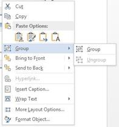

# Working with Shapes for File-Formats Platform DocIO Control

Shapes are drawing objects that include lines, curves, circles, rectangles, etc. It can be preset or custom geometry. You can create and manipulate the pre-defined shape in DOCX and WordML format documents.

## Adding shapes

The following code example illustrates how to add pre-defined shape to the document.




//Creates a new Word document 
WordDocument document = new WordDocument();
//Adds new section to the document
IWSection section = document.AddSection();
//Adds new paragraph to the section
WParagraph paragraph = section.AddParagraph() as WParagraph;
//Adds new shape to the document
Shape rectangle = paragraph.AppendShape(AutoShapeType.RoundedRectangle, 150, 100);
//Sets position for shape
rectangle.VerticalPosition = 72;
rectangle.HorizontalPosition = 72;
paragraph = section.AddParagraph() as WParagraph;
//Adds textbody contents to the shape
paragraph = rectangle.TextBody.AddParagraph() as WParagraph;
IWTextRange text = paragraph.AppendText("This text is in rounded rectangle shape");
text.CharacterFormat.TextColor = Color.Green;
text.CharacterFormat.Bold = true;
//Adds another shape to the document 
paragraph = section.AddParagraph()as WParagraph;
paragraph.AppendBreak(BreakType.LineBreak);
Shape pentagon = paragraph.AppendShape(AutoShapeType.Pentagon, 100, 100);
paragraph = pentagon.TextBody.AddParagraph()as WParagraph;
paragraph.AppendText("This text is in pentagon shape");
pentagon.HorizontalPosition = 72;
pentagon.VerticalPosition = 200;
//Saves the Word document
document.Save("Sample.docx", FormatType.Docx);
//Closes the document
document.Close();



'Creates a new Word document 
Dim document As New WordDocument()
'Adds new section to the document
Dim section As IWSection = document.AddSection()
'Adds new paragraph to the section
Dim paragraph As WParagraph = TryCast(section.AddParagraph(), WParagraph)
'Adds new shape to the document
Dim rectangle As Shape = paragraph.AppendShape(AutoShapeType.RoundedRectangle, 150, 100)
'Sets position for shape
rectangle.VerticalPosition = 72
rectangle.HorizontalPosition = 72
paragraph = TryCast(section.AddParagraph(), WParagraph)
'Adds textbody contents to the shape
paragraph = TryCast(rectangle.TextBody.AddParagraph(), WParagraph)
Dim text As IWTextRange = paragraph.AppendText("This text is in rounded rectangle shape")
text.CharacterFormat.TextColor = Color.Green
text.CharacterFormat.Bold = True
'Adds another shape to the document 
paragraph = TryCast(section.AddParagraph(), WParagraph)
paragraph.AppendBreak(BreakType.LineBreak)
Dim pentagon As Shape = paragraph.AppendShape(AutoShapeType.Pentagon, 100, 100)
paragraph = TryCast(pentagon.TextBody.AddParagraph(), WParagraph)
paragraph.AppendText("This text is in pentagon shape")
pentagon.HorizontalPosition = 72
pentagon.VerticalPosition = 200
'Saves the Word document
document.Save("Sample.docx", FormatType.Docx)
'Closes the document
document.Close()



//Creates a new Word document 
WordDocument document = new WordDocument();
//Adds new section to the document
IWSection section = document.AddSection();
//Adds new paragraph to the section
WParagraph paragraph = section.AddParagraph() as WParagraph;
//Adds new shape to the document
Shape rectangle = paragraph.AppendShape(AutoShapeType.RoundedRectangle, 150, 100);
//Sets position for shape
rectangle.VerticalPosition = 72;
rectangle.HorizontalPosition = 72;
paragraph = section.AddParagraph() as WParagraph;
//Adds textbody contents to the shape
paragraph = rectangle.TextBody.AddParagraph() as WParagraph;
IWTextRange text = paragraph.AppendText("This text is in rounded rectangle shape");
text.CharacterFormat.TextColor = Color.Green;
text.CharacterFormat.Bold = true;
//Adds another shape to the document 
paragraph = section.AddParagraph() as WParagraph;
paragraph.AppendBreak(BreakType.LineBreak);
Shape pentagon = paragraph.AppendShape(AutoShapeType.Pentagon, 100, 100);
paragraph = pentagon.TextBody.AddParagraph() as WParagraph;
paragraph.AppendText("This text is in pentagon shape");
pentagon.HorizontalPosition = 72;
pentagon.VerticalPosition = 200;
//Saves and closes the Word document instance
MemoryStream stream = new MemoryStream();
//Saves the Word file to MemoryStream
await document.SaveAsync(stream, FormatType.Docx);
document.Close();
//Saves the stream as Word file in local machine
Save(stream, "Result.docx");
//Please refer the below link to save Word document in UWP platform
//https://help.syncfusion.com/file-formats/docio/create-word-document-in-uwp#save-word-document-in-uwp



//Creates a new Word document 
WordDocument document = new WordDocument();
//Adds new section to the document
IWSection section = document.AddSection();
//Adds new paragraph to the section
WParagraph paragraph = section.AddParagraph() as WParagraph;
//Adds new shape to the document
Shape rectangle = paragraph.AppendShape(AutoShapeType.RoundedRectangle, 150, 100);
//Sets position for shape
rectangle.VerticalPosition = 72;
rectangle.HorizontalPosition = 72;
paragraph = section.AddParagraph() as WParagraph;
//Adds textbody contents to the shape
paragraph = rectangle.TextBody.AddParagraph() as WParagraph;
IWTextRange text = paragraph.AppendText("This text is in rounded rectangle shape");
text.CharacterFormat.TextColor = Color.Green;
text.CharacterFormat.Bold = true;
//Adds another shape to the document 
paragraph = section.AddParagraph() as WParagraph;
paragraph.AppendBreak(BreakType.LineBreak);
Shape pentagon = paragraph.AppendShape(AutoShapeType.Pentagon, 100, 100);
paragraph = pentagon.TextBody.AddParagraph() as WParagraph;
paragraph.AppendText("This text is in pentagon shape");
pentagon.HorizontalPosition = 72;
pentagon.VerticalPosition = 200;
//Saves and closes the Word document instance
MemoryStream stream = new MemoryStream();
//Saves the Word document to  MemoryStream
document.Save(stream, FormatType.Docx);
document.Close();
stream.Position = 0;
//Download Word document in the browser
return File(stream, "application/msword", "Result.docx");



//Creates a new Word document 
WordDocument document = new WordDocument();
//Adds new section to the document
IWSection section = document.AddSection();
//Adds new paragraph to the section
WParagraph paragraph = section.AddParagraph() as WParagraph;
//Adds new shape to the document
Shape rectangle = paragraph.AppendShape(AutoShapeType.RoundedRectangle, 150, 100);
//Sets position for shape
rectangle.VerticalPosition = 72;
rectangle.HorizontalPosition = 72;
paragraph = section.AddParagraph() as WParagraph;
//Adds textbody contents to the shape
paragraph = rectangle.TextBody.AddParagraph() as WParagraph;
IWTextRange text = paragraph.AppendText("This text is in rounded rectangle shape");
text.CharacterFormat.TextColor = Syncfusion.Drawing.Color.Green;
text.CharacterFormat.Bold = true;
//Adds another shape to the document 
paragraph = section.AddParagraph() as WParagraph;
paragraph.AppendBreak(BreakType.LineBreak);
Shape pentagon = paragraph.AppendShape(AutoShapeType.Pentagon, 100, 100);
paragraph = pentagon.TextBody.AddParagraph() as WParagraph;
paragraph.AppendText("This text is in pentagon shape");
pentagon.HorizontalPosition = 72;
pentagon.VerticalPosition = 200;
//Saves and closes the Word document instance
MemoryStream stream = new MemoryStream();
//Saves the Word file to MemoryStream
document.Save(stream, FormatType.Docx);
document.Close();
//Save the stream as a file in the device and invoke it for viewing
Xamarin.Forms.DependencyService.Get<ISave>().SaveAndView("Result.docx", "application/msword", stream);
//Please download the helper files from the below link to save the stream as file and open the file for viewing in Xamarin platform
//https://help.syncfusion.com/file-formats/docio/create-word-document-in-xamarin#helper-files-for-xamarin




You can download a complete working sample from [GitHub](https://github.com/SyncfusionExamples/DocIO-Examples/tree/main/Shapes/Add-shapes-in-Word).

### Format shapes

Shape can have formatting such as line color, fill color, positioning, wrap formats, etc. The following code example illustrates how to apply formatting options for shape.




//Creates a new Word document 
WordDocument document = new WordDocument();
//Adds new section to the document
IWSection section = document.AddSection();
//Adds new paragraph to the section
WParagraph paragraph = section.AddParagraph() as WParagraph;
Shape rectangle = paragraph.AppendShape(AutoShapeType.RoundedRectangle, 150, 100);
rectangle.VerticalPosition = 72;
rectangle.HorizontalPosition = 72;
paragraph = section.AddParagraph() as WParagraph;
paragraph = rectangle.TextBody.AddParagraph() as WParagraph;
IWTextRange text = paragraph.AppendText("This text is in rounded rectangle shape");
text.CharacterFormat.TextColor = Color.Green;
text.CharacterFormat.Bold = true;
//Applies fill color for shape
rectangle.FillFormat.Fill = true;
rectangle.FillFormat.Color = Color.LightGray;
//Applies wrap formats
rectangle.WrapFormat.TextWrappingStyle = TextWrappingStyle.Square;
rectangle.WrapFormat.TextWrappingType = TextWrappingType.Right;
//Sets horizontal and vertical origin
rectangle.HorizontalOrigin = HorizontalOrigin.Margin;
rectangle.VerticalOrigin = VerticalOrigin.Page;
//Sets line format
rectangle.LineFormat.DashStyle = LineDashing.Dot;
rectangle.LineFormat.Color = Color.DarkGray;
//Sets the left internal margin for the shape.
rectangle.TextFrame.InternalMargin.Left = 30;
//Sets the right internal margin for the shape.
rectangle.TextFrame.InternalMargin.Right = 24;
//Sets the bottom internal margin for the shape.
rectangle.TextFrame.InternalMargin.Bottom = 18;
//Sets the top internal margin for the shape.
rectangle.TextFrame.InternalMargin.Top = 6;
//Saves and closes the Word document
document.Save("Sample.docx", FormatType.Docx);
document.Close();



'Creates a new Word document 
Dim document As New WordDocument()
'Adds new section to the document
Dim section As IWSection = document.AddSection()
'Adds new paragraph to the section
Dim paragraph As WParagraph = TryCast(section.AddParagraph(), WParagraph)
Dim rectangle As Shape = paragraph.AppendShape(AutoShapeType.RoundedRectangle, 150, 100)
rectangle.VerticalPosition = 72
rectangle.HorizontalPosition = 72
paragraph = TryCast(section.AddParagraph(), WParagraph)
paragraph = TryCast(rectangle.TextBody.AddParagraph(), WParagraph)
Dim text As IWTextRange = paragraph.AppendText("This text is in rounded rectangle shape")
text.CharacterFormat.TextColor = Color.Green
text.CharacterFormat.Bold = True
'Applies fill color for shape
rectangle.FillFormat.Fill = True
rectangle.FillFormat.Color = Color.LightGray
'Applies wrap formats
rectangle.WrapFormat.TextWrappingStyle = TextWrappingStyle.Square
rectangle.WrapFormat.TextWrappingType = TextWrappingType.Right
'Sets horizontal and vertical origin
rectangle.HorizontalOrigin = HorizontalOrigin.Margin
rectangle.VerticalOrigin = VerticalOrigin.Page
'Sets line format
rectangle.LineFormat.DashStyle = LineDashing.Dot
rectangle.LineFormat.Color = Color.DarkGray
'Sets the left internal margin for the shape.
rectangle.TextFrame.InternalMargin.Left = 30
'Sets the right internal margin for the shape.
rectangle.TextFrame.InternalMargin.Right = 24
'Sets the bottom internal margin for the shape.
rectangle.TextFrame.InternalMargin.Bottom = 18
'Sets the top internal margin for the shape.
rectangle.TextFrame.InternalMargin.Top = 6
'Saves and closes the Word document
document.Save("Sample.docx", FormatType.Docx)
document.Close()



//Creates a new Word document 
WordDocument document = new WordDocument();
//Adds new section to the document
IWSection section = document.AddSection();
//Adds new paragraph to the section
IWParagraph paragraph = section.AddParagraph() as WParagraph;
Shape rectangle = paragraph.AppendShape(AutoShapeType.RoundedRectangle, 150, 100);
rectangle.VerticalPosition = 72;
rectangle.HorizontalPosition = 72;
paragraph = section.AddParagraph() as WParagraph;
paragraph = rectangle.TextBody.AddParagraph() as WParagraph;
IWTextRange text = paragraph.AppendText("This text is in rounded rectangle shape");
text.CharacterFormat.TextColor = Color.Green;
text.CharacterFormat.Bold = true;
//Applies fill color for shape
rectangle.FillFormat.Fill = true;
rectangle.FillFormat.Color = Color.LightGray;
//Applies wrap formats
rectangle.WrapFormat.TextWrappingStyle = TextWrappingStyle.Square;
rectangle.WrapFormat.TextWrappingType = TextWrappingType.Right;
//Sets horizontal and vertical origin
rectangle.HorizontalOrigin = HorizontalOrigin.Margin;
rectangle.VerticalOrigin = VerticalOrigin.Page;
//Sets line format
rectangle.LineFormat.DashStyle = LineDashing.Dot;
rectangle.LineFormat.Color = Color.DarkGray;
//Sets the left internal margin for the shape.
rectangle.TextFrame.InternalMargin.Left = 30;
//Sets the right internal margin for the shape.
rectangle.TextFrame.InternalMargin.Right = 24;
//Sets the bottom internal margin for the shape.
rectangle.TextFrame.InternalMargin.Bottom = 18;
//Sets the top internal margin for the shape.
rectangle.TextFrame.InternalMargin.Top = 6;
//Saves and closes the Word document instance
MemoryStream stream = new MemoryStream();
//Saves the Word file to MemoryStream
await document.SaveAsync(stream, FormatType.Docx);
document.Close();
//Saves the stream as Word file in local machine
Save(stream, "Result.docx");
//Please refer the below link to save Word document in UWP platform
//https://help.syncfusion.com/file-formats/docio/create-word-document-in-uwp#save-word-document-in-uwp



//Creates a new Word document 
WordDocument document = new WordDocument();
//Adds new section to the document
IWSection section = document.AddSection();
//Adds new paragraph to the section
IWParagraph paragraph = section.AddParagraph() as WParagraph;
Shape rectangle = paragraph.AppendShape(AutoShapeType.RoundedRectangle, 150, 100);
rectangle.VerticalPosition = 72;
rectangle.HorizontalPosition = 72;
paragraph = section.AddParagraph() as WParagraph;
paragraph = rectangle.TextBody.AddParagraph() as WParagraph;
IWTextRange text = paragraph.AppendText("This text is in rounded rectangle shape");
text.CharacterFormat.TextColor = Color.Green;
text.CharacterFormat.Bold = true;
//Applies fill color for shape
rectangle.FillFormat.Fill = true;
rectangle.FillFormat.Color = Color.LightGray;
//Applies wrap formats
rectangle.WrapFormat.TextWrappingStyle = TextWrappingStyle.Square;
rectangle.WrapFormat.TextWrappingType = TextWrappingType.Right;
//Sets horizontal and vertical origin
rectangle.HorizontalOrigin = HorizontalOrigin.Margin;
rectangle.VerticalOrigin = VerticalOrigin.Page;
//Sets line format
rectangle.LineFormat.DashStyle = LineDashing.Dot;
rectangle.LineFormat.Color = Color.DarkGray;
//Sets the left internal margin for the shape.
rectangle.TextFrame.InternalMargin.Left = 30;
//Sets the right internal margin for the shape.
rectangle.TextFrame.InternalMargin.Right = 24;
//Sets the bottom internal margin for the shape.
rectangle.TextFrame.InternalMargin.Bottom = 18;
//Sets the top internal margin for the shape.
rectangle.TextFrame.InternalMargin.Top = 6;
//Saves and closes the Word document instance
MemoryStream stream = new MemoryStream();
//Saves the Word document to  MemoryStream
document.Save(stream, FormatType.Docx);
document.Close();
stream.Position = 0;
//Download Word document in the browser
return File(stream, "application/msword", "Result.docx");



//Creates a new Word document 
WordDocument document = new WordDocument();
//Adds new section to the document
IWSection section = document.AddSection();
//Adds new paragraph to the section
IWParagraph paragraph = section.AddParagraph() as WParagraph;
Shape rectangle = paragraph.AppendShape(AutoShapeType.RoundedRectangle, 150, 100);
rectangle.VerticalPosition = 72;
rectangle.HorizontalPosition = 72;
paragraph = section.AddParagraph() as WParagraph;
paragraph = rectangle.TextBody.AddParagraph() as WParagraph;
IWTextRange text = paragraph.AppendText("This text is in rounded rectangle shape");
text.CharacterFormat.TextColor = Syncfusion.Drawing.Color.Green;
text.CharacterFormat.Bold = true;
//Applies fill color for shape
rectangle.FillFormat.Fill = true;
rectangle.FillFormat.Color = Syncfusion.Drawing.Color.LightGray;
//Applies wrap formats
rectangle.WrapFormat.TextWrappingStyle = TextWrappingStyle.Square;
rectangle.WrapFormat.TextWrappingType = TextWrappingType.Right;
//Sets horizontal and vertical origin
rectangle.HorizontalOrigin = HorizontalOrigin.Margin;
rectangle.VerticalOrigin = VerticalOrigin.Page;
//Sets line format
rectangle.LineFormat.DashStyle = LineDashing.Dot;
rectangle.LineFormat.Color = Syncfusion.Drawing.Color.DarkGray;
//Sets the left internal margin for the shape.
rectangle.TextFrame.InternalMargin.Left = 30;
//Sets the right internal margin for the shape.
rectangle.TextFrame.InternalMargin.Right = 24;
//Sets the bottom internal margin for the shape.
rectangle.TextFrame.InternalMargin.Bottom = 18;
//Sets the top internal margin for the shape.
rectangle.TextFrame.InternalMargin.Top = 6;
//Saves and closes the Word document instance
MemoryStream stream = new MemoryStream();
//Saves the Word file to MemoryStream
document.Save(stream, FormatType.Docx);
document.Close();
//Save the stream as a file in the device and invoke it for viewing
Xamarin.Forms.DependencyService.Get<ISave>().SaveAndView("Result.docx", "application/msword", stream);
//Please download the helper files from the below link to save the stream as file and open the file for viewing in Xamarin platform
//https://help.syncfusion.com/file-formats/docio/create-word-document-in-xamarin#helper-files-for-xamarin




You can download a complete working sample from [GitHub](https://github.com/SyncfusionExamples/DocIO-Examples/tree/main/Shapes/Format-shapes).

### Rotate shapes

You can rotate the shape and also apply flipping (horizontal and vertical) to it. The following code example explains how to rotate and flip the shape.




//Creates a new Word document
WordDocument document = new WordDocument();
//Adds new section to the document
IWSection section = document.AddSection();
//Adds new paragraph to the section
WParagraph paragraph = section.AddParagraph() as WParagraph;
Shape rectangle = paragraph.AppendShape(AutoShapeType.RoundedRectangle, 150, 100);
//Sets position for shape
rectangle.VerticalPosition = 72;
rectangle.HorizontalPosition = 72;
//Sets 90 degree rotation
rectangle.Rotation = 90;
//Sets horizontal flip
rectangle.FlipHorizontal = true;
paragraph = section.AddParagraph() as WParagraph;
paragraph = rectangle.TextBody.AddParagraph() as WParagraph;
IWTextRange text = paragraph.AppendText("This text is in rounded rectangle shape");   
//Saves and closes the Word document
document.Save("Sample.docx", FormatType.Docx);
document.Close();



'Creates a new Word document
Dim document As WordDocument = New WordDocument()
'Adds new section to the document
Dim section As IWSection = document.AddSection()
'Adds new paragraph to the section
Dim paragraph As WParagraph = TryCast(section.AddParagraph(), WParagraph)
Dim rectangle As Shape = paragraph.AppendShape(AutoShapeType.RoundedRectangle, 150, 100)
'Sets position for shape
rectangle.VerticalPosition = 72
rectangle.HorizontalPosition = 72
'Sets 90 degree rotation
rectangle.Rotation = 90
'Sets horizontal flip
rectangle.FlipHorizontal = true
paragraph = TryCast(section.AddParagraph(), WParagraph)
paragraph = TryCast(rectangle.TextBody.AddParagraph(), WParagraph)
Dim text As IWTextRange = paragraph.AppendText("This text is in rounded rectangle shape")
'Saves and closes the Word document
document.Save("Sample.docx", FormatType.Docx)
document.Close



//Creates a new Word document
WordDocument document = new WordDocument();
//Adds new section to the document
IWSection section = document.AddSection();
//Adds new paragraph to the section
WParagraph paragraph = section.AddParagraph() as WParagraph;
Shape rectangle = paragraph.AppendShape(AutoShapeType.RoundedRectangle, 150, 100);
//Sets position for shape
rectangle.VerticalPosition = 72;
rectangle.HorizontalPosition = 72;
//Sets 90 degree rotation
rectangle.Rotation = 90;
//Sets horizontal flip
rectangle.FlipHorizontal = true;
paragraph = section.AddParagraph() as WParagraph;
paragraph = rectangle.TextBody.AddParagraph() as WParagraph;
IWTextRange text = paragraph.AppendText("This text is in rounded rectangle shape");   
//Saves the Word file to MemoryStream
MemoryStream stream = new MemoryStream();
await document.SaveAsync(stream, FormatType.Docx);
//Saves the stream as Word file in local machine
Save(stream, "Sample.docx");
//Closes the document
document.Close();
//Please refer the below link to save Word document in UWP platform
//https://help.syncfusion.com/file-formats/docio/create-word-document-in-uwp#save-word-document-in-uwp



//Creates a new Word document
WordDocument document = new WordDocument();
//Adds new section to the document
IWSection section = document.AddSection();
//Adds new paragraph to the section
WParagraph paragraph = section.AddParagraph() as WParagraph;
Shape rectangle = paragraph.AppendShape(AutoShapeType.RoundedRectangle, 150, 100);
//Sets position for shape
rectangle.VerticalPosition = 72;
rectangle.HorizontalPosition = 72;
//Sets 90 degree rotation
rectangle.Rotation = 90;
//Sets horizontal flip
rectangle.FlipHorizontal = true;
paragraph = section.AddParagraph() as WParagraph;
paragraph = rectangle.TextBody.AddParagraph() as WParagraph;
IWTextRange text = paragraph.AppendText("This text is in rounded rectangle shape");   
//Saves the Word document to MemoryStream
MemoryStream stream = new MemoryStream();
document.Save(stream, FormatType.Docx);
//Closes the document
document.Close();
stream.Position = 0;
//Download Word document in the browser
return File(stream, "application/msword", "Sample.docx");



//Creates a new Word document
WordDocument document = new WordDocument();
//Adds new section to the document
IWSection section = document.AddSection();
//Adds new paragraph to the section
WParagraph paragraph = section.AddParagraph() as WParagraph;
Shape rectangle = paragraph.AppendShape(AutoShapeType.RoundedRectangle, 150, 100);
//Sets position for shape
rectangle.VerticalPosition = 72;
rectangle.HorizontalPosition = 72;
//Sets 90 degree rotation
rectangle.Rotation = 90;
//Sets horizontal flip
rectangle.FlipHorizontal = true;
paragraph = section.AddParagraph() as WParagraph;
paragraph = rectangle.TextBody.AddParagraph() as WParagraph;
IWTextRange text = paragraph.AppendText("This text is in rounded rectangle shape");   
//Saves the Word document to MemoryStream
MemoryStream stream = new MemoryStream();
document.Save(stream, FormatType.Docx);
//Closes the document
document.Close();
//Save the stream as a file in the device and invoke it for viewing
Xamarin.Forms.DependencyService.Get<ISave>().SaveAndView("Sample.docx", "application/msword", stream);
//Please download the helper files from the below link to save the stream as file and open the file for viewing in Xamarin platform
//https://help.syncfusion.com/file-formats/docio/create-word-document-in-xamarin#helper-files-for-xamarin




You can download a complete working sample from [GitHub](https://github.com/SyncfusionExamples/DocIO-Examples/tree/main/Shapes/Rotate-shapes).

## Grouping shapes

Word library now allows you to create or group multiple shapes, pictures, text boxes, and charts as a group shape in Word document (DOCX) and preserve it as in DOCX and WordML format conversions.

You can create a document with group shapes by using Microsoft Word. It provides an option to group a set of shapes and images as a single shape and a group shape as individual item.

**Key Features:**

1. You can easily manage group of shapes, pictures, text boxes, or charts as a group shape.
2. You can move several shapes or images simultaneously and apply the same formatting properties for children of group shapes.

N> 1. While grouping the shapes or other objects, the shapes should be positioned relative to the “Page”.
N> 2. While grouping the shapes or other objects, the wrapping style should not be "In Line with Text".

The following code example illustrates how to create group shape in Word document.




//Creates a new Word document 
WordDocument document = new WordDocument();
//Adds new section to the document
IWSection section = document.AddSection();
//Adds new paragraph to the section
WParagraph paragraph = section.AddParagraph() as WParagraph;
//Creates new group shape
GroupShape groupShape = new GroupShape(document);
//Adds group shape to the paragraph.
paragraph.ChildEntities.Add(groupShape);
//Creates new shape
Shape shape = new Shape(document, AutoShapeType.RoundedRectangle);
//Sets height and width for shape
shape.Height = 100;
shape.Width = 150;
//Sets horizontal and vertical position
shape.HorizontalPosition = 72;
shape.VerticalPosition = 72;
//Set wrapping style for shape
shape.WrapFormat.TextWrappingStyle = TextWrappingStyle.InFrontOfText;
//Sets horizontal and vertical origin
shape.HorizontalOrigin = HorizontalOrigin.Page;
shape.VerticalOrigin = VerticalOrigin.Page;
//Adds the specified shape to group shape
groupShape.Add(shape);
//Creates new picture
WPicture picture = new WPicture(document);
picture.LoadImage(Image.FromFile("Image.png"));
//Sets wrapping style for picture
picture.TextWrappingStyle = TextWrappingStyle.InFrontOfText;
//Sets height and width for the image
picture.Height = 100;
picture.Width = 100;
//Sets horizontal and vertical position
picture.HorizontalPosition = 400;
picture.VerticalPosition = 150;
//Sets horizontal and vertical origin
picture.HorizontalOrigin = HorizontalOrigin.Page;
picture.VerticalOrigin = VerticalOrigin.Page;
//Adds the specified picture to group shape
groupShape.Add(picture);
//Creates new textbox
WTextBox textbox = new WTextBox(document);
textbox.TextBoxFormat.Width = 150;
textbox.TextBoxFormat.Height = 75;
//Adds new text to the textbox body
IWParagraph textboxParagraph = textbox.TextBoxBody.AddParagraph();
textboxParagraph.AppendText("Text inside text box");
//Sets wrapping style for textbox
textbox.TextBoxFormat.TextWrappingStyle = TextWrappingStyle.Behind;
//Sets horizontal and vertical position
textbox.TextBoxFormat.HorizontalPosition = 200;
textbox.TextBoxFormat.VerticalPosition = 200;
//Sets horizontal and vertical origin
textbox.TextBoxFormat.VerticalOrigin = VerticalOrigin.Page;
textbox.TextBoxFormat.HorizontalOrigin = HorizontalOrigin.Page;
//Adds the specified textbox to group shape
groupShape.Add(textbox);
//Saves the Word document
document.Save("Sample.docx", FormatType.Docx);
//Closes the document
document.Close();



‘Creates a new Word document
Dim document As WordDocument = New WordDocument()
‘Adds new section to the document
Dim section As IWSection = document.AddSection()
‘Adds new paragraph to the section
Dim paragraph As WParagraph = TryCast(section.AddParagraph(), WParagraph)
‘Creates new group shape
Dim groupShape As GroupShape = New GroupShape(document)
‘Adds group shape to the paragraph
paragraph.ChildEntities.Add(groupShape)
‘Creates new shape
Dim shape As Shape = New Shape(document, AutoShapeType.RoundedRectangle)
‘Sets height and width for shape
shape.Height = 100
shape.Width = 150
‘Sets horizontal and vertical position
shape.HorizontalPosition = 72
shape.VerticalPosition = 72
‘Sets wrapping style for shape
shape.WrapFormat.TextWrappingStyle = TextWrappingStyle.InFrontOfText
‘Sets horizontal and vertical origin
shape.HorizontalOrigin = HorizontalOrigin.Page
shape.VerticalOrigin = VerticalOrigin.Page
‘Adds the specified shape to group shape
groupShape.Add(shape)
‘Creates new picture
Dim picture As WPicture = New WPicture(document)
picture.LoadImage(Image.FromFile("Image.png"))
‘Sets wrapping style for picture
picture.TextWrappingStyle = TextWrappingStyle.InFrontOfText
‘Sets height and width for the image
picture.Height = 100
picture.Width = 100
‘Sets horizontal and vertical position
picture.HorizontalPosition = 400
picture.VerticalPosition = 150
‘Sets horizontal and vertical origin
picture.HorizontalOrigin = HorizontalOrigin.Page
picture.VerticalOrigin = VerticalOrigin.Page
‘Adds the specified picture to group shape
groupShape.Add(picture)
‘Creates new textbox
Dim textbox As WTextBox = New WTextBox(document)
textbox.TextBoxFormat.Width = 150
textbox.TextBoxFormat.Height = 75
‘Adds new text to the textbox body
Dim textboxParagraph As IWParagraph = textbox.TextBoxBody.AddParagraph()
textboxParagraph.AppendText("Text inside text box")
‘Sets wrapping style for textbox
textbox.TextBoxFormat.TextWrappingStyle = TextWrappingStyle.Behind
‘Sets horizontal and vertical position
textbox.TextBoxFormat.HorizontalPosition = 200
textbox.TextBoxFormat.VerticalPosition = 200
‘Sets horizontal and vertical origin
textbox.TextBoxFormat.VerticalOrigin = VerticalOrigin.Page
textbox.TextBoxFormat.HorizontalOrigin = HorizontalOrigin.Page
‘Adds the specified textbox to group shape
groupShape.Add(textbox)
‘Saves the Word document
document.Save("Sample.docx", FormatType.Docx)
‘Closes the document
document.Close()



//"App" is the class of Portable project
Assembly assembly = typeof(App).GetTypeInfo().Assembly;
//Creates a new Word document 
WordDocument document = new WordDocument();
//Adds new section to the document
IWSection section = document.AddSection();
//Adds new paragraph to the section
WParagraph paragraph = section.AddParagraph() as WParagraph;
//Creates new group shape
GroupShape groupShape = new GroupShape(document);
//Adds group shape to the paragraph
paragraph.ChildEntities.Add(groupShape);
//Creates new shape
Shape shape = new Shape(document, AutoShapeType.RoundedRectangle);
//Sets height and width for shape
shape.Height = 100;
shape.Width = 150;
//Sets horizontal and vertical position
shape.HorizontalPosition = 72;
shape.VerticalPosition = 72;
//Set wrapping style for shape
shape.WrapFormat.TextWrappingStyle = TextWrappingStyle.InFrontOfText;
//Sets horizontal and vertical origin
shape.HorizontalOrigin = HorizontalOrigin.Page;
shape.VerticalOrigin = VerticalOrigin.Page;
//Adds the specified shape to group shape
groupShape.Add(shape);
//Creates new picture
WPicture picture = new WPicture(document);
Stream imageStream = assembly.GetManifestResourceStream("CreateWordSample.Assets.Images.jpg");
picture.LoadImage(imageStream);
//Sets wrapping style for picture
picture.TextWrappingStyle = TextWrappingStyle.InFrontOfText;
//Sets height and width for the image
picture.Height = 100;
picture.Width = 100;
//Sets horizontal and vertical position
picture.HorizontalPosition = 400;
picture.VerticalPosition = 150;
//Sets horizontal and vertical origin
picture.HorizontalOrigin = HorizontalOrigin.Page;
picture.VerticalOrigin = VerticalOrigin.Page;
//Adds the specified picture to group shape
groupShape.Add(picture);
//Creates new textbox
WTextBox textbox = new WTextBox(document);
textbox.TextBoxFormat.Width = 150;
textbox.TextBoxFormat.Height = 75;
//Adds new text to the textbox body
IWParagraph textboxParagraph = textbox.TextBoxBody.AddParagraph();
textboxParagraph.AppendText("Text inside text box");
//Sets wrapping style for textbox
textbox.TextBoxFormat.TextWrappingStyle = TextWrappingStyle.Behind;
//Sets horizontal and vertical position
textbox.TextBoxFormat.HorizontalPosition = 200;
textbox.TextBoxFormat.VerticalPosition = 200;
//Sets horizontal and vertical origin
textbox.TextBoxFormat.VerticalOrigin = VerticalOrigin.Page;
textbox.TextBoxFormat.HorizontalOrigin = HorizontalOrigin.Page;
//Adds the specified textbox to group shape
groupShape.Add(textbox);
MemoryStream stream = new MemoryStream();
//Saves the Word document to MemoryStream
await document.SaveAsync(stream, FormatType.Docx);
//Saves the stream as Word document file in local machine
Save(stream, "GroupSahpe.docx");
//Closes the document
document.Close();
//Please refer the below link to save Word document in UWP platform
//https://help.syncfusion.com/file-formats/docio/create-word-document-in-uwp#save-word-document-in-uwp



//Creates a new Word document 
WordDocument document = new WordDocument();
//Adds new section to the document
IWSection section = document.AddSection();
//Adds new paragraph to the section
WParagraph paragraph = section.AddParagraph() as WParagraph;
//Creates new group shape
GroupShape groupShape = new GroupShape(document);
//Adds group shape to the paragraph
paragraph.ChildEntities.Add(groupShape);
//Creates new shape
Shape shape = new Shape(document, AutoShapeType.RoundedRectangle);
//Sets height and width for shape
shape.Height = 100;
shape.Width = 150;
//Sets horizontal and vertical position
shape.HorizontalPosition = 72;
shape.VerticalPosition = 72;
//Set wrapping style for shape
shape.WrapFormat.TextWrappingStyle = TextWrappingStyle.InFrontOfText;
//Sets horizontal and vertical origin
shape.HorizontalOrigin = HorizontalOrigin.Page;
shape.VerticalOrigin = VerticalOrigin.Page;
//Adds the specified shape to group shape
groupShape.Add(shape);
//Creates new picture
WPicture picture = new WPicture(document);
FileStream imageStream = new FileStream("Image.png", FileMode.Open, FileAccess.ReadWrite);
picture.LoadImage(imageStream);
//Sets wrapping style for picture
picture.TextWrappingStyle = TextWrappingStyle.InFrontOfText;
//Sets height and width for the image
picture.Height = 100;
picture.Width = 100;
//Sets horizontal and vertical position
picture.HorizontalPosition = 400;
picture.VerticalPosition = 150;
//Sets horizontal and vertical origin
picture.HorizontalOrigin = HorizontalOrigin.Page;
picture.VerticalOrigin = VerticalOrigin.Page;
//Adds the specified picture to group shape
groupShape.Add(picture);
//Creates new textbox
WTextBox textbox = new WTextBox(document);
textbox.TextBoxFormat.Width = 150;
textbox.TextBoxFormat.Height = 75;
//Adds new text to the textbox body
IWParagraph textboxParagraph = textbox.TextBoxBody.AddParagraph();
textboxParagraph.AppendText("Text inside text box");
//Sets wrapping style for textbox
textbox.TextBoxFormat.TextWrappingStyle = TextWrappingStyle.Behind;
//Sets horizontal and vertical position
textbox.TextBoxFormat.HorizontalPosition = 200;
textbox.TextBoxFormat.VerticalPosition = 200;
//Sets horizontal and vertical origin
textbox.TextBoxFormat.VerticalOrigin = VerticalOrigin.Page;
textbox.TextBoxFormat.HorizontalOrigin = HorizontalOrigin.Page;
//Adds the specified textbox to group shape
groupShape.Add(textbox);
//Saves and closes the Word document instance
MemoryStream stream = new MemoryStream();
//Saves the Word document to  MemoryStream
document.Save(stream, FormatType.Docx);
document.Close();
stream.Position = 0;
//Download Word document in the browser
return File(stream, "application/msword", "Result.docx");



//Creates a new Word document 
WordDocument document = new WordDocument();
//Adds new section to the document
IWSection section = document.AddSection();
//Adds new paragraph to the section
WParagraph paragraph = section.AddParagraph() as WParagraph;
//Creates new group shape
GroupShape groupShape = new GroupShape(document);
//Adds group shape to the paragraph.
paragraph.ChildEntities.Add(groupShape);
//Creates new shape
Shape shape = new Shape(document, AutoShapeType.RoundedRectangle);
//Sets height and width for shape
shape.Height = 100;
shape.Width = 150;
//Sets horizontal and vertical position
shape.HorizontalPosition = 72;
shape.VerticalPosition = 72;
//Set wrapping style for shape
shape.WrapFormat.TextWrappingStyle = TextWrappingStyle.InFrontOfText;
//Sets horizontal and vertical origin
shape.HorizontalOrigin = HorizontalOrigin.Page;
shape.VerticalOrigin = VerticalOrigin.Page;
//Adds the specified shape to group shape
groupShape.Add(shape);
//Creates new picture
WPicture picture = new WPicture(document);
Assembly assembly = typeof(App).GetTypeInfo().Assembly;
Stream imageStream = assembly.GetManifestResourceStream("WordToPDF.Assests.Image.png");
picture.LoadImage(imageStream);
//Sets wrapping style for picture
picture.TextWrappingStyle = TextWrappingStyle.InFrontOfText;
//Sets height and width for the image
picture.Height = 100;
picture.Width = 100;
//Sets horizontal and vertical position
picture.HorizontalPosition = 400;
picture.VerticalPosition = 150;
//Sets horizontal and vertical origin
picture.HorizontalOrigin = HorizontalOrigin.Page;
picture.VerticalOrigin = VerticalOrigin.Page;
//Adds the specified picture to group shape
groupShape.Add(picture);
//Creates new textbox
WTextBox textbox = new WTextBox(document);
textbox.TextBoxFormat.Width = 150;
textbox.TextBoxFormat.Height = 75;
//Adds new text to the textbox body
IWParagraph textboxParagraph = textbox.TextBoxBody.AddParagraph();
textboxParagraph.AppendText("Text inside text box");
//Sets wrapping style for textbox
textbox.TextBoxFormat.TextWrappingStyle = TextWrappingStyle.Behind;
//Sets horizontal and vertical position
textbox.TextBoxFormat.HorizontalPosition = 200;
textbox.TextBoxFormat.VerticalPosition = 200;
//Sets horizontal and vertical origin
textbox.TextBoxFormat.VerticalOrigin = VerticalOrigin.Page;
textbox.TextBoxFormat.HorizontalOrigin = HorizontalOrigin.Page;
//Adds the specified textbox to group shape
groupShape.Add(textbox);
//Saves and closes the Word document instance
MemoryStream stream = new MemoryStream();
//Saves the Word file to MemoryStream
document.Save(stream, FormatType.Docx);
document.Close();
//Save the stream as a file in the device and invoke it for viewing
Xamarin.Forms.DependencyService.Get<ISave>().SaveAndView("Result.docx", "application/msword", stream);
//Please download the helper files from the below link to save the stream as file and open the file for viewing in Xamarin platform
//https://help.syncfusion.com/file-formats/docio/create-word-document-in-xamarin#helper-files-for-xamarin




You can download a complete working sample from [GitHub](https://github.com/SyncfusionExamples/DocIO-Examples/tree/main/Shapes/Add-group-shape-in-Word).

The following code example illustrates how to add collection of shapes or images as a group shape in Word document.




//Creates a new Word document 
WordDocument document = new WordDocument();
//Adds new section to the document
IWSection section = document.AddSection();
//Adds new paragraph to the section
WParagraph paragraph = section.AddParagraph() as WParagraph;
//Creates paragraph item collections to add child shapes
ParagraphItem[] paragraphItems = new ParagraphItem[3];
//Creates new shape
Shape shape = new Shape(document, AutoShapeType.RoundedRectangle);
//Sets height and width for shape
shape.Height = 100;
shape.Width = 150;
//Sets Wrapping style for shape
shape.WrapFormat.TextWrappingStyle = TextWrappingStyle.InFrontOfText;
//Sets horizontal and vertical position for shape
shape.HorizontalPosition = 7;
shape.VerticalPosition = 72;
//Sets horizontal and vertical origin for shape
shape.HorizontalOrigin = HorizontalOrigin.Page;
shape.VerticalOrigin = VerticalOrigin.Page;
//Sets the shape as paragraph item
paragraphItems[0] = shape;
//Appends new textbox to the document
WTextBox textbox = new WTextBox(document);
//Sets height and width for textbox
textbox.TextBoxFormat.Width = 150;
textbox.TextBoxFormat.Height = 75;
//Adds new text to the textbox body
IWParagraph textboxParagraph = textbox.TextBoxBody.AddParagraph();
 //Adds new text to the textbox paragraph
textboxParagraph.AppendText("Text inside text box");
//Sets wrapping style for textbox
textbox.TextBoxFormat.TextWrappingStyle = TextWrappingStyle.Behind;
//Sets horizontal and vertical position for textbox
textbox.TextBoxFormat.HorizontalPosition = 200;
textbox.TextBoxFormat.VerticalPosition = 200;
//Sets horizontal and vertical origin for textbox
textbox.TextBoxFormat.VerticalOrigin = VerticalOrigin.Page;
textbox.TextBoxFormat.HorizontalOrigin = HorizontalOrigin.Page;
//Sets the textbox as paragraph item
paragraphItems[1] = textbox;
//Appends new chart to the document
WChart chart = new WChart(document);
//Sets height and width for chart
chart.Height = 270;
chart.Width = 446;
//Sets wrapping style for chart
chart.WrapFormat.TextWrappingStyle = TextWrappingStyle.InFrontOfText;
//Sets chart type
chart.ChartType = OfficeChartType.Pie;
chart.VerticalPosition = 350;
//Sets chart title
chart.ChartTitle = "Best Selling Products";
//Sets font and size for chart title
chart.ChartTitleArea.FontName = "Calibri";
chart.ChartTitleArea.Size = 14;
//Sets data for chart
chart.ChartData.SetValue(1, 1, "");
chart.ChartData.SetValue(1, 2, "Sales");
chart.ChartData.SetValue(2, 1, "Phyllis Lapin");
chart.ChartData.SetValue(2, 2, 141.396);
chart.ChartData.SetValue(3, 1, "Stanley Hudson");
chart.ChartData.SetValue(3, 2, 80.368);
chart.ChartData.SetValue(4, 1, "Bernard Shah");
chart.ChartData.SetValue(4, 2, 71.155);
chart.ChartData.SetValue(5, 1, "Patricia Lincoln");
chart.ChartData.SetValue(5, 2, 47.234);
chart.ChartData.SetValue(6, 1, "Camembert Pierrot");
chart.ChartData.SetValue(6, 2, 46.825);
chart.ChartData.SetValue(7, 1, "Thomas Hardy");
chart.ChartData.SetValue(7, 2, 42.593);
chart.ChartData.SetValue(8, 1, "Hanna Moos");
chart.ChartData.SetValue(8, 2, 41.819);
chart.ChartData.SetValue(9, 1, "Alice Mutton");
chart.ChartData.SetValue(9, 2, 32.698);
chart.ChartData.SetValue(10, 1, "Christina Berglund");
chart.ChartData.SetValue(10, 2, 29.171);
chart.ChartData.SetValue(11, 1, "Elizabeth Lincoln");
chart.ChartData.SetValue(11, 2, 25.696);
//Creates a new chart series with the name “Sales”
IOfficeChartSerie pieSeries = chart.Series.Add("Sales");
//Sets value for the chart series 
pieSeries.Values = chart.ChartData[2, 2, 11, 2];
//Sets data label
pieSeries.DataPoints.DefaultDataPoint.DataLabels.IsValue = true;
pieSeries.DataPoints.DefaultDataPoint.DataLabels.Position = OfficeDataLabelPosition.Outside;
//Sets background color
chart.ChartArea.Fill.ForeColor = Color.FromArgb(242, 242, 242);
chart.PlotArea.Fill.ForeColor = Color.FromArgb(242, 242, 242);
chart.ChartArea.Border.LinePattern = OfficeChartLinePattern.None;
//Sets category labels
chart.PrimaryCategoryAxis.CategoryLabels = chart.ChartData[2, 1, 11, 1];
//Sets the chart as paragraph item
paragraphItems[2] = chart;
//Creates new group shape
GroupShape groupShape = new GroupShape(document, paragraphItems);
 groupShape.HorizontalPosition = 72;
//Adds the group shape to the paragraph
paragraph.ChildEntities.Add(groupShape);
//Saves the Word document
document.Save("Sample.docx", FormatType.Docx);
//Closes the document
document.Close();



‘Creates a new Word document
Dim document As WordDocument = New WordDocument()
‘Adds new section to the document
Dim section As IWSection = document.AddSection()
‘Adds new paragraph to the section
Dim paragraph As WParagraph = TryCast(section.AddParagraph(), WParagraph)
‘Creates paragraph item collections to add child shapes
Dim paragraphItems As ParagraphItem() = New ParagraphItem(2) {}
‘Creates new shape
Dim shape As Shape = New Shape(document, AutoShapeType.RoundedRectangle)
‘Sets height and width for shape
shape.Height = 100
shape.Width = 150
‘Sets Wrapping style for shape
shape.WrapFormat.TextWrappingStyle = TextWrappingStyle.InFrontOfText
‘Sets horizontal and vertical position for shape
shape.HorizontalPosition = 7
shape.VerticalPosition = 72
‘Sets horizontal and vertical origin for shape
shape.HorizontalOrigin = HorizontalOrigin.Page
shape.VerticalOrigin = VerticalOrigin.Page
‘Sets the shape as paragraph item
paragraphItems(0) = shape
‘Appends new textbox to the document
Dim textbox As WTextBox = New WTextBox(document)
‘Sets height and width for textbox
textbox.TextBoxFormat.Width = 150
textbox.TextBoxFormat.Height = 75
‘Adds new text to the textbox body
Dim textboxParagraph As IWParagraph = textbox.TextBoxBody.AddParagraph()
‘Adds new text to the textbox paragraph
textboxParagraph.AppendText("Text inside text box")
‘Sets wrapping style for textbox
textbox.TextBoxFormat.TextWrappingStyle = TextWrappingStyle.Behind
‘Sets horizontal and vertical position for textbox
textbox.TextBoxFormat.HorizontalPosition = 200
textbox.TextBoxFormat.VerticalPosition = 200
‘Sets horizontal and vertical origin for textbox
textbox.TextBoxFormat.VerticalOrigin = VerticalOrigin.Page
textbox.TextBoxFormat.HorizontalOrigin = HorizontalOrigin.Page
‘Sets the textbox as paragraph item
paragraphItems(1) = textbox
‘Appends new chart to the document
Dim chart As WChart = New WChart(document)
‘Sets height and width for chart
chart.Height = 270
chart.Width = 446
‘Sets wrapping style for chart
chart.WrapFormat.TextWrappingStyle = TextWrappingStyle.InFrontOfText
‘Sets chart type
chart.ChartType = OfficeChartType.Pie
chart.VerticalPosition = 350
‘Sets chart title
‘Sets font and size for chart title
chart.ChartTitle = "Best Selling Products"
chart.ChartTitleArea.FontName = "Calibri"
chart.ChartTitleArea.Size = 14
‘Sets data for chart
chart.ChartData.SetValue(1, 1, "")
chart.ChartData.SetValue(1, 2, "Sales")
chart.ChartData.SetValue(2, 1, "Phyllis Lapin")
chart.ChartData.SetValue(2, 2, 141.396)
chart.ChartData.SetValue(3, 1, "Stanley Hudson")
chart.ChartData.SetValue(3, 2, 80.368)
chart.ChartData.SetValue(4, 1, "Bernard Shah")
chart.ChartData.SetValue(4, 2, 71.155)
chart.ChartData.SetValue(5, 1, "Patricia Lincoln")
chart.ChartData.SetValue(5, 2, 47.234)
chart.ChartData.SetValue(6, 1, "Camembert Pierrot")
chart.ChartData.SetValue(6, 2, 46.825)
chart.ChartData.SetValue(7, 1, "Thomas Hardy")
chart.ChartData.SetValue(7, 2, 42.593)
chart.ChartData.SetValue(8, 1, "Hanna Moos")
chart.ChartData.SetValue(8, 2, 41.819)
chart.ChartData.SetValue(9, 1, "Alice Mutton")
chart.ChartData.SetValue(9, 2, 32.698)
chart.ChartData.SetValue(10, 1, "Christina Berglund")
chart.ChartData.SetValue(10, 2, 29.171)
chart.ChartData.SetValue(11, 1, "Elizabeth Lincoln")
chart.ChartData.SetValue(11, 2, 25.696)
‘Creates a new chart series with the name “Sales”
Dim pieSeries As IOfficeChartSerie = chart.Series.Add("Sales")
‘Sets value for the chart series
pieSeries.Values = chart.ChartData(2, 2, 11, 2)
‘Sets data label
pieSeries.DataPoints.DefaultDataPoint.DataLabels.IsValue = True
pieSeries.DataPoints.DefaultDataPoint.DataLabels.Position = OfficeDataLabelPosition.Outside
‘Sets background color
chart.ChartArea.Fill.ForeColor = Color.FromArgb(242, 242, 242)
chart.PlotArea.Fill.ForeColor = Color.FromArgb(242, 242, 242)
chart.ChartArea.Border.LinePattern = OfficeChartLinePattern.None
‘Sets category labels
chart.PrimaryCategoryAxis.CategoryLabels = chart.ChartData(2, 1, 11, 1)
‘Sets the chart as paragraph item
paragraphItems(2) = chart
‘Creates new group shape
Dim groupShape As GroupShape = New GroupShape(document, paragraphItems)
groupShape.HorizontalPosition = 72
‘Adds the group shape to the paragraph
paragraph.ChildEntities.Add(groupShape)
‘Saves the Word document
document.Save("Sample.docx", FormatType.Docx)
‘Closes the document
document.Close()



//Creates a new Word document 
WordDocument document = new WordDocument();
//Adds new section to the document
IWSection section = document.AddSection();
//Adds new paragraph to the section
WParagraph paragraph = section.AddParagraph() as WParagraph;
//Creates paragraph item collections to add child shapes
ParagraphItem[] paragraphItems = new ParagraphItem[3];
//Creates new shape
Shape shape = new Shape(document, AutoShapeType.RoundedRectangle);
//Sets height and width for shape
shape.Height = 100;
shape.Width = 150;
//Sets Wrapping style for shape
shape.WrapFormat.TextWrappingStyle = TextWrappingStyle.InFrontOfText;
//Sets horizontal and vertical position for shape
shape.HorizontalPosition = 7;
shape.VerticalPosition = 72;
//Sets horizontal and vertical origin for shape
shape.HorizontalOrigin = HorizontalOrigin.Page;
shape.VerticalOrigin = VerticalOrigin.Page;
//Sets the shape as paragraph item
paragraphItems[0] = shape;
//Appends new textbox to the document
WTextBox textbox = new WTextBox(document);
//Sets height and width for textbox
textbox.TextBoxFormat.Width = 150;
textbox.TextBoxFormat.Height = 75;
//Adds new text to the textbox body
IWParagraph textboxParagraph = textbox.TextBoxBody.AddParagraph();
//Adds new text to the textbox paragraph
textboxParagraph.AppendText("Text inside text box");
//Sets wrapping style for textbox
textbox.TextBoxFormat.TextWrappingStyle = TextWrappingStyle.Behind;
//Sets horizontal and vertical position for textbox
textbox.TextBoxFormat.HorizontalPosition = 200;
textbox.TextBoxFormat.VerticalPosition = 200;
//Sets horizontal and vertical origin for textbox
textbox.TextBoxFormat.VerticalOrigin = VerticalOrigin.Page;
textbox.TextBoxFormat.HorizontalOrigin = HorizontalOrigin.Page;
//Sets the textbox as paragraph item
paragraphItems[1] = textbox;
//Appends new chart to the document
WChart chart = new WChart(document);
//Sets height and width for chart
chart.Height = 270;
chart.Width = 446;
//Sets wrapping style for chart
chart.WrapFormat.TextWrappingStyle = TextWrappingStyle.InFrontOfText;
//Sets chart type
chart.ChartType = OfficeChartType.Pie;
chart.VerticalPosition = 350;
//Sets chart title
chart.ChartTitle = "Best Selling Products";
//Sets font and size for chart title
chart.ChartTitleArea.FontName = "Calibri";
chart.ChartTitleArea.Size = 14;
//Sets data for chart
chart.ChartData.SetValue(1, 1, "");
chart.ChartData.SetValue(1, 2, "Sales");
chart.ChartData.SetValue(2, 1, "Phyllis Lapin");
chart.ChartData.SetValue(2, 2, 141.396);
chart.ChartData.SetValue(3, 1, "Stanley Hudson");
chart.ChartData.SetValue(3, 2, 80.368);
chart.ChartData.SetValue(4, 1, "Bernard Shah");
chart.ChartData.SetValue(4, 2, 71.155);
chart.ChartData.SetValue(5, 1, "Patricia Lincoln");
chart.ChartData.SetValue(5, 2, 47.234);
chart.ChartData.SetValue(6, 1, "Camembert Pierrot");
chart.ChartData.SetValue(6, 2, 46.825);
chart.ChartData.SetValue(7, 1, "Thomas Hardy");
chart.ChartData.SetValue(7, 2, 42.593);
chart.ChartData.SetValue(8, 1, "Hanna Moos");
chart.ChartData.SetValue(8, 2, 41.819);
chart.ChartData.SetValue(9, 1, "Alice Mutton");
chart.ChartData.SetValue(9, 2, 32.698);
chart.ChartData.SetValue(10, 1, "Christina Berglund");
chart.ChartData.SetValue(10, 2, 29.171);
chart.ChartData.SetValue(11, 1, "Elizabeth Lincoln");
chart.ChartData.SetValue(11, 2, 25.696);
//Creates a new chart series with the name “Sales”
IOfficeChartSerie pieSeries = chart.Series.Add("Sales");
//Sets value for the chart series 
pieSeries.Values = chart.ChartData[2, 2, 11, 2];
//Sets data label
pieSeries.DataPoints.DefaultDataPoint.DataLabels.IsValue = true;
pieSeries.DataPoints.DefaultDataPoint.DataLabels.Position = OfficeDataLabelPosition.Outside;
//Sets background color
chart.ChartArea.Fill.ForeColor = Syncfusion.Drawing.Color.FromArgb(242, 242, 242);
chart.PlotArea.Fill.ForeColor = Syncfusion.Drawing.Color.FromArgb(242, 242, 242);
chart.ChartArea.Border.LinePattern = OfficeChartLinePattern.None;
//Sets category labels
chart.PrimaryCategoryAxis.CategoryLabels = chart.ChartData[2, 1, 11, 1];
paragraphItems[2] = chart;
//Creates new group shape
GroupShape groupShape = new GroupShape(document, paragraphItems);
groupShape.HorizontalPosition = 72;
//Adds the group shape to the paragraph
paragraph.ChildEntities.Add(groupShape);
MemoryStream stream = new MemoryStream();
//Saves the Word document to MemoryStream
await document.SaveAsync(stream, FormatType.Docx);
//Saves the stream as Word document file in local machine
Save(stream, "GroupSahpe.docx");
//Closes the document
document.Close();
//Please refer the below link to save Word document in UWP platform
//https://help.syncfusion.com/file-formats/docio/create-word-document-in-uwp#save-word-document-in-uwp



//Creates a new Word document 
WordDocument document = new WordDocument();
//Adds new section to the document
IWSection section = document.AddSection();
//Adds new paragraph to the section
WParagraph paragraph = section.AddParagraph() as WParagraph;
//Creates paragraph item collections to add child shapes
ParagraphItem[] paragraphItems = new ParagraphItem[3];
//Creates new shape
Shape shape = new Shape(document, AutoShapeType.RoundedRectangle);
//Sets height and width for shape
shape.Height = 100;
shape.Width = 150;
//Sets Wrapping style for shape
shape.WrapFormat.TextWrappingStyle = TextWrappingStyle.InFrontOfText;
//Sets horizontal and vertical position for shape
shape.HorizontalPosition = 7;
shape.VerticalPosition = 72;
//Sets horizontal and vertical origin for shape
shape.HorizontalOrigin = HorizontalOrigin.Page;
shape.VerticalOrigin = VerticalOrigin.Page;
//Sets the shape as paragraph item
paragraphItems[0] = shape;
//Appends new textbox to the document
WTextBox textbox = new WTextBox(document);
//Sets height and width for textbox
textbox.TextBoxFormat.Width = 150;
textbox.TextBoxFormat.Height = 75;
//Adds new text to the textbox body
IWParagraph textboxParagraph = textbox.TextBoxBody.AddParagraph();
//Adds new text to the textbox paragraph
textboxParagraph.AppendText("Text inside text box");
//Sets wrapping style for textbox
textbox.TextBoxFormat.TextWrappingStyle = TextWrappingStyle.Behind;
//Sets horizontal and vertical position for textbox
textbox.TextBoxFormat.HorizontalPosition = 200;
textbox.TextBoxFormat.VerticalPosition = 200;
//Sets horizontal and vertical origin for textbox
textbox.TextBoxFormat.VerticalOrigin = VerticalOrigin.Page;
textbox.TextBoxFormat.HorizontalOrigin = HorizontalOrigin.Page;
//Sets the textbox as paragraph item
paragraphItems[1] = textbox;
//Appends new chart to the document
WChart chart = new WChart(document);
//Sets height and width for chart
chart.Height = 270;
chart.Width = 446;
//Sets wrapping style for chart
chart.WrapFormat.TextWrappingStyle = TextWrappingStyle.InFrontOfText;
//Sets chart type
chart.ChartType = OfficeChartType.Pie;
chart.VerticalPosition = 350;
//Sets chart title
chart.ChartTitle = "Best Selling Products";
//Sets font and size for chart title
chart.ChartTitleArea.FontName = "Calibri";
chart.ChartTitleArea.Size = 14;
//Sets data for chart
chart.ChartData.SetValue(1, 1, "");
chart.ChartData.SetValue(1, 2, "Sales");
chart.ChartData.SetValue(2, 1, "Phyllis Lapin");
chart.ChartData.SetValue(2, 2, 141.396);
chart.ChartData.SetValue(3, 1, "Stanley Hudson");
chart.ChartData.SetValue(3, 2, 80.368);
chart.ChartData.SetValue(4, 1, "Bernard Shah");
chart.ChartData.SetValue(4, 2, 71.155);
chart.ChartData.SetValue(5, 1, "Patricia Lincoln");
chart.ChartData.SetValue(5, 2, 47.234);
chart.ChartData.SetValue(6, 1, "Camembert Pierrot");
chart.ChartData.SetValue(6, 2, 46.825);
chart.ChartData.SetValue(7, 1, "Thomas Hardy");
chart.ChartData.SetValue(7, 2, 42.593);
chart.ChartData.SetValue(8, 1, "Hanna Moos");
chart.ChartData.SetValue(8, 2, 41.819);
chart.ChartData.SetValue(9, 1, "Alice Mutton");
chart.ChartData.SetValue(9, 2, 32.698);
chart.ChartData.SetValue(10, 1, "Christina Berglund");
chart.ChartData.SetValue(10, 2, 29.171);
chart.ChartData.SetValue(11, 1, "Elizabeth Lincoln");
chart.ChartData.SetValue(11, 2, 25.696);
//Creates a new chart series with the name “Sales”
IOfficeChartSerie pieSeries = chart.Series.Add("Sales");
//Sets value for the chart series 
pieSeries.Values = chart.ChartData[2, 2, 11, 2];
//Sets data label
pieSeries.DataPoints.DefaultDataPoint.DataLabels.IsValue = true;
pieSeries.DataPoints.DefaultDataPoint.DataLabels.Position = OfficeDataLabelPosition.Outside;
//Sets background color
chart.ChartArea.Fill.ForeColor = Color.FromArgb(242, 242, 242);
chart.PlotArea.Fill.ForeColor = Color.FromArgb(242, 242, 242);
chart.ChartArea.Border.LinePattern = OfficeChartLinePattern.None;
//Sets category labels
chart.PrimaryCategoryAxis.CategoryLabels = chart.ChartData[2, 1, 11, 1];
//Sets the chart as paragraph item
paragraphItems[2] = chart;
//Creates new group shape
GroupShape groupShape = new GroupShape(document, paragraphItems);
groupShape.HorizontalPosition = 72;
//Adds the group shape to the paragraph
paragraph.ChildEntities.Add(groupShape);
//Saves and closes the Word document instance
MemoryStream stream = new MemoryStream();
//Saves the Word document to MemoryStream
document.Save(stream, FormatType.Docx);
document.Close();
stream.Position = 0;
//Download Word document in the browser
return File(stream, "application/msword", "Result.docx");



//Creates a new Word document 
WordDocument document = new WordDocument();
//Adds new section to the document
IWSection section = document.AddSection();
//Adds new paragraph to the section
WParagraph paragraph = section.AddParagraph() as WParagraph;
//Creates paragraph item collections to add child shapes
ParagraphItem[] paragraphItems = new ParagraphItem[3];
//Creates new shape
Shape shape = new Shape(document, AutoShapeType.RoundedRectangle);
//Sets height and width for shape
shape.Height = 100;
shape.Width = 150;
//Sets Wrapping style for shape
shape.WrapFormat.TextWrappingStyle = TextWrappingStyle.InFrontOfText;
//Sets horizontal and vertical position for shape
shape.HorizontalPosition = 7;
shape.VerticalPosition = 72;
//Sets horizontal and vertical origin for shape
shape.HorizontalOrigin = HorizontalOrigin.Page;
shape.VerticalOrigin = VerticalOrigin.Page;
//Sets the shape as paragraph item
paragraphItems[0] = shape;
//Appends new textbox to the document
WTextBox textbox = new WTextBox(document);
//Sets height and width for textbox
textbox.TextBoxFormat.Width = 150;
textbox.TextBoxFormat.Height = 75;
//Adds new text to the textbox body
IWParagraph textboxParagraph = textbox.TextBoxBody.AddParagraph();
//Adds new text to the textbox paragraph
textboxParagraph.AppendText("Text inside text box");
//Sets wrapping style for textbox
textbox.TextBoxFormat.TextWrappingStyle = TextWrappingStyle.Behind;
//Sets horizontal and vertical position for textbox
textbox.TextBoxFormat.HorizontalPosition = 200;
textbox.TextBoxFormat.VerticalPosition = 200;
//Sets horizontal and vertical origin for textbox
textbox.TextBoxFormat.VerticalOrigin = VerticalOrigin.Page;
textbox.TextBoxFormat.HorizontalOrigin = HorizontalOrigin.Page;
//Sets the textbox as paragraph item
paragraphItems[1] = textbox;
//Appends new chart to the document
WChart chart = new WChart(document);
//Sets height and width for chart
chart.Height = 270;
chart.Width = 446;
//Sets wrapping style for chart
chart.WrapFormat.TextWrappingStyle = TextWrappingStyle.InFrontOfText;
//Sets chart type
chart.ChartType = OfficeChartType.Pie;
chart.VerticalPosition = 350;
//Sets chart title
chart.ChartTitle = "Best Selling Products";
//Sets font and size for chart title
chart.ChartTitleArea.FontName = "Calibri";
chart.ChartTitleArea.Size = 14;
//Sets data for chart
chart.ChartData.SetValue(1, 1, "");
chart.ChartData.SetValue(1, 2, "Sales");
chart.ChartData.SetValue(2, 1, "Phyllis Lapin");
chart.ChartData.SetValue(2, 2, 141.396);
chart.ChartData.SetValue(3, 1, "Stanley Hudson");
chart.ChartData.SetValue(3, 2, 80.368);
chart.ChartData.SetValue(4, 1, "Bernard Shah");
chart.ChartData.SetValue(4, 2, 71.155);
chart.ChartData.SetValue(5, 1, "Patricia Lincoln");
chart.ChartData.SetValue(5, 2, 47.234);
chart.ChartData.SetValue(6, 1, "Camembert Pierrot");
chart.ChartData.SetValue(6, 2, 46.825);
chart.ChartData.SetValue(7, 1, "Thomas Hardy");
chart.ChartData.SetValue(7, 2, 42.593);
chart.ChartData.SetValue(8, 1, "Hanna Moos");
chart.ChartData.SetValue(8, 2, 41.819);
chart.ChartData.SetValue(9, 1, "Alice Mutton");
chart.ChartData.SetValue(9, 2, 32.698);
chart.ChartData.SetValue(10, 1, "Christina Berglund");
chart.ChartData.SetValue(10, 2, 29.171);
chart.ChartData.SetValue(11, 1, "Elizabeth Lincoln");
chart.ChartData.SetValue(11, 2, 25.696);
//Creates a new chart series with the name “Sales”
IOfficeChartSerie pieSeries = chart.Series.Add("Sales");
//Sets value for the chart series 
pieSeries.Values = chart.ChartData[2, 2, 11, 2];
//Sets data label
pieSeries.DataPoints.DefaultDataPoint.DataLabels.IsValue = true;
pieSeries.DataPoints.DefaultDataPoint.DataLabels.Position = OfficeDataLabelPosition.Outside;
//Sets background color
chart.ChartArea.Fill.ForeColor = Syncfusion.Drawing.Color.FromArgb(242, 242, 242);
chart.PlotArea.Fill.ForeColor = Syncfusion.Drawing.Color.FromArgb(242, 242, 242);
chart.ChartArea.Border.LinePattern = OfficeChartLinePattern.None;
//Sets category labels
chart.PrimaryCategoryAxis.CategoryLabels = chart.ChartData[2, 1, 11, 1];
paragraphItems[2] = chart;
//Creates new group shape
GroupShape groupShape = new GroupShape(document, paragraphItems);
groupShape.HorizontalPosition = 72;
//Adds the group shape to the paragraph
paragraph.ChildEntities.Add(groupShape);
//Saves and closes the Word document instance
MemoryStream stream = new MemoryStream();
//Saves the Word file to MemoryStream
document.Save(stream, FormatType.Docx);
document.Close();
//Save the stream as a file in the device and invoke it for viewing
Xamarin.Forms.DependencyService.Get<ISave>().SaveAndView("Result.docx", "application/msword", stream);
//Please download the helper files from the below link to save the stream as file and open the file for viewing in Xamarin platform
//https://help.syncfusion.com/file-formats/docio/create-word-document-in-xamarin#helper-files-for-xamarin




You can download a complete working sample from [GitHub](https://github.com/SyncfusionExamples/DocIO-Examples/tree/main/Shapes/Collection-of-shapes-into-group-shape).

### Nested group shapes

The following code example illustrates how to group the nested group shapes as a group shape in Word document.




//Creates a new Word document 
WordDocument document = new WordDocument();
//Adds new section to the document
IWSection section = document.AddSection();
//Adds new paragraph to the section
WParagraph paragraph = section.AddParagraph() as WParagraph;
//Creates new group shape
GroupShape groupShape = new GroupShape(document);
//Adds group shape to the paragraph
paragraph.ChildEntities.Add(groupShape);
//Appends new shape to the document
Shape shape = new Shape(document, AutoShapeType.RoundedRectangle);
//Sets height and width for shape
shape.Height = 100;
shape.Width = 150;
//Sets Wrapping style for shape
shape.WrapFormat.TextWrappingStyle = TextWrappingStyle.InFrontOfText;
//Sets horizontal and vertical position for shape
shape.HorizontalPosition = 72;
shape.VerticalPosition = 72;
//Sets horizontal and vertical origin for shape
shape.HorizontalOrigin = HorizontalOrigin.Page;
shape.VerticalOrigin = VerticalOrigin.Page;
//Adds the specified shape to group shape
groupShape.Add(shape);
//Appends new picture to the document
WPicture picture = new WPicture(document);
//Loads image from the file
picture.LoadImage(Image.FromFile("Image.png"));
//Sets wrapping style for picture
picture.TextWrappingStyle = TextWrappingStyle.InFrontOfText;
//Sets height and width for the picture
picture.Height = 100;
picture.Width = 100;
//Sets horizontal and vertical position for the picture
picture.HorizontalPosition = 400;
picture.VerticalPosition = 150;
//Sets horizontal and vertical origin for the picture
picture.HorizontalOrigin = HorizontalOrigin.Page;
picture.VerticalOrigin = VerticalOrigin.Page;
//Adds specified picture to the group shape
groupShape.Add(picture);
//Creates new nested group shape 
GroupShape nestedGroupShape = new GroupShape(document);
//Appends new textbox to the document
WTextBox textbox = new WTextBox(document);
//Sets width and height for the textbox
textbox.TextBoxFormat.Width = 150;
textbox.TextBoxFormat.Height = 75;
//Adds new text to the textbox body
IWParagraph textboxParagraph = textbox.TextBoxBody.AddParagraph();
//Adds new text to the textbox paragraph
textboxParagraph.AppendText("Text inside text box");
//Sets wrapping style for the textbox 
textbox.TextBoxFormat.TextWrappingStyle = TextWrappingStyle.Behind;
//Sets horizontal and vertical position for the textbox
textbox.TextBoxFormat.HorizontalPosition = 200;
textbox.TextBoxFormat.VerticalPosition = 200;
//Sets horizontal and vertical origin for the textbox
textbox.TextBoxFormat.VerticalOrigin = VerticalOrigin.Page;
textbox.TextBoxFormat.HorizontalOrigin = HorizontalOrigin.Page;
//Adds specified textbox to the nested group shape
nestedGroupShape.Add(textbox);
//Appends new shape to the document
shape = new Shape(document, AutoShapeType.Oval);
//Sets height and width for the new shape
shape.Height = 100;
shape.Width = 150;
//Sets horizontal and vertical position for the shape
shape.HorizontalPosition = 200;
shape.VerticalPosition = 72;
//Sets horizontal and vertical origin for the shape
shape.HorizontalOrigin = HorizontalOrigin.Page;
shape.VerticalOrigin = VerticalOrigin.Page;
//Sets horizontal and vertical position for the nested group shape
nestedGroupShape.HorizontalPosition = 72;
nestedGroupShape.VerticalPosition = 72;
//Adds specified shape to the nested group shape
nestedGroupShape.Add(shape);
//Adds nested group shape to the group shape of the paragraph
groupShape.Add(nestedGroupShape);
//Saves the Word document
document.Save("Sample.docx", FormatType.Docx);
//Closes the document
document.Close();



‘Creates a new Word document
Dim document As WordDocument = New WordDocument()
‘Adds new section to the document
Dim section As IWSection = document.AddSection()
‘Adds new paragraph to the section
Dim paragraph As WParagraph = TryCast(section.AddParagraph(), WParagraph)
‘Creates new group shape
Dim groupShape As GroupShape = New GroupShape(document)
‘Adds group shape to the paragraph
paragraph.ChildEntities.Add(groupShape)
‘Appends new shape to the document
Dim shape As Shape = New Shape(document, AutoShapeType.RoundedRectangle)
‘Sets height and width for shape
shape.Height = 100
shape.Width = 150
‘Sets Wrapping style for shape
shape.WrapFormat.TextWrappingStyle = TextWrappingStyle.InFrontOfText
‘Sets horizontal and vertical position for shape
shape.HorizontalPosition = 72
shape.VerticalPosition = 72
‘Sets horizontal and vertical origin for shape
shape.HorizontalOrigin = HorizontalOrigin.Page
shape.VerticalOrigin = VerticalOrigin.Page
‘Adds the specified shape to group shape
groupShape.Add(shape)
‘Appends new picture to the document
Dim picture As WPicture = New WPicture(document)
‘Loads image from the file
picture.LoadImage(Image.FromFile("Image.jpg"))
‘Sets wrapping style for picture
picture.TextWrappingStyle = TextWrappingStyle.InFrontOfText
‘Sets height and width for the picture
picture.Height = 100
picture.Width = 100
‘Sets horizontal and vertical position for the picture
picture.HorizontalPosition = 400
picture.VerticalPosition = 150
‘Sets horizontal and vertical origin for the picture
picture.HorizontalOrigin = HorizontalOrigin.Page
picture.VerticalOrigin = VerticalOrigin.Page
‘Adds specified picture to the group shape
groupShape.Add(picture)
‘Creates new nested group shape
Dim nestedGroupShape As GroupShape = New GroupShape(document)
‘Appends new textbox to the document
Dim textbox As WTextBox = New WTextBox(document)
‘Sets width and height for the textbox
textbox.TextBoxFormat.Width = 150
textbox.TextBoxFormat.Height = 75
‘Adds new text to the textbox body
Dim textboxParagraph As IWParagraph = textbox.TextBoxBody.AddParagraph()
‘Adds new text to the textbox paragraph
textboxParagraph.AppendText("Text inside text box")
‘Sets wrapping style for the textbox
textbox.TextBoxFormat.TextWrappingStyle = TextWrappingStyle.Behind
‘Sets horizontal and vertical position for the textbox
textbox.TextBoxFormat.HorizontalPosition = 200
textbox.TextBoxFormat.VerticalPosition = 200
‘Sets horizontal and vertical origin for the textbox
textbox.TextBoxFormat.VerticalOrigin = VerticalOrigin.Page
textbox.TextBoxFormat.HorizontalOrigin = HorizontalOrigin.Page
‘Adds specified textbox to the nested group shape
nestedGroupShape.Add(textbox)
‘Appends new shape to the document
shape = New Shape(document, AutoShapeType.Oval)
‘Sets height and width for the new shape
shape.Height = 100
shape.Width = 150
‘Sets horizontal and vertical position for the shape
shape.HorizontalPosition = 200
shape.VerticalPosition = 72
‘Sets horizontal and vertical origin for the shape
shape.HorizontalOrigin = HorizontalOrigin.Page
shape.VerticalOrigin = VerticalOrigin.Page
‘Sets horizontal and vertical position for the nested group shape
nestedGroupShape.HorizontalPosition = 72
nestedGroupShape.VerticalPosition = 72
‘Adds specified shape to the nested group shape
nestedGroupShape.Add(shape)
‘Adds nested group shape to the group shape of the paragraph
groupShape.Add(nestedGroupShape)
groupShape.HorizontalPosition = 142
‘Saves the Word document
document.Save("Sample.docx", FormatType.Docx)
‘Closes the document
document.Close()



//"App" is the class of Portable project.
Assembly assembly = typeof(App).GetTypeInfo().Assembly;
//Creates a new Word document 
WordDocument document = new WordDocument();
//Adds new section to the document
IWSection section = document.AddSection();
//Adds new paragraph to the section
WParagraph paragraph = section.AddParagraph() as WParagraph;
//Creates new group shape
GroupShape groupShape = new GroupShape(document);
//Adds group shape to the paragraph
paragraph.ChildEntities.Add(groupShape);
//Appends new shape to the document
Shape shape = new Shape(document, AutoShapeType.RoundedRectangle);
//Sets height and width for shape
shape.Height = 100;
shape.Width = 150;
//Sets Wrapping style for shape
shape.WrapFormat.TextWrappingStyle = TextWrappingStyle.InFrontOfText;
//Sets horizontal and vertical position for shape
shape.HorizontalPosition = 72;
shape.VerticalPosition = 72;
//Sets horizontal and vertical origin for shape
shape.HorizontalOrigin = HorizontalOrigin.Page;
shape.VerticalOrigin = VerticalOrigin.Page;
//Adds the specified shape to group shape
groupShape.Add(shape);
//Appends new picture to the document
WPicture picture = new WPicture(document);
Stream imageStream = assembly.GetManifestResourceStream("CreateWordSample.Assets.Dummy-Images.jpg");
//Loads image from the file
picture.LoadImage(imageStream);
//Sets wrapping style for picture
picture.TextWrappingStyle = TextWrappingStyle.InFrontOfText;
//Sets height and width for the picture
picture.Height = 100;
picture.Width = 100;
//Sets horizontal and vertical position for the picture
picture.HorizontalPosition = 400;
picture.VerticalPosition = 150;
//Sets horizontal and vertical origin for the picture
picture.HorizontalOrigin = HorizontalOrigin.Page;
picture.VerticalOrigin = VerticalOrigin.Page;
//Adds specified picture to the group shape
groupShape.Add(picture);
//Creates new nested group shape 
GroupShape nestedGroupShape = new GroupShape(document);
//Appends new textbox to the document
WTextBox textbox = new WTextBox(document);
//Sets width and height for the textbox
textbox.TextBoxFormat.Width = 150;
textbox.TextBoxFormat.Height = 75;
//Adds new text to the textbox body
IWParagraph textboxParagraph = textbox.TextBoxBody.AddParagraph();
//Adds new text to the textbox paragraph
textboxParagraph.AppendText("Text inside text box");
//Sets wrapping style for the textbox 
textbox.TextBoxFormat.TextWrappingStyle = TextWrappingStyle.Behind;
//Sets horizontal and vertical position for the textbox
textbox.TextBoxFormat.HorizontalPosition = 200;
textbox.TextBoxFormat.VerticalPosition = 200;
//Sets horizontal and vertical origin for the textbox
textbox.TextBoxFormat.VerticalOrigin = VerticalOrigin.Page;
textbox.TextBoxFormat.HorizontalOrigin = HorizontalOrigin.Page;
//Adds specified textbox to the nested group shape
nestedGroupShape.Add(textbox);
//Appends new shape to the document
shape = new Shape(document, AutoShapeType.Oval);
//Sets height and width for the new shape
shape.Height = 100;
shape.Width = 150;
//Sets horizontal and vertical position for the shape
shape.HorizontalPosition = 200;
shape.VerticalPosition = 72;
//Sets horizontal and vertical origin for the shape
shape.HorizontalOrigin = HorizontalOrigin.Page;
shape.VerticalOrigin = VerticalOrigin.Page;
//Sets horizontal and vertical position for the nested group shape
nestedGroupShape.HorizontalPosition = 72;
nestedGroupShape.VerticalPosition = 72;
//Adds specified shape to the nested group shape
nestedGroupShape.Add(shape);
//Adds nested group shape to the group shape of the paragraph
groupShape.Add(nestedGroupShape);
groupShape.HorizontalPosition = 142;
MemoryStream stream = new MemoryStream();
//Saves the Word document to MemoryStream
await document.SaveAsync(stream, FormatType.Docx);
//Saves the stream as Word document file in local machine
Save(stream, "GroupSahpe.docx");
//Closes the document
document.Close();
//Please refer the below link to save Word document in UWP platform
//https://help.syncfusion.com/file-formats/docio/create-word-document-in-uwp#save-word-document-in-uwp



//Creates a new Word document 
WordDocument document = new WordDocument();
//Adds new section to the document
IWSection section = document.AddSection();
//Adds new paragraph to the section
WParagraph paragraph = section.AddParagraph() as WParagraph;
//Creates new group shape
GroupShape groupShape = new GroupShape(document);
//Adds group shape to the paragraph
paragraph.ChildEntities.Add(groupShape);
//Appends new shape to the document
Shape shape = new Shape(document, AutoShapeType.RoundedRectangle);
//Sets height and width for shape
shape.Height = 100;
shape.Width = 150;
//Sets Wrapping style for shape
shape.WrapFormat.TextWrappingStyle = TextWrappingStyle.InFrontOfText;
//Sets horizontal and vertical position for shape
shape.HorizontalPosition = 72;
shape.VerticalPosition = 72;
//Sets horizontal and vertical origin for shape
shape.HorizontalOrigin = HorizontalOrigin.Page;
shape.VerticalOrigin = VerticalOrigin.Page;
//Adds the specified shape to group shape
groupShape.Add(shape);
//Appends new picture to the document
WPicture picture = new WPicture(document);
//Loads image from the file
FileStream imageStream = new FileStream("Image.png", FileMode.Open, FileAccess.ReadWrite);
picture.LoadImage(imageStream);
//Sets wrapping style for picture
picture.TextWrappingStyle = TextWrappingStyle.InFrontOfText;
//Sets height and width for the picture
picture.Height = 100;
picture.Width = 100;
//Sets horizontal and vertical position for the picture
picture.HorizontalPosition = 400;
picture.VerticalPosition = 150;
//Sets horizontal and vertical origin for the picture
picture.HorizontalOrigin = HorizontalOrigin.Page;
picture.VerticalOrigin = VerticalOrigin.Page;
//Adds specified picture to the group shape
groupShape.Add(picture);
//Creates new nested group shape 
GroupShape nestedGroupShape = new GroupShape(document);
//Appends new textbox to the document
WTextBox textbox = new WTextBox(document);
//Sets width and height for the textbox
textbox.TextBoxFormat.Width = 150;
textbox.TextBoxFormat.Height = 75;
//Adds new text to the textbox body
IWParagraph textboxParagraph = textbox.TextBoxBody.AddParagraph();
//Adds new text to the textbox paragraph
textboxParagraph.AppendText("Text inside text box");
//Sets wrapping style for the textbox 
textbox.TextBoxFormat.TextWrappingStyle = TextWrappingStyle.Behind;
//Sets horizontal and vertical position for the textbox
textbox.TextBoxFormat.HorizontalPosition = 200;
textbox.TextBoxFormat.VerticalPosition = 200;
//Sets horizontal and vertical origin for the textbox
textbox.TextBoxFormat.VerticalOrigin = VerticalOrigin.Page;
textbox.TextBoxFormat.HorizontalOrigin = HorizontalOrigin.Page;
//Adds specified textbox to the nested group shape
nestedGroupShape.Add(textbox);
//Appends new shape to the document
shape = new Shape(document, AutoShapeType.Oval);
//Sets height and width for the new shape
shape.Height = 100;
shape.Width = 150;
//Sets horizontal and vertical position for the shape
shape.HorizontalPosition = 200;
shape.VerticalPosition = 72;
//Sets horizontal and vertical origin for the shape
shape.HorizontalOrigin = HorizontalOrigin.Page;
shape.VerticalOrigin = VerticalOrigin.Page;
//Sets horizontal and vertical position for the nested group shape
nestedGroupShape.HorizontalPosition = 72;
nestedGroupShape.VerticalPosition = 72;
//Adds specified shape to the nested group shape
nestedGroupShape.Add(shape);
//Adds nested group shape to the group shape of the paragraph
groupShape.Add(nestedGroupShape);
//Saves and closes the Word document instance
MemoryStream stream = new MemoryStream();
//Saves the Word document to MemoryStream
document.Save(stream, FormatType.Docx);
document.Close();
stream.Position = 0;
//Download Word document in the browser
return File(stream, "application/msword", "Result.docx");



//"App" is the class of Portable project.
Assembly assembly = typeof(App).GetTypeInfo().Assembly;
//Creates a new Word document 
WordDocument document = new WordDocument();
//Adds new section to the document
IWSection section = document.AddSection();
//Adds new paragraph to the section
WParagraph paragraph = section.AddParagraph() as WParagraph;
//Creates new group shape
GroupShape groupShape = new GroupShape(document);
//Adds group shape to the paragraph
paragraph.ChildEntities.Add(groupShape);
//Appends new shape to the document
Shape shape = new Shape(document, AutoShapeType.RoundedRectangle);
//Sets height and width for shape
shape.Height = 100;
shape.Width = 150;
//Sets Wrapping style for shape
shape.WrapFormat.TextWrappingStyle = TextWrappingStyle.InFrontOfText;
//Sets horizontal and vertical position for shape
shape.HorizontalPosition = 72;
shape.VerticalPosition = 72;
//Sets horizontal and vertical origin for shape
shape.HorizontalOrigin = HorizontalOrigin.Page;
shape.VerticalOrigin = VerticalOrigin.Page;
//Adds the specified shape to group shape
groupShape.Add(shape);
//Appends new picture to the document
WPicture picture = new WPicture(document);
Stream imageStream = assembly.GetManifestResourceStream("XamarinFormsApp1.Assets.Dummy-Images.jpg");
//Loads image from the file
picture.LoadImage(imageStream);
//Sets wrapping style for picture
picture.TextWrappingStyle = TextWrappingStyle.InFrontOfText;
//Sets height and width for the picture
picture.Height = 100;
picture.Width = 100;
//Sets horizontal and vertical position for the picture
picture.HorizontalPosition = 400;
picture.VerticalPosition = 150;
//Sets horizontal and vertical origin for the picture
picture.HorizontalOrigin = HorizontalOrigin.Page;
picture.VerticalOrigin = VerticalOrigin.Page;
//Adds specified picture to the group shape
groupShape.Add(picture);
//Creates new nested group shape 
GroupShape nestedGroupShape = new GroupShape(document);
//Appends new textbox to the document
WTextBox textbox = new WTextBox(document);
//Sets width and height for the textbox
textbox.TextBoxFormat.Width = 150;
textbox.TextBoxFormat.Height = 75;
//Adds new text to the textbox body
IWParagraph textboxParagraph = textbox.TextBoxBody.AddParagraph();
//Adds new text to the textbox paragraph
textboxParagraph.AppendText("Text inside text box");
//Sets wrapping style for the textbox 
textbox.TextBoxFormat.TextWrappingStyle = TextWrappingStyle.Behind;
//Sets horizontal and vertical position for the textbox
textbox.TextBoxFormat.HorizontalPosition = 200;
textbox.TextBoxFormat.VerticalPosition = 200;
//Sets horizontal and vertical origin for the textbox
textbox.TextBoxFormat.VerticalOrigin = VerticalOrigin.Page;
textbox.TextBoxFormat.HorizontalOrigin = HorizontalOrigin.Page;
//Adds specified textbox to the nested group shape
nestedGroupShape.Add(textbox);
//Appends new shape to the document
shape = new Shape(document, AutoShapeType.Oval);
//Sets height and width for the new shape
shape.Height = 100;
shape.Width = 150;
//Sets horizontal and vertical position for the shape
shape.HorizontalPosition = 200;
shape.VerticalPosition = 72;
//Sets horizontal and vertical origin for the shape
shape.HorizontalOrigin = HorizontalOrigin.Page;
shape.VerticalOrigin = VerticalOrigin.Page;
//Sets horizontal and vertical position for the nested group shape
nestedGroupShape.HorizontalPosition = 72;
nestedGroupShape.VerticalPosition = 72;
//Adds specified shape to the nested group shape
nestedGroupShape.Add(shape);
//Adds nested group shape to the group shape of the paragraph
groupShape.Add(nestedGroupShape);
groupShape.HorizontalPosition = 142;
//Saves and closes the Word document instance
MemoryStream stream = new MemoryStream();
//Saves the Word file to MemoryStream
document.Save(stream, FormatType.Docx);
document.Close();
//Save the stream as a file in the device and invoke it for viewing
Xamarin.Forms.DependencyService.Get<ISave>().SaveAndView("Result.docx", "application/msword", stream);
//Please download the helper files from the below link to save the stream as file and open the file for viewing in Xamarin platform
//https://help.syncfusion.com/file-formats/docio/create-word-document-in-xamarin#helper-files-for-xamarin




You can download a complete working sample from [GitHub](https://github.com/SyncfusionExamples/DocIO-Examples/tree/main/Shapes/Add-nested-group-shapes).

## Ungrouping shapes

You can ungroup the group shapes in the Word document to preserve each shape as individual item.

The following code example illustrates how to ungroup the group shape in Word document.




//Loads the template document 
WordDocument document = new WordDocument("Template.docx");
//Gets the last paragraph
WParagraph lastParagraph = document.LastParagraph;
//Iterates through the paragraph items to get the group shape
for (int i = 0; i < lastParagraph.ChildEntities.Count; i++)
{
    if (lastParagraph.ChildEntities[i] is GroupShape)
    {
        GroupShape groupShape = lastParagraph.ChildEntities[i] as GroupShape;
        //Ungroup the child shapes in the group shape
        groupShape.Ungroup();
        break;
    }
}
//Saves the Word document
document.Save("Sample.docx", FormatType.Docx);
//Closes the document
document.Close();



'Loads the template document
Dim document As WordDocument = New WordDocument("Template.docx")
'Gets the last paragraph
Dim lastParagraph As WParagraph = document.LastParagraph
'Iterates through the paragraph items to get the group shape
For i As Integer = 0 To lastParagraph.ChildEntities.Count - 1
    If TypeOf lastParagraph.ChildEntities(i) Is GroupShape Then
        Dim groupShape As GroupShape = TryCast(lastParagraph.ChildEntities(i), GroupShape)
        groupShape.Ungroup()
        Exit For
    End If
Next
'Saves the Word document
document.Save("Sample.docx", FormatType.Docx)
'Closes the document
document.Close()



//"App" is the class of Portable project.
Assembly assembly = typeof(App).GetTypeInfo().Assembly;
Stream fileStream = assembly.GetManifestResourceStream("CreateWordSample.Assets.Template.docx");
//Loads the template document 
WordDocument document = new WordDocument(fileStream);
//Gets the last paragraph
WParagraph lastParagraph = document.LastParagraph;
//Iterates through the paragraph items to get the group shape
for (int i = 0; i < lastParagraph.ChildEntities.Count; i++)
{
    if (lastParagraph.ChildEntities[i] is GroupShape)
    {
        GroupShape groupShape = lastParagraph.ChildEntities[i] as GroupShape;
        //Ungroup the child shapes in the group shape
        groupShape.Ungroup();
        break;
    }
}
MemoryStream stream = new MemoryStream();
//Saves the Word document to MemoryStream
await document.SaveAsync(stream, FormatType.Docx);
//Saves the stream as Word document file in local machine
Save(stream, "GroupSahpe.docx");
//Closes the document
document.Close();
//Please refer the below link to save Word document in UWP platform
//https://help.syncfusion.com/file-formats/docio/create-word-document-in-uwp#save-word-document-in-uwp



FileStream fileStream = new FileStream(@"Template.docx", FileMode.Open, FileAccess.ReadWrite);
//Loads the template document
WordDocument document = new WordDocument(fileStream, FormatType.Automatic);
//Gets the last paragraph
WParagraph lastParagraph = document.LastParagraph;
//Iterates through the paragraph items to get the group shape
for (int i = 0; i < lastParagraph.ChildEntities.Count; i++)
{
    if (lastParagraph.ChildEntities[i] is GroupShape)
    {
        GroupShape groupShape = lastParagraph.ChildEntities[i] as GroupShape;
        //Ungroup the child shapes in the group shape
        groupShape.Ungroup();
        break;
    }
}
//Saves and closes the Word document instance
MemoryStream stream = new MemoryStream();
//Saves the Word document to MemoryStream
document.Save(stream, FormatType.Docx);
document.Close();
stream.Position = 0;
//Download Word document in the browser
return File(stream, "application/msword", "Result.docx");



//"App" is the class of Portable project
Assembly assembly = typeof(App).GetTypeInfo().Assembly;
Stream fileStream = assembly.GetManifestResourceStream("XamarinFormsApp.Assets.Template.docx");
//Loads the template document 
WordDocument document = new WordDocument(fileStream, FormatType.Automatic);
//Gets the last paragraph
WParagraph lastParagraph = document.LastParagraph;
//Iterates through the paragraph items to get the group shape
for (int i = 0; i < lastParagraph.ChildEntities.Count; i++)
{
    if (lastParagraph.ChildEntities[i] is GroupShape)
    {
        GroupShape groupShape = lastParagraph.ChildEntities[i] as GroupShape;
        //Ungroup the child shapes in the group shape
        groupShape.Ungroup();
        break;
    }
}
//Saves and closes the Word document instance
MemoryStream stream = new MemoryStream();
//Saves the Word file to MemoryStream
document.Save(stream, FormatType.Docx);
document.Close();
//Save the stream as a file in the device and invoke it for viewing
Xamarin.Forms.DependencyService.Get<ISave>().SaveAndView("Result.docx", "application/msword", stream);
//Please download the helper files from the below link to save the stream as file and open the file for viewing in Xamarin platform
//https://help.syncfusion.com/file-formats/docio/create-word-document-in-xamarin#helper-files-for-xamarin




You can download a complete working sample from [GitHub](https://github.com/SyncfusionExamples/DocIO-Examples/tree/main/Shapes/Ungroup-shapes).