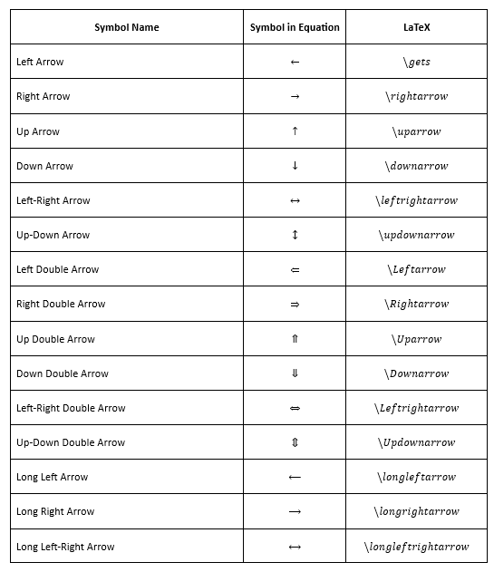
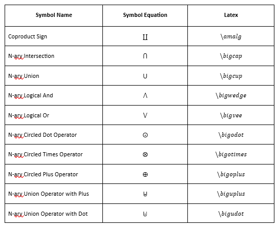
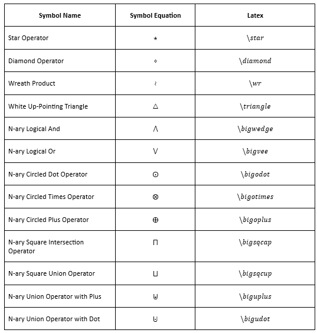

# Support LaTeX Symbols in Word Library
The .NET Word (DocIO) library allows to insert below supported symbols in equation using **LaTeX**.

## Arrows

Create **Arrow** in LaTeX.

The following image demonstrates the LaTeX equivalent to arrows.

## Basic Math

Create **Basic Math** in LaTeX.

The following image demonstrates the LaTeX equivalent to basic math.

## Geometry
Create **Geometry** in LaTeX.

The following image demonstrates the LaTeX equivalent to geometry.

## Greek Letter

### Lower Case

Create **Lower Case** in LaTeX.

The following image demonstrates the LaTeX equivalent to lower Case.

### Upper Case

Create **Upper Case** in LaTeX.

The following image demonstrates the LaTeX equivalent to upper Case.

## Letter-Like Symbols

Create **Letter-Like Symbols** in LaTeX.

The following image demonstrates the LaTeX equivalent to letter-like symbols.

## Negated Relations

Create **Negated Relations** in LaTeX.

The following image demonstrates the LaTeX equivalent to negated relations.

## Operators

### Common Binary Operators

Create **Common Binary Operators** in LaTeX.

The following image demonstrates the LaTeX equivalent to common binary operators.

### Common Relational Operators

Create **Common Relational Operators** in LaTeX.

The following image demonstrates the LaTeX equivalent to common relational operators.

### Basic N-ary Operators

Create **Basic N-ary Operators** in LaTeX.

The following image demonstrates the LaTeX equivalent to basic n-ary operators.

### Advanced Binary Operators

Create **Advanced Binary Operators** in LaTeX.

The following image demonstrates the LaTeX equivalent to advanced binary operators.

### Advanced Relational Operators

Create **Advanced Relational Operators** in LaTeX.

The following image demonstrates the LaTeX equivalent to advanced relational operators.

