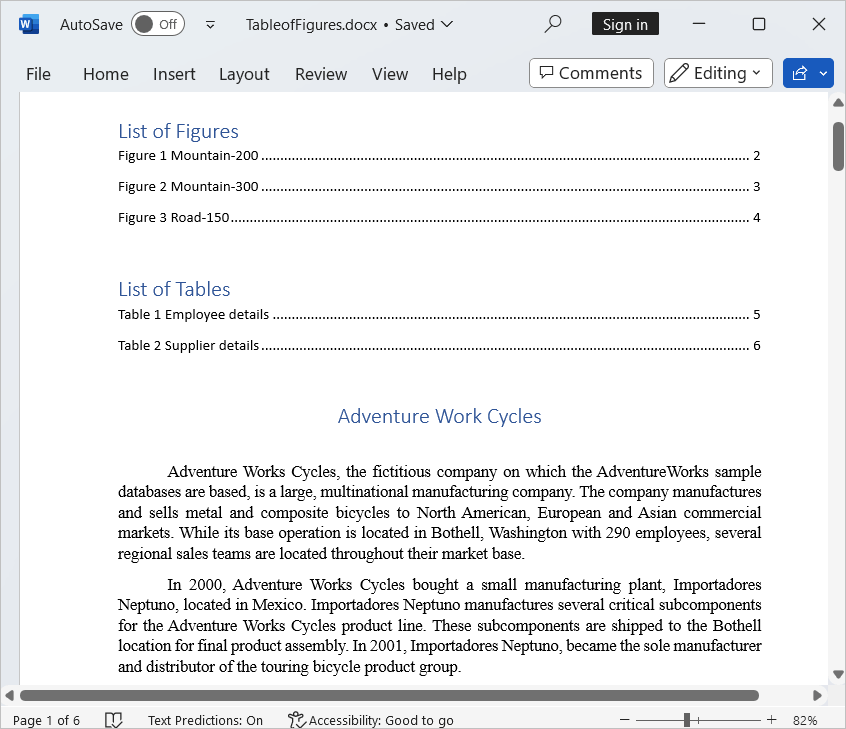
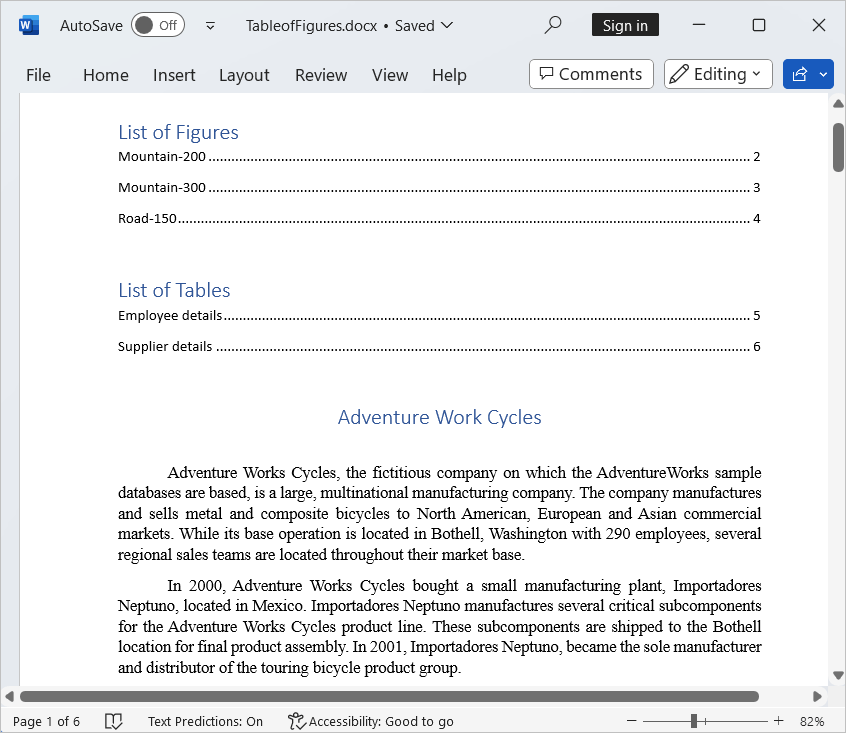

# Working with Table Of Contents

[Table of contents](https://support.microsoft.com/en-gb/office/insert-a-table-of-contents-882e8564-0edb-435e-84b5-1d8552ccf0c0?redirectSourcePath=%252fen-us%252farticle%252fCreate-a-table-of-contents-or-update-a-table-of-contents-eb275189-b93e-4559-8dd9-c279457bfd72#__create_a_table ) (TOC) is used to provide an outline of the Word document. By default table of contents will be created automatically from heading styles. 

You can add the TOC into the paragraph by specifying the [LowerHeadingLevel](https://help.syncfusion.com/cr/file-formats/Syncfusion.DocIO.DLS.TableOfContent.html#Syncfusion_DocIO_DLS_TableOfContent_LowerHeadingLevel) and [UpperHeadingLevel](https://help.syncfusion.com/cr/file-formats/Syncfusion.DocIO.DLS.TableOfContent.html#Syncfusion_DocIO_DLS_TableOfContent_UpperHeadingLevel). The heading level range must be from 1 to 9.

Basically TOC determines the TOC entries based on the TOC switches. 

 ## Switches in TOC

<table>
<thead>
<tr>
<th> S.No   </th>
<th>Switches  </th>
<th>Description  </th>
</tr>
</thead>
<tbody>
<tr>
<td>
1  </td><td>
\o  </td><td>
Builds a table of contents from paragraphs formatted with built-in heading styles.  </td></tr>
<tr>
<td>
2  </td><td>
\h  </td><td>
Inserts TOC entries as hyperlinks.  </td></tr>
<tr>
<td>
3  </td><td>
\n  </td><td>
Omits page numbers from the table of contents.   </td></tr>
<tr>
<td>
4  </td><td>
\p  </td><td>
Specifies the characters that separate a TOC entry and its page number. The default is a tab with leader dots.  </td></tr>
<tr>
<td>
5  </td><td>
\t  </td><td>
Builds a table of contents from paragraphs formatted with specified styles other than the built-in heading styles  </td></tr>
<tr>
<td>
6  </td><td>
\c  </td><td>
Builds a table fo figures of the given label.   </td></tr>
<tr>
<td>
7  </td><td>
\a  </td><td>
Builds a table fo figures but does not include the caption's label and number.   </td></tr>
</tbody>
</table>

To quickly start create and update a table of contents in Word document, please check out this video:


## Adding a TOC field

The following code example shows how to add a table of contents (TOC) in Word document.




//Creates a new Word document
WordDocument document = new WordDocument();
//Adds the section into the Word document
IWSection section = document.AddSection();
string paraText = "AdventureWorks Cycles, the fictitious company on which the AdventureWorks sample databases are based, is a large, multinational manufacturing company.";
//Adds the paragraph into the created section
IWParagraph paragraph = section.AddParagraph();
//Appends the TOC field with LowerHeadingLevel and UpperHeadingLevel to determines the TOC entries
paragraph.AppendTOC(1, 3);
//Adds the section into the Word document
section = document.AddSection();
//Adds the paragraph into the created section
paragraph = section.AddParagraph();
//Adds the text for the headings
paragraph.AppendText("First Chapter");
//Sets a built-in heading style.
paragraph.ApplyStyle(BuiltinStyle.Heading1);
//Adds the text into the paragraph
section.AddParagraph().AppendText(paraText);
//Adds the section into the Word document
section = document.AddSection();
//Adds the paragraph into the created section
paragraph = section.AddParagraph();
//Adds the text for the headings
paragraph.AppendText("Second Chapter");
//Sets a built-in heading style.
paragraph.ApplyStyle(BuiltinStyle.Heading2);
//Adds the text into the paragraph
section.AddParagraph().AppendText(paraText);
//Adds the section into the Word document
section = document.AddSection();
//Adds the paragraph into the created section
paragraph = section.AddParagraph();
//Adds the text into the headings
paragraph.AppendText("Third Chapter");
//Sets a built-in heading style
paragraph.ApplyStyle(BuiltinStyle.Heading3);
//Adds the text into the paragraph.
section.AddParagraph().AppendText(paraText);
//Updates the table of contents
document.UpdateTableOfContents();
//Saves the Word document to MemoryStream
MemoryStream stream = new MemoryStream();
document.Save(stream, FormatType.Docx);
//Closes the document
document.Close();



//Creates a new Word document
WordDocument document = new WordDocument();
//Adds the section into the Word document
IWSection section = document.AddSection();
string paraText = "AdventureWorks Cycles, the fictitious company on which the AdventureWorks sample databases are based, is a large, multinational manufacturing company.";
//Adds the paragraph into the created section
IWParagraph paragraph = section.AddParagraph();
//Appends the TOC field with LowerHeadingLevel and UpperHeadingLevel to determines the TOC entries
paragraph.AppendTOC(1, 3);
//Adds the section into the Word document
section = document.AddSection();
//Adds the paragraph into the created section
paragraph = section.AddParagraph(); 
//Adds the text for the headings
paragraph.AppendText("First Chapter");
//Sets a built-in heading style.
paragraph.ApplyStyle(BuiltinStyle.Heading1);
//Adds the text into the paragraph
section.AddParagraph().AppendText(paraText);
//Adds the section into the Word document
section = document.AddSection();
//Adds the paragraph into the created section
paragraph = section.AddParagraph();
//Adds the text for the headings
paragraph.AppendText("Second Chapter");
//Sets a built-in heading style.
paragraph.ApplyStyle(BuiltinStyle.Heading2);
//Adds the text into the paragraph
section.AddParagraph().AppendText(paraText);
//Adds the section into the Word document
section = document.AddSection();
//Adds the paragraph into the created section
paragraph = section.AddParagraph();
//Adds the text into the headings
paragraph.AppendText("Third Chapter");
//Sets a built-in heading style
paragraph.ApplyStyle(BuiltinStyle.Heading3);
//Adds the text into the paragraph.
section.AddParagraph().AppendText(paraText);
//Updates the table of contents
document.UpdateTableOfContents();
//Saves and closes the Word document instance
document.Save("Sample.docx", FormatType.Docx);
document.Close();



'Creates a new Word document
Dim document As New WordDocument()
'Adds the section into the Word document
Dim section As IWSection = document.AddSection()
Dim paraText As String = "AdventureWorks Cycles, the fictitious company on which the AdventureWorks sample databases are based, is a large, multinational manufacturing company."
'Adds the paragraph into the created section
Dim paragraph As IWParagraph = section.AddParagraph()
'Appends the TOC field with LowerHeadingLevel and UpperHeadingLevel to determines the TOC entries
paragraph.AppendTOC(1, 3)
'Adds the section into the Word document
section = document.AddSection()
'Adds the paragraph into the created section
paragraph = section.AddParagraph()
'Adds the text for the headings
paragraph.AppendText("First Chapter")
'Sets a built-in heading style
paragraph.ApplyStyle(BuiltinStyle.Heading1)
'Adds the text into the paragraph.
section.AddParagraph().AppendText(paraText)
'Adds the section into the Word document
section = document.AddSection()
'Adds the paragraph into the created section
paragraph = section.AddParagraph()
'Adds the text for the headings
paragraph.AppendText("Second Chapter")
'Sets a built-in heading style
paragraph.ApplyStyle(BuiltinStyle.Heading2)
'Adds the text into the paragraph
section.AddParagraph().AppendText(paraText)
'Adds the section into the Word document
section = document.AddSection()
'Adds the paragraph into the created section
paragraph = section.AddParagraph()
'Adds the text into the headings
paragraph.AppendText("Third Chapter")
'Sets a built-in heading style
paragraph.ApplyStyle(BuiltinStyle.Heading3)
'Adds the text into the paragraph
section.AddParagraph().AppendText(paraText)
'Updates the table of contents
document.UpdateTableOfContents()
‘Saves and closes the Word document instance
document.Save("Sample.docx", FormatType.Docx)
document.Close()



//DocIO supports Table of contents in WPF, Windows Forms platforms alone




You can download a complete working sample from [GitHub](https://github.com/SyncfusionExamples/DocIO-Examples/tree/main/Table-Of-Contents/Add-table-of-contents).

## Updating table of contents

You can also update or re-build the TOC in an existing document or document created from the scratch.  

N>  1. Updating of TOC is not supported in Silverlight, WinRT, Universal and Windows Phone applications. 
N>  2. Updating TOC makes use of the Word to PDF layout engine that may lead to update incorrect page number due to its limitations.
N>  3. In ASP.NET Core, Blazor, and Xamarin platforms, to update TOC in a Word document we recommend you to use Word to PDF [assemblies](https://help.syncfusion.com/file-formats/docio/assemblies-required#converting-word-document-to-pdf) or [NuGet](https://help.syncfusion.com/file-formats/docio/nuget-packages-required#converting-word-document-to-pdf) as a reference in your application.

The following code example shows how to update a TOC in an existing word document. 

 


//Opens an existing document from stream through constructor of WordDocument class
FileStream fileStreamPath = new FileStream("Template.docx", FileMode.Open, FileAccess.Read, FileShare.ReadWrite);
WordDocument document = new WordDocument(fileStreamPath, FormatType.Automatic);
//Updates the table of contents.
document.UpdateTableOfContents();
//Saves the Word document to MemoryStream
MemoryStream stream = new MemoryStream();
document.Save(stream, FormatType.Docx);
//Closes the document
document.Close();



//Opens an input word template
WordDocument document = new WordDocument(@”Template.docx”);
//Updates the table of contents.
document.UpdateTableOfContents();
//Saves and closes the Word document instance.
document.Save("Sample.docx", FormatType.Docx);
document.Close();



'Opens an input word template
Dim document As New WordDocument("Template.docx")
'Updates the table of contents.
document.UpdateTableOfContents()
‘Saves and closes the Word document instance.
document.Save("Sample.docx", FormatType.Docx)
document.Close()



//DocIO supports Table of contents in WPF, Windows Forms platforms alone

//Please download the helper files from the below link to save the stream as file and open the file for viewing in Xamarin platform
//https://help.syncfusion.com/file-formats/docio/create-word-document-in-xamarin#helper-files-for-xamarin


  

You can download a complete working sample from [GitHub](https://github.com/SyncfusionExamples/DocIO-Examples/tree/main/Table-Of-Contents/Update-table-of-contents).

## Creating table of contents with user-defined styles

The following code example shows how to create table of contents with user-defined styles instead of heading styles.




//Creates a new Word document
WordDocument document = new WordDocument();
//Creates a new custom styles
Style style = (WParagraphStyle)document.AddParagraphStyle("MyStyle");
style.CharacterFormat.Bold = true;
style.CharacterFormat.FontName = "Verdana";
style.CharacterFormat.FontSize = 25;
//Adds the section into the Word document
IWSection section = document.AddSection();
string paraText = "AdventureWorks Cycles, the fictitious company on which the AdventureWorks sample databases are based, is a large, multinational manufacturing company.";
//Adds the paragraph into the created section
IWParagraph paragraph = section.AddParagraph();
//Appends the TOC field with LowerHeadingLevel and UpperHeadingLevel to determines the TOC entries
TableOfContent tableOfContents = paragraph.AppendTOC(1, 3);
tableOfContents.UseHeadingStyles = false;
//Sets the TOC level style based on the created TOC 
tableOfContents.SetTOCLevelStyle(2, "MyStyle");
//Adds the section into the Word document
section = document.AddSection();
//Adds the paragraph into the created section
paragraph = section.AddParagraph();
//Adds the text for the headings
paragraph.AppendText("First Chapter");
//Sets the built-in heading style
paragraph.ApplyStyle("MyStyle");
//Adds the text into the paragraph
section.AddParagraph().AppendText(paraText);
//Adds the section into the Word document
section = document.AddSection();
//Adds the paragraph into the created section
paragraph = section.AddParagraph();
//Adds the text for the headings
paragraph.AppendText("Second Chapter");
//Sets the built-in heading style
paragraph.ApplyStyle(BuiltinStyle.Heading1);
//Adds the text to the paragraph
section.AddParagraph().AppendText(paraText);
//Adds the section into Word document
section = document.AddSection();
//Adds a paragraph to a created section
paragraph = section.AddParagraph();
//Adds the text for the headings
paragraph.AppendText("Third Chapter");
//Sets the built-in heading style
paragraph.ApplyStyle("MyStyle");
//Adds the text to the paragraph
section.AddParagraph().AppendText(paraText);
//Updates the table of contents
document.UpdateTableOfContents();
//Saves the Word document to MemoryStream
MemoryStream stream = new MemoryStream();
document.Save(stream, FormatType.Docx);
//Closes the document
document.Close();



//Creates a new Word document
WordDocument document = new WordDocument();
//Creates a new custom styles
Style style = (WParagraphStyle)document.AddParagraphStyle("MyStyle");
style.CharacterFormat.Bold = true;
style.CharacterFormat.FontName = "Verdana";
style.CharacterFormat.FontSize = 25;
//Adds the section into the Word document
IWSection section = document.AddSection();
string paraText = "AdventureWorks Cycles, the fictitious company on which the AdventureWorks sample databases are based, is a large, multinational manufacturing company.";
//Adds the paragraph into the created section
IWParagraph paragraph = section.AddParagraph();
//Appends the TOC field with LowerHeadingLevel and UpperHeadingLevel to determines the TOC entries
TableOfContent tableOfContents = paragraph.AppendTOC(1, 3);
tableOfContents.UseHeadingStyles = false;
//Sets the TOC level style based on the created TOC 
tableOfContents.SetTOCLevelStyle(2, "MyStyle");
//Adds the section into the Word document
section = document.AddSection();
//Adds the paragraph into the created section
paragraph = section.AddParagraph();
//Adds the text for the headings
paragraph.AppendText("First Chapter");
//Sets the built-in heading style
paragraph.ApplyStyle("MyStyle");
//Adds the text into the paragraph
section.AddParagraph().AppendText(paraText);
//Adds the section into the Word document
section = document.AddSection();
//Adds the paragraph into the created section
paragraph = section.AddParagraph();
//Adds the text for the headings
paragraph.AppendText("Second Chapter");
//Sets the built-in heading style
paragraph.ApplyStyle(BuiltinStyle.Heading1);
//Adds the text to the paragraph
section.AddParagraph().AppendText(paraText);
//Adds the section into Word document
section = document.AddSection();
//Adds a paragraph to a created section
paragraph = section.AddParagraph();
//Adds the text for the headings
paragraph.AppendText("Third Chapter");
//Sets the built-in heading style
paragraph.ApplyStyle("MyStyle");
//Adds the text to the paragraph
section.AddParagraph().AppendText(paraText);
//Updates the table of contents
document.UpdateTableOfContents();
//Saves and closes the Word document instance
document.Save("Sample.docx", FormatType.Docx);
document.Close();



'Creates a new Word document
Dim document As New WordDocument()
'Creates a new custom styles
Dim style As Style = DirectCast(document.AddParagraphStyle("MyStyle"), WParagraphStyle)
style.CharacterFormat.Bold = True
style.CharacterFormat.FontName = "Verdana"
style.CharacterFormat.FontSize = 25
'Adds the section into the Word document
Dim section As IWSection = document.AddSection()
Dim paraText As String = "AdventureWorks Cycles, the fictitious company on which the AdventureWorks sample databases are based, is a large, multinational manufacturing company."
'Adds the paragraph into the created section
Dim paragraph As IWParagraph = section.AddParagraph()
'Appends the TOC field with LowerHeadingLevel and UpperHeadingLevel to determine the TOC entries
Dim tableOfContents As TableOfContent = paragraph.AppendTOC(1, 3)
tableOfContents.UseHeadingStyles = False
'Sets the TOC level style based on the created TOC 
tableOfContents.SetTOCLevelStyle(2, "MyStyle")
'Adds the section into the Word document
section = document.AddSection()
'Adds the paragraph into the created section
paragraph = section.AddParagraph()
'Adds the text for the headings
paragraph.AppendText("First Chapter")
'Sets the built-in heading style
paragraph.ApplyStyle("MyStyle")
'Adds the text into the paragraph
section.AddParagraph().AppendText(paraText)
'Adds the section into the Word document
section = document.AddSection()
'Adds the paragraph into the created section
paragraph = section.AddParagraph()
'Adds the text for the headings
paragraph.AppendText("Second Chapter")
'Sets the built-in heading style
paragraph.ApplyStyle(BuiltinStyle.Heading1)
'Adds the text to the paragraph
section.AddParagraph().AppendText(paraText)
'Adds the section into Word document
section = document.AddSection()
'Adds a paragraph to created section
paragraph = section.AddParagraph()
'Adds the text for the headings
paragraph.AppendText("Third Chapter")
'Sets the built-in heading style
paragraph.ApplyStyle("My style")
'Adds the text to the paragraph
section.AddParagraph().AppendText(paraText)
'Updates the table of contents
document.UpdateTableOfContents()
‘Saves and closes the Word document instance
document.Save("Sample.docx", FormatType.Docx)
document.Close()



//DocIO supports Table of contents in WPF, Windows Forms platforms alone




You can download a complete working sample from [GitHub](https://github.com/SyncfusionExamples/DocIO-Examples/tree/main/Table-Of-Contents/TOC-with-user-defined-styles).

## Apply switches for table of contents

You can modify the preservation of TOC entries in a Word document by applying switches to the table of contents, and you can also apply switches to preserve TOC entries as hyperlinks or not, use the default heading styles, preserve page numbers or not, align the page numbers, preserve new line characters, preserve outline level paragraphs, and preserve table of entry fields in the TOC entries using Word (DocIO) library.

The following code example illustrates how to apply switches for the table of contents.




//Create a new Word document.
using (WordDocument document = new WordDocument())
{
    //Add a section to the Word document.
    IWSection section = document.AddSection();
    //Add a paragraph to the created section.
    IWParagraph paragraph = section.AddParagraph();
    //Append the TOC field with LowerHeadingLevel and UpperHeadingLevel to determine the TOC entries.
    TableOfContent tableOfContent = paragraph.AppendTOC(1, 3);
    //Set lower heading level for TOC.
    tableOfContent.LowerHeadingLevel = 2;
    //Set upper heading level for TOC.
    tableOfContent.UpperHeadingLevel = 5;
    //Enable a flag to use default heading styles in TOC entries.
    tableOfContent.UseHeadingStyles = true;
    //Enable a flag to show page numbers in TOC entries.
    tableOfContent.IncludePageNumbers = true;
    //Disable a flag to align page numbers after the TOC entries.
    tableOfContent.RightAlignPageNumbers = false;
    //Disable a flag to preserve TOC entries without hyperlinks.
    tableOfContent.UseHyperlinks = false;
    //Add a paragraph to the section.
    paragraph = section.AddParagraph();
    //Append text.
    paragraph.AppendText("First ");
    //Append line break.
    paragraph.AppendBreak(BreakType.LineBreak);
    paragraph.AppendText("Chapter");
    //Enable a flag to include newline characters in TOC entries.
    tableOfContent.IncludeNewLineCharacters = true;
    //Set a built-in heading style.
    paragraph.ApplyStyle(BuiltinStyle.Heading2);
    //Add a section to the Word document.
    section = document.AddSection();
    //Add a paragraph to the section.
    paragraph = section.AddParagraph();
    //Append text.
    paragraph.AppendText("Second ");
    paragraph.AppendText("Chapter");
    //Set a built-in heading style.
    paragraph.ApplyStyle(BuiltinStyle.Heading1);
    //Add a section to the Word document.
    section = document.AddSection();
    paragraph = section.AddParagraph();
    paragraph.AppendText("Third ");
    paragraph.AppendText("Chapter");
    //Set a built-in heading style.
    paragraph.ApplyStyle(BuiltinStyle.Heading2);
    section = document.AddSection();
    paragraph = section.AddParagraph();
    paragraph.AppendText("Fourth ");
    paragraph.AppendText("Chapter");
    //Set a built-in heading style.
    paragraph.ApplyStyle(BuiltinStyle.Heading3);
    //Add the text to the new paragraph of the section.
    section.AddParagraph().AppendText("AdventureWorks Cycles, the fictitious company on which the AdventureWorks sample databases are based, is a large, multinational manufacturing company.");
    //Add a paragraph to the section.
    paragraph = section.AddParagraph();
    //Set outline level for paragraph.
    paragraph.ParagraphFormat.OutlineLevel = OutlineLevel.Level2;
    //Append text.
    paragraph.AppendText("Outline Level Paragraph");
    //Enable a flag to consider outline level paragraphs in TOC entries.
    tableOfContent.UseOutlineLevels = true;
    //Add a section to the Word document.
    section = document.AddSection();
    //Add a paragraph to the section.
    paragraph = section.AddParagraph();
    //Append a field to the paragraph.
    paragraph.AppendField("Table of Entry Field", FieldType.FieldTOCEntry);
    //Enable a flag to use table entry fields in TOC entries.
    tableOfContent.UseTableEntryFields = true;
    //Update the table of contents.
    document.UpdateTableOfContents();
    //Saves the Word document to MemoryStream
    MemoryStream stream = new MemoryStream();
    document.Save(stream, FormatType.Docx);
    //Closes the document
    document.Close();
}



//Create a new Word document.
using (WordDocument document = new WordDocument())
{
    //Add a section to the Word document.
    IWSection section = document.AddSection();
    //Add a paragraph to the created section.
    IWParagraph paragraph = section.AddParagraph();
    //Append the TOC field with LowerHeadingLevel and UpperHeadingLevel to determine the TOC entries.
    TableOfContent tableOfContent = paragraph.AppendTOC(1, 3);
    //Set lower heading level for TOC.
    tableOfContent.LowerHeadingLevel = 2;
    //Set upper heading level for TOC.
    tableOfContent.UpperHeadingLevel = 5;
    //Enable a flag to use default heading styles in TOC entries.
    tableOfContent.UseHeadingStyles = true;
    //Enable a flag to show page numbers in TOC entries.
    tableOfContent.IncludePageNumbers = true;
    //Disable a flag to align page numbers after the TOC entries.
    tableOfContent.RightAlignPageNumbers = false;
    //Disable a flag to preserve TOC entries without hyperlinks.
    tableOfContent.UseHyperlinks = false;
    //Add a paragraph to the section.
    paragraph = section.AddParagraph();
    //Append text.
    paragraph.AppendText("First ");
    //Append line break.
    paragraph.AppendBreak(BreakType.LineBreak);
    paragraph.AppendText("Chapter");
    //Enable a flag to include newline characters in TOC entries.
    tableOfContent.IncludeNewLineCharacters = true;
    //Set a built-in heading style.
    paragraph.ApplyStyle(BuiltinStyle.Heading2);
    //Add a section to the Word document.
    section = document.AddSection();
    //Add a paragraph to the section.
    paragraph = section.AddParagraph();
    //Append text.
    paragraph.AppendText("Second ");
    paragraph.AppendText("Chapter");
    //Set a built-in heading style.
    paragraph.ApplyStyle(BuiltinStyle.Heading1);
    //Add a section to the Word document.
    section = document.AddSection();
    paragraph = section.AddParagraph();
    paragraph.AppendText("Third ");
    paragraph.AppendText("Chapter");
    //Set a built-in heading style.
    paragraph.ApplyStyle(BuiltinStyle.Heading2);
    section = document.AddSection();
    paragraph = section.AddParagraph();
    paragraph.AppendText("Fourth ");
    paragraph.AppendText("Chapter");
    //Set a built-in heading style.
    paragraph.ApplyStyle(BuiltinStyle.Heading3);
    //Add the text to the new paragraph of the section.
    section.AddParagraph().AppendText("AdventureWorks Cycles, the fictitious company on which the AdventureWorks sample databases are based, is a large, multinational manufacturing company.");
    //Add a paragraph to the section.
    paragraph = section.AddParagraph();
    //Set outline level for paragraph.
    paragraph.ParagraphFormat.OutlineLevel = OutlineLevel.Level2;
    //Append text.
    paragraph.AppendText("Outline Level Paragraph");
    //Enable a flag to consider outline level paragraphs in TOC entries.
    tableOfContent.UseOutlineLevels = true;
    //Add a section to the Word document.
    section = document.AddSection();
    //Add a paragraph to the section.
    paragraph = section.AddParagraph();
    //Append a field to the paragraph.
    paragraph.AppendField("Table of Entry Field", FieldType.FieldTOCEntry);
    //Enable a flag to use table entry fields in TOC entries.
    tableOfContent.UseTableEntryFields = true;
    //Update the table of contents.
    document.UpdateTableOfContents();
    //Save a Word document.
    document.Save("Sample.docx");
}



'Create a new Word document.
Using document As WordDocument = New WordDocument()
    'Add a section into the Word document.
    Dim section As IWSection = document.AddSection()
    'Add a paragraph into the created section.
    Dim paragraph As IWParagraph = section.AddParagraph()
    'Append the TOC field with LowerHeadingLevel and UpperHeadingLevel to determines the TOC entries.
    Dim tableOfContent As TableOfContent = paragraph.AppendTOC(1, 3)
    'Set lower heading level for TOC.
    tableOfContent.LowerHeadingLevel = 2
    'Set upper heading level for TOC.
    tableOfContent.UpperHeadingLevel = 5
    'Enable a flag to use default heading styles in TOC entries.
    tableOfContent.UseHeadingStyles = True
    'Enable a flag to show page numbers in TOC entries.
    tableOfContent.IncludePageNumbers = True
    'Disable a flag to align page numbers after to the TOC entries.
    tableOfContent.RightAlignPageNumbers = False
    'Disable a flag to preserve TOC entries without hyperlinks.
    tableOfContent.UseHyperlinks = False
    'Add a paragraph into the section.
    paragraph = section.AddParagraph()
    'Append text.
    paragraph.AppendText("First ")
    'Append line break.
    paragraph.AppendBreak(BreakType.LineBreak)
    paragraph.AppendText("Chapter")
    'Enable a flag to include new line characters in TOC entries.
    tableOfContent.IncludeNewLineCharacters = True
    'Set a built-in heading style.
    paragraph.ApplyStyle(BuiltinStyle.Heading2)
    'Add a section into the Word document.
    section = document.AddSection()
    'Add a paragraph to the section.
    paragraph = section.AddParagraph()
    'Append text.
    paragraph.AppendText("Second ")
    paragraph.AppendText("Chapter")
    'Sets a built-in heading style.
    paragraph.ApplyStyle(BuiltinStyle.Heading1)
    'Add a section into the Word document.
    section = document.AddSection()
    paragraph = section.AddParagraph()
    paragraph.AppendText("Third ")
    paragraph.AppendText("Chapter")
    'Set a built-in heading style.
    paragraph.ApplyStyle(BuiltinStyle.Heading2)
    section = document.AddSection()
    paragraph = section.AddParagraph()
    paragraph.AppendText("Fourth ")
    paragraph.AppendText("Chapter")
    'Set a built-in heading style.
    paragraph.ApplyStyle(BuiltinStyle.Heading3)
    'Add the text into the new paragraph of the section.
    section.AddParagraph().AppendText("AdventureWorks Cycles, the fictitious company on which the AdventureWorks sample databases are based, is a large, multinational manufacturing company.")
    'Add a paragraph to the section.
    paragraph = section.AddParagraph()
    'Set outline level for paragraph.
    paragraph.ParagraphFormat.OutlineLevel = OutlineLevel.Level2
    'Append text.
    paragraph.AppendText("Outline Level Paragraph")
    'Enable a flag to consider outline level paragraphs in TOC entries.
    tableOfContent.UseOutlineLevels = True
    'Add a section into the Word document.
    section = document.AddSection()
    'Add a paragraph to the section.
    paragraph = section.AddParagraph()
    'Append a field to the paragraph.
    paragraph.AppendField("Table of Entry Field", FieldType.FieldTOCEntry)
    'Enable a flag to use table entry fields in TOC entries.
    tableOfContent.UseTableEntryFields = True
    'Update the table of content.
    document.UpdateTableOfContents()
    'Save a Word document.
    document.Save("Sample.docx")
End Using



//DocIO doesn't support updating table of contents in UWP platform.




## Table of Figures 

The following code example illustrates how to add a table of figures in Word document using TableOfFiguresLabel API.




using (FileStream fileStream = new FileStream("Input.docx", FileMode.Open, FileAccess.Read))
{
    using (WordDocument document = new WordDocument(fileStream, FormatType.Docx))
    {
        WParagraph paragraph = new WParagraph(document);
        paragraph.AppendText("List of Figures");
        //Apply Heading1 style for paragraph.
        paragraph.ApplyStyle(BuiltinStyle.Heading1);
        //Insert the paragraph 
        document.LastSection.Body.ChildEntities.Insert(0, paragraph);
        //Create new paragraph and append TOC 
        paragraph = new WParagraph(document);
        TableOfContent tableOfContent = paragraph.AppendTOC(1, 3);
        //Disable a flag to exclude heading style paragraphs in TOC entries.
        tableOfContent.UseHeadingStyles = false;
        //Set the name of SEQ field identifier for table of figures.
        tableOfContent.TableOfFiguresLabel = "Figure";
        //Insert the paragraph to the text body.
        document.LastSection.Body.ChildEntities.Insert(1, paragraph);

        //Find all pictures from the document
        List<Entity> pictures = document.FindAllItemsByProperty(EntityType.Picture, null, null);
        // Iterate each picture and add caption.
        foreach (WPicture picture in pictures)
        {
            //Set alternate text as caption for picture.
            WParagraph captionPara = picture.AddCaption("Figure", CaptionNumberingFormat.Number, CaptionPosition.AfterImage) as WParagraph;
            captionPara.AppendText(" " + picture.AlternativeText);
            //Apply formatting to the caption.
            captionPara.ApplyStyle(BuiltinStyle.Caption);
            captionPara.ParagraphFormat.BeforeSpacing = 8;
            captionPara.ParagraphFormat.HorizontalAlignment = HorizontalAlignment.Center;
        }

        // Create a new paragraph
        paragraph = new WParagraph(document);
        paragraph.AppendText("List of Tables");
        // Apply Heading1 style for paragraph.
        paragraph.ApplyStyle(BuiltinStyle.Heading1);
        // Insert the paragraph
        document.LastSection.Body.ChildEntities.Insert(2, paragraph);

        //Create a new paragraph and append TOC.
        paragraph = new WParagraph(document);
        tableOfContent = paragraph.AppendTOC(1, 3);
        //Disable a flag to exclude heading style paragraphs in TOC entries.
        tableOfContent.UseHeadingStyles = false;
        //Set the name of SEQ field identifier for table of tables.
        tableOfContent.TableOfFiguresLabel = "Table";
        // Insert the paragraph to the text body.
        document.LastSection.Body.ChildEntities.Insert(3, paragraph);

        // Find all tables from the document
        List<Entity> tables = document.FindAllItemsByProperty(EntityType.Table, null, null);
        //Iterate each table and add caption.
        foreach (WTable table in tables)
        {
            //Gets the table index
            int tableIndex = table.OwnerTextBody.ChildEntities.IndexOf(table);
            //Create a new paragraph and appends the sequence field to use as a caption.
            WParagraph captionPara = new WParagraph(document);
            captionPara.AppendText("Table ");
            captionPara.AppendField("Table", FieldType.FieldSequence);
            //Set alternate text as caption for table.
            captionPara.AppendText(" " + table.Description);
            // Apply formatting to the paragraph
            captionPara.ApplyStyle(BuiltinStyle.Caption);
            captionPara.ParagraphFormat.BeforeSpacing = 8;
            captionPara.ParagraphFormat.HorizontalAlignment = HorizontalAlignment.Center;
            //Insert the paragraph next to the table
            table.OwnerTextBody.ChildEntities.Insert(tableIndex + 1, captionPara);
        }

        //Update all document fields to update SEQ fields.
        document.UpdateDocumentFields();
        //Update the table of contents.
        document.UpdateTableOfContents();

        //Create a FileStream to save the Word file.
        using (FileStream outputStream = new FileStream("Output.docx", FileMode.Create, FileAccess.ReadWrite, FileShare.ReadWrite))
        {
            //Save the Word document.
            document.Save(outputStream, FormatType.Docx);
        }
    }        
}




//Open an existing word document.
using (WordDocument document = new WordDocument("Input.docx",FormatType.Docx))
{
    //Create a new paragraph
    WParagraph paragraph = new WParagraph(document);
    paragraph.AppendText("List of Figures");
    //Apply Heading1 style for paragraph.
    paragraph.ApplyStyle(BuiltinStyle.Heading1);
    //Insert the paragraph. 
    document.LastSection.Body.ChildEntities.Insert(0, paragraph);

    //Create new paragraph and append TOC. 
    paragraph = new WParagraph(document);
    TableOfContent tableOfContent = paragraph.AppendTOC(1, 3);
    //Disable a flag to exclude heading style paragraphs in TOC entries.
    tableOfContent.UseHeadingStyles = false;
    //Set the name of SEQ field identifier for table of figures.
    tableOfContent.TableOfFiguresLabel = "Figure";
    //Insert the paragraph to the text body.
    document.LastSection.Body.ChildEntities.Insert(1, paragraph);

    //Find all pictures from the document.
    List<Entity> pictures = document.FindAllItemsByProperty(EntityType.Picture, null, null);
    // Iterate each picture and add caption.
    foreach (WPicture picture in pictures)
    {
        //Set alternate text as caption for picture.
        WParagraph captionPara = picture.AddCaption("Figure", CaptionNumberingFormat.Number, CaptionPosition.AfterImage) as WParagraph;
        captionPara.AppendText(" " + picture.AlternativeText);
        //Apply formatting to the caption.
        captionPara.ApplyStyle(BuiltinStyle.Caption);
        captionPara.ParagraphFormat.BeforeSpacing = 8;
        captionPara.ParagraphFormat.HorizontalAlignment = HorizontalAlignment.Center;
    }

    // Create a new paragraph.
    paragraph = new WParagraph(document);
    paragraph.AppendText("List of Tables");
    // Apply Heading1 style for paragraph.
    paragraph.ApplyStyle(BuiltinStyle.Heading1);
    // Insert the paragraph.
    document.LastSection.Body.ChildEntities.Insert(2, paragraph);

    //Create a new paragraph and append TOC.
    paragraph = new WParagraph(document);
    tableOfContent = paragraph.AppendTOC(1, 3);
    //Disable a flag to exclude heading style paragraphs in TOC entries.
    tableOfContent.UseHeadingStyles = false;
    //Set the name of SEQ field identifier for table of tables.
    tableOfContent.TableOfFiguresLabel = "Table";
    // Insert the paragraph to the text body.
    document.LastSection.Body.ChildEntities.Insert(3, paragraph);

    // Find all tables from the document.
    List<Entity> tables = document.FindAllItemsByProperty(EntityType.Table, null, null);
    //Iterate each table and add caption.
    foreach (WTable table in tables)
    {
        //Gets the table index.
        int tableIndex = table.OwnerTextBody.ChildEntities.IndexOf(table);
        //Create a new paragraph and appends the sequence field to use as a caption.
        WParagraph captionPara = new WParagraph(document);
        captionPara.AppendText("Table ");
        captionPara.AppendField("Table", FieldType.FieldSequence);
        //Set alternate text as caption for table.
        captionPara.AppendText(" " + table.Description);
        // Apply formatting to the paragraph.
        captionPara.ApplyStyle(BuiltinStyle.Caption);
        captionPara.ParagraphFormat.BeforeSpacing = 8;
        captionPara.ParagraphFormat.HorizontalAlignment = HorizontalAlignment.Center;
        //Insert the paragraph next to the table.
        table.OwnerTextBody.ChildEntities.Insert(tableIndex + 1, captionPara);
    }

    //Update all document fields to update SEQ fields.
    document.UpdateDocumentFields();
    //Update the table of contents.
    document.UpdateTableOfContents();

    //Save the Word document.
    document.Save("Output.docx");
}




' Open an existing word document.
Using document As New WordDocument("Input.docx", FormatType.Docx)
    ' Create a new paragraph
    Dim paragraph As New WParagraph(document)
    paragraph.AppendText("List of Figures")
    ' Apply Heading1 style for paragraph.
    paragraph.ApplyStyle(BuiltinStyle.Heading1)
    ' Insert the paragraph. 
    document.LastSection.Body.ChildEntities.Insert(0, paragraph)

    ' Create new paragraph and append TOC. 
    paragraph = New WParagraph(document)
    Dim tableOfContent As TableOfContent = paragraph.AppendTOC(1, 3)
    ' Disable a flag to exclude heading style paragraphs in TOC entries.
    tableOfContent.UseHeadingStyles = False
    ' Set the name of SEQ field identifier for table of figures.
    tableOfContent.TableOfFiguresLabel = "Figure"
    ' Insert the paragraph to the text body.
    document.LastSection.Body.ChildEntities.Insert(1, paragraph)

    ' Find all pictures from the document.
    Dim pictures As List(Of Entity) = document.FindAllItemsByProperty(EntityType.Picture, Nothing, Nothing)
    ' Iterate each picture and add caption.
    For Each picture As WPicture In pictures
        ' Set alternate text as caption for picture.
        Dim captionPara As WParagraph = TryCast(picture.AddCaption("Figure", CaptionNumberingFormat.Number, CaptionPosition.AfterImage), WParagraph)
        captionPara.AppendText(" " + picture.AlternativeText)
        ' Apply formatting to the caption.
        captionPara.ApplyStyle(BuiltinStyle.Caption)
        captionPara.ParagraphFormat.BeforeSpacing = 8
        captionPara.ParagraphFormat.HorizontalAlignment = HorizontalAlignment.Center
    Next

    ' Create a new paragraph.
    paragraph = New WParagraph(document)
    paragraph.AppendText("List of Tables")
    ' Apply Heading1 style for paragraph.
    paragraph.ApplyStyle(BuiltinStyle.Heading1)
    ' Insert the paragraph.
    document.LastSection.Body.ChildEntities.Insert(2, paragraph)

    ' Create a new paragraph and append TOC.
    paragraph = New WParagraph(document)
    tableOfContent = paragraph.AppendTOC(1, 3)
    ' Disable a flag to exclude heading style paragraphs in TOC entries.
    tableOfContent.UseHeadingStyles = False
    ' Set the name of SEQ field identifier for table of tables.
    tableOfContent.TableOfFiguresLabel = "Table"
    ' Insert the paragraph to the text body.
    document.LastSection.Body.ChildEntities.Insert(3, paragraph)

    ' Find all tables from the document.
    Dim tables As List(Of Entity) = document.FindAllItemsByProperty(EntityType.Table, Nothing, Nothing)
    ' Iterate each table and add caption.
    For Each table As WTable In tables
        ' Gets the table index.
        Dim tableIndex As Integer = table.OwnerTextBody.ChildEntities.IndexOf(table)
        ' Create a new paragraph and appends the sequence field to use as a caption.
        Dim captionPara As New WParagraph(document)
        captionPara.AppendText("Table ")
        captionPara.AppendField("Table", FieldType.FieldSequence)
        ' Set alternate text as caption for table.
        captionPara.AppendText(" " + table.Description)
        ' Apply formatting to the paragraph.
        captionPara.ApplyStyle(BuiltinStyle.Caption)
        captionPara.ParagraphFormat.BeforeSpacing = 8
        captionPara.ParagraphFormat.HorizontalAlignment = HorizontalAlignment.Center
        ' Insert the paragraph next to the table.
        table.OwnerTextBody.ChildEntities.Insert(tableIndex + 1, captionPara)
    Next

    ' Update all document fields to update SEQ fields.
    document.UpdateDocumentFields()
    ' Update the table of contents.
    document.UpdateTableOfContents()

    ' Save the document
    document.Save("Output.docx")
End Using




By executing the program, you will get the **Word document** as follows.

### Exclude caption label and numbers

The following code example illustrates how to add a table of figures by exclude the caption's label and number in Word document using IncludeCaptionLabelsAndNumbers API.




using (FileStream fileStream = new FileStream("Input.docx", FileMode.Open, FileAccess.Read))
{
    using (WordDocument document = new WordDocument(fileStream, FormatType.Docx))
    {
        WParagraph paragraph = new WParagraph(document);
        paragraph.AppendText("List of Figures");
        //Apply Heading1 style for paragraph.
        paragraph.ApplyStyle(BuiltinStyle.Heading1);
        //Insert the paragraph 
        document.LastSection.Body.ChildEntities.Insert(0, paragraph);
        //Create new paragraph and append TOC 
        paragraph = new WParagraph(document);
        TableOfContent tableOfContent = paragraph.AppendTOC(1, 3);
        //Disable a flag to exclude heading style paragraphs in TOC entries.
        tableOfContent.UseHeadingStyles = false;
        //Set the name of SEQ field identifier for table of figures.
        tableOfContent.TableOfFiguresLabel = "Figure";
        //Disable the flag, to exclude caption's label and number in TOC entries.
        tableOfContent.IncludeCaptionLabelsAndNumbers = false;
        //Insert the paragraph to the text body.
        document.LastSection.Body.ChildEntities.Insert(1, paragraph);

        //Find all pictures from the document
        List<Entity> pictures = document.FindAllItemsByProperty(EntityType.Picture, null, null);
        // Iterate each picture and add caption.
        foreach (WPicture picture in pictures)
        {
            //Set alternate text as caption for picture.
            WParagraph captionPara = picture.AddCaption("Figure", CaptionNumberingFormat.Number, CaptionPosition.AfterImage) as WParagraph;
            captionPara.AppendText(" " + picture.AlternativeText);
            //Apply formatting to the caption.
            captionPara.ApplyStyle(BuiltinStyle.Caption);
            captionPara.ParagraphFormat.BeforeSpacing = 8;
            captionPara.ParagraphFormat.HorizontalAlignment = HorizontalAlignment.Center;
        }

        // Create a new paragraph
        paragraph = new WParagraph(document);
        paragraph.AppendText("List of Tables");
        // Apply Heading1 style for paragraph.
        paragraph.ApplyStyle(BuiltinStyle.Heading1);
        // Insert the paragraph
        document.LastSection.Body.ChildEntities.Insert(2, paragraph);

        //Create a new paragraph and append TOC.
        paragraph = new WParagraph(document);
        tableOfContent = paragraph.AppendTOC(1, 3);
        //Disable a flag to exclude heading style paragraphs in TOC entries.
        tableOfContent.UseHeadingStyles = false;
        //Set the name of SEQ field identifier for table of tables.
        tableOfContent.TableOfFiguresLabel = "Table";
        //Disable the flag, to exclude caption's label and number in TOC entries.
        tableOfContent.IncludeCaptionLabelsAndNumbers = false;
        // Insert the paragraph to the text body.
        document.LastSection.Body.ChildEntities.Insert(3, paragraph);

        // Find all tables from the document
        List<Entity> tables = document.FindAllItemsByProperty(EntityType.Table, null, null);
        //Iterate each table and add caption.
        foreach (WTable table in tables)
        {
            //Gets the table index
            int tableIndex = table.OwnerTextBody.ChildEntities.IndexOf(table);
            //Create a new paragraph and appends the sequence field to use as a caption.
            WParagraph captionPara = new WParagraph(document);
            captionPara.AppendText("Table ");
            captionPara.AppendField("Table", FieldType.FieldSequence);
            //Set alternate text as caption for table.
            captionPara.AppendText(" " + table.Description);
            // Apply formatting to the paragraph
            captionPara.ApplyStyle(BuiltinStyle.Caption);
            captionPara.ParagraphFormat.BeforeSpacing = 8;
            captionPara.ParagraphFormat.HorizontalAlignment = HorizontalAlignment.Center;
            //Insert the paragraph next to the table
            table.OwnerTextBody.ChildEntities.Insert(tableIndex + 1, captionPara);
        }

        //Update all document fields to update SEQ fields.
        document.UpdateDocumentFields();
        //Update the table of contents.
        document.UpdateTableOfContents();

        //Create a FileStream to save the Word file.
        using (FileStream outputStream = new FileStream("Output.docx", FileMode.Create, FileAccess.ReadWrite, FileShare.ReadWrite))
        {
            //Save the Word document.
            document.Save(outputStream, FormatType.Docx);
        }
    }        
}




//Open an existing word document.
using (WordDocument document = new WordDocument("Input.docx",FormatType.Docx))
{
    //Create a new paragraph
    WParagraph paragraph = new WParagraph(document);
    paragraph.AppendText("List of Figures");
    //Apply Heading1 style for paragraph.
    paragraph.ApplyStyle(BuiltinStyle.Heading1);
    //Insert the paragraph. 
    document.LastSection.Body.ChildEntities.Insert(0, paragraph);

    //Create new paragraph and append TOC. 
    paragraph = new WParagraph(document);
    TableOfContent tableOfContent = paragraph.AppendTOC(1, 3);
    //Disable a flag to exclude heading style paragraphs in TOC entries.
    tableOfContent.UseHeadingStyles = false;
    //Set the name of SEQ field identifier for table of figures.
    tableOfContent.TableOfFiguresLabel = "Figure";
    //Disable the flag, to exclude caption's label and number in TOC entries.
    tableOfContent.IncludeCaptionLabelsAndNumbers = false;
    //Insert the paragraph to the text body.
    document.LastSection.Body.ChildEntities.Insert(1, paragraph);

    //Find all pictures from the document.
    List<Entity> pictures = document.FindAllItemsByProperty(EntityType.Picture, null, null);
    // Iterate each picture and add caption.
    foreach (WPicture picture in pictures)
    {
        //Set alternate text as caption for picture.
        WParagraph captionPara = picture.AddCaption("Figure", CaptionNumberingFormat.Number, CaptionPosition.AfterImage) as WParagraph;
        captionPara.AppendText(" " + picture.AlternativeText);
        //Apply formatting to the caption.
        captionPara.ApplyStyle(BuiltinStyle.Caption);
        captionPara.ParagraphFormat.BeforeSpacing = 8;
        captionPara.ParagraphFormat.HorizontalAlignment = HorizontalAlignment.Center;
    }

    // Create a new paragraph.
    paragraph = new WParagraph(document);
    paragraph.AppendText("List of Tables");
    // Apply Heading1 style for paragraph.
    paragraph.ApplyStyle(BuiltinStyle.Heading1);
    // Insert the paragraph.
    document.LastSection.Body.ChildEntities.Insert(2, paragraph);

    //Create a new paragraph and append TOC.
    paragraph = new WParagraph(document);
    tableOfContent = paragraph.AppendTOC(1, 3);
    //Disable a flag to exclude heading style paragraphs in TOC entries.
    tableOfContent.UseHeadingStyles = false;
    //Set the name of SEQ field identifier for table of tables.
    tableOfContent.TableOfFiguresLabel = "Table";
    //Disable the flag, to exclude caption's label and number in TOC entries.
    tableOfContent.IncludeCaptionLabelsAndNumbers = false;
    // Insert the paragraph to the text body.
    document.LastSection.Body.ChildEntities.Insert(3, paragraph);

    // Find all tables from the document.
    List<Entity> tables = document.FindAllItemsByProperty(EntityType.Table, null, null);
    //Iterate each table and add caption.
    foreach (WTable table in tables)
    {
        //Gets the table index.
        int tableIndex = table.OwnerTextBody.ChildEntities.IndexOf(table);
        //Create a new paragraph and appends the sequence field to use as a caption.
        WParagraph captionPara = new WParagraph(document);
        captionPara.AppendText("Table ");
        captionPara.AppendField("Table", FieldType.FieldSequence);
        //Set alternate text as caption for table.
        captionPara.AppendText(" " + table.Description);
        // Apply formatting to the paragraph.
        captionPara.ApplyStyle(BuiltinStyle.Caption);
        captionPara.ParagraphFormat.BeforeSpacing = 8;
        captionPara.ParagraphFormat.HorizontalAlignment = HorizontalAlignment.Center;
        //Insert the paragraph next to the table.
        table.OwnerTextBody.ChildEntities.Insert(tableIndex + 1, captionPara);
    }

    //Update all document fields to update SEQ fields.
    document.UpdateDocumentFields();
    //Update the table of contents.
    document.UpdateTableOfContents();

    //Save the Word document.
    document.Save("Output.docx");
}




' Open an existing word document.
Using document As New WordDocument("Input.docx", FormatType.Docx)
    ' Create a new paragraph
    Dim paragraph As New WParagraph(document)
    paragraph.AppendText("List of Figures")
    ' Apply Heading1 style for paragraph.
    paragraph.ApplyStyle(BuiltinStyle.Heading1)
    ' Insert the paragraph. 
    document.LastSection.Body.ChildEntities.Insert(0, paragraph)

    ' Create new paragraph and append TOC. 
    paragraph = New WParagraph(document)
    Dim tableOfContent As TableOfContent = paragraph.AppendTOC(1, 3)
    ' Disable a flag to exclude heading style paragraphs in TOC entries.
    tableOfContent.UseHeadingStyles = False
    ' Set the name of SEQ field identifier for table of figures.
    tableOfContent.TableOfFiguresLabel = "Figure"
    ' Disable the flag, to exclude caption's label and number in TOC entries.
    tableOfContent.IncludeCaptionLabelsAndNumbers = False
    ' Insert the paragraph to the text body.
    document.LastSection.Body.ChildEntities.Insert(1, paragraph)

    ' Find all pictures from the document.
    Dim pictures As List(Of Entity) = document.FindAllItemsByProperty(EntityType.Picture, Nothing, Nothing)
    ' Iterate each picture and add caption.
    For Each picture As WPicture In pictures
        ' Set alternate text as caption for picture.
        Dim captionPara As WParagraph = TryCast(picture.AddCaption("Figure", CaptionNumberingFormat.Number, CaptionPosition.AfterImage), WParagraph)
        captionPara.AppendText(" " + picture.AlternativeText)
        ' Apply formatting to the caption.
        captionPara.ApplyStyle(BuiltinStyle.Caption)
        captionPara.ParagraphFormat.BeforeSpacing = 8
        captionPara.ParagraphFormat.HorizontalAlignment = HorizontalAlignment.Center
    Next

    ' Create a new paragraph.
    paragraph = New WParagraph(document)
    paragraph.AppendText("List of Tables")
    ' Apply Heading1 style for paragraph.
    paragraph.ApplyStyle(BuiltinStyle.Heading1)
    ' Insert the paragraph.
    document.LastSection.Body.ChildEntities.Insert(2, paragraph)

    ' Create a new paragraph and append TOC.
    paragraph = New WParagraph(document)
    tableOfContent = paragraph.AppendTOC(1, 3)
    ' Disable a flag to exclude heading style paragraphs in TOC entries.
    tableOfContent.UseHeadingStyles = False
    ' Set the name of SEQ field identifier for table of tables.
    tableOfContent.TableOfFiguresLabel = "Table"
    ' Disable the flag, to exclude caption's label and number in TOC entries.
    tableOfContent.IncludeCaptionLabelsAndNumbers = False
    ' Insert the paragraph to the text body.
    document.LastSection.Body.ChildEntities.Insert(3, paragraph)

    ' Find all tables from the document.
    Dim tables As List(Of Entity) = document.FindAllItemsByProperty(EntityType.Table, Nothing, Nothing)
    ' Iterate each table and add caption.
    For Each table As WTable In tables
        ' Gets the table index.
        Dim tableIndex As Integer = table.OwnerTextBody.ChildEntities.IndexOf(table)
        ' Create a new paragraph and appends the sequence field to use as a caption.
        Dim captionPara As New WParagraph(document)
        captionPara.AppendText("Table ")
        captionPara.AppendField("Table", FieldType.FieldSequence)
        ' Set alternate text as caption for table.
        captionPara.AppendText(" " + table.Description)
        ' Apply formatting to the paragraph.
        captionPara.ApplyStyle(BuiltinStyle.Caption)
        captionPara.ParagraphFormat.BeforeSpacing = 8
        captionPara.ParagraphFormat.HorizontalAlignment = HorizontalAlignment.Center
        ' Insert the paragraph next to the table.
        table.OwnerTextBody.ChildEntities.Insert(tableIndex + 1, captionPara)
    Next

    ' Update all document fields to update SEQ fields.
    document.UpdateDocumentFields()
    ' Update the table of contents.
    document.UpdateTableOfContents()

    ' Save the document
    document.Save("Output.docx")
End Using




By executing the program, you will get the **Word document** as follows.

 
## See Also

* [How to change the text of TOC Entries in the Table of content in the Word document?](https://support.syncfusion.com/kb/article/11503/how-to-change-the-text-of-toc-entries-in-the-table-of-content-in-the-word-document)
* [How to change tab leader of Table Of Contents in Word document](https://support.syncfusion.com/kb/article/11185/how-to-change-tab-leader-of-table-of-contents-in-word-document)
* [How to customize the TOC entries style in Word document?](https://support.syncfusion.com/kb/article/11925/how-to-customize-the-toc-entries-style-in-word-document)
