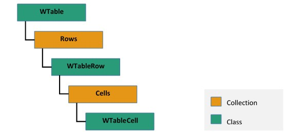

# Working with Tables in Word document

A table in Word document is used to arrange document content in rows and columns. `WTable` instance represents a table in Word document. A table must contain at least one row.

1. A row is a collection of cells and it is represented by an instance of `WTableRow`. Each row must contain at least one cell.
2. A cell can contain one or more paragraphs and tables. An instance of `WTableCell` represents a table cell. Each table cell must contain at least one paragraph.

N> Adding more than 63 columns not supported in Word document using Microsoft Word application. It shows alert when you attempt to insert table with more than 64 columns, which is a one of the behaviors of Microsoft Word and Essential DocIO does the same.

The following image illustrates how a table in Word document is organized in EssentialDocIO’s DOM:

The following code example illustrates how to create a simple table with predefined number of rows and cells.

  


//Creates an instance of WordDocument class 
WordDocument document = new WordDocument();
//Adds a section into Word document
IWSection section = document.AddSection();
//Adds a new paragraph into Word document and appends text into paragraph
IWTextRange textRange = section.AddParagraph().AppendText("Price Details");
textRange.CharacterFormat.FontName = "Arial";
textRange.CharacterFormat.FontSize = 12;
textRange.CharacterFormat.Bold = true;
section.AddParagraph();
//Adds a new table into Word document
IWTable table = section.AddTable();
//Specifies the total number of rows & columns
table.ResetCells(3, 2);
//Accesses the instance of the cell (first row, first cell) and adds the content into cell
textRange = table[0, 0].AddParagraph().AppendText("Item");
textRange.CharacterFormat.FontName = "Arial";
textRange.CharacterFormat.FontSize = 12;
textRange.CharacterFormat.Bold = true;
//Accesses the instance of the cell (first row, second cell) and adds the content into cell
textRange = table[0, 1].AddParagraph().AppendText("Price($)");
textRange.CharacterFormat.FontName = "Arial";
textRange.CharacterFormat.FontSize = 12;
textRange.CharacterFormat.Bold = true;
//Accesses the instance of the cell (second row, first cell) and adds the content into cell
textRange = table[1, 0].AddParagraph().AppendText("Apple");
textRange.CharacterFormat.FontName = "Arial";
textRange.CharacterFormat.FontSize = 10;
//Accesses the instance of the cell (second row, second cell) and adds the content into cell
textRange = table[1, 1].AddParagraph().AppendText("50");
textRange.CharacterFormat.FontName = "Arial";
textRange.CharacterFormat.FontSize = 10;
//Accesses the instance of the cell (third row, first cell) and adds the content into cell
textRange = table[2, 0].AddParagraph().AppendText("Orange");
textRange.CharacterFormat.FontName = "Arial";
textRange.CharacterFormat.FontSize = 10;
//Accesses the instance of the cell (third row, second cell) and adds the content into cell
textRange = table[2, 1].AddParagraph().AppendText("30");
textRange.CharacterFormat.FontName = "Arial";
textRange.CharacterFormat.FontSize = 10;
//Saves the document in the given name and format
document.Save("Table.docx", FormatType.Docx);
//Releases the resources occupied by WordDocument instance
document.Close();



'Creates an instance of WordDocument class 
Dim document As New WordDocument()
'Adds a section into Word document
Dim section As IWSection = document.AddSection()
'Adds a new paragraph into Word document and appends text into paragraph
Dim textRange As IWTextRange = section.AddParagraph().AppendText("Price Details")
textRange.CharacterFormat.FontName = "Arial"
textRange.CharacterFormat.FontSize = 12
textRange.CharacterFormat.Bold = True
section.AddParagraph()
'Adds a new table into Word document
Dim table As IWTable = section.AddTable()
'Specifies the total number of rows and columns
table.ResetCells(3, 2)
'Accesses the instance of the cell (first row, first cell) and adds the content into cell
textRange = table(0, 0).AddParagraph().AppendText("Item")
textRange.CharacterFormat.FontName = "Arial"
textRange.CharacterFormat.FontSize = 12
textRange.CharacterFormat.Bold = True
'Accesses the instance of the cell (first row, second cell) and adds the content into cell
textRange = table(0, 1).AddParagraph().AppendText("Price($)")
textRange.CharacterFormat.FontName = "Arial"
textRange.CharacterFormat.FontSize = 12
textRange.CharacterFormat.Bold = True
'Accesses the instance of the cell (second row, first cell) and adds the content into cell
textRange = table(1, 0).AddParagraph().AppendText("Apple")
textRange.CharacterFormat.FontName = "Arial"
textRange.CharacterFormat.FontSize = 10
'Accesses the instance of the cell (second row, second cell) and adds the content into cell
textRange = table(1, 1).AddParagraph().AppendText("50")
textRange.CharacterFormat.FontName = "Arial"
textRange.CharacterFormat.FontSize = 10
'Accesses the instance of the cell (third row, first cell) and adds the content into cell
textRange = table(2, 0).AddParagraph().AppendText("Orange")
textRange.CharacterFormat.FontName = "Arial"
textRange.CharacterFormat.FontSize = 10
'Accesses the instance of the cell (third row, second cell) and adds the content into cell
textRange = table(2, 1).AddParagraph().AppendText("30")
textRange.CharacterFormat.FontName = "Arial"
textRange.CharacterFormat.FontSize = 10
'Saves the document in the given name and format
document.Save("Table.docx", FormatType.Docx)
'Releases the resources occupied by WordDocument instance
document.Close()



//Creates an instance of WordDocument class 
WordDocument document = new WordDocument();
//Adds a section into Word document
IWSection section = document.AddSection();
//Adds a new paragraph into Word document and appends text into paragraph
IWTextRange textRange = section.AddParagraph().AppendText("Price Details");
textRange.CharacterFormat.FontName = "Arial";
textRange.CharacterFormat.FontSize = 12;
textRange.CharacterFormat.Bold = true;
section.AddParagraph();
//Adds a new table into Word document
IWTable table = section.AddTable();
//Specifies the total number of rows & columns
table.ResetCells(3, 2);
//Accesses the instance of the cell (first row, first cell) and adds the content into cell
textRange = table[0, 0].AddParagraph().AppendText("Item");
textRange.CharacterFormat.FontName = "Arial";
textRange.CharacterFormat.FontSize = 12;
textRange.CharacterFormat.Bold = true;
//Accesses the instance of the cell (first row, second cell) and adds the content into cell
textRange = table[0, 1].AddParagraph().AppendText("Price($)");
textRange.CharacterFormat.FontName = "Arial";
textRange.CharacterFormat.FontSize = 12;
textRange.CharacterFormat.Bold = true;
//Accesses the instance of the cell (second row, first cell) and adds the content into cell
textRange = table[1, 0].AddParagraph().AppendText("Apple");
textRange.CharacterFormat.FontName = "Arial";
textRange.CharacterFormat.FontSize = 10;
//Accesses the instance of the cell (second row, second cell) and adds the content into cell
textRange = table[1, 1].AddParagraph().AppendText("50");
textRange.CharacterFormat.FontName = "Arial";
textRange.CharacterFormat.FontSize = 10;
//Accesses the instance of the cell (third row, first cell) and adds the content into cell
textRange = table[2, 0].AddParagraph().AppendText("Orange");
textRange.CharacterFormat.FontName = "Arial";
textRange.CharacterFormat.FontSize = 10;
//Accesses the instance of the cell (third row, second cell) and adds the content into cell
textRange = table[2, 1].AddParagraph().AppendText("30");
textRange.CharacterFormat.FontName = "Arial";
textRange.CharacterFormat.FontSize = 10;
//Saves the Word file to MemoryStream
MemoryStream stream = new MemoryStream();
await document.SaveAsync(stream, FormatType.Docx);
//Saves the stream as Word file in local machine
Save(stream, "Table.docx");
//Releases the resources occupied by WordDocument instance
document.Close();
//Please refer the below link to save Word document in UWP platform
//https://help.syncfusion.com/file-formats/docio/create-word-document-in-uwp#save-word-document-in-uwp



//Creates an instance of WordDocument class 
WordDocument document = new WordDocument();
//Adds a section into Word document
IWSection section = document.AddSection();
//Adds a new paragraph into Word document and appends text into paragraph
IWTextRange textRange = section.AddParagraph().AppendText("Price Details");
textRange.CharacterFormat.FontName = "Arial";
textRange.CharacterFormat.FontSize = 12;
textRange.CharacterFormat.Bold = true;
section.AddParagraph();
//Adds a new table into Word document
IWTable table = section.AddTable();
//Specifies the total number of rows & columns
table.ResetCells(3, 2);
//Accesses the instance of the cell (first row, first cell) and adds the content into cell
textRange = table[0, 0].AddParagraph().AppendText("Item");
textRange.CharacterFormat.FontName = "Arial";
textRange.CharacterFormat.FontSize = 12;
textRange.CharacterFormat.Bold = true;
//Accesses the instance of the cell (first row, second cell) and adds the content into cell
textRange = table[0, 1].AddParagraph().AppendText("Price($)");
textRange.CharacterFormat.FontName = "Arial";
textRange.CharacterFormat.FontSize = 12;
textRange.CharacterFormat.Bold = true;
//Accesses the instance of the cell (second row, first cell) and adds the content into cell
textRange = table[1, 0].AddParagraph().AppendText("Apple");
textRange.CharacterFormat.FontName = "Arial";
textRange.CharacterFormat.FontSize = 10;
//Accesses the instance of the cell (second row, second cell) and adds the content into cell
textRange = table[1, 1].AddParagraph().AppendText("50");
textRange.CharacterFormat.FontName = "Arial";
textRange.CharacterFormat.FontSize = 10;
//Accesses the instance of the cell (third row, first cell) and adds the content into cell
textRange = table[2, 0].AddParagraph().AppendText("Orange");
textRange.CharacterFormat.FontName = "Arial";
textRange.CharacterFormat.FontSize = 10;
//Accesses the instance of the cell (third row, second cell) and adds the content into cell
textRange = table[2, 1].AddParagraph().AppendText("30");
textRange.CharacterFormat.FontName = "Arial";
textRange.CharacterFormat.FontSize = 10;
//Saves the Word document to MemoryStream
MemoryStream stream = new MemoryStream();
document.Save(stream, FormatType.Docx);
//Closes the document
document.Close();
stream.Position = 0;
//Download Word document in the browser
return File(stream, "application/msword", "Table.docx");



//Creates an instance of WordDocument class 
WordDocument document = new WordDocument();
//Adds a section into Word document
IWSection section = document.AddSection();
//Adds a new paragraph into Word document and appends text into paragraph
IWTextRange textRange = section.AddParagraph().AppendText("Price Details");
textRange.CharacterFormat.FontName = "Arial";
textRange.CharacterFormat.FontSize = 12;
textRange.CharacterFormat.Bold = true;
section.AddParagraph();
//Adds a new table into Word document
IWTable table = section.AddTable();
//Specifies the total number of rows & columns
table.ResetCells(3, 2);
//Accesses the instance of the cell (first row, first cell) and adds the content into cell
textRange = table[0, 0].AddParagraph().AppendText("Item");
textRange.CharacterFormat.FontName = "Arial";
textRange.CharacterFormat.FontSize = 12;
textRange.CharacterFormat.Bold = true;
//Accesses the instance of the cell (first row, second cell) and adds the content into cell
textRange = table[0, 1].AddParagraph().AppendText("Price($)");
textRange.CharacterFormat.FontName = "Arial";
textRange.CharacterFormat.FontSize = 12;
textRange.CharacterFormat.Bold = true;
//Accesses the instance of the cell (second row, first cell) and adds the content into cell
textRange = table[1, 0].AddParagraph().AppendText("Apple");
textRange.CharacterFormat.FontName = "Arial";
textRange.CharacterFormat.FontSize = 10;
//Accesses the instance of the cell (second row, second cell) and adds the content into cell
textRange = table[1, 1].AddParagraph().AppendText("50");
textRange.CharacterFormat.FontName = "Arial";
textRange.CharacterFormat.FontSize = 10;
//Accesses the instance of the cell (third row, first cell) and adds the content into cell
textRange = table[2, 0].AddParagraph().AppendText("Orange");
textRange.CharacterFormat.FontName = "Arial";
textRange.CharacterFormat.FontSize = 10;
//Accesses the instance of the cell (third row, second cell) and adds the content into cell
textRange = table[2, 1].AddParagraph().AppendText("30");
textRange.CharacterFormat.FontName = "Arial";
textRange.CharacterFormat.FontSize = 10;
//Saves the Word document to MemoryStream
MemoryStream stream = new MemoryStream();
document.Save(stream, FormatType.Docx);
//Save the stream as a file in the device and invoke it for viewing
Xamarin.Forms.DependencyService.Get<ISave>().SaveAndView("Table.docx", "application/msword", stream);
//Releases the resources occupied by WordDocument instance
document.Close();
//Please download the helper files from the below link to save the stream as file and open the file for viewing in Xamarin platform
//https://help.syncfusion.com/file-formats/docio/create-word-document-in-xamarin#helper-files-for-xamarin
 

  

The following code example illustrates how to create a simple table by dynamically adding rows.

 


//Creates an instance of WordDocument class
WordDocument document = new WordDocument();
IWSection section = document.AddSection();
section.AddParagraph().AppendText("Price Details");
section.AddParagraph();
//Adds a new table into Word document
IWTable table = section.AddTable();
//Adds the first row into table
WTableRow row = table.AddRow();
//Adds the first cell into first row 
WTableCell cell = row.AddCell();
//Specifies the cell width
cell.Width = 200;
cell.AddParagraph().AppendText("Item");
//Adds the second cell into first row 
cell = row.AddCell();
//Specifies the cell width
cell.Width = 200;
cell.AddParagraph().AppendText("Price($)");
//Adds the second row into table
row = table.AddRow(true, false);
//Adds the first cell into second row
cell = row.AddCell();
//Specifies the cell width
cell.Width = 200;
cell.AddParagraph().AppendText("Apple");
//Adds the second cell into second row
cell = row.AddCell();
//Specifies the cell width
cell.Width = 200;
cell.AddParagraph().AppendText("50");
//Adds the third row into table
row = table.AddRow(true, false);
//Adds the first cell into third row 
cell = row.AddCell();
//Specifies the cell width
cell.Width = 200;
cell.AddParagraph().AppendText("Orange");
//Adds the second cell into third row 
cell = row.AddCell();
//Specifies the cell width
cell.Width = 200;
cell.AddParagraph().AppendText("30");
//Adds the fourth row into table
row = table.AddRow(true, false);
//Adds the first cell into fourth row
cell = row.AddCell();
//Specifies the cell width
cell.Width = 200;
cell.AddParagraph().AppendText("Banana");
//Adds the second cell into fourth row 
cell = row.AddCell();
//Specifies the cell width
cell.Width = 200;
cell.AddParagraph().AppendText("20");
//Adds the fifth row to table
row = table.AddRow(true, false);
//Adds the first cell into fifth row 
cell = row.AddCell();
//Specifies the cell width
cell.Width = 200;
cell.AddParagraph().AppendText("Grapes");
//Adds the second cell into fifth row 
cell = row.AddCell();
//Specifies the cell width
cell.Width = 200;
cell.AddParagraph().AppendText("70");
//Saves and closes the document instance
document.Save("Table.docx", FormatType.Docx);
document.Close();



'Creates an instance of WordDocument class
Dim document As New WordDocument()
Dim section As IWSection = document.AddSection()
section.AddParagraph().AppendText("Price Details")
section.AddParagraph()
'Adds a new table into Word document
Dim table As IWTable = section.AddTable()
'Adds the first row into table
Dim row As WTableRow = table.AddRow()
'Adds the first cell into first row 
Dim cell As WTableCell = row.AddCell()
'Specifies the cell width
cell.Width = 200
cell.AddParagraph().AppendText("Item")
'Adds the second cell into first row 
cell = row.AddCell()
'Specifies the cell width
cell.Width = 200
cell.AddParagraph().AppendText("Price($)")
'Adds the second row into table
row = table.AddRow(True, False)
'Adds the first cell into second row
cell = row.AddCell()
'Specifies the cell width
cell.Width = 200
cell.AddParagraph().AppendText("Apple")
'Adds the second cell into second row
cell = row.AddCell()
'Specifies the cell width
cell.Width = 200
cell.AddParagraph().AppendText("50")
'Adds the third row into table
row = table.AddRow(True, False)
'Adds the first cell into third row 
cell = row.AddCell()
'Specifies the cell width
cell.Width = 200
cell.AddParagraph().AppendText("Orange")
'Adds the second cell into third row 
cell = row.AddCell()
'Specifies the cell width
cell.Width = 200
cell.AddParagraph().AppendText("30")
'Adds the fourth row into table
row = table.AddRow(True, False)
'Adds the first cell into fourth row
cell = row.AddCell()
'Specifies the cell width
cell.Width = 200
cell.AddParagraph().AppendText("Banana")
'Adds the second cell into fourth row 
cell = row.AddCell()
'Specifies the cell width
cell.Width = 200
cell.AddParagraph().AppendText("20")
'Adds the fifth row to table
row = table.AddRow(True, False)
'Adds the first cell into fifth row 
cell = row.AddCell()
'Specifies the cell width
cell.Width = 200
cell.AddParagraph().AppendText("Grapes")
'Adds the second cell into fifth row 
cell = row.AddCell()
'Specifies the cell width
cell.Width = 200
cell.AddParagraph().AppendText("70")
'Saves and closes the document instance
document.Save("Table.docx", FormatType.Docx)
document.Close()



//Creates an instance of WordDocument class
WordDocument document = new WordDocument();
IWSection section = document.AddSection();
section.AddParagraph().AppendText("Price Details");
section.AddParagraph();
//Adds a new table into Word document
IWTable table = section.AddTable();
//Adds the first row into table
WTableRow row = table.AddRow();
//Adds the first cell into first row 
WTableCell cell = row.AddCell();
//Specifies the cell width
cell.Width = 200;
cell.AddParagraph().AppendText("Item");
//Adds the second cell into first row 
cell = row.AddCell();
//Specifies the cell width
cell.Width = 200;
cell.AddParagraph().AppendText("Price($)");
//Adds the second row into table
row = table.AddRow(true, false);
//Adds the first cell into second row
cell = row.AddCell();
//Specifies the cell width
cell.Width = 200;
cell.AddParagraph().AppendText("Apple");
//Adds the second cell into second row
cell = row.AddCell();
//Specifies the cell width
cell.Width = 200;
cell.AddParagraph().AppendText("50");
//Adds the third row into table
row = table.AddRow(true, false);
//Adds the first cell into third row 
cell = row.AddCell();
//Specifies the cell width
cell.Width = 200;
cell.AddParagraph().AppendText("Orange");
//Adds the second cell into third row 
cell = row.AddCell();
//Specifies the cell width
cell.Width = 200;
cell.AddParagraph().AppendText("30");
//Adds the fourth row into table
row = table.AddRow(true, false);
//Adds the first cell into fourth row
cell = row.AddCell();
//Specifies the cell width
cell.Width = 200;
cell.AddParagraph().AppendText("Banana");
//Adds the second cell into fourth row 
cell = row.AddCell();
//Specifies the cell width
cell.Width = 200;
cell.AddParagraph().AppendText("20");
//Adds the fifth row to table
row = table.AddRow(true, false);
//Adds the first cell into fifth row 
cell = row.AddCell();
//Specifies the cell width
cell.Width = 200;
cell.AddParagraph().AppendText("Grapes");
//Adds the second cell into fifth row 
cell = row.AddCell();
//Specifies the cell width
cell.Width = 200;
cell.AddParagraph().AppendText("70");
//Saves the Word file to MemoryStream
MemoryStream stream = new MemoryStream();
await document.SaveAsync(stream, FormatType.Docx);
//Saves the stream as Word file in local machine
Save(stream, "Table.docx");
//Closes the document instance
document.Close();
//Please refer the below link to save Word document in UWP platform
//https://help.syncfusion.com/file-formats/docio/create-word-document-in-uwp#save-word-document-in-uwp



//Creates an instance of WordDocument class
WordDocument document = new WordDocument();
IWSection section = document.AddSection();
section.AddParagraph().AppendText("Price Details");
section.AddParagraph();
//Adds a new table into Word document
IWTable table = section.AddTable();
//Adds the first row into table
WTableRow row = table.AddRow();
//Adds the first cell into first row 
WTableCell cell = row.AddCell();
//Specifies the cell width
cell.Width = 200;
cell.AddParagraph().AppendText("Item");
//Adds the second cell into first row 
cell = row.AddCell();
//Specifies the cell width
cell.Width = 200;
cell.AddParagraph().AppendText("Price($)");
//Adds the second row into table
row = table.AddRow(true, false);
//Adds the first cell into second row
cell = row.AddCell();
//Specifies the cell width
cell.Width = 200;
cell.AddParagraph().AppendText("Apple");
//Adds the second cell into second row
cell = row.AddCell();
//Specifies the cell width
cell.Width = 200;
cell.AddParagraph().AppendText("50");
//Adds the third row into table
row = table.AddRow(true, false);
//Adds the first cell into third row 
cell = row.AddCell();
//Specifies the cell width
cell.Width = 200;
cell.AddParagraph().AppendText("Orange");
//Adds the second cell into third row 
cell = row.AddCell();
//Specifies the cell width
cell.Width = 200;
cell.AddParagraph().AppendText("30");
//Adds the fourth row into table
row = table.AddRow(true, false);
//Adds the first cell into fourth row
cell = row.AddCell();
//Specifies the cell width
cell.Width = 200;
cell.AddParagraph().AppendText("Banana");
//Adds the second cell into fourth row 
cell = row.AddCell();
//Specifies the cell width
cell.Width = 200;
cell.AddParagraph().AppendText("20");
//Adds the fifth row to table
row = table.AddRow(true, false);
//Adds the first cell into fifth row 
cell = row.AddCell();
//Specifies the cell width
cell.Width = 200;
cell.AddParagraph().AppendText("Grapes");
//Adds the second cell into fifth row 
cell = row.AddCell();
//Specifies the cell width
cell.Width = 200;
cell.AddParagraph().AppendText("70");
//Saves the Word document to MemoryStream
MemoryStream stream = new MemoryStream();
document.Save(stream, FormatType.Docx);
//Closes the document
document.Close();
stream.Position = 0;
//Download Word document in the browser
return File(stream, "application/msword", "Table.docx");



//Creates an instance of WordDocument class
WordDocument document = new WordDocument();
IWSection section = document.AddSection();
section.AddParagraph().AppendText("Price Details");
section.AddParagraph();
//Adds a new table into Word document
IWTable table = section.AddTable();
//Adds the first row into table
WTableRow row = table.AddRow();
//Adds the first cell into first row 
WTableCell cell = row.AddCell();
//Specifies the cell width
cell.Width = 200;
cell.AddParagraph().AppendText("Item");
//Adds the second cell into first row 
cell = row.AddCell();
//Specifies the cell width
cell.Width = 200;
cell.AddParagraph().AppendText("Price($)");
//Adds the second row into table
row = table.AddRow(true, false);
//Adds the first cell into second row
cell = row.AddCell();
//Specifies the cell width
cell.Width = 200;
cell.AddParagraph().AppendText("Apple");
//Adds the second cell into second row
cell = row.AddCell();
//Specifies the cell width
cell.Width = 200;
cell.AddParagraph().AppendText("50");
//Adds the third row into table
row = table.AddRow(true, false);
//Adds the first cell into third row 
cell = row.AddCell();
//Specifies the cell width
cell.Width = 200;
cell.AddParagraph().AppendText("Orange");
//Adds the second cell into third row 
cell = row.AddCell();
//Specifies the cell width
cell.Width = 200;
cell.AddParagraph().AppendText("30");
//Adds the fourth row into table
row = table.AddRow(true, false);
//Adds the first cell into fourth row
cell = row.AddCell();
//Specifies the cell width
cell.Width = 200;
cell.AddParagraph().AppendText("Banana");
//Adds the second cell into fourth row 
cell = row.AddCell();
//Specifies the cell width
cell.Width = 200;
cell.AddParagraph().AppendText("20");
//Adds the fifth row to table
row = table.AddRow(true, false);
//Adds the first cell into fifth row 
cell = row.AddCell();
//Specifies the cell width
cell.Width = 200;
cell.AddParagraph().AppendText("Grapes");
//Adds the second cell into fifth row 
cell = row.AddCell();
//Specifies the cell width
cell.Width = 200;
cell.AddParagraph().AppendText("70");
//Saves the Word document to MemoryStream
MemoryStream stream = new MemoryStream();
document.Save(stream, FormatType.Docx);
//Save the stream as a file in the device and invoke it for viewing
Xamarin.Forms.DependencyService.Get<ISave>().SaveAndView("Table.docx", "application/msword", stream);
//Closes the document instance
document.Close();
//Please download the helper files from the below link to save the stream as file and open the file for viewing in Xamarin platform
//https://help.syncfusion.com/file-formats/docio/create-word-document-in-xamarin#helper-files-for-xamarin
  

  

## Nested Table 

You can create a nested table by adding a new table into a cell. The following code example illustrates how to add a table into a cell.

 


//Creates an instance of WordDocument class
WordDocument document = new WordDocument();
IWSection section = document.AddSection();
section.AddParagraph().AppendText("Price Details");
IWTable table = section.AddTable();
table.ResetCells(3, 2);
table[0, 0].AddParagraph().AppendText("Item");
table[0, 1].AddParagraph().AppendText("Price($)");
table[1, 0].AddParagraph().AppendText("Items with same price");
//Adds a nested table into the cell (second row, first cell).
IWTable nestTable = table[1, 0].AddTable();
//Creates the specified number of rows and columns to nested table
nestTable.ResetCells(3, 1);
//Accesses the instance of the nested table cell (first row, first cell)
WTableCell nestedCell = nestTable.Rows[0].Cells[0];
//Specifies the width of the nested cell
nestedCell.Width = 200;
//Adds the content into nested cell
nestedCell.AddParagraph().AppendText("Apple");
//Accesses the instance of the nested table cell (second row, first cell)
nestedCell = nestTable.Rows[1].Cells[0];
//Specifies the width of the nested cell
nestedCell.Width = 200;
//Adds the content into nested cell
nestedCell.AddParagraph().AppendText("Orange");
//Accesses the instance of the nested table cell (third row, first cell)
nestedCell = nestTable.Rows[2].Cells[0];
//Specifies the width of the nested cell
nestedCell.Width = 200;
//Adds the content into nested cell
nestedCell.AddParagraph().AppendText("Mango");
//Accesses the instance of the cell (second row, second cell)
nestedCell = table.Rows[1].Cells[1];
table[1, 1].AddParagraph().AppendText("85");
table[2, 0].AddParagraph().AppendText("Pomegranate");
table[2, 1].AddParagraph().AppendText("70");
//Saves and closes the document instance
document.Save("NestedTable.docx", FormatType.Docx);
document.Close();



'Creates an instance of WordDocument class
Dim document As New WordDocument()
Dim section As IWSection = document.AddSection()
section.AddParagraph().AppendText("Price Details")
Dim table As IWTable = section.AddTable()
table.ResetCells(3, 2)
table(0, 0).AddParagraph().AppendText("Item")
table(0, 1).AddParagraph().AppendText("Price($)")
table(1, 0).AddParagraph().AppendText("Items with same price")
'Adds a nested table into the cell (second row, first cell).
Dim nestTable As IWTable = table(1, 0).AddTable()
'Creates the specified number of rows and columns to nested table
nestTable.ResetCells(3, 1)
'Accesses the instance of the nested table cell (first row, first cell)
Dim nestedCell As WTableCell = nestTable.Rows(0).Cells(0)
'Specifies the width of the nested cell
nestedCell.Width = 200
'Adds the content into nested cell
nestedCell.AddParagraph().AppendText("Apple")
'Accesses the instance of the nested table cell (second row, first cell)
nestedCell = nestTable.Rows(1).Cells(0)
'Specifies the width of the nested cell
nestedCell.Width = 200
'Adds the content into nested cell
nestedCell.AddParagraph().AppendText("Orange")
'Accesses the instance of the nested table cell (third row, first cell)
nestedCell = nestTable.Rows(2).Cells(0)
'Specifies the width of the nested cell
nestedCell.Width = 200
'Adds the content into nested cell
nestedCell.AddParagraph().AppendText("Mango")
'Accesses the instance of the cell (second row, second cell)
nestedCell = table.Rows(1).Cells(1)
table(1, 1).AddParagraph().AppendText("85")
table(2, 0).AddParagraph().AppendText("Pomegranate")
table(2, 1).AddParagraph().AppendText("70")
'Saves and closes the document instance
document.Save("NestedTable.docx", FormatType.Docx)
document.Close()



//Creates an instance of WordDocument class
WordDocument document = new WordDocument();
IWSection section = document.AddSection();
section.AddParagraph().AppendText("Price Details");
IWTable table = section.AddTable();
table.ResetCells(3, 2);
table[0, 0].AddParagraph().AppendText("Item");
table[0, 1].AddParagraph().AppendText("Price($)");
table[1, 0].AddParagraph().AppendText("Items with same price");
//Adds a nested table into the cell (second row, first cell).
IWTable nestTable = table[1, 0].AddTable();
//Creates the specified number of rows and columns to nested table
nestTable.ResetCells(3, 1);
//Accesses the instance of the nested table cell (first row, first cell)
WTableCell nestedCell = nestTable.Rows[0].Cells[0];
//Specifies the width of the nested cell
nestedCell.Width = 200;
//Adds the content into nested cell
nestedCell.AddParagraph().AppendText("Apple");
//Accesses the instance of the nested table cell (second row, first cell)
nestedCell = nestTable.Rows[1].Cells[0];
//Specifies the width of the nested cell
nestedCell.Width = 200;
//Adds the content into nested cell
nestedCell.AddParagraph().AppendText("Orange");
//Accesses the instance of the nested table cell (third row, first cell)
nestedCell = nestTable.Rows[2].Cells[0];
//Specifies the width of the nested cell
nestedCell.Width = 200;
//Adds the content into nested cell
nestedCell.AddParagraph().AppendText("Mango");
//Accesses the instance of the cell (second row, second cell)
nestedCell = table.Rows[1].Cells[1];
table[1, 1].AddParagraph().AppendText("85");
table[2, 0].AddParagraph().AppendText("Pomegranate");
table[2, 1].AddParagraph().AppendText("70");
//Saves the Word file to MemoryStream
MemoryStream stream = new MemoryStream();
await document.SaveAsync(stream, FormatType.Docx);
//Saves the stream as Word file in local machine
Save(stream, "NestedTable.docx");
//Closes the document instance
document.Close();
//Please refer the below link to save Word document in UWP platform
//https://help.syncfusion.com/file-formats/docio/create-word-document-in-uwp#save-word-document-in-uwp



//Creates an instance of WordDocument class
WordDocument document = new WordDocument();
IWSection section = document.AddSection();
section.AddParagraph().AppendText("Price Details");
IWTable table = section.AddTable();
table.ResetCells(3, 2);
table[0, 0].AddParagraph().AppendText("Item");
table[0, 1].AddParagraph().AppendText("Price($)");
table[1, 0].AddParagraph().AppendText("Items with same price");
//Adds a nested table into the cell (second row, first cell).
IWTable nestTable = table[1, 0].AddTable();
//Creates the specified number of rows and columns to nested table
nestTable.ResetCells(3, 1);
//Accesses the instance of the nested table cell (first row, first cell)
WTableCell nestedCell = nestTable.Rows[0].Cells[0];
//Specifies the width of the nested cell
nestedCell.Width = 200;
//Adds the content into nested cell
nestedCell.AddParagraph().AppendText("Apple");
//Accesses the instance of the nested table cell (second row, first cell)
nestedCell = nestTable.Rows[1].Cells[0];
//Specifies the width of the nested cell
nestedCell.Width = 200;
//Adds the content into nested cell
nestedCell.AddParagraph().AppendText("Orange");
//Accesses the instance of the nested table cell (third row, first cell)
nestedCell = nestTable.Rows[2].Cells[0];
//Specifies the width of the nested cell
nestedCell.Width = 200;
//Adds the content into nested cell
nestedCell.AddParagraph().AppendText("Mango");
//Accesses the instance of the cell (second row, second cell)
nestedCell = table.Rows[1].Cells[1];
table[1, 1].AddParagraph().AppendText("85");
table[2, 0].AddParagraph().AppendText("Pomegranate");
table[2, 1].AddParagraph().AppendText("70");
//Saves the Word document to MemoryStream
MemoryStream stream = new MemoryStream();
document.Save(stream, FormatType.Docx);
//Closes the document
document.Close();
stream.Position = 0;
//Download Word document in the browser
return File(stream, "application/msword", "NestedTable.docx");



//Creates an instance of WordDocument class
WordDocument document = new WordDocument();
IWSection section = document.AddSection();
section.AddParagraph().AppendText("Price Details");
IWTable table = section.AddTable();
table.ResetCells(3, 2);
table[0, 0].AddParagraph().AppendText("Item");
table[0, 1].AddParagraph().AppendText("Price($)");
table[1, 0].AddParagraph().AppendText("Items with same price");
//Adds a nested table into the cell (second row, first cell).
IWTable nestTable = table[1, 0].AddTable();
//Creates the specified number of rows and columns to nested table
nestTable.ResetCells(3, 1);
//Accesses the instance of the nested table cell (first row, first cell)
WTableCell nestedCell = nestTable.Rows[0].Cells[0];
//Specifies the width of the nested cell
nestedCell.Width = 200;
//Adds the content into nested cell
nestedCell.AddParagraph().AppendText("Apple");
//Accesses the instance of the nested table cell (second row, first cell)
nestedCell = nestTable.Rows[1].Cells[0];
//Specifies the width of the nested cell
nestedCell.Width = 200;
//Adds the content into nested cell
nestedCell.AddParagraph().AppendText("Orange");
//Accesses the instance of the nested table cell (third row, first cell)
nestedCell = nestTable.Rows[2].Cells[0];
//Specifies the width of the nested cell
nestedCell.Width = 200;
//Adds the content into nested cell
nestedCell.AddParagraph().AppendText("Mango");
//Accesses the instance of the cell (second row, second cell)
nestedCell = table.Rows[1].Cells[1];
table[1, 1].AddParagraph().AppendText("85");
table[2, 0].AddParagraph().AppendText("Pomegranate");
table[2, 1].AddParagraph().AppendText("70");
//Saves the Word document to MemoryStream
MemoryStream stream = new MemoryStream();
document.Save(stream, FormatType.Docx);
//Save the stream as a file in the device and invoke it for viewing
Xamarin.Forms.DependencyService.Get<ISave>().SaveAndView("NestedTable.docx", "application/msword", stream);
//Closes the document instance
document.Close();
//Please download the helper files from the below link to save the stream as file and open the file for viewing in Xamarin platform
//https://help.syncfusion.com/file-formats/docio/create-word-document-in-xamarin#helper-files-for-xamarin
   

  

## Align text within a table

You can iterate the cells within a table and align text for each cell. Find more information about iterating the cells from [here](https://help.syncfusion.com/file-formats/docio/working-with-tables#iterating-through-table-elements)

The following code example illustrates how to align text within a table.




private void AlignCellContent(WTableCell tableCell, VerticalAlignment verticalAlignment, HorizontalAlignment horizontalAlignment)
{
	//Sets vertical alignment to the cell.
	tableCell.CellFormat.VerticalAlignment = verticalAlignment;
	//Iterates body items in table cell and set horizontal alignment.
	AlignCellContentForTextBody(tableCell, horizontalAlignment);
}
private void AlignCellContentForTextBody(WTextBody textBody, HorizontalAlignment horizontalAlignment)
{
	for (int i = 0; i < textBody.ChildEntities.Count; i++)
	{
		//IEntity is the basic unit in DocIO DOM. 
		//Accesses the body items as IEntity
		IEntity bodyItemEntity = textBody.ChildEntities[i];
		//A Text body has 3 types of elements - Paragraph, Table and Block Content Control
		//Decides the element type by using EntityType
		switch (bodyItemEntity.EntityType)
		{
			case EntityType.Paragraph:
				WParagraph paragraph = bodyItemEntity as WParagraph;
				//Sets horizontal alignment for paragraph.
				paragraph.ParagraphFormat.HorizontalAlignment = horizontalAlignment;
				break;
			case EntityType.Table:
				//Table is a collection of rows and cells
				//Iterates through table's DOM and set horizontal alignment.
				AlignCellContentForTable(bodyItemEntity as WTable, horizontalAlignment);
				break;
			case EntityType.BlockContentControl:
				BlockContentControl blockContentControl = bodyItemEntity as BlockContentControl;
				//Iterates to the body items of Block Content Control and set horizontal alignment.
				AlignCellContentForTextBody(blockContentControl.TextBody, horizontalAlignment);
				break;
		}
	}
}
private void AlignCellContentForTable(WTable table, Syncfusion.DocIO.DLS.HorizontalAlignment horizontalAlignment)
{
	//Iterates the row collection in a table
	foreach (WTableRow row in table.Rows)
	{
		//Iterates the cell collection in a table row
		foreach (WTableCell cell in row.Cells)
		{
			//Iterate items in cell and set horizontal alignment
			AlignCellContentForTextBody(cell, horizontalAlignment);
		}
	}
}




## Apply formatting to Table, Row and Cell

The following code example illustrates how to load an existing document and apply table formatting options such as Borders, LeftIndent, Paddings, IsAutoResize, etc.

N> 1. `BorderStyle.None` is the default value of `BorderType` property in `Borders` class which will not show borders for the table or cell. It is equivalent to border style not defined and borders can be inherited from style or parent formats.
N> 2. To hide border for a table or cell in the Word Document, you can set `BorderType` property with `BorderStyle.Cleared`. It means border style defined as no border (Don’t show border) and shouldn’t inherit from style or parent formats.
N> 3. To show/display border for a table or cell in the Word Document, you can set `BorderType` property with `BorderStyle` values (except `BorderStyle.None` and `BorderStyle.Cleared`).
N> 4. As in the Microsoft Word, DocIO supports `RowFormat.Borders` in DOC format alone.

  


//Creates an instance of WordDocument class (Empty Word Document)
WordDocument document = new WordDocument();
//Opens an existing Word document into DocIO instance
document.Open("Table.docx", FormatType.Docx);
//Accesses the instance of the first section in the Word document
WSection section = document.Sections[0];
//Accesses the instance of the first table in the section
WTable table = section.Tables[0] as WTable;
//Specifies the title for the table
table.Title ="PriceDetails";
//Specifies the description of the table
table.Description = "This table shows the price details of various fruits";
//Specifies the left indent of the table
table.IndentFromLeft = 50;
//Specifies the background color of the table
table.TableFormat.BackColor = Color.FromArgb(192, 192, 192);
//Specifies the horizontal alignment of the table
table.TableFormat.HorizontalAlignment = RowAlignment.Left;
//Specifies the left, right, top and bottom padding of all the cells in the table
table.TableFormat.Paddings.All = 10;
//Specifies the auto resize of table to automatically resize all cell width based on its content
table.TableFormat.IsAutoResized = true;
//Specifies the table top, bottom, left and right border line width
table.TableFormat.Borders.LineWidth = 2f;
//Specifies the table horizontal border line width
table.TableFormat.Borders.Horizontal.LineWidth = 2f;
//Specifies the table vertical border line width
table.TableFormat.Borders.Vertical.LineWidth = 2f;
//Specifies the tables top, bottom, left and right border color
table.TableFormat.Borders.Color = Color.Red;
//Specifies the table Horizontal border color
table.TableFormat.Borders.Horizontal.Color = Color.Red;
//Specifies the table vertical border color
table.TableFormat.Borders.Vertical.Color = Color.Red;
//Specifies the table borders border type
table.TableFormat.Borders.BorderType = BorderStyle.Double;
//Accesses the instance of the first row in the table
WTableRow row = table.Rows[0];
//Specifies the row height
row.Height = 20;
//Specifies the row height type
row.HeightType = TableRowHeightType.AtLeast;
//Saves and closes the document instance
document.Save("TableFormatting.docx", FormatType.Docx);
document.Close();



'Creates an instance of WordDocument class (Empty Word Document)
Dim document As New WordDocument()
'Opens an existing Word document into DocIO instance
document.Open("Table.docx", FormatType.Docx)
'Accesses the instance of the first section in the Word document
Dim section As WSection = document.Sections(0)
'Accesses the instance of the first table in the section
Dim table As WTable = TryCast(section.Tables(0), WTable)
'Specifies the title for the table
table.Title = "PriceDetails"
'Specifies the description of the table
table.Description = "This table shows the price details of various fruits"
'Specifies the left indent of the table
table.IndentFromLeft = 50
'Specifies the background color of the table
table.TableFormat.BackColor = Color.FromArgb(192, 192, 192)
'Specifies the horizontal alignment of the table
table.TableFormat.HorizontalAlignment = RowAlignment.Left
'Specifies the left, right, top and bottom padding of all the cells in the table
table.TableFormat.Paddings.All = 10
'Specifies the auto resize of table to automatically resize all cell width based on its content
table.TableFormat.IsAutoResized = True
'Specifies the table top, bottom, left and right border line width
table.TableFormat.Borders.LineWidth = 2.0F
'Specifies the table horizontal border line width
table.TableFormat.Borders.Horizontal.LineWidth = 2.0F
'Specifies the table vertical border line width
table.TableFormat.Borders.Vertical.LineWidth = 2.0F
'Specifies the tables top, bottom, left and right border color
table.TableFormat.Borders.Color = Color.Red
'Specifies the table Horizontal border color
table.TableFormat.Borders.Horizontal.Color = Color.Red
'Specifies the table vertical border color
table.TableFormat.Borders.Vertical.Color = Color.Red
'Specifies the table borders border type
table.TableFormat.Borders.BorderType = BorderStyle.[Double]
'Access the instance of the first row in the table
Dim row As WTableRow = table.Rows(0)
'Specifies the row height
row.Height = 20
'Specifies the row height type
row.HeightType = TableRowHeightType.AtLeast
'Saves and closes the document instance
document.Save("TableFormatting.docx", FormatType.Docx)
document.Close()



//Creates an instance of WordDocument class (Empty Word Document)
Assembly assembly = typeof(App).GetTypeInfo().Assembly;
WordDocument document = new WordDocument();
//Opens an existing Word document into DocIO instance
document.Open(assembly.GetManifestResourceStream("Sample.Assets.Table.docx"), FormatType.Docx);
//Accesses the instance of the first section in the Word document
WSection section = document.Sections[0];
//Accesses the instance of the first table in the section
WTable table = section.Tables[0] as WTable;
//Specifies the title for the table
table.Title ="PriceDetails";
//Specifies the description of the table
table.Description = "This table shows the price details of various fruits";
//Specifies the left indent of the table
table.IndentFromLeft = 50;
//Specifies the background color of the table
table.TableFormat.BackColor = Color.FromArgb(192, 192, 192);
//Specifies the horizontal alignment of the table
table.TableFormat.HorizontalAlignment = RowAlignment.Left;
//Specifies the left, right, top and bottom padding of all the cells in the table
table.TableFormat.Paddings.All = 10;
//Specifies the auto resize of table to automatically resize all cell width based on its content
table.TableFormat.IsAutoResized = true;
//Specifies the table top, bottom, left and right border line width
table.TableFormat.Borders.LineWidth = 2f;
//Specifies the table horizontal border line width
table.TableFormat.Borders.Horizontal.LineWidth = 2f;
//Specifies the table vertical border line width
table.TableFormat.Borders.Vertical.LineWidth = 2f;
//Specifies the tables top, bottom, left and right border color
table.TableFormat.Borders.Color = Color.Red;
//Specifies the table Horizontal border color
table.TableFormat.Borders.Horizontal.Color = Color.Red;
//Specifies the table vertical border color
table.TableFormat.Borders.Vertical.Color = Color.Red;
//Specifies the table borders border type
table.TableFormat.Borders.BorderType = BorderStyle.Double;
//Accesses the instance of the first row in the table
WTableRow row = table.Rows[0];
//Specifies the row height
row.Height = 20;
//Specifies the row height type
row.HeightType = TableRowHeightType.AtLeast;	
//Saves the Word file to MemoryStream
MemoryStream stream = new MemoryStream();
await document.SaveAsync(stream, FormatType.Docx);
//Saves the stream as Word file in local machine
Save(stream, "TableFormatting.docx");
//Closes the document instance
document.Close();
//Please refer the below link to save Word document in UWP platform
//https://help.syncfusion.com/file-formats/docio/create-word-document-in-uwp#save-word-document-in-uwp



//Creates an instance of WordDocument class (Empty Word Document)
FileStream fileStreamPath = new FileStream("Table.docx", FileMode.Open, FileAccess.Read, FileShare.ReadWrite);
WordDocument document = new WordDocument();
//Opens an existing Word document into DocIO instance
document.Open(fileStreamPath, FormatType.Docx);
//Accesses the instance of the first section in the Word document
WSection section = document.Sections[0];
//Accesses the instance of the first table in the section
WTable table = section.Tables[0] as WTable;
//Specifies the title for the table
table.Title ="PriceDetails";
//Specifies the description of the table
table.Description = "This table shows the price details of various fruits";
//Specifies the left indent of the table
table.IndentFromLeft = 50;
//Specifies the background color of the table
table.TableFormat.BackColor = Color.FromArgb(192, 192, 192);
//Specifies the horizontal alignment of the table
table.TableFormat.HorizontalAlignment = RowAlignment.Left;
//Specifies the left, right, top and bottom padding of all the cells in the table
table.TableFormat.Paddings.All = 10;
//Specifies the auto resize of table to automatically resize all cell width based on its content
table.TableFormat.IsAutoResized = true;
//Specifies the table top, bottom, left and right border line width
table.TableFormat.Borders.LineWidth = 2f;
//Specifies the table horizontal border line width
table.TableFormat.Borders.Horizontal.LineWidth = 2f;
//Specifies the table vertical border line width
table.TableFormat.Borders.Vertical.LineWidth = 2f;
//Specifies the tables top, bottom, left and right border color
table.TableFormat.Borders.Color = Color.Red;
//Specifies the table Horizontal border color
table.TableFormat.Borders.Horizontal.Color = Color.Red;
//Specifies the table vertical border color
table.TableFormat.Borders.Vertical.Color = Color.Red;
//Specifies the table borders border type
table.TableFormat.Borders.BorderType = BorderStyle.Double;
//Accesses the instance of the first row in the table
WTableRow row = table.Rows[0];
//Specifies the row height
row.Height = 20;
//Specifies the row height type
row.HeightType = TableRowHeightType.AtLeast;
//Saves the Word document to MemoryStream
MemoryStream stream = new MemoryStream();
document.Save(stream, FormatType.Docx);
//Closes the document
document.Close();
stream.Position = 0;
//Download Word document in the browser
return File(stream, "application/msword", "TableFormatting.docx");



Assembly assembly = typeof(App).GetTypeInfo().Assembly;
//Creates an instance of WordDocument class (Empty Word Document)
WordDocument document = new WordDocument();
//Opens an existing Word document into DocIO instance
document.Open(assembly.GetManifestResourceStream("GettingStarted.Data.Table.docx"), FormatType.Docx);
//Accesses the instance of the first section in the Word document
WSection section = document.Sections[0];
//Accesses the instance of the first table in the section
WTable table = section.Tables[0] as WTable;
//Specifies the title for the table
table.Title ="PriceDetails";
//Specifies the description of the table
table.Description = "This table shows the price details of various fruits";
//Specifies the left indent of the table
table.IndentFromLeft = 50;
//Specifies the background color of the table
table.TableFormat.BackColor = Syncfusion.Drawing.Color.FromArgb(192, 192, 192);
//Specifies the horizontal alignment of the table
table.TableFormat.HorizontalAlignment = RowAlignment.Left;
//Specifies the left, right, top and bottom padding of all the cells in the table
table.TableFormat.Paddings.All = 10;
//Specifies the auto resize of table to automatically resize all cell width based on its content
table.TableFormat.IsAutoResized = true;
//Specifies the table top, bottom, left and right border line width
table.TableFormat.Borders.LineWidth = 2f;
//Specifies the table horizontal border line width
table.TableFormat.Borders.Horizontal.LineWidth = 2f;
//Specifies the table vertical border line width
table.TableFormat.Borders.Vertical.LineWidth = 2f;
//Specifies the tables top, bottom, left and right border color
table.TableFormat.Borders.Color = Syncfusion.Drawing.Color.Red;
//Specifies the table Horizontal border color
table.TableFormat.Borders.Horizontal.Color = Syncfusion.Drawing.Color.Red;
//Specifies the table vertical border color
table.TableFormat.Borders.Vertical.Color = Syncfusion.Drawing.Color.Red;
//Specifies the table borders border type
table.TableFormat.Borders.BorderType = BorderStyle.Double;
//Accesses the instance of the first row in the table
WTableRow row = table.Rows[0];
//Specifies the row height
row.Height = 20;
//Specifies the row height type
row.HeightType = TableRowHeightType.AtLeast;
//Saves the Word document to MemoryStream
MemoryStream stream = new MemoryStream();
document.Save(stream, FormatType.Docx);
//Save the stream as a file in the device and invoke it for viewing
Xamarin.Forms.DependencyService.Get<ISave>().SaveAndView("TableFormatting.docx", "application/msword", stream);
//Closes the document instance
document.Close();
//Please download the helper files from the below link to save the stream as file and open the file for viewing in Xamarin platform
//https://help.syncfusion.com/file-formats/docio/create-word-document-in-xamarin#helper-files-for-xamarin
 

  

### Applying cell formatting
  
The following code example illustrates how to load an existing document and apply cell formatting options such as VerticalAlignment, TextDirection, Paddings, Borders, etc.

 


//Creates an instance of WordDocument class
WordDocument document = new WordDocument();
document.Open("Table.docx", FormatType.Docx);
WSection section = document.Sections[0];
WTable table = section.Tables[0] as WTable;
//Accesses the instance of the first row in the table
WTableRow row = table.Rows[0];
//Specifies the row height
row.Height = 20;
//Specifies the row height type
row.HeightType = TableRowHeightType.AtLeast;
//Accesses the instance of the first cell in the row
WTableCell cell = row.Cells[0];
//Specifies the cell back ground color
cell.CellFormat.BackColor = Color.FromArgb(192, 192, 192);
//Specifies the same padding as table option as false to preserve current cell padding
cell.CellFormat.SamePaddingsAsTable = false;
//Specifies the left, right, top and bottom padding of the cell
cell.CellFormat.Paddings.Left = 5;
cell.CellFormat.Paddings.Right = 5;
cell.CellFormat.Paddings.Top = 5;
cell.CellFormat.Paddings.Bottom = 5;
//Specifies the vertical alignment of content of text
cell.CellFormat.VerticalAlignment = VerticalAlignment.Middle;
//Disables the text wrap option to avoid displaying longer text on multiple lines
cell.CellFormat.TextWrap = false;
//Sets text direction for cell
cell.CellFormat.TextDirection = TextDirection.VerticalBottomToTop;
//Accesses the instance of the second cell in the row
cell = row.Cells[1];
cell.CellFormat.BackColor = Color.FromArgb(192, 192, 192);
cell.CellFormat.SamePaddingsAsTable = false;
//Specifies the left, right, top and bottom padding of the cell
cell.CellFormat.Paddings.All = 5;
cell.CellFormat.VerticalAlignment = VerticalAlignment.Middle;
//Disables the text wrap option to avoid displaying longer text on multiple lines
cell.CellFormat.TextWrap = false;
//Access the instance of the third cell in the row
cell = row.Cells[2];
//Set color for tablecell borders
cell.CellFormat.Borders.BorderType = BorderStyle.Thick;
cell.CellFormat.Borders.Color = Color.Red;
cell.CellFormat.Borders.Top.Color = Color.Red;
cell.CellFormat.Borders.Bottom.Color = Color.Red;
cell.CellFormat.Borders.Right.Color = Color.Red;
cell.CellFormat.Borders.Left.Color = Color.Red;
//Saves and closes the document instance
document.Save("TableCellFormatting.docx", FormatType.Docx);
document.Close();



'Creates an instance of WordDocument class
Dim document As New WordDocument()
document.Open("Table.docx", FormatType.Docx)
Dim section As WSection = document.Sections(0)
Dim table As WTable = TryCast(section.Tables(0), WTable)
'Accesses the instance of the first row in the table
Dim row As WTableRow = table.Rows(0)
'Specifies the row height
row.Height = 20
'Specifies the row height type
row.HeightType = TableRowHeightType.AtLeast
'Accesses the instance of the first cell in the row
Dim cell As WTableCell = row.Cells(0)
'Specifies the cell back ground color
cell.CellFormat.BackColor = Color.FromArgb(192, 192, 192)
'Specifies the same padding as table option as false to preserve current cell padding
cell.CellFormat.SamePaddingsAsTable = False
'Specifies the left, right, top and bottom padding of the cell
cell.CellFormat.Paddings.Left = 5
cell.CellFormat.Paddings.Right = 5
cell.CellFormat.Paddings.Top = 5
cell.CellFormat.Paddings.Bottom = 5
'Specifies the vertical alignment of content of text
cell.CellFormat.VerticalAlignment = VerticalAlignment.Middle
'Disables the text wrap option to avoid displaying longer text on multiple lines
cell.CellFormat.TextWrap = False
'Sets text direction for cell
cell.CellFormat.TextDirection = TextDirection.VerticalBottomToTop
'Accesses the instance of the second cell in the row
cell = row.Cells(1)
cell.CellFormat.BackColor = Color.FromArgb(192, 192, 192)
cell.CellFormat.SamePaddingsAsTable = False
'Specifies the left, right, top and bottom padding of the cell
cell.CellFormat.Paddings.All = 5
cell.CellFormat.VerticalAlignment = VerticalAlignment.Middle
'Disables the text wrap option to avoid displaying longer text on multiple lines
cell.CellFormat.TextWrap = False
'Access the instance of the third cell in the row
cell = row.Cells(2)
'Set color for tablecell borders
cell.CellFormat.Borders.BorderType = BorderStyle.Thick
cell.CellFormat.Borders.Color = Color.Red
cell.CellFormat.Borders.Top.Color = Color.Red
cell.CellFormat.Borders.Bottom.Color = Color.Red
cell.CellFormat.Borders.Right.Color = Color.Red
cell.CellFormat.Borders.Left.Color = Color.Red
'Saves and closes the document instance
document.Save("TableCellFormatting.docx", FormatType.Docx)
document.Close()



//Creates an instance of WordDocument class
Assembly assembly = typeof(App).GetTypeInfo().Assembly;
WordDocument document = new WordDocument();
document.Open(assembly.GetManifestResourceStream("Sample.Assets.Table.docx"), FormatType.Docx);
WSection section = document.Sections[0];
WTable table = section.Tables[0] as WTable;
//Accesses the instance of the first row in the table
WTableRow row = table.Rows[0];
//Specifies the row height
row.Height = 20;
//Specifies the row height type
row.HeightType = TableRowHeightType.AtLeast;
//Accesses the instance of the first cell in the row
WTableCell cell = row.Cells[0];
//Specifies the cell back ground color
cell.CellFormat.BackColor = Color.FromArgb(192, 192, 192);
//Specifies the same padding as table option as false to preserve current cell padding
cell.CellFormat.SamePaddingsAsTable = false;
//Specifies the left, right, top and bottom padding of the cell
cell.CellFormat.Paddings.Left = 5;
cell.CellFormat.Paddings.Right = 5;
cell.CellFormat.Paddings.Top = 5;
cell.CellFormat.Paddings.Bottom = 5;
//Specifies the vertical alignment of content of text
cell.CellFormat.VerticalAlignment = VerticalAlignment.Middle;
//Disables the text wrap option to avoid displaying longer text on multiple lines
cell.CellFormat.TextWrap = false;
//Sets text direction for cell
cell.CellFormat.TextDirection = TextDirection.VerticalBottomToTop;
//Accesses the instance of the second cell in the row
cell = row.Cells[1];
cell.CellFormat.BackColor = Color.FromArgb(192, 192, 192);
cell.CellFormat.SamePaddingsAsTable = false;
//Specifies the left, right, top and bottom padding of the cell
cell.CellFormat.Paddings.All = 5;
cell.CellFormat.VerticalAlignment = VerticalAlignment.Middle;
//Disables the text wrap option to avoid displaying longer text on multiple lines
cell.CellFormat.TextWrap = false;
//Access the instance of the third cell in the row
cell = row.Cells[2];
//Set color for tablecell borders
cell.CellFormat.Borders.BorderType = BorderStyle.Thick;
cell.CellFormat.Borders.Color = Color.Red;
cell.CellFormat.Borders.Top.Color = Color.Red;
cell.CellFormat.Borders.Bottom.Color = Color.Red;
cell.CellFormat.Borders.Right.Color = Color.Red;
cell.CellFormat.Borders.Left.Color = Color.Red;
//Saves the Word file to MemoryStream
MemoryStream stream = new MemoryStream();
await document.SaveAsync(stream, FormatType.Docx);
//Saves the stream as Word file in local machine
Save(stream, "TableCellFormatting.docx");
document.Close();
//Please refer the below link to save Word document in UWP platform
//https://help.syncfusion.com/file-formats/docio/create-word-document-in-uwp#save-word-document-in-uwp



//Creates an instance of WordDocument class
WordDocument document = new WordDocument();
FileStream fileStreamPath = new FileStream("Table.docx", FileMode.Open, FileAccess.Read, FileShare.ReadWrite);
document.Open(fileStreamPath, FormatType.Docx);
WSection section = document.Sections[0];
WTable table = section.Tables[0] as WTable;
//Accesses the instance of the first row in the table
WTableRow row = table.Rows[0];
//Specifies the row height
row.Height = 20;
//Specifies the row height type
row.HeightType = TableRowHeightType.AtLeast;
//Accesses the instance of the first cell in the row
WTableCell cell = row.Cells[0];
//Specifies the cell back ground color
cell.CellFormat.BackColor = Color.FromArgb(192, 192, 192);
//Specifies the same padding as table option as false to preserve current cell padding
cell.CellFormat.SamePaddingsAsTable = false;
//Specifies the left, right, top and bottom padding of the cell
cell.CellFormat.Paddings.Left = 5;
cell.CellFormat.Paddings.Right = 5;
cell.CellFormat.Paddings.Top = 5;
cell.CellFormat.Paddings.Bottom = 5;
//Specifies the vertical alignment of content of text
cell.CellFormat.VerticalAlignment = VerticalAlignment.Middle;
//Disables the text wrap option to avoid displaying longer text on multiple lines
cell.CellFormat.TextWrap = false;
//Sets the text direction for cell
cell.CellFormat.TextDirection = TextDirection.VerticalBottomToTop;
//Accesses the instance of the second cell in the row
cell = row.Cells[1];
cell.CellFormat.BackColor = Color.FromArgb(192, 192, 192);
cell.CellFormat.SamePaddingsAsTable = false;
//Specifies the left, right, top and bottom padding of the cell
cell.CellFormat.Paddings.All = 5;
cell.CellFormat.VerticalAlignment = VerticalAlignment.Middle;
//Disables the text wrap option to avoid displaying longer text on multiple lines
cell.CellFormat.TextWrap = false;
//Access the instance of the third cell in the row
cell = row.Cells[2];
//Set color for tablecell borders
cell.CellFormat.Borders.BorderType = BorderStyle.Thick;
cell.CellFormat.Borders.Color = Color.Red;
cell.CellFormat.Borders.Top.Color = Color.Red;
cell.CellFormat.Borders.Bottom.Color = Color.Red;
cell.CellFormat.Borders.Right.Color = Color.Red;
cell.CellFormat.Borders.Left.Color = Color.Red;
//Saves the Word document to MemoryStream
MemoryStream stream = new MemoryStream();
document.Save(stream, FormatType.Docx);
//Closes the document
document.Close();
stream.Position = 0;
//Download Word document in the browser
return File(stream, "application/msword", "TableCellFormatting.docx");



//Creates an instance of WordDocument class
Assembly assembly = typeof(App).GetTypeInfo().Assembly;
WordDocument document = new WordDocument();
document.Open(assembly.GetManifestResourceStream("GettingStarted.Data.Table.docx"), FormatType.Docx);
WSection section = document.Sections[0];
WTable table = section.Tables[0] as WTable;
//Accesses the instance of the first row in the table
WTableRow row = table.Rows[0];
//Specifies the row height
row.Height = 20;
//Specifies the row height type
row.HeightType = TableRowHeightType.AtLeast;
//Accesses the instance of the first cell in the row
WTableCell cell = row.Cells[0];
//Specifies the cell back ground color
cell.CellFormat.BackColor = Syncfusion.Drawing.Color.FromArgb(192, 192, 192);
//Specifies the same padding as table option as false to preserve current cell padding
cell.CellFormat.SamePaddingsAsTable = false;
//Specifies the left, right, top and bottom padding of the cell
cell.CellFormat.Paddings.Left = 5;
cell.CellFormat.Paddings.Right = 5;
cell.CellFormat.Paddings.Top = 5;
cell.CellFormat.Paddings.Bottom = 5;
//Specifies the vertical alignment of content of text
cell.CellFormat.VerticalAlignment = VerticalAlignment.Middle;
//Disables the text wrap option to avoid displaying longer text on multiple lines
cell.CellFormat.TextWrap = false;
//Sets text direction for cell
cell.CellFormat.TextDirection = TextDirection.VerticalBottomToTop;
//Accesses the instance of the second cell in the row
cell = row.Cells[1];
cell.CellFormat.BackColor = Syncfusion.Drawing.Color.FromArgb(192, 192, 192);
cell.CellFormat.SamePaddingsAsTable = false;
//Specifies the left, right, top and bottom padding of the cell
cell.CellFormat.Paddings.All = 5;
cell.CellFormat.VerticalAlignment = VerticalAlignment.Middle;
//Disables the text wrap option to avoid displaying longer text on multiple lines
cell.CellFormat.TextWrap = false;
//Access the instance of the third cell in the row
cell = row.Cells[2];
//Set color for tablecell borders
cell.CellFormat.Borders.BorderType = BorderStyle.Thick;
cell.CellFormat.Borders.Color = Color.Red;
cell.CellFormat.Borders.Top.Color = Color.Red;
cell.CellFormat.Borders.Bottom.Color = Color.Red;
cell.CellFormat.Borders.Right.Color = Color.Red;
cell.CellFormat.Borders.Left.Color = Color.Red;
//Saves the Word document to MemoryStream
MemoryStream stream = new MemoryStream();
document.Save(stream, FormatType.Docx);
//Save the stream as a file in the device and invoke it for viewing
Xamarin.Forms.DependencyService.Get<ISave>().SaveAndView("TableCellFormatting.docx", "application/msword", stream);
//Closes the document instance
document.Close();
//Please download the helper files from the below link to save the stream as file and open the file for viewing in Xamarin platform
//https://help.syncfusion.com/file-formats/docio/create-word-document-in-xamarin#helper-files-for-xamarin
 

 

### Resize table

You can automatically resize the table cell to fit its contents based on the given **autofit options** such as `FitToContent`, `FitToWindow`, `FixedColumnWidth`. 

The following code example shows how to resize the table in a Word document. 

 


//Creates an instance of WordDocument class (Empty Word Document)*'| markdownify }}
WordDocument document = new WordDocument();
//Opens an existing Word document into DocIO instance
document.Open("Template", FormatType.Docx);
//Accesses the instance of the first section in the Word document
WSection section = document.Sections[0];
//Accesses the instance of the first table in the section
WTable table = section.Tables[0] as WTable;
//Resizes the table to fit the contents respect to the contents
table.AutoFit(AutoFitType.FitToContent);
//Accesses the instance of the second table in the section
table = section.Tables[1] as WTable;
//Resizes the table to fit the contents respect to window/page width
table.AutoFit(AutoFitType.FitToWindow);
//Accesses the instance of the third table in the section
table = section.Tables[2] as WTable;
//Resizes the table to fit the contents respect to fixed column width
table.AutoFit(AutoFitType.FixedColumnWidth);
//Saves and closes the document instance
document.Save("Sample.docx", FormatType.Docx);
document.Close();
 


'Creates an instance of WordDocument class (Empty Word Document)
Dim document As WordDocument = New WordDocument
'Opens an existing Word document into DocIO instance
document.Open("Template", FormatType.Docx)
Dim section As WSection = document.Sections(0)
Dim table As WTable = CType(section.Tables(0), WTable)
'Resizes the table to fit the contents respect to the contents
table.AutoFit(AutoFitType.FitToContent)
'Accesses the instance of the second table in the section
table = CType(section.Tables(1), WTable)
'Resizes the table to fit the contents respect to window/page width
table.AutoFit(AutoFitType.FitToWindow)
'Accesses the instance of the third table in the section
table = CType(section.Tables(2), WTable)
'Resizes the table to fit the contents respect to fixed column width
table.AutoFit(AutoFitType.FixedColumnWidth)
'Saves and closes the document instance
document.Save("Sample.docx", FormatType.Docx)
document.Close()
 


Assembly assembly = typeof(App).GetTypeInfo().Assembly;
//Creates an instance of WordDocument class (Empty Word Document)
WordDocument document = new WordDocument();
//Opens an existing Word document into DocIO instance
document.Open(assembly.GetManifestResourceStream("Sample.Assets.Template.docx"), FormatType.Docx);
//Accesses the instance of the first section in the Word document
WSection section = document.Sections[0];
//Accesses the instance of the first table in the section
WTable table = section.Tables[0] as WTable;
//Resizes the table to fit the contents respect to the contents
table.AutoFit(AutoFitType.FitToContent);
//Accesses the instance of the second table in the section
table = section.Tables[1] as WTable;
//Resizes the table to fit the contents respect to window/page width
table.AutoFit(AutoFitType.FitToWindow);
//Accesses the instance of the third table in the section
table = section.Tables[2] as WTable;
//Resizes the table to fit the contents respect to fixed column width
table.AutoFit(AutoFitType.FixedColumnWidth);
//Saves the Word file to MemoryStream
MemoryStream stream = new MemoryStream();
await document.SaveAsync(stream, FormatType.Docx);
//Saves the stream as Word file in local machine
Save(stream, "Sample.docx");
//Closes the document instance
document.Close();
//Please refer the below link to save Word document in UWP platform
//https://help.syncfusion.com/file-formats/docio/create-word-document-in-uwp#save-word-document-in-uwp
 


//Creates an instance of WordDocument class (Empty Word Document)
FileStream fileStreamPath = new FileStream("Template.docx", FileMode.Open, FileAccess.Read, FileShare.ReadWrite);
WordDocument document = new WordDocument();
//Opens an existing Word document into DocIO instance
document.Open(fileStreamPath, FormatType.Docx);
//Accesses the instance of the first section in the Word document
WSection section = document.Sections[0];
//Accesses the instance of the first table in the section
WTable table = section.Tables[0] as WTable;
//Resizes the table to fit the contents respect to the contents
table.AutoFit(AutoFitType.FitToContent);
//Accesses the instance of the second table in the section
table = section.Tables[1] as WTable;
//Resizes the table to fit the contents respect to window/page width
table.AutoFit(AutoFitType.FitToWindow);
//Accesses the instance of the third table in the section
table = section.Tables[2] as WTable;
//Resizes the table to fit the contents respect to fixed column width
table.AutoFit(AutoFitType.FixedColumnWidth);
//Saves the Word document to MemoryStream
MemoryStream stream = new MemoryStream();
document.Save(stream, FormatType.Docx);
//Closes the document
document.Close();
stream.Position = 0;
//Download Word document in the browser
return File(stream, "application/msword", "Sample.docx");



Assembly assembly = typeof(App).GetTypeInfo().Assembly;
//Creates an instance of WordDocument class (Empty Word Document)
WordDocument document = new WordDocument();
//Opens an existing Word document into DocIO instance
document.Open(assembly.GetManifestResourceStream("Sample.Assets.Template.docx"), FormatType.Docx);
//Accesses the instance of the first section in the Word document
WSection section = document.Sections[0];
//Accesses the instance of the first table in the section
WTable table = section.Tables[0] as WTable;
//Resizes the table to fit the contents respect to the contents
table.AutoFit(AutoFitType.FitToContent);
//Accesses the instance of the second table in the section
table = section.Tables[1] as WTable;
//Resizes the table to fit the contents respect to window/page width
table.AutoFit(AutoFitType.FitToWindow);
//Accesses the instance of the third table in the section
table = section.Tables[2] as WTable;
//Resizes the table to fit the contents respect to fixed column width
table.AutoFit(AutoFitType.FixedColumnWidth);
//Saves the Word document to MemoryStream
MemoryStream stream = new MemoryStream();
document.Save(stream, FormatType.Docx);
//Save the stream as a file in the device and invoke it for viewing
Xamarin.Forms.DependencyService.Get<ISave>().SaveAndView("Sample.docx", "application/msword", stream);
//Closes the document instance
document.Close();
//Please download the helper files from the below link to save the stream as file and open the file for viewing in Xamarin platform
//https://help.syncfusion.com/file-formats/docio/create-word-document-in-xamarin#helper-files-for-xamarin

 

N> In ASP.NET Core, UWP, and Xamarin platforms, to apply autofit for table in a Word document we recommend you to use Word to PDF [assemblies](https://help.syncfusion.com/file-formats/docio/assemblies-required#converting-word-document-to-pdf) or [NuGet](https://help.syncfusion.com/file-formats/docio/nuget-packages-required#converting-word-document-to-pdf) packages as a reference in your application.

### Working with Table Style

A table style defines a set of table, row, cell and paragraph level formatting that can be applied to a table. `WTableStyle` instance represents table style in a Word document.

N>  Essential DocIO currently provides support for table styles in DOCX and WordML formats alone. The visual appearance is also preserved in Word to PDF, Word to Image, and Word to HTML conversions.

The following code example illustrates how to apply the built-in table styles to the table.

 


//Creates an instance of WordDocument class
WordDocument document = new WordDocument("Table.docx", FormatType.Docx);
WSection section = document.Sections[0];
WTable table = section.Tables[0] as WTable;
//Applies "LightShading" built-in style to table
table.ApplyStyle(BuiltinTableStyle.LightShading);
//Saves and closes the document instance
document.Save("TableStyle.docx", FormatType.Docx);
document.Close();



'Creates an instance of WordDocument class
Dim document As New WordDocument("Table.docx", FormatType.Docx)
Dim section As WSection = document.Sections(0)
Dim table As WTable = TryCast(section.Tables(0), WTable)
'Applies "LightShading" built-in style to table
table.ApplyStyle(BuiltinTableStyle.LightShading)
'Saves and closes the document instance
document.Save("TableStyle.docx", FormatType.Docx)
document.Close()



//Creates an instance of WordDocument class
Assembly assembly = typeof(App).GetTypeInfo().Assembly;
WordDocument document = new WordDocument(assembly.GetManifestResourceStream("Sample.Assets.Table.docx"), FormatType.Docx);
WSection section = document.Sections[0];
WTable table = section.Tables[0] as WTable;
//Applies "LightShading" built-in style to table
table.ApplyStyle(BuiltinTableStyle.LightShading);
//Saves the Word file to MemoryStream
MemoryStream stream = new MemoryStream();
await document.SaveAsync(stream, FormatType.Docx);
//Saves the stream as Word file in local machine
Save(stream, "TableStyle.docx");
document.Close();
//Please refer the below link to save Word document in UWP platform
//https://help.syncfusion.com/file-formats/docio/create-word-document-in-uwp#save-word-document-in-uwp



//Creates an instance of WordDocument class
FileStream fileStreamPath = new FileStream("Table.docx", FileMode.Open, FileAccess.Read, FileShare.ReadWrite);
WordDocument document = new WordDocument(fileStreamPath, FormatType.Docx);
WSection section = document.Sections[0];
WTable table = section.Tables[0] as WTable;
//Applies "LightShading" built-in style to table
table.ApplyStyle(BuiltinTableStyle.LightShading);
//Saves the Word document to MemoryStream
MemoryStream stream = new MemoryStream();
document.Save(stream, FormatType.Docx);
//Closes the document
document.Close();
stream.Position = 0;
//Download Word document in the browser
return File(stream, "application/msword", "TableStyle.docx");



//Creates an instance of WordDocument class
Assembly assembly = typeof(App).GetTypeInfo().Assembly;
WordDocument document = new WordDocument(assembly.GetManifestResourceStream("GettingStarted.Data.Table.docx"), FormatType.Docx);
WSection section = document.Sections[0];
WTable table = section.Tables[0] as WTable;
//Applies "LightShading" built-in style to table
table.ApplyStyle(BuiltinTableStyle.LightShading);
//Saves the Word document to MemoryStream
MemoryStream stream = new MemoryStream();
document.Save(stream, FormatType.Docx);
//Save the stream as a file in the device and invoke it for viewing
Xamarin.Forms.DependencyService.Get<ISave>().SaveAndView("TableStyle.docx", "application/msword", stream);
//Closes the document instance
document.Close();
//Please download the helper files from the below link to save the stream as file and open the file for viewing in Xamarin platform
//https://help.syncfusion.com/file-formats/docio/create-word-document-in-xamarin#helper-files-for-xamarin
   

  

### Table style options

Once you have applied a table style, you can enable or disable the special formatting of the table. There are six options: first column, last column, banded rows, banded columns, header row and last row.  

The following code example illustrates how to enable and disable the special table formatting options of the table styles

 


//Creates an instance of WordDocument class
WordDocument document = new WordDocument("Table.docx", FormatType.Docx);
WSection section = document.Sections[0];
WTable table = section.Tables[0] as WTable;
//Applies "LightShading" built-in style to table
table.ApplyStyle(BuiltinTableStyle.LightShading);
//Enables special formatting for banded columns of the table 
table.ApplyStyleForBandedColumns = true;
//Enables special formatting for banded rows of the table
table.ApplyStyleForBandedRows = true;
//Disables special formatting for first column of the table
table.ApplyStyleForFirstColumn = false;
//Enables special formatting for header row of the table
table.ApplyStyleForHeaderRow = true;
//Enables special formatting for last column of the table
table.ApplyStyleForLastColumn = true;
//Disables special formatting for last row of the table
table.ApplyStyleForLastRow = false;
//Saves and closes the document instance
document.Save("TableStyle.docx", FormatType.Docx);
document.Close();



'Creates an instance of WordDocument class
Dim document As New WordDocument("Table.docx", FormatType.Docx)
Dim section As WSection = document.Sections(0)
Dim table As WTable = TryCast(section.Tables(0), WTable)
'Applies "LightShading" built-in style to table
table.ApplyStyle(BuiltinTableStyle.LightShading)
'Enables special formatting for banded columns of the table 
table.ApplyStyleForBandedColumns = True
'Enables special formatting for banded rows of the table
table.ApplyStyleForBandedRows = True
'Disables special formatting for first column of the table
table.ApplyStyleForFirstColumn = False
'Enables special formatting for header row of the table
table.ApplyStyleForHeaderRow = True
'Enables special formatting for last column of the table
table.ApplyStyleForLastColumn = True
'Disables special formatting for last row of the table
table.ApplyStyleForLastRow = False
'Saves and closes the document instance
document.Save("TableStyle.docx", FormatType.Docx)
document.Close()



//Creates an instance of WordDocument class
Assembly assembly = typeof(App).GetTypeInfo().Assembly;
WordDocument document = new WordDocument(assembly.GetManifestResourceStream("Sample.Assets.Table.docx"), FormatType.Docx);
WSection section = document.Sections[0];
WTable table = section.Tables[0] as WTable;
//Applies "LightShading" built-in style to table
table.ApplyStyle(BuiltinTableStyle.LightShading);
//Enables special formatting for banded columns of the table 
table.ApplyStyleForBandedColumns = true;
//Enables special formatting for banded rows of the table
table.ApplyStyleForBandedRows = true;
//Disables special formatting for first column of the table
table.ApplyStyleForFirstColumn = false;
//Enables special formatting for header row of the table
table.ApplyStyleForHeaderRow = true;
//Enables special formatting for last column of the table
table.ApplyStyleForLastColumn = true;
//Disables special formatting for last row of the table
table.ApplyStyleForLastRow = false;
//Saves the Word file to MemoryStream
MemoryStream stream = new MemoryStream();
await document.SaveAsync(stream, FormatType.Docx);
//Saves the stream as Word file in local machine
Save(stream, "TableStyle.docx");	
document.Close();

//Please refer the below link to save Word document in UWP platform
//https://help.syncfusion.com/file-formats/docio/create-word-document-in-uwp#save-word-document-in-uwp



//Creates an instance of WordDocument class
FileStream fileStreamPath = new FileStream("Table.docx", FileMode.Open, FileAccess.Read, FileShare.ReadWrite);
WordDocument document = new WordDocument(fileStreamPath, FormatType.Docx);
WSection section = document.Sections[0];
WTable table = section.Tables[0] as WTable;
//Applies "LightShading" built-in style to table
table.ApplyStyle(BuiltinTableStyle.LightShading);
//Enables special formatting for banded columns of the table 
table.ApplyStyleForBandedColumns = true;
//Enables special formatting for banded rows of the table
table.ApplyStyleForBandedRows = true;
//Disables special formatting for first column of the table
table.ApplyStyleForFirstColumn = false;
//Enables special formatting for header row of the table
table.ApplyStyleForHeaderRow = true;
//Enables special formatting for last column of the table
table.ApplyStyleForLastColumn = true;
//Disables special formatting for last row of the table
table.ApplyStyleForLastRow = false;
//Saves the Word document to MemoryStream
MemoryStream stream = new MemoryStream();
document.Save(stream, FormatType.Docx);
//Closes the document
document.Close();
stream.Position = 0;
//Download Word document in the browser
return File(stream, "application/msword", "TableStyle.docx");



//Creates an instance of WordDocument class
Assembly assembly = typeof(App).GetTypeInfo().Assembly;
WordDocument document = new WordDocument(assembly.GetManifestResourceStream("GettingStarted.Data.Table.docx"), FormatType.Docx);
WSection section = document.Sections[0];
WTable table = section.Tables[0] as WTable;
//Applies "LightShading" built-in style to table
table.ApplyStyle(BuiltinTableStyle.LightShading);
//Enables special formatting for banded columns of the table 
table.ApplyStyleForBandedColumns = true;
//Enables special formatting for banded rows of the table
table.ApplyStyleForBandedRows = true;
//Disables special formatting for first column of the table
table.ApplyStyleForFirstColumn = false;
//Enables special formatting for header row of the table
table.ApplyStyleForHeaderRow = true;
//Enables special formatting for last column of the table
table.ApplyStyleForLastColumn = true;
//Disables special formatting for last row of the table
table.ApplyStyleForLastRow = false;
//Saves the Word document to MemoryStream
MemoryStream stream = new MemoryStream();
document.Save(stream, FormatType.Docx);
//Save the stream as a file in the device and invoke it for viewing
Xamarin.Forms.DependencyService.Get<ISave>().SaveAndView("TableStyle.docx", "application/msword", stream);
document.Close();

//Please download the helper files from the below link to save the stream as file and open the file for viewing in Xamarin platform
//https://help.syncfusion.com/file-formats/docio/create-word-document-in-xamarin#helper-files-for-xamarin




### Custom table style

The following code example illustrates how to apply a custom table style to table.

 


//Creates an instance of WordDocument class
WordDocument document = new WordDocument("Table.docx", FormatType.Docx);
WSection section = document.Sections[0];
WTable table = section.Tables[0] as WTable;
//Adds a new custom table style
WTableStyle tableStyle = document.AddTableStyle("CustomStyle") as WTableStyle;
//Applies formatting for whole table
tableStyle.TableProperties.RowStripe = 1;
tableStyle.TableProperties.ColumnStripe = 1;
tableStyle.TableProperties.Paddings.Top = 0;
tableStyle.TableProperties.Paddings.Bottom = 0;
tableStyle.TableProperties.Paddings.Left = 5.4f;
tableStyle.TableProperties.Paddings.Right = 5.4f;
//Applies conditional formatting for first row
ConditionalFormattingStyle firstRowStyle = tableStyle.ConditionalFormattingStyles.Add(ConditionalFormattingType.FirstRow);
firstRowStyle.CharacterFormat.Bold = true;
firstRowStyle.CharacterFormat.TextColor = Color.FromArgb(255, 255, 255, 255);
firstRowStyle.CellProperties.BackColor = Color.Blue;
//Applies conditional formatting for first column
ConditionalFormattingStyle firstColumnStyle = tableStyle.ConditionalFormattingStyles.Add(ConditionalFormattingType.FirstColumn);
firstColumnStyle.CharacterFormat.Bold = true;
//Applies conditional formatting for odd row
ConditionalFormattingStyle oddRowBandingStyle = tableStyle.ConditionalFormattingStyles.Add(ConditionalFormattingType.OddRowBanding);
oddRowBandingStyle.CellProperties.BackColor = Color.WhiteSmoke;
//Applies the custom table style to the table
table.ApplyStyle("CustomStyle");
//Saves and closes the document instance
document.Save("TableStyle.docx", FormatType.Docx);
document.Close();



'Creates an instance of WordDocument class
Dim document As New WordDocument("Table.docx", FormatType.Docx)
Dim section As WSection = document.Sections(0)
Dim table As WTable = TryCast(section.Tables(0), WTable)
'Adds a new custom table style
Dim tableStyle As WTableStyle = TryCast(document.AddTableStyle("CustomStyle"), WTableStyle)
'Applies formatting for whole table
tableStyle.TableProperties.RowStripe = 1
tableStyle.TableProperties.ColumnStripe = 1
tableStyle.TableProperties.Paddings.Top = 0
tableStyle.TableProperties.Paddings.Bottom = 0
tableStyle.TableProperties.Paddings.Left = 5.4F
tableStyle.TableProperties.Paddings.Right = 5.4F
'Applies conditional formatting for first row
Dim firstRowStyle As ConditionalFormattingStyle = tableStyle.ConditionalFormattingStyles.Add(ConditionalFormattingType.FirstRow)
firstRowStyle.CharacterFormat.Bold = True
firstRowStyle.CharacterFormat.TextColor = Color.FromArgb(255, 255, 255, 255)
firstRowStyle.CellProperties.BackColor = Color.Blue
'Applies conditional formatting for first column
Dim firstColumnStyle As ConditionalFormattingStyle = tableStyle.ConditionalFormattingStyles.Add(ConditionalFormattingType.FirstColumn)
firstColumnStyle.CharacterFormat.Bold = True
'Applies conditional formatting for odd row
Dim oddRowBandingStyle As ConditionalFormattingStyle = tableStyle.ConditionalFormattingStyles.Add(ConditionalFormattingType.OddRowBanding)
oddRowBandingStyle.CellProperties.BackColor = Color.WhiteSmoke
'Applies the custom table style to the table
table.ApplyStyle("CustomStyle")
'Saves and closes the document instance
document.Save("TableStyle.docx", FormatType.Docx)
document.Close()



//Creates an instance of WordDocument class
Assembly assembly = typeof(App).GetTypeInfo().Assembly;
WordDocument document = new WordDocument(assembly.GetManifestResourceStream("Sample.Assets.Table.docx"), FormatType.Docx);
WSection section = document.Sections[0];
WTable table = section.Tables[0] as WTable;
//Adds a new custom table style
WTableStyle tableStyle = document.AddTableStyle("CustomStyle") as WTableStyle;
//Applies formatting for whole table
tableStyle.TableProperties.RowStripe = 1;
tableStyle.TableProperties.ColumnStripe = 1;
tableStyle.TableProperties.Paddings.Top = 0;
tableStyle.TableProperties.Paddings.Bottom = 0;
tableStyle.TableProperties.Paddings.Left = 5.4f;
tableStyle.TableProperties.Paddings.Right = 5.4f;
//Applies conditional formatting for first row
ConditionalFormattingStyle firstRowStyle = tableStyle.ConditionalFormattingStyles.Add(ConditionalFormattingType.FirstRow);
firstRowStyle.CharacterFormat.Bold = true;
firstRowStyle.CharacterFormat.TextColor = Color.FromArgb(255, 255, 255, 255);
firstRowStyle.CellProperties.BackColor = Color.Blue;
//Applies conditional formatting for first column
ConditionalFormattingStyle firstColumnStyle = tableStyle.ConditionalFormattingStyles.Add(ConditionalFormattingType.FirstColumn);
firstColumnStyle.CharacterFormat.Bold = true;
//Applies conditional formatting for odd row
ConditionalFormattingStyle oddRowBandingStyle = tableStyle.ConditionalFormattingStyles.Add(ConditionalFormattingType.OddRowBanding);
oddRowBandingStyle.CellProperties.BackColor = Color.WhiteSmoke;
//Applies the custom table style to the table
table.ApplyStyle("CustomStyle");
//Saves the Word file to MemoryStream
MemoryStream stream = new MemoryStream();
await document.SaveAsync(stream, FormatType.Docx);
//Saves the stream as Word file in local machine
Save(stream, "TableStyle.docx");	
document.Close();

//Please refer the below link to save Word document in UWP platform
//https://help.syncfusion.com/file-formats/docio/create-word-document-in-uwp#save-word-document-in-uwp



//Creates an instance of WordDocument class
FileStream fileStreamPath = new FileStream("Table.docx", FileMode.Open, FileAccess.Read, FileShare.ReadWrite);
WordDocument document = new WordDocument(fileStreamPath, FormatType.Docx);
WSection section = document.Sections[0];
WTable table = section.Tables[0] as WTable;
//Adds a new custom table style
WTableStyle tableStyle = document.AddTableStyle("CustomStyle") as WTableStyle;
//Applies formatting for whole table
tableStyle.TableProperties.RowStripe = 1;
tableStyle.TableProperties.ColumnStripe = 1;
tableStyle.TableProperties.Paddings.Top = 0;
tableStyle.TableProperties.Paddings.Bottom = 0;
tableStyle.TableProperties.Paddings.Left = 5.4f;
tableStyle.TableProperties.Paddings.Right = 5.4f;
//Applies conditional formatting for first row
ConditionalFormattingStyle firstRowStyle = tableStyle.ConditionalFormattingStyles.Add(ConditionalFormattingType.FirstRow);
firstRowStyle.CharacterFormat.Bold = true;
firstRowStyle.CharacterFormat.TextColor = Color.FromArgb(255, 255, 255, 255);
firstRowStyle.CellProperties.BackColor = Color.Blue;
//Applies conditional formatting for first column
ConditionalFormattingStyle firstColumnStyle = tableStyle.ConditionalFormattingStyles.Add(ConditionalFormattingType.FirstColumn);
firstColumnStyle.CharacterFormat.Bold = true;
//Applies conditional formatting for odd row
ConditionalFormattingStyle oddRowBandingStyle = tableStyle.ConditionalFormattingStyles.Add(ConditionalFormattingType.OddRowBanding);
oddRowBandingStyle.CellProperties.BackColor = Color.WhiteSmoke;
//Applies the custom table style to the table
table.ApplyStyle("CustomStyle");
//Saves the Word document to MemoryStream
MemoryStream stream = new MemoryStream();
document.Save(stream, FormatType.Docx);
//Closes the document
document.Close();
stream.Position = 0;
//Download Word document in the browser
return File(stream, "application/msword", "TableStyle.docx");



//Creates an instance of WordDocument class
Assembly assembly = typeof(App).GetTypeInfo().Assembly;
WordDocument document = new WordDocument(assembly.GetManifestResourceStream("GettingStarted.Data.Table.docx"), FormatType.Docx);
WSection section = document.Sections[0];
WTable table = section.Tables[0] as WTable;
//Adds a new custom table style
WTableStyle tableStyle = document.AddTableStyle("CustomStyle") as WTableStyle;
//Applies formatting for whole table
tableStyle.TableProperties.RowStripe = 1;
tableStyle.TableProperties.ColumnStripe = 1;
tableStyle.TableProperties.Paddings.Top = 0;
tableStyle.TableProperties.Paddings.Bottom = 0;
tableStyle.TableProperties.Paddings.Left = 5.4f;
tableStyle.TableProperties.Paddings.Right = 5.4f;
//Applies conditional formatting for first row
ConditionalFormattingStyle firstRowStyle = tableStyle.ConditionalFormattingStyles.Add(ConditionalFormattingType.FirstRow);
firstRowStyle.CharacterFormat.Bold = true;
firstRowStyle.CharacterFormat.TextColor = Color.FromArgb(255, 255, 255, 255);
firstRowStyle.CellProperties.BackColor = Color.Blue;
//Applies conditional formatting for first column
ConditionalFormattingStyle firstColumnStyle = tableStyle.ConditionalFormattingStyles.Add(ConditionalFormattingType.FirstColumn);
firstColumnStyle.CharacterFormat.Bold = true;
//Applies conditional formatting for odd row
ConditionalFormattingStyle oddRowBandingStyle = tableStyle.ConditionalFormattingStyles.Add(ConditionalFormattingType.OddRowBanding);
oddRowBandingStyle.CellProperties.BackColor = Color.WhiteSmoke;
//Applies the custom table style to the table
table.ApplyStyle("CustomStyle");
//Saves the Word document to MemoryStream
MemoryStream stream = new MemoryStream();
document.Save(stream, FormatType.Docx);
//Save the stream as a file in the device and invoke it for viewing
Xamarin.Forms.DependencyService.Get<ISave>().SaveAndView("TableStyle.docx", "application/msword", stream);
document.Close();

//Please download the helper files from the below link to save the stream as file and open the file for viewing in Xamarin platform
//https://help.syncfusion.com/file-formats/docio/create-word-document-in-xamarin#helper-files-for-xamarin


  
 
## Merging cells vertically and horizontally

You can combine two or more table cells located in the same row or column into a single cell.

The following code example illustrates how to apply horizontal merge to specified range of cells in a specified row.

  


//Creates an instance of WordDocument class
WordDocument document = new WordDocument();
IWSection section = document.AddSection();
section.AddParagraph().AppendText("Horizontal merging of Table cells");
IWTable table = section.AddTable();
table.ResetCells(5, 5);
//Specifies the horizontal merge from second cell to fifth cell in third row
table.ApplyHorizontalMerge(2, 1, 4);
//Saves and closes the document instance
document.Save("HorizontalMerge.docx", FormatType.Docx);
document.Close();



'Creates an instance of WordDocument class
Dim document As New WordDocument()
Dim section As IWSection = document.AddSection()
section.AddParagraph().AppendText("Horizontal merging of Table cells")
Dim table As IWTable = section.AddTable()
table.ResetCells(5, 5)
'Specifies the horizontal merge from second cell to fifth cell in third row
table.ApplyHorizontalMerge(2, 1, 4)
'Saves and closes the document instance
document.Save("HorizontalMerge.docx", FormatType.Docx)
document.Close()



//Creates an instance of WordDocument class
WordDocument document = new WordDocument();
IWSection section = document.AddSection();
section.AddParagraph().AppendText("Horizontal merging of Table cells");
IWTable table = section.AddTable();
table.ResetCells(5, 5);
//Specifies the horizontal merge from second cell to fifth cell in third row
table.ApplyHorizontalMerge(2, 1, 4);
//Saves the Word file to MemoryStream
MemoryStream stream = new MemoryStream();
await document.SaveAsync(stream, FormatType.Docx);
//Saves the stream as Word file in local machine
Save(stream, "HorizontalMerge.docx");
document.Close();
//Please refer the below link to save Word document in UWP platform
//https://help.syncfusion.com/file-formats/docio/create-word-document-in-uwp#save-word-document-in-uwp



//Creates an instance of WordDocument class
WordDocument document = new WordDocument();
IWSection section = document.AddSection();
section.AddParagraph().AppendText("Horizontal merging of Table cells");
IWTable table = section.AddTable();
table.ResetCells(5, 5);
//Specifies the horizontal merge from second cell to fifth cell in third row
table.ApplyHorizontalMerge(2, 1, 4);
//Saves the Word document to MemoryStream
MemoryStream stream = new MemoryStream();
document.Save(stream, FormatType.Docx);
//Closes the document
document.Close();
stream.Position = 0;
//Download Word document in the browser
return File(stream, "application/msword", "HorizontalMerge.docx");



//Creates an instance of WordDocument class
WordDocument document = new WordDocument();
IWSection section = document.AddSection();
section.AddParagraph().AppendText("Horizontal merging of Table cells");
IWTable table = section.AddTable();
table.ResetCells(5, 5);
//Specifies the horizontal merge from second cell to fifth cell in third row
table.ApplyHorizontalMerge(2, 1, 4);
//Saves the Word document to MemoryStream
MemoryStream stream = new MemoryStream();
document.Save(stream, FormatType.Docx);
//Save the stream as a file in the device and invoke it for viewing
Xamarin.Forms.DependencyService.Get<ISave>().SaveAndView("HorizontalMerge.docx", "application/msword", stream);
document.Close();
//Please download the helper files from the below link to save the stream as file and open the file for viewing in Xamarin platform
//https://help.syncfusion.com/file-formats/docio/create-word-document-in-xamarin#helper-files-for-xamarin
 

  

The following code example illustrates how to apply vertical merge to specified range of rows in a specified column.

  


//Creates an instance of WordDocument class
WordDocument document = new WordDocument();
IWSection section = document.AddSection();
section.AddParagraph().AppendText("Vertical merging of Table cells");
IWTable table = section.AddTable();
table.ResetCells(5, 5);
//Specifies the vertical merge to the third cell, from second row to fifth row
table.ApplyVerticalMerge(2, 1, 4);
//Saves and closes the document instance
document.Save("VerticalMerge.docx", FormatType.Docx);
document.Close();



'Creates an instance of WordDocument class
Dim document As New WordDocument()
Dim section As IWSection = document.AddSection()
section.AddParagraph().AppendText("Vertical merging of Table cells")
Dim table As IWTable = section.AddTable()
table.ResetCells(5, 5)
'Specifies the vertical merge to the third cell, from second row to fifth row
table.ApplyVerticalMerge(2, 1, 4)
'Saves and closes the document instance
document.Save("VerticalMerge.docx", FormatType.Docx)
document.Close()



//Creates an instance of WordDocument class
WordDocument document = new WordDocument();
IWSection section = document.AddSection();
section.AddParagraph().AppendText("Vertical merging of Table cells");
IWTable table = section.AddTable();
table.ResetCells(5, 5);
//Specifies the vertical merge to the third cell, from second row to fifth row
table.ApplyVerticalMerge(2, 1, 4);
//Saves the Word file to MemoryStream
MemoryStream stream = new MemoryStream();
await document.SaveAsync(stream, FormatType.Docx);
//Saves the stream as Word file in local machine
Save(stream, "VerticalMerge.docx");
document.Close();
//Please refer the below link to save Word document in UWP platform
//https://help.syncfusion.com/file-formats/docio/create-word-document-in-uwp#save-word-document-in-uwp



//Creates an instance of WordDocument class
WordDocument document = new WordDocument();
IWSection section = document.AddSection();
section.AddParagraph().AppendText("Vertical merging of Table cells");
IWTable table = section.AddTable();
table.ResetCells(5, 5);
// Specifies the vertical merge to the third cell, from second row to fifth row
table.ApplyVerticalMerge(2, 1, 4);
//Saves the Word document to MemoryStream
MemoryStream stream = new MemoryStream();
document.Save(stream, FormatType.Docx);
//Closes the document
document.Close();
stream.Position = 0;
//Download Word document in the browser
return File(stream, "application/msword", "VerticalMerge.docx");



//Creates an instance of WordDocument class
WordDocument document = new WordDocument();
IWSection section = document.AddSection();
section.AddParagraph().AppendText("Vertical merging of Table cells");
IWTable table = section.AddTable();
table.ResetCells(5, 5);
//Specifies the vertical merge to the third cell, from second row to fifth row
table.ApplyVerticalMerge(2, 1, 4);
//Saves the Word document to MemoryStream
MemoryStream stream = new MemoryStream();
document.Save(stream, FormatType.Docx);
//Save the stream as a file in the device and invoke it for viewing
Xamarin.Forms.DependencyService.Get<ISave>().SaveAndView("VerticalMerge.docx", "application/msword", stream);
document.Close();
//Please download the helper files from the below link to save the stream as file and open the file for viewing in Xamarin platform
//https://help.syncfusion.com/file-formats/docio/create-word-document-in-xamarin#helper-files-for-xamarin
 

  

The following code example illustrate how to create a table that contains horizontal merged cells.

  


//Creates an instance of WordDocument class
WordDocument document = new WordDocument();
IWSection section = document.AddSection();
section.AddParagraph().AppendText("Horizontal merging of Table cells");
IWTable table = section.AddTable();
table.ResetCells(2, 2);
//Adds content to table cell
table[0, 0].AddParagraph().AppendText("First row, First cell");
table[0, 1].AddParagraph().AppendText("First row, Second cell");
table[1, 0].AddParagraph().AppendText("Second row, First cell");
table[1, 1].AddParagraph().AppendText("Second row, Second cell");
//Specifies the horizontal merge start to first row, first cell
table[0, 0].CellFormat.HorizontalMerge = CellMerge.Start;
//Modifies the cell content
table[0, 0].Paragraphs[0].Text = "Horizontally merged cell";
//Specifies the horizontal merge continue to second row second cell
table[0, 1].CellFormat.HorizontalMerge = CellMerge.Continue;
//Saves and closes the document instance
document.Save("HorizontalMerge.docx", FormatType.Docx);
document.Close();



'Creates an instance of WordDocument class
Dim document As New WordDocument()
Dim section As IWSection = document.AddSection()
section.AddParagraph().AppendText("Horizontal merging of Table cells")
Dim table As IWTable = section.AddTable()
table.ResetCells(2, 2)
'Adds content to table cell
table(0, 0).AddParagraph().AppendText("First row, First cell")
table(0, 1).AddParagraph().AppendText("First row, Second cell")
table(1, 0).AddParagraph().AppendText("Second row, First cell")
table(1, 1).AddParagraph().AppendText("Second row, Second cell")
'Specifies the horizontal merge start to first row, first cell
table(0, 0).CellFormat.HorizontalMerge = CellMerge.Start
'Modifies the cell content
table(0, 0).Paragraphs(0).Text = "Horizontally merged cell"
'Specifies the horizontal merge continue to second row second cell
table(0, 1).CellFormat.HorizontalMerge = CellMerge.[Continue]
'Saves and closes the document instance
document.Save("HorizontalMerge.docx", FormatType.Docx)
document.Close()



//Creates an instance of WordDocument class
WordDocument document = new WordDocument();
IWSection section = document.AddSection();
section.AddParagraph().AppendText("Horizontal merging of Table cells");
IWTable table = section.AddTable();
table.ResetCells(2, 2);
//Adds content to table cell
table[0, 0].AddParagraph().AppendText("First row, First cell");
table[0, 1].AddParagraph().AppendText("First row, Second cell");
table[1, 0].AddParagraph().AppendText("Second row, First cell");
table[1, 1].AddParagraph().AppendText("Second row, Second cell");
//Specifies the horizontal merge start to first row, first cell
table[0, 0].CellFormat.HorizontalMerge = CellMerge.Start;
//Modifies the cell content
table[0, 0].Paragraphs[0].Text = "Horizontally merged cell";
//Specifies the horizontal merge continue to second row second cell
table[0, 1].CellFormat.HorizontalMerge = CellMerge.Continue;
//Saves the Word file to MemoryStream
MemoryStream stream = new MemoryStream();
await document.SaveAsync(stream, FormatType.Docx);
//Saves the stream as Word file in local machine
Save(stream, "HorizontalMerge.docx");
document.Close();
//Please refer the below link to save Word document in UWP platform
//https://help.syncfusion.com/file-formats/docio/create-word-document-in-uwp#save-word-document-in-uwp



//Creates an instance of WordDocument class
WordDocument document = new WordDocument();
IWSection section = document.AddSection();
section.AddParagraph().AppendText("Horizontal merging of Table cells");
IWTable table = section.AddTable();
table.ResetCells(2, 2);
//Adds content to table cell
table[0, 0].AddParagraph().AppendText("First row, First cell");
table[0, 1].AddParagraph().AppendText("First row, Second cell");
table[1, 0].AddParagraph().AppendText("Second row, First cell");
table[1, 1].AddParagraph().AppendText("Second row, Second cell");
//Specifies the horizontal merge start to first row, first cell
table[0, 0].CellFormat.HorizontalMerge = CellMerge.Start;
//Modifies the cell content
table[0, 0].Paragraphs[0].Text = "Horizontally merged cell";
//Specifies the horizontal merge continue to second row second cell
table[0, 1].CellFormat.HorizontalMerge = CellMerge.Continue;
//Saves the Word document to MemoryStream
MemoryStream stream = new MemoryStream();
document.Save(stream, FormatType.Docx);
//Closes the document
document.Close();
stream.Position = 0;
//Download Word document in the browser
return File(stream, "application/msword", "HorizontalMerge.docx");



//Creates an instance of WordDocument class
WordDocument document = new WordDocument();
IWSection section = document.AddSection();
section.AddParagraph().AppendText("Horizontal merging of Table cells");
IWTable table = section.AddTable();
table.ResetCells(2, 2);
//Adds content to table cell
table[0, 0].AddParagraph().AppendText("First row, First cell");
table[0, 1].AddParagraph().AppendText("First row, Second cell");
table[1, 0].AddParagraph().AppendText("Second row, First cell");
table[1, 1].AddParagraph().AppendText("Second row, Second cell");
//Specifies the horizontal merge start to first row, first cell
table[0, 0].CellFormat.HorizontalMerge = CellMerge.Start;
//Modifies the cell content
table[0, 0].Paragraphs[0].Text = "Horizontally merged cell";
//Specifies the horizontal merge continue to second row second cell
table[0, 1].CellFormat.HorizontalMerge = CellMerge.Continue;
//Saves the Word document to MemoryStream
MemoryStream stream = new MemoryStream();
document.Save(stream, FormatType.Docx);
//Save the stream as a file in the device and invoke it for viewing
Xamarin.Forms.DependencyService.Get<ISave>().SaveAndView("HorizontalMerge.docx", "application/msword", stream);
document.Close();
//Please download the helper files from the below link to save the stream as file and open the file for viewing in Xamarin platform
//https://help.syncfusion.com/file-formats/docio/create-word-document-in-xamarin#helper-files-for-xamarin


  

The following code example illustrates how to create a table with vertical merged cells.

 


//Creates an instance of WordDocument class
WordDocument document = new WordDocument();
IWSection section = document.AddSection();
section.AddParagraph().AppendText("Vertical merging of Table cells");
IWTable table = section.AddTable();
table.ResetCells(2, 2);
//Adds content to table cells
table[0, 0].AddParagraph().AppendText("First row, First cell");
table[0, 1].AddParagraph().AppendText("First row, Second cell");
table[1, 0].AddParagraph().AppendText("Second row, First cell");
table[1, 1].AddParagraph().AppendText("Second row, Second cell");
//Specifies the vertical merge start to first row first cell
table[0, 0].CellFormat.VerticalMerge = CellMerge.Start;
//Modifies the cell content
table[0, 0].Paragraphs[0].Text = "Vertically merged cell";
//Specifies the vertical merge continue to second row first cell
table[1, 0].CellFormat.VerticalMerge = CellMerge.Continue;
//Saves and closes the document instance
document.Save("VerticalMerge.docx", FormatType.Docx);
document.Close();



'Creates an instance of WordDocument class
Dim document As New WordDocument()
Dim section As IWSection = document.AddSection()
section.AddParagraph().AppendText("Vertical merging of Table cells")
Dim table As IWTable = section.AddTable()
table.ResetCells(2, 2)
'Adds content to table cells
table(0, 0).AddParagraph().AppendText("First row, First cell")
table(0, 1).AddParagraph().AppendText("First row, Second cell")
table(1, 0).AddParagraph().AppendText("Second row, First cell")
table(1, 1).AddParagraph().AppendText("Second row, Second cell")
'Specifies the vertical merge start to first row first cell
table(0, 0).CellFormat.VerticalMerge = CellMerge.Start
'Modifies the cell content
table(0, 0).Paragraphs(0).Text = "Vertically merged cell"
'Specifies the vertical merge continue to second row first cell
table(1, 0).CellFormat.VerticalMerge = CellMerge.[Continue]
'Saves and closes the document instance
document.Save("VerticalMerge.docx", FormatType.Docx)
document.Close()



//Creates an instance of WordDocument class
WordDocument document = new WordDocument();
IWSection section = document.AddSection();
section.AddParagraph().AppendText("Vertical merging of Table cells");
IWTable table = section.AddTable();
table.ResetCells(2, 2);
//Adds content to table cells
table[0, 0].AddParagraph().AppendText("First row, First cell");
table[0, 1].AddParagraph().AppendText("First row, Second cell");
table[1, 0].AddParagraph().AppendText("Second row, First cell");
table[1, 1].AddParagraph().AppendText("Second row, Second cell");
//Specifies the vertical merge start to first row first cell
table[0, 0].CellFormat.VerticalMerge = CellMerge.Start;
//Modifies the cell content
table[0, 0].Paragraphs[0].Text = "Vertically merged cell";
//Specifies the vertical merge continue to second row first cell
table[1, 0].CellFormat.VerticalMerge = CellMerge.Continue;
//Saves the Word file to MemoryStream
MemoryStream stream = new MemoryStream();
await document.SaveAsync(stream, FormatType.Docx);
//Saves the stream as Word file in local machine
Save(stream, "VerticalMerge.docx");
document.Close();
//Please refer the below link to save Word document in UWP platform
//https://help.syncfusion.com/file-formats/docio/create-word-document-in-uwp#save-word-document-in-uwp



//Creates an instance of WordDocument class
WordDocument document = new WordDocument();
IWSection section = document.AddSection();
section.AddParagraph().AppendText("Vertical merging of Table cells");
IWTable table = section.AddTable();
table.ResetCells(2, 2);
//Adds content to table cells
table[0, 0].AddParagraph().AppendText("First row, First cell");
table[0, 1].AddParagraph().AppendText("First row, Second cell");
table[1, 0].AddParagraph().AppendText("Second row, First cell");
table[1, 1].AddParagraph().AppendText("Second row, Second cell");
//Specifies the vertical merge start to first row first cell
table[0, 0].CellFormat.VerticalMerge = CellMerge.Start;
//Modifies the cell content
table[0, 0].Paragraphs[0].Text = "Vertically merged cell";
//Specifies the vertical merge continue to second row first cell
table[1, 0].CellFormat.VerticalMerge = CellMerge.Continue;
//Saves the Word document to MemoryStream
MemoryStream stream = new MemoryStream();
document.Save(stream, FormatType.Docx);
//Closes the document
document.Close();
stream.Position = 0;
//Download Word document in the browser
return File(stream, "application/msword", "VerticalMerge.docx");



//Creates an instance of WordDocument class
WordDocument document = new WordDocument();
IWSection section = document.AddSection();
section.AddParagraph().AppendText("Vertical merging of Table cells");
IWTable table = section.AddTable();
table.ResetCells(2, 2);
//Adds content to table cells
table[0, 0].AddParagraph().AppendText("First row, First cell");
table[0, 1].AddParagraph().AppendText("First row, Second cell");
table[1, 0].AddParagraph().AppendText("Second row, First cell");
table[1, 1].AddParagraph().AppendText("Second row, Second cell");
//Specifies the vertical merge start to first row first cell
table[0, 0].CellFormat.VerticalMerge = CellMerge.Start;
//Modifies the cell content
table[0, 0].Paragraphs[0].Text = "Vertically merged cell";
//Specifies the vertical merge continue to second row first cell
table[1, 0].CellFormat.VerticalMerge = CellMerge.Continue;
//Saves the Word document to MemoryStream
MemoryStream stream = new MemoryStream();
document.Save(stream, FormatType.Docx);
//Save the stream as a file in the device and invoke it for viewing
Xamarin.Forms.DependencyService.Get<ISave>().SaveAndView("VerticalMerge.docx", "application/msword", stream);
document.Close();
//Please download the helper files from the below link to save the stream as file and open the file for viewing in Xamarin platform
//https://help.syncfusion.com/file-formats/docio/create-word-document-in-xamarin#helper-files-for-xamarin


  
  
## Specifying table header row to repeat on each page

You can specify one or more rows in a table to be repeated as header row at the top of each page, when the table spans across multiple pages. 

* In the case of a single header row, it must be the first row in the table. 
* In the case of multiple header rows, then header rows must be consecutive from the first row of the table.

N>  Heading rows do not have any effect with nested tables in Microsoft Word as well as DocIO 

The following code example illustrates how to create a table with a single header row.

  


//Creates an instance of WordDocument class
WordDocument document = new WordDocument();
IWSection section = document.AddSection();
IWTable table = section.AddTable();
table.ResetCells(50, 1);
WTableRow row = table.Rows[0];
//Specifies the first row as a header row of the table
row.IsHeader = true;
row.Height = 20;
row.HeightType = TableRowHeightType.AtLeast;
row.Cells[0].AddParagraph().AppendText("Header Row");
for (int i = 1; i < 50; i++)
{
	row = table.Rows[i];
	row.Height = 20;
	row.HeightType = TableRowHeightType.AtLeast;
	row.Cells[0].AddParagraph().AppendText("Text in Row" + i.ToString());
}
//Saves and closes the document instance
document.Save("TableWithHeaderRow.docx", FormatType.Docx);
document.Close();



'Creates an instance of WordDocument class
Dim document As New WordDocument()
Dim section As IWSection = document.AddSection()
Dim table As IWTable = section.AddTable()
table.ResetCells(50, 1)
Dim row As WTableRow = table.Rows(0)
'Specifies the first row as a header row of the table
row.IsHeader = True
row.Height = 20
row.HeightType = TableRowHeightType.AtLeast
row.Cells(0).AddParagraph().AppendText("Header Row")
For i As Integer = 1 To 49
	row = table.Rows(i)
	row.Height = 20
	row.HeightType = TableRowHeightType.AtLeast
	row.Cells(0).AddParagraph().AppendText("Text in Row" + i.ToString())
Next
'Saves and closes the document instance
document.Save("TableWithHeaderRow.docx", FormatType.Docx)
document.Close()



//Creates an instance of WordDocument class
WordDocument document = new WordDocument();
IWSection section = document.AddSection();
IWTable table = section.AddTable();
table.ResetCells(50, 1);
WTableRow row = table.Rows[0];
//Specifies the first row as a header row of the table
row.IsHeader = true;
row.Height = 20;
row.HeightType = TableRowHeightType.AtLeast;
row.Cells[0].AddParagraph().AppendText("Header Row");
for (int i = 1; i < 50; i++)
{
	row = table.Rows[i];
	row.Height = 20;
	row.HeightType = TableRowHeightType.AtLeast;
	row.Cells[0].AddParagraph().AppendText("Text in Row" + i.ToString());
}
//Saves the Word file to MemoryStream
MemoryStream stream = new MemoryStream();
await document.SaveAsync(stream, FormatType.Docx);
//Saves the stream as Word file in local machine
Save(stream, "TableWithHeaderRow.docx");
document.Close();
//Please refer the below link to save Word document in UWP platform
//https://help.syncfusion.com/file-formats/docio/create-word-document-in-uwp#save-word-document-in-uwp



//Creates an instance of WordDocument class
WordDocument document = new WordDocument();
IWSection section = document.AddSection();
IWTable table = section.AddTable();
table.ResetCells(50, 1);
WTableRow row = table.Rows[0];
//Specifies the first row as a header row of the table
row.IsHeader = true;
row.Height = 20;
row.HeightType = TableRowHeightType.AtLeast;
row.Cells[0].AddParagraph().AppendText("Header Row");
for (int i = 1; i < 50; i++)
{
	row = table.Rows[i];
	row.Height = 20;
	row.HeightType = TableRowHeightType.AtLeast;
	row.Cells[0].AddParagraph().AppendText("Text in Row" + i.ToString());
}
//Saves the Word document to MemoryStream
MemoryStream stream = new MemoryStream();
document.Save(stream, FormatType.Docx);
//Closes the document
document.Close();
stream.Position = 0;
//Download Word document in the browser
return File(stream, "application/msword", "TableWithHeaderRow.docx");



//Creates an instance of WordDocument class
WordDocument document = new WordDocument();
IWSection section = document.AddSection();
IWTable table = section.AddTable();
table.ResetCells(50, 1);
WTableRow row = table.Rows[0];
//Specifies the first row as a header row of the table
row.IsHeader = true;
row.Height = 20;
row.HeightType = TableRowHeightType.AtLeast;
row.Cells[0].AddParagraph().AppendText("Header Row");
for (int i = 1; i < 50; i++)
{
	row = table.Rows[i];
	row.Height = 20;
	row.HeightType = TableRowHeightType.AtLeast;
	row.Cells[0].AddParagraph().AppendText("Text in Row" + i.ToString());
}
//Saves the Word document to MemoryStream
MemoryStream stream = new MemoryStream();
document.Save(stream, FormatType.Docx);
//Save the stream as a file in the device and invoke it for viewing
Xamarin.Forms.DependencyService.Get<ISave>().SaveAndView("TableWithHeaderRow.docx", "application/msword", stream);
document.Close();
//Please download the helper files from the below link to save the stream as file and open the file for viewing in Xamarin platform
//https://help.syncfusion.com/file-formats/docio/create-word-document-in-xamarin#helper-files-for-xamarin
 

  

## Keeping rows from breaking across pages

You can enable or disable the table row content to split across multiple pages, when the row contents do not fit in a previous page.

The following code example illustrates how to disable all the table rows from splitting across multiple pages.

 


//Creates an instance of WordDocument class
WordDocument document = new WordDocument("Template.docx");
WSection section = document.Sections[0];
WTable table = section.Tables[0] as WTable;
//Disables breaking across pages for all rows in the table.
foreach (WTableRow row in table.Rows)
	row.RowFormat.IsBreakAcrossPages = false;
//Saves and closes the document instance
document.Save("Result.docx", FormatType.Docx);
document.Close();



'Creates an instance of WordDocument class
Dim document As New WordDocument("Template.docx")
Dim section As WSection = document.Sections(0)
Dim table As WTable = TryCast(section.Tables(0), WTable)
'Disables breaking across pages for all rows in the table.
For Each row As WTableRow In table.Rows
	row.RowFormat.IsBreakAcrossPages = False
Next
'Saves and closes the document instance
document.Save("Result.docx", FormatType.Docx)
document.Close()



//Creates an instance of WordDocument class
Assembly assembly = typeof(App).GetTypeInfo().Assembly;
WordDocument document = new WordDocument(assembly.GetManifestResourceStream("Sample.Assets.Template.docx"), FormatType.Docx);
WSection section = document.Sections[0];
WTable table = section.Tables[0] as WTable;
//Disables breaking across pages for all rows in the table.
foreach (WTableRow row in table.Rows)
	row.RowFormat.IsBreakAcrossPages = false;
//Saves the Word file to MemoryStream
MemoryStream stream = new MemoryStream();
await document.SaveAsync(stream, FormatType.Docx);
//Saves the stream as Word file in local machine
Save(stream, "Result.docx");
document.Close();
//Please refer the below link to save Word document in UWP platform
//https://help.syncfusion.com/file-formats/docio/create-word-document-in-uwp#save-word-document-in-uwp



//Creates an instance of WordDocument class
FileStream fileStreamPath = new FileStream("Template.docx", FileMode.Open, FileAccess.Read, FileShare.ReadWrite);
WordDocument document = new WordDocument(fileStreamPath);
WSection section = document.Sections[0];
WTable table = section.Tables[0] as WTable;
//Disables breaking across pages for all rows in the table.
foreach (WTableRow row in table.Rows)
	row.RowFormat.IsBreakAcrossPages = false;
//Saves the Word document to MemoryStream
MemoryStream stream = new MemoryStream();
document.Save(stream, FormatType.Docx);
//Closes the document
document.Close();
stream.Position = 0;
//Download Word document in the browser
return File(stream, "application/msword", "Result.docx");



//Creates an instance of WordDocument class
Assembly assembly = typeof(App).GetTypeInfo().Assembly;
WordDocument document = new WordDocument(assembly.GetManifestResourceStream("GettingStarted.Data.Template.docx"), FormatType.Docx);
WSection section = document.Sections[0];
WTable table = section.Tables[0] as WTable;
//Disables breaking across pages for all rows in the table.
foreach (WTableRow row in table.Rows)
	row.RowFormat.IsBreakAcrossPages = false;
//Saves the Word document to MemoryStream
MemoryStream stream = new MemoryStream();
document.Save(stream, FormatType.Docx);
//Save the stream as a file in the device and invoke it for viewing
Xamarin.Forms.DependencyService.Get<ISave>().SaveAndView("Result.docx", "application/msword", stream);
document.Close();
//Please download the helper files from the below link to save the stream as file and open the file for viewing in Xamarin platform
//https://help.syncfusion.com/file-formats/docio/create-word-document-in-xamarin#helper-files-for-xamarin
  

 
  
## Iterating through table elements

The following code example illustrates how to iterate through the table and apply back color to a particular cell.

 


//Creates an instance of WordDocument class
WordDocument document = new WordDocument("Template.docx");
WSection section = document.Sections[0];
WTable table = section.Tables[0] as WTable;
//Iterates the rows of the table
foreach (WTableRow row in table.Rows)
{
	//Iterates through the cells of rows
	foreach (WTableCell cell in row.Cells)
	{
		//Iterates through the paragraphs of the cell
		foreach (WParagraph paragraph in cell.Paragraphs)
		{
			//When the paragraph contains text Panda then apply green as back color to cell
			if (paragraph.Text.Contains("panda"))
				cell.CellFormat.BackColor = Color.Green;
		}
	}
}
//Saves and closes the document instance
document.Save("Sample.docx", FormatType.Docx);
document.Close();



'Creates an instance of WordDocument class
Dim document As New WordDocument("Template.docx")
Dim section As WSection = document.Sections(0)
Dim table As WTable = TryCast(section.Tables(0), WTable)
'Iterates the rows of the table
For Each row As WTableRow In table.Rows
	'Iterates through the cells of rows
	For Each cell As WTableCell In row.Cells
		'Iterates through the paragraphs of the cell
		For Each paragraph As WParagraph In cell.Paragraphs
			'When the paragraph contains text Panda then apply green as back color to cell
			If paragraph.Text.Contains("panda") Then
				cell.CellFormat.BackColor = Color.Green
			End If
		Next
	Next
Next
'Saves and closes the document instance
document.Save("Sample.docx", FormatType.Docx)
document.Close()



//Creates an instance of WordDocument class
Assembly assembly = typeof(App).GetTypeInfo().Assembly;
WordDocument document = new WordDocument(assembly.GetManifestResourceStream("Sample.Assets.Template.docx"), FormatType.Docx);
WSection section = document.Sections[0];
WTable table = section.Tables[0] as WTable;
//Iterates the rows of the table
foreach (WTableRow row in table.Rows)
{
	//Iterates through the cells of rows
	foreach (WTableCell cell in row.Cells)
	{
		//Iterates through the paragraphs of the cell
		foreach (WParagraph paragraph in cell.Paragraphs)
		{
			//When the paragraph contains text Panda then apply green as back color to cell
			if (paragraph.Text.Contains("panda"))
				cell.CellFormat.BackColor = Color.Green;
		}
	}
}
//Saves the Word file to MemoryStream
MemoryStream stream = new MemoryStream();
await document.SaveAsync(stream, FormatType.Docx);
//Saves the stream as Word file in local machine
Save(stream, "Sample.docx");
document.Close();
//Please refer the below link to save Word document in UWP platform
//https://help.syncfusion.com/file-formats/docio/create-word-document-in-uwp#save-word-document-in-uwp



//Creates an instance of WordDocument class
FileStream fileStreamPath = new FileStream("Template.docx", FileMode.Open, FileAccess.Read, FileShare.ReadWrite);
WordDocument document = new WordDocument(fileStreamPath);
WSection section = document.Sections[0];
WTable table = section.Tables[0] as WTable;
//Iterates the rows of the table
foreach (WTableRow row in table.Rows)
{
	//Iterates through the cells of rows
	foreach (WTableCell cell in row.Cells)
	{
		//Iterates through the paragraphs of the cell
		foreach (WParagraph paragraph in cell.Paragraphs)
		{
			//When the paragraph contains text Panda then apply green as back color to cell
			if (paragraph.Text.Contains("panda"))
				cell.CellFormat.BackColor = Color.Green;
		}
	}
}
//Saves the Word document to MemoryStream
MemoryStream stream = new MemoryStream();
document.Save(stream, FormatType.Docx);
//Closes the document
document.Close();
stream.Position = 0;
//Download Word document in the browser
return File(stream, "application/msword", "Sample.docx");



//Creates an instance of WordDocument class
Assembly assembly = typeof(App).GetTypeInfo().Assembly;
WordDocument document = new WordDocument(assembly.GetManifestResourceStream("GettingStarted.Assets.Template.docx"), FormatType.Docx);
WSection section = document.Sections[0];
WTable table = section.Tables[0] as WTable;
//Iterates the rows of the table
foreach (WTableRow row in table.Rows)
{
	//Iterates through the cells of rows
	foreach (WTableCell cell in row.Cells)
	{
		//Iterates through the paragraphs of the cell
		foreach (WParagraph paragraph in cell.Paragraphs)
		{
			//When the paragraph contains text Panda then apply green as back color to cell
			if (paragraph.Text.Contains("panda"))
				cell.CellFormat.BackColor = Color.Green;
		}
	}
}
//Saves the Word document to MemoryStream
MemoryStream stream = new MemoryStream();
document.Save(stream, FormatType.Docx);
//Save the stream as a file in the device and invoke it for viewing
Xamarin.Forms.DependencyService.Get<ISave>().SaveAndView("Sample.docx", "application/msword", stream);
document.Close();
//Please download the helper files from the below link to save the stream as file and open the file for viewing in Xamarin platform
//https://help.syncfusion.com/file-formats/docio/create-word-document-in-xamarin#helper-files-for-xamarin




## Removing the table

You can remove a table from a text body by its instance or by its index position in the text body item collection. The following code example shows how to remove a table in Word document.

 


//Creates an instance of WordDocument class
WordDocument document = new WordDocument("Template.docx");
//Accesses the instance of the first section in the Word document
WSection section = document.Sections[0];
//Accesses the instance of the first table in the section
WTable table = section.Tables[0] as WTable;
//Removes a table from the text body
section.Body.ChildEntities.Remove(table);
//Saves the Word document
document.Save("Sample.docx", FormatType.Docx);
//Closes the document
document.Close();



'Creates an instance of WordDocument class
Dim document As New WordDocument("Template.docx")
'Accesses the instance of the first section in the Word document
Dim section As WSection = document.Sections(0)
'Accesses the instance of the first table in the section
Dim table As WTable = TryCast(section.Tables(0), WTable)
'Removes a table from the text body
section.Body.ChildEntities.Remove(table)
'Saves the Word document
document.Save("Sample.docx", FormatType.Docx)
'Closes the document
document.Close()



//Creates an instance of WordDocument class
Assembly assembly = typeof(App).GetTypeInfo().Assembly;
WordDocument document = new WordDocument(assembly.GetManifestResourceStream("Sample.Assets.Template.docx"), FormatType.Docx);
//Accesses the instance of the first section in the Word document
WSection section = document.Sections[0];
//Accesses the instance of the first table in the section
WTable table = section.Tables[0] as WTable;
//Removes a table from the text body
section.Body.ChildEntities.Remove(table);
//Saves the Word file to MemoryStream
MemoryStream stream = new MemoryStream();
await document.SaveAsync(stream, FormatType.Docx);
//Saves the stream as Word file in local machine
Save(stream, "Sample.docx");
//Closes the document
document.Close();
//Please refer the below link to save Word document in UWP platform
//https://help.syncfusion.com/file-formats/docio/create-word-document-in-uwp#save-word-document-in-uwp



//Creates an instance of WordDocument class
FileStream fileStreamPath = new FileStream("Template.docx", FileMode.Open, FileAccess.Read, FileShare.ReadWrite);
WordDocument document = new WordDocument(fileStreamPath);
//Accesses the instance of the first section in the Word document
WSection section = document.Sections[0];
//Accesses the instance of the first table in the section
WTable table = section.Tables[0] as WTable;
//Removes a table from the text body
section.Body.ChildEntities.Remove(table);
//Saves the Word document to MemoryStream
MemoryStream stream = new MemoryStream();
document.Save(stream, FormatType.Docx);
//Closes the document
document.Close();
stream.Position = 0;
//Download Word document in the browser
return File(stream, "application/msword", "Sample.docx");



//Creates an instance of WordDocument class
Assembly assembly = typeof(App).GetTypeInfo().Assembly;
WordDocument document = new WordDocument(assembly.GetManifestResourceStream("GettingStarted.Assets.Template.docx"), FormatType.Docx);
//Accesses the instance of the first section in the Word document
WSection section = document.Sections[0];
//Accesses the instance of the first table in the section
WTable table = section.Tables[0] as WTable;
//Removes a table from the text body
section.Body.ChildEntities.Remove(table);
//Saves the Word document to MemoryStream
MemoryStream stream = new MemoryStream();
document.Save(stream, FormatType.Docx);
//Save the stream as a file in the device and invoke it for viewing
Xamarin.Forms.DependencyService.Get<ISave>().SaveAndView("Sample.docx", "application/msword", stream);
//Closes the document
document.Close();
//Please download the helper files from the below link to save the stream as file and open the file for viewing in Xamarin platform
//https://help.syncfusion.com/file-formats/docio/create-word-document-in-xamarin#helper-files-for-xamarin




## Removing the table rows

You can remove a particular table row from a table rows collection by its instance or by its index position in the collection. The following code example shows how to remove a particular row from table in the Word document.

 


//Creates an instance of WordDocument class
WordDocument document = new WordDocument("Template.docx");
//Accesses the instance of the first section in the Word document
WSection section = document.Sections[0];
//Accesses the instance of the first table in the section
WTable table = section.Tables[0] as WTable;
//Remove particular row from the table
table.Rows.RemoveAt(6);
//Saves the Word document
document.Save("Sample.docx", FormatType.Docx);
//Closes the document
document.Close();



'Creates an instance of WordDocument class
Dim document As New WordDocument("Template.docx")
'Accesses the instance of the first section in the Word document
Dim section As WSection = document.Sections(0)
'Accesses the instance of the first table in the section
Dim table As WTable = TryCast(section.Tables(0), WTable)
'Remove particular row from the table
table.Rows.RemoveAt(6)
'Saves the Word document
document.Save("Sample.docx", FormatType.Docx)
'Closes the document
document.Close()



//Creates an instance of WordDocument class
Assembly assembly = typeof(App).GetTypeInfo().Assembly;
WordDocument document = new WordDocument(assembly.GetManifestResourceStream("Sample.Assets.Template.docx"), FormatType.Docx);
//Accesses the instance of the first section in the Word document
WSection section = document.Sections[0];
//Accesses the instance of the first table in the section
WTable table = section.Tables[0] as WTable;
//Remove particular row from the table
table.Rows.RemoveAt(6);
//Saves the Word file to MemoryStream
MemoryStream stream = new MemoryStream();
await document.SaveAsync(stream, FormatType.Docx);
//Saves the stream as Word file in local machine
Save(stream, "Sample.docx");
//Closes the document
document.Close();
//Please refer the below link to save Word document in UWP platform
//https://help.syncfusion.com/file-formats/docio/create-word-document-in-uwp#save-word-document-in-uwp



//Creates an instance of WordDocument class
FileStream fileStreamPath = new FileStream("Template.docx", FileMode.Open, FileAccess.Read, FileShare.ReadWrite);
WordDocument document = new WordDocument(fileStreamPath);
//Accesses the instance of the first section in the Word document
WSection section = document.Sections[0];
//Accesses the instance of the first table in the section
WTable table = section.Tables[0] as WTable;
//Remove particular row from the table
table.Rows.RemoveAt(6);
//Saves the Word document to MemoryStream
MemoryStream stream = new MemoryStream();
document.Save(stream, FormatType.Docx);
//Closes the document
document.Close();
stream.Position = 0;
//Download Word document in the browser
return File(stream, "application/msword", "Sample.docx");



//Creates an instance of WordDocument class
Assembly assembly = typeof(App).GetTypeInfo().Assembly;
WordDocument document = new WordDocument(assembly.GetManifestResourceStream("GettingStarted.Assets.Template.docx"), FormatType.Docx);
//Accesses the instance of the first section in the Word document
WSection section = document.Sections[0];
//Accesses the instance of the first table in the section
WTable table = section.Tables[0] as WTable;
//Remove particular row from the table
table.Rows.RemoveAt(6);
//Saves the Word document to MemoryStream
MemoryStream stream = new MemoryStream();
document.Save(stream, FormatType.Docx);
//Save the stream as a file in the device and invoke it for viewing
Xamarin.Forms.DependencyService.Get<ISave>().SaveAndView("Sample.docx", "application/msword", stream);
//Closes the document
document.Close();
//Please download the helper files from the below link to save the stream as file and open the file for viewing in Xamarin platform
//https://help.syncfusion.com/file-formats/docio/create-word-document-in-xamarin#helper-files-for-xamarin


