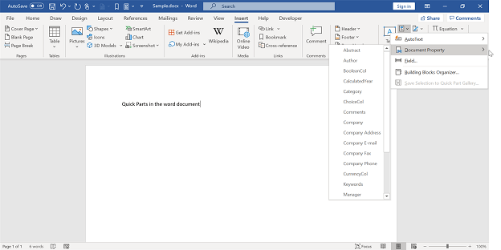

# Working with Word document

## Iterating through document elements

The following are the important points to be remembered while iterating the document elements

* Document consists of one or more sections.
* Section contains the contents present in Headers, Footers and main document through the instances of `WTextBody`.
* `WTextBody` contains three type of elements – either paragraph, table or block content control.

The following code example shows how to iterate throughout the Word document and remove the paragraph with a particular style.

 


//Opens an existing document from file system through constructor of WordDocument class
WordDocument document = new WordDocument(@"TestDocument.docx");
//Processes the body contents for each section in the Word document
foreach (WSection section in document.Sections)
{
	//Accesses the Body of section where all the contents in document are apart
	WTextBody sectionBody = section.Body;
	IterateTextBody(sectionBody);
	WHeadersFooters headersFooters = section.HeadersFooters;
	//Consider that OddHeader and OddFooter are applied to this document
	//Iterates through the TextBody of OddHeader and OddFooter
	IterateTextBody(headersFooters.OddHeader);
	IterateTextBody(headersFooters.OddFooter);
}
//Saves and closes the document instance
document.Save("Result.docx");
document.Close();


'Opens an existing document from file system through constructor of WordDocument class
Dim document As New WordDocument("TestDocument.docx")
'Processes the body contents for each section in the Word document
For Each section As WSection In document.Sections
	'Accesses the Body of section where all the contents in document are apart
	Dim sectionBody As WTextBody = section.Body
     IterateTextBody(sectionBody)
     Dim headersFooters As WHeadersFooters = section.HeadersFooters
	'Consider that OddHeader and OddFooter are applied to this document
	'Iterates through the text body of OddHeader and OddFooter
     IterateTextBody(headersFooters.OddHeader)
     IterateTextBody(headersFooters.OddFooter)
Next
'Saves and closes the document instance
document.Save("Result.docx")
document.Close()	


//"App" is the class of Portable project.
Assembly assembly = typeof(App).GetTypeInfo().Assembly;
//Opens an existing document from file system through constructor of WordDocument class
using (WordDocument document = new WordDocument((assembly.GetManifestResourceStream("CreateWordSample.Assets.Test.docx")), FormatType.Docx))
{
	foreach (WSection section in document.Sections)
	{
		//Accesses the Body of section where all the contents in document are apart
		WTextBody sectionBody = section.Body;
		IterateTextBody(sectionBody);
		WHeadersFooters headersFooters = section.HeadersFooters;
		//Consider that OddHeader and OddFooter are applied to this document
		//Iterates through the TextBody of OddHeader and OddFooter
		IterateTextBody(headersFooters.OddHeader);
		IterateTextBody(headersFooters.OddFooter);
	}
	MemoryStream stream = new MemoryStream();
	await document.SaveAsync(stream, FormatType.Docx);
	//Saves the stream as Word file in local machine
	Save(stream, "Result.docx");
	//Please refer the below link to save Word document in UWP platform
	//https://help.syncfusion.com/file-formats/docio/create-word-document-in-uwp#save-word-document-in-uwp
	//Closes the Word document
	document.Close();
}


FileStream fileStreamPath = new FileStream(@"Data/Hello World.docx", FileMode.Open, FileAccess.Read, FileShare.ReadWrite);
//Opens an existing document from file system through constructor of WordDocument class
using (WordDocument document = new WordDocument(fileStreamPath, FormatType.Automatic))
{
    foreach (WSection section in document.Sections)
    {
        //Accesses the Body of section where all the contents in document are apart
        WTextBody sectionBody = section.Body;
        IterateTextBody(sectionBody);
        WHeadersFooters headersFooters = section.HeadersFooters;
        //Consider that OddHeader and OddFooter are applied to this document
        //Iterates through the TextBody of OddHeader and OddFooter
        IterateTextBody(headersFooters.OddHeader);
        IterateTextBody(headersFooters.OddFooter);
    }
    MemoryStream stream = new MemoryStream();
    document.Save(stream, FormatType.Docx);
    //Closes the Word document
    document.Close();
    stream.Position = 0;
    //Download Word document in the browser
    return File(stream, "application/msword", "Result.docx");
}


Assembly assembly = typeof(App).GetTypeInfo().Assembly;
//Opens an existing document from file system through constructor of WordDocument class
using (WordDocument document = new WordDocument((assembly.GetManifestResourceStream("XamarinFormsApp1.Assets.Hello World.docx")), FormatType.Automatic))
{
    foreach (WSection section in document.Sections)
    {
        //Accesses the Body of section where all the contents in document are apart
        WTextBody sectionBody = section.Body;
        IterateTextBody(sectionBody);
        WHeadersFooters headersFooters = section.HeadersFooters;
        //Consider that OddHeader and OddFooter are applied to this document
        //Iterates through the TextBody of OddHeader and OddFooter
        IterateTextBody(headersFooters.OddHeader);
        IterateTextBody(headersFooters.OddFooter);
    }
    MemoryStream stream = new MemoryStream();
    document.Save(stream, FormatType.Docx);
    //Save the stream as a file in the device and invoke it for viewing
    Xamarin.Forms.DependencyService.Get<ISave>().SaveAndView("Result.docx", "application/msword", stream);
    //Closes the Word document
    document.Close();
	//Please download the helper files from the below link to save the stream as file and open the file for viewing in Xamarin platform
	//https://help.syncfusion.com/file-formats/docio/create-word-document-in-xamarin#helper-files-for-xamarin
}

  
The following code example provides supporting methods for the above code.
  

private static void IterateTextBody(WTextBody textBody)
{
    //Iterates through each of the child items of WTextBody
    for (int i = 0; i < textBody.ChildEntities.Count; i++)
    {
        //IEntity is the basic unit in DocIO DOM. 
        //Accesses the body items (should be either paragraph, table or block content control) as IEntity
        IEntity bodyItemEntity = textBody.ChildEntities[i];
        //A Text body has 3 types of elements - Paragraph, Table and Block Content Control
        //Decides the element type by using EntityType
        switch (bodyItemEntity.EntityType)
        {
            case EntityType.Paragraph:
                WParagraph paragraph = bodyItemEntity as WParagraph;
                //Checks for particular style name and removes the paragraph from DOM
                if (paragraph.StyleName == "MyStyle")
                {
                    int index = textBody.ChildEntities.IndexOf(paragraph);
                    textBody.ChildEntities.RemoveAt(index);
                }
                break;
            case EntityType.Table:
                //Table is a collection of rows and cells
                //Iterates through table's DOM
                IterateTable(bodyItemEntity as WTable);
                break;
            case EntityType.BlockContentControl:
                BlockContentControl blockContentControl = bodyItemEntity as BlockContentControl;
                //Iterates to the body items of Block Content Control.
                IterateTextBody(blockContentControl.TextBody);
                break;
        }
    }
}


Private Shared Sub IterateTextBody(textBody As WTextBody)
'Iterates through the each of the child items of WTextBody
For i As Integer = 0 To textBody.ChildEntities.Count - 1
	'IEntity is the basic unit in DocIO DOM. 
	'Accesses the body items (should be either paragraph, table or block content control) as IEntity
	Dim bodyItemEntity As IEntity = textBody.ChildEntities(i)
	'A Text body has 3 types of elements - Paragraph, Table and Block Content Control
	'decide the element type using EntityType
    Select Case bodyItemEntity.EntityType
        Case EntityType.Paragraph
            Dim paragraph As WParagraph = TryCast(bodyItemEntity, WParagraph)
			'Checks for a particular style name and removes the paragraph from DOM
            If paragraph.StyleName = "MyStyle" Then
                Dim index As Integer = textBody.ChildEntities.IndexOf(paragraph)
                textBody.ChildEntities.RemoveAt(index)
            End If
        Exit Select
        Case EntityType.Table
			'Table is a collection of rows and cells
			'Iterates through table's DOM
            IterateTable(TryCast(bodyItemEntity, WTable))
        Exit Select
        Case EntityType.BlockContentControl
            Dim BlockContentControl As BlockContentControl = TryCast(bodyItemEntity, BlockContentControl)
            'Iterates to the body items of Block Content Control.
            IterateTextBody(BlockContentControl.TextBody)
        Exit Select
    End Select
Next
End Sub


async void IterateTextBody(WTextBody textBody)
{
    //Iterates through each of the child items of WTextBody
    for (int i = 0; i < textBody.ChildEntities.Count; i++)
    {
        //IEntity is the basic unit in DocIO DOM. 
        //Accesses the body items (should be either paragraph, table or block content control) as IEntity
        IEntity bodyItemEntity = textBody.ChildEntities[i];
        //A Text body has 3 types of elements - Paragraph, Table and Block Content Control
        //Decides the element type by using EntityType
        switch (bodyItemEntity.EntityType)
        {
            case EntityType.Paragraph:
                WParagraph paragraph = bodyItemEntity as WParagraph;
                //Checks for particular style name and removes the paragraph from DOM
                if (paragraph.StyleName == "MyStyle")
                {
                    int index = textBody.ChildEntities.IndexOf(paragraph);
                    textBody.ChildEntities.RemoveAt(index);
                }
                break;
            case EntityType.Table:
                //Table is a collection of rows and cells
                //Iterates through table's DOM
                IterateTable(bodyItemEntity as WTable);
                break;
                case EntityType.BlockContentControl:
                BlockContentControl blockContentControl = bodyItemEntity as BlockContentControl;
                //Iterates to the body items of Block Content Control.
                IterateTextBody(blockContentControl.TextBody);
                break;
        }
    }
}


private static void IterateTextBody(WTextBody textBody)
{
    //Iterates through each of the child items of WTextBody
    for (int i = 0; i < textBody.ChildEntities.Count; i++)
    {
        //IEntity is the basic unit in DocIO DOM. 
        //Accesses the body items (should be either paragraph, table or block content control) as IEntity
        IEntity bodyItemEntity = textBody.ChildEntities[i];
        //A Text body has 3 types of elements - Paragraph, Table and Block Content Control
        //Decides the element type by using EntityType
        switch (bodyItemEntity.EntityType)
        {
            case EntityType.Paragraph:
                WParagraph paragraph = bodyItemEntity as WParagraph;
                //Checks for particular style name and removes the paragraph from DOM
                if (paragraph.StyleName == "MyStyle")
                {
                    int index = textBody.ChildEntities.IndexOf(paragraph);
                    textBody.ChildEntities.RemoveAt(index);
                }
                break;
            case EntityType.Table:
                //Table is a collection of rows and cells
                //Iterates through table's DOM
                IterateTable(bodyItemEntity as WTable);
                break;
            case EntityType.BlockContentControl:
                BlockContentControl blockContentControl = bodyItemEntity as BlockContentControl;
                //Iterates to the body items of Block Content Control.
                IterateTextBody(blockContentControl.TextBody);
                break;
        }
    }
}


private static void IterateTextBody(WTextBody textBody)
{
    //Iterates through each of the child items of WTextBody
    for (int i = 0; i < textBody.ChildEntities.Count; i++)
    {
        //IEntity is the basic unit in DocIO DOM. 
        //Accesses the body items (should be either paragraph, table or block content control) as IEntity
        IEntity bodyItemEntity = textBody.ChildEntities[i];
        //A Text body has 3 types of elements - Paragraph, Table and Block Content Control
        //Decides the element type by using EntityType
        switch (bodyItemEntity.EntityType)
        {
            case EntityType.Paragraph:
                WParagraph paragraph = bodyItemEntity as WParagraph;
                //Checks for particular style name and removes the paragraph from DOM
                if (paragraph.StyleName == "MyStyle")
                {
                    int index = textBody.ChildEntities.IndexOf(paragraph);
                    textBody.ChildEntities.RemoveAt(index);
                }
                break;
            case EntityType.Table:
                //Table is a collection of rows and cells
                //Iterates through table's DOM
                IterateTable(bodyItemEntity as WTable);
                break;
            case EntityType.BlockContentControl:
                BlockContentControl blockContentControl = bodyItemEntity as BlockContentControl;
                //Iterates to the body items of Block Content Control.
                IterateTextBody(blockContentControl.TextBody);
                break;
        }
    }
}

  

The following code example provides supporting methods for the above code.

  

private static void IterateTable(WTable table)
{
    //Iterates the row collection in a table
    foreach (WTableRow row in table.Rows)
    {
        //Iterates the cell collection in a table row
        foreach (WTableCell cell in row.Cells)
        {
            //Table cell is derived from (also a) TextBody
            //Reusing the code meant for iterating TextBody
            IterateTextBody(cell);
        }
    }
}


Private Shared Sub IterateTable(table As WTable)
'Iterates the row collection in a table
For Each row As WTableRow In table.Rows
	'Iterates the cell collection in a table row
	For Each cell As WTableCell In row.Cells
		'Table cell is derived from (also a) TextBody
		'Reusing the code meant for iterating TextBody
		IterateTextBody(cell)
    Next
Next
End Sub


async void IterateTable(WTable table)
{
    //Iterates the row collection in a table
    foreach (WTableRow row in table.Rows)
    {
        //Iterates the cell collection in a table row
        foreach (WTableCell cell in row.Cells)
        {
            //Table cell is derived from (also a) TextBody
            //Reusing the code meant for iterating TextBody
            IterateTextBody(cell);
        }
    }
}


private static void IterateTable(WTable table)
{
    //Iterates the row collection in a table
    foreach (WTableRow row in table.Rows)
    {
        //Iterates the cell collection in a table row
        foreach (WTableCell cell in row.Cells)
        {
            //Table cell is derived from (also a) TextBody
            //Reusing the code meant for iterating TextBody
            IterateTextBody(cell);
        }
    }
}


private static void IterateTable(WTable table)
{
    //Iterates the row collection in a table
    foreach (WTableRow row in table.Rows)
    {
        //Iterates the cell collection in a table row
        foreach (WTableCell cell in row.Cells)
        {
            //Table cell is derived from (also a) TextBody
            //Reusing the code meant for iterating TextBody
            IterateTextBody(cell);
        }
    }
}

  

The following code example shows how to iterate throughout the paragraph and modify the hyperlink (Hyperlink)Uri and specific text (WTextRange)with another.

  


//Opens an existing document from file system through constructor of WordDocument class
WordDocument document = new WordDocument(@"TestDocument.docx");
//Processes the body contents for each section in the Word document
foreach (WSection section in document.Sections)
{
    //Accesses the Body of section where all the contents in document are apart
    WTextBody sectionBody = section.Body;
    IterateTextBody(sectionBody);
    WHeadersFooters headersFooters = section.HeadersFooters;
    //consider that OddHeader & OddFooter are applied to this document
    //Iterates through the TextBody of OddHeader and OddFooter
    IterateTextBody(headersFooters.OddHeader);
    IterateTextBody(headersFooters.OddFooter);
}
//Saves and closes the document instance
document.Save("Result.docx");
document.Close();


Dim document As New WordDocument("TestDocument.docx")
    'Processes the body contents for each section in the Word document
    For Each section As WSection In document.Sections
        'Accesses the Body of section where all the contents in document are apart
        Dim sectionBody As WTextBody = section.Body
        IterateTextBody(sectionBody)
        Dim headersFooters As WHeadersFooters = section.HeadersFooters
        'Considers that OddHeader and OddFooter are applied to this document
        'Iterates through the TextBody of OddHeader and OddFooterIterateTextBody(headersFooters.OddHeader)
        IterateTextBody(headersFooters.OddFooter)
    Next
'Saves and closes the document instance
document.Save("Result.docx")
document.Close()


//"App" is the class of Portable project.
Assembly assembly = typeof(App).GetTypeInfo().Assembly;
//Opens an existing document from file system through constructor of WordDocument class
using (WordDocument document = new WordDocument((assembly.GetManifestResourceStream("CreateWordSample.Assets.Test.docx")), FormatType.Docx))
{
	foreach (WSection section in document.Sections)
	{
		//Accesses the Body of section where all the contents in document are apart
		WTextBody sectionBody = section.Body;
		IterateTextBody(sectionBody);
		WHeadersFooters headersFooters = section.HeadersFooters;
		//Consider that OddHeader and OddFooter are applied to this document
		//Iterates through the TextBody of OddHeader and OddFooter
		IterateTextBody(headersFooters.OddHeader);
		IterateTextBody(headersFooters.OddFooter);
	}
	MemoryStream stream = new MemoryStream();
	await document.SaveAsync(stream, FormatType.Docx);
	//Saves the stream as Word file in local machine
	Save(stream, "Result.docx");
	//Please refer the below link to save Word document in UWP platform
	//https://help.syncfusion.com/file-formats/docio/create-word-document-in-uwp#save-word-document-in-uwp
	//Closes the Word document
	document.Close();
}


FileStream fileStreamPath = new FileStream(@"Data/Hello World.docx", FileMode.Open, FileAccess.Read, FileShare.ReadWrite);
//Opens an existing document from file system through constructor of WordDocument class
using (WordDocument document = new WordDocument(fileStreamPath, FormatType.Automatic))
{
    foreach (WSection section in document.Sections)
    {
        //Accesses the Body of section where all the contents in document are apart
        WTextBody sectionBody = section.Body;
        IterateTextBody(sectionBody);
        WHeadersFooters headersFooters = section.HeadersFooters;
        //Consider that OddHeader and OddFooter are applied to this document
        //Iterates through the TextBody of OddHeader and OddFooter
        IterateTextBody(headersFooters.OddHeader);
        IterateTextBody(headersFooters.OddFooter);
    }
    MemoryStream stream = new MemoryStream();
    document.Save(stream, FormatType.Docx);
    //Closes the Word document
    document.Close();
    stream.Position = 0;
    //Download Word document in the browser
    return File(stream, "application/msword", "Result.docx");
}



Assembly assembly = typeof(App).GetTypeInfo().Assembly;
//Opens an existing document from file system through constructor of WordDocument class
using (WordDocument document = new WordDocument((assembly.GetManifestResourceStream("XamarinFormsApp1.Assets.Hello World.docx")), FormatType.Automatic))
{
    foreach (WSection section in document.Sections)
    {
        //Accesses the Body of section where all the contents in document are apart
        WTextBody sectionBody = section.Body;
        IterateTextBody(sectionBody);
        WHeadersFooters headersFooters = section.HeadersFooters;
        //Consider that OddHeader and OddFooter are applied to this document
        //Iterates through the TextBody of OddHeader and OddFooter
        IterateTextBody(headersFooters.OddHeader);
        IterateTextBody(headersFooters.OddFooter);
    }
    MemoryStream stream = new MemoryStream();
    document.Save(stream, FormatType.Docx);
    //Save the stream as a file in the device and invoke it for viewing
    Xamarin.Forms.DependencyService.Get<ISave>().SaveAndView("Result.docx", "application/msword", stream);
    //Closes the Word document
    document.Close();
	//Please download the helper files from the below link to save the stream as file and open the file for viewing in Xamarin platform
	//https://help.syncfusion.com/file-formats/docio/create-word-document-in-xamarin#helper-files-for-xamarin
}



  
The following code example provides supporting methods for the above code.

 


private static void IterateTextBody(WTextBody textBody)
{
    //Iterates through each of the child items of WTextBody
    for (int i = 0; i < textBody.ChildEntities.Count; i++)
    {
        //IEntity is the basic unit in DocIO DOM. 
        //Accesses the body items (should be either paragraph, table or block content control) as IEntity
        IEntity bodyItemEntity = textBody.ChildEntities[i];
        //A Text body has 3 types of elements - Paragraph, Table and Block Content Control
        //Decides the element type by using EntityType
        switch (bodyItemEntity.EntityType)
        {
            case EntityType.Paragraph:
                WParagraph paragraph = bodyItemEntity as WParagraph;
                //Processes the paragraph contents
                //Iterates through the paragraph's DOM
                IterateParagraph(paragraph.Items);
                break;
            case EntityType.Table:
                //Table is a collection of rows and cells
                //Iterates through table's DOM
                IterateTable(bodyItemEntity as WTable);
                break;
            case EntityType.BlockContentControl:
                BlockContentControl blockContentControl = bodyItemEntity as BlockContentControl;
                //Iterates to the body items of Block Content Control.
                IterateTextBody(blockContentControl.TextBody);
                break;
        }
    }
}


Private Shared Sub IterateTextBody(textBody As WTextBody)
'Iterates through each of the child items of WTextBody
For i As Integer = 0 To textBody.ChildEntities.Count - 1
    'IEntity is the basic unit in DocIO DOM. 
    'Accesses the body items (should be either paragraph, table or block content control) as IEntity
    Dim bodyItemEntity As IEntity = textBody.ChildEntities(i)
    'A Text body has 3 types of elements - Paragraph, Table and Block Content Control
    'Decides the element type by using EntityType
    Select Case bodyItemEntity.EntityType
        Case EntityType.Paragraph
            Dim paragraph As WParagraph = TryCast(bodyItemEntity, WParagraph)
            'Processes the paragraph contents
            'Iterates through the paragraph's DOM
            IterateParagraph(paragraph.Items)
        Exit Select
        Case EntityType.Table
            'Table is a collection of rows and cells
            'Iterates through table's DOM
            IterateTable(TryCast(bodyItemEntity, WTable))
        Exit Select
        Case EntityType.BlockContentControl
            Dim BlockContentControl As BlockContentControl = TryCast(bodyItemEntity, BlockContentControl)
            'Iterates to the body items of Block Content Control.
            IterateTextBody(BlockContentControl.TextBody)
        Exit Select
    End Select
Next
End Sub


async void IterateTextBody(WTextBody textBody)
{
    //Iterates through each of the child items of WTextBody
    for (int i = 0; i < textBody.ChildEntities.Count; i++)
    {
        //IEntity is the basic unit in DocIO DOM. 
        //Accesses the body items (should be either paragraph, table or block content control) as IEntity
        IEntity bodyItemEntity = textBody.ChildEntities[i];
        //A Text body has 3 types of elements - Paragraph, Table and Block Content Control
        //Decides the element type by using EntityType
        switch (bodyItemEntity.EntityType)
        {
            case EntityType.Paragraph:
                WParagraph paragraph = bodyItemEntity as WParagraph;
                //Processes the paragraph contents
                //Iterates through the paragraph's DOM
                IterateParagraph(paragraph.Items);
                break;
            case EntityType.Table:
                //Table is a collection of rows and cells
                //Iterates through table's DOM
                IterateTable(bodyItemEntity as WTable);
                break;
            case EntityType.BlockContentControl:
                BlockContentControl blockContentControl = bodyItemEntity as BlockContentControl;
                //Iterates to the body items of Block Content Control.
                IterateTextBody(blockContentControl.TextBody);
                break;
        }
    }
}


private static void IterateTextBody(WTextBody textBody)
{
    //Iterates through each of the child items of WTextBody
    for (int i = 0; i < textBody.ChildEntities.Count; i++)
    {
        //IEntity is the basic unit in DocIO DOM. 
        //Accesses the body items (should be either paragraph, table or block content control) as IEntity
        IEntity bodyItemEntity = textBody.ChildEntities[i];
        //A Text body has 3 types of elements - Paragraph, Table and Block Content Control
        //Decides the element type by using EntityType
        switch (bodyItemEntity.EntityType)
        {
            case EntityType.Paragraph:
                WParagraph paragraph = bodyItemEntity as WParagraph;
                //Processes the paragraph contents
                //Iterates through the paragraph's DOM
                IterateParagraph(paragraph.Items);
                break;
            case EntityType.Table:
                //Table is a collection of rows and cells
                //Iterates through table's DOM
                IterateTable(bodyItemEntity as WTable);
                break;
            case EntityType.BlockContentControl:
                BlockContentControl blockContentControl = bodyItemEntity as BlockContentControl;
                //Iterates to the body items of Block Content Control.
                IterateTextBody(blockContentControl.TextBody);
                break;
        }
    }
}


private static void IterateTextBody(WTextBody textBody)
{
    //Iterates through each of the child items of WTextBody
    for (int i = 0; i < textBody.ChildEntities.Count; i++)
    {
        //IEntity is the basic unit in DocIO DOM. 
        //Accesses the body items (should be either paragraph, table or block content control) as IEntity
        IEntity bodyItemEntity = textBody.ChildEntities[i];
        //A Text body has 3 types of elements - Paragraph, Table and Block Content Control
        //Decides the element type by using EntityType
        switch (bodyItemEntity.EntityType)
        {
            case EntityType.Paragraph:
                WParagraph paragraph = bodyItemEntity as WParagraph;
                //Processes the paragraph contents
                //Iterates through the paragraph's DOM
                IterateParagraph(paragraph.Items);
                break;
            case EntityType.Table:
                //Table is a collection of rows and cells
                //Iterates through table's DOM
                IterateTable(bodyItemEntity as WTable);
                break;
            case EntityType.BlockContentControl:
                BlockContentControl blockContentControl = bodyItemEntity as BlockContentControl;
                //Iterates to the body items of Block Content Control.
                IterateTextBody(blockContentControl.TextBody);
                break;
        }
    }
}

 

The following code example provides supporting methods for the above code.

 

private static void IterateTable(WTable table)
{
    //Iterates the row collection in a table
    foreach (WTableRow row in table.Rows)
    {
        //Iterates the cell collection in a table row
        foreach (WTableCell cell in row.Cells)
        {
            //Table cell is derived from (also a) TextBody
            //Reusing the code meant for iterating TextBody
            IterateTextBody(cell);
        }
    }
}


Private Shared Sub IterateTable(table As WTable)
'Iterates the row collection in a table
For Each row As WTableRow In table.Rows
	'Iterates the cell collection in a table row
	For Each cell As WTableCell In row.Cells
		'Table cell is derived from (also a) TextBody
		'Reusing the code meant for iterating TextBody
		IterateTextBody(cell)
    Next
Next
End Sub


async void IterateTable(WTable table)
{
    //Iterates the row collection in a table
    foreach (WTableRow row in table.Rows)
    {
        //Iterates the cell collection in a table row
        foreach (WTableCell cell in row.Cells)
        {
            //Table cell is derived from (also a) TextBody
            //Reusing the code meant for iterating TextBody
            IterateTextBody(cell);
        }
    }
}


private static void IterateTable(WTable table)
{
    //Iterates the row collection in a table
    foreach (WTableRow row in table.Rows)
    {
        //Iterates the cell collection in a table row
        foreach (WTableCell cell in row.Cells)
        {
            //Table cell is derived from (also a) TextBody
            //Reusing the code meant for iterating TextBody
            IterateTextBody(cell);
        }
    }
}


private static void IterateTable(WTable table)
{
    //Iterates the row collection in a table
    foreach (WTableRow row in table.Rows)
    {
        //Iterates the cell collection in a table row
        foreach (WTableCell cell in row.Cells)
        {
            //Table cell is derived from (also a) TextBody
            //Reusing the code meant for iterating TextBody
            IterateTextBody(cell);
        }
    }
}


 
The following code example provides supporting methods for the above code.

 

private static void IterateParagraph(ParagraphItemCollection paraItems)
{
    for (int i = 0; i < paraItems.Count; i++)
    {
        Entity entity = paraItems[i];
        //A paragraph can have child elements such as text, image, hyperlink, symbols, etc.,
        //Decides the element type by using EntityType
        switch (entity.EntityType)
        {
            case EntityType.TextRange:
                //Replaces the text with another
                WTextRange textRange = entity as WTextRange;
                if (textRange.Text == "Andrew")
                {
                    (entity as WTextRange).Text = "Fuller";
                }
                break;
            case EntityType.Field:
                WField field = entity as WField;
                if (field.FieldType == FieldType.FieldHyperlink)
                {
                    //Creates hyperlink instance from field to manipulate the hyperlink
                    Hyperlink hyperlink = new Hyperlink(entity as WField);
                    //Modifies the Uri of the hyperlink
                    if (hyperlink.Type == HyperlinkType.WebLink && hyperlink.TextToDisplay == "HTML")
                    {
                        hyperlink.Uri = "http://www.w3schools.com/";
                    }
                }
                break;
            case EntityType.TextBox:
                //Iterates to the body items of textbox.
                WTextBox textBox = entity as WTextBox;
                IterateTextBody(textBox.TextBoxBody);
                break;
            case EntityType.Shape:
                //Iterates to the body items of shape.
                Shape shape = entity as Shape;
                IterateTextBody(shape.TextBody);
                break;
            case EntityType.InlineContentControl:
                //Iterates to the paragraph items of inline content control.
                InlineContentControl inlineContentControl = entity as InlineContentControl;
                IterateParagraph(inlineContentControl.ParagraphItems);
                break;
        }
    }
}


Private Shared Sub IterateParagraph(paraItems As ParagraphItemCollection)
For i As Integer = 0 To paraItems.Count - 1
	Dim entity As Entity = paraItems(i)
	'A Paragraph has child elements such as text, image, hyperlink, symbols, etc.,
	'Decides the element type by using EntityType
    Select Case entity.EntityType
        Case EntityType.TextRange
			'Replaces the text with another
            Dim textRange As WTextRange = TryCast(entity, WTextRange)
            If textRange.Text = "Andrew" Then
                TryCast(entity, WTextRange).Text = "Fuller"
            End If
        Exit Select
        Case EntityType.Field
            Dim field As WField = TryCast(entity, WField)
            If field.FieldType = FieldType.FieldHyperlink Then
				'Creates Hyperlink instance from field to manipulate the Hyperlink
                Dim hyperlink As New Hyperlink(TryCast(entity, WField))
				'Modifies the Uri of the hyperlink
				If hyperlink.Type = HyperlinkType.WebLink AndAlso hyperlink.TextToDisplay = "HTML" Then
                    hyperlink.Uri = "http://www.w3schools.com/"
                End If
            End If
        Exit Select
        Case EntityType.TextBox
            'Iterates to the body items of textbox.
            Dim textBox As WTextBox = TryCast(entity, WTextBox)
            IterateTextBody(textBox.TextBoxBody)
        Exit Select
        Case EntityType.Shape
            'Iterates to the body items of shape.
            Dim shape As Shape = TryCast(entity, Shape)
            IterateTextBody(shape.TextBody)
        Exit Select
        Case EntityType.InlineContentControl
            'Iterates to the paragraph items of inline content control.
            Dim inlineContentControl As InlineContentControl = TryCast(entity, InlineContentControl)
            IterateParagraph(inlineContentControl.ParagraphItems)
        Exit Select
    End Select
Next
End Sub


async void IterateParagraph(ParagraphItemCollection paraItems)
{
    for (int i = 0; i < paraItems.Count; i++)
    {
        Entity entity = paraItems[i];
        //A paragraph can have child elements such as text, image, hyperlink, symbols, etc.,
        //Decides the element type by using EntityType
        switch (entity.EntityType)
        {
            case EntityType.TextRange:
                //Replaces the text with another
                WTextRange textRange = entity as WTextRange;
                if (textRange.Text == "Andrew")
                {
                    (entity as WTextRange).Text = "Fuller";
                }
                break;
            case EntityType.Field:
                WField field = entity as WField;
                if (field.FieldType == FieldType.FieldHyperlink)
                {
                    //Creates hyperlink instance from field to manipulate the hyperlink
                    Hyperlink hyperlink = new Hyperlink(entity as WField);
                    //Modifies the Uri of the hyperlink
                    if (hyperlink.Type == HyperlinkType.WebLink && hyperlink.TextToDisplay == "HTML")
                    {
                        hyperlink.Uri = "http://www.w3schools.com/";
                    }
                }
                break;
            case EntityType.TextBox:
                //Iterates to the body items of textbox.
                WTextBox textBox = entity as WTextBox;
                IterateTextBody(textBox.TextBoxBody);
                break;
            case EntityType.Shape:
                //Iterates to the body items of shape.
                Shape shape = entity as Shape;
                IterateTextBody(shape.TextBody);
                break;
            case EntityType.InlineContentControl:
                //Iterates to the paragraph items of inline content control.
                InlineContentControl inlineContentControl = entity as InlineContentControl;
                IterateParagraph(inlineContentControl.ParagraphItems);
                break;
        }
    }
}


private static void IterateParagraph(ParagraphItemCollection paraItems)
{
    for (int i = 0; i < paraItems.Count; i++)
    {
        Entity entity = paraItems[i];
        //A paragraph can have child elements such as text, image, hyperlink, symbols, etc.,
        //Decides the element type by using EntityType
        switch (entity.EntityType)
        {
            case EntityType.TextRange:
                //Replaces the text with another
                WTextRange textRange = entity as WTextRange;
                if (textRange.Text == "Andrew")
                {
                    (entity as WTextRange).Text = "Fuller";
                }
                break;
            case EntityType.Field:
                WField field = entity as WField;
                if (field.FieldType == FieldType.FieldHyperlink)
                {
                    //Creates hyperlink instance from field to manipulate the hyperlink
                    Hyperlink hyperlink = new Hyperlink(entity as WField);
                    //Modifies the Uri of the hyperlink
                    if (hyperlink.Type == HyperlinkType.WebLink && hyperlink.TextToDisplay == "HTML")
                    {
                        hyperlink.Uri = "http://www.w3schools.com/";
                    }
                }
                break;
            case EntityType.TextBox:
                //Iterates to the body items of textbox.
                WTextBox textBox = entity as WTextBox;
                IterateTextBody(textBox.TextBoxBody);
                break;
            case EntityType.Shape:
                //Iterates to the body items of shape.
                Shape shape = entity as Shape;
                IterateTextBody(shape.TextBody);
                break;
            case EntityType.InlineContentControl:
                //Iterates to the paragraph items of inline content control.
                InlineContentControl inlineContentControl = entity as InlineContentControl;
                IterateParagraph(inlineContentControl.ParagraphItems);
                break;
        }
    }
}


private static void IterateParagraph(ParagraphItemCollection paraItems)
{
    for (int i = 0; i < paraItems.Count; i++)
    {
        Entity entity = paraItems[i];
        //A paragraph can have child elements such as text, image, hyperlink, symbols, etc.,
        //Decides the element type by using EntityType
        switch (entity.EntityType)
        {
            case EntityType.TextRange:
                //Replaces the text with another
                WTextRange textRange = entity as WTextRange;
                if (textRange.Text == "Andrew")
                {
                    (entity as WTextRange).Text = "Fuller";
                }
                break;
            case EntityType.Field:
                WField field = entity as WField;
                if (field.FieldType == FieldType.FieldHyperlink)
                {
                    //Creates hyperlink instance from field to manipulate the hyperlink
                    Hyperlink hyperlink = new Hyperlink(entity as WField);
                    //Modifies the Uri of the hyperlink
                    if (hyperlink.Type == HyperlinkType.WebLink && hyperlink.TextToDisplay == "HTML")
                    {
                        hyperlink.Uri = "http://www.w3schools.com/";
                    }
                }
                break;
            case EntityType.TextBox:
                //Iterates to the body items of textbox.
                WTextBox textBox = entity as WTextBox;
                IterateTextBody(textBox.TextBoxBody);
                break;
            case EntityType.Shape:
                //Iterates to the body items of shape.
                Shape shape = entity as Shape;
                IterateTextBody(shape.TextBody);
                break;
            case EntityType.InlineContentControl:
                //Iterates to the paragraph items of inline content control.
                InlineContentControl inlineContentControl = entity as InlineContentControl;
                IterateParagraph(inlineContentControl.ParagraphItems);
                break;
        }
    }
}



## Cloning a Word document

You can create a deep copy of a Word document by using `Clone` method of `WordDocument` class. You can read the template document from file system or stream and create multiple document copies by cloning it. This improves the performance of document generation, as there is no need to read the Word document each time.

 


//Opens an existing document 
WordDocument inputTemplateDoc = new WordDocument(fileName);
//Creates a clone of Input Template 
WordDocument clonedDocument = inputTemplateDoc.Clone();
//Saves and closes the cloned document instance
clonedDocument.Save("ClonedDocument.docx");
clonedDocument.Close();
//Closes the input template document instance
sourceDocument.Close();



'Opens an existing document 
Dim inputTemplateDoc As New WordDocument(fileName)
'Creates a clone of Input Template 
Dim clonedDocument As WordDocument = inputTemplateDoc.Clone()
'Saves and closes the cloned document instance
clonedDocument.Save("ClonedDocument.docx")
clonedDocument.Close()
'Closes the input template document instance
sourceDocument.Close()



//"App" is the class of Portable project
Assembly assembly = typeof(App).GetTypeInfo().Assembly;
using (WordDocument document = new WordDocument(assembly.GetManifestResourceStream("CreateWordSample.Assets.Test.docx"), FormatType.Docx))
{
	WordDocument clonedDocument = document.Clone();
	MemoryStream stream = new MemoryStream();
	//Saves the Word file to MemoryStream
	await clonedDocument.SaveAsync(stream, FormatType.Docx);
	//Saves the stream as Word file in local machine
	Save(stream, "Result.docx");
	//Please refer the below link to save Word document in UWP platform
	//https://help.syncfusion.com/file-formats/docio/create-word-document-in-uwp#save-word-document-in-uwp
	document.Close();
	clonedDocument.Close();
}



FileStream fileStreamPath = new FileStream(@"Data/Hello World.docx", FileMode.Open, FileAccess.Read, FileShare.ReadWrite);
//Opens an existing document from file system through constructor of WordDocument class
using (WordDocument document = new WordDocument(fileStreamPath, FormatType.Automatic))
{
	//Creates a clone of Input Template 
	WordDocument clonedDocument = document.Clone();
	MemoryStream stream = new MemoryStream();
	//Saves and closes the cloned document instance
	clonedDocument.Save(stream, FormatType.Docx);
	//Closes the document
	document.Close();
	clonedDocument.Close();
	stream.Position = 0;
	//Download Word document in the browser
	return File(stream, "application/msword", "Result.docx");
}



//"App" is the class of Portable project.
Assembly assembly = typeof(App).GetTypeInfo().Assembly;
using (WordDocument document = new WordDocument(assembly.GetManifestResourceStream("CreateWordSample.Assets.Test.docx"), FormatType.Automatic))
{
	WordDocument clonedDocument = document.Clone();
	MemoryStream stream = new MemoryStream();
	clonedDocument.Save(stream, FormatType.Docx);
	//Save the stream as a file in the device and invoke it for viewing
	Xamarin.Forms.DependencyService.Get<ISave>().SaveAndView("WorkingWordDoc.docx", "application/msword", stream);
	//Closes the document
	clonedDocument.Close();
    document.Close();
	//Please download the helper files from the below link to save the stream as file and open the file for viewing in Xamarin platform
	//https://help.syncfusion.com/file-formats/docio/create-word-document-in-xamarin#helper-files-for-xamarin
}


  
 
You can also create a deep copy of document elements such as sections, paragraphs, Tables, Text, Image, OleObject, Shapes, TextBoxes and etc., The following code example illustrates how to clone the section and save each cloned section as a Word document. 

 


//Opens a source document
WordDocument sourceDocument = new WordDocument("SourceDocument.docx");
//Processes the each section in the Word document
for (int i = 0; i < sourceDocument.Sections.Count;i++)
{
	//Creates new WordDocument instance to add cloned section
	WordDocument destinationDocument = new WordDocument();
	//Clones and adds source document sections to the destination document
	destinationDocument.Sections.Add(sourceDocument.Sections[i].Clone());
	//Saves and closes the document instance
	destinationDocument.Save("Section_" + i + ".docx");
	destinationDocument.Close();
}
//Closes the source document instance
sourceDocument.Close();



'Opens a source document
Dim sourceDocument As New WordDocument("SourceDocument.docx")
'Processes the each section in the Word document
For i As Integer = 0 To sourceDocument.Sections.Count - 1
	'Creates new WordDocument instance to add cloned section
	Dim destinationDocument As New WordDocument()
	'Clones and adds source document sections to the destination document
	destinationDocument.Sections.Add(sourceDocument.Sections(i).Clone())
	'Saves and closes the document instance
	destinationDocument.Save("Section_" + i + ".docx")
	destinationDocument.Close()
Next
'Closes the source document instance
sourceDocument.Close()



//Creates an instance of WordDocument class
Assembly assembly = typeof(App).GetTypeInfo().Assembly;
WordDocument sourceDocument = new WordDocument(assembly.GetManifestResourceStream("Sample.Assets.SourceDocument.docx"), FormatType.Docx);
//Processes the each section in the Word document
for (int i = 0; i < sourceDocument.Sections.Count;i++)
{
	//Creates new WordDocument instance to add cloned section
	WordDocument destinationDocument = new WordDocument();
	//Clones and adds source document sections to the destination document
	destinationDocument.Sections.Add(sourceDocument.Sections[i].Clone());		
	//Saves the Word file to MemoryStream
	MemoryStream stream = new MemoryStream();
	await destinationDocument.SaveAsync(stream, FormatType.Docx);
	//Saves the stream as Word file in local machine.Please find Save method in [link](https://help.syncfusion.com/file-formats/docio/create-word-document-in-uwp#save-word-document-in-uwp)
	Save(stream, "Section_" + i + ".docx");
	destinationDocument.Close();
}
//Closes the source document instance
sourceDocument.Close();
//Please refer the below link to save Word document in UWP platform
//https://help.syncfusion.com/file-formats/docio/create-word-document-in-uwp#save-word-document-in-uwp



//Creates an instance of WordDocument class
FileStream fileStreamPath = new FileStream("SourceDocument.docx", FileMode.Open, FileAccess.Read, FileShare.ReadWrite);
WordDocument sourceDocument = new WordDocument(fileStreamPath);
//Processes the each section in the Word document
for (int i = 0; i < sourceDocument.Sections.Count;i++)
{
	//Creates new WordDocument instance to add cloned section
	WordDocument destinationDocument = new WordDocument();
	//Clones and adds source document sections to the destination document
	destinationDocument.Sections.Add(sourceDocument.Sections[i].Clone());
	//Saves and closes the document instance
	FileStream outputStream = new FileStream("Section_" + i + ".docx", FileMode.Create, FileAccess.ReadWrite, FileShare.ReadWrite);
	destinationDocument.Save(outputStream, FormatType.Docx);
	destinationDocument.Close();
	outputStream.Flush();
	outputStream.Dispose();		
}
//Closes the source document instance
sourceDocument.Close();



//Creates an instance of WordDocument class
Assembly assembly = typeof(App).GetTypeInfo().Assembly;
WordDocument sourceDocument = new WordDocument(assembly.GetManifestResourceStream("GettingStarted.Assets.SourceDocument.docx"), FormatType.Docx);
//Processes the each section in the Word document
for (int i = 0; i < sourceDocument.Sections.Count;i++)
{
	//Creates new WordDocument instance to add cloned section
	WordDocument destinationDocument = new WordDocument();
	//Clones and adds source document sections to the destination document
	destinationDocument.Sections.Add(sourceDocument.Sections[i].Clone());
	//Saves and closes the document instance
	MemoryStream stream = new MemoryStream();
	destinationDocument.Save(stream, FormatType.Docx);
	//Save the stream as a file in the device and invoke it for viewing
	Xamarin.Forms.DependencyService.Get<ISave>().SaveAndView("Section_" + i + ".docx", "application/msword", stream);	
	destinationDocument.Close();
	//Please download the helper files from the below link to save the stream as file and open the file for viewing in Xamarin platform
	//https://help.syncfusion.com/file-formats/docio/create-word-document-in-xamarin#helper-files-for-xamarin
}
//Closes the source document instance
sourceDocument.Close();



  
   
## Merging Word documents

You can merge multiple Word documents into single Word document by using DocIO’s capability of importing contents from one document to another. The imported contents are appended at the end of document.  The following code example illustrates how to import the contents from source document into destination document where the contents are appended. 

 


//Opens the source document 
WordDocument sourceDocument = new WordDocument(sourceFileName);
//Opens the destination document 
WordDocument destinationDocument = new WordDocument(targetFileName);
//Imports the contents of source document at the end of destination document
destinationDocument.ImportContent(sourceDocument, ImportOptions.UseDestinationStyles);
//Saves the destination document
destinationDocument.Save(outputFileName, FormatType.Docx);
//closes the document instances
sourceDocument.Close();
destinationDocument.Close();



'Opens the source document 
Dim sourceDocument As New WordDocument(sourceFileName)
'Opens the destination document 
Dim destinationDocument As New WordDocument(targetFileName)
'Imports the contents of source document at the end of destination document
destinationDocument.ImportContent(sourceDocument, ImportOptions.UseDestinationStyles)
'Saves the destination document
destinationDocument.Save(outputFileName, FormatType.Docx)
'closes the document instances
sourceDocument.Close()
destinationDocument.Close()
 


//"App" is the class of Portable project.
Assembly assembly = typeof(App).GetTypeInfo().Assembly;
using (WordDocument document = new WordDocument(assembly.GetManifestResourceStream("CreateWordSample.Assets.Test.docx"), FormatType.Docx))
{
	//Opens the destination document 
	WordDocument destinationDocument = new WordDocument(assembly.GetManifestResourceStream("CreateWordSample.Assets.Letter Formatting.docx"), FormatType.Docx);
	//Imports the contents of source document at the end of destination document
	destinationDocument.ImportContent(document, ImportOptions.UseDestinationStyles);
	MemoryStream stream = new MemoryStream();
	//Saves the Word file to MemoryStream
	await destinationDocument.SaveAsync(stream, FormatType.Docx);
	//Saves the stream as Word file in local machine.Please find Save method in [link](https://help.syncfusion.com/file-formats/docio/create-word-document-in-uwp#save-word-document-in-uwp)
	Save(stream, "Result.docx");
	//Please refer the below link to save Word document in UWP platform
	//https://help.syncfusion.com/file-formats/docio/create-word-document-in-uwp#save-word-document-in-uwp
	document.Close();
	destinationDocument.Close();
}



FileStream sourceStreamPath = new FileStream(sourceFileName, FileMode.Open, FileAccess.Read, FileShare.ReadWrite);
FileStream destinationStreamPath = new FileStream(destinationFileName, FileMode.Open, FileAccess.Read, FileShare.ReadWrite);
//Opens an source document from file system through constructor of WordDocument class
using (WordDocument document = new WordDocument(sourceStreamPath, FormatType.Automatic))
{
	//Opens the destination document 
	WordDocument destinationDocument = new WordDocument(destinationStreamPath, FormatType.Docx);
	//Imports the contents of source document at the end of destination document
	destinationDocument.ImportContent(document, ImportOptions.UseDestinationStyles);
	MemoryStream stream = new MemoryStream();
	//Saves and closes the destination document to  MemoryStream
	destinationDocument.Save(stream, FormatType.Docx);
	destinationDocument.Close();
	document.Close(); 
	stream.Position = 0;
	//Download Word document in the browser
	return File(stream, "application/msword", "Result.docx");
}



//"App" is the class of Portable project.
Assembly assembly = typeof(App).GetTypeInfo().Assembly;
using (WordDocument document = new WordDocument(assembly.GetManifestResourceStream("XamarinFormsApp1.Assets.Hello World.docx"), FormatType.Docx))
{
	//Opens the destination document 
	WordDocument destinationDocument = new WordDocument(assembly.GetManifestResourceStream("XamarinFormsApp1.Assets.Letter Formatting.docx"), FormatType.Docx);
	//Imports the contents of source document at the end of destination document
	destinationDocument.ImportContent(document, ImportOptions.UseDestinationStyles);
	MemoryStream stream = new MemoryStream();
	destinationDocument.Save(stream, FormatType.Docx);
	//Save the stream as a file in the device and invoke it for viewing
	Xamarin.Forms.DependencyService.Get<ISave>().SaveAndView("WorkingWordDoc.docx", "application/msword", stream);
	//Closes the documents               
	document.Close();
	destinationDocument.Close();
	//Please download the helper files from the below link to save the stream as file and open the file for viewing in Xamarin platform
	//https://help.syncfusion.com/file-formats/docio/create-word-document-in-xamarin#helper-files-for-xamarin
}


  

In the resultant document, the imported contents start from a new page followed by existing contents in a destination document. This is the default behavior.

When your requirement is to append the contents from the same page instead of starting from a new page, you need to set the break code of first section of Source document as NoBreak. The following code example illustrates the importing contents from the same page.

  


//Opens the source document 
WordDocument sourceDocument = new WordDocument(sourceFileName);
//Opens the destination document 
WordDocument destinationDocument = new WordDocument(targetFileName);
//Sets the break-code of First section of source document as NoBreak to avoid imported from a new page
sourceDocument.Sections[0].BreakCode = SectionBreakCode.NoBreak; 
//Imports the contents of source document at the end of destination document
destinationDocument.ImportContent(sourceDocument, ImportOptions.UseDestinationStyles);
//Saves the destination document
destinationDocument.Save(outputFileName, FormatType.Docx);
//Closes the document instances
sourceDocument.Close();
destinationDocument.Close();



'Opens the source document 
Dim sourceDocument As New WordDocument(sourceFileName)
'Opens the destination document 
Dim destinationDocument As New WordDocument(targetFileName)
'Sets the break-code of first section of source document as NoBreak to avoid imported from a new page
sourceDocument.Sections(0).BreakCode = SectionBreakCode.NoBreak
'Imports the contents of source document at the end of destination document
destinationDocument.ImportContent(sourceDocument, ImportOptions.UseDestinationStyles)
'Saves the destination document
destinationDocument.Save(outputFileName, FormatType.Docx)
'Closes the document instances
sourceDocument.Close()
destinationDocument.Close()



//"App" is the class of Portable project.
Assembly assembly = typeof(App).GetTypeInfo().Assembly;
using (WordDocument document = new WordDocument(assembly.GetManifestResourceStream("CreateWordSample.Assets.Test.docx"), FormatType.Docx))
{
	//Opens the destination document 
	WordDocument destinationDocument = new WordDocument(assembly.GetManifestResourceStream("CreateWordSample.Assets.Letter Formatting.docx"), FormatType.Docx);
	//Sets the break-code of First section of source document as NoBreak to avoid imported from a new page
	document.Sections[0].BreakCode = SectionBreakCode.NoBreak; 
	//Imports the contents of source document at the end of destination document
	destinationDocument.ImportContent(document, ImportOptions.UseDestinationStyles);
	MemoryStream stream = new MemoryStream();
	//Saves the Word file to MemoryStream
	await destinationDocument.SaveAsync(stream, FormatType.Docx);
	//Saves the stream as Word file in local machine
	Save(stream, "Result.docx");
	//Please refer the below link to save Word document in UWP platform
	//https://help.syncfusion.com/file-formats/docio/create-word-document-in-uwp#save-word-document-in-uwp
	document.Close();
	destinationDocument.Close();
}



FileStream sourceStreamPath = new FileStream(sourceFileName, FileMode.Open, FileAccess.Read, FileShare.ReadWrite);
FileStream destinationStreamPath = new FileStream(destinationFileName, FileMode.Open, FileAccess.Read, FileShare.ReadWrite);
//Opens an source document from file system through constructor of WordDocument class
using (WordDocument document = new WordDocument(sourceStreamPath, FormatType.Automatic))
{
	//Opens the destination document 
	WordDocument destinationDocument = new WordDocument(destinationStreamPath, FormatType.Docx);
	//Sets the break-code of First section of source document as NoBreak to avoid imported from a new page
	document.Sections[0].BreakCode = SectionBreakCode.NoBreak; 
	//Imports the contents of source document at the end of destination document
	destinationDocument.ImportContent(document, ImportOptions.UseDestinationStyles);
	MemoryStream stream = new MemoryStream();
	//Saves and closes the destination document to  MemoryStream
	destinationDocument.Save(stream, FormatType.Docx);
	destinationDocument.Close();
	document.Close(); 
	stream.Position = 0;
	//Download Word document in the browser
	return File(stream, "application/msword", "Result.docx");
}



//"App" is the class of Portable project.
Assembly assembly = typeof(App).GetTypeInfo().Assembly;
using (WordDocument document = new WordDocument(assembly.GetManifestResourceStream("XamarinFormsApp1.Assets.Hello World.docx"), FormatType.Docx))
{
	//Opens the destination document 
	WordDocument destinationDocument = new WordDocument(assembly.GetManifestResourceStream("XamarinFormsApp1.Assets.Letter Formatting.docx"), FormatType.Docx);
	//Sets the break-code of First section of source document as NoBreak to avoid imported from a new page
	document.Sections[0].BreakCode = SectionBreakCode.NoBreak; 
	//Imports the contents of source document at the end of destination document
	destinationDocument.ImportContent(document, ImportOptions.UseDestinationStyles);
	MemoryStream stream = new MemoryStream();
	destinationDocument.Save(stream, FormatType.Docx);
	//Save the stream as a file in the device and invoke it for viewing
	Xamarin.Forms.DependencyService.Get<ISave>().SaveAndView("WorkingWordDoc.docx", "application/msword", stream);
	//Closes the documents               
	document.Close();
	destinationDocument.Close();
	//Please download the helper files from the below link to save the stream as file and open the file for viewing in Xamarin platform
	//https://help.syncfusion.com/file-formats/docio/create-word-document-in-xamarin#helper-files-for-xamarin
}


  

### Maintain Imported List style information

The following code example shows how to maintain information about imported list styles in a Word document while cloning and merging multiple Word documents.

  


//Opens the source document
WordDocument sourceDocument = new WordDocument(sourceFileName);
//Opens the destination document  
WordDocument destinationDocument = new WordDocument(targetFileName);
//Sets true value to maintain imported list style cache to destination document
destinationDocument.Settings.MaintainImportedListCache = true;
//Processes the body contents for each section in the Word document
foreach (WSection section in sourceDocument.Sections)
{   
	//Accesses the body of section where all the contents in document are apart
	foreach (TextBodyItem bodyItem in section.Body.ChildEntities)
	{
		destinationDocument.LastSection.Body.ChildEntities.Add(bodyItem.Clone());
	}
}   
//Closes the source document
sourceDocument.Close();
//Sets false value to exclude imported list style cache to destination document
destinationDocument.Settings.MaintainImportedListCache = false;
//Saves the destination document
destinationDocument.Save(outputFileName, FormatType.Docx);
//Closes the destination document
destinationDocument.Close();



'Opens the source document
Dim sourceDocument As New WordDocument(sourceFileName)
'Opens the destination document
Dim destinationDocument As New WordDocument(targetFileName)
'Sets true value to maintain imported list style cache to destination document
destinationDocument.Settings.MaintainImportedListCache = True
'Processes the body contents for each section in the Word document
For Each section As WSection In sourceDocument.Sections
	'Accesses the body of section where all the contents in document are apart     
	For Each bodyItem As TextBodyItem In section.Body.ChildEntities
		destinationDocument.LastSection.Body.ChildEntities.Add(bodyItem.Clone())
	Next
Next   
'Closes the source document
sourceDocument.Close()
'Sets false value to exclude imported list style cache to destination document
destinationDocument.Settings.MaintainImportedListCache = False
'Saves the destination document
destinationDocument.Save(outputFileName, FormatType.Docx)
'Closes the destination document
destinationDocument.Close()



//Creates an instance of WordDocument class
Assembly assembly = typeof(App).GetTypeInfo().Assembly;
WordDocument sourceDocument = new WordDocument(assembly.GetManifestResourceStream("Sample.Assets.Source.docx"), FormatType.Docx);
WordDocument destinationDocument = new WordDocument(assembly.GetManifestResourceStream("Sample.Assets.Destination.docx"), FormatType.Docx);
//Sets true value to maintain imported list style cache to destination document
destinationDocument.Settings.MaintainImportedListCache = true;
//Processes the body contents for each section in the Word document
foreach (WSection section in sourceDocument.Sections)
{   
	//Accesses the body of section where all the contents in document are apart
	foreach (TextBodyItem bodyItem in section.Body.ChildEntities)
	{
		destinationDocument.LastSection.Body.ChildEntities.Add(bodyItem.Clone());
	}
}   
//Closes the source document
sourceDocument.Close();
//Sets false value to exclude imported list style cache to destination document
destinationDocument.Settings.MaintainImportedListCache = false;
//Saves the Word file to MemoryStream
MemoryStream stream = new MemoryStream();
await destinationDocument.SaveAsync(stream, FormatType.Docx);
//Saves the stream as Word file in local machine
Save(stream, "Sample.docx");
destinationDocument.Close();
//Please refer the below link to save Word document in UWP platform
//https://help.syncfusion.com/file-formats/docio/create-word-document-in-uwp#save-word-document-in-uwp



//Opens the source document
FileStream SourceFileStream = new FileStream("Source.docx", FileMode.Open);
WordDocument sourceDocument = new WordDocument(SourceFileStream, FormatType.Docx);
//Opens the destination document  
FileStream DestinationFileStream = new FileStream("Destination.docx", FileMode.Open);
WordDocument destinationDocument = new WordDocument(DestinationFileStream, FormatType.Docx);
//Sets true value to maintain imported list style cache to destination document
destinationDocument.Settings.MaintainImportedListCache = true;
//Processes the body contents for each section in the Word document
foreach (WSection section in sourceDocument.Sections)
{   
	//Accesses the body of section where all the contents in document are apart
	foreach (TextBodyItem bodyItem in section.Body.ChildEntities)
	{
		destinationDocument.LastSection.Body.ChildEntities.Add(bodyItem.Clone());
	}
}   
//Closes the source document
sourceDocument.Close();
//Sets false value to exclude imported list style cache to destination document
destinationDocument.Settings.MaintainImportedListCache = false;
//Saves the destination document
MemoryStream outputStream = new MemoryStream();
destinationDocument.Save(outputStream, FormatType.Docx);
//Closes the destination document
destinationDocument.Close();
outputStream.Position = 0;
//Download Word document in the browser
return File(outputStream, "application/msword", "Result.docx");



//Opens the source document
Stream sourceStream = typeof(App).GetTypeInfo().Assembly.GetManifestResourceStream("Sample.Assets.Source.docx");
WordDocument sourceDocument = new WordDocument(sourceStream, FormatType.Docx);
//Opens the destination document  
Stream destinationStream = typeof(App).GetTypeInfo().Assembly.GetManifestResourceStream("Sample.Assets.Destination.docx");
WordDocument destinationDocument = new WordDocument(destinationStream, FormatType.Docx);
//Sets true value to maintain imported list style cache to destination document
destinationDocument.Settings.MaintainImportedListCache = true;
//Processes the body contents for each section in the Word document
foreach (WSection section in sourceDocument.Sections)
{   
	//Accesses the body of section where all the contents in document are apart
	foreach (TextBodyItem bodyItem in section.Body.ChildEntities)
	{
		destinationDocument.LastSection.Body.ChildEntities.Add(bodyItem.Clone());
	}
}   
//Closes the source document
sourceDocument.Close();
//Sets false value to exclude imported list style cache to destination document
destinationDocument.Settings.MaintainImportedListCache = false;
//Saves the destination document
MemoryStream outputStream = new MemoryStream();
destinationDocument.Save(outputStream, FormatType.Docx);
//Closes the destination document
destinationDocument.Close();
//Please download the helper files from the below link to save the stream as file and open the file for viewing in Xamarin platform
//https://help.syncfusion.com/file-formats/docio/create-word-document-in-xamarin#helper-files-for-xamarin




## Printing a Word document

You can print a Word document by utilizing DocIO’s capability to convert the document into images and .NET framework’s [PrintDocument](https://docs.microsoft.com/en-us/dotnet/api/system.drawing.printing.printdocument?view=net-5.0) class

Initially you have to render the pages as images as shown below

  


//Opens the Word document
WordDocument document = new WordDocument((string)this.textBox.Tag);
//Renders the Word document as image
Image[] images = document.RenderAsImages(ImageType.Metafile);
//Closes the Word Document
document.Close();



'Opens the Word document
Dim document As New WordDocument(DirectCast(Me.textBox.Tag, String))
'Renders the Word document as image
Dim images As Image() = document.RenderAsImages(ImageType.Metafile)
'Closes the Word Document
document.Close()



//DocIO supports Word to Image conversion in Windows forms, WPF, ASP.NET and ASP.NET MVC platforms only.



//DocIO supports Word to Image conversion in Windows forms, WPF, ASP.NET and ASP.NET MVC platforms only.



//DocIO supports Word to Image conversion in Windows forms, WPF, ASP.NET and ASP.NET MVC platforms only.


  

You can specify the printer settings and page settings through the [PrintDocument](https://docs.microsoft.com/en-us/dotnet/api/system.drawing.printing.printdocument?view=net-5.0) class. The [PrintDocument.PrintPage](https://docs.microsoft.com/en-us/dotnet/api/system.drawing.printing.printdocument.printpage?view=net-5.0) event should be handled to layout the document for printing. 

The following code example demonstrates how to print the Word document pages that have been rendered as an image:

 


int endPageIndex = images.Length;
//Creates new PrintDialog instance
System.Windows.Forms.PrintDialog printDialog = new System.Windows.Forms.PrintDialog();
//Sets new PrintDocument instance to print dialog
printDialog.Document = new PrintDocument();
//Enables the print current page option
printDialog.AllowCurrentPage = true;
//Enables the print selected pages option
printDialog.AllowSomePages = true;
//Sets the start and end page index
printDialog.PrinterSettings.FromPage = 1;
printDialog.PrinterSettings.ToPage = images.Length;
//Opens the print dialog box
if (printDialog.ShowDialog() == System.Windows.Forms.DialogResult.OK)
{
	//Checks whether the selected page range is valid
	if (printDialog.PrinterSettings.FromPage > 0 && printDialog.PrinterSettings.ToPage <= images.Length)
	{
		//Updates the start page of the document to print
		startPageIndex = printDialog.PrinterSettings.FromPage - 1;
		//Updates the end page of the document to print
		endPageIndex = printDialog.PrinterSettings.ToPage;
		//Hooks the PrintPage event to handle the drawing pages for printing
		printDialog.Document.PrintPage += new PrintPageEventHandler(PrintPageMethod);
		//Print the document
		printDialog.Document.Print();
	}
}



Dim endPageIndex As Integer = images.Length
'Creates new PrintDialog instance
Dim printDialog As New System.Windows.Forms.PrintDialog()
'Sets new PrintDocument instance to print dialog
printDialog.Document = New PrintDocument()
'Enables the print current page option
printDialog.AllowCurrentPage = True
'Enables the print selected pages option
printDialog.AllowSomePages = True
'Sets the start and end page index
printDialog.PrinterSettings.FromPage = 1
printDialog.PrinterSettings.ToPage = images.Length
'Opens the print dialog box
If printDialog.ShowDialog() = System.Windows.Forms.DialogResult.OK Then
	'Checks whether the selected page range is valid or not
	If printDialog.PrinterSettings.FromPage > 0 AndAlso printDialog.PrinterSettings.ToPage <= images.Length Then
		'Updates the start page of the document to print
		startPageIndex = printDialog.PrinterSettings.FromPage - 1
		'Updates the end page of the document to print
		endPageIndex = printDialog.PrinterSettings.ToPage
		'Hooks the PrintPage event to handle the drawing pages for printing
		printDialog.Document.PrintPage += New PrintPageEventHandler(PrintPageMethod)
		'Prints the document
		printDialog.Document.Print()
	End If
End If



//DocIO supports Word to Image conversion in Windows forms, WPF, ASP.NET and ASP.NET MVC platforms only.



//DocIO supports Word to Image conversion in Windows forms, WPF, ASP.NET and ASP.NET MVC platforms only.



//DocIO supports Word to Image conversion in Windows forms, WPF, ASP.NET and ASP.NET MVC platforms only.




The following code example provides supporting methods for the above code.

 

private void PrintPageMethod(object sender, PrintPageEventArgs e)
{
    //Gets the print start page width
    int currentPageWidth = images[startPageIndex].Width;
    //Gets the print start page height
    int currentPageHeight = images[startPageIndex].Height;
    //Gets the visible bounds width for print
    int visibleClipBoundsWidth = (int)e.Graphics.VisibleClipBounds.Width;
    //Gets the visible bounds height for print
    int visibleClipBoundsHeight = (int)e.Graphics.VisibleClipBounds.Height;
    //Checks whether the page layout is landscape or portrait
    if (currentPageWidth > currentPageHeight)
    {
        //Translates the position
        e.Graphics.TranslateTransform(0, visibleClipBoundsHeight);
        //Rotates the object at 270 degrees
        e.Graphics.RotateTransform(270.0f);
        //Draws the current page image
        e.Graphics.DrawImage(images[startPageIndex], new System.Drawing.Rectangle(0, 0, currentPageWidth, currentPageHeight));
    }
    else
    {
        //Draws the current page image
        e.Graphics.DrawImage(images[startPageIndex], new System.Drawing.Rectangle(0, 0, visibleClipBoundsWidth, visibleClipBoundsHeight));
    }
    //Disposes the current page image after drawing
    images[startPageIndex].Dispose();
    //Increments the start page index
    startPageIndex++;
    //Updates whether the document contains some more pages to print
    if (startPageIndex < endPageIndex)
        e.HasMorePages = true;
    else
        startPageIndex = 0;
}


Private Sub PrintPageMethod(sender As Object, e As PrintPageEventArgs)
'Gets the print start page width
Dim currentPageWidth As Integer = images(startPageIndex).Width
'Gets the print start page height
Dim currentPageHeight As Integer = images(startPageIndex).Height
'Gets the visible bounds width for print
Dim visibleClipBoundsWidth As Integer = CInt(e.Graphics.VisibleClipBounds.Width)
'Gets the visible bounds height for print
Dim visibleClipBoundsHeight As Integer = CInt(e.Graphics.VisibleClipBounds.Height)
'Checks whether the page layout is landscape or portrait
If currentPageWidth > currentPageHeight Then
	'Translates the position
    e.Graphics.TranslateTransform(0, visibleClipBoundsHeight)
	'Rotates the object at 270 degrees
	e.Graphics.RotateTransform(270.0F)
	'Draws the current page image
	e.Graphics.DrawImage(images(startPageIndex), New System.Drawing.Rectangle(0, 0, currentPageWidth, currentPageHeight))
Else
	'Draws the current page image
	e.Graphics.DrawImage(images(startPageIndex), New System.Drawing.Rectangle(0, 0, visibleClipBoundsWidth, visibleClipBoundsHeight))
End If
'Disposes the current page image after drawing
images(startPageIndex).Dispose()
'Increments the start page index
startPageIndex += 1
'Updates whether the document contains some more pages to print
If startPageIndex<endPageIndex Then
    e.HasMorePages = True
Else
    startPageIndex = 0
End If
End Sub


//DocIO supports Word to Image conversion in Windows forms, WPF, ASP.NET and ASP.NET MVC platforms only.



//DocIO supports Word to Image conversion in Windows forms, WPF, ASP.NET and ASP.NET MVC platforms only.



//DocIO supports Word to Image conversion in Windows forms, WPF, ASP.NET and ASP.NET MVC platforms only.

   

You can download the complete working samples of the code from [here](https://www.syncfusion.com/downloads/support/directtrac/general/Sample-627835418.zip#).

## Working with Styles

A style is a predefined set of table, numbering, paragraph, and character properties that can be applied to regions within a document. DocIO provides the following functionalities related with styles.

* Access and modify the existing styles in the word document
* Create new paragraph style. 
* Apply built-in styles.

### Access Styles

Paragraph and character styles present in the existing document are accessible through the `Styles` property of `WordDocument` class. 

This following code example demonstrates how a style can be accessed and style properties like text color and first line indent can be updated.

  


//Opens an input Word template
WordDocument document = new WordDocument(inputFileName);
//Accesses the styles collection that contains paragraph and character styles in Word document
IStyleCollection styleCollection = document.Styles;
//Finds the style with the name "Heading 1"
WParagraphStyle heading1ParagraphStyle = styleCollection.FindByName("Heading 1") as WParagraphStyle;
//Changes the text color of style "Heading 1" as DarkBlue
heading1ParagraphStyle.CharacterFormat.TextColor = Color.DarkBlue;
//Changes the first line indent of Paragraph as 36 points
heading1ParagraphStyle.ParagraphFormat.FirstLineIndent = 36;
//Saves and closes the document instance
document.Save(outputFileName, FormatType.Docx);
document.Close();



'Opens an input Word template
Dim document As New WordDocument(inputFileName)
'Accesses the styles collection that contains paragraph and character styles in Word document
Dim styleCollection As IStyleCollection = document.Styles
'Finds the style with the name "Heading 1"
Dim heading1ParagraphStyle As WParagraphStyle = TryCast(styleCollection.FindByName("Heading 1"), WParagraphStyle)
'Changes the text color of style "Heading 1" as DarkBlue
heading1ParagraphStyle.CharacterFormat.TextColor = Color.DarkBlue
'Changes the first line indent of paragraph as 36 points
heading1ParagraphStyle.ParagraphFormat.FirstLineIndent = 36
'Saves and closes the document instance
document.Save(outputFileName, FormatType.Docx)
document.Close()



//"App" is the class of Portable project.
Assembly assembly = typeof(App).GetTypeInfo().Assembly;
using (WordDocument document = new WordDocument(assembly.GetManifestResourceStream("CreateWordSample.Assets.Test.docx"), FormatType.Docx))
{
	//Accesses the styles collection that contains paragraph and character styles in Word document
	IStyleCollection styleCollection = document.Styles;
	//Finds the style with the name "Heading 1"
	WParagraphStyle heading1ParagraphStyle = styleCollection.FindByName("Heading 1") as WParagraphStyle;
	//Changes the text color of style "Heading 1" as DarkBlue
	heading1ParagraphStyle.CharacterFormat.TextColor = Syncfusion.DocIO.DLS.Color.DarkBlue;
	//Changes the first line indent of Paragraph as 36 points
	heading1ParagraphStyle.ParagraphFormat.FirstLineIndent = 36;
	MemoryStream stream = new MemoryStream();
	//Saves the Word file to MemoryStream
	await document.SaveAsync(stream, FormatType.Docx);
	//Saves the stream as Word file in local machine
	Save(stream, "Result.docx");
	//Please refer the below link to save Word document in UWP platform
	//https://help.syncfusion.com/file-formats/docio/create-word-document-in-uwp#save-word-document-in-uwp
	document.Close();
}



FileStream sourceStreamPath = new FileStream(sourceFileName, FileMode.Open, FileAccess.Read, FileShare.ReadWrite);
//Opens an source document from file system through constructor of WordDocument class
using (WordDocument document = new WordDocument(sourceStreamPath, FormatType.Automatic))
{
	//Accesses the styles collection that contains paragraph and character styles in Word document
	IStyleCollection styleCollection = document.Styles;
	//Finds the style with the name "Heading 1"
	WParagraphStyle heading1ParagraphStyle = styleCollection.FindByName("Heading 1") as WParagraphStyle;
	//Changes the text color of style "Heading 1" as DarkBlue
	heading1ParagraphStyle.CharacterFormat.TextColor = Syncfusion.Drawing.Color.DarkBlue;
	//Changes the first line indent of Paragraph as 36 points
	heading1ParagraphStyle.ParagraphFormat.FirstLineIndent = 36;
	MemoryStream stream = new MemoryStream();
	//Saves and closes the destination document to  MemoryStream
	document.Save(stream, FormatType.Docx);
	document.Close();
	stream.Position = 0;
	//Download Word document in the browser
	return File(stream, "application/msword", "Result.docx");
}



//"App" is the class of Portable project
Assembly assembly = typeof(App).GetTypeInfo().Assembly;
using (WordDocument document = new WordDocument(assembly.GetManifestResourceStream("XamarinFormsApp1.Assets.Hello World.docx"), FormatType.Docx))
{
	//Accesses the styles collection that contains paragraph and character styles in Word document
	IStyleCollection styleCollection = document.Styles;
	//Finds the style with the name "Heading 1"
	WParagraphStyle heading1ParagraphStyle = styleCollection.FindByName("Heading 1") as WParagraphStyle;
	//Changes the text color of style "Heading 1" as DarkBlue
	heading1ParagraphStyle.CharacterFormat.TextColor = Syncfusion.Drawing.Color.DarkBlue;
	//Changes the first line indent of Paragraph as 36 points
	heading1ParagraphStyle.ParagraphFormat.FirstLineIndent = 36;
	MemoryStream stream = new MemoryStream();
	document.Save(stream, FormatType.Docx);   
	//Save the stream as a file in the device and invoke it for viewing
	Xamarin.Forms.DependencyService.Get<ISave>().SaveAndView("WorkingWordDoc.docx", "application/msword", stream);
	//Closes the document              
	document.Close();
	//Please download the helper files from the below link to save the stream as file and open the file for viewing in Xamarin platform
	//https://help.syncfusion.com/file-formats/docio/create-word-document-in-xamarin#helper-files-for-xamarin
}


  

### Creating a new Paragraph Style

You can create a new paragraph style by using `WordDocument.AddParagraphStyle` method and apply it by using `ApplyStyle` method of `WParagraph` class.

  


//Opens an input Word template
WordDocument document = new WordDocument();
//This method adds a section and a paragraph in the document
document.EnsureMinimal();
//Adds a new paragraph style named "MyStyle"
IWParagraphStyle myStyle = document.AddParagraphStyle("MyStyle");
//Sets the formatting of the style
myStyle.CharacterFormat.FontSize = 16f;
myStyle.CharacterFormat.TextColor = Color.DarkBlue;
myStyle.ParagraphFormat.HorizontalAlignment = HorizontalAlignment.Right;
//Appends the contents into the paragraph
document.LastParagraph.AppendText("AdventureWorks Cycles, the fictitious company on which the AdventureWorks sample databases are based, is a large, multinational manufacturing company.");
//Applies the style to paragraph
document.LastParagraph.ApplyStyle("MyStyle");
document.Save(outputFileName, FormatType.Docx);
document.Close();



'Opens an input Word template
Dim document As New WordDocument()
'This method adds a section and a paragraph in the document
document.EnsureMinimal()
'Adds a new paragraph style named "MyStyle"
Dim myStyle As IWParagraphStyle = document.AddParagraphStyle("MyStyle")
'Sets the formatting of the style
myStyle.CharacterFormat.FontSize = 16.0F
myStyle.CharacterFormat.TextColor = Color.DarkBlue
myStyle.ParagraphFormat.HorizontalAlignment = HorizontalAlignment.Right
'Appends the content into the paragraph
document.LastParagraph.AppendText("AdventureWorks Cycles, the fictitious company on which the AdventureWorks sample databases are based, is a large, multinational manufacturing company.")
'Applies the style to paragraph
document.LastParagraph.ApplyStyle("MyStyle")
document.Save(outputFileName, FormatType.Docx)
document.Close()



//"App" is the class of Portable project.
Assembly assembly = typeof(App).GetTypeInfo().Assembly;
using (WordDocument document = new WordDocument(assembly.GetManifestResourceStream("CreateWordSample.Assets.Test.docx"), FormatType.Docx))
{
	IWParagraphStyle myStyle = document.AddParagraphStyle("MyStyle");
	//Sets the formatting of the style
	myStyle.CharacterFormat.FontSize = 16f;
	myStyle.CharacterFormat.TextColor = Syncfusion.DocIO.DLS.Color.DarkBlue;
	myStyle.ParagraphFormat.HorizontalAlignment = Syncfusion.DocIO.DLS.HorizontalAlignment.Right;
	//Appends the contents into the paragraph
	document.LastParagraph.AppendText("AdventureWorks Cycles, the fictitious company on which the AdventureWorks sample databases are based, is a large, multinational manufacturing company.");
	//Applies the style to paragraph
	document.LastParagraph.ApplyStyle("MyStyle");
	MemoryStream stream = new MemoryStream();
	//Saves the Word file to MemoryStream
	await document.SaveAsync(stream, FormatType.Docx);
	//Saves the stream as Word file in local machine
	Save(stream, "Result.docx");
	//Please refer the below link to save Word document in UWP platform
	//https://help.syncfusion.com/file-formats/docio/create-word-document-in-uwp#save-word-document-in-uwp
	document.Close();
}



FileStream sourceStreamPath = new FileStream(sourceFileName, FileMode.Open, FileAccess.Read, FileShare.ReadWrite);
//Opens an source document from file system through constructor of WordDocument class
using (WordDocument document = new WordDocument(sourceStreamPath, FormatType.Automatic))
{
	IWParagraphStyle myStyle = document.AddParagraphStyle("MyStyle");
	//Sets the formatting of the style
	myStyle.CharacterFormat.FontSize = 16f;
	myStyle.CharacterFormat.TextColor = Syncfusion.Drawing.Color.DarkBlue;
	myStyle.ParagraphFormat.HorizontalAlignment = HorizontalAlignment.Right;
	//Appends the contents into the paragraph
	document.LastParagraph.AppendText("AdventureWorks Cycles, the fictitious company on which the AdventureWorks sample databases are based, is a large, multinational manufacturing company.");
	//Applies the style to paragraph
	document.LastParagraph.ApplyStyle("MyStyle");
	MemoryStream stream = new MemoryStream();
	//Saves and closes the destination document to  MemoryStream
	document.Save(stream, FormatType.Docx);
	document.Close();
	stream.Position = 0;
	//Download Word document in the browser
	return File(stream, "application/msword", "Result.docx");
}



//"App" is the class of Portable project.
Assembly assembly = typeof(App).GetTypeInfo().Assembly;
using (WordDocument document = new WordDocument(assembly.GetManifestResourceStream("XamarinFormsApp1.Assets.Hello World.docx"), FormatType.Docx))
{
	IWParagraphStyle myStyle = document.AddParagraphStyle("MyStyle");
	//Sets the formatting of the style
	myStyle.CharacterFormat.FontSize = 16f;
	myStyle.CharacterFormat.TextColor = Syncfusion.Drawing.Color.DarkBlue;
	myStyle.ParagraphFormat.HorizontalAlignment = HorizontalAlignment.Right;
	//Appends the contents into the paragraph
	document.LastParagraph.AppendText("AdventureWorks Cycles, the fictitious company on which the AdventureWorks sample databases are based, is a large, multinational manufacturing company.");
	//Applies the style to paragraph
	document.LastParagraph.ApplyStyle("MyStyle");
	MemoryStream stream = new MemoryStream();
	document.Save(stream, FormatType.Docx);
	//Save the stream as a file in the device and invoke it for viewing
	Xamarin.Forms.DependencyService.Get<ISave>().SaveAndView("WorkingWordDoc.docx", "application/msword", stream);
	//Closes the document              
	document.Close();
	//Please download the helper files from the below link to save the stream as file and open the file for viewing in Xamarin platform
	//https://help.syncfusion.com/file-formats/docio/create-word-document-in-xamarin#helper-files-for-xamarin
}

 
  

### Applying built-in styles

DocIO provides a set of predefined styles. You can apply those predefined styles as shown in the following code example.

 


//Opens an input Word template
WordDocument document = new WordDocument();
//This method adds a section and a paragraph in the document
document.EnsureMinimal();
IWParagraph paragraph = document.LastParagraph;
//Appends the content into the paragraph
paragraph.AppendText("AdventureWorks Cycles, the fictitious company on which the AdventureWorks sample databases are based, is a large, multinational manufacturing company.");
//Applies the style to paragraph
paragraph.ApplyStyle(BuiltinStyle.Emphasis);
document.Save(outputFileName, FormatType.Docx);
document.Close();



'Opens an input Word template
Dim document As New WordDocument()
'This method adds a section and a paragraph in the document
document.EnsureMinimal()
Dim paragraph As IWParagraph = document.LastParagraph
'Appends the content into the paragraph
paragraph.AppendText("AdventureWorks Cycles, the fictitious company on which the AdventureWorks sample databases are based, is a large, multinational manufacturing company.")
'Applies the style to paragraph
paragraph.ApplyStyle(BuiltinStyle.Emphasis)
document.Save(outputFileName, FormatType.Docx)
document.Close()



//"App" is the class of Portable project.
Assembly assembly = typeof(App).GetTypeInfo().Assembly;
using (WordDocument document = new WordDocument(assembly.GetManifestResourceStream("CreateWordSample.Assets.Test.docx"), FormatType.Docx))
{
	//Applies the style to paragraph
	document.LastParagraph.ApplyStyle(BuiltinStyle.Emphasis);
	MemoryStream stream = new MemoryStream();
	//Saves the Word file to MemoryStream
	await document.SaveAsync(stream, FormatType.Docx);
	//Saves the stream as Word file in local machine
	Save(stream, "Result.docx");
	//Please refer the below link to save Word document in UWP platform
	//https://help.syncfusion.com/file-formats/docio/create-word-document-in-uwp#save-word-document-in-uwp
	document.Close();
}



FileStream sourceStreamPath = new FileStream(sourceFileName, FileMode.Open, FileAccess.Read, FileShare.ReadWrite);
//Opens an source document from file system through constructor of WordDocument class
using (WordDocument document = new WordDocument(sourceStreamPath, FormatType.Automatic))
{
	//Applies the style to paragraph
	document.LastParagraph.ApplyStyle(BuiltinStyle.Emphasis);
	MemoryStream stream = new MemoryStream();
	//Saves and closes the destination document to  MemoryStream
	document.Save(stream, FormatType.Docx);
	document.Close();
	stream.Position = 0;
	//Download Word document in the browser
	return File(stream, "application/msword", "Result.docx");
}



//"App" is the class of Portable project.
Assembly assembly = typeof(App).GetTypeInfo().Assembly;
using (WordDocument document = new WordDocument(assembly.GetManifestResourceStream("XamarinFormsApp1.Assets.Hello World.docx"), FormatType.Docx))
{
	//Applies the style to paragraph
	document.LastParagraph.ApplyStyle(BuiltinStyle.Emphasis);
	MemoryStream stream = new MemoryStream();
	document.Save(stream, FormatType.Docx);
	//Save the stream as a file in the device and invoke it for viewing
	Xamarin.Forms.DependencyService.Get<ISave>().SaveAndView("WorkingWordDoc.docx", "application/msword", stream);
	//Closes the document              
	document.Close();
	//Please download the helper files from the below link to save the stream as file and open the file for viewing in Xamarin platform
	//https://help.syncfusion.com/file-formats/docio/create-word-document-in-xamarin#helper-files-for-xamarin
}


  

### Remove Styles

You can remove the styles present in the existing document using the `Remove` method.

The following code example explains how to remove the style from the word document.

 


//Opens an input Word template.
WordDocument document = new WordDocument("Template.docx");
//Accesses the styles collection that contains paragraph and character styles in a Word document.
IStyleCollection styleCollection = document.Styles;
//Finds the style with the name "Style1."
WParagraphStyle style = styleCollection.FindByName("Style1") as WParagraphStyle;
//Remove the "Style1" style from the Word document.
style.Remove();
//Saves and closes the document instance.
document.Save("Sample.docx", FormatType.Docx);
document.Close();



'Opens an input Word template.
Dim document As WordDocument = New WordDocument("Template.docx")
'Accesses the styles collection that contains paragraph and character styles in a Word document.
Dim styleCollection As IStyleCollection = document.Styles
'Finds the style with the name "Style1."
Dim style As WParagraphStyle = CType(styleCollection.FindByName("Style1"), WParagraphStyle)
'Remove the "Style1" style from the Word document.
style.Remove
'Saves and closes the document instance.
document.Save("Sample.docx", FormatType.Docx)
document.Close()



//"App" is the class of Portable project.
Assembly assembly = typeof(App).GetTypeInfo().Assembly;
//Opens an input Word template.
WordDocument document = new WordDocument(assembly.GetManifestResourceStream("Sample.Assets.Template.docx"), FormatType.Docx);
//Accesses the styles collection that contains paragraph and character styles in a Word document.
IStyleCollection styleCollection = document.Styles;
//Finds the style with the name "Style1."
WParagraphStyle style = styleCollection.FindByName("Style1") as WParagraphStyle;
//Remove the "Style1" style from the Word document.
style.Remove();
//Saves the Word file to MemoryStream.
MemoryStream stream = new MemoryStream();
await document.SaveAsync(stream, FormatType.Docx);
//Saves the stream as a Word document file in the local machine.
Save(stream, "Sample.docx");
//Closes the document instance.
document.Close();

//Please refer to the following link to save a Word document in the UWP platform.
//https://help.syncfusion.com/file-formats/docio/create-word-document-in-uwp#save-word-document-in-uwp



//Opens an input Word template.
FileStream fileStreamPath = new FileStream("Template.docx", FileMode.Open, FileAccess.Read, FileShare.ReadWrite);
WordDocument document = new WordDocument(fileStreamPath, FormatType.Docx);
 //Accesses the styles collection that contains paragraph and character styles in a Word document.
IStyleCollection styleCollection = document.Styles;
//Finds the style with the name "Style1."
WParagraphStyle style = styleCollection.FindByName("Style1") as WParagraphStyle;
//Remove the "Style1" style from the Word document.
style.Remove();
//Saves and closes the document.
FileStream outputStream = new FileStream("Sample.docx", FileMode.Create, FileAccess.ReadWrite, FileShare.ReadWrite);
document.Save(outputStream, FormatType.Docx);
document.Close();
outputStream.Flush();
outputStream.Dispose();



//"App" is the class of Portable project.
Assembly assembly = typeof(App).GetTypeInfo().Assembly;
//Opens an input Word template.
WordDocument document = new WordDocument(assembly.GetManifestResourceStream("Sample.Assets.Template.docx"), FormatType.Automatic);
//Accesses the styles collection that contains paragraph and character styles in a Word document.
IStyleCollection styleCollection = document.Styles;
//Finds the style with the name "Style1."
WParagraphStyle style = styleCollection.FindByName("Style1") as WParagraphStyle;
//Remove the "Style1" style from the Word document.
style.Remove();
//Saves the Word document to MemoryStream.
MemoryStream stream = new MemoryStream();
document.Save(stream, FormatType.Docx);
//Save the stream as a file in the device and invoke it for viewing.
Xamarin.Forms.DependencyService.Get<ISave>().SaveAndView("Sample.docx", "application/msword", stream);
//Closes the document instance.
document.Close();

Please download the helper files from the following link to save the stream as a file and open the file for viewing in the Xamarin platform.
//https://help.syncfusion.com/file-formats/docio/create-word-document-in-xamarin#helper-files-for-xamarin


 

### Link Paragraph and Character Style

You can link character styles with paragraph and vice versa in a Word document using LinkedStyleName property.

The following code example explains how to link character and paragraph style.

 


//Creates a Word document
using (WordDocument document = new WordDocument())
{
    //This method adds a section and a paragraph in the document
    document.EnsureMinimal();
    //Adds a new paragraph style named "ParagraphStyle"
    WParagraphStyle paraStyle = document.AddParagraphStyle("ParagraphStyle") as WParagraphStyle;
    //Sets the formatting of the style
    paraStyle.ParagraphFormat.HorizontalAlignment = HorizontalAlignment.Center;
    //Adds a new character style named "CharacterStyle"
    IWCharacterStyle charStyle = document.AddCharacterStyle("CharacterStyle");
    //Sets the formatting of the style
    charStyle.CharacterFormat.Bold = true;
    charStyle.CharacterFormat.Italic = true;
    //Link both paragraph and character style
     paraStyle.LinkedStyleName = "CharacterStyle";
    //Appends the contents into the paragraph
    document.LastParagraph.AppendText("AdventureWorks Cycles");
    //Applies the style to paragraph
    document.LastParagraph.ApplyStyle("ParagraphStyle");
    //Appends new paragraph in section
    document.LastSection.AddParagraph();
    //Appends the contents into the paragraph
    document.LastParagraph.AppendText("AdventureWorks Cycles, the fictitious company on which the AdventureWorks sample databases are based, is a large, multinational manufacturing company.");
    //Applies paragraph style to the text range
    (document.LastParagraph.ChildEntities[0] as WTextRange).ApplyStyle("ParagraphStyle");
    //Saves the document
    document.Save("Result.docx", FormatType.Docx);
}



'Opens an input Word template
Using document As WordDocument = New WordDocument()
    'This method adds a section and a paragraph in the document
    document.EnsureMinimal()
    'Adds a new paragraph style named "ParagraphStyle"
    Dim paraStyle As WParagraphStyle = TryCast(document.AddParagraphStyle("ParagraphStyle"), WParagraphStyle)
    'Sets the formatting of the style
    paraStyle.ParagraphFormat.HorizontalAlignment = HorizontalAlignment.Center
    'Adds a new character style named "CharacterStyle"
    Dim charStyle As IWCharacterStyle = document.AddCharacterStyle("CharacterStyle")
    'Sets the formatting of the style
    charStyle.CharacterFormat.Bold = True
    charStyle.CharacterFormat.Italic = True
    'Link both paragraph and character style
    paraStyle.LinkedStyleName = "CharacterStyle"
    'Appends the content into the paragraph
    document.LastParagraph.AppendText("AdventureWorks Cycles")
    'Applies the style to paragraph
    document.LastParagraph.ApplyStyle("ParagraphStyle")
    'Appends new paragraph in section
    document.LastSection.AddParagraph()
    'Appends the content into the paragraph
    document.LastParagraph.AppendText("AdventureWorks Cycles, the fictitious company on which the AdventureWorks sample databases are based, is a large, multinational manufacturing company.")
    'Applies paragraph style to the text range
    Dim textRange As WTextRange = TryCast(document.LastParagraph.ChildEntities(0), WTextRange)
    textRange.ApplyStyle("ParagraphStyle")
    'Saves the document
    document.Save("Result.docx", FormatType.Docx)
End Using



//Creates a Word document
using (WordDocument document = new WordDocument())
{
	//This method adds a section and a paragraph in the document
	document.EnsureMinimal();
	//Adds a new paragraph style named "ParagraphStyle"
	WParagraphStyle paraStyle = document.AddParagraphStyle("ParagraphStyle") as WParagraphStyle;
	//Sets the formatting of the style
	paraStyle.ParagraphFormat.HorizontalAlignment = Syncfusion.DocIO.DLS.HorizontalAlignment.Center;
	//Adds a new character style named "CharacterStyle"
	IWCharacterStyle charStyle = document.AddCharacterStyle("CharacterStyle");
	//Sets the formatting of the style
	charStyle.CharacterFormat.Bold = true;
	charStyle.CharacterFormat.Italic = true;
	//Link both paragraph and character style
	paraStyle.LinkedStyleName = "CharacterStyle";
	//Appends the contents into the paragraph
	document.LastParagraph.AppendText("AdventureWorks Cycles");
	//Applies the style to paragraph
	document.LastParagraph.ApplyStyle("ParagraphStyle");
	//Appends new paragraph in section
	document.LastSection.AddParagraph();
	//Appends the contents into the paragraph
	document.LastParagraph.AppendText("AdventureWorks Cycles, the fictitious company on which the AdventureWorks sample databases are based, is a large, multinational manufacturing company.");
	//Applies paragraph style to the text range
	(document.LastParagraph.ChildEntities[0] as WTextRange).ApplyStyle("ParagraphStyle");
	//Saves the Word file to MemoryStream
	await document.SaveAsync(stream, FormatType.Docx);
	//Saves the stream as Word file in local machine
	Save(stream, "Result.docx");	
	//Please refer the below link to save Word document in UWP platform
	//https://help.syncfusion.com/file-formats/docio/create-word-document-in-uwp#save-word-document-in-uwp
}



//Creates a Word document
using (WordDocument document = new WordDocument())
{
	//This method adds a section and a paragraph in the document
	document.EnsureMinimal();
	//Adds a new paragraph style named "ParagraphStyle"
	WParagraphStyle paraStyle = document.AddParagraphStyle("ParagraphStyle") as WParagraphStyle;
	//Sets the formatting of the style
	paraStyle.ParagraphFormat.HorizontalAlignment = HorizontalAlignment.Center;
	//Adds a new character style named "CharacterStyle"
	IWCharacterStyle charStyle = document.AddCharacterStyle("CharacterStyle");
	//Sets the formatting of the style
	charStyle.CharacterFormat.Bold = true;
	charStyle.CharacterFormat.Italic = true;
	//Link both paragraph and character style
	paraStyle.LinkedStyleName = "CharacterStyle";
	//Appends the contents into the paragraph
	document.LastParagraph.AppendText("AdventureWorks Cycles");
	//Applies the style to paragraph
	document.LastParagraph.ApplyStyle("ParagraphStyle");
	//Appends new paragraph in section
	document.LastSection.AddParagraph();
	//Appends the contents into the paragraph
	document.LastParagraph.AppendText("AdventureWorks Cycles, the fictitious company on which the AdventureWorks sample databases are based, is a large, multinational manufacturing company.");
	//Applies paragraph style to the text range
	(document.LastParagraph.ChildEntities[0] as WTextRange).ApplyStyle("ParagraphStyle");
	MemoryStream stream = new MemoryStream();
	//Saves the document to  MemoryStream
	document.Save(stream, FormatType.Docx);
	stream.Position = 0;
	//Download Word document in the browser
	return File(stream, "application/msword", "Result.docx");
}



//Creates a Word document
using (WordDocument document = new WordDocument())
{
	//This method adds a section and a paragraph in the document
	document.EnsureMinimal();
	//Adds a new paragraph style named "ParagraphStyle"
	WParagraphStyle paraStyle = document.AddParagraphStyle("ParagraphStyle") as WParagraphStyle;
	//Sets the formatting of the style
	paraStyle.ParagraphFormat.HorizontalAlignment = HorizontalAlignment.Center;
	//Adds a new character style named "CharacterStyle"
	IWCharacterStyle charStyle = document.AddCharacterStyle("CharacterStyle");
	//Sets the formatting of the style
	charStyle.CharacterFormat.Bold = true;
	charStyle.CharacterFormat.Italic = true;
	//Link both paragraph and character style
	paraStyle.LinkedStyleName = "CharacterStyle";
	//Appends the contents into the paragraph
	document.LastParagraph.AppendText("AdventureWorks Cycles");
	//Applies the style to paragraph
	document.LastParagraph.ApplyStyle("ParagraphStyle");
	//Appends new paragraph in section
	document.LastSection.AddParagraph();
	//Appends the contents into the paragraph
	document.LastParagraph.AppendText("AdventureWorks Cycles, the fictitious company on which the AdventureWorks sample databases are based, is a large, multinational manufacturing company.");
	//Applies paragraph style to the text range
	(document.LastParagraph.ChildEntities[0] as WTextRange).ApplyStyle("ParagraphStyle");
	MemoryStream stream = new MemoryStream();
	document.Save(stream, FormatType.Docx);
	//Save the stream as a file in the device and invoke it for viewing
	Xamarin.Forms.DependencyService.Get<ISave>().SaveAndView("Result.docx", "application/msword", stream);
	//Please download the helper files from the below link to save the stream as file and open the file for viewing in Xamarin platform
	//https://help.syncfusion.com/file-formats/docio/create-word-document-in-xamarin#helper-files-for-xamarin
}


 

## Working with Word document properties

Document properties, also known as metadata, are details about a file that describe or identify it. You can also define the additional custom document properties for the documents by using DocIO Document properties that are classified as two categories. 

* Built-in document properties - includes details such as title, author name, subject, and keywords that identify the document's topic or contents.
* Custom document properties - defines the user-defined document properties.

### Built-in document properties

The Built-in document properties of a word document is represented by `BuiltinDocumentProperties` property of `WordDocument` class. The following code example illustrates how to access and modify the Built-in document properties of the document.

 


//Opens an existing Word document
WordDocument document = new WordDocument(inputFileName);
//Accesses the built-in document properties
Console.WriteLine("Title - {0}",document.BuiltinDocumentProperties.Title);
Console.WriteLine("Author - {0}", document.BuiltinDocumentProperties.Author);
//Modifies or sets the category and company Built-in document properties
document.BuiltinDocumentProperties.Category = "Sales reports";
document.BuiltinDocumentProperties.Company = "Northwind traders";
document.Save(outputFileName, FormatType.Docx);
document.Close();



'Opens an existing Word document
Dim document As New WordDocument(inputFileName)
'Accesses the built-in document properties
Console.WriteLine("Title - {0}", document.BuiltinDocumentProperties.Title)
Console.WriteLine("Author - {0}", document.BuiltinDocumentProperties.Author)
'Modifies or sets the category and company Built-in document properties
document.BuiltinDocumentProperties.Category = "Sales reports"
document.BuiltinDocumentProperties.Company = "Northwind traders"
'Saves and closes the document
document.Save(outputFileName, FormatType.Docx)
document.Close()



//"App" is the class of Portable project.
Assembly assembly = typeof(App).GetTypeInfo().Assembly;
using (WordDocument document = new WordDocument(assembly.GetManifestResourceStream("CreateWordSample.Assets.Test.docx"), FormatType.Docx))
{
	//Accesses the built-in document properties
	Console.WriteLine("Title - {0}", document.BuiltinDocumentProperties.Title);
	Console.WriteLine("Author - {0}", document.BuiltinDocumentProperties.Author);
	//Modifies or sets the category and company Built-in document properties
	document.BuiltinDocumentProperties.Category = "Sales reports";
	document.BuiltinDocumentProperties.Company = "Northwind traders";
	MemoryStream stream = new MemoryStream();
	//Saves the Word file to MemoryStream
	await document.SaveAsync(stream, FormatType.Docx);
	//Saves the stream as Word file in local machine
	Save(stream, "Result.docx");
	//Please refer the below link to save Word document in UWP platform
	//https://help.syncfusion.com/file-formats/docio/create-word-document-in-uwp#save-word-document-in-uwp
	document.Close();
}



FileStream sourceStreamPath = new FileStream(sourceFileName, FileMode.Open, FileAccess.Read, FileShare.ReadWrite);
//Opens an source document from file system through constructor of WordDocument class
using (WordDocument document = new WordDocument(sourceStreamPath, FormatType.Automatic))
{
	//Accesses the built-in document properties
	Console.WriteLine("Title - {0}",document.BuiltinDocumentProperties.Title);
	Console.WriteLine("Author - {0}", document.BuiltinDocumentProperties.Author);
	//Modifies or sets the category and company Built-in document properties
	document.BuiltinDocumentProperties.Category = "Sales reports";
	document.BuiltinDocumentProperties.Company = "Northwind traders";
	MemoryStream stream = new MemoryStream();
	//Saves and closes the destination document to  MemoryStream
	document.Save(stream, FormatType.Docx);
	document.Close();
	stream.Position = 0;
	//Download Word document in the browser
	return File(stream, "application/msword", "Result.docx");
}



//"App" is the class of Portable project
Assembly assembly = typeof(App).GetTypeInfo().Assembly;
using (WordDocument document = new WordDocument(assembly.GetManifestResourceStream("XamarinFormsApp1.Assets.Hello World.docx"), FormatType.Docx))
{
	//Accesses the built-in document properties
	Console.WriteLine("Title - {0}", document.BuiltinDocumentProperties.Title);
	Console.WriteLine("Author - {0}", document.BuiltinDocumentProperties.Author);
	//Modifies or sets the category and company Built-in document properties
	document.BuiltinDocumentProperties.Category = "Sales reports";
	document.BuiltinDocumentProperties.Company = "Northwind traders";
	MemoryStream stream = new MemoryStream();
	document.Save(stream, FormatType.Docx);
	//Save the stream as a file in the device and invoke it for viewing
	Xamarin.Forms.DependencyService.Get<ISave>().SaveAndView("WorkingWordDoc.docx", "application/msword", stream);
	//Closes the document              
	document.Close();
	//Please download the helper files from the below link to save the stream as file and open the file for viewing in Xamarin platform
	//https://help.syncfusion.com/file-formats/docio/create-word-document-in-xamarin#helper-files-for-xamarin
}


  

### Updating words count

You can update the count of Paragraphs, words and characters in an existing Word document or document that created from the scratch.

The following code example shows how to update word count in an existing word document.
 

//Open an existing document.
using (WordDocument document = new WordDocument("Sample.docx", FormatType.Docx))
{
    //Update the word count in the document.
    document.UpdateWordCount(false);
    //Get the word count in the document.
    int wordCount = document.BuiltinDocumentProperties.WordCount;
    //Get the character count in the document.
    int charCount = document.BuiltinDocumentProperties.CharCount;
    //Get the paragraph count in the document.
    int paragraphCount = document.BuiltinDocumentProperties.ParagraphCount;
    //Save the Word document.
    document.Save("Result.docx");
}


'Open an existing document.
Using document As WordDocument = New WordDocument("Sample.docx", FormatType.Docx)
    'Update the word count in the document.
     document.UpdateWordCount(False)
    'Get the word count in the document.
    Dim wordCount As Integer = document.BuiltinDocumentProperties.WordCount
    'Get the character count in the document.
    Dim charCount As Integer = document.BuiltinDocumentProperties.CharCount
    'Get the paragraph count in the document.
    Dim paragraphCount As Integer = document.BuiltinDocumentProperties.ParagraphCount
    'Save the Word document.
    document.Save("Result.docx")
End Using	



//DocIO supports updating word count in WPF, Windows Forms, ASP.NET and ASP.NET MVC, platforms alone.



FileStream fileStream = new FileStream("Sample.docx", FileMode.Open, FileAccess.Read, FileShare.ReadWrite);
//Open an existing document.
using (WordDocument document = new WordDocument(fileStream, FormatType.Docx))
{
    //Update the word count in the document.
    document.UpdateWordCount(false);
    //Get the word count in the document.
    int wordCount = document.BuiltinDocumentProperties.WordCount;
    //Get the character count in the document.
    int charCount = document.BuiltinDocumentProperties.CharCount;
    //Get the paragraph count in the document.
    int paragraphCount = document.BuiltinDocumentProperties.ParagraphCount;
    MemoryStream stream = new MemoryStream();
    //Save the Word document.
    document.Save(stream, FormatType.Docx);
    stream.Position = 0;
    fileStream.Dispose();
    //Download Word document in the browser.
    return File(stream, "application/msword", "Result.docx");
}


Assembly assembly = typeof(App).GetTypeInfo().Assembly;
//Open an existing document.
using (WordDocument document = new WordDocument((assembly.GetManifestResourceStream("XamarinFormsApp.Assets.Sample.docx")), FormatType.Docx))
{
    //Update the word count in the document.
    document.UpdateWordCount(false); 
    //Get the word count in the document. 
    int wordCount = document.BuiltinDocumentProperties.WordCount;
    //Get the character count in the document. 
    int charCount = document.BuiltinDocumentProperties.CharCount;
    //Get the paragraph count in the document. 
    int paragraphCount = document.BuiltinDocumentProperties.ParagraphCount;	
    MemoryStream stream = new MemoryStream();
    document.Save(stream, FormatType.Docx);
    //Save the stream as a file in the device and invoke it for viewing.
    Xamarin.Forms.DependencyService.Get<ISave>().SaveAndView("Result.docx", "application/msword", stream);
    //Please download the helper files from the below link to save the stream as file and open the file for viewing in Xamarin platform.
    //https://help.syncfusion.com/file-formats/docio/create-word-document-in-xamarin#helper-files-for-xamarin
}



### Updating pages count

You can update page count in an existing Word document or document that created from the scratch by passing true for `UpdateWordCount(performLayout)` API.

The following code example shows how to update page count in an existing word document.
 

//Open an existing document.
using (WordDocument document = new WordDocument("Sample.docx", FormatType.Docx))
{
    //Update the page count along with word count in the document.
    document.UpdateWordCount(true);
    //Get the page count in the document.
    int pageCount = document.BuiltinDocumentProperties.PageCount;
    //Save the Word document.
    document.Save("Result.docx");
}


'Open an existing document.
Using document As WordDocument = New WordDocument("Sample.docx", FormatType.Docx)
    'Update the page count along with word count in the document.
     document.UpdateWordCount(True)
    'Get the page count in the document.
    Dim pageCount As Integer = document.BuiltinDocumentProperties.PageCount
    'Save the Word document.
    document.Save("Result.docx")
End Using	



//DocIO supports updating page count in WPF, Windows Forms, ASP.NET and ASP.NET MVC, platforms alone.



FileStream fileStream = new FileStream("Sample.docx", FileMode.Open, FileAccess.Read, FileShare.ReadWrite);
//Open an existing document.
using (WordDocument document = new WordDocument(fileStream, FormatType.Docx))
{
    //Update the page count along with word count in the document.
    document.UpdateWordCount(true);
    //Get the page count in the document.
    int pageCount = document.BuiltinDocumentProperties.PageCount;
    MemoryStream stream = new MemoryStream();
    //Save the Word document.
    document.Save(stream, FormatType.Docx);
    stream.Position = 0;
    fileStream.Dispose();
    //Download Word document in the browser.
    return File(stream, "application/msword", "Result.docx");
}


Assembly assembly = typeof(App).GetTypeInfo().Assembly;
//Open an existing document.
using (WordDocument document = new WordDocument((assembly.GetManifestResourceStream("XamarinFormsApp.Assets.Sample.docx")), FormatType.Docx))
{
    //Update the page count and word count in the document.
    document.UpdateWordCount(true);
    //Get the page count in the document. 
    int pageCount = document.BuiltinDocumentProperties.PageCount;	
    MemoryStream stream = new MemoryStream();
    document.Save(stream, FormatType.Docx);
    //Save the stream as a file in the device and invoke it for viewing.
    Xamarin.Forms.DependencyService.Get<ISave>().SaveAndView("Result.docx", "application/msword", stream);
    //Please download the helper files from the below link to save the stream as file and open the file for viewing in Xamarin platform.
    //https://help.syncfusion.com/file-formats/docio/create-word-document-in-xamarin#helper-files-for-xamarin
}



N>  1. The word to PDF layout engine is used for updating the page count in word document. Due to its limitations it may result in an incorrect page count.
N>  2. In ASP.NET Core and Xamarin platforms, to update page count in a Word document we recommend you to use Word to PDF [assemblies](https://help.syncfusion.com/file-formats/docio/assemblies-required#converting-word-document-to-pdf) or [NuGet](https://help.syncfusion.com/file-formats/docio/nuget-packages-required#converting-word-document-to-pdf) as a reference in your application to update page count in a Word document.

### Adding Custom Document properties

You add a new custom document properties through `Add` method of `CustomProperties` class. The following code example illustrates how to add a new custom document properties.

 


//Opens an input word template
WordDocument document = new WordDocument(inputFileName);
//Adds the custom document properties of various data types
document.CustomDocumentProperties.Add("PropertyA", "Value of A");
document.CustomDocumentProperties.Add("PropertyB", 12.5);
document.CustomDocumentProperties.Add("PropertyC", true);
document.CustomDocumentProperties.Add("PropertyD", new DateTime(2015,7,20));
//Saves and closes the document
document.Save(outputFileName, FormatType.Docx);
document.Close();



'Opens an existing document from file system through constructor of WordDocument class
Dim document As New WordDocument(inputFileName)
'Adds the custom document properties of various data types
document.CustomDocumentProperties.Add("PropertyA", "Value of A")
document.CustomDocumentProperties.Add("PropertyB", 12.5)
document.CustomDocumentProperties.Add("PropertyC", True)
document.CustomDocumentProperties.Add("PropertyD", New DateTime(2015, 7, 20))
'Saves and closes the document
document.Save(outputFileName, FormatType.Docx)
document.Close()



//"App" is the class of Portable project
Assembly assembly = typeof(App).GetTypeInfo().Assembly;
using (WordDocument document = new WordDocument(assembly.GetManifestResourceStream("CreateWordSample.Assets.Test.docx"), FormatType.Docx))
{
	//Adds the custom document properties of various data types
	document.CustomDocumentProperties.Add("PropertyA", "Value of A");
	document.CustomDocumentProperties.Add("PropertyB", 12.5);
	document.CustomDocumentProperties.Add("PropertyC", true);
	document.CustomDocumentProperties.Add("PropertyD", new DateTime(2015,7,20));
	MemoryStream stream = new MemoryStream();
	//Saves the Word file to MemoryStream
	await document.SaveAsync(stream, FormatType.Docx);
	//Saves the stream as Word file in local machine
	Save(stream, "Result.docx");
	//Please refer the below link to save Word document in UWP platform
	//https://help.syncfusion.com/file-formats/docio/create-word-document-in-uwp#save-word-document-in-uwp
	document.Close();
}



FileStream sourceStreamPath = new FileStream(sourceFileName, FileMode.Open, FileAccess.Read, FileShare.ReadWrite);
//Opens an source document from file system through constructor of WordDocument class
using (WordDocument document = new WordDocument(sourceStreamPath, FormatType.Automatic))
{
	//Adds the custom document properties of various data types
	document.CustomDocumentProperties.Add("PropertyA", "Value of A");
	document.CustomDocumentProperties.Add("PropertyB", 12.5);
	document.CustomDocumentProperties.Add("PropertyC", true);
	document.CustomDocumentProperties.Add("PropertyD", new DateTime(2015,7,20));
	MemoryStream stream = new MemoryStream();
	//Saves and closes the destination document to  MemoryStream
	document.Save(stream, FormatType.Docx);
	document.Close();
	stream.Position = 0;
	//Download Word document in the browser
	return File(stream, "application/msword", "Result.docx");
}



//"App" is the class of Portable project.
Assembly assembly = typeof(App).GetTypeInfo().Assembly;
using (WordDocument document = new WordDocument(assembly.GetManifestResourceStream("XamarinFormsApp1.Assets.Hello World.docx"), FormatType.Docx))
{
	//Adds the custom document properties of various data types
	document.CustomDocumentProperties.Add("PropertyA", "Value of A");
	document.CustomDocumentProperties.Add("PropertyB", 12.5);
	document.CustomDocumentProperties.Add("PropertyC", true);
	document.CustomDocumentProperties.Add("PropertyD", new DateTime(2015,7,20));
	MemoryStream stream = new MemoryStream();
	document.Save(stream, FormatType.Docx);
	//Save the stream as a file in the device and invoke it for viewing
    Xamarin.Forms.DependencyService.Get<ISave>().SaveAndView("WorkingWordDoc.docx", "application/msword", stream);
	//Closes the document              
	document.Close();
	//Please download the helper files from the below link to save the stream as file and open the file for viewing in Xamarin platform
	//https://help.syncfusion.com/file-formats/docio/create-word-document-in-xamarin#helper-files-for-xamarin
}


  

### Accessing & Modifying Custom Document Properties

You can access and modify an existing document property as shown in the following code example.

 


WordDocument document = new WordDocument(inputFileName);
//Accesses an existing custom document property
DocumentProperty property = document.CustomDocumentProperties["PropertyA"];
//Modifies the value of DocumentProperty instance
property.Value = "Hello world";
document.Save(outputFileName, FormatType.Docx);
document.Close();



Dim document As New WordDocument(inputFileName)
'Accesses an existing custom document property
Dim [property] As DocumentProperty = document.CustomDocumentProperties("PropertyA")
'Modifies the value of DocumentProperty instance
[property].Value = "Hello world"
document.Save(outputFileName, FormatType.Docx)
document.Close()



//"App" is the class of Portable project.
Assembly assembly = typeof(App).GetTypeInfo().Assembly;
using (WordDocument document = new WordDocument(assembly.GetManifestResourceStream("CreateWordSample.Assets.Test.docx"), FormatType.Docx))
{
	//Accesses an existing custom document property
	DocumentProperty property = document.CustomDocumentProperties["PropertyA"];
	//Modifies the value of DocumentProperty instance
	property.Value = "Hello world";
	MemoryStream stream = new MemoryStream();
	//Saves the Word file to MemoryStream
	await document.SaveAsync(stream, FormatType.Docx);
	//Saves the stream as Word file in local machine
	Save(stream, "Result.docx");
	//Please refer the below link to save Word document in UWP platform
	//https://help.syncfusion.com/file-formats/docio/create-word-document-in-uwp#save-word-document-in-uwp
	document.Close();
}



FileStream sourceStreamPath = new FileStream(sourceFileName, FileMode.Open, FileAccess.Read, FileShare.ReadWrite);
//Opens an source document from file system through constructor of WordDocument class
using (WordDocument document = new WordDocument(sourceStreamPath, FormatType.Automatic))
{
	//Accesses an existing custom document property
	DocumentProperty property = document.CustomDocumentProperties["PropertyA"];
	//Modifies the value of DocumentProperty instance
	property.Value = "Hello world";
	MemoryStream stream = new MemoryStream();
	//Saves and closes the destination document to  MemoryStream
	document.Save(stream, FormatType.Docx);
	document.Close();
	stream.Position = 0;
	//Download Word document in the browser
	return File(stream, "application/msword", "Result.docx");
}



//"App" is the class of Portable project.
Assembly assembly = typeof(App).GetTypeInfo().Assembly;
using (WordDocument document = new WordDocument(assembly.GetManifestResourceStream("XamarinFormsApp1.Assets.Hello World.docx"), FormatType.Docx))
{
	//Accesses an existing custom document property
	DocumentProperty property = document.CustomDocumentProperties["PropertyA"];
	//Modifies the value of DocumentProperty instance
	property.Value = "Hello world";
	MemoryStream stream = new MemoryStream();
	document.Save(stream, FormatType.Docx);
	//Save the stream as a file in the device and invoke it for viewing
	Xamarin.Forms.DependencyService.Get<ISave>().SaveAndView("WorkingWordDoc.docx", "application/msword", stream);
	//Closes the document              
	document.Close();
	//Please download the helper files from the below link to save the stream as file and open the file for viewing in Xamarin platform
	//https://help.syncfusion.com/file-formats/docio/create-word-document-in-xamarin#helper-files-for-xamarin
}


  

## Working with Content Type Properties

Content type properties refers the metadata stored in a Word document, such as author name, subject, and company. DocIO represents metadata with MetaProperty instance and you can access in the Word document (DOCX, WordML) by using the ContentTypeProperties collection of WordDocument class.

The following screenshots shows the content type property in the input Word document.

N> You can use Content Type Properties only in documents that are saved in the DOCX or WordML Format.

### Accessing and modifying the Content Type Properties

You can access and modify the value of existing metadata in the Word document (DOCX, WordML).

The following code example explains how to access and modify the value of an existing metadata in the Word document.
 


//Loads the template document
WordDocument document = new WordDocument("Template.docx");
//Processes the metaproperty collection in the Word document
MetaProperties metaProperties = document.ContentTypeProperties;
//Iterates through each of the child items of metaproperties
for (int i = 0; i < metaProperties.Count; i++)
{
    //Checks for particular display name of meta data and modifies its value
    switch (metaProperties[i].DisplayName)
    {
        case "ProgressStatus":
            if (metaProperties[i].Type == MetaPropertyType.Text && !metaProperties[i].IsReadOnly)
            {
                metaProperties[i].Value = "Completed";
            }
            break;
        case "Reviewed":
            if (metaProperties[i].Type == MetaPropertyType.Boolean && !metaProperties[i].IsReadOnly)
            {
                metaProperties[i].Value = true;
            }
            break;
        case "Date":
            if (metaProperties[i].Type == MetaPropertyType.DateTime && !metaProperties[i].IsReadOnly)
            {
                metaProperties[i].Value = DateTime.UtcNow;
            }
            break;
        case "Salary":
            if ((metaProperties[i].Type == MetaPropertyType.Number ||
               metaProperties[i].Type == MetaPropertyType.Currency) && !metaProperties[i].IsReadOnly)
            {
                 metaProperties[i].Value = 12000;
            }
            break;
        case "Url":
            if (metaProperties[i].Type == MetaPropertyType.Url && !metaProperties[i].IsReadOnly)
            {
                string[] value = { "https://www.syncfusion.com", "Syncfusion page" };
                metaProperties[i].Value = value;
            }
            break;
        case "User":
            if (metaProperties[i].Type == MetaPropertyType.User && !metaProperties[i].IsReadOnly)
            {
                string[] value = { "1234", "Syncfusion" };
                metaProperties[i].Value = value;
            }
            break;
        default:
            break;
    }               
}
//Saves the Word document
document.Save("Sample.docx", FormatType.Docx);
//Closes the document
document.Close();



'Loads the template document
Dim document As WordDocument = New WordDocument("Template.docx")
'Processes the metaproperty collection in the Word document
Dim metaProperties As MetaProperties = document.ContentTypeProperties
'Iterates through each of the child items of metaproperties
Dim i As Integer = 0
Do While (i < metaProperties.Count)
    'Checks for particular display name of meta data and modifies its value
    Select Case (metaProperties(i).DisplayName)
        Case "ProgressStatus"
            If ((metaProperties(i).Type = MetaPropertyType.Text)  _
                        AndAlso Not metaProperties(i).IsReadOnly) Then
                metaProperties(i).Value = "Completed"
            End If
            
        Case "Reviewed"
            If ((metaProperties(i).Type = MetaPropertyType.Boolean)  _
                        AndAlso Not metaProperties(i).IsReadOnly) Then
                metaProperties(i).Value = true
            End If
            
        Case "Date"
            If ((metaProperties(i).Type = MetaPropertyType.DateTime)  _
                        AndAlso Not metaProperties(i).IsReadOnly) Then
                metaProperties(i).Value = DateTime.UtcNow
            End If
            
        Case "Salary"
            If (((metaProperties(i).Type = MetaPropertyType.Number)  _
                        OrElse (metaProperties(i).Type = MetaPropertyType.Currency))  _
                        AndAlso Not metaProperties(i).IsReadOnly) Then
                metaProperties(i).Value = 12000
            End If
            
        Case "Url"
            If ((metaProperties(i).Type = MetaPropertyType.Url)  _
                        AndAlso Not metaProperties(i).IsReadOnly) Then
                Dim value() As String = New String() {"https://www.syncfusion.com", "Syncfusion page"}
                metaProperties(i).Value = value
            End If
            
        Case "User"
            If ((metaProperties(i).Type = MetaPropertyType.User)  _
                        AndAlso Not metaProperties(i).IsReadOnly) Then
                Dim value() As String = New String() {"1234", "Syncfusion"}
                metaProperties(i).Value = value
            End If
            
    End Select
    
    i = (i + 1)
Loop
'Saves the Word document
document.Save("Sample.docx", FormatType.Docx)
'Closes the document
document.Close



//"App" is the class of Portable project.
Assembly assembly = typeof(App).GetTypeInfo().Assembly;
using (WordDocument document = new WordDocument(assembly.GetManifestResourceStream("CreateWordSample.Assets.Template.docx"), FormatType.Docx))
{
//Processes the metaproperty collection in the Word document
MetaProperties metaProperties = document.ContentTypeProperties;
//Iterates through each of the child items of metaproperties
for (int i = 0; i < metaProperties.Count; i++)
{
    //Checks for particular display name of meta data and modifies its value
    switch (metaProperties[i].DisplayName)
    {
        case "ProgressStatus":
            if (metaProperties[i].Type == MetaPropertyType.Text && !metaProperties[i].IsReadOnly)
            {
                metaProperties[i].Value = "Completed";
            }
            break;
        case "Reviewed":
            if (metaProperties[i].Type == MetaPropertyType.Boolean && !metaProperties[i].IsReadOnly)
            {
                metaProperties[i].Value = true;
            }
            break;
        case "Date":
            if (metaProperties[i].Type == MetaPropertyType.DateTime && !metaProperties[i].IsReadOnly)
            {
                metaProperties[i].Value = DateTime.UtcNow;
            }
            break;
        case "Salary":
            if ((metaProperties[i].Type == MetaPropertyType.Number ||
               metaProperties[i].Type == MetaPropertyType.Currency) && !metaProperties[i].IsReadOnly)
            {
                 metaProperties[i].Value = 12000;
            }
            break;
        case "Url":
            if (metaProperties[i].Type == MetaPropertyType.Url && !metaProperties[i].IsReadOnly)
            {
                string[] value = { "https://www.syncfusion.com", "Syncfusion page" };
                metaProperties[i].Value = value;
            }
            break;
        case "User":
            if (metaProperties[i].Type == MetaPropertyType.User && !metaProperties[i].IsReadOnly)
            {
                string[] value = { "1234", "Syncfusion" };
                metaProperties[i].Value = value;
            }
            break;
        default:
            break;
    }               
}
MemoryStream stream = new MemoryStream();
//Saves the Word file to MemoryStream
await document.SaveAsync(stream, FormatType.Docx);
//Saves the stream as Word file in local machine
Save(stream, "Result.docx");
//Please refer the below link to save Word document in UWP platform
//https://help.syncfusion.com/file-formats/docio/create-word-document-in-uwp#save-word-document-in-uwp
document.Close();
}



FileStream sourceStreamPath = new FileStream("Template.docx", FileMode.Open, FileAccess.Read, FileShare.ReadWrite);
//Loads the template document
using (WordDocument document = new WordDocument(sourceStreamPath, FormatType.Docx))
{
//Processes the metaproperty collection in the Word document
MetaProperties metaProperties = document.ContentTypeProperties;
//Iterates through each of the child items of metaproperties
for (int i = 0; i < metaProperties.Count; i++)
{
    //Checks for particular display name of meta data and modifies its value
    switch (metaProperties[i].DisplayName)
    {
        case "ProgressStatus":
            if (metaProperties[i].Type == MetaPropertyType.Text && !metaProperties[i].IsReadOnly)
            {
                metaProperties[i].Value = "Completed";
            }
            break;
        case "Reviewed":
            if (metaProperties[i].Type == MetaPropertyType.Boolean && !metaProperties[i].IsReadOnly)
            {
                metaProperties[i].Value = true;
            }
            break;
        case "Date":
            if (metaProperties[i].Type == MetaPropertyType.DateTime && !metaProperties[i].IsReadOnly)
            {
                metaProperties[i].Value = DateTime.UtcNow;
            }
            break;
        case "Salary":
            if ((metaProperties[i].Type == MetaPropertyType.Number ||
               metaProperties[i].Type == MetaPropertyType.Currency) && !metaProperties[i].IsReadOnly)
            {
                 metaProperties[i].Value = 12000;
            }
            break;
        case "Url":
            if (metaProperties[i].Type == MetaPropertyType.Url && !metaProperties[i].IsReadOnly)
            {
                string[] value = { "https://www.syncfusion.com", "Syncfusion page" };
                metaProperties[i].Value = value;
            }
            break;
        case "User":
            if (metaProperties[i].Type == MetaPropertyType.User && !metaProperties[i].IsReadOnly)
            {
                string[] value = { "1234", "Syncfusion" };
                metaProperties[i].Value = value;
            }
            break;
        default:
            break;
    }               
}
MemoryStream stream = new MemoryStream();
//Saves the Word document to  MemoryStream
document.Save(stream, FormatType.Docx);
document.Close();
stream.Position = 0;
//Download Word document in the browser
return File(stream, "application/msword", "Result.docx");
}



//"App" is the class of Portable project.
Assembly assembly = typeof(App).GetTypeInfo().Assembly;
//Loads the template document
using (WordDocument document = new WordDocument(assembly.GetManifestResourceStream("XamarinFormsApp1.Assets.Template.docx"), FormatType.Docx))
{
//Processes the metaproperty collection in the Word document
MetaProperties metaProperties = document.ContentTypeProperties;
//Iterates through each of the child items of metaproperties
for (int i = 0; i < metaProperties.Count; i++)
{
    //Checks for particular display name of meta data and modifies its value
    switch (metaProperties[i].DisplayName)
    {
        case "ProgressStatus":
            if (metaProperties[i].Type == MetaPropertyType.Text && !metaProperties[i].IsReadOnly)
            {
                metaProperties[i].Value = "Completed";
            }
            break;
        case "Reviewed":
            if (metaProperties[i].Type == MetaPropertyType.Boolean && !metaProperties[i].IsReadOnly)
            {
                metaProperties[i].Value = true;
            }
            break;
        case "Date":
            if (metaProperties[i].Type == MetaPropertyType.DateTime && !metaProperties[i].IsReadOnly)
            {
                metaProperties[i].Value = DateTime.UtcNow;
            }
            break;
        case "Salary":
            if ((metaProperties[i].Type == MetaPropertyType.Number ||
               metaProperties[i].Type == MetaPropertyType.Currency) && !metaProperties[i].IsReadOnly)
            {
                 metaProperties[i].Value = 12000;
            }
            break;
        case "Url":
            if (metaProperties[i].Type == MetaPropertyType.Url && !metaProperties[i].IsReadOnly)
            {
                string[] value = { "https://www.syncfusion.com", "Syncfusion page" };
                metaProperties[i].Value = value;
            }
            break;
        case "User":
            if (metaProperties[i].Type == MetaPropertyType.User && !metaProperties[i].IsReadOnly)
            {
                string[] value = { "1234", "Syncfusion" };
                metaProperties[i].Value = value;
            }
            break;
        default:
            break;
    }               
}
MemoryStream stream = new MemoryStream();
document.Save(stream, FormatType.Docx);
//Save the stream as a file in the device and invoke it for viewing
Xamarin.Forms.DependencyService.Get<ISave>().SaveAndView("Result.docx", "application/msword", stream);
//Closes the document              
document.Close();
//Please download the helper files from the below link to save the stream as file and open the file for viewing in Xamarin platform
//https://help.syncfusion.com/file-formats/docio/create-word-document-in-xamarin#helper-files-for-xamarin
}



  
## Setting the Background for a Word document

Essential DocIO allows to apply background such as color, gradient and picture to the Word document. A background of a Word document is represented by `Background` property of `WordDocument' class. 

The following code illustrates how to apply gradient as background to the document.




//Creates a new Word document
WordDocument document = new WordDocument();
//Adds new section to the document
WSection section = document.AddSection() as WSection;
//Adds new paragraph to the section
IWParagraph paragraph = section.AddParagraph() as WParagraph;
//Appends text to the paragraph
paragraph.AppendText("Sample for applying document background");
//Sets the background type as gradient
document.Background.Type = BackgroundType.Gradient;
//Sets color for gradient
document.Background.Gradient.Color1 = Color.LightGray;
document.Background.Gradient.Color2 = Color.LightGreen;
//Sets the shading style 
document.Background.Gradient.ShadingStyle = GradientShadingStyle.DiagonalUp;
document.Background.Gradient.ShadingVariant = GradientShadingVariant.ShadingDown;
//Saves the document
document.Save("Sample.docx", FormatType.Docx);
//Closes the document
document.Close();



'Creates a new Word document 
Dim document As New WordDocument()
'Adds new section to the document
Dim section As WSection = TryCast(document.AddSection(), WSection)
'Adds new paragraph to the section 
Dim paragraph As IWParagraph = TryCast(section.AddParagraph(), WParagraph)
'Appends text to the paragraph
paragraph.AppendText("Sample for applying document background")
'Sets the background type as gradient
document.Background.Type = BackgroundType.Gradient
'Sets color for gradient
document.Background.Gradient.Color1 = Color.LightGray
document.Background.Gradient.Color2 = Color.LightGreen
'Sets the shading style 
document.Background.Gradient.ShadingStyle = GradientShadingStyle.DiagonalUp
document.Background.Gradient.ShadingVariant = GradientShadingVariant.ShadingDown
'Saves the document
document.Save("Sample.docx", FormatType.Docx)
'Closes the document
document.Close()



//"App" is the class of Portable project.
Assembly assembly = typeof(App).GetTypeInfo().Assembly;
using (WordDocument document = new WordDocument(assembly.GetManifestResourceStream("CreateWordSample.Assets.Test.docx"), FormatType.Docx))
{
	document.Background.Type = BackgroundType.Picture;
	//Sets color for gradient
	document.Background.Gradient.Color1 = Syncfusion.DocIO.DLS.Color.LightGray;
	document.Background.Gradient.Color2 = Syncfusion.DocIO.DLS.Color.LightGreen;
	//Sets the shading style 
	document.Background.Gradient.ShadingStyle = GradientShadingStyle.DiagonalUp;
	document.Background.Gradient.ShadingVariant = GradientShadingVariant.ShadingDown;
	MemoryStream stream = new MemoryStream();
	//Saves the Word file to MemoryStream
	await document.SaveAsync(stream, FormatType.Docx);
	//Saves the stream as Word file in local machine
	Save(stream, "Result.docx");
	//Please refer the below link to save Word document in UWP platform
	//https://help.syncfusion.com/file-formats/docio/create-word-document-in-uwp#save-word-document-in-uwp
	document.Close();
}



FileStream sourceStreamPath = new FileStream(sourceFileName, FileMode.Open, FileAccess.Read, FileShare.ReadWrite);
//Opens an source document from file system through constructor of WordDocument class
using (WordDocument document = new WordDocument(sourceStreamPath, FormatType.Automatic))
{
	//Sets the background type as picture
	document.Background.Type = BackgroundType.Picture;
	//Sets color for gradient
	document.Background.Gradient.Color1 = Syncfusion.Drawing.Color.LightGray;
	document.Background.Gradient.Color2 = Syncfusion.Drawing.Color.LightGreen;
	//Sets the shading style 
	document.Background.Gradient.ShadingStyle = GradientShadingStyle.DiagonalUp;
	document.Background.Gradient.ShadingVariant = GradientShadingVariant.ShadingDown;
	MemoryStream stream = new MemoryStream();
	//Saves and closes the destination document to  MemoryStream
	document.Save(stream, FormatType.Docx);
	document.Close();
	stream.Position = 0;
	//Download Word document in the browser
	return File(stream, "application/msword", "Result.docx");
}



//"App" is the class of Portable project.
Assembly assembly = typeof(App).GetTypeInfo().Assembly;
using (WordDocument document = new WordDocument(assembly.GetManifestResourceStream("XamarinFormsApp1.Assets.Hello World.docx"), FormatType.Docx))
{
	document.Background.Type = BackgroundType.Picture;
	//Sets color for gradient
	document.Background.Gradient.Color1 = Syncfusion.Drawing.Color.LightGray;
	document.Background.Gradient.Color2 = Syncfusion.Drawing.Color.LightGreen;
	//Sets the shading style 
	document.Background.Gradient.ShadingStyle = GradientShadingStyle.DiagonalUp;
	document.Background.Gradient.ShadingVariant = GradientShadingVariant.ShadingDown;
	MemoryStream stream = new MemoryStream();
	document.Save(stream, FormatType.Docx);
	//Save the stream as a file in the device and invoke it for viewing
	Xamarin.Forms.DependencyService.Get<ISave>().SaveAndView("WorkingWordDoc.docx", "application/msword", stream);
	//Closes the document              
	document.Close();
	//Please download the helper files from the below link to save the stream as file and open the file for viewing in Xamarin platform
	//https://help.syncfusion.com/file-formats/docio/create-word-document-in-xamarin#helper-files-for-xamarin
}


  

The following code illustrates how to apply image as background for the document.

 


//Creates a new Word document
WordDocument document = new WordDocument();
//Adds new section to the document 
WSection section = document.AddSection() as WSection;
//Adds new paragraph to the section
IWParagraph paragraph = section.AddParagraph() as WParagraph;
//Appends text to the paragraph
paragraph.AppendText("Sample for applying document background");
//Sets the background type as picture
document.Background.Type = BackgroundType.Picture;
document.Background.Picture = Image.FromFile("Image.png");
//Saves the document
document.Save("Sample.docx", FormatType.Docx);
//Closes the document
document.Close();



'Creates a new Word document
Dim document As New WordDocument()
'Adds new section to document
Dim section As WSection = TryCast(document.AddSection(), WSection)
'Adds new paragraph to the section
Dim paragraph As IWParagraph = TryCast(section.AddParagraph(), WParagraph)
'Appends text to the paragraph
paragraph.AppendText("Sample for applying document background")
'Sets the background type as picture
document.Background.Type = BackgroundType.Picture
document.Background.Picture = Image.FromFile("Image.png")
'Saves the document
document.Save("Sample.docx", FormatType.Docx)
'Closes the document
document.Close()



//"App" is the class of Portable project.
Assembly assembly = typeof(App).GetTypeInfo().Assembly;
using (WordDocument document = new WordDocument(assembly.GetManifestResourceStream("CreateWordSample.Assets.Test.docx"), FormatType.Docx))
{
	document.Background.Type = BackgroundType.Picture;
	//Opens the existing image 
	Stream imageStream = assembly.GetManifestResourceStream("CreateWordSample.Assets.Picture.png");
	MemoryStream memoryStream = new MemoryStream();
	imageStream.CopyTo(memoryStream);
	document.Background.Picture = memoryStream.ToArray();
	MemoryStream stream = new MemoryStream();
	//Saves the Word file to MemoryStream
	await document.SaveAsync(stream, FormatType.Docx);
	//Saves the stream as Word file in local machine
	Save(stream, "Result.docx");
	//Please refer the below link to save Word document in UWP platform
	//https://help.syncfusion.com/file-formats/docio/create-word-document-in-uwp#save-word-document-in-uwp
	document.Close();
}



FileStream sourceStreamPath = new FileStream(sourceFileName, FileMode.Open, FileAccess.Read, FileShare.ReadWrite);
//Opens an source document from file system through constructor of WordDocument class
using (WordDocument document = new WordDocument(sourceStreamPath, FormatType.Automatic))
{
	//Sets the background type as picture
	document.Background.Type = BackgroundType.Picture;
	//Opens the existing image 
	FileStream imageStream = new FileStream(@"Data/Picture.png", FileMode.Open, FileAccess.Read, FileShare.ReadWrite);
	MemoryStream memoryStream = new MemoryStream();
	imageStream.CopyTo(memoryStream);
	document.Background.Picture = memoryStream.ToArray();
	MemoryStream stream = new MemoryStream();
	//Saves and closes the destination document to  MemoryStream
	document.Save(stream, FormatType.Docx);
	document.Close(); 
	stream.Position = 0;
	//Download Word document in the browser
	return File(stream, "application/msword", "Result.docx");
}



//"App" is the class of Portable project
Assembly assembly = typeof(App).GetTypeInfo().Assembly;
using (WordDocument document = new WordDocument(assembly.GetManifestResourceStream("XamarinFormsApp1.Assets.Hello World.docx"), FormatType.Docx))
{
	document.Background.Type = BackgroundType.Picture;
	//Opens the existing image 
	Stream imageStream = assembly.GetManifestResourceStream("CreateWordSample.Assets.Picture.png");
	MemoryStream memoryStream = new MemoryStream();
	imageStream.CopyTo(memoryStream);
	document.Background.Picture = memoryStream.ToArray();
	MemoryStream stream = new MemoryStream();
	document.Save(stream, FormatType.Docx);
	//Save the stream as a file in the device and invoke it for viewing
    Xamarin.Forms.DependencyService.Get<ISave>().SaveAndView("WorkingWordDoc.docx", "application/msword", stream);
	//Closes the document              
	document.Close();
	//Please download the helper files from the below link to save the stream as file and open the file for viewing in Xamarin platform
	//https://help.syncfusion.com/file-formats/docio/create-word-document-in-xamarin#helper-files-for-xamarin
}




## Working with Alternate chunks

Updating Alternate chunk in the Word document, imports the content from the embedded alternate chunk into the main document. When saving the Word document containing alternate chunk as DOCX format document, the alternate chunk content preserved by default. But, when saving as DOC format or other formats, the alternate chunk content will not be preserved. You can use [UpdateAlternateChunks](https://help.syncfusion.com/cr/file-formats/Syncfusion.DocIO.DLS.WordDocument.html#Syncfusion_DocIO_DLS_WordDocument_UpdateAlternateChunks) method to preserve the alternate chunk content by importing into the main document.

The following examples show how to update the alternate chunk in the word document.
 

//Opens an existing document from file system through constructor of WordDocument class
using (WordDocument document = new WordDocument("Sample.docx", FormatType.Docx))
{
    //Update the alternate chunks in the document
    document.UpdateAlternateChunks();
    //Saves and closes the document instance
    document.Save("Result.doc");               
}


'Opens an existing document from file system through constructor of WordDocument class
Using document As WordDocument = New WordDocument("Sample.docx", FormatType.Docx)
    'Update the alternate chunks in the document
    document.UpdateAlternateChunks()
    'Saves and closes the document instance
    document.Save("Result.doc")
End Using	


//"App" is the class of Portable project.
Assembly assembly = typeof(App).GetTypeInfo().Assembly;
using (WordDocument document = new WordDocument(assembly.GetManifestResourceStream("CreateWordSample.Assets.Sample.docx"), FormatType.Docx))
{
    //Update the alternate chunks in the document
    document.UpdateAlternateChunks()
    MemoryStream stream = new MemoryStream();
    //Saves the Word file to MemoryStream
    await document.SaveAsync(stream, FormatType.Docx);
    //Saves the stream as Word file in local machine
    Save(stream, "Result.doc");
    //Please refer the below link to save Word document in UWP platform
    //https://help.syncfusion.com/file-formats/docio/create-word-document-in-uwp#save-word-document-in-uwp
}


FileStream fileStream = new FileStream("Sample.docx", FileMode.Open, FileAccess.Read, FileShare.ReadWrite);
//Opens an existing document from file system through constructor of WordDocument class
using (WordDocument document = new WordDocument(fileStream, FormatType.Docx))
{    
    //Update the alternate chunks in the document
    document.UpdateAlternateChunks();
    MemoryStream stream = new MemoryStream();
    //Saves and closes the document instance
    document.Save(stream, FormatType.Doc);
    stream.Position = 0;
    fileStream.Dispose();
    //Download Word document in the browser
    return File(stream, "application/msword", "Result.doc");
}


Assembly assembly = typeof(App).GetTypeInfo().Assembly;
//Opens an existing document from file system through constructor of WordDocument class
using (WordDocument document = new WordDocument((assembly.GetManifestResourceStream("XamarinFormsApp.Assets.Sample.docx")), FormatType.Docx))
{
    //Update the alternate chunks in the document
    document.UpdateAlternateChunks();
    MemoryStream stream = new MemoryStream();
    document.Save(stream, FormatType.Doc);
    //Save the stream as a file in the device and invoke it for viewing
    Xamarin.Forms.DependencyService.Get<ISave>().SaveAndView("Result.doc", "application/msword", stream);
    //Please download the helper files from the below link to save the stream as file and open the file for viewing in Xamarin platform
    //https://help.syncfusion.com/file-formats/docio/create-word-document-in-xamarin#helper-files-for-xamarin
}



## Split Word documents

Syncfusion Word Library allows you to split the large Word document into number of smaller word documents by the sections, headings, bookmarks, and placeholder text in programmatically. 

By using this feature, you can be able to split/extract the necessary parts from the original document for further processing.

You can save the resultant document as a Word document (DOCX, WordML, DOC), PDF, image, HTML, RTF, and more.

### Split by Section.

The following code example illustrates how to split the Word document by sections.

 


//Load the template document
using (WordDocument document = new WordDocument(@"Template.docx"))
{
    int i = 0;
    //Iterate each section from Word document
    foreach (WSection section in document.Sections)
    {
        //Create new Word document
        WordDocument newDocument = new WordDocument();
        //Add cloned section into new Word document
        newDocument.Sections.Add(section.Clone());
        //Save and close the new Word documet
        newDocument.Save("Section" + i + ".docx");
        newDocument.Close();
        i++;
    }
}




'Load the template document
Using document As WordDocument = New WordDocument("Template.docx")
    Dim i As Integer = 0
    'Iterate each section from Word document
    For Each section As WSection In document.Sections
		'Create new Word document
        Dim newDocument As WordDocument = New WordDocument()
		'Add cloned section into new Word document
        newDocument.Sections.Add(section.Clone())
		'Save and close the new Word documet
        newDocument.Save("Section" & i & ".docx")
        newDocument.Close()
        i += 1
    Next
End Using




//"App" is the class of Portable project.
Assembly assembly = typeof(App).GetTypeInfo().Assembly;
Stream inputStream = assembly.GetManifestResourceStream("Sample.Assets.Template.docx");
//Loads the template document as stream
using (WordDocument document = new WordDocument(inputStream, FormatType.Docx))
{
    int i = 0;
	//Iterate each section from Word document
    foreach (WSection section in document.Sections)
    {
        //Create new Word document
        WordDocument newDocument = new WordDocument();
        //Add cloned section into new Word document
        newDocument.Sections.Add(section.Clone());
        //Save and close the new Word documet
        MemoryStream stream = new MemoryStream();
        //Save the Word document to MemoryStream.
        await newDocument.SaveAsync(stream, FormatType.Docx);
        //Save the stream as Word document file in local machine.
        Save(stream, "Section" + i + ".docx");
        i++;
        //Please refer the below link to save Word document in UWP platform
        //https://help.syncfusion.com/file-formats/docio/create-word-document-in-uwp#save-word-document-in-uwp
    }
}




FileStream inputStream = new FileStream("Template.docx", FileMode.Open, FileAccess.Read, FileShare.ReadWrite);
//Load the template document as stream
using(WordDocument document = new WordDocument(inputStream, FormatType.Docx))
{
	inputStream.Dispose();
    int i = 0;
    //Iterate each section from Word document
    foreach (WSection section in document.Sections)
    {
        //Create new Word document
        WordDocument newDocument = new WordDocument();
        //Add cloned section into new Word document
        newDocument.Sections.Add(section.Clone());
        //Saves the Word document to  MemoryStream
		FileStream outputStream = new FileStream("Section" + i + ".docx", FileMode.OpenOrCreate, FileAccess.ReadWrite);
		newDocument.Save(outputStream, FormatType.Docx);
		//Closes the document
		newDocument.Close();
		outputStream.Dispose();
        i++;
    }
}




Assembly assembly = typeof(App).GetTypeInfo().Assembly;
Stream fileStream = assembly.GetManifestResourceStream("Sample.Assets.Template.docx");
//Loads the template document as stream
using (WordDocument document = new WordDocument(fileStream, FormatType.Docx))
{
    int i = 0;
    //Iterate each section from Word document
    foreach (WSection section in document.Sections)
    {
        //Create new Word document
        WordDocument newDocument = new WordDocument();
        //Add cloned section into new Word document
        newDocument.Sections.Add(section.Clone());
        //Saves the Word document to  MemoryStream
        MemoryStream stream = new MemoryStream();
        newDocument.Save(stream, FormatType.Docx);
        //Closes the document
        newDocument.Close();
        i++;
        //Save the stream as a file in the device and invoke it for viewing
        Xamarin.Forms.DependencyService.Get<ISave>().SaveAndView("Section" + i + ".docx", "application/msword", stream);
        //Please download the helper files from the below link to save the stream as file and open the file for viewing in Xamarin platform
        //https://help.syncfusion.com/file-formats/docio/create-word-document-in-xamarin#helper-files-for-xamarin
    }
}




### Split by Headings.

The following code example illustrates how to split the Word document by using headings.

 


//Load the template document
using (WordDocument doc = new WordDocument(@"Template.docx"))
{
    WordDocument newDocument = null;
    WSection newSection = null;
    int i = 1;
    //Iterate each section from Word document
    foreach (WSection section in doc.Sections)
    {
        if (newDocument != null)
            newSection = AddSection(newDocument, section);
        foreach (TextBodyItem textbodyitem in section.Body.ChildEntities)
        {
            if (textbodyitem is WParagraph)
            {
                WParagraph para = textbodyitem as WParagraph;
                // Check whether the paragraph has heading style or normal style
                if (para.StyleName == "Heading 1")
                {
                    if (newDocument != null)
                    {
                        string fileName = "Heading" + i + ".docx";
                        //Saves the Word document
                        SaveWordDocument(newDocument, fileName);
                        i++;
                    }
                    //Create new Word document
                    newDocument = new WordDocument();
                    newSection = AddSection(newDocument, section);
                    //Add cloned paragraphs into new section
                    AddEntity(newSection, para);
                }
                else if (newDocument != null)
                    //Add cloned paragraphs into new section
                    AddEntity(newSection, para);
            }
            else
                //Add cloned item into new section
                AddEntity(newSection, textbodyitem);
        }
    }
    if (newDocument != null)
    {
        string fileName = "Heading" + i + ".docx";
        //Saves the Word document
        SaveWordDocument(newDocument, fileName);
    }
}

private static WSection AddSection(WordDocument newDocument, WSection section)
{
    //Create new session based on original document
    WSection newSection = section.Clone();
    newSection.Body.ChildEntities.Clear();
    //Remove the first page header.
    newSection.HeadersFooters.FirstPageHeader.ChildEntities.Clear();
    //Remove the first page footer.
    newSection.HeadersFooters.FirstPageFooter.ChildEntities.Clear();
    //Remove the odd footer.
    newSection.HeadersFooters.OddFooter.ChildEntities.Clear();
    //Remove the odd header.
    newSection.HeadersFooters.OddHeader.ChildEntities.Clear();
    //Remove the even header.
    newSection.HeadersFooters.EvenHeader.ChildEntities.Clear();
    //Remove the even footer.
    newSection.HeadersFooters.EvenFooter.ChildEntities.Clear();
    //Add cloned section into new document
    newDocument.Sections.Add(newSection);
    return newSection;
}

private static void AddEntity(WSection newSection, Entity entity)
{
    //Add cloned item into the newly created section
    newSection.Body.ChildEntities.Add(entity.Clone());
}

private static void SaveWordDocument(WordDocument newDocument, string fileName)
{
    //Save file stream as Word document
    newDocument.Save(fileName, FormatType.Docx);
    //Closes the document
    newDocument.Close();
    newDocument = null;
}




'Load the template document
Using doc As WordDocument = New WordDocument("Template.docx")
    Dim newDocument As WordDocument = Nothing
    Dim newSection As WSection = Nothing
    Dim i As Integer = 1
    'Iterate each section from Word document
    For Each section As WSection In doc.Sections
        If newDocument IsNot Nothing Then
            newSection = AddSection(newDocument, section)
        End If
        For Each textbodyitem As TextBodyItem In section.Body.ChildEntities
            If TypeOf textbodyitem Is WParagraph Then
                Dim para As WParagraph = TryCast(textbodyitem, WParagraph)
                'Check whether the paragraph has heading style or normal style
                If para.StyleName = "Heading 1" Then
                    If newDocument IsNot Nothing Then
                        'Save and close the new Word documet
                        Dim fileName As String = "Heading" & i & ".docx"
                        SaveWordDocument(newDocument, fileName)
                        i += 1
                    End If
                    'Create new Word document
                    newDocument = New WordDocument()
                    newSection = AddSection(newDocument, section)
                    AddEntity(newSection, para)
                ElseIf newDocument IsNot Nothing Then
                    'Add cloned paragraphs into new section
                    AddEntity(newSection, para)
                End If
            Else
                'Add cloned items into new section
                AddEntity(newSection, textbodyitem)
            End If
        Next
    Next

    If newDocument IsNot Nothing Then
        'Save and close the new Word documet
        Dim fileName As String = "Heading" & i & ".docx"
        SaveWordDocument(newDocument, fileName)
    End If
End Using

Private Function AddSection(ByVal newDocument As WordDocument, ByVal section As WSection) As WSection
    Dim newSection As WSection = section.Clone()
    newSection.Body.ChildEntities.Clear()
    newSection.HeadersFooters.FirstPageHeader.ChildEntities.Clear()
    newSection.HeadersFooters.FirstPageFooter.ChildEntities.Clear()
    newSection.HeadersFooters.OddFooter.ChildEntities.Clear()
    newSection.HeadersFooters.OddHeader.ChildEntities.Clear()
    newSection.HeadersFooters.EvenHeader.ChildEntities.Clear()
    newSection.HeadersFooters.EvenFooter.ChildEntities.Clear()
    newDocument.Sections.Add(newSection)
    Return newSection
End Function

Private Sub AddEntity(ByVal newSection As WSection, ByVal entity As Entity)
    newSection.Body.ChildEntities.Add(entity.Clone())
End Sub

Private Sub SaveWordDocument(ByVal newDocument As WordDocument, ByVal fileName As String)
    newDocument.Save(fileName, FormatType.Docx)
    newDocument.Close()
    newDocument = Nothing
End Sub
		



//"App" is the class of Portable project.
Assembly assembly = typeof(App).GetTypeInfo().Assembly;
Stream inputStream = assembly.GetManifestResourceStream("Sample.Assets.Template.docx");
//Load an existing Word document.
using (WordDocument document = new WordDocument(inputStream, FormatType.Docx))
{
    WordDocument newDocument = null;
    WSection newSection = null;
    int i = 0;
    foreach (WSection section in document.Sections)
    {
        if (newDocument != null)
            newSection = AddSection(newDocument, section);
        foreach (TextBodyItem textbodyitem in section.Body.ChildEntities)
        {
            if (textbodyitem is WParagraph)
            {
                WParagraph para = textbodyitem as WParagraph;

                if (para.StyleName == "Heading 1")
                {
                    if (newDocument != null)
                    {
                        string fileName = "Heading" + i + ".docx";
                        //Save and close the new Word document
                        SaveWordDocument(newDocument, fileName);
                        i++;
                    }
                    //Create new Word document
                    newDocument = new WordDocument();
                    newSection = AddSection(newDocument, section);
                    //Add cloned paragraphs into new section
                    AddEntity(newSection, para);
                }
                else if (newDocument != null)
                    //Add cloned paragraphs into new section
                    AddEntity(newSection, para);
            }
            else
                //Add cloned item into new section
                AddEntity(newSection, textbodyitem);
        }        
    }
    if (newDocument != null)
    {
        string fileName = "Heading" + i + ".docx";
        //Save and close the new Word document
        SaveWordDocument(newDocument, fileName);
    }
}

private WSection AddSection(WordDocument newDocument, WSection section)
{
    //Create new session based on original document
    WSection newSection = section.Clone();
    newSection.Body.ChildEntities.Clear();
    //Remove the first page header.
    newSection.HeadersFooters.FirstPageHeader.ChildEntities.Clear();
    //Remove the first page footer.
    newSection.HeadersFooters.FirstPageFooter.ChildEntities.Clear();
    //Remove the odd footer.
    newSection.HeadersFooters.OddFooter.ChildEntities.Clear();
    //Remove the odd header.
    newSection.HeadersFooters.OddHeader.ChildEntities.Clear();
    //Remove the even header.
    newSection.HeadersFooters.EvenHeader.ChildEntities.Clear();
    //Remove the even footer.
    newSection.HeadersFooters.EvenFooter.ChildEntities.Clear();
    //Add cloned section into new document
    newDocument.Sections.Add(newSection);
    return newSection;
}

private void AddEntity(WSection newSection, Entity entity)
{
    //Add cloned item into the newly created section
    newSection.Body.ChildEntities.Add(entity.Clone());
}

private async void SaveWordDocument(WordDocument newDocument, string fileName)
{
    MemoryStream stream = new MemoryStream();
    //Save the Word document to MemoryStream.
    await newDocument.SaveAsync(stream, FormatType.Docx);
    //Save the stream as Word document file in local machine.
    Save(stream, fileName);
    //Please refer the below link to save Word document in UWP platform
    //https://help.syncfusion.com/file-formats/docio/create-word-document-in-uwp#save-word-document-in-uwp
}




using (FileStream inputStream = new FileStream(@"../../../Template.docx", FileMode.Open, FileAccess.Read))
{
    //Load the template document as stream
    using (WordDocument document = new WordDocument(inputStream, FormatType.Docx))
    {
        WordDocument newDocument = null;
        WSection newSection = null;
        int i = 0;
        //Iterate each section from Word document
        foreach (WSection section in document.Sections)
        {
            if (newDocument != null)
                newSection = AddSection(newDocument, section);
            foreach (TextBodyItem textbodyitem in section.Body.ChildEntities)
            {
                if (textbodyitem is WParagraph)
                {
                    WParagraph para = textbodyitem as WParagraph;
                    if (para.StyleName == "Heading 1")
                    {
                        if (newDocument != null)
                        {
                            //Saves the Word document
                            string fileName = "Heading" + i + ".docx";
                            SaveWordDocument(newDocument, fileName);
                            i++;
                        }
                        //Create new Word document
                        newDocument = new WordDocument();
                        newSection = AddSection(newDocument, section);
                        //Add cloned paragraphs into new section
                        AddEntity(newSection, para);
                    }
                    else if (newDocument != null)
                        //Add cloned paragraphs into new section
                        AddEntity(newSection, para);                    
                }
                else                
                    //Add cloned item into new section
                    AddEntity(newSection, textbodyitem);             
            }
        }
        if (newDocument != null)
        {
            //Saves the Word document
            string fileName = "Heading" + i + ".docx";
            SaveWordDocument(newDocument, fileName);
        }
    }
}

private static WSection AddSection(WordDocument newDocument, WSection section)
{
    //Create new session based on original document
    WSection newSection = section.Clone();
    newSection.Body.ChildEntities.Clear();
    //Remove the first page header.
    newSection.HeadersFooters.FirstPageHeader.ChildEntities.Clear();
    //Remove the first page footer.
    newSection.HeadersFooters.FirstPageFooter.ChildEntities.Clear();
    //Remove the odd footer.
    newSection.HeadersFooters.OddFooter.ChildEntities.Clear();
    //Remove the odd header.
    newSection.HeadersFooters.OddHeader.ChildEntities.Clear();
    //Remove the even header.
    newSection.HeadersFooters.EvenHeader.ChildEntities.Clear();
    //Remove the even footer.
    newSection.HeadersFooters.EvenFooter.ChildEntities.Clear();
    //Add cloned section into new document
    newDocument.Sections.Add(newSection);
    return newSection;
}
 
private static void AddEntity(WSection newSection, Entity entity)
{
    //Add cloned item into the newly created section
    newSection.Body.ChildEntities.Add(entity.Clone());
}
   
private static void SaveWordDocument(WordDocument newDocument, string fileName)
{
    using (FileStream outputStream = new FileStream(fileName, FileMode.OpenOrCreate, FileAccess.ReadWrite))
    {
        //Save file stream as Word document
        newDocument.Save(outputStream, FormatType.Docx);
        //Closes the document
        newDocument.Close();
        newDocument = null;
    }
}




Assembly assembly = typeof(App).GetTypeInfo().Assembly;
Stream fileStream = assembly.GetManifestResourceStream("XamarinAPp.Data.Adventure.docx");
//Loads the template document as stream
using (WordDocument document = new WordDocument(fileStream, FormatType.Docx))
{
    WordDocument newDocument = null;
    WSection newSection = null;
    int i = 0;
    //Iterate each section from Word document
    foreach (WSection section in document.Sections)
    {
        if (newDocument != null)
            newSection = AddSection(newDocument, section);
        foreach (TextBodyItem textbodyitem in section.Body.ChildEntities)
        {
            if (textbodyitem is WParagraph)
            {
                WParagraph para = textbodyitem as WParagraph;

                if (para.StyleName == "Heading 1")
                {
                    if (newDocument != null)
                    {
                        //Saves the Word document
                        string fileName = "Heading" + i + ".docx";
                        SaveWordDocument(newDocument, fileName);
                        i++;
                    }
                    //Create new Word document
                    newDocument = new WordDocument();
                    newSection = AddSection(newDocument, section);
                    //Add cloned paragraphs into new section
                    AddEntity(newSection, para);
                }
                else if (newDocument != null)
                    //Add cloned paragraphs into new section
                    AddEntity(newSection, para);
            }
            else
                //Add cloned item into new section
                AddEntity(newSection, textbodyitem);
        }
    }
    if (newDocument != null)
    {
        //Saves the Word document
        string fileName = "Heading" + i + ".docx";
        SaveWordDocument(newDocument, fileName);
    }
}
private WSection AddSection(WordDocument newDocument, WSection section)
{
    //Create new session based on original document
    WSection newSection = section.Clone();
    newSection.Body.ChildEntities.Clear();
    //Remove the first page header.
    newSection.HeadersFooters.FirstPageHeader.ChildEntities.Clear();
    //Remove the first page footer.
    newSection.HeadersFooters.FirstPageFooter.ChildEntities.Clear();
    //Remove the odd footer.
    newSection.HeadersFooters.OddFooter.ChildEntities.Clear();
    //Remove the odd header.
    newSection.HeadersFooters.OddHeader.ChildEntities.Clear();
    //Remove the even header.
    newSection.HeadersFooters.EvenHeader.ChildEntities.Clear();
    //Remove the even footer.
    newSection.HeadersFooters.EvenFooter.ChildEntities.Clear();
    //Add cloned section into new document
    newDocument.Sections.Add(newSection);
    return newSection;
}

private void AddEntity(WSection newSection, Entity entity)
{
    //Add cloned item into the newly created section
    newSection.Body.ChildEntities.Add(entity.Clone());
}

private void SaveWordDocument(WordDocument newDocument, string fileName)
{
    //Saves the Word document to  MemoryStream
    MemoryStream stream = new MemoryStream();
    newDocument.Save(stream, FormatType.Docx);
    //Closes the document
    newDocument.Close();
    newDocument = null;
    //Save the stream as a file in the device and invoke it for viewing
    Xamarin.Forms.DependencyService.Get<ISave>().SaveAndView(fileName, "application/msword", stream);
    //Please download the helper files from the below link to save the stream as file and open the file for viewing in Xamarin platform
    //https://help.syncfusion.com/file-formats/docio/create-word-document-in-xamarin#helper-files-for-xamarin
}




### Split by Bookmark

The following code example illustrates how to split the Word document using bookmarks.

 

//Load an existing Word document.
using (WordDocument document = new WordDocument("Template.docx", FormatType.Docx))
{
    //Create a bookmark navigator instance to access the bookmark.
    BookmarksNavigator bookmarkNavigator = new BookmarksNavigator(document);
    //Get the bookmark collections in the document.
    BookmarkCollection bookmarkCollection =  document.Bookmarks;
    foreach (Bookmark bookmark in bookmarkCollection)
    {
        //Move the virtual cursor to the location before the end of the bookmark.
        bookmarkNavigator.MoveToBookmark(bookmark.Name);
        //Get the bookmark content.
        TextBodyPart part = bookmarkNavigator.GetBookmarkContent();
        //Create a new Word document.
        WordDocument newDocument = new WordDocument();
        newDocument.AddSection();
        //Add the retrieved content to another new document.
        for (int i = 0; i < part.BodyItems.Count; i++)
            newDocument.LastSection.Body.ChildEntities.Add(part.BodyItems[i].Clone());
        //Save the Word document.
        newDocument.Save(@"Result"+ bookmark.Name + ".docx", FormatType.Docx);
		newDocument.Close();
    }
}



'Load an existing Word document.
Using document As WordDocument = New WordDocument("Template.docx", FormatType.Docx)
    'Create a bookmark navigator instance to access the bookmark.
    Dim bookmarkNavigator As BookmarksNavigator = New BookmarksNavigator(document)
    'Get the bookmark collections in the document.
    Dim bookmarkCollection As BookmarkCollection = document.Bookmarks
    For Each bookmark As Bookmark In bookmarkCollection
        'Move the virtual cursor to the location before the end of the bookmark.
        bookmarkNavigator.MoveToBookmark(bookmark.Name)
        'Get the bookmark content.
        Dim part As TextBodyPart = bookmarkNavigator.GetBookmarkContent()
        'Create a new Word document.
        Dim newDocument As WordDocument = New WordDocument()
        newDocument.AddSection()
        'Add the retrieved content to another new document.
        For i As Integer = 0 To part.BodyItems.Count - 1
            newDocument.LastSection.Body.ChildEntities.Add(part.BodyItems(i).Clone())
        Next
        'Save the Word document
        newDocument.Save("Result" & bookmark.Name & ".docx", FormatType.Docx)
		newDocument.Close()
    Next
End Using



//"App" is the class of Portable project.
Assembly assembly = typeof(App).GetTypeInfo().Assembly;
Stream inputStream = assembly.GetManifestResourceStream("Sample.Assets.Template.docx");
//Load an existing Word document.
using (WordDocument document = new WordDocument(inputStream, FormatType.Docx))
{
    //Create a bookmark navigator instance to access the bookmark.
    BookmarksNavigator bookmarkNavigator = new BookmarksNavigator(document);
    //Get the bookmark collections in the document.
    BookmarkCollection bookmarkCollection = document.Bookmarks;
    foreach (Bookmark bookmark in bookmarkCollection)
    {
        //Move the virtual cursor to the location before the end of the bookmark.
        bookmarkNavigator.MoveToBookmark(bookmark.Name);
        //Get the bookmark content.
        TextBodyPart part = bookmarkNavigator.GetBookmarkContent();
        //Create a new Word document.
        WordDocument newDocument = new WordDocument();
        newDocument.AddSection();
        //Add the retrieved content to another new document.
        for (int i = 0; i < part.BodyItems.Count; i++)
            newDocument.LastSection.Body.ChildEntities.Add(part.BodyItems[i].Clone());
        MemoryStream stream = new MemoryStream();
        //Save the Word document to MemoryStream.
        await newDocument.SaveAsync(stream, FormatType.Docx);
        //Save the stream as Word document file in the local machine.
        Save(stream, "Result" + bookmark.Name + ".docx");
		//Please refer to the below link to save the Word document in the UWP platform
        //https://help.syncfusion.com/file-formats/docio/create-word-document-in-uwp#save-word-document-in-uwp
    }
}



//Load an existing Word document.
FileStream fileStreamPath = new FileStream(@"Template.docx", FileMode.Open, FileAccess.Read, FileShare.ReadWrite);
using (WordDocument document = new WordDocument(fileStreamPath, FormatType.Docx))
{
    //Create a bookmark navigator instance to access the bookmark.
    BookmarksNavigator bookmarkNavigator = new BookmarksNavigator(document);
    //Get the bookmark collections in the document.
    BookmarkCollection bookmarkCollection = document.Bookmarks;
    foreach (Bookmark bookmark in bookmarkCollection)
    {
        //Move the virtual cursor to the location before the end of the bookmark.
        bookmarkNavigator.MoveToBookmark(bookmark.Name);
        //Get the bookmark content.
        TextBodyPart part = bookmarkNavigator.GetBookmarkContent();
        //Create a new Word document.
        WordDocument newDocument = new WordDocument();
        newDocument.AddSection();
        //Add the retrieved content to another new document.
        for (int i = 0; i < part.BodyItems.Count; i++)
            newDocument.LastSection.Body.ChildEntities.Add(part.BodyItems[i].Clone());
        using (FileStream outputFileStream = new FileStream(Path.GetFullPath(@"Result" + bookmark.Name + ".docx"), FileMode.Create, FileAccess.ReadWrite))
        {
            //Saves the Word document to file stream.
            newDocument.Save(outputFileStream, FormatType.Docx);
        }
    }
}



Assembly assembly = typeof(App).GetTypeInfo().Assembly;
//Opens an existing document from the file system through the constructor of WordDocument class.
using (WordDocument document = new WordDocument((assembly.GetManifestResourceStream("XamarinFormsApp.Assets.Template.docx")), FormatType.Docx))
{
    //Create a bookmark navigator instance to access the bookmark.
    BookmarksNavigator bookmarkNavigator = new BookmarksNavigator(document);
    //Get the bookmark collections in the document.
    BookmarkCollection bookmarkCollection = document.Bookmarks;
    foreach (Bookmark bookmark in bookmarkCollection)
    {
        //Move the virtual cursor to the location before the end of the bookmark.
        bookmarkNavigator.MoveToBookmark(bookmark.Name);
        //Get the bookmark content.
        TextBodyPart part = bookmarkNavigator.GetBookmarkContent();
        //Create a new Word document.
        WordDocument newDocument = new WordDocument();
        newDocument.AddSection();
        //Add the retrieved content to another new document.
        for (int i = 0; i < part.BodyItems.Count; i++)
            newDocument.LastSection.Body.ChildEntities.Add(part.BodyItems[i].Clone());
        MemoryStream stream = new MemoryStream();         
        //Saves the Word document to file stream.
        newDocument.Save(stream, FormatType.Docx);
        //Save the stream as a file in the device and invoke it for viewing.
        Xamarin.Forms.DependencyService.Get<ISave>().SaveAndView("Result" + bookmark.Name + ".docx", "application/msword", stream);
        //Please download the helper files from the below link to save the stream as file and open the file for viewing in the Xamarin platform
        //https://help.syncfusion.com/file-formats/docio/create-word-document-in-xamarin#helper-files-for-xamarin		
    }
}



### Split by placeholder text

The following code example illustrates how to split the Word document using the placeholder text.

 

//Load an existing Word document into DocIO instance.
using (WordDocument document = new WordDocument("Template.docx", FormatType.Docx))
{
    String[] findPlaceHolderWord = new string[] { "[First Content Start]", "[Second Content Start]", "[Third Content Start]" };
    for (int i = 0; i < findPlaceHolderWord.Length; i++)
    {
        //Get the start placeholder paragraph in the document.
        WParagraph startParagraph = document.Find(findPlaceHolderWord[i], true, true).GetAsOneRange().OwnerParagraph;
        //Get the end placeholder paragraph in the document.
        WParagraph endParagraph = document.Find(findPlaceHolderWord[i].Replace("Start", "End"), true, true).GetAsOneRange().OwnerParagraph;
        //Get the text body.
        WTextBody textBody = startParagraph.OwnerTextBody;
        //Get the start PlaceHolder index.
        int startPlaceHolderIndex = textBody.ChildEntities.IndexOf(startParagraph);
        //Get the end PlaceHolder index.
        int endPlaceHolderIndex = textBody.ChildEntities.IndexOf(endParagraph);
        //Create a new Word document.
        WordDocument newDocument = new WordDocument();
        newDocument.AddSection();
        //Add the retrieved content to another new document.
        for (int j = startPlaceHolderIndex + 1; j < endPlaceHolderIndex; j++)
            newDocument.LastSection.Body.ChildEntities.Add(textBody.ChildEntities[j].Clone());
        //Save the Word document.
        newDocument.Save("Result" + i + ".docx", FormatType.Docx);
		newDocument.Close();
    }
}



'Load an existing Word document into DocIO instance.
Using document As WordDocument = New WordDocument("Template.docx", FormatType.Docx)
    Dim findPlaceHolderWord As String() = New String() {"[First Content Start]", "[Second Content Start]", "[Third Content Start]"}
    For i As Integer = 0 To findPlaceHolderWord.Length - 1
	   'Get the start placeholder paragraph in the document.
       Dim startParagraph As WParagraph = document.Find(findPlaceHolderWord(i), True, True).GetAsOneRange().OwnerParagraph
	   'Get the end placeholder paragraph in the document.
       Dim endParagraph As WParagraph = document.Find(findPlaceHolderWord(i).Replace("Start", "End"), True, True).GetAsOneRange().OwnerParagraph
	   'Get the text body.
       Dim textBody As WTextBody = startParagraph.OwnerTextBody
	   'Get the start PlaceHolder index.
       Dim startPlaceHolderIndex As Integer = textBody.ChildEntities.IndexOf(startParagraph)
	   'Get the end PlaceHolder index.
       Dim endPlaceHolderIndex As Integer = textBody.ChildEntities.IndexOf(endParagraph)
	   'Create a new Word document.
       Dim newDocument As WordDocument = New WordDocument()
       newDocument.AddSection()
	   'Add the retrieved content to another new document.
       For j As Integer = startPlaceHolderIndex + 1 To endPlaceHolderIndex - 1
            newDocument.LastSection.Body.ChildEntities.Add(textBody.ChildEntities(j).Clone())
       Next
	   'Save the Word document.
       newDocument.Save("Result" & i & ".docx", FormatType.Docx) 
       newDocument.Close();	   
    Next
End Using



//"App" is the class of Portable project.
Assembly assembly = typeof(App).GetTypeInfo().Assembly;
Stream inputStream = assembly.GetManifestResourceStream("Sample.Assets.Template.docx");
//Load an existing Word document.
using (WordDocument document = new WordDocument(inputStream, FormatType.Docx))
{
    String[] findPlaceHolderWord = new string[] { "[First Content Start]", "[Second Content Start]", "[Third Content Start]" };
    for (int i = 0; i < findPlaceHolderWord.Length; i++)
    {
        //Get the start placeholder paragraph in the document.
        WParagraph startParagraph = document.Find(findPlaceHolderWord[i], true, true).GetAsOneRange().OwnerParagraph;
        //Get the end placeholder paragraph in the document.
        WParagraph endParagraph = document.Find(findPlaceHolderWord[i].Replace("Start", "End"), true, true).GetAsOneRange().OwnerParagraph;
        //Get the text body.
        WTextBody textBody = startParagraph.OwnerTextBody;
        //Get the start PlaceHolder index.
        int startPlaceHolderIndex = textBody.ChildEntities.IndexOf(startParagraph);
        //Get the end PlaceHolder index.
        int endPlaceHolderIndex = textBody.ChildEntities.IndexOf(endParagraph);
        //Create a new Word document.
        WordDocument newDocument = new WordDocument();
        newDocument.AddSection();
        //Add the retrieved content to another new document.
        for (int j = startPlaceHolderIndex + 1; j < endPlaceHolderIndex; j++)
            newDocument.LastSection.Body.ChildEntities.Add(textBody.ChildEntities[j].Clone());
        MemoryStream stream = new MemoryStream();
        //Save the Word document to MemoryStream.
        await newDocument.SaveAsync(stream, FormatType.Docx);
        //Save the stream as Word document file in the local machine.
        Save(stream, "Result" + i + ".docx");
		//Please refer to the below link to save Word document in the UWP platform
        //https://help.syncfusion.com/file-formats/docio/create-word-document-in-uwp#save-word-document-in-uwp
    }
}



//Load an existing Word document.
FileStream fileStreamPath = new FileStream(@"Template.docx", FileMode.Open, FileAccess.Read, FileShare.ReadWrite);
using (WordDocument document = new WordDocument(fileStreamPath, FormatType.Docx))
{
    String[] findPlaceHolderWord = new string[] { "[First Content Start]", "[Second Content Start]", "[Third Content Start]" };
    for (int i = 0; i < findPlaceHolderWord.Length; i++)
    {
        //Get the start placeholder paragraph in the document.
        WParagraph startParagraph = document.Find(findPlaceHolderWord[i], true, true).GetAsOneRange().OwnerParagraph;
        //Get the end placeholder paragraph in the document.
        WParagraph endParagraph = document.Find(findPlaceHolderWord[i].Replace("Start", "End"), true, true).GetAsOneRange().OwnerParagraph;
        //Get the text body.
        WTextBody textBody = startParagraph.OwnerTextBody;
        //Get the start PlaceHolder index.
        int startPlaceHolderIndex = textBody.ChildEntities.IndexOf(startParagraph);
        //Get the end PlaceHolder index.
        int endPlaceHolderIndex = textBody.ChildEntities.IndexOf(endParagraph);
        //Create a new Word document.
        WordDocument newDocument = new WordDocument();
        newDocument.AddSection();
        //Add the retrieved content to another new document.
        for (int j = startPlaceHolderIndex + 1; j < endPlaceHolderIndex; j++)
            newDocument.LastSection.Body.ChildEntities.Add(textBody.ChildEntities[j].Clone());
        using (FileStream outputFileStream = new FileStream(Path.GetFullPath(@"Result" + i + ".docx"), FileMode.Create, FileAccess.ReadWrite))
        {
            //Save the Word document to file stream.
            newDocument.Save(outputFileStream, FormatType.Docx);
        }
    }
}



//"App" is the class of Portable project.
Assembly assembly = typeof(App).GetTypeInfo().Assembly;
Stream inputStream = assembly.GetManifestResourceStream("XamarinFormsApp.Assets.Template.docx");
using (WordDocument document = new WordDocument(inputStream, FormatType.Docx))
{
    String[] findPlaceHolderWord = new string[] { "[First Content Start]", "[Second Content Start]", "[Third Content Start]" };
    for (int i = 0; i < findPlaceHolderWord.Length; i++)
    {
        //Get the start placeholder paragraph in the document.
        WParagraph startParagraph = document.Find(findPlaceHolderWord[i], true, true).GetAsOneRange().OwnerParagraph;
        //Get the end placeholder paragraph in the document.
        WParagraph endParagraph = document.Find(findPlaceHolderWord[i].Replace("Start", "End"), true, true).GetAsOneRange().OwnerParagraph;
        //Get the text body.
        WTextBody textBody = startParagraph.OwnerTextBody;
        //Get the start PlaceHolder index.
        int startPlaceHolderIndex = textBody.ChildEntities.IndexOf(startParagraph);
        //Get the end PlaceHolder index.
        int endPlaceHolderIndex = textBody.ChildEntities.IndexOf(endParagraph);
        //Create a new Word document.
        WordDocument newDocument = new WordDocument();
        newDocument.AddSection();
        //Add the retrieved content into another new document.
        for (int j = startPlaceHolderIndex + 1; j < endPlaceHolderIndex; j++)
            newDocument.LastSection.Body.ChildEntities.Add(textBody.ChildEntities[j].Clone());
	    MemoryStream stream = new MemoryStream();         
        //Saves the Word document to file stream.
        newDocument.Save(stream, FormatType.Docx);
        //Save the stream as a file in the device and invoke it for viewing.
        Xamarin.Forms.DependencyService.Get<ISave>().SaveAndView("Result" + i + ".docx", "application/msword", stream);
        //Please download the helper files from the below link to save the stream as file and open the file for viewing in the Xamarin platform
        //https://help.syncfusion.com/file-formats/docio/create-word-document-in-xamarin#helper-files-for-xamarin
    }
}


