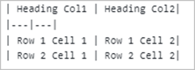
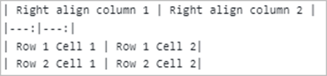
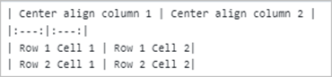

# Markdown to Word Conversion

Markdown is a lightweight markup language that adds formatting elements to plain text documents. The .NET Word (DocIO) library supports to convert Markdown to Word document and vice versa, which mostly follows the CommonMark specification and GitHub-flavored syntax.

## Convert Markdown to Word document

Convert an existing markdown file to Word document (DOC, DOCX and RTF) using the .NET Word (DocIO) library.

The following code example shows how to convert Markdown to Word document.



//Open an existing Markdown file.
using (WordDocument document = new WordDocument("Input.md", FormatType.Markdown))
{
    //Save as a Word document.
    document.Save("MarkdownToWord.docx", FormatType.Docx);
}



'Open an existing Markdown file.
Using document As WordDocument = New WordDocument("Input.md", FormatType.Markdown)
    'Save as a Word document.
    document.Save("MarkdownToWord.docx", FormatType.Docx)
End Using



//Open the file as a Stream.
using (Stream docStream = typeof(App).GetTypeInfo().Assembly.GetManifestResourceStream("Sample.Assets.Input.md"))
{
    //Load the file stream into a Markdown file.
    using (WordDocument document = new WordDocument(docStream, FormatType.Markdown))
    {
        //Save as a Word document into the MemoryStream.
        MemoryStream stream = new MemoryStream();
        await document.SaveAsync(stream, FormatType.Docx);
        //Save the stream as a Word document in the local machine.
        Save(stream, "MarkdownToWord.docx");
    }
//Please refer to the following link to save the Word document in UWP platform
//https://help.syncfusion.com/file-formats/docio/create-word-document-in-uwp#save-word-document-in-uwp
}



//Open the file as a Stream.
using (FileStream docStream = new FileStream("Input.md", FileMode.Open, FileAccess.Read))
{
    //Load the file stream into a Markdown file.
    using (WordDocument document = new WordDocument(docStream, FormatType.Markdown))
    {
        //Save as a Word document into the MemoryStream.
        MemoryStream outputStream = new MemoryStream();
        document.Save(outputStream, FormatType.Docx);
        outputStream.Position = 0;
        //Download the Word document in the browser.
        return File(outputStream, "application/msword", "MarkdownToWord.docx");
    } 
}



//Open the file as a Stream.
using (Stream docStream = typeof(App).GetTypeInfo().Assembly.GetManifestResourceStream("Sample.Assets.Input.md"))
{
    //Load the file stream into a Markdown file.
    using (WordDocument document = new WordDocument(docStream, FormatType.Markdown))
    {
        //Save as a Word document into the MemoryStream.
        MemoryStream outputStream = new MemoryStream();
        document.Save(outputStream, FormatType.Docx);
        //Save the stream as a file in the device and invoke it for viewing. 
        Xamarin.Forms.DependencyService.Get<ISave>().SaveAndView("MarkdownToWord.docx", "application/msword", outputStream);
    }
//Please download the helper files from the following link to save the stream as a file and open the file for viewing in the Xamarin platform.
//https://help.syncfusion.com/file-formats/docio/create-word-document-in-xamarin#helper-files-for-xamarin
}



T> You can also save the markdown file as [HTML](https://help.syncfusion.com/file-formats/docio/html), [PDF](https://help.syncfusion.com/file-formats/docio/word-to-pdf) and [Image](https://help.syncfusion.com/file-formats/docio/word-to-image).

## Customize image data

The .NET Word (DocIO) library provides an MdImageNodeVisited event, which is used to customize image data while importing Markdown file. You can implement the logic to customize the image data by using this MdImageNodeVisited event.

The following code example shows how to load image data based on image source path when importing the Markdown files.



//Create a Word document instance.
using (WordDocument document = new WordDocument())
{
    //Hook the event to customize the image while importing Markdown.
    document.MdImportSettings.ImageNodeVisited += MdImportSettings_ImageNodeVisited;
    //Open the Markdown file.
    document.Open("Input.md");
    //Save as a Word document.
    document.Save("Sample.docx");
}



'Create a Word document instance.
Using document As WordDocument = New WordDocument()
    'Hook the event to customize the image while importing Markdown.
    document.MdImportSettings.ImageNodeVisited += MdImportSettings_ImageNodeVisited
    'Open the Markdown file.
    document.Open("Input.md")
    'Save as a Word document.
    document.Save("Sample.docx")
End Using



//Create a Word document instance.
using (WordDocument document = new WordDocument())
{
    //Hook the event to customize the image while importing Markdown.
    document.MdImportSettings.ImageNodeVisited += MdImportSettings_ImageNodeVisited;
    //Open the Markdown file.
    document.Open("Input.md");

    //Save as a Word document to the MemoryStream.
    MemoryStream stream = new MemoryStream();
    await document.SaveAsync(stream, FormatType.Docx);
    //Save the stream as a Word document in local machine.
    Save(stream, "Sample.docx");
    //Please refer to the following link to save the Word document in UWP platform
    //https://help.syncfusion.com/file-formats/docio/create-word-document-in-uwp#save-word-document-in-uwp
}



//Create a Word document instance.
using (WordDocument document = new WordDocument())
{
    //Hook the event to customize the image while importing Markdown.
    document.MdImportSettings.ImageNodeVisited += MdImportSettings_ImageNodeVisited;
    //Open the Markdown file.
    document.Open("Input.md");

    //Save as a Word document to the MemoryStream.
    MemoryStream outputStream = new MemoryStream();
    document.Save(outputStream, FormatType.Docx);
    outputStream.Position = 0;
    //Download as a Word document in the browser.
    return File(outputStream, "application/msword", "Sample.docx");
}



//Create a Word document instance.
using (WordDocument document = new WordDocument())
{
    //Hook the event to customize the image while importing Markdown.
    document.MdImportSettings.ImageNodeVisited += MdImportSettings_ImageNodeVisited;
    //Open the Markdown file.
    document.Open("Input.md");

    //Save as a Word document to the MemoryStream.
    MemoryStream outputStream = new MemoryStream();
    document.Save(outputStream, FormatType.Docx);
    //Save the stream as a file in the device and invoke it for viewing. 
    Xamarin.Forms.DependencyService.Get<ISave>().SaveAndView("Sample.docx", "application/msword", outputStream);
    //Please download the helper files from the following link to save the stream as a file and open the file for viewing in Xamarin platform
    //https://help.syncfusion.com/file-formats/docio/create-word-document-in-xamarin#helper-files-for-xamarin
}



The following code examples show the event handler to customize the image based on source path.



private static void MdImportSettings_ImageNodeVisited(object sender, Syncfusion.Office.Markdown.MdImageNodeVisitedEventArgs args)
{
    //Set the image stream based on the image name from the input Markdown.
    if (args.Uri == "Image_1.png")
        args.ImageStream = new FileStream("Image_1.png", FileMode.Open);
    else if (args.Uri == "Image_2.png")
        args.ImageStream = new FileStream("Image_2.png", FileMode.Open);
    //Retrive the image from the website and use it.
    else if (args.Uri.StartsWith("https://"))
    {
        WebClient client = new WebClient();
        //Download the image as a stream.
        byte[] image = client.DownloadData(args.Uri);
        Stream stream = new MemoryStream(image);
        //Set the retrieved image from the input Markdown.
        args.ImageStream = stream;
    }
}



Private Shared Sub MdImportSettings_ImageNodeVisited(ByVal sender As Object, ByVal args As Syncfusion.Office.Markdown.MdImageNodeVisitedEventArgs)
    'Set the image stream based on the image name from the input Markdown.
    If args.Uri Is "Image_1.png" Then
        args.ImageStream = New FileStream("Image_1.png", FileMode.Open)
    ElseIf args.Uri Is "Image_2.png" Then
        args.ImageStream = New FileStream("Image_2.png", FileMode.Open)
    'Retrive the image from website and use it.
    ElseIf args.Uri.StartsWith("https://") Then
        Dim client As WebClient = New WebClient()
        'Download the image as a stream.
        Dim image As Byte() = client.DownloadData(args.Uri)
        Dim stream As Stream = New MemoryStream(image)
        'Set the retrieved image from the input Markdown.
        args.ImageStream = stream
    End If
End Sub



private static void MdImportSettings_ImageNodeVisited(object sender, Syncfusion.Office.Markdown.MdImageNodeVisitedEventArgs args)
{
    //Set the image stream based on the image name from the input Markdown.
    if (args.Uri == "Image_1.png")
    {
        Assembly assembly = typeof(App).GetTypeInfo().Assembly;
        args.ImageStream = assembly.GetManifestResourceStream("Customize_image.Assets.Image_1.png");
    }
    else if (args.Uri == "Image_2.png") 
    {
        Assembly assembly = typeof(App).GetTypeInfo().Assembly;
        args.ImageStream = assembly.GetManifestResourceStream("Customize_image.Assets.Image_2.png");
    }
    //Retrive the image from the website and use it.
    else if (args.Uri.StartsWith("https://"))
    {
        WebClient client = new WebClient();
        //Download the image as a stream.
        byte[] image = client.DownloadData(args.Uri);
        Stream stream = new MemoryStream(image);
        //Set the retrieved image from the input Markdown.
        args.ImageStream = stream;
    }
}



private static void MdImportSettings_ImageNodeVisited(object sender, Syncfusion.Office.Markdown.MdImageNodeVisitedEventArgs args)
{
    //Set the image stream based on the image name from the input Markdown.
    if (args.Uri == "Image_1.png")
        args.ImageStream = new FileStream("Image_1.png", FileMode.Open);
    else if (args.Uri == "Image_2.png")
        args.ImageStream = new FileStream("Image_2.png", FileMode.Open);
    //Retrive the image from the website and use it.
    else if (args.Uri.StartsWith("https://"))
    {
        WebClient client = new WebClient();
        //Download the image as a stream.
        byte[] image = client.DownloadData(args.Uri);
        Stream stream = new MemoryStream(image);
        //Set the retrieved image from the input Markdown.
        args.ImageStream = stream;
    }
}



private static void MdImportSettings_ImageNodeVisited(object sender, Syncfusion.Office.Markdown.MdImageNodeVisitedEventArgs args)
{
    //Set the image stream based on the image name from the input Markdown.
    if (args.Uri == "Image_1.png")
    {
        Assembly assembly = typeof(App).GetTypeInfo().Assembly;
        args.ImageStream = assembly.GetManifestResourceStream("Customize_image.Assets.Image_1.png");
    }
    else if (args.Uri == "Image_2.png") 
    {
        Assembly assembly = typeof(App).GetTypeInfo().Assembly;
        args.ImageStream = assembly.GetManifestResourceStream("Customize_image.Assets.Image_2.png");
    }
    //Retrive the image from the website and use it.
    else if (args.Uri.StartsWith("https://"))
    {
        WebClient client = new WebClient();
        //Download the image as a stream.
        byte[] image = client.DownloadData(args.Uri);
        Stream stream = new MemoryStream(image);
        //Set the retrieved image from the input Markdown.
        args.ImageStream = stream;
    }
}



N> Hook the event handler before opening Word document as per above code example.

## Supported Markdown Syntax

<table style="width: 85.7072%;">
<tbody>
<tr>
<td style="width: 16%;">
<p><strong>Element</strong></p>
</td>
<td style="width: 26%;">
<p><strong>Syntax</strong></p>
</td>
<td style="width: 41.7072%;">
<p><strong>Description</strong></p>
</td>
</tr>
<tr>
<td style="width: 16%;">
<p>Bold</p>
</td>
<td style="width: 26%;">
<p>Sample content for **bold text**.</p>
</td>
<td style="width: 41.7072%;">
<p>For bold, add ** to front and back of the text.</p>
</td>
</tr>
<tr>
<td style="width: 16%;">
<p>Italic</p>
</td>
<td style="width: 26%;">
<p>Sample content for *Italic text*.</p>
</td>
<td style="width: 41.7072%;">
<p>For Italic, add * to front and back of the text.</p>
</td>
</tr>
<tr>
<td style="width: 16%;">
<p>Bold and Italics</p>
</td>
<td style="width: 26%;">
<p>Sample content for ***bold and Italic text***.</p>
</td>
<td style="width: 41.7072%;">
<p>For bold and Italics, add *** to the front and back of the text.</p>
</td>
</tr>
<tr>
<td style="width: 16%;">
<p>Strikethrough</p>
</td>
<td style="width: 26%;">
<p>Sample content for ~~strike through text~~.</p>
</td>
<td style="width: 41.7072%;">
<p>For strike through, add ~~ to front and back of the text.</p>
</td>
</tr>
<tr>
<td style="width: 16%;">
<p>Subscript</p>
</td>
<td style="width: 26%;">
<p>&lt;sub&gt;Subscript text&lt;/sub&gt;</p>
</td>
<td style="width: 41.7072%;">
<p>For subscript, add &lt;sub&gt; to the front and &lt;/sub&gt; to the back of the text.</p>
</td>
</tr>
<tr>
<td style="width: 16%;">
<p>Superscript</p>
</td>
<td style="width: 26%;">
<p>&lt;sup&gt;Superscript text&lt;/sup&gt;</p>
</td>
<td style="width: 41.7072%;">
<p>For superscript, add &lt;sup&gt; to the front and &lt;/sup&gt; to the back of the text.</p>
</td>
</tr>
<tr>
<td style="width: 16%;">
<p>Heading 1</p>
</td>
<td style="width: 26%;">
<p>#Heading 1 content</p>
</td>
<td style="width: 41.7072%;">
<p>For heading 1, add # to start of the line.</p>
</td>
</tr>
<tr>
<td style="width: 16%;">
<p>Heading 2</p>
</td>
<td style="width: 26%;">
<p>##Heading 2 content</p>
</td>
<td style="width: 41.7072%;">
<p>For heading 2, add ## to start of the line.</p>
</td>
</tr>
<tr>
<td style="width: 16%;">
<p>Heading 3</p>
</td>
<td style="width: 26%;">
<p>###Heading 3 content</p>
</td>
<td style="width: 41.7072%;">
<p>For heading 3, add ### to start of the line.</p>
</td>
</tr>
<tr>
<td style="width: 16%;">
<p>Heading 4</p>
</td>
<td style="width: 26%;">
<p>####Heading 4 content</p>
</td>
<td style="width: 41.7072%;">
<p>For heading 4, add #### to start of the line.</p>
</td>
</tr>
<tr>
<td style="width: 16%;">
<p>Heading 5</p>
</td>
<td style="width: 26%;">
<p>#####Heading 5 content</p>
</td>
<td style="width: 41.7072%;">
<p>For heading 5, add ##### to start of the line.</p>
</td>
</tr>
<tr>
<td style="width: 16%;">
<p>Heading 6</p>
</td>
<td style="width: 26%;">
<p>######Heading 6 content</p>
</td>
<td style="width: 41.7072%;">
<p>For heading 6, add ###### to start of the line.</p>
</td>
</tr>
<tr>
<td style="width: 16%;">
<p>Blockquotes</p>
</td>
<td style="width: 26%;">
<p>&gt;Blockquotes text</p>
</td>
<td style="width: 41.7072%;">
<p>For blockquotes, add&gt;to start of the line.</p>
</td>
</tr>
<tr>
<td style="width: 16%;">
<p>Code span</p>
</td>
<td style="width: 26%;">
<p>`Code span text`</p>
</td>
<td style="width: 41.7072%;">
<p>For code span, add ` to front and back of the text.</p>
</td>
</tr>
<tr>
<td style="width: 16%;">
<p>Indented code block</p>
</td>
<td style="width: 26%;">
<p>4 spaces</p>
</td>
<td style="width: 41.7072%;">
<p>For indented code block, add 4 spaces at the beginning of line.</p>
</td>
</tr>
<tr>
<td style="width: 16%;">
<p>Fenced code block</p>
</td>
<td style="width: 26%;">
<p>```<br /> Multi line code text<br /> Multi line code text<br /> ```</p>
</td>
<td style="width: 41.7072%;">
<p>For fenced code block, add ``` in the new line before and after the content.</p>
</td>
</tr>
<tr>
<td style="width: 16%;">
<p>Ordered List</p>
</td>
<td style="width: 26%;">
<p>1. First</p>
<p>2. Second</p>
</td>
<td style="width: 41.7072%;">
<p>For ordered list, preceding the text with 1. (number with dot and one space)</p>
</td>
</tr>
<tr>
<td style="width: 16%;">
<p>Unordered List</p>
</td>
<td style="width: 26%;">
<p>- First<br /> - second</p>
</td>
<td style="width: 41.7072%;">
<p>For unordered list, preceding the text with &ndash; (hyphen and space).</p>
</td>
</tr>
<tr>
<td style="width: 16%;">
<p>Links</p>
</td>
<td style="width: 26%;">
<p>Link text without title text :<br /> [Link text](URL)<br /> Link text with title text :<br /> [Link text](URL , &ldquo;title text&rdquo;)</p>
</td>
<td style="width: 41.7072%;">
<p>For hyperlink, enclose the link text within the brackets [ ], and then enclose the URL as first parameter and title as second parameter within the parentheses().<br /> <strong>Note:</strong>The title text is optional.</p>
</td>
</tr>
<tr>
<td style="width: 16%;">
<p>Table</p>
</td>
<td style="width: 26%;"></td>
<td style="width: 41.7072%;">
<p>Create a table using the pipes and underscores as given in the syntax to create 2 x 2 table.</p>
<p></p>
<p>You can also set column alignments using the syntax below, default it is left aligned.</p>
<p>Right alignment:<br /> <br /> Center alignment:</p>
</td>
</tr>
<tr>
<td style="width: 16%;">
<p>Horizontal Line</p>
</td>
<td style="width: 26%;">
<p>--- (three hyphen characters)</p>
</td>
<td style="width: 41.7072%;">
<p>For horizontal line, add --- (three hyphens) in a new line.</p>
</td>
</tr>
<tr>
<td style="width: 16%;">
<p>Image</p>
</td>
<td style="width: 26%;">
<p></p>
</td>
<td style="width: 41.7072%;">
<p>For image, enclose an alternative text within the brackets [], and then link of the image source within parentheses ().</p>
<p>If URL path is base64string, then it will be preserved properly in Word document. Otherwise, you can also set image from stream while opening Markdown file.</p>
</td>
</tr>
<tr>
<td style="width: 16%;">
<p>Escape Character</p>
</td>
<td style="width: 26%;">
<p>\(any syntax)</p>
</td>
<td style="width: 41.7072%;">
<p>Escape any markdown syntax by adding \ as prefix to the syntax.<br /> Example:<br /> \**non-bold text**</p>
</td>
</tr>
</tbody>
</table>
