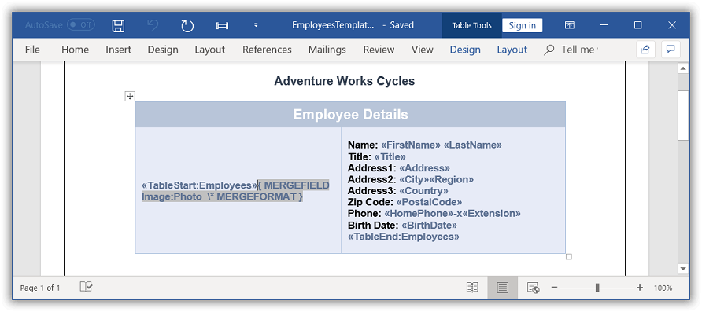

# Mail merge for a group

You can perform Mail merge and append multiple records from data source within a specified region to a template document. The region between start and end groups merge fields. It gets repeated for every record from the data source.

## Create template for group mail merge

The region where the Mail merge operations are to be performed must be marked by two merge fields with the following names.

  * «TableStart:TableName» and «BeginGroup:GroupName» - For the entry point of the region.
  
  * «TableEnd:TableName» and «EndGroup:GroupName» - For the end point of the region.
  
  1.*TableStart* and *TableEnd* region is preferred for performing Mail merge inside the table cell.  
  2.*BeginGroup* and *EndGroup* region is preferred for performing Mail merge inside the document body contents.
  
For example, consider that you have a template document as shown.

In this template, Employees is the group name and the same name should be used while performing Mail merge through code. There are two special merge fields “TableStart:Employees” and “TableEnd:Employees” to denote the start and end of the Mail merge group.

## Execute group mail merge

The `MailMerge` class provides various overloads for `ExecuteGroup` method to perform Mail merge within a group from various data sources. 

The following code example shows how to perform Mail merge in the specific region with **data source retrieved from SQL connection**.

 


WordDocument document = new WordDocument("EmployeesTemplate.docx");
//Gets the data table 
DataTable table = GetDataTable();
//Executes Mail Merge with groups
document.MailMerge.ExecuteGroup(table);
//Saves and closes the WordDocument instance
document.Save("Result.docx");
document.Close();



Dim document As New WordDocument("EmployeesTemplate.docx")
'Gets the data table
Dim table As DataTable = GetDataTable()
'Executes Mail Merge with groups
document.MailMerge.ExecuteGroup(table)
'Saves and closes the WordDocument instance
document.Save("Result.docx")
document.Close()



//SqlCeConnection is supported in .NET Framework alone.



//SqlCeConnection is supported in .NET Framework alone.



//SqlCeConnection is supported in .NET Framework alone.


  

The following code example shows GetDataTable method which is used to get data for mail merge.

  


private DataTable GetDataTable()
{
    DataSet dataset = new DataSet();
    SqlCeConnection conn = new SqlCeConnection("Data Source = " + datasourceName);
    conn.Open();
    SqlCeDataAdapter adapter = new SqlCeDataAdapter("Select TOP(5) * from EmployeesReport", conn);
    adapter.Fill(dataset);
    adapter.Dispose();
    conn.Close();
    System.Data.DataTable table = dataset.Tables[0];
    //Sets table name as Employees for template merge field reference.
    table.TableName = "Employees";
    return table;
}



Private Function GetDataTable() As DataTable
	Dim dataset As DataSet = New DataSet
	Dim conn As New SqlCeConnection("Data Source = " + datasourceName)
	conn.Open()
	Dim adapter As New SqlCeDataAdapter("Select TOP(5) * from EmployeesReport", conn)
	adapter.Fill(DataSet)
	adapter.Dispose()
	conn.Close()
	Dim table As System.Data.DataTable = DataSet.Tables(0)
	'Sets table name as Employees for template merge field reference.
	table.TableName = "Employees"
	Return table
End Function



//SqlCeConnection is supported in .NET Framework alone.



//SqlCeConnection is supported in .NET Framework alone.



//SqlCeConnection is supported in .NET Framework alone.


  

You can download a complete working sample from [GitHub](https://github.com/SyncfusionExamples/DocIO-Examples/tree/main/Mail-Merge/Mail-merge-for-group).

The resultant document looks as follows.

## Mail merge with .NET objects

You can perform Mail merge with .NET objects in a template document. The following code snippet shows how to perform Mail merge with business objects.

 


//Opens the template document
WordDocument document = new WordDocument(@"Template.docx");
//Gets the employee details as “IEnumerable” collection
List<Employee> employeeList = GetEmployees();
//Creates an instance of “MailMergeDataTable” by specifying mail merge group name and “IEnumerable” collection
MailMergeDataTable dataTable = new MailMergeDataTable("Employees", employeeList);
//Performs Mail merge
document.MailMerge.ExecuteGroup(dataTable);
//Saves and closes the Word document instance
document.Save("Result.docx");
document.Close();



'Opens the template document
Dim document As New WordDocument("Template.docx")
'Gets the employee details as “IEnumerable” collection
Dim employeeList As List(Of Employee) = GetEmployees()
'Creates an instance of “MailMergeDataTable” by specifying mail merge group name and “IEnumerable” collection
Dim dataTable As New MailMergeDataTable("Employees", employeeList)
'Performs Mail merge
document.MailMerge.ExecuteGroup(dataTable)
'Saves and closes the Word document instance
document.Save("Result.docx")
document.Close()



//Creates an instance of a WordDocument
Assembly assembly = typeof(App).GetTypeInfo().Assembly;
WordDocument document = new WordDocument();
document.Open(assembly.GetManifestResourceStream("Sample.Assets.Template.docx"), FormatType.Docx);
//Gets the employee details as “IEnumerable” collection
List<Employee> employeeList = GetEmployees();
//Creates an instance of “MailMergeDataTable” by specifying mail merge group name and “IEnumerable” collection
MailMergeDataTable dataTable = new MailMergeDataTable("Employees", employeeList);
//Uses the mail merge events handler for image fields
document.MailMerge.MergeImageField += new MergeImageFieldEventHandler(MergeField_Image);
//Performs Mail merge
document.MailMerge.ExecuteGroup(dataTable);
//Saves the Word file to MemoryStream
MemoryStream stream = new MemoryStream();
await document.SaveAsync(stream, FormatType.Docx);
document.Close();
//Saves the stream as Word file in local machine
Save(stream, "Sample.docx");

//Refer to the following link to save Word document in UWP platform.
//https://help.syncfusion.com/file-formats/docio/create-word-document-in-uwp#save-word-document-in-uwp

private void MergeField_Image(object sender, MergeImageFieldEventArgs args)
{
	//Binds image from file system during mail merge
	if (args.FieldName == "Photo")
	{
		string ProductFileName = args.FieldValue.ToString();
		//Gets the image from file system
		 Assembly assembly = typeof(App).GetTypeInfo().Assembly;
		 Stream imageStream = assembly.GetManifestResourceStream("Sample.Assets." + ProductFileName);
		 args.ImageStream = imageStream;
	}
}



//Opens the template document
FileStream fileStreamPath = new FileStream(@"Template.docx", FileMode.Open, FileAccess.Read, FileShare.ReadWrite);
WordDocument document = new WordDocument(fileStreamPath, FormatType.Docx);
//Gets the employee details as “IEnumerable” collection
List<Employee> employeeList = GetEmployees();
//Creates an instance of “MailMergeDataTable” by specifying mail merge group name and “IEnumerable” collection
MailMergeDataTable dataTable = new MailMergeDataTable("Employees", employeeList);
//Performs Mail merge
document.MailMerge.ExecuteGroup(dataTable);
//Saves the Word document to MemoryStream
MemoryStream stream = new MemoryStream();
document.Save(stream, FormatType.Docx);
//Closes the Word document
document.Close();
stream.Position = 0;
//Download Word document in the browser
return File(stream, "application/msword", "Result.docx");
 


//Opens the template document
Assembly assembly = typeof(App).GetTypeInfo().Assembly;
WordDocument document = new WordDocument(assembly.GetManifestResourceStream("Sample.Data.Template.docx"), FormatType.Docx);
//Gets the employee details as “IEnumerable” collection
List<Employee> employeeList = GetEmployees();
//Creates an instance of “MailMergeDataTable” by specifying mail merge group name and “IEnumerable” collection
MailMergeDataTable dataTable = new MailMergeDataTable("Employees", employeeList);
//Uses the mail merge events handler for image fields
document.MailMerge.MergeImageField += new MergeImageFieldEventHandler(MergeField_Image);
//Performs Mail merge
document.MailMerge.ExecuteGroup(dataTable);
//Saves the Word file to MemoryStream
MemoryStream stream = new MemoryStream();
document.Save(stream, FormatType.Docx);
//Closes the document 
document.Close();
//Save the stream as a file in the device and invoke it for viewing
Xamarin.Forms.DependencyService.Get<ISave>().SaveAndView("Sample.docx", "application/msword", stream);

//Download the helper files from the following link to save the stream as file and open the file for viewing in Xamarin platform.
//https://help.syncfusion.com/file-formats/docio/create-word-document-in-xamarin#helper-files-for-xamarin

private void MergeField_Image(object sender, MergeImageFieldEventArgs args)
{
	//Binds image from file system during mail merge
	if (args.FieldName == "Photo")
	{
		string ProductFileName = args.FieldValue.ToString();
		//Gets the image from file system
		 Assembly assembly = typeof(App).GetTypeInfo().Assembly;
		 Stream imageStream = assembly.GetManifestResourceStream("Sample.Data." + ProductFileName);
		 args.ImageStream = imageStream;
	}
}


  

The following code example shows GetEmployees method which is used to get data for mail merge.

  


public List<Employee> GetEmployees()
{
	List<Employee> employees = new List<Employee>();
	employees.Add(new Employee("Andy", "Bernard", "Sales Representative", "505 - 20th Ave. E. Apt. 2A,", "Seattle", "WA", "USA", "Andy.png"));
	employees.Add(new Employee("Andrew", "Fuller", "Vice President, Sales", "908 W. Capital Way", "Tacoma", "WA", "USA", "Andrew.png"));
	employees.Add(new Employee("Stanley", "Hudson", "Sales Representative", "722 Moss Bay Blvd.", "Kirkland", "WA", "USA", "Stanley.png"));
	employees.Add(new Employee("Margaret", "Peacock", "Sales Representative", "4110 Old Redmond Rd.", "Redmond", "WA", "USA", "Margaret.png"));
	employees.Add(new Employee("Steven", "Buchanan", "Sales Manager", "14 Garrett Hill", "London", string.Empty, "UK", "Steven.png"));
	return employees;
}




Public Function GetEmployees() As List(Of Employee)
	Dim employees As New List(Of Employee)()
	employees.Add(New Employee("Andy", "Bernard", "Sales Representative", "505 - 20th Ave. E. Apt. 2A,", "Seattle", "WA", "USA", "Andy.png"))
	employees.Add(New Employee("Andrew", "Fuller", "Vice President, Sales", "908 W. Capital Way", "Tacoma", "WA", "USA", "Andrew.png"))
	employees.Add(New Employee("Stanley", "Hudson", "Sales Representative", "722 Moss Bay Blvd.", "Kirkland", "WA", "USA", "Stanley.png"))
	employees.Add(New Employee("Margaret", "Peacock", "Sales Representative", "4110 Old Redmond Rd.", "Redmond", "WA", "USA", "Margaret.png"))
	employees.Add(New Employee("Steven", "Buchanan", "Sales Manager", "14 Garrett Hill", "London", String.Empty, "UK", "Steven.png"))
	Return employees
End Function
 


public List<Employee> GetEmployees()
{
	List<Employee> employees = new List<Employee>();
	employees.Add(new Employee("Andy", "Bernard", "Sales Representative", "505 - 20th Ave. E. Apt. 2A,", "Seattle", "WA", "USA", "Andy.png"));
	employees.Add(new Employee("Andrew", "Fuller", "Vice President, Sales", "908 W. Capital Way", "Tacoma", "WA", "USA", "Andrew.png"));
	employees.Add(new Employee("Stanley", "Hudson", "Sales Representative", "722 Moss Bay Blvd.", "Kirkland", "WA", "USA", "Stanley.png"));
	employees.Add(new Employee("Margaret", "Peacock", "Sales Representative", "4110 Old Redmond Rd.", "Redmond", "WA", "USA", "Margaret.png"));
	employees.Add(new Employee("Steven", "Buchanan", "Sales Manager", "14 Garrett Hill", "London", string.Empty, "UK", "Steven.png"));
	return employees;
}



public List<Employee> GetEmployees()
{
	List<Employee> employees = new List<Employee>();
	employees.Add(new Employee("Andy", "Bernard", "Sales Representative", "505 - 20th Ave. E. Apt. 2A,", "Seattle", "WA", "USA", "Andy.png"));
	employees.Add(new Employee("Andrew", "Fuller", "Vice President, Sales", "908 W. Capital Way", "Tacoma", "WA", "USA", "Andrew.png"));
	employees.Add(new Employee("Stanley", "Hudson", "Sales Representative", "722 Moss Bay Blvd.", "Kirkland", "WA", "USA", "Stanley.png"));
	employees.Add(new Employee("Margaret", "Peacock", "Sales Representative", "4110 Old Redmond Rd.", "Redmond", "WA", "USA", "Margaret.png"));
	employees.Add(new Employee("Steven", "Buchanan", "Sales Manager", "14 Garrett Hill", "London", string.Empty, "UK", "Steven.png"));
	return employees;
}



public List<Employee> GetEmployees()
{
	List<Employee> employees = new List<Employee>();
	employees.Add(new Employee("Andy", "Bernard", "Sales Representative", "505 - 20th Ave. E. Apt. 2A,", "Seattle", "WA", "USA", "Andy.png"));
	employees.Add(new Employee("Andrew", "Fuller", "Vice President, Sales", "908 W. Capital Way", "Tacoma", "WA", "USA", "Andrew.png"));
	employees.Add(new Employee("Stanley", "Hudson", "Sales Representative", "722 Moss Bay Blvd.", "Kirkland", "WA", "USA", "Stanley.png"));
	employees.Add(new Employee("Margaret", "Peacock", "Sales Representative", "4110 Old Redmond Rd.", "Redmond", "WA", "USA", "Margaret.png"));
	employees.Add(new Employee("Steven", "Buchanan", "Sales Manager", "14 Garrett Hill", "London", string.Empty, "UK", "Steven.png"));
	return employees;
}


  

The following code example shows the Employee class.

  

public class Employee
{
    public string FirstName { get; set; }
    public string LastName { get; set; }
    public string Address { get; set; }
    public string City { get; set; }
    public string Region { get; set; }
    public string Country { get; set; }
    public string Title { get; set; }
    public Image Photo { get; set; }
    public Employee(string firstName, string lastName, string title, string address, string city, string region, string country, string photoFilePath)
    {
        FirstName = firstName;
        LastName = lastName;
        Title = title;
        Address = address;
        City = city;
        Region = region;
        Country = country;
        Photo = Image.FromFile(photoFilePath);
    }
}



Public Class Employee
	Public Property FirstName() As String
		Get
			Return m_FirstName
		End Get
		Set(value As String)
			m_FirstName = value
		End Set
	End Property
	Private m_FirstName As String
	Public Property LastName() As String
		Get
			Return m_LastName
		End Get
		Set(value As String)
			m_LastName = value
		End Set
	End Property
	Private m_LastName As String
	Public Property Address() As String
		Get
			Return m_Address
		End Get
		Set(value As String)
			m_Address = value
		End Set
	End Property
	Private m_Address As String
	Public Property City() As String
		Get
			Return m_City
		End Get
		Set(value As String)
			m_City = value
		End Set
	End Property
	Private m_City As String
	Public Property Region() As String
		Get
			Return m_Region
		End Get
		Set(value As String)
			m_Region = value
		End Set
	End Property
	Private m_Region As String
	Public Property Country() As String
		Get
			Return m_Country
		End Get
		Set(value As String)
			m_Country = value
		End Set
	End Property
	Private m_Country As String
	Public Property Title() As String
		Get
			Return m_Title
		End Get
		Set(value As String)
			m_Title = value
		End Set
	End Property
	Private m_Title As String
	Public Property Photo() As Image
		Get
			Return m_Photo
		End Get
		Set(value As Image)
			m_Photo = value
		End Set
	End Property
	Private m_Photo As Image
	Public Sub New(firstName As String, lastName As String, title As String, address As String, city As String, region As String, country As String, photoFilePath As String)
		Me.FirstName = firstName
		Me.LastName = lastName
		Me.Title = title
		Me.Address = address
		Me.City = city
		Me.Region = region
		Me.Country = country
		Me.Photo = Image.FromFile(photoFilePath)
	End Sub
End Class



public class Employee
{
	public string FirstName { get; set; }
	public string LastName { get; set; }
	public string Address { get; set; }
	public string City { get; set; }
	public string Region { get; set; }
	public string Country { get; set; }
	public string Title { get; set; }
	public string Photo { get; set; }
	public Employee(string firstName, string lastName, string title, string address, string city, string region, string country, string photoFileName)
	{
		FirstName = firstName;
		LastName = lastName;
		Title = title;
		Address = address;
		City = city;
		Region = region;
		Country = country;
		Photo = photoFileName;
	}
}



public class Employee
{
    public string FirstName { get; set; }
    public string LastName { get; set; }
    public string Address { get; set; }
    public string City { get; set; }
    public string Region { get; set; }
    public string Country { get; set; }
    public string Title { get; set; }
    public string Photo { get; set; }
    public Employee(string firstName, string lastName, string title, string address, string city, string region, string country, string photoFileName)
    {
        FirstName = firstName;
        LastName = lastName;
        Title = title;
        Address = address;
        City = city;
        Region = region;
        Country = country;
        Photo = photoFileName;
    }
}



public class Employee
{
	public string FirstName { get; set; }
	public string LastName { get; set; }
	public string Address { get; set; }
	public string City { get; set; }
	public string Region { get; set; }
	public string Country { get; set; }
	public string Title { get; set; }
	public string Photo { get; set; }
	public Employee(string firstName, string lastName, string title, string address, string city, string region, string country, string photoFileName)
	{
		FirstName = firstName;
		LastName = lastName;
		Title = title;
		Address = address;
		City = city;
		Region = region;
		Country = country;
		Photo = photoFileName;
	}
}



You can download a complete working sample from [GitHub](https://github.com/SyncfusionExamples/DocIO-Examples/tree/main/Mail-Merge/Mail-merge-with-.NET-objects).