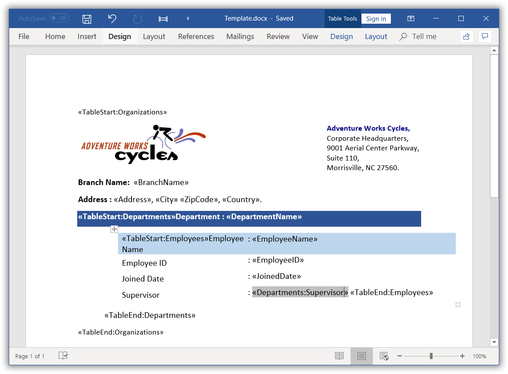
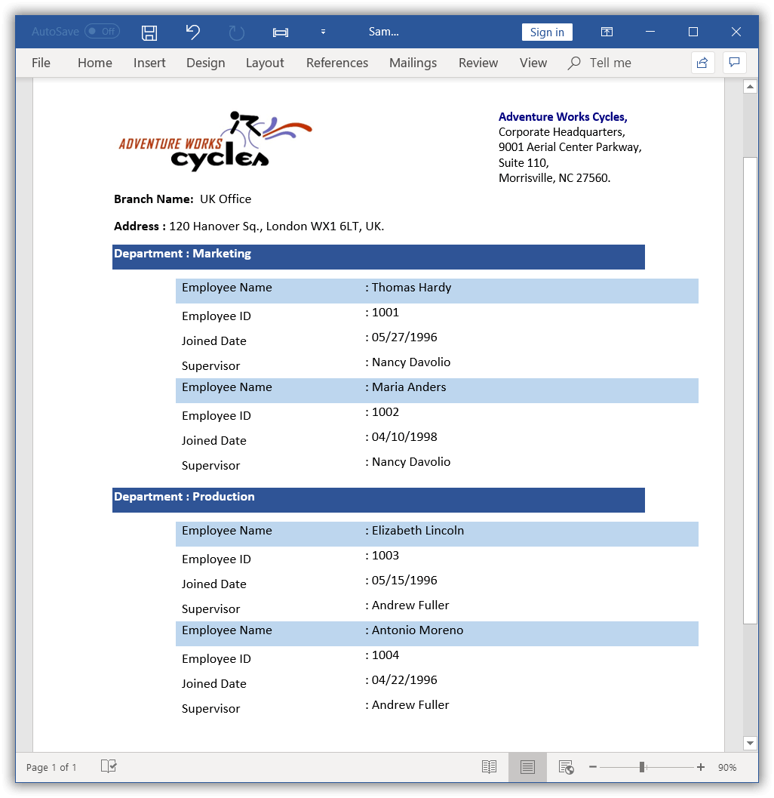

# Nested Mail merge for group

You can perform nested Mail merge with relational or hierarchical data source and independent data tables in a template document.

## Create template for nested group mail merge

Nested Mail merge operation automatically replaces the merge field with immediate group data. You can also predefine the group data that is populated to a merge field. 
  
To execute nested mail merge, design your Word document template as follow.

In this template, Employees is the owner group and it has two child groups Customers and Orders.

## Execute nested group mail merge

The `MailMerge` class provides various overloads for the `ExecuteNestedGroup` method to perform Mail merge for nested groups or regions in the Word document.

You need to define commands with the table name and expression for linking the multiple data tables **(explicit relation data)** during nested Mail merge process. You can use the “%TableName.ColumnName%” expression for getting the current value of specified column or field from the table.

The following code example shows how to perform a nested Mail merge.

  


//Opens the template document 
WordDocument document = new WordDocument("Template.docx");
//Gets the data from the database
OleDbConnection conn = new OleDbConnection("Provider=Microsoft.Jet.OLEDB.4.0;Data Source=" + dataBase);
conn.Open();
//ArrayList contains the list of commands
ArrayList commands = GetCommands();
//Executes the mail merge
document.MailMerge.ExecuteNestedGroup(conn, commands);
//Saves and closes the Word document instance
document.Save("Sample.docx");
document.Close();



'Opens the template document 
Dim document As New WordDocument("Template.docx")
'Gets the data from the database
Dim conn As New OleDbConnection("Provider=Microsoft.Jet.OLEDB.4.0;Data Source=" + dataBase)
conn.Open()
'ArrayList contains the list of commands
Dim commands As ArrayList = GetCommands()
'Executes the mail merge
document.MailMerge.ExecuteNestedGroup(conn, commands)
'Saves and closes the Word document instance
document.Save("Sample.docx")
document.Close()



//OleDbConnection not supported in UWP platform.



//OleDbConnection supported in ASP.NET Core platform from 3.0 Preview 8 only.



//OleDbConnection not supported in Xamarin platform.


  

The following code example shows GetCommands method which is used to get data for mail merge.



private ArrayList GetCommands()
{
	//ArrayList contains the list of commands
	ArrayList commands = new ArrayList();
	//DictionaryEntry contains "Source table" (key) and "Command" (value)
	DictionaryEntry entry = new DictionaryEntry("Employees", "Select TOP 10 * FROM Employees");
	commands.Add(entry);
	//Retrieves the customer details
	entry = new DictionaryEntry("Customers", "SELECT * FROM Customers WHERE Customers.EmployeeID='%Employees.EmployeeID%'");
	commands.Add(entry);
	//Retrieves the order details
	entry = new DictionaryEntry("Orders", "SELECT * FROM Orders WHERE Orders.CustomerID='%Customers.CustomerID%'");
	commands.Add(entry);
	return commands;
}


Private Function GetCommands() As ArrayList
	'ArrayList contains the list of commands
	Dim commands As New ArrayList()
	'DictionaryEntry contains "Source table" (key) and "Command" (value)
	Dim entry As New DictionaryEntry("Employees", "SELECT TOP 10 * FROM Employees")
	commands.Add(entry)
	'Retrieves the customer details
	entry = New DictionaryEntry("Customers", "SELECT * FROM Customers WHERE Customers.EmployeeID='%Employees.EmployeeID%'")
	commands.Add(entry)
	'Retrieves the order details
	entry = New DictionaryEntry("Orders", "SELECT * FROM Orders WHERE Orders.CustomerID='%Customers.CustomerID%'")
	commands.Add(entry)
	Return commands
End Function


//OleDbConnection not supported in UWP platform.



//OleDbConnection supported in ASP.NET Core platform from 3.0 Preview 8 only.



//OleDbConnection not supported in Xamarin platform.



You can download a complete working sample from [GitHub](https://github.com/SyncfusionExamples/DocIO-Examples/tree/main/Mail-Merge/Mail-merge-for-nested-group).

The resultant document looks as follows.

## Mail merge with dynamic objects

Essential DocIO allows you to perform Mail merge with the dynamic objects. The [ExpandoObject](https://msdn.microsoft.com/en-us/library/system.dynamic.expandoobject(v=vs.110).aspx) is like a collection of key and value pairs, which means IDictionary<string, object>. So, you can also use IDictionary<string, object> collection instead of [ExpandoObject](https://msdn.microsoft.com/en-us/library/system.dynamic.expandoobject(v=vs.110).aspx) to execute mail merge.

The following code snippet shows how to perform the Mail merge with dynamic objects ([ExpandoObject](https://msdn.microsoft.com/en-us/library/system.dynamic.expandoobject(v=vs.110).aspx)).

  


//Opens the template document 
WordDocument document = new WordDocument("Template.docx");
//Creates an instance of the MailMergeDataSet
MailMergeDataSet dataSet = new MailMergeDataSet();
//Creates the mail merge data table in order to perform mail merge
MailMergeDataTable dataTable = new MailMergeDataTable("Customers", GetCustomers());
dataSet.Add(dataTable);
dataTable = new MailMergeDataTable("Orders", GetOrders());
dataSet.Add(dataTable);
List<DictionaryEntry> commands = new List<DictionaryEntry>();
//DictionaryEntry contain "Source table" (key) and "Command" (value)
DictionaryEntry entry = new DictionaryEntry("Customers", string.Empty);
commands.Add(entry);
//Retrieves the customer details
entry = new DictionaryEntry("Orders", "CustomerID = %Customers.CustomerID%");
commands.Add(entry);
//Performs the mail merge operation with the dynamic collection
document.MailMerge.ExecuteNestedGroup(dataSet, commands);
//Saves and closes the Word document instance
document.Save("Sample.docx");
document.Close();



'Opens the template document 
Dim document As New WordDocument("Template.docx")
'Creates an instance of the MailMergeDataSet
Dim dataSet As New MailMergeDataSet()
'Creates the mail merge data table in order to perform mail merge
Dim dataTable As New MailMergeDataTable("Customers", GetCustomers())
dataSet.Add(dataTable)
dataTable = New MailMergeDataTable("Orders", GetOrders())
dataSet.Add(dataTable)
Dim commands As New List(Of DictionaryEntry)()
'DictionaryEntry contain "Source table" (key) and "Command" (value)
Dim entry As New DictionaryEntry("Customers", String.Empty)
commands.Add(entry)
'Retrieves the customer details
entry = New DictionaryEntry("Orders", "CustomerID = %Customers.CustomerID%")
commands.Add(entry)
'Performs the mail merge operation with the dynamic collection
document.MailMerge.ExecuteNestedGroup(dataSet, commands)
'Saves and closes the Word document instance
document.Save("Sample.docx")
document.Close()



Assembly assembly = typeof(App).GetTypeInfo().Assembly;
WordDocument document = new WordDocument();
document.Open(assembly.GetManifestResourceStream("Sample.Assets.Template.docx"), FormatType.Docx);
//Creates an instance of the MailMergeDataSet
MailMergeDataSet dataSet = new MailMergeDataSet();
//Creates the mail merge data table in order to perform mail merge
MailMergeDataTable dataTable = new MailMergeDataTable("Customers", GetCustomers());
dataSet.Add(dataTable);
dataTable = new MailMergeDataTable("Orders", GetOrders());
dataSet.Add(dataTable);
List<DictionaryEntry> commands = new List<DictionaryEntry>();
//DictionaryEntry contain "Source table" (key) and "Command" (value)
DictionaryEntry entry = new DictionaryEntry("Customers", string.Empty);
commands.Add(entry);
//Retrieves the customer details
entry = new DictionaryEntry("Orders", "CustomerID = %Customers.CustomerID%");
commands.Add(entry);
//Performs the mail merge operation with the dynamic collection
document.MailMerge.ExecuteNestedGroup(dataSet, commands);
//Saves the Word file to MemoryStream
MemoryStream stream = new MemoryStream();
await document.SaveAsync(stream, FormatType.Docx);
//Closes the Word document
document.Close();
//Saves the stream as Word file in local machine
Save(stream, "Sample.docx");

//Refer to the following link to save Word document in UWP platform.
//https://help.syncfusion.com/file-formats/docio/create-word-document-in-uwp#save-word-document-in-uwp



//Opens the template document
FileStream fileStreamPath = new FileStream("Template.docx", FileMode.Open, FileAccess.Read, FileShare.ReadWrite);
WordDocument document = new WordDocument(fileStreamPath, FormatType.Docx);
//Creates an instance of the MailMergeDataSet
MailMergeDataSet dataSet = new MailMergeDataSet();
//Creates the mail merge data table in order to perform mail merge
MailMergeDataTable dataTable = new MailMergeDataTable("Customers", GetCustomers());
dataSet.Add(dataTable);
dataTable = new MailMergeDataTable("Orders", GetOrders());
dataSet.Add(dataTable);
List<DictionaryEntry> commands = new List<DictionaryEntry>();
//DictionaryEntry contain "Source table" (key) and "Command" (value)
DictionaryEntry entry = new DictionaryEntry("Customers", string.Empty);
commands.Add(entry);
//Retrieves the customer details
entry = new DictionaryEntry("Orders", "CustomerID = %Customers.CustomerID%");
commands.Add(entry);
//Performs the mail merge operation with the dynamic collection
document.MailMerge.ExecuteNestedGroup(dataSet, commands);
//Saves the Word document to MemoryStream
MemoryStream stream = new MemoryStream();
document.Save(stream, FormatType.Docx);
//Closes the document
document.Close();
stream.Position = 0;
//Download Word document in the browser
return File(stream, "application/msword", "Sample.docx");
 


//Creating dynamic objects using dynamic keyword is not supported in Xamarin.iOS.
//You can use IDictionary<string, object> collection to generate dynamic objects.





The following code example shows GetCustomers and GetOrders methods which are used to get data for mail merge.

  


private List<ExpandoObject> GetCustomers()
{
	List<ExpandoObject> customers = new List<ExpandoObject>();
	customers.Add(GetDynamicCustomer(100, "Robert", "Syncfusion"));
	customers.Add(GetDynamicCustomer(102, "John", "Syncfusion"));
	customers.Add(GetDynamicCustomer(110,"David","Syncfusion"));
	return customers;
}
private List<ExpandoObject> GetOrders()
{
	List<ExpandoObject> orders = new List<ExpandoObject>();
	orders.Add(GetDynamicOrder(1001, "MSWord", 100));
	orders.Add(GetDynamicOrder(1002, "AdobeReader", 100));      
	orders.Add(GetDynamicOrder(1003, "VisualStudio", 102));
	return orders;
}



Private Function GetCustomers() As List(Of ExpandoObject)
	Dim customers As New List(Of ExpandoObject)()
	customers.Add(GetDynamicCustomer(100, "Robert", "Syncfusion"))
	customers.Add(GetDynamicCustomer(102, "John", "Syncfusion"))
	customers.Add(GetDynamicCustomer(110, "David", "Syncfusion"))
	Return customers
End Function
Private Function GetOrders() As List(Of ExpandoObject)
	Dim orders As New List(Of ExpandoObject)()
	orders.Add(GetDynamicOrder(1001, "MSWord", 100))
	orders.Add(GetDynamicOrder(1002, "AdobeReader", 100))
	orders.Add(GetDynamicOrder(1003, "VisualStudio", 102))
	Return orders
End Function




private List<ExpandoObject> GetCustomers()
{
	List<ExpandoObject> customers = new List<ExpandoObject>();
	customers.Add(GetDynamicCustomer(100, "Robert", "Syncfusion"));
	customers.Add(GetDynamicCustomer(102, "John", "Syncfusion"));
	customers.Add(GetDynamicCustomer(110,"David","Syncfusion"));
	return customers;
}
private List<ExpandoObject> GetOrders()
{
	List<ExpandoObject> orders = new List<ExpandoObject>();
	orders.Add(GetDynamicOrder(1001, "MSWord", 100));
	orders.Add(GetDynamicOrder(1002, "AdobeReader", 100));      
	orders.Add(GetDynamicOrder(1003, "VisualStudio", 102));
	return orders;
}




private List<ExpandoObject> GetCustomers()
{
	List<ExpandoObject> customers = new List<ExpandoObject>();
	customers.Add(GetDynamicCustomer(100, "Robert", "Syncfusion"));
	customers.Add(GetDynamicCustomer(102, "John", "Syncfusion"));
	customers.Add(GetDynamicCustomer(110,"David","Syncfusion"));
	return customers;
}
private List<ExpandoObject> GetOrders()
{
	List<ExpandoObject> orders = new List<ExpandoObject>();
	orders.Add(GetDynamicOrder(1001, "MSWord", 100));
	orders.Add(GetDynamicOrder(1002, "AdobeReader", 100));      
	orders.Add(GetDynamicOrder(1003, "VisualStudio", 102));
	return orders;
}

 


//Creating dynamic objects using dynamic keyword is not supported in Xamarin.iOS.
//You can use IDictionary<string, object> collection to generate dynamic objects.




The following code example shows GetDynamicCustomer and GetDynamicOrder methods, which are used to generate dynamic objects for mail merge.

  

private dynamic GetDynamicCustomer(int customerID,string customerName, string companyName)
{
	dynamic dynamicCustomer = new ExpandoObject();
	dynamicCustomer.CustomerID = customerID;
	dynamicCustomer.CustomerName = customerName;
	dynamicCustomer.CompanyName = companyName;
	return dynamicCustomer;
}
private dynamic GetDynamicOrder(int orderID, string orderName, int customerID)
{
	dynamic dynamicOrder = new ExpandoObject();
	dynamicOrder.OrderID = orderID;
	dynamicOrder.OrderName = orderName;
	dynamicOrder.CustomerID = customerID;
	return dynamicOrder;
}



Private Function GetDynamicCustomer(customerID As Integer, customerName As String, companyName As String) As Object
	Dim dynamicCustomer As Object = New ExpandoObject()
	dynamicCustomer.CustomerID = customerID
	dynamicCustomer.CustomerName = customerName
	dynamicCustomer.CompanyName = companyName
	Return dynamicCustomer
End Function
Private Function GetDynamicOrder(orderID As Integer, orderName As String, customerID As Integer) As Object
	Dim dynamicOrder As Object = New ExpandoObject()
	dynamicOrder.OrderID = orderID
	dynamicOrder.OrderName = orderName
	dynamicOrder.CustomerID = customerID
	Return dynamicOrder
End Function



private dynamic GetDynamicCustomer(int customerID,string customerName, string companyName)
{
	dynamic dynamicCustomer = new ExpandoObject();
	dynamicCustomer.CustomerID = customerID;
	dynamicCustomer.CustomerName = customerName;
	dynamicCustomer.CompanyName = companyName;
	return dynamicCustomer;
}
private dynamic GetDynamicOrder(int orderID, string orderName, int customerID)
{
	dynamic dynamicOrder = new ExpandoObject();
	dynamicOrder.OrderID = orderID;
	dynamicOrder.OrderName = orderName;
	dynamicOrder.CustomerID = customerID;
	return dynamicOrder;
}



private dynamic GetDynamicCustomer(int customerID,string customerName, string companyName)
{
	dynamic dynamicCustomer = new ExpandoObject();
	dynamicCustomer.CustomerID = customerID;
	dynamicCustomer.CustomerName = customerName;
	dynamicCustomer.CompanyName = companyName;
	return dynamicCustomer;
}
private dynamic GetDynamicOrder(int orderID, string orderName, int customerID)
{
	dynamic dynamicOrder = new ExpandoObject();
	dynamicOrder.OrderID = orderID;
	dynamicOrder.OrderName = orderName;
	dynamicOrder.CustomerID = customerID;
	return dynamicOrder;
}



//Creating dynamic objects using dynamic keyword is not supported in Xamarin.iOS.
//You can use IDictionary<string, object> collection to generate dynamic objects.



You can download a complete working sample from [GitHub](https://github.com/SyncfusionExamples/DocIO-Examples/tree/main/Mail-Merge/Mail-merge-with-dynamic-objects).

## Mail merge with implicit relational data

You can perform **nested Mail merge with implicit relational data** objects without any explicit relational commands by using the `ExecuteNestedGroup` overload method.

### Map the field of ancestor group

You can also merge any field in the nested group by **mapping the field or column of its ancestor group or table** in the data source. To achieve this, you need to add a corresponding group name or table name as a prefix to the merge field name along with “:” separator.

For example:
  * The merge field name should be like “TableName:Id” (<<TableName:MergeFieldName>>)
  * The merge field name should be like “Image:TableName:Photo” (<<Image:TableName:MergeFieldName>>)
  
For example, consider that you have a template document as follow.

In the above template, Organizations is the owner group and it has two child groups Departments and Employees. The Supervisor merge field of Departments group is used in Employees group.

The following code example shows how to perform nested Mail merge with the implicit relational data objects.



//Opens the template document 
WordDocument document = new WordDocument(@"Template.docx");
//Gets the organization details as “IEnumerable” collection
List<Organization> organizationList = GetOrganizations();
//Creates an instance of “MailMergeDataTable” by specifying mail merge group name and “IEnumerable” collection
MailMergeDataTable dataTable = new MailMergeDataTable("Organizations", organizationList);
//Performs Mail merge
document.MailMerge.ExecuteNestedGroup(dataTable);
//Saves and closes the WordDocument instance
document.Save("Sample.docx");
document.Close();


'Opens the template document 
Dim document As WordDocument = New WordDocument("Template.docx")
'Gets the organization details as “IEnumerable” collection
Dim organizationList As List(Of Organization) = GetOrganizations()
'Creates an instance of “MailMergeDataTable” by specifying mail merge group name and “IEnumerable” collection
Dim dataTable As MailMergeDataTable = New MailMergeDataTable("Organizations", organizationList)
'Performs Mail merge
document.MailMerge.ExecuteNestedGroup(dataTable)
'Saves and closes the WordDocument instance
document.Save("Sample.docx")
document.Close()



Assembly assembly = typeof(App).GetTypeInfo().Assembly;
//Opens the template document
WordDocument document = new WordDocument();
document.Open(assembly.GetManifestResourceStream("Sample.Assets.Template.docx"), FormatType.Docx);
//Gets the organization details as “IEnumerable” collection
List<Organization> organizationList = GetOrganizations();
//Creates an instance of “MailMergeDataTable” by specifying mail merge group name and “IEnumerable” collection
MailMergeDataTable dataTable = new MailMergeDataTable("Organizations", organizationList);
//Performs Mail merge
document.MailMerge.ExecuteNestedGroup(dataTable);
//Saves the Word file to MemoryStream
MemoryStream stream = new MemoryStream();
await document.SaveAsync(stream, FormatType.Docx);
//Closes the Word document
document.Close();
//Saves the stream as Word file in local machine
Save(stream, "Sample.docx");

//Refer to the following link to save Word document in UWP platform.
//https://help.syncfusion.com/file-formats/docio/create-word-document-in-uwp#save-word-document-in-uwp



//Opens the template document 
FileStream fileStreamPath = new FileStream(@"Template.docx", FileMode.Open, FileAccess.Read, FileShare.ReadWrite);
WordDocument document = new WordDocument(fileStreamPath, FormatType.Docx);
//Gets the organization details as “IEnumerable” collection
List<Organization> organizationList = GetOrganizations();
//Creates an instance of “MailMergeDataTable” by specifying mail merge group name and “IEnumerable” collection
MailMergeDataTable dataTable = new MailMergeDataTable("Organizations", organizationList);
//Performs Mail merge
document.MailMerge.ExecuteNestedGroup(dataTable);
//Saves the Word document to MemoryStream
MemoryStream stream = new MemoryStream();
document.Save(stream, FormatType.Docx);
//Closes the document
document.Close();
stream.Position = 0;
//Download Word document in the browser
return File(stream, "application/msword", "Sample.docx");


//Opens the template document
Assembly assembly = typeof(App).GetTypeInfo().Assembly;
WordDocument document = new WordDocument(assembly.GetManifestResourceStream("Sample.Assets.Template.docx"), FormatType.Docx);
//Gets the organization details as “IEnumerable” collection
List<Organization> organizationList = GetOrganizations();
//Creates an instance of “MailMergeDataTable” by specifying mail merge group name and “IEnumerable” collection
MailMergeDataTable dataTable = new MailMergeDataTable("Organizations", organizationList);
//Performs Mail merge
document.MailMerge.ExecuteNestedGroup(dataTable);
//Saves the Word file to MemoryStream
MemoryStream stream = new MemoryStream();
document.Save(stream, FormatType.Docx);
//Closes the document 
document.Close();
//Save the stream as a file in the device and invoke it for viewing
Xamarin.Forms.DependencyService.Get<ISave>().SaveAndView("Sample.docx", "application/msword", stream);

//Download the helper files from the following link to save the stream as file and open the file for viewing in Xamarin platform.
//https://help.syncfusion.com/file-formats/docio/create-word-document-in-xamarin#helper-files-for-xamarin




The following code example shows GetOrganizations method which is used to get data for mail merge.



public static List<Organization> GetOrganizations()
{
    //Creates Employee details
    List<EmployeeDetails> employees = new List<EmployeeDetails>();
    employees.Add(new EmployeeDetails("Thomas Hardy", "1001", "05/27/1996"));
    employees.Add(new EmployeeDetails("Maria Anders", "1002", "04/10/1998")); 
    //Creates Departments details
    List<DepartmentDetails> departments = new List<DepartmentDetails>();
    departments.Add(new DepartmentDetails("Marketing", "Nancy Davolio",  employees));
    
    employees = new List<EmployeeDetails>();
    employees.Add(new EmployeeDetails("Elizabeth Lincoln", "1003", "05/15/1996"));
    employees.Add(new EmployeeDetails("Antonio Moreno", "1004", "04/22/1996"));
    departments.Add(new DepartmentDetails("Production", "Andrew Fuller", employees));
    //Creates organization details
    List<Organization> organizations = new List<Organization>();
    organizations.Add(new Organization("UK Office", "120 Hanover Sq.", "London", "WX1 6LT", "UK", departments));
    return organizations;
}


Public Function GetOrganizations() As List(Of Organization)
    'Creates Employee details
    Dim employees As List(Of EmployeeDetails) = New List(Of EmployeeDetails)
    employees.Add(New EmployeeDetails("Thomas Hardy", "1001", "05/27/1996"))
    employees.Add(New EmployeeDetails("Maria Anders", "1002", "04/10/1998"))
    'Creates Departments details
    Dim departments As List(Of DepartmentDetails) = New List(Of DepartmentDetails)
    departments.Add(New DepartmentDetails("Marketing", "Nancy Davolio", employees))

    employees = New List(Of EmployeeDetails)
    employees.Add(New EmployeeDetails("Elizabeth Lincoln", "1003", "05/15/1996"))
    employees.Add(New EmployeeDetails("Antonio Moreno", "1004", "04/22/1996"))
    departments.Add(New DepartmentDetails("Production", "Andrew Fuller", employees))
    'Creates organization details
    Dim organizations As List(Of Organization) = New List(Of Organization)
    organizations.Add(New Organization("UK Office", "120 Hanover Sq.", "London", "WX1 6LT", "UK", departments))
    Return organizations
End Function



public static List<Organization> GetOrganizations()
{
    //Creates Employee details
    List<EmployeeDetails> employees = new List<EmployeeDetails>();
    employees.Add(new EmployeeDetails("Thomas Hardy", "1001", "05/27/1996"));
    employees.Add(new EmployeeDetails("Maria Anders", "1002", "04/10/1998")); 
    //Creates Departments details
    List<DepartmentDetails> departments = new List<DepartmentDetails>();
    departments.Add(new DepartmentDetails("Marketing", "Nancy Davolio",  employees));
    
    employees = new List<EmployeeDetails>();
    employees.Add(new EmployeeDetails("Elizabeth Lincoln", "1003", "05/15/1996"));
    employees.Add(new EmployeeDetails("Antonio Moreno", "1004", "04/22/1996"));
    departments.Add(new DepartmentDetails("Production", "Andrew Fuller", employees));
    //Creates organization details
    List<Organization> organizations = new List<Organization>();
    organizations.Add(new Organization("UK Office", "120 Hanover Sq.", "London", "WX1 6LT", "UK", departments));
    return organizations;
}


public static List<Organization> GetOrganizations()
{
    //Creates Employee details
    List<EmployeeDetails> employees = new List<EmployeeDetails>();
    employees.Add(new EmployeeDetails("Thomas Hardy", "1001", "05/27/1996"));
    employees.Add(new EmployeeDetails("Maria Anders", "1002", "04/10/1998")); 
    //Creates Departments details
    List<DepartmentDetails> departments = new List<DepartmentDetails>();
    departments.Add(new DepartmentDetails("Marketing", "Nancy Davolio",  employees));
    
    employees = new List<EmployeeDetails>();
    employees.Add(new EmployeeDetails("Elizabeth Lincoln", "1003", "05/15/1996"));
    employees.Add(new EmployeeDetails("Antonio Moreno", "1004", "04/22/1996"));
    departments.Add(new DepartmentDetails("Production", "Andrew Fuller", employees));
    //Creates organization details
    List<Organization> organizations = new List<Organization>();
    organizations.Add(new Organization("UK Office", "120 Hanover Sq.", "London", "WX1 6LT", "UK", departments));
    return organizations;
}


public static List<Organization> GetOrganizations()
{
    //Creates Employee details
    List<EmployeeDetails> employees = new List<EmployeeDetails>();
    employees.Add(new EmployeeDetails("Thomas Hardy", "1001", "05/27/1996"));
    employees.Add(new EmployeeDetails("Maria Anders", "1002", "04/10/1998")); 
    //Creates Departments details
    List<DepartmentDetails> departments = new List<DepartmentDetails>();
    departments.Add(new DepartmentDetails("Marketing", "Nancy Davolio",  employees));
    
    employees = new List<EmployeeDetails>();
    employees.Add(new EmployeeDetails("Elizabeth Lincoln", "1003", "05/15/1996"));
    employees.Add(new EmployeeDetails("Antonio Moreno", "1004", "04/22/1996"));
    departments.Add(new DepartmentDetails("Production", "Andrew Fuller", employees));
    //Creates organization details
    List<Organization> organizations = new List<Organization>();
    organizations.Add(new Organization("UK Office", "120 Hanover Sq.", "London", "WX1 6LT", "UK", departments));
    return organizations;
}



The following code example shows Organization, DepartmentDetails, and EmployeeDetails classes.

  

public class Organization
{
    public string BranchName { get; set; }
    public string Address { get; set; }
    public string City { get; set; }
    public string ZipCode { get; set; }
    public string Country { get; set; }
    public List<DepartmentDetails> Departments { get; set; }
    public Organization(string branchName, string address, string city, string zipcode, string country, List<DepartmentDetails> departments)
    {
        BranchName = branchName;
        Address = address;
        City = city;
        ZipCode = zipcode;
        Country = country;
        Departments = departments;
    }
}

public class DepartmentDetails
{
    public string DepartmentName { get; set; }
    public string Supervisor { get; set; }
    public List<EmployeeDetails> Employees { get; set; }
    public DepartmentDetails(string departmentName, string supervisor, List<EmployeeDetails> employees)
    {
        DepartmentName = departmentName;
        Supervisor = supervisor;
        Employees = employees;
    }
}

public class EmployeeDetails
{
    public string EmployeeName { get; set; }
    public string EmployeeID { get; set; }
    public string JoinedDate { get; set; }
    public EmployeeDetails(string employeeName, string employeeID, string joinedDate)
    {
        EmployeeName = employeeName;
        EmployeeID = employeeID;
        JoinedDate = joinedDate;
    }
}



Public Class Organization
    Public Property BranchName() As String
    Public Property Address() As String
    Public Property City() As String
    Public Property ZipCode() As String
    Public Property Country() As String
    Public Property Departments() As List(Of DepartmentDetails)
    Public Sub New(ByVal branchName As String, ByVal address As String, ByVal city As String, ByVal zipcode As String, ByVal country As String, ByVal departments As List(Of DepartmentDetails))
        Me.BranchName = branchName
        Me.Address = address
        Me.City = city
        Me.ZipCode = zipcode
        Me.Country = country
        Me.Departments = departments
    End Sub
End Class

Public Class DepartmentDetails
    Public Property DepartmentName() As String
    Public Property Supervisor() As String
    Public Property Employees() As List(Of EmployeeDetails)
    Public Sub New(ByVal departmentName As String, ByVal supervisor As String, ByVal employees As List(Of EmployeeDetails))
        Me.DepartmentName = departmentName
        Me.Supervisor = supervisor
        Me.Employees = employees
    End Sub
End Class

Public Class EmployeeDetails
    Public Property EmployeeName() As String
    Public Property EmployeeID() As String
    Public Property JoinedDate() As String
    Public Sub New(ByVal employeeName As String, ByVal employeeID As String, ByVal joinedDate As String)
        Me.EmployeeName = employeeName
        Me.EmployeeID = employeeID
        Me.JoinedDate = joinedDate
    End Sub
End Class



public class Organization
{
    public string BranchName { get; set; }
    public string Address { get; set; }
    public string City { get; set; }
    public string ZipCode { get; set; }
    public string Country { get; set; }
    public List<DepartmentDetails> Departments { get; set; }
    public Organization(string branchName, string address, string city, string zipcode, string country, List<DepartmentDetails> departments)
    {
        BranchName = branchName;
        Address = address;
        City = city;
        ZipCode = zipcode;
        Country = country;
        Departments = departments;
    }
}

public class DepartmentDetails
{
    public string DepartmentName { get; set; }
    public string Supervisor { get; set; }
    public List<EmployeeDetails> Employees { get; set; }
    public DepartmentDetails(string departmentName, string supervisor, List<EmployeeDetails> employees)
    {
        DepartmentName = departmentName;
        Supervisor = supervisor;
        Employees = employees;
    }
}

public class EmployeeDetails
{
    public string EmployeeName { get; set; }
    public string EmployeeID { get; set; }
    public string JoinedDate { get; set; }
    public EmployeeDetails(string employeeName, string employeeID, string joinedDate)
    {
        EmployeeName = employeeName;
        EmployeeID = employeeID;
        JoinedDate = joinedDate;
    }
}



public class Organization
{
    public string BranchName { get; set; }
    public string Address { get; set; }
    public string City { get; set; }
    public string ZipCode { get; set; }
    public string Country { get; set; }
    public List<DepartmentDetails> Departments { get; set; }
    public Organization(string branchName, string address, string city, string zipcode, string country, List<DepartmentDetails> departments)
    {
        BranchName = branchName;
        Address = address;
        City = city;
        ZipCode = zipcode;
        Country = country;
        Departments = departments;
    }
}

public class DepartmentDetails
{
    public string DepartmentName { get; set; }
    public string Supervisor { get; set; }
    public List<EmployeeDetails> Employees { get; set; }
    public DepartmentDetails(string departmentName, string supervisor, List<EmployeeDetails> employees)
    {
        DepartmentName = departmentName;
        Supervisor = supervisor;
        Employees = employees;
    }
}

public class EmployeeDetails
{
    public string EmployeeName { get; set; }
    public string EmployeeID { get; set; }
    public string JoinedDate { get; set; }
    public EmployeeDetails(string employeeName, string employeeID, string joinedDate)
    {
        EmployeeName = employeeName;
        EmployeeID = employeeID;
        JoinedDate = joinedDate;
    }
}



public class Organization
{
    public string BranchName { get; set; }
    public string Address { get; set; }
    public string City { get; set; }
    public string ZipCode { get; set; }
    public string Country { get; set; }
    public List<DepartmentDetails> Departments { get; set; }
    public Organization(string branchName, string address, string city, string zipcode, string country, List<DepartmentDetails> departments)
    {
        BranchName = branchName;
        Address = address;
        City = city;
        ZipCode = zipcode;
        Country = country;
        Departments = departments;
    }
}

public class DepartmentDetails
{
    public string DepartmentName { get; set; }
    public string Supervisor { get; set; }
    public List<EmployeeDetails> Employees { get; set; }
    public DepartmentDetails(string departmentName, string supervisor, List<EmployeeDetails> employees)
    {
        DepartmentName = departmentName;
        Supervisor = supervisor;
        Employees = employees;
    }
}

public class EmployeeDetails
{
    public string EmployeeName { get; set; }
    public string EmployeeID { get; set; }
    public string JoinedDate { get; set; }
    public EmployeeDetails(string employeeName, string employeeID, string joinedDate)
    {
        EmployeeName = employeeName;
        EmployeeID = employeeID;
        JoinedDate = joinedDate;
    }
}



You can download a complete working sample from [GitHub](https://github.com/SyncfusionExamples/DocIO-Examples/tree/main/Mail-Merge/Mail-merge-with-implicit-relational-data).

By executing the above code example, it generates the resultant Word document as follows.
 
